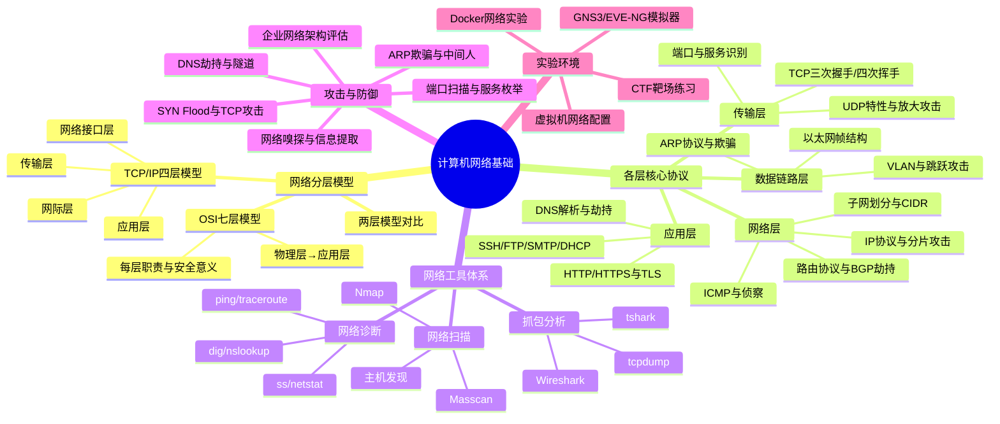
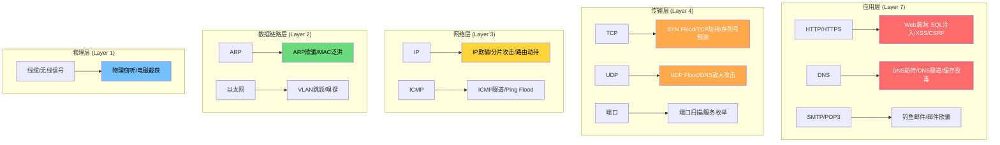
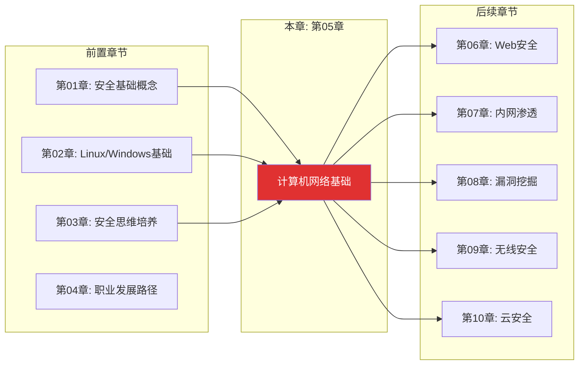

# 第05章 计算机网络基础 - 章节概览

## 为什么网络安全从网络开始

2016年，Mirai僵尸网络通过扫描物联网设备的默认Telnet凭据，在短短几小时内感染了超过60万台设备，发动了峰值达1.2Tbps的DDoS攻击，导致Twitter、Netflix、Reddit等知名网站集体宕机。2020年，SolarWinds供应链攻击中，攻击者通过DNS隧道技术将窃取的数据隐蔽回传，长达9个月未被发现。2023年，一个简单的ARP欺骗攻击在某企业内网中横向渗透，最终导致全公司核心数据库被勒索加密，赎金高达数百万美元。

这些攻击的共同点是什么？**它们都发生在网络层**。

计算机网络是现代信息社会的神经系统。每一次网页浏览、每一封电子邮件、每一笔在线交易，都依赖网络协议在设备之间传递数据。对于黑客技术的学习者而言，理解网络不仅是入门的第一步，更是贯穿整个安全领域的核心能力——无论你将来专注于Web渗透、内网横向移动、无线网络攻击还是云安全，扎实的网络基础都是不可或缺的。

为什么网络知识如此重要？原因有三：

1. **所有攻击最终都要经过网络**。即使是一个Web应用的SQL注入漏洞，最终也是通过HTTP协议——一个应用层协议——来传递恶意载荷的。不理解HTTP的请求结构、不理解TCP的连接机制、不理解DNS的解析流程，你就无法真正理解攻击是如何发生的。

2. **网络协议的设计缺陷是永恒的攻击面**。ARP协议没有认证机制、DNS协议默认不加密、TCP的序列号可以被预测——这些几十年前的设计决策至今仍在被攻击者利用。理解这些"历史遗留问题"，是理解现代安全攻防的基础。

3. **网络分析能力是安全从业者的核心竞争力**。无论是应急响应中的流量回溯、渗透测试中的协议分析，还是安全运营中的异常检测，都离不开对网络协议的深入理解和对网络工具的熟练使用。

本章将系统性地讲解计算机网络的核心知识，从OSI七层模型和TCP/IP四层模型出发，帮助你建立清晰的网络分层思维。我们将深入分析每一层的关键协议——以太网、IP、TCP、UDP、ARP、ICMP、DNS、HTTP/HTTPS等——不仅要理解它们的正常工作方式，更要掌握它们被攻击者利用的方式。

## 本章核心概念导图

在正式进入各小节之前，先建立本章的核心知识框架：



## 网络分层与安全攻击面总览

理解网络分层模型的关键不仅在于知道每一层"做什么"，更在于理解每一层"能被怎么攻击"。下图展示了网络各层与对应安全威胁的映射关系：



这张图不是装饰——它是你未来学习所有安全技术的"地图"。当你在后续章节中学习Web渗透时，你对应的是应用层；当你学习内网横向移动时，你涉及的是数据链路层和网络层；当你进行DDoS攻击分析时，你关注的是传输层。**始终用分层模型来定位你正在做的事情**，这是一个安全从业者最重要的思维习惯之一。

## 本章学习目标

完成本章学习后，你应该能够：

| 目标层级 | 具体能力 | 验证标准 |
|---------|---------|---------|
| **理解层** | 清晰区分OSI七层与TCP/IP四层模型，说出每一层的职责、核心协议和典型安全威胁 | 能画出完整的分层模型并标注每层的攻击面 |
| **分析层** | 深入理解TCP三次握手/四次挥手、IP路由、ARP解析、DNS查询等关键过程的每一个细节 | 能从Wireshark抓包中识别正常和异常的协议交互 |
| **工具层** | 熟练使用Wireshark抓包分析、Nmap端口扫描、tcpdump命令行抓包、dig/nslookup等网络工具 | 能独立完成一个网络的端口扫描和服务识别 |
| **攻击层** | 理解ARP欺骗、DNS劫持、中间人攻击、SYN Flood等攻击的原理、实现方式和防御手段 | 能在实验环境中复现至少3种网络层攻击 |
| **实战层** | 能够通过抓包分析判断网络通信是否正常，识别异常流量，评估网络架构的安全性 | 能对一个陌生网络完成从扫描到分析的完整流程 |

## 章节内容结构

本章按照"道法术器"的逻辑组织，从理论到实践层层递进：

### 第一节：理论基础（预计阅读：60-90分钟）

理论基础是整章的根基。没有扎实的理论，后续的工具使用和攻击复现都只是"照葫芦画瓢"，遇到变通场景就会手足无措。本节包含10个子章节，从网络分层模型开始，逐层深入：

| 子章节 | 主题 | 核心内容 | 安全关联 |
|--------|------|---------|---------|
| 一 | 网络分层模型 | OSI七层模型详解、TCP/IP四层模型、两层模型对比与映射 | 分层思维帮助定位攻击发生在哪一层 |
| 二 | 数据链路层核心协议 | 以太网帧结构、MAC地址、ARP协议工作原理、VLAN基础 | ARP欺骗、MAC泛洪、VLAN跳跃攻击的原理基础 |
| 三 | 网络层核心协议 | IPv4报文结构、IP地址分类、子网划分与CIDR、ICMP协议、路由基础与BGP | IP欺骗、分片攻击、ICMP隧道、BGP劫持 |
| 四 | 传输层核心协议 | TCP报文结构、三次握手/四次挥手详解、TCP状态机、UDP特性、端口与服务 | SYN Flood、TCP劫持、序列号预测、端口扫描 |
| 五 | 应用层核心协议 | DNS协议与查询流程、HTTP/HTTPS协议详解、TLS握手过程、SSH/FTP/SMTP/DHCP | DNS劫持/隧道/缓存投毒、HTTP中间人、证书伪造 |
| 六 | NAT与防火墙 | NAT工作原理与类型、包过滤/状态检测/WAF防火墙、防火墙绕过思路 | NAT穿透、防火墙规则分析与绕过技术 |
| 七 | 网络拓扑与攻击面 | 常见网络拓扑、企业分层架构、攻击面枚举方法 | 从攻击者视角识别网络弱点 |
| 八 | 网络协议深度分析 | 协议逆向方法、自定义协议分析、协议Fuzzing基础 | 针对私有协议和自定义协议的安全分析 |
| 九 | 企业网络安全架构 | 企业网络典型架构、安全域划分、零信任网络模型 | 理解企业级网络的安全设计与常见弱点 |
| 十 | 本节小结 | 核心知识点回顾、自测问题 | 检验理论掌握程度 |

**为什么理论如此重要？** 举一个具体的例子：如果你只记住了"ARP欺骗是把攻击者的MAC地址与网关IP绑定"这句话，那么当目标环境使用了动态ARP检测（DAI）或静态ARP绑定时，你就束手无策了。但如果你理解了ARP协议"无认证"的设计缺陷本质、ARP缓存的更新机制、以及ARP请求与回复的区别，你就能推导出绕过DAI的思路（比如利用ARP请求而非回复、或利用IPv6的NDP协议）。**理解原理的人能应对变化，只记步骤的人只能重复已知**。

### 第二节：核心技巧（预计阅读：45-60分钟）

理论是"知道是什么"，技巧是"知道怎么用"。本节聚焦于网络安全中最常用的网络工具和分析方法，包含11个子章节：

| 子章节 | 主题 | 核心工具/技能 | 实用价值 |
|--------|------|-------------|---------|
| 一 | 网络抓包分析技巧 | Wireshark（捕获过滤器、显示过滤器、流重组）、tcpdump、tshark | 抓包分析是安全从业者的基本功，贯穿渗透测试、应急响应、安全运营 |
| 二 | 网络扫描技巧 | Nmap（SYN扫描、服务版本检测、OS检测、NSE脚本）、Masscan | 端口扫描是渗透测试侦察阶段的第一步 |
| 三 | 网络诊断命令 | ip/ifconfig、ss/netstat、traceroute、dig/nslookup、ping | 日常网络故障排查和安全分析的基础命令 |
| 四 | ARP相关技巧 | ARP缓存管理、arping、ARP表分析、ARP攻击检测 | 识别ARP欺骗、验证中间人攻击 |
| 五 | DNS相关技巧 | DNS记录类型详解、dig高级用法、DNS区域传送、DNS安全检测 | DNS是攻击者最常滥用的协议之一 |
| 六 | 流量分析技巧 | 流量基线建立、异常流量识别、协议分析方法、加密流量分析 | 从海量流量中发现攻击痕迹的能力 |
| 七 | 网络工具安装 | Kali/Ubuntu/Windows/macOS上的工具安装与配置 | 工具环境搭建，避免因环境问题卡住学习 |
| 八 | 高级扫描技术 | 慢速扫描、分段扫描、Idle扫描、代理链扫描 | 绕过IDS/IPS的高级扫描技巧 |
| 九 | 企业级网络监控 | SNMP监控、NetFlow分析、SIEM集成 | 企业级安全运营中的网络监控能力 |
| 十 | 防火墙与IDS/IPS | iptables/nftables配置、Snort/Suricata基础规则 | 理解防御工具的工作原理，为绕过技术打基础 |
| 十一 | 本节小结 | 工具速查表、使用场景对照 | 快速参考 |

**工具学习的正确方法**：不要试图记住所有命令参数——那是man手册的工作。你应该做的是：(1) 理解工具的设计哲学和核心能力；(2) 掌握最常用的20%参数覆盖80%的场景；(3) 知道在什么场景下应该用什么工具；(4) 能通过man手册和--help快速找到不常用的参数。本节的教学方式就是围绕"场景"而非"工具"来组织的。

### 第三节：实战案例（预计阅读：50-70分钟）

理论和技巧最终要落地到实战。本节包含8个精心设计的实战案例，每个案例都遵循"场景还原→原理分析→攻击实施→防御对策→举一反三"的完整结构：

| 案例 | 攻击类型 | 涉及协议 | 难度 | 实验要求 |
|------|---------|---------|------|---------|
| 案例一 | ARP欺骗与中间人攻击 | ARP、以太网 | ★★☆☆☆ | 2台虚拟机（同网段） |
| 案例二 | DNS劫持与DNS欺骗 | DNS、UDP | ★★★☆☆ | 3台虚拟机（含DNS服务器） |
| 案例三 | 网络嗅探与敏感信息提取 | HTTP、FTP、Telnet | ★★☆☆☆ | 2台虚拟机 + Wireshark |
| 案例四 | 端口扫描与服务识别 | TCP、UDP | ★★☆☆☆ | 2台虚拟机 + Nmap |
| 案例五 | SYN Flood攻击演示 | TCP | ★★★☆☆ | 2台虚拟机 + hping3 |
| 案例六 | ARP欺骗中间人攻击（进阶） | ARP、HTTP、HTTPS | ★★★☆☆ | 3台虚拟机 + arpspoof + sslstrip |
| 案例七 | DNS隧道隐蔽通信 | DNS、ICMP | ★★★★☆ | 2台虚拟机 + dnscat2/iodine |
| 案例八 | 企业网络架构安全评估 | 综合 | ★★★★★ | GNS3/EVE-NG模拟环境 |

**每个案例的学习方法**：先不要看答案，尝试自己根据理论知识推导攻击思路。然后对照案例中的方法，找出你遗漏的环节。最后，在实验环境中亲手复现整个过程——**看懂和做到之间有巨大的鸿沟**。

### 第四节：常见误区（预计阅读：20-30分钟）

网络知识中有大量"看起来正确但实际上有误导性"的认知，这些误区如果不及时纠正，会在后续学习中产生连锁反应。本节列出网络安全学习者最容易犯的10个错误认知，包括：

- "HTTPS就是安全的"——中间人攻击可以在特定条件下剥离HTTPS
- "防火墙能挡住所有攻击"——应用层攻击可以轻松绕过包过滤防火墙
- "内网是安全的"——ARP欺骗、DNS劫持等攻击专门针对内网
- "VPN加密了就看不见了"——流量元数据分析依然能泄露大量信息
- 以及其他6个常见误区的深入分析

### 第五节：练习方法（预计阅读：25-35分钟）

学习网络知识最怕"纸上谈兵"。本节提供一套系统的练习方案：

1. **实验环境搭建**：从VirtualBox/Vmware虚拟网络到GNS3/EVE-NG模拟器，手把手教你搭建从简单到复杂的网络实验环境
2. **抓包练习计划**：30天的Wireshark练习计划，从识别ARP包开始，到分析完整的TLS握手过程
3. **协议分析训练**：如何从一个pcap文件中还原完整的攻击链
4. **CTF网络挑战**：推荐的CTF平台和网络相关的挑战题目

### 第六节：本章小结（预计阅读：10-15分钟）

核心知识点回顾、进阶学习方向推荐、自测问题。

### 第七节：深度拓展（预计阅读：30-45分钟）

为高级读者准备的进阶内容，包括：

- IPv6协议栈与安全影响：IPv6的普及正在改变网络安全格局
- 软件定义网络（SDN）与安全：SDN带来的新攻击面和新防御思路
- 网络协议Fuzzing：如何发现协议实现中的未知漏洞
- 网络取证基础：从网络流量中提取法律证据的方法论
- 零信任网络架构：超越传统边界安全的现代网络设计理念

## 章节与全书的知识关联

本章不是孤立存在的，它在整本书的知识体系中承上启下：



**向上承接**：第01-04章为你建立了安全思维和职业认知。本章是你的第一个"硬核技术章"——从这里开始，你将真正接触安全技术的细节。

**向下辐射**：
- **Web安全**：HTTP/HTTPS协议、Cookie机制、TLS握手过程——这些都是Web渗透的基础
- **内网渗透**：ARP欺骗、DNS劫持、网络嗅探——这些是内网横向移动的核心技术
- **漏洞挖掘**：协议逆向、协议Fuzzing——理解协议规范才能发现实现中的缺陷
- **无线安全**：802.11协议、无线帧结构——有线网络的知识是无线安全的基础
- **云安全**：VPC网络、安全组、负载均衡——云网络是传统网络知识的延伸

## 分层阅读建议

不同背景的读者可以采用不同的阅读策略，最大化学习效率：

### 零基础读者（无网络/IT背景）

> 按顺序完整阅读本章所有小节，不要跳过任何"基础"内容。重点关注"理论基础"中的网络分层模型和各层协议详解——这些是你后续一切学习的基石。在"核心技巧"部分，先掌握tcpdump和Wireshark的基本使用，再学习Nmap。"实战案例"建议从最简单的案例三（网络嗅探）开始，逐步增加难度。预计学习时间：20-25小时。

### 有IT背景的读者（开发/运维经验）

> 你可能已经对TCP/IP有基本了解，但安全视角的理解与运维/开发视角有本质区别。快速浏览"理论基础"的第一到四节，重点阅读每节中的"安全意义"部分。将更多时间投入到"核心技巧"的抓包分析和扫描技术，以及"实战案例"中的攻击复现。"常见误区"对你尤其重要——开发/运维背景的人最容易在这些地方产生认知盲区。预计学习时间：12-15小时。

### 已有网络基础的安全学习者

> 跳过基础理论，直接阅读"理论基础"中的第七到九节（网络拓扑、协议深度分析、企业安全架构），以及"核心技巧"中的高级扫描技术和流量分析。重点放在"实战案例"的案例六到八（进阶攻击和企业评估），以及"深度拓展"中的IPv6安全和协议Fuzzing。预计学习时间：8-10小时。

### 企业安全从业者

> 重点关注"理论基础"中的企业网络安全架构、"核心技巧"中的企业级网络监控和防火墙/IDS配置，以及"实战案例"中的案例八（企业网络架构安全评估）。"深度拓展"中的零信任网络架构和网络取证基础与你的日常工作直接相关。预计学习时间：6-8小时。

## 学习建议：如何高效掌握网络知识

### 原则一：动手优先于阅读

网络协议是"活"的——它们在你的网卡上每秒都在发生。不要只是读书，要打开Wireshark看你自己的电脑在做什么：

```bash
# 打开Wireshark，捕获5分钟的流量，然后问自己：
# 1. 我看到了哪些协议？（ARP? DNS? TCP? HTTP?）
# 2. 哪台设备在和哪台设备通信？
# 3. 有没有我不认识的流量？
# 4. 如果我是攻击者，我能从这些流量中得到什么信息？
```

### 原则二：从自己的网络开始

不要一上来就搭建复杂的实验环境。你现在的网络就是最好的学习材料：

1. 查看你的IP地址和网关地址（`ip addr` + `ip route`）
2. 查看你的ARP缓存（`arp -a`）
3. 用dig查询你常访问的网站的DNS记录
4. 用Wireshark抓取一次完整的网页浏览过程
5. 观察TCP三次握手的真实数据包

### 原则三：画图比记忆有效

网络协议的交互过程是多步骤的，纯文字记忆很容易混淆。对于每个重要过程（TCP握手、DNS查询、ARP解析、TLS握手），都亲手画一张序列图。画的过程就是理解的过程。

### 原则四：攻击思维贯穿始终

学习每个协议时，不要只问"它怎么工作"，还要问"它能怎么被滥用"。这种攻击思维（第03章详细讲解的安全思维）能帮你更深入地理解协议的设计缺陷和安全边界。

## 前置知识要求

| 前置技能 | 要求程度 | 说明 |
|---------|---------|------|
| 计算机基本操作 | 必须 | 能使用浏览器、文件管理器、安装软件 |
| 二进制和十六进制 | 建议 | 了解二进制/十六进制的表示方法，能做简单的进制转换 |
| 命令行终端 | 必须 | 能使用Linux或Windows的命令行终端执行基本命令 |
| 第01-04章内容 | 建议 | 特别是第02章（操作系统基础）和第03章（安全思维培养） |
| Python基础 | 可选 | 部分高级实验需要编写简单的Python脚本 |

**如果你的前置知识不足**：不必回头重新学习，遇到不理解的概念时再查阅相关章节即可。本章会在涉及前置知识时给出简要回顾。

## 推荐实验环境

工欲善其事，必先利其器。以下是本章实验的推荐环境配置：

| 环境方案 | 适用场景 | 资源需求 | 推荐度 |
|---------|---------|---------|-------|
| **VirtualBox + 2台Kali/Ubuntu虚拟机** | 基础实验（ARP欺骗、嗅探、扫描） | 4GB内存、20GB磁盘 | ★★★★★ |
| **Vmware + 3台虚拟机（含Windows）** | 中级实验（DNS劫持、中间人攻击） | 8GB内存、40GB磁盘 | ★★★★☆ |
| **GNS3/EVE-NG网络模拟器** | 高级实验（企业网络架构评估） | 8GB+内存、50GB磁盘 | ★★★☆☆ |
| **Docker Compose编排** | 快速搭建可复现的实验环境 | 4GB内存、10GB磁盘 | ★★★★☆ |

**最低配置**：一台能运行VirtualBox的电脑（Windows/Linux/macOS均可），4GB空闲内存，20GB空闲磁盘空间。这是完成本章80%实验的最低要求。

## 预计学习时间

| 学习阶段 | 内容范围 | 预计时间 | 说明 |
|---------|---------|---------|------|
| 理论学习 | 理论基础10个子章节 | 8-10小时 | 不要赶进度，确保每个概念都理解透彻 |
| 工具学习 | 核心技巧11个子章节 | 5-7小时 | 边学边练，每学一个工具就实际操作 |
| 实战练习 | 8个实战案例 | 6-8小时 | 每个案例至少完整复现一遍 |
| 误区与练习 | 常见误区 + 练习方法 | 2-3小时 | 误区纠正和系统化练习 |
| 深度拓展 | 进阶内容 | 3-4小时 | 可选，按需学习 |
| **总计** | **全部内容** | **24-32小时** | **建议分2-3周完成** |

**时间分配建议**：不要试图一天内学完所有内容。网络知识需要"消化"——每天学习2-3小时，留出时间在实际环境中练习和思考。理论和实践的最佳比例是4:6——**宁可少读一节理论，也要多抓一个数据包**。

## 本章关键词速查

在开始学习之前，先熟悉这些核心术语。它们会在本章中反复出现：

| 术语 | 英文 | 一句话解释 |
|------|------|-----------|
| OSI模型 | OSI Model | 国际标准化组织定义的七层网络参考模型 |
| TCP/IP模型 | TCP/IP Model | 互联网实际使用的四层协议栈 |
| 以太网 | Ethernet | 最广泛的局域网技术标准 |
| MAC地址 | MAC Address | 网卡的48位硬件地址，用于数据链路层寻址 |
| ARP | Address Resolution Protocol | 将IP地址解析为MAC地址的协议 |
| IP地址 | IP Address | 网络层的逻辑地址，用于跨网络寻址 |
| 子网掩码 | Subnet Mask | 区分IP地址中网络部分和主机部分的掩码 |
| CIDR | Classless Inter-Domain Routing | 无类别域间路由，如192.168.1.0/24 |
| TTL | Time to Live | IP数据包的生存时间，每经过一个路由器减1 |
| TCP | Transmission Control Protocol | 面向连接的可靠传输协议 |
| UDP | User Datagram Protocol | 无连接的不可靠传输协议 |
| 三次握手 | Three-way Handshake | TCP建立连接的过程：SYN→SYN+ACK→ACK |
| 端口 | Port | 传输层的服务标识，范围0-65535 |
| DNS | Domain Name System | 将域名解析为IP地址的系统 |
| HTTP | HyperText Transfer Protocol | Web应用的基础协议，明文传输 |
| HTTPS | HTTP Secure | HTTP + TLS/SSL，加密传输 |
| TLS | Transport Layer Security | 传输层安全协议，HTTPS的加密层 |
| NAT | Network Address Translation | 网络地址转换，将私有IP转为公有IP |
| 防火墙 | Firewall | 根据规则过滤网络流量的安全设备/软件 |
| 抓包 | Packet Capture | 捕获并分析网络数据包的技术 |
| 中间人攻击 | Man-in-the-Middle (MITM) | 攻击者插入通信双方之间，窃听或篡改数据 |

---

> ⚠️ **安全警告与免责声明**
>
> 本章内容仅供**合法的安全测试与教育目的**使用。所有技术、工具和方法的讨论均旨在帮助安全从业者在**获得明确授权**的前提下进行防御性安全研究。
>
> - 🚫 **未经授权**对任何系统、网络或应用进行安全测试是**违法行为**
> - ✅ 所有实践活动应在**隔离的实验环境**中进行（如虚拟机、CTF平台）
> - ✅ 遵守所在国家和地区的**网络安全法律法规**
> - ✅ 遵循**负责任的漏洞披露**原则
>
> 作者不对因滥用本章内容造成的任何后果承担责任。
