# 第05章 计算机网络基础 - 本章小结

## 章节全景回顾

本章从网络分层模型的理论根基出发，逐层拆解了从物理层到应用层的核心协议及其安全机制，然后转入实战抓包、扫描、诊断等核心技巧，最后通过八个真实攻防案例将理论与实践贯通。整章遵循"道法术器"的递进逻辑——先理解网络通信的本质规律（道），再掌握安全分析的方法论（法），然后磨炼具体的操作技能（术），最终熟练运用各种工具（器）。

以下是本章知识体系的全景图：

```mermaid
graph TD
    A[第05章 计算机网络基础] --> B[理论基础]
    A --> C[核心技巧]
    A --> D[实战案例]

    B --> B1[网络分层模型]
    B --> B2[数据链路层协议]
    B --> B3[网络层协议]
    B --> B4[传输层协议]
    B --> B5[应用层协议]
    B --> B6[NAT与防火墙]
    B --> B7[网络拓扑与攻击面]
    B --> B8[协议深度分析]
    B --> B9[企业安全架构]

    C --> C1[抓包分析]
    C --> C2[网络扫描]
    C --> C3[网络诊断]
    C --> C4[ARP技巧]
    C --> C5[DNS技巧]
    C --> C6[流量分析]
    C --> C7[工具安装]
    C --> C8[高级扫描]
    C --> C9[企业监控]

    D --> D1[ARP欺骗攻击]
    D --> D2[DNS劫持与欺骗]
    D --> D3[网络嗅探]
    D --> D4[端口扫描]
    D --> D5[SYN Flood攻击]
    D --> D6[ARP中间人]
    D --> D7[DNS隧道]
    D --> D8[企业安全评估]

    style A fill:#2d3748,color:#e2e8f0
    style B fill:#1a365d,color:#e2e8f0
    style C fill:#1a4731,color:#e2e8f0
    style D fill:#553c08,color:#e2e8f0
```



## 核心知识点回顾

### 网络分层模型：一切的基础

分层模型是理解网络通信和安全攻击的根基。攻击者利用的每一个漏洞，防御者部署的每一层防护，都可以映射到分层模型的特定层次上。

**OSI七层模型与TCP/IP四层模型的对应关系**：

| OSI层次 | TCP/IP层次 | 核心协议 | 典型攻击 | 安全设备/措施 |
|---------|-----------|---------|---------|-------------|
| 应用层 | 应用层 | HTTP/HTTPS/DNS/FTP/SMTP/SSH | SQL注入、XSS、DNS劫持、钓鱼 | WAF、应用防火墙、邮件网关 |
| 表示层 | 应用层 | SSL/TLS、编码转换 | SSL Stripping、证书伪造 | SSL检查设备 |
| 会话层 | 应用层 | NetBIOS、RPC | 会话劫持、会话固定 | 会话管理机制 |
| 传输层 | 传输层 | TCP/UDP | SYN Flood、TCP劫持、端口扫描 | 状态防火墙、IDS |
| 网络层 | 网际层 | IP/ICMP/ARP | IP欺骗、ARP欺骗、路由劫持 | 路由器ACL、IPSec |
| 数据链路层 | 网络接口层 | Ethernet/WiFi/VLAN | MAC泛洪、VLAN跳跃 | 交换机安全特性 |
| 物理层 | 网络接口层 | 光纤/双绞线/无线 | 线路窃听、信号干扰 | 物理安全措施 |

**数据封装与解封过程**是理解抓包分析的关键。数据从应用层向下逐层封装，每一层添加自己的头部信息：

```text
应用层数据 [HTTP请求]
    ↓ + TCP头部
传输层段 [TCP头 | HTTP请求]
    ↓ + IP头部
网络层包 [IP头 | TCP头 | HTTP请求]
    ↓ + 以太网头部和尾部
数据链路层帧 [以太网头 | IP头 | TCP头 | HTTP请求 | FCS]
    ↓ 转换为电信号/光信号
物理层比特流 01010101...
```

理解这个过程的意义在于：当你在Wireshark中看到一个数据包时，你知道每一层的头部信息是如何被添加的，也知道攻击者可以在哪一层注入恶意内容。例如，ARP欺骗发生在数据链路层，IP欺骗发生在网络层，SYN Flood发生在传输层，而HTTP注入发生在应用层——每一层都有其独特的攻防对抗。

### 关键协议及其安全意义

本章深入讲解了七个核心协议族，每个协议都存在设计之初未曾预料到的安全风险：

| 协议 | 层次 | 正常功能 | 安全威胁 | 攻击原理简述 |
|------|------|---------|---------|-------------|
| ARP | 数据链路层 | IP→MAC地址映射 | ARP欺骗、中间人攻击 | 无认证机制，攻击者可伪造ARP应答 |
| IP | 网络层 | 数据包路由寻址 | IP欺骗、分片攻击、路由劫持 | 源地址可伪造，分片可绕过检测 |
| ICMP | 网络层 | 网络连通性诊断 | 网络侦察、ICMP隧道、ICMP Flood | 可用于主机发现和隐蔽通信 |
| TCP | 传输层 | 可靠数据传输 | SYN Flood、TCP劫持、端口扫描 | 三次握手状态机可被利用 |
| UDP | 传输层 | 无连接快速传输 | UDP Flood、DNS放大攻击 | 无连接验证，易被伪造源地址 |
| DNS | 应用层 | 域名→IP解析 | DNS劫持、缓存投毒、DNS隧道 | 响应无加密无认证，可篡改 |
| HTTP | 应用层 | Web内容传输 | 中间人攻击、会话劫持、数据泄露 | 明文传输，所有内容可被窥探 |
| HTTPS | 应用层 | 加密Web传输 | SSL Stripping、证书伪造、降级攻击 | 实现层面存在降级和证书验证漏洞 |

这些协议的安全缺陷不是"bug"，而是设计时代的产物。TCP/IP协议族诞生于1970年代的学术网络环境，当时网络参与者互相信任，安全威胁几乎不存在。这些"信任假设"在今天的互联网环境中变成了巨大的安全隐患。理解这一点，就能理解为什么网络安全的核心工作是"在不安全的基础设施上构建安全的通信"。

### 核心技能体系

本章训练的四大核心技能构成了网络安全从业者的基本功：

**1. 抓包分析能力**

这是网络分析的"听诊器"。要求掌握Wireshark的显示过滤器语法（如`tcp.flags.syn==1 && tcp.flags.ack==0`过滤SYN包）、捕获过滤器语法（如`tcp port 80 and host 192.168.1.100`）、流跟踪功能（Follow TCP Stream/HTTP Stream），以及tcpdump的命令行使用（如`tcpdump -i eth0 -w capture.pcap 'port 53'`）。抓包能力的进阶标志是：看到一个TCP流，能在脑中还原出完整的通信过程，包括三次握手、数据传输、四次挥手的状态变迁。

**2. 端口扫描能力**

这是信息收集阶段的核心技能。需要掌握Nmap的多种扫描技术：SYN扫描（`-sS`，半开扫描，速度快且隐蔽）、TCP全连接扫描（`-sT`，准确但留下完整日志）、UDP扫描（`-sU`，慢但不可忽略）、服务版本探测（`-sV`）、操作系统识别（`-O`）、脚本引擎（`--script`）。进阶要求是理解每种扫描技术在网络层面的行为差异——SYN扫描发送SYN包后根据响应判断端口状态，不完成三次握手，因此在目标日志中的痕迹更少。

**3. 网络诊断能力**

这是排查网络问题和理解网络拓扑的基础。必须熟练使用以下命令并理解其输出含义：

| 命令 | 用途 | 安全分析场景 |
|------|------|-------------|
| `ping` | 测试连通性和延迟 | 判断目标是否存活、是否存在ICMP过滤 |
| `traceroute`/`tracert` | 追踪路由路径 | 发现网络拓扑、识别防火墙位置 |
| `dig`/`nslookup` | DNS查询 | 发现子域名、检测DNS劫持 |
| `netstat`/`ss` | 查看网络连接和监听端口 | 发现异常连接、识别后门 |
| `arp` | 查看ARP缓存表 | 检测ARP欺骗（异常MAC映射） |
| `ip`/`ifconfig` | 网络接口配置 | 了解本机网络环境 |
| `curl`/`wget` | HTTP请求测试 | 探测Web服务、测试API |

**4. 攻击识别能力**

这是防御视角的核心能力。通过流量分析识别异常行为：ARP欺骗的特征是同一IP对应不同MAC地址（可用`arpwatch`检测）；端口扫描的特征是短时间内大量SYN包发往不同端口（Snort规则`alert tcp any any -> $HOME_NET any (msg:"Port Scan"; flags:S; threshold:type both,track by_src,count 30,seconds 10;)`）；DNS隧道的特征是异常长的DNS查询和高频TXT记录请求。

### 安全原则与防御思维

本章反复强调的四条安全原则，不仅是技术准则，更是一种思维方式：

**加密通信**——不要假设网络是安全的。在不可信的网络环境中（包括所有公共WiFi和大部分内网），明文传输的任何数据都等同于公开广播。HTTPS、SSH、VPN不是"可选项"，而是"必选项"。实际操作中，要特别注意混合内容问题（HTTPS页面中加载HTTP资源）和证书验证的正确实现。

**纵深防御**——单一安全措施的失效只是时间问题。正确的做法是在每一层都部署防御：网络层用ACL和防火墙过滤，传输层用IDS检测异常行为，应用层用WAF拦截恶意请求，数据层用加密保护敏感信息。这样即使某一层被突破，其他层仍然提供保护。

**零信任**——"内网安全"是一个危险的幻觉。APT攻击者一旦突破边界（通过钓鱼邮件、供应链攻击等），在传统信任模型的内网中可以自由横向移动。零信任架构要求每一次访问都经过认证和授权，不因来源IP在内网就自动信任。

**最小权限**——每多开放一个端口、每多运行一个服务，就多一个潜在的攻击入口。服务器上应该只运行业务必需的服务，防火墙应该只开放业务必需的端口。定期审计端口和服务列表，关闭所有不必要的东西。

## 关键概念深度辨析

### 网络安全 vs 应用安全

这两个概念经常被混淆，但它们的关注点完全不同：

| 维度 | 网络安全 | 应用安全 |
|------|---------|---------|
| 关注层面 | 数据在网络中的传输过程 | 应用程序本身的逻辑和实现 |
| 典型威胁 | 中间人攻击、流量嗅探、DDoS | SQL注入、XSS、逻辑漏洞 |
| 防御手段 | 加密、VPN、防火墙、IDS | 输入验证、参数化查询、CSP |
| 分析工具 | Wireshark、tcpdump、Snort | Burp Suite、SQLMap、代码审计 |
| 能力要求 | 理解网络协议和拓扑 | 理解编程语言和Web技术 |

两者并非相互独立，而是互为补充。一个通过HTTPS传输的Web应用，网络安全层面已经加密，但如果应用层存在SQL注入，攻击者依然可以窃取数据库。反之，一个安全的Web应用运行在明文HTTP上，用户凭证在传输过程中就可能被截获。真正的安全需要两者的协同。

### 被动侦察 vs 主动侦察

| 维度 | 被动侦察 | 主动侦察 |
|------|---------|---------|
| 定义 | 不与目标系统直接交互 | 直接向目标发送探测请求 |
| 留下痕迹 | 不会在目标系统留下任何日志 | 必然在目标日志中留下记录 |
| 典型方法 | OSINT、搜索引擎、WHOIS、Shodan | 端口扫描、服务识别、漏洞探测 |
| 技术难度 | 较低，主要依赖信息检索 | 较高，需要理解协议和工具 |
| 法律风险 | 较低（查看公开信息） | 较高（可能构成未授权访问） |
| 信息质量 | 信息可能过时或不完整 | 获取实时、准确的目标信息 |

在实际渗透测试中，正确的顺序是先被动后主动：先通过被动侦察尽可能多地了解目标（域名、IP段、技术栈、员工信息），再有针对性地进行主动侦察，最大限度减少暴露风险。

### 攻击面 vs 攻击向量

**攻击面（Attack Surface）**是系统中所有可能被攻击的入口点的总和。想象一栋房子，攻击面包括所有的门、窗、通风口、烟囱。攻击面越大，被突破的概率越高。减少攻击面是防御的基本策略——关闭不必要的端口、禁用不需要的服务、移除默认账户。

**攻击向量（Attack Vector）**是攻击者实际选择利用的特定路径。攻击者面对一个攻击面，会选择最薄弱、最容易利用的入口。同一个攻击面可能对应多个攻击向量。例如一个Web服务器，攻击向量可能包括：利用Apache已知漏洞、暴力破解SSH密码、通过Web应用SQL注入、利用配置错误的S3存储桶。

理解这两个概念的实际意义：安全评估时，首先全面盘点攻击面（端口扫描、服务枚举、子域名发现），然后评估每个入口的安全性，最后模拟攻击者视角选择最可能的攻击向量进行验证。

## 安全工具速查表

本章涉及的工具按用途分类汇总，方便日后查阅：

### 抓包与流量分析

| 工具 | 特点 | 典型命令 |
|------|------|---------|
| Wireshark | GUI界面，功能最全面 | 直接打开pcap文件或实时捕获 |
| tcpdump | 命令行，轻量级，适合服务器 | `tcpdump -i eth0 -nn port 80` |
| tshark | Wireshark的命令行版本 | `tshark -r capture.pcap -Y "http"` |
| Ettercap | ARP欺骗和中间人攻击 | `ettercap -T -M arp /靶机IP/ /网关IP/` |

### 网络扫描与发现

| 工具 | 特点 | 典型命令 |
|------|------|---------|
| Nmap | 功能最全面的扫描器 | `nmap -sS -sV -O -p 1-65535 靶机IP` |
| Masscan | 超高速端口扫描 | `masscan 192.168.0.0/16 -p0-65535 --rate 10000` |
| Netdiscover | ARP主机发现 | `netdiscover -r 192.168.1.0/24` |
| fping | 批量ping扫描 | `fping -asg 192.168.1.0/24` |

### DNS分析

| 工具 | 特点 | 典型命令 |
|------|------|---------|
| dig | 标准DNS查询工具 | `dig @8.8.8.8 example.com A +trace` |
| dnsenum | DNS枚举 | `dnsenum example.com` |
| fierce | 子域名发现 | `fierce --domain example.com` |
| dnscat2 | DNS隧道工具 | 建立DNS隐蔽信道 |

### 嗅探与欺骗

| 工具 | 特点 | 典型命令 |
|------|------|---------|
| arpspoof | ARP欺骗 | `arpspoof -i eth0 -t 靶机 网关` |
| Bettercap | 现代化中间人攻击框架 | `bettercap -iface eth0` |
| Responder | LLMNR/NBT-NS/MDNS投毒 | `responder -I eth0` |
| mitmproxy | HTTP/HTTPS中间人代理 | `mitmproxy --mode transparent` |

## 学习自检清单

在进入下一章之前，请用以下问题检验自己对本章内容的掌握程度。建议先不看笔记独立回答，再对照相关内容验证。

### 基础理解层（必须掌握）

1. **TCP/IP四层模型**：请画出四层模型，列出每层的名称、核心协议，以及每层的PDU（协议数据单元）名称。数据从应用层到物理层的封装过程中，每一层添加了什么信息？

2. **ARP欺骗**：描述ARP欺骗的完整攻击流程（从攻击者发送伪造ARP应答到建立中间人位置）。画出正常ARP通信和被欺骗后的通信路径对比图。如何使用`arp -a`命令检测ARP欺骗？

3. **TCP三次握手**：详细描述三次握手的每个步骤，包括发送的TCP标志位（SYN/ACK）、序列号的变化、以及每个步骤的状态变迁（如SYN_SENT、SYN_RECEIVED、ESTABLISHED）。如果第三次握手的ACK丢失会发生什么？

4. **DNS解析过程**：从用户在浏览器输入URL到获得最终IP地址，描述完整的DNS解析过程，包括递归查询和迭代查询的区别、本地DNS缓存的层次（浏览器缓存→OS缓存→hosts文件→本地DNS服务器→根DNS→顶级域DNS→权威DNS）。

### 应用分析层（应该掌握）

5. **隐蔽扫描**：对比SYN扫描（`-sS`）、FIN扫描（`-sF`）、NULL扫描（`-sN`）、Xmas扫描（`-sX`）在网络层面的行为差异，解释为什么某些扫描技术比其他技术更隐蔽。每种扫描技术在目标日志中分别会留下什么记录？

6. **HTTPS工作原理**：从TCP连接建立到TLS握手完成，描述HTTPS连接建立的完整过程。HTTPS有哪些已被公开的攻击方法（如SSL Stripping、BEAST、POODLE）？它们分别利用了什么弱点？

7. **NAT与防火墙**：NAT的工作原理是什么（SNAT/DNAT的区别）？为什么说NAT提供了"隐含的安全性"但不能替代防火墙？画出内网主机通过NAT访问外网时，数据包的源地址和目的地址在每个节点的变化。

### 综合应用层（进阶掌握）

8. **Wireshark实操**：给定一个包含HTTP登录过程的pcap文件，你能否从流量中提取出用户名和密码？写出使用的显示过滤器（如`http.request.method == "POST"`），以及Follow TCP Stream的操作步骤。

9. **攻击流量识别**：在大量正常流量中，如何识别以下攻击行为？给出具体的流量特征和检测方法：
   - ARP欺骗：短时间内同一IP的MAC地址发生变化
   - 端口扫描：单个源IP在短时间内向目标的大量不同端口发送SYN包
   - DNS隧道：DNS查询中出现异常长的子域名或高频TXT查询

10. **防御方案设计**：为一个小型企业网络（50台主机、1个Web服务器、1个邮件服务器）设计基本的网络安全方案。需要考虑：网络分段策略、防火墙规则、入侵检测方案、日志收集方案。

如果你能清晰、准确地回答以上所有问题，说明你已经扎实掌握了本章的核心内容。如果某些问题感到困难，建议回到对应的小节重新学习——网络安全知识环环相扣，前面的薄弱会直接影响后续章节的理解。

## 进阶学习方向

完成本章基础学习后，以下四个方向值得深入探索。选择方向时建议结合自己的职业规划和兴趣点：

### 网络渗透测试

这是本章内容的直接延伸，从"理解网络协议"升级到"利用网络协议漏洞进行渗透"。

- **内网渗透技术**：域环境渗透（Kerberos攻击、Pass-the-Hash、Golden Ticket）、横向移动技术（PsExec、WMI、WinRM）、权限提升
- **VLAN渗透与路由攻击**：VLAN跳跃攻击（Double Tagging、DTP协商欺骗）、路由协议攻击（RIP欺骗、OSPF注入、BGP劫持）、交换机攻击（MAC泛洪、CAM表溢出）
- **无线网络攻击**：WiFi密码破解（WPA/WPA2握手包捕获与字典/暴力破解）、Evil Twin攻击、WiFi探针追踪、蓝牙安全（Bluesnarfing、Bluejacking）

**推荐练习环境**：Hack The Box（在线渗透测试靶机平台）、VulnHub（可下载的虚拟机靶场）、DVWA（Web漏洞练习）、Metasploitable（专门设计的有漏洞虚拟机）。

### 网络安全监控

从攻击者视角转向防御者视角，学习如何持续监控和保护网络安全。

- **SIEM系统**：学习Splunk（商业方案，功能最全面）、ELK Stack（开源方案：Elasticsearch+Logstash+Kibana）或Wazuh（开源安全监控平台）。掌握日志收集、关联分析、告警配置、仪表板搭建
- **入侵检测与防御**：Snort（开源IDS/IPS，基于规则的检测）和Suricata（多线程高性能IDS）的安装、规则编写和调优。理解基于签名的检测和基于异常的检测的区别
- **网络取证分析**：学习使用NetworkMiner从pcap文件中提取文件、图片、凭据；使用Bro/Zeek进行网络流量日志记录和分析；掌握事后取证分析的方法论（时间线重建、攻击链还原）

### 协议安全研究

深入研究特定协议的安全性，成为协议层面的安全专家。

- **TLS/SSL安全**：深入理解TLS 1.2和TLS 1.3的握手差异、密码套件的安全性评估、证书透明度（Certificate Transparency）、证书固定（Certificate Pinning）
- **BGP安全**：理解BGP路由劫持的原理和历史案例（如2018年亚马逊DNS劫持事件）、RPKI（资源公钥基础设施）和BGPsec的作用
- **DNS安全扩展**：DNSSEC的签名验证机制、DoH（DNS over HTTPS）和DoT（DNS over TLS）的隐私保护、DNS响应速率限制（RRL）
- **新兴协议**：HTTP/3和QUIC的安全特性改进、基于HTTP/2的攻击方法（如HPACK炸弹、依赖DoS）

### 云网络安全

随着企业上云趋势加速，云环境的网络安全成为新的核心战场。

- **云网络架构**：VPC（虚拟私有云）设计与子网规划、安全组与网络ACL的区别和配置策略、NAT Gateway与Internet Gateway的使用场景
- **软件定义网络安全**：SDN架构（控制平面与数据平面分离）引入的新安全挑战、SDN控制器攻击面分析、微分段（Micro-segmentation）的实现
- **云原生安全**：容器网络隔离（Kubernetes NetworkPolicy）、服务网格安全（Istio mTLS）、云环境下的DDoS防护（AWS Shield、Cloudflare）、CSPM（云安全态势管理）

### 学习资源推荐

| 类别 | 资源 | 说明 |
|------|------|------|
| 书籍 | 《TCP/IP详解（卷1：协议）》 | 理解TCP/IP协议的经典之作，W. Richard Stevens著 |
| 书籍 | 《网络安全监控》 | Chris Sanders著，安全监控领域的实战指南 |
| 书籍 | 《渗透测试实战第三版》 | Georgia Weidman著，从零开始的渗透测试教程 |
| 在线课程 | SANS SEC503/GCIA | 网络入侵检测的权威认证课程 |
| 在线平台 | Hack The Box | 在线渗透测试练习平台，提供真实靶机环境 |
| 在线平台 | TryHackMe | 引导式网络安全学习平台，适合初学者 |
| 工具文档 | Nmap官方文档 | Nmap参考指南，每个参数都有详细说明 |
| 工具文档 | Wireshark Wiki | Wireshark使用技巧和协议解析参考 |
| 认证 | CompTIA Network+ | 网络基础知识认证，体系化验证学习成果 |
| 认证 | CEH（认证道德黑客） | 渗透测试入门认证，覆盖网络攻击技术 |

## 下一章预告

下一章我们将进入操作系统安全的世界，学习Linux系统的基础知识。Linux是网络安全领域最重要的操作系统——Kali Linux是渗透测试的标准工具集，绝大多数Web服务器和云服务器运行Linux，Android系统也基于Linux内核。理解Linux的文件系统层次结构、用户与权限管理模型（UID/GID、SUID/SGID/Sticky Bit）、进程管理与生命周期、Shell编程与脚本自动化、系统日志分析，是成为安全专家的必备基础。

前五章建立的网络知识将与Linux系统知识深度融合——你会理解为什么防火墙规则用iptables/nftables实现、为什么抓包需要root权限、为什么SSH比Telnet安全、以及如何在Linux服务器上部署网络监控工具。
