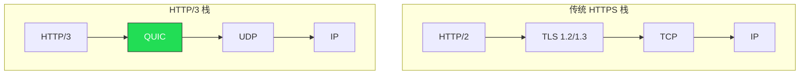
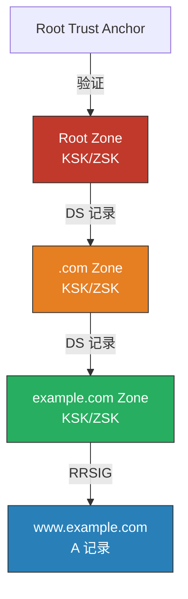
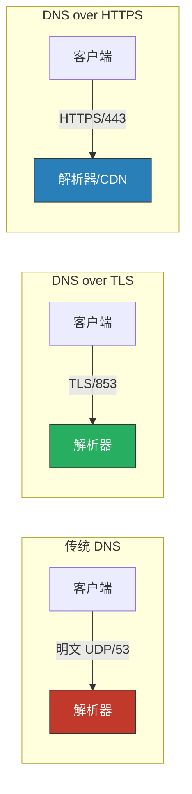
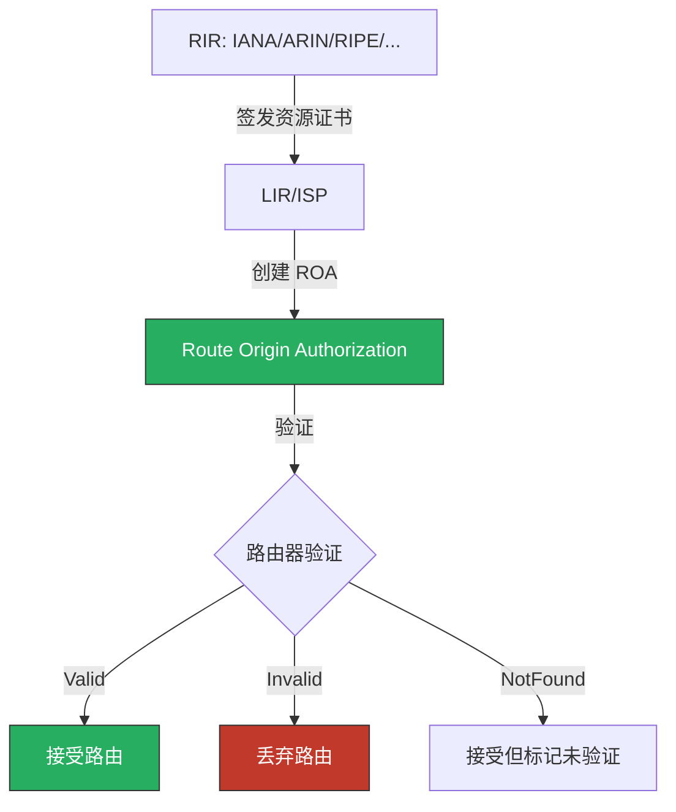
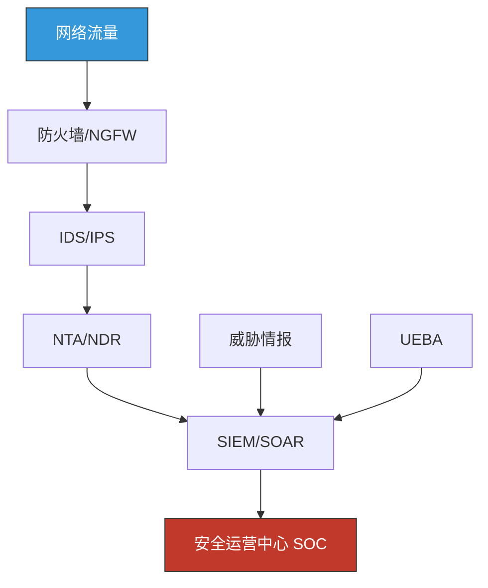

# 第05章 计算机网络基础 - 深度拓展

本章是计算机网络基础的进阶篇章。前面的理论基础、核心技巧和实战案例已经覆盖了网络协议的基本原理与常见攻击手法，本章将在此基础上向三个方向延伸：**协议层面的安全深度分析**、**现代网络架构的安全挑战**、以及**前沿技术的安全影响**。每一节都力求做到"道法术器"贯通——不仅讲清楚"是什么"和"为什么"，更要给出"怎么做"的具体路径。

---

## 一、TCP/IP 协议栈安全深度分析

TCP/IP 协议栈诞生于 1974 年 Vint Cerf 和 Bob Kahn 的论文《A Protocol for Packet Network Intercommunication》，其设计初衷是实现异构网络的互联互通，而非保障安全。这种"先连通、后补安全"的历史包袱，使得整个协议栈充满了可以被攻击者利用的结构性弱点。

### 1.1 TCP 协议安全特性与攻击向量

#### 1.1.1 TCP 三次握手的攻击面

TCP 三次握手（Three-Way Handshake）是建立可靠连接的基础，但其设计中的半连接状态（Half-Open Connection）为资源耗尽攻击提供了天然入口。

**SYN Flood 攻击的深层机制：**

SYN Flood 不仅仅是"发送大量 SYN 包"那么简单。攻击者通常会伪造源 IP 地址（IP Spoofing），使得服务器发送的 SYN-ACK 响应无法到达真实地址，导致连接永远停留在 SYN_RCVD 状态。操作系统内核会为每个半连接分配一个 Transmission Control Block（TCB），通常占用 280-1200 字节内存。当半连接队列溢出时，合法的新连接请求将被丢弃。

```text
正常三次握手：
客户端 → SYN (seq=x)           → 服务端    [SYN_RCVD]
客户端 ← SYN-ACK (seq=y,ack=x+1) ← 服务端
客户端 → ACK (ack=y+1)         → 服务端    [ESTABLISHED]

SYN Flood 攻击：
攻击者  → SYN (伪造源IP)      → 服务端    [SYN_RCVD]
                                   ↓
                              SYN-ACK 发送到伪造IP（无响应）
                                   ↓
                              半连接队列溢出
                                   ↓
                              合法用户 SYN 被丢弃
```

**SYN Cookie 防御原理与局限：**

SYN Cookie 技术（Daniel J. Bernstein, 1996）的核心思想是：服务端在收到 SYN 时不分配 TCB，而是将连接信息编码到 SYN-ACK 的序列号中。当客户端回复 ACK 时，服务端从确认号中反解出连接信息，再分配资源。

```bash
# Linux 下检查和配置 SYN Cookie
# 查看当前状态（1=启用，0=禁用）
sysctl net.ipv4.tcp_syncookies

# 启用 SYN Cookie（默认已启用）
sysctl -w net.ipv4.tcp_syncookies=1

# 调整半连接队列大小
sysctl -w net.ipv4.tcp_max_syn_backlog=65536

# 调整 SYN-ACK 重试次数
sysctl -w net.ipv4.tcp_synack_retries=2
```

SYN Cookie 的局限性：

| 局限 | 说明 |
|------|------|
| 丢失 TCP 选项 | SYN Cookie 编码空间有限，无法容纳所有 TCP 选项（如窗口缩放、SACK） |
| 性能开销 | 每次握手都需要加密计算 |
| 无法防止资源耗尽 | 攻击者仍可消耗 CPU（加密计算）和带宽 |
| 与某些中间设备不兼容 | 某些 NAT/防火墙可能丢弃非标准序列号 |

#### 1.1.2 TCP 序列号预测与会话劫持

TCP 序列号（ISN, Initial Sequence Number）的可预测性是 TCP 协议最古老的安全弱点之一。1985 年 Robert T. Morris 发现早期 BSD 实现使用简单的时钟递增算法生成 ISN，攻击者只需观察几个连接即可预测后续序列号。

**攻击链：**

```text
1. 攻击者嗅探目标主机的 TCP 连接，记录当前序列号
2. 分析 ISN 生成规律（线性递增、时钟偏移等）
3. 预测下一个 ISN
4. 在合法通信方的间隙中注入伪造数据包
5. 如果预测正确，伪造数据包被接受为合法数据
```

**现代操作系统的 ISN 随机化：**

Linux 内核使用基于哈希的随机化方案，将源 IP、目的 IP、源端口、目的端口和密钥（每 5 分钟轮换）作为输入，通过 MD5/SHA1 哈希生成 ISN。Windows 从 Windows 2000 SP3 起使用类似方案。

```bash
# 查看 Linux 的 ISN 随机化强度
cat /proc/sys/net/ipv4/tcp_challenge_ack_limit

# 验证 ISN 随机性（使用 Scapy）
python3 -c "
from scapy.all import *
import random

# 发送多个 SYN 包并记录 ISN
isns = []
for i in range(5):
    pkt = sr1(IP(dst='127.0.0.1')/TCP(dport=80, flags='S'), timeout=1, verbose=0)
    if pkt:
        isns.append(pkt[TCP].seq)
        print(f'连接 {i+1}: ISN = {isns[-1]}')

# 检查相邻 ISN 的差值
if len(isns) > 1:
    diffs = [isns[i+1] - isns[i] for i in range(len(isns)-1)]
    print(f'ISN 差值: {diffs}')
    print(f'差值标准差: {(sum((d - sum(diffs)/len(diffs))**2 for d in diffs)/len(diffs))**0.5:.0f}')
    print('标准差越大，随机性越强')
"
```

**TCP-AO（TCP Authentication Option, RFC 5925）：**

TCP-AO 是 TCP MD5 签名（RFC 2385）的继任者，为每个 TCP 段提供密码学认证。与 MD5 签名不同，TCP-AO 支持密钥轮换、更强的 MAC 算法（SHA-256）、以及与 TCP 选项的兼容。BGP 路由器之间的通信是 TCP-AO 的典型应用场景。

#### 1.1.3 TCP 状态机异常与攻击检测

TCP 状态机的状态转换模式可以作为攻击检测的依据：

```text
常见异常状态模式：

SYN_RCVD 堆积      → SYN Flood 攻击
SYN_SENT 堆积      → 大规模端口扫描或连接洪水
TIME_WAIT 过多     → 短连接攻击、HTTP 慢速攻击、端口扫描
CLOSE_WAIT 过多    → 应用程序 Bug（未正确关闭连接）
FIN_WAIT_2 过多    → 对端未发送 FIN（连接泄漏）
```

```bash
# 监控 TCP 连接状态分布
ss -ant | awk '{print $1}' | sort | uniq -c | sort -rn

# 实时监控异常连接
watch -n 1 'echo "=== $(date) ===" && ss -ant | awk "{print \$1}" | sort | uniq -c | sort -rn'

# 检测 SYN_RCVD 堆积（可能是 SYN Flood）
ss -ant state syn-recv | wc -l

# 检测 TIME_WAIT 堆积
ss -ant state time-wait | wc -l
```

### 1.2 UDP 协议安全考量

UDP 是无连接协议，不提供可靠性、顺序性或拥塞控制保证。这些特性使 UDP 成为 DDoS 攻击的理想载体。

**UDP 反射放大攻击（Reflection Amplification）：**

攻击者伪造受害者 IP 向开放的 UDP 服务发送查询，服务响应远大于查询，从而将攻击流量放大数十倍甚至数百倍。常见的 UDP 反射向量包括：

| 服务 | 端口 | 放大倍数 | 查询类型 |
|------|------|----------|----------|
| DNS | 53 | 28-54x | ANY 查询 |
| NTP | 123 | 556x | monlist |
| SSDP | 1900 | 30x | M-SEARCH |
| Memcached | 11211 | 51,000x | get 命令 |
| CLDAP | 389 | 56-70x | 无范围搜索 |
| Chargen | 19 | 358x | 字符生成 |
| SNMP | 161 | 6x | GetBulk |

2018 年 GitHub 遭受的 1.35 Tbps Memcached 反射攻击，是当时记录在案的最大规模 DDoS 攻击。攻击者利用了 Memcached 默认暴露 UDP 端口且无需认证的特性。

```bash
# 检查服务器是否暴露了 UDP 反射向量
# 检查 DNS 开放解析
dig @你的服务器IP example.com +short

# 检查 NTP monlist
ntpdc -c monlist 你的服务器IP

# 检查 Memcached UDP
echo -ne "\x00\x00\x00\x00\x00\x01\x00\x00stats\r\n" | nc -u -w1 你的服务器IP 11211

# 防御：禁用不必要的 UDP 服务或限制访问
# NTP：禁用 monlist
# echo "disable monitor" >> /etc/ntp.conf

# Memcached：绑定到 127.0.0.1 或禁用 UDP
# memcached -l 127.0.0.1 -U 0
```

### 1.3 QUIC 协议（HTTP/3）安全深度分析

QUIC（Quick UDP Internet Connections）由 Google 于 2012 年提出，2021 年成为 IETF 标准（RFC 9000），是 HTTP/3 的底层传输协议。QUIC 将传输层和加密层合并到一个协议中，从根本上改变了网络栈的架构。



**QUIC 的安全优势：**

- **内置 TLS 1.3**：所有 QUIC 连接默认加密，握手延迟更低（1-RTT 建立，0-RTT 恢复）
- **连接迁移（Connection Migration）**：使用 Connection ID 而非四元组标识连接，网络切换（如 Wi-Fi → 4G）不会断开连接
- **多路复用无队头阻塞**：单个流的丢包不影响其他流
- **前向纠错（FEC）**：可选的数据恢复机制

**QUIC 的安全挑战：**

- **0-RTT 重放攻击**：QUIC 的 0-RTT 恢复允许客户端在握手完成前发送应用数据，攻击者可以重放这些数据。防御方法包括限制 0-RTT 仅用于幂等操作、实现一次性令牌机制
- **连接 ID 枚举**：如果 Connection ID 可预测，攻击者可以伪造连接迁移
- **UDP 放大**：QUIC 使用 UDP，需要实现自己的放大攻击防护（响应不超过查询的 3 倍）
- **深度包检测困难**：加密的 QUIC 流量使得传统 DPI 设备无法分析，企业安全策略执行面临挑战
- **协议指纹识别**：QUIC 初始包（Initial Packet）的结构特征可被用于识别和阻断

```bash
# 使用 Wireshark 分析 QUIC 流量
# Wireshark 3.2+ 支持 QUIC 解码
# 需要设置 QUIC 解密密钥：
# 设置环境变量 SSLKEYLOGFILE
export SSLKEYLOGFILE=/tmp/sslkeys.log
# 使用 Chrome/Firefox 访问网站，密钥会记录到文件
# 在 Wireshark 中：Edit → Preferences → Protocols → TLS → (Pre)-Master-Secret log filename

# 使用 tshark 命令行分析 QUIC
tshark -r capture.pcap -Y "quic" -T fields -e quic.connection.number -e quic.version -e ip.src -e ip.dst
```

---

## 二、DNS 安全深度分析

DNS 是互联网最关键的基础设施之一，也是攻击面最广泛的协议。本节在基础章节的 DNS 攻击介绍基础上，深入分析 DNS 安全的各个层面。

### 2.1 DNS 缓存投毒（Cache Poisoning）

DNS 缓存投毒的核心在于 DNS 协议的"竞态条件"——解析器在发送查询后，会接受第一个到达的响应，而不验证其是否匹配发出的查询。

**Kaminsky 攻击（2008）的精妙之处：**

Dan Kaminsky 发现的漏洞不是简单的缓存投毒，而是利用了 DNS 事务 ID 仅有 16 位（65,536 种可能）的弱点。攻击者查询一个随机子域名（如 `random123.example.com`），在权威服务器响应之前发送伪造响应，伪造响应中包含对整个 `example.com` 域名的 NS 记录。攻击成功后，攻击者控制了整个域名的解析。

```text
攻击流程：
1. 攻击者查询 random123.example.com
2. 解析器向权威服务器发出查询
3. 攻击者同时发送大量伪造响应（伪造源IP为权威服务器）
   - 伪造响应中包含 example.com 的 NS 记录指向攻击者控制的服务器
   - 响应中猜测 16-bit 事务 ID 和 16-bit 源端口
   - 每次尝试的概率：1/(65536 × 65536) ≈ 1/4,294,967,296
   - 但可以在 TTL 内反复尝试
4. 如果伪造响应先到达，example.com 的 NS 记录被缓存
5. 后续 example.com 的所有查询都指向攻击者的服务器
```

**防御措施的演进：**

| 防御措施 | 原理 | 效果 |
|----------|------|------|
| 源端口随机化 | 将 16-bit 事务 ID 扩展为 32-bit 验证空间 | 显著提高攻击难度 |
| DNSSEC | 数字签名验证 DNS 响应完整性 | 根本性防御，但部署率低 |
| 0x20 编码 | 利用查询名大小写变化增加验证位 | 有限的额外保护 |
| DNS-over-HTTPS/TLS | 加密 DNS 传输，防止中间人篡改 | 保护传输过程 |
| DNS 防火墙 | 基于策略的 DNS 过滤 | 阻止恶意域名解析 |

### 2.2 DNSSEC 的工作原理与局限

DNSSEC（DNS Security Extensions, RFC 4033-4035）通过密码学签名保护 DNS 数据的完整性和来源验证，但**不提供机密性**。

**DNSSEC 签名链：**



DNSSEC 使用四种关键记录类型：
- **RRSIG**：资源记录签名，对每条 DNS 记录的数字签名
- **DNSKEY**：存储 Zone Signing Key（ZSK）和 Key Signing Key（KSK）的公钥
- **DS**（Delegation Signer）：父域存储的子域 KSK 哈希，建立信任链
- **NSEC/NSEC3**：Authenticated Denial of Existence，证明某个域名不存在

```bash
# 验证 DNSSEC 签名
dig +dnssec example.com A

# 查看 DNSKEY 记录
dig example.com DNSKEY +dnssec

# 查看 DS 记录
dig example.com DS

# 使用 delv 工具进行 DNSSEC 验证（比 dig 更严格）
delv @8.8.8.8 example.com +rtrace

# 检查 DNSSEC 配置是否正确
# https://dnssec-analyzer.verisignlabs.com/
```

**DNSSEC 的局限性与部署挑战：**

| 局限 | 详细说明 |
|------|----------|
| 不提供机密性 | DNS 查询仍然明文传输，可被窃听 |
| 签名大小增加 | DNSSEC 响应比普通响应大 5-10 倍，增加带宽和延迟 |
| 区域签名运维复杂 | ZSK 需定期轮换（建议 1-3 个月），KSK 轮换更复杂（1-2 年） |
| NSEC Zone Walking | NSEC 记录可被用于枚举整个 Zone 的所有域名 |
| NSEC3 性能开销 | NSEC3 通过哈希解决了 Zone Walking，但增加了计算开销 |
| 碎片化问题 | DNSSEC 响应较大，可能触发 IP 分片，增加攻击面 |

截至 2025 年，全球 IPv4 路由中约 45% 有 RPKI 保护，但 DNSSEC 的部署率仍然不足——`.com` 域名中仅约 2-3% 启用了 DNSSEC 签名。

### 2.3 DNS over HTTPS（DoH）与 DNS over TLS（DoT）

DoH（RFC 8484）和 DoT（RFC 7858）通过加密 DNS 查询保护用户隐私，但也引发了企业安全监控的争议。



| 特性 | DoT | DoH |
|------|-----|-----|
| 端口 | 853 | 443 |
| 协议 | TLS | HTTPS |
| 可检测性 | 容易（专用端口） | 困难（与 HTTPS 流量混合） |
| 防火墙策略 | 可以单独阻断 853 端口 | 阻断 DoH 会同时阻断正常 HTTPS |
| 企业友好 | 较好（可控） | 较差（绕过监控） |
| 标准 | RFC 7858 | RFC 8484 |

```bash
# 使用 DoT 查询
kdig @8.8.8.8 +tls example.com A

# 使用 DoH 查询
curl -s -H 'accept: application/dns-json' \
  'https://cloudflare-dns.com/dns-query?name=example.com&type=A' | jq .

# 搭建本地 DoH/DoT 代理（使用 dnscrypt-proxy）
# /etc/dnscrypt-proxy/dnscrypt-proxy.toml 配置示例
# server_names = ['cloudflare', 'google']
# listen_addresses = ['127.0.0.1:53']
# http_proxy = 'http://127.0.0.1:8080'  # 可选
```

**DoH 的安全监控困境：**

DoH 的争议在于：它保护了用户隐私，但也使得企业网络安全团队无法通过 DNS 查询检测恶意软件通信。恶意软件可以使用公共 DoH 服务器（如 Cloudflare、Google）解析 C2 域名，完全绕过企业的 DNS 监控和防火墙规则。

### 2.4 DNS 重绑定（DNS Rebinding）深度攻击

DNS 重绑定是一种绕过浏览器同源策略（Same-Origin Policy）的攻击技术，可以攻击受害者内网中的服务。

**攻击原理：**

```text
1. 攻击者控制一个域名（如 evil.com）和其 DNS 服务器
2. 受害者访问 evil.com，DNS 服务器返回攻击者服务器的 IP（TTL=0）
3. 浏览器与攻击者服务器建立连接，执行恶意 JavaScript
4. JavaScript 发起对 evil.com 的新请求
5. DNS 服务器第二次返回内网 IP（如 192.168.1.1）
6. 浏览器认为这是同源请求（域名未变），允许访问
7. JavaScript 现在可以访问内网服务（如路由器管理界面）
```

**DNS Pinning 防御与绕过：**

浏览器的 DNS Pinning 机制会缓存 DNS 响应一段时间，但攻击者可以通过以下方式绕过：
- 设置多个 A 记录（一个外网 IP，一个内网 IP）
- 利用浏览器连接复用机制
- 竞态条件攻击

```bash
# 搭建 DNS 重绑定攻击环境（使用 rbndr 工具）
# https://github.com/taviso/rbndr
# rbndr 会交替返回两个 IP 地址
./rbndr 你的服务器IP 192.168.1.1

# 防御措施
# 1. 在防火墙上阻断对内网 IP 的外部 DNS 响应
iptables -A FORWARD -p udp --dport 53 -m string --algo bm --hex-string "|c0a80101|" -j DROP

# 2. 浏览器扩展（如 NoScript）可以阻止 DNS 重绑定
# 3. 服务端验证 Host 头
```

### 2.5 DNS 隧道检测与防御

DNS 隧道利用 DNS 协议传输非 DNS 数据，常用于绕过网络访问控制或数据外泄。

```bash
# 使用 dnscat2 建立 DNS 隧道（服务器端）
dnscat2-server yourdomain.com

# 客户端连接
dnscat2-client yourdomain.com

# 使用 iodine 建立 DNS 隧道
# 服务端
iodined -f -c -P password 10.0.0.1 tunnel.yourdomain.com
# 客户端
iodine -f -P password tunnel.yourdomain.com

# DNS 隧道检测指标
# 1. 单个域名的 DNS 查询频率异常高（正常用户每分钟 1-5 次，隧道可达 100+）
# 2. 查询的子域名长度异常（正常 < 30 字符，隧道可达 200+ 字符）
# 3. TXT 记录查询比例异常高
# 4. 单个域名的 DNS 响应数据量异常大
# 5. 域名的熵值异常高（随机编码的子域名）

# 使用 Zeek 检测 DNS 隧道
# 在 Zeek 脚本中添加：
# event dns_request(c: connection, msg: dns_msg, query: string, qtype: count, qclass: count) {
#     if (|query| > 50) {
#         print fmt("可疑长域名: %s -> %s", c$id$orig_h, query);
#     }
# }
```

---

## 三、BGP 安全深度分析

BGP（Border Gateway Protocol）是互联网路由的基础协议，负责在自治系统（AS）之间交换路由信息。BGP 的安全性直接关系到整个互联网的可达性。

### 3.1 BGP 劫持（BGP Hijacking）

BGP 协议设计时基于"信任"模型——任何 AS 都可以公告任何 IP 前缀，其他 AS 默认接受。这种"无认证"的设计导致了 BGP 劫持攻击。

**BGP 劫持类型：**

| 类型 | 说明 | 影响 |
|------|------|------|
| 前缀劫持 | 攻击者公告不属于自己的 IP 前缀 | 流量被重定向到攻击者 |
| 子前缀劫持 | 攻击者公告更具体的前缀（更长的掩码） | 更精确的流量劫持 |
| 路径篡改 | 修改 AS-PATH 属性 | 影响路由选择 |
| 路由泄露 | AS 意外公告了从其他 AS 学到的路由 | 流量经过非预期路径 |

**真实案例深度分析：**

- **2018 年 Amazon Route 53 劫持**：攻击者通过 BGP 劫持了 Amazon Route 53 的 DNS 服务器 IP 前缀（205.251.192.0/23），将 MyEtherWallet 用户的 DNS 查询重定向到攻击者控制的服务器，返回恶意 IP，用户输入私钥后资金被盗。攻击持续了约 2 小时，损失约 1700 万美元的加密货币。
- **2019 年中国电信 BGP 泄露**：中国电信的 AS 4134 意外公告了约 10,000 个不属于自己的 IP 前缀，导致全球部分流量经过中国电信网络。尽管可能是配置错误，但暴露了 BGP 协议的信任脆弱性。
- **2022 年俄罗斯入侵乌克兰期间**：多个乌克兰网络的 BGP 路由被劫持或泄露，影响了互联网可达性。

```bash
# 查看 BGP 路由信息
# 使用 RIPE RIS 或 BGPStream 查看实时 BGP 数据
# https://bgpstream.caida.org/
# https://stat.ripe.net/

# 使用 whois 查询 AS 信息
whois -h whois.radb.net AS15169  # Google

# 查询某个 IP 前缀的路由来源
whois -h whois.radb.net -i origin -T route 8.8.8.0/24

# 使用 bgpq4 生成前缀列表（网络运维用）
bgpq4 -4 -l PREFIX_LIST AS15169
```

### 3.2 RPKI 与路由安全

RPKI（Resource Public Key Infrastructure）是目前最成熟的 BGP 安全解决方案，通过密码学手段验证 IP 前缀与 AS 之间的授权关系。

**RPKI 工作流程：**



**RPKI 的三种验证状态：**

- **Valid**：路由公告与 ROA 匹配，AS 有权公告此前缀
- **Invalid**：路由公告与 ROA 不匹配（AS 不对或前缀长度超出授权）
- **NotFound**：没有对应的 ROA 记录

```bash
# 使用 Routinator 验证 RPKI（NLnet Labs 开源工具）
# 安装
cargo install routinator
# 或使用 Docker
docker run -d -p 3323:3323 nlnetlabs/routinator

# 验证特定路由
routinator vrps --format json | jq '.[] | select(.prefix=="8.8.8.0/24")'

# 使用 RIPE RIS 在线工具检查路由状态
# https://stat.ripe.net/widget/rpki-validation
```

### 3.3 BGP 安全最佳实践

```text
网络运维 BGP 安全清单：

1. 部署 RPKI ROA 记录
   - 为所有公告的 IP 前缀创建 ROA
   - 设置合理的 maxLength（不要过于宽松）

2. 实施 RPKI 验证
   - 在路由器上配置 RPKI 验证
   - 将 Invalid 路由设为 reject 或降低优先级

3. 使用 BGP 过滤
   - 实施严格的入站/出站前缀过滤
   - 使用 IRR（Internet Routing Registry）数据过滤
   - 限制 AS-PATH 长度

4. 部署 BGP 监控
   - 使用 BGPStream、RIPE RIS 监控路由变化
   - 配置路由变更告警

5. 与上游 ISP 协调
   - 要求上游 ISP 实施 RPKI 验证
   - 使用 BGP Communities 实现路由策略协调
```

---

## 四、网络安全架构深度分析

### 4.1 零信任网络架构（Zero Trust Architecture）

零信任（Zero Trust）的概念由 Forrester Research 的 John Kindervag 于 2010 年提出，其核心理念是"永不信任，始终验证"。NIST SP 800-207（2020）将零信任定义为一组网络安全范式，将防御重心从网络边界转移到单个资源。

**零信任 vs 传统安全模型：**

| 维度 | 传统边界安全 | 零信任架构 |
|------|------------|-----------|
| 信任模型 | 内网可信，外网不可信 | 不信任任何网络位置 |
| 访问控制 | 基于网络位置（IP/VLAN） | 基于身份和上下文 |
| 网络分段 | 粗粒度（DMZ/内网） | 细粒度（微分段） |
| 加密 | 边界加密（VPN） | 端到端加密 |
| 监控 | 边界日志 | 全程持续监控 |
| 威胁假设 | 外部攻击者 | 攻击者已在内部 |

**零信任的技术组件：**

```text
零信任架构核心组件：

1. 身份提供者（IdP）
   - 多因素认证（MFA）
   - 单点登录（SSO）
   - 联合身份管理
   - 代表：Okta、Azure AD、Keycloak

2. 设备信任评估
   - 设备健康检查（操作系统版本、补丁状态）
   - 合规性验证（安全软件是否运行）
   - 设备证书
   - 代表：CrowdStrike、Microsoft Intune

3. 策略决策点（PDP）和策略执行点（PEP）
   - PDP：基于身份、设备、上下文做出访问决策
   - PEP：执行 PDP 的决策（允许/拒绝）
   - 代表：Zscaler、Cloudflare Access

4. 网络微分段
   - 基于工作负载身份的访问控制
   - 应用到应用的策略
   - 代表：Illumio、VMware NSX

5. 持续监控和分析
   - 用户和实体行为分析（UEBA）
   - 安全信息和事件管理（SIEM）
   - 代表：Splunk、Microsoft Sentinel
```

**零信任实施路径：**


### 4.2 软件定义网络（SDN）安全

SDN 将控制平面（Control Plane）与数据平面（Data Plane）分离，通过集中式控制器管理网络。这种架构既带来了安全优势，也引入了新的攻击面。

**SDN 安全优势：**
- 集中化策略管理：统一的安全策略下发，避免配置不一致
- 动态策略调整：基于实时威胁情报自动调整网络策略
- 全局网络视图：控制器可以看到整个网络的流量模式
- 自动化响应：检测到威胁后自动隔离受感染主机

**SDN 安全风险：**

| 风险 | 说明 | 防御措施 |
|------|------|----------|
| 控制器单点攻击 | 控制器被攻破则整个网络失控 | 控制器集群化、访问控制 |
| 南向 API 攻击 | OpenFlow 协议无内置认证 | TLS 加密、证书认证 |
| 流表注入攻击 | 向交换机注入恶意流规则 | 流表完整性验证、权限控制 |
| 北向 API 滥用 | 应用层对控制器的恶意调用 | API 认证和授权、速率限制 |

### 4.3 网络微分段（Microsegmentation）

微分段将安全边界从网络层面细化到工作负载层面，每个工作负载（虚拟机、容器、进程）都有独立的安全策略。

```text
传统分段 vs 微分段：

传统分段：
┌─────────────────────────────────────┐
│ DMZ        │    内网    │   数据库   │
│ Web 服务器  │ App 服务器  │ DB 服务器  │
│ (同一区域内  │ (同一区域内  │ (同一区域内  │
│  无隔离)    │  无隔离)    │  无隔离)    │
└─────────────────────────────────────┘

微分段：
┌─────────────────────────────────────┐
│ [Web-1]──[策略]──[Web-2]           │
│    │         ┌──────┘              │
│  [策略]    [策略]                    │
│    │         │                      │
│ [App-1]──[策略]──[App-2]           │
│    │         ┌──────┘              │
│  [策略]    [策略]                    │
│    │         │                      │
│ [DB-1]──[策略]──[DB-2]             │
└─────────────────────────────────────┘
每个工作负载之间的通信都有独立的安全策略
```

---

## 五、网络流量分析与取证

### 5.1 深度包检测（DPI）技术

DPI 分析数据包的载荷内容，而不仅仅是头部信息。在加密流量普及的今天，DPI 面临巨大挑战，但仍然是企业网络安全的重要手段。

**DPI 技术层次：**

| 层次 | 分析内容 | 应用场景 |
|------|----------|----------|
| 包头部分析 | IP/TCP/UDP 头部字段 | 路由、QoS、基本过滤 |
| 应用协议识别 | 协议指纹匹配 | 流量分类、带宽管理 |
| 载荷内容分析 | 应用数据内容 | DLP、恶意软件检测 |
| 行为分析 | 流量模式、时序特征 | 异常检测、C2 识别 |

**加密流量分析（Encrypted Traffic Analysis, ETA）：**

即使流量已加密，仍然可以从以下维度提取信息：

```text
可提取的加密流量元数据：

1. TLS 握手信息
   - TLS 版本、密码套件列表
   - 服务器证书信息（Issuer、Subject、SAN）
   - 扩展信息（SNI、ALPN）

2. 流量统计特征
   - 数据包大小分布
   - 数据包间隔时序
   - 字节数和持续时间
   - 双向流量比例

3. 协议行为模式
   - 连接频率和模式
   - 数据传输模式（请求-响应 vs 流式）
   - DNS 查询模式
```

**JA3/JA4 指纹识别：**

JA3（Salesforce, 2017）和 JA4（FoxIO, 2023）通过 TLS Client Hello 的字段生成客户端指纹，可以识别恶意软件使用的 TLS 库，即使流量已加密。

```python
# JA3 指纹生成原理（简化示例）
# JA3 字符串格式：TLSVersion,Ciphers,Extensions,EllipticCurves,EllipticCurvePointFormats
# 示例：769,47-53-5-10-49161-49162-49171-49172-50-56-19-4,0-10-11,23-24-25,0

import hashlib

def generate_ja3(tls_version, ciphers, extensions, curves, point_formats):
    """生成 JA3 指纹"""
    ja3_string = f"{tls_version},{ciphers},{extensions},{curves},{point_formats}"
    ja3_hash = hashlib.md5(ja3_string.encode()).hexdigest()
    return ja3_string, ja3_hash

# 使用 Scapy 提取 TLS Client Hello 信息
from scapy.all import *
from scapy.layers.tls.handshake import TLSClientHello

def extract_ja3(packet):
    if packet.haslayer(TLSClientHello):
        ch = packet[TLSClientHello]
        tls_version = ch.version
        ciphers = "-".join(str(c) for c in ch.ciphers)
        # 提取扩展、曲线等...
        print(f"TLS Version: {tls_version}")
        print(f"Cipher Suites: {ciphers}")
```

```bash
# 使用 ja3 工具进行 TLS 指纹识别
# 安装
pip install pylivect

# 常见恶意软件 JA3 指纹（已知指纹库）
# Cobalt Strike: 72a589da586844d7f0818ce684948eea
# Metasploit: a0e9f5d64349fb13191bc781f81f42e1
# Emotet: 4d7a28d6f2263ed61de889614f0e8050

# 使用 Zeek 自动提取 JA3 指纹
# 安装 Zeek JA3 插件
zkg install ja3
# 或使用内置支持（Zeek 4.0+）
zeek -r capture.pcap ja3
```

### 5.2 网络取证流程

网络取证（Network Forensics）是安全事件响应的重要环节，其核心是捕获、记录和分析网络流量，以重建攻击事件的时间线。

```text
网络取证标准流程：

1. 证据保全
   ├── 确保采集过程不改变原始数据
   ├── 计算哈希值（SHA-256）验证完整性
   ├── 记录采集时间、方法、工具版本
   └── 建立证据链（Chain of Custody）

2. 流量捕获
   ├── 完整捕获（Full Packet Capture）：记录所有数据包
   ├── 元数据捕获（Zeek logs、NetFlow）：记录连接摘要
   └── 选择性捕获（过滤特定 IP/端口/协议）

3. 时间线重建
   ├── 同步所有设备的时间（NTP）
   ├── 关联网络日志与主机日志
   ├── 识别攻击的起始时间、持续时间
   └── 重建攻击者的行为序列

4. 分析与报告
   ├── 提取攻击者的工具和载荷
   ├── 分析横向移动路径
   ├── 确定数据外泄范围
   └── 编写取证报告
```

```bash
# 网络取证工具链

# 1. 流量捕获
tcpdump -i eth0 -w /evidence/capture_$(date +%Y%m%d_%H%M%S).pcap -s 0

# 2. 使用 Zeek 进行流量分析
zeek -r capture.pcap
# 生成的日志文件：
# conn.log    - 连接摘要
# dns.log     - DNS 查询
# http.log    - HTTP 请求
# ssl.log     - TLS 连接
# x509.log    - 证书信息
# files.log   - 文件传输
# notice.log  - 安全告警

# 3. 使用 tshark 提取特定信息
# 提取所有 DNS 查询
tshark -r capture.pcap -Y "dns.qr==0" -T fields -e dns.qry.name

# 提取所有 HTTP Host 头
tshark -r capture.pcap -Y "http.request" -T fields -e http.host -e http.request.uri

# 提取所有 TLS SNI
tshark -r capture.pcap -Y "tls.handshake.extensions_server_name" -T fields -e tls.handshake.extensions_server_name

# 4. 使用 NetworkMiner 进行取证分析
# NetworkMiner 可以从 pcap 中提取文件、图片、凭据等
# 图形界面工具，也可以命令行使用
mono NetworkMiner.exe --interface eth0 --output /evidence/
```

### 5.3 网络威胁检测体系

现代网络威胁检测采用多层防御策略：



**各层检测技术对比：**

| 技术 | 代表产品 | 检测能力 | 部署位置 |
|------|----------|----------|----------|
| NGFW | Palo Alto, Fortinet | 已知威胁签名、应用识别 | 网络边界 |
| IDS/IPS | Snort, Suricata | 签名匹配、协议异常 | 网络关键节点 |
| NTA | Darktrace, Vectra | 流量行为分析、异常检测 | 网络核心 |
| NDR | ExtraHop, Cisco Secure Network Analytics | 深度流量分析 + 自动响应 | 云端/本地 |
| SIEM | Splunk, QRadar, Sentinel | 日志关联、威胁情报集成 | 安全运营中心 |

```bash
# Suricata IDS 实战配置
# 安装
apt install suricata

# 下载最新规则
suricata-update

# 基本配置 /etc/suricata/suricata.yaml
# vars:
#   address-groups:
#     HOME_NET: "[192.168.0.0/16,10.0.0.0/8]"
#     EXTERNAL_NET: "!$HOME_NET"
# outputs:
#   - fast:
#       enabled: yes
#       filename: fast.log
#   - eve-log:
#       enabled: yes
#       filename: eve.json
#       types:
#         - alert
#         - dns
#         - tls
#         - http

# 启动 Suricata
suricata -c /etc/suricata/suricata.yaml -i eth0

# 分析告警日志
tail -f /var/log/suricata/fast.log
cat /var/log/suricata/eve.json | jq 'select(.event_type=="alert")'
```

---

## 六、IPv6 安全深度分析

IPv6 正在全球范围内加速部署，2024 年 Google 统计显示全球 IPv6 使用率已超过 40%。IPv6 的大地址空间、自动配置机制和过渡技术都带来了新的安全挑战。

### 6.1 IPv6 地址空间的安全影响

IPv6 的 128 位地址空间（约 3.4 × 10^38 个地址）对安全产生了深远影响：

| 影响 | 说明 |
|------|------|
| 网络扫描困难 | 传统暴力扫描不再可行，需要使用 DNS、日志、邻居发现等信息 |
| 地址枚举 | SLAAC 使用 EUI-64 地址可能暴露设备 MAC 地址 |
| 多地址共存 | 一个接口可以有多个 IPv6 地址（链路本地、全局、临时地址） |
| 隐私扩展 | RFC 4941 使用随机地址保护隐私，但也使追踪困难 |

### 6.2 IPv6 特有攻击向量

**邻居发现协议（NDP）攻击：**

NDP（RFC 4861）替代了 IPv4 的 ARP，但同样缺乏认证机制。

```text
IPv6 NDP 攻击类型：

1. 路由器通告（RA）攻击
   - 发送伪造的 RA 消息
   - 将自己宣告为默认网关
   - 效果：中间人攻击、流量劫持

2. 邻居请求/通告（NS/NA）欺骗
   - 类似 IPv4 的 ARP 欺骗
   - 将目标的 IPv6 地址映射到攻击者的 MAC 地址

3. 重复地址检测（DAD）攻击
   - 对新上线的节点持续发送 DAD 冲突响应
   - 使其无法获得 IPv6 地址（DoS）

4. DHCPv6 欺骗
   - 设置恶意 DHCPv6 服务器
   - 分配恶意 DNS 服务器地址
```

```bash
# 使用 THC-IPv6 工具集进行 IPv6 安全测试
# 安装
apt install thc-ipv6

# RA 攻击（伪造路由器通告）
fake_advertise6 eth0 fe80::1

# NS 欺骗（IPv6 ARP 欺骗）
parasite6 eth0

# DHCPv6 欺骗
dhcp6_spoof

# 防御：部署 RA Guard（RFC 6105）
# 在交换机端口上过滤未授权的 RA 消息
# Cisco 示例：
# interface GigabitEthernet0/1
#   ipv6 nd raguard
```

**IPv6 隧道攻击：**

IPv6 过渡机制可以被攻击者利用绕过安全控制：

```text
IPv6 隧道安全风险：

6to4 (RFC 3056)
├── 使用 IPv4 协议号 41 封装 IPv6
├── 防火墙可能未过滤此协议号
└── 攻击者可以建立隧道绕过 IPv4 安全控制

Teredo (RFC 4380)
├── 通过 UDP 封装 IPv6
├── 穿透 NAT 设备
└── 防火墙通常不检查 UDP 载荷中的 IPv6

ISATAP (RFC 5214)
├── 在 IPv4 网络上建立 IPv6 隧道
└── 可能绕过 IPv4 的安全策略

防御措施：
├── 在防火墙上阻断 IPv6 隧道协议（协议号 41、UDP 3544）
├── 禁用终端系统的 IPv6 隧道功能
├── 部署 IPv6 感知的防火墙和 IDS
└── 实施 IPv6 安全策略
```

### 6.3 IPv6 安全配置建议

```bash
# Linux IPv6 安全加固

# 1. 禁用不需要的 IPv6 功能
# 禁用 SLAAC（如果使用 DHCPv6）
sysctl -w net.ipv6.conf.all.accept_ra=0
sysctl -w net.ipv6.conf.default.accept_ra=0

# 2. 启用 IPv6 隐私扩展（RFC 4941）
sysctl -w net.ipv6.conf.all.use_tempaddr=2
sysctl -w net.ipv6.conf.default.use_tempaddr=2

# 3. 禁用 IPv6 源路由
sysctl -w net.ipv6.conf.all.accept_source_route=0

# 4. 配置 IPv6 防火墙（ip6tables）
ip6tables -A INPUT -i lo -j ACCEPT
ip6tables -A INPUT -m state --state ESTABLISHED,RELATED -j ACCEPT
ip6tables -A INPUT -p ipv6-icmp -j ACCEPT  # ICMPv6 是必需的
ip6tables -A INPUT -p tcp --dport 22 -j ACCEPT  # SSH
ip6tables -A INPUT -j DROP

# 5. 监控 IPv6 流量
tcpdump -i eth0 -n ip6
```

---

## 七、无线网络安全深度分析

无线网络（Wi-Fi、蓝牙、蜂窝网络）的安全挑战与有线网络有本质区别：物理层的广播特性使得攻击者可以在不接触网络基础设施的情况下进行窃听和注入。

### 7.1 Wi-Fi 安全演进

| 协议 | 年份 | 加密 | 认证 | 安全状态 |
|------|------|------|------|----------|
| WEP | 1999 | RC4 (24-bit IV) | Open/Shared Key | 已破解，禁止使用 |
| WPA | 2003 | TKIP (RC4) | PSK/802.1X | 已破解，不安全 |
| WPA2 | 2004 | CCMP (AES-128) | PSK/802.1X | 安全（需强密码） |
| WPA3 | 2018 | CCMP/GCMP-256 | SAE/802.1X | 最安全 |

**WPA2 KRACK 攻击（2017）：**

KRACK（Key Reinstallation Attack）利用了 WPA2 四次握手的漏洞。攻击者通过重放第三个消息（Message 3），强制客户端重新安装相同的加密密钥，从而重置 nonce 计数器，可能导致数据包重放和解密。

```bash
# Wi-Fi 安全测试工具
# aircrack-ng 套件
apt install aircrack-ng

# 将无线网卡置于监听模式
airmon-ng start wlan0

# 扫描附近的 Wi-Fi 网络
airodump-ng wlan0mon

# 捕获 WPA2 四次握手
airodump-ng -c 6 --bssid AA:BB:CC:DD:EE:FF -w capture wlan0mon

# 离线破解 WPA2 密码（字典攻击）
aircrack-ng -w /usr/share/wordlists/rockyou.txt capture-01.cap

# 企业级 WPA2/3 安全建议
# 1. 使用 WPA3-SAE 或 WPA2-Enterprise (802.1X)
# 2. 配置 RADIUS 服务器进行身份认证
# 3. 使用证书认证而非密码
# 4. 部署无线入侵检测系统（WIDS）
# 5. 定期更换 PSK 密码
```

### 7.2 蓝牙安全

蓝牙协议栈的安全层次：

```text
蓝牙攻击面：

1. 蓝牙扫描和跟踪
   - 设备发现和 MAC 地址追踪
   - 蓝牙低功耗（BLE）信标追踪

2. 中间人攻击
   - Bluesnarfing：未授权访问设备数据
   - Bluejacking：发送未请求的消息
   - KNOB 攻击：协商弱加密密钥

3. 蓝牙协议漏洞
   - BlueBorne（2017）：无需配对的远程代码执行
   - BlueFrag（2020）：Android 蓝牙漏洞
   - BLURtooth（2020）：CTKD 密钥覆盖

防御措施：
├── 不使用时关闭蓝牙
├── 使用"不可发现"模式
├── 及时更新固件和操作系统
├── 使用蓝牙 5.0+ 设备（安全性更好）
└── 避免在公共场所使用蓝牙配对
```

---

## 八、云原生与容器网络安全

随着企业大规模采用云原生架构，容器和微服务的网络安全成为新的挑战。传统网络边界在容器环境中几乎消失。

### 8.1 容器网络模型与安全

**容器网络的三种模式：**

| 模式 | 说明 | 安全影响 |
|------|------|----------|
| Bridge | 容器通过虚拟网桥连接 | 容器间通信需要策略控制 |
| Host | 容器直接使用宿主机网络栈 | 容器可以看到宿主机所有流量 |
| Overlay | 跨主机容器通信（如 VXLAN） | 需要加密覆盖网络流量 |

**容器网络安全风险：**

```text
容器网络安全威胁：

1. 容器逃逸 → 访问宿主机网络
   - 恶意容器利用内核漏洞逃逸
   - 共享网络命名空间暴露攻击面

2. 容器间横向移动
   - 默认情况下同一网络的容器可以互相访问
   - 缺乏网络策略导致攻击者自由移动

3. API 服务器暴露
   - Kubernetes API 未授权访问
   - etcd 数据泄露

4. 服务网格安全
   - 服务间通信缺乏 mTLS
   - 缺乏细粒度的流量策略
```

```yaml
# Kubernetes NetworkPolicy 示例
# 限制 Pod 只能与特定服务通信
apiVersion: networking.k8s.io/v1
kind: NetworkPolicy
metadata:
  name: api-server-policy
  namespace: production
spec:
  podSelector:
    matchLabels:
      app: api-server
  policyTypes:
    - Ingress
    - Egress
  ingress:
    - from:
        - podSelector:
            matchLabels:
              app: web-frontend
        - namespaceSelector:
            matchLabels:
              env: production
      ports:
        - protocol: TCP
          port: 8080
  egress:
    - to:
        - podSelector:
            matchLabels:
              app: database
      ports:
        - protocol: TCP
          port: 5432
    - to:  # 允许 DNS 查询
        - namespaceSelector: {}
      ports:
        - protocol: UDP
          port: 53
```

### 8.2 服务网格安全

服务网格（Service Mesh）通过 Sidecar 代理模式为微服务通信提供统一的安全层。

```bash
# Istio 服务网格安全配置示例

# 启用自动 mTLS
apiVersion: security.istio.io/v1beta1
kind: PeerAuthentication
metadata:
  name: default
  namespace: production
spec:
  mtls:
    mode: STRICT

# 定义授权策略
apiVersion: security.istio.io/v1beta1
kind: AuthorizationPolicy
metadata:
  name: api-server-auth
  namespace: production
spec:
  selector:
    matchLabels:
      app: api-server
  rules:
    - from:
        - source:
            principals: ["cluster.local/ns/production/sa/web-frontend"]
      to:
        - operation:
            methods: ["GET", "POST"]
            paths: ["/api/*"]
```

---

## 九、协议混淆与流量规避技术

攻击者使用各种技术绕过网络检测，理解这些技术对于蓝队防御至关重要。

### 9.1 协议混淆技术

```text
常见协议混淆技术：

1. 端口复用
   - 将非 HTTP 流量通过 443 端口传输
   - 绕过基于端口的过滤规则
   - 工具：chisel、frp、reGeorg

2. 协议封装
   - 将一种协议封装在另一种协议中
   - 如 DNS-over-HTTPS、TCP-over-ICMP
   - 工具：iodine、ptunnel

3. 流量伪装
   - 将恶意流量伪装成正常流量
   - 如将 C2 流量伪装成视频流、云服务 API 调用
   - 工具：Cobalt Strike Malleable C2、Sliver

4. 域前置（Domain Fronting）
   - 利用 CDN 的 SNI 和 Host 不一致
   - SNI 使用合法域名，Host 使用攻击者域名
   - 已被多数 CDN 提供商禁用

5. 加密隧道
   - 使用标准加密协议（TLS、SSH）封装恶意流量
   - 与正常 HTTPS 流量难以区分
```

### 9.2 流量规避检测方法

```python
# 流量异常检测示例（基于统计特征）
import numpy as np
from collections import defaultdict

class TrafficAnalyzer:
    def __init__(self):
        self.connections = defaultdict(list)
    
    def analyze_packet(self, src_ip, dst_ip, dst_port, size, timestamp):
        """分析单个数据包的异常特征"""
        key = f"{src_ip}:{dst_ip}:{dst_port}"
        self.connections[key].append({
            'size': size,
            'time': timestamp
        })
    
    def detect_dns_tunnel(self, domain_list):
        """检测 DNS 隧道：域名长度和熵值异常"""
        import math
        for domain in domain_list:
            # 域名长度检测
            if len(domain) > 50:
                yield f"可疑长域名: {domain} (长度={len(domain)})"
            
            # 域名熵值检测
            entropy = self._calculate_entropy(domain)
            if entropy > 3.5:  # 正常域名熵值通常 < 3.0
                yield f"可疑高熵域名: {domain} (熵值={entropy:.2f})"
    
    def _calculate_entropy(self, text):
        """计算字符串的香农熵"""
        if not text:
            return 0
        freq = {}
        for c in text:
            freq[c] = freq.get(c, 0) + 1
        length = len(text)
        return -sum((count/length) * math.log2(count/length) for count in freq.values())
    
    def detect_encrypted_c2(self, connection_stats):
        """检测加密 C2 通信：定期信标模式"""
        for conn, timestamps in connection_stats.items():
            if len(timestamps) < 5:
                continue
            intervals = [timestamps[i+1] - timestamps[i] for i in range(len(timestamps)-1)]
            # C2 信标通常有固定的间隔（如每 60 秒）
            cv = np.std(intervals) / np.mean(intervals) if np.mean(intervals) > 0 else float('inf')
            if cv < 0.1:  # 变异系数 < 0.1 表示高度规律
                yield f"可疑定期通信: {conn} (间隔变异系数={cv:.3f}, 平均间隔={np.mean(intervals):.1f}s)"
```

---

## 十、网络安全自动化与基础设施即代码

### 10.1 网络安全自动化

网络安全自动化通过代码管理网络配置和安全策略，实现一致性、可审计性和快速响应。

```bash
# 使用 Ansible 进行网络设备安全配置

# playbook: harden-firewall.yml
# - name: 防火墙安全加固
#   hosts: firewalls
#   tasks:
#     - name: 禁用不必要的服务
#       command: "{{ item }}"
#       loop:
#         - "no ip bootp server"
#         - "no ip http server"
#         - "no cdp run"
#
#     - name: 配置 ACL
#       ios_config:
#         lines:
#           - "permit tcp any any established"
#           - "deny ip any any log"
#         parents: "ip access-list extended EXTERNAL-IN"

# 使用 Terraform 管理云网络安全
# main.tf 示例
# resource "aws_security_group" "web" {
#   name        = "web-sg"
#   description = "Web server security group"
#
#   ingress {
#     from_port   = 443
#     to_port     = 443
#     protocol    = "tcp"
#     cidr_blocks = ["0.0.0.0/0"]
#   }
#
#   egress {
#     from_port   = 0
#     to_port     = 0
#     protocol    = "-1"
#     cidr_blocks = ["0.0.0.0/0"]
#   }
# }
```

### 10.2 GitOps 网络管理

GitOps 将 Git 仓库作为网络配置的唯一真实来源，所有变更通过 Pull Request 进行审查和自动化部署。

```text
GitOps 网络安全工作流：

1. 网络配置存储在 Git 仓库中
2. 所有变更通过 PR 提交
3. PR 触发自动化检查：
   ├── 语法验证
   ├── 安全策略合规检查
   ├── 变更影响分析
   └── 同行审查
4. PR 合并后自动部署
5. 持续监控实际配置与期望配置的偏差

优势：
├── 完整的变更审计日志
├── 配置回滚能力（git revert）
├── 一致性保证（基础设施漂移检测）
├── 协作和知识共享
└── 灾难恢复能力
```

---

## 十一、前沿网络技术安全展望

### 11.1 5G 网络安全

5G 引入了多项安全增强，但也带来了新的挑战：

| 安全特性 | 说明 |
|----------|------|
| 256 位密钥加密 | 相比 4G 的 128 位密钥，安全性显著提升 |
| SUPI/SUCI | 用户永久标识符加密，防止 IMSI 捕获 |
| 网络切片安全 | 不同切片之间的逻辑隔离 |
| 边缘计算安全 | MEC（Multi-access Edge Computing）的安全挑战 |

5G 安全挑战：
- 供应链安全：设备供应商的信任问题
- 海量 IoT 设备：数十亿低安全性的设备接入
- 网络切片隔离：切片间逃逸攻击风险
- 边缘计算：分布式架构增加了攻击面

### 11.2 卫星互联网安全

Starlink、OneWeb 等 LEO 卫星星座正在改变全球网络格局，也引入了新的安全考量：

```text
卫星互联网安全关注点：

1. 通信安全
   ├── 卫星与地面站之间的链路加密
   ├── 卫星间通信（ISL）的安全
   └── 终端设备认证

2. 基础设施安全
   ├── 地面站的物理安全
   ├── 卫星固件更新机制
   └── 地面网络（地面站互联）的安全

3. 法律与监管
   ├── 跨境数据流的管辖权问题
   ├── 信号覆盖区域的监管合规
   └── 紧急情况下的服务可用性

4. DDoS 防护
   ├── 卫星带宽有限，DDoS 影响更大
   ├── 地面站成为攻击目标
   └── 分布式架构的流量清洗挑战
```

### 11.3 后量子密码学与网络安全

量子计算机的发展威胁到了当前广泛使用的公钥密码学（RSA、ECC）。NIST 于 2024 年发布了首批后量子密码标准（FIPS 203/204/205），网络安全需要为这一转变做准备。

```text
量子计算对网络安全的影响：

1. RSA/ECC 被破解 → TLS、VPN、数字签名不再安全
2. "先收集、后解密"攻击 → 今天加密的数据未来可能被解密
3. 密钥交换协议需要更新 → 后量子密钥封装（ML-KEM）

网络安全迁移路径：
├── 库存盘点：识别所有使用公钥密码的系统
├── 密码敏捷性：设计可快速更换密码算法的系统
├── 混合方案：同时使用经典和后量子算法
└── 渐进迁移：按风险优先级逐步升级
```

---

## 十二、实验与实践

### 12.1 TCP/IP 安全实验

**实验 1：SYN Flood 攻击与防御**

```bash
# 环境：隔离的虚拟机网络，至少两台虚拟机

# 攻击端（使用 hping3）
# 模拟 SYN Flood 攻击（伪造源 IP）
hping3 -S --flood --rand-source -p 80 目标IP

# 目标端：监控连接状态
watch -n 1 'ss -ant state syn-recv | wc -l'

# 防御：启用 SYN Cookie
sysctl -w net.ipv4.tcp_syncookies=1
sysctl -w net.ipv4.tcp_max_syn_backlog=65536

# 防御：配置 iptables 限速
iptables -A INPUT -p tcp --syn -m limit --limit 100/s --limit-burst 200 -j ACCEPT
iptables -A INPUT -p tcp --syn -j DROP
```

**实验 2：使用 Scapy 构造自定义数据包**

```python
from scapy.all import *

# TCP 端口扫描（SYN 扫描）
def syn_scan(target, ports):
    results = []
    for port in ports:
        # 构造 SYN 包
        pkt = IP(dst=target)/TCP(dport=port, flags='S')
        # 发送并等待响应
        resp = sr1(pkt, timeout=1, verbose=0)
        if resp:
            if resp[TCP].flags == 0x12:  # SYN-ACK（端口开放）
                # 发送 RST 关闭连接
                send(IP(dst=target)/TCP(dport=port, flags='R'), verbose=0)
                results.append((port, 'open'))
            elif resp[TCP].flags == 0x14:  # RST-ACK（端口关闭）
                results.append((port, 'closed'))
        else:
            results.append((port, 'filtered'))
    return results

# 执行扫描
results = syn_scan('192.168.1.1', [22, 80, 443, 8080, 3306])
for port, status in results:
    print(f"端口 {port}: {status}")
```

### 12.2 DNS 安全实验

```bash
# 实验 1：DNS 缓存投毒防御验证
# 使用 dig 观察 DNS 事务 ID 和源端口
for i in $(seq 1 10); do
    dig @8.8.8.8 random$i.example.com +short | head -1
done

# 实验 2：DNS 隧道检测
# 使用 Wireshark 分析 dnscat2 流量
# 观察特征：长域名、TXT 记录查询、高查询频率

# 实验 3：配置 DNSSEC 签名
# 使用 BIND9 配置 DNSSEC
# dnssec-keygen -a ECDSAP256SHA256 -n ZONE example.com
# dnssec-signzone -o example.com -N INCREMENT db.example.com
```

### 12.3 流量分析实验

```python
# 使用 Zeek 分析网络流量
# 1. 安装 Zeek
# apt install zeek

# 2. 实时监控
# zeek -i eth0

# 3. 分析离线 pcap
# zeek -r capture.pcap

# 使用 Python 解析 Zeek 日志
import json
import sys

def parse_zeek_conn_log(filename):
    """解析 Zeek conn.log"""
    connections = []
    with open(filename) as f:
        for line in f:
            if line.startswith('#'):
                continue
            fields = line.strip().split('\t')
            if len(fields) >= 12:
                conn = {
                    'ts': float(fields[0]),
                    'uid': fields[1],
                    'src': fields[2],
                    'dst': fields[4],
                    'proto': fields[6],
                    'service': fields[7],
                    'duration': float(fields[8]) if fields[8] != '-' else 0,
                    'orig_bytes': int(fields[9]) if fields[9] != '-' else 0,
                    'resp_bytes': int(fields[10]) if fields[10] != '-' else 0,
                }
                connections.append(conn)
    return connections

# 分析连接模式
conns = parse_zeek_conn_log('/var/log/zeek/conn.log')
for conn in conns:
    # 检测异常：大量小数据包（可能是 C2 信标）
    if conn['orig_bytes'] < 100 and conn['resp_bytes'] < 100 and conn['duration'] > 0:
        print(f"可疑小数据包连接: {conn['src']} → {conn['dst']}:{conn['service']}")
```

### 12.4 IPv6 安全实验

```bash
# 实验 1：IPv6 网络发现
# 使用 nmap 进行 IPv6 扫描
nmap -6 fe80::1%eth0

# 使用 ping6 发现本地链路上的活跃主机
ping6 -c 3 ff02::1%eth0

# 实验 2：RA 攻击演示（隔离环境）
# 使用 THC-IPv6 工具
fake_router6 eth0 fe80::dead:beef/64

# 在另一台主机上观察路由表变化
ip -6 route show

# 实验 3：IPv6 防火墙配置
ip6tables -L -n -v
```

---

## 十三、学习资源推荐

### 13.1 书籍

| 书名 | 作者 | 说明 |
|------|------|------|
| TCP/IP Illustrated, Vol.1 | W. Richard Stevens (2011 更新版) | TCP/IP 协议经典著作，深入讲解协议细节 |
| Computer Networking: A Top-Down Approach | Kurose & Ross (第 8 版) | 从应用层开始的经典教材 |
| The Practice of Network Security Monitoring | Richard Bejtlich | 网络安全监控实践指南 |
| Network Security Assessment | Chris McNab (第 3 版) | 网络安全评估方法论 |
| Practical Packet Analysis | Chris Sanders (第 3 版) | Wireshark 数据包分析实战 |
| IPv6 Security | Scott Hogg & Eric Vyncke | IPv6 安全权威指南 |
| Zero Trust Networks | Evan Gilman & Doug Barth | 零信任网络架构权威指南 |
| Container Security | Liz Rice | 容器与云原生安全 |

### 13.2 在线资源

| 资源 | URL | 说明 |
|------|-----|------|
| Wireshark 文档 | https://www.wireshark.org/docs/ | 官方协议分析文档 |
| Zeek 网络监控 | https://zeek.org/ | 网络安全监控框架 |
| IANA 协议注册表 | https://www.iana.org/protocols/ | 协议标准参考 |
| BGPStream | https://bgpstream.caida.org/ | BGP 安全事件实时监控 |
| RPKI Monitor | https://nlnetlabs.nl/projects/rpki/ | RPKI 部署状态监控 |
| Cloudflare Learning | https://www.cloudflare.com/learning/ | 网络和安全学习资源 |
| Stanford CS144 | https://cs144.github.io/ | 计算机网络课程 |
| CISA BOD 23-01 | https://www.cisa.gov/news-events/cybersecurity-advisories | 美国 CISA 网络安全公告 |

### 13.3 工具

| 工具 | URL | 用途 |
|------|-----|------|
| Wireshark | https://www.wireshark.org/ | 网络协议分析器 |
| tcpdump | 系统自带 | 命令行流量捕获 |
| Zeek | https://zeek.org/ | 网络安全监控框架 |
| Snort | https://www.snort.org/ | 开源 IDS |
| Suricata | https://suricata.io/ | 高性能 IDS/IPS |
| Nmap | https://nmap.org/ | 网络扫描 |
| Masscan | https://github.com/robertdavidgraham/masscan | 高速端口扫描 |
| Scapy | https://scapy.net/ | Python 包操作库 |
| NetworkMiner | https://www.netresec.com/?page=NetworkMiner | 网络取证分析 |
| nDPI | https://www.ntop.org/products/deep-packet-inspection/ndpi/ | 深度包检测库 |
| Routinator | https://nlnetlabs.nl/documentation/routinator/ | RPKI 验证工具 |

---

## 十四、思考题

1. **SYN Cookie 的代价**：SYN Cookie 在防御 SYN Flood 的同时，牺牲了哪些 TCP 选项支持？在什么场景下这些牺牲是不可接受的？

2. **DNSSEC 部署困境**：DNSSEC 的部署率长期低迷，你认为主要原因是什么？如果要推动 DNSSEC 普及，应该从哪些方面入手？

3. **BGP 信任模型**：BGP 的"信任"模型与互联网的"端到端原则"有什么关系？RPKI 是否违反了这种设计哲学？

4. **加密与可见性**：在 DoH/DoT 普及的背景下，企业安全团队如何在保护用户隐私和维护网络安全之间取得平衡？是否有技术方案可以同时满足两者？

5. **零信任的实施难度**：零信任架构的实施面临哪些技术和组织层面的挑战？对于一个传统企业，你建议从哪个环节开始？

6. **IPv6 安全迁移**：IPv6 的哪些特性使得安全迁移比预期更困难？如何在不停机的情况下完成安全迁移？

7. **容器网络隔离**：在 Kubernetes 集群中，NetworkPolicy 是否足以保证多租户隔离？还需要哪些额外的安全措施？

---

> **本章寄语**：网络协议的安全是一个持续演进的领域。每一代新协议都在尝试修复前一代的安全缺陷，但攻击者也在不断发现新的利用方式。真正的安全专家不是记住所有攻击手法，而是理解协议的设计原理和安全边界——当你理解了"为什么"，"怎么做"就会自然而然地浮现。保持对新技术的好奇心，持续学习和实验，这才是安全从业者的长期竞争力。

---

> ⚠️ **安全警告与免责声明**
>
> 本章内容仅供**合法的安全测试与教育目的**使用。所有技术、工具和方法的讨论均旨在帮助安全从业者在**获得明确授权**的前提下进行防御性安全研究。
>
> - 🚫 **未经授权**对任何系统、网络或应用进行安全测试是**违法行为**
> - ✅ 所有实践活动应在**隔离的实验环境**中进行（如虚拟机、CTF 平台）
> - ✅ 遵守所在国家和地区的**网络安全法律法规**
> - ✅ 遵循**负责任的漏洞披露**原则
>
> 作者不对因滥用本章内容造成的任何后果承担责任。
