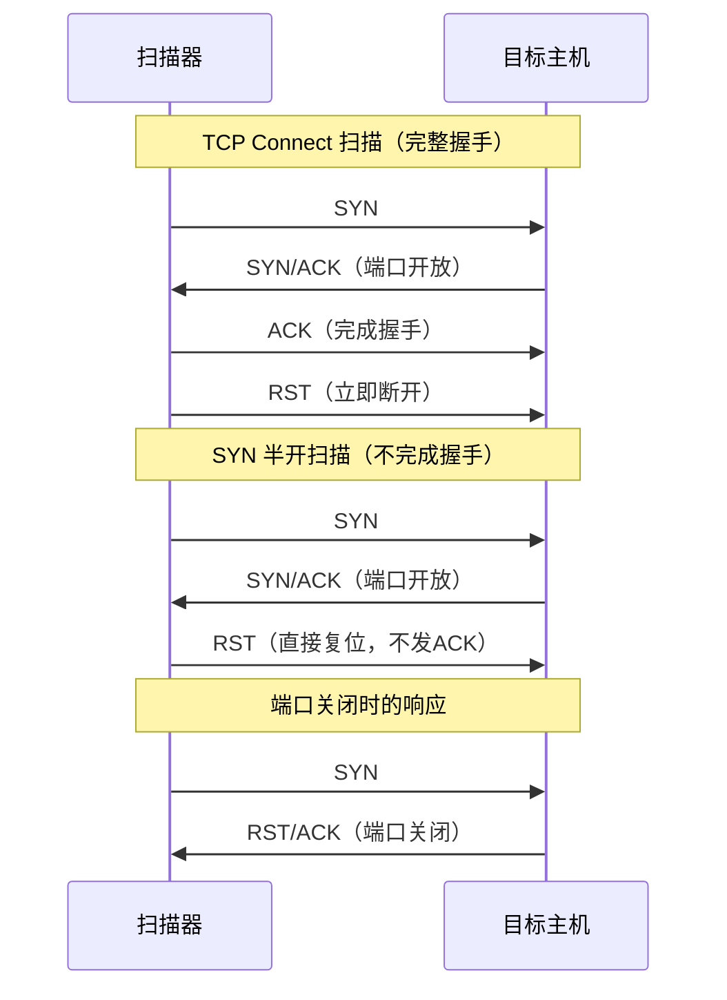

## 案例四：端口扫描与服务识别

端口扫描是渗透测试信息收集阶段的核心环节。攻击者通过端口扫描确定目标主机开放了哪些端口、运行了哪些服务、使用了什么版本的软件，从而为后续的漏洞探测和利用提供精确的攻击面信息。防御者同样需要掌握端口扫描技术，用于审计自己网络的安全暴露面，发现不必要的开放端口和过时的服务版本。

### 4.1 理论基础：理解端口与扫描原理

#### 4.1.1 TCP/IP 端口体系

TCP 和 UDP 协议使用 16 位端口号标识通信端点，范围 0-65535。按照 IANA 的划分：

| 端口范围 | 类别 | 说明 |
|----------|------|------|
| 0-1023 | 知名端口（Well-Known Ports） | 分配给系统服务和特权进程，如 22/SSH、80/HTTP、443/HTTPS |
| 1024-49151 | 注册端口（Registered Ports） | 分配给用户级应用，如 3306/MySQL、8080/Tomcat |
| 49152-65535 | 动态/私有端口（Dynamic Ports） | 操作系统临时分配给客户端连接使用 |

理解端口的三种状态是分析扫描结果的关键：

- **开放（Open）**：目标主机在该端口上监听连接请求，有服务正在运行。
- **关闭（Closed）**：端口可访问，但没有服务监听。目标主机会返回 RST 包表示拒绝连接。
- **过滤（Filtered）**：无法确定端口状态，通常被防火墙或 ACL 规则阻断，扫描包有去无回。

在实际扫描中，nmap 还会识别出更多状态：`open|filtered`（无法区分开放还是过滤）、`closed|filtered`（无法区分关闭还是过滤），这通常出现在 UDP 扫描或使用特定扫描类型时。

#### 4.1.2 TCP 三次握手与扫描类型的对应关系

TCP 连接建立依赖三次握手（SYN → SYN/ACK → ACK），不同扫描类型的本质区别在于握手过程中断的时机：



**TCP Connect 扫描（`-sT`）**：调用操作系统的 `connect()` 系统调用完成完整的三次握手。优点是不需要 root 权限，准确率最高；缺点是在目标系统日志中会留下完整的连接记录，隐蔽性最差。

**SYN 半开扫描（`-sS`）**：只发送 SYN 包，收到 SYN/ACK 后发送 RST 复位而非完成握手。不会在目标的应用层日志中留下记录（但防火墙日志仍可检测）。这是最常用的扫描类型，需要 root 权限（因为需要构造原始套接字）。

**NULL/FIN/XMAS 扫描（`-sN/-sF/-sX`）**：利用 RFC 793 的实现差异。在 RFC 793 标准实现中，关闭的端口收到不带 SYN/ACK/RST 标志的包时返回 RST，而开放的端口会静默丢弃。但 Windows 系统不遵循此标准（所有端口都返回 RST），因此这三种扫描只对 Unix/Linux 目标有效。

#### 4.1.3 服务识别的原理

服务识别分为两个层次：

**端口号映射**：IANA 维护了端口号与服务的标准对应关系（如 22→SSH、80→HTTP），nmap 的 `nmap-services` 数据库包含数千条映射记录。但端口号映射仅供参考——管理员完全可以将 SSH 配置在 80 端口，将 HTTP 跑在 22 端口。

**协议指纹（Banner Grabbing）**：主动与目标端口通信，分析返回的协议特征字符串。例如连接 22 端口时，SSH 服务会返回 `SSH-2.0-OpenSSH_7.6p1 Ubuntu-4ubuntu0.3`，这条 banner 直接暴露了软件名称、版本号和操作系统。nmap 的 `-sV` 选项会发送一系列探测包，将响应与 `nmap-service-probes` 数据库中的数千条指纹进行匹配，识别精度远高于端口号映射。

**操作系统指纹**：不同操作系统实现 TCP/IP 协议栈时有细微差异——初始 TTL 值、TCP 窗口大小、对畸形包的处理方式、IP ID 生成模式等。nmap 的 `-O` 选项向目标发送多种探测包，收集这些特征后与 `nmap-os-db` 数据库比对，推断目标操作系统。需要至少一个开放端口和一个关闭端口才能做出可靠判断。

### 4.2 工具链总览

端口扫描领域有多种工具，各有适用场景：

| 工具 | 核心优势 | 适用场景 | 性能 |
|------|----------|----------|------|
| **nmap** | 功能最全面，NSE 脚本生态强大 | 详细扫描、服务识别、漏洞检测 | 中等（单线程） |
| **masscan** | 速度极快，异步传输 | 大规模网段快速端口发现 | 极高（10M pps） |
| **rustscan** | 自动调用 nmap，先快后细 | 快速定位开放端口后深度扫描 | 高 |
| **zmap** | 互联网级扫描 | 扫描整个互联网的特定端口 | 极高 |
| **netcat (nc)** | 轻量灵活，手动探测 | 单端口验证、Banner 抓取 | 低（手动） |
| **naabu** | Go 编写，ProjectDiscovery 生态 | 与 httpx/subfinder 集成的自动化流程 | 高 |

实际工作中通常组合使用：先用 masscan 快速找出开放端口，再用 nmap 对开放端口进行深度服务识别。

### 4.3 实验一：从零开始的完整端口扫描流程

以下实验以 192.168.1.100 为目标，演示一个完整的端口扫描工作流。所有命令均在授权测试环境中执行。

#### 4.3.1 第一阶段：主机发现

在扫描端口之前，先确认目标网段中哪些主机是存活的，避免浪费时间扫描离线主机。

```bash
# ICMP ping 扫描：发送 ICMP Echo Request，存活主机会回复 Echo Reply
nmap -sn 192.168.1.0/24

# ARP 扫描：在局域网中效率最高，发送 ARP Request 并收集 ARP Reply
# 仅适用于与扫描器在同一子网的场景
nmap -PR -sn 192.168.1.0/24

# TCP ACK 扫描（绕过禁 ping 的主机）：发送 TCP ACK 包到 80 和 443 端口
# 主机会返回 RST 表示端口关闭，间接证明主机存活
nmap -PS80,443 -sn 192.168.1.0/24

# 组合多种探测方式以提高发现率
nmap -PE -PA80,443 -PS443 -PP -sn 192.168.1.0/24
```

各参数含义：
- `-sn`：仅做主机发现，不扫描端口
- `-PE`：ICMP Echo 探测
- `-PA80,443`：TCP ACK 探测指定端口
- `-PS443`：TCP SYN 探测指定端口
- `-PP`：ICMP Timestamp 探测（绕过只禁 Echo 的防火墙）

主机发现结果示例：

```bash
Nmap scan report for 192.168.1.1
Host is up (0.0023s latency).
Nmap scan report for 192.168.1.100
Host is up (0.0018s latency).
Nmap scan report for 192.168.1.105
Host is up (0.0041s latency).
Nmap done: 256 IP addresses (3 hosts up) scanned in 2.34 seconds
```

#### 4.3.2 第二阶段：端口扫描——快速定位开放端口

确定存活主机后，先进行快速扫描缩小范围：

```bash
# 快速扫描 nmap 内置的 100 个最常用端口（约 1 秒完成单主机）
nmap -F 192.168.1.100

# 扫描前 1000 个端口（nmap 默认行为，无需额外指定）
nmap 192.168.1.100

# 扫描指定端口范围
nmap -p 1-1024 192.168.1.100

# 扫描特定端口列表
nmap -p 22,80,443,3306,8080,8443 192.168.1.100

# 全端口扫描（1-65535），耗时较长但不会遗漏
nmap -p- 192.168.1.100

# SYN 半开扫描（隐蔽性好，需要 root/sudo 权限）
sudo nmap -sS 192.168.1.100
```

**扫描速度控制**：nmap 提供 `-T` 参数控制时序模板：

| 模板 | 名称 | 适用场景 | 特点 |
|------|------|----------|------|
| `-T0` | Paranoid | IDS 绕过 | 极慢，每包间隔 5 分钟 |
| `-T1` | Sneaky | IDS 绕过 | 慢，每包间隔 15 秒 |
| `-T2` | Polite | 降低网络负载 | 每包间隔 0.4 秒 |
| `-T3` | Normal | 默认值 | 正常速度 |
| `-T4` | Aggressive | 快速网络 | 较快，可能丢失精度 |
| `-T5` | Insane | 高速网络 | 极快，容易丢失精度 |

```bash
# 激进模式快速扫描
nmap -T4 -F 192.168.1.100

# 针对性调整并发参数
nmap --min-rate 1000 --max-retries 2 -p- 192.168.1.100
```

#### 4.3.3 第三阶段：服务版本与操作系统识别

在定位到开放端口后，深入探测每个端口上运行的服务和目标操作系统：

```bash
# 服务版本检测：向开放端口发送探测包并匹配指纹数据库
nmap -sV 192.168.1.100

# 版本检测强度控制（0-9，数字越大探测越激进，越慢但越准确）
nmap -sV --version-intensity 5 192.168.1.100

# 操作系统检测
sudo nmap -O 192.168.1.100

# 组合：服务版本 + 操作系统 + 默认脚本
sudo nmap -sV -O -sC 192.168.1.100

# 仅对已发现的开放端口做深度探测（避免重复全端口扫描）
sudo nmap -sV -O -p 22,80,443,3306,8080 192.168.1.100
```

服务版本检测结果解读：

```text
PORT     STATE SERVICE     VERSION
22/tcp   open  ssh         OpenSSH 7.6p1 Ubuntu-4ubuntu0.3 (Ubuntu Linux; protocol 2.0)
80/tcp   open  http        Apache httpd 2.4.29 ((Ubuntu))
443/tcp  open  ssl/https   Apache httpd 2.4.29 ((Ubuntu))
3306/tcp open  mysql       MySQL 5.7.23-0ubuntu0.18.04.1
8080/tcp open  http-proxy  Squid http proxy 3.5.27
Service Info: OS: Linux; CPE: cpe:/o:linux:linux_kernel
```

从这个结果可以提取的关键情报：

| 端口 | 服务 | 版本信息 | 潜在风险 |
|------|------|----------|----------|
| 22 | SSH | OpenSSH 7.6p1 | 该版本存在用户名枚举漏洞（CVE-2018-15473） |
| 80 | HTTP | Apache 2.4.29 | 该版本存在路径穿越漏洞（CVE-2021-41773，需确认子版本） |
| 443 | HTTPS | Apache 2.4.29 | 同上，且需检查 SSL/TLS 配置是否安全 |
| 3306 | MySQL | 5.7.23 | 数据库直接暴露在外部网络，可能有默认凭据 |
| 8080 | HTTP Proxy | Squid 3.5.27 | 代理服务暴露可能被滥用为匿名跳板 |

#### 4.3.4 第四阶段：NSE 脚本深度检测

Nmap Scripting Engine（NSE）是 nmap 最强大的功能之一，使用 Lua 脚本实现自动化检测。nmap 自带约 600 个脚本，涵盖漏洞检测、认证暴力破解、服务枚举等场景。

```bash
# 运行默认脚本集（等价于 -sC，包含 banner 抓取、SSL 证书检查等）
nmap -sC 192.168.1.100

# 漏洞检测脚本集：检测已知漏洞
nmap --script vuln 192.168.1.100

# HTTP 枚举：发现 Web 目录、CMS 类型、robots.txt 等
nmap --script http-enum 192.168.1.100

# SMB 枚举：发现共享资源和用户列表（Windows 目标常用）
nmap --script smb-enum-shares,smb-enum-users 192.168.1.100

# SSL/TLS 安全检测：检查证书、支持的密码套件、已知漏洞
nmap --script ssl-enum-ciphers,ssl-heartbleed -p 443 192.168.1.100

# MySQL 枚举：获取数据库用户、空密码检测
nmap --script mysql-enum,mysql-empty-password -p 3306 192.168.1.100

# SSH 安全检测：支持的算法、弱密钥检测
nmap --script ssh2-enum-algos,ssh-hostkey -p 22 192.168.1.100

# 组合多个脚本
nmap --script "default or vuln or safe" 192.168.1.100

# 指定脚本并传入参数
nmap --script http-brute --script-args http-brute.path=/admin -p 80 192.168.1.100
```

NSE 脚本分类说明：

| 类别 | 说明 | 风险等级 |
|------|------|----------|
| `default` | 默认脚本，安全且有用 | 低 |
| `safe` | 不会影响目标的脚本 | 低 |
| `intrusive` | 可能影响目标服务的脚本 | 中 |
| `vuln` | 漏洞检测脚本 | 中 |
| `exploit` | 漏洞利用脚本 | 高 |
| `brute` | 暴力破解脚本 | 高 |
| `dos` | 拒绝服务测试脚本 | 极高 |

### 4.4 实验二：大规模网络快速扫描

当扫描目标不是一个主机而是一个大的网段（如 /16 或整个 B 段）时，nmap 的单线程架构会成为瓶颈。此时应使用专用的高速扫描工具。

#### 4.4.1 使用 masscan 进行高速端口发现

masscan 使用自定义的 TCP/IP 栈实现异步传输，理论扫描速度可达每秒 1000 万个包。

```bash
# 安装 masscan
sudo apt install masscan        # Debian/Ubuntu
sudo yum install masscan        # CentOS/RHEL

# 扫描整个 /24 子网的 80 和 443 端口
masscan 192.168.1.0/24 -p 80,443 --rate=1000

# 扫描更大网段，输出到文件
masscan 10.0.0.0/8 -p 22,80,443,3306,8080 --rate=10000 -oL masscan_results.txt

# 输出格式：与 nmap 兼容的 XML 格式
masscan 192.168.1.0/24 -p 1-65535 --rate=5000 -oX masscan_results.xml

# 配合 nmap：先用 masscan 找开放端口，再用 nmap 深度探测
masscan 192.168.1.0/24 -p 1-65535 --rate=10000 -oL - | \
  awk '/open/{print $4}' | sort -u > alive_ips.txt
# 对每个存活 IP 进行 nmap 深度扫描
for ip in $(cat alive_ips.txt); do
  nmap -sV -sC -oN "nmap_${ip}.txt" "$ip"
done
```

masscan 注意事项：
- masscan 可能产生误报，需要用 nmap 复验
- 扫描速率需要根据网络带宽调整，过高会导致丢包和误报
- masscan 不支持服务版本检测，需要配合 nmap 使用
- 在生产环境使用前务必降低速率并确认授权

#### 4.4.2 使用 rustscan 加速 nmap

rustscan 用 Rust 编写，利用异步 I/O 快速识别开放端口，然后自动将结果传递给 nmap 进行深度扫描：

```bash
# 安装 rustscan
# 从 GitHub releases 下载 deb/rpm 包
wget https://github.com/RustScan/RustScan/releases/latest/download/rustscan_2.3.0_amd64.deb
sudo dpkg -i rustscan_2.3.0_amd64.deb

# 基本使用：自动发现开放端口后调用 nmap
rustscan -a 192.168.1.100 -- -sV -sC

# 指定端口范围和批处理大小
rustscan -a 192.168.1.100 -b 500 -p 1-65535 -- -sV

# 扫描多目标
rustscan -a 192.168.1.100,192.168.1.101,192.168.1.102 -- -sV -O
```

### 4.5 实验三：手动服务识别与 Banner 抓取

自动化工具并非万能。在某些场景下（工具无法识别的服务、非标准协议、自定义应用），需要手动与端口交互进行识别。

#### 4.5.1 使用 netcat 手动抓取 Banner

```bash
# 连接 SSH 端口，等待 banner
nc -nv 192.168.1.100 22
# 输出示例: SSH-2.0-OpenSSH_7.6p1 Ubuntu-4ubuntu0.3

# 连接 HTTP 端口，发送 HTTP 请求
echo -e "HEAD / HTTP/1.1\r\nHost: 192.168.1.100\r\n\r\n" | nc -nv 192.168.1.100 80
# 返回的 Server 头: Server: Apache/2.4.29 (Ubuntu)

# 连接 SMTP 端口，抓取邮件服务器 banner
nc -nv 192.168.1.100 25
# 输出示例: 220 mail.example.com ESMTP Postfix (Ubuntu)

# 连接 FTP 端口
nc -nv 192.168.1.100 21
# 输出示例: 220 (vsFTPd 3.0.3)

# 连接 MySQL 端口（MySQL 使用二进制协议，直接连接会有二进制响应）
nc -nv 192.168.1.100 3306 | strings
```

#### 4.5.2 使用 nmap 进行精确的 Banner 抓取

```bash
# 启用 banner 抓取（包含在 -sV 中，也可单独使用）
nmap -sV --version-all -p 22,80,443 192.168.1.100

# 使用 banner 脚本
nmap --script banner -p 21,22,25,80,110,143,443 192.168.1.100
```

#### 4.5.3 使用 curl/openssl 识别 Web 和 SSL 服务

```bash
# HTTP 服务识别
curl -sI http://192.168.1.100 | head -20
# 关注 Server、X-Powered-By 等头部

# HTTPS 证书信息
openssl s_client -connect 192.168.1.100:443 </dev/null 2>/dev/null | \
  openssl x509 -noout -subject -issuer -dates -fingerprint

# 检测 SSL/TLS 版本支持
nmap --script ssl-enum-ciphers -p 443 192.168.1.100
```

### 4.6 实验四：绕过防火墙的扫描技术

许多生产环境部署了防火墙和 IDS/IPS，常规扫描可能被阻断或触发告警。以下是几种常见的绕过技术。

#### 4.6.1 分片扫描

将 TCP 包拆分成多个 IP 分片发送，某些简单的包过滤防火墙无法重组分片，从而放行这些"不完整"的包：

```bash
# -f 设置分片，每个分片只有 8 字节的 TCP 数据
sudo nmap -f 192.168.1.100

# 使用更小的分片
sudo nmap -ff 192.168.1.100

# 自定义 MTU
sudo nmap --mtu 24 192.168.1.100
```

#### 4.6.2 源端口欺骗

防火墙通常配置为允许来自特定端口（如 53/DNS、80/HTTP）的流量。通过将扫描包的源端口设置为这些"白名单"端口，可能绕过防火墙规则：

```bash
# 使用 53 端口作为源端口（伪装为 DNS 流量）
sudo nmap --source-port 53 192.168.1.100

# 使用 80 端口作为源端口（伪装为 Web 流量）
sudo nmap -g 80 192.168.1.100
```

#### 4.6.3 慢速扫描（IDS 绕过）

通过降低扫描速度，使流量不触发 IDS 的阈值告警：

```bash
# 极慢扫描，每个探测间隔 15 秒
sudo nmap -T1 192.168.1.100

# 随机化扫描顺序
nmap --randomize-hosts -p 1-1000 192.168.1.0/24

# 限制扫描速率（每秒最多 10 个包）
nmap --max-rate 10 -p 1-1000 192.168.1.100
```

#### 4.6.4 空闲扫描（Idle Scan）

利用一个空闲主机作为"僵尸"，通过观察其 IP ID 变化来推断目标端口状态，扫描者的真实 IP 完全不会出现在目标的日志中：

```bash
# 寻找合适的僵尸主机（IP ID 递增且可预测）
nmap -sI zombie_host:port 192.168.1.100

# 实际操作示例
sudo nmap -Pn -sI 192.168.1.50:80 -p 22,80,443 192.168.1.100
```

空闲扫描原理简述：
1. 向僵尸主机发送 SYN/ACK，记录返回的 RST 包中的 IP ID 值
2. 伪装僵尸主机的 IP 向目标发送 SYN 包
3. 如果目标端口开放，目标会向僵尸主机发送 SYN/ACK，僵尸主机回复 RST 使 IP ID +1
4. 如果目标端口关闭，目标会向僵尸主机发送 RST，僵尸主机不会回复，IP ID 不变
5. 再次探测僵尸主机的 IP ID，如果 IP ID 增加了 2（步骤 1 的 RST + 步骤 4 的 RST），说明目标端口开放

### 4.7 扫描结果的系统化分析方法

端口扫描的价值不在扫描本身，而在于对结果的分析和解读。

#### 4.7.1 分析框架

拿到扫描结果后，按照以下维度进行分析：

**攻击面评估**：
1. 开放了多少个端口？与基线相比是否异常增多？
2. 哪些端口暴露了不应该对外的服务？（如 3306/MySQL、6379/Redis）
3. 哪些服务运行了已知有漏洞的版本？

**服务版本风险映射**：

| 服务 | 高风险版本特征 | 检查方法 |
|------|----------------|----------|
| Apache/Nginx | 版本号低于最新稳定版 2 个大版本以上 | 与官方 changelog 对比 |
| OpenSSH | 低于 8.0 版本存在多个已知漏洞 | CVE 数据库查询 |
| MySQL/PostgreSQL | 直接暴露在非可信网络 | 网络拓扑分析 |
| FTP (vsftpd/proftpd) | 匿名登录启用、明文传输 | 直接连接测试 |
| Redis/Memcached | 默认无认证，暴露在外部 | 连接尝试 |
| SMB (445) | SMBv1 启用、匿名访问 | nmap SMB 脚本 |

**网络分段验证**：
- 数据库端口（3306、5432、27017）应只在内网可达
- 管理端口（22、3389、9090）应限制访问源 IP
- 缓存端口（6379、11211）不应对外暴露

#### 4.7.2 将扫描结果转化为下一步行动

```text
开放端口发现
├── Web 服务（80/443/8080）
│   ├── 目录枚举 → dirb / gobuster
│   ├── 漏洞扫描 → nikto / nuclei
│   └── 抓包分析 → burp suite
├── SSH 服务（22）
│   ├── 版本漏洞检查 → searchsploit
│   └── 弱口令测试 → hydra / medusa
├── 数据库（3306/5432/27017）
│   ├── 默认凭据尝试
│   └── 未授权访问测试
├── SMB（445）
│   ├── 共享枚举 → enum4linux / smbclient
│   └── 漏洞检测 → eternalblue / printnightmare
└── 其他服务
    ├── Banner 分析确认版本
    └── searchsploit / CVE 查询
```

### 4.8 常见误区与纠正

**误区一：只扫描 1-1024 端口就够了**

纠正：很多高价值服务运行在高位端口——8080/8443（Web）、9200（Elasticsearch）、27017（MongoDB）、6379（Redis）、2375（Docker API）。实战中应至少扫描前 10000 端口，完整评估应扫描全端口（`-p-`）。

**误区二：端口号等于服务类型**

纠正：端口号只是 IANA 的建议分配。管理员可以将任何服务配置在任何端口。仅依赖端口号判断服务类型是不可靠的，必须结合 banner 抓取和协议指纹匹配。

**误区三：nmap 报告的版本号一定准确**

纠正：nmap 的版本匹配基于响应指纹，可能被以下因素干扰：管理员修改了 banner（如 Apache 的 `ServerTokens` 配置）、服务前面有代理/WAF、服务版本刚好处于两个指纹之间无法确定。版本号应作为线索而非定论，需要后续手动验证。

**误区四：扫描不会被发现**

纠正：任何主动扫描都会在目标网络中留下痕迹——防火墙日志、IDS 告警、NetFlow 流量记录。即使使用 SYN 半开扫描，异常的 SYN/RST 比率也会触发告警。在授权测试中这不影响操作，但要意识到扫描行为的可观测性。

**误区五：一次扫描就够了**

纠正：网络环境是动态的。新服务可能上线，旧服务可能下线，防火墙规则可能变更。定期扫描并建立基线对比才有意义——发现新增的开放端口比已知的开放端口更有价值。

### 4.9 合规与伦理

端口扫描技术的使用必须遵守法律和职业道德：

1. **获取书面授权**：在对任何非自己所有的目标进行扫描之前，必须获得系统所有者的书面授权。未经授权的扫描在许多司法管辖区属于违法行为。
2. **明确扫描范围**：授权文档应明确扫描的目标 IP 范围、端口范围、时间窗口和使用的工具/技术。
3. **控制扫描影响**：避免对生产系统使用过于激进的扫描参数（如 `-T5`、`--script dos`），防止造成服务中断。
4. **保护扫描数据**：扫描结果包含敏感的网络拓扑和漏洞信息，应按照授权文档的要求妥善存储和销毁。
5. **仅在授权范围内操作**：发现未授权的开放端口或服务，应在报告中记录但不进行进一步的漏洞利用测试，除非授权范围明确包含。

### 4.10 本案例核心命令速查

```bash
# === 主机发现 ===
nmap -sn 192.168.1.0/24                    # Ping 扫描发现存活主机
nmap -PR -sn 192.168.1.0/24                # ARP 扫描（局域网最快）

# === 端口扫描 ===
nmap -F 192.168.1.100                       # 快速扫描 100 个常用端口
nmap -p- 192.168.1.100                      # 全端口扫描
sudo nmap -sS 192.168.1.100                 # SYN 半开扫描（隐蔽）
nmap -p 1-1024 192.168.1.100               # 指定端口范围

# === 服务与系统识别 ===
nmap -sV 192.168.1.100                      # 服务版本检测
sudo nmap -O 192.168.1.100                  # 操作系统检测
sudo nmap -sV -O -sC 192.168.1.100         # 组合：版本+OS+默认脚本

# === NSE 脚本深度检测 ===
nmap -sC 192.168.1.100                      # 默认脚本扫描
nmap --script vuln 192.168.1.100            # 漏洞检测
nmap --script http-enum 192.168.1.100       # HTTP 目录枚举
nmap --script ssl-enum-ciphers -p 443 192.168.1.100  # SSL 安全检测

# === 防火墙绕过 ===
sudo nmap -f 192.168.1.100                  # 分片扫描
sudo nmap -g 53 192.168.1.100              # 源端口欺骗
sudo nmap -T1 192.168.1.100                # 慢速扫描

# === 高速扫描 ===
masscan 192.168.1.0/24 -p 1-65535 --rate=10000  # 全端口高速扫描
rustscan -a 192.168.1.100 -- -sV -sC       # 快速发现+深度扫描

# === 手动 Banner 抓取 ===
nc -nv 192.168.1.100 22                     # SSH banner
echo -e "HEAD / HTTP/1.1\r\nHost: x\r\n\r\n" | nc 192.168.1.100 80  # HTTP header
```
