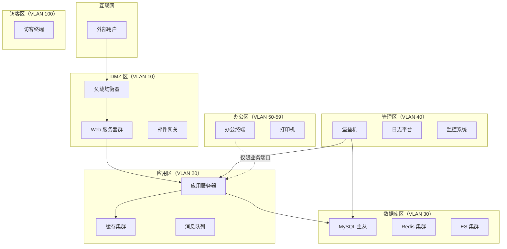

## 案例八：企业网络架构安全评估

企业网络架构安全评估是一项系统性工程，它不是简单地扫描几个端口或检查几条防火墙规则，而是从**架构设计层面**审视整个网络的安全性。本案例通过一个完整的评估项目，展示如何对企业网络进行全面的安全体检，发现深层次的架构缺陷，并给出可落地的整改方案。

### 评估背景与目标

#### 企业概况

评估对象为一家快速成长中的电商企业，主要业务数据如下：

| 指标 | 数值 |
|------|------|
| 员工人数 | 500+（含远程办公人员约 120 人） |
| 分支机构 | 总部 + 3 个仓储中心 + 1 个异地研发中心 |
| 服务器数量 | 物理服务器 15 台，云主机 40+ 台 |
| 网络设备 | 核心交换机 4 台，接入交换机 30+ 台，AP 60+ 个 |
| 日均交易量 | 10 万+ 笔 |
| 合规要求 | 等保 2.0 三级、PCI-DSS |

该企业近三年经历了快速扩张，IT 基础设施是"边跑边建"的典型模式——业务需求跑在前面，安全建设远远落后。近期发生了两起安全事件：一次是员工终端中勒索病毒横向扩散到文件服务器，另一次是外部渗透测试团队仅用 4 小时就从互联网边界打进了数据库区。这促使管理层决定进行一次全面的网络架构安全评估。

#### 评估范围与方法论

评估采用**PTES（渗透测试执行标准）**框架，结合等保 2.0 技术要求，覆盖以下维度：

```text
评估维度：
├── 网络架构设计
│   ├── 网络拓扑合理性
│   ├── 分段与隔离策略
│   └── 冗余与容灾设计
├── 边界安全
│   ├── 防火墙策略
│   ├── 入侵防御能力
│   └── 远程接入安全
├── 内部安全
│   ├── 横向移动防护
│   ├── 权限控制粒度
│   └── 资产可见性
├── 监控与响应
│   ├── 日志采集覆盖率
│   ├── 告警响应时效
│   └── 事件溯源能力
└── 安全管理
    ├── 策略与制度
    ├── 变更管理流程
    └── 人员安全意识
```

评估方法综合运用了以下手段：

1. **文档审查**：审查网络拓扑图、防火墙策略表、安全制度文件
2. **配置核查**：对网络设备、安全设备进行配置合规性检查
3. **主动扫描**：使用 Nmap、Nessus 进行端口扫描和漏洞扫描
4. **被动监听**：在关键节点部署流量镜像，分析实际流量模式
5. **渗透测试**：模拟攻击者视角，验证安全控制的有效性
6. **人员访谈**：与 IT 运维、安全团队、业务负责人深度交流

### 评估发现：七大安全问题

经过为期三周的评估，共发现 **47 项安全问题**，按严重程度分为四级。以下按风险等级从高到低展开分析。

#### 问题一：网络分段严重缺失（高危）

**现状描述**：整个企业网络仅使用了两个 VLAN——一个用于办公终端，一个用于服务器。访客 Wi-Fi 虽然有独立 SSID，但流量最终汇聚到同一个三层网段。这意味着 500 多台终端设备和所有服务器处于同一个广播域中。

**问题分析**：缺乏网络分段是企业网络安全中最常见也最致命的架构缺陷。它的危害不仅仅是"广播风暴"这种性能问题，更重要的是安全层面：

- **勒索病毒横向传播**：一旦某台终端感染，同网段内所有设备都在攻击半径内。前面提到的勒索病毒事件正是因此扩散到文件服务器。
- **内网渗透畅通无阻**：渗透测试人员获取一台终端的权限后，可以直接扫描整个网段的所有服务，无需突破任何额外边界。
- **敏感数据无隔离**：财务系统、HR 系统、代码仓库与普通办公终端在同一网段，一旦边界失守，核心数据直接暴露。

**技术验证**：我们使用 Nmap 对整个网段进行了存活主机扫描和端口扫描：

```bash
# 扫描整个 /22 网段的存活主机
nmap -sn 10.0.0.0/22 -oA host_discovery

# 对发现的存活主机进行服务版本识别
nmap -sV -O --top-ports 1000 -iL live_hosts.txt -oA service_scan

# 结果统计
# 存活主机: 487 台
# 发现 MySQL(3306): 8 台 (含生产数据库)
# 发现 RDP(3389): 124 台
# 发现 SMB(445): 312 台
# 发现 SSH(22): 67 台
```

从一台普通办公终端出发，无需任何额外凭证即可直接访问生产数据库的 3306 端口——这在分段良好的网络中是不可想象的。

**正确架构示意**：



每个安全域之间的流量必须经过防火墙策略控制，遵循最小权限原则。

#### 问题二：防火墙策略形同虚设（高危）

**现状描述**：企业的互联网边界防火墙（一台 FortiGate 600E）上配置了 **380+ 条安全策略**，其中大量规则使用了 `any-any-allow` 的宽泛匹配。内部防火墙更是几乎没有策略——因为"怕影响业务"。

**问题分析**：我们导出了完整的防火墙策略进行审查：

```bash
# 导出 FortiGate 策略配置
ssh admin@firewall "show firewall policy" > fw_policy.txt

# 统计分析
echo "总策略数: $(grep -c 'edit [0-9]' fw_policy.txt)"
echo "源地址为 any 的策略: $(grep -B5 'srcaddr.*any' fw_policy.txt | grep -c 'edit')"
echo "目标地址为 any 的策略: $(grep -B5 'dstaddr.*any' fw_policy.txt | grep -c 'edit')"
echo "动作为 accept 的策略: $(grep -c 'set action accept' fw_policy.txt)"
echo "启用日志的策略: $(grep -c 'set logtraffic all' fw_policy.txt)"
```

审查发现以下典型问题策略：

| 策略编号 | 源 | 目标 | 服务 | 动作 | 风险 |
|----------|------|------|------|------|------|
| 15 | any | any | HTTP/HTTPS | allow | 互联网出口完全开放 |
| 47 | Office_VLAN | Server_VLAN | any | allow | 办公区可访问服务器所有端口 |
| 62 | any | DMZ | SSH | allow | SSH 暴露在互联网 |
| 78 | any | DB_VLAN | MySQL | allow | 数据库对全网开放 |

**整改方案**——分三阶段收紧策略：

**第一阶段（1-2 周）：高危策略紧急封堵**

```text
# 封堵互联网到内部的直接数据库访问
config firewall policy
    edit 78
        set status disable
    next
end

# 限制 SSH 仅允许堡垒机来源
config firewall policy
    edit 62
        set srcaddr "JumpServer_IP"
        set dstaddr "DMZ_Servers"
        set service "SSH"
        set action accept
        set logtraffic all
    next
end
```

**第二阶段（3-4 周）：策略精细化**

逐一梳理业务流量，建立基于应用的访问矩阵，将 `any-any` 替换为精确的五元组策略（源 IP、目标 IP、源端口、目标端口、协议）。

**第三阶段（持续）：策略生命周期管理**

建立策略审批流程，每条新策略必须有业务负责人签字和到期时间，季度审计清理过期策略。

#### 问题三：无线网络安全配置不当（高危）

**现状描述**：企业 Wi-Fi 使用 WPA2-PSK 认证，密码为 `Company@2024`，且所有部门共用同一个 SSID 和密码。密码自部署以来从未更换。访客 Wi-Fi 虽然有独立 SSID，但未做流量隔离，访客可以直接访问内部资源。

**问题分析**：

- **弱共享密钥**：WPA2-PSK 模式下，所有用户共享同一个预共享密钥。只要有一名员工将密码告知访客或离职后未更换密码，安全性就归零。
- **无 802.1X**：没有部署 RADIUS 服务器，无法实现每用户独立认证和动态 VLAN 分配。
- **访客网络未隔离**：访客接入后可发现内部主机，使用 `arp-scan` 即可获得完整内网资产清单。

**验证过程**：

```bash
# 使用 aircrack-ng 抓取 WPA2 握手包
airodump-ng wlan0mon --bssid <AP_MAC> -w capture

# 使用 hashcat 离线破解（弱密码秒破）
hashcat -m 22000 capture.hc22000 rockyou.txt

# 破解成功后连接 Wi-Fi，扫描内网
nmap -sn 10.0.0.0/16
# 发现 500+ 台设备，包括服务器、打印机、IP 摄像头等
```

**整改方案**：

```text
无线安全升级路线：
1. 部署 RADIUS 服务器（FreeRADIUS 或 Windows NPS）
2. 配置 802.1X + EAP-TLS（证书认证）
3. 实施动态 VLAN：按用户角色自动分配到对应 VLAN
4. 访客网络启用客户端隔离 + 强制走独立出口
5. 无线控制器上配置 WIDS/WIPS（无线入侵检测/防御）
```

#### 问题四：缺乏入侵检测与防御体系（高危）

**现状描述**：企业没有部署任何 IDS/IPS 系统。防火墙虽然有 IPS 模块但一直未开启——原因是"怕误报影响业务"。安全事件的发现完全依赖人工巡检和用户报告，平均发现时间超过 **72 小时**。

**问题分析**：没有入侵检测能力，意味着企业对网络攻击是"盲人摸象"状态。前面提到的渗透测试案例中，攻击者在内网横向移动了 4 小时，期间没有任何告警产生。

**检测能力缺口分析**：

| 攻击阶段 | 需要的检测能力 | 当前状态 | 缺口 |
|----------|----------------|----------|------|
| 侦察阶段 | 端口扫描检测 | 无 | 无法发现前期探测 |
| 突破阶段 | 漏洞利用检测 | 防火墙日志（未分析） | 被动记录无法实时告警 |
| 横向移动 | 内网异常流量检测 | 无 | 攻击者自由移动 |
| 数据窃取 | 大小数据外传检测 | 无 | 数据泄露无感知 |
| 持久化 | 异常进程/连接检测 | 无 | 后门长期潜伏 |

**整改方案——分层检测架构**：

```text
分层检测部署方案：
├── 网络层检测
│   ├── 边界 IDS/IPS（Suricata + 开放规则集）
│   │   ├── 部署位置：互联网出口、DMZ 旁路
│   │   ├── 规则源：ET Open + 自定义规则
│   │   └── 联动：与防火墙自动封禁
│   ├── 内网流量分析（Zeek/Bro）
│   │   ├── 部署位置：核心交换机镜像口
│   │   ├── 功能：协议解析、连接日志、异常检测
│   │   └── 输出：JSON 格式日志 → SIEM
│   └── DNS 流量监控
│       ├── 部署位置：DNS 服务器旁路
│       ├── 功能：DNS 隧道检测、DGA 域名识别
│       └── 工具：PassiveDNS + 自定义规则
├── 主机层检测
│   ├── EDR（端点检测与响应）
│   │   ├── 覆盖范围：所有服务器 + 终端
│   │   ├── 功能：进程行为监控、文件完整性检查
│   │   └── 推荐：Wazuh（开源）或商业方案
│   └── HIDS（主机入侵检测）
│       ├── 工具：OSSEC/Wazuh Agent
│       ├── 检测项：异常登录、权限变更、日志篡改
│       └── 联动：告警 → SIEM → 自动响应
└── 日志分析层
    └── SIEM 平台
        ├── 日志源：所有网络设备 + 安全设备 + 服务器
        ├── 关联分析：多源日志关联，识别复杂攻击
        ├── 告警分级：按风险评分自动分级
        └── 可视化：攻击链展示、资产风险画像
```

推荐使用 Suricata 作为网络 IDS 的核心引擎，以下是基础部署配置：

```yaml
# /etc/suricata/suricata.yaml
vars:
  address-groups:
    HOME_NET: "[10.0.0.0/8]"
    EXTERNAL_NET: "!$HOME_NET"
  port-groups:
    HTTP_PORTS: "[80,8080,443,8443]"

outputs:
  - eve-log:
      enabled: yes
      filetype: regular
      filename: eve.json
      types:
        - alert
        - dns
        - http
        - tls
        - files

rule-files:
  - suricata.rules          # ET Open 规则集
  - local.rules             # 自定义规则

# 自定义规则示例：检测内网端口扫描
# alert tcp $HOME_NET any -> $HOME_NET any (msg:"内网端口扫描检测"; \
#   flags:S; threshold:type both, track by_src, count 30, seconds 60; \
#   sid:1000001; rev:1;)
```

#### 问题五：VPN 配置存在严重安全隐患（中危）

**现状描述**：远程办公人员使用 PPTP VPN 接入公司网络。VPN 账号由 IT 管理员手动创建，密码策略为"初始密码 Aa123456，用户自行修改"。离职人员的 VPN 账号清理依赖 IT 人员手动执行——但没有交接清单，遗漏时有发生。更严重的是，VPN 接入后即获得完整的内网访问权限，没有任何网段限制。

**问题分析**：

- **PPTP 协议过时**：PPTP 使用 MS-CHAPv2 认证，已被证明可在 23 小时内暴力破解。微软自身已于 2012 年建议弃用 PPTP。
- **无 MFA**：仅靠密码认证，一旦密码泄露（钓鱼、撞库），攻击者即可直接接入内网。
- **无网络准入控制**：VPN 用户直接进入内部网络，没有设备合规性检查（操作系统补丁、杀毒软件状态等）。
- **离职清理流程缺失**：评估期间我们发现仍有 7 个已离职员工的 VPN 账号处于活跃状态。

**验证过程**：

```bash
# 检测 VPN 类型
nmap -sU -p 1723 <VPN_Server_IP>
# PORT    STATE  SERVICE
# 1723/udp open   pptp

# 使用 ike-scan 检测 IKE VPN（如果有）
ike-scan <VPN_Server_IP>

# 尝试连接离职员工账号（使用已知的弱密码模式）
# 成功连接后测试网络访问范围
ping 10.0.1.100   # 数据库服务器 - 可达
ping 10.0.2.50    # 文件服务器 - 可达
ping 10.0.3.200   # 核心交换机管理口 - 可达
```

**整改方案**：

```text
VPN 安全升级方案：
1. 协议升级：PPTP → IPSec/IKEv2 或 WireGuard
2. 强制 MFA：集成 TOTP（Google Authenticator）或硬件 Key
3. 网络准入控制：
   - VPN 接入前检查设备合规性
   - 按角色分配不同的网络访问权限
   - 建立 VPN 专用 VLAN，不直接桥接内网
4. 账号生命周期管理：
   - VPN 账号与 HR 系统联动
   - 离职自动禁用
   - 定期审计活跃账号
5. 连接日志审计：
   - 记录所有 VPN 连接/断开事件
   - 异常登录行为告警（非工作时间、异地登录）
```

#### 问题六：日志管理碎片化（中危）

**现状描述**：各设备日志独立存储，没有统一的日志管理平台。防火墙日志保留 7 天，服务器系统日志保留 14 天，应用日志保留 30 天但存储在本地磁盘。一旦发生安全事件，需要逐台设备登录查找日志，严重影响应急响应效率。

**问题分析**：日志是安全事件溯源的核心证据。碎片化的日志管理带来三个致命问题：

1. **取证困难**：安全事件发生后，关键日志可能已被覆盖或清理
2. **关联分析不可能**：无法将防火墙日志、系统日志、应用日志进行时间线关联
3. **合规不满足**：等保 2.0 要求日志保留至少 6 个月

**整改方案——集中日志管理架构**：

```text
集中日志平台架构：
┌─────────────────────────────────────────┐
│              日志采集层                    │
│  Syslog Agent │ Filebeat │ Winlogbeat   │
│  (网络设备)     │ (Linux)   │ (Windows)   │
└────────────┬────────────────────────────┘
             │
             ▼
┌─────────────────────────────────────────┐
│              日志传输层                    │
│           Kafka / Redis                  │
│      (缓冲、削峰、解耦)                   │
└────────────┬────────────────────────────┘
             │
             ▼
┌─────────────────────────────────────────┐
│              日志存储与分析层              │
│     Elasticsearch / ClickHouse          │
│     (全文检索 / 快速聚合查询)             │
└────────────┬────────────────────────────┘
             │
             ▼
┌─────────────────────────────────────────┐
│              日志展示与告警层              │
│     Kibana / Grafana + 告警引擎         │
│     (可视化、关联分析、实时告警)           │
└─────────────────────────────────────────┘
```

日志采集配置示例（Syslog 转发到集中平台）：

```bash
# 网络设备日志转发（以 Cisco 为例）
logging host 10.0.4.10 transport tcp port 514
logging trap informational
logging source-interface Loopback0

# Linux 服务器日志采集（Filebeat 配置）
# /etc/filebeat/filebeat.yml
filebeat.inputs:
  - type: log
    paths:
      - /var/log/auth.log
      - /var/log/syslog
      - /var/log/nginx/access.log
    fields:
      env: production
      role: web-server

output.elasticsearch:
  hosts: ["10.0.4.10:9200"]
  index: "syslog-%{+yyyy.MM.dd}"
```

#### 问题七：缺乏安全事件应急响应机制（中危）

**现状描述**：企业没有正式的安全事件应急响应预案。发生安全事件时，响应流程完全依赖个人经验。IT 团队对"什么是安全事件""发现后应该做什么""谁负责什么"没有清晰的认知。

**问题分析**：在勒索病毒事件中，企业花费了 8 小时才完成初步隔离，期间病毒持续扩散。如果有一个完善的应急响应机制，这个时间可以缩短到 30 分钟以内。

**应急响应流程设计**：

```text
安全事件应急响应流程（6 阶段）：

第一阶段：准备（常态化）
├── 建立安全事件分级标准
│   ├── P1-紧急：数据泄露、勒索攻击、业务中断
│   ├── P2-高危：系统被入侵、恶意代码感染
│   ├── P3-中危：可疑访问、策略违规
│   └── P4-低危：扫描探测、异常流量
├── 建立应急响应团队（CSIRT）
├── 准备应急工具箱（取证、隔离、恢复工具）
└── 定期演练（每季度一次桌面推演）

第二阶段：检测与分析
├── 确认事件真实性（排除误报）
├── 确定事件范围（受影响系统、数据）
├── 初步评估影响（业务影响、数据泄露）
└── 升级通知（根据级别通知对应管理层）

第三阶段：遏制
├── 短期遏制：隔离受影响系统（断网、封账号）
├── 长期遏制：修补漏洞、加固配置
└── 证据保全：磁盘镜像、内存快照、日志导出

第四阶段：根除
├── 清除恶意代码/后门
├── 修补被利用的漏洞
└── 验证清理效果

第五阶段：恢复
├── 从备份恢复数据
├── 恢复业务服务
├── 持续监控（至少 72 小时加强监控）
└── 确认完全恢复

第六阶段：总结
├── 编写事件报告
├── 根因分析（Root Cause Analysis）
├── 改进措施制定与落实
└── 更新应急响应预案
```

### 评估总结与整改路线图

#### 风险评估矩阵

将所有发现的问题按**可能性**和**影响程度**两个维度进行评估：

| 问题 | 可能性 | 影响程度 | 风险等级 | 整改优先级 |
|------|--------|----------|----------|------------|
| 网络分段缺失 | 极高 | 极高 | 严重 | P0 |
| 防火墙策略宽泛 | 高 | 高 | 高危 | P0 |
| 无线网络弱配置 | 高 | 高 | 高危 | P1 |
| 无 IDS/IPS | 高 | 高 | 高危 | P1 |
| VPN 安全隐患 | 中 | 高 | 中危 | P2 |
| 日志碎片化 | 中 | 中 | 中危 | P2 |
| 无应急响应机制 | 中 | 高 | 中危 | P1 |

#### 分阶段整改路线图

```text
整改路线图（12 个月）：

第 1-2 月（紧急加固期）：
├── [P0] 网络分段：划分核心 VLAN，部署内部防火墙
├── [P0] 防火墙策略清理：封堵高危策略，建立基线
├── [P1] VPN 协议升级 + MFA 部署
└── [P1] 建立应急响应预案 v1.0

第 3-4 月（检测能力建设）：
├── [P1] 部署 Suricata IDS（互联网出口 + 核心交换旁路）
├── [P1] 部署集中日志平台（ELK Stack）
├── [P1] 无线网络升级到 802.1X
└── [P2] 安全意识培训（全员）

第 5-8 月（体系完善期）：
├── [P1] 部署 EDR/Wazuh（服务器 + 终端）
├── [P2] 日志关联分析规则开发
├── [P2] VPN 网络准入控制实施
└── [P2] SIEM 告警自动化响应

第 9-12 月（持续优化期）：
├── 安全运营流程标准化
├── 红蓝对抗演练
├── 安全指标 KPI 建立
└── 等保 2.0 三级复评
```

#### 整改效果量化

| 指标 | 整改前 | 整改后（预期） | 提升幅度 |
|------|--------|----------------|----------|
| 攻击横向移动时间 | < 10 分钟 | > 24 小时 | 144x |
| 安全事件发现时间 | 72+ 小时 | < 15 分钟 | 288x |
| 防火墙策略数量 | 380+（宽泛） | 150+（精准） | 策略质量提升 |
| 日志覆盖率 | 20% | 95%+ | 4.75x |
| VPN 认证强度 | 仅密码 | 密码 + MFA + 设备证书 | 质变 |
| 应急响应时间 | 8 小时 | 30 分钟 | 16x |

### 常见误区与纠正

#### 误区一：买了安全设备就安全了

很多企业认为购买了防火墙、IDS、WAF 等设备就等于安全。实际上，设备只是工具，**策略配置和持续运营**才是关键。本案中防火墙虽然买了高端型号，但策略配置形同虚设，IPS 模块关闭不用。

**纠正方法**：安全投入应遵循 **4:3:3** 比例——40% 预算用于设备采购，30% 用于策略配置和集成，30% 用于持续运营和人员培训。

#### 误区二：内网是可信的，不需要防护

传统"城堡护城河"模型假设内网是安全的。但现代攻击中，攻击者突破边界后的内网横向移动才是主要威胁。零信任架构的核心理念就是"永不信任，始终验证"。

**纠正方法**：在内网实施微分段，对关键资产实施额外访问控制，部署内网流量监控。

#### 误区三：安全影响业务，能少则少

"怕影响业务"是安全整改的最大阻力。本案中 IPS 不开、防火墙策略不收紧，理由都是怕影响业务。但安全事件造成的业务中断（勒索病毒导致停工 3 天）远比安全控制的影响大得多。

**纠正方法**：在测试环境验证安全策略的影响，灰度上线，逐步收紧。建立安全与业务的量化对比，让决策者看到真实的风险收益比。

### 进阶话题：自动化安全评估

对于拥有大量网络设备的企业，手动评估效率低下且容易遗漏。以下是使用自动化工具进行持续安全评估的思路：

```python
#!/usr/bin/env python3
"""
企业网络安全评估自动化框架（简化示例）
集成 Nmap 扫描 + 配置核查 + 报告生成
"""

import nmap
import json
from datetime import datetime


class NetworkSecurityAssessor:
    def __init__(self, target_range):
        self.target_range = target_range
        self.nm = nmap.PortScanner()
        self.findings = []

    def scan_network_segmentation(self):
        """验证网络分段是否有效"""
        print(f"[*] 扫描目标网段: {self.target_range}")
        self.nm.scan(hosts=self.target_range, arguments='-sn')

        alive_hosts = []
        for host in self.nm.all_hosts():
            if self.nm[host].state() == 'up':
                alive_hosts.append(host)

        print(f"[+] 发现存活主机: {len(alive_hosts)} 台")

        # 检查不应在同一网段的设备
        self.nm.scan(hosts=self.target_range, arguments='-sV --top-ports 100')

        critical_services = {3306: 'MySQL', 6379: 'Redis',
                            27017: 'MongoDB', 9200: 'Elasticsearch'}

        for host in self.nm.all_hosts():
            for port, state in self.nm[host]['tcp'].items():
                if state['state'] == 'open' and port in critical_services:
                    self.findings.append({
                        'severity': 'HIGH',
                        'category': '网络分段',
                        'description': f'{host}:{port} ({critical_services[port]}) '
                                      f'对扫描源可达，可能存在分段不足',
                        'recommendation': '确认该端口是否应从此网段访问，'
                                        '必要时添加防火墙策略'
                    })

    def check_firewall_rules(self, device_configs):
        """检查防火墙策略合规性"""
        for config_file in device_configs:
            with open(config_file) as f:
                rules = json.load(f)

            for rule in rules:
                if (rule.get('src') == 'any' and
                    rule.get('dst') == 'any' and
                    rule.get('action') == 'allow'):
                    self.findings.append({
                        'severity': 'HIGH',
                        'category': '防火墙策略',
                        'description': f'规则 {rule["id"]}: any-any-allow',
                        'recommendation': '替换为精确的五元组策略'
                    })

    def generate_report(self):
        """生成评估报告"""
        report = {
            'assessment_date': datetime.now().isoformat(),
            'target_range': self.target_range,
            'total_findings': len(self.findings),
            'findings_by_severity': {},
            'details': self.findings
        }

        for finding in self.findings:
            sev = finding['severity']
            report['findings_by_severity'][sev] = \
                report['findings_by_severity'].get(sev, 0) + 1

        return report


# 使用示例
if __name__ == '__main__':
    assessor = NetworkSecurityAssessor('10.0.0.0/22')
    assessor.scan_network_segmentation()
    report = assessor.generate_report()
    print(json.dumps(report, indent=2, ensure_ascii=False))
```

### 小结

企业网络架构安全评估不是一次性的项目，而是一个**持续改进的过程**。本案例展示的七个问题具有很强的代表性——大量中小企业都存在类似的安全短板。评估的价值不仅在于发现问题，更在于建立一套可复用的安全评估方法论和整改框架。

关键要点回顾：

1. **网络分段是安全架构的基石**——没有分段，一切上层安全控制都建立在沙子上
2. **防火墙策略必须精细化**——`any-any-allow` 等于没有防火墙
3. **无线网络安全不能只靠密码**——802.1X + MFA 是企业级标准
4. **看不见的攻击无法防御**——IDS/SIEM/日志管理是安全运营的眼睛
5. **VPN 是内网的延伸**——必须用零信任思维严格控制
6. **应急响应能力决定损失大小**——从发现到遏制的时间差就是攻击者的窗口期
7. **安全与业务不是对立的**——好的安全架构应该让业务运行得更稳定
