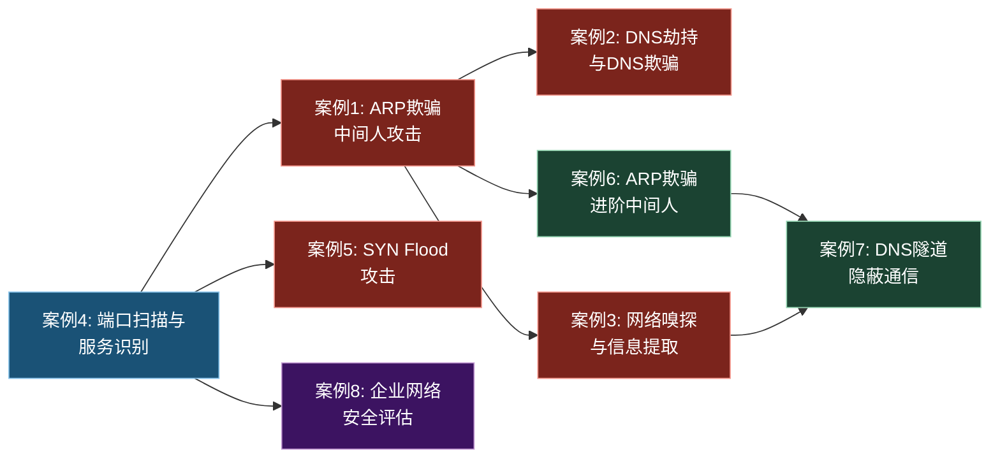
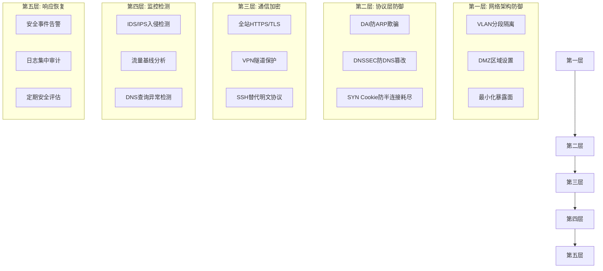

## 本节小结

本节通过八个由浅入深的实战案例，完整覆盖了计算机网络基础阶段最核心的攻击手法与防御思路。这些案例并非孤立存在，它们在攻击链上彼此衔接——从信息收集到流量劫持，从隐蔽通信到整体评估——构成了一个完整的网络安全实战知识体系。下面从知识脉络、技术要点、防御体系和能力跃迁四个维度进行全面梳理。

### 一、案例全景回顾

八个案例按照攻击阶段和复杂度递进排列，覆盖了从单一攻击技术到综合评估的完整链条：

| 序号 | 案例名称 | 攻击层次 | 核心技术 | 防御关键 |
|------|----------|----------|----------|----------|
| 1 | ARP欺骗攻击与中间人攻击 | 数据链路层 | arpspoof / bettercap | 静态ARP绑定、DAI |
| 2 | DNS劫持与DNS欺骗 | 应用层 | ettercap dns_spoof | DoH/DoT、DNSSEC |
| 3 | 网络嗅探与敏感信息提取 | 多层 | tcpdump / tshark / Wireshark | 全链路加密 |
| 4 | 端口扫描与服务识别 | 网络层/传输层 | nmap 全功能扫描 | 最小化暴露面 |
| 5 | SYN Flood攻击演示 | 传输层 | hping3 / scapy | SYN Cookie、限速 |
| 6 | ARP欺骗中间人攻击（进阶） | 数据链路层 | 综合欺骗链 | 网络分段、加密通信 |
| 7 | DNS隧道隐蔽通信 | 应用层 | DNS编码隧道 | 频率分析、ML检测 |
| 8 | 企业网络架构安全评估 | 全局 | 综合评估方法论 | 纵深防御体系 |

这些案例在技术层次上跨越了OSI模型的多个层面：案例1、6聚焦数据链路层（ARP协议的固有缺陷），案例4、5聚焦传输层（TCP连接机制的攻防），案例2、7聚焦应用层（DNS协议的滥用），案例3横跨多个协议层，案例8则从全局视角审视整个网络架构的安全状态。

### 二、技术脉络串联

从攻击者的视角看，这八个案例实际上呈现了一条清晰的攻击链路：

**第一阶段：信息收集（案例4）**。一切攻击始于情报。nmap的主机发现、端口扫描、服务版本检测和NSE漏洞脚本，为后续攻击提供了完整的"作战地图"。这个阶段的核心技能是学会从扫描结果中提取有价值的信息——哪些服务暴露了，运行什么版本，可能存在哪些已知漏洞。

**第二阶段：流量劫持（案例1、2、6）**。拿到目标信息后，攻击者需要在通信链路中插入自己。ARP欺骗是最直接的手段——通过伪造ARP响应，将攻击机插入目标与网关之间的通信路径。案例1是基础版，案例6展示了更复杂的链式欺骗场景。在此基础上，案例2进一步将攻击升级到应用层：通过DNS欺骗，将用户对合法域名的请求重定向到攻击者控制的服务器。这三个案例共享同一个前提：攻击者与目标处于同一局域网，能够直接收发ARP帧。

**第三阶段：数据窃取（案例3）**。流量劫持成功后，下一步是从截获的流量中提取敏感信息。案例3演示了多协议环境下的嗅探技巧：HTTP明文传输直接可读，FTP凭据在控制通道中以明文传递，HTTPS虽然加密但SNI字段泄露了访问的域名，WiFi的WPA2四次握手可以被抓取后离线破解。这些场景共同说明一个结论：加密不是万能的，但不加密是万万不能的。

**第四阶段：拒绝服务（案例5）**。SYN Flood不需要深入应用逻辑，它直接攻击TCP协议栈的半连接队列。这种攻击的技术门槛低（几行scapy代码即可实现），但破坏力大，防御成本高。案例5的真正价值不在于攻击本身，而在于让读者理解TCP三次握手的资源分配机制，以及SYN Cookie等防御技术的工作原理。

**第五阶段：隐蔽持久化（案例7）**。DNS隧道是高级攻击者的典型手法——利用DNS查询和响应的天然合法性，在看似无害的域名解析请求中嵌入C2指令或数据。这个案例的难点不在于搭建隧道（iodine/dnscat2等工具已经很成熟），而在于理解为什么DNS能被滥用：防火墙通常放行DNS流量（UDP 53），DNS查询看起来与正常访问无异，响应中可以携带大量数据（TXT记录）。

**第六阶段：全局评估（案例8）**。前七个案例聚焦于单一技术，案例8则切换到安全评估师视角，对企业网络进行系统性审视。它的价值在于建立"面"的思维——不是某一个点被攻破，而是整个安全体系是否存在系统性缺陷：网络分段缺失、访问控制过松、监控能力不足、日志体系残缺。

### 三、核心知识节点提炼

通过这八个案例，可以提炼出以下贯穿整个网络安全实战的核心知识节点：

#### 3.1 网络协议的固有缺陷

案例1和案例2暴露了两个关键协议的设计缺陷：

- **ARP协议无认证机制**：ARP在设计之初假设局域网内的所有设备都是可信的，没有任何验证机制来确认ARP响应的真实性。这导致任何设备都可以声称自己是网关，而其他设备没有手段辨别真伪。这个缺陷在1982年ARP协议被标准化时就已存在，至今仍未被彻底修复——所有基于ARP的防御手段（DAI、静态绑定）都是在交换机层面的补丁，而非协议层面的修正。
- **DNS协议缺乏完整性保护**：传统DNS查询和响应之间没有签名验证（DNSSEC可以解决但部署率极低），中间人可以篡改DNS响应而不被察觉。DNSID字段只有16位，攻击者可以通过预测或暴力匹配来注入伪造响应。

理解这两个缺陷的本质原因，比记住攻击步骤重要得多。它们共同指向一个安全设计原则：**任何不包含认证和完整性验证的协议，在不可信网络环境中都是脆弱的**。

#### 3.2 加密的价值与边界

案例3的多个子场景精确展示了加密技术的价值和局限：

| 场景 | 加密状态 | 可泄露的信息 | 启示 |
|------|----------|-------------|------|
| HTTP流量嗅探 | 无加密 | 完整请求体（含凭据） | 必须全站HTTPS |
| FTP密码嗅探 | 无加密 | 用户名、密码明文传输 | FTP已被SFTP/FTPS取代 |
| HTTPS元信息分析 | 传输层加密 | SNI域名、证书信息 | 加密≠匿名 |
| WiFi WPA2握手 | 无线加密 | 握手包可离线破解 | 密码强度决定安全 |

加密不是"开了就安全"的开关。HTTPS保护了内容但暴露了目标（SNI），WPA2保护了无线传输但密码可以被暴力破解，VPN保护了隧道但端点仍然可能被攻陷。真正安全的通信需要在多个层面同时施加保护：传输加密（TLS）、身份认证（证书/密钥）、完整性验证（MAC/HMAC）、前向保密（ECDHE）。

#### 3.3 攻防不对称性

案例5的SYN Flood深刻体现了网络安全中的攻防不对称：

- **攻击成本极低**：发送SYN包几乎不需要任何资源，一台普通机器就能产生数十万pps的流量
- **防御成本极高**：服务器需要为每个SYN分配连接状态（内存+CPU），防御需要在协议栈层面进行改造（SYN Cookie），或者依赖上游设备（CDN、DDoS防护）进行流量清洗
- **检测成本居中**：可以通过速率限制、连接完成率等指标进行检测，但正常流量高峰时容易误判

这种不对称性贯穿于所有安全领域。理解这一点，有助于在后续学习中建立正确的安全思维：安全防御的目标不是消除所有攻击（这在经济上不可能），而是将攻击成本提升到攻击者无法承受的水平。

### 四、防御体系构建

基于八个案例的防御经验，可以归纳出一套分层防御体系：

每层防御对应案例中的具体威胁：

**第一层（架构防御）** 解决案例8中暴露的网络分段缺失问题。VLAN隔离将广播域限制在最小范围，使ARP欺骗（案例1、6）的影响局限在同一VLAN内。DMZ将对外服务与内部网络物理隔离。最小化暴露面（关闭不必要端口和服务）直接减少案例4中端口扫描的攻击面。

**第二层（协议防御）** 针对协议固有缺陷的补丁。DAI（Dynamic ARP Inspection）在交换机层面验证ARP报文的合法性，阻止案例1、6中的ARP欺骗。DNSSEC为DNS响应添加数字签名，使案例2中的DNS欺骗在密码学上不可行。SYN Cookie让服务器在不分配资源的情况下验证SYN请求的合法性，抵御案例5中的SYN Flood。

**第三层（通信加密）** 将案例3中明文嗅探的风险降到最低。全站HTTPS消除HTTP凭据泄露风险，SFTP/SCP替代FTP消除明文密码传输，SSH隧道保护远程管理流量。需要强调的是，加密只保护传输过程，不保护端点——加密通道两端的主机如果被攻陷，加密毫无意义。

**第四层（监控检测）** 针对案例7等高级威胁的被动检测能力。IDS（如Suricata、Snort）通过签名匹配检测已知攻击模式。流量基线分析通过对比正常流量与实时流量的偏差来发现异常（如DNS隧道导致的查询频率突增）。机器学习模型可以识别人工规则难以覆盖的复杂模式。

**第五层（响应恢复）** 是整个防御体系的兜底。再完善的防御也无法保证100%的安全——安全事件迟早会发生。关键是能快速发现（告警）、快速定位（日志）、快速处置（响应流程）。案例8中评估发现的日志收集不完整和缺乏告警机制，正是这一层最常见的短板。

### 五、工具链总结

本节案例涉及的核心工具及其用途：

| 工具 | 主要用途 | 对应案例 | 关键参数/技巧 |
|------|----------|----------|---------------|
| nmap | 主机发现、端口扫描、服务识别 | 案例4 | `-sS` SYN扫描、`-sV` 版本检测、`--script vuln` |
| arpspoof | ARP欺骗 | 案例1 | `-t` 指定目标、双向欺骗 |
| bettercap | 综合中间人攻击框架 | 案例1 | `arp.spoof` + `net.sniff` 联动 |
| ettercap | ARP欺骗 + DNS欺骗 | 案例2 | `-M arp:remote` + dns_spoof插件 |
| tcpdump | 命令行抓包 | 案例3 | `-A` ASCII输出、`-w` 写入pcap |
| tshark | 命令行协议分析 | 案例3 | `-Y` 显示过滤器、`-T fields` 提取字段 |
| Wireshark | 图形化流量分析 | 案例3 | Follow Stream、统计分析 |
| hping3 | TCP/ICMP包构造与发送 | 案例5 | `-S --flood` SYN洪泛模式 |
| scapy | Python包构造库 | 案例5 | 自定义协议字段、循环发送 |
| airmon-ng | 无线监听模式 | 案例3 | `start wlan0` 开启监听 |
| aircrack-ng | WPA2离线破解 | 案例3 | `-w` 字典文件 |

掌握这些工具不是目的，目的是理解它们背后的协议机制。arpspoof能工作，是因为ARP没有认证；ettercap能欺骗DNS，是因为DNS没有签名验证；hping3能造成拒绝服务，是因为TCP的资源分配在握手完成之前就已开始。工具会更新换代，但协议缺陷的本质不会变。

### 六、常见认知误区

在学习本节内容时，需要警惕以下几个常见误区：

**误区一："ARP欺骗只在局域网内有效，所以不太重要"**。实际上，绝大多数企业的内网安全事件都涉及ARP层面的攻击。攻击者一旦突破边界（通过钓鱼邮件、恶意网站、失陷的IoT设备等），在内网中进行横向移动时，ARP欺骗是最常用的流量劫持手段。内网安全往往比边界安全更容易被忽视，但风险同样巨大。

**误区二："开了HTTPS就不用担心嗅探了"**。案例3明确展示了HTTPS的局限性：SNI字段泄露访问的域名，证书信息泄露组织身份，流量大小和时序泄露行为模式。此外，很多企业的HTTPS部署存在证书错误、降级攻击、中间人CA等问题。HTTPS是必要的，但不是充分的。

**误区三："DNS隧道检测很简单，看看域名长度就行了"**。案例7提到的检测方法（域名长度、查询频率、响应大小）是基础层的检测手段。实际的DNS隧道工具（如dnscat2、Cobalt Strike的DNS beacon）会刻意控制域名长度和查询频率，使其看起来接近正常流量。有效的检测需要综合多种指标并结合机器学习模型，单纯的规则匹配漏报率很高。

**误区四："SYN Flood是大流量DDoS，小规模攻击没有威胁"**。SYN Flood的核心不在于流量大小，而在于半连接队列的消耗速度。即使流量不大，只要请求速率超过服务器的SYN Timeout释放速度，队列就会被耗尽。一台机器产生的SYN Flood就足以瘫痪一台没有启用SYN Cookie的普通服务器。

**误区五："企业安全评估就是扫漏洞"**。案例8展示的安全评估远不止漏洞扫描。它涵盖了网络架构设计（分段是否合理）、访问控制策略（是否遵循最小权限）、监控能力（是否具备入侵检测）、日志管理（是否集中且完整）等多个维度。漏洞扫描只能发现技术层面已知的弱点，而安全评估要发现的是系统层面的设计缺陷和管理层面的制度缺失。

### 七、能力跃迁路径

完成本节实战案例后，建议按照以下路径进行能力提升：

**基础巩固阶段**：在虚拟机环境中反复练习每个案例，直到能够不看文档独立完成整个攻击流程。重点不是记住命令，而是理解每一步操作的协议层面含义——为什么开启IP转发是必要的，为什么ARP欺骗要双向进行，为什么SYN Cookie的实现不需要分配内存。

**工具精通阶段**：深入学习每个工具的高级功能。nmap的NSE脚本编写、bettercap的模块化架构、scapy的自定义协议构造、Wireshark的统计分析功能。工具的深度使用能力决定了在复杂场景下的实战效率。

**融会贯通阶段**：尝试将多个案例串联起来。例如，先用nmap发现目标，再用ARP欺骗截获流量，然后在截获的流量中寻找凭据，最后利用凭据进行横向移动。这种链式攻击思维是从"会用工具"到"理解攻击"的关键跨越。

**防御视角切换**：以蓝队视角重新审视每个攻击案例。为每个攻击设计对应的检测规则（Suricata规则、Zeek脚本、SIEM告警），建立监控仪表盘，编写应急响应脚本。攻防兼备才是完整的安全能力。

**报告撰写能力**：案例8的安全评估需要产出专业的评估报告。学习渗透测试报告的结构：执行摘要、范围说明、发现详情（严重性分级）、复现步骤、修复建议、附件证据。报告质量直接影响安全建议能否被管理层采纳并落地执行。

### 八、法律与伦理提醒

最后必须再次强调：本节所有技术仅限在授权的实验环境中使用。未经授权对他人网络进行扫描、嗅探、欺骗或拒绝服务攻击，在中国法律中可能触犯《刑法》第285条（非法侵入计算机信息系统罪）、第286条（破坏计算机信息系统罪），以及《网络安全法》《数据安全法》相关条款。即便出于"测试安全"的目的，未经书面授权的操作仍然构成违法行为。

真正的安全从业者的价值在于**用攻击者的思维方式构建更坚固的防御**，而非利用技术进行破坏。理解攻击原理是为了在攻击者之前发现并修复漏洞，这才是网络安全学习的最终目标。
