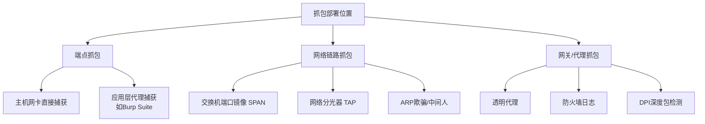
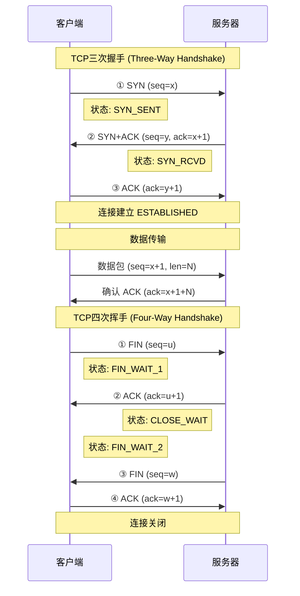

## 一、网络抓包分析技巧

网络抓包（Packet Capture）是网络安全从业者的核心技能之一。无论是排查网络故障、分析恶意软件通信、逆向未知协议，还是发现应用层漏洞，抓包分析都是不可或缺的手段。本节从原理到实操，系统讲解网络抓包的完整知识体系。

### 1.1 抓包的本质与原理

#### 1.1.1 什么是抓包

抓包是指在网络通信过程中，将流经网卡的数据帧（Frame）完整复制并存储的过程。抓包工具通常工作在OSI模型的**数据链路层（L2）**，能够捕获从以太网帧头到应用层载荷的全部内容。

一个完整的以太网帧结构如下：

```text
┌──────────┬──────────┬──────────┬────────────┬─────┬──────────┐
│ 前导码   │ 目的MAC  │ 源MAC    │ 类型/长度  │ 载荷│ FCS      │
│ 8字节    │ 6字节    │ 6字节    │ 2字节      │可变 │ 4字节    │
└──────────┴──────────┴──────────┴────────────┴─────┴──────────┘
```

抓包工具捕获的内容通常从目的MAC地址开始，到载荷结束。FCS（帧校验序列）是否被捕获取决于网卡驱动和抓包工具的配置。

#### 1.1.2 网卡的工作模式

理解网卡模式是理解抓包范围的前提：

| 模式 | 说明 | 抓包范围 |
|------|------|----------|
| **广播模式（Broadcast）** | 默认模式，只接收目的MAC为自身、广播和组播帧 | 仅本机相关流量 |
| **混杂模式（Promiscuous）** | 接收所有经过网卡的帧 | 同网段全部流量 |
| **监控模式（Monitor）** | 无线网卡专用，接收所有无线帧（含管理帧） | 全部无线信号 |

设置混杂模式的方法：

```bash
# Linux：启用混杂模式
sudo ip link set eth0 promisc on

# 验证是否生效
ip link show eth0 | grep PROMISC

# 禁用混杂模式
sudo ip link set eth0 promisc off
```

> **关键认知**：在交换式网络中，混杂模式**无法**捕获其他主机之间的单播流量。交换机根据MAC地址表进行定向转发，不会将流量泛洪到所有端口。要捕获其他主机的流量，需要使用ARP欺骗、端口镜像（Port Mirroring）或网络分光器（TAP）等技术。这在网络嗅探与中间人攻击章节有详细讨论。

#### 1.1.3 抓包的三种部署位置



**端点抓包**：在目标主机上直接运行抓包工具。优点是部署简单，能捕获加密流量的明文（在TLS握手之前或解密之后）；缺点是需要主机权限，且可能被恶意软件检测。

**网络链路抓包**：在网络链路上插入抓包设备。企业环境常用端口镜像或TAP设备；渗透测试中常用ARP欺骗。优点是不影响目标主机，缺点是加密流量只能看到密文。

**网关/代理抓包**：在网络出口或中间代理上抓包。HTTPS中间人代理（如mitmproxy）属于此类，能够解密TLS流量。

### 1.2 TCP连接的抓包分析

TCP是抓包分析中最常接触的协议。理解TCP的状态机对于分析连接建立、数据传输和连接关闭至关重要。

#### 1.2.1 TCP三次握手与四次挥手



在抓包中识别TCP状态的关键标志位组合：

| 标志位组合 | 含义 | Wireshark显示 |
|-----------|------|--------------|
| SYN=1, ACK=0 | 主动打开方发起连接 | `[SYN]` |
| SYN=1, ACK=1 | 被动打开方确认并发起 | `[SYN, ACK]` |
| ACK=1 | 确认 | `[ACK]` |
| FIN=1, ACK=1 | 请求关闭连接 | `[FIN, ACK]` |
| RST=1 | 强制重置连接 | `[RST]` |
| PSH=1, ACK=1 | 推送数据，要求立即处理 | `[PSH, ACK]` |

#### 1.2.2 TCP状态机在抓包中的应用

通过抓包可以追踪TCP连接的完整状态变迁。以下是常见异常状态及其在抓包中的表现：

| 异常模式 | 抓包表现 | 可能原因 |
|---------|---------|---------|
| SYN无响应 | 只看到SYN包，无SYN+ACK | 目标端口未开放、防火墙丢包、目标主机宕机 |
| SYN+RST | SYN后收到RST | 目标端口明确拒绝连接 |
| 重复SYN | 多个SYN包间隔递增 | TCP重传，网络丢包或目标响应慢 |
| 半开连接 | 只有SYN+ACK无后续ACK | SYN Flood攻击或客户端异常断开 |
| TIME_WAIT堆积 | 大量TIME_WAIT状态 | 短连接过多、服务端频繁创建/销毁连接 |

#### 1.2.3 安全视角：TCP攻击向量

| 攻击类型 | 阶段 | 原理 | 抓包特征 | 防御 |
|---------|------|------|---------|------|
| SYN Flood | 握手阶段① | 大量SYN耗尽半连接队列 | 短时间内大量SYN包，源IP随机或伪造 | SYN Cookie / 防火墙限速 |
| TCP劫持 | 数据传输 | 预测seq注入数据 | seq序列号跳跃异常，出现未预期的数据 | 随机化ISN |
| RST攻击 | 数据传输 | 伪造RST断开连接 | RST包seq在窗口内但非正常关闭 | 状态检测防火墙 |
| Slowloris | 握手后 | 缓慢发送HTTP头，保持大量连接 | 大量ESTABLISHED连接，极少数据传输 | 连接超时限制 |

### 1.3 Wireshark深度使用

Wireshark是最强大的图形化网络协议分析工具，支持数千种协议解码。本节从基础到高级，系统讲解Wireshark的使用技巧。

#### 1.3.1 捕获过滤器（Capture Filter）

捕获过滤器在数据包到达网卡时就进行过滤，使用BPF（Berkeley Packet Filter）语法，在抓包**之前**设置，能有效减少磁盘I/O和CPU开销。

```bash
# 只捕获特定主机的流量
host 192.168.1.100

# 只捕获特定端口的流量
port 80

# 组合条件：特定主机的HTTPS流量
tcp port 443 and host 10.0.0.5

# 排除ARP和DNS流量（减少噪音）
not arp and not dns

# 只捕获SYN包（连接发起包）
tcp[tcpflags] & (tcp-syn) != 0

# 只捕获来自特定子网的流量
src net 192.168.1.0/24

# 捕获特定MAC地址的流量
ether host aa:bb:cc:dd:ee:ff

# 捕获ICMP流量（ping等）
icmp

# 排除SSH流量
not port 22

# 捕获VLAN标记的流量
vlan and host 192.168.1.100
```

> **BPF语法要点**：BPF使用原始套接字进行过滤，效率极高。`and`、`or`、`not`是逻辑操作符，`==`、`!=`、`>`、`<`是比较操作符。括号`()`用于分组。BPF只支持协议头字段过滤，**不能**基于载荷内容过滤。

#### 1.3.2 显示过滤器（Display Filter）

显示过滤器在抓包**之后**应用，语法比BPF更灵活，支持协议字段和载荷内容过滤。

```bash
# 基础协议过滤
ip.addr == 192.168.1.100                # 特定IP
ip.src == 10.0.0.1 && ip.dst == 10.0.0.2  # 源到目的
tcp.port == 80 && http                   # HTTP流量

# TCP标志位过滤
tcp.flags.syn == 1 && tcp.flags.ack == 0   # SYN包（连接发起）
tcp.flags.rst == 1                         # RST包（连接重置）
tcp.flags.fin == 1                         # FIN包（连接关闭）

# DNS过滤
dns.qry.name contains "google"          # DNS查询包含特定域名
dns.qry.type == 1                       # A记录查询
dns.flags.rcode != 0                    # DNS响应有错误

# HTTP过滤
http.request.method == "POST"           # HTTP POST请求
http.response.code >= 400               # HTTP错误响应
http.request.uri contains "admin"       # URI包含admin
http.content_type contains "json"       # JSON响应

# TLS过滤
tls.handshake.type == 1                 # Client Hello
tls.handshake.type == 2                 # Server Hello
tls.handshake.extensions_server_name    # SNI域名

# 内容搜索
frame contains "password"               # 数据包中包含password
frame contains "Authorization"          # 认证头
tcp contains "login"                    # TCP载荷包含login

# 流量分析
tcp.analysis.retransmission             # TCP重传包
tcp.analysis.duplicate_ack              # 重复确认
tcp.analysis.zero_window                # 零窗口（接收方缓冲满）
tcp.analysis.lost_segment               # 丢包
```

#### 1.3.3 实用分析技巧

**TCP流重组**：右键数据包 → Follow → TCP Stream，可以重组完整的TCP会话。在TCP Stream窗口中，红色表示客户端发送的数据，蓝色表示服务器响应。这是分析HTTP明文通信、识别认证信息泄露的核心操作。

**协议分层统计**：Statistics → Protocol Hierarchy，查看抓包文件中各协议的占比。如果在怀疑存在隧道攻击时发现异常协议（如ICMP载荷过大、DNS查询异常长），这里能快速定位。

**会话统计**：Statistics → Conversations，按TCP/UDP/IP查看通信双方的流量统计。排序后可以快速识别流量最大的通信对，用于发现数据外泄或C2通信。

**IO图表**：Statistics → IO Graphs，可视化展示流量随时间的变化。可以叠加多个过滤器，在同一图表中对比不同类型的流量，例如同时显示正常HTTP流量和可疑DNS查询流量的变化趋势。

**专家信息**：Analyze → Expert Information，Wireshark自动分析抓包中的异常（重传、乱序、校验和错误等）。红色错误需要重点关注，黄色警告值得检查。

**着色规则**：View → Coloring Rules，自定义不同协议/状态的显示颜色。默认规则已经很好用，但可以根据需求调整。例如将RST包设为红色高亮、将DNS查询设为浅绿色。

**自定义列**：右键任何协议字段 → Apply as Column，可以将感兴趣的字段添加到包列表的列中。例如添加HTTP Host字段、DNS查询名称等，方便快速浏览。

**时间显示格式**：View → Time Display Format → Seconds Since Previous Displayed Packet，改为相对时间可以更容易看出包之间的时间间隔，对分析延迟和重传特别有用。

#### 1.3.4 Wireshark配置文件

Wireshark支持自定义配置文件（Profile），针对不同分析场景创建不同的配置：

```bash
# 配置文件路径
~/.config/wireshark/profiles/

# 推荐创建的配置文件
# 1. HTTP分析 — 自定义列：Host, URI, Method, Status Code
# 2. DNS分析 — 自定义列：Query Name, Query Type, Response
# 3. 安全分析 — 着色规则突出RST/FIN，启用TCP流跟踪
# 4. 无线分析 — Monitor模式，802.11解码设置
```

创建步骤：Edit → Configuration Profiles → New，输入名称后切换到该配置文件，然后设置过滤器、列、着色规则等，所有修改会自动保存到该配置文件。

#### 1.3.5 TLS流量解密

Wireshark支持通过SSLKEYLOGFILE解密TLS流量。当浏览器将TLS会话密钥写入该文件时，Wireshark可以解密对应的加密流量。

```bash
# 步骤1：设置环境变量让浏览器导出会话密钥
export SSLKEYLOGFILE=~/.ssl-key.log

# 步骤2：用该环境变量启动Firefox/Chrome
firefox &

# 步骤3：在Wireshark中配置密钥文件
# Edit → Preferences → Protocols → TLS
# (Pre)-Master-Secret log filename: 选择 ~/.ssl-key.log

# 之后所有通过该浏览器的TLS流量都可以解密查看
```

> **安全意义**：在渗透测试中，如果能在目标主机上设置`SSLKEYLOGFILE`环境变量，就能被动解密所有TLS流量，无需进行中间人攻击。这是一种隐蔽性极高的流量捕获方式。

### 1.4 tcpdump命令行抓包

tcpdump是Linux下最常用的命令行抓包工具，几乎在所有Linux发行版中预装。它适合在无GUI的服务器上远程抓包，也是编写自动化抓包脚本的基础。

#### 1.4.1 基础用法

```bash
# 基本抓包（默认只显示前262144字节的每个包）
sudo tcpdump -i eth0

# 指定抓包接口（any表示所有接口）
sudo tcpdump -i any

# 保存到文件（pcap格式，可用Wireshark打开）
sudo tcpdump -i eth0 -w capture.pcap

# 带时间戳写入文件
sudo tcpdump -i eth0 -tttt -w capture.pcap

# 读取pcap文件
tcpdump -r capture.pcap

# 限制抓包数量
sudo tcpdump -i eth0 -c 100

# 限制文件大小（-C 10 表示每个文件10MB）
sudo tcpdump -i eth0 -w capture.pcap -C 10

# 自动轮转文件（最多保留20个文件）
sudo tcpdump -i eth0 -w capture.pcap -C 10 -W 20

# 设置snaplen（捕获每个包的最大字节数）
# 0表示不限制，抓完整包
sudo tcpdump -i eth0 -s 0 -w capture.pcap

# 不解析主机名（加速处理）
sudo tcpdump -i eth0 -n

# 不解析端口名
sudo tcpdump -i eth0 -nn

# 显示绝对序列号
sudo tcpdump -i eth0 -S
```

#### 1.4.2 过滤表达式

```bash
# 过滤特定主机
sudo tcpdump -i eth0 host 192.168.1.100

# 过滤特定端口
sudo tcpdump -i eth0 port 80

# 组合过滤
sudo tcpdump -i eth0 host 192.168.1.100 and port 80

# 过滤TCP SYN包
sudo tcpdump -i eth0 'tcp[tcpflags] & tcp-syn != 0'

# 过滤TCP RST包
sudo tcpdump -i eth0 'tcp[tcpflags] & tcp-rst != 0'

# 过滤源端口
sudo tcpdump -i eth0 src port 443

# 过滤目的子网
sudo tcpdump -i eth0 dst net 10.0.0.0/8

# 过滤ICMP流量
sudo tcpdump -i eth0 icmp

# 过滤ARP流量
sudo tcpdump -i eth0 arp

# 过滤特定长度的数据包
sudo tcpdump -i eth0 'greater 1000'

# 排除特定流量
sudo tcpdump -i eth0 not port 22

# 显示ASCII内容（适合看HTTP明文）
sudo tcpdump -i eth0 -A port 80

# 显示十六进制和ASCII
sudo tcpdump -i eth0 -X port 80

# 过滤HTTP GET请求
sudo tcpdump -i eth0 -A -s 0 'tcp port 80 and (((ip[2:2] - ((ip[0]&0xf)<<2)) - ((tcp[12]&0xf0)>>2)) != 0)' | grep -A 5 "GET"
```

#### 1.4.3 高级组合示例

```bash
# 场景1：抓取目标服务器的Web流量并实时查看HTTP请求
sudo tcpdump -i eth0 -A -s 0 'dst port 80 and tcp[((tcp[12:1] & 0xf0) >> 2):4] = 0x47455420'

# 场景2：捕获DNS查询并显示域名
sudo tcpdump -i eth0 -nn port 53

# 场景3：监控SSH暴力破解（大量SYN到22端口）
sudo tcpdump -i eth0 'tcp[tcpflags] & tcp-syn != 0 and dst port 22' -nn -c 1000

# 场景4：抓取完整的TCP会话并保存
sudo tcpdump -i eth0 -s 0 -w session.pcap host 192.168.1.100 and port 80

# 场景5：实时统计每个IP的连接数
sudo tcpdump -i eth0 -nn -c 10000 tcp[tcpflags] & tcp-syn != 0 2>/dev/null | \
    awk '{print $3}' | cut -d. -f1-4 | sort | uniq -c | sort -rn | head -20

# 场景6：捕获ARP应答（检测ARP欺骗）
sudo tcpdump -i eth0 arp and arp[6:2] == 2
```

> **实用技巧**：在远程服务器上长时间抓包时，使用`-w`写文件比实时显示更高效。配合`-C`和`-W`参数进行文件轮转，防止磁盘被撑满。抓完后用`scp`下载pcap文件到本地用Wireshark分析。

### 1.5 tshark：Wireshark的命令行利器

tshark是Wireshark的命令行版本，拥有与Wireshark相同的协议解码能力，但可以在无GUI环境下使用。它支持Wireshark的全部过滤语法，还能导出特定字段，非常适合自动化分析。

#### 1.5.1 基础抓包

```bash
# 实时抓包（类似tcpdump）
tshark -i eth0

# 保存到文件
tshark -i eth0 -w capture.pcap

# 使用捕获过滤器
tshark -i eth0 -f "port 80"

# 使用显示过滤器
tshark -i eth0 -Y "http.request"

# 实时抓包并显示HTTP请求
tshark -i eth0 -Y "http.request" -T fields \
    -e http.host -e http.request.uri -e http.request.method

# 统计DNS查询
tshark -i eth0 -Y "dns.qry.name" -T fields -e dns.qry.name

# 提取HTTP POST数据
tshark -r capture.pcap -Y "http.request.method==POST" \
    -T fields -e http.file_data
```

#### 1.5.2 字段导出与统计

tshark的`-T fields`模式是其最强大的功能之一，可以精确导出指定字段：

```bash
# 导出HTTP请求的关键字段
tshark -r capture.pcap -Y "http.request" -T fields \
    -e frame.time -e ip.src -e ip.dst \
    -e http.host -e http.request.method -e http.request.uri \
    -E header=y -E separator=, -E quote=d

# 导出DNS查询记录
tshark -r capture.pcap -Y "dns.flags.response == 0" -T fields \
    -e frame.time -e ip.src \
    -e dns.qry.name -e dns.qry.type \
    -E header=y -E separator=,

# 导出TLS SNI（Server Name Indication）
tshark -r capture.pcap -Y "tls.handshake.extensions_server_name" \
    -T fields -e tls.handshake.extensions_server_name | sort | uniq -c | sort -rn

# 统计TCP流
tshark -r capture.pcap -q -z conv,tcp

# 协议层级统计
tshark -r capture.pcap -q -z io,phs

# HTTP请求统计
tshark -r capture.pcap -q -z http,tree

# DNS查询统计
tshark -r capture.pcap -q -z dns,tree

# 统计每个IP的流量
tshark -r capture.pcap -q -z ip_hosts,tree
```

#### 1.5.3 自动化脚本示例

```bash
#!/bin/bash
# extract_credentials.sh - 从pcap文件中提取可能的认证信息
PCAP="$1"

echo "=== HTTP Basic Auth ==="
tshark -r "$PCAP" -Y "http.authorization" -T fields \
    -e frame.time -e ip.src -e http.host -e http.authorization 2>/dev/null

echo ""
echo "=== HTTP POST with credentials ==="
tshark -r "$PCAP" -Y "http.request.method==POST" -T fields \
    -e frame.time -e ip.src -e http.host -e http.request.uri \
    -e http.file_data 2>/dev/null | grep -i -E "user|pass|login|token"

echo ""
echo "=== FTP credentials ==="
tshark -r "$PCAP" -Y "ftp.request.command==USER || ftp.request.command==PASS" \
    -T fields -e frame.time -e ftp.request.command -e ftp.request.arg 2>/dev/null

echo ""
echo "=== DNS exfiltration candidates (long queries) ==="
tshark -r "$PCAP" -Y "dns.qry.name" -T fields -e dns.qry.name 2>/dev/null | \
    awk '{if(length($0) > 50) print $0}'
```

### 1.6 Scapy：Python网络包构造与分析

Scapy是Python的交互式网络包处理库，不仅能抓包，还能构造、发送、解析任意网络包。它是编写自定义抓包分析脚本的首选工具。

#### 1.6.1 基础抓包

```python
from scapy.all import *

# 抓取10个包
packets = sniff(count=10)
print(f"捕获了 {len(packets)} 个数据包")

# 按接口抓包
packets = sniff(iface="eth0", count=100)

# 带过滤器抓包（BPF语法）
packets = sniff(filter="tcp port 80", count=50)

# 超时抓包（抓10秒）
packets = sniff(timeout=10)

# 实时回调处理（每收到一个包就调用一次函数）
def packet_handler(pkt):
    if pkt.haslayer(TCP) and pkt[TCP].dport == 80:
        print(f"[HTTP] {pkt[IP].src}:{pkt[TCP].sport} -> {pkt[IP].dst}:{pkt[TCP].dport}")

sniff(filter="tcp port 80", prn=packet_handler, count=100)

# 保存/加载pcap文件
wrpcap("capture.pcap", packets)
loaded = rdpcap("capture.pcap")
```

#### 1.6.2 包解析与字段提取

```python
from scapy.all import *

# 读取pcap并分析HTTP请求
packets = rdpcap("capture.pcap")

for pkt in packets:
    if pkt.haslayer(Raw):
        payload = pkt[Raw].load.decode('utf-8', errors='ignore')
        if 'HTTP' in payload and ('GET' in payload or 'POST' in payload):
            print(f"时间: {pkt.time}")
            print(f"源: {pkt[IP].src}:{pkt[TCP].sport}")
            print(f"目的: {pkt[IP].dst}:{pkt[TCP].dport}")
            print(f"载荷:\n{payload[:500]}")
            print("-" * 60)

# 分析TCP连接状态
for pkt in packets:
    if pkt.haslayer(TCP):
        flags = pkt[TCP].flags
        if flags == 'S':     flag_desc = 'SYN'
        elif flags == 'SA':  flag_desc = 'SYN+ACK'
        elif flags == 'A':   flag_desc = 'ACK'
        elif flags == 'FA':  flag_desc = 'FIN+ACK'
        elif flags == 'R':   flag_desc = 'RST'
        elif flags == 'RA':  flag_desc = 'RST+ACK'
        else:                flag_desc = str(flags)
        
        print(f"{pkt[IP].src}:{pkt[TCP].sport} -> "
              f"{pkt[IP].dst}:{pkt[TCP].dport} [{flag_desc}] "
              f"seq={pkt[TCP].seq} ack={pkt[TCP].ack}")

# 统计DNS查询
dns_queries = {}
for pkt in packets:
    if pkt.haslayer(DNS) and pkt[DNS].qr == 0:  # qr=0 表示查询
        qname = pkt[DNS].qd.qname.decode() if pkt[DNS].qd else ''
        dns_queries[qname] = dns_queries.get(qname, 0) + 1

for domain, count in sorted(dns_queries.items(), key=lambda x: -x[1]):
    print(f"{domain}: {count}次")
```

#### 1.6.3 会话重组与流分析

```python
from scapy.all import *
from collections import defaultdict

# 按TCP流分组
streams = defaultdict(list)
packets = rdpcap("capture.pcap")

for pkt in packets:
    if pkt.haslayer(TCP) and pkt.haslayer(IP):
        # 用四元组标识一个流
        src = f"{pkt[IP].src}:{pkt[TCP].sport}"
        dst = f"{pkt[IP].dst}:{pkt[TCP].dport}"
        stream_key = tuple(sorted([src, dst]))
        streams[stream_key].append(pkt)

# 分析每个流
for key, pkts in streams.items():
    total_bytes = sum(len(p) for p in pkts)
    duration = float(pkts[-1].time) - float(pkts[0].time)
    print(f"流 {key[0]} <-> {key[1]}")
    print(f"  包数: {len(pkts)}, 字节数: {total_bytes}, 时长: {duration:.2f}s")
```

### 1.7 实战案例分析

#### 1.7.1 案例：识别端口扫描行为

当主机遭受端口扫描时，抓包会呈现明显的特征模式：

```bash
# 使用tcpdump捕获可能的端口扫描
sudo tcpdump -i eth0 -nn 'tcp[tcpflags] & tcp-syn != 0' -c 1000 -w scan.pcap

# 用tshark分析SYN包分布
tshark -r scan.pcap -Y "tcp.flags.syn==1 && tcp.flags.ack==0" \
    -T fields -e ip.src -e ip.dst -e tcp.dport | \
    awk '{print $1 " -> " $2 ":" $3}' | \
    sort | uniq -c | sort -rn | head -20

# 识别单源IP扫描多个端口（水平扫描）
tshark -r scan.pcap -Y "tcp.flags.syn==1 && tcp.flags.ack==0" \
    -T fields -e ip.src -e tcp.dport | \
    awk '{count[$1]++; ports[$1][$2]=1} END {for(ip in count) print ip, count[ip], length(ports[ip])}' | \
    sort -k3 -rn | head -10
```

端口扫描的抓包特征：

| 扫描类型 | 抓包特征 | nmap对应参数 |
|---------|---------|-------------|
| TCP SYN扫描 | 大量SYN包，收到SYN+ACK后发RST | `-sS` |
| TCP Connect扫描 | 完整三次握手后正常关闭 | `-sT` |
| NULL扫描 | 无标志位的TCP包 | `-sN` |
| FIN扫描 | 仅FIN标志位 | `-sF` |
| XMAS扫描 | FIN+PSH+URG标志位 | `-sX` |
| UDP扫描 | UDP包，端口关闭时返回ICMP端口不可达 | `-sU` |

#### 1.7.2 案例：发现DNS隧道

DNS隧道利用DNS查询和响应传输非DNS数据，是数据外泄的常见手段：

```bash
# 提取DNS查询长度分布
tshark -r suspicious.pcap -Y "dns.flags.response==0" \
    -T fields -e dns.qry.name | \
    awk '{print length($0), $0}' | sort -rn | head -20

# 识别子域名异常长的DNS查询（正常子域名通常不超过50字符）
tshark -r suspicious.pcap -Y "dns.flags.response==0" \
    -T fields -e dns.qry.name | \
    awk '{if(length($0) > 50) print $0}'

# 统计高频DNS查询（正常用户不会每秒查询数十次域名）
tshark -r suspicious.pcap -Y "dns.flags.response==0" \
    -T fields -e dns.qry.name | sort | uniq -c | sort -rn | head -20

# 检测TXT记录查询（DNS隧道常用TXT记录传输数据）
tshark -r suspicious.pcap -Y "dns.qry.type==16" \
    -T fields -e dns.qry.name -e dns.txt
```

DNS隧道的抓包特征：
- 查询域名的子域名部分异常长（超过50字符）
- 大量TXT记录查询
- 高频、规律性的DNS查询（如每秒10次以上）
- 查询域名中包含明显的编码字符（Base64或Hex）
- 响应的TXT记录中包含高熵数据

#### 1.7.3 案例：HTTP敏感信息泄露

```bash
# 从pcap中提取所有HTTP请求中的认证信息
tshark -r capture.pcap -Y 'http.request' -T fields \
    -e frame.time -e ip.src -e http.host \
    -e http.request.method -e http.request.uri \
    -e http.authorization -e http.cookie | \
    grep -i -E "auth|token|session|cookie" | head -30

# 提取HTTP响应中的敏感数据
tshark -r capture.pcap -Y 'http.response' -T fields \
    -e http.content_type -e http.file_data | \
    grep -i -E "json|xml" | head -20

# 搜索明文传输的密码
tshark -r capture.pcap -Y 'http.request.method=="POST"' \
    -T fields -e http.file_data | \
    grep -i -E "password|passwd|pwd|secret|token|key"
```

### 1.8 高级抓包技术

#### 1.8.1 环形缓冲区抓包

在长时间抓包场景中，使用环形缓冲区避免磁盘空间耗尽：

```bash
# tcpdump：使用环形缓冲区
# -C 50: 每个文件50MB
# -W 100: 最多100个文件（总共5GB）
# -G 3600: 每3600秒轮转一次
# -Z user: 以user权限运行
sudo tcpdump -i eth0 -w /tmp/capture_%Y%m%d_%H%M%S.pcap \
    -C 50 -W 100 -G 3600 -s 0 -nn

# tshark：类似配置
sudo tshark -i eth0 -w /tmp/capture.pcap \
    -b filesize:51200 -b files:100 -b interval:3600
```

#### 1.8.2 远程抓包

在无法直接登录目标主机时，可以通过SSH隧道进行远程抓包：

```bash
# 方法1：SSH管道（实时查看，适合低流量）
ssh root@remote-host "tcpdump -i eth0 -w - port 80" | wireshark -k -i -

# 方法2：SSH + tcpdump写文件
ssh root@remote-host "tcpdump -i eth0 -w /tmp/capture.pcap -c 10000 port 80"
scp root@remote-host:/tmp/capture.pcap ./local.pcap

# 方法3：使用netcat传输（不需要SSH密钥）
# 远程端
ssh root@remote-host "tcpdump -i eth0 -w - port 80" | nc -l 9999
# 本地端
nc remote-host 9999 | wireshark -k -i -
```

#### 1.8.3 容器环境抓包

在Docker/Kubernetes环境中抓包需要特殊的处理方式：

```bash
# 方法1：在容器内抓包（需要容器有tcpdump）
docker exec -it <container> tcpdump -i eth0 -w /tmp/capture.pcap
docker cp <container>:/tmp/capture.pcap ./capture.pcap

# 方法2：从宿主机抓取容器流量
# 先找到容器的veth接口
sudo ip link show type veth | grep <container>

# 对veth接口抓包
sudo tcpdump -i vethXXX -w capture.pcap

# 方法3：使用nsenter进入容器网络命名空间
PID=$(docker inspect --format '{{.State.Pid}}' <container>)
sudo nsenter -t $PID -n tcpdump -i eth0 -w /tmp/capture.pcap

# 方法4：Kubernetes中抓取Pod流量
kubectl debug -it <pod> --image=nicolaka/netshoot --target=<container> -- \
    tcpdump -i eth0 -w /tmp/capture.pcap
```

### 1.9 抓包性能优化

#### 1.9.1 大文件处理

当pcap文件达到GB级别时，直接用Wireshark打开会非常卡顿。以下是处理大文件的技巧：

```bash
# 使用editcap按时间分割文件
editcap -A "2024-01-01 10:00:00" -B "2024-01-01 11:00:00" \
    large.pcap hourly_segment.pcap

# 使用editcap按包数分割
editcap -c 100000 large.pcap segment.pcap

# 使用mergecap合并多个文件
mergecap -w merged.pcap part1.pcap part2.pcap part3.pcap

# 使用capinfos查看文件基本信息
capinfos large.pcap

# 使用tshark进行流统计（不需要加载全部数据到内存）
tshark -r large.pcap -q -z conv,tcp | head -50

# 使用randpkt生成测试数据
randpkt -b 1000 -c 10000 test.pcap
```

#### 1.9.2 抓包资源控制

```bash
# 限制snaplen（捕获长度），减少内存和磁盘消耗
# 只捕获前256字节（包含协议头，截断载荷）
sudo tcpdump -i eth0 -s 256 -w capture.pcap

# 使用环形缓冲区限制磁盘使用
sudo tcpdump -i eth0 -w capture.pcap -C 100 -W 10

# 设置BPF过滤器减少无关流量（最有效的优化手段）
sudo tcpdump -i eth0 -f "not port 22 and not arp" -w capture.pcap

# 在高流量环境下降低抓包优先级
sudo nice -n 19 tcpdump -i eth0 -w capture.pcap

# 使用PF_RING或DPDK进行高性能抓包（需内核模块支持）
# PF_RING适合10Gbps+环境，DPDK适合更极端的性能需求
```

### 1.10 常见误区与纠正

| 误区 | 纠正 |
|------|------|
| 混杂模式能抓到交换网络中所有流量 | 交换机按MAC表转发单播帧，混杂模式只能抓到泛洪到本端口的流量（广播、组播、未知单播） |
| tcpdump和Wireshark的过滤语法相同 | tcpdump使用BPF语法（捕获过滤器），Wireshark有自己的显示过滤器语法，两者完全不同 |
| 抓包文件太大就没办法分析 | 使用editcap分割、tshark命令行统计、显示过滤器缩小范围，大文件完全可以分析 |
| HTTPS流量抓了也没用 | 配合SSLKEYLOGFILE或中间人代理可以解密；即使不解密，TLS握手阶段的SNI、证书信息仍然有价值 |
| 抓包会影响网络性能 | 在正常流量下影响极小；但在高流量（>1Gbps）环境下，不当的抓包配置可能导致丢包 |
| 只用图形界面就够了 | 服务器环境通常没有GUI，命令行工具（tcpdump、tshark）是必备技能 |
| 抓到包就能看到所有内容 | 加密流量只能看到密文；如果snaplen设置过小，载荷会被截断 |

### 1.11 抓包工具对比

| 特性 | tcpdump | tshark | Wireshark | Scapy | Zeek |
|------|---------|--------|-----------|-------|------|
| 类型 | 命令行 | 命令行 | GUI | Python库 | 网络安全监控 |
| 协议解码 | 基础 | 完整 | 完整 | 完整 | 完整 |
| 实时分析 | 有限 | 支持 | 支持 | 支持 | 强大 |
| 离线分析 | 基本 | 强大 | 最强 | 灵活 | 强大 |
| 包构造 | 不支持 | 不支持 | 不支持 | 最强 | 不支持 |
| 自动化 | 脚本友好 | 脚本友好 | 差 | 最灵活 | 内置脚本语言 |
| 性能 | 极高 | 高 | 中等 | 低 | 高 |
| 适用场景 | 快速抓包、远程服务器 | 批量分析、脚本处理 | 深度协议分析 | 自定义协议开发 | 大规模网络安全监控 |
| 学习曲线 | 低 | 中 | 中 | 高 | 中 |

Zeek（前身为Bro）是一个独立的网络安全监控框架，不同于传统抓包工具，它将网络流量转化为结构化日志，适合大规模网络安全监控。其安装和使用在企业级网络监控章节有详细讨论。

---

**本节核心要点**：网络抓包是安全分析的基础能力。掌握Wireshark的深度使用（过滤器、流重组、TLS解密）和tcpdump/tshark的命令行技巧，能够在任何环境下进行高效的流量分析。Scapy提供了编程级别的包处理能力，适合自动化和自定义场景。在实际工作中，命令行工具用于抓取和初步筛选，Wireshark用于深度分析，两者配合使用效果最佳。
