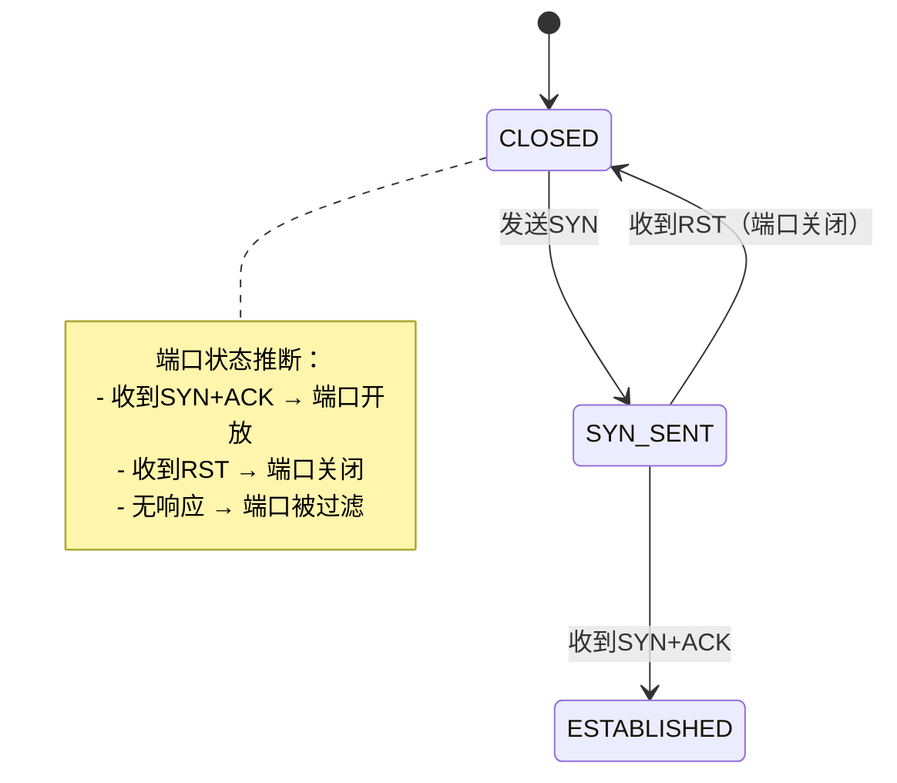
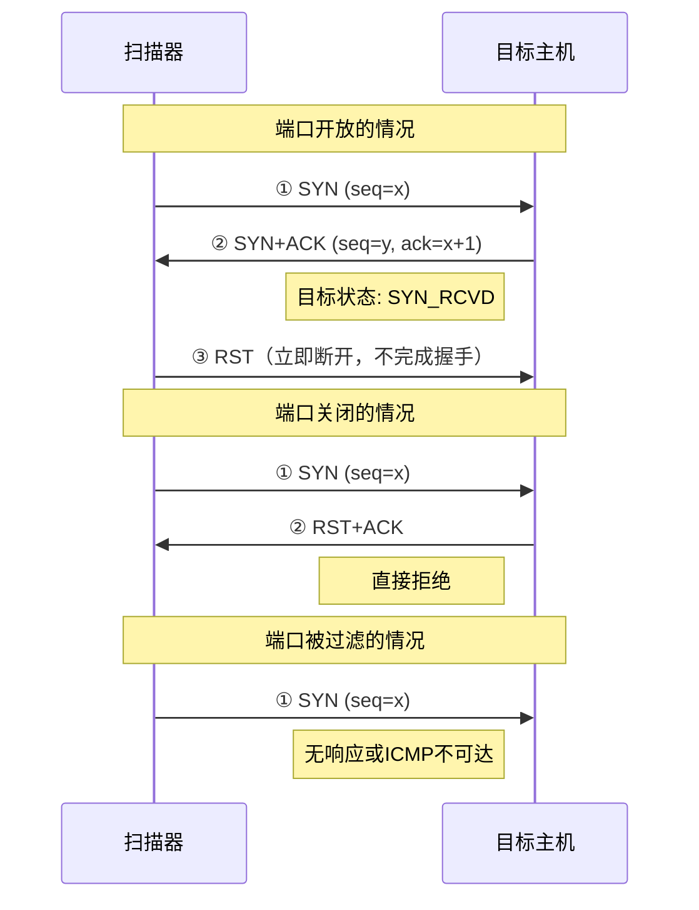
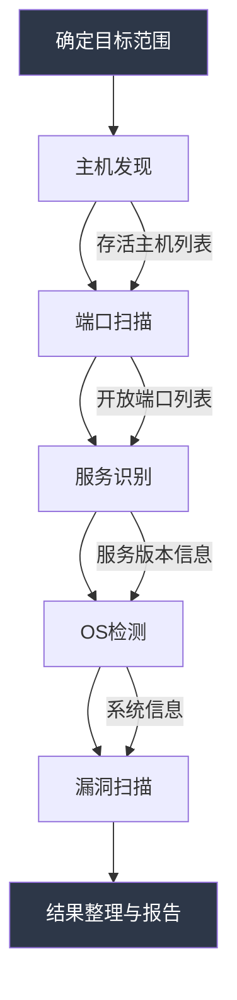

## 二、网络扫描技巧

网络扫描是渗透测试和安全评估的第一步，也是最关键的侦察环节。在真正发起任何攻击之前，攻击者需要尽可能多地了解目标网络的拓扑结构、存活主机、开放端口、运行的服务及其版本。扫描的质量直接决定了后续攻击的效率——盲目的攻击如同在黑暗中开枪，而精准的扫描则是打开探照灯。

本节从扫描原理出发，系统讲解端口扫描技术、主机发现方法、扫描工具使用和规避策略，帮助读者建立完整的网络扫描知识体系。

### 2.1 网络扫描的基本原理

#### 2.1.1 什么是网络扫描

网络扫描（Network Scanning）是通过向目标发送特定的网络数据包并分析响应，来获取目标网络信息的技术。扫描的目标通常包括：

| 扫描目标 | 获取的信息 | 典型工具 |
|---------|-----------|---------|
| 主机发现 | 哪些IP地址有主机存活 | Nmap, fping, masscan |
| 端口扫描 | 目标主机开放了哪些端口 | Nmap, rustscan, naabu |
| 服务识别 | 每个端口运行什么服务及其版本 | Nmap -sV |
| 操作系统识别 | 目标运行什么操作系统 | Nmap -O, xprobe2 |
| 漏洞检测 | 服务是否存在已知漏洞 | Nmap NSE, Nessus |
| 防火墙探测 | 是否存在防火墙及其规则 | Nmap -sA, hping3 |

#### 2.1.2 TCP状态机与扫描的关系

理解扫描技术的关键在于理解TCP协议的状态机。TCP连接的建立和终止涉及多种状态，而不同的扫描技术本质上是利用TCP状态机的不同行为来推断端口状态。



当扫描器向目标端口发送数据包时，根据目标的响应可以推断出三种端口状态：

- **开放（Open）**：目标端口有服务正在监听，愿意接受连接
- **关闭（Closed）**：目标端口没有服务监听，但主机可达
- **过滤（Filtered）**：无法确定状态，通常因为防火墙丢弃了数据包

#### 2.1.3 扫描的法律与道德边界

在学习扫描技术之前，必须明确法律边界：

- **合法场景**：对自己拥有的网络进行安全评估、获得书面授权的渗透测试、CTF竞赛环境
- **违法场景**：未经授权扫描他人网络，即使只是"看看"也可能违反《网络安全法》和《刑法》相关条款
- **灰色地带**：扫描云服务商的基础设施、扫描政府网站等，即使发现漏洞也应通过合法渠道报告

> **重要提醒**：在实际操作中，始终确保你有合法的授权。在实验环境中练习时，使用自己搭建的靶机或官方授权的靶场（如 HackTheBox、TryHackMe、VulnHub）。

### 2.2 端口扫描技术详解

端口扫描是网络扫描的核心。不同的扫描技术在速度、隐蔽性、准确性上各有取舍。

#### 2.2.1 TCP SYN扫描（半开扫描）

TCP SYN扫描是最常用、最推荐的扫描方式，也被称为"半开扫描"（Half-Open Scan）或"隐身扫描"。

**工作原理**：扫描器发送SYN包，如果收到SYN+ACK则端口开放，扫描器直接发送RST断开连接，不完成三次握手。



**优势**：
- 不完成三次握手，许多日志系统不会记录完整的连接
- 速度极快，Nmap默认使用此方式
- 适用范围广

**限制**：
- 需要root或CAP_NET_RAW权限（因为需要构造原始套接字发送自定义TCP包）
- 某些严格的IDS/IPS仍然可以检测到SYN扫描的异常行为（如短时间内大量SYN包发往不同端口）

```bash
# 基本SYN扫描
sudo nmap -sS 192.168.1.100

# 对整个子网进行SYN扫描
sudo nmap -sS 192.168.1.0/24

# 指定端口范围
sudo nmap -sS -p 1-1024 192.168.1.100

# 扫描特定端口
sudo nmap -sS -p 22,80,443,3306,8080 192.168.1.100
```

#### 2.2.2 TCP Connect扫描（全连接扫描）

**工作原理**：使用操作系统提供的`connect()`系统调用完成完整的三次握手，然后断开连接。

**优势**：
- 不需要root权限，任何用户都可以执行
- 实现简单，可靠性高

**劣势**：
- 会留下完整的连接日志（syslog、防火墙日志等）
- 速度比SYN扫描慢（需要完成握手+挥手）
- 容易被目标IDS检测

```bash
# TCP全连接扫描
nmap -sT 192.168.1.100

# 不需要root权限即可执行
# 适用于普通用户或无法获取root权限的场景
```

#### 2.2.3 TCP FIN/XMAS/NULL扫描

这三种扫描技术利用了TCP协议栈的一个特性：当端口关闭时，目标会返回RST包；当端口开放时，如果不发送标准的SYN包，许多系统会直接忽略。

| 扫描类型 | 发送的数据包特征 | 适用系统 | 说明 |
|---------|----------------|---------|------|
| FIN扫描 | 仅设置FIN标志 | Linux/Unix | 向关闭端口发FIN，返回RST；开放端口无响应 |
| XMAS扫描 | 同时设置FIN+PSH+URG | Linux/Unix | 像圣诞树亮起所有灯，故名XMAS |
| NULL扫描 | 不设置任何标志位 | Linux/Unix | 发送"空"TCP包 |

**关键限制**：这三种扫描在Windows系统上不可靠，因为Windows的TCP/IP实现不会对异常标志位的包返回RST，而是直接丢弃。

```bash
# FIN扫描
sudo nmap -sF 192.168.1.100

# XMAS扫描
sudo nmap -sX 192.168.1.100

# NULL扫描
sudo nmap -sN 192.168.1.100
```

**实际应用场景**：当目标运行Linux且防火墙仅过滤SYN包时，FIN/XMAS/NULL扫描可以绕过基于SYN的检测规则。

#### 2.2.4 UDP扫描

UDP扫描与TCP扫描有本质区别。UDP是无连接协议，没有握手过程，因此扫描的判断依据不同。

**工作原理**：
- 向目标端口发送UDP数据包
- 如果端口关闭：目标返回ICMP Port Unreachable（类型3，代码3）
- 如果端口开放：通常无响应（因为UDP是无连接的）
- 如果被过滤：可能返回ICMP不可达（类型3，代码1/2/9/10/13）或无响应

**难点**：UDP扫描速度极慢，因为Linux内核限制ICMP响应速率（通常每秒1条），一个全端口UDP扫描可能需要数小时。

```bash
# 基本UDP扫描
sudo nmap -sU 192.168.1.100

# 扫描常见UDP端口（推荐，比全端口快得多）
sudo nmap -sU -p 53,67,68,69,123,135,137,138,161,162,445,500,514,1900 192.168.1.100

# 结合TCP和UDP扫描
sudo nmap -sS -sU -p T:80,443,U:53,161 192.168.1.100
```

**常见UDP服务及端口**：

| 端口 | 服务 | 说明 |
|-----|------|------|
| 53 | DNS | 域名解析服务 |
| 67/68 | DHCP | 动态主机配置协议 |
| 69 | TFTP | 简单文件传输协议 |
| 123 | NTP | 网络时间协议，可用于DDoS放大攻击 |
| 161/162 | SNMP | 简单网络管理协议，常存在弱口令 |
| 500 | IKE/IPSec | VPN服务 |
| 514 | Syslog | 系统日志服务 |
| 1900 | SSDP | 通用即插即用发现协议 |

#### 2.2.5 ACK扫描

ACK扫描不用于判断端口开放/关闭，而是用于探测防火墙规则。

**工作原理**：发送仅设置ACK标志的TCP包：
- 收到RST包 → 端口未被有状态防火墙过滤
- 无响应或ICMP不可达 → 端口被有状态防火墙过滤

```bash
# ACK扫描，探测防火墙规则
sudo nmap -sA 192.168.1.100

# 扫描特定端口的防火墙状态
sudo nmap -sA -p 80,443,22 192.168.1.100
```

#### 2.2.6 窗口扫描（Window Scan）

窗口扫描与ACK扫描类似，但通过检查TCP窗口字段的大小来区分开放和关闭端口。在某些旧系统上，关闭端口返回的RST包窗口大小为0，而开放端口的窗口大小非零。

```bash
sudo nmap -sW 192.168.1.100
```

#### 2.2.7 空闲扫描（Idle Scan / -sI）

空闲扫描是最高级的扫描技术之一，可以完全隐藏扫描者的IP地址。

**工作原理**：利用一个"僵尸主机"（空闲的、IP ID递增的主机）作为跳板：
1. 探测僵尸主机的IP ID值
2. 伪造源地址为僵尸主机的SYN包发往目标
3. 根据目标端口状态，僵尸主机会收到SYN+ACK或不会收到
4. 再次探测僵尸主机的IP ID，通过差值推断目标端口状态

```bash
# 使用僵尸主机进行空闲扫描
sudo nmap -sI zombie_host:port target_host

# 示例：使用一台空闲的打印机作为僵尸
sudo nmap -sI 192.168.1.50:80 192.168.1.100
```

**条件要求**：僵尸主机必须是空闲的（几乎没有网络流量），且其IP ID必须是递增的（全局递增或按目标递增）。

#### 2.2.8 扫描技术对比总结

| 扫描类型 | 速度 | 隐蔽性 | 需要root | 准确性 | 适用目标 |
|---------|------|--------|---------|--------|---------|
| SYN扫描 | 快 | 高 | 是 | 高 | 所有系统 |
| Connect扫描 | 中 | 低 | 否 | 高 | 所有系统 |
| FIN扫描 | 快 | 高 | 是 | 中 | Linux/Unix |
| XMAS扫描 | 快 | 高 | 是 | 中 | Linux/Unix |
| NULL扫描 | 快 | 高 | 是 | 中 | Linux/Unix |
| UDP扫描 | 慢 | 中 | 是 | 低 | 所有系统 |
| ACK扫描 | 快 | 中 | 是 | 特殊 | 防火墙探测 |
| Idle扫描 | 慢 | 极高 | 是 | 中 | 有僵尸主机时 |

### 2.3 Nmap使用详解

Nmap（Network Mapper）是网络扫描领域的事实标准工具，由Gordon Lyon（Fyodor）于1997年发布。它集成了前面介绍的所有扫描技术，并提供了丰富的附加功能。

#### 2.3.1 Nmap基本语法

```bash
nmap [扫描类型] [选项] <目标>
```

目标可以是：
- 单个IP：`192.168.1.100`
- IP范围：`192.168.1.1-100`
- 子网（CIDR）：`192.168.1.0/24`
- 主机名：`example.com`
- 从文件读取：`-iL targets.txt`

```bash
# 从文件读取目标列表
nmap -iL targets.txt

# 排除特定主机
nmap 192.168.1.0/24 --exclude 192.168.1.1,192.168.1.254

# 从文件中排除
nmap 192.168.1.0/24 --excludefile exclude.txt
```

#### 2.3.2 主机发现技术

在大规模网络中，首先需要确定哪些主机是存活的，避免对不存在的IP浪费扫描时间。

```bash
# Ping扫描（仅主机发现，不扫描端口）
nmap -sn 192.168.1.0/24

# ARP扫描（局域网最有效，速度最快）
# ARP请求无法被防火墙过滤，因此在局域网中最可靠
nmap -PR -sn 192.168.1.0/24

# ICMP Echo Ping
nmap -PE -sn 192.168.1.0/24

# ICMP Timestamp Ping
nmap -PP -sn 192.168.1.0/24

# ICMP Address Mask Ping
nmap -PM -sn 192.168.1.0/24

# TCP SYN Ping（向常用端口发SYN）
# 适用于禁ping但开放端口的主机
nmap -PS22,80,443 -sn 192.168.1.0/24

# TCP ACK Ping
nmap -PA80,443 -sn 192.168.1.0/24

# UDP Ping
nmap -PU53,161 -sn 192.168.1.0/24

# 组合多种发现方式（最全面）
nmap -PE -PS22,80,443 -PA80,443 -PP -sn 192.168.1.0/24

# 跳过DNS解析（加速扫描）
nmap -sn -n 192.168.1.0/24

# 使用arping（独立工具，轻量级）
arping -c 4 192.168.1.1

# fping（快速批量ping）
fping -asg 192.168.1.0/24
```

**主机发现技术选择指南**：

| 场景 | 推荐技术 | 原因 |
|------|---------|------|
| 局域网扫描 | ARP扫描（-PR） | 无法被防火墙过滤，速度最快 |
| 禁ping目标 | TCP SYN Ping（-PS） | 不依赖ICMP，探测常用端口 |
| 远程网络 | 组合多种方式 | 提高发现率 |
| 快速摸底 | Ping扫描（-sn） | 只发现主机，不扫描端口 |

#### 2.3.3 端口扫描选项

```bash
# 默认扫描前1000个常用端口
nmap 192.168.1.100

# 快速扫描（前100个最常用端口）
nmap -F 192.168.1.100

# 全端口扫描（1-65535）
nmap -p- 192.168.1.100

# 指定端口范围
nmap -p 1-1024 192.168.1.100

# 指定特定端口
nmap -p 22,80,443,3306,8080 192.168.1.100

# 混合TCP端口和UDP端口
nmap -sS -sU -p T:80,443,U:53,161 192.168.1.100

# 扫描所有端口（Top N）
nmap --top-ports 1000 192.168.1.100

# 按协议扫描
nmap -p T:80,443 192.168.1.100  # 仅TCP
nmap -p U:53,161 192.168.1.100  # 仅UDP

# 随机化端口扫描顺序（规避检测）
nmap --randomize-hosts -p 1-1024 192.168.1.100
```

#### 2.3.4 服务版本检测

知道端口开放只是第一步，了解端口上运行的具体服务及版本才能进行针对性的漏洞利用。

```bash
# 版本检测
nmap -sV 192.168.1.100

# 设置版本检测强度（0-9，默认7）
nmap -sV --version-intensity 5 192.168.1.100

# 仅检测最常见服务（速度更快）
nmap -sV --version-light 192.168.1.100

# 尝试所有探针（最慢但最全面）
nmap -sV --version-all 192.168.1.100
```

**版本检测输出示例**：

```text
PORT     STATE SERVICE VERSION
22/tcp   open  ssh     OpenSSH 8.9p1 Ubuntu 3ubuntu0.1 (Ubuntu Linux; protocol 2.0)
80/tcp   open  http    Apache httpd 2.4.52 ((Ubuntu))
443/tcp  open  ssl/http Apache httpd 2.4.52 ((Ubuntu))
3306/tcp open  mysql   MySQL 8.0.31-0ubuntu0.22.04.1
```

版本信息的价值在于：知道目标运行的是OpenSSH 8.9p1，就可以直接查询该版本的已知漏洞（如CVE），而不是盲目尝试。

#### 2.3.5 操作系统检测

```bash
# 操作系统检测
sudo nmap -O 192.168.1.100

# 设置检测猜度（0-9，越高越可能给出结果但也可能误判）
sudo nmap -O --osscan-guess 192.168.1.100

# 限制检测范围（加速）
sudo nmap -O --max-os-tries 3 192.168.1.100

# 结合端口扫描和OS检测
sudo nmap -sS -O -sV 192.168.1.100
```

OS检测原理：Nmap发送一系列TCP/UDP/ICMP探针，分析响应中的微妙差异（如TCP窗口大小、TTL值、DF标志、TCP选项顺序等），与Nmap指纹数据库`nmap-os-db`进行匹配。

#### 2.3.6 综合扫描（Aggressive Scan）

```bash
# -A 组合：OS检测 + 版本检测 + 脚本扫描 + traceroute
sudo nmap -A 192.168.1.100

# 等价于
sudo nmap -sV -O -sC --traceroute 192.168.1.100

# 默认脚本扫描（-sC 等价于 --script=default）
nmap -sC 192.168.1.100
```

`-A`模式是"先用再说"的扫描方式，适合快速评估目标。但在大规模扫描中，它的速度较慢，建议根据需求选择性组合。

#### 2.3.7 扫描速度控制

扫描速度直接影响隐蔽性和准确性。Nmap提供了从T0到T5共6个时序模板：

| 模板 | 名称 | 特点 | 适用场景 |
|------|-----|------|---------|
| T0 | Paranoid | 极慢，串行扫描 | IDS规避（几乎不实用） |
| T1 | Sneaky | 慢，每个探针间隔15秒 | IDS规避 |
| T2 | Polite | 较慢，间隔0.4秒 | 减轻目标负载 |
| T3 | Normal | 默认速度 | 日常使用 |
| T4 | Aggressive | 快速 | 内网扫描、快速评估 |
| T5 | Insane | 极快 | 可靠网络环境 |

```bash
# 慢速扫描（规避IDS）
nmap -T2 192.168.1.100

# 快速扫描（内网环境推荐）
nmap -T4 192.168.1.100

# 手动控制速率
nmap --max-rate 100 192.168.1.100      # 每秒最多100个包
nmap --min-rate 1000 192.168.1.100     # 每秒至少1000个包
nmap --max-retries 2 192.168.1.100     # 最多重试2次
nmap --host-timeout 300s 192.168.1.100 # 单主机超时300秒
```

**速度控制策略**：

```bash
# 批量扫描时的推荐设置
# 第一轮：快速发现存活主机
nmap -sn -T4 192.168.1.0/24 -oG hosts_alive.gnmap

# 第二轮：快速扫描常见端口
nmap -sS -T4 -F -iL hosts_alive.txt -oN quick_scan.txt

# 第三轮：对开放端口进行深入扫描
nmap -sV -sC -T3 -p <开放端口> -iL hosts_alive.txt -oN deep_scan.txt
```

#### 2.3.8 NSE脚本基础

Nmap脚本引擎（NSE）极大地扩展了Nmap的功能。NSE脚本使用Lua语言编写，覆盖漏洞检测、认证爆破、服务发现等众多场景。

```bash
# 使用默认脚本（等价于 -sC）
nmap --script=default 192.168.1.100

# 使用特定类别脚本
nmap --script=vuln 192.168.1.100         # 漏洞检测
nmap --script=safe 192.168.1.100         # 安全脚本（不会影响目标）
nmap --script=intrusive 192.168.1.100    # 可能影响目标的脚本
nmap --script=discovery 192.168.1.100    # 服务发现
nmap --script=brute 192.168.1.100        # 暴力破解

# 使用特定脚本
nmap --script=http-enum 192.168.1.100
nmap --script=http-headers 192.168.1.100
nmap --script=ssl-enum-ciphers -p 443 192.168.1.100

# 组合多个脚本
nmap --script=http-enum,http-headers,http-methods -p 80,443 192.168.1.100

# 传递脚本参数
nmap --script=http-brute --script-args userdb=users.txt,passdb=pass.txt 192.168.1.100

# 查看脚本帮助
nmap --script-help http-enum
```

> **深入学习**：NSE脚本的高级用法和自定义脚本编写请参见[高级网络扫描技术](08-十高级网络扫描技术.md)。

#### 2.3.9 输出格式

Nmap支持多种输出格式，便于后续处理和报告生成。

```bash
# 正常输出（人可读）
nmap -oN output.txt 192.168.1.100

# XML格式（可导入其他工具）
nmap -oX output.xml 192.168.1.100

# Grepable格式（便于脚本处理）
nmap -oG output.gnmap 192.168.1.100

# 同时输出所有格式
nmap -oA output 192.168.1.100
# 生成 output.nmap, output.xml, output.gnmap

# 追加模式（不覆盖已有文件）
nmap --append-output -oN output.txt 192.168.1.100
```

**输出格式对比**：

| 格式 | 扩展名 | 特点 | 用途 |
|------|-------|------|------|
| Normal | .nmap | 人可读，最直观 | 人工查看 |
| XML | .xml | 结构化，标准格式 | 导入Metasploit、Zenmap等 |
| Grepable | .gnmap | 单行记录，便于grep/awk | 批量处理、脚本分析 |
| Script Kiddie | .ski | 混合格式 | 较少使用 |

**实用的后处理命令**：

```bash
# 从grepable输出中提取开放端口的主机
grep "open" output.gnmap | cut -d' ' -f2 | sort -u

# 统计各端口开放数量
awk '/open/{print $1}' output.gnmap | sort | uniq -c | sort -rn

# 使用xsltproc将XML转换为HTML报告
xsltproc output.xml -o report.html
```

### 2.4 其他扫描工具

虽然Nmap是最全面的扫描工具，但在特定场景下，其他工具有其独特优势。

#### 2.4.1 masscan — 超高速端口扫描

masscan是最快的互联网端口扫描器，能在6分钟内扫描整个IPv4地址空间。

**核心特点**：
- 使用自定义TCP/IP栈，绕过操作系统内核限制
- 异步传输，不等待响应就持续发包
- 支持每秒发送数百万个包

```bash
# 安装
sudo apt install masscan

# 基本扫描
sudo masscan 192.168.1.0/24 -p 80,443

# 指定速率（每秒10000个包）
sudo masscan 192.168.1.0/24 -p 1-65535 --rate 10000

# 输出为JSON格式
sudo masscan 192.168.1.0/24 -p 80 --output-format json --output-file result.json

# 与Nmap配合使用（masscan快速发现，nmap深入扫描）
sudo masscan 192.168.1.0/24 -p 80,443,22 --rate 5000 -oL masscan_result.txt
# 然后对masscan发现的主机用nmap深入扫描
nmap -sV -sC -iL masscan_result.txt -oN nmap_deep.txt
```

**masscan vs Nmap**：

| 特性 | masscan | Nmap |
|------|--------|------|
| 速度 | 极快（百万包/秒） | 较慢（千包/秒） |
| 服务识别 | 有限 | 完善（-sV） |
| 脚本支持 | 无 | NSE脚本引擎 |
| OS检测 | 无 | 支持 |
| 适用场景 | 大范围快速端口扫描 | 精细化目标评估 |

#### 2.4.2 rustscan — 现代端口扫描器

RustScan用Rust编写，以极快的速度完成端口扫描后自动将结果传递给Nmap进行深入扫描。

```bash
# 安装（使用cargo）
cargo install rustscan

# Docker方式
docker run -it --rm --network host rustscan/rustscan

# 基本使用
rustscan -a 192.168.1.100

# 指定端口范围
rustscan -a 192.168.1.100 -p 1-1000

# 自动调用Nmap进行深入扫描
rustscan -a 192.168.1.100 -- -sV -sC

# 批量扫描
rustscan -a 192.168.1.0/24 -p 22,80,443
```

#### 2.4.3 naabu — 快速端口扫描

naabu是ProjectDiscovery团队开发的Go语言端口扫描器，专为速度优化。

```bash
# 安装
go install -v github.com/projectdiscovery/naabu/v2/cmd/naabu@latest

# 基本扫描
naabu -host 192.168.1.100

# 全端口扫描
naabu -host 192.168.1.100 -p -

# 与nmap联动
naabu -host 192.168.1.100 -nmap-cli 'nmap -sV -sC'
```

#### 2.4.4 hping3 — 手工构造包工具

hping3适合构造自定义TCP/IP包，用于精确控制扫描行为或测试防火墙规则。

```bash
# 安装
sudo apt install hping3

# TCP SYN扫描（手工方式）
sudo hping3 -S -p 80 192.168.1.100

# 指定端口范围
sudo hping3 -S --scan 1-1000 192.168.1.100

# 使用traceroute模式
sudo hping3 --traceroute -S -p 80 192.168.1.100

# 发送自定义标志位
sudo hping3 -F -S -R -P -A -p 80 192.168.1.100
```

### 2.5 扫描实战工作流

单个命令不够，实际工作中需要一套完整的扫描流程。

#### 2.5.1 标准渗透测试扫描流程



#### 2.5.2 完整扫描脚本示例

```bash
#!/bin/bash
# network_scan.sh - 自动化网络扫描脚本
# 用法: ./network_scan.sh <目标IP或子网>

TARGET=$1
OUTPUT_DIR="./scan_results/$(date +%Y%m%d_%H%M%S)"
mkdir -p "$OUTPUT_DIR"

echo "[*] 扫描目标: $TARGET"
echo "[*] 输出目录: $OUTPUT_DIR"

# 第一步：主机发现
echo "[+] 阶段1: 主机发现"
nmap -sn -T4 "$TARGET" -oN "$OUTPUT_DIR/01_hosts.txt" -oG "$OUTPUT_DIR/01_hosts.gnmap"

# 提取存活主机
grep "Up" "$OUTPUT_DIR/01_hosts.gnmap" | cut -d' ' -f2 > "$OUTPUT_DIR/alive_hosts.txt"
ALIVE_COUNT=$(wc -l < "$OUTPUT_DIR/alive_hosts.txt")
echo "[+] 发现 $ALIVE_COUNT 台存活主机"

if [ "$ALIVE_COUNT" -eq 0 ]; then
    echo "[-] 未发现存活主机，退出"
    exit 1
fi

# 第二步：快速端口扫描
echo "[+] 阶段2: 快速端口扫描（常用端口）"
nmap -sS -T4 -F -iL "$OUTPUT_DIR/alive_hosts.txt" \
    -oN "$OUTPUT_DIR/02_quick_scan.txt" \
    -oG "$OUTPUT_DIR/02_quick_scan.gnmap"

# 第三步：全端口扫描
echo "[+] 阶段3: 全端口扫描"
nmap -sS -T3 -p- -iL "$OUTPUT_DIR/alive_hosts.txt" \
    -oN "$OUTPUT_DIR/03_full_scan.txt" \
    -oG "$OUTPUT_DIR/03_full_scan.gnmap"

# 第四步：服务版本检测
echo "[+] 阶段4: 服务版本检测"
# 从全端口扫描结果提取开放端口
OPEN_PORTS=$(grep "open" "$OUTPUT_DIR/03_full_scan.gnmap" | \
    awk '{for(i=5;i<=NF;i++) if($i~/open/) split($i,a,"/"); print a[1]}' | \
    sort -un | tr '\n' ',' | sed 's/,$//')

if [ -n "$OPEN_PORTS" ]; then
    nmap -sV -sC -T3 -p "$OPEN_PORTS" -iL "$OUTPUT_DIR/alive_hosts.txt" \
        -oN "$OUTPUT_DIR/04_service_scan.txt" \
        -oX "$OUTPUT_DIR/04_service_scan.xml"
fi

# 第五步：OS检测
echo "[+] 阶段5: OS检测"
sudo nmap -O -T3 -iL "$OUTPUT_DIR/alive_hosts.txt" \
    -oN "$OUTPUT_DIR/05_os_scan.txt"

echo "[+] 扫描完成，结果保存在: $OUTPUT_DIR"
echo "[+] 文件列表:"
ls -la "$OUTPUT_DIR"
```

#### 2.5.3 针对Web服务的专项扫描

当发现目标运行Web服务时，可以进行更深入的Web层面扫描：

```bash
# Web服务枚举
nmap --script=http-enum -p 80,443,8080 target

# HTTP方法检测
nmap --script=http-methods -p 80 target

# HTTP标题信息
nmap --script=http-headers -p 80 target

# 检测Web应用防火墙
nmap --script=http-waf-detect -p 80 target

# SSL/TLS详细检测
nmap --script=ssl-enum-ciphers -p 443 target
nmap --script=ssl-cert -p 443 target
nmap --script=ssl-heartbleed -p 443 target
```

### 2.6 扫描规避技术

在面对IDS/IPS系统时，直接扫描可能触发告警甚至被封禁IP。了解规避技术有助于绕过安全设备的检测，也有助于安全工程师理解攻击者的手法以改进防御。

#### 2.6.1 常见规避策略

| 策略 | 方法 | 原理 |
|------|------|------|
| 降速 | -T0/-T1, --max-rate | 降低发包速度，低于IDS阈值 |
| 分片 | -f | 将TCP包分成小片段，规避基于内容的检测 |
| 欺骗源IP | -S, -D | 伪造源地址或使用诱饵地址 |
| 使用代理 | --proxies | 通过SOCKS/HTTP代理链路扫描 |
| 随机化顺序 | --randomize-hosts | 打乱扫描顺序 |
| 空闲扫描 | -sI | 利用僵尸主机隐藏真实IP |
| 慢速扫描 | --scan-delay | 增加探测间隔 |

```bash
# 分片扫描
sudo nmap -f 192.168.1.100

# 使用诱饵IP（将自己的IP混在随机IP中）
sudo nmap -D RND:10 192.168.1.100

# 指定诱饵IP
sudo nmap -D 192.168.1.5,192.168.1.6,ME 192.168.1.100

# 伪造源端口（模拟常见服务的端口）
sudo nmap --source-port 53 192.168.1.100  # 模拟DNS流量
sudo nmap --source-port 80 192.168.1.100  # 模拟HTTP流量

# 添加随机数据长度
sudo nmap --data-length 25 192.168.1.100

# 随机化主机顺序
sudo nmap --randomize-hosts 192.168.1.0/24

# 使用MAC地址欺骗（局域网内）
sudo nmap --spoof-mac 0 192.168.1.100  # 随机MAC地址
sudo nmap --spoof-mac Cisco 192.168.1.100  # 伪造Cisco设备MAC
```

#### 2.6.2 绕过防火墙的技巧

```bash
# 使用ACK扫描绕过简单的包过滤防火墙
sudo nmap -sA 192.168.1.100

# 利用FTP反弹扫描（通过FTP服务器代理扫描）
sudo nmap -Pn -b user@ftp_server 192.168.1.100

# 使用特定源端口绕过端口过滤规则
sudo nmap --source-port 88 192.168.1.100  # 模拟Kerberos流量

# 从IPv6扫描（许多防火墙未配置IPv6规则）
nmap -6 fe80::1%eth0
```

### 2.7 常见误区与避坑指南

#### 2.7.1 新手常见错误

**误区一：不做主机发现，直接全网段端口扫描**

```bash
# ❌ 错误做法：直接对整个网段全端口扫描
nmap -p- 192.168.1.0/24  # 巨慢，大部分IP不在线

# ✅ 正确做法：先发现存活主机，再针对性扫描
nmap -sn 192.168.1.0/24 -oG hosts.gnmap
grep "Up" hosts.gnmap | cut -d' ' -f2 > alive.txt
nmap -p- -iL alive.txt
```

**误区二：永远使用默认参数**

默认扫描（前1000端口）可能遗漏关键服务。很多重要服务运行在非标准端口上，如MySQL可能在3307、Redis可能在6380。

```bash
# ✅ 对内网资产进行全端口扫描
sudo nmap -sS -p- -T4 192.168.1.100
```

**误区三：忽略UDP端口**

UDP服务（如DNS 53、SNMP 161、NTP 123）经常被忽略，但这些服务往往是攻击入口。

```bash
# ✅ 不要只扫TCP，UDP也很重要
sudo nmap -sS -sU -p T:1-65535,U:53,67,68,69,123,161,162,500,514,1900 192.168.1.100
```

**误区四：扫描结果不保存**

手动查看Nmap输出后忘记保存，后续无法回顾或做报告。

```bash
# ✅ 始终使用 -oA 保存所有格式
nmap -sS -sV -sC -oA scan_result 192.168.1.100
```

**误区五：不考虑网络环境就选择高速扫描**

在生产网络中使用-T5可能导致目标系统崩溃或网络拥塞。

```bash
# ✅ 生产环境使用 -T2 或 -T3，限制速率
sudo nmap -T2 --max-rate 50 production_server
```

#### 2.7.2 扫描结果的正确解读

Nmap的端口状态不仅仅是"开"和"关"，理解每种状态的含义至关重要：

| 状态 | 含义 | 后续动作 |
|------|------|---------|
| open | 端口有服务监听 | 重点关注，进行服务识别 |
| closed | 端口无服务，但主机可达 | 记录，可能的服务已下线 |
| filtered | 无法确定，被防火墙/ACL阻止 | 尝试绕过技术或ACK扫描 |
| unfiltered | 端口可达但无法判断开放/关闭 | 使用其他扫描类型进一步确认 |
| open\|filtered | 开放或过滤（如UDP扫描） | 需要进一步确认 |
| closed\|filtered | 关闭或过滤（Idle扫描） | 需要更好的僵尸主机 |

### 2.8 进阶技巧

#### 2.8.1 大规模网络扫描策略

对大型网络（如/16子网，65536个IP）的扫描需要特殊策略：

```bash
# 第一轮：快速主机发现（极快速）
nmap -sn -T5 --min-parallelism 256 10.0.0.0/16 -oG round1.gnmap

# 第二轮：仅扫描存活主机的常用端口
grep "Up" round1.gnmap | cut -d' ' -f2 > alive.txt
nmap -sS -T4 -F -iL alive.txt -oG round2.gnmap

# 第三轮：对有开放端口的主机进行详细扫描
grep "open" round2.gnmap | cut -d' ' -f2 | sort -u > interesting.txt
nmap -sV -sC -O -iL interesting.txt -oA round3
```

#### 2.8.2 持续监控扫描

对关键资产进行定期扫描，检测变化：

```bash
#!/bin/bash
# 变化检测：对比两次扫描结果
BASELINE="baseline.gnmap"
CURRENT="current.gnmap"

nmap -sS -F -oG "$CURRENT" 192.168.1.0/24

echo "[*] 新开放端口："
diff <(grep "open" "$BASELINE" | sort) <(grep "open" "$CURRENT" | sort) | grep "^>"

echo "[*] 新关闭端口："
diff <(grep "open" "$BASELINE" | sort) <(grep "open" "$CURRENT" | sort) | grep "^<"

# 更新基线
cp "$CURRENT" "$BASELINE"
```

#### 2.8.3 扫描性能优化

```bash
# 并行主机扫描数量
nmap --min-parallelism 64 --max-parallelism 128 192.168.1.0/24

# DNS缓存
nmap --dns-servers 8.8.8.8,1.1.1.1 192.168.1.0/24

# 跳过反向DNS解析（大幅加速）
nmap -n 192.168.1.0/24

# 设置最小数据包速率
nmap --min-rate 300 192.168.1.0/24

# 缩短超时时间
nmap --max-rtt-timeout 100ms --initial-rtt-timeout 50ms 192.168.1.0/24
```

### 2.9 本节要点回顾

- 网络扫描是渗透测试的首要步骤，质量决定后续攻击效率
- TCP SYN扫描是最平衡的扫描方式（速度+隐蔽性+准确性）
- 始终先做主机发现再做端口扫描，避免浪费时间
- UDP扫描不可忽略，许多高价值服务运行在UDP上
- Nmap的`-A`模式适合快速评估，精细扫描需要自定义参数组合
- 大规模扫描使用masscan/rustscan做初筛，Nmap做精扫
- 扫描规避技术的核心是降低发包速率和混淆流量特征
- 保存扫描结果（`-oA`）是基本习惯，方便后续分析和报告生成
