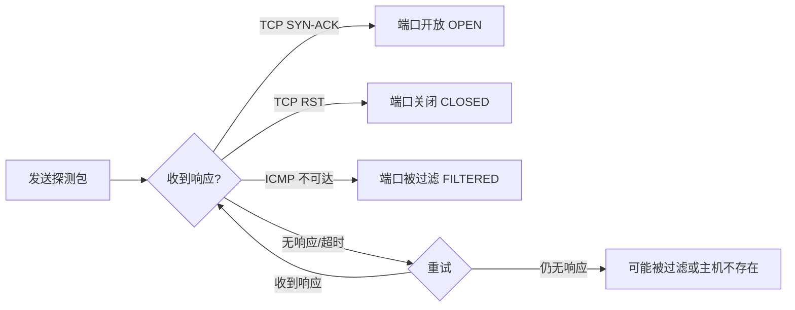
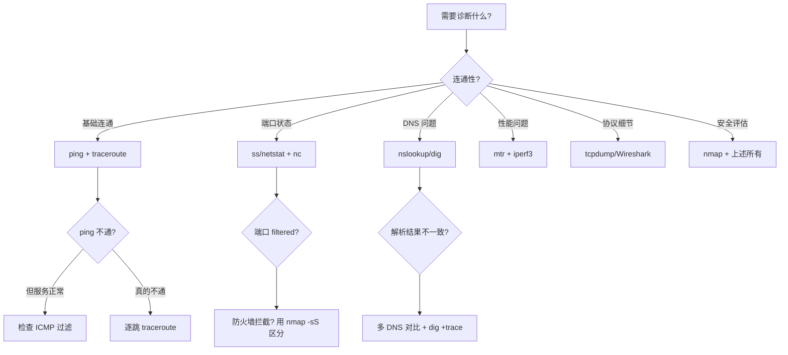

## 三、网络诊断命令

网络诊断命令是安全工程师和渗透测试人员的"听诊器"。当你面对一个陌生网络环境、排查连接故障、或者侦察目标基础设施时，这些命令就是你的第一道侦察手段。本节从基础到高级，系统讲解每一个核心诊断工具的原理、用法和安全场景应用。

### 3.1 网络诊断的整体思路

在动手敲命令之前，先理解网络诊断的分层排查逻辑。网络问题本质上就是 OSI 七层模型中某一层出了问题，诊断的核心方法论是**自底向上逐层排查**：


**分层诊断速查表：**

| 层级 | 检查内容 | 核心命令 | 典型故障 |
|------|----------|----------|----------|
| 物理层 | 网线、接口状态 | `ip link`、`ethtool` | 网线断裂、接口down |
| 链路层 | MAC地址、ARP解析 | `arp`、`ip neigh` | ARP欺骗、VLAN错配 |
| 网络层 | IP地址、路由可达 | `ping`、`traceroute`、`ip route` | 路由黑洞、ACL拦截 |
| 传输层 | 端口连通、TCP状态 | `ss`、`netstat`、`nc` | 端口未开放、防火墙丢包 |
| 应用层 | 协议交互、数据正确性 | `curl`、`dig`、`tcpdump` | DNS解析失败、证书错误 |

### 3.2 接口与地址诊断

#### 3.2.1 查看网络接口状态

**`ip addr show` — 查看所有网络接口的详细信息（Linux 推荐）**

```bash
# 查看所有接口
ip addr show
ip a          # 缩写形式，效果相同

# 查看指定接口
ip addr show eth0
ip a show ens33

# 只显示 IPv4 地址
ip -4 addr

# 只显示 IPv6 地址
ip -6 addr
```

典型输出解读：

```text
2: eth0: <BROADCAST,MULTICAST,UP,LOWER_UP> mtu 1500 qdisc fq_codel state UP group default qlen 1000
    link/ether 00:0c:29:ab:cd:ef brd ff:ff:ff:ff:ff:ff
    inet 192.168.1.100/24 brd 192.168.1.255 scope global eth0
    inet6 fe80::20c:29ff:feab:cdef/64 scope link
```

逐行解读：

| 字段 | 含义 | 安全关注点 |
|------|------|-----------|
| `<BROADCAST,MULTICAST,UP,LOWER_UP>` | 接口标志位 | UP 表示接口已启用；缺少 UP 说明接口关闭 |
| `mtu 1500` | 最大传输单元 | MTU 异常可能暗示隧道封装或 VPN |
| `state UP` | 链路状态 | DOWN 表示物理连接有问题 |
| `link/ether 00:0c:29:ab:cd:ef` | MAC 地址 | 前三段 OUI 可识别厂商，`00:0c:29` 是 VMware |
| `inet 192.168.1.100/24` | IPv4 地址和子网 | CIDR /24 = 子网掩码 255.255.255.0 |
| `brd 192.168.1.255` | 广播地址 | 用于 ARP 请求等广播通信 |
| `scope global` | 地址作用域 | global = 全局可达；link = 仅本地链路 |

**`ifconfig` — 传统接口查看工具（macOS/旧版 Linux）**

```bash
# 查看所有接口
ifconfig

# 查看指定接口
ifconfig eth0

# 只看激活的接口
ifconfig -a

# 临时设置 IP（需要 root）
sudo ifconfig eth0 192.168.1.200 netmask 255.255.255.0 up
```

> **工具对比：** `ip` 命令是 iproute2 套件的一部分，功能更强大且仍在积极维护；`ifconfig` 属于 net-tools，已被多数发行版标记为废弃（deprecated）。在安全工具链中，`ip` 命令支持更多高级功能如网络命名空间、策略路由等，建议优先使用。

**`ethtool` — 查看网卡物理层信息**

```bash
# 查看网卡速率、双工模式
sudo ethtool eth0

# 查看网卡驱动信息
sudo ethtool -i eth0

# 查看网卡统计信息（丢包、错误计数）
sudo ethtool -S eth0

# 查看网卡是否支持混杂模式
sudo ethtool eth0 | grep -i "link detected"
```

安全场景：`ethtool -S eth0` 中的 `rx_errors`、`tx_errors`、`rx_dropped` 等计数器异常增长，可能暗示网络攻击（如大量畸形包导致丢包）或物理层问题。

#### 3.2.2 查看和管理接口统计

```bash
# 查看接口流量统计（持续更新）
ifstat

# 查看接口吞吐量
ip -s link show eth0

# 实时监控网络接口流量
watch -n 1 'ip -s link show eth0'
```

### 3.3 路由诊断

#### 3.3.1 查看路由表

路由表决定了数据包从本机出发后"走哪条路"到达目标网络。理解路由表是网络诊断和渗透测试的基础。

**`ip route show` — 查看内核路由表（Linux 推荐）**

```bash
# 查看完整路由表
ip route show
ip r          # 缩写

# 查看到达特定目标的路由
ip route get 8.8.8.8
ip route get 10.0.0.0/24

# 查看指定表的路由
ip route show table main
ip route show table local    # 本地接口地址的路由
```

典型输出解读：

```text
default via 192.168.1.1 dev eth0 proto dhcp metric 100
192.168.1.0/24 dev eth0 proto kernel scope link src 192.168.1.100 metric 100
10.10.0.0/16 via 192.168.1.254 dev eth0 proto static metric 50
```

| 字段 | 含义 | 解读 |
|------|------|------|
| `default` | 默认路由（0.0.0.0/0） | 所有未匹配其他路由的包走这条路由 |
| `via 192.168.1.1` | 下一跳网关 | 数据包先发给这个地址 |
| `dev eth0` | 出接口 | 数据包从 eth0 发出 |
| `proto dhcp` | 路由来源 | dhcp = DHCP 自动分配；static = 手动配置；kernel = 内核自动生成 |
| `metric 100` | 路由度量值 | 越小越优先，多路径时用来选择最佳路径 |
| `scope link` | 链路范围 | 只在直连网络内有效 |

**`netstat -rn` — 查看路由表（通用）**

```bash
# 查看路由表（IPv4）
netstat -rn

# 查看路由表（IPv6）
netstat -rn -f inet6
```

安全场景：检查路由表可以发现异常的静态路由（可能是后门配置的隐蔽通道）、默认网关是否被篡改（ARP 欺骗的迹象）、以及是否存在指向内部网络其他网段的路由（内网横向移动的线索）。

#### 3.3.2 路由追踪

**`traceroute` — 追踪数据包到目标的完整路径**

```bash
# 基本用法（UDP 模式，默认）
traceroute example.com

# 使用 ICMP 模式（更可靠，某些防火墙只放行 ICMP）
traceroute -I example.com

# 使用 TCP 模式（穿透防火墙能力强）
traceroute -T example.com
traceroute -T -p 443 example.com    # 指定目标端口

# 设置最大跳数
traceroute -m 30 example.com

# 设置每跳的探测包数量
traceroute -q 1 example.com         # 每跳只发1个包（加快速度）

# 指定源接口（多网卡环境）
traceroute -i eth1 example.com

# 不进行 DNS 反解析（加快速度）
traceroute -n example.com
```

**`tracert` — Windows 路由追踪**

```powershell
tracert example.com
tracert -d example.com     # 不解析主机名
tracert -w 3000 example.com  # 设置超时为3000ms
```

**`mtr` — 实时路由诊断（traceroute + ping 的结合体）**

```bash
# 交互模式
mtr example.com

# 报告模式（发送100个包后生成报告）
mtr --report --report-cycles 100 example.com

# TCP 模式
mtr --tcp --port 443 example.com

# 不解析主机名
mtr -n example.com

# JSON 输出（适合程序化处理）
mtr -j example.com
```

`mtr` 的输出包含每一跳的丢包率、平均/最坏/最佳延迟、标准差等统计信息，比 `traceroute` 更全面。在安全评估中，`mtr` 可以快速识别网络瓶颈和异常跳数。

**traceroute 输出安全分析：**

```text
traceroute to 8.8.8.8 (8.8.8.8), 30 hops max, 60 byte packets
 1  192.168.1.1 (192.168.1.1)  1.234 ms  1.189 ms  1.156 ms
 2  10.10.0.1 (10.10.0.1)  5.678 ms  5.543 ms  5.432 ms
 3  * * *
 4  72.14.215.85 (72.14.215.85)  12.345 ms  12.234 ms  12.123 ms
```

| 现象 | 可能原因 | 安全含义 |
|------|----------|----------|
| `* * *`（某跳全部超时） | 该路由器不响应 TTL 过期的包，或防火墙丢弃了 ICMP | 可能是安全设备（IDS/IPS）故意隐藏自身 |
| 延迟突然大幅增加 | 绕路或拥塞 | 可能经过了国际链路，或中间存在隧道封装 |
| 同一 IP 出现多次 | 非对称路由 | 可能存在负载均衡或路由环路 |
| 最后一跳是私有地址 | 目标在 NAT 后面 | 目标真实 IP 被隐藏 |

### 3.4 ARP 与邻居诊断

ARP（地址解析协议）负责将 IP 地址解析为 MAC 地址。在安全领域，ARP 是重灾区——ARP 欺骗是最常见的中间人攻击手段之一。

#### 3.4.1 查看 ARP 缓存

```bash
# 方法一：arp 命令（通用）
arp -a                    # 显示所有 ARP 表项
arp -a | grep 192.168.1   # 过滤特定网段
arp -n                    # 不解析主机名（更快）

# 方法二：ip neigh（Linux 推荐）
ip neigh show             # 显示所有邻居表项
ip neigh show dev eth0    # 只看指定接口
ip neigh show nud reachable  # 只显示可达状态的条目

# 方法三：查看 ARP 缓存超时设置
ip neigh show | awk '{print $1, $5}'   # 显示 IP 和剩余过期时间
```

ARP 条目的六种状态（`ip neigh` 输出）：

| 状态 | 含义 | 安全关注 |
|------|------|----------|
| `REACHABLE` | 正常可达，MAC 已确认 | 正常状态 |
| `STALE` | 可能过期，下次使用时会重新确认 | 正常老化过程 |
| `DELAY` | 等待确认中 | 短暂过渡状态 |
| `INCOMPLETE` | ARP 请求已发送但未收到回复 | 目标可能不存在或被过滤 |
| `FAILED` | ARP 解析失败 | 目标不可达 |
| `PERMANENT` | 静态 ARP 条目 | 通常是管理员手动配置的防欺骗措施 |

#### 3.4.2 ARP 安全检查

```bash
# 检查是否有多个 IP 映射到同一 MAC（可能的 ARP 欺骗）
arp -a | awk '{print $4}' | sort | uniq -c | sort -rn | head

# 检查是否有同一 IP 映射到多个 MAC（网关冗余或攻击迹象）
arp -a | awk '{print $2}' | sort | uniq -c | sort -rn | head

# 手动添加静态 ARP 条目（防御 ARP 欺骗）
sudo arp -s 192.168.1.1 00:11:22:33:44:55

# 使用 ip 命令添加静态 ARP
sudo ip neigh add 192.168.1.1 lladdr 00:11:22:33:44:55 dev eth0 nud permanent
```

### 3.5 连接状态诊断

#### 3.5.1 活跃连接查看

**`ss` — Socket 统计工具（Linux 推荐，比 netstat 快 10 倍以上）**

```bash
# 查看所有 TCP 连接
ss -t

# 查看所有 UDP 连接
ss -u

# 查看所有监听端口
ss -l

# 查看监听端口及对应进程（需要 root）
sudo ss -tlnp

# 组合使用：所有 TCP 和 UDP 的监听端口
ss -tulnp

# 查看所有连接（包括非监听）
ss -tunap

# 按状态过滤连接
ss -t state established           # 已建立的连接
ss -t state time-wait             # TIME_WAIT 状态
ss -t state syn-recv              # SYN_RECV（可能遭受 SYN Flood）
ss -t state close-wait            # CLOSE_WAIT（应用未正确关闭连接）

# 按目标地址过滤
ss -t dst 10.0.0.0/8

# 按源端口过滤
ss -t sport = :443

# 查看 TCP 内部信息（拥塞窗口、重传等）
ss -ti

# 查看 socket 内存使用
ss -tm

# 统计各状态的连接数
ss -s
```

**`netstat` — 通用网络统计工具**

```bash
# 查看所有 TCP 连接
netstat -t

# 查看所有 UDP 连接
netstat -u

# 查看监听端口及进程
netstat -tlnp

# 查看所有连接（TCP + UDP + UNIX socket）
netstat -anp

# 查看网络统计信息
netstat -s

# 查看接口统计
netstat -i

# 持续监控连接变化
watch -n 1 'ss -tunap | wc -l'
```

**连接状态详解（TCP 状态机）：**

| 状态 | 含义 | 正常/异常判断 |
|------|------|--------------|
| `LISTEN` | 服务端等待连接 | 正常，检查是否暴露了不必要的端口 |
| `ESTABLISHED` | 连接已建立 | 正常，但关注异常 IP 的连接 |
| `SYN_SENT` | 客户端已发送 SYN，等待回复 | 大量 SYN_SENT 可能是端口扫描 |
| `SYN_RECV` | 服务端收到 SYN，等待 ACK | 大量 SYN_RECV = SYN Flood 攻击 |
| `FIN_WAIT1/2` | 连接正在关闭 | 正常关闭过程 |
| `TIME_WAIT` | 等待确保对方收到 FIN | 大量 TIME_WAIT 可能是短连接过多 |
| `CLOSE_WAIT` | 对方已关闭，本方未关闭 | 大量 CLOSE_WAIT = 应用 bug（连接泄漏） |
| `CLOSING` | 双方同时关闭 | 罕见，正常 |
| `LAST_ACK` | 等待最后的 ACK | 正常关闭过程 |

#### 3.5.2 端口连通性测试

```bash
# netcat — 瑞士军刀级网络工具
nc -zv 192.168.1.1 80             # 测试单个端口
nc -zv 192.168.1.1 80 443 8080    # 测试多个端口
nc -zv 192.168.1.1 1-1024         # 扫描端口范围
nc -zvw3 192.168.1.1 80           # 设置3秒超时
nc -zvn 192.168.1.1 80            # 不解析DNS（更快）

# 扫描 UDP 端口
nc -zuv 192.168.1.1 53            # 测试 DNS 端口
nc -zuv 192.168.1.1 161           # 测试 SNMP 端口

# curl — HTTP 层面的连通性测试
curl -v http://192.168.1.1         # 详细 HTTP 交互过程
curl -I https://example.com        # 只获取响应头
curl -o /dev/null -s -w "%{http_code} %{time_connect} %{time_total}" https://example.com
# 输出：HTTP状态码、TCP连接耗时、总耗时

# 测试 HTTPS 证书信息
curl -vI https://example.com 2>&1 | grep -E "(subject|expire|issuer)"

# telnet — 传统 TCP 连接测试
telnet 192.168.1.1 80             # 交互式 TCP 连接
# 按 Ctrl+] 退出，输入 quit

# /dev/tcp — Bash 内置的端口测试（无需安装额外工具）
echo > /dev/tcp/192.168.1.1/80 && echo "端口开放" || echo "端口关闭"
timeout 2 bash -c 'echo > /dev/tcp/192.168.1.1/80' 2>/dev/null && echo "OPEN" || echo "CLOSED"

# hping3 — 高级端口测试（支持自定义协议字段）
sudo hping3 -S -p 80 192.168.1.1          # SYN 包测试
sudo hping3 -S -p 80 --ttl 64 192.168.1.1 # 自定义 TTL
sudo hping3 --udp -p 53 192.168.1.1       # UDP 端口测试
```

**端口状态判断逻辑：**



### 3.6 DNS 诊断

DNS 是互联网的"电话簿"，也是攻击者最爱利用的基础设施之一。DNS 问题会导致"一切看起来正常但服务就是不可用"的诡异现象。

#### 3.6.1 基本 DNS 查询

**`nslookup` — 基础 DNS 查询工具**

```bash
# 查询 A 记录
nslookup example.com

# 指定 DNS 服务器查询
nslookup example.com 8.8.8.8

# 查询特定记录类型
nslookup -type=MX example.com     # 邮件服务器
nslookup -type=NS example.com     # 域名服务器
nslookup -type=TXT example.com    # TXT 记录（SPF、DKIM等）
nslookup -type=AAAA example.com   # IPv6 地址

# 反向 DNS 查询（IP → 域名）
nslookup 8.8.8.8
```

**`dig` — 专业级 DNS 查询工具（强烈推荐）**

```bash
# 基本查询
dig example.com
dig example.com +short            # 只显示结果 IP

# 查询特定记录类型
dig example.com A                  # IPv4 地址
dig example.com AAAA               # IPv6 地址
dig example.com MX                 # 邮件服务器
dig example.com NS                 # 权威域名服务器
dig example.com TXT                # TXT 记录
dig example.com SOA                # 起始授权记录
dig example.com ANY                # 所有记录（部分服务器不支持）
dig example.com CNAME              # 别名记录

# 指定 DNS 服务器
dig @8.8.8.8 example.com
dig @1.1.1.1 example.com

# 反向查询
dig -x 8.8.8.8

# 跟踪完整 DNS 解析过程（从根服务器开始）
dig +trace example.com

# 查看 DNSSEC 签名信息
dig +dnssec example.com

# 查询 DNS 缓存的 TTL
dig example.com | grep -E "^[^;]" | awk '{print $2, "秒后过期"}'

# 批量查询
dig -f domains.txt +short

# JSON 输出
dig example.com +json
```

**`dig` 输出详解：**

```text
;; ANSWER SECTION:
example.com.    300    IN    A    93.184.216.34
```

| 字段 | 含义 |
|------|------|
| `example.com.` | 查询的域名（末尾的 `.` 是根域） |
| `300` | TTL（缓存有效期，单位秒） |
| `IN` | 类别（IN = Internet） |
| `A` | 记录类型 |
| `93.184.216.34` | 解析结果 |

#### 3.6.2 DNS 故障排查

```bash
# 检查本地 DNS 配置
cat /etc/resolv.conf
systemd-resolve --status        # systemd 环境
resolvectl status               # 新版 systemd

# 检查 hosts 文件是否有覆盖
cat /etc/hosts | grep -v "^#" | grep -v "^$"

# 检查本地 DNS 缓存
sudo systemd-resolve --statistics    # systemd-resolved
sudo dscacheutil -statistics         # macOS
ipconfig /displaydns                 # Windows

# 清除 DNS 缓存
sudo systemd-resolve --flush-caches  # systemd-resolved
sudo dscacheutil -flushcache         # macOS
ipconfig /flushdns                   # Windows

# 完整 DNS 解析链路测试
dig +trace example.com               # 从根服务器逐级追踪
dig example.com @8.8.8.8             # 用公共DNS对比
dig example.com @$(awk '/^nameserver/{print $2; exit}' /etc/resolv.conf)  # 用系统DNS
```

**DNS 诊断流程图：**


#### 3.6.3 DNS 安全检查

```bash
# 检查 DNS 劫持：对比多个 DNS 服务器的结果
dig @8.8.8.8 example.com +short
dig @1.1.1.1 example.com +short
dig @223.5.5.5 example.com +short    # 阿里 DNS
dig @114.114.114.114 example.com +short  # 114 DNS

# 检查域名的权威 DNS 服务器
dig NS example.com +short

# 检查 DNS 区域传送（安全审计）
dig axfr example.com @ns1.example.com
# 如果成功返回大量记录，说明 DNS 服务器配置不当，暴露了内部域名结构

# 检查 SPF 记录（邮件安全）
dig TXT example.com +short | grep "spf"

# 检查 DMARC 记录
dig TXT _dmarc.example.com +short

# 检查 CAA 记录（证书颁发限制）
dig CAA example.com +short
```

### 3.7 MTU 路径发现

MTU（最大传输单元）问题会导致"能 ping 通但大文件传输失败"的诡异现象。MTU 路径发现是确定端到端路径上最小 MTU 的过程。

```bash
# Linux：使用 ping 的 DF（Don't Fragment）标志探测 MTU
# 1472 = 1500(MTU) - 20(IP头) - 8(ICMP头)
ping -M do -s 1472 -c 3 192.168.1.1

# 如果 1472 成功但 1473 失败，说明路径 MTU = 1500
# 逐步减小 payload 直到 ping 成功
ping -M do -s 1400 -c 3 192.168.1.1
ping -M do -s 1300 -c 3 192.168.1.1

# macOS：使用 -D（设置 DF 标志）
ping -D -s 1472 -c 3 192.168.1.1

# Windows：使用 -f（设置 DF 标志）和 -l（指定包大小）
ping -f -l 1472 192.168.1.1

# 使用 tracepath 自动发现 MTU（Linux，无需 root）
tracepath example.com

# 使用 iperf3 测试实际吞吐量
iperf3 -s                           # 服务端
iperf3 -c 192.168.1.1               # 客户端
iperf3 -c 192.168.1.1 -M 1400      # 指定 MSS
```

**MTU 问题排查表：**

| 场景 | 现象 | 诊断方法 |
|------|------|----------|
| VPN 隧道 MTU 问题 | 小文件正常，大文件卡住 | `ping -M do -s 1400` 逐级缩小测试 |
| PPPoE 拨号 | 默认 MTU 1492 | 检查接口 MTU：`ip link show ppp0` |
| 隧道封装 | MTU 被压缩 | GRE 减 24 字节，IPSec 减 50-100 字节 |
| Jumbo Frame | 9000 MTU 环境 | 需要端到端设备都支持 |

### 3.8 网络命名空间诊断（容器环境）

网络命名空间（Network Namespace）是 Linux 容器技术的基础，也是 Docker、Kubernetes 等平台实现网络隔离的核心机制。在安全评估中，理解命名空间对于容器逃逸分析和容器网络安全审计至关重要。

```bash
# 列出所有网络命名空间
ip netns list

# 在指定命名空间中执行命令
ip netns exec <namespace> ip addr show
ip netns exec <namespace> ss -tlnp
ip netns exec <namespace> ip route show
ip netns exec <namespace> ping 8.8.8.8

# 查看 Docker 容器的网络命名空间
# 先找到容器的 PID
docker inspect --format '{{.State.Pid}}' <container_name>
# 然后查看其网络命名空间
nsenter -t <PID> -n ip addr show
nsenter -t <PID> -n ss -tlnp

# 创建网络命名空间（用于网络实验）
sudo ip netns add test_ns

# 创建 veth pair 连接两个命名空间
sudo ip link add veth0 type veth peer name veth1
sudo ip link set veth1 netns test_ns

# 在命名空间中配置 IP
sudo ip netns exec test_ns ip addr add 10.0.0.2/24 dev veth1
sudo ip netns exec test_ns ip link set veth1 up

# 在 Docker 中运行网络诊断
docker exec <container_name> ss -tlnp
docker exec <container_name> ip route show
docker exec <container_name> cat /etc/resolv.conf

# 查看 Kubernetes Pod 的网络
kubectl debug -it <pod_name> --image=busybox -- ss -tlnp
kubectl exec -it <pod_name> -- ip route show
```

### 3.9 网络诊断的自动化脚本

手动执行诊断命令效率低下。以下是常用的诊断自动化脚本，可以在安全评估中批量使用。

#### 3.9.1 一键网络健康检查脚本

```bash
#!/bin/bash
# network-health-check.sh — 一键网络健康检查
# 用法：bash network-health-check.sh [目标IP]

TARGET="${1:-8.8.8.8}"
echo "========== 网络健康检查报告 =========="
echo "目标: $TARGET"
echo "时间: $(date)"
echo ""

echo "--- 接口状态 ---"
ip -br addr show
echo ""

echo "--- 默认路由 ---"
ip route show default
echo ""

echo "--- DNS 配置 ---"
cat /etc/resolv.conf | grep -v "^#"
echo ""

echo "--- DNS 解析测试 ---"
for dns in 8.8.8.8 1.1.1.1 223.5.5.5; do
    result=$(dig @$dns $TARGET +short +time=2 2>/dev/null)
    echo "  $dns -> ${result:-超时}"
done
echo ""

echo "--- 连通性测试 ---"
ping -c 3 -W 2 $TARGET 2>/dev/null | tail -1
echo ""

echo "--- 路由追踪 ---"
traceroute -n -m 15 -q 1 $TARGET 2>/dev/null
echo ""

echo "--- 活跃连接统计 ---"
ss -s
echo ""

echo "--- 监听端口 ---"
ss -tlnp 2>/dev/null || netstat -tlnp 2>/dev/null
echo ""

echo "--- ARP 表 ---"
ip neigh show | head -20
echo ""

echo "========== 检查完成 =========="
```

#### 3.9.2 批量端口检查脚本

```bash
#!/bin/bash
# port-check.sh — 批量检查目标端口状态
# 用法：bash port-check.sh <目标IP> <端口列表>

TARGET="$1"
PORTS="${2:-22,80,443,3306,6379,8080,8443}"

IFS=',' read -ra PORT_ARRAY <<< "$PORTS"
echo "端口检查: $TARGET"
echo "----------------------------------------"

for port in "${PORT_ARRAY[@]}"; do
    timeout 2 bash -c "echo > /dev/tcp/$TARGET/$port" 2>/dev/null
    if [ $? -eq 0 ]; then
        echo "  $port  OPEN"
    else
        echo "  $port  CLOSED/FILTERED"
    fi
done
```

#### 3.9.3 DNS 对比检测脚本（检测 DNS 劫持）

```bash
#!/bin/bash
# dns-compare.sh — 对比多个 DNS 服务器的解析结果，检测劫持
# 用法：bash dns-compare.sh <域名>

DOMAIN="$1"
DNS_SERVERS="8.8.8.8 1.1.1.1 223.5.5.5 114.114.114.114 208.67.222.222"

echo "DNS 对比检测: $DOMAIN"
echo "----------------------------------------"

declare -A results
for dns in $DNS_SERVERS; do
    result=$(dig @$dns $DOMAIN +short +time=3 2>/dev/null | sort | tr '\n' ' ')
    echo "  $dns -> ${result:-无响应}"
    results["$dns"]="$result"
done

echo ""
echo "--- 一致性检查 ---"
unique_count=$(printf '%s\n' "${results[@]}" | sort -u | wc -l)
if [ "$unique_count" -eq 1 ]; then
    echo "  结果一致：未发现 DNS 劫持迹象"
else
    echo "  警告：不同 DNS 返回了不同结果，可能存在 DNS 劫持"
fi
```

### 3.10 常见误区与纠正

**误区一：只用 `ping` 判断网络是否正常**

`ping` 只能测试 ICMP 可达性。很多服务器或防火墙会过滤 ICMP 包，导致"ping 不通"但服务完全正常。正确的做法是同时检查 ICMP、TCP 端口和 HTTP 状态：

```bash
# 错误做法：只用 ping
ping -c 1 example.com

# 正确做法：多维度检查
ping -c 1 -W 2 example.com || echo "ICMP 不通"
nc -zvw2 example.com 443 || echo "TCP 443 不通"
curl -sI --max-time 5 https://example.com || echo "HTTPS 不通"
```

**误区二：`netstat` 比 `ss` 好**

`netstat` 在高连接数服务器上性能极差（遍历 `/proc/net/tcp` 逐行解析），而 `ss` 直接读取内核的 Netlink 接口，速度快 10-100 倍。在有数万连接的服务器上，`netstat` 可能卡住几分钟，`ss` 几秒就完成。

**误区三：`traceroute` 每一跳都是真实路径**

`traceroute` 依赖 TTL 过期时路由器返回的 ICMP 超时报文。但负载均衡路由器可能对不同 TTL 的包走不同路径，所以看到的路径可能不是实际数据包走的路径。需要结合 `mtr` 多次探测来确认。

**误区四：DNS 查询结果一定正确**

DNS 可能被缓存、被劫持、被污染。排查 DNS 问题时，必须用多个 DNS 服务器交叉验证，并用 `dig +trace` 追踪完整的解析链路。

**误区五：忽略 IPv6**

很多诊断只检查 IPv4，忽略了 IPv6。现代操作系统默认优先使用 IPv6，如果 IPv6 配置有问题但 IPv4 正常，会出现"有时能访问有时不能"的诡异问题。诊断时务必同时检查：

```bash
# 同时测试 IPv4 和 IPv6
ping -4 example.com     # 强制 IPv4
ping -6 example.com     # 强制 IPv6
curl -4 https://example.com
curl -6 https://example.com
```

**误区六：只看命令输出不做对比**

诊断的核心方法论是**对比法**——和正常状态比、和别的服务器比、和不同 DNS 比。单独看一个 `ss` 输出意义不大，对比已知正常的基线才有价值。

### 3.11 进阶诊断工具

当基础命令无法定位问题时，可以使用以下进阶工具：

```bash
# tcpdump — 命令行抓包分析
sudo tcpdump -i eth0 host 192.168.1.1        # 抓取特定主机的包
sudo tcpdump -i eth0 port 80                  # 抓取特定端口的包
sudo tcpdump -i eth0 'tcp port 443 and host 10.0.0.1'  # 组合过滤
sudo tcpdump -i eth0 -w capture.pcap          # 保存到文件
sudo tcpdump -r capture.pcap                  # 读取 pcap 文件
sudo tcpdump -i eth0 -c 100 -nn              # 抓100个包，不解析地址

# nmap — 网络扫描与服务识别
nmap -sn 192.168.1.0/24                       # 主机发现
nmap -sT -p 80,443 192.168.1.1               # TCP 连接扫描
nmap -sS -p 1-1000 192.168.1.1               # SYN 半开扫描
nmap -sV -p 80 192.168.1.1                   # 服务版本检测
nmap -O 192.168.1.1                           # 操作系统检测
nmap --script=default 192.168.1.1             # 默认脚本扫描

# iperf3 — 网络带宽测试
iperf3 -s                                     # 服务端
iperf3 -c 192.168.1.1 -t 30                  # 客户端，测试30秒
iperf3 -c 192.168.1.1 -P 4                   # 4个并行流
iperf3 -c 192.168.1.1 -R                     # 反向测试（服务端→客户端）

# socat — 高级网络瑞士军刀
socat TCP-LISTEN:8080,fork TCP:192.168.1.1:80  # TCP 端口转发
socat - TCP:192.168.1.1:80                       # 简单 TCP 连接
```

**工具选型决策树：**



### 3.12 总结

网络诊断命令是安全工程师的基本功。掌握这些命令不仅用于排查故障，更用于渗透测试中的网络侦察。核心要点：

1. **分层诊断**：自底向上逐层排查，不要跳过中间层
2. **对比分析**：和正常基线对比、多工具交叉验证
3. **自动化**：将重复的诊断流程编写成脚本
4. **工具链**：`ip` + `ss` + `dig` + `mtr` + `tcpdump` 是基础五件套
5. **安全视角**：每个诊断命令都可以从攻击和防御两个角度理解
6. **不要忽略 IPv6**：现代网络中 IPv6 的存在感越来越强
