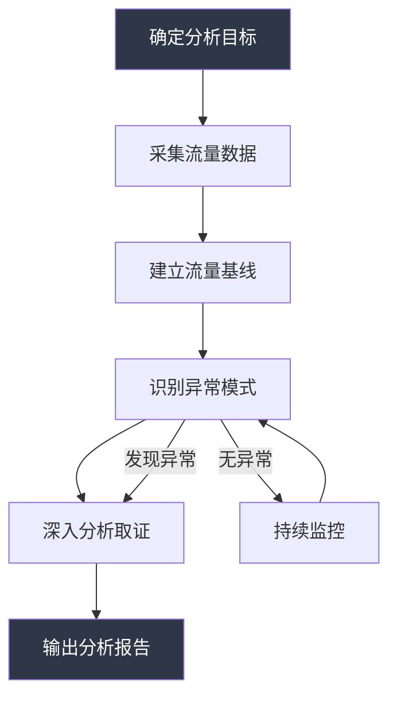
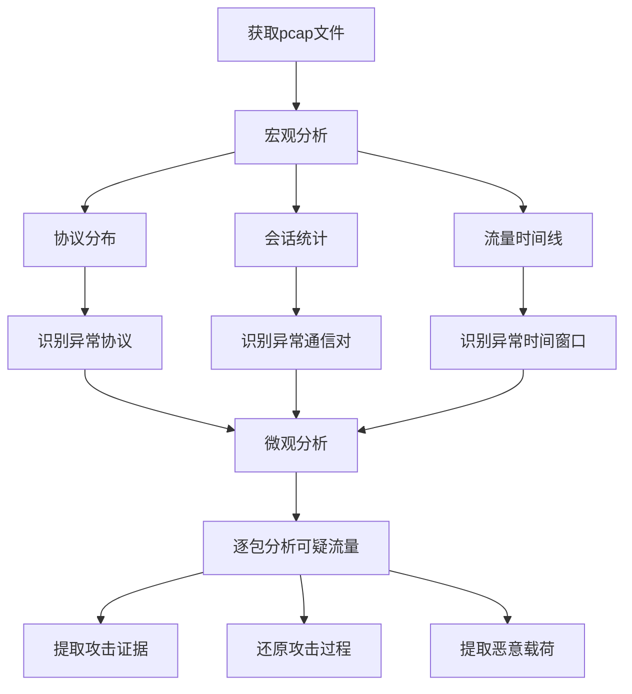
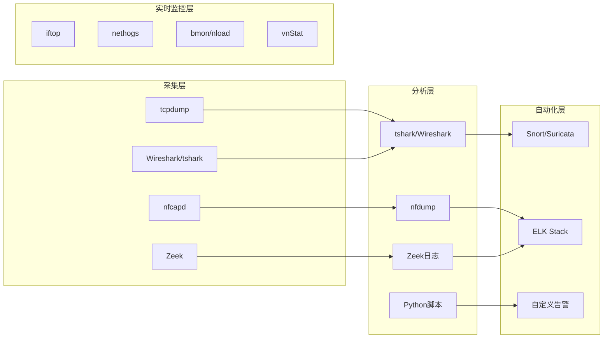

## 六、流量分析技巧

流量分析是网络安全攻防的核心技能之一。如果说抓包（第一章）是"看清楚每一个数据包"，那么流量分析就是"从海量数据包中发现规律和异常"。两者的关系类似于显微镜与望远镜——抓包聚焦于单个数据包的细节，流量分析则关注宏观的通信模式、行为特征和统计规律。

攻击者在目标网络中活动时，无论手法多么隐蔽，都会在网络流量中留下痕迹。防御方通过流量分析可以发现入侵迹象、定位攻击源头、评估损害范围；攻击方则利用流量分析来侦察目标网络拓扑、识别关键资产、发现可利用的服务。

### 6.1 流量分析方法论

#### 6.1.1 流量分析的三个维度

流量分析不是漫无目的地"看流量"，而是从三个维度系统性地审视网络通信：

| 维度 | 关注点 | 典型问题 |
|------|--------|----------|
| **统计维度** | 流量的量级、速率、协议分布 | "为什么今天出站流量暴增3倍？" |
| **行为维度** | 通信双方的交互模式 | "这个内部主机为什么凌晨3点在跟境外IP通信？" |
| **内容维度** | 数据包的有效载荷 | "这个HTTP请求的URI里为什么有一长串Base64编码？" |

三个维度逐层递进：统计维度发现异常信号，行为维度定位可疑主机，内容维度确认攻击行为。

#### 6.1.2 流量分析工作流程



**第一步：确定分析目标**。明确你要回答的问题——是排查网络性能问题、检测入侵行为、还是取证分析。目标决定了采集范围和分析方法。

**第二步：采集流量数据**。根据目标选择合适的采集点和采集方式。核心交换机的镜像端口（SPAN Port）是最常见的采集点，它将经过交换机的所有流量复制一份发送给分析设备。

**第三步：建立流量基线**。基线是"正常"的量化定义。没有基线，就无法判断什么是"异常"。

**第四步：识别异常模式**。将当前流量与基线对比，找出偏差。

**第五步：深入分析取证**。对异常进行深入调查，确定根因。

**第六步：输出分析报告**。记录发现、证据和结论。

#### 6.1.3 流量基线的建立方法

基线（Baseline）是流量分析的基石。基线记录了网络在正常运行状态下的流量特征，包括：

- **带宽基线**：各时间段的平均/峰值带宽利用率
- **协议分布**：TCP/UDP/ICMP/其他协议的流量占比
- **连接模式**：正常时段的并发连接数、新建连接速率
- **通信对特征**：内部主机通常与哪些外部IP通信（白名单）
- **DNS行为**：正常的DNS查询频率、查询的域名分布
- **时间模式**：工作日与周末、工作时间与非工作时间的流量差异

**建立基线的实操流程**：

```bash
# 1. 使用tcpdump持续采集流量（建议采集至少7天，覆盖工作日和周末）
# 在核心交换机的镜像端口上采集
sudo tcpdump -i eth0 -w /data/baseline/day1.pcap -G 3600 -W 168
# -G 3600: 每3600秒（1小时）生成一个新文件
# -W 168: 最多生成168个文件（7天 × 24小时）

# 2. 使用tshark提取统计信息
# 按协议统计流量
tshark -r day1.pcap -q -z io,phs

# 按IP统计会话
tshark -r day1.pcap -q -z conv,ip

# 统计DNS查询域名
tshark -r day1.pcap -Y "dns.flags.response == 0" \
  -T fields -e dns.qry.name | sort | uniq -c | sort -rn | head -20

# 3. 使用Python建立量化基线
```

```python
#!/usr/bin/env python3
"""流量基线建立脚本 — 基于dpkt解析pcap文件"""

import dpkt
import socket
import statistics
import collections
import json
from datetime import datetime

def build_baseline(pcap_file):
    """分析pcap文件，输出流量基线指标"""
    packet_sizes = []
    protocols = collections.Counter()
    src_ips = collections.Counter()
    dst_ips = collections.Counter()
    connections = set()   # (src_ip, dst_ip, dst_port) 三元组
    hourly_bytes = collections.defaultdict(int)
    
    with open(pcap_file, 'rb') as f:
        pcap = dpkt.pcap.Reader(f)
        for ts, buf in pcap:
            packet_sizes.append(len(buf))
            hour = datetime.fromtimestamp(ts).hour
            hourly_bytes[hour] += len(buf)
            
            try:
                eth = dpkt.ethernet.Ethernet(buf)
                if not isinstance(eth.data, dpkt.ip.IP):
                    protocols['non-IP'] += 1
                    continue
                ip = eth.data
                src = socket.inet_ntoa(ip.src)
                dst = socket.inet_ntoa(ip.dst)
                src_ips[src] += 1
                dst_ips[dst] += 1
                
                if isinstance(ip.data, dpkt.tcp.TCP):
                    protocols['TCP'] += 1
                    connections.add((src, dst, ip.data.dport))
                elif isinstance(ip.data, dpkt.udp.UDP):
                    protocols['UDP'] += 1
                    connections.add((src, dst, ip.data.dport))
                elif isinstance(ip.data, dpkt.icmp.ICMP):
                    protocols['ICMP'] += 1
                else:
                    protocols[f'other({ip.p})'] += 1
            except Exception:
                protocols['malformed'] += 1
    
    # 计算基线指标
    baseline = {
        'capture_file': pcap_file,
        'total_packets': len(packet_sizes),
        'total_bytes': sum(packet_sizes),
        'avg_packet_size': round(statistics.mean(packet_sizes), 1),
        'std_packet_size': round(statistics.stdev(packet_sizes), 1) if len(packet_sizes) > 1 else 0,
        'max_packet_size': max(packet_sizes),
        'protocol_distribution': dict(protocols.most_common()),
        'unique_src_ips': len(src_ips),
        'unique_dst_ips': len(dst_ips),
        'unique_connections': len(connections),
        'top_sources': src_ips.most_common(10),
        'top_destinations': dst_ips.most_common(10),
        'hourly_traffic': dict(sorted(hourly_bytes.items())),
    }
    return baseline

if __name__ == '__main__':
    import sys
    if len(sys.argv) < 2:
        print("用法: python3 baseline.py <pcap文件>")
        sys.exit(1)
    result = build_baseline(sys.argv[1])
    print(json.dumps(result, indent=2, ensure_ascii=False))
```

基线建立后，后续的异常检测就变成了一个"与基线对比"的工程问题。典型告警规则示例：

- 出站流量超过基线均值 + 3σ（三个标准差）→ 可能存在数据外泄
- 非工作时间新建连接数超过阈值 → 可能存在C2回连
- DNS查询中出现大量从未见过的新域名 → 可能是DGA生成的恶意域名
- 单个内部主机与超过N个外部IP建立连接 → 可能是端口扫描或蠕虫传播

### 6.2 实时流量监控工具

实时流量监控是日常运维和安全值守的基本功。以下是Linux下最常用的实时监控工具及其适用场景。

#### 6.2.1 iftop — 接口级实时流量监控

iftop以类似top的界面实时显示网络接口上的流量，按主机对（源IP ↔ 目标IP）分组统计，是最直观的流量监控工具。

```bash
# 基本用法：监控指定接口
sudo iftop -i eth0

# 常用启动参数组合
sudo iftop -i eth0 -nNP
# -n: 不进行DNS反解（加快显示速度）
# -N: 不解析端口名（显示数字端口而非服务名）
# -P: 显示端口信息

# 按流量排序（默认按累计流量排序）
# 进入iftop后按快捷键：
#   t  — 切换显示模式（2行/1行/只显示发送/只显示接收）
#   n  — 切换DNS解析开关
#   s  — 切换是否显示源端口
#   d  — 切换是否显示目标端口
#   P  — 暂停/恢复刷新
#   1/2/3 — 按2秒/10秒/40秒平均流量排序
```

**iftop的局限性**：它只能显示按主机对分组的流量统计，无法按进程区分。如果你想知道"哪个进程在消耗带宽"，需要使用nethogs。

#### 6.2.2 nethogs — 按进程统计流量

nethogs是少有的能按进程显示网络流量的工具。当你发现某台服务器带宽异常、需要快速定位"哪个进程在吃带宽"时，nethogs是首选。

```bash
# 基本用法
sudo nethogs eth0

# 监控多个接口
sudo nethogs eth0 wlan0

# 设置刷新间隔（秒）
sudo nethogs -d 2 eth0

# tracemode模式（适合脚本采集）
sudo nethogs -t eth0 > /tmp/nethogs.log &

# 交互快捷键：
#   m  — 切换单位（KB/s, KB, B, MB）
#   r  — 按接收流量排序
#   s  — 按发送流量排序
```

**nethogs的工作原理**：它通过读取`/proc/net/tcp`、`/proc/net/udp`和`/proc/<pid>/fd`来建立进程与socket的映射关系，再结合libpcap抓包统计每个进程的流量。这个原理意味着：在容器环境中，nethogs只能看到宿主机命名空间内的进程，无法看到容器内部的进程。

#### 6.2.3 vnStat — 长期流量统计

vnStat与其他工具的本质区别在于：它不是实时抓包，而是持续记录流量统计到本地数据库。这使它成为建立流量基线和历史趋势分析的利器。

```bash
# 安装（大多数发行版已预装）
sudo apt install vnstat    # Debian/Ubuntu
sudo yum install vnstat    # CentOS/RHEL

# 启动守护进程（自动开始记录）
sudo systemctl enable --now vnstat

# 查看实时统计
vnstat -l -i eth0

# 查看当天流量汇总
vnstat -i eth0 -d

# 查看月度统计
vnstat -i eth0 -m

# 查看小时级统计（用于发现时间规律）
vnstat -i eth0 -h

# 查看Top 10流量日
vnstat -i eth0 -t

# 输出JSON格式（适合脚本处理）
vnstat -i eth0 --json d

# 以图形化方式显示（终端内）
vnstat -i eth0 -hg
```

**vnStat数据库位置**：`/var/lib/vnstat/`。备份这个目录即可保留历史流量数据。迁移到新服务器时，复制此目录并重启vnstatd即可恢复数据。

#### 6.2.4 bmon — 带宽监控与可视化

bmon以图形化方式显示每个接口的实时带宽利用率，支持查看多个接口的吞吐量曲线。

```bash
# 基本用法
bmon -p eth0

# 指定输出格式和刷新间隔
bmon -p eth0 -r 1        # 1秒刷新
bmon -p eth0 -o ascii     # ASCII图表输出

# 查看所有接口的汇总
bmon
# 进入后按方向键选择接口，按d查看详细统计
```

#### 6.2.5 工具选型对比

| 工具 | 核心能力 | 是否按进程 | 是否持久化 | 典型场景 |
|------|----------|-----------|-----------|----------|
| iftop | 接口级实时流量（按主机对） | 否 | 否 | 快速查看哪两个IP在通信 |
| nethogs | 进程级实时流量 | 是 | 否 | 定位哪个进程消耗带宽 |
| vnStat | 长期统计记录 | 否 | 是 | 建立基线、历史趋势、月报 |
| bmon | 接口级带宽可视化 | 否 | 否 | 多接口监控、吞吐量曲线 |
| iptraf-ng | 全方位实时监控 | 部分 | 否 | 综合交互式监控 |
| nload | 接口级带宽图 | 否 | 否 | 简单直观的带宽利用率查看 |

### 6.3 异常流量识别

异常流量识别是流量分析的核心价值所在。以下按攻击类型逐一讲解识别方法、Wireshark过滤语法和取证要点。

#### 6.3.1 识别ARP欺骗

ARP欺骗（ARP Spoofing）是中间人攻击的基础。攻击者发送伪造的ARP响应，将自己的MAC地址与目标IP绑定，从而截获流量。

**识别特征**：

| 特征 | 正常情况 | ARP欺骗时 |
|------|----------|-----------|
| MAC-IP映射 | 一个MAC对应一个IP | 多个IP对应同一个MAC |
| ARP响应 | 仅在收到ARP请求后响应 | 持续发送未被请求的ARP响应（Gratuitous ARP） |
| 网关MAC | 稳定不变 | 频繁变化或被替换为攻击者MAC |

**Wireshark检测方法**：

```bash
# 过滤未被请求的ARP响应（Gratuitous ARP，ARP欺骗的典型特征）
arp.opcode == 2 && arp.dst.hw_mac == ff:ff:ff:ff:ff:ff

# 检查是否存在MAC冲突
# 方法：Statistics → Endpoints → Ethernet 标签页
# 观察同一个MAC地址是否关联了多个不同的IP地址

# 检查ARP响应速率异常（arp中每秒响应数远超正常值）
# 使用tshark统计
tshark -r capture.pcap -Y "arp.opcode == 2" \
  -T fields -e frame.time_relative | \
  awk '{print int($1)}' | uniq -c | sort -rn | head
```

**命令行快速检测**：

```bash
# 方法1：查看ARP缓存，检查是否有多个IP映射到同一MAC
arp -a | awk '{print $4}' | sort | uniq -c | sort -rn | while read count mac; do
  if [ "$count" -gt 1 ]; then
    echo "警告: MAC地址 $mac 被 $count 个IP共享:"
    arp -a | grep "$mac"
  fi
done

# 方法2：使用arping验证网关MAC（从两个不同主机对比结果）
arping -c 3 -I eth0 192.168.1.1

# 方法3：使用arpwatch监控ARP变化（长期监控）
sudo apt install arpwatch
sudo systemctl enable --now arpwatch
# arpwatch会在ARP映射变化时发送邮件告警
# 日志: /var/log/syslog (搜索 "changed ethernet address")
```

#### 6.3.2 识别DNS劫持与DNS欺骗

DNS攻击分为两种：DNS劫持（在传输路径上篡改响应）和DNS欺骗（伪造DNS服务器响应）。

**识别特征**：

```bash
# Wireshark过滤：对比DNS响应来源
# 正常情况：响应来自你配置的DNS服务器（如8.8.8.8）
# 劫持情况：响应来自非预期的源IP
dns.flags.response == 1 && !(ip.src == 8.8.8.8)

# 检查DNS响应中的TTL异常
# 正常DNS TTL通常为300-3600秒
# 被篡改的响应可能使用极低TTL（如0或1）以避免缓存
dns.flags.response == 1 && dns.resp.ttl < 60

# 检查DNS ID匹配（DNS事务ID应与请求一致）
# 在Wireshark中：Statistics → DNS 查看统计

# 使用tshark提取DNS交互对
tshark -r capture.pcap -Y "dns" \
  -T fields -e dns.id -e dns.flags.response \
  -e ip.src -e ip.dst -e dns.qry.name -e dns.a | head -50
```

**命令行验证DNS一致性**：

```bash
# 从不同DNS服务器查询同一域名，对比结果
echo "=== 查询权威DNS ==="
dig @8.8.8.8 suspicious-domain.com +short

echo "=== 查询本地DNS ==="
dig @192.168.1.1 suspicious-domain.com +short

echo "=== 查询Cloudflare ==="
dig @1.1.1.1 suspicious-domain.com +short

# 如果本地DNS返回的IP与其他DNS不一致，则可能被劫持

# 批量验证脚本
while read domain; do
  google=$(dig @8.8.8.8 "$domain" +short 2>/dev/null | head -1)
  local_dns=$(dig @192.168.1.1 "$domain" +short 2>/dev/null | head -1)
  if [ -n "$google" ] && [ -n "$local_dns" ] && [ "$google" != "$local_dns" ]; then
    echo "不一致: $domain → Google=$google, 本地=$local_dns"
  fi
done < domains.txt
```

#### 6.3.3 识别端口扫描

端口扫描是最常见的网络侦察行为。不同类型的扫描在流量中有不同的特征。

| 扫描类型 | 特征 | Wireshark过滤 |
|----------|------|---------------|
| TCP SYN扫描（半连接） | 大量SYN包到不同端口，收到SYN+ACK后立即RST | `tcp.flags.syn==1 && tcp.flags.ack==0` |
| TCP Connect扫描（全连接） | 完整三次握手后立即FIN/RST | `tcp.flags.fin==1 && tcp.len==0` |
| NULL扫描 | TCP标志位全为0 | `tcp.flags==0x000` |
| XMAS扫描 | FIN+PSH+URG同时置位 | `tcp.flags==0x029` |
| FIN扫描 | 仅FIN标志 | `tcp.flags==0x001` |
| UDP扫描 | 大量UDP包到不同端口，收到ICMP端口不可达 | `icmp.type==3 && icmp.code==3` |

**检测脚本**：

```bash
# 统计单个源IP在60秒内发往不同端口的SYN包数量
# 超过阈值即为扫描行为
tshark -r capture.pcap \
  -Y "tcp.flags.syn==1 && tcp.flags.ack==0" \
  -T fields -e ip.src -e tcp.dstport -e frame.time_relative | \
  awk '{src=$1; port=$2; time=int($3); count[src"time"port]++}
  END {
    for (key in count) {
      split(key, parts, "time")
      src = parts[1]; time = parts[2]
      time_count[src"time"] += 1
    }
    for (tc in time_count) {
      if (time_count[tc] > 20) {
        split(tc, p, "time")
        print "扫描嫌疑: " p[1] " 在第 " p[2] " 秒扫描了 " time_count[tc] " 个端口"
      }
    }
  }'
```

**使用Snort/Suricata自动检测**（参考第十一节企业级网络监控的规则编写）：

```text
# Snort规则：检测端口扫描
alert tcp $EXTERNAL_NET any -> $HOME_NET any \
  (msg:"Port Scan Detected"; flags:S; \
   threshold:type threshold, track by_src, count 20, seconds 60; \
   sid:1000003; rev:1;)
```

#### 6.3.4 识别数据外泄（Data Exfiltration）

数据外泄是攻击的最终目的之一。攻击者将窃取的数据通过各种渠道传出网络。

**常见外泄通道及特征**：

| 外泄方式 | 流量特征 | 检测方法 |
|----------|----------|----------|
| HTTP/HTTPS上传 | 大量POST请求或长连接上传 | 监控出站HTTP POST数据量 |
| DNS隧道 | DNS查询中携带编码数据（子域名异常长） | `dns.qry.name.len > 50` |
| ICMP隧道 | ICMP包数据部分异常大或非随机 | `icmp.data.len > 48` |
| 邮件附件 | SMTP附件传输大量数据 | 监控出站SMTP流量 |
| 云存储上传 | 连接storage.googleapis.com等 | 域名白名单比对 |

**Wireshark检测规则**：

```bash
# 检测异常长的DNS查询（DNS隧道特征）
dns.qry.name.len > 50

# 检测异常大的ICMP包（ICMP隧道特征）
icmp && data.len > 48

# 检测非常规时间段的大量出站流量
ip.dst != 10.0.0.0/8 && ip.dst != 172.16.0.0/12 && ip.dst != 192.168.0.0/16

# 使用tshark统计每个内部IP的出站数据量
tshark -r capture.pcap \
  -Y "ip.src==10.0.0.0/8 && !(ip.dst==10.0.0.0/8)" \
  -T fields -e ip.src -e ip.len | \
  awk '{bytes[$1] += $2} END {for (ip in bytes) print ip, bytes[ip]}' | \
  sort -k2 -rn | head -20
```

#### 6.3.5 识别DDoS攻击流量

DDoS攻击通过大量合法或半合法流量耗尽目标资源。不同类型攻击的流量特征差异很大。

| DDoS类型 | 流量特征 | 关键过滤 |
|----------|----------|----------|
| SYN Flood | 大量SYN包，源IP可能伪造 | `tcp.flags.syn==1 && tcp.flags.ack==0` |
| UDP Flood | 大量UDP包到同一端口 | `udp.dstport == <target_port>` |
| ICMP Flood | 大量ICMP Echo Request | `icmp.type==8` |
| HTTP Flood | 大量HTTP GET/POST请求 | `http.request.method` |
| Slowloris | 大量不完整的HTTP连接 | `tcp.flags.syn==1 && tcp.analysis.zero_window` |
| DNS Amplification | 大量DNS响应到同一目标 | `dns.flags.response==1 && ip.dst==<victim>` |

**SYN Flood检测统计**：

```bash
# 统计每秒SYN包数量
tshark -r capture.pcap \
  -Y "tcp.flags.syn==1 && tcp.flags.ack==0" \
  -T fields -e frame.time_relative | \
  awk '{print int($1)}' | uniq -c

# 如果某秒SYN包数量远超正常基线（通常正常值<100/秒），
# 则高度怀疑SYN Flood攻击
```

### 6.4 PCAP文件深度分析

当你拿到一个pcap文件（可能是从安全设备导出、也可能是渗透测试中采集的），如何系统性地分析它？

#### 6.4.1 分析方法论



#### 6.4.2 tshark高级分析命令

```bash
# === 宏观分析 ===

# 1. 协议层级统计 — 了解pcap中包含哪些协议及各自占比
tshark -r capture.pcap -q -z io,phs

# 2. IP会话统计 — 识别主要通信对
tshark -r capture.pcap -q -z conv,ip | sort -k5 -rn | head -20

# 3. TCP会话统计
tshark -r capture.pcap -q -z conv,tcp | sort -k5 -rn | head -20

# 4. 按时间统计流量分布 — 发现异常时间段
tshark -r capture.pcap -q -z io,stat,60
# 每60秒统计一次流量

# 5. HTTP请求统计
tshark -r capture.pcap -q -z http,tree

# 6. DNS查询统计
tshark -r capture.pcap -q -z dns,tree

# === 微观分析 ===

# 7. 提取所有HTTP请求的URL
tshark -r capture.pcap -Y "http.request" \
  -T fields -e ip.src -e http.host -e http.request.uri -e http.request.method

# 8. 提取所有HTTP响应中的可疑字符串
tshark -r capture.pcap -Y "http.response" \
  -T fields -e ip.src -e http.response.code -e http.content_type

# 9. 提取DNS查询的所有域名（去重排序）
tshark -r capture.pcap -Y "dns.flags.response == 0" \
  -T fields -e dns.qry.name | sort -u

# 10. 提取所有TLS证书信息
tshark -r capture.pcap -Y "tls.handshake.type == 11" \
  -T fields -e x509sat.utf8String -e x509ce.dNSName

# 11. 重组TCP流并导出文件
tshark -r capture.pcap --export-objects http,exported_files/

# 12. 提取所有传输的文件
tshark -r capture.pcap --export-objects smb,exported_smb/
tshark -r capture.pcap --export-objects imf,exported_emails/
```

#### 6.4.3 使用Python自动化pcap分析

```python
#!/usr/bin/env python3
"""PCAP自动化分析脚本 — 生成安全分析报告"""

import dpkt
import socket
import collections
import sys
from datetime import datetime

class PcapAnalyzer:
    """PCAP文件安全分析器"""
    
    def __init__(self, pcap_file):
        self.pcap_file = pcap_file
        self.stats = {
            'total_packets': 0,
            'total_bytes': 0,
            'protocols': collections.Counter(),
            'src_ips': collections.Counter(),
            'dst_ips': collections.Counter(),
            'ports': collections.Counter(),
            'dns_queries': [],
            'syn_packets': collections.Counter(),   # src_ip -> count
            'large_packets': [],                     # 异常大的数据包
            'connections': collections.Counter(),    # (src, dst, port) -> count
        }
    
    def analyze(self):
        """执行完整分析"""
        with open(self.pcap_file, 'rb') as f:
            pcap = dpkt.pcap.Reader(f)
            for ts, buf in pcap:
                self.stats['total_packets'] += 1
                self.stats['total_bytes'] += len(buf)
                self._parse_packet(ts, buf)
        
        return self._generate_report()
    
    def _parse_packet(self, ts, buf):
        """解析单个数据包"""
        try:
            eth = dpkt.ethernet.Ethernet(buf)
            if not isinstance(eth.data, dpkt.ip.IP):
                return
            
            ip = eth.data
            src = socket.inet_ntoa(ip.src)
            dst = socket.inet_ntoa(ip.dst)
            self.stats['src_ips'][src] += 1
            self.stats['dst_ips'][dst] += 1
            
            # 异常大的数据包（>1400字节，可能是文件传输）
            if len(buf) > 1400:
                self.stats['large_packets'].append({
                    'time': datetime.fromtimestamp(ts).isoformat(),
                    'src': src, 'dst': dst, 'size': len(buf)
                })
            
            if isinstance(ip.data, dpkt.tcp.TCP):
                tcp = ip.data
                self.stats['protocols']['TCP'] += 1
                self.stats['ports'][tcp.dport] += 1
                self.stats['connections'][(src, dst, tcp.dport)] += 1
                
                # 检测SYN扫描
                if tcp.flags & dpkt.tcp.TH_SYN and not (tcp.flags & dpkt.tcp.TH_ACK):
                    self.stats['syn_packets'][src] += 1
            
            elif isinstance(ip.data, dpkt.udp.UDP):
                udp = ip.data
                self.stats['protocols']['UDP'] += 1
                self.stats['ports'][udp.dport] += 1
                
                # 解析DNS查询
                if udp.sport == 53 or udp.dport == 53:
                    try:
                        dns = dpkt.dns.DNS(udp.data)
                        if dns.qr == 0:  # 查询
                            for q in dns.qd:
                                self.stats['dns_queries'].append(q.name)
                    except Exception:
                        pass
            
            elif isinstance(ip.data, dpkt.icmp.ICMP):
                self.stats['protocols']['ICMP'] += 1
        except Exception:
            pass
    
    def _generate_report(self):
        """生成分析报告"""
        s = self.stats
        report = []
        report.append(f"{'='*60}")
        report.append(f"PCAP安全分析报告")
        report.append(f"文件: {self.pcap_file}")
        report.append(f"{'='*60}")
        report.append(f"总数据包: {s['total_packets']}")
        report.append(f"总字节数: {s['total_bytes']:,}")
        report.append(f"\n--- 协议分布 ---")
        for proto, count in s['protocols'].most_common():
            report.append(f"  {proto}: {count} ({count*100/s['total_packets']:.1f}%)")
        
        report.append(f"\n--- Top 10 源IP ---")
        for ip, count in s['src_ips'].most_common(10):
            report.append(f"  {ip}: {count} packets")
        
        report.append(f"\n--- Top 10 目标端口 ---")
        for port, count in s['ports'].most_common(10):
            report.append(f"  端口 {port}: {count} packets")
        
        # 安全告警
        report.append(f"\n{'='*60}")
        report.append("安全告警")
        report.append(f"{'='*60}")
        
        # SYN扫描检测
        for src, count in s['syn_packets'].most_common(5):
            if count > 20:
                report.append(f"  [!] 疑似端口扫描: {src} 发送了 {count} 个SYN包")
        
        # DNS异常检测
        suspicious_dns = [q for q in s['dns_queries'] if len(q) > 50]
        if suspicious_dns:
            report.append(f"  [!] 疑似DNS隧道: 发现 {len(suspicious_dns)} 个超长域名查询")
            for q in suspicious_dns[:5]:
                report.append(f"      {q}")
        
        return '\n'.join(report)

if __name__ == '__main__':
    if len(sys.argv) < 2:
        print("用法: python3 pcap_analyze.py <pcap文件>")
        sys.exit(1)
    analyzer = PcapAnalyzer(sys.argv[1])
    print(analyzer.analyze())
```

### 6.5 NetFlow与sFlow分析

抓包分析虽然信息最全，但在高带宽网络中（10Gbps+），全量抓包的存储和计算成本极高。NetFlow/sFlow提供了一种轻量级的替代方案——只记录流的元数据（五元组、字节数、时间戳），不记录数据包内容。

#### 6.5.1 NetFlow vs sFlow vs 抓包

| 特性 | 抓包（pcap） | NetFlow/IPFIX | sFlow |
|------|-------------|---------------|-------|
| 数据内容 | 完整数据包 | 流的元数据 | 采样的数据包头 |
| 存储需求 | 极高 | 低 | 低 |
| 带宽开销 | 无（本地采集） | 低 | 低 |
| 分析深度 | 最深 | 中等 | 中等 |
| 适用带宽 | <1Gbps | 任意 | 任意 |
| 典型用途 | 深度取证、恶意载荷分析 | 流量趋势、异常检测 | 流量趋势、异常检测 |

#### 6.5.2 NetFlow采集与分析

```bash
# 安装nfdump（NetFlow采集和分析工具）
sudo apt install nfdump

# 配置nfcapd采集NetFlow数据（默认UDP 9995端口）
mkdir -p /data/netflow
nfcapd -w -D -p 9995 -l /data/netflow

# nfdump基本查询
# 查看所有流记录
nfdump -r /data/netflow/nfcadp.202606250000

# 按源IP统计Top 10
nfdump -r nfcadp.202606250000 -s srcip | head -12

# 按目标端口统计
nfdump -r nfcadp.202606250000 -s dstport | head -12

# 按协议统计
nfdump -r nfcadp.202606250000 -s proto

# 过滤特定IP的流量
nfdump -r nfcadp.202606250000 "host 10.0.0.5"

# 过滤特定时间段
nfdump -r nfcadp.202606250000 "first 2026/06/25.10:00 and last 2026/06/25.11:00"

# 统计每小时流量趋势
nfdump -r nfcadp.202606250000 -T
```

### 6.6 加密流量分析

随着HTTPS的普及，超过90%的Web流量已加密。这并不意味着流量分析失效——即使无法解密内容，仍然可以从元数据中提取大量信息。

#### 6.6.1 从TLS握手中提取信息

TLS握手过程（Client Hello和Server Hello）是明文传输的，包含丰富的可分析信息：

```bash
# 提取TLS握手中的SNI（Server Name Indication）
# SNI暴露了客户端实际访问的域名
tshark -r capture.pcap -Y "tls.handshake.type == 1" \
  -T fields -e ip.src -e ip.dst -e tls.handshake.extensions_server_name

# 提取TLS证书中的域名（Subject Alternative Name）
tshark -r capture.pcap -Y "tls.handshake.type == 11" \
  -T fields -e ip.src -e x509ce.dNSName

# 提取TLS版本和密码套件（识别弱加密）
tshark -r capture.pcap -Y "tls.handshake.type == 1" \
  -T fields -e ip.src -e tls.handshake.version \
  -e tls.handshake.ciphersuite

# 检测JA3指纹（TLS客户端指纹，用于识别恶意软件）
# JA3根据Client Hello中的TLS版本、密码套件、扩展等生成MD5指纹
# 安装ja3工具后：
# python3 ja3/ja3.py --json capture.pcap
```

#### 6.6.2 加密流量的行为特征

即使内容加密，以下行为特征仍然可观测：

- **连接模式**：定期心跳（C2回连）、突发大量连接（数据外泄）、连接间隔的规律性
- **流量大小**：小请求+大响应（文件下载）、持续上行（数据外泄）、固定大小（隧道心跳）
- **时间特征**：非工作时间的连接、节假日的异常活动
- **域名特征**：DGA生成的域名（随机字符串.tld）、新注册域名（WHOIS注册时间<30天）
- **证书特征**：自签名证书、免费证书（Let's Encrypt）、证书域名与SNI不匹配

### 6.7 流量分析中的常见误区

在实际操作中，初学者和中级分析师容易陷入以下误区：

**误区一：只关注"大流量"就等于"高威胁"**

很多攻击使用的带宽极小。DNS隧道的带宽通常只有几KB/s，C2回连的心跳包可能每小时只有一次、每次几百字节。单纯按流量大小筛选会遗漏大量低慢速攻击。正确做法是结合行为分析——关注"首次出现"的连接、"不应该通信"的主机对、非工作时间的活动。

**误区二：信任DNS解析结果**

在做流量分析时，很多人习惯对IP做反向DNS查询来识别主机身份。但反向DNS记录可以被任意配置（或不配置），不能作为可靠的身份标识。应结合WHOIS信息、IP信誉库（如AbuseIPDB、VirusTotal）和通信行为综合判断。

**误区三：忽略IPv6流量**

很多安全设备和监控方案只关注IPv4流量，但现代操作系统默认启用IPv6，攻击者可以利用IPv6隧道绕过监控。在分析流量时，务必同时检查IPv6：`ipv6 || ipv6.nxt == 43`。

**误区四：将所有加密流量视为"安全"**

加密只保护内容机密性，不保护通信行为。攻击者的C2通信、数据外泄都可以通过HTTPS进行。TLS检查（SSL Inspection）需要中间人代理，但即使不解密，行为分析也能发现大量威胁。

**误区五：忽略小包和异常协议**

很多人只关注HTTP/HTTPS大流量，忽略了ICMP、UDP、DNS等"小流量"协议中的异常。ICMP隧道利用ping命令的data字段传输数据，DNS隧道利用子域名编码数据——这些通道虽然带宽有限，但隐蔽性极高。

### 6.8 进阶：自动化流量异常检测

手动分析适用于取证和深度调查，但日常监控需要自动化方案。

#### 6.8.1 基于统计的异常检测

```python
#!/usr/bin/env python3
"""基于Z-Score的流量异常检测"""

import statistics
import time

class TrafficAnomalyDetector:
    """基于滑动窗口Z-Score的实时异常检测"""
    
    def __init__(self, window_size=60, threshold=3.0):
        self.window_size = window_size   # 滑动窗口大小（样本数）
        self.threshold = threshold       # Z-Score告警阈值
        self.window = []                 # 当前窗口的数据
    
    def feed(self, value):
        """输入新的流量值，返回是否异常"""
        self.window.append(value)
        if len(self.window) > self.window_size:
            self.window.pop(0)
        
        if len(self.window) < 10:  # 至少需要10个样本
            return False, 0.0
        
        mean = statistics.mean(self.window)
        stdev = statistics.stdev(self.window)
        
        if stdev == 0:
            return False, 0.0
        
        z_score = abs(value - mean) / stdev
        return z_score > self.threshold, z_score

# 使用示例
detector = TrafficAnomalyDetector(window_size=60, threshold=3.0)

# 模拟每秒采集一次流量值（bytes/sec）
# 实际使用中从vnStat、iftop输出或SNMP获取
while True:
    current_bytes = get_current_traffic()  # 替换为实际采集逻辑
    is_anomaly, score = detector.feed(current_bytes)
    if is_anomaly:
        print(f"[告警] 异常流量: {current_bytes} bytes/sec (Z-Score: {score:.2f})")
    time.sleep(1)
```

#### 6.8.2 基于Zeek的网络流量分析

Zeek（原名Bro）是业界最强大的网络安全流量分析框架，它不只是抓包工具，更是一个流量分析编程平台，能将原始流量转化为结构化的日志。

```bash
# 安装Zeek
sudo apt install zeek

# 运行Zeek分析pcap文件
zeek -r capture.pcap

# 生成的关键日志文件：
# conn.log    — 所有连接记录（五元组、持续时间、字节数）
# dns.log     — DNS查询和响应
# http.log    — HTTP请求和响应
# ssl.log     — TLS握手信息
# files.log   — 传输的文件记录
# notice.log  — 安全告警

# 分析conn.log中的异常连接
# 识别长持续时间连接（可能的C2隧道）
awk -F'\t' '$8 > 3600 {print $3, $5, $7, $8, $9+$10}' conn.log | sort -k4 -rn | head
# 字段: 源IP, 目标IP, 目标端口, 持续时间(秒), 总字节数

# 识别只发送小数据包的长连接（心跳模式）
awk -F'\t' '$8 > 3600 && ($9+$10)/$8 < 100 {print $3, $5, $7, $8}' conn.log
```

### 6.9 流量分析工具链全景

将前述内容整合为一个完整的流量分析工具链：



| 阶段 | 工具 | 用途 |
|------|------|------|
| 采集 | tcpdump, Wireshark | 全量抓包，保存pcap |
| 采集 | nfcapd (NetFlow) | 采集流记录元数据 |
| 采集 | Zeek | 智能协议解析，生成结构化日志 |
| 实时监控 | iftop | 接口级实时流量（按主机对） |
| 实时监控 | nethogs | 进程级实时流量 |
| 实时监控 | vnStat | 长期流量统计记录 |
| 深度分析 | tshark/Wireshark | 协议解析、流重组、文件提取 |
| 深度分析 | nfdump | NetFlow数据分析 |
| 自动化检测 | Snort/Suricata | 基于规则的入侵检测 |
| 自动化检测 | ELK Stack | 日志聚合、可视化、告警 |

掌握这条工具链，你就拥有了从"发现异常"到"确认攻击"到"取证分析"的完整能力。流量分析的本质是模式识别——建立正常模式，识别偏离模式，深入分析偏离原因。工具只是手段，方法论才是核心。
