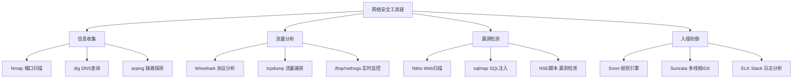

## 七、网络工具安装与环境配置

工欲善其事，必先利其器。网络安全分析和渗透测试的每一步都依赖于专业工具链。本节系统梳理本章涉及的全部工具，按照功能分类讲解安装方法、配置要点、版本管理和常见故障排除，覆盖 Kali Linux、Ubuntu/Debian、CentOS/RHEL/Fedora、macOS、Windows 以及 Docker 六大平台。

### 7.1 工具全景图

在安装之前，先理解工具在整个网络安全工作流中的位置。下表按照功能域对本章涉及的工具进行分类：

| 功能域 | 工具 | 核心用途 | 权限要求 |
|--------|------|----------|----------|
| **抓包分析** | Wireshark / TShark | 图形化/命令行协议分析 | root（抓包时） |
| **流量捕获** | tcpdump | 命令行原始流量抓取 | root |
| **端口扫描** | Nmap | 主机发现、端口扫描、服务识别 | root（SYN扫描） |
| **网络诊断** | net-tools, iproute2 | 接口、路由、连接状态查看 | 普通用户 |
| **DNS工具** | dnsutils (dig/nslookup) | DNS查询与诊断 | 普通用户 |
| **链路探测** | arping, hping3 | ARP级连通性测试、自定义包构造 | root |
| **流量监控** | iftop, nethogs, vnStat | 实时/长期流量统计 | root |
| **网络连接** | netcat (nc/ncat) | TCP/UDP连接测试、端口转发 | 普通用户 |
| **ARP工具** | arpspoof (dsniff) | ARP欺骗（授权测试用） | root |
| **协议编程** | Scapy (Python) | 自定义协议包构造与分析 | root（发包） |
| **入侵检测** | Snort / Suricata | 网络入侵检测与规则引擎 | root |
| **Web扫描** | Nikto, sqlmap | Web漏洞扫描与SQL注入测试 | 普通用户 |



### 7.2 Kali Linux：开箱即用的安全发行版

Kali Linux 是 Offensive Security 维护的渗透测试专用发行版，预装了 600+ 安全工具。本章涉及的大部分工具已经内置，只需确认版本和进行必要的配置。

#### 7.2.1 确认已安装工具

```bash
# 检查核心工具是否已安装
which wireshark nmap tcpdump tshark arpspoof hping3 nikto sqlmap
# 如果某个工具缺失，会提示 not found

# 查看工具版本
wireshark --version | head -3
nmap --version
tcpdump --version
```

#### 7.2.2 更新与补缺

```bash
# 更新系统和所有工具到最新版本
sudo apt update && sudo apt full-upgrade -y

# 如果有工具缺失，单独安装
sudo apt install -y wireshark nmap tcpdump tshark \
    net-tools dnsutils arping arpspoof \
    hping3 nikto sqlmap netcat-openbsd

# 安装 Scapy（Python协议构造库）
sudo apt install -y python3-scapy
# 或通过 pip 安装最新版
pip3 install scapy --break-system-packages 2>/dev/null || pip3 install scapy
```

#### 7.2.3 Wireshark 非 root 配置

默认情况下抓包需要 root 权限，但这存在安全风险。推荐配置 `dumpcap` 让普通用户也能抓包：

```bash
# 添加当前用户到 wireshark 组
sudo usermod -aG wireshark $USER

# 设置 dumpcap 的 capabilities（无需完全 root）
sudo dpkg-reconfigure wireshark-common
# 选择 "Yes" 允许非 root 用户抓包

# 设置 dumpcap 权限
sudo chmod 750 /usr/bin/dumpcap
sudo setcap cap_net_raw,cap_net_admin+eip /usr/bin/dumpcap

# 验证权限
getcap /usr/bin/dumpcap
# 输出应为：/usr/bin/dumpcap cap_net_admin,cap_net_raw=eip

# 注销并重新登录使组权限生效，或执行：
newgrp wireshark
```

> **安全提示**：加入 wireshark 组的用户可以捕获本机所有网络流量，包括其他用户的通信。仅在可信环境中使用此配置，生产服务器应限制为 root 专用。

#### 7.2.4 Nmap NSE 脚本库更新

```bash
# 更新 NSE 脚本库（获取最新漏洞检测规则）
sudo nmap --script-updatedb

# 验证脚本数量
ls /usr/share/nmap/scripts/ | wc -l
# 正常应有 600+ 个脚本

# 搜索特定功能的脚本
ls /usr/share/nmap/scripts/ | grep -i vuln
ls /usr/share/nmap/scripts/ | grep -i http
```

### 7.3 Ubuntu / Debian 系统

Ubuntu 和 Debian 是最常用的服务器和开发环境，需要手动安装安全工具。

#### 7.3.1 一键安装核心工具集

```bash
sudo apt update

# 网络基础工具
sudo apt install -y \
    net-tools \
    iproute2 \
    dnsutils \
    arping \
    traceroute \
    mtr-tiny \
    netcat-openbsd \
    curl \
    wget

# 抓包与协议分析
sudo apt install -y \
    wireshark \
    tshark \
    tcpdump \
    libcap2-bin

# 端口扫描
sudo apt install -y nmap

# 流量监控
sudo apt install -y iftop nethogs vnstat

# ARP工具（dsniff包含arpspoof）
sudo apt install -y dsniff hping3

# Python协议编程库
sudo apt install -y python3-scapy python3-pip
```

#### 7.3.2 Ubuntu 特有注意事项

```bash
# Ubuntu 22.04+ 默认使用 netplan 管理网络
# 查看网络配置
cat /etc/netplan/*.yaml

# Ubuntu 默认安装了 systemd-resolved 占用53端口
# 如果需要运行自己的DNS服务，需先释放端口
sudo systemctl stop systemd-resolved
sudo systemctl disable systemd-resolved
# 或者修改 /etc/systemd/resolved.conf 设置 DNSStubListener=no

# vnStat 需要启动服务才能开始统计
sudo systemctl enable vnstat
sudo systemctl start vnstat
# 等待5分钟后查看统计数据
vnstat
```

#### 7.3.3 Debian 最小化安装补充

Debian 最小化安装缺少很多常用工具，需要额外补充：

```bash
# Debian 最小安装缺少的基础工具
sudo apt install -y \
    sudo \
    vim \
    git \
    build-essential \
    ca-certificates \
    gnupg \
    lsb-release

# 然后安装网络工具（同 Ubuntu 部分）
```

### 7.4 CentOS / RHEL / Fedora 系统

Red Hat 系发行版使用 yum 或 dnf 作为包管理器，工具包名称和安装方式有差异。

#### 7.4.1 CentOS 7 / RHEL 7（yum）

```bash
# 安装 EPEL 仓库（获取更多工具）
sudo yum install -y epel-release

# 核心网络工具
sudo yum install -y \
    net-tools \
    bind-utils \
    tcpdump \
    nmap \
    nmap-ncat \
    traceroute \
    mtr \
    hping3

# Wireshark（图形界面 + 命令行）
sudo yum install -y wireshark wireshark-gnome

# 流量监控工具
sudo yum install -y iftop nethogs
# vnStat 需要 EPEL
sudo yum install -y vnstat
sudo systemctl enable vnstat && sudo systemctl start vnstat

# ARP工具
sudo yum install -y dsniff
```

#### 7.4.2 CentOS 8 / RHEL 8+ / Fedora（dnf）

```bash
# 启用 PowerTools / CRB 仓库
# CentOS Stream 8
sudo dnf config-manager --set-enabled powertools
# RHEL 9 / CentOS Stream 9
sudo dnf config-manager --set-enabled crb

# 安装 EPEL
sudo dnf install -y epel-release

# 核心工具
sudo dnf install -y \
    net-tools \
    bind-utils \
    tcpdump \
    nmap \
    nmap-ncat \
    wireshark \
    wireshark-cli \
    traceroute \
    mtr \
    hping3 \
    iftop \
    nethogs \
    vnstat

# Python Scapy
sudo dnf install -y python3-scapy
# 或 pip 安装
pip3 install scapy
```

#### 7.4.3 SELinux 注意事项

CentOS/RHEL 默认启用 SELinux，可能阻止某些工具的网络操作：

```bash
# 查看 SELinux 状态
getenforce

# 临时设置为宽容模式（调试用，不建议生产环境）
sudo setenforce 0

# 查看被 SELinux 阻止的操作
sudo ausearch -m avc -ts recent
sudo sealert -a /var/log/audit/audit.log

# 为特定工具设置 SELinux 布尔值
sudo setsebool -P nmap_connect_all_unreserved on
```

### 7.5 macOS 系统

macOS 使用 Homebrew 作为主要的第三方包管理器，部分工具系统自带但版本较旧。

#### 7.5.1 安装 Homebrew

```bash
# 如果尚未安装 Homebrew
/bin/bash -c "$(curl -fsSL https://raw.githubusercontent.com/Homebrew/install/HEAD/install.sh)"

# Apple Silicon Mac 需要额外配置 PATH
echo 'eval "$(/opt/homebrew/bin/brew shellenv)"' >> ~/.zprofile
eval "$(/opt/homebrew/bin/brew shellenv)"
```

#### 7.5.2 安装网络工具

```bash
# 核心工具
brew install nmap wireshark tcpdump tshark
brew install netcat hping arping mtr
brew install bind  # 提供 dig, nslookup, host

# 流量监控
brew install iftop nethogs bmon

# 高级工具
brew install net-snmp   # SNMP 工具集
brew install scapy      # 需要先安装 Python 依赖

# macOS 自带的 tcpdump 通常够用，Homebrew 版本更新
# 确认使用的是哪个版本
which tcpdump
/usr/local/bin/tcpdump --version 2>/dev/null || /usr/sbin/tcpdump --version
```

#### 7.5.3 macOS 特有配置

```bash
# Wireshark 在 macOS 上需要安装 ChmodBPF 以允许非 root 抓包
# 安装 Wireshark 时会提示，或手动执行：
brew install --cask wireshark-chmodbpf

# 如果使用 Apple Silicon，Wireshark 可能需要 Rosetta
# 首次运行会自动提示安装

# macOS 的 mtr 需要 root 权限
sudo mtr 8.8.8.8

# 查看 macOS 自带的网络工具位置
ls /usr/sbin/ | grep -E "arp|ping|traceroute|tcpdump|netstat|ifconfig|route"

# 清除 DNS 缓存（网络调试常用）
sudo dscacheutil -flushcache && sudo killall -HUP mDNSResponder
```

#### 7.5.4 macOS 网络工具与 Linux 的差异对照

| 功能 | Linux 命令 | macOS 命令 | 差异说明 |
|------|-----------|------------|----------|
| 网络接口 | `ip addr` | `ifconfig` / `ipconfig getiflist` | macOS 不支持 `ip` 命令 |
| 路由表 | `ip route` | `netstat -rn` / `route -n get` | 语法完全不同 |
| ARP 缓存 | `ip neigh` | `arp -a` | macOS 的 `arp` 输出格式不同 |
| 连接状态 | `ss -tunlp` | `lsof -i -P -n` / `netstat -an` | macOS 无 `ss` 命令 |
| MTU 设置 | `ip link set eth0 mtu 1500` | `ifconfig en0 mtu 1500` | 接口名不同（en0 vs eth0） |
| 包过滤 | `iptables` / `nftables` | `pfctl`（pf防火墙） | 完全不同的防火墙体系 |
| DNS 缓存 | `systemd-resolve --flush-caches` | `dscacheutil -flushcache` | 缓存机制不同 |

### 7.6 Windows 系统

Windows 上的网络工具生态与 Linux/macOS 差异较大，但通过 WSL2 可以获得几乎完整的 Linux 工具链。

#### 7.6.1 方案一：WSL2（推荐）

WSL2 提供完整的 Linux 内核，是最接近原生 Linux 的体验：

```powershell
# 在 PowerShell（管理员）中启用 WSL2
wsl --install -d Ubuntu-24.04

# 安装完成后进入 Ubuntu 终端，按照 7.3 节 Ubuntu 安装步骤操作
sudo apt update && sudo apt install -y \
    wireshark nmap tcpdump tshark \
    net-tools dnsutils arping \
    iftop nethogs netcat-openbsd
```

> **WSL2 网络限制**：WSL2 使用虚拟化网络栈，无法直接进行 ARP 欺骗等二层操作。需要原生 Windows 工具或专用虚拟机。

#### 7.6.2 方案二：原生 Windows 工具

```powershell
# 使用 winget 安装（Windows 10 1809+）
winget install WiresharkFoundation.Wireshark
winget install Insecure.Nmap
winget install Oracle.VirtualBox  # 用于 Kali 虚拟机

# 使用 Chocolatey 安装
choco install wireshark nmap npcap putty -y

# Windows 自带的网络工具
# 查看 IP 配置
ipconfig /all
# 查看路由表
route print
# 查看 ARP 缓存
arp -a
# 查看连接状态
netstat -an
# DNS 查询
nslookup example.com
# 路由追踪
tracert 8.8.8.8
# 端口测试
Test-NetConnection -ComputerName 192.168.1.1 -Port 80
```

#### 7.6.3 方案三：Kali Linux 虚拟机

对于需要完整工具链的场景，虚拟机是最可靠的方案：

```bash
# 使用 VirtualBox 或 VMware 安装 Kali
# 下载地址：https://www.kali.org/get-kali/#kali-virtual-machines

# VirtualBox 安装后配置：
# 1. 分配至少 4GB 内存、2 核 CPU
# 2. 网络适配器设置为"桥接模式"以获得独立 IP
# 3. 安装 VirtualBox Guest Additions 增强功能
sudo apt install -y virtualbox-guest-x11
```

### 7.7 Docker 容器化部署

Docker 提供隔离的、可复现的工具环境，适合 CI/CD 集成和临时使用。

#### 7.7.1 使用预构建镜像

```bash
# Nmap 专用镜像
docker run --rm -it uzyexe/nmap -sV 192.168.1.1

# Wireshark（需 X11 转发或 Web 版）
# 使用 Web 版 Wireshark
docker run -d -p 8080:8080 \
    -v /tmp/captures:/captures \
    strm/wireshark

# Scapy 环境
docker run --rm -it \
    --net=host \
    --cap-add=NET_ADMIN \
    --cap-add=NET_RAW \
    secdev/scapy

# tcpdump 轻量镜像
docker run --rm -it \
    --net=host \
    kaazing/tcpdump \
    -i eth0 -c 100 -w /tmp/capture.pcap
```

#### 7.7.2 构建自定义安全工具镜像

创建一个包含所有核心工具的 Dockerfile：

```dockerfile
FROM ubuntu:24.04

# 避免交互式安装提示
ENV DEBIAN_FRONTEND=noninteractive

# 安装核心网络工具
RUN apt-get update && apt-get install -y \
    nmap \
    tcpdump \
    tshark \
    wireshark-common \
    net-tools \
    dnsutils \
    arping \
    hping3 \
    netcat-openbsd \
    traceroute \
    mtr-tiny \
    iftop \
    nethogs \
    curl \
    wget \
    python3 \
    python3-pip \
    && rm -rf /var/lib/apt/lists/*

# 安装 Python 工具
RUN pip3 install scapy requests --break-system-packages

# 非 root 用户（需要时通过 --privileged 运行）
RUN useradd -m -s /bin/bash analyst
USER analyst
WORKDIR /home/analyst

CMD ["/bin/bash"]
```

构建并运行：

```bash
# 构建镜像
docker build -t nettools:latest .

# 运行容器（需要网络权限时加 --privileged 或精确的 capabilities）
docker run --rm -it \
    --cap-add=NET_RAW \
    --cap-add=NET_ADMIN \
    --net=host \
    nettools:latest

# 在容器内验证工具
nmap --version
tcpdump --version
```

### 7.8 工具验证与健康检查

安装完成后，逐项验证每个工具是否正常工作。

#### 7.8.1 自动化验证脚本

```bash
#!/bin/bash
# nettools-check.sh - 网络工具健康检查脚本

RED='\033[0;31m'
GREEN='\033[0;32m'
YELLOW='\033[1;33m'
NC='\033[0m'

echo "========================================="
echo "  网络工具安装验证"
echo "========================================="
echo ""

check_tool() {
    local tool_name="$1"
    local check_cmd="$2"
    
    if eval "$check_cmd" &>/dev/null; then
        local version=$(eval "$check_cmd" 2>&1 | head -1)
        printf "${GREEN}[✓]${NC} %-20s %s\n" "$tool_name" "$version"
        return 0
    else
        printf "${RED}[✗]${NC} %-20s 未安装\n" "$tool_name"
        return 1
    fi
}

# 核心工具检查
echo "--- 抓包与协议分析 ---"
check_tool "tcpdump" "tcpdump --version"
check_tool "tshark" "tshark --version"

echo ""
echo "--- 端口扫描 ---"
check_tool "nmap" "nmap --version"

echo ""
echo "--- 网络诊断 ---"
check_tool "arping" "arping -V"
check_tool "traceroute" "traceroute --version"
check_tool "mtr" "mtr --version"

echo ""
echo "--- DNS工具 ---"
check_tool "dig" "dig -v"
check_tool "nslookup" "nslookup -version"

echo ""
echo "--- 网络连接 ---"
check_tool "netcat" "nc -h"

echo ""
echo "--- 流量监控 ---"
check_tool "iftop" "iftop -h 2>&1"
check_tool "nethogs" "nethogs -V"
check_tool "vnstat" "vnstat --version"

echo ""
echo "--- Python 工具 ---"
check_tool "scapy" "python3 -c 'import scapy; print(scapy.VERSION)'"

echo ""
echo "--- 权限检查 ---"
if [ "$(id -u)" -eq 0 ]; then
    printf "${GREEN}[✓]${NC} %-20s root 权限\n" "当前用户"
else
    printf "${YELLOW}[!]${NC} %-20s 非 root（部分工具受限）\n" "当前用户"
    if groups | grep -q wireshark; then
        printf "${GREEN}[✓]${NC} %-20s 已加入 wireshark 组\n" "Wireshark权限"
    else
        printf "${YELLOW}[!]${NC} %-20s 未加入 wireshark 组\n" "Wireshark权限"
    fi
fi

echo ""
echo "========================================="
```

#### 7.8.2 功能验证

安装验证通过后，还需要测试基本功能：

```bash
# 测试 tcpdump 能否抓包（抓 3 个 ICMP 包）
sudo tcpdump -c 3 -i any icmp &
ping -c 3 8.8.8.8
wait

# 测试 nmap 基本扫描
nmap -sn 192.168.1.0/24  # 本地网段主机发现（非侵入）
nmap -sV -p 80,443 scanme.nmap.org  # Nmap 官方测试目标

# 测试 DNS 工具
dig +short example.com
dig example.com MX +short

# 测试 arping（需要 root）
sudo arping -c 3 192.168.1.1

# 测试 Scapy
sudo python3 -c "
from scapy.all import *
ans = sr1(IP(dst='8.8.8.8')/ICMP(), timeout=3, verbose=0)
if ans:
    print(f'Ping OK: {ans[IP].src} -> TTL={ans[IP].ttl}')
else:
    print('Ping failed')
"
```

### 7.9 版本管理与升级策略

安全工具需要保持最新版本以获得最新的漏洞检测规则和功能修复。

#### 7.9.1 各平台升级命令

```bash
# === Debian/Ubuntu ===
sudo apt update && sudo apt upgrade -y nmap wireshark tcpdump tshark

# 查看可用更新
apt list --upgradable 2>/dev/null | grep -E "nmap|wireshark|tcpdump"

# === CentOS/RHEL ===
sudo yum update -y nmap wireshark tcpdump  # CentOS 7
sudo dnf update -y nmap wireshark tcpdump  # CentOS 8+/Fedora

# === macOS ===
brew update && brew upgrade nmap wireshark tcpdump

# === Nmap NSE 脚本更新（所有平台通用） ===
sudo nmap --script-updatedb
```

#### 7.9.2 版本锁定与回滚

在生产环境中，不建议盲目升级，应先在测试环境验证：

```bash
# Debian/Ubuntu：锁定当前版本防止自动升级
sudo apt-mark hold nmap wireshark

# 查看锁定状态
apt-mark showhold

# 解锁
sudo apt-mark unhold nmap wireshark

# 回滚到指定版本（Debian/Ubuntu）
# 先查看可用版本
apt-cache policy nmap
# 安装指定版本
sudo apt install nmap=7.94+git20230807.3be01efb1+dfsg-2

# CentOS/RHEL 使用 yum history
sudo yum history list
sudo yum history undo <transaction-id>
```

#### 7.9.3 从源码编译最新版

包管理器的版本往往滞后于上游，某些场景需要最新版本：

```bash
# === 从源码编译 Nmap ===
# 安装编译依赖
sudo apt install -y build-essential libssl-dev libssh-dev \
    liblua5.4-dev libpcap-dev

# 下载源码
cd /tmp
wget https://nmap.org/dist/nmap-7.95.tar.bz2
tar xjf nmap-7.95.tar.bz2
cd nmap-7.95

# 配置、编译、安装
./configure --with-lua --with-openssl
make -j$(nproc)
sudo make install

# 验证
nmap --version
# 注意：源码安装的 Nmap 路径可能为 /usr/local/bin/nmap

# === 从源码编译 Wireshark（仅高级用户） ===
sudo apt install -y cmake flex bison qttools5-dev \
    libqt5svg5-dev libgcrypt20-dev libglib2.0-dev

cd /tmp
git clone https://github.com/wireshark/wireshark.git
cd wireshark
git checkout v4.4.0  # 选择稳定版本
mkdir build && cd build
cmake -DCMAKE_INSTALL_PREFIX=/usr/local ..
make -j$(nproc)
sudo make install
```

### 7.10 常见安装故障排除

#### 7.10.1 依赖冲突

```bash
# 问题：apt 报依赖冲突
# 解决：尝试修复损坏的依赖
sudo apt --fix-broken install
sudo dpkg --configure -a

# 如果有被阻止的包
sudo apt install -f

# 清除本地包缓存重新开始
sudo apt clean && sudo apt update
```

#### 7.10.2 权限问题

```bash
# 问题：普通用户无法抓包
# 错误信息：You don't have permission to capture on that device

# 方案1：使用 sudo
sudo tcpdump -i eth0

# 方案2：配置 dumpcap capabilities（推荐）
sudo setcap cap_net_raw,cap_net_admin+eip /usr/bin/dumpcap
# 注意：apt 升级 wireshark 后 capability 会丢失，需要重新设置

# 方案3：使用 systemd 临时提权
sudo systemd-run --scope -p MemoryLimit=500M tcpdump -i eth0 -w /tmp/cap.pcap
```

#### 7.10.3 端口冲突

```bash
# 问题：53端口被 systemd-resolved 占用
# 查看占用53端口的进程
sudo ss -tlnp | grep :53

# 解决方案1：修改 systemd-resolved 配置
sudo sed -i 's/#DNSStubListener=yes/DNSStubListener=no/' \
    /etc/systemd/resolved.conf
sudo systemctl restart systemd-resolved

# 解决方案2：使用 dnsmasq 替代
sudo systemctl stop systemd-resolved
sudo apt install -y dnsmasq
```

#### 7.10.4 Wireshark 显示问题

```bash
# 问题：Wireshark 在远程 SSH 会话中无法打开
# 原因：无图形环境

# 方案1：使用 TShark（命令行版）
tshark -i eth0 -c 100

# 方案2：X11 转发
ssh -X user@host
wireshark &

# 方案3：远程抓包 + 本地分析
# 在远程服务器上抓包
sudo tcpdump -i eth0 -w /tmp/capture.pcap -c 10000
# 下载到本地
scp user@host:/tmp/capture.pcap ./capture.pcap
# 本地打开
wireshark capture.pcap

# 方案4：CloudShark 等 Web 分析平台
curl -F file=@capture.pcap https://cloudshark.org/api/v2/upload
```

#### 7.10.5 Nmap 扫描被阻止

```bash
# 问题：防火墙阻止了扫描流量
# 检查 iptables 规则
sudo iptables -L -n -v

# 使用更隐蔽的扫描方式
nmap -sS -T2 --data-length 200 -f 192.168.1.1
# -sS SYN半开扫描
# -T2 降低速度
# --data-length 填充数据包
# -f 分片

# 或使用 DNS 代理绕过
nmap -sS --dns-servers 8.8.8.8 192.168.1.1
```

### 7.11 自动化部署脚本

将工具安装封装为可复用的脚本，适用于批量部署和新环境初始化。

#### 7.11.1 通用安装脚本

```bash
#!/bin/bash
# install-nettools.sh - 跨发行版网络工具安装脚本

set -euo pipefail

detect_distro() {
    if [ -f /etc/os-release ]; then
        . /etc/os-release
        echo "$ID"
    elif command -v brew &>/dev/null; then
        echo "macos"
    else
        echo "unknown"
    fi
}

install_debian() {
    echo "[*] 检测到 Debian/Ubuntu 系统"
    sudo apt update
    sudo apt install -y \
        nmap tcpdump tshark wireshark \
        net-tools dnsutils arping \
        hping3 dsniff netcat-openbsd \
        iftop nethogs vnstat \
        python3-scapy traceroute mtr-tiny

    # 配置 Wireshark 非 root 抓包
    sudo dpkg-reconfigure -plow wireshark-common || true
    sudo usermod -aG wireshark "$USER" || true
    
    # 启动 vnStat
    sudo systemctl enable vnstat 2>/dev/null || true
    sudo systemctl start vnstat 2>/dev/null || true
}

install_redhat() {
    echo "[*] 检测到 RHEL/CentOS/Fedora 系统"
    local pkg_mgr="yum"
    command -v dnf &>/dev/null && pkg_mgr="dnf"
    
    sudo $pkg_mgr install -y epel-release 2>/dev/null || true
    sudo $pkg_mgr install -y \
        nmap tcpdump wireshark wireshark-cli \
        net-tools bind-utils \
        nmap-ncat hping3 dsniff \
        iftop nethogs vnstat \
        traceroute mtr \
        python3-scapy

    sudo systemctl enable vnstat 2>/dev/null || true
    sudo systemctl start vnstat 2>/dev/null || true
}

install_macos() {
    echo "[*] 检测到 macOS 系统"
    if ! command -v brew &>/dev/null; then
        echo "[!] 请先安装 Homebrew: https://brew.sh"
        exit 1
    fi
    brew install nmap tcpdump tshark wireshark \
        netcat arping mtr \
        bind iftop hping
}

# 主逻辑
DISTRO=$(detect_distro)
case "$DISTRO" in
    ubuntu|debian|linuxmint|pop)
        install_debian
        ;;
    centos|rhel|rocky|almalinux|fedora|ol)
        install_redhat
        ;;
    macos)
        install_macos
        ;;
    *)
        echo "[!] 不支持的发行版: $DISTRO"
        echo "    请参考本节各平台的安装指南手动安装"
        exit 1
        ;;
esac

# 更新 Nmap 脚本库
if command -v nmap &>/dev/null; then
    sudo nmap --script-updatedb 2>/dev/null || true
fi

echo ""
echo "[✓] 安装完成。运行以下命令验证："
echo "    bash nettools-check.sh"
```

#### 7.11.2 Ansible 批量部署

对于企业环境，使用 Ansible 批量部署网络工具：

```yaml
# playbook: deploy-nettools.yml
---
- name: 部署网络安全工具
  hosts: all
  become: yes
  vars:
    tools_debian:
      - nmap
      - tcpdump
      - tshark
      - wireshark
      - net-tools
      - dnsutils
      - arping
      - iftop
      - nethogs
      - python3-scapy

  tasks:
    - name: 检测操作系统
      ansible.builtin.set_fact:
        os_family: "{{ ansible_os_family | lower }}"

    - name: 安装工具（Debian/Ubuntu）
      ansible.builtin.apt:
        name: "{{ tools_debian }}"
        state: present
        update_cache: yes
      when: ansible_os_family == "Debian"

    - name: 安装工具（RedHat）
      ansible.builtin.yum:
        name:
          - nmap
          - tcpdump
          - wireshark-cli
          - net-tools
          - bind-utils
          - iftop
          - nethogs
          - python3-scapy
        state: present
      when: ansible_os_family == "RedHat"

    - name: 配置 Wireshark 非 root 权限（Debian）
      ansible.builtin.shell: |
        dpkg-reconfigure -plow wireshark-common
      when: ansible_os_family == "Debian"
      changed_when: false

    - name: 更新 Nmap 脚本库
      ansible.builtin.command: nmap --script-updatedb
      changed_when: false

    - name: 运行健康检查
      ansible.builtin.script: nettools-check.sh
      register: check_result

    - name: 输出检查结果
      ansible.builtin.debug:
        var: check_result.stdout_lines
```

### 7.12 工具选型建议

不同场景下应选择合适的工具组合，避免"杀鸡用牛刀"或"大材小用"：

| 场景 | 推荐工具 | 原因 |
|------|----------|------|
| 快速检查端口是否开放 | `nc -zv host port` 或 `curl` | 最轻量，无需额外安装 |
| 全面端口扫描 | `nmap -sS -sV -O target` | 功能最全面，结果最详细 |
| 抓包并实时分析 | `tcpdump` + Wireshark | tcpdump 轻量抓包，Wireshark 图形化分析 |
| 远程服务器抓包 | `tcpdump -w file.pcap` | 无需图形界面，抓完下载本地分析 |
| DNS 诊断 | `dig` | 比 nslookup 输出更详细，支持高级查询 |
| 实时流量监控 | `iftop`（按连接） / `nethogs`（按进程） | iftop 看流量方向，nethogs 看哪个进程占带宽 |
| 自定义协议包构造 | Scapy (Python) | 灵活度最高，可编程 |
| 长期流量统计 | `vnstat` | 零配置，自动按小时/天/月统计 |
| Web 漏洞扫描 | Nikto / sqlmap | 各自专精，不互相替代 |

### 7.13 安全合规注意事项

在企业环境中安装和使用网络工具需要遵守安全合规要求：

1. **授权原则**：所有网络扫描、抓包、渗透测试操作必须获得书面授权。未经授权扫描他人网络在多数司法管辖区属于违法行为。

2. **最小权限原则**：不要使用 root 身份运行所有工具。配置 capabilities 和组权限让普通用户执行必要的操作。

3. **审计日志**：记录所有工具的使用日志，包括谁在什么时间对什么目标执行了什么操作。

4. **网络隔离**：安全测试环境应与生产网络隔离，避免测试流量影响业务。

5. **工具版本记录**：维护工具版本清单，确保安全审计时可以追溯。

6. **数据保护**：抓包文件（pcap）可能包含敏感信息（密码、会话令牌等），需要加密存储并在使用后安全删除：

```bash
# 安全删除抓包文件
shred -vfz -n 3 capture.pcap

# GPG 加密存储
gpg -c --cipher-algo AES256 capture.pcap
rm -f capture.pcap  # 删除原始文件
```
