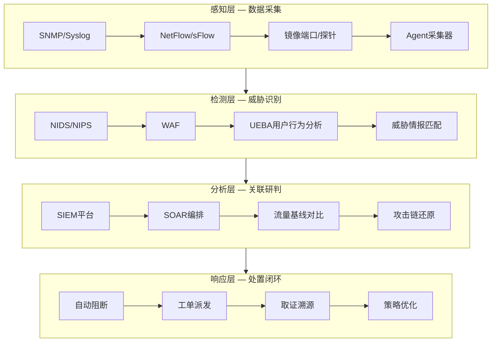

## 十一、企业级网络监控

企业级网络监控是安全运维体系的"眼睛和耳朵"——没有监控的网络就像没有摄像头的银行金库，攻击者可以长驱直入而不被发现。本节从监控架构设计、入侵检测部署、流量基线分析、SIEM集成、自动化告警到应急响应闭环，系统讲解企业级网络监控的完整技术栈。

### 11.1 网络监控体系架构

#### 11.1.1 监控的层次模型

企业网络监控不是单一工具，而是分层协作的体系：



| 层次 | 核心职责 | 典型工具 | 数据来源 |
|------|----------|----------|----------|
| 感知层 | 全量采集网络数据 | Zeek、tcpdump、Flowmon | 镜像端口、NetFlow、Syslog |
| 检测层 | 实时识别威胁行为 | Snort、Suricata、OSSEC | 感知层原始数据 |
| 分析层 | 关联分析、研判确认 | Elastic SIEM、Splunk、Wazuh | 检测层告警 + 原始日志 |
| 响应层 | 自动/半自动处置 | Shuffle SOAR、TheHive | 分析层研判结果 |

#### 11.1.2 监控部署拓扑

企业网络监控的核心部署点位：

```text
                        ┌─────────────┐
                        │   互联网     │
                        └──────┬──────┘
                               │
                    ┌──────────▼──────────┐
                    │    边界防火墙        │ ← 镜像点1：南北向流量
                    └──────────┬──────────┘
                               │
                    ┌──────────▼──────────┐
                    │    IDS/IPS探针      │ ← 在线/旁路模式
                    └──────────┬──────────┘
                               │
              ┌────────────────┼────────────────┐
              │                │                │
     ┌────────▼───────┐ ┌─────▼──────┐ ┌───────▼───────┐
     │  DMZ服务器区    │ │  办公网络   │ │  核心数据库区  │ ← 镜像点2：东西向
     └────────┬───────┘ └─────┬──────┘ └───────┬───────┘
              │               │                │
              └───────────────┼────────────────┘
                              │
                   ┌──────────▼──────────┐
                   │   SIEM/SOC平台      │ ← 统一分析中心
                   └─────────────────────┘
```

**关键部署原则：**

- **南北向监控**：所有进出互联网的流量必须经过IDS/IPS检测
- **东西向监控**：内网核心区之间部署微隔离和流量镜像，防止横向移动
- **旁路优先**：IDS建议旁路部署（不影响业务），IPS在线部署（可阻断）
- **全量存储**：核心链路流量至少保留30天PCAP，日志保留180天以上

### 11.2 网络入侵检测系统（NIDS）

#### 11.2.1 Snort 规则编写与部署

Snort是最经典的开源NIDS，其规则语言是网络监控的基本功。

**规则语法结构：**

```text
action protocol src_ip src_port -> dst_ip dst_port (选项)
```

**生产级规则集示例：**

```bash
# /etc/snort/rules/local.rules

# === Web攻击检测 ===
# SQL注入：检测UNION SELECT联合查询
alert http any any -> $HOME_NET any (
    msg:"SQL Injection - UNION SELECT";
    flow:established,to_server;
    content:"UNION"; nocase;
    content:"SELECT"; nocase;
    distance:0;
    classtype:web-application-attack;
    sid:1000001; rev:3;
)

# SQL注入：检测基于时间的盲注
alert http any any -> $HOME_NET any (
    msg:"SQL Injection - Time-based Blind";
    flow:established,to_server;
    content:"SLEEP("; nocase;
    pcre:"/SLEEP\s*\(\s*\d+\s*\)/i";
    classtype:web-application-attack;
    sid:1000002; rev:2;
)

# XSS攻击：检测script标签注入
alert http any any -> $HOME_NET any (
    msg:"XSS Attack - Script Injection";
    flow:established,to_server;
    content:"<script"; nocase;
    http_uri;
    pcre:"/<script[^>]*>.*<\/script>/iU";
    classtype:web-application-attack;
    sid:1000003; rev:2;
)

# 命令注入：检测系统命令执行
alert http any any -> $HOME_NET any (
    msg:"Command Injection - OS Command";
    flow:established,to_server;
    content:"|3B|"; nocase;  # 分号
    pcre:"/;\s*(cat|ls|id|whoami|wget|curl|nc|bash|sh|python|perl)\b/i";
    classtype:web-application-attack;
    sid:1000004; rev:2;
)

# === 扫描与探测 ===
# 端口扫描检测：60秒内超过20个SYN包
alert tcp any any -> $HOME_NET any (
    msg:"Port Scan Detected - SYN Scan";
    flags:S;
    threshold:type threshold, track by_src, count 20, seconds 60;
    classtype:attempted-recon;
    sid:1000010; rev:2;
)

# 垂直端口扫描：同一目标不同端口
alert tcp $EXTERNAL_NET any -> $HOME_NET any (
    msg:"Vertical Port Scan";
    flags:S;
    threshold:type threshold, track by_dst, count 30, seconds 60;
    classtype:attempted-recon;
    sid:1000011; rev:1;
)

# === 隧道与隐蔽通信 ===
# DNS隧道检测：超长域名查询
alert dns any any -> any any (
    msg:"Possible DNS Tunnel - Long Query";
    dns.query;
    content:"|03|com"; nocase;
    pcre:"/^[a-zA-Z0-9\-]{30,}\./";
    classtype:policy-violation;
    sid:1000020; rev:3;
)

# ICMP隧道检测：异常大的ICMP包
alert icmp $HOME_NET any -> $EXTERNAL_NET any (
    msg:"Possible ICMP Tunnel";
    dsize:>100;
    classtype:policy-violation;
    sid:1000021; rev:2;
)

# === 数据泄露检测 ===
# 检测信用卡号泄露
alert http $HOME_NET any -> any any (
    msg:"Credit Card Number Leak";
    flow:established,to_server;
    pcre:"/\b(?:4[0-9]{12}(?:[0-9]{3})?|5[1-5][0-9]{14}|3[47][0-9]{13})\b/;
    classtype:sensitive-data;
    sid:1000030; rev:1;
)

# 检测大量数据外传（单次POST超过10MB）
alert http $HOME_NET any -> any any (
    msg:"Large Data Exfiltration via HTTP POST";
    flow:established,to_server;
    http.method; content:"POST";
    dsize:>10485760;
    classtype:policy-violation;
    sid:1000031; rev:1;
)
```

**Snort性能优化要点：**

| 参数 | 推荐值 | 说明 |
|------|--------|------|
| `config max_metadata` | 65535 | 最大元数据缓存 |
| `config detection` | `search-method ac-split` | 使用AC-Split算法提升匹配速度 |
| `config event_queue` | `log 5, order priority` | 事件队列按优先级排序 |
| `config pcre` | `match_limit 100000` | 限制PCRE回溯避免ReDoS |
| 硬件 | SSD + 32GB RAM + 万兆网卡 | 高流量环境必须 |

#### 11.2.2 Suricata 高级配置

Suricata是Snort的现代化替代，支持多线程、原生JSON输出和协议自动检测。

**生产级配置文件：**

```yaml
# /etc/suricata/suricata.yaml

# === 网络定义 ===
vars:
  address-groups:
    HOME_NET: "[192.168.0.0/16,10.0.0.0/8,172.16.0.0/12]"
    EXTERNAL_NET: "!$HOME_NET"
    DNS_SERVERS: "[10.0.0.53,10.0.0.54]"
    HTTP_SERVERS: "$HOME_NET"
    SMTP_SERVERS: "[10.0.0.25]"
    SQL_SERVERS: "[10.0.0.3306]"

  port-groups:
    HTTP_PORTS: "[80,8080,8443]"
    HTTPS_PORTS: "[443]"
    SSH_PORTS: "[22,2222]"
    DNS_PORTS: "[53]"

# === 性能调优 ===
max-pending-packets: 65535
default-packet-size: 1514
runmode: workers        # workers模式性能最优（单网卡场景）
#runmode: autofp        # autofp模式适合多网卡场景

threading:
  set_cpu_affinity: yes
  cpu_affinity:
    - management-cpu-set:
        cpu: [0]
    - worker-cpu-set:
        cpu: [1-7]
        mode: exclusive

# === 输出配置 ===
outputs:
  - eve-log:
      enabled: yes
      filetype: regular
      filename: /var/log/suricata/eve.json
      rotate-interval: day
      types:
        - alert:
            payload: yes
            payload-printable: yes
            packet: yes
            metadata: yes
        - http:
            extended: yes
        - dns:
            query: yes
            answer: yes
        - tls:
            extended: yes
        - files:
            force_magic: yes
            force_hash: [md5, sha256]
        - flow
        - netflow
        - stats:
            totals: yes
            threads: yes
            deltas: yes

  - fast:
      enabled: yes
      filename: /var/log/suricata/fast.log

  - pcap-log:
      enabled: yes
      filename: /var/log/suricata/log.pcap
      limit: 10GB
      max-files: 50

# === 规则加载 ===
default-rule-path: /var/lib/suricata/rules
rule-files:
  - suricata.rules
  - local.rules
  - emerging-threats.rules

# === 应用层协议检测 ===
app-layer:
  protocols:
    http:
      enabled: yes
      libhtp:
        default-config:
          personality: IDS
          request-body-limit: 100mb
          response-body-limit: 100mb
    tls:
      enabled: yes
      detection-ports:
        dp: 443
    dns:
      tcp:
        enabled: yes
        detection-ports:
          dp: 53
      udp:
        enabled: yes
        detection-ports:
          dp: 53
    ssh:
      enabled: yes
    smb:
      enabled: yes
    dcerpc:
      enabled: yes
```

**Suricata vs Snort 关键对比：**

| 特性 | Snort 3.x | Suricata 7.x |
|------|-----------|--------------|
| 多线程 | 支持（有限） | 原生全面支持 |
| 规则兼容 | Snort原生规则 | 兼容Snort规则 + 自有关键字 |
| 协议检测 | 基于端口 | 基于深度包检测（DPI） |
| 输出格式 | 文本/Unified2 | 原生JSON（EVE） |
| TLS解密 | 不支持 | 支持JA3/JA4指纹 |
| 性能（10Gbps） | 需要优化 | 开箱即用较优 |
| IPv6 | 部分支持 | 完整支持 |
| 社区活跃度 | 高 | 更高（OISF主导） |

#### 11.2.3 Zeek（原Bro）协议分析

Zeek不是传统IDS，而是网络安全监控的"瑞士军刀"——它记录完整的网络活动日志，而非仅告警。

**Zeek核心优势：**

- **协议日志**：自动解析HTTP/DNS/TLS/SMB等40+协议，生成结构化日志
- **连接记录**：每个TCP/UDP连接一条记录，包含字节数、持续时间、状态
- **文件分析**：自动提取传输文件并计算哈希
- **可编程**：用Zeek脚本语言实现自定义检测逻辑

**Zeek部署与基础使用：**

```bash
# 安装（Ubuntu）
sudo apt install zeek zeek-core

# 启动监控
sudo zeekctl deploy

# 实时抓包分析
sudo zeek -i eth0 local

# 分析离线PCAP
zeek -r capture.pcap local
```

**Zeek生成的关键日志：**

```bash
# 查看连接日志（最核心）
cat /var/log/suricata/conn.log | zeek-cut id.orig_h id.resp_h id.resp_p proto duration orig_bytes resp_bytes

# 示例输出：
# 192.168.1.100  93.184.216.34  443  tcp  3.2  1024  51200
# 192.168.1.100  8.8.8.8        53   udp  0.02  65    289

# 查看HTTP日志
cat http.log | zeek-cut id.orig_h host uri method status_code user_agent

# 查看DNS日志
cat dns.log | zeek-cut id.orig_h query qtype_name answers

# 查看SSL/TLS日志（含JA3指纹）
cat ssl.log | zeek-cut id.orig_h server_name ja3 ja3s version
```

### 11.3 网络流量基线建立

流量基线是异常检测的"参照物"——没有基线就无法判断什么是"异常"。

#### 11.3.1 基线指标体系

| 指标类别 | 具体指标 | 采集方法 | 基线周期 |
|----------|----------|----------|----------|
| 带宽指标 | 入/出站带宽、峰值、均值 | SNMP/NetFlow | 7天滚动 |
| 连接指标 | 并发连接数、新建连接/秒 | NetFlow/sFlow | 7天滚动 |
| 协议分布 | TCP/UDP/ICMP/其他占比 | NetFlow | 30天滚动 |
| Top N | Top源IP、目的IP、目的端口 | NetFlow | 7天滚动 |
| 异常指标 | 重置率、丢包率、延迟 | SNMP/ICMP探测 | 持续 |
| 应用层 | DNS查询量、HTTP请求数、邮件量 | 应用日志 | 7天滚动 |

#### 11.3.2 流量基线自动分析

```python
#!/usr/bin/env python3
"""
企业级流量基线建立与异常检测脚本
支持：PCAP离线分析 + NetFlow实时采集
"""

import dpkt
import collections
import statistics
import json
import time
from datetime import datetime, timedelta

class NetworkBaseline:
    def __init__(self, window_hours=168):  # 默认7天窗口
        self.window = timedelta(hours=window_hours)
        self.metrics = {
            'packet_sizes': [],
            'protocols': collections.Counter(),
            'src_ips': collections.Counter(),
            'dst_ips': collections.Counter(),
            'dst_ports': collections.Counter(),
            'hourly_bytes': collections.defaultdict(int),
            'hourly_packets': collections.defaultdict(int),
            'dns_queries': [],
            'tcp_flags': collections.Counter(),
        }
    
    def ingest_pcap(self, pcap_file):
        """从PCAP文件提取基线数据"""
        with open(pcap_file, 'rb') as f:
            pcap = dpkt.pcap.Reader(f)
            for ts, buf in pcap:
                self._process_packet(ts, buf)
    
    def _process_packet(self, ts, buf):
        """处理单个数据包"""
        self.metrics['packet_sizes'].append(len(buf))
        
        # 按小时聚合
        hour_key = datetime.fromtimestamp(ts).strftime('%Y-%m-%d-%H')
        self.metrics['hourly_bytes'][hour_key] += len(buf)
        self.metrics['hourly_packets'][hour_key] += 1
        
        try:
            eth = dpkt.ethernet.Ethernet(buf)
            if not isinstance(eth.data, dpkt.ip.IP):
                return
            
            ip = eth.data
            src = dpkt.utils.inet_to_str(ip.src)
            dst = dpkt.utils.inet_to_str(ip.dst)
            
            self.metrics['src_ips'][src] += 1
            self.metrics['dst_ips'][dst] += 1
            
            if isinstance(ip.data, dpkt.tcp.TCP):
                tcp = ip.data
                self.metrics['protocols']['TCP'] += 1
                self.metrics['dst_ports'][tcp.dport] += 1
                self.metrics['tcp_flags'][self._tcp_flag_str(tcp.flags)] += 1
            elif isinstance(ip.data, dpkt.udp.UDP):
                self.metrics['protocols']['UDP'] += 1
                self.metrics['dst_ports'][ip.data.dport] += 1
            elif isinstance(ip.data, dpkt.icmp.ICMP):
                self.metrics['protocols']['ICMP'] += 1
        except Exception:
            pass
    
    @staticmethod
    def _tcp_flag_str(flags):
        names = []
        if flags & dpkt.tcp.TH_SYN: names.append('SYN')
        if flags & dpkt.tcp.TH_ACK: names.append('ACK')
        if flags & dpkt.tcp.TH_FIN: names.append('FIN')
        if flags & dpkt.tcp.TH_RST: names.append('RST')
        if flags & dpkt.tcp.TH_PUSH: names.append('PSH')
        return '-'.join(names) if names else 'NONE'
    
    def compute_baseline(self):
        """计算统计基线"""
        sizes = self.metrics['packet_sizes']
        if not sizes:
            return None
        
        return {
            'snapshot_time': datetime.now().isoformat(),
            'total_packets': len(sizes),
            'packet_size': {
                'mean': round(statistics.mean(sizes), 2),
                'stddev': round(statistics.stdev(sizes), 2) if len(sizes) > 1 else 0,
                'p50': round(sorted(sizes)[len(sizes)//2], 2),
                'p95': round(sorted(sizes)[int(len(sizes)*0.95)], 2),
                'p99': round(sorted(sizes)[int(len(sizes)*0.99)], 2),
            },
            'protocol_distribution': dict(self.metrics['protocols'].most_common()),
            'top_sources': dict(self.metrics['src_ips'].most_common(20)),
            'top_destinations': dict(self.metrics['dst_ips'].most_common(20)),
            'top_ports': dict(self.metrics['dst_ports'].most_common(20)),
            'tcp_flags': dict(self.metrics['tcp_flags'].most_common()),
            'hourly_traffic': dict(sorted(self.metrics['hourly_bytes'].items())),
        }
    
    def detect_anomalies(self, current_data, baseline, std_multiplier=3):
        """基于基线检测异常"""
        alerts = []
        
        # 包大小异常
        bs = baseline['packet_size']
        if abs(current_data['avg_packet_size'] - bs['mean']) > std_multiplier * bs['stddev']:
            alerts.append({
                'type': 'PACKET_SIZE_ANOMALY',
                'severity': 'HIGH',
                'detail': f"当前均值{current_data['avg_packet_size']}偏离基线{bs['mean']}超过{std_multiplier}σ",
            })
        
        # 流量突增（与同时段历史对比）
        hour_key = datetime.now().strftime('%H')
        historical = [v for k, v in baseline.get('hourly_traffic', {}).items()
                      if k.endswith(hour_key)]
        if historical:
            avg_hourly = statistics.mean(historical)
            if current_data['hourly_bytes'] > avg_hourly * 3:
                alerts.append({
                    'type': 'TRAFFIC_SPIKE',
                    'severity': 'CRITICAL',
                    'detail': f"当前小时流量{current_data['hourly_bytes']}是历史均值{avg_hourly}的3倍以上",
                })
        
        # 异常端口
        known_ports = set(baseline.get('top_ports', {}).keys())
        for port in current_data.get('top_ports', []):
            if port not in known_ports and port > 1024:
                alerts.append({
                    'type': 'NEW_PORT_ACTIVITY',
                    'severity': 'MEDIUM',
                    'detail': f"出现新的高频端口: {port}",
                })
        
        return alerts


# === 使用示例 ===
if __name__ == '__main__':
    baseline = NetworkBaseline(window_hours=168)
    baseline.ingest_pcap('/var/log/capture/week1.pcap')
    result = baseline.compute_baseline()
    
    # 保存基线
    with open('/var/lib/network/baseline.json', 'w') as f:
        json.dump(result, f, indent=2, default=str)
    
    print(f"基线建立完成：{result['total_packets']}个数据包")
    print(f"包大小均值: {result['packet_size']['mean']} bytes")
    print(f"协议分布: {result['protocol_distribution']}")
    print(f"Top端口: {list(result['top_ports'].keys())[:10]}")
```

#### 11.3.3 基线漂移与周期性更新

基线不是一劳永逸的，必须定期更新以反映业务变化：

- **自动更新周期**：每7天滚动更新一次基线数据
- **季节性校正**：业务有明显的日/周/月周期（如电商双11），需要单独建模
- **变更触发**：新系统上线、网络拓扑调整时立即触发基线重建
- **异常窗口排除**：已确认的攻击/故障时段数据不纳入基线计算

### 11.4 SNMP与NetFlow监控

#### 11.4.1 SNMP监控配置

SNMP（简单网络管理协议）是网络设备监控的基石。

**SNMPv3安全配置（生产环境必须用v3，禁止v1/v2c明文）：**

```bash
# === Cisco设备配置 ===
# 创建SNMP视图（限制可访问的MIB）
snmp-server view MONITOR-MIB iso included

# 创建用户组（authPriv级别：认证+加密）
snmp-server group MONITOR-GROUP v3 priv read MONITOR-MIB

# 创建用户（SHA认证 + AES加密）
snmp-server user monitor MONITOR-GROUP v3 auth sha Authyour_password123 priv aes 128 Encyour_password456

# === Linux服务器配置 ===
# /etc/snmp/snmpd.conf
# 创建只读用户
createUser monitor SHA "Authyour_password123" AES "Encyour_password456"
rouser monitor priv

# 暴露的关键指标
# 系统信息：sysDescr, sysUpTime, sysContact
# 接口流量：ifInOctets, ifOutOctets, ifInErrors, ifOutErrors
# CPU/内存：hrProcessorLoad, hrStorageUsed
```

**SNMP采集脚本（Python + pysnmp）：**

```python
from pysnmp.hlapi import *

def snmp_walk(host, user, auth_key, priv_key, oid):
    """SNMPv3 Walk采集"""
    results = []
    for (errorInd, errorStatus, errorIndex, varBinds) in nextCmd(
        SnmpEngine(),
        UsmUserData(user, auth_key, priv_key,
                     authProtocol=usmHMACSHAAuthProtocol,
                     privProtocol=usmAesCfb128Protocol),
        UdpTransportTarget((host, 161), timeout=5, retries=3),
        ContextData(),
        ObjectType(ObjectIdentity(oid)),
        lexicographicMode=False,
    ):
        if errorInd:
            print(f"SNMP Error: {errorInd}")
            break
        for varBind in varBinds:
            results.append((str(varBind[0]), varBind[1]))
    return results

# 采集接口流量
interfaces = snmp_walk('192.168.1.1', 'monitor', 'Authyour_password123', 'Encyour_password456',
                       '1.3.6.1.2.1.2.2.1.10')  # ifInOctets
for oid, value in interfaces:
    print(f"接口 {oid}: 入站字节 {int(value)}")
```

#### 11.4.2 NetFlow流量分析

NetFlow是网络流量分析的"金标准"，提供流级别的元数据。

**NetFlow v9/IPFIX采集配置（Cisco）：**

```text
! 启用NetFlow导出
flow exporter MONITOR-EXPORT
 destination 10.0.0.100
 transport udp 9996
 template data timeout 30

flow monitor MONITOR-FLOW
 exporter MONITOR-EXPORT
 record netflow ipv4
 cache timeout active 60
 cache timeout inactive 15

interface GigabitEthernet0/0
 ip flow monitor MONITOR-FLOW input
 ip flow monitor MONITOR-FLOW output
```

**nfdump + nfsen 流量分析：**

```bash
# 安装nfdump
sudo apt install nfdump nfsen

# 启动采集
nfcapd -w -D -l /var/cache/nfdump -p 9996

# 查询：过去1小时Top 10流量源
nfdump -r /var/cache/nfdump/nfcapd.current -s srcip/bytes -n 10 -t 1h

# 查询：特定IP的流量
nfdump -r /var/cache/nfdump/nfcapd.current 'host 192.168.1.100'

# 查询：异常大流量（单流超过100MB）
nfdump -r /var/cache/nfdump/nfcapd.current 'bytes > 104857600'

# 输出示例：
# Date flow start          Duration Proto Src IP Addr     Dst IP Addr    Bytes
# 2025-01-15 03:22:18.123  00:05:32 TCP   192.168.1.100   93.184.216.34  256.3 M
# 2025-01-15 03:18:45.678  00:02:15 UDP   192.168.1.100   8.8.8.8        1.2 K
```

### 11.5 SIEM集成与安全事件管理

#### 11.5.1 ELK Stack安全监控

ELK（Elasticsearch + Logstash + Kibana）是最流行的开源SIEM方案。

**Filebeat多源日志采集配置：**

```yaml
# /etc/filebeat/filebeat.yml

filebeat.inputs:
  # Suricata告警日志
  - type: filestream
    id: suricata
    paths:
      - /var/log/suricata/eve.json
    parsers:
      - ndjson:
          keys_under_root: true
          add_error_key: true
    fields:
      source: suricata
    fields_under_root: true

  # Zeek连接日志
  - type: filestream
    id: zeek-conn
    paths:
      - /opt/zeek/logs/conn.log
    parsers:
      - ndjson:
          keys_under_root: true
    fields:
      source: zeek
    fields_under_root: true

  # NetFlow数据
  - type: netflow
    max_message_size: 10KiB
    ports: [2055]
    protocols: [v5, v9, ipfix]

  # 系统认证日志
  - type: filestream
    id: auth
    paths:
      - /var/log/auth.log
      - /var/log/secure
    fields:
      source: system-auth
    fields_under_root: true

# 处理管道
processors:
  - add_host_metadata: ~
  - add_cloud_metadata: ~
  - add_geoip:
      field: source.ip
      target: source.geo
  - add_geoip:
      field: destination.ip
      target: destination.geo

# 输出到Elasticsearch
output.elasticsearch:
  hosts: ["https://es-node1:9200", "https://es-node2:9200"]
  protocol: "https"
  username: "filebeat_writer"
  password: "${ES_PASSWORD}"
  index: "netmon-%{[agent.version]}-%{+yyyy.MM.dd}"
  ssl.certificate_authorities: ["/etc/filebeat/ca.crt"]

# Kibana仪表板
setup.kibana:
  host: "https://kibana.company.com:5601"
  username: "filebeat_setup"
  password: "${ES_PASSWORD}"

setup.dashboards.enabled: true
```

**Elasticsearch告警规则（Detection Rules API）：**

```json
// 检测：单IP短时间内触发多条高危告警
{
  "rule_id": "multi-alert-same-source",
  "name": "单IP多告警聚类 - 可能是攻击者",
  "type": "threshold",
  "index": ["netmon-*"],
  "query": "event.kind:alert AND alert.severity:(3 OR 4 OR 5)",
  "threshold": {
    "field": "source.ip",
    "value": 5,
    "cardinality": {
      "field": "alert.signature_id",
      "value": 3
    }
  },
  "time_window": "5m",
  "risk_score": 85,
  "severity": "high",
  "actions": [
    {
      "group": "default",
      "id": "slack-webhook",
      "params": {
        "message": "告警聚类：{{context.source.ip}} 在5分钟内触发了{{context.threshold}}条不同告警"
      }
    }
  ]
}

// 检测：非工作时间的大规模数据传输
{
  "rule_id": "off-hours-exfil",
  "name": "非工作时间异常数据外传",
  "type": "query",
  "index": ["netmon-*"],
  "query": "event.kind:alert AND NOT (@timestamp:(now-18h/d TO now-8h/d)) AND network.bytes > 104857600",
  "risk_score": 95,
  "severity": "critical",
  "threat": [
    {
      "framework": "MITRE ATT&CK",
      "tactic": { "id": "TA0010", "name": "Exfiltration" },
      "technique": [{ "id": "T1048", "name": "Exfiltration Over Alternative Protocol" }]
    }
  ]
}
```

#### 11.5.2 Wazuh一体化安全监控

Wazuh是集HIDS+NIDS+SIEM+合规于一体的安全平台。

**Wazuh Manager配置：**

```xml
<!-- /var/ossec/etc/ossec.conf -->
<ossec_config>
  <!-- 日志收集 -->
  <localfile>
    <log_format>json</log_format>
    <location>/var/log/suricata/eve.json</location>
  </localfile>

  <localfile>
    <log_format>syslog</log_format>
    <location>/var/log/auth.log</location>
  </localfile>

  <!-- 文件完整性监控 -->
  <syscheck>
    <directories check_all="yes" realtime="yes">/etc,/usr/bin,/usr/sbin</directories>
    <directories check_all="yes" realtime="yes">/var/www/html</directories>
  </syscheck>

  <!-- 主动响应：自动封锁恶意IP -->
  <active-response>
    <command>firewall-drop</command>
    <location>local</location>
    <level>10</level>
    <timeout>3600</timeout>
  </active-response>

  <!-- 集成Suricata -->
  <integration>
    <name>custom-suricata</name>
    <rule_id>86000,87000</rule_id>
    <level>10</level>
    <api_key>YOUR_SHUFFLE_API_KEY</api_key>
    <hook_url>http://shuffle:3001/api/v1/hooks/webhook-hook-id</hook_url>
  </integration>
</ossec_config>
```

**Wazuh自定义规则（检测横向移动）：**

```xml
<!-- /var/ossec/etc/rules/local_rules.xml -->
<group name="lateral_movement,">
  <!-- 检测SMB远程执行 -->
  <rule id="100100" level="12">
    <if_sid>86000</if_sid>
    <field name="event_type">.alert</field>
    <match>SMB</match>
    <description>Suricata: SMB横向移动检测</description>
    <mitre>
      <id>T1021.002</id>
    </mitre>
  </rule>

  <!-- 检测Pass-the-Hash -->
  <rule id="100101" level="14">
    <if_sid>5712</if_sid>
    <field name="win.system.eventID">^4624$</field>
    <field name="win.eventdata.logonType">^3$</field>
    <field name="win.eventdata.logonProcessName">^NtLmSsp$</field>
    <description>Pass-the-Hash攻击检测：NTLM网络登录</description>
    <mitre>
      <id>T1550.002</id>
    </mitre>
  </rule>
</group>
```

### 11.6 告警设计与降噪

告警是监控系统的"最后一公里"——告警太多会被忽略（狼来了效应），太少会漏掉真实威胁。

#### 11.6.1 告警分级标准

| 级别 | 颜色 | 含义 | 响应时效 | 示例 |
|------|------|------|----------|------|
| P0-Critical | 红色 | 确认的安全事件 | 15分钟 | 确认的数据泄露、勒索软件活动 |
| P1-High | 橙色 | 高度可疑活动 | 1小时 | C2通信、异常横向移动 |
| P2-Medium | 黄色 | 需要调查的异常 | 4小时 | 新IP的大流量、异常DNS查询 |
| P3-Low | 蓝色 | 可能的安全问题 | 24小时 | 策略违规、配置不当 |
| P4-Info | 灰色 | 信息性记录 | 无需响应 | 正常的规则命中记录 |

#### 11.6.2 告警降噪策略

```python
# 告警降噪引擎设计
class AlertDeduplicator:
    """告警去重与抑制"""
    
    def __init__(self):
        self.alert_cache = {}  # 告警缓存（去重窗口内）
        self.suppression_rules = []  # 抑制规则
    
    def should_alert(self, alert: dict) -> bool:
        """判断是否应该发送告警"""
        
        # 策略1：相同告警去重（5分钟内同一源IP+签名不重复告警）
        dedup_key = f"{alert['src_ip']}:{alert['signature_id']}"
        now = time.time()
        
        if dedup_key in self.alert_cache:
            last_time = self.alert_cache[dedup_key]
            if now - last_time < 300:  # 5分钟去重窗口
                return False
        
        self.alert_cache[dedup_key] = now
        
        # 策略2：告警聚合（同一源IP 10分钟内超过5条告警，合并为一条高级别告警）
        src_alerts = [k for k in self.alert_cache if k.startswith(alert['src_ip'])]
        if len(src_alerts) >= 5:
            alert['severity'] = 'CRITICAL'
            alert['description'] = f"告警聚类：{alert['src_ip']} 短时间内触发{len(src_alerts)}条告警"
        
        # 策略3：白名单过滤
        WHITELIST_IPS = {'10.0.0.53', '10.0.0.25'}  # DNS服务器、邮件服务器
        if alert['src_ip'] in WHITELIST_IPS and alert['severity'] in ('LOW', 'INFO'):
            return False
        
        # 策略4：维护窗口抑制
        if self._in_maintenance_window():
            if alert['severity'] not in ('CRITICAL',):
                return False
        
        return True
    
    def _in_maintenance_window(self):
        """检查是否在维护窗口内"""
        now = datetime.now()
        # 每周二凌晨2-4点为维护窗口
        return now.weekday() == 1 and 2 <= now.hour < 4
```

#### 11.6.3 告警通知与工单集成

```python
# 多渠道告警分发
import requests
import smtplib
from email.mime.text import MIMEText

class AlertDispatcher:
    """多渠道告警分发器"""
    
    def __init__(self, config):
        self.config = config
    
    def dispatch(self, alert: dict):
        """根据级别分发告警"""
        level = alert['severity']
        
        if level == 'CRITICAL':
            # P0：电话+短信+IM+工单
            self._call_oncall(alert)
            self._send_sms(alert)
            self._send_slack(alert, channel='#sec-critical')
            self._create_incident(alert)
        
        elif level == 'HIGH':
            # P1：IM+工单
            self._send_slack(alert, channel='#sec-alerts')
            self._create_incident(alert)
        
        elif level == 'MEDIUM':
            # P2：IM
            self._send_slack(alert, channel='#sec-alerts')
        
        else:
            # P3/P4：仅记录
            self._log_only(alert)
    
    def _send_slack(self, alert, channel):
        """发送Slack通知"""
        webhook = self.config['slack_webhook']
        payload = {
            'channel': channel,
            'username': 'SecMon Bot',
            'icon_emoji': ':warning:',
            'blocks': [
                {
                    'type': 'section',
                    'text': {
                        'type': 'mrkdwn',
                        'text': f"*[{alert['severity']}]* {alert['name']}\n"
                               f"源IP: `{alert.get('src_ip', 'N/A')}`\n"
                               f"详情: {alert.get('description', '')}"
                    }
                }
            ]
        }
        requests.post(webhook, json=payload, timeout=5)
    
    def _create_incident(self, alert):
        """自动创建安全工单（TheHive）"""
        hive_url = self.config['thehive_url']
        incident = {
            'title': f"[{alert['severity']}] {alert['name']}",
            'description': json.dumps(alert, indent=2, ensure_ascii=False),
            'severity': 2 if alert['severity'] == 'CRITICAL' else 1,
            'tlp': 2,  # AMBER
            'tags': ['auto-created', alert.get('category', 'unknown')],
        }
        requests.post(f"{hive_url}/api/alert", json=incident,
                      headers={'Authorization': f"Bearer {self.config['hive_token']}"},
                      timeout=10)
```

### 11.7 可视化与安全大屏

#### 11.7.1 Grafana安全监控大屏

```json
{
  "dashboard": {
    "title": "企业网络安全态势",
    "panels": [
      {
        "title": "实时告警趋势",
        "type": "timeseries",
        "targets": [{
          "expr": "rate(alerts_total[5m])",
          "legendFormat": "{{severity}}"
        }]
      },
      {
        "title": "攻击源地理分布",
        "type": "geomap",
        "targets": [{
          "expr": "sum by (geo_country) (src_ip_count)",
          "format": "table"
        }]
      },
      {
        "title": "Top攻击类型",
        "type": "piechart",
        "targets": [{
          "expr": "topk(10, sum by (signature_category) (alert_count))"
        }]
      },
      {
        "title": "网络流量热力图",
        "type": "heatmap",
        "targets": [{
          "expr": "sum by (src_subnet, dst_subnet) (bytes_total)"
        }]
      }
    ]
  }
}
```

#### 11.7.2 MITRE ATT&CK映射可视化

将告警映射到ATT&CK矩阵，直观展示攻击覆盖面：

```python
# MITRE ATT&CK映射脚本
ATTACK_MAPPING = {
    'T1021.002': {'tactic': 'Lateral Movement', 'name': 'SMB/Windows Admin Shares'},
    'T1059.001': {'tactic': 'Execution', 'name': 'PowerShell'},
    'T1071.001': {'tactic': 'Command and Control', 'name': 'Web Protocols'},
    'T1048':     {'tactic': 'Exfiltration', 'name': 'Exfiltration Over Alternative Protocol'},
    'T1550.002': {'tactic': 'Defense Evasion', 'name': 'Pass the Hash'},
    'T1053.005': {'tactic': 'Persistence', 'name': 'Scheduled Task'},
}

def map_alerts_to_mitre(alerts):
    """将告警映射到ATT&CK矩阵"""
    matrix = {}
    for alert in alerts:
        mitre_id = alert.get('mitre_id')
        if mitre_id and mitre_id in ATTACK_MAPPING:
            tactic = ATTACK_MAPPING[mitre_id]['tactic']
            if tactic not in matrix:
                matrix[tactic] = []
            matrix[tactic].append({
                'technique': ATTACK_MAPPING[mitre_id]['name'],
                'technique_id': mitre_id,
                'count': alert.get('count', 1),
                'last_seen': alert.get('timestamp'),
            })
    return matrix
```

### 11.8 实战案例：企业监控系统从零搭建

#### 11.8.1 环境规划

以一家200人规模、拥有300台设备的中型企业为例：

| 组件 | 数量 | 配置 | 用途 |
|------|------|------|------|
| Suricata探针 | 2台 | 8C32G + SSD + 万兆光口 | 边界+核心区流量检测 |
| Zeek分析器 | 1台 | 8C32G + 2TB SSD | 协议日志采集 |
| ELK集群 | 3台 | 16C64G + 4TB NVMe | 日志存储与分析 |
| Wazuh Manager | 1台 | 4C16G + 500G SSD | 主机安全监控 |
| Grafana | 1台 | 4C8G | 可视化大屏 |
| nfcapd采集器 | 2台 | 4C8G | NetFlow采集 |

#### 11.8.2 一周快速部署流程

```bash
#!/bin/bash
# === 企业监控系统部署脚本（精简版）===

# Day 1: 基础环境
# 部署Elasticsearch集群
docker-compose -f elk/docker-compose.yml up -d

# Day 2: 流量采集
# 部署Suricata
sudo apt install suricata suricata-update
suricata-update
sudo systemctl enable --now suricata

# 配置交换机镜像端口（以Cisco为例）
# monitor session 1 source interface Gi0/1 - 24
# monitor session 1 destination interface Gi0/48

# Day 3: Zeek部署
sudo apt install zeek
sudo zeekctl deploy

# Day 4: NetFlow采集
sudo apt install nfdump
nfcapd -w -D -l /var/cache/nfdump -p 9996

# Day 5: Filebeat日志汇聚
sudo apt install filebeat
sudo cp filebeat.yml /etc/filebeat/
sudo systemctl enable --now filebeat

# Day 6: Wazuh主机监控
# 部署Wazuh Manager
docker-compose -f wazuh/docker-compose.yml up -d
# 安装Wazuh Agent到各服务器
for host in $(cat server_list.txt); do
    ssh $host "WAZUH_MANAGER='10.0.0.10' apt install wazuh-agent"
    ssh $host "systemctl enable --now wazuh-agent"
done

# Day 7: Grafana可视化 + 告警规则
sudo apt install grafana
# 导入预置Dashboard
grafana-cli dashboards import grafana-security.json
```

### 11.9 常见误区与最佳实践

#### 常见误区

| 误区 | 后果 | 正确做法 |
|------|------|----------|
| 只监控南北向，忽略东西向 | 内网横向移动无法检测 | 核心区之间必须部署流量镜像 |
| 告警不分级，全部发邮件 | 安全疲劳，真正告警被淹没 | 严格分级，P0/P1必须即时通知 |
| 规则只用默认不更新 | 新攻击手法无法检测 | 至少每周更新规则库 |
| 日志只保留7天 | 无法溯源APT（平均驻留时间197天） | 日志至少保留180天，关键流量保留90天PCAP |
| IDS误报太多就关规则 | 等于自废武功 | 分析误报原因，调整阈值和白名单 |
| 部署后不管，无运维 | 探针故障不知道、规则过期不知道 | 建立探针健康检查和规则更新监控 |
| 只用签名检测，不用行为分析 | 无法检测0day和无文件攻击 | 结合UEBA和基线异常检测 |

#### 最佳实践清单

1. **分层防御**：NIDS + HIDS + WAF + UEBA 组合使用，不依赖单一工具
2. **最小权限**：监控系统自身要严格加固，防止被攻击者利用来反向侦察
3. **加密传输**：采集器到存储集群之间使用TLS加密，防止日志被窃听或篡改
4. **定期演练**：每季度做一次红蓝对抗，验证监控覆盖是否完整
5. **自动化响应**：对确认的高危攻击（如勒索软件）实现秒级自动阻断
6. **威胁情报**：接入商业/开源威胁情报源（如AlienVault OTX、Abuse.ch），提升检测精度
7. **合规驱动**：将监控要求与等保/GDPR/PCI-DSS合规要求对齐
8. **容量规划**：监控数据量增长很快，提前规划存储扩容（经验：100Mbps流量约产生50GB/天原始日志）

### 11.10 进阶：AI驱动的智能监控

#### 11.10.1 机器学习异常检测

```python
# 基于Isolation Forest的流量异常检测
from sklearn.ensemble import IsolationForest
import numpy as np

class TrafficAnomalyDetector:
    def __init__(self, contamination=0.01):
        self.model = IsolationForest(
            n_estimators=200,
            contamination=contamination,
            random_state=42
        )
    
    def train(self, baseline_data):
        """使用基线数据训练"""
        features = self._extract_features(baseline_data)
        self.model.fit(features)
    
    def detect(self, current_data):
        """检测当前流量是否异常"""
        features = self._extract_features(current_data)
        predictions = self.model.predict(features)
        scores = self.model.decision_function(features)
        
        anomalies = []
        for i, (pred, score) in enumerate(zip(predictions, scores)):
            if pred == -1:  # -1表示异常
                anomalies.append({
                    'index': i,
                    'anomaly_score': round(score, 4),
                    'features': current_data[i],
                })
        return anomalies
    
    def _extract_features(self, data):
        """提取特征向量"""
        features = []
        for record in data:
            features.append([
                record.get('bytes_in', 0),
                record.get('bytes_out', 0),
                record.get('packets_in', 0),
                record.get('packets_out', 0),
                record.get('new_connections', 0),
                record.get('failed_connections', 0),
                record.get('unique_dst_ports', 0),
                record.get('dns_queries', 0),
            ])
        return np.array(features)
```

#### 11.10.2 大模型辅助告警研判

将告警上下文送入LLM进行初步研判，减轻SOC分析师负担：

```python
def llm_triage_alert(alert_context: str) -> dict:
    """使用LLM进行告警初步研判"""
    prompt = f"""你是一名资深SOC分析师，请分析以下安全告警：

{alert_context}

请输出JSON格式的研判结果：
{{
  "is_true_positive": true/false,
  "confidence": 0-100,
  "attack_type": "攻击类型",
  "severity": "CRITICAL/HIGH/MEDIUM/LOW",
  "recommended_actions": ["行动1", "行动2"],
  "iocs": ["提取出的IOC指标"],
  "mitre_mapping": "T1xxx"
}}"""
    
    # 调用本地/云端LLM API
    response = call_llm_api(prompt)
    return json.loads(response)
```

**LLM辅助研判的适用场景：**

- 告警数量巨大时做初步筛选，降低分析师工作量
- 自动提取IOC（IP、域名、哈希）并关联威胁情报
- 自动生成事件报告初稿
- 多条告警的关联分析（攻击链还原）

**注意事项：** LLM不能替代人工研判——它是辅助工具，最终决策必须由人类分析师确认。误判的后果可能比漏判更严重（错误阻断合法业务）。

---

> **本节小结**：企业级网络监控的核心是"全量采集→实时检测→关联分析→自动响应"的闭环。不要试图一步到位——从最关键的边界监控开始，逐步扩展到内网东西向、主机层面、应用层面，最终形成完整的安全监控体系。
