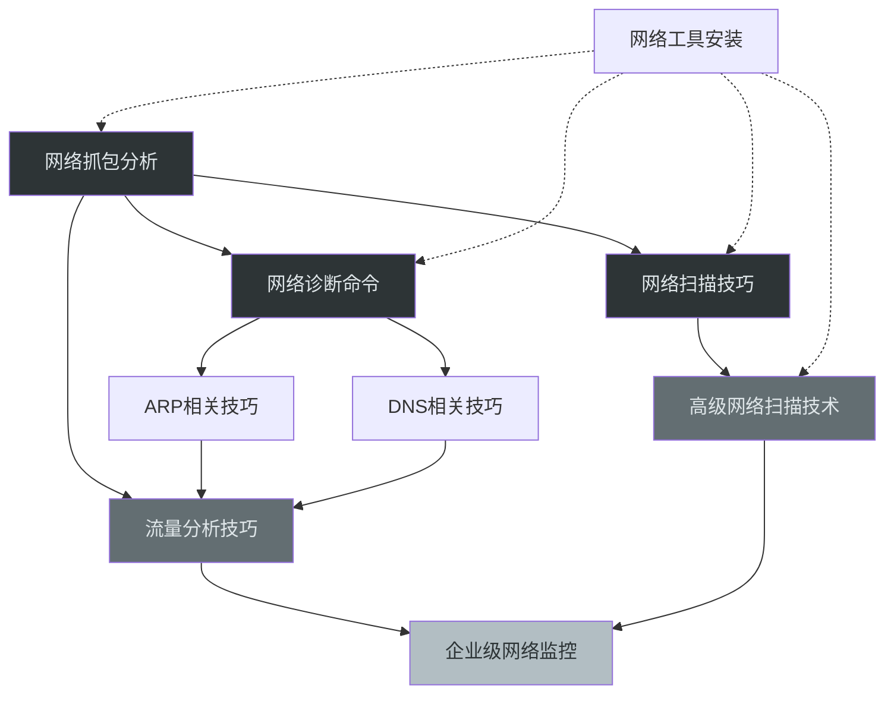

## 本节小结

"核心技巧"这一节从工具使用、协议分析、攻防实战三个维度，系统性地构建了网络安全工程师的网络分析能力体系。本节共涵盖九大知识模块，从最基础的抓包分析到企业级监控部署，形成了一条完整的技能成长路径。以下从知识脉络梳理、核心能力提炼、工具矩阵总结、常见误区警示、以及后续学习路径五个层面进行全面回顾。

### 知识脉络总览

本节的九个模块并非孤立的知识点，而是围绕"**看见网络中正在发生什么**"这一核心命题，按由浅入深的逻辑递进展开：

| 模块 | 核心命题 | 能力层级 | 关联模块 |
|------|---------|---------|---------|
| 一、网络抓包分析 | 如何捕获并解读网络数据 | 基础能力 | 二、三、六 |
| 二、网络扫描技巧 | 如何发现网络中的主机和服务 | 侦察能力 | 一、八 |
| 三、网络诊断命令 | 如何快速定位网络故障 | 排障能力 | 一、四、五 |
| 四、ARP相关技巧 | 如何理解并操控二层网络 | 协议深度 | 五、六 |
| 五、DNS相关技巧 | 如何利用域名系统进行信息收集 | 协议深度 | 四、六 |
| 六、流量分析技巧 | 如何从流量中识别异常行为 | 分析能力 | 一、八、九 |
| 七、网络工具安装 | 如何搭建完整的工具环境 | 环境准备 | 全部 |
| 八、高级网络扫描技术 | 如何编写自定义扫描与检测逻辑 | 高级能力 | 一、二、九 |
| 九、企业级网络监控 | 如何构建持续的安全监控体系 | 架构能力 | 六、八 |



上图展示了各模块之间的依赖与递进关系。灰色调越深代表能力层级越高——从基础的"看"到高级的"持续监控"，逐步构建完整的网络感知能力。

### 核心能力提炼

#### 能力一：抓包分析能力

抓包是网络安全工作的"眼睛"。本节介绍了三个层次的抓包工具：

**图形化工具（Wireshark）**适合深度分析单个会话。关键技能点包括：
- 捕获过滤器（BPF语法）在抓包前减少噪音，例如 `host 192.168.1.100 and port 80`
- 显示过滤器在抓包后精确筛选，例如 `http.request.method == "POST" && ip.src == 10.0.0.5`
- Follow TCP Stream 重组完整会话，是分析 HTTP、SMTP 等明文协议的利器
- Protocol Hierarchy 统计快速了解流量的协议分布全貌
- 着色规则帮助肉眼快速区分正常流量与异常流量

**命令行工具（tcpdump）**适合远程服务器上的快速抓包和自动化采集。核心用法：
- `-i` 指定接口，`-w` 保存为 pcap 文件供离线分析
- BPF 过滤器支持按主机、端口、协议标志位精确过滤
- `-c` 限制抓包数量，`-A` 显示 ASCII 内容用于快速查看明文数据

**程序化工具（tshark）**适合批量提取和自动化分析。典型场景：
- 提取特定字段：`tshark -r file.pcap -Y "http.request" -T fields -e http.host -e http.request.uri`
- 统计分析：`tshark -r file.pcap -z conv,ip` 查看会话统计
- 导出对象：`tshark -r file.pcap --export-objects http,output_dir`

这三个工具并非互相替代，而是互补使用：tcpdump 用于前线采集，Wireshark 用于深度分析，tshark 用于自动化流水线。

#### 能力二：网络扫描与侦察

Nmap 是网络侦察的事实标准工具。本节覆盖了从基础到高级的完整扫描技能：

**基础扫描类型对比**：

| 扫描类型 | 命令参数 | 原理 | 优点 | 缺点 | 适用场景 |
|---------|---------|------|------|------|---------|
| TCP SYN 扫描 | `-sS` | 发送 SYN 不完成握手 | 速度快、较隐蔽 | 需要 root 权限 | 通用扫描首选 |
| TCP 全连接 | `-sT` | 完成三次握手 | 不需要 root | 容易被日志记录 | 非 root 用户 |
| UDP 扫描 | `-sU` | 发送 UDP 探测 | 发现 UDP 服务 | 速度极慢 | DNS/SNMP/服务发现 |
| 服务版本检测 | `-sV` | 探测 banner | 精确识别服务 | 增加扫描时间 | 确认服务版本 |
| OS 检测 | `-O` | 分析 TCP/IP 栈指纹 | 识别操作系统 | 需要至少一个开放端口 | 信息收集阶段 |
| 综合扫描 | `-A` | 组合多种技术 | 信息最全面 | 最慢、最嘈杂 | 深度侦察 |

**高级扫描技术**重点在于 NSE 脚本引擎——它是 Nmap 从"端口扫描器"进化为"安全评估平台"的关键：
- 脚本分类：`vuln`（漏洞检测）、`brute`（暴力破解）、`discovery`（服务发现）、`safe`（安全检测）
- 组合使用：`nmap --script vuln -sV target.com` 同时进行版本检测和漏洞扫描
- 自定义脚本：使用 Lua 语言编写，通过 `shortport`、`http` 等库定义端口规则和检测逻辑

**扫描速度控制**是实战中的重要考量：
- `-T0` 到 `-T5` 六个级别，`-T4` 是大多数场景的默认选择
- 在面对 IDS/IPS 环境时，`-T1` 或 `-T2` 配合 `--scan-delay` 可以降低被检测概率
- 全端口扫描（`-p-`）耗时较长，建议先用 `-F` 快速扫描常用端口，再针对性全端口扫描

#### 能力三：ARP 与 DNS 协议操控

这两项能力属于"协议层面的深度理解"，是中级安全工程师的分水岭。

**ARP 攻防要点**：
- ARP 协议无认证机制，任何主机都可以声称自己拥有某个 IP 地址——这是 ARP 欺骗的根本原因
- ARP 欺骗（arpspoof）的工作原理：持续向目标发送伪造的 ARP 应答，将网关的 IP 映射到攻击者的 MAC
- 双向欺骗才能实现完整的中间人攻击：同时欺骗目标和网关
- 防御手段包括静态 ARP 绑定（`arp -s`）、ARP 检测交换机（DAI）、802.1X 认证

**DNS 信息收集要点**：
- DNS 记录类型各有所用：A 记录定位服务器 IP，MX 记录找到邮件服务器，TXT 记录泄露 SPF/DKIM 等安全配置，NS 记录揭示权威 DNS 服务器
- DNS 区域传送（AXFR）如果未加限制，可以一次性获取整个域的所有记录——这是信息收集的金矿
- 反向 DNS 查询（`dig -x IP`）可以从 IP 反查域名，在渗透测试中用于扩展攻击面
- DNS 缓存操作不仅是维护技能，也是安全测试的一部分——清除缓存后可以重新观察解析行为

#### 能力四：异常流量识别

流量分析是从"被动防御"转向"主动发现"的关键能力。本节列举了三类常见异常的识别方法：

**ARP 欺骗识别**：
- 同一 IP 出现多个 MAC 地址，或多个 IP 指向同一 MAC 地址
- Wireshark 过滤器 `arp.duplicate-address-detected` 可以直接定位
- 工具辅助：arpwatch 可以持续监控 ARP 表变化并发送告警

**DNS 劫持识别**：
- 对比 DNS 响应的源 IP 与请求的目标 DNS 服务器是否一致
- 检查返回的 IP 地址是否属于预期的服务提供商
- 使用多个 DNS 服务器交叉验证同一域名的解析结果

**端口扫描识别**：
- 短时间内大量 SYN 包发往不同端口是最典型的扫描特征
- Wireshark 中使用 `tcp.flags.syn == 1 && tcp.flags.ack == 0` 过滤 SYN 包
- 结合 Statistics → Conversations 可以快速发现哪个源 IP 发起了大量连接尝试

长期流量基线是高级流量分析的基础——只有知道"正常"长什么样，才能识别"异常"。vnStat 提供按天/按月的流量统计，iftop 和 nethogs 提供实时流量监控，两者结合可以建立完整的流量画像。

#### 能力五：企业级安全监控

从个人技能到企业级方案，本节介绍了从入侵检测到自动化告警的完整技术栈：

**入侵检测系统（IDS）部署**：
- Snort 以规则驱动，适合自定义检测逻辑——通过编写 `alert` 规则检测 SQL 注入、XSS、端口扫描等攻击行为
- Suricata 支持多线程和 EVE JSON 日志，适合高流量环境——通过 `suricata.yaml` 配置网络范围、端口分组和输出格式
- 两者都支持社区规则集（ET Open Rules），开箱即用即可覆盖常见威胁

**ELK Stack 自动化监控**：
- Filebeat 负责收集 Suricata 的 EVE JSON 日志和 NetFlow 数据
- Elasticsearch 负责存储和索引
- Kibana 负责可视化和告警
- 完整链路：流量 → Suricata 检测 → EVE JSON → Filebeat → Elasticsearch → Kibana 仪表板 + 告警

### 工具矩阵总结

以下表格汇总了本节涉及的所有工具及其核心用途，方便快速查阅：

| 工具 | 类型 | 核心用途 | 典型命令 |
|------|------|---------|---------|
| Wireshark | 图形化抓包 | 深度协议分析、会话重组 | 打开 pcap 文件，使用显示过滤器 |
| tcpdump | 命令行抓包 | 远程服务器抓包、自动化采集 | `tcpdump -i eth0 -w cap.pcap` |
| tshark | 命令行抓包 | 批量提取字段、程序化分析 | `tshark -r file.pcap -Y "http" -T fields` |
| Nmap | 网络扫描 | 端口扫描、服务发现、漏洞检测 | `nmap -sV -sC target` |
| dig | DNS 查询 | 域名解析、DNS 记录查询 | `dig example.com ANY` |
| nslookup | DNS 查询 | 简单 DNS 查询（跨平台） | `nslookup example.com` |
| arpspoof | ARP 欺骗 | 中间人攻击 | `arpspoof -i eth0 -t target gateway` |
| iftop | 流量监控 | 实时查看网络带宽使用 | `iftop -i eth0` |
| nethogs | 进程流量 | 按进程统计网络流量 | `nethogs eth0` |
| vnStat | 流量统计 | 长期流量趋势分析 | `vnstat -i eth0 -d` |
| Snort | 入侵检测 | 基于规则的网络入侵检测 | 配置规则文件后启动守护进程 |
| Suricata | 入侵检测 | 高性能多协议入侵检测 | `suricata -c suricata.yaml -i eth0` |
| Scapy | 数据包构造 | 自定义数据包生成与分析 | Python 脚本调用 |
| Scapy | 流量分析 | 异常检测脚本编写 | Python 脚本中 `sniff()` 函数 |
| arping | ARP 探测 | 二层主机发现 | `arping -c 4 192.168.1.1` |
| traceroute | 路由追踪 | 网络路径诊断 | `traceroute 8.8.8.8` |
| netcat (nc) | 网络工具 | 端口测试、简单数据传输 | `nc -zv host port` |

### 常见误区与纠正

在学习和实践本节内容时，以下误区值得特别警惕：

**误区一：认为 Nmap 扫描结果是完全准确的。**
Nmap 的端口状态判定依赖于目标主机的响应行为。防火墙可能丢弃探测包导致端口显示为 `filtered`，IDS 可能干扰响应导致误判。永远不要仅凭一次扫描结果下结论——使用不同扫描方式（`-sS`、`-sT`、`-sU`）交叉验证，使用不同时间窗口重复扫描。

**误区二：在生产环境中随意使用 ARP 欺骗。**
ARP 欺骗不仅影响目标主机，还会污染整个子网的 ARP 缓存，可能导致大面积网络故障。在未经授权的网络中进行 ARP 欺骗是违法行为。即使在授权测试中，也应提前通知网络管理员，并在测试完成后立即停止欺骗并清理 ARP 缓存。

**误区三：只关注工具用法，忽视协议理解。**
工具命令可以查阅手册，但协议层面的理解决定了你能否在复杂场景中灵活应变。例如，不理解 TCP 状态机就无法判断一个端口是被防火墙过滤还是服务未响应；不理解 DNS 递归与迭代的区别就无法判断 DNS 劫持的具体手法。建议每次使用工具时，都对照理论基础部分的协议知识，将工具输出与协议行为对应起来。

**误区四：忽略扫描对目标系统的影响。**
即使是"安全"的 SYN 扫描，对目标系统而言也意味着大量的连接请求和日志记录。在生产环境中进行扫描时：
- 使用 `-T2` 或更低的时序模板控制扫描速度
- 使用 `--max-rate` 限制每秒发送的数据包数量
- 避免同时对同一目标运行多个扫描任务
- 在业务低峰期执行扫描

**误区五：将 Snort/Suricata 规则写得过于宽泛。**
过于宽泛的规则会产生海量误报，最终导致安全团队对告警麻木（"告警疲劳"）。编写规则时应尽量精确匹配攻击特征，使用 `threshold` 关键字限制告警频率，并根据实际环境持续调优规则。一条产生大量误报的规则，比没有规则更危险——因为它让你忽视了真正有威胁的告警。

**误区六：只做抓包不做基线。**
没有基线的流量分析是盲人摸象。你无法判断"异常"的流量是否真的异常，因为你不知道"正常"是什么样子。建议在部署任何监控之前，先用至少两周的时间建立流量基线，记录正常时段的协议分布、TOP 通信对、DNS 查询模式、出站流量峰值等指标。

### 工具环境搭建建议

本节涉及的工具分布在多个系统平台上，以下给出推荐的环境搭建方案：

**最小化学习环境**（适合初学者）：
- 使用 Kali Linux 虚拟机（预装 Wireshark、Nmap、tcpdump 等大部分工具）
- 配置至少两台虚拟机（攻击机 + 靶机），使用仅主机模式网络
- 推荐靶机：Metasploitable 2/3、DVWA、VulnHub 镜像

**进阶实验环境**（适合中级练习）：
- 使用 GNS3 或 EVE-NG 搭建虚拟网络拓扑
- 模拟多网段、多 VLAN、防火墙等企业网络架构
- 部署 Snort/Suricata + ELK 进行完整监控链路练习

**工具安装速查**：

```bash
# Kali Linux（预装大部分工具）
sudo apt update && sudo apt install wireshark nmap tcpdump tshark

# Ubuntu/Debian
sudo apt install wireshark nmap tcpdump net-tools dnsutils arping \
    iftop nethogs vnstat

# CentOS/RHEL
sudo yum install wireshark nmap tcpdump net-tools bind-utils

# macOS
brew install wireshark nmap tcpdump
```

### 学习成果自检清单

完成本节学习后，你应该能够回答以下问题并完成以下任务：

**理论自检**：
- [ ] 能否画出 TCP 三次握手和四次挥手的状态转换图？
- [ ] 能否解释 ARP 欺骗的原理和防御方法？
- [ ] 能否区分 DNS 递归查询和迭代查询？
- [ ] 能否说明 SYN 扫描与全连接扫描的区别和各自适用场景？
- [ ] 能否解释 Snort 规则的 `sid`、`rev`、`threshold` 等关键字的含义？

**实操自检**：
- [ ] 能否使用 Wireshark 过滤出特定主机的 HTTP POST 请求？
- [ ] 能否使用 Nmap 完成一次完整的主机发现 + 端口扫描 + 服务版本检测？
- [ ] 能否使用 tcpdump 在远程服务器上抓取 DNS 流量并保存为 pcap 文件？
- [ ] 能否编写一个 Snort 规则检测特定模式的网络攻击？
- [ ] 能否使用 tshark 从 pcap 文件中批量提取 HTTP 请求 URL？

**综合自检**：
- [ ] 能否在实验环境中独立完成 ARP 欺骗 + 流量嗅探的完整中间人攻击？
- [ ] 能否使用 NSE 脚本对目标进行自动化漏洞扫描？
- [ ] 能否部署 Suricata + ELK 实现基本的入侵检测和告警？

### 后续学习路径

本节掌握的工具和技巧将在后续章节中反复使用。建议按以下路径继续学习：

1. **实战案例部分**：本章的"实战案例"将运用本节学到的工具，在真实场景中完成 ARP 欺骗攻击、DNS 劫持、网络嗅探、端口扫描等实战演练。动手实操是巩固技能的最佳方式。
2. **常见误区部分**：梳理网络攻击与防御中最容易犯的错误，帮助你避免在实际工作中踩坑。
3. **练习方法部分**：提供系统化的练习方案，帮助你将零散的工具使用技能整合为连贯的分析思维。
4. **深度拓展部分**：面向高级读者，深入探讨协议逆向、流量指纹识别、自动化漏洞发现等前沿话题。

记住：**工具只是手段，理解协议和攻击原理才是核心**。当你能够不依赖任何工具，仅凭对协议的理解就能预判网络行为时，才算真正掌握了网络分析的精髓。

> **一句话总结**：本节构建了从"看得到"（抓包）→"找得到"（扫描）→"看得懂"（协议分析）→"守得住"（监控防御）的完整网络安全分析能力链。每一个环节都是后续环节的基础，缺一不可。
