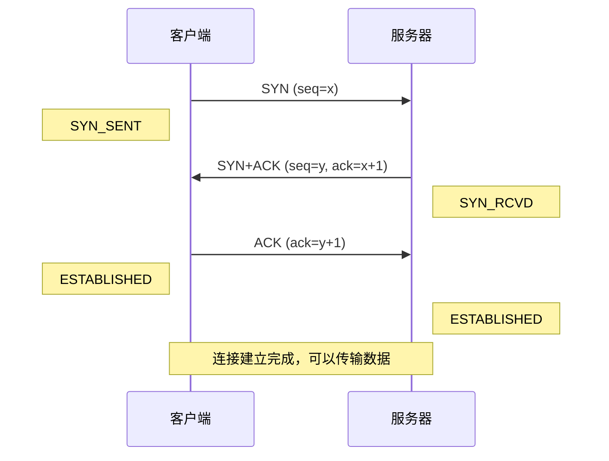
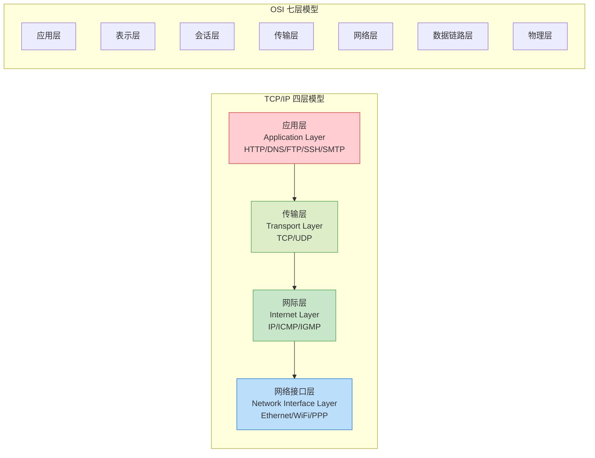
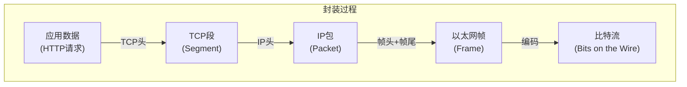
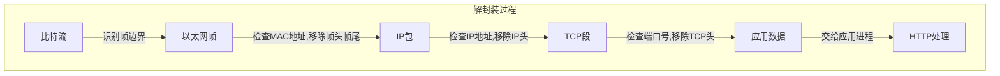

## 一、网络分层模型

### 1.1 为什么需要分层

#### 1.1.1 网络通信的本质复杂性

想象你要给另一座城市的朋友寄一封信。这个过程至少涉及：你写信（语言表达）→ 信封装封（格式规范）→ 邮局分拣（路由选择）→ 运输车队（物理传输）→ 对方邮局 → 朋友拆信阅读。每一环节都有不同的专业机构负责，你不需要关心卡车走哪条高速路，邮局也不需要关心你信里用的是中文还是英文。

计算机网络的通信原理与此完全一致。一次看似简单的网页浏览请求，背后涉及数十个环节：浏览器构造 HTTP 请求、操作系统封装 TCP 段、网卡将数据转为电信号或光信号、路由器根据 IP 地址转发、交换机根据 MAC 地址转发……如果没有清晰的分工，这个系统将混乱到无法维护。

#### 1.1.2 分层的核心价值

分层架构的价值体现在四个维度：

**降低复杂性** —— 每层只需理解本层协议，不需要同时处理比特编码和 HTTP 头部格式。一个 Web 开发者可以专注于应用层，完全不了解以太网帧结构。

**促进标准化** —— 分层使得不同厂商可以独立开发某一层的实现。思科可以造路由器（网络层），华为可以造交换机（数据链路层），Apache 可以开发 Web 服务器（应用层），它们之间通过标准接口无缝协作。

**便于故障定位** —— 当网络不通时，按层排查是最高效的诊断方法：物理层（网线插了吗？）→ 数据链路层（ARP 能通吗？）→ 网络层（ping 能通吗？）→ 传输层（端口开放吗？）→ 应用层（HTTP 返回正常吗？）。每一层的问题都有对应的特征症状。

**支持独立演进** —— IPv4 到 IPv6 的迁移只需要修改网络层，上层应用无需重写。HTTP/1.1 到 HTTP/2 的升级只影响应用层，底层 TCP/IP 完全不变。

#### 1.1.3 安全研究者为什么必须理解分层

对于安全从业者而言，分层模型不只是理论知识，而是攻击分类和防御体系的基础框架：

- **攻击定位** —— ARP 欺骗发生在数据链路层，IP 欺骗在网络层，SYN Flood 在传输层，SQL 注入在应用层。准确定位攻击层次才能选择正确的防御手段。
- **防御纵深** —— 安全防护需要在每一层都部署。物理层有门禁系统，数据链路层有端口安全，网络层有 ACL/防火墙，传输层有 SYN Cookie，应用层有 WAF。缺少任何一层都是短板。
- **攻击面分析** —— 理解分层才能系统性地枚举一个目标的全部攻击面，而不是零散地想到一个试一个。

### 1.2 OSI 七层参考模型

#### 1.2.1 OSI 模型的历史背景

1977 年，国际标准化组织（ISO）开始制定 OSI（Open Systems Interconnection，开放系统互连）参考模型，1984 年正式发布为 ISO 7498 标准。其目标是为网络通信提供一个通用的框架，使任何两个系统只要遵循这个框架就能通信。

需要强调的是：OSI 模型是一个**参考模型**（reference model），用于描述和理解网络通信，并非实际使用的协议栈。互联网实际使用的是 TCP/IP 模型。但 OSI 模型的七层划分方式因其清晰性和完整性，已成为网络教育和行业交流的事实标准。

#### 1.2.2 七层全景总览

```mermaid
graph TD
    subgraph OSI["OSI 七层模型与安全威胁全景"]
        L7["Layer 7 · 应用层<br/>Application Layer<br/>HTTP · DNS · SMTP · FTP · SSH<br/>⚠️ SQL注入 · XSS · RCE · 认证绕过"]
        L6["Layer 6 · 表示层<br/>Presentation Layer<br/>SSL/TLS · JPEG · ASCII · GZIP<br/>⚠️ 证书伪造 · 降级攻击 · 编码绕过"]
        L5["Layer 5 · 会话层<br/>Session Layer<br/>NetBIOS · RPC · SIP<br/>⚠️ 会话劫持 · CSRF · 会话固定"]
        L4["Layer 4 · 传输层<br/>Transport Layer<br/>TCP · UDP · SCTP<br/>⚠️ SYN Flood · TCP劫持 · 端口扫描"]
        L3["Layer 3 · 网络层<br/>Network Layer<br/>IP · ICMP · IGMP · OSPF · BGP<br/>⚠️ IP欺骗 · 路由劫持 · Smurf攻击"]
        L2["Layer 2 · 数据链路层<br/>Data Link Layer<br/>Ethernet · ARP · PPP · VLAN<br/>⚠️ ARP欺骗 · MAC泛洪 · VLAN跳跃"]
        L1["Layer 1 · 物理层<br/>Physical Layer<br/>RJ45 · 光纤 · WiFi · 蓝牙<br/>⚠️ 窃听 · 电磁截获 · 信号干扰"]
    end

    L7 --> L6 --> L5 --> L4 --> L3 --> L2 --> L1

    style L7 fill:#ffcdd2,stroke:#e53935,stroke-width:2px
    style L6 fill:#ffe0b2,stroke:#ff9800,stroke-width:2px
    style L5 fill:#fff9c4,stroke:#fdd835,stroke-width:2px
    style L4 fill:#dcedc8,stroke:#8bc34a,stroke-width:2px
    style L3 fill:#c8e6c9,stroke:#43a047,stroke-width:2px
    style L2 fill:#bbdefb,stroke:#1976d2,stroke-width:2px
    style L1 fill:#e1bee7,stroke:#8e24aa,stroke-width:2px
```



每层都有自己的协议数据单元（PDU, Protocol Data Unit），这是一个关键概念：

| 层级 | 名称 | PDU | 寻址方式 | 核心功能 |
|------|------|-----|----------|----------|
| 第7层 | 应用层 | 数据（Data） | 应用标识（URL/域名） | 为应用程序提供网络服务 |
| 第6层 | 表示层 | 数据（Data） | — | 数据格式转换、加密、压缩 |
| 第5层 | 会话层 | 数据（Data） | 会话ID | 会话建立、维护、终止 |
| 第4层 | 传输层 | 段（Segment）/数据报（Datagram） | 端口号（0-65535） | 端到端可靠/高效传输 |
| 第3层 | 网络层 | 包（Packet） | IP地址 | 路由选择、跨网络转发 |
| 第2层 | 数据链路层 | 帧（Frame） | MAC地址（48bit） | 相邻节点间可靠传输 |
| 第1层 | 物理层 | 比特（Bit） | — | 比特流的物理传输 |

#### 1.2.3 各层详解

**第一层：物理层（Physical Layer）**

物理层是整个网络的"地基"，负责在物理介质上传输原始比特流（0 和 1 的电信号、光信号或无线电波）。

物理层定义的核心标准包括：
- **电气特性** —— 电压范围、阻抗、信号编码方式。例如 RS-232 标准规定逻辑 1 为 -3V 至 -15V，逻辑 0 为 +3V 至 +15V。
- **机械特性** —— 接口形状、引脚数量和排列。RJ-45 接口有 8 个引脚，USB Type-C 有 24 个引脚。
- **功能特性** —— 每个引脚的功能定义。例如以太网的 1/2 引脚用于发送，3/6 引脚用于接收。
- **规程特性** —— 信号的时序关系。例如 WiFi 的 CSMA/CA 机制规定了何时可以发送数据。

常见物理层设备：集线器（Hub）、中继器（Repeater）、调制解调器（Modem）、光纤收发器。

安全威胁：
- **线缆窃听** —— 非屏蔽双绞线（UTP）的电磁辐射可以被专业设备在数米外截获。光纤虽然无法被窃听（弯曲时光信号会泄漏并被检测到），但光纤接头处仍存在被分光器截获的风险。
- **信号干扰（Jamming）** —— 发射大功率电磁信号覆盖正常通信，属于拒绝服务攻击的物理层实现。
- **物理访问** —— 获取物理访问权限后，可以在线缆上安装分光器或在交换机上镜像端口。

**第二层：数据链路层（Data Link Layer）**

数据链路层在两个直接相连的网络节点之间提供可靠的数据传输。它完成三个核心任务：

1. **成帧（Framing）** —— 将比特流划分为有明确边界的帧。以太网使用前导码（Preamble）和帧起始定界符（SFD）标记帧的开始，用帧校验序列（FCS）标记帧的结束。
2. **差错检测** —— 通过 CRC32 校验检测传输中的比特错误。如果 FCS 校验失败，接收方直接丢弃该帧。
3. **介质访问控制** —— 当多个设备共享同一物理介质时，决定谁能发送。以太网使用 CSMA/CD（载波侦听多路访问/冲突检测），WiFi 使用 CSMA/CA（冲突避免）。

数据链路层又分为两个子层：
- **LLC（逻辑链路控制）** —— IEEE 802.2 标准，负责多路复用和差错通知。
- **MAC（媒体访问控制）** —— IEEE 802.3（以太网）/ 802.11（WiFi），负责物理寻址和介质访问。

以太网帧结构：

```text
┌──────────┬───────────┬──────────┬──────────┬─────────┬──────┐
│ 前导码    │ 目的MAC   │ 源MAC    │ 类型/长度 │ 数据     │ FCS  │
│ 8字节    │ 6字节     │ 6字节    │ 2字节    │ 46-1500 │ 4字节│
└──────────┴───────────┴──────────┴──────────┴─────────┘──────┘
```

安全威胁：
- **ARP 欺骗** —— 发送伪造的 ARP 响应，将网关的 MAC 地址映射到攻击者的 MAC 地址，实现中间人攻击。这是局域网中最常见的攻击之一。
- **MAC 泛洪** —— 向交换机发送大量伪造源 MAC 地址的帧，填满交换机的 MAC 地址表，使其退化为集线器模式（广播所有帧），从而可以嗅探所有流量。
- **VLAN 跳跃（VLAN Hopping）** —— 利用 DTP（动态中继协议）或双标签（Double Tagging）技术突破 VLAN 隔离，访问其他 VLAN 的主机。
- **交换机欺骗** —— 伪造 STP（生成树协议）的 BPDU 包，将自己声明为根桥，从而劫持流量路径。

**第三层：网络层（Network Layer）**

网络层的核心任务是将数据从源主机跨越多个网络送达目的主机，即"路由"。如果说数据链路层是"从一个房间走到隔壁房间"，网络层就是"从一栋楼走到城市的另一栋楼"。

核心协议：
- **IP（Internet Protocol）** —— 互联网的基础协议。IPv4 使用 32 位地址（约 43 亿个），IPv6 使用 128 位地址（约 3.4×10³⁸ 个）。IP 协议是"尽力而为"（Best-Effort）的，不保证可靠性。
- **ICMP（Internet Control Message Protocol）** —— 网络诊断和差错报告协议。ping 命令使用 ICMP Echo Request/Reply，traceroute 使用 ICMP Time Exceeded。
- **IGMP（Internet Group Management Protocol）** —— 管理主机加入/离开多播组。
- **路由协议** —— OSPF（开放最短路径优先，内部网关协议）、BGP（边界网关协议，互联网骨干路由）、RIP（路由信息协议，已过时）。

安全威胁：
- **IP 欺骗（IP Spoofing）** —— 伪造源 IP 地址。常用于 DDoS 放大攻击、绕过基于 IP 的访问控制。
- **路由劫持（BGP Hijacking）** —— 通过伪造 BGP 路由宣告，将其他自治系统的流量吸引到自己的网络。2018 年亚马逊 DNS 劫持事件就是通过 BGP 劫持实现的。
- **Smurf 攻击** —— 向网络广播地址发送 ICMP Echo Request，源地址伪造为受害者的 IP，所有主机都会向受害者回复 Echo Reply，形成放大攻击。
- **ICMP 隧道** —— 利用 ICMP 包封装其他协议的数据，绕过防火墙限制（许多防火墙允许 ICMP 通过）。

**第四层：传输层（Transport Layer）**

传输层提供进程到进程的通信服务（而非主机到主机——那是网络层的职责）。通过端口号，同一台主机上可以同时运行多个网络应用而互不干扰。

两种核心协议的区别：

| 特性 | TCP | UDP |
|------|-----|-----|
| 连接方式 | 面向连接（三次握手） | 无连接 |
| 可靠性 | 可靠（确认/重传/排序） | 不可靠 |
| 流量控制 | 滑动窗口机制 | 无 |
| 拥塞控制 | 慢启动/拥塞避免/快重传 | 无 |
| 首部大小 | 20-60字节 | 8字节 |
| 传输效率 | 较低（开销大） | 高（开销小） |
| 典型应用 | HTTP/HTTPS、SSH、FTP、SMTP | DNS、DHCP、视频流、VoIP、游戏 |

TCP 三次握手过程：



安全威胁：
- **SYN Flood** —— 发送大量伪造源 IP 的 SYN 包，耗尽服务器的半连接队列（SYN Queue），导致无法接受新连接。防御手段包括 SYN Cookie、增大 backlog、限制 SYN 速率。
- **TCP 会话劫持** —— 通过嗅探或预测 TCP 序列号，插入伪造的数据包到已有 TCP 连接中。现代系统使用随机化的初始序列号（ISN）来增加预测难度。
- **端口扫描** —— 通过向目标端口发送特定 TCP 包（SYN/ACK/FIN/XMAS/NULL）并分析响应来判断端口状态和运行的服务。nmap 的核心功能就基于此。
- **UDP Flood** —— 发送大量 UDP 包消耗目标带宽和处理能力。由于 UDP 无连接，源地址容易伪造。

**第五层：会话层（Session Layer）**

会话层管理通信会话的生命周期，包括会话建立、同步、检查点和终止。

会话层的核心概念：
- **对话控制** —— 决定通信是全双工（同时双向）、半双工（交替双向）还是单工（单向）。
- **会话恢复** —— 在通信中断后，从最近的检查点恢复，而不是从头开始。这在大文件传输中尤其重要。

在实际的 TCP/IP 协议栈中，会话层的功能通常与传输层或应用层合并。例如，TCP 的连接管理实际上承担了部分会话层职责，而 HTTP 的 Cookie/Session 机制也是会话管理的实现。NetBIOS、RPC（远程过程调用）、SIP（会话初始协议）是较为典型的会话层协议。

安全威胁：
- **会话劫持（Session Hijacking）** —— 窃取或预测会话标识符（Session ID），冒充合法用户。防御手段包括使用长随机 Session ID、HTTPS 传输、绑定客户端 IP/指纹。
- **CSRF（跨站请求伪造）** —— 利用用户已建立的会话，在用户不知情的情况下执行操作。本质是会话层的信任机制被滥用。
- **会话固定（Session Fixation）** —— 攻击者预先设置一个会话 ID，诱导用户使用该 ID 登录，登录后攻击者即可使用该会话。

**第六层：表示层（Presentation Layer）**

表示层解决"数据如何表示"的问题，确保发送方和接收方对数据的解读方式一致。

表示层的三大功能：
1. **数据格式转换** —— 不同系统可能使用不同的字节序（大端/小端）、字符编码（ASCII/UTF-16/EBCDIC）。表示层负责在传输前转换为网络字节序（大端）。
2. **数据加密/解密** —— SSL/TLS 协议工作在表示层（尽管在 TCP/IP 模型中通常归入应用层）。HTTPS 就是在 HTTP 和 TCP 之间插入了 TLS 层。
3. **数据压缩/解压缩** —— 减少传输数据量。HTTP 的 Content-Encoding: gzip 就是表示层功能的应用实例。

安全威胁：
- **SSL/TLS 降级攻击** —— 迫使通信双方使用较弱的加密版本（如 SSL 3.0 → POODLE 攻击）。防御：禁用旧版协议，仅允许 TLS 1.2+。
- **证书伪造** —— 使用自签名证书或入侵 CA（证书颁发机构）签发伪造证书。2011 年 DigiNotar 事件中，攻击者签发了 Google 域名的伪造证书。
- **编码绕过** —— WAF（Web 应用防火墙）基于特定编码规则检测攻击，攻击者使用非标准编码（如 Unicode、URL 编码的组合）绕过检测。

**第七层：应用层（Application Layer）**

应用层是与用户最近的一层，直接为应用程序提供网络服务。这是协议种类最多、攻击面最广的一层。

核心协议分类：

| 协议 | 端口 | 用途 | 安全风险 |
|------|------|------|----------|
| HTTP/HTTPS | 80/443 | Web 服务 | SQL注入、XSS、SSRF、文件上传 |
| DNS | 53 | 域名解析 | DNS劫持、DNS隧道、缓存投毒 |
| SMTP/POP3/IMAP | 25/110/143 | 邮件 | 钓鱼邮件、附件漏洞、中继滥用 |
| FTP | 20/21 | 文件传输 | 明文传输、匿名访问、目录遍历 |
| SSH | 22 | 安全远程管理 | 暴力破解、密钥泄露 |
| Telnet | 23 | 远程终端 | 明文传输（已废弃） |
| SNMP | 161/162 | 网络管理 | 社区字符串（密码）默认为 public/private |
| SMB | 445 | 文件共享 | EternalBlue、权限提升 |
| RDP | 3389 | 远程桌面 | BlueKeep 漏洞、暴力破解 |

应用层攻击是安全事件中占比最高的类型。OWASP Top 10 列出的所有漏洞（注入、失效认证、敏感数据暴露、XML 外部实体、失效访问控制、安全配置错误、跨站脚本、不安全的反序列化、使用含已知漏洞的组件、不足的日志和监控）都发生在应用层。

### 1.3 TCP/IP 四层模型

#### 1.3.1 从 OSI 到 TCP/IP 的演进

OSI 模型虽然理论完备，但在实际工程中显得过于复杂。互联网从诞生起就使用 TCP/IP 协议栈，它的分层更简洁、更实用。

TCP/IP 模型的四层结构：



#### 1.3.2 对应关系详解

| TCP/IP 层 | 对应 OSI 层 | 关键差异 |
|-----------|------------|----------|
| 应用层 | 应用层+表示层+会话层 | TCP/IP 的应用层承担了 OSI 上三层的全部职责 |
| 传输层 | 传输层 | 基本一致 |
| 网际层 | 网络层 | 基本一致，TCP/IP 强调 IP 协议的中心地位 |
| 网络接口层 | 数据链路层+物理层 | TCP/IP 不严格区分这两层，只定义了一个网络接入接口 |

为什么 TCP/IP 没有独立的表示层和会话层？因为在实际实现中，数据格式转换（SSL/TLS、gzip）和会话管理（Cookie、Token）都被集成到了应用层协议中。HTTP 协议本身同时处理了会话状态（Cookie）、数据格式（Content-Type）和安全传输（HTTPS）。

#### 1.3.3 为什么实际分析使用 TCP/IP 模型

三个原因使 TCP/IP 模型成为实际分析的首选：

1. **互联网就是用 TCP/IP 构建的** —— 所有实际协议（HTTP、TCP、IP、Ethernet）都对应 TCP/IP 模型。用 OSI 模型分析时，会话层和表示层经常空缺，反而造成困惑。
2. **工具映射更自然** —— 抓包工具（Wireshark）的协议分层就是 TCP/IP 的分层方式。防火墙规则按 TCP/IP 层定义：网络层 ACL（IP 白名单）、传输层 ACL（端口限制）、应用层 WAF（HTTP 规则）。
3. **攻击分类更准确** —— "网络层攻击"指的是 IP 欺骗、路由劫持等；"应用层攻击"指的是 SQL 注入、XSS 等。如果用 OSI 模型，你需要区分"会话层的 CSRF"和"应用层的 SQL 注入"，而实际中两者都通过 HTTP 承载，区分意义不大。

### 1.4 数据封装与解封装

#### 1.4.1 封装过程

数据从应用层到物理层的传输过程，每一层都会添加自己的头部（有时还有尾部），这个过程称为"封装"（Encapsulation）。这就像你写了一封信，放进信封，信封装进邮包，邮包放进集装箱——每一层包装都携带了该层的控制信息。



每一层添加的头部信息：

| 层级 | 添加的头部字段 | 关键信息 |
|------|--------------|----------|
| 应用层 | HTTP/DNS/SMTP 头部 | 请求方法、URL、Host、Content-Type |
| 传输层 | TCP/UDP 头部 | 源端口、目的端口、序列号、标志位（SYN/ACK/FIN） |
| 网络层 | IP 头部 | 源IP、目的IP、TTL、协议号 |
| 数据链路层 | 以太网帧头+帧尾 | 源MAC、目的MAC、类型字段、FCS校验 |

一个实际的 HTTP 请求封装过程示例：

```text
应用层:   GET /index.html HTTP/1.1\r\nHost: example.com\r\n\r\n
         ↓ 添加 TCP 头部
传输层:   [源端口:49152][目的端口:80][序列号:...][标志:SYN] + 应用数据
         ↓ 添加 IP 头部
网络层:   [版本:4][TTL:64][协议:TCP][源IP:192.168.1.100][目的IP:93.184.216.34] + TCP段
         ↓ 添加以太网帧头/帧尾
链路层:   [目的MAC:aa:bb:cc:dd:ee:ff][源MAC:11:22:33:44:55:66][类型:0x0800] + IP包 + [FCS:0xABCD1234]
```

#### 1.4.2 解封装过程

接收端的处理恰好相反：每层读取并移除对应头部，将有效载荷向上传递。



解封装过程中的安全检查点：
- **数据链路层** —— 目的 MAC 是否是本机？FCS 校验是否通过？不匹配则丢弃。
- **网络层** —— 目的 IP 是否是本机或广播？TTL 是否为 0？IP 校验和是否正确？
- **传输层** —— 目的端口是否有进程在监听？SYN 序列号是否在窗口内？
- **应用层** —— 请求是否符合协议规范？是否通过认证和授权？

防火墙和 IDS（入侵检测系统）在不同层次拦截数据包。无状态防火墙只检查网络层（IP）和传输层（端口），有状态防火墙跟踪 TCP 连接状态，WAF 检查应用层内容。理解封装过程才能理解这些安全设备的工作原理。

### 1.5 五层混合模型

#### 1.5.1 教学中的最佳实践

在实际教学和工程实践中，经常使用一个"五层混合模型"，它结合了 OSI 模型的精细度和 TCP/IP 模型的实用性：

| 层级 | 名称 | 对应 OSI | 对应 TCP/IP | PDU |
|------|------|----------|------------|-----|
| 第5层 | 应用层 | 应用+表示+会话 | 应用层 | 数据 |
| 第4层 | 传输层 | 传输层 | 传输层 | 段/数据报 |
| 第3层 | 网络层 | 网络层 | 网际层 | 包 |
| 第2层 | 数据链路层 | 数据链路层 | 网络接口层 | 帧 |
| 第1层 | 物理层 | 物理层 | 网络接口层 | 比特 |

这个五层模型是本书后续分析中使用的参考框架。它保留了物理层和数据链路层的独立性（因为在安全分析中需要区分链路层攻击和物理层攻击），同时将 OSI 的上三层合并为一个应用层（因为实际协议中这三层的界限确实模糊）。

### 1.6 分层模型的安全实战意义

#### 1.6.1 攻击分层分类框架

理解分层模型后，可以建立系统化的攻击分类思维：

```text
┌─────────────────────────────────────────────────────────┐
│ 攻击分层分类框架                                          │
├─────────┬───────────────────────────────────────────────┤
│ 应用层   │ SQL注入、XSS、CSRF、文件上传、SSRF、反序列化     │
│         │ 认证绕过、权限提升、逻辑漏洞、信息泄露            │
├─────────┼───────────────────────────────────────────────┤
│ 传输层   │ SYN Flood、TCP劫持、端口扫描、UDP Flood         │
│         │ TCP反射放大、连接耗尽攻击                        │
├─────────┼───────────────────────────────────────────────┤
│ 网络层   │ IP欺骗、ICMP攻击、路由劫持、Smurf攻击           │
│         │ IP分片攻击、TTL篡改                              │
├─────────┼───────────────────────────────────────────────┤
│ 链路层   │ ARP欺骗、MAC泛洪、VLAN跳跃、STP攻击             │
│         │ DHCP欺骗、交换机端口镜像                          │
├─────────┼───────────────────────────────────────────────┤
│ 物理层   │ 线缆窃听、信号干扰、设备物理篡改                 │
│         │ 冷启动攻击、电磁辐射泄漏                          │
└─────────┴───────────────────────────────────────────────┘
```

#### 1.6.2 纵深防御（Defense in Depth）

基于分层模型的安全防御体系要求在每一层都部署防护措施，形成纵深防线：

| 层级 | 防御措施 | 安全设备/技术 |
|------|----------|--------------|
| 物理层 | 门禁、监控、机柜锁 | 物理安全系统 |
| 数据链路层 | 端口安全、802.1X认证、VLAN隔离 | 交换机安全配置、NAC |
| 网络层 | ACL、路由过滤、IPSec VPN | 防火墙、路由器安全策略 |
| 传输层 | SYN Cookie、连接速率限制 | 状态防火墙、IDS/IPS |
| 应用层 | 输入验证、WAF、CSP、认证授权 | WAF、RASP、代码审计 |

纵深防御的核心思想是：即使某一层的防御被突破，上层或下层的防御仍然有效。例如，即使攻击者通过 ARP 欺骗获得了中间人位置（突破数据链路层），HTTPS（表示层/应用层加密）仍然可以保护数据不被窃取。

#### 1.6.3 故障排查的分层方法论

网络故障排查的最高效方法就是"自底向上，逐层验证"：

```bash
# 第1-2层：物理连通性
ip link show                  # 网卡是否 UP
ethtool eth0                  # 链路是否连接

# 第2层：数据链路层
arp -n                        # ARP 表是否正常
tcpdump -i eth0 arp           # 是否有 ARP 应答

# 第3层：网络层
ping 192.168.1.1              # 能否到达网关
traceroute 8.8.8.8            # 路径是否可达

# 第4层：传输层
ss -tlnp                      # 端口是否监听
nc -zv target 80              # 端口是否开放

# 第5-7层：应用层
curl -v http://target/        # HTTP 是否正常
nslookup example.com          # DNS 是否正常
```

每一步都是在验证特定层的功能。如果 `ping` 不通（网络层问题），去查 HTTP 状态码（应用层）就是浪费时间。这个方法论在渗透测试中同样适用——先确认目标可达，再逐层深入。

### 1.7 常见误区与纠正

**误区一："OSI 模型就是实际使用的协议栈"**

纠正：OSI 模型是理论参考框架，互联网实际使用 TCP/IP 协议栈。OSI 模型的价值在于提供了一个通用的分析语言，而非指导实际实现。

**误区二："会话层和表示层没有存在感"**

纠正：这两个层的功能确实被合并到了 TCP/IP 的应用层中，但其功能仍然存在。SSL/TLS（表示层功能）、Cookie/Session（会话层功能）是所有 Web 安全的基础。

**误区三："防火墙只工作在网络层"**

纠正：不同类型的防火墙工作在不同层次。无状态包过滤防火墙工作在网络层和传输层，有状态防火墙跟踪连接状态（传输层），WAF 工作在应用层，NGFW（下一代防火墙）可以跨多层检测。

**误区四："物理层安全可以忽略"**

纠正：在云时代似乎物理层不重要，但社会工程学攻击的核心就是获取物理访问权限。插入一个 USB 设备可以在数秒内植入恶意软件。物理安全是所有其他安全层的前提。

**误区五："理解分层只是理论学习"**

纠正：分层思维是安全分析的基础工具。面对一个安全事件，第一反应应该是"这是哪一层的攻击"，然后选择对应的分析工具和防御手段。没有分层思维的安全从业者，面对复杂场景时会手忙脚乱。

### 1.8 本节小结

| 要点 | 内容 |
|------|------|
| 分层目的 | 降低复杂性、标准化、故障定位、独立演进 |
| OSI 七层 | 物理→数据链路→网络→传输→会话→表示→应用 |
| TCP/IP 四层 | 网络接口→网际→传输→应用 |
| 核心差异 | OSI 理论参考，TCP/IP 实际使用；上三层合并 |
| 封装过程 | 逐层添加头部：数据→段→包→帧→比特 |
| 安全意义 | 攻击定位、纵深防御、分层排查 |
| 本书使用 | 五层混合模型（应用/传输/网络/链路/物理） |

理解网络分层模型是网络安全学习的第一步。接下来的章节将逐层深入，详细讲解每一层的核心协议、工作原理和安全攻防技术。
