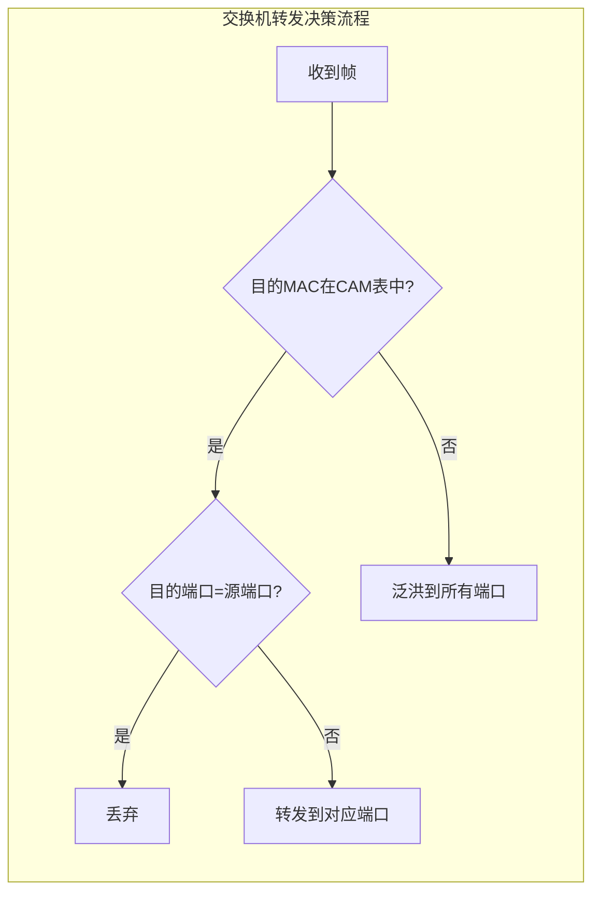
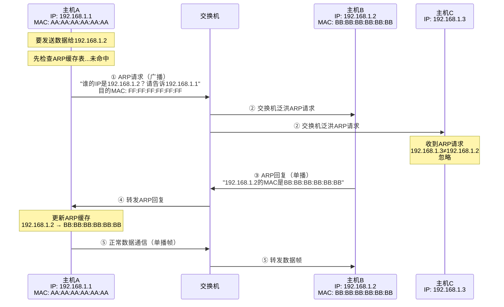
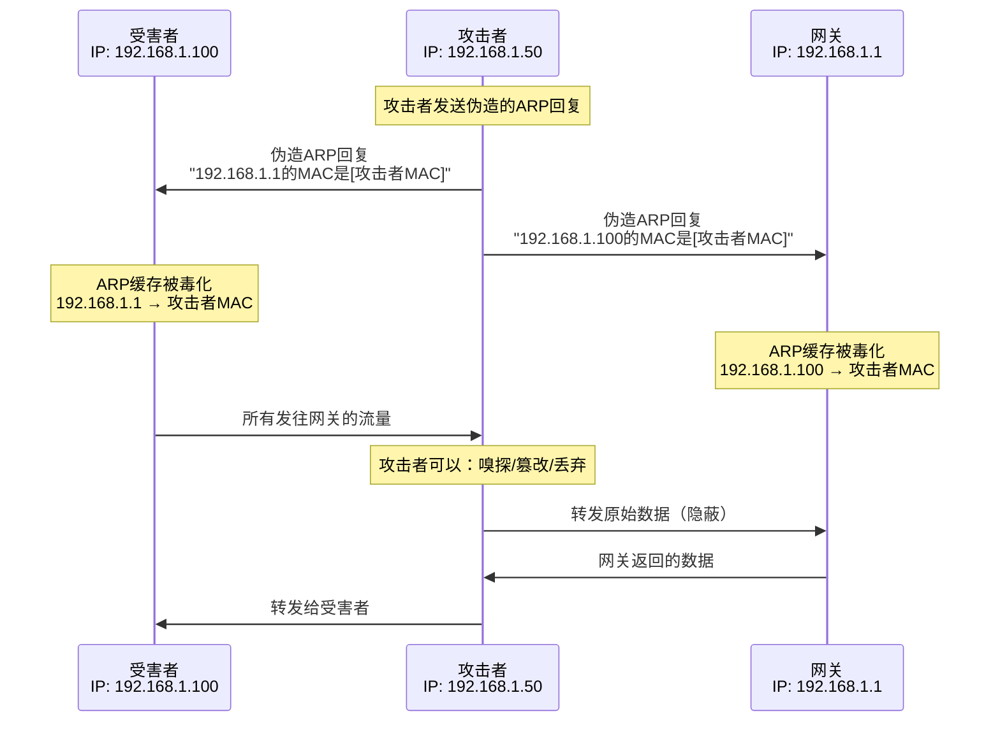
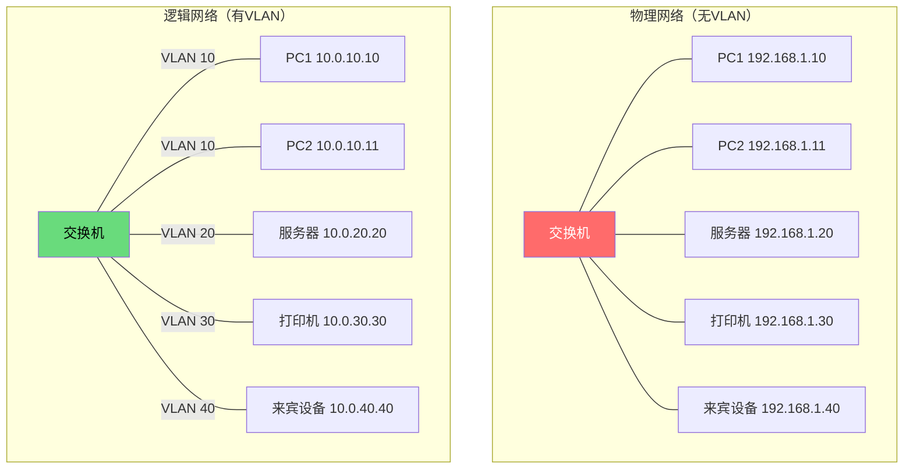
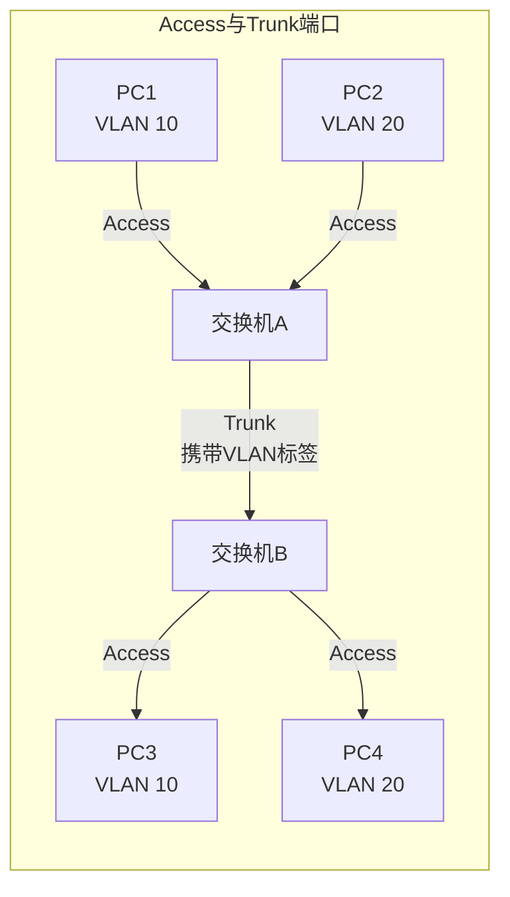
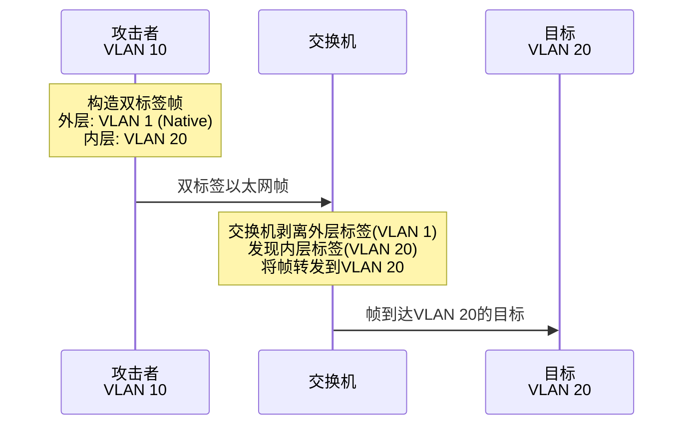
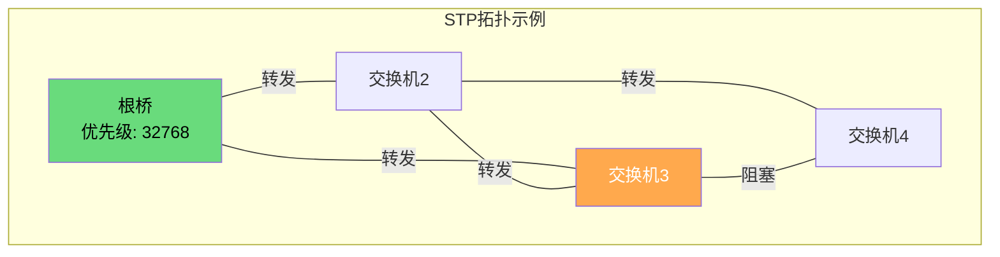
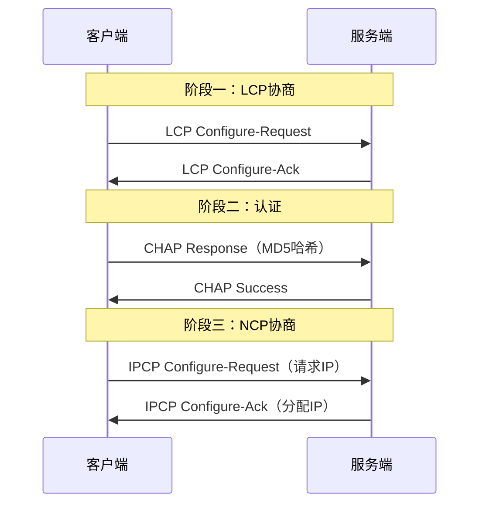

## 二、数据链路层核心协议

数据链路层（OSI第二层）是网络通信中承上启下的关键层次——它将物理层的原始比特流组织成有意义的帧，并在同一个局域网内实现设备间的直接寻址和传输。对于安全研究者而言，这一层的重要性往往被低估：大多数人关注的是IP层和应用层的攻击，但实际上，数据链路层的攻击（ARP欺骗、MAC泛洪、VLAN跳跃）是内网渗透的起点，也是几乎所有中间人攻击的基础。

本节将从以太网协议的帧结构讲起，深入ARP协议的工作机制和安全缺陷，再到VLAN的隔离原理和绕过方法，最后扩展到STP、LLDP等常被忽略但安全意义重大的二层协议。

### 2.1 以太网协议

以太网（Ethernet）是当今局域网的事实标准，由Xerox公司在1970年代发明，后由IEEE 802.3标准化。理解以太网协议不仅是理解局域网通信的基础，更是理解二层攻击的前提。

#### 2.1.1 以太网帧结构

以太网帧是数据链路层的传输单元，其结构直接决定了二层设备如何识别发送方和接收方、如何判断载荷类型、以及如何检测传输错误。

目前最常用的以太网帧格式有两种：**Ethernet II（DIX）** 和 **IEEE 802.3**。两者在实际网络中共存，但Ethernet II更为普遍。

**Ethernet II 帧结构：**

```text
| 前导码(8B) | 目的MAC(6B) | 源MAC(6B) | 类型(2B) | 数据(46-1500B) | FCS(4B) |
```

**IEEE 802.3 帧结构：**

```text
| 前导码(8B) | 目的MAC(6B) | 源MAC(6B) | 长度(2B) | LLC/SNAP(3-8B) | 数据(38-1492B) | FCS(4B) |
```

各字段的详细说明：

| 字段 | 长度 | 说明 | 安全意义 |
|------|------|------|----------|
| **前导码（Preamble）** | 8字节 | 前7字节为交替的10101010，最后1字节为10101011（SFD）。用于接收方的时钟同步，不属于帧的有效数据 | 攻击者可通过发送畸形前导码干扰物理层同步 |
| **目的MAC** | 6字节 | 接收方的MAC地址。可以是单播地址、广播地址（FF:FF:FF:FF:FF:FF）或组播地址 | MAC泛洪攻击的核心——交换机的MAC地址表容量有限 |
| **源MAC** | 6字节 | 发送方的MAC地址。交换机通过学习源MAC来建立MAC地址表 | MAC欺骗——伪造源MAC地址冒充其他设备 |
| **类型（EtherType）** | 2字节 | 仅Ethernet II使用。标识上层协议类型，如0x0800=IPv4，0x0806=ARP，0x86DD=IPv6，0x8100=802.1Q VLAN标签 | Ethernet II与802.3的区分方式：类型字段值>1536(0x0600)为Ethernet II，≤1536为802.3长度字段 |
| **长度** | 2字节 | 仅802.3使用。表示数据字段的字节数 | — |
| **LLC/SNAP** | 3-8字节 | 仅802.3使用。逻辑链路控制头，提供类似EtherType的协议标识功能 | — |
| **数据（Payload）** | 46-1500字节 | 实际传输的数据。最小46字节（保证帧长度≥64字节以检测冲突），最大1500字节（MTU） | 超大帧（Jumbo Frame，9000字节）可能绕过某些IDS的检测能力 |
| **FCS（帧校验序列）** | 4字节 | CRC-32校验码，用于检测传输过程中的比特错误 | 攻击者可故意发送错误FCS的帧来触发交换机的错误处理逻辑 |

**帧大小的计算**：一个完整的以太网帧（不含前导码）最小64字节，最大1518字节。如果数据不足46字节，发送方会自动填充（Padding）。如果使用了802.1Q VLAN标签（4字节），最大帧扩展为1522字节。

#### 2.1.2 MAC地址深入解析

MAC地址（Media Access Control Address）是数据链路层的核心寻址机制。理解MAC地址的结构对于MAC欺骗攻击和二层安全分析至关重要。

**MAC地址的构成：**

```text
示例：AA:BB:CC:DD:EE:FF
      |--OUI(24b)--|--设备ID(24b)--|
```

- **前24位（OUI，组织唯一标识符）**：由IEEE分配给网络设备厂商。通过OUI可以识别设备的制造商，这是网络取证和资产管理的重要手段。例如，`00:50:56`是VMware的OUI，`00:0C:29`也是VMware的（可用于检测虚拟机环境）；`44:38:39`属于Cumulus Networks（可用于识别网络设备类型）。
- **后24位（设备标识符）**：由厂商自行分配，确保同一OUI下的每个设备MAC地址唯一。

**MAC地址的类型标志：**

MAC地址第一字节的最低两位具有特殊含义：

| 位 | 值 | 含义 |
|----|-----|------|
| 组播位（最低位） | 0 | 单播地址（指向唯一设备） |
| | 1 | 组播地址（指向一组设备） |
| 本地管理位（次低位） | 0 | 厂商烧录的全球唯一地址 | 
| | 1 | 管理员手动设置的本地地址 |

这意味着当你看到一个MAC地址的第一字节是奇数（最低位为1），它一定是组播地址。例如`01:00:5E:xx:xx:xx`是IPv4组播的MAC映射范围。

**广播地址**：`FF:FF:FF:FF:FF:FF`，所有位全为1，表示局域网内所有设备。ARP请求就使用广播地址发送。

**为什么MAC地址不是"永久不变"的**：很多人认为MAC地址是"烧死在网卡上的"，不可更改。事实上，操作系统层面可以通过软件修改MAC地址（称为MAC Spoofing）。Linux下使用`ip link set eth0 address XX:XX:XX:XX:XX:XX`，Windows下通过注册表或设备管理器修改。攻击者经常修改MAC地址来绕过基于MAC的访问控制（如Wi-Fi的MAC过滤），或冒充特定设备进行中间人攻击。

#### 2.1.3 以太网的工作机制

**共享式以太网（集线器时代）**：早期以太网使用集线器（Hub）连接设备。集线器是一个物理层设备，它将收到的比特流简单地复制到所有端口。这意味着网络中的任何设备都能看到其他设备的所有通信——这是网络嗅探的天然环境。

**交换式以太网（交换机时代）**：现代以太网使用交换机（Switch）。交换机是数据链路层设备，它通过**MAC地址表（CAM表）** 来智能转发帧：

1. **学习**：当交换机收到一个帧时，它记录帧的源MAC地址与入端口的对应关系，存入CAM表
2. **转发**：如果目的MAC在CAM表中有记录，交换机将帧只转发到对应的端口
3. **泛洪**：如果目的MAC不在CAM表中（未知单播），交换机将帧转发到除源端口外的所有端口
4. **过滤**：如果源端口和目的端口相同，交换机丢弃该帧



**CAM表的溢出**：交换机的CAM表有固定容量（通常几千到几万条）。攻击者可以通过发送大量伪造源MAC地址的帧来填满CAM表，使交换机退化为集线器模式——所有帧都会被泛洪到所有端口，攻击者就可以嗅探到所有流量。这就是**MAC泛洪攻击（MAC Flooding）**，是最早的二层攻击之一。

### 2.2 ARP协议

ARP（Address Resolution Protocol，地址解析协议）是数据链路层最重要的协议之一，负责将网络层的IP地址解析为数据链路层的MAC地址。它是IP通信能够正常工作的基础，但同时也是局域网中最脆弱、最常被攻击的协议。

#### 2.2.1 为什么需要ARP

在以太网中，数据帧的传输依赖MAC地址而非IP地址。当主机A要发送数据给主机B时：

- 网络层知道主机B的IP地址（例如192.168.1.2）
- 但数据链路层需要主机B的MAC地址才能封装以太网帧

这个"IP→MAC"的映射就是ARP的职责。没有ARP，IP数据包就无法被封装成以太网帧，也就无法在局域网内传输。



#### 2.2.2 ARP报文格式

ARP报文不依赖IP层，它直接封装在以太网帧中。ARP请求使用广播帧（目的MAC为FF:FF:FF:FF:FF:FF），ARP回复使用单播帧。

**ARP报文结构（28字节）：**

| 字段 | 长度 | ARP请求示例 | ARP回复示例 |
|------|------|-------------|-------------|
| 硬件类型 | 2字节 | 0x0001（以太网） | 0x0001 |
| 协议类型 | 2字节 | 0x0800（IPv4） | 0x0800 |
| 硬件地址长度 | 1字节 | 0x06（MAC=6字节） | 0x06 |
| 协议地址长度 | 1字节 | 0x04（IPv4=4字节） | 0x04 |
| 操作码 | 2字节 | 0x0001（请求） | 0x0002（回复） |
| 发送方MAC | 6字节 | AA:AA:AA:AA:AA:AA | BB:BB:BB:BB:BB:BB |
| 发送方IP | 4字节 | 192.168.1.1 | 192.168.1.2 |
| 目标MAC | 6字节 | 00:00:00:00:00:00（未知） | AA:AA:AA:AA:AA:AA |
| 目标IP | 4字节 | 192.168.1.2 | 192.168.1.1 |

**用Wireshark观察ARP报文：**

```bash
# 在Linux上用tcpdump捕获ARP包
sudo tcpdump -i eth0 -nn arp -v

# 用Wireshark显示过滤器
arp  # 只显示ARP协议
arp.opcode == 1  # 只显示ARP请求
arp.opcode == 2  # 只显示ARP回复
arp.dst.hw_mac == ff:ff:ff:ff:ff:ff  # 只显示ARP广播请求
```

#### 2.2.3 ARP缓存机制

操作系统维护一个ARP缓存表（ARP Cache），存储IP地址到MAC地址的映射，避免每次通信都发送ARP请求。

**查看和管理ARP缓存：**

```bash
# Linux查看ARP缓存
ip neigh show
# 或传统命令
arp -a

# Windows查看ARP缓存
arp -a

# Linux手动添加静态ARP条目（防御ARP欺骗的方法之一）
sudo ip neigh add 192.168.1.1 lladdr AA:BB:CC:DD:EE:FF dev eth0 nud permanent

# Linux删除ARP条目
sudo ip neigh del 192.168.1.1 dev eth0
```

**ARP缓存的更新规则**：ARP缓存中的条目有生存时间（通常120-600秒），超时后会被清除。关键安全问题是：**ARP协议的缓存更新机制没有认证——主机收到ARP回复时，无论是否发出过对应的请求，都会更新缓存。** 这就是ARP欺骗能够成功的根本原因。

#### 2.2.4 免费ARP（Gratuitous ARP）

免费ARP是一种特殊的ARP报文——主机广播一个ARP请求或回复，其中的源IP和目标IP是相同的（都是自己的IP）。免费ARP的用途包括：

1. **IP冲突检测**：主机上线时发送免费ARP，如果收到回复说明有IP冲突
2. **更新其他主机的ARP缓存**：当主机更换了网卡，它发送免费ARP让局域网内其他设备更新缓存中的MAC映射
3. **高可用切换**：当主服务器宕机，备用服务器接管虚拟IP时，通过免费ARP通知网络中其他设备更新MAC映射

**安全关联**：攻击者可以利用免费ARP来主动毒化局域网中所有设备的ARP缓存——无需等待ARP请求，直接广播虚假的ARP回复即可。这是ARP欺骗攻击中最高效的变体。

#### 2.2.5 ARP协议的安全缺陷

ARP协议设计于1982年（RFC 826），当时互联网还是一个小型的、互相信任的学术网络。这种"信任所有人"的设计哲学在今天造成了严重的安全问题：

**核心缺陷：无认证机制**

ARP协议在设计上没有任何验证机制来确认：
- ARP回复是否来自合法的设备
- ARP缓存更新是否正确
- ARP请求/回复中的MAC和IP映射是否真实

**具体攻击场景分析：**

ARP欺骗（ARP Spoofing/Poisoning）的攻击过程如下：



攻击完成后，攻击者位于受害者和网关之间，可以进行：
- **嗅探**：查看所有未加密的通信内容（HTTP、FTP密码、Telnet会话等）
- **篡改**：修改传输中的数据（如HTTP响应注入恶意代码）
- **会话劫持**：窃取Cookie和认证令牌
- **流量重定向**：将受害者导向钓鱼网站

**ARP欺骗的检测方法：**

```bash
# 方法1：检查ARP缓存中是否有多个IP对应同一个MAC
arp -a | awk '{print $4}' | sort | uniq -d

# 方法2：使用arpwatch监控ARP变化
sudo apt install arpwatch
sudo systemctl start arpwatch

# 方法3：使用arptables设置ARP规则
sudo arptables -A INPUT --src-mac ! AA:BB:CC:DD:EE:FF -j DROP

# 方法4：在交换机上启用DAI（Dynamic ARP Inspection）
# Cisco交换机配置示例：
# (config)# ip arp inspection vlan 10
# (config)# ip arp inspection validate src-mac dst-mac ip

# 方法5：使用scapy编写ARP欺骗检测脚本
python3 -c "
from scapy.all import sniff, ARP
def detect_arp(pkt):
    if pkt[ARP].op == 2:  # ARP回复
        print(f'ARP Reply: {pkt[ARP].psrc} is at {pkt[ARP].hwsrc}')
sniff(filter='arp', prn=detect_arp, count=20)
"
```

**ARP欺骗的防御措施：**

| 防御方法 | 适用场景 | 有效性 | 实施难度 |
|----------|----------|--------|----------|
| 静态ARP绑定 | 小型网络/关键服务器 | 高 | 低 |
| 动态ARP检测（DAI） | 企业交换网络 | 高 | 中 |
| 802.1X认证 | 企业网络 | 高 | 高 |
| ARP监控工具（arpwatch） | 任何网络 | 中（检测） | 低 |
| VLAN隔离 | 企业网络 | 中 | 中 |
| MACsec（802.1AE） | 高安全要求 | 高 | 高 |

**静态ARP绑定的实现：**

```bash
# Linux永久静态ARP绑定
# 方法1：/etc/ethers文件（需arp服务支持）
echo "AA:BB:CC:DD:EE:FF 192.168.1.1" >> /etc/ethers

# 方法2：NetworkManager dispatcher脚本
cat > /etc/NetworkManager/dispatcher.d/99-arp-bind << 'EOF'
#!/bin/bash
if [ "$2" = "up" ]; then
    ip neigh replace 192.168.1.1 lladdr AA:BB:CC:DD:EE:FF dev "$1" nud permanent
fi
EOF
chmod +x /etc/NetworkManager/dispatcher.d/99-arp-bind

# 方法3：Windows静态ARP绑定
netsh interface ip add neighbors "Ethernet" "192.168.1.1" "AA-BB-CC-DD-EE-FF"
# 注意：Windows重启后失效，需加入启动脚本
```

### 2.3 VLAN基础

VLAN（Virtual Local Area Network，虚拟局域网）是现代企业网络的核心技术，它通过逻辑方式将一个物理网络划分为多个隔离的广播域。理解VLAN的工作原理和安全边界对于内网渗透和网络架构评估至关重要。

#### 2.3.1 为什么需要VLAN

在没有VLAN的网络中，所有连接到同一交换机（或级联交换机）的设备都在同一个广播域内。一个ARP广播、DHCP请求或其他广播帧会被所有设备收到。随着网络规模增大，广播流量会消耗越来越多的带宽和设备处理能力（广播风暴）。

VLAN解决了这个问题：它允许管理员在逻辑上将交换机端口分组，使得同一VLAN内的设备可以通信，不同VLAN之间的设备被隔离——即使它们连接到同一台物理交换机。



**VLAN在安全领域的价值**：
- **隔离敏感区域**：将财务系统、开发环境、访客网络隔离在不同VLAN
- **限制攻击横向移动**：攻击者突破一个VLAN后，不能直接访问其他VLAN
- **简化访问控制**：基于VLAN的ACL比基于IP的ACL更高效

#### 2.3.2 802.1Q VLAN标签

VLAN的实现依赖IEEE 802.1Q标准。802.1Q在以太网帧中插入一个4字节的标签（Tag），用于标识帧所属的VLAN：

**带VLAN标签的以太网帧结构：**

```text
| 目的MAC(6B) | 源MAC(6B) | 802.1Q标签(4B) | 类型(2B) | 数据 | FCS(4B) |
```

**802.1Q标签的结构（4字节 = 32位）：**

```text
| TPID(16位) | PRI(3位) | CFI(1位) | VLAN ID(12位) |
| 0x8100     | 优先级   | 标准格式  | VLAN标识(1-4094) |
```

| 字段 | 长度 | 说明 |
|------|------|------|
| TPID（标签协议标识符） | 16位 | 固定值0x8100，标识这是一个802.1Q标签帧 |
| PRI（优先级） | 3位 | 802.1p优先级，范围0-7，用于QoS |
| CFI（标准格式指示） | 1位 | 0表示以太网，1表示令牌环（已过时） |
| VID（VLAN ID） | 12位 | VLAN标识符，范围1-4094。VLAN 0为优先级标记，VLAN 4095保留 |

**12位的VLAN ID意味着最多支持4094个VLAN**——在大型企业网络中，这个数字可能不够用，这也是VXLAN（支持16M个VLAN）出现的原因之一。

#### 2.3.3 Access端口与Trunk端口

交换机端口有两种VLAN模式：

| 端口类型 | 说明 | 标签处理 | 典型连接 |
|----------|------|----------|----------|
| **Access端口** | 属于一个VLAN | 收到帧时添加VLAN标签，发出帧时剥离标签 | 连接PC、打印机等终端设备 |
| **Trunk端口** | 可承载多个VLAN | 保留VLAN标签，让帧在交换机之间传递时携带VLAN信息 | 交换机之间互联、连接路由器/防火墙 |



**Native VLAN**：Trunk端口有一个"Native VLAN"概念（默认为VLAN 1）。属于Native VLAN的帧在通过Trunk时**不添加802.1Q标签**——这既是便利，也是安全隐患。

#### 2.3.4 VLAN跳跃攻击

VLAN跳跃攻击（VLAN Hopping）允许攻击者突破VLAN隔离，访问其他VLAN中的设备。主要有两种方法：

**方法一：双标签攻击（Double Tagging Attack）**

攻击者发送双标签的以太网帧：外层标签为目标交换机的Native VLAN（通常是VLAN 1），内层标签为攻击者想要访问的目标VLAN。



攻击原理：交换机在处理Trunk端口时，先剥离Native VLAN标签，然后看到内层的VLAN 20标签，将帧转发到VLAN 20。这个攻击是**单向的**——目标的回复会被发送到真正的VLAN 20，攻击者收不到回复（除非同时进行ARP欺骗）。

**方法二：Switch Spoofing攻击**

攻击者将自己的设备伪装成交换机，通过DTP（Dynamic Trunking Protocol）协议协商将连接变为Trunk端口，从而获得所有VLAN的访问权限。

```bash
# 使用yersinia发动Switch Spoofing攻击
yersinia dtp -attack 1 -interface eth0

# 使用scapy构造DTP帧
python3 -c "
from scapy.all import *
# DTP帧构造（需要特定的组播MAC地址）
dtp_frame = Ether(dst='01:00:0c:cc:cc:cc') / Raw(load=b'\x01\x02...')
sendp(dtp_frame, iface='eth0')
"
```

**VLAN跳跃攻击的防御：**

```bash
# Cisco交换机防御配置

# 1. 将所有未使用的端口分配到一个"死"VLAN（非VLAN 1）
switch(config)# vlan 999
switch(config-vlan)# name DEAD_VLAN
switch(config)# interface range fa0/1 - 24
switch(config-if-range)# switchport access vlan 999

# 2. 设置Native VLAN为非VLAN 1的任意值
switch(config)# interface fa0/1
switch(config-if)# switchport trunk native vlan 999

# 3. 禁止Trunk上携带不需要的VLAN
switch(config)# interface fa0/1
switch(config-if)# switchport trunk allowed vlan 10,20

# 4. 关闭DTP协商，手动设置端口模式
switch(config)# interface fa0/1
switch(config-if)# switchport mode access  # 或 trunk
switch(config-if)# switchport nonegotiate

# 5. 在所有Access端口上启用端口安全
switch(config)# interface fa0/1
switch(config-if)# switchport port-security
switch(config-if)# switchport port-security maximum 1
switch(config-if)# switchport port-security violation shutdown
```

### 2.4 STP协议

STP（Spanning Tree Protocol，IEEE 802.1D）是二层网络中防止环路的关键协议。虽然它不是"核心协议"的热门话题，但在网络攻击和安全评估中有重要意义。

#### 2.4.1 STP的工作原理

在冗余交换网络中，物理环路会导致广播风暴、MAC地址表不稳定和帧重复。STP通过选举一个"根桥"（Root Bridge），然后阻塞冗余路径来消除环路，同时保留链路冗余能力（当活跃链路故障时，解除阻塞）。



STP的关键概念：
- **根桥**：网络中优先级最高的交换机（优先级+MAC地址最小者胜出）
- **BPDU**：网桥协议数据单元，交换机之间交换STP信息的报文
- **端口角色**：根端口（到根桥的最佳路径）、指定端口（转发状态）、阻塞端口（备份路径）

#### 2.4.2 STP攻击

**根桥劫持（Root Bridge Attack）**：攻击者发送优先级极低的BPDU，使自己成为根桥。所有流量都会经过攻击者的设备，攻击者可以进行嗅探和中间人攻击。

```bash
# 使用yersinia进行STP根桥攻击
yersinia stp -attack 1 -interface eth0

# 使用scapy构造恶意BPDU
python3 -c "
from scapy.all import *
# 构造BPDU帧，设置极低的根优先级
bpdu = (Ether(dst='01:80:c2:00:00:00', type=0x26ce) /
        LLC(dsap=0x42, ssap=0x42, ctrl=0x03) /
        BPDU(rootid=0, rootmac='00:11:22:33:44:55',
             bridgeid=0, bridgemac='00:11:22:33:44:55'))
sendp(bpdu, iface='eth0')
"
```

**STP防御**：

```bash
# Cisco交换机：在连接终端的端口上启用BPDU Guard
switch(config)# interface fa0/1
switch(config-if)# spanning-tree bpduguard enable

# 全局启用Root Guard（在非信任端口上）
switch(config)# interface fa0/1
switch(config-if)# spanning-tree guard root

# 设置根桥优先级（确保企业交换机是根桥）
switch(config)# spanning-tree vlan 10 priority 4096
```

### 2.5 LLDP与CDP

LLDP（Link Layer Discovery Protocol，IEEE 802.1AB）和CDP（Cisco Discovery Protocol）是二层发现协议，用于相邻设备之间交换设备信息。

#### 2.5.1 协议作用与报文内容

这些协议自动通告以下信息：
- 设备标识（主机名、设备型号）
- 端口标识（端口号、端口描述）
- VLAN信息（端口所属VLAN）
- 管理IP地址
- 软件版本

**安全意义**：攻击者可以通过被动嗅探LLDP/CDP帧来获取网络拓扑信息，无需主动扫描。这对于网络侦察阶段非常有价值。

```bash
# 使用tcpdump捕获LLDP帧
sudo tcpdump -i eth0 -nn -e 'ether dst 01:80:c2:00:00:0e' -v

# 捕获CDP帧（Cisco设备）
sudo tcpdump -i eth0 -nn -e 'ether dst 01:00:0c:cc:cc:cc' -v

# 使用lldpd工具查看邻居信息
sudo apt install lldpd
lldpcli show neighbors
```

#### 2.5.2 防御建议

在安全敏感的环境中，应当关闭面向终端用户的端口上的LLDP/CDP：

```bash
# Cisco关闭CDP
switch(config)# interface fa0/1
switch(config-if)# no cdp enable

# Cisco关闭LLDP
switch(config)# interface fa0/1
switch(config-if)# no lldp transmit
switch(config-if)# no lldp receive
```

### 2.6 PPP协议

PPP（Point-to-Point Protocol）是一种点对点链路层协议，常用于拨号连接、PPPoE宽带接入和VPN隧道。虽然以太网在局域网中占绝对主导地位，但PPP在广域网和特定场景中仍然广泛使用。

#### 2.6.1 PPP的基本工作

PPP的建立过程分为三个阶段：

1. **LCP（链路控制协议）**：建立链路，协商参数（最大帧长度、认证方式等）
2. **认证（可选）**：PAP（明文密码）或CHAP（挑战-响应哈希）
3. **NCP（网络控制协议）**：协商网络层参数（如IPCP协商IP地址）



**安全意义**：PAP使用明文传输密码，任何能嗅探链路流量的攻击者都能获取凭据。CHAP虽然不传输明文，但使用MD5哈希，存在字典攻击风险。现代VPN应使用更强的认证机制。

### 2.7 二层安全防御体系

理解了数据链路层的协议和攻击手段后，需要建立一个完整的二层安全防御体系。

#### 2.7.1 交换机安全配置清单

| 安全措施 | 配置命令（Cisco） | 防御目标 |
|----------|-------------------|----------|
| 端口安全 | `switchport port-security maximum 2` | 防止MAC泛洪和未授权设备接入 |
| DHCP Snooping | `ip dhcp snooping vlan 10` | 防止DHCP欺骗 |
| DAI | `ip arp inspection vlan 10` | 防止ARP欺骗 |
| BPDU Guard | `spanning-tree bpduguard enable` | 防止STP攻击 |
| Root Guard | `spanning-tree guard root` | 防止根桥劫持 |
| 关闭DTP | `switchport nonegotiate` | 防止VLAN跳跃 |
| 私有VLAN | `switchport protected` | 端口间隔离 |
| Storm Control | `storm-control broadcast level 10` | 防止广播风暴 |

#### 2.7.2 DHCP Snooping

DHCP Snooping是现代交换机的重要安全功能，它在交换机上建立一个"可信DHCP服务器"的绑定表，防止非法DHCP服务器分配错误的网络参数（如将网关指向攻击者）。

```bash
# Cisco DHCP Snooping配置
switch(config)# ip dhcp snooping
switch(config)# ip dhcp snooping vlan 10

# 信任连接DHCP服务器的端口
switch(config)# interface fa0/24
switch(config-if)# ip dhcp snooping trust

# 限制非信任端口的DHCP速率
switch(config)# interface fa0/1
switch(config-if)# ip dhcp snooping limit rate 10
```

#### 2.7.3 私有VLAN

私有VLAN（Private VLAN）在同一个VLAN内实现端口级隔离，适用于共享服务器网段或ISP环境：

| 端口类型 | 说明 | 通信范围 |
|----------|------|----------|
| Promiscuous（混杂） | 连接网关/服务器 | 可与所有端口通信 |
| Isolated（隔离） | 连接敏感客户端 | 只能与Promiscuous端口通信 |
| Community（团体） | 连接同一组的客户端 | 同组内可通信，可与Promiscuous通信 |

### 2.8 本节小结

数据链路层是局域网通信的基础，也是内网攻击的起点。本节的核心要点：

**协议层面：**

| 协议 | 核心功能 | 安全缺陷 | 关键攻击 |
|------|----------|----------|----------|
| 以太网 | 帧封装和传输 | 共享介质可嗅探 | MAC泛洪、MAC欺骗 |
| ARP | IP→MAC地址解析 | 无认证机制 | ARP欺骗/中间人 |
| VLAN | 逻辑网络隔离 | Native VLAN标签漏洞 | 双标签攻击、Switch Spoofing |
| STP | 防止环路 | 无BPDU认证 | 根桥劫持 |
| LLDP/CDP | 邻居发现 | 暴露网络拓扑 | 被动侦察 |

**自测问题：**

1. 交换机的CAM表被填满后会发生什么？这对网络安全有什么影响？
2. ARP请求使用什么类型的目的MAC地址？ARP回复呢？
3. 802.1Q标签中有多少位用于VLAN ID？最多支持多少个VLAN？
4. 为什么Native VLAN的存在会导致安全风险？
5. 如何在不进行主动扫描的情况下获取网络设备信息？

理解了数据链路层，你就具备了分析内网攻击的基础能力。下一节我们将进入网络层，学习IP协议、子网划分、ICMP和路由协议——这些是理解IP欺骗、分片攻击和路由劫持的前提。
