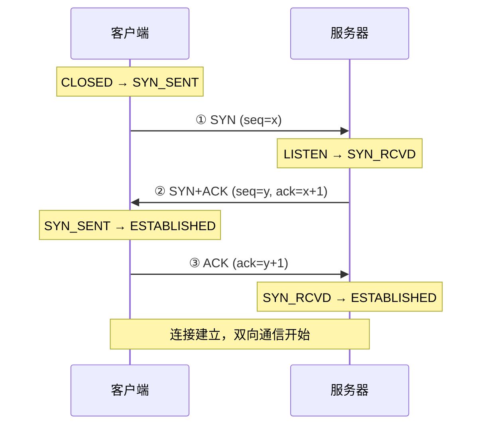
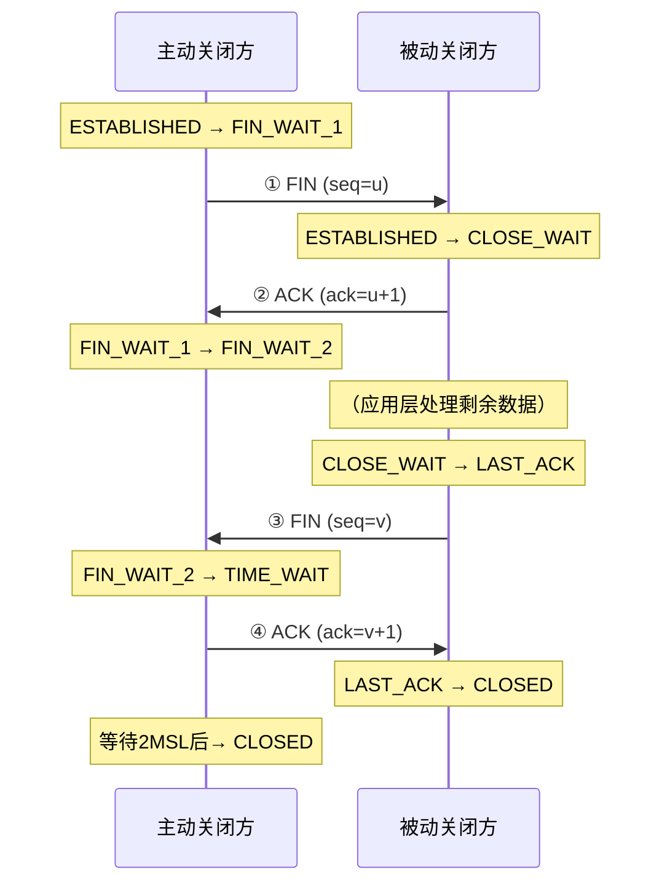
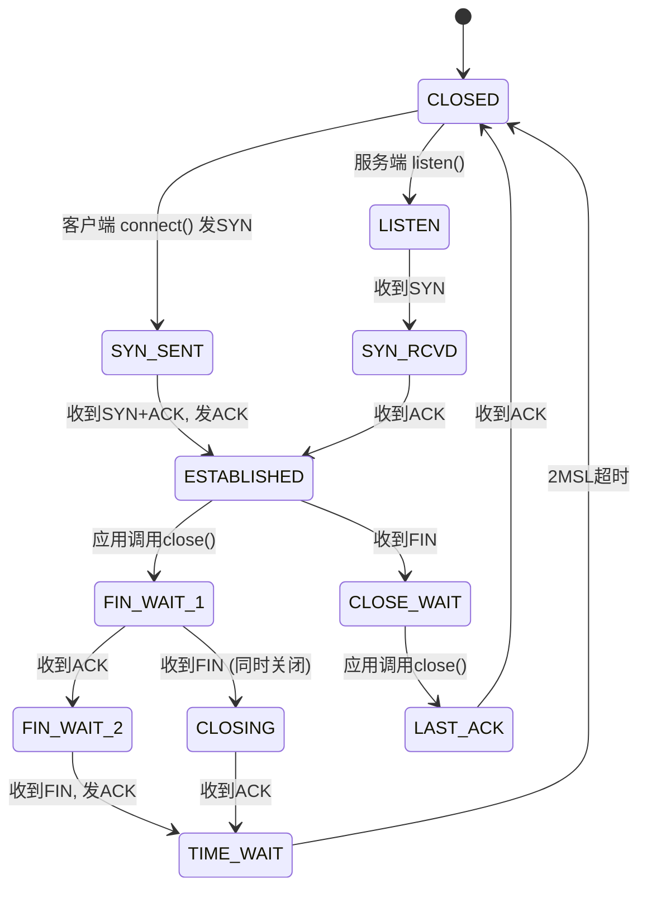
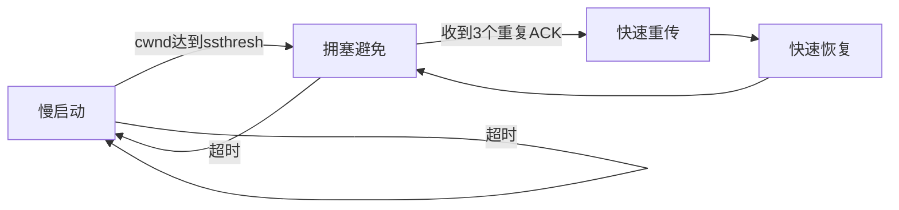
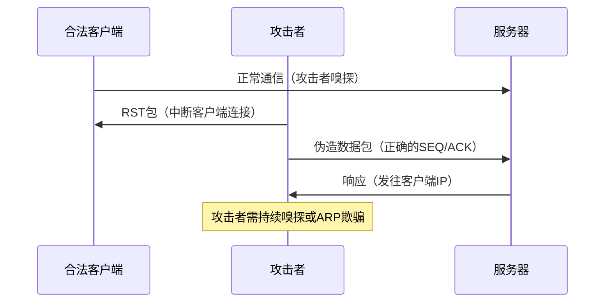
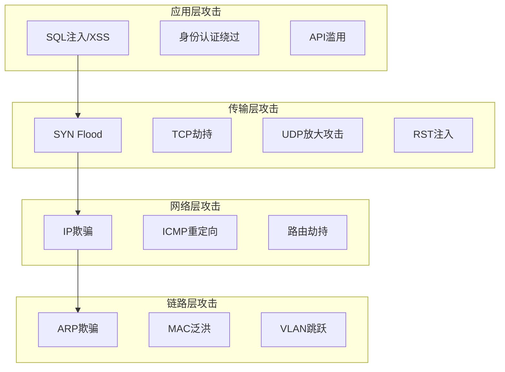

## 四、传输层核心协议

传输层是OSI模型第四层，负责端到端的通信管理。它为应用进程提供逻辑通信，屏蔽底层网络细节。对安全从业者而言，传输层是理解网络攻击、设计防御机制的关键层次——TCP/IP协议栈中大量经典攻击（SYN Flood、TCP劫持、UDP放大攻击）都发生在这一层。

本章从协议原理出发，逐步深入到协议机制的每个细节，最后落脚到安全攻防实战。

---

### 4.1 TCP协议详解

TCP（Transmission Control Protocol，传输控制协议）是互联网最重要的传输层协议，由RFC 793定义。它提供**可靠的、面向连接的、基于字节流**的服务。互联网上HTTP/HTTPS、SSH、FTP、SMTP等核心应用层协议都建立在TCP之上。

#### 4.1.1 TCP报文段结构

TCP报文段（Segment）由**头部**和**数据载荷**两部分组成。头部最小20字节，最大60字节（含可选项）。理解每个字段的含义是理解TCP攻击原理的基础。

```text
 0                   1                   2                   3
 0 1 2 3 4 5 6 7 8 9 0 1 2 3 4 5 6 7 8 9 0 1 2 3 4 5 6 7 8 9 0 1
+-+-+-+-+-+-+-+-+-+-+-+-+-+-+-+-+-+-+-+-+-+-+-+-+-+-+-+-+-+-+-+-+
|          Source Port          |       Destination Port        |
+-+-+-+-+-+-+-+-+-+-+-+-+-+-+-+-+-+-+-+-+-+-+-+-+-+-+-+-+-+-+-+-+
|                        Sequence Number                        |
+-+-+-+-+-+-+-+-+-+-+-+-+-+-+-+-+-+-+-+-+-+-+-+-+-+-+-+-+-+-+-+-+
|                    Acknowledgment Number                      |
+-+-+-+-+-+-+-+-+-+-+-+-+-+-+-+-+-+-+-+-+-+-+-+-+-+-+-+-+-+-+-+-+
|  Data |       |C|E|U|A|P|R|S|F|                               |
| Offset| Rsrvd |W|C|R|C|S|S|Y|I|            Window             |
|       |       |R|E|G|K|H|T|N|N|                               |
+-+-+-+-+-+-+-+-+-+-+-+-+-+-+-+-+-+-+-+-+-+-+-+-+-+-+-+-+-+-+-+-+
|           Checksum            |         Urgent Pointer        |
+-+-+-+-+-+-+-+-+-+-+-+-+-+-+-+-+-+-+-+-+-+-+-+-+-+-+-+-+-+-+-+-+
|                    Options (variable)                         |
+-+-+-+-+-+-+-+-+-+-+-+-+-+-+-+-+-+-+-+-+-+-+-+-+-+-+-+-+-+-+-+-+
|                             Data                              |
+-+-+-+-+-+-+-+-+-+-+-+-+-+-+-+-+-+-+-+-+-+-+-+-+-+-+-+-+-+-+-+-+
```

**各字段详解：**

| 字段 | 位数 | 安全含义 |
|------|------|----------|
| 源端口 | 16位 | 标识发送方进程，可被伪造用于IP欺骗 |
| 目的端口 | 16位 | 标识目标服务，端口扫描的核心目标 |
| 序列号（SEQ） | 32位 | 数据字节流的编号，TCP劫持攻击需要预测此值 |
| 确认号（ACK） | 32位 | 期望收到的下一字节编号，用于确认机制 |
| 数据偏移 | 4位 | 头部长度（以4字节为单位），最小5（即20字节） |
| 标志位（Flags） | 9位 | 控制连接状态转换，各类扫描攻击的核心 |
| 窗口大小 | 16位 | 接收缓冲区大小，用于流量控制 |
| 校验和 | 16位 | 覆盖头部+数据+伪头部，可被利用于端口扫描 |
| 紧急指针 | 16位 | URG标志置位时有效，指向紧急数据末尾 |
| 可选项 | 可变 | MSS、窗口缩放、SACK、时间戳等，影响性能和安全 |

**六个核心标志位的安全意义：**

- **SYN**（Synchronize）：发起连接请求。SYN Flood攻击的核心——大量伪造SYN包耗尽服务器半连接队列。
- **ACK**（Acknowledgment）：确认字段有效。ACK扫描利用此位探测防火墙规则。
- **FIN**（Finish）：请求关闭连接。FIN扫描利用防火墙对FIN包的处理差异进行隐蔽探测。
- **RST**（Reset）：强制重置连接。RST注入攻击可中断任意TCP连接。
- **PSH**（Push）：要求接收方立即将数据交付应用层，不等缓冲区满。
- **URG**（Urgent）：紧急数据标志，紧急指针字段有效。

#### 4.1.2 TCP三次握手

TCP使用三次握手（Three-Way Handshake）建立连接。这个过程不仅是协议基础知识，更是理解SYN Flood、TCP劫持等攻击的前提。



**详细过程：**

1. **第一次握手**：客户端发送SYN报文段，seq=x（x为客户端初始序列号，ISN，由系统随机生成）。此时客户端进入`SYN_SENT`状态。
2. **第二次握手**：服务器收到SYN后，回复SYN+ACK报文段，seq=y（服务器的ISN），ack=x+1。服务器进入`SYN_RCVD`状态。**同时**，服务器在半连接队列（SYN Queue / Half-Open Queue）中创建一个条目。
3. **第三次握手**：客户端收到SYN+ACK后，发送ACK报文段，ack=y+1。服务器收到后将条目从半连接队列移至全连接队列（Accept Queue），双方进入`ESTABLISHED`状态。

**为什么需要三次握手而不是两次？**

两次握手无法防止**历史重复连接**（Old Duplicate Connection）问题。如果网络中存在延迟的旧SYN包，服务器收到后立即建立连接（两次握手），但客户端并未发起此请求，导致服务器资源浪费。三次握手让服务器在收到第三次ACK后才确认连接，客户端有机会拒绝非法连接。

**安全相关细节：**

- **ISN生成算法**：早期系统使用递增ISN，攻击者可以轻松预测下一个序列号，实施TCP劫持攻击。现代系统使用基于加密的随机ISN生成算法（如Linux使用MD5哈希+时间+连接信息），使ISN不可预测。
- **半连接队列溢出**：每个SYN_RCVD状态的连接占用队列空间。SYN Flood通过大量伪造SYN填满此队列，使正常连接无法建立。
- **SYN Cookie**：防御SYN Flood的技术。服务器不在半连接队列中保存状态，而是将连接信息编码到SYN+ACK的序列号中。收到第三次ACK时解码验证，合法连接才分配资源。

#### 4.1.3 TCP四次挥手

TCP使用四次挥手（Four-Way Teardown）关闭连接。由于TCP是全双工的，每个方向需要单独关闭。



**详细过程：**

1. 主动关闭方发送FIN，表示"我没有数据要发了"，进入`FIN_WAIT_1`状态。
2. 被动关闭方收到FIN后回复ACK，进入`CLOSE_WAIT`状态。此时**被动关闭方仍可发送数据**（半关闭状态）。
3. 被动关闭方处理完剩余数据后，发送自己的FIN，进入`LAST_ACK`状态。
4. 主动关闭方收到FIN后回复ACK，进入`TIME_WAIT`状态，等待**2MSL**（Maximum Segment Lifetime，通常60秒）后才关闭。

**TIME_WAIT状态的必要性：**

- **确保最后的ACK到达**：如果最后一个ACK丢失，被动关闭方会重发FIN。TIME_WAIT状态保证主动关闭方能正确响应重发的FIN。
- **防止旧连接的延迟报文干扰新连接**：2MSL等待期确保属于旧连接的所有报文都在网络中消亡。

**TIME_WAIT过多的问题：**

在高并发服务器上，大量TIME_WAIT连接会占用文件描述符和内存。解决方案：
- 启用TCP连接复用（`SO_REUSEADDR`、`SO_REUSEPORT`）
- 调整内核参数缩短TIME_WAIT时间（`net.ipv4.tcp_tw_reuse`）
- 使用长连接（HTTP Keep-Alive）减少连接建立/关闭频率

**安全相关：**
- RST报文可以绕过正常的四次挥手，强制终止连接。攻击者通过注入RST包中断他人连接。
- 四次挥手中的ACK可以被嗅探，结合序列号预测实施连接劫持。

#### 4.1.4 TCP状态机

TCP连接的完整生命周期由一个有限状态机管理。理解状态机对于排查网络问题、检测异常连接、识别攻击行为至关重要。



**11种状态详解：**

| 状态 | 方向 | 含义 | 安全诊断价值 |
|------|------|------|-------------|
| `CLOSED` | - | 初始/终止状态，无连接 | 正常 |
| `LISTEN` | 服务端 | 等待客户端连接请求 | 确认服务正在监听 |
| `SYN_SENT` | 客户端 | 已发SYN，等待SYN+ACK | 大量SYN_SENT表明可能在进行端口扫描 |
| `SYN_RCVD` | 服务端 | 收到SYN，已发SYN+ACK | 大量SYN_RCVD = SYN Flood攻击的典型表现 |
| `ESTABLISHED` | 双方 | 连接已建立，可双向传输 | 异常的ESTABLISHED连接可能表示后门 |
| `FIN_WAIT_1` | 主动方 | 已发FIN，等待ACK | - |
| `FIN_WAIT_2` | 主动方 | 收到ACK，等待对方FIN | 大量FIN_WAIT_2 = 对端未正常关闭（应用层bug或攻击） |
| `CLOSE_WAIT` | 被动方 | 收到FIN，等待应用层close | 大量CLOSE_WAIT = 应用层未正确关闭连接（资源泄漏） |
| `CLOSING` | 双方 | 双方同时发起关闭 | 罕见，通常出现在特殊网络条件下 |
| `LAST_ACK` | 被动方 | 已发FIN，等待最后ACK | - |
| `TIME_WAIT` | 主动方 | 等待2MSL后关闭 | 大量TIME_WAIT = 高并发短连接场景 |

**用`netstat`/`ss`诊断连接状态：**

```bash
# 统计各状态的连接数量
ss -tan | awk '{print $1}' | sort | uniq -c | sort -rn

# 查看所有SYN_RCVD状态的连接（可能是SYN Flood）
ss -tan state syn-recv

# 查看所有CLOSE_WAIT状态的连接（应用层未正确关闭）
ss -tan state close-wait

# 查看所有ESTABLISHED连接中非本机发起的（排查后门）
ss -tan state established dst :22
```

#### 4.1.5 流量控制——滑动窗口

TCP使用**滑动窗口机制**（Sliding Window）实现流量控制，防止发送方发送过快导致接收方缓冲区溢出。

**工作原理：**

接收方通过TCP头部的**窗口大小字段**（Window Size）通告自己的可用缓冲区大小（接收窗口，rwnd）。发送方维护一个发送窗口，窗口内的数据可以无需等待确认就连续发送。窗口随着确认的到达而向前滑动。

```text
已确认  |  可发送（在窗口内）  |  不可发送（窗口外）
--------|---------------------|------------------
[已收ACK]  [已发送未ACK] [可发未发]   [超出窗口]
         |<-------- 发送窗口 -------->|
```

**窗口缩放选项（Window Scale）：**

原始TCP头部窗口字段只有16位，最大65535字节。对于高带宽-延迟积（BDP）的网络（如千兆广域网），64KB窗口远远不够。RFC 1323定义了窗口缩放选项，通过协商一个移位因子（0-14），将窗口大小扩展到最大 65535 × 2^14 = 1,073,725,440 字节（约1GB）。

```bash
# 查看当前系统窗口缩放设置
sysctl net.ipv4.tcp_window_scaling
cat /proc/sys/net/ipv4/tcp_window_scaling
```

**安全意义：**

- 窗口大小为0时，发送方进入**持续定时器**（Persist Timer）模式，定期发送窗口探测包。攻击者可以伪造零窗口通告冻结连接。
- 窗口缩放选项在三次握手时协商，中间人攻击如果篡改此选项可以降低连接性能。

#### 4.1.6 拥塞控制

流量控制解决的是发送方与接收方之间的速度匹配问题。但网络路径上还有路由器、交换机等中间节点，它们的缓冲区也可能溢出。**拥塞控制**（Congestion Control）解决的是发送方与网络之间的速度匹配问题。

TCP维护一个**拥塞窗口**（Congestion Window, cwnd），发送窗口 = min(cwnd, rwnd)。发送方根据网络状况动态调整cwnd。

**四个经典阶段（Reno算法）：**



1. **慢启动（Slow Start）**：cwnd从1个MSS开始，每收到一个ACK，cwnd增加1个MSS（指数增长：1→2→4→8→16...）。虽然叫"慢"启动，但增长速度很快。
2. **拥塞避免（Congestion Avoidance）**：当cwnd达到慢启动阈值（ssthresh）后，改为线性增长（每RTT增加1个MSS），避免激进发送导致拥塞。
3. **快速重传（Fast Retransmit）**：收到3个重复ACK时（说明某个包丢失但后续包已到达），立即重传丢失的包，不等超时定时器。
4. **快速恢复（Fast Recovery）**：快速重传后，ssthresh设为cwnd的一半，cwnd设为ssthresh + 3（直接进入拥塞避免阶段，不回到慢启动）。

**超时处理**：如果发生超时（而非重复ACK），ssthresh设为cwnd的一半，cwnd重置为1，重新进入慢启动。

**现代拥塞控制算法：**

| 算法 | 特点 | 适用场景 |
|------|------|----------|
| Reno | 经典算法，上述四阶段 | 通用 |
| CUBIC | Linux默认，三次函数增长 | 高带宽长延迟网络 |
| BBR | Google开发，基于带宽和RTT测量 | 高BDP网络，抗丢包能力强 |
| DCTCP | 数据中心专用，利用ECN标记 | 数据中心内部通信 |

```bash
# 查看/修改当前拥塞控制算法
sysctl net.ipv4.tcp_congestion_control
sysctl -w net.ipv4.tcp_congestion_control=bbr
```

**安全意义：**

- 攻击者通过伪造ECN标记或注入丢包信号可以降低目标连接的吞吐量。
- 拥塞控制机制被利用于**低速率拒绝服务攻击**（Low-Rate DoS）：以精确的周期性发送脉冲，触发TCP的拥塞退避机制，使受害者的连接始终处于低速率状态。

#### 4.1.7 TCP重要可选项

TCP头部可选项区域承载了多种扩展功能，对性能和安全都有重要影响。

| 选项 | 类型值 | 功能 | 安全相关性 |
|------|--------|------|-----------|
| MSS（最大段长度） | 2 | 协商每个TCP段的最大数据量 | 中间人篡改可降低性能 |
| 窗口缩放 | 3 | 扩展窗口大小到16位以上 | 握手阶段协商，不可中途更改 |
| SACK许可 | 4 | 允许选择性确认 | 攻击者可伪造SACK块干扰传输 |
| SACK | 5 | 报告非连续收到的数据块 | 增强丢包恢复，但增加头部开销 |
| 时间戳 | 8 | RTT测量+防序列号回绕 | PAWS机制防止旧报文干扰 |
| NOP | 1 | 用于4字节对齐填充 | 无 |
| EOL | 0 | 选项结束标记 | 无 |

**SACK（Selective Acknowledgment，选择性确认）：**

标准TCP确认是累积的——如果收到1、2、3、5、6号包（4号丢失），ACK只能确认到3。SACK允许接收方告知发送方"我已经收到了1、2、3、5、6"，发送方只需重传4号包，大幅提升丢包恢复效率。

**时间戳选项与PAWS：**

时间戳选项在每个TCP段中携带发送方时间戳和回显时间戳。除了用于精确RTT测量外，它还启用了**PAWS**（Protection Against Wrapped Sequences）机制——防止32位序列号在高速网络中回绕后，旧报文被误认为新报文。

#### 4.1.8 TCP攻击技术详解

**1. TCP序列号预测攻击（TCP Sequence Prediction Attack）**

攻击原理：如果攻击者能预测目标主机为新连接生成的ISN（初始序列号），就可以伪造TCP报文实施连接劫持。

攻击步骤：
1. 嗅探目标与可信主机之间的通信，记录当前序列号
2. 根据ISN生成算法预测下一个ISN
3. 向目标发送伪造的TCP段（源IP为可信主机，序列号为预测值）
4. 如果预测正确，目标接受伪造数据，攻击者成功注入

历史案例：1994年Kevin Mitnick利用TCP序列号预测入侵Tsutomu Shimomura的主机，成为经典攻击案例。当时SunOS的ISN生成算法过于简单（递增），容易预测。

防御措施：
- 使用加密的ISN生成算法（如Linux内核的`secure_tcp_sequence_number`）
- 使用IPsec或SSH等加密隧道保护TCP通信
- 启用TCP MD5签名选项（RFC 2385，主要用于BGP保护）

**2. SYN Flood攻击**

攻击原理：攻击者发送大量伪造源IP的SYN包，服务器为每个SYN分配资源（进入SYN_RCVD状态），半连接队列被耗尽，正常连接无法建立。

```bash
# 使用hping3模拟SYN Flood（仅用于授权测试）
hping3 -S --flood -p 80 --rand-source <target_ip>

# 使用nping（nmap套件）
nping --tcp -p 80 --flags SYN -c 10000 --rate 1000 <target_ip>
```

防御技术：

| 防御方法 | 原理 | 效果 |
|----------|------|------|
| SYN Cookie | 不保存半连接状态，信息编码到序列号 | 最有效，但丢失TCP选项信息 |
| SYN Cache | 限制半连接队列大小，优先保护已验证连接 | 部分有效 |
| 增大半连接队列 | 增加`net.ipv4.tcp_max_syn_backlog` | 治标不治本 |
| 缩短SYN_RCVD超时 | 快速清理无效半连接 | 有限效果 |
| 代理/CDN | 前端代理验证连接合法性 | 推荐方案 |

```bash
# 启用SYN Cookie
sysctl -w net.ipv4.tcp_syncookies=1

# 增大半连接队列
sysctl -w net.ipv4.tcp_max_syn_backlog=65535

# 增大全连接队列
sysctl -w net.core.somaxconn=65535
```

**3. TCP RST注入攻击**

攻击原理：攻击者向通信双方注入伪造的RST包，强制终止TCP连接。需要知道双方的IP、端口和当前序列号（在同一个局域网中容易嗅探到）。

应用场景：
- 中断他人的SSH连接
- 破坏VPN隧道
- 干扰文件传输

对抗措施：TCP MD5签名、IPsec加密、序列号随机化增大猜测难度。

**4. TCP会话劫持（Session Hijacking）**

攻击原理：结合序列号预测和RST注入，攻击者先中断合法客户端的连接，再冒充客户端与服务器继续通信。



**5. ACK Flood攻击**

攻击原理：大量发送ACK标志的TCP包。由于服务器需要在已建立的连接表中查找匹配的连接，找不到匹配的连接会消耗CPU资源。

**6. TCP端口扫描技术**

| 扫描类型 | 标志位 | 原理 | 特点 |
|----------|--------|------|------|
| TCP SYN扫描（半开放扫描） | SYN | 发SYN收到SYN+ACK=RST=端口关闭 | 快速，不完成握手，较隐蔽 |
| TCP Connect扫描 | 完成握手 | 调用connect()完成三次握手 | 简单，但会被日志记录 |
| TCP FIN扫描 | FIN | 发FIN，无响应=开放，RST=关闭 | 可绕过某些无状态防火墙 |
| TCP Xmas扫描 | FIN+PSH+URG | 同FIN扫描原理 | 更隐蔽，但部分系统行为不一致 |
| TCP Null扫描 | 无标志位 | 无标志位的TCP包 | 最隐蔽 |
| TCP ACK扫描 | ACK | 探测防火墙规则（有状态/无状态） | 不用于端口发现，用于防火墙探测 |
| TCP Window扫描 | ACK | 利用窗口大小差异区分端口状态 | 某些系统上可以区分开放/关闭 |
| TCP Idle扫描（僵尸扫描） | SYN | 利用僵尸主机的IPID递增特性 | 极隐蔽，攻击源为僵尸主机IP |

```bash
# Nmap端口扫描示例
nmap -sS -p 1-65535 <target>      # SYN扫描
nmap -sT -p 80,443 <target>        # Connect扫描
nmap -sF <target>                   # FIN扫描
nmap -sX <target>                   # Xmas扫描
nmap -sN <target>                   # Null扫描
nmap -sA <target>                   # ACK扫描（防火墙探测）
nmap -sI <zombie>:<port> <target>   # Idle扫描
```

---

### 4.2 UDP协议详解

UDP（User Datagram Protocol，用户数据报协议）由RFC 768定义，提供**无连接的、不可靠的数据报服务**。UDP不保证数据到达、不保证顺序、不进行拥塞控制——它只在IP之上添加了端口复用和校验和功能。

#### 4.2.1 UDP报文格式

UDP头部极其精简，只有**8字节**：

```text
 0                   1                   2                   3
 0 1 2 3 4 5 6 7 8 9 0 1 2 3 4 5 6 7 8 9 0 1 2 3 4 5 6 7 8 9 0 1
+-+-+-+-+-+-+-+-+-+-+-+-+-+-+-+-+-+-+-+-+-+-+-+-+-+-+-+-+-+-+-+-+
|          Source Port          |       Destination Port        |
+-+-+-+-+-+-+-+-+-+-+-+-+-+-+-+-+-+-+-+-+-+-+-+-+-+-+-+-+-+-+-+-+
|            Length             |           Checksum            |
+-+-+-+-+-+-+-+-+-+-+-+-+-+-+-+-+-+-+-+-+-+-+-+-+-+-+-+-+-+-+-+-+
|                             Data                              |
+-+-+-+-+-+-+-+-+-+-+-+-+-+-+-+-+-+-+-+-+-+-+-+-+-+-+-+-+-+-+-+-+
```

| 字段 | 位数 | 说明 |
|------|------|------|
| 源端口 | 16位 | 可选，不使用时填0 |
| 目的端口 | 16位 | 必填，标识目标进程 |
| 长度 | 16位 | UDP头部+数据的总长度，最小8 |
| 校验和 | 16位 | 覆盖头部+数据+伪头部（IPv4下可选） |

#### 4.2.2 TCP与UDP对比

| 特性 | TCP | UDP |
|------|-----|-----|
| 连接方式 | 面向连接（三次握手） | 无连接 |
| 可靠性 | 可靠（确认+重传+排序） | 不可靠 |
| 头部大小 | 20-60字节 | 8字节 |
| 流量控制 | 滑动窗口 | 无 |
| 拥塞控制 | 多种算法（Reno/CUBIC/BBR） | 无 |
| 传输模式 | 字节流 | 数据报 |
| 延迟 | 相对较高（握手+确认开销） | 低 |
| 典型应用 | HTTP/HTTPS、SSH、FTP、SMTP | DNS、DHCP、SNMP、VoIP、游戏、视频流 |
| 适用场景 | 需要可靠传输的场景 | 对延迟敏感、可容忍丢包的场景 |

#### 4.2.3 UDP攻击技术详解

**1. UDP Flood攻击**

攻击原理：向目标发送大量UDP数据报。目标收到后需要检查对应端口是否有服务监听，没有则返回ICMP端口不可达消息。大量UDP包消耗目标带宽和处理资源。

```bash
# hping3 UDP Flood示例（仅用于授权测试）
hping3 --udp --flood -p 53 --rand-source <target_ip>

# 使用nping
nping --udp -p 8080 -c 10000 --rate 500 <target_ip>
```

防御：
- 限制ICMP端口不可达消息的发送速率
- 使用防火墙丢弃发往未开放端口的UDP包
- 部署DDoS防护服务

**2. UDP放大攻击（Amplification Attack）**

攻击原理：利用UDP的无连接特性，攻击者伪造源IP（受害者的IP）向开放的UDP服务发送请求。由于响应通常远大于请求，流量被放大。攻击者用小量带宽产生大量攻击流量。

典型的放大攻击向量：

| 协议 | 放大倍数 | 端口 | 请求大小 | 响应大小 | 利用条件 |
|------|---------|------|---------|---------|---------|
| DNS | 28-54x | 53 | ~60字节 | ~3000字节 | 开放DNS解析器 |
| NTP | 556x | 123 | ~234字节 | ~48KB | 支持monlist命令的NTP服务器 |
| SSDP | 30x | 1900 | ~100字节 | ~3000字节 | UPnP设备 |
| Memcached | 51000x | 11211 | ~15字节 | ~750KB | 暴露在公网的Memcached |
| SNMP | 6x | 161 | ~60字节 | ~400字节 | 使用默认community string |
| Chargen | 358x | 19 | ~1字节 | ~512字节 | 开启Chargen服务的设备 |
| LDAP | 55-70x | 389 | ~50字节 | ~3500字节 | 开放LDAP服务 |
| CLDAP | 56-70x | 636 | ~50字节 | ~3500字节 | 开放的CLDAP服务 |


**Memcached放大攻击案例（2018年3月）：**

GitHub遭受史上最大规模DDoS攻击，峰值流量达**1.35 Tbps**。攻击者利用暴露在公网的Memcached服务器（端口11211）进行UDP放大攻击，放大倍数高达51000倍。攻击者仅需约27Mbps的带宽即可产生1.35Tbps的攻击流量。GitHub通过Akamai DDoS防护服务在10分钟内缓解了攻击。

**3. DNS放大攻击（DNS Amplification Attack）**

DNS放大攻击是最常见的UDP放大攻击类型。攻击者发送ANY类型的DNS查询（请求返回所有记录类型），使用伪造的源IP。

```bash
# 向开放DNS发送ANY查询（返回所有记录）
dig ANY isc.org @<open_dns_resolver> +bufsize=4096

# 典型的放大攻击查询（请求TXT记录通常响应更大）
dig TXT <large_domain> @<open_dns_resolver>
```

防御措施：
- DNS服务器禁用ANY查询（BIND: `disable-any-zone`）
- 限制递归查询只对授权客户端开放
- 启用DNS Response Rate Limiting（RRL）
- 网络入口实施BCP38/BCP84（源地址验证，防IP伪造）

**4. TCP vs UDP 安全特性对比**

| 安全维度 | TCP | UDP |
|----------|-----|-----|
| IP欺骗难度 | 较难（需预测ISN） | 容易（无需握手） |
| 放大攻击 | 不适用 | 高风险（多种放大向量） |
| 连接状态 | 有状态，可追踪 | 无状态，难以追踪 |
| 中间人攻击 | 需要会话劫持 | 更简单（无连接状态） |
| 流量分析 | 可通过握手/挥手模式识别 | 较难识别应用类型 |
| 防火墙过滤 | 有状态防火墙有效 | 无状态防火墙难以有效过滤 |

---

### 4.3 端口与服务详解

端口是传输层（TCP/UDP）标识应用进程的16位数字（0-65535）。IP地址标识主机，端口标识主机上的具体服务，二者结合（五元组：源IP、目的IP、源端口、目的端口、协议）唯一确定一条通信链路。

#### 4.3.1 端口分类

| 分类 | 范围 | 说明 | 示例 |
|------|------|------|------|
| 知名端口（Well-Known Ports） | 0-1023 | IANA分配给核心服务，Linux下需要root权限绑定 | HTTP(80)、HTTPS(443)、SSH(22)、FTP(21)、DNS(53)、SMTP(25) |
| 注册端口（Registered Ports） | 1024-49151 | IANA注册但不需要root权限 | MySQL(3306)、PostgreSQL(5432)、Redis(6379)、RDP(3389)、MongoDB(27017) |
| 动态端口（Dynamic Ports） | 49152-65535 | 客户端临时使用，由操作系统自动分配 | 任意客户端连接 |

#### 4.3.2 安全关键端口速查表

| 端口 | 协议 | 服务 | 安全风险 |
|------|------|------|----------|
| 21 | TCP | FTP | 明文传输密码，匿名登录风险，bounce攻击 |
| 22 | TCP | SSH | 暴力破解，弱密钥攻击，版本漏洞 |
| 23 | TCP | Telnet | 完全明文，已被SSH替代，不应暴露 |
| 25 | TCP | SMTP | 开放中继（Open Relay）被利用发送垃圾邮件 |
| 53 | TCP/UDP | DNS | DNS缓存投毒、DNS放大攻击、DNS隧道 |
| 80 | TCP | HTTP | 明文传输，中间人攻击，Web漏洞（SQLi/XSS等） |
| 110 | TCP | POP3 | 明文认证，应使用POP3S(995) |
| 135 | TCP | MSRPC | Windows RPC，永恒之蓝（EternalBlue）相关 |
| 139/445 | TCP | SMB | Windows文件共享，SMB漏洞（WannaCry利用） |
| 143 | TCP | IMAP | 明文认证，应使用IMAPS(993) |
| 161 | UDP | SNMP | 默认community string（public/private），信息泄露 |
| 389 | TCP | LDAP | LDAP注入，匿名绑定 |
| 443 | TCP | HTTPS | SSL/TLS漏洞（Heartbleed、POODLE等） |
| 1433 | TCP | MSSQL | 数据库暴露，SA弱密码 |
| 1521 | TCP | Oracle | 数据库暴露，默认SID |
| 3306 | TCP | MySQL | 数据库暴露，root弱密码 |
| 3389 | TCP | RDP | BlueKeep漏洞（CVE-2019-0708），暴力破解 |
| 5432 | TCP | PostgreSQL | 数据库暴露，pg_hba.conf配置不当 |
| 5900 | TCP | VNC | 弱认证，VNC密码破解 |
| 6379 | TCP | Redis | 默认无认证，可写入WebShell或SSH公钥 |
| 8080 | TCP | HTTP代理/Web | 常见管理界面，Tomcat/应用服务器 |
| 8443 | TCP | HTTPS | 替代HTTPS端口，管理界面 |
| 9200 | TCP | Elasticsearch | 默认无认证，数据泄露 |
| 27017 | TCP | MongoDB | 默认无认证，数据泄露（2016-2017年大规模事件） |

#### 4.3.3 端口扫描技术与工具

端口扫描是渗透测试信息收集阶段的核心技术。通过扫描目标开放的端口，可以推断运行的服务版本、操作系统类型和潜在攻击面。

**Nmap——端口扫描的瑞士军刀**

```bash
# TCP SYN扫描（半开放扫描，最常用，需root权限）
nmap -sS -p- <target>

# TCP Connect扫描（完整三次握手，不需要root）
nmap -sT -p 1-1000 <target>

# UDP扫描（慢，需root权限）
nmap -sU -p 53,161,162,500,514,1900 <target>

# 服务版本探测
nmap -sV -p 22,80,443 <target>

# 操作系统探测
nmap -O <target>

# 综合扫描（版本+OS+脚本+traceroute）
nmap -A -p 1-1000 <target>

# 快速扫描常用端口
nmap --top-ports 1000 <target>

# 自定义速率（每秒1000个包）
nmap -sS -p- --min-rate 1000 <target>

# 排除主机
nmap -sS 192.168.1.0/24 --exclude 192.168.1.1,192.168.1.2

# 输出到文件（三种格式）
nmap -sS -oA scan_results <target>
# 生成 scan_results.nmap, scan_results.xml, scan_results.gnmap
```

**Masscan——最快的端口扫描器**

Masscan使用自定义TCP/IP栈，可以在6分钟内扫描整个互联网的单个端口。

```bash
# 扫描80端口（每秒10万个包）
masscan 192.168.0.0/16 -p 80 --rate 100000

# 扫描多端口
masscan 10.0.0.0/8 -p 22,80,443,3389 --rate 50000

# 输出到文件
masscan 192.168.0.0/16 -p 1-65535 --rate 100000 -oJ scan.json
```

**其他扫描工具：**

| 工具 | 特点 | 适用场景 |
|------|------|----------|
| Nmap | 功能最全面，NSE脚本引擎 | 通用渗透测试 |
| Masscan | 速度最快，自定义TCP栈 | 大规模网络扫描 |
| Zmap | 互联网级别扫描 | 学术研究/大规模扫描 |
| Rustscan | Rust实现，自动调用Nmap | 快速扫描+Nmap深度探测 |
| Unicornscan | 异步扫描 | 高性能扫描 |
| Netcat（nc） | 网络瑞士军刀 | 手动端口探测/简易扫描 |

```bash
# Netcat端口扫描
nc -zv <target> 1-1000              # TCP扫描
nc -zuv <target> 53 161 162          # UDP扫描

# 使用Bash内置功能做简易端口扫描
for port in 22 80 443 3306 8080; do
    (echo >/dev/tcp/<target>/$port) 2>/dev/null && echo "Port $port: OPEN"
done
```

#### 4.3.4 服务指纹识别

仅知道端口开放不够，还需要识别运行的具体服务和版本。这对后续漏洞利用至关重要。

**Nmap服务探测原理：**

Nmap向开放端口发送一系列探测包，根据响应的细微差异（TCP窗口大小、TCP选项顺序、初始TTL、服务Banner等）与`nmap-service-probes`数据库匹配，识别服务类型和版本。

```bash
# 详细服务版本探测
nmap -sV --version-intensity 9 <target>

# 轻量级Banner抓取
nmap -sV --version-intensity 0 <target>

# 手动Banner抓取
nc <target> 80
GET / HTTP/1.0\r\n\r\n
```

**操作系统指纹识别：**

不同操作系统的TCP/IP协议栈实现存在细微差异（如初始窗口大小、TCP选项排列、DF标志、初始TTL等），这些差异构成操作系统的"指纹"。

```bash
# Nmap OS探测
nmap -O --osscan-guess <target>

# p0f被动操作系统识别（不发送任何包）
sudo p0f -i eth0
```

#### 4.3.5 防御端口扫描

1. **关闭不必要的服务和端口**：最小化攻击面是最基本的防御。
2. **防火墙规则**：
   ```bash
   # iptables限速：限制SYN包速率
   iptables -A INPUT -p tcp --syn -m limit --limit 10/s --limit-burst 30 -j ACCEPT
   iptables -A INPUT -p tcp --syn -j DROP

   # 丢弃发往未开放端口的包（不返回RST，增加扫描者时间成本）
   iptables -A INPUT -p tcp --dport 1-65535 -j DROP
   ```
3. **端口敲门（Port Knocking）**：服务端口默认关闭，客户端按特定顺序访问一系列"敲门"端口后，防火墙规则动态开放目标端口。
4. **Fail2Ban**：自动检测并封锁频繁扫描的IP。
5. **IDS/IPS**：使用Suricata/Snort检测端口扫描模式。

```bash
# Fail2Ban配置（封禁频繁扫描的IP）
# /etc/fail2ban/jail.local
[portscan]
enabled = true
filter = portscan
action = iptables-allports[name=portscan]
logpath = /var/log/syslog
maxretry = 5
findtime = 300
bantime = 3600
```

---

### 4.4 SCTP协议简介

SCTP（Stream Control Transmission Protocol，流控制传输协议，RFC 4960）是一种相对较新的传输层协议，结合了TCP和UDP的优点。

**核心特性：**
- **多宿主（Multi-homing）**：一个SCTP关联（Association）可以绑定多个IP地址，提供路径冗余。
- **多流（Multi-streaming）**：关联内可以有多个独立的流（Stream），某个流的阻塞不影响其他流。
- **四次握手**：使用COOKIE机制防止SYN Flood类型的攻击。
- **消息边界**：保留消息边界（不像TCP的字节流）。

**安全相关：**
- SCTP的四次握手天然免疫SYN Flood攻击（在COOKIE验证完成前不分配资源）。
- SCTP在电信领域广泛使用（SS7/SIGTRAN协议栈），针对SCTP的攻击可能影响电话网络基础设施。

```bash
# Linux查看SCTP关联
ss -snp

# Nmap SCTP扫描
nmap -sY -p 80,443 <target>    # SCTP INIT扫描
nmap -sZ -p 80,443 <target>    # SCTP COOKIE-ECHO扫描
```

---

### 4.5 传输层安全加固最佳实践

#### 4.5.1 内核参数调优

```bash
# /etc/sysctl.conf 或 /etc/sysctl.d/99-security.conf

# 启用SYN Cookie（防SYN Flood）
net.ipv4.tcp_syncookies = 1

# 增大半连接队列
net.ipv4.tcp_max_syn_backlog = 65535

# 增大全连接队列
net.core.somaxconn = 65535

# 启用TCP窗口缩放
net.ipv4.tcp_window_scaling = 1

# 启用SACK
net.ipv4.tcp_sack = 1

# 启用时间戳
net.ipv4.tcp_timestamps = 1

# 启用窗口缩放
net.ipv4.tcp_window_scaling = 1

# TIME_WAIT复用
net.ipv4.tcp_tw_reuse = 1

# 增大本地端口范围
net.ipv4.ip_local_port_range = 1024 65535

# 禁止ICMP重定向（防止中间人攻击）
net.ipv4.conf.all.accept_redirects = 0
net.ipv4.conf.default.accept_redirects = 0

# 启用反向路径过滤（防IP欺骗）
net.ipv4.conf.all.rp_filter = 1
net.ipv4.conf.default.rp_filter = 1

# 忽略ICMP广播请求
net.ipv4.icmp_echo_ignore_broadcasts = 1

# 记录不可能的地址包
net.ipv4.conf.all.log_martians = 1
```

```bash
# 应用配置
sysctl -p
```

#### 4.5.2 防火墙传输层规则

```bash
# iptables 基本传输层防护规则集

# 允许已建立的连接
iptables -A INPUT -m state --state ESTABLISHED,RELATED -j ACCEPT

# 允许loopback
iptables -A INPUT -i lo -j ACCEPT

# 允许SSH（限速）
iptables -A INPUT -p tcp --dport 22 -m state --state NEW -m recent --set --name SSH
iptables -A INPUT -p tcp --dport 22 -m state --state NEW -m recent --update --seconds 60 --hitcount 4 --name SSH -j DROP
iptables -A INPUT -p tcp --dport 22 -m state --state NEW -j ACCEPT

# 允许HTTP/HTTPS
iptables -A INPUT -p tcp --dport 80 -j ACCEPT
iptables -A INPUT -p tcp --dport 443 -j ACCEPT

# 丢弃无效包
iptables -A INPUT -m state --state INVALID -j DROP

# 防SYN Flood
iptables -A INPUT -p tcp --syn -m limit --limit 1/s --limit-burst 3 -j ACCEPT

# 记录并丢弃其他所有入站流量
iptables -A INPUT -j LOG --log-prefix "DROPPED: "
iptables -A INPUT -j DROP
```

#### 4.5.3 传输层加密

| 技术 | 作用 | 适用场景 |
|------|------|----------|
| TLS/SSL | 加密应用层数据（在TCP之上） | Web、邮件、数据库连接 |
| IPsec | 网络层加密，保护所有传输层流量 | VPN、站点互联 |
| WireGuard | 现代VPN协议，内核级加密 | 远程访问、站点互联 |
| TCP MD5 | TCP头部签名（RFC 2385） | BGP对等体保护 |
| TCP AO | TCP认证选项（RFC 5925），MD5的升级版 | BGP等关键协议保护 |
| SSH隧道 | TCP端口转发加密 | 加密任意TCP连接 |

---

### 4.6 常见误区与陷阱

| 误区 | 正确认知 |
|------|----------|
| "UDP不可靠所以不安全" | UDP本身不保证可靠性，但可以通过应用层（如QUIC/DTLS）实现可靠传输和加密。QUIC就是基于UDP的可靠加密传输协议。 |
| "TCP三次握手保证安全" | 三次握手只保证连接建立的可靠性，不提供任何认证或加密。攻击者可以伪造握手过程。 |
| "关闭端口就安全了" | 关闭端口只是第一步。服务可能绑定在非标准端口上；即使端口关闭，防火墙规则配置不当仍可能暴露信息。 |
| "防火墙可以阻止所有传输层攻击" | 有状态防火墙能阻止大部分攻击，但无法防御IP欺骗（如果允许该IP段）、应用层攻击、或内部发起的攻击。 |
| "SYN Cookie没有缺点" | SYN Cookie在SYN+ACK中编码连接信息，导致TCP选项（MSS、窗口缩放、SACK等）无法在握手阶段协商，可能降低连接性能。 |
| "UDP放大攻击只能用大带宽防御" | 根本防御是消除放大源——关闭不必要的UDP服务、实施源地址验证（BCP38）。CDN/DDoS防护是最后的兜底手段。 |
| "端口扫描一定是恶意行为" | 端口扫描是合法的网络诊断工具，也是渗透测试的必要步骤。关键在于是否获得授权。 |

---

### 4.7 进阶主题

#### 4.7.1 QUIC协议——下一代传输层

QUIC（Quick UDP Internet Connections）由Google开发，现由IETF标准化为RFC 9000。它基于UDP构建，但提供了TCP级别的可靠性，同时解决了TCP的队头阻塞问题。

**核心优势：**
- **0-RTT连接建立**：首次连接1-RTT，后续连接0-RTT（TCP+TLS需要2-3-RTT）。
- **多路复用无队头阻塞**：一个连接内多个流互不影响（TCP的队头阻塞：一个包丢失阻塞所有数据）。
- **连接迁移**：基于Connection ID而非IP+端口，网络切换（如WiFi→4G）不断连。
- **内置TLS 1.3**：所有数据默认加密。

**安全意义：**
- QUIC默认加密使网络层中间人设备无法检查或篡改传输层内容。
- 防火墙和IDS/IPS需要升级才能处理QUIC流量。
- 0-RTT模式可能遭受重放攻击（应用层需要防御）。

```bash
# curl支持QUIC
curl --http3 https://www.google.com

# 查看网站是否支持QUIC
nghttp3 -n https://www.google.com
```

#### 4.7.2 TCP/IP协议栈的分层安全模型



传输层安全不是一个孤立的问题。攻击者通常结合多个层次的攻击技术：
- ARP欺骗（链路层）+ TCP序列号嗅探（传输层）= 完整的中间人攻击
- IP欺骗（网络层）+ SYN Flood（传输层）= 分布式拒绝服务攻击
- DNS隧道（传输层/应用层）+ ICMP隧道 = 数据外泄隐蔽通道

#### 4.7.3 传输层协议安全研究方向

| 研究方向 | 说明 |
|----------|------|
| TCP侧信道攻击 | 利用TCP协议栈的信息泄露（如时间序列、窗口大小）推断加密连接的内容 |
| 网络拥塞攻击 | 精确控制拥塞信号干扰目标连接性能 |
| 协议混淆 | 将一种协议伪装成另一种协议（如将Tor流量伪装成HTTP） |
| 传输层指纹识别 | 通过TCP/IP栈指纹远程识别操作系统和设备类型 |
| 5G传输层安全 | 新一代移动网络中SCTP/GTP-U协议的安全分析 |

---

### 4.8 实验与实践

#### 实验1：TCP三次握手抓包分析

```bash
# 使用tcpdump捕获三次握手
sudo tcpdump -i eth0 -nn host <target> and port 80 -w handshake.pcap

# 在另一个终端发起连接
curl http://<target>/index.html

# 使用tshark分析
tshark -r handshake.pcap -Y "tcp.flags.syn==1 || tcp.flags.fin==1" -T fields -e frame.time_relative -e ip.src -e ip.dst -e tcp.srcport -e tcp.dstport -e tcp.flags
```

#### 实验2：端口扫描检测

```bash
# 在目标机器上监控SYN_RCVD状态（检测SYN扫描）
watch -n 1 'ss -tan state syn-recv | wc -l'

# 使用iptables日志记录端口扫描
iptables -A INPUT -p tcp --tcp-flags ALL NONE -j LOG --log-prefix "NULL_SCAN: "
iptables -A INPUT -p tcp --tcp-flags ALL ALL -j LOG --log-prefix "XMAS_SCAN: "
iptables -A INPUT -p tcp --tcp-flags ALL FIN -j LOG --log-prefix "FIN_SCAN: "
```

#### 实验3：UDP放大攻击验证（授权环境）

```bash
# 在隔离环境中搭建DNS放大测试
# 攻击端（使用伪造源IP）
hping3 --udp -p 53 -a <victim_ip> --flood <dns_server>

# 观察受害者机器收到的流量
tcpdump -i eth0 udp port 53 -nn
```

---

### 4.9 本章小结

传输层是网络通信的核心枢纽，也是网络攻击的重要目标。本章系统覆盖了：

- **TCP协议**：从报文结构、握手挥手、状态机、流量控制、拥塞控制到TCP选项，完整呈现了TCP协议的设计与实现细节。在此基础上，深入分析了序列号预测、SYN Flood、RST注入、会话劫持等攻击技术及其防御措施。
- **UDP协议**：理解其精简设计的哲学，以及由此带来的安全风险——UDP放大攻击是当今DDoS攻击的主要形式。
- **端口与服务**：掌握端口分类、关键端口安全风险、端口扫描技术（Nmap、Masscan等）和防御策略。
- **SCTP协议**：了解新一代传输层协议的安全特性。
- **进阶主题**：QUIC协议、多层安全模型、前沿研究方向。

安全从业者需要同时掌握"如何利用"和"如何防御"传输层的特性。理解协议的每一个细节，才能在攻防对抗中占据主动。
