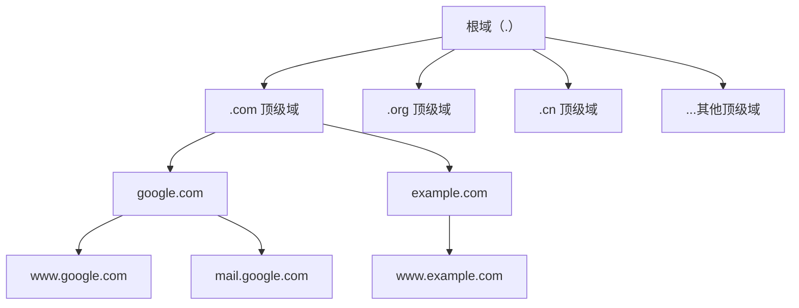
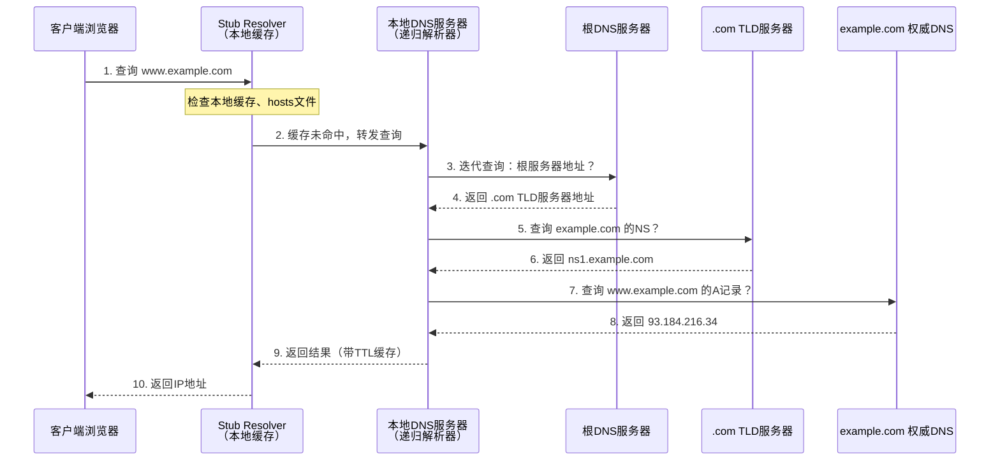
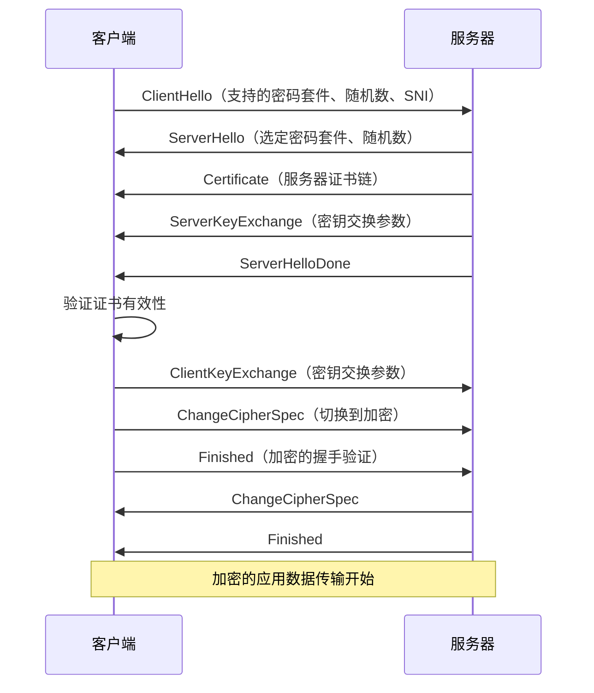
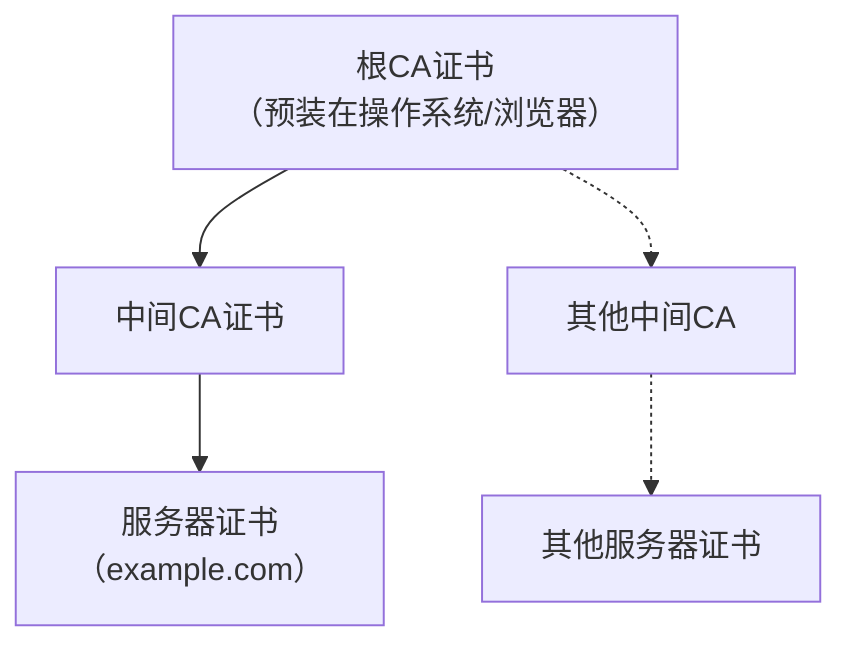
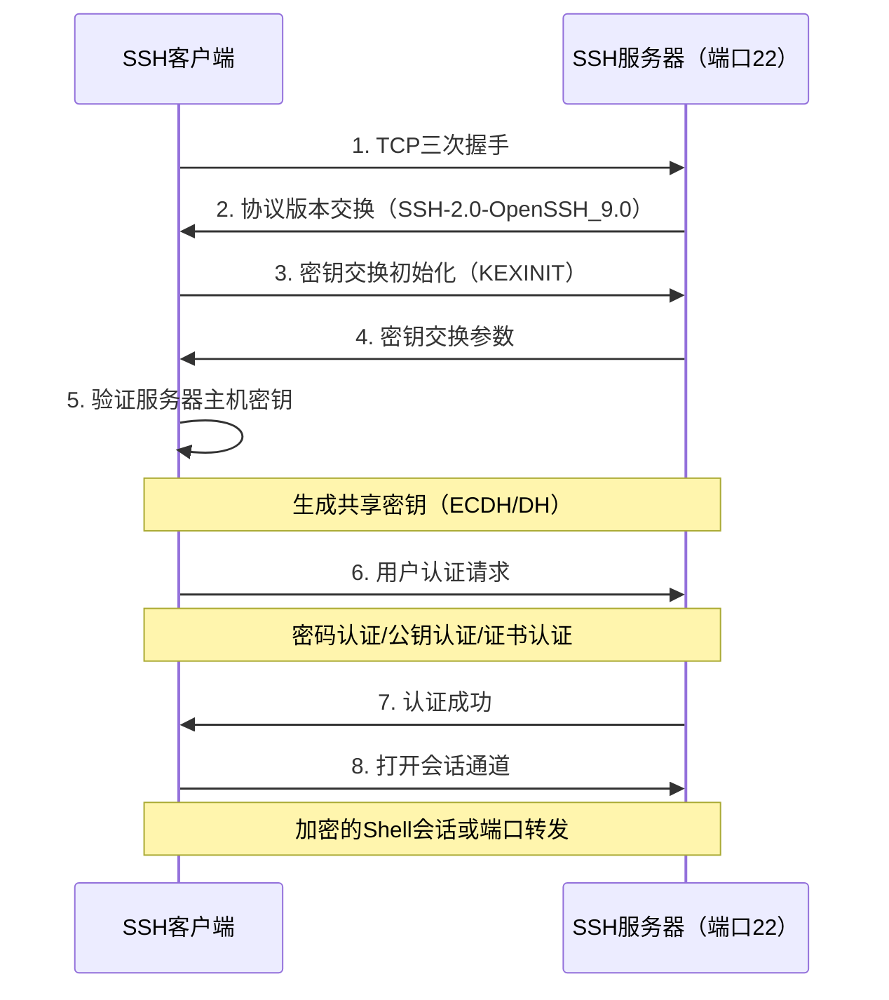
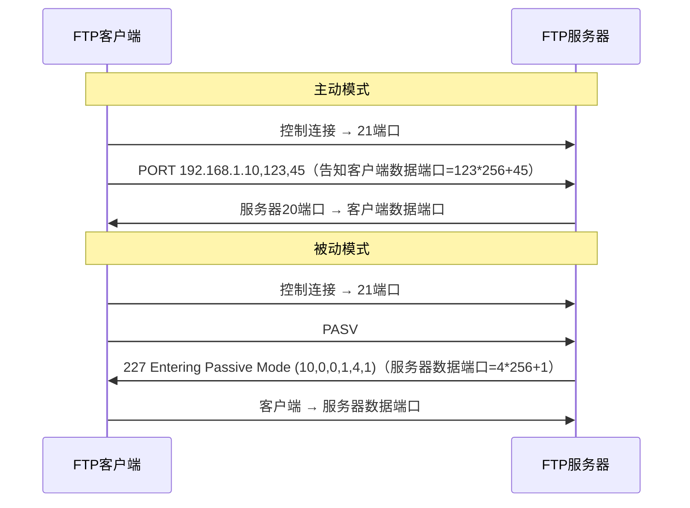
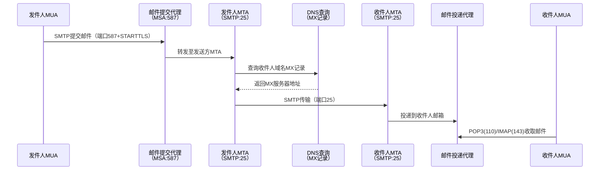
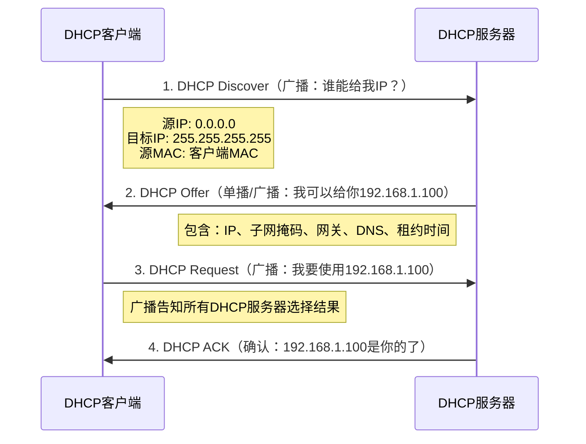

## 五、应用层核心协议

应用层是OSI模型的第七层，也是与用户和应用程序直接交互的一层。理解应用层协议的运作机制，不仅是网络编程和系统管理的基础，更是网络安全攻防的核心战场——绝大多数网络攻击（SQL注入、XSS、SSRF、中间人攻击等）都发生在应用层。本章从安全攻防视角，深入剖析每一种核心协议的工作原理、攻击面和防御策略。

### 5.1 DNS协议——互联网的"电话簿"

#### 5.1.1 DNS基础架构

DNS（Domain Name System，域名系统）是一个分布式的、层次化的命名系统，负责将人类可读的域名（如 `www.example.com`）解析为机器可寻址的IP地址（如 `93.184.216.34`）。DNS诞生于1983年（RFC 1034/1035），如今已演变为互联网最关键的基础设施之一。

**DNS层次结构：**



DNS的层次结构由四层组成：

| 层级 | 名称 | 示例 | 管理机构 |
|------|------|------|----------|
| 第0层 | 根域（Root） | `.`（隐含） | ICANN / 13组根服务器 |
| 第1层 | 顶级域（TLD） | `.com`、`.org`、`.cn` | Verisign、CNNIC等注册局 |
| 第2层 | 二级域（SLD） | `example.com` | 域名注册人 |
| 第3层 | 子域（Subdomain） | `www.example.com` | 域名所有者 |

全球13组根服务器（A至M）通过任播（Anycast）技术在全球部署了上千个实例，确保DNS根区的高可用性。

#### 5.1.2 DNS记录类型

DNS不仅解析IP地址，还存储多种类型的资源记录（Resource Record）：

| 记录类型 | 含义 | 典型用途 | 示例 |
|----------|------|----------|------|
| A | IPv4地址 | 域名→IPv4 | `example.com → 93.184.216.34` |
| AAAA | IPv6地址 | 域名→IPv6 | `example.com → 2606:2800:220:1:...` |
| CNAME | 别名 | 域名→另一个域名 | `www.example.com → example.com` |
| MX | 邮件交换 | 指定邮件服务器 | `example.com → mail.example.com (优先级10)` |
| NS | 域名服务器 | 指定权威DNS | `example.com → ns1.example.com` |
| TXT | 文本记录 | SPF/DKIM/DMARC验证 | `v=spf1 include:_spf.google.com ~all` |
| SOA | 起始授权 | 区域管理信息 | 序列号、刷新间隔、重试间隔等 |
| PTR | 反向DNS | IP→域名 | `34.216.184.93.in-addr.arpa → example.com` |
| SRV | 服务记录 | 服务发现 | `_sip._tcp.example.com → sipserver.example.com:5060` |
| CAA | 证书颁发授权 | 限制CA签发证书 | `0 issue "letsencrypt.org"` |

对于安全从业者而言，TXT记录尤为重要——它不仅用于SPF/DKIM邮件认证，还常被用作域名所有权验证、密钥分发等用途。

#### 5.1.3 DNS查询全流程

DNS查询采用递归与迭代相结合的模式：



**关键概念详解：**

- **递归查询（Recursive）**：客户端向本地DNS服务器发出的查询，要求服务器必须给出最终答案（或错误），客户端只发一次请求。
- **迭代查询（Iterative）**：本地DNS服务器与各级DNS服务器之间的查询，每一步只返回"下一步该问谁"，由本地DNS服务器逐级追踪。
- **TTL（Time To Live）**：每条DNS记录都有TTL值（单位秒），指示缓存有效期。典型的TTL值从300秒（5分钟）到86400秒（24小时）不等。

#### 5.1.4 DNS安全攻防

DNS协议设计之初未考虑安全性，因此存在大量攻击面：

**DNS缓存投毒（Cache Poisoning）**

攻击者向DNS缓存服务器注入伪造的DNS记录，使后续查询返回攻击者控制的IP地址。经典的Kaminsky攻击（2008年）利用事务ID（Transaction ID）仅16位的弱点，在合法响应到达前抢先注入伪造响应。

攻击流程：
1. 攻击者向目标DNS解析器发送对 `www.example.com` 的查询
2. 在解析器等待权威服务器响应的同时，攻击者发送大量伪造响应
3. 伪造响应包含正确的事务ID和伪造的IP地址
4. 如果伪造响应先到达且事务ID匹配，解析器将缓存错误记录

防御措施：
- **DNSSEC（DNS Security Extensions）**：通过数字签名验证DNS响应的真实性和完整性。DNSSEC引入四种新记录类型：RRSIG（签名）、DNSKEY（公钥）、DS（委托签名人）、NSEC/NSEC3（认证不存在）。
- 随机化源端口和事务ID
- 使用DNS over HTTPS（DoH）或DNS over TLS（DoT）加密DNS查询

**DNS劫持（DNS Hijacking）**

攻击者篡改DNS配置，使域名解析到恶意服务器：
- **本地劫持**：修改受害者hosts文件或DNS服务器配置
- **路由器劫持**：入侵路由器管理界面，修改DNS设置
- **运营商劫持**：ISP层面的DNS劫持（在某些地区常见）
- **注册商劫持**：攻击者入侵域名注册商账户，修改NS记录

**DNS隧道（DNS Tunneling）**

将非DNS流量封装在DNS查询和响应中，用于绕过防火墙或数据外泄：

```bash
# 使用iodine建立DNS隧道
# 服务端
iodined -f 10.0.0.1 tunnel.example.com
# 客户端
iodined -f 10.0.0.2 tunnel.example.com

# 使用dnscat2进行隐蔽通信
# 服务端
dnscat2-server tunnel.example.com
# 客户端
dnscat2-client tunnel.example.com
```

DNS隧道的检测方法：
- 监控DNS查询频率异常（正常用户不会每秒发送数十个DNS查询）
- 检查TXT记录查询比例（DNS隧道通常大量使用TXT记录）
- 分析子域名长度和熵值（编码后的数据产生长且随机的子域名）
- 使用Zeek/Suricata等IDS的DNS分析模块

**DNS放大攻击（DNS Amplification Attack）**

一种DDoS攻击方式，利用开放的DNS递归解析器将小请求放大为大响应：
1. 攻击者伪造源IP为受害者IP
2. 向开放DNS解析器发送小型查询（如 `ANY` 查询）
3. DNS解析器将远大于请求的响应发送给受害者

放大倍数取决于查询类型，`ANY` 查询的放大倍数可达28-54倍。

防御：禁用开放递归、实施BCP38/BCP84（源地址验证）、使用RRL（Response Rate Limiting）。

**DNS区域传送（Zone Transfer）**

DNS区域传送（AXFR/IXFR）是主从DNS服务器之间同步数据的合法机制，但如果配置不当，任何人都可以获取区域内的完整域名列表：

```bash
# 测试区域传送是否开放
dig axfr example.com @ns1.example.com
# 使用host命令
host -t axfr example.com ns1.example.com
# 使用fierce进行子域名枚举
fierce -dns example.com
```

防御：限制区域传送仅允许授权的从服务器IP地址。

**子域名枚举（Subdomain Enumeration）**

安全测试中的关键步骤，发现目标的全部攻击面：

```bash
# 被动枚举：查询公开数据源
# 1. Certificate Transparency日志
curl -s "https://crt.sh/?q=%25.example.com&output=json" | jq -r '.[].name_value' | sort -u

# 2. 使用subfinder（被动枚举工具）
subfinder -d example.com -o subdomains.txt

# 3. 使用amass（综合枚举）
amass enum -d example.com -o amass_results.txt

# 主动枚举：字典爆破
# 使用gobuster
gobuster dns -d example.com -w /usr/share/wordlists/subdomains.txt -t 50

# 使用dnsx验证存活
cat subdomains.txt | dnsx -silent -a -resp
```

#### 5.1.5 DNS安全加固清单

| 加固项 | 措施 | 重要性 |
|--------|------|--------|
| 启用DNSSEC | 为区域签名并配置信任链 | 高 |
| 禁用开放递归 | 仅对授权客户端提供递归服务 | 高 |
| 限制区域传送 | 仅允许指定从服务器IP | 高 |
| 启用DoH/DoT | 加密客户端到解析器的查询 | 中 |
| 配置RRL | 限制响应速率防放大攻击 | 中 |
| 日志审计 | 记录所有DNS查询用于威胁检测 | 中 |
| 最小化公开记录 | 减少不必要的TXT/SPF信息泄露 | 低 |

---

### 5.2 HTTP/HTTPS协议——Web安全的主战场

#### 5.2.1 HTTP协议基础

HTTP（HyperText Transfer Protocol，超文本传输协议）是Web的基础协议，基于请求-响应模型运作。当前主流版本为HTTP/1.1（RFC 7230-7235），最新版本为HTTP/3（基于QUIC协议）。

**HTTP请求报文结构：**

```http
GET /index.html HTTP/1.1
Host: www.example.com
User-Agent: Mozilla/5.0 (Windows NT 10.0; Win64; x64)
Accept: text/html,application/xhtml+xml
Accept-Language: zh-CN,zh;q=0.9,en;q=0.8
Accept-Encoding: gzip, deflate, br
Connection: keep-alive
Cookie: session_id=abc123; theme=dark
```

**HTTP响应报文结构：**

```http
HTTP/1.1 200 OK
Date: Thu, 25 Jun 2026 12:00:00 GMT
Content-Type: text/html; charset=UTF-8
Content-Length: 1234
Server: nginx/1.24.0
Set-Cookie: session_id=abc123; HttpOnly; Secure; SameSite=Strict
X-Content-Type-Options: nosniff
X-Frame-Options: DENY
Strict-Transport-Security: max-age=31536000; includeSubDomains
Cache-Control: no-store

<!DOCTYPE html>
<html>...
```

**HTTP请求方法：**

| 方法 | 语义 | 安全性 | 幂等性 | 典型用途 |
|------|------|--------|--------|----------|
| GET | 获取资源 | 是 | 是 | 页面访问、API查询 |
| POST | 提交数据 | 否 | 否 | 表单提交、文件上传 |
| PUT | 替换资源 | 否 | 是 | RESTful更新 |
| DELETE | 删除资源 | 否 | 是 | RESTful删除 |
| PATCH | 部分修改 | 否 | 否 | RESTful部分更新 |
| HEAD | 获取响应头 | 是 | 是 | 资源存在性检查 |
| OPTIONS | 查询支持的方法 | 是 | 是 | CORS预检请求 |
| TRACE | 回显请求 | 是 | 是 | 调试（应禁用，存在XST风险） |
| CONNECT | 建立隧道 | 否 | 否 | HTTPS代理 |

> **安全提示**：TRACE方法应始终禁用。攻击者可利用TRACE方法的回显特性实施跨站追踪攻击（Cross-Site Tracing，XST），窃取HttpOnly Cookie。

**HTTP状态码分类：**

| 范围 | 类别 | 重要状态码 |
|------|------|-----------|
| 1xx | 信息性 | `100 Continue`、`101 Switching Protocols` |
| 2xx | 成功 | `200 OK`、`201 Created`、`204 No Content` |
| 3xx | 重定向 | `301 Moved Permanently`、`302 Found`、`304 Not Modified` |
| 4xx | 客户端错误 | `400 Bad Request`、`401 Unauthorized`、`403 Forbidden`、`404 Not Found`、`429 Too Many Requests` |
| 5xx | 服务端错误 | `500 Internal Server Error`、`502 Bad Gateway`、`503 Service Unavailable` |

#### 5.2.2 HTTP版本演进

| 特性 | HTTP/1.0 | HTTP/1.1 | HTTP/2 | HTTP/3 |
|------|----------|----------|--------|--------|
| 连接方式 | 短连接 | 持久连接/流水线 | 多路复用 | 基于QUIC/UDP |
| 头部压缩 | 无 | 无 | HPACK | QPACK |
| 服务器推送 | 不支持 | 不支持 | 支持 | 支持 |
| 队头阻塞 | 有 | 有 | TCP层仍有 | 完全解决 |
| 加密 | 可选 | 可选 | 实际上强制 | 强制加密 |
| 标准化年份 | 1996 | 1999 | 2015 | 2022 |

HTTP/2的关键改进：
- **多路复用（Multiplexing）**：单个TCP连接上并行传输多个请求/响应，消除了HTTP层面的队头阻塞
- **头部压缩（HPACK）**：使用静态Huffman编码和动态表压缩HTTP头部
- **二进制分帧**：将请求/响应拆分为二进制帧，提升解析效率
- **流优先级**：客户端可指定流的优先级和依赖关系

HTTP/3的根本性变革：
- 使用QUIC协议替代TCP，基于UDP实现
- 内置TLS 1.3加密
- 连接迁移（Connection Migration）：网络切换时连接不中断
- 0-RTT连接建立

#### 5.2.3 HTTPS与TLS

HTTPS = HTTP + TLS（Transport Layer Security），在HTTP基础上提供：
- **机密性**：对称加密保护数据内容
- **完整性**：消息认证码（MAC）防止篡改
- **身份认证**：数字证书验证服务器身份

**TLS 1.2握手流程：**



**TLS 1.3的改进（简化握手）：**

TLS 1.3将握手从2-RTT简化为1-RTT，并支持0-RTT恢复：
- 移除了不安全的密码套件（RSA密钥交换、CBC模式、SHA-1等）
- 仅支持前向保密（Forward Secrecy）的密钥交换：ECDHE、DHE
- 握手消息加密：服务器证书在密钥协商后才发送，减少明文泄露
- 支持的密码套件精简为5个：`TLS_AES_128_GCM_SHA256`、`TLS_AES_256_GCM_SHA384`、`TLS_CHACHA20_POLY1305_SHA256`等

**证书信任链：**



证书验证步骤：
1. 检查证书签名是否由可信CA签发
2. 检查证书是否在有效期内
3. 检查证书域名是否匹配请求的域名（含SAN扩展）
4. 检查证书是否被吊销（CRL/OCSP）
5. 检查证书链是否完整（从服务器证书到根CA）

#### 5.2.4 HTTP安全攻防

**常见HTTP攻击与防御：**

**请求走私（HTTP Request Smuggling）**

利用前后端服务器对HTTP请求边界解析的差异，将恶意请求"走私"到后端服务器。攻击类型包括：

- **CL.TE**：前端使用Content-Length，后端使用Transfer-Encoding
- **TE.CL**：前端使用Transfer-Encoding，后端使用Content-Length
- **TE.TE**：前后端都支持Transfer-Encoding，但对畸形编码处理不同

```http
# CL.TE走私示例
POST / HTTP/1.1
Host: example.com
Content-Length: 13
Transfer-Encoding: chunked

0

SMUGGLED
```

防御：禁用Transfer-Encoding、统一前后端解析规则、使用HTTP/2（从协议层面消除歧义）。

**SSRF（Server-Side Request Forgery）**

攻击者诱使服务器向内部网络或其他服务发起请求：

```python
# SSRF攻击载荷示例
# 访问内部服务
http://127.0.0.1:8080/admin
http://169.254.169.254/latest/meta-data/  # AWS元数据
http://metadata.google.internal/  # GCP元数据

# 绕过过滤
http://0x7f000001  # 十六进制IP
http://2130706433  # 十进制IP
http://0177.0.0.1  # 八进制IP
http://127.1        # 省略写法
http://[::1]        # IPv6
http://127.0.0.1.nip.io  # DNS重绑定
```

防御：白名单URL验证、禁用非HTTP协议、限制目标IP范围、使用网络隔离。

**CORS配置错误（Cross-Origin Resource Sharing）**

错误的CORS配置可导致跨域数据窃取：

```http
# 危险的CORS配置——反射Origin
Access-Control-Allow-Origin: https://attacker.com
Access-Control-Allow-Credentials: true

# 正确配置——白名单验证Origin
Access-Control-Allow-Origin: https://trusted-domain.com
Access-Control-Allow-Credentials: true
Access-Control-Allow-Methods: GET, POST
Access-Control-Max-Age: 3600
```

**安全响应头配置：**

```nginx
# Nginx安全头配置
add_header X-Content-Type-Options "nosniff" always;
add_header X-Frame-Options "SAMEORIGIN" always;
add_header X-XSS-Protection "1; mode=block" always;
add_header Referrer-Policy "strict-origin-when-cross-origin" always;
add_header Content-Security-Policy "default-src 'self'; script-src 'self'; style-src 'self' 'unsafe-inline'; img-src 'self' data: https:;" always;
add_header Strict-Transport-Security "max-age=31536000; includeSubDomains; preload" always;
add_header Permissions-Policy "camera=(), microphone=(), geolocation=()" always;
```

#### 5.2.5 HTTP请求方法的安全考量

| 方法 | 安全风险 | 攻击场景 |
|------|----------|----------|
| GET | URL参数暴露在日志和Referer中 | 密码/Token泄露、CSRF |
| POST | CSRF、文件上传漏洞 | 恶意文件注入、数据篡改 |
| PUT | 任意文件写入 | Webshell上传 |
| DELETE | 任意资源删除 | 数据破坏 |
| OPTIONS | 信息泄露 | 探测服务器支持的方法 |
| TRACE | Cookie窃取 | 跨站追踪（XST） |

#### 5.2.6 HTTP抓包与调试工具

```bash
# curl：最基础的HTTP调试工具
# 查看完整请求和响应头
curl -v https://example.com

# 自定义请求头
curl -H "Authorization: Bearer token123" -H "Content-Type: application/json" \
     -X POST -d '{"key":"value"}' https://api.example.com/data

# 跟随重定向并查看所有中间响应
curl -L -v https://example.com/redirect

# 使用特定DNS解析（绕过本地DNS）
curl --resolve example.com:443:93.184.216.34 https://example.com

# httpie：更友好的HTTP客户端
http GET https://api.example.com/users
http POST https://api.example.com/users name=john email=john@example.com

# Burp Suite：Web安全测试的核心代理工具
# 1. 配置浏览器代理为 127.0.0.1:8080
# 2. 所有HTTP流量经过Burp进行拦截和修改
# 3. 使用Repeater手动测试请求
# 4. 使用Intruder进行自动化攻击

# Wireshark/tshark：网络层抓包
# 捕获HTTP流量
tshark -i eth0 -f "tcp port 80 or tcp port 443" -Y "http"

# 导出HTTP对象
tshark -r capture.pcap --export-objects http,exported_files/
```

---

### 5.3 SSH协议——安全远程管理的基石

#### 5.3.1 SSH协议架构

SSH（Secure Shell，RFC 4251-4254）为远程登录和命令执行提供加密通道，是Telnet的完全替代品。SSH默认端口为22。

**SSH协议分层：**

| 层级 | 名称 | 职责 |
|------|------|------|
| 最上层 | 应用协议层 | SSH会话、端口转发、SFTP、SCP |
| 中间层 | 认证协议层 | 用户身份验证（密码、公钥、证书） |
| 底层 | 传输层协议 | 密钥交换、服务器认证、数据加密 |

**SSH连接建立过程：**



#### 5.3.2 SSH认证方式

**密码认证：**
```bash
ssh user@192.168.1.100
# 输入密码（传输加密，但容易被暴力破解）
```

**公钥认证（推荐）：**
```bash
# 生成密钥对
ssh-keygen -t ed25519 -C "user@example.com"
# -t ed25519：使用Ed25519算法（比RSA更短更安全）
# -t rsa -b 4096：如需RSA，至少4096位

# 将公钥复制到服务器
ssh-copy-id -i ~/.ssh/id_ed25519.pub user@192.168.1.100

# 手动复制公钥（当ssh-copy-id不可用时）
cat ~/.ssh/id_ed25519.pub | ssh user@192.168.1.100 "mkdir -p ~/.ssh && cat >> ~/.ssh/authorized_keys && chmod 700 ~/.ssh && chmod 600 ~/.ssh/authorized_keys"
```

**证书认证：**
```bash
# 创建SSH证书颁发机构（CA）
ssh-keygen -t ed25519 -f ca_key -C "SSH CA"

# 签发用户证书
ssh-keygen -s ca_key -I "user_id" -n user -V +52w user_key.pub

# 签发主机证书
ssh-keygen -s ca_key -I "host_id" -h -n server.example.com -V +52w host_key.pub
```

#### 5.3.3 SSH安全加固

**服务器端配置（/etc/ssh/sshd_config）：**

```bash
# 禁用root直接登录
PermitRootLogin no

# 仅允许公钥认证
PasswordAuthentication no
PubkeyAuthentication yes

# 限制允许登录的用户/组
AllowUsers deploy admin
AllowGroups ssh-users

# 修改默认端口（安全增强有限，减少日志噪音）
Port 2222

# 限制认证尝试次数
MaxAuthTries 3
LoginGraceTime 30

# 禁用不必要的功能
X11Forwarding no
AllowTcpForwarding no
PermitTunnel no

# 使用强加密算法
Ciphers chacha20-poly1305@openssh.com,aes256-gcm@openssh.com,aes128-gcm@openssh.com
MACs hmac-sha2-512-etm@openssh.com,hmac-sha2-256-etm@openssh.com
KexAlgorithms curve25519-sha256,curve25519-sha256@libssh.org,diffie-hellman-group16-sha512

# 使用Fail2Ban防止暴力破解
# 安装fail2ban并配置SSH jail
```

#### 5.3.4 SSH隧道与端口转发

SSH隧道是安全从业者的重要工具，可用于加密不安全的协议流量、绕过防火墙限制等。

**本地端口转发（Local Port Forwarding）：**

将本地端口的流量通过SSH转发到远程服务器的指定端口。

```bash
# 将本地8080端口转发到远程服务器的80端口
ssh -L 8080:internal-web:80 user@jump-server
# 访问 localhost:8080 → 通过jump-server → internal-web:80

# 转发到数据库
ssh -L 3307:db-server:3306 user@jump-server
# 本地 mysql -h 127.0.0.1 -P 3307 即可访问远程数据库
```

**远程端口转发（Remote Port Forwarding）：**

将远程服务器的端口流量转发到本地。

```bash
# 将远程服务器的9090端口转发到本地的3000端口
ssh -R 9090:localhost:3000 user@remote-server
# 远程用户访问 remote-server:9090 → 本地 localhost:3000

# 需要远程服务器配置 GatewayPorts yes
```

**动态端口转发（SOCKS代理）：**

创建SOCKS代理，所有通过该代理的流量都经过SSH隧道。

```bash
# 创建SOCKS5代理
ssh -D 1080 user@remote-server

# 配置浏览器或应用使用SOCKS5代理
# 代理地址：127.0.0.1:1080

# 结合proxychains进行命令行代理
# 编辑 /etc/proxychains.conf
# socks5 127.0.0.1 1080
proxychains nmap -sT -Pn internal-network
```

**SSH跳板（ProxyJump）：**

```bash
# 通过跳板机连接内网服务器
ssh -J jump-user@jump-server:22 user@internal-server

# ~/.ssh/config 配置
Host jump-server
    HostName jump.example.com
    User jump-user
    Port 22

Host internal-server
    HostName 10.0.0.100
    User admin
    ProxyJump jump-server
```

---

### 5.4 FTP协议——文件传输的安全隐患

#### 5.4.1 FTP工作模式

FTP（File Transfer Protocol，RFC 959）使用两个TCP连接：控制连接（端口21）和数据连接。

**主动模式（Active Mode）：**
1. 客户端连接服务器的21端口（控制连接）
2. 客户端监听一个随机端口，通过PORT命令告知服务器
3. 服务器从20端口主动连接客户端的指定端口（数据连接）
4. 问题：客户端防火墙通常会阻止入站连接

**被动模式（Passive Mode）：**
1. 客户端连接服务器的21端口（控制连接）
2. 客户端发送PASV命令
3. 服务器开放一个随机端口并告知客户端
4. 客户端主动连接服务器的该端口（数据连接）
5. 适用性更广，可穿越客户端防火墙



#### 5.4.2 FTP安全问题

FTP的核心安全问题在于：**明文传输**。用户名、密码和数据都是明文传输的，存在严重的窃听和中间人攻击风险。

**FTP替代方案对比：**

| 协议 | 加密 | 认证 | 端口 | 特点 |
|------|------|------|------|------|
| FTP | 无 | 明文密码 | 20/21 | 原始协议，不安全 |
| FTPS | TLS/SSL | 证书+密码 | 990/21 | FTP+TLS，兼容性好 |
| SFTP | SSH | SSH密钥/密码 | 22 | 基于SSH，独立协议 |
| SCP | SSH | SSH密钥/密码 | 22 | 简单文件复制 |

**FTP常见攻击：**

```bash
# 匿名FTP枚举
# 检查是否允许匿名登录
ftp anonymous@target.com
# 密码输入任意邮箱地址

# FTP爆破
hydra -l admin -P /usr/share/wordlists/rockyou.txt ftp://target.com
medusa -h target.com -u admin -P passwords.txt -M ftp

# FTP反弹攻击（Bounce Attack）
# 利用PORT命令让FTP服务器扫描其他主机的端口
# 现代FTP服务器已默认禁用此功能
```

---

### 5.5 邮件协议族——SMTP/POP3/IMAP

#### 5.5.1 邮件传输流程

一封邮件从发送到接收经历多个协议阶段：



#### 5.5.2 SMTP详解

SMTP（Simple Mail Transfer Protocol，RFC 5321）负责邮件的传输，使用端口25（服务器间传输）或587（客户端提交）。

**SMTP会话示例：**

```bash
# 通过telnet手动发送邮件（用于理解协议）
telnet mail.example.com 25

EHLO client.example.com
250-mail.example.com
250-STARTTLS
250-AUTH PLAIN LOGIN

STARTTLS
220 Ready to start TLS

AUTH LOGIN
334 VXNlcm5hbWU6          # Base64: Username:
dXNlcm5hbWU=              # Base64: username
334 UGFzc3dvcmQ6          # Base64: Password:
cGFzc3dvcmQ=              # Base64: password
235 Authentication successful

MAIL FROM:<sender@example.com>
250 OK
RCPT TO:<receiver@example.com>
250 OK
DATA
354 Start mail input
Subject: Test Email
From: sender@example.com
To: receiver@example.com

This is a test email body.
.
250 OK: Message queued
QUIT
```

#### 5.5.3 邮件安全机制

**SPF（Sender Policy Framework）：**

通过DNS TXT记录声明哪些邮件服务器有权代表域名发送邮件：

```dns
example.com. IN TXT "v=spf1 ip4:203.0.113.0/24 include:_spf.google.com -all"
```

- `ip4:203.0.113.0/24`：允许该IP段发送
- `include:_spf.google.com`：包含Google的SPF记录
- `-all`：硬拒绝（`~all`为软拒绝/标记）

**DKIM（DomainKeys Identified Mail）：**

使用公钥加密验证邮件未被篡改：

```dns
selector1._domainkey.example.com. IN TXT "v=DKIM1; k=rsa; p=MIGfMA0GCS..."
```

发送方MTA用私钥对邮件头部签名，接收方通过DNS查询公钥验证签名。

**DMARC（Domain-based Message Authentication, Reporting & Conformance）：**

统一SPF和DKIM的验证策略，并提供报告机制：

```dns
_dmarc.example.com. IN TXT "v=DMARC1; p=reject; rua=mailto:dmarc-reports@example.com; ruf=mailto:dmarc-forensics@example.com; adkim=s; aspf=s"
```

- `p=reject`：验证失败则拒绝
- `rua`：聚合报告发送地址
- `ruf`：详细报告发送地址
- `adkim=s`：DKIM严格模式
- `aspf=s`：SPF严格模式

#### 5.5.4 邮件协议安全测试

```bash
# 测试SPF/DKIM/DMARC配置
# 使用dig检查DNS记录
dig TXT example.com | grep spf
dig TXT selector1._domainkey.example.com
dig TXT _dmarc.example.com

# 使用swaks发送测试邮件
swaks --to test@target.com --from spoof@fake.com \
      --header "Subject: Test" --body "Test email" \
      --server mail.target.com

# 检查邮件头信息
# 关键头字段：Received、Authentication-Results、DKIM-Signature
# Received头可以追踪邮件的真实传输路径

# SMTP用户枚举
smtp-user-enum -M VRFY -U /usr/share/wordlists/users.txt -t mail.target.com
smtp-user-enum -M RCPT -U /usr/share/wordlists/users.txt -t mail.target.com
smtp-user-enum -M EXPN -U /usr/share/wordlists/users.txt -t mail.target.com
```

---

### 5.6 DHCP协议——动态主机配置

#### 5.6.1 DHCP工作原理

DHCP（Dynamic Host Configuration Protocol，RFC 2131）自动为网络中的设备分配IP地址及其他网络配置参数。DHCP使用UDP协议，服务器监听67端口，客户端监听68端口。

**DORA过程：**



**DHCP分配机制：**

| 机制 | 描述 | 场景 |
|------|------|------|
| 动态分配 | 自动分配可用IP，有租约期限 | 最常用，普通办公网络 |
| 静态分配 | 基于MAC地址固定分配IP | 打印机、服务器等固定设备 |
| 手动分配 | 管理员手动指定IP | 特殊需求 |

#### 5.6.2 DHCP安全攻击

**DHCP饥饿攻击（Starvation）：**

攻击者发送大量DHCP Discover请求（每次使用不同的MAC地址），耗尽DHCP地址池，使合法客户端无法获取IP地址。

```bash
# 使用yersinia进行DHCP饥饿攻击
yersinia dhcp -interface eth0 -attack 1

# 使用dhcpstarv
dhcpstarv -i eth0
```

**Rogue DHCP攻击（伪造DHCP服务器）：**

攻击者在局域网中架设伪造的DHCP服务器，向客户端分发恶意网络配置：
- 将默认网关指向攻击者（中间人攻击）
- 将DNS服务器指向攻击者控制的服务器（DNS劫持）

**防御措施：**
- **DHCP Snooping**：在交换机上启用，只允许信任端口发送DHCP服务器消息
- **DAI（Dynamic ARP Inspection）**：配合DHCP Snooping防止ARP欺骗
- **端口安全**：限制每个端口的MAC地址数量
- **802.1X**：网络接入认证

---

### 5.7 其他重要应用层协议

#### 5.7.1 SNMP协议——网络设备管理

SNMP（Simple Network Management Protocol）用于管理和监控网络设备（路由器、交换机、服务器等），使用UDP 161/162端口。

| 版本 | 安全性 | 认证方式 | 加密 |
|------|--------|----------|------|
| SNMPv1 | 无 | Community字符串（明文） | 无 |
| SNMPv2c | 低 | Community字符串（明文） | 无 |
| SNMPv3 | 高 | 用户名+密码+认证协议 | AES/DES |

```bash
# SNMP枚举（使用默认community字符串）
snmpwalk -v2c -c public target.com
snmpwalk -v2c -c public target.com 1.3.6.1.2.1.1  # 系统信息
snmpwalk -v2c -c public target.com 1.3.6.1.4.1.77.1.2  # Windows用户列表

# SNMP社区字符串爆破
onesixtyone -c /usr/share/wordlists/snmp-communities.txt target.com

# 使用snmp-check获取详细信息
snmp-check target.com
```

#### 5.7.2 LDAP协议——目录服务

LDAP（Lightweight Directory Access Protocol）用于查询和修改目录服务（如Active Directory），默认端口389（LDAP）和636（LDAPS）。

```bash
# LDAP匿名绑定查询
ldapsearch -x -H ldap://target.com -b "dc=example,dc=com"

# 搜索用户
ldapsearch -x -H ldap://target.com -b "dc=example,dc=com" "(objectClass=user)" sAMAccountName

# 使用ldapdomaindump枚举AD
ldapdomaindump -u 'DOMAIN\user' -p 'password' ldap://target.com

# 使用BloodHound收集AD关系数据
bloodhound-python -u user -p password -d domain.com -ns 10.0.0.1 -c All
```

#### 5.7.3 SMB协议——Windows文件共享

SMB（Server Message Block）是Windows文件共享的核心协议，使用TCP 445端口（现代版本）和139端口（NetBIOS over TCP）。

```bash
# SMB枚举
# 列出共享
smbclient -L //target.com/ -N  # 空密码
smbclient -L //target.com/ -U user

# 使用enum4linux进行完整枚举
enum4linux -a target.com

# 使用crackmapexec
crackmapexec smb target.com -u '' -p '' --shares
crackmapexec smb target.com -u user -p password --shares --sessions --users

# SMB漏洞检测
# EternalBlue (MS17-010)
nmap --script smb-vuln-ms17-010 -p 445 target.com

# 使用smbmap列出权限
smbmap -H target.com -u null
smbmap -H target.com -u user -p password -r
```

**SMB安全配置：**
- 禁用SMBv1（EternalBlue等漏洞的根源）
- 使用SMBv3加密
- 限制匿名访问
- 配置适当的共享权限和NTFS权限

#### 5.7.4 RDP协议——远程桌面

RDP（Remote Desktop Protocol）是Windows远程桌面协议，默认端口3389。

```bash
# RDP连接测试
xfreerdp /v:target.com /u:admin /p:password /cert:ignore

# RDP爆破
hydra -l administrator -P /usr/share/wordlists/rockyou.txt rdp://target.com

# RDP漏洞检测
# BlueKeep (CVE-2019-0708)
nmap --script rdp-vuln-ms12-020 -p 3389 target.com

# RDP中间人攻击（通过SSL证书劫持）
# 使用MITMf或Responder
```

---

### 5.8 协议安全分析工具

#### 5.8.1 Wireshark协议分析

Wireshark是网络协议分析的事实标准工具，支持数百种协议的深度解析。

```bash
# 常用显示过滤器
# HTTP过滤
http.request.method == "POST"
http.response.code >= 400
http contains "password"

# DNS过滤
dns.qry.name contains "example.com"
dns.flags.rcode != 0  # DNS错误响应

# TCP过滤
tcp.flags.syn == 1 && tcp.flags.ack == 0  # SYN包
tcp.analysis.retransmission  # TCP重传

# 组合过滤
(http.request.method == "POST") && (ip.src == 192.168.1.100)

# tshark命令行分析
# 统计HTTP请求
tshark -r capture.pcap -Y "http.request" -T fields -e http.host -e http.request.uri | sort | uniq -c | sort -rn

# 提取DNS查询
tshark -r capture.pcap -Y "dns.qry.name" -T fields -e frame.time -e dns.qry.name -e dns.qry.type

# 导出HTTP文件
tshark -r capture.pcap --export-objects http,./exported_files
```

#### 5.8.2 Nmap服务探测与脚本扫描

```bash
# 服务版本探测
nmap -sV -p 21,22,25,53,80,443,3306,3389 target.com

# 使用NSE脚本进行协议安全检测
# FTP匿名登录检测
nmap --script ftp-anon -p 21 target.com

# SSH弱算法检测
nmap --script ssh2-enum-algos -p 22 target.com

# SSL/TLS安全检测
nmap --script ssl-enum-ciphers -p 443 target.com
nmap --script ssl-heartbleed -p 443 target.com

# HTTP安全头检测
nmap --script http-security-headers -p 80,443 target.com

# SMB安全检测
nmap --script smb-enum-shares,smb-enum-users -p 445 target.com

# SNMP枚举
nmap --script snmp-brute,snmp-info -p 161 target.com
```

#### 5.8.3 协议Fuzzing

Fuzzing是发现协议实现漏洞的重要技术：

```bash
# 使用boofuzz进行协议Fuzzing
pip install boofuzz

# HTTP Fuzzing示例
from boofuzz import *

session = Session(target=Target(connection=SocketConnection("192.168.1.100", 80, proto='tcp')))

s_initialize("HTTP_GET")
s_static("GET /")
s_string("index.html")
s_static(" HTTP/1.1\r\n")
s_static("Host: ")
s_string("example.com")
s_static("\r\n\r\n")

session.connect(s_get("HTTP_GET"))
session.fuzz()
```

---

### 5.9 应用层协议安全检测实战

#### 5.9.1 安全检测清单

以下是一份系统性的应用层协议安全检测清单：

| 检测项 | 工具/方法 | 风险等级 |
|--------|-----------|----------|
| DNS区域传送 | `dig axfr` | 高 |
| DNSSEC配置 | `dig +dnssec` | 中 |
| HTTP安全头 | `curl -I` / securityheaders.com | 高 |
| TLS配置 | testssl.sh / ssllabs.com | 高 |
| SSH算法强度 | `ssh -vv` / `nmap --script ssh2-enum-algos` | 中 |
| FTP匿名登录 | `nmap --script ftp-anon` | 高 |
| SMTP开放中继 | `swaks --server target` | 高 |
| SNMP默认社区 | `onesixtyone` | 高 |
| SMB版本和权限 | `enum4linux` / `crackmapexec` | 高 |
| RDP加密级别 | `nmap --script rdp-enum-encryption` | 中 |

#### 5.9.2 综合扫描脚本

```bash
#!/bin/bash
# app_layer_audit.sh - 应用层协议安全审计脚本
TARGET=$1

if [ -z "$TARGET" ]; then
    echo "Usage: $0 <target>"
    exit 1
fi

echo "=== 应用层协议安全审计 ==="
echo "目标: $TARGET"
echo "时间: $(date)"
echo ""

# DNS检查
echo "--- DNS安全检查 ---"
echo "[*] 测试区域传送..."
dig axfr "$TARGET" @"$(dig +short NS "$TARGET" | head -1)" 2>/dev/null && \
    echo "[!] 警告: DNS区域传送开放" || echo "[+] 区域传送已禁用"

echo "[*] 检查DNSSEC..."
dig +dnssec "$TARGET" | grep -q "RRSIG" && \
    echo "[+] DNSSEC已启用" || echo "[!] DNSSEC未启用"

# HTTP/HTTPS检查
echo ""
echo "--- HTTP/HTTPS安全检查 ---"
echo "[*] 检查HTTP安全头..."
curl -sI "https://$TARGET" | grep -iE "(strict-transport|x-frame|x-content-type|content-security-policy)" || \
    echo "[!] 缺少关键安全头"

echo "[*] TLS版本检测..."
for ver in tls1 tls1_1 tls1_2 tls1_3; do
    result=$(curl -s --"$ver" "https://$TARGET" -o /dev/null -w "%{http_code}" 2>/dev/null)
    [ "$result" != "000" ] && echo "  $ver: 支持" || echo "  $ver: 不支持"
done

# SSH检查
echo ""
echo "--- SSH安全检查 ---"
echo "[*] SSH算法检测..."
nmap --script ssh2-enum-algos -p 22 "$TARGET" 2>/dev/null | grep -E "(kex|cipher|mac)" | head -20

# 常见端口服务探测
echo ""
echo "--- 常见服务探测 ---"
nmap -sV -p 21,22,25,53,80,110,143,443,993,995,3306,3389,5432 "$TARGET" 2>/dev/null

echo ""
echo "=== 审计完成 ==="
```

---

### 5.10 常见误区与纠正

| 误区 | 纠正 |
|------|------|
| "DNS只做域名解析" | DNS承载了SPF/DKIM/DMARC等安全机制，是邮件安全、证书透明度的基础设施 |
| "修改SSH端口就安全了" | 端口修改只是减少日志噪音，不提供真正的安全增强；应使用密钥认证+Fail2Ban |
| "HTTPS就是安全的" | HTTPS只保证传输层安全，应用层漏洞（SQL注入、XSS）仍然存在 |
| "FTP和SFTP是同一种协议" | FTP基于TCP明文传输，SFTP基于SSH加密通道，是完全不同的协议 |
| "SMTP端口25和587一样" | 25端口用于服务器间传输（MTA→MTA），587用于客户端提交（MUA→MSA），587通常要求认证 |
| "HTTP/2一定比HTTP/1.1快" | 在低延迟网络和少量连接场景下，HTTP/2的多路复用优势不明显；头部压缩在小请求时收益有限 |
| "SNMPv2c的community字符串是安全的" | SNMPv2c的community字符串以明文传输，仅相当于"密码提示"，应使用SNMPv3 |

---

### 5.11 进阶主题

#### 5.11.1 DNS over HTTPS（DoH）与DNS over TLS（DoT）

传统DNS查询以明文传输，容易被窃听和篡改。DoH和DoT通过加密DNS查询提升隐私性：

| 特性 | DoH（RFC 8484） | DoT（RFC 7858） |
|------|-----------------|-----------------|
| 传输协议 | HTTPS（TCP 443） | TLS（TCP 853） |
| 隐蔽性 | 高（混在HTTPS流量中） | 低（专用端口易识别） |
| 性能 | 略低（HTTP开销） | 略高 |
| 配置 | 浏览器/操作系统设置 | 系统级DNS设置 |

```bash
# 使用DoH查询
curl -sH "accept: application/dns-json" "https://cloudflare-dns.com/dns-query?name=example.com&type=A"

# 使用kdig进行DoT查询
kdig @1.1.1.1 example.com +tls
```

#### 5.11.2 HTTP/3与QUIC安全考量

HTTP/3基于QUIC协议（RFC 9000），使用UDP替代TCP：

- **加密内置**：QUIC在传输层就内置了TLS 1.3，无法使用明文
- **连接迁移**：基于Connection ID而非IP:Port标识连接，网络切换不会断开
- **0-RTT恢复**：已建立过连接的客户端可以在首个数据包中携带应用数据（存在重放攻击风险）
- **UDP安全考量**：企业防火墙可能不支持深度包检测UDP流量，增加了隐蔽通道的风险

#### 5.11.3 协议逆向工程

在安全研究中，经常需要分析私有或非标准协议：

```bash
# 使用Wireshark的"Decode As"功能
# 右键数据包 → Decode As → 选择协议

# 使用scapy进行协议分析和构造
from scapy.all import *

# 自定义协议解析
class MyProtocol(Packet):
    name = "MyProtocol"
    fields_desc = [
        ShortField("magic", 0x1234),
        ByteField("version", 1),
        IntField("length", 0),
        StrLenField("data", "", length_from=lambda pkt: pkt.length)
    ]

# 发送自定义数据包
pkt = IP(dst="192.168.1.100") / TCP(dport=9999) / MyProtocol(data="test")
send(pkt)
```

---

### 5.12 本章小结

应用层协议是网络安全攻防的主战场。本章从安全视角深入剖析了DNS、HTTP/HTTPS、SSH、FTP、SMTP/POP3/IMAP、DHCP、SNMP、LDAP、SMB、RDP等核心协议的工作原理、攻击面和防御策略。

**关键要点回顾：**

1. **DNS**是互联网最关键的基础协议之一，DNSSEC、DoH/DoT等技术正在逐步提升DNS安全性
2. **HTTP/HTTPS**是Web安全的基础，TLS配置、安全响应头、请求走私防护是安全加固的重点
3. **SSH**应始终使用公钥认证，禁用密码登录，合理利用隧道功能进行安全远程管理
4. **FTP**存在固有的安全缺陷，应使用SFTP或FTPS替代
5. **邮件协议**需要正确配置SPF/DKIM/DMARC三件套防止邮件欺诈
6. **DHCP**需要DHCP Snooping等交换机级防护防止饥饿和Rogue攻击
7. 每种协议都有其独特的攻击面，系统性的安全审计需要覆盖所有暴露的服务

掌握应用层协议的深层机制，是成为一名合格安全从业者的基本功。下一章将进入网络攻防实战，将本章所学的协议知识转化为实际的安全测试能力。
