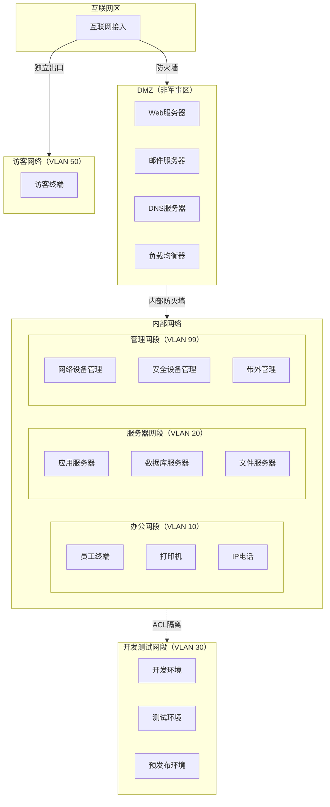
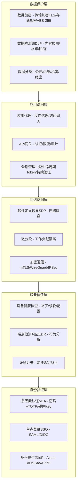
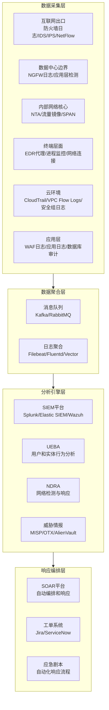
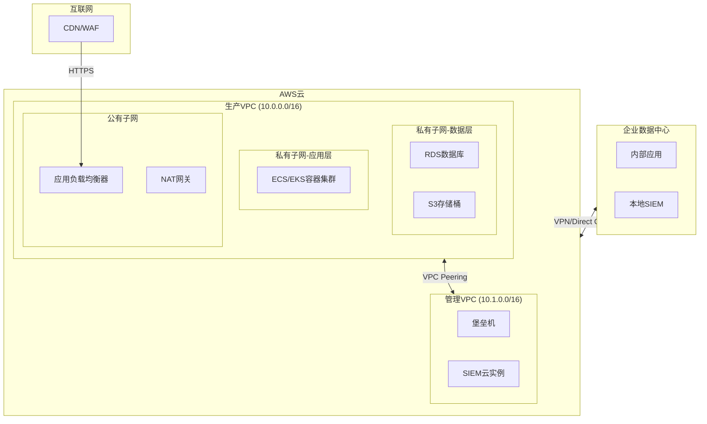

## 十一、企业网络安全架构

企业网络安全架构是将安全理念转化为可落地技术体系的蓝图。它不是买几台防火墙、装几套杀毒软件就能完成的事情，而是一套涵盖网络分段、访问控制、监控检测、应急响应的系统工程。本节从攻击者视角和防御者视角双重切入，帮助读者建立完整的企业网络安全架构认知。

### 11.1 网络分段策略

#### 11.1.1 为什么必须做网络分段

网络分段的核心目标是**限制攻击者的横向移动能力**。一个没有分段的扁平网络，攻击者一旦突破边界（比如通过钓鱼邮件拿到一台员工电脑的权限），就能畅通无阻地访问数据库、域控制器、文件服务器等所有关键资产。

真实案例：2013 年 Target 数据泄露事件中，攻击者通过 HVAC 供应商的凭据进入 Target 的网络，由于内部网络缺乏有效分段，攻击者从暖通空调系统一路横向移动到 POS（销售终端）系统，最终窃取了 4000 万张信用卡数据。如果 Target 在 HVAC 系统和 POS 系统之间部署了严格的网络分段，这次攻击的影响范围将被大幅压缩。

**扁平网络 vs 分段网络对比：**

| 维度 | 扁平网络 | 分段网络 |
|------|----------|----------|
| 攻击面 | 整个网络暴露给任何突破点 | 攻击者被限制在单个网段内 |
| 横向移动 | 无阻碍，攻击者自由移动 | 需跨越网段边界，增加检测机会 |
| 检测难度 | 异常流量淹没在正常流量中 | 跨网段流量更易识别异常 |
| 爆炸半径 | 整个网络受影响 | 单个网段可控 |
| 合规性 | 难以满足 PCI DSS、等保要求 | 天然满足分区分域要求 |
| 管理复杂度 | 低，但安全风险高 | 较高，但可通过自动化降低 |

#### 11.1.2 传统网络分段模型

传统网络分段基于物理设备和 VLAN 实现，以下是企业网络的典型分段模型：



**各网段的安全策略要点：**

| 网段 | 安全级别 | 允许的访问 | 禁止的访问 | 关键控制措施 |
|------|----------|------------|------------|--------------|
| DMZ | 高 | 互联网→DMZ（仅指定端口） | DMZ→内部网络直连 | WAF、IDS/IPS、应用白名单 |
| 办公网段 | 中 | 办公→互联网（带过滤） | 办公→服务器网段直连 | 上网行为管理、终端杀软 |
| 服务器网段 | 高 | 仅允许来自特定网段的访问 | 服务器主动外联互联网 | 数据库审计、文件审计 |
| 管理网段 | 极高 | 仅允许管理终端访问 | 任何业务流量通过 | 堡垒机、双因素认证、审计日志 |
| 开发测试区 | 中 | 开发→测试（有控制） | 开发→生产环境 | 数据脱敏、独立部署 |
| 访客网络 | 低 | 访客→互联网（严格带宽） | 访客→任何内部网络 | 强制门户认证、带宽限制、时间限制 |

#### 11.1.3 微分段（Micro-Segmentation）

微分段是比传统 VLAN 分段更细粒度的隔离技术，它将安全边界从网段级别下沉到**工作负载级别**（单台虚拟机、容器甚至进程）。微分段是零信任架构的核心组成部分。

**传统分段 vs 微分段对比：**

| 维度 | 传统分段（VLAN/子网） | 微分段 |
|------|----------------------|--------|
| 隔离粒度 | 网段级（数百台主机） | 工作负载级（单台VM/容器） |
| 策略定义 | 基于 IP 地址和端口 | 基于身份、标签、应用上下文 |
| 策略管理 | 静态，变更周期长 | 动态，随工作负载自动调整 |
| 实现方式 | VLAN + ACL + 防火墙规则 | 虚拟化平台策略 / Service Mesh / 主机防火墙 |
| 适用场景 | 传统物理网络 | 云环境、容器化、虚拟化环境 |
| 实施成本 | 低（利用现有设备） | 中高（需要专用平台） |

**微分段实施的四个阶段：**

**第一阶段：资产发现和分类**

```bash
# 使用 nmap 进行网络资产发现
nmap -sn 10.0.0.0/8 -oX network_discovery.xml

# 使用 arp-scan 发现本地网络设备
arp-scan --localnet --interface=eth0

# 利用 CMDB（配置管理数据库）导出资产清单
# 典型 CMDB 工具：ServiceNow CMDB、iTop、Ralph
```

资产分类维度：
- **按业务功能**：Web 前端、应用逻辑、数据库、消息队列、缓存
- **按数据敏感度**：公开、内部、机密、绝密
- **按合规要求**：PCI DSS 范围（持卡人数据环境 CDE）、HIPAA 范围、等保三级范围
- **按环境**：生产、预发布、测试、开发

**第二阶段：流量基线建立**

```python
# 使用 Scapy 采集网络流量基线（简化示例）
from scapy.all import sniff, IP, TCP
from collections import defaultdict
import time

# 记录通信对和流量统计
flow_stats = defaultdict(lambda: {"packets": 0, "bytes": 0, "first_seen": None, "last_seen": None})

def packet_callback(pkt):
    if IP in pkt and TCP in pkt:
        src = pkt[IP].src
        dst = pkt[IP].dst
        dport = pkt[TCP].dport
        key = (src, dst, dport)
        
        flow_stats[key]["packets"] += 1
        flow_stats[key]["bytes"] += len(pkt)
        now = time.time()
        if flow_stats[key]["first_seen"] is None:
            flow_stats[key]["first_seen"] = now
        flow_stats[key]["last_seen"] = now

# 抓取 1 小时的流量建立基线
sniff(filter="tcp", prn=packet_callback, timeout=3600, store=0)

# 输出基线：哪些通信对是"正常的"
for (src, dst, port), stats in flow_stats.items():
    if stats["packets"] > 100:  # 超过阈值的通信对
        print(f"{src}:{port} -> {dst} | {stats['packets']} packets | {stats['bytes']} bytes")
```

基线分析的关键指标：
- 正常通信对（哪些 IP 之间有通信）
- 正常端口（每个通信对使用哪些端口）
- 流量模式（工作时间 vs 非工作时间的流量差异）
- 协议分布（HTTP/HTTPS/SSH/SMB 等各占多少比例）

**第三阶段：策略制定**

微分段策略遵循**最小权限原则**——默认拒绝一切流量，只允许已知的、必要的通信。策略制定的逻辑：

```text
策略制定流程：
1. 从基线中提取"白名单"通信关系
2. 按业务逻辑验证这些通信的必要性
3. 编写精确到应用身份的允许规则
4. 添加默认拒绝规则（Deny All）
5. 在监控模式下试运行（Monitor Mode），不实际阻断
6. 观察误报，调整策略
7. 切换到强制执行模式（Enforce Mode）
```

**第四阶段：部署与持续监控**

主流微分段平台及部署方式：

| 平台 | 类型 | 适用环境 | 核心能力 |
|------|------|----------|----------|
| VMware NSX | 虚拟化平台原生 | vSphere 环境 | 分布式防火墙、服务插入 |
| Illumio | 主机代理 | 混合云 | 可视化、自适应策略 |
| Cisco ACI | 网络平台 | 数据中心 | 应用策略、矩阵控制 |
| Calico | 容器网络 | Kubernetes | NetworkPolicy、eBPF |
| Cilium | 容器网络 | Kubernetes | eBPF、L3/L4/L7 策略 |

```yaml
# Kubernetes NetworkPolicy 示例：只允许前端 Pod 访问后端 Pod 的 8080 端口
apiVersion: networking.k8s.io/v1
kind: NetworkPolicy
metadata:
  name: allow-frontend-to-backend
  namespace: production
spec:
  podSelector:
    matchLabels:
      app: backend    # 策略应用于后端 Pod
  policyTypes:
    - Ingress
  ingress:
    - from:
        - podSelector:
            matchLabels:
              app: frontend   # 只允许前端 Pod
      ports:
        - protocol: TCP
          port: 8080          # 只允许 8080 端口
```

#### 11.1.4 网络分段的常见误区

**误区 1：VLAN 就是安全隔离**

VLAN 只是逻辑隔离，同一台交换机上的 VLAN 可以通过 VLAN Hopping 攻击跨越：

```bash
# VLAN Hopping 攻击原理：Double Tagging
# 攻击者发送双层 802.1Q 标签帧
# 外层标签被交换机剥离后，内层标签将帧转发到目标 VLAN
# 防御：在接入端口配置 switchport mode access + 禁用 DTP
```

**误区 2：分段做完就不需要其他安全措施**

网络分段只是**纵深防御**的一层，还需要配合：
- 网段内的入侵检测（横向移动可能发生在同一网段内）
- 端点安全（分段无法防御已驻留在网段内的恶意软件）
- 应用层安全（SQL 注入、XSS 等不受网络分段影响）
- 数据加密（分段不保护数据在网段内的窃听）

**误区 3：过度分段导致运维瘫痪**

过度分段会带来：规则管理爆炸（N 个网段需要 N×(N-1)/2 条策略）、故障排查困难（数据包被静默丢弃）、变更流程缓慢（每增加一个通信关系都需要审批）。正确的做法是从关键资产开始分段，逐步扩展，而不是一开始就追求极致细分。

---

### 11.2 零信任网络架构

#### 11.2.1 零信任的核心思想

零信任（Zero Trust）的核心理念可以用一句话概括：**永不信任，始终验证（Never Trust, Always Verify）**。

传统安全模型假设"内网是安全的"——一旦你通过了边界防火墙的验证，内网的资源就可以自由访问。这种"城堡护城河"模型在现代企业中已经失效，原因包括：

- **远程办公**：员工不在办公室，内网边界模糊
- **云服务**：应用和数据在 AWS/Azure/GCP，不在自己的机房
- **BYOD**：员工使用个人设备接入公司网络
- **供应链攻击**：SolarWinds 事件证明，即使是受信任的软件供应商也可能成为攻击跳板
- **内部威胁**：30% 的数据泄露涉及内部人员（Verizon 2023 DBIR）

零信任不是某个产品，而是一套架构原则。NIST SP 800-207 定义了零信任的核心原则：

1. **所有数据源和计算服务都被视为资源**
2. **无论网络位置如何，所有通信都必须受到保护**
3. **对企业资源的访问按会话授予**
4. **访问由动态策略决定**——包括客户端身份、应用、请求资产的可观察状态
5. **企业监控和度量所有拥有和关联资产的完整性和安全态势**
6. **所有资源认证和授权都是动态的，在允许访问之前严格执行**

#### 11.2.2 零信任架构的五层模型



**各层关键技术详解：**

**身份验证层**——零信任的第一道关卡

身份验证不再只验证"你是谁"，还要验证"你用什么设备"、"你在什么位置"、"你的行为是否正常"。核心能力：

- **多因素认证（MFA）**：密码（你知道的）+ TOTP/硬件 Key（你拥有的）+ 生物识别（你是谁）。研究表明，启用 MFA 可以阻止 99.9% 的账户劫持攻击（Microsoft 数据）。
- **单点登录（SSO）**：通过 SAML 2.0 或 OpenID Connect 协议实现一次登录、全网通行。好处是减少密码疲劳，同时集中管控认证策略。
- **身份提供者（IdP）**：Azure Active Directory、Okta、Auth0、Keycloak（开源）。IdP 是整个零信任架构的"身份中枢"。

```bash
# 使用 Keycloak（开源 IdP）部署零信任身份服务
docker run -d --name keycloak \
  -p 8080:8080 \
  -e KEYCLOAK_ADMIN=admin \
  -e KEYCLOAK_ADMIN_PASSWORD=changeit \
  quay.io/keycloak/keycloak:latest start-dev

# 配置 SAML 客户端示例（Keycloak Realm 配置片段）
# 通过 Admin Console 创建 Realm -> Client -> 配置 SAML/OIDC
```

**设备信任层**——不信任设备本身

即使用户身份合法，如果设备被感染或配置不合规，也不应该被授予访问权限。

设备健康检查清单：
- 操作系统版本和补丁状态
- 杀毒软件是否安装且病毒库是否最新
- 磁盘是否加密（BitLocker/FileVault）
- 防火墙是否启用
- 是否越狱/Root

```python
# 设备健康检查 API 示例（自定义合规检查服务）
import psutil
import platform

def check_device_health():
    """返回设备健康评分和详细检查结果"""
    checks = {}
    
    # 检查操作系统补丁
    os_version = platform.version()
    checks["os_version"] = {"value": os_version, "compliant": True}  # 需要与最新版本比对
    
    # 检查防火墙状态（Linux: iptables/nftables 规则数量）
    try:
        import subprocess
        result = subprocess.run(["iptables", "-L", "-n"], capture_output=True, text=True)
        rule_count = len([l for l in result.stdout.split("\n") if l and not l.startswith("Chain") and not l.startswith("target")])
        checks["firewall"] = {"rules": rule_count, "compliant": rule_count > 0}
    except Exception:
        checks["firewall"] = {"rules": 0, "compliant": False}
    
    # 检查磁盘加密
    try:
        result = subprocess.run(["lsblk", "-o", "NAME,FSTYPE,MOUNTPOINT"], capture_output=True, text=True)
        has_encryption = "crypt" in result.stdout.lower() or "luks" in result.stdout.lower()
        checks["disk_encryption"] = {"encrypted": has_encryption, "compliant": has_encryption}
    except Exception:
        checks["disk_encryption"] = {"encrypted": False, "compliant": False}
    
    # 计算总体合规性
    total = len(checks)
    compliant = sum(1 for c in checks.values() if c.get("compliant", False))
    score = (compliant / total) * 100 if total > 0 else 0
    
    return {
        "score": score,
        "compliant": score >= 80,  # 80% 以上视为合规
        "checks": checks
    }
```

**网络访问层**——隐藏和隔离

- **软件定义边界（SDP）**：也叫"黑云"（Black Cloud），核心思想是让网络资源对未授权用户完全不可见。用户必须先通过 SDP 控制器认证，才能获得访问特定资源的网络通道。
- **mTLS（双向 TLS）**：不仅服务端向客户端证明身份，客户端也必须向服务端出示证书。

```nginx
# Nginx 配置 mTLS 示例
server {
    listen 443 ssl;
    
    # 服务端证书
    ssl_certificate /etc/nginx/server.crt;
    ssl_certificate_key /etc/nginx/server.key;
    
    # 客户端证书验证（零信任的关键）
    ssl_client_certificate /etc/nginx/ca.crt;
    ssl_verify_client on;  # 强制要求客户端证书
    ssl_verify_depth 2;
    
    location /api/ {
        # 只有持有有效客户端证书的请求才能到达这里
        proxy_pass http://backend:8080;
        
        # 将客户端证书信息传递给后端（用于身份识别）
        proxy_set_header X-Client-DN $ssl_client_s_dn;
        proxy_set_header X-Client-Verified $ssl_client_verify;
    }
}
```

**应用访问层**——细粒度授权

- **API 网关**：统一管理认证、限流、审计。主流方案包括 Kong、APISIX、Envoy。
- **持续会话验证**：不是登录一次就完事，而是持续评估用户行为。如果检测到异常（如突然访问从未访问过的资源、地理位置跳变），立即要求重新认证或降级权限。

**数据保护层**——最终防线

- **数据分类**：所有数据必须标记密级（公开 / 内部 / 机密 / 绝密），不同密级的数据有不同的访问和加密要求。
- **数据防泄漏（DLP）**：监控数据的传输路径，阻止敏感数据通过邮件、IM、云盘、USB 等途径外泄。

#### 11.2.3 零信任实施路线图

零信任不是一步到位的项目，而是分阶段演进的过程：


| 阶段 | 核心任务 | 交付物 | 关键技术 |
|------|----------|--------|----------|
| 第1阶段 | 身份基础 | 集中式身份管理、全公司 MFA | Azure AD / Okta + MFA |
| 第2阶段 | 设备信任 | 设备合规性检查、EDR 全覆盖 | Intune / JAMF + CrowdStrike |
| 第3阶段 | 网络重构 | SDP 部署、核心系统微分段 | Zscaler / Cloudflare Access |
| 第4阶段 | 数据保护 | 数据分类、DLP 部署 | Microsoft Purview / Symantec DLP |
| 第5阶段 | 持续优化 | 自动化策略、威胁情报集成 | SOAR 平台 + MITRE ATT&CK 映射 |

#### 11.2.4 零信任的常见误区

**误区 1：零信任 = 不信任员工**

零信任不是对员工的不信任，而是对**上下文**的持续验证。就像银行柜台要求出示身份证，不是怀疑你是坏人，而是确保交易安全。

**误区 2：买一个零信任产品就能实现**

零信任是架构理念，不是产品。没有哪个单一产品能实现零信任。真正的零信任需要身份管理、设备管理、网络安全、应用安全、数据安全等多个领域的技术协同。

**误区 3：零信任会让网络变慢**

现代零信任方案（如 Cloudflare Access、Zscaler Private Access）的延迟通常在 10-50ms，对绝大多数应用来说可以忽略。而且 SDP 方案去掉了传统 VPN 的瓶颈（所有流量回传到 VPN 网关），实际体验往往更好。

**误区 4：零信任只适用于大企业**

小企业同样需要零信任。事实上，小企业往往缺乏专职安全团队，更容易遭受攻击。云原生零信任方案（Cloudflare Zero Trust 起价 $7/用户/月）的门槛已经很低。

---

### 11.3 安全监控架构

#### 11.3.1 安全监控的核心目标

安全监控的目标不是"收集所有日志"，而是**在攻击者造成实质性损害之前发现并响应**。关键指标是 MTTD（平均检测时间）和 MTTR（平均响应时间）。行业基准：

| 指标 | 行业平均 | 优秀水平 | 攻击者利用窗口 |
|------|----------|----------|----------------|
| MTTD | 197 天 | < 24 小时 | 通常 1-2 小时内完成横向移动 |
| MTTR | 69 天 | < 1 小时 | 加密勒索可在 45 分钟内完成 |

安全监控体系的目标是将 MTTD 从"天"级别压缩到"分钟"级别。

#### 11.3.2 监控点部署架构



**各监控点的详细部署方案：**

**1. 互联网出口监控**

```bash
# 部署 Suricata IDS/IPS（开源，性能优于 Snort）
# 安装
apt-get install -y suricata suricata-update

# 更新规则集
suricata-update
suricata-update enable-source et/open      # Emerging Threats 开源规则
suricata-update enable-source ptresearch/attackdetection

# 启动（旁路模式，不影响网络流量）
suricata -c /etc/suricata/suricata.yaml -i eth0 --runmode=workers

# 配置 /etc/suricata/suricata.yaml 关键项
# outputs:
#   - eve-log:              # JSON 格式日志，便于 SIEM 采集
#       enabled: yes
#       filetype: regular
#       filename: eve.json
#       types:
#         - alert
#         - http
#         - dns
#         - tls
#         - files
```

**2. 网络流量分析（NTA）**

NTA 设备通过流量镜像（SPAN/TAP）获取网络流量副本，进行深度包检测和行为分析：

```bash
# 使用 Zeek（原 Bro）进行网络流量分析
# Zeek 不是传统的 IDS，而是"网络安全的瑞士军刀"
apt-get install -y zeek

# 启动 Zeek 分析
zeek -i eth0

# Zeek 会生成结构化日志：
# conn.log    - 所有网络连接记录
# dns.log     - DNS 查询记录
# http.log    - HTTP 请求记录
# ssl.log     - TLS/SSL 握手记录
# notice.log  - 安全告警
# files.log   - 文件传输记录

# 查看最新的连接日志
tail -f /opt/zeek/logs/current/conn.log | zeek-cut id.orig_h id.resp_h id.resp_p service

# 检测异常：从未见过的外部 IP 通信
cat /opt/zeek/logs/current/conn.log | zeek-cut id.orig_h id.resp_h | \
  grep -v "^10\." | grep -v "^172\.(1[6-9]|2[0-9]|3[01])\." | sort | uniq -c | sort -rn | head -20
```

**3. SIEM 平台部署与配置**

SIEM（安全信息和事件管理）是安全监控的大脑。以开源的 Wazuh 为例：

```bash
# Wazuh 全栈部署（All-in-One，适合中小规模）
curl -sO https://packages.wazuh.com/4.7/wazuh-install.sh
bash ./wazuh-install.sh -a

# Wazuh 包含：
# - Wazuh Manager：规则引擎和告警
# - Wazuh Indexer：基于 OpenSearch 的数据存储和搜索
# - Wazuh Dashboard：可视化界面
# - Wazuh Agent：终端代理（部署到每台服务器和工作站）

# 在终端上部署 Agent
WAZUH_MANAGER="10.0.0.100" apt-get install wazuh-agent
systemctl enable wazuh-agent && systemctl start wazuh-agent

# 自定义检测规则示例：检测暴力破解
# /var/ossec/etc/rules/local_rules.xml
```

```xml
<!-- Wazuh 自定义规则：SSH 暴力破解检测 -->
<group name="syslog,sshd,">
  <rule id="100001" level="10" frequency="5" timeframe="60">
    <if_matched_sid>5716</if_matched_sid>
    <description>SSH brute force attack detected (5 failed in 60s)</description>
    <group>authentication_failures,pci_dss_11.4,gdpr_IV_35.7.d,</group>
  </rule>
  
  <rule id="100002" level="12" frequency="10" timeframe="120">
    <if_matched_sid>5716</if_matched_sid>
    <description>Critical SSH brute force (10 failed in 120s) - potential compromise</description>
    <group>authentication_failures,pci_dss_10.2.4,pci_dss_11.4,</group>
  </rule>
</group>
```

**4. EDR 端点检测与响应**

EDR 代理部署在每台终端上，监控进程行为、文件操作、网络连接、注册表修改等：

```bash
# 使用开源 EDR 方案 Wazuh Agent + osquery
# osquery 提供 SQL 接口查询终端状态

# 安装 osquery
apt-get install -y osquery

# 查询所有监听端口
osqueryi "SELECT pid, name, port, address, protocol FROM listening_ports ORDER BY port;"

# 查询异常进程（不在白名单中的进程）
osqueryi "SELECT pid, name, path, cmdline, uid FROM processes WHERE name NOT IN ('sshd', 'nginx', 'systemd', 'bash');"

# 查询最近 24 小时新增的文件
osqueryi "SELECT path, size, mtime, uid FROM file WHERE mtime > (strftime('%s','now') - 86400) AND path LIKE '/tmp/%';"

# 查询异常网络连接（连接到非标准端口的出站连接）
osqueryi "SELECT p.name, p.pid, pos.remote_address, pos.remote_port FROM process_open_sockets pos JOIN processes p ON pos.pid = p.pid WHERE pos.remote_port NOT IN (80, 443, 53, 22) AND pos.family = 2;"
```

#### 11.3.3 威胁情报集成

安全监控不能闭门造车，需要整合外部威胁情报来提升检测能力：

```python
# 从 AbuseIPDB 查询 IP 信誉（免费 API，每日 1000 次查询）
import requests

def check_ip_reputation(ip, api_key):
    """查询 IP 地址的威胁情报"""
    url = "https://api.abuseipdb.com/api/v2/check"
    headers = {"Key": api_key, "Accept": "application/json"}
    params = {"ipAddress": ip, "maxAgeInDays": 90, "verbose": ""}
    
    resp = requests.get(url, headers=headers, params=params, timeout=10)
    data = resp.json().get("data", {})
    
    result = {
        "ip": ip,
        "abuse_confidence_score": data.get("abuseConfidenceScore", 0),
        "total_reports": data.get("totalReports", 0),
        "country": data.get("countryCode", "unknown"),
        "isp": data.get("isp", "unknown"),
        "is_tor": data.get("isTor", False),
        "last_reported": data.get("lastReportedAt", "never"),
    }
    
    # 评分解读
    score = result["abuse_confidence_score"]
    if score >= 80:
        result["risk_level"] = "HIGH - 强烈建议阻断"
    elif score >= 50:
        result["risk_level"] = "MEDIUM - 建议加强监控"
    elif score >= 20:
        result["risk_level"] = "LOW - 有可疑活动记录"
    else:
        result["risk_level"] = "CLEAN - 无已知威胁"
    
    return result

# 使用 MISP（开源威胁情报平台）管理本地威胁情报
# MISP 安装：docker pull misp/misp-docker && docker-compose up -d
# MISP 可以订阅社区共享的威胁情报源，自动更新 IoC 列表
```

**主流威胁情报源：**

| 情报源 | 类型 | 免费/付费 | 数据内容 |
|--------|------|-----------|----------|
| AbuseIPDB | IP 信誉 | 免费（有额度限制） | 恶意 IP、报告次数、威胁类型 |
| AlienVault OTX | 多类型 IoC | 免费 | IP/域名/URL/Hash/邮件 |
| MISP | 社区共享 | 免费（自部署） | 定制化 IoC、事件关联 |
| VirusTotal | 样本/URL/域名 | 免费（有额度限制） | 恶意样本检测结果汇总 |
| Recorded Future | 全面情报 | 付费 | 暗网监控、攻击者画像 |
| 微步在线 | 国内情报 | 部分免费 | 国内 IP/域名情报、样本分析 |

#### 11.3.4 SOAR 自动化响应

SOAR（安全编排、自动化与响应）将安全事件的响应从人工操作变为自动化剧本执行：

```yaml
# SOAR 响应剧本示例：检测到暴力破解后的自动响应
# 适用于 TheHive + Cortex 或 Shuffle SOAR

playbook:
  name: "暴力破解自动响应"
  trigger:
    - source: "wazuh"
      rule_id: "100001"  # SSH 暴力破解规则
  
  steps:
    - name: "enrichment"  # 情报富化
      actions:
        - query_abuseipdb:
            input: "{{ source_ip }}"
        - query_virustotal:
            input: "{{ source_ip }}"
        - check_internal_asset:
            input: "{{ source_ip }}"
            description: "判断是内部还是外部 IP"
    
    - name: "decision"  # 自动决策
      conditions:
        - if: "abuse_score >= 80 OR total_reports >= 100"
          action: "block_and_alert"
        - if: "abuse_score >= 50"
          action: "alert_only"
        - else:
          action: "log_and_monitor"
    
    - name: "block_and_alert"  # 阻断并告警
      actions:
        - block_ip_firewall:
            target: "{{ firewall_ip }}"
            ip: "{{ source_ip }}"
            method: "iptables -A INPUT -s {{ source_ip }} -j DROP"
        - create_ticket:
            system: "jira"
            project: "SEC"
            title: "暴力破解自动阻断 - {{ source_ip }}"
            severity: "HIGH"
        - notify_soc:
            channel: "slack"
            message: "已自动阻断暴力破解 IP: {{ source_ip }}，评分: {{ abuse_score }}"
    
    - name: "alert_only"  # 仅告警
      actions:
        - create_ticket:
            system: "jira"
            project: "SEC"
            title: "可疑暴力破解 - {{ source_ip }}"
            severity: "MEDIUM"
        - notify_soc:
            channel: "slack"
            message: "检测到可疑暴力破解 IP: {{ source_ip }}，需人工确认"
```

#### 11.3.5 安全监控的常见误区

**误区 1：部署 SIEM 就等于有了安全监控**

SIEM 只是工具，没有以下要素的 SIEM 只是一个昂贵的日志存储系统：
- 正确的检测规则（需要持续调优，减少误报）
- 合格的安全分析师（SIEM 产生告警，需要人来判断和响应）
- 完整的日志源（如果终端、云环境、应用不接入，SIEM 是瞎子）
- 应急响应流程（检测到了攻击但没有响应流程，等于没检测到）

**误区 2：告警越多越安全**

告警疲劳是安全团队面临的最大挑战之一。如果每天产生 10000 条告警，安全分析师很快就会麻木。正确的做法是：
- 严格控制告警质量，宁可漏报也不要满屏误报
- 按严重程度分级（P0 立即响应、P1 4小时内、P2 次日、P3 周报）
- 用 SOAR 自动处理低级别告警（如自动阻断已知恶意 IP）
- 定期审查和清理无效规则

**误区 3：只监控外部流量，忽略内部流量**

据 Verizon DBIR 报告，超过 30% 的数据泄露涉及内部人员。内部流量监控（东西向流量）的重要性不亚于南北向流量：
- 同一网段内的横向移动（如 Pass-the-Hash）
- 内部人员的数据外泄（USB 拷贝、邮件发送、云盘上传）
- 内部系统之间的异常通信（如数据库服务器主动连接外部 IP）

---

### 11.4 安全策略与合规框架

#### 11.4.1 主流安全合规框架

企业网络安全架构不是凭空设计的，需要遵循行业标准和合规框架：

| 框架 | 适用范围 | 核心内容 | 强制性 |
|------|----------|----------|--------|
| 等保 2.0（GB/T 22239） | 中国所有网络运营者 | 安全通信网络、安全区域边界、安全计算环境 | 法律强制 |
| PCI DSS | 处理信用卡数据的企业 | 12 条要求，涵盖网络安全、加密、访问控制 | 合同强制 |
| ISO 27001 | 通用信息安全管理体系 | 信息安全管理体系（ISMS）的建立和维护 | 自愿认证 |
| NIST CSF | 美国关键基础设施 | 识别、保护、检测、响应、恢复五大功能 | 自愿（联邦强制） |
| SOC 2 | SaaS/云服务企业 | 安全性、可用性、处理完整性、机密性、隐私 | 客户要求 |
| HIPAA | 美国医疗健康行业 | 患者数据保护的技术和管理要求 | 法律强制 |

#### 11.4.2 安全架构设计原则

无论遵循哪个框架，企业网络安全架构的设计都应遵循以下原则：

1. **纵深防御（Defense in Depth）**：不依赖单一安全层，而是多层叠加。即使某一层被突破，还有其他层提供保护。
2. **最小权限（Least Privilege）**：每个用户、每个进程只拥有完成工作所必需的最小权限。
3. **默认拒绝（Default Deny）**：未明确允许的流量和访问一律拒绝。
4. **职责分离（Separation of Duties）**：关键操作需要多人协作完成，避免单人拥有过大的权限。
5. **安全左移（Shift Left）**：在系统设计和开发阶段就融入安全，而不是部署后才考虑安全。
6. **假设被入侵（Assume Breach）**：以"系统已经被入侵"为前提进行防御设计，关注检测和响应能力。

---

### 11.5 企业网络攻防实战视角

#### 11.5.1 攻击者如何突破企业网络

理解攻击者的攻击链有助于设计更有针对性的防御架构。MITRE ATT&CK 框架将攻击分为 14 个战术阶段：


**典型企业攻击路径及对应防御措施：**

| 攻击阶段 | 典型手法 | 对应防御架构层 |
|----------|----------|---------------|
| 侦察 | 社工信息收集、端口扫描、OSINT | 边界防火墙、WAF |
| 投递 | 钓鱼邮件、水坑攻击、供应链投毒 | 邮件网关、沙箱检测 |
| 利用 | 浏览器漏洞、Office 宏、SQL 注入 | EDR、应用白名单、WAF |
| 安装 | 持久化后门、计划任务、注册表 | EDR、文件完整性监控 |
| 横向移动 | Pass-the-Hash、SMB 利用、RDP | 微分段、特权账户管理 |
| 数据窃取 | DNS 隧道、HTTPS 外传、云盘 | DLP、DNS 监控、NTA |

#### 11.5.2 蓝队防御检查清单

以下是企业蓝队（防御方）应该定期执行的安全检查清单：

```bash
# === 每日检查 ===
# 1. SIEM 告警审查（P0/P1 级别）
# 2. 威胁情报源更新检查
# 3. 关键系统可用性检查
# 4. 备份完整性验证

# === 每周检查 ===
# 1. 漏洞扫描结果审查
# 2. 防火墙规则审计（是否有冗余/过宽规则）
# 3. 账户权限审查（离职员工账户是否已禁用）
# 4. 安全补丁部署状态

# === 每月检查 ===
# 1. 网络分段有效性验证（从各网段尝试跨网段访问）
# 2. 应急响应演练（Tabletop Exercise）
# 3. 安全架构变更审查
# 4. 第三方供应商安全评估

# === 每季度检查 ===
# 1. 渗透测试（内外部）
# 2. 红蓝对抗演练
# 3. 安全策略和架构全面审查
# 4. 合规性审计

# 实用命令：快速检查当前系统安全状态
# 检查异常监听端口
ss -tlnp | grep -v -E ':(22|80|443|3306|6379|8080)\s'

# 检查异常 cron 任务
for user in $(cut -f1 -d: /etc/passwd); do crontab -u $user -l 2>/dev/null | grep -v "^#" | grep -v "^$"; done

# 检查最近修改的可执行文件
find /usr/bin /usr/sbin /usr/local/bin -mtime -7 -type f -executable 2>/dev/null

# 检查异常 SUID 文件
find / -perm -4000 -type f 2>/dev/null | grep -v -E '(/usr/bin/|/usr/sbin/|/usr/lib/|/usr/libexec/)'

# 检查异常网络连接
ss -tnp | awk '{print $5}' | cut -d: -f1 | sort | uniq -c | sort -rn | head -20
```

---

### 11.6 进阶：云环境下的企业网络安全架构

#### 11.6.1 云安全架构的特殊挑战

当企业将业务迁移到公有云（AWS/Azure/GCP）后，网络安全架构面临新的挑战：

- **网络边界模糊**：没有物理机房，IP 地址动态变化
- **共享责任模型**：云厂商负责"云的安全"，客户负责"云中的安全"
- **API 驱动**：所有操作通过 API 进行，API 安全成为关键
- **多云/混合云**：业务分布在多个云和自有机房，统一管理困难



#### 11.6.2 云安全最佳实践

```bash
# AWS 安全组配置最佳实践（Terraform 示例）
resource "aws_security_group" "web_tier" {
  name        = "web-tier-sg"
  description = "Security group for web tier"
  vpc_id      = aws_vpc.production.id

  # 只允许来自 ALB 的 HTTP/HTTPS 入站
  ingress {
    from_port       = 80
    to_port         = 80
    protocol        = "tcp"
    security_groups = [aws_security_group.alb.id]  # 只允许 ALB 安全组
    description     = "HTTP from ALB only"
  }

  # 出站限制：只允许到应用层和必要的外部服务
  egress {
    from_port       = 443
    to_port         = 443
    protocol        = "tcp"
    cidr_blocks     = ["0.0.0.0/0"]  # HTTPS 出站（更新、API 调用等）
    description     = "HTTPS outbound"
  }

  egress {
    from_port       = 8080
    to_port         = 8080
    protocol        = "tcp"
    security_groups = [aws_security_group.app_tier.id]  # 到应用层
    description     = "To app tier"
  }

  # 注意：没有允许 SSH 入站（通过 SSM Session Manager 替代）
  # 注意：没有允许出站到 0.0.0.0/0 的全开放规则
}
```

---

### 11.7 常见误区与纠正

| 误区 | 错误做法 | 正确做法 |
|------|----------|----------|
| 安全是买出来的 | 堆砌安全产品，但没有统一管理 | 先设计架构，再选择产品填补能力缺口 |
| 安全是运维的事 | 安全部门和开发/运维脱节 | 安全左移，DevSecOps 流程融入 CI/CD |
| 内网不需要加密 | 内网通信全部明文 | 内网通信也需要 mTLS 加密，防止嗅探 |
| 只防外部攻击 | 忽视内部威胁和供应链风险 | 内部监控 + 第三方安全评估 |
| 补丁可以慢慢打 | "等稳定了再打补丁" | 关键漏洞 48 小时内打补丁，常规漏洞按周期处理 |
| 密码复杂就行 | 强制 20 位复杂密码但不启用 MFA | MFA 比密码复杂度更重要 |
| 备份 = 容灾 | 有备份但从不测试恢复 | 定期进行灾备演练，验证 RTO/RPO |

---

### 11.8 本节小结

企业网络安全架构是一项系统工程，需要从以下维度综合考虑：

1. **网络分段**是基础——限制攻击者的横向移动能力，从 VLAN 分段到微分段逐步细化
2. **零信任**是方向——从"信任内网"转向"永不信任、始终验证"，分阶段实施
3. **安全监控**是眼睛——在攻击者完成目标之前发现他们，SIEM + NTA + EDR + 威胁情报四位一体
4. **合规框架**是标尺——等保 2.0、PCI DSS、ISO 27001 提供了结构化的设计指引
5. **实战视角**是检验——从攻击者的角度审视防御体系，红蓝对抗验证架构有效性

没有完美的安全架构，只有不断演进的安全架构。企业需要根据自身的业务特点、威胁态势和技术能力，持续优化安全架构的各个组件。
