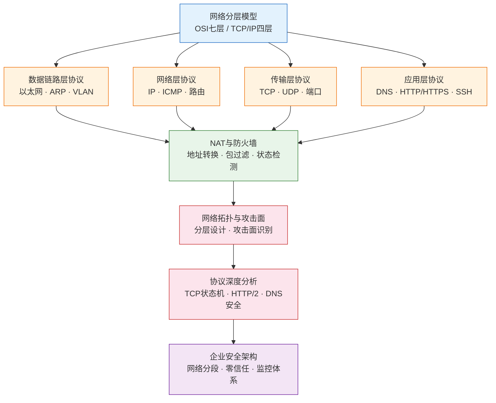

## 本节小结

本节从网络分层模型出发，逐层剖析了数据链路层、网络层、传输层、应用层的核心协议，深入探讨了NAT与防火墙机制、网络拓扑与攻击面分析、协议深度安全分析以及企业网络安全架构。下面对本节知识进行系统性梳理，帮助读者构建完整的网络安全理论框架。

### 10.1 知识体系总览

本节覆盖的知识可以按照"分层模型→各层协议→安全机制→攻击分析→防御架构"的逻辑主线来理解：

### 10.2 各层核心要点回顾

#### 10.2.1 网络分层模型

OSI七层模型和TCP/IP四层模型是理解网络通信的基础框架。对于安全研究者而言，分层模型的核心价值在于**定位攻击发生的层次**，从而选择对应的攻防手段。

| 层次 | OSI模型 | TCP/IP模型 | 核心协议 | 典型攻击 |
|------|---------|-----------|----------|----------|
| 第7层 | 应用层 | 应用层 | HTTP、DNS、SMTP、FTP | SQL注入、XSS、RCE |
| 第6层 | 表示层 | 应用层 | SSL/TLS、编码 | 证书伪造、降级攻击 |
| 第5层 | 会话层 | 应用层 | 会话管理 | 会话劫持、CSRF |
| 第4层 | 传输层 | 传输层 | TCP、UDP | SYN Flood、TCP劫持 |
| 第3层 | 网络层 | 网际层 | IP、ICMP、路由协议 | IP欺骗、路由劫持 |
| 第2层 | 数据链路层 | 网络接口层 | 以太网、ARP、VLAN | ARP欺骗、MAC泛洪 |
| 第1层 | 物理层 | 网络接口层 | 线缆、光纤、无线 | 窃听、电磁截获 |

**关键认知**：实际网络安全分析以TCP/IP四层模型为主，但OSI模型在教学和威胁分类时提供了更细粒度的视角。两者并非对立，而是互补关系。

#### 10.2.2 数据链路层核心协议

数据链路层解决的是**相邻节点之间**的可靠通信问题，使用MAC地址进行硬件级寻址。

**以太网协议**是最主流的局域网技术，帧结构包含目的MAC（6字节）、源MAC（6字节）、类型字段（2字节）、数据（46-1500字节）和FCS校验（4字节）。安全关键点在于：MAC地址可以被软件修改（MAC欺骗），以太网帧本身不提供加密和认证。

**ARP协议**负责IP地址到MAC地址的映射，是局域网通信的基础。但ARP协议设计之初没有认证机制——任何主机都可以发送ARP回复，即使没有收到请求。这个设计缺陷直接导致了ARP欺骗攻击的泛滥：攻击者可以伪造ARP回复，将自己的MAC与网关IP绑定，从而实现中间人攻击。

**VLAN**通过802.1Q标签在二层划分逻辑网络，实现广播域隔离。但VLAN跳跃攻击（双标签攻击）可以突破VLAN隔离，说明二层隔离并非绝对安全。

**安全启示**：数据链路层的协议大多在可信环境下设计，缺乏认证和加密机制。在安全研究中，二层攻击是内网渗透的起点，ARP欺骗更是中间人攻击的经典手法。

#### 10.2.3 网络层核心协议

网络层解决的是**跨网络**的端到端通信问题，核心协议是IP协议。

**IPv4报文头**中安全相关的关键字段包括：TTL（可推断OS类型和网络拓扑）、标志与片偏移（IP分片攻击的利用点）、源IP地址（可被伪造，IP协议本身不提供认证）。理解这些字段的安全含义，是进行网络层攻击和防御的基础。

**IP地址与子网划分**是网络工程的基本功。A/B/C类地址的划分、私有地址段（10.0.0.0/8、172.16.0.0/12、192.168.0.0/16）、CIDR表示法，这些概念在渗透测试的内网信息收集中反复用到。掌握子网计算能力，可以快速判断目标网络的规模和边界。

**ICMP协议**用于传递网络控制消息，ping和traceroute是最常用的网络诊断工具。从安全角度看，ICMP可以用于主机发现（ping扫描）、路由追踪（traceroute）、ICMP Flood攻击，以及ICMP隧道（隐蔽数据外泄通道）。

**路由协议**决定了数据包在互联网中的转发路径。BGP作为互联网的核心路由协议，其安全问题（BGP劫持）可以导致大规模流量劫持，影响范围可达国家级别。

#### 10.2.4 传输层核心协议

传输层提供**端到端**的通信服务，是网络安全攻防的关键战场。

**TCP协议**提供可靠的、面向连接的字节流服务。三次握手（SYN→SYN+ACK→ACK）建立连接，四次挥手（FIN→ACK→FIN→ACK）终止连接。TCP的安全问题集中在三个方面：

1. **序列号预测**：如果ISN（初始序列号）可预测，攻击者可以进行TCP会话劫持，向已有连接注入伪造数据
2. **SYN Flood**：利用三次握手的半连接状态，大量发送SYN包而不完成握手，耗尽服务器的半连接队列
3. **RST攻击**：伪造RST包可以中断任意TCP连接

**UDP协议**提供无连接的、不可靠的数据报服务，头部仅8字节，开销极低。UDP的安全问题主要是放大攻击（如DNS放大攻击、NTP放大攻击），攻击者可以利用反射机制将小请求放大为大响应，以较小的带宽消耗目标大量的网络资源。

**端口与服务**是传输层的应用接口。端口扫描是渗透测试侦察阶段的核心技术，通过识别目标开放的端口，可以推断运行的服务类型和版本，进而寻找已知漏洞。知名端口（0-1023）、注册端口（1024-49151）、动态端口（49152-65535）的划分是端口知识的基础。

#### 10.2.5 应用层核心协议

应用层是攻击面最广的一层，几乎所有面向用户的网络服务都在这一层运行。

**DNS协议**将域名解析为IP地址，是互联网的"电话簿"。DNS查询过程涉及本地缓存、递归查询、迭代查询等环节，每个环节都可能成为攻击目标：DNS缓存投毒可以劫持域名解析，DNS劫持可以在运营商层面篡改解析结果，DNS隧道可以利用DNS协议传输非DNS数据实现隐蔽通信，DNS放大攻击可以利用开放DNS解析器进行DDoS。

**HTTP/HTTPS**是Web通信的基础协议。HTTP是无状态的明文协议，安全问题众多（中间人窃听、会话劫持、请求伪造等）。HTTPS通过TLS/SSL在HTTP基础上增加了加密和认证，TLS握手过程（Client Hello→Server Hello→证书验证→密钥交换→加密通信）是理解HTTPS安全的基础。

**其他重要协议**各有安全特点：SSH（端口22）是安全远程登录的标准方案，替代了明文的Telnet；FTP（端口20/21）虽然方便但明文传输密码；SMTP（端口25）是邮件传输协议，常被用于钓鱼和垃圾邮件；DHCP（端口67/68）负责动态IP分配，存在DHCP欺骗攻击风险。

#### 10.2.6 NAT与防火墙

**NAT（网络地址转换）** 解决IPv4地址不足问题，同时提供了一定的安全隐蔽效果。三种主要类型各有特点：静态NAT（一对一映射，用于对外提供服务）、动态NAT（从地址池动态分配）、PAT（端口地址转换，多个内网IP共享一个公网IP，最常用）。NAT的隐蔽效果是"副作用"而非设计目标，不应将其视为安全机制。

**防火墙**是网络安全的第一道防线。三种类型代表了安全能力的递进：包过滤防火墙（基于IP/端口/协议的静态规则，速度快但粒度粗）、状态检测防火墙（跟踪连接状态，能区分合法连接的后续包和主动发起的非法包，安全性更高）、应用层防火墙/WAF（深度检测应用层内容，能识别SQL注入、XSS等应用层攻击，但性能开销大）。

理解防火墙的工作原理，对于渗透测试中的防火墙绕过技术至关重要。包过滤防火墙可以通过IP欺骗、端口复用绕过；状态检测防火墙可以通过会话劫持绕过；WAF的绕过则需要针对具体规则的编码变换和畸形请求构造。

#### 10.2.7 网络拓扑与攻击面

**网络拓扑**决定了数据的流动路径和安全边界。企业网络通常采用三层设计：核心层（高速转发）、汇聚层（策略执行）、接入层（用户接入）。从攻击者视角看，拓扑结构暴露了攻击面的分布。

**攻击面**是攻击者可以利用的所有入口点的集合。网络攻击面包括：外部可访问的服务和端口（Web应用、API接口、远程管理服务）、协议设计缺陷（ARP无认证、TCP序列号可预测、DNS无加密）、网络设备配置错误（默认密码、未关闭的管理接口、过时的固件）、无线网络信号泄露（WEP/WPA破解、Evil Twin攻击）、VPN和远程访问薄弱环节（弱密码、未修补的VPN漏洞、分割隧道配置不当）。

**关键认知**：攻击面分析不是一次性的任务，而是持续的过程。随着业务变化、系统更新、新服务上线，攻击面也在不断变化。定期的攻击面测绘是安全运营的基本要求。

#### 10.2.8 协议深度安全分析

在基础协议知识之上，深入分析协议的实现细节可以发现更多攻击向量。

**TCP状态机安全**：TCP连接的建立和终止涉及复杂的状态机转换。通过监控TCP状态分布（SYN_SENT堆积指示SYN Flood、SYN_RCVD堆积指示半连接攻击、TIME_WAIT过多指示短连接攻击或端口扫描、CLOSE_WAIT过多指示应用程序未正确关闭连接），可以检测多种网络攻击。

**HTTP/2和HTTP/3安全**：HTTP/2引入了多路复用、头部压缩等新特性，但也带来了新的攻击面——依赖链攻击、重置攻击（RST_STREAM）、HPACK头部压缩炸弹（解压缩时内存耗尽）、设置洪水攻击。HTTP/3基于QUIC协议，内置TLS 1.3加密和0-RTT连接建立，但面临UDP放大攻击、连接ID枚举、0-RTT重放攻击等新挑战。

**DNS安全深度**：Kaminsky攻击变种是DNS缓存投毒的高级形式，通过查询随机子域名并在合法响应到达前发送伪造响应（包含权威NS记录），成功后可控制整个域名的解析。DNS隧道的检测需要从查询频率、域名长度、响应大小、TXT记录查询频率、机器学习异常检测等多个维度综合分析。

**协议混淆与规避**：攻击者使用端口复用、协议封装（如DNS-over-HTTPS）、流量伪装（将C2流量伪装成视频流）、加密混淆等技术绕过安全检测。对应的防御手段包括深度包检测（DPI）、行为分析、流量统计分析和机器学习模型。

#### 10.2.9 企业网络安全架构

企业网络安全架构是将前述所有知识综合应用的顶层设计。

**网络分段策略**从传统的物理分段演进到基于策略的微分段。传统分段将网络划分为DMZ、内部网络（办公网段、服务器网段、管理网段）、开发测试网段、访客网络等区域，每个区域有不同的安全策略。微分段是零信任架构的核心组成部分，实施步骤包括：资产发现和分类→流量基线建立→最小权限策略制定→部署和持续监控。

**零信任网络架构**以"永不信任，始终验证"为原则，构建五层防御体系：身份验证层（MFA、SSO、IdP）、设备信任层（设备健康检查、EDR、设备证书）、网络访问层（SDP、微分段、加密通信）、应用访问层（应用代理、API网关、会话管理）、数据保护层（数据加密、DLP、数据分类）。

**安全监控架构**需要在四个层面部署监控点：互联网出口（防火墙、IDS/IPS、流量镜像）、数据中心边界（下一代防火墙、应用层检测）、内部网络核心（NTA、横向移动检测）、终端层面（EDR代理、进程行为监控）。所有监控数据汇聚到SIEM平台进行关联分析。

### 10.3 安全能力矩阵

将本节知识映射到攻击与防御能力，形成完整的攻防知识图谱：

| 攻击领域 | 攻击技术 | 防御技术 | 涉及协议/层次 |
|----------|----------|----------|---------------|
| 中间人攻击 | ARP欺骗、DNS投毒、SSL剥离 | 静态ARP绑定、DNSSEC、HSTS | 二层/应用层 |
| 拒绝服务 | SYN Flood、UDP Flood、DNS放大 | SYN Cookie、速率限制、黑洞路由 | 传输层/应用层 |
| 网络侦察 | 端口扫描、OS指纹、traceroute | 端口敲门、入侵检测、防火墙规则 | 传输层/网络层 |
| 会话劫持 | TCP序列号预测、Cookie窃取 | 随机ISN、HTTPS、HttpOnly标志 | 传输层/应用层 |
| 协议滥用 | ICMP隧道、DNS隧道、协议混淆 | DPI、行为分析、流量审计 | 网络层/应用层 |
| 流量劫持 | BGP劫持、DNS劫持、ARP欺骗 | RPKI、DNSSEC、802.1X | 网络层/二层/应用层 |
| 配置利用 | 默认密码、开放端口、过期证书 | 资产管理、漏洞扫描、配置审计 | 全层次 |

### 10.4 核心概念速查

以下表格汇总本节涉及的所有核心概念，便于快速回顾和查阅：

| 概念 | 定义 | 安全意义 |
|------|------|----------|
| OSI七层模型 | ISO制定的网络通信参考模型 | 定位攻击层次，选择对应攻防手段 |
| TCP/IP四层模型 | 互联网实际使用的协议栈 | 实际网络分析的主要框架 |
| MAC地址 | 48位硬件地址，用于二层寻址 | 可被伪造，ARP欺骗的基础 |
| ARP | IP地址到MAC地址的映射协议 | 无认证机制，中间人攻击的入口 |
| VLAN | 802.1Q标签划分的逻辑网络 | 二层隔离手段，可被VLAN跳跃突破 |
| IP协议 | 网络层核心协议 | 源IP可伪造，不提供认证 |
| 子网划分 | 通过CIDR划分网络边界 | 内网信息收集、网络边界识别 |
| ICMP | 网络控制消息协议 | 主机发现、路由追踪、隐蔽隧道 |
| TCP三次握手 | SYN→SYN+ACK→ACK建立连接 | SYN Flood攻击的利用点 |
| TCP序列号 | 用于数据排序和确认 | 可预测时导致会话劫持 |
| UDP | 无连接传输协议 | 放大攻击的反射协议 |
| 端口 | 传输层的服务接口 | 端口扫描是侦察的核心技术 |
| DNS | 域名解析系统 | 缓存投毒、隧道、放大攻击 |
| HTTPS | HTTP + TLS加密 | 中间人防护、证书验证 |
| NAT | 网络地址转换 | 隐藏内网结构，但非安全机制 |
| 防火墙 | 网络流量过滤设备 | 网络安全第一道防线 |
| 攻击面 | 所有可利用的入口点集合 | 持续测绘是安全运营基本要求 |
| 零信任 | 永不信任、始终验证 | 企业安全架构的演进方向 |

### 10.5 从理论到实践的桥梁

本节聚焦的是**理论基础**——理解协议的工作原理、安全特性和攻击方式。但网络安全是一门实践性极强的学科，理论知识必须与工具使用相结合才能转化为真正的安全能力。

下一节我们将进入**工具与实操**阶段，学习如何使用以下工具来分析和操作本节涉及的网络协议：

- **Wireshark**：网络流量抓包和协议分析，可视化每个协议层次的数据结构
- **Nmap**：端口扫描和服务识别，实践网络侦察技术
- **tcpdump**：命令行抓包工具，适合服务器端快速分析
- **Scapy**：Python网络包构造库，可以手工构造任意协议数据包
- **Nessus/OpenVAS**：漏洞扫描器，将协议知识转化为漏洞发现能力

**学习建议**：在进入实操之前，建议读者回顾以下关键问题，确保理论基础扎实：

1. 能否画出TCP/IP四层模型，并说明每层的核心协议和典型攻击？
2. 能否解释ARP欺骗的完整过程，以及为什么ARP协议容易被攻击？
3. 能否说明TCP三次握手中SYN Flood攻击的原理和防御方法？
4. 能否区分DNS缓存投毒和DNS劫持的攻击方式和防御手段？
5. 能否描述防火墙三种类型的工作原理差异？
6. 能否解释零信任架构的五层防御体系？

如果以上问题都能清晰回答，说明理论基础已经具备，可以进入下一阶段的实操学习。如果有疑问，建议回到对应章节重新学习相关知识点。
