# 第06章 操作系统基础-Linux — 章节概览

## 一、为什么黑客必须精通Linux

### 1.1 Linux在安全领域的统治地位

Linux不是安全从业者的"可选工具"，而是**必须精通的核心平台**。以下数据说明了原因：

| 领域 | Linux占比 | 典型代表 |
|------|-----------|----------|
| 公有云实例 | 90%+ | AWS EC2、阿里云ECS、GCP Compute Engine |
| Web服务器 | 70%+ | Nginx、Apache、Caddy |
| 渗透测试发行版 | 100% | Kali Linux、Parrot OS、BlackArch |
| 容器运行时 | 99%+ | Docker、containerd、Podman |
| 超级计算机 | 100% | TOP500全部运行Linux |
| Android设备 | 内核层 | 全球30亿+活跃设备 |
| IoT/嵌入式 | 主流 | 路由器、摄像头、工业控制系统 |

这意味着：**你攻击的绝大多数目标运行Linux，你使用的绝大多数安全工具运行Linux，你分析的绝大多数恶意软件样本最终会在Linux环境中被逆向。**

### 1.2 Linux是理解"系统如何工作"的钥匙

闭源操作系统（Windows、macOS）的内核细节对你而言是一个黑箱。你可以使用它，但无法深入研究它的每一个机制。Linux则完全不同：

- **完整源码可审计**：内核代码在 kernel.org 公开，任何安全研究者都可以阅读、分析、发现漏洞
- **运行时状态可观察**：通过 `/proc`、`/sys` 虚拟文件系统，你可以实时观察内核的每一个状态
- **行为可追踪**：`strace`、`ltrace`、`perf`、eBPF 工具链让你能够追踪系统调用、库调用、性能事件的每一个细节
- **安全机制可测试**：SELinux、AppArmor、Seccomp、Namespaces —— 这些安全子系统都是可配置、可测试、可绕过的

这种深度理解是区分"脚本小子"和真正安全研究者的关键分水岭。当你理解了进程调度、内存管理、文件系统权限的底层实现，你才能发现那些表面看起来"配置正确"但底层存在逻辑漏洞的安全问题。

### 1.3 攻防两端都需要Linux

从攻击方看：

- 渗透测试工具链（Metasploit、Burp Suite、Nmap、sqlmap）以Linux为主战场
- 漏洞利用开发需要理解Linux的内存布局、ELF格式、系统调用约定
- 后渗透阶段的持久化、横向移动高度依赖Linux系统机制

从防御方看：

- 安全加固（CIS Benchmark、STIG）针对的是Linux系统配置
- 入侵检测（OSSEC、Wazuh、Falco）运行在Linux上并监控Linux行为
- 应急响应和取证分析需要深入理解Linux的日志、进程、文件系统、网络状态

## 二、本章学习目标

完成本章全部内容后，你应该达到以下能力水平：

**基础层（理论理解）**：
1. 描述Linux内核的五大子系统（进程管理、内存管理、文件系统、网络栈、设备驱动）及其安全意义
2. 解释系统调用在用户空间与内核空间之间的桥梁作用，识别常见系统调用的安全风险
3. 绘制完整的Linux目录树结构，说明每个安全相关目录（`/etc`、`/var/log`、`/proc`、`/dev`）的用途

**应用层（技能掌握）**：
4. 在Bash中高效完成文件操作、文本处理（grep/sed/awk）、管道组合、重定向等任务
5. 理解并配置Linux权限模型：UGO权限、SUID/SGID/Sticky Bit、ACL、Capabilities
6. 使用systemd管理服务，理解进程生命周期、信号机制、守护进程原理
7. 熟练使用apt/dnf包管理系统，理解软件供应链安全

**实战层（安全能力）**：
8. 枚举Linux系统信息，识别SUID文件、弱配置、可利用的定时任务、sudo滥用等提权路径
9. 分析系统日志（auth.log、syslog、journalctl），从中提取安全事件的时间线
10. 检测和清除常见后门：SSH密钥植入、定时任务后门、LD_PRELOAD劫持、Rootkit
11. 按照CIS Benchmark对Linux服务器进行基础安全加固

## 三、知识体系总览

本章内容按照"道法术器"的层次组织，从理论到实践逐层递进：

```mermaid
graph TD
    A[第06章 操作系统基础-Linux] --> B[理论基础]
    A --> C[核心技巧]
    A --> D[实战案例]
    A --> E[常见误区]
    A --> F[练习方法]
    A --> G[本章小结]
    A --> H[深度拓展]

    B --> B1[Linux历史与哲学]
    B --> B2[系统架构：内核/用户空间]
    B --> B3[文件系统层次标准 FHS]
    B --> B4[用户与权限模型]
    B --> B5[Shell与命令行]
    B --> B6[进程管理与信号]
    B --> B7[包管理系统]
    B --> B8[文件系统管理]
    B --> B9[网络管理]

    C --> C1[文本处理三剑客 grep/sed/awk]
    C --> C2[系统信息收集]
    C --> C3[文件权限管理技巧]
    C --> C4[Shell脚本安全编程]
    C --> C5[日志分析技巧]
    C --> C6[网络调试技巧]
    C --> C7[实用别名和函数]

    D --> D1[案例一：Linux本地提权实战]
    D --> D2[案例二：日志分析与入侵检测]
    D --> D3[案例三：后门检测与清除]
    D --> D4[案例四：系统加固]
    D --> D5[案例五：容器安全基础]

    style A fill:#1a1a2e,stroke:#e94560,color:#fff
    style B fill:#16213e,stroke:#0f3460,color:#fff
    style C fill:#16213e,stroke:#0f3460,color:#fff
    style D fill:#16213e,stroke:#0f3460,color:#fff
```



### 各节内容定位

| 节次 | 主题 | 定位 | 核心问题 |
|------|------|------|----------|
| 01 理论基础 | 道 — 原理 | 理解Linux"为什么这样设计" | 系统架构、权限模型、进程机制的底层逻辑 |
| 02 核心技巧 | 法 — 方法 | 掌握安全场景下的高效操作 | 如何用命令行快速完成安全分析和系统管理任务 |
| 03 实战案例 | 术 — 实战 | 在真实场景中运用所学 | 提权、日志分析、后门检测、系统加固怎么做 |
| 04 常见误区 | 避坑 | 纠正错误认知 | 哪些"常识"其实是错的，会带来安全风险 |
| 05 练习方法 | 器 — 工具 | 搭建学习环境和练习路径 | 如何从零开始系统性地练习Linux安全技能 |
| 06 本章小结 | 总结 | 回顾核心知识，明确进阶方向 | 学完本章后下一步该学什么 |
| 07 深度拓展 | 进阶 | 面向高级研究者的深度内容 | 内核安全、漏洞利用、容器安全、eBPF等前沿领域 |

## 四、推荐学习路径

### 4.1 按基础水平选择路径

**零基础路径**（从未使用过Linux）：

```text
理论基础（全部）→ 核心技巧 01-03 → 练习方法（搭建环境）→ 核心技巧 04-07
→ 实战案例 01-02 → 常见误区 → 实战案例 03-05 → 本章小结 → 深度拓展
```

**有基础路径**（日常使用Linux，但未深入安全方向）：

```text
理论基础 02-04（快速浏览确认无盲区）→ 核心技巧（全部）
→ 实战案例（全部）→ 常见误区 → 深度拓展 → 本章小结
```

**进阶路径**（已有渗透测试经验）：

```text
理论基础（跳读，重点关注安全相关细节）→ 实战案例（全部）
→ 深度拓展（重点研读）→ 常见误区 → 本章小结
```

### 4.2 学习节奏建议

```mermaid
gantt
    title 建议学习计划（零基础，每天2小时）
    dateFormat  X
    axisFormat %d天

    section 理论基础
    Linux历史与哲学        :a1, 0, 1d
    系统架构               :a2, 1, 2d
    文件系统层次标准       :a3, 3, 1d
    用户与权限模型         :a4, 4, 2d
    Shell与命令行          :a5, 6, 2d
    进程管理               :a6, 8, 1d
    包管理与文件系统       :a7, 9, 1d

    section 核心技巧
    文本处理三剑客         :b1, 10, 3d
    系统信息收集           :b2, 13, 1d
    权限管理技巧           :b3, 14, 1d
    Shell脚本编程          :b4, 15, 3d
    日志与网络调试         :b5, 18, 2d

    section 实战案例
    本地提权实战           :c1, 20, 3d
    日志分析与入侵检测     :c2, 23, 2d
    后门检测与清除         :c3, 25, 2d
    系统加固               :c4, 27, 2d
    容器安全基础           :c5, 29, 2d

    section 综合
    常见误区 + 深度拓展    :d1, 31, 3d
    复习与练习             :d2, 34, 3d
```



## 五、前置知识要求

在开始本章之前，确保你已经具备以下基础：

**必须具备**：
- 操作系统的基本概念：知道什么是进程、内存、文件系统、内核态与用户态
- 计算机网络基础（第05章）：理解TCP/IP协议栈、端口、Socket的概念
- 一台可以安装Linux的设备：物理机、虚拟机（推荐VirtualBox/VMware）或WSL2

**建议具备**：
- 基本的编程经验（任意语言），理解变量、循环、条件判断
- 使用过命令行（Windows CMD/PowerShell 也算），不完全陌生
- 了解计算机组成原理中的CPU、内存、存储的基本概念

**不需要具备**：
- 不需要事先用过Linux —— 本章从零开始
- 不需要编程基础 —— Shell脚本部分会从最简单的语法教起
- 不需要安全背景 —— 安全应用场景在本章中逐步引入

## 六、安全实践环境说明

本章所有涉及安全测试的操作（提权、后门检测、漏洞利用等），**必须在隔离的实验环境中进行**。推荐的环境配置：

| 环境类型 | 用途 | 推荐配置 |
|----------|------|----------|
| 攻击机 | 运行安全工具 | Kali Linux虚拟机，2核4GB |
| 靶机 | 模拟被攻击目标 | Ubuntu/CentOS虚拟机，1核2GB |
| 练习平台 | 结构化练习 | OverTheWire Bandit、TryHackMe、HackTheBox |

关键原则：
- 攻击机和靶机使用**独立虚拟机**，通过虚拟网络（Host-Only或NAT Network）连接
- 靶机**不要桥接到真实网络**，避免误伤他人
- 在靶机上练习提权、后门植入等操作后，使用**快照回滚**恢复干净状态
- 所有练习操作**仅限于你拥有的或获得明确授权的系统**

## 七、本章核心术语速查

在阅读本章之前，先熟悉以下术语，它们会在后续内容中反复出现：

| 术语 | 全称 | 一句话解释 |
|------|------|-----------|
| UID | User ID | 用户的数字标识，root的UID为0 |
| GID | Group ID | 组的数字标识 |
| SUID | Set User ID | 执行文件时以文件所有者权限运行的特殊权限位 |
| SGID | Set Group ID | 执行文件时以文件所属组权限运行的特殊权限位 |
| FHS | Filesystem Hierarchy Standard | Linux目录结构标准 |
| VFS | Virtual File System | 虚拟文件系统，提供统一的文件操作接口 |
| CFS | Completely Fair Scheduler | Linux内核的默认进程调度器 |
| DAC | Discretionary Access Control | 自主访问控制，Linux传统的权限模型 |
| MAC | Mandatory Access Control | 强制访问控制，SELinux/AppArmor实现的安全模型 |
| LSM | Linux Security Modules | 内核安全模块框架 |
| PAM | Pluggable Authentication Modules | 可插拔认证模块 |
| systemd | — | 现代Linux的初始化系统和服务管理器 |
| cgroups | Control Groups | 限制和隔离进程资源使用的内核特性 |
| namespace | — | Linux内核的资源隔离机制，容器技术的基础 |

## 八、预计学习时间

| 学习内容 | 理论时间 | 实验时间 | 合计 |
|----------|----------|----------|------|
| 理论基础（9节） | 8-10小时 | 4-6小时 | 12-16小时 |
| 核心技巧（7节） | 4-5小时 | 6-8小时 | 10-13小时 |
| 实战案例（5个） | 2-3小时 | 8-10小时 | 10-13小时 |
| 常见误区 | 1小时 | — | 1小时 |
| 练习方法 | 0.5小时 | 2小时 | 2.5小时 |
| 深度拓展 | 3-4小时 | 2-3小时 | 5-7小时 |
| **总计** | **18-23小时** | **22-29小时** | **40-52小时** |

> 这个时间估算基于零基础学习者。如果你已有Linux使用经验，总时间可以压缩到20-30小时。不要急于求成 —— Linux的深度理解需要时间沉淀，反复实践比快速过一遍更有效。

---

> ⚠️ **安全警告与免责声明**
>
> 本章内容仅供**合法的安全测试与教育目的**使用。所有技术、工具和方法的讨论均旨在帮助安全从业者在**获得明确授权**的前提下进行防御性安全研究。
>
> - 🚫 **未经授权**对任何系统、网络或应用进行安全测试是**违法行为**
> - ✅ 所有实践活动应在**隔离的实验环境**中进行（如虚拟机、CTF平台）
> - ✅ 遵守所在国家和地区的**网络安全法律法规**
> - ✅ 遵循**负责任的漏洞披露**原则
>
> 作者不对因滥用本章内容造成的任何后果承担责任。
