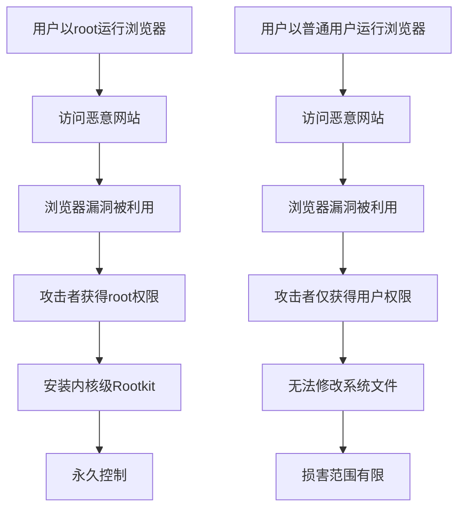
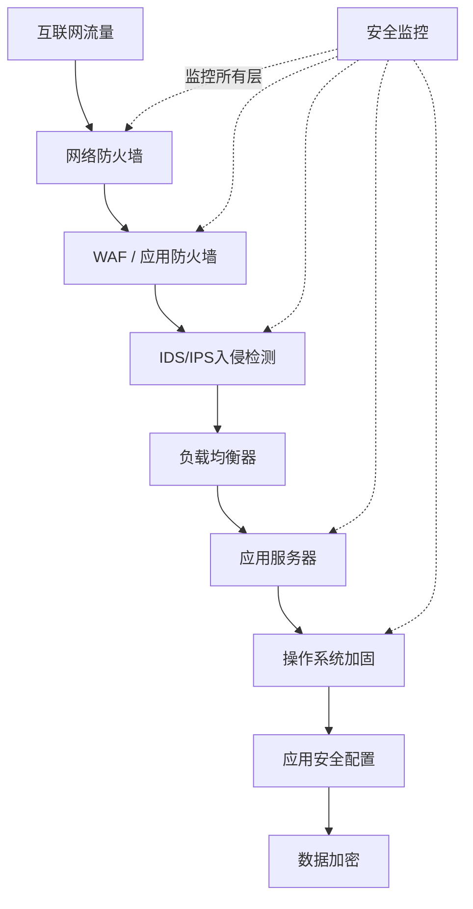
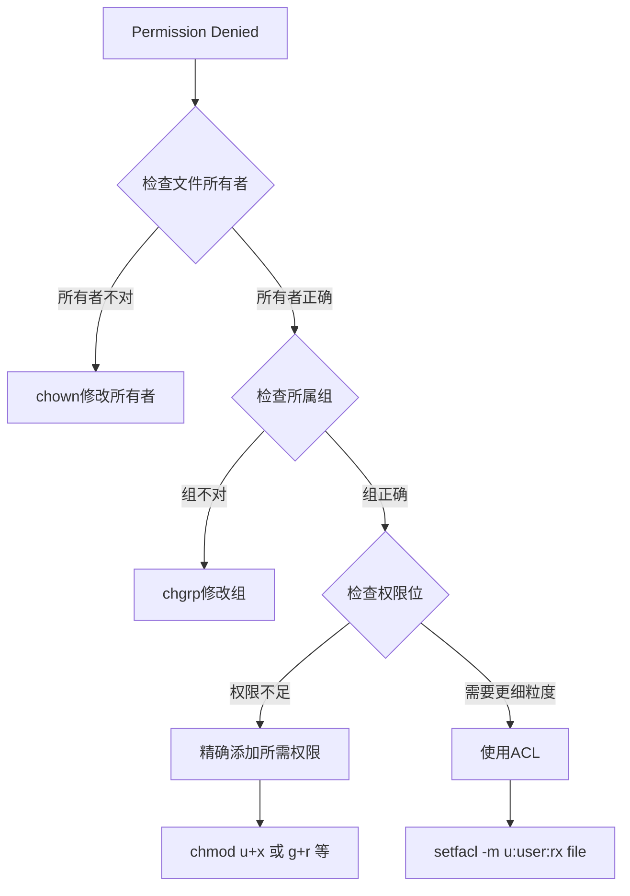
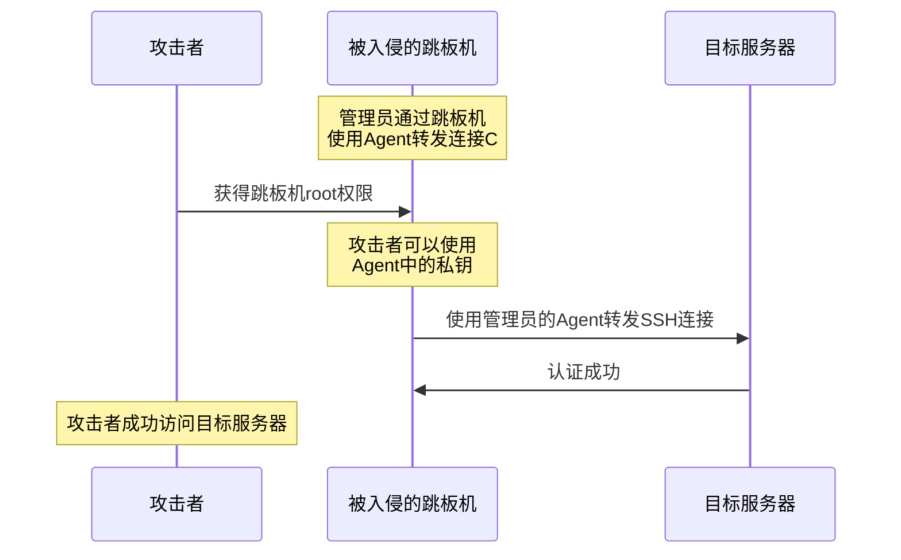
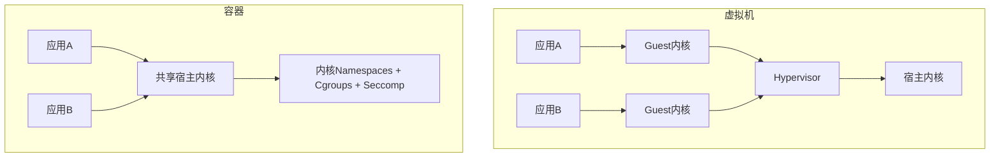
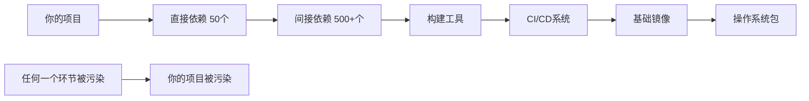

# 第06章 操作系统基础-Linux - 常见误区

安全领域存在大量"常识性错误"——这些认知误区看起来合理，甚至被广泛传播，但在实战中会导致严重的安全漏洞。本章梳理Linux安全领域最常见的14个误区，每个误区都包含真实案例、技术原理分析和纠正方案。

建立正确的安全认知，比学会任何单个工具都重要。因为工具会过时，但安全思维是永恒的。

## 误区一：Linux不会感染病毒

### 错误认知

很多人认为Linux是安全的，不会像Windows那样感染病毒，所以不需要安装杀毒软件。这种观点在桌面用户和初级运维中尤为普遍，甚至一些有经验的开发者也持有这种看法。

### 事实真相

Linux恶意软件不仅存在，而且数量在快速增长。根据AV-TEST研究所的统计，Linux恶意软件样本从2020年的约2万个增长到2023年超过150万个。这个增长速度远超同期Windows恶意软件的增长率。

**1. 服务器是高价值目标**

Linux运行着全球超过90%的公有云工作负载、70%以上的Web服务器和绝大多数容器环境。攻击者的投入产出比决定了他们会重点攻击高价值目标。一个被入侵的Linux服务器可以用于：

- 窃取数据库中的用户数据（一次数据泄露平均损失445万美元，IBM 2023年数据）
- 部署勒索软件加密业务数据
- 作为跳板攻击内网其他系统
- 加入僵尸网络发起DDoS攻击
- 部署挖矿木马消耗计算资源

**2. Linux Rootkit：隐藏在内核中的幽灵**

Rootkit是Linux最危险的恶意软件类型之一。它通过替换系统工具或加载内核模块来隐藏自身存在：

- **用户态Rootkit**：替换`ps`、`ls`、`netstat`等系统工具，让管理员看到"干净"的系统状态。经典案例包括Linux/Ebury（2014年被发现，感染了数万台服务器，通过OpenSSH后门窃取凭证）
- **内核态Rootkit**：通过加载恶意内核模块（LKM）直接修改内核数据结构，可以隐藏进程、文件、网络连接，极难检测。Diamorphine、Reptile等是公开的内核Rootkit框架

```bash
# 检查系统是否被植入Rootkit的基本方法
# 1. 使用静态编译的工具（不依赖可能被替换的系统二进制文件）
# 从可信来源下载静态编译的busybox
wget https://busybox.net/downloads/binaries/1.35.0-x86_64-linux-musl/busybox
chmod +x busybox

# 2. 对比系统工具的哈希值
sha256sum /usr/bin/ps /usr/bin/ls /usr/bin/netstat
# 与包管理器记录的哈希对比
rpm -V procps coreutils net-tools    # RHEL/CentOS
dpkg --verify procps coreutils net-tools  # Debian/Ubuntu

# 3. 使用专业Rootkit检测工具
sudo apt install chkrootkit rkhunter
sudo chkrootkit
sudo rkhunter --check
```

**3. 挖矿木马：最常见的Linux恶意软件**

加密货币挖矿是Linux服务器面临的最常见威胁。攻击者利用以下途径入侵：

- Redis未授权访问（默认无密码，直接写入crontab或SSH公钥）
- Docker API未授权访问（2375端口暴露）
- Web应用漏洞（Log4Shell等RCE漏洞）
- 弱口令SSH暴力破解

2020年TeamTNT组织扫描全网暴露的Docker API和Kubernetes集群，入侵了超过5万台服务器部署挖矿程序。2023年多个Kinsing变种利用Apache ActiveMQ、Confluence等漏洞大规模传播。

**4. 供应链攻击：从源头污染**

供应链攻击是最难防御的威胁之一：

- **包仓库投毒**：攻击者在npm、PyPI、RubyGems中上传名称相似的恶意包（typosquatting）。2021年ua-parser-js包被劫持，周下载量超过800万次
- **镜像投毒**：Docker Hub上存在大量包含挖矿程序的恶意镜像。2020年发现超过30个恶意Docker镜像累计被下载超过500万次
- **构建系统入侵**：2020年SolarWinds事件证明，即使源代码安全，构建系统被入侵也会导致最终产品包含后门

**5. 容器逃逸：隔离并非绝对**

容器共享宿主机内核的特性意味着内核漏洞可以直接导致逃逸。历史上的重大容器逃逸漏洞包括：

| CVE编号 | 影响范围 | 攻击方式 | 发现年份 |
|---------|---------|---------|---------|
| CVE-2019-5736 | runc < 1.0-rc6 | 覆盖宿主机runc二进制文件 | 2019 |
| CVE-2020-15257 | containerd < 1.4.3 | 通过host网络命名空间逃逸 | 2020 |
| CVE-2022-0185 | Linux内核 < 5.16.2 | 堆溢出导致非特权容器逃逸 | 2022 |
| CVE-2022-0492 | Linux内核 < 5.17 | cgroup v1逃逸 | 2022 |
| CVE-2022-25636 | Linux内核 5.4-5.6.10 | nf_tables堆越界写 | 2022 |

### 正确理解

Linux的安全性来自于其权限模型、开源审查机制和社区响应速度，但不代表它不可攻破。安全需要纵深防御：

1. **最小化安装**：只安装必要的软件包，减少攻击面
2. **及时更新**：订阅安全公告，及时修补内核和关键软件漏洞
3. **运行时监控**：部署HIDS（如OSSEC、Wazuh）监控文件完整性、进程行为
4. **网络分层**：防火墙 + IDS/IPS + 网络分段
5. **定期扫描**：使用ClamAV或商业方案扫描恶意软件
6. **镜像安全**：扫描容器镜像漏洞（Trivy、Grype）

## 误区二：用root账户日常操作很方便

### 错误认知

使用root账户可以避免各种权限问题，操作更方便，反正自己的电脑不会有安全问题。很多新手在第一次使用Linux时，因为频繁遇到权限问题，直接切换到root用户。

### 事实真相

**1. 一个误操作就可以摧毁系统**

以root身份执行的命令没有任何安全网：

```bash
# 这些命令在root权限下都是灾难性的
rm -rf /                    # 删除整个文件系统
rm -rf /*                   # 同上（通配符展开）
chmod -R 777 /              # 将所有文件权限改为完全开放
dd if=/dev/zero of=/dev/sda # 覆盖整个磁盘
mkfs.ext4 /dev/sda          # 格式化系统盘
:(){ :|:& };:               # Fork炸弹，耗尽系统资源
```

2021年某云计算公司工程师在root下误执行`rm -rf /home`导致生产环境数据丢失，影响数千客户。同年，fastly全球CDN故障的根因之一也是运维人员在高权限下执行了错误配置。

**2. 恶意软件获得最高权限**

当你以root运行浏览器、编辑器或任何应用程序时，该程序的任何漏洞都会直接获得系统最高权限：



**3. 无法审计和追溯**

当所有操作都是root执行时，无法区分是谁、何时、为何执行了某个操作。在多管理员环境中这是灾难性的：

```bash
# 问题场景：三个人共享root，无法区分操作者
# 正确做法：使用个人sudo + 日志审计
# /var/log/auth.log 中会记录：
# Jun 15 10:23:45 server sudo: alice : TTY=pts/0 ; PWD=/home/alice ; USER=root ; COMMAND=/usr/bin/systemctl restart nginx
```

**4. 违反最小权限原则**

最小权限原则（Principle of Least Privilege）是安全设计的基石：每个进程、每个用户只应拥有完成其任务所需的最小权限。这个原则的价值在于：

- 限制攻击面：漏洞被利用时损害范围有限
- 减少误操作：权限不够时命令会失败，给你思考的机会
- 便于审计：每个操作都可以追溯到具体的人和权限

### 正确理解

```bash
# 1. 创建专用管理用户（不要使用默认的第一用户）
sudo useradd -m -s /bin/bash -G sudo adminuser
sudo passwd adminuser

# 2. 禁用root直接登录（SSH）
echo "PermitRootLogin no" | sudo tee -a /etc/ssh/sshd_config
sudo systemctl restart sshd

# 3. 配置sudo精细化权限
sudo visudo
# 允许特定用户执行特定命令而不需要密码
# adminuser ALL=(ALL) NOPASSWD: /usr/bin/systemctl restart nginx
# adminuser ALL=(ALL) NOPASSWD: /usr/bin/docker ps

# 4. 使用sudo日志审计
echo 'Defaults logfile="/var/log/sudo.log"' | sudo tee -a /etc/sudoers.d/logging
```

**何时可以使用root**：在单用户的开发/测试环境中，风险相对可控。但在任何面向生产或多人共享的系统上，禁止直接使用root是铁律。

## 误区三：防火墙配置了就安全了

### 错误认知

配置了iptables/nftables/ufw防火墙，系统就是安全的了。这种"一劳永逸"的想法在初级运维中非常普遍。

### 事实真相

防火墙只是安全体系中的**一层**，而非全部。下表展示了防火墙能防御和不能防御的攻击类型：

| 攻击类型 | 防火墙能否防御 | 说明 |
|---------|:------------:|------|
| 未授权端口访问 | ✅ 能 | 阻止对未开放端口的连接 |
| 暴力破解（SSH等） | ⚠️ 部分 | 只能限速，不能识别暴力破解 |
| SQL注入 | ❌ 不能 | 应用层攻击，防火墙无法识别 |
| XSS攻击 | ❌ 不能 | 嵌入在正常HTTP请求中 |
| 本地提权 | ❌ 不能 | 不经过网络栈 |
| 已授权端口的漏洞利用 | ❌ 不能 | 端口已开放，流量正常通过 |
| 供应链攻击 | ❌ 不能 | 恶意代码来自合法更新通道 |
| 内核漏洞利用 | ❌ 不能 | 可以直接操作网络栈绕过防火墙规则 |
| DNS隧道数据外泄 | ⚠️ 部分 | 需要专门的DNS监控 |
| 社会工程学攻击 | ❌ 不能 | 不涉及技术层面的网络过滤 |

**1. 规则配置错误是常态**

最危险的防火墙不是没有防火墙，而是看起来在工作但实际无效的防火墙。常见配置错误：

```bash
# 错误1：默认策略是ACCEPT，只添加了DROP规则
# 如果规则链中有遗漏，流量默认通过
iptables -P INPUT ACCEPT    # 危险！应该是DROP
iptables -A INPUT -p tcp --dport 22 -j ACCEPT

# 错误2：忘记阻止出站流量
# 恶意软件可以通过出站连接与C2服务器通信
# 没有出站规则 = 恶意软件可以自由连接外部

# 错误3：规则顺序错误
# iptables从上到下匹配，第一条匹配的规则生效
iptables -A INPUT -j DROP           # 这条规则永远不会匹配到
iptables -A INPUT -p tcp --dport 22 -j ACCEPT  # 因为已经被上面DROP了

# 正确顺序：
iptables -A INPUT -p tcp --dport 22 -j ACCEPT
iptables -A INPUT -j DROP           # 最后才是默认拒绝
```

**2. 出站流量是盲区**

大多数防火墙只关注入站流量（阻止外部访问），但忽略了出站流量。这意味着：

- 恶意软件可以连接C2服务器下载指令
- 数据可以通过DNS、HTTP、HTTPS等正常协议外泄
- 反弹Shell可以建立出站连接

```bash
# 出站防火墙策略示例（严格环境）
iptables -P OUTPUT DROP
iptables -A OUTPUT -m state --state ESTABLISHED,RELATED -j ACCEPT
iptables -A OUTPUT -p tcp --dport 443 -j ACCEPT  # 只允许HTTPS出站
iptables -A OUTPUT -p tcp --dport 80 -j ACCEPT   # HTTP
iptables -A OUTPUT -p udp --dport 53 -j ACCEPT   # DNS
iptables -A OUTPUT -p tcp --dport 53 -j ACCEPT   # DNS over TCP
```

**3. 应用层攻击穿过防火墙**

传统防火墙工作在网络层和传输层，无法检查应用层内容。WAF（Web Application Firewall）才能防御SQL注入、XSS等应用层攻击。

### 正确理解

防火墙是安全体系的第一道防线，需要与以下组件配合构成纵深防御：



## 误区四：chmod 777 能解决权限问题

### 错误认知

遇到"Permission denied"错误时，直接`chmod 777`就好了，反正能用就行。这是新手最常犯的错误之一，甚至在一些"教程"中也能看到这种做法。

### 事实真相

**1. 权限位的完整含义**

在理解777为什么危险之前，需要完整理解Linux权限模型：

```text
权限数字:  rwx rwx rwx
           │   │   │
           │   │   └── 其他用户（Other）
           │   └────── 所属组（Group）
           └────────── 所有者（User）

r (读) = 4    w (写) = 2    x (执行) = 1

777 = rwxrwxrwx = 所有人可读、可写、可执行
755 = rwxr-xr-x = 所有者完全控制，其他人只读和执行
644 = rw-r--r-- = 所有者读写，其他人只读
600 = rw------- = 只有所有者读写
```

**2. 777的具体危害场景**

| 文件类型 | 777的后果 | 实际危害 |
|---------|----------|---------|
| /etc/passwd | 任何人都可以添加用户 | 无需root即可创建后门账户 |
| /etc/shadow | 密码哈希可被读取 | 离线暴力破解所有用户密码 |
| Web目录 | 可上传Web Shell | 完全控制Web服务器 |
| SSH authorized_keys | 可添加公钥 | 无需密码即可登录 |
| SUID程序 | 可被替换为恶意程序 | 提权到root |
| 配置文件 | 可被篡改 | 注入恶意配置 |
| 数据库文件 | 可被读取/篡改 | 数据泄露和篡改 |

**3. 真实案例**

2019年，某WordPress网站因为管理员将wp-content目录设置为777，攻击者上传了PHP Web Shell，进而控制了整个服务器，将其加入挖矿僵尸网络。更严重的是，由于服务器上还托管了其他网站（虚拟主机配置），攻击者通过横向移动感染了同一服务器上的所有网站。

### 正确理解

遇到权限问题时，应该按以下流程排查：



```bash
# 正确的权限设置示例

# Web服务器文件
sudo chown -R www-data:www-data /var/www/html
sudo find /var/www/html -type d -exec chmod 755 {} \;   # 目录：所有者rwx，其他rx
sudo find /var/www/html -type f -exec chmod 644 {} \;   # 文件：所有者rw，其他r

# 配置文件
sudo chmod 600 /etc/shadow
sudo chmod 644 /etc/passwd
sudo chmod 600 ~/.ssh/authorized_keys
sudo chmod 700 ~/.ssh

# 日志文件
sudo chmod 640 /var/log/auth.log

# 使用ACL进行细粒度控制
sudo setfacl -m u:deploy:rx /var/www/html
sudo setfacl -m d:u:deploy:rx /var/www/html    # 默认ACL，新文件自动继承

# 查看ACL
getfacl /var/www/html
```

**权限设置原则**：

1. **默认最严格**：先设置最小权限，不够再逐步放开
2. **文件不给执行位**：除非确实需要执行，文件不应有x权限
3. **目录必须有执行位**：目录的x权限表示可以进入目录，没有x就无法访问目录中的文件
4. **敏感文件600**：密钥、密码文件等敏感数据使用600
5. **Web目录755/644**：Web文件所有者为Web服务器用户，目录755，文件644

## 误区五：关闭SELinux/AppArmor因为太麻烦

### 错误认知

SELinux/AppArmor经常导致应用程序无法正常工作，直接关闭就好了。"我用了很多年都没出过事"是常见的论调。

### 事实真相

**1. 强制访问控制的价值**

SELinux（Security-Enhanced Linux）和AppArmor实现的是**强制访问控制（MAC）**，与传统的自主访问控制（DAC）形成本质区别：

| 特性 | DAC（传统权限） | MAC（SELinux/AppArmor） |
|------|:-------------:|:--------------------:|
| 控制主体 | 文件所有者 | 安全策略管理员 |
| root能否绕过 | 能 | 不能 |
| 粒度 | 用户/组/其他 | 进程级别的类型强制 |
| 配置复杂度 | 低 | 高 |
| 安全强度 | 弱 | 强 |

这意味着即使攻击者获得了root权限，在SELinux Enforcing模式下，被限制的进程仍然无法访问未被策略允许的资源。这是root被突破后的最后一道防线。

**2. 关闭SELinux的真实后果**

CVE-2016-5195（Dirty COW）是一个经典的内核提权漏洞。在SELinux Enforcing模式下，即使漏洞被成功利用，攻击者获得的权限仍然受到SELinux策略的限制。而在SELinux Disabled模式下，攻击者直接获得完整的root权限。

2019年，某大型企业因为开发团队抱怨SELinux导致应用部署困难，IT部门关闭了所有服务器的SELinux。三个月后，一台服务器被入侵，攻击者利用内核漏洞提权后横向移动，最终影响了整个数据中心。事后分析报告明确指出：如果SELinux保持Enforcing模式，攻击者的横向移动路径将被完全阻断。

**3. 正确配置并不难**

大多数SELinux问题可以通过以下方式解决：

```bash
# 查看SELinux状态
getenforce                    # Enforcing / Permissive / Disabled
sestatus                      # 详细状态

# 常见问题：Web服务器无法访问非标准目录
# 错误做法：setenforce 0（关闭SELinux）
# 正确做法：修改文件安全上下文
sudo semanage fcontext -a -t httpd_sys_content_t "/data/www(/.*)?"
sudo restorecon -Rv /data/www

# 常见问题：服务绑定非标准端口
# 例如Nginx需要监听8080端口
sudo semanage port -a -t http_port_t -p tcp 8080

# 排查SELinux拒绝事件
sudo ausearch -m avc -ts recent
sudo sealert -a /var/log/audit/audit.log

# 自动生成策略模块（先在Permissive模式下测试）
sudo setenforce 0             # 临时切换到Permissive
# 执行被阻止的操作
sudo ausearch -m avc -ts recent | audit2allow -M mypolicy
sudo semodule -i mypolicy.pp
sudo setenforce 1             # 切换回Enforcing

# 查看某个布尔值的作用
sudo semanage boolean -l | grep httpd
# 例如：httpd_can_network_connect -> off -> 控制httpd是否可以发起网络连接
sudo setsebool -P httpd_can_network_connect on
```

**AppArmor的等价操作**：

```bash
# 查看AppArmor状态
sudo aa-status

# 查看某个程序的Profile
sudo aa-status | grep nginx

# 将Profile设置为投诉模式（不阻止，只记录）
sudo aa-complain /usr/sbin/nginx

# 将Profile设置为强制模式
sudo aa-enforce /usr/sbin/nginx

# 自动生成Profile
sudo aa-genprof /usr/sbin/nginx
```

### 正确理解

SELinux/AppArmor的正确使用策略：

1. **新系统保持Enforcing**：这是默认设置，不要随意更改
2. **遇到问题先查日志**：`ausearch`和`sealert`是你的朋友
3. **使用布尔值调整策略**：大多数常见需求都有对应的布尔值
4. **自定义策略模块化**：将自定义策略打包为模块，便于管理和迁移
5. **开发环境可以Permissive**：只记录不阻止，但生产环境必须Enforcing
6. **绝不全局关闭**：如果某个服务确实无法兼容，只为该服务添加Permissive规则

## 误区六：SSH密钥认证就万无一失

### 错误认知

使用SSH密钥认证比密码安全得多，所以不需要其他安全措施。把公钥放到服务器上就万事大吉了。

### 事实真相

**1. 私钥泄露的多种途径**

SSH密钥认证的安全性完全依赖于私钥的保密性。私钥可能通过以下途径泄露：

```bash
# 危险：私钥权限设置不当
ls -la ~/.ssh/id_rsa
# -rw-r--r-- 1 user user 2602 ... id_rsa  ← 其他用户可读！
# 应该是：
# -rw------- 1 user user 2602 ... id_rsa

# 危险：没有密码短语保护的私钥
ssh-keygen -t ed25519 -f ~/.ssh/id_ed25519 -N ""  # 空密码！

# 检查私钥是否有密码保护
ssh-keygen -y -f ~/.ssh/id_ed25519
# 如果不需要输入密码就输出公钥，说明私钥没有密码保护
```

**2. SSH Agent转发的跳板攻击**

SSH Agent转发（`ssh -A`）允许你在跳板机上使用本地的私钥进行认证，看起来很方便，但存在严重的安全风险：



**3. 密钥管理混乱**

在大型团队中，密钥管理是一个常见痛点：

- 离职员工的公钥没有从服务器移除
- 同一把私钥用于所有服务器
- 私钥在多个设备间共享（包括个人设备）
- 私钥存储在代码仓库中（GitHub历史中大量泄露的私钥）

**4. SSH证书认证：更优方案**

SSH证书认证解决了密钥认证的大部分问题：

| 特性 | 密钥认证 | 证书认证 |
|------|---------|---------|
| 需要在每台服务器部署公钥 | 是 | 否（只需信任CA） |
| 可以设置有效期 | 否 | 是 |
| 可以限制允许的命令 | 否 | 是 |
| 可以限制来源IP | 否 | 是 |
| 吊销单个密钥 | 需要从所有服务器删除 | 只需吊销证书 |
| 集中管理 | 困难 | 通过CA集中管理 |

```bash
# SSH证书认证配置

# 1. 创建CA密钥对
ssh-keygen -t ed25519 -f /etc/ssh/ca_key -C "SSH CA"

# 2. 签发用户证书（有效期8小时）
ssh-keygen -s /etc/ssh/ca_key -I "alice@company" \
    -n alice,admin \
    -V +8h \
    -z 1 \
    alice_key.pub

# 3. 服务器信任CA
echo "TrustedUserCAKeys /etc/ssh/ca_key.pub" >> /etc/ssh/sshd_config

# 4. 证书支持扩展选项
# 限制来源IP：
ssh-keygen -s /etc/ssh/ca_key -I "alice" \
    -n alice \
    -V +1h \
    -O source-address=10.0.0.0/8 \
    alice_key.pub

# 限制允许执行的命令：
ssh-keygen -s /etc/ssh/ca_key -I "deploy" \
    -n deploy \
    -V +30m \
    -O force-command="/usr/local/bin/deploy.sh" \
    deploy_key.pub
```

### 正确理解

SSH安全加固清单：

```bash
# /etc/ssh/sshd_config 安全配置

# 1. 禁用密码认证
PasswordAuthentication no

# 2. 禁用root直接登录
PermitRootLogin no

# 3. 限制登录用户
AllowUsers alice bob admin

# 4. 限制登录来源IP
# 使用TCP Wrappers或防火墙更灵活
AllowUsers alice@10.0.0.* bob@192.168.1.*

# 5. 使用强加密算法
KexAlgorithms curve25519-sha256,curve25519-sha256@libssh.org
Ciphers chacha20-poly1305@openssh.com,aes256-gcm@openssh.com
MACs hmac-sha2-512-etm@openssh.com,hmac-sha2-256-etm@openssh.com
HostKeyAlgorithms ssh-ed25519,rsa-sha2-512

# 6. 禁用Agent转发（除非明确需要）
AllowAgentForwarding no

# 7. 设置登录超时
LoginGraceTime 30
ClientAliveInterval 300
ClientAliveCountMax 2

# 8. 限制最大尝试次数
MaxAuthTries 3

# 9. 使用fail2ban自动封禁
sudo apt install fail2ban
# /etc/fail2ban/jail.local
# [sshd]
# enabled = true
# maxretry = 3
# bantime = 3600
```

## 误区七：日志太多没必要看

### 错误认知

系统日志太多太杂，反正系统运行正常，不需要查看日志。日志只是占磁盘空间的垃圾数据。

### 事实真相

**1. 日志是入侵检测的核心数据源**

根据Mandiant 2023年报告，企业平均需要204天才能发现入侵。如果没有日志，这个时间将趋向无穷——你永远不会发现。每一次入侵都会在日志中留下痕迹，关键是你是否知道去哪里找：

```bash
# Linux关键日志位置
/var/log/auth.log        # 认证事件（SSH登录、sudo、su）
/var/log/secure          # RHEL/CentOS的认证日志
/var/log/syslog          # 系统通用日志
/var/log/kern.log        # 内核日志
/var/log/apache2/        # Apache访问和错误日志
/var/log/nginx/          # Nginx访问和错误日志
/var/log/mysql/          # MySQL查询和错误日志
/var/log/audit/audit.log # SELinux审计日志
```

**2. 入侵在日志中的典型痕迹**

```bash
# SSH暴力破解痕迹
grep "Failed password" /var/log/auth.log | \
    awk '{print $(NF-3)}' | sort | uniq -c | sort -rn | head -20

# 成功登录（特别是非工作时间）
grep "Accepted" /var/log/auth.log

# 权限提升
grep "sudo:" /var/log/auth.log

# Web Shell访问痕迹（异常的POST请求）
grep "POST" /var/log/nginx/access.log | \
    awk '{print $7}' | sort | uniq -c | sort -rn | head -20

# 异常进程创建（通过auditd）
ausearch -m EXECVE -ts recent

# 文件被修改（关键配置文件）
ausearch -f /etc/passwd -f /etc/shadow -ts this-week
```

**3. 真实案例：日志揭露暗藏3年的入侵**

2020年，某公司安全团队在例行日志审计中发现，一台服务器的auth.log中有规律性的非工作时间SSH登录记录。追溯后发现该服务器在3年前被入侵，攻击者创建了隐藏用户并定期登录窃取数据。如果这家公司从一开始就建立了日志审计机制，入侵在第一天就会被发现。

**4. 自动化日志分析**

人工阅读日志不现实，需要工具辅助：

| 工具 | 类型 | 适用场景 | 复杂度 |
|------|------|---------|:------:|
| logwatch | 日志摘要 | 小型服务器每日报告 | 低 |
| fail2ban | 自动封禁 | 暴力破解防护 | 低 |
| auditd | 审计框架 | 关键文件和系统调用监控 | 中 |
| OSSEC/Wazuh | HIDS | 完整的主机入侵检测 | 中 |
| ELK Stack | 日志平台 | 集中日志管理和分析 | 高 |
| Graylog | 日志平台 | 集中日志管理（比ELK轻量） | 中 |
| Splunk | 商业方案 | 企业级日志分析 | 高 |

```bash
# 安装和配置auditd
sudo apt install auditd

# 监控关键文件的修改
sudo auditctl -w /etc/passwd -p wa -k passwd_changes
sudo auditctl -w /etc/shadow -p wa -k shadow_changes
sudo auditctl -w /etc/sudoers -p wa -k sudoers_changes
sudo auditctl -w /root/.ssh/ -p wa -k root_ssh

# 监控特定系统调用
sudo auditctl -a always,exit -F arch=b64 -S execve -k command_exec

# 搜索审计日志
sudo ausearch -k passwd_changes -ts today
```

### 正确理解

日志管理的正确姿势：

1. **集中收集**：使用rsyslog、Fluentd或Filebeat将日志发送到中央日志服务器，避免攻击者在本地删除日志
2. **设置保留策略**：至少保留90天日志（合规要求通常更长）
3. **自动化分析**：配置告警规则，异常事件实时通知
4. **日志完整性**：将日志发送到只写存储，防止篡改
5. **定期审查**：即使有自动化工具，每周也应人工审查关键日志

## 误区八：容器就是安全隔离

### 错误认知

使用Docker容器就等于安全隔离，容器内的程序不会影响宿主机。容器是"轻量级虚拟机"。

### 事实真相

**1. 容器与虚拟机的本质区别**



| 特性 | 虚拟机 | 容器 |
|------|-------|------|
| 隔离级别 | 硬件级（独立内核） | 进程级（共享内核） |
| 内核漏洞影响 | 仅影响单个VM | 影响所有容器 |
| 资源开销 | 大（完整OS） | 极小（共享内核） |
| 攻击面 | 小（独立内核） | 大（宿主内核） |
| 启动速度 | 慢（分钟级） | 快（秒级） |

**2. 容器逃逸的攻击面**

容器逃逸漏洞的根源在于容器与宿主机共享内核。以下操作可以导致逃逸：

```bash
# 危险1：特权容器
docker run --privileged ubuntu
# 特权容器拥有宿主机的所有capabilities，几乎等同于root

# 危险2：挂载Docker Socket
docker run -v /var/run/docker.sock:/var/run/docker.sock ubuntu
# 控制Docker Socket = 控制宿主机上所有容器

# 危险3：挂载敏感目录
docker run -v /:/host ubuntu
# 可以直接读写宿主机文件系统

# 危险4：使用host网络命名空间
docker run --network=host ubuntu
# 可以看到宿主机的所有网络接口和流量

# 危险5：使用host PID命名空间
docker run --pid=host ubuntu
# 可以看到宿主机的所有进程
```

**3. 容器镜像中的漏洞**

容器镜像可能包含已知漏洞的系统库和应用：

```bash
# 使用Trivy扫描镜像漏洞
trivy image nginx:latest
trivy image node:14

# 扫描结果示例：
# nginx:latest (debian 11)
# ========================
# Total: 156 (UNKNOWN: 0, LOW: 85, MEDIUM: 52, HIGH: 17, CRITICAL: 2)

# 使用Docker Scout（Docker官方工具）
docker scout cves nginx:latest
```

### 正确理解

安全容器使用的完整方案：

```bash
# 1. 不使用特权模式，精确控制capabilities
docker run --cap-drop=ALL --cap-add=NET_BIND_SERVICE nginx

# 2. 只读文件系统 + tmpfs
docker run --read-only --tmpfs /tmp:size=100m nginx

# 3. 使用非root用户运行
# Dockerfile中指定：
# USER 1000:1000
docker run --user 1000:1000 nginx

# 4. 限制资源
docker run --memory=512m --cpus=1 nginx

# 5. 使用seccomp限制系统调用
docker run --security-opt seccomp=custom-profile.json nginx

# 6. 使用AppArmor
docker run --security-opt apparmor=docker-default nginx

# 7. 不挂载敏感目录
# 只挂载必要的数据卷
docker run -v /data/app/uploads:/uploads:ro nginx

# 8. 定期更新基础镜像
docker pull nginx:latest
docker compose build --no-cache

# 9. 使用最小化基础镜像
# 替代 ubuntu:latest（~72MB）→ 使用 distroless/static（~2MB）
# 或 alpine:latest（~5MB）
```

**生产环境容器安全检查清单**：

- [ ] 不使用`--privileged`模式
- [ ] 不挂载Docker Socket
- [ ] 不使用`host`网络和PID命名空间
- [ ] 使用非root用户运行
- [ ] 只读文件系统 + 必要的tmpfs
- [ ] Drop所有capabilities，按需添加
- [ ] 使用seccomp限制系统调用
- [ ] 使用最小化基础镜像
- [ ] 定期扫描镜像漏洞
- [ ] 镜像签名验证
- [ ] 网络策略限制容器间通信
- [ ] 日志发送到外部日志系统

## 误区九：Linux不需要备份

### 错误认知

Linux很稳定，不会像Windows那样蓝屏，所以不需要备份。系统运行了几年都没出过问题。

### 事实真相

**1. 数据丢失的常见原因**

| 原因 | 占比 | 是否与OS相关 |
|------|:----:|:-----------:|
| 硬件故障 | 40% | 否 |
| 人为误操作 | 30% | 否 |
| 软件/逻辑错误 | 15% | 部分 |
| 勒索软件 | 10% | 部分 |
| 自然灾害/盗窃 | 5% | 否 |

Linux的稳定性只能减少"软件/逻辑错误"导致的数据丢失，对其他原因无能为力。

**2. 勒索软件已瞄准Linux**

Linux勒索软件在过去几年急剧增长：

- **REvil/Sodinokibi**：2021年开始攻击Linux ESXi虚拟化平台
- **Hive**：2022年攻击了多个Linux和VMware ESXi环境
- **BlackBasta**：同时针对Windows和Linux
- **Cheerscrypt**：2022年专门针对Linux的勒索软件

这些勒索软件会加密所有文件，没有备份就只能支付赎金（且支付后也不一定能恢复数据）。

**3. 3-2-1备份原则**

```text
3份副本：原始数据 + 2份备份
2种介质：例如本地磁盘 + 云存储/磁带
1份异地：至少一份备份存储在物理隔离的位置
```

```bash
# 使用rsync进行本地备份
rsync -avz --delete /data/ /backup/data/

# 使用restic进行加密增量备份（支持本地和远程）
restic init --repo /backup/restic-repo
restic backup /data /etc --repo /backup/restic-repo
restic backup /data --repo sftp:backup-server:/backup/restic-repo

# 使用borgbackup进行去重压缩备份
borg init --encryption=repokey /backup/borg-repo
borg create /backup/borg-repo::daily-{now:%Y-%m-%d} /data /etc
borg prune --keep-daily=7 --keep-weekly=4 --keep-monthly=6 /backup/borg-repo

# 使用cron自动执行
# 每天凌晨2点执行备份
0 2 * * * /usr/local/bin/backup-script.sh >> /var/log/backup.log 2>&1
```

**4. 备份不测试等于没有备份**

定期测试备份的恢复能力是备份策略中最被忽视的环节：

```bash
# 测试restic备份恢复
restic snapshots --repo /backup/restic-repo
restic restore latest --target /tmp/restore-test --repo /backup/restic-repo
diff -r /data /tmp/restore-test/data

# 测试完整系统恢复
# 1. 在测试环境中从备份恢复
# 2. 验证所有关键服务正常启动
# 3. 验证数据完整性
# 4. 记录恢复步骤和时间
# 5. 定期（至少每季度）重复此过程
```

### 正确理解

备份策略应该是分层的：

1. **实时同步**：数据库主从复制、文件系统RAID（这不是备份！）
2. **每日增量**：使用restic/borg进行增量备份
3. **每周全量**：完整的系统快照
4. **异地备份**：至少一份备份存储在不同物理位置
5. **定期测试**：每季度测试恢复流程

## 误区十：开源软件更安全

### 错误认知

开源软件因为源码公开，经过众人审查，所以一定比闭源软件安全。"足够多的眼睛，所有bug都是浅层的"（Linus定律）。

### 事实真相

**1. "众人审查"是一个神话**

大部分开源项目的代码从未被安全审计。GitHub上有超过2亿个仓库，但真正有安全专家审查代码的项目凤毛麟角。即使是广泛使用的项目：

- **Heartbleed（CVE-2014-0160）**：OpenSSL被全球数百万服务器使用，但核心代码只有少数人维护。这个严重漏洞（可泄露服务器内存中的私钥和密码）存在了超过两年才被发现
- **Log4Shell（CVE-2021-44228）**：Log4j被350亿台设备使用，但漏洞在代码中存在了8年。该项目只有3名活跃维护者
- **xz后门（CVE-2024-3094）**：2024年3月，xz压缩库中发现精心植入的后门，攻击者通过数年的社会工程学渗透成为维护者

**2. 供应链攻击面**



2023年Socket Security报告显示：
- npm生态中发现超过15,000个恶意包
- PyPI中超过5,000个恶意包
- 平均每个JavaScript项目依赖725个包

**3. "开源"不等于"安全审计"**

开源代码的审查程度取决于：

- 项目维护者的安全意识
- 是否有安全团队参与
- 是否有漏洞赏金计划
- 社区的活跃程度和贡献者质量
- 代码复杂度

### 正确理解

安全使用开源软件的方法：

```bash
# 1. 锁定依赖版本
# package-lock.json (npm)
# Pipfile.lock (pipenv)
# poetry.lock (poetry)
# go.sum (Go modules)

# 2. 使用依赖扫描工具
# npm
npm audit
npx audit-ci --critical

# Python
pip-audit
safety check -r requirements.txt

# Go
govulncheck ./...

# 3. 使用SBOM（软件物料清单）
# 生成SBOM
syft packages dir:./project -o spdx-json > sbom.json

# 扫描SBOM中的漏洞
grype sbom:./sbom.json

# 4. 定期更新依赖（但先测试）
npm outdated
pip list --outdated

# 5. 审查依赖的维护状态
# 查看项目最后更新时间、Issue响应速度、维护者数量
```

## 误区十一：Linux不需要更新

### 错误认知

系统运行正常就不要更新了，更新可能引入新问题。"If it ain't broke, don't fix it."

### 事实真相

**1. 未更新系统的攻击面**

内核漏洞是最高危的漏洞类型，因为它影响系统上运行的所有进程。近年来的重大内核漏洞：

| CVE编号 | 漏洞名称 | 影响 | CVSS |
|---------|---------|------|:----:|
| CVE-2016-5195 | Dirty COW | 本地提权 | 7.8 |
| CVE-2021-4034 | PwnKit | pkexec本地提权（所有主流Linux） | 7.8 |
| CVE-2021-3156 | Baron Samedit | sudo堆溢出提权 | 7.8 |
| CVE-2022-0847 | Dirty Pipe | 覆盖任意只读文件 | 7.8 |
| CVE-2022-2588 | 路由表UAF | 非特权容器逃逸 | 7.8 |
| CVE-2023-0386 | OverlayFS | 非特权容器逃逸 | 7.8 |
| CVE-2023-32233 | nf_tables | 非特权本地提权 | 7.8 |
| CVE-2023-4911 | Looney Tunables | glibc ld.so提权 | 7.8 |
| CVE-2024-1086 | nf_tables | 非特权本地提权 | 7.8 |

这些漏洞的共同特点是：影响范围极广，几乎所有未更新的Linux系统都受影响。

**2. "更新导致问题"的根源**

更新导致问题通常是因为：

- 在生产环境直接更新（没有先在测试环境验证）
- 没有回滚计划
- 更新了不兼容的大版本
- 没有阅读更新日志（changelog）

**3. 正确的更新策略**

```bash
# 1. 配置安全更新自动安装（Debian/Ubuntu）
sudo apt install unattended-upgrades
sudo dpkg-reconfigure unattended-upgrades

# /etc/apt/apt.conf.d/50unattended-upgrades
# Unattended-Upgrade::Allowed-Origins {
#     "${distro_id}:${distro_codename}-security";
# };

# 2. RHEL/CentOS使用yum-cron或dnf-automatic
sudo yum install yum-cron
# /etc/yum/yum-cron.conf
# update_cmd = security
# apply_updates = yes

# 3. 手动更新流程
# 测试环境 -> 验证 -> 生产环境分批更新
sudo apt update && sudo apt upgrade -y    # Debian/Ubuntu
sudo yum update --security               # RHEL/CentOS（仅安全更新）

# 4. 内核更新后需要重启
# 检查是否需要重启
cat /var/run/reboot-required  # Debian/Ubuntu
needs-restarting -r            # RHEL/CentOS

# 5. 使用kpatch/livepatch进行不重启的内核热补丁
sudo kpatch install kpatch-patch-<version>.rpm  # RHEL
canonical-livepatch enable <token>               # Ubuntu
```

### 正确理解

更新策略应该是：

1. **安全更新自动安装**：配置unattended-upgrades或yum-cron
2. **功能更新手动管理**：在测试环境验证后再更新生产环境
3. **内核更新有计划地重启**：使用热补丁减少停机时间
4. **订阅安全公告**：关注CVE和发行版安全公告

## 误区十二：加密了就安全了

### 错误认知

使用了全盘加密（LUKS）或数据库加密，数据就安全了。

### 事实真相

**1. 运行时数据是明文的**

磁盘加密只在系统关闭时保护数据。一旦系统启动并解锁，数据对所有进程都是明文可访问的：

```bash
# LUKS加密在运行时的状态
lsblk -o NAME,FSTYPE,MOUNTPOINT,SIZE
# sda
# ├─sda1        ext4        /boot        1G
# └─sda2        crypto_LUKS              99G
#   └─sda2_crypt ext4        /            99G
# 系统运行时，/dev/mapper/sda2_crypt上的数据是明文的
```

攻击者如果在系统运行时入侵，加密毫无意义。加密保护的是：

- 物理盗窃（关机状态下的硬盘）
- 退役硬盘处理（不安全删除的数据）
- 备份存储（备份文件被窃取）

**2. 密钥管理才是关键**

加密系统的安全性取决于密钥管理：

- 密钥存储在哪里？如果密钥和加密数据在同一磁盘，物理访问者可以一起获取
- 密钥是否使用了强密码短语保护？
- 密钥备份是否安全？
- 密钥是否定期轮换？

**3. 加密不等于认证和完整性**

加密只提供机密性（Confidentiality），不提供：

- **认证（Authentication）**：加密数据仍然可能被篡改（密文篡改）
- **完整性（Integrity）**：需要额外的机制验证数据未被修改
- **不可否认性（Non-repudiation）**：加密本身不提供来源证明

### 正确理解

加密是安全体系的一部分，但需要与其他机制配合：

1. **数据静态加密**（LUKS/dm-crypt）：保护物理介质
2. **传输加密**（TLS）：保护网络传输
3. **应用层加密**：保护特定敏感字段
4. **密钥管理**：使用专用密钥管理系统（HashiCorp Vault、AWS KMS）
5. **访问控制**：加密不替代认证和授权

## 误区十三：内核是最安全的，不需要加固

### 错误认知

Linux内核经过了数十年的开发和审查，是系统中最安全的部分，不需要额外加固。

### 事实真相

**1. 内核漏洞数量持续增长**

Linux内核是世界上最大的开源项目之一（超过2800万行代码），其漏洞数量也相应庞大：

- 2020年：约170个内核CVE
- 2021年：约200个内核CVE
- 2022年：约250个内核CVE
- 2023年：约280个内核CVE

代码量越大，攻击面越大。内核中的驱动程序、文件系统实现、网络协议栈都是漏洞高发区。

**2. 内核加固选项**

Linux内核提供了多种加固机制，但很多发行版默认没有启用：

```bash
# 1. 查看当前内核安全参数
cat /proc/cmdline
sysctl -a | grep -E "kptr|dmesg|perf|unprivileged"

# 2. 内核加固参数（/etc/sysctl.d/99-security.conf）
# 隐藏内核指针（防止内核地址泄露）
kernel.kptr_restrict = 2

# 限制dmesg访问（防止内核日志泄露地址）
kernel.dmesg_restrict = 1

# 禁用非特权用户使用perf
kernel.perf_event_paranoid = 3

# 禁用非特权用户加载BPF
kernel.unprivileged_bpf_disabled = 1

# 启用地址空间布局随机化（ASLR）
kernel.randomize_va_space = 2

# 禁用SysRq（防止远程触发内核调试功能）
kernel.sysrq = 0

# 限制对kernel core dump的访问
fs.suid_dumpable = 0

# 禁用非特权用户命名空间（减少攻击面）
kernel.unprivileged_userns_clone = 0
# 注意：这会影响Docker等需要用户命名空间的应用

# 3. 禁用不需要的内核模块
# /etc/modprobe.d/blacklist-security.conf
# blacklist cramfs
# blacklist freevxfs
# blacklist hfs
# blacklist hfsplus
# blacklist udf
# blacklist dccp
# blacklist sctp
# blacklist rds
# blacklist tipc

# 4. 启用内核锁定（Kernel Lockdown）
# 需要UEFI Secure Boot
echo lockdown=integrity | sudo tee -a /etc/default/grub
sudo update-grub

# 5. 使用LSM（Linux Security Module）
# SELinux、AppArmor、TOMOYO、Smack等
# 通过启动参数选择：
# lsm=landlock,lockdown,yama,integrity,apparmor,bpf
```

**3. 加固检查工具**

```bash
# Lynis - 系统安全审计工具
sudo apt install lynis
sudo lynis audit system

# 输出包含大量内核安全检查项：
# - 内核参数是否安全
# - 是否启用了ASLR
# - 是否有不必要的内核模块
# - 文件系统挂载选项是否安全

# 使用CIS Benchmark进行系统加固
# 下载CIS Benchmark脚本
# https://www.cisecurity.org/benchmark/linux
```

### 正确理解

内核加固应该是系统部署的第一步：

1. **最小化内核模块**：禁用不需要的模块和文件系统
2. **启用安全参数**：隐藏内核指针、限制dmesg、禁用非特权功能
3. **保持更新**：及时修补内核漏洞
4. **使用LSM**：SELinux或AppArmor提供额外的访问控制
5. **定期审计**：使用Lynis等工具检查加固状态

## 误区十四：脚本中的硬编码密码无所谓

### 错误认知

这只是一个小脚本/内部工具，密码直接写在脚本里也没关系。"反正在内网，别人看不到。"

### 事实真相

**1. 硬编码密码的泄露途径**

```bash
# 危险的脚本写法
#!/bin/bash
mysql -u root -p"MySecretPass123!" -e "SELECT * FROM users"
curl -u admin:password123 https://api.internal.com/data
sshpass -p "your_password" ssh user@server

# 这些密码可以通过以下途径泄露：
# 1. /proc文件系统：其他用户可以通过 /proc/<pid>/cmdline 读取命令行参数
# 2. bash_history：命令历史记录
cat ~/.bash_history | grep -i password

# 3. 进程列表：ps aux 可以看到命令行参数
ps aux | grep mysql

# 4. 日志文件：某些日志会记录完整命令
grep -r "password" /var/log/

# 5. 代码仓库：不小心提交到Git
git log -p --all -S "password"

# 6. 内存转储：core dump文件可能包含密码
```

**2. 真实事件**

2019年，Capital One数据泄露事件影响了1亿用户。事后分析发现，泄露的源代码仓库中包含大量硬编码的AWS凭证和密码。2021年，Samsung意外将敏感密钥和密码硬编码在公开的Tizen源代码中。

GitHub每天自动扫描公开仓库中的密钥泄露，2022年报告了超过170万个潜在的秘密泄露事件。

**3. 正确的密钥管理方式**

```bash
# 方式1：环境变量
export DB_PASSWORD="secret"
mysql -u root -p"$DB_PASSWORD"

# 方式2：密钥文件（权限600）
echo "secret" > ~/.mysql_password
chmod 600 ~/.mysql_password
mysql -u root -p"$(cat ~/.mysql_password)"

# 方式3：使用secret管理工具
# HashiCorp Vault
export VAULT_ADDR="https://vault.internal.com:8200"
vault kv get -field=password secret/mysql/creds

# AWS Secrets Manager
aws secretsmanager get-secret-value --secret-id prod/mysql/password \
    --query SecretString --output text

# 方式4：使用密码提示（交互式输入）
read -s -p "MySQL Password: " DB_PASS
mysql -u root -p"$DB_PASS"

# 方式5：使用GPG加密
# 加密密码文件
gpg -c ~/.mysql_password.plain
# 解密使用
mysql -u root -p"$(gpg -d ~/.mysql_password.plain.gpg 2>/dev/null)"
```

```bash
# 检查现有脚本中的硬编码密码
# 使用detect-secrets工具
pip install detect-secrets
detect-secrets scan /path/to/scripts/

# 使用trufflehog扫描Git历史
trufflehog git file:///path/to/repo

# 使用git-secrets（AWS官方工具）
git secrets --install
git secrets --register-aws  # 检测AWS密钥
git secrets --scan
```

### 正确理解

密钥管理的原则：

1. **永远不要硬编码密码**：即使是"临时"脚本
2. **使用专用密钥管理系统**：Vault、AWS Secrets Manager、Azure Key Vault
3. **密钥轮换**：定期更换密码和密钥
4. **最小权限**：密钥只赋予必要的权限
5. **审计和监控**：记录密钥的访问和使用
6. **代码扫描**：在CI/CD中集成密钥泄露检测

## 自查清单

以下是本章涉及的所有误区的自查清单。建议定期（至少每季度）使用此清单对系统进行安全审查：

### 权限与账户

| 检查项 | 命令/方法 | 安全标准 |
|-------|----------|---------|
| root直接SSH登录 | `grep PermitRootLogin /etc/ssh/sshd_config` | no |
| sudo用户审计 | `grep sudo /var/log/auth.log` | 有记录 |
| SUID文件数量 | `find / -perm -4000 -type f 2>/dev/null \| wc -l` | 最小化 |
| /etc/passwd权限 | `stat -c '%a' /etc/passwd` | 644 |
| /etc/shadow权限 | `stat -c '%a' /etc/shadow` | 600 |
| 无密码用户 | `awk -F: '($2 == "" \|\| $2 == "!") {print $1}' /etc/shadow` | 无 |
| SSH密钥权限 | `stat -c '%a' ~/.ssh/id_*` | 600 |

### 网络与防火墙

| 检查项 | 命令/方法 | 安全标准 |
|-------|----------|---------|
| 默认入站策略 | `iptables -L INPUT -n \| head -1` | DROP |
| 默认出站策略 | `iptables -L OUTPUT -n \| head -1` | DROP（严格）或 ACCEPT |
| 开放端口 | `ss -tlnp` | 最小化 |
| Docker端口 | `ss -tlnp \| grep 2375` | 不应暴露 |
| Redis端口 | `ss -tlnp \| grep 6379` | 仅本地或加密 |

### 系统更新

| 检查项 | 命令/方法 | 安全标准 |
|-------|----------|---------|
| 安全更新自动安装 | `dpkg -l unattended-upgrades` | 已安装 |
| 内核版本 | `uname -r` | 最新安全版本 |
| 待重启检查 | `cat /var/run/reboot-required` | 无 |
| 发行版支持状态 | `lsb_release -a` | 仍在支持期内 |

### 日志与监控

| 检查项 | 命令/方法 | 安全标准 |
|-------|----------|---------|
| auditd运行状态 | `systemctl status auditd` | active |
| 日志轮转配置 | `cat /etc/logrotate.conf` | 有配置 |
| 日志集中收集 | 检查rsyslog/Fluentd配置 | 已配置 |
| fail2ban状态 | `systemctl status fail2ban` | active |

### 容器安全

| 检查项 | 命令/方法 | 安全标准 |
|-------|----------|---------|
| 特权容器 | `docker ps --format '{{.Names}}' -f status=running \| xargs docker inspect --format '{{.HostConfig.Privileged}}'` | 全部false |
| Docker Socket挂载 | `docker ps --format '{{.Names}}' \| xargs docker inspect --format '{{range .Mounts}}{{.Source}} {{end}}' \| grep docker.sock` | 无 |
| 镜像漏洞扫描 | `trivy image <image>` | 无Critical/High |

### 备份

| 检查项 | 命令/方法 | 安全标准 |
|-------|----------|---------|
| 备份存在性 | `ls -la /backup/` | 有最新备份 |
| 备份完整性 | 恢复测试 | 定期验证 |
| 异地备份 | 检查远程存储 | 有 |

## 总结

Linux安全领域的14个常见误区可以归结为三个核心认知：

**1. 安全是过程，不是状态**

没有一劳永逸的安全方案。防火墙配置好了不是终点，而是起点。安全需要持续的监控、更新、审计和改进。

**2. 安全是纵深的，不是单层的**

任何一个单独的安全措施都不是万能的。防火墙不能替代WAF，加密不能替代访问控制，容器不能替代虚拟机的隔离强度。纵深防御意味着在每一层都设置防线。

**3. 安全是主动的，不是被动的**

不要等到被入侵了才想到安全。主动加固、主动监控、主动更新，比被动响应的成本低几个数量级。修复一个已知漏洞的成本约60美元，而处理一次数据泄露的平均成本约445万美元。

建立正确的安全观念，是成为合格安全工程师的基础。工具和技巧会随技术演进而变化，但这些安全原则是永恒的。
