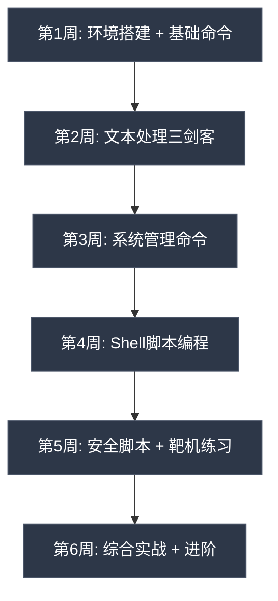

# 第06章 操作系统基础-Linux - 练习方法

> 学习Linux没有捷径，唯一的秘诀是"用"。但"用"需要方法——盲目敲命令不如系统化练习。本节提供从零基础到安全评估能力的完整练习路径，每一阶段都有明确的目标、可执行的任务和自检标准。

## 一、学习环境搭建

### 1.1 环境方案对比

不同场景下适合不同的环境方案。选择时需要权衡安全性、性能、便利性和学习目标。

| 方案 | 成本 | 性能 | 隔离性 | 适用场景 | 推荐指数 |
|------|------|------|--------|----------|----------|
| VirtualBox虚拟机 | 免费 | 中等 | 完全隔离 | 初学者、安全实验 | ★★★★★ |
| VMware虚拟机 | 免费(个人) | 较好 | 完全隔离 | 初学者、安全实验 | ★★★★☆ |
| WSL2 | 免费 | 好 | 部分隔离 | Windows用户日常使用 | ★★★★☆ |
| Docker容器 | 免费 | 极好 | 进程隔离 | 快速实验、CI/CD | ★★★☆☆ |
| 双系统 | 免费 | 最好 | 硬件级 | 长期主力使用 | ★★★☆☆ |
| 云服务器(VPS) | $2.5-5/月 | 可选 | 硬件级 | 网络实验、7×24服务 | ★★★★☆ |
| 物理机(旧电脑) | 免费 | 好 | 硬件级 | 深度学习、内核实验 | ★★★★★ |

**推荐组合**：虚拟机(日常练习) + 云服务器(网络实验) + 物理机(进阶内核实验)。

### 1.2 虚拟机环境搭建

**VirtualBox + Ubuntu/Kali 双虚拟机方案**：

```bash
# 1. 下载VirtualBox
# https://www.virtualbox.org/wiki/Downloads

# 2. 下载ISO镜像
# Ubuntu 22.04 LTS: https://ubuntu.com/download/desktop
# Kali Linux: https://www.kali.org/get-kali/

# 3. 创建虚拟机（推荐配置）
# Ubuntu虚拟机: 4GB内存、40GB硬盘、2个CPU核心
# Kali虚拟机: 2GB内存、30GB硬盘、2个CPU核心

# 4. 安装后必须做的配置
sudo apt update && sudo apt upgrade -y
sudo apt install -y vim git curl wget net-tools build-essential \
    openssh-server htop tmux tree unzip software-properties-common

# 5. 安装VirtualBox增强功能（提升性能和共享文件夹）
# 菜单 → 设备 → 安装增强功能
sudo mount /dev/cdrom /mnt
sudo /mnt/VBoxLinuxAdditions.run
sudo umount /mnt
```

**虚拟机快照策略**：

```text
初始安装 → 基础配置快照 → 安装工具快照 → 实验前快照
                                          ↓
                                  实验失败 → 恢复快照
                                  实验成功 → 创建新快照
```

每次进行危险实验前（提权测试、内核模块加载、网络配置修改）必须创建快照。一个被搞坏的虚拟机可以30秒恢复，而重装需要30分钟。

### 1.3 WSL2环境搭建（Windows用户）

```powershell
# 启用WSL2（PowerShell管理员模式）
wsl --install -d Ubuntu-22.04

# 重启后设置用户名和密码

# 进入WSL后安装基础工具
sudo apt update && sudo apt upgrade -y
sudo apt install -y vim git curl wget net-tools build-essential

# WSL2特有配置：修改/etc/wsl.conf
cat << 'EOF' | sudo tee /etc/wsl.conf
[boot]
systemd=true

[automount]
enabled=true
options="metadata,umask=22,fmask=11"

[network]
generateResolvConf=true
EOF

# 重启WSL生效
# PowerShell中执行: wsl --shutdown
```

**WSL2的限制**（安全实验需注意）：
- 不支持内核模块加载（`insmod`不可用）
- 不支持systemd的部分功能（新版本已支持）
- 网络栈与Windows共享，某些网络实验受限
- 无法运行需要硬件访问的工具（如某些无线网卡工具）

对于安全实验，WSL2适合做命令行练习和脚本开发，真正的渗透测试实验建议使用虚拟机。

### 1.4 Docker快速实验环境

Docker适合快速搭建可重复销毁的实验环境：

```bash
# 拉取Kali镜像
docker pull kalilinux/kali-rolling
docker run -it --name kali-lab kalilinux/kali-rolling /bin/bash

# 在容器内安装工具
apt update && apt install -y kali-linux-headless nmap netcat-openbsd

# 搭建多容器实验网络
# docker-compose.yml
cat << 'EOF' > docker-compose.yml
version: '3'
services:
  attacker:
    image: kalilinux/kali-rolling
    command: sleep infinity
    networks:
      - labnet
  target:
    image: vulhub/struts2:s2-045
    ports:
      - "8080:8080"
    networks:
      - labnet
networks:
  labnet:
    driver: bridge
EOF
docker-compose up -d
```

### 1.5 云服务器环境

适合练习网络相关操作和部署长期运行的服务：

```bash
# 推荐的廉价VPS提供商
# Vultr: $2.5/月 (1CPU/512MB) - 按小时计费，用完即删
# DigitalOcean: $4/月 (1CPU/512MB)
# 搬瓦工: $49.99/年 (1CPU/1GB)

# 服务器初始化（拿到VPS后第一件事）
# 1. 修改SSH端口
sudo sed -i 's/#Port 22/Port 2222/' /etc/ssh/sshd_config
# 2. 禁用root密码登录
sudo sed -i 's/#PermitRootLogin yes/PermitRootLogin no/' /etc/ssh/sshd_config
# 3. 重启SSH
sudo systemctl restart sshd

# ⚠️ 重要：VPS适合练习网络操作，不适合练习危险的本地提权实验
# 提权实验请在本地虚拟机中进行
```

## 二、命令行基础练习

### 2.1 文件与目录操作（第1-2天）

**学习目标**：在不查文档的情况下，能熟练完成文件和目录的创建、编辑、复制、移动、删除、查找和权限管理。

**练习一：目录结构操作**

```bash
# 创建项目目录结构
mkdir -p ~/lab/{src,bin,docs,logs,backup,config}
cd ~/lab

# 用tree查看结构（需要安装: sudo apt install tree）
tree
# 输出:
# .
# ├── backup
# ├── bin
# ├── config
# ├── docs
# ├── logs
# └── src

# 练习：在src下创建多层目录
mkdir -p src/{core,utils,plugins}/{include,source}
tree src/
```

**练习二：文件创建与编辑**

```bash
# 方法1：touch创建空文件
touch docs/readme.md

# 方法2：echo写入内容
echo "# Lab Project" > docs/readme.md
echo "Created: $(date)" >> docs/readme.md

# 方法3：cat heredoc写入多行
cat > config/settings.conf << 'EOF'
# 应用配置文件
server_port=8080
log_level=debug
max_connections=100
data_dir=/opt/data
EOF

# 方法4：vim编辑器基础操作
vim config/settings.conf
# vim基本操作速记：
#   i     → 进入插入模式
#   Esc   → 退出插入模式
#   :wq   → 保存退出
#   :q!   → 不保存退出
#   dd    → 删除当前行
#   yy    → 复制当前行
#   p     → 粘贴
#   /word → 搜索word
#   :set number → 显示行号

# 方法5：tee同时输出到屏幕和文件
echo "Log entry: $(date)" | tee -a logs/app.log
```

**练习三：文件操作**

```bash
# 复制
cp docs/readme.md docs/readme_backup.md
cp -r src/ backup/src_snapshot/    # 递归复制目录

# 移动/重命名
mv docs/readme.md docs/index.md
mv backup/src_snapshot/ backup/src_$(date +%Y%m%d)/

# 删除（⚠️ 养成习惯：先ls确认再rm）
rm docs/readme_backup.md
rm -i docs/index.md    # -i 确认模式，推荐日常使用
rm -rf backup/         # ⚠️ 危险操作，务必确认路径正确

# 实用技巧：安全删除（移到回收站而非直接删除）
mkdir -p ~/.trash
alias safe-rm='mv -t ~/.trash/'
# 使用: safe-rm file.txt
# 恢复: mv ~/.trash/file.txt .
```

**练习四：文件查找**

```bash
# 按名称查找
find /etc -name "*.conf" -type f 2>/dev/null
find ~ -name "README*" -type f

# 按大小查找（查找大于100MB的文件）
find / -size +100M -type f 2>/dev/null | head -20

# 按时间查找（最近24小时内修改的文件）
find /var/log -mtime -1 -type f

# 按权限查找（这是安全审计的核心技能）
find / -perm -4000 -type f 2>/dev/null    # 查找SUID文件
find / -perm -2000 -type f 2>/dev/null    # 查找SGID文件
find / -perm -o+w -type d 2>/dev/null     # 查找所有人可写的目录

# 按所有者查找
find / -nouser -o -nogroup 2>/dev/null    # 查找无主文件

# locate快速查找（需要先更新数据库）
sudo updatedb
locate "*.conf" | grep ssh

# which和whereis
which python3          # 查找命令位置
whereis nginx          # 查找命令、源码、手册
```

**练习五：权限管理**

```bash
# 查看权限
ls -la /etc/passwd
# -rw-r--r-- 1 root root 2847 Jun 15 10:30 /etc/passwd

# 数字模式修改权限
chmod 755 script.sh       # rwxr-xr-x
chmod 644 config.conf     # rw-r--r--
chmod 600 secret.key      # rw-------

# 符号模式修改权限
chmod u+x script.sh       # 给所有者加执行权限
chmod go-w config.conf    # 去掉组和其他的写权限
chmod a+r readme.md       # 给所有人加读权限

# 修改所有者
sudo chown user:group file.txt
sudo chown -R user:group directory/

# 练习：模拟权限问题诊断
echo "secret data" > /tmp/test_secret
chmod 600 /tmp/test_secret
ls -la /tmp/test_secret
# 切换到另一个用户，尝试读取
su - testuser -c "cat /tmp/test_secret"    # 应该被拒绝
```

**自检清单**：
- [ ] 能用5种以上方法创建文件
- [ ] 理解相对路径（`../`、`./`）和绝对路径（`/home/user/`）的区别
- [ ] 能用`find`按名称、大小、时间、权限、所有者查找文件
- [ ] 理解`rwx`权限对文件和目录的不同含义
- [ ] 能用数字和符号两种方式修改权限
- [ ] 理解SUID/SGID/Sticky Bit的含义和安全风险

### 2.2 文本处理三剑客（第3-4天）

**学习目标**：能用grep/sed/awk完成日志分析、数据提取、批量替换等常见任务。

**准备练习数据**：

```bash
mkdir -p ~/lab/text && cd ~/lab/text

# 员工数据
cat > employees.csv << 'EOF'
id,name,department,position,salary,hire_date
1,张三,技术部,工程师,15000,2022-03-15
2,李四,市场部,经理,20000,2020-06-01
3,王五,技术部,高级工程师,25000,2019-09-20
4,赵六,人事部,主管,18000,2021-01-10
5,钱七,技术部,架构师,35000,2018-04-05
6,孙八,市场部,专员,12000,2023-07-22
7,周九,技术部,工程师,16000,2022-11-30
8,吴十,财务部,会计,14000,2021-08-15
9,郑一,技术部,实习生,8000,2024-01-08
10,冯二,市场部,总监,30000,2017-02-28
EOF

# 模拟日志数据
cat > access.log << 'EOF'
192.168.1.100 - - [25/Jun/2026:10:00:01 +0800] "GET /index.html HTTP/1.1" 200 5234
192.168.1.101 - - [25/Jun/2026:10:00:05 +0800] "GET /admin HTTP/1.1" 403 0
10.0.0.50 - - [25/Jun/2026:10:00:10 +0800] "POST /login HTTP/1.1" 200 1234
192.168.1.102 - - [25/Jun/2026:10:00:15 +0800] "GET /static/app.js HTTP/1.1" 200 45678
10.0.0.50 - - [25/Jun/2026:10:00:20 +0800] "POST /login HTTP/1.1" 401 0
10.0.0.50 - - [25/Jun/2026:10:00:25 +0800] "POST /login HTTP/1.1" 401 0
10.0.0.50 - - [25/Jun/2026:10:00:30 +0800] "POST /login HTTP/1.1" 401 0
10.0.0.50 - - [25/Jun/2026:10:00:35 +0800] "POST /login HTTP/1.1" 200 1234
192.168.1.100 - - [25/Jun/2026:10:00:40 +0800] "GET /api/users HTTP/1.1" 200 89012
203.0.113.5 - - [25/Jun/2026:10:00:45 +0800] "GET /etc/passwd HTTP/1.1" 400 0
203.0.113.5 - - [25/Jun/2026:10:00:50 +0800] "GET /../../../etc/passwd HTTP/1.1" 400 0
192.168.1.103 - - [25/Jun/2026:10:00:55 +0800] "GET /index.html HTTP/1.1" 200 5234
EOF
```

**grep练习**：

```bash
# 基础搜索
grep "技术部" employees.csv                    # 包含"技术部"的行
grep -i "error\|fail\|warn" access.log         # 忽略大小写搜索多个关键词
grep -c "技术部" employees.csv                  # 统计匹配行数
grep -n "技术部" employees.csv                  # 显示行号

# 正则表达式
grep -E "^[0-9]+" employees.csv                # 以数字开头的行
grep -E "(经理|总监|主管)" employees.csv        # 匹配管理职位
grep -E "[0-9]{1,3}\.[0-9]{1,3}\.[0-9]{1,3}\.[0-9]{1,3}" access.log  # 匹配IP

# 反向匹配
grep -v "^#" /etc/ssh/sshd_config              # 过滤注释行
grep -v "^$" /etc/ssh/sshd_config              # 过滤空行

# 递归搜索
grep -r "password" /etc/ 2>/dev/null           # 在/etc下递归搜索
grep -rl "password" /etc/ 2>/dev/null          # 只显示文件名

# 上下文显示
grep -B2 -A2 "403" access.log                  # 显示匹配行的前后各2行
```

**awk练习**：

```bash
# 基础字段提取
awk -F, '{print $2, $5}' employees.csv         # 姓名和工资
awk -F, 'NR>1 {print $2, $5}' employees.csv    # 跳过表头

# 条件过滤
awk -F, '$5 > 20000 {print $2, $3, $5}' employees.csv    # 工资>20000
awk -F, '$3=="技术部" {print $2, $5}' employees.csv       # 技术部员工

# 统计计算
awk -F, 'NR>1 {sum+=$5; count++} END {print "平均工资:", sum/count}' employees.csv
awk -F, 'NR>1 {if($5>max){max=$5; name=$2}} END {print "最高工资:", name, max}' employees.csv

# 分组统计
awk -F, 'NR>1 {dept[$3]+=$5; cnt[$3]++} END {for(d in dept) print d, dept[d]/cnt[d]}' employees.csv

# 日志分析：提取IP和状态码
awk '{print $1, $9}' access.log
awk '$9=="401" {print $1}' access.log | sort | uniq -c | sort -rn
```

**sed练习**：

```bash
# 替换
sed 's/技术部/研发部/g' employees.csv           # 全局替换
sed -i 's/技术部/研发部/g' employees.csv        # 直接修改文件（-i）

# 删除
sed '1d' employees.csv                         # 删除第一行（表头）
sed '/实习生/d' employees.csv                   # 删除包含"实习生"的行

# 插入
sed '1a\# 这是注释行' employees.csv             # 在第1行后插入
sed '1i\# 员工数据表' employees.csv             # 在第1行前插入

# 提取范围
sed -n '3,5p' employees.csv                    # 打印第3-5行
sed -n '/张三/,/赵六/p' employees.csv           # 打印两个模式之间的行

# 配置文件修改（安全加固常用）
sed -i 's/#PermitRootLogin yes/PermitRootLogin no/' /etc/ssh/sshd_config
sed -i 's/Port 22/Port 2222/' /etc/ssh/sshd_config
```

**管道组合练习**：

```bash
# 统计各部门人数
awk -F, 'NR>1 {print $3}' employees.csv | sort | uniq -c | sort -rn

# 找出登录失败次数最多的IP
grep "POST /login" access.log | grep "401" | awk '{print $1}' | sort | uniq -c | sort -rn

# 找出疑似攻击的IP（访问敏感路径）
grep -E "(etc/passwd|admin|\.\.)" access.log | awk '{print $1}' | sort -u

# 统计每小时的请求量
awk -F'[/:]' '{print $2":"$3}' access.log | sort | uniq -c

# 生成简单的访问报告
echo "=== 访问统计报告 ==="
echo "总请求数: $(wc -l < access.log)"
echo "唯一IP数: $(awk '{print $1}' access.log | sort -u | wc -l)"
echo "4xx错误数: $(awk '$9~/^4/' access.log | wc -l)"
echo "Top 3 IP:"
awk '{print $1}' access.log | sort | uniq -c | sort -rn | head -3
```

**自检清单**：
- [ ] 能用`grep -E`写基本的正则表达式
- [ ] 能用`awk -F`指定分隔符并提取字段
- [ ] 能用`awk`做条件过滤、统计计算、分组聚合
- [ ] 能用`sed`做替换、删除、插入、范围提取
- [ ] 能用管道`|`组合多个命令完成复杂的数据处理
- [ ] 能分析一份Web访问日志，找出异常请求和攻击迹象

### 2.3 系统管理命令（第5-7天）

**学习目标**：掌握系统信息收集、用户管理、进程管理、网络诊断、服务管理等核心系统管理技能。

**系统信息收集**：

```bash
# 内核和系统信息
uname -a                        # 完整内核信息
cat /etc/os-release             # 发行版信息
hostnamectl                     # 主机名和系统信息

# 硬件信息
lscpu                           # CPU信息
free -h                         # 内存使用
lsblk                           # 块设备（磁盘分区）
lspci                           # PCI设备
lsusb                           # USB设备

# 磁盘使用
df -h                           # 文件系统使用情况
du -sh /var/log                 # 目录大小
du -sh /var/log/* | sort -rh | head -10  # 最大的子目录

# 系统运行信息
uptime                          # 运行时间和负载
who                             # 当前登录用户
last -10                        # 最近10次登录记录
w                               # 当前用户和活动
```

**用户管理**：

```bash
# 创建用户
sudo useradd -m -s /bin/bash testuser     # 创建用户并设置shell
sudo passwd testuser                       # 设置密码
id testuser                                # 查看用户信息

# 用户组管理
sudo groupadd developers                   # 创建组
sudo usermod -aG developers testuser       # 将用户加入组
groups testuser                            # 查看用户所属组

# sudo权限
sudo usermod -aG sudo testuser             # 赋予sudo权限
# 或者编辑sudoers文件（推荐用visudo）
sudo visudo
# 添加: testuser ALL=(ALL:ALL) ALL

# 查看用户信息
cat /etc/passwd | grep testuser            # 用户信息
cat /etc/shadow | grep testuser            # 密码哈希（需root）
getent passwd testuser                     # 更安全的查询方式

# 删除用户
sudo userdel -r testuser                   # 删除用户和主目录
```

**进程管理**：

```bash
# 查看进程
ps aux                                     # 所有进程
ps aux --sort=-%cpu | head -10             # CPU占用Top10
ps aux --sort=-%mem | head -10             # 内存占用Top10
ps -ef | grep nginx                        # 查找特定进程

# 实时监控
top                                        # 实时进程监控（按q退出）
htop                                       # 增强版top（需安装）

# 进程树
pstree -p                                  # 显示进程树和PID

# 信号管理
kill -l                                    # 列出所有信号
kill <PID>                                 # 发送SIGTERM（优雅终止）
kill -9 <PID>                              # 发送SIGKILL（强制终止）
killall nginx                              # 按名称杀死进程
pkill -f "python server"                   # 按命令行模式杀死进程

# 后台进程
sleep 300 &                                # 后台运行
jobs                                       # 查看后台任务
fg %1                                      # 将任务调到前台
bg %1                                      # 在后台继续运行
nohup ./server.sh &                        # 终端关闭后继续运行
```

**网络诊断**：

```bash
# 网络接口
ip addr show                               # 查看IP地址
ip route show                              # 查看路由表
ip link show                               # 查看网络接口状态

# 连接状态
ss -tunlp                                  # 监听中的端口
ss -tunap                                  # 所有连接
ss -s                                      # 连接统计

# DNS查询
dig example.com                            # DNS查询
dig +short example.com                     # 简短输出
nslookup example.com                       # DNS查询（旧版工具）
host example.com                           # DNS查询（简洁版）

# 连通性测试
ping -c 4 8.8.8.8                         # Ping测试
traceroute 8.8.8.8                         # 路由追踪
mtr 8.8.8.8                                # 实时路由追踪

# 抓包
sudo tcpdump -i eth0 -c 10                # 抓取10个包
sudo tcpdump -i eth0 port 80              # 抓取80端口的包
sudo tcpdump -i eth0 host 192.168.1.1     # 抓取特定主机的包
```

**服务管理（systemd）**：

```bash
# 服务操作
systemctl status ssh                       # 查看服务状态
sudo systemctl start ssh                   # 启动服务
sudo systemctl stop ssh                    # 停止服务
sudo systemctl restart ssh                 # 重启服务
sudo systemctl reload ssh                  # 重新加载配置

# 开机自启
sudo systemctl enable ssh                  # 设为开机自启
sudo systemctl disable ssh                 # 取消开机自启

# 查看所有服务
systemctl list-units --type=service        # 所有服务
systemctl list-units --state=running       # 运行中的服务
systemctl list-unit-files --state=enabled  # 开机自启的服务

# 日志查看
journalctl -u ssh                          # 查看服务日志
journalctl -u ssh --since "1 hour ago"     # 最近1小时
journalctl -f                              # 实时查看日志（类似tail -f）
journalctl -p err                          # 只看错误级别
```

**包管理**：

```bash
# Debian/Ubuntu (apt)
sudo apt update                            # 更新包列表
sudo apt upgrade                           # 升级所有包
sudo apt install nginx                     # 安装
sudo apt remove nginx                      # 卸载
sudo apt purge nginx                       # 卸载并删除配置
apt search nginx                           # 搜索
apt show nginx                             # 查看包信息
dpkg -l | grep nginx                       # 查看已安装的包
dpkg -L nginx                              # 查看包安装了哪些文件

# RHEL/CentOS (yum/dnf)
sudo dnf install nginx                     # 安装
sudo dnf remove nginx                      # 卸载
sudo dnf update                            # 更新
dnf search nginx                           # 搜索
rpm -qa | grep nginx                       # 查看已安装的包
rpm -ql nginx                              # 查看包安装了哪些文件
```

**自检清单**：
- [ ] 能收集CPU、内存、磁盘、网络等系统信息
- [ ] 能创建用户、设置密码、管理组和sudo权限
- [ ] 能查看进程列表、按CPU/内存排序、发送信号
- [ ] 能用ip/ss/ping/dig/traceroute诊断网络问题
- [ ] 能用systemctl管理服务的启动、停止、自启
- [ ] 能用apt/dnf安装、卸载、搜索软件包

## 三、Shell脚本练习

### 3.1 脚本基础（第8-10天）

**学习目标**：能编写包含变量、条件判断、循环、函数的Shell脚本，完成系统管理自动化任务。

**任务一：Hello World与变量**

```bash
cat > hello.sh << 'SCRIPT'
#!/bin/bash
# 这是我的第一个Shell脚本

# 变量赋值（等号两边不能有空格）
name="Linux Learner"
date_str=$(date '+%Y-%m-%d %H:%M:%S')
hostname_str=$(hostname)
kernel=$(uname -r)

# 输出
echo "================================"
echo "  Hello, $name!"
echo "  当前时间: $date_str"
echo "  主机名: $hostname_str"
echo "  内核: $kernel"
echo "================================"

# 位置参数
echo "脚本名: $0"
echo "参数个数: $#"
echo "所有参数: $@"
SCRIPT
chmod +x hello.sh
./hello.sh arg1 arg2
```

**任务二：条件判断**

```bash
cat > check_system.sh << 'SCRIPT'
#!/bin/bash
# 系统检查脚本

# 检查是否为root用户
if [ "$(id -u)" -eq 0 ]; then
    echo "[✓] 当前以root身份运行"
else
    echo "[✗] 当前以普通用户$(whoami)运行"
    echo "    部分功能可能需要sudo权限"
fi

# 检查磁盘使用率
disk_usage=$(df / | tail -1 | awk '{print $5}' | tr -d '%')
if [ "$disk_usage" -gt 90 ]; then
    echo "[!] 警告: 磁盘使用率 ${disk_usage}%，请清理空间"
elif [ "$disk_usage" -gt 80 ]; then
    echo "[*] 注意: 磁盘使用率 ${disk_usage}%"
else
    echo "[✓] 磁盘使用率正常: ${disk_usage}%"
fi

# 检查内存
mem_available=$(free -m | awk '/Mem:/ {print $7}')
if [ "$mem_available" -lt 512 ]; then
    echo "[!] 警告: 可用内存仅 ${mem_available}MB"
else
    echo "[✓] 可用内存: ${mem_available}MB"
fi

# 检查关键服务
for service in ssh nginx mysql; do
    if systemctl is-active --quiet "$service" 2>/dev/null; then
        echo "[✓] $service: 运行中"
    else
        echo "[✗] $service: 未运行"
    fi
done
SCRIPT
chmod +x check_system.sh
./check_system.sh
```

**任务三：循环与函数**

```bash
cat > port_scanner.sh << 'SCRIPT'
#!/bin/bash
# 端口扫描脚本

# 函数：检查端口是否开放
check_port() {
    local host=$1
    local port=$2
    if nc -z -w1 "$host" "$port" 2>/dev/null; then
        echo "  [OPEN] $host:$port"
        return 0
    else
        return 1
    fi
}

# 函数：扫描端口范围
scan_range() {
    local host=$1
    local start=$2
    local end=$3
    local open_count=0

    echo "扫描 $host ($start-$end)..."
    for port in $(seq "$start" "$end"); do
        if check_port "$host" "$port"; then
            ((open_count++))
        fi
    done
    echo "扫描完成，发现 $open_count 个开放端口"
}

# 主程序
TARGET=${1:-127.0.0.1}
START=${2:-1}
END=${3:-100}

echo "================================"
echo "  端口扫描器"
echo "  目标: $TARGET"
echo "  范围: $START-$END"
echo "  时间: $(date)"
echo "================================"

scan_range "$TARGET" "$START" "$END"
SCRIPT
chmod +x port_scanner.sh
./port_scanner.sh 127.0.0.1 20 25
```

**任务四：系统信息收集脚本**

```bash
cat > sysinfo.sh << 'SCRIPT'
#!/bin/bash
# 综合系统信息收集脚本

report=""

# 收集函数
collect() {
    report+="$(printf '=%.0s' {1..50})\n"
    report+="  $1\n"
    report+="$(printf '=%.0s' {1..50})\n"
    report+="$2\n\n"
}

# 系统信息
sys_info="主机名: $(hostname)\n"
sys_info+="操作系统: $(cat /etc/os-release | grep PRETTY_NAME | cut -d'\"' -f2)\n"
sys_info+="内核版本: $(uname -r)\n"
sys_info+="系统架构: $(uname -m)\n"
sys_info+="运行时间: $(uptime -p)\n"
collect "系统信息" "$sys_info"

# CPU信息
cpu_info="型号: $(lscpu | grep 'Model name' | cut -d: -f2 | xargs)\n"
cpu_info+="核心数: $(nproc)\n"
cpu_info+="负载: $(cat /proc/loadavg | awk '{print $1, $2, $3}')\n"
collect "CPU信息" "$cpu_info"

# 内存信息
mem_info="$(free -h | head -2)\n"
collect "内存信息" "$mem_info"

# 磁盘信息
disk_info="$(df -h | grep -E '^/dev/' | awk '{printf "  %-20s %s/%s (%s)\n", $6, $3, $2, $5}')\n"
collect "磁盘信息" "$disk_info"

# 网络信息
net_info="IP地址: $(hostname -I)\n"
net_info+="默认网关: $(ip route | grep default | awk '{print $3}')\n"
net_info+="DNS服务器: $(cat /etc/resolv.conf | grep nameserver | awk '{print $2}' | tr '\n' ' ')\n"
collect "网络信息" "$net_info"

# 安全信息
sec_info="监听端口:\n$(ss -tunlp | tail -n +2 | awk '{printf "  %-6s %-20s %s\n", $1, $4, $6}')\n"
sec_info+="\n最近登录:\n$(last -5 | head -5)\n"
collect "安全信息" "$sec_info"

echo -e "$report"
SCRIPT
chmod +x sysinfo.sh
./sysinfo.sh
```

**自检清单**：
- [ ] 理解`$0`、`$1`、`$#`、`$@`、`$?`的含义
- [ ] 能用`if-elif-else`做条件判断
- [ ] 能用`for`和`while`做循环
- [ ] 能定义和调用函数
- [ ] 能编写一个完整的系统管理脚本

### 3.2 安全脚本练习（第11-14天）

**学习目标**：能编写安全审计、入侵检测、日志分析等安全相关的Shell脚本。

**任务一：SUID文件审计脚本**

SUID文件是Linux提权的主要途径之一。定期审计SUID文件是系统安全的基本功。

```bash
cat > suid_audit.sh << 'SCRIPT'
#!/bin/bash
# SUID/SGID文件审计脚本
# 用途：扫描系统中所有SUID/SGID文件，与基线对比发现异常

REPORT_FILE="/tmp/suid_audit_$(date +%Y%m%d_%H%M%S).txt"
KNOWN_SUID="/etc/suid_baseline.txt"

echo "========================================" | tee "$REPORT_FILE"
echo "  SUID/SGID文件审计报告" | tee -a "$REPORT_FILE"
echo "  时间: $(date)" | tee -a "$REPORT_FILE"
echo "  主机: $(hostname)" | tee -a "$REPORT_FILE"
echo "========================================" | tee -a "$REPORT_FILE"

# 扫描SUID文件
echo -e "\n[1] SUID文件列表:" | tee -a "$REPORT_FILE"
suid_files=$(find / -perm -4000 -type f 2>/dev/null)
suid_count=$(echo "$suid_files" | wc -l)
echo "    共找到 $suid_count 个SUID文件" | tee -a "$REPORT_FILE"

while IFS= read -r file; do
    [ -z "$file" ] && continue
    owner=$(stat -c '%U' "$file" 2>/dev/null)
    perms=$(stat -c '%a' "$file" 2>/dev/null)
    hash=$(sha256sum "$file" 2>/dev/null | awk '{print $1}')
    echo "  $file" | tee -a "$REPORT_FILE"
    echo "    所有者: $owner | 权限: $perms | SHA256: ${hash:0:16}..." | tee -a "$REPORT_FILE"
done <<< "$suid_files"

# 如果有基线文件，对比差异
if [ -f "$KNOWN_SUID" ]; then
    echo -e "\n[2] 与基线对比:" | tee -a "$REPORT_FILE"
    new_suid=$(comm -23 <(echo "$suid_files" | sort) <(sort "$KNOWN_SUID"))
    if [ -n "$new_suid" ]; then
        echo "  [!] 发现新增SUID文件（可能被植入后门）:" | tee -a "$REPORT_FILE"
        echo "$new_suid" | while read f; do
            echo "    + $f" | tee -a "$REPORT_FILE"
        done
    else
        echo "  [✓] 无新增SUID文件" | tee -a "$REPORT_FILE"
    fi
else
    echo -e "\n[*] 未找到基线文件，当前结果可作为基线:" | tee -a "$REPORT_FILE"
    echo "    运行: cp $REPORT_FILE $KNOWN_SUID"
fi

echo -e "\n报告已保存: $REPORT_FILE"
SCRIPT
chmod +x suid_audit.sh
sudo ./suid_audit.sh
```

**任务二：登录安全检测脚本**

```bash
cat > login_monitor.sh << 'SCRIPT'
#!/bin/bash
# 登录安全检测脚本
# 功能：检测暴力破解、异常登录、可疑用户

LOG_FILE="/var/log/auth.log"
THRESHOLD=5    # 失败次数阈值

echo "========================================"
echo "  登录安全检测报告"
echo "  时间: $(date)"
echo "========================================"

# 检查日志文件
if [ ! -f "$LOG_FILE" ]; then
    echo "[!] 日志文件不存在: $LOG_FILE"
    echo "    尝试使用 /var/log/secure"
    LOG_FILE="/var/log/secure"
    if [ ! -f "$LOG_FILE" ]; then
        echo "[!] 无法找到认证日志文件"
        exit 1
    fi
fi

# 1. SSH暴力破解检测
echo -e "\n[1] SSH暴力破解检测:"
failed_ips=$(grep "Failed password" "$LOG_FILE" 2>/dev/null | \
    awk '{print $(NF-3)}' | sort | uniq -c | sort -rn)

if [ -n "$failed_ips" ]; then
    echo "$failed_ips" | while read count ip; do
        if [ "$count" -ge "$THRESHOLD" ]; then
            echo "  [!] $ip: $count 次失败 (疑似暴力破解)"
        fi
    done
    echo "  总失败次数: $(grep -c "Failed password" "$LOG_FILE" 2>/dev/null)"
else
    echo "  [✓] 未发现失败的SSH登录"
fi

# 2. 成功登录记录
echo -e "\n[2] 最近成功登录:"
grep "Accepted" "$LOG_FILE" 2>/dev/null | tail -5 | \
    awk '{print "  " $1, $2, $3, $9, "from", $11}'

# 3. 检查可疑用户
echo -e "\n[3] 可疑用户检查:"
# UID为0的非root用户
suid_users=$(awk -F: '$3==0 && $1!="root" {print $1}' /etc/passwd)
if [ -n "$suid_users" ]; then
    echo "  [!] 发现UID为0的非root用户: $suid_users"
else
    echo "  [✓] 无异常UID=0用户"
fi

# 可登录的系统用户
echo "  可登录的系统用户:"
awk -F: '$3>=1000 && $7!="/usr/sbin/nologin" && $7!="/bin/false" {print "    " $1 " (UID:" $3 ", Shell:" $7 ")"}' /etc/passwd

# 4. 检查空密码用户
echo -e "\n[4] 空密码检查:"
empty_pass=$(sudo awk -F: '($2=="") {print $1}' /etc/shadow 2>/dev/null)
if [ -n "$empty_pass" ]; then
    echo "  [!] 发现空密码用户: $empty_pass"
else
    echo "  [✓] 无空密码用户"
fi

# 5. 最近修改的系统文件
echo -e "\n[5] 最近24小时修改的系统配置文件:"
find /etc -type f -mtime -1 2>/dev/null | head -10 | while read f; do
    echo "  $(stat -c '%y %n' "$f" 2>/dev/null)"
done
SCRIPT
chmod +x login_monitor.sh
sudo ./login_monitor.sh
```

**任务三：系统加固检查脚本**

```bash
cat > hardening_check.sh << 'SCRIPT'
#!/bin/bash
# Linux系统加固检查脚本
# 参考CIS Benchmark标准

score=0
total=0

check() {
    ((total++))
    if eval "$2" >/dev/null 2>&1; then
        echo "  [✓] $1"
        ((score++))
    else
        echo "  [✗] $1"
    fi
}

echo "========================================"
echo "  Linux安全加固检查"
echo "  时间: $(date)"
echo "========================================"

# SSH安全
echo -e "\n[SSH安全]"
check "SSH禁止root登录" "grep -q 'PermitRootLogin no' /etc/ssh/sshd_config"
check "SSH使用密钥认证" "grep -q 'PasswordAuthentication no' /etc/ssh/sshd_config"
check "SSH修改默认端口" "! grep -q '^Port 22$' /etc/ssh/sshd_config"
check "SSH设置登录超时" "grep -q 'ClientAliveInterval' /etc/ssh/sshd_config"

# 用户安全
echo -e "\n[用户安全]"
check "无空密码用户" "[ -z \"\$(sudo awk -F: '(\$2==\"\") {print \$1}' /etc/shadow 2>/dev/null)\" ]"
check "root以外无UID=0用户" "[ \$(awk -F: '\$3==0' /etc/passwd | wc -l) -eq 1 ]"
check "密码最大有效期设置" "grep -q '^PASS_MAX_DAYS' /etc/login.defs && ! grep -q 'PASS_MAX_DAYS.*99999' /etc/login.defs"

# 文件权限
echo -e "\n[文件权限]"
check "/etc/passwd权限正确" "[ \$(stat -c '%a' /etc/passwd) -eq 644 ]"
check "/etc/shadow权限正确" "[ \$(stat -c '%a' /etc/shadow) -le 640 ]"
check "/tmp有Sticky Bit" "[ \$(stat -c '%a' /tmp | cut -c1) -ge 1 ]"

# 网络安全
echo -e "\n[网络安全]"
check "IP转发已禁用" "[ \$(cat /proc/sys/net/ipv4/ip_forward) -eq 0 ]"
check "SYN Cookie已启用" "[ \$(cat /proc/sys/net/ipv4/tcp_syncookies) -eq 1 ]"
check "防火墙已配置" "iptables -L -n | grep -q 'Chain INPUT'"

# 服务安全
echo -e "\n[服务安全]"
check "telnet未运行" "! systemctl is-active --quiet telnet"
check "ftp未运行" "! systemctl is-active --quiet vsftpd"

# 输出评分
echo -e "\n========================================"
echo "  得分: $score / $total"
percentage=$((score * 100 / total))
if [ "$percentage" -ge 80 ]; then
    echo "  评级: 良好"
elif [ "$percentage" -ge 60 ]; then
    echo "  评级: 一般，建议改进"
else
    echo "  评级: 较差，需要立即加固"
fi
echo "========================================"
SCRIPT
chmod +x hardening_check.sh
sudo ./hardening_check.sh
```

**自检清单**：
- [ ] 能编写SUID文件审计脚本并与基线对比
- [ ] 能编写登录安全检测脚本，识别暴力破解
- [ ] 能编写系统加固检查脚本，覆盖SSH、用户、文件权限、网络、服务
- [ ] 理解每个检查项的安全意义，能解释为什么这样做

## 四、安全实验练习

### 4.1 CTF靶机练习

CTF（Capture The Flag）靶机是练习Linux安全技能的最佳方式。每个靶机模拟一个真实环境，你需要发现漏洞、获取权限、找到flag。

**入门级靶机推荐**：

| 靶机 | 难度 | 练习重点 | 获取方式 |
|------|------|----------|----------|
| OverTheWire Bandit | ★☆☆☆☆ | Linux命令行基础 | 在线Wargame |
| TryHackMe Linux Fundamentals | ★★☆☆☆ | Linux基础操作 | 在线平台 |
| Mr. Robot (VulnHub) | ★★★☆☆ | Web渗透+提权 | VulnHub下载 |
| Kioptrix 1 (VulnHub) | ★★★☆☆ | 漏洞利用+提权 | VulnHub下载 |
| Lin.Security (VulnHub) | ★★★★☆ | Linux提权技术 | VulnHub下载 |

**OverTheWire Bandit练习**（在线，无需安装任何东西）：

```bash
# 连接Level 0
ssh bandit0@bandit.labs.overthewire.org -p 2220

# Level 0 → 1: 读取当前目录下的readme文件
cat readme
# 获取密码后断开，用新密码连接Level 1

# Level 1 → 2: 文件名是 -
cat ./-

# Level 2 → 3: 文件名有空格
cat "spaces in this filename"

# 以此类推，每一关都学习一个Linux知识点
# 完整攻略可以在网上搜索，但建议先自己尝试
```

**本地靶机搭建**：

```bash
# 下载VulnHub靶机（ISO格式）
# 以Kioptrix为例：
# https://www.vulnhub.com/entry/kioptrix-1-1-2,22/

# 在VirtualBox中导入虚拟机
# 1. 新建虚拟机 → 类型Linux → 版本Other Linux
# 2. 内存256MB即可
# 3. 使用下载的VMDK文件作为硬盘
# 4. 网络设置为"仅主机(Host-Only)网络"
# 5. 攻击机（Kali）也连接同一个Host-Only网络

# 网络拓扑:
# [你的电脑] ─── Host-Only网络(192.168.56.0/24) ───┐
#                                                   ├── Kali(攻击机)
#                                                   └── Kioptrix(靶机)
```

### 4.2 提权练习

本地提权是Linux安全的核心技能。以下练习在虚拟机中进行：

```bash
# 练习1：SUID提权
# 在虚拟机中创建一个有SUID位的自定义程序
cat > /tmp/vuln.c << 'EOF'
#include <stdio.h>
#include <stdlib.h>
#include <unistd.h>

int main() {
    setuid(0);
    system("id");
    system("cat /etc/shadow");
    return 0;
}
EOF
gcc /tmp/vuln.c -o /tmp/vuln
sudo chmod u+s /tmp/vuln

# 切换到普通用户，尝试执行
su - testuser
/tmp/vuln    # 应该以root权限执行

# 练习2：sudo提权
# 在sudoers中添加一条危险配置
sudo visudo
# 添加: testuser ALL=(ALL) NOPASSWD: /usr/bin/vim

# 切换到testuser
su - testuser
sudo vim
# 在vim中执行shell命令:
# :!bash
# 现在你有root权限了

# 练习3：利用通配符注入
# 创建一个定时任务使用tar备份
echo "* * * * * root tar czf /tmp/backup.tar.gz /home/*" | sudo tee /etc/cron.d/backup
# 如果cron中使用了不安全的通配符展开，可以注入恶意参数
# 这个练习需要你研究tar的--checkpoint参数
```

### 4.3 日志分析实战

```bash
# 从真实的SSH日志中分析攻击模式
# 假设你有一份auth.log

# 1. 统计攻击来源国家（通过IP反查）
grep "Failed password" /var/log/auth.log | \
    awk '{print $(NF-3)}' | sort -u | \
    while read ip; do
        country=$(curl -s "http://ip-api.com/line/$ip?fields=country" 2>/dev/null)
        echo "$ip → $country"
    done

# 2. 分析攻击时间分布
grep "Failed password" /var/log/auth.log | \
    awk '{print $3}' | cut -d: -f1 | sort | uniq -c | sort -rn
# 找出攻击最集中的时段

# 3. 分析攻击者尝试的用户名
grep "Failed password" /var/log/auth.log | \
    awk '{for(i=1;i<=NF;i++) if($i=="for") print $(i+1)}' | \
    sort | uniq -c | sort -rn | head -20
# 最常被尝试的用户名通常是root、admin、test、oracle等

# 4. 自动生成防护规则
grep "Failed password" /var/log/auth.log | \
    awk '{print $(NF-3)}' | sort | uniq -c | sort -rn | \
    while read count ip; do
        if [ "$count" -ge 10 ]; then
            echo "iptables -A INPUT -s $ip -j DROP  # $count次失败尝试"
        fi
    done
```

### 4.4 自动化安全监控

将前面学到的脚本组合成一个完整的监控系统：

```bash
cat > security_monitor.sh << 'SCRIPT'
#!/bin/bash
# 综合安全监控脚本
# 建议配合cron定期执行

LOG="/var/log/security_monitor.log"
ALERT_EMAIL="admin@example.com"

log_msg() {
    echo "[$(date '+%Y-%m-%d %H:%M:%S')] $1" >> "$LOG"
}

alert() {
    log_msg "ALERT: $1"
    # 如果配置了邮件，可以发送告警
    # echo "$1" | mail -s "安全告警" "$ALERT_EMAIL"
}

# 1. 检查新增SUID文件
current_suid=$(find / -perm -4000 -type f 2>/dev/null | sort)
if [ -f /etc/suid_baseline.txt ]; then
    new_suid=$(comm -23 <(echo "$current_suid") <(sort /etc/suid_baseline.txt))
    if [ -n "$new_suid" ]; then
        alert "发现新增SUID文件:\n$new_suid"
    fi
fi

# 2. 检查SSH暴力破解
failed_count=$(grep -c "Failed password" /var/log/auth.log 2>/dev/null)
if [ "$failed_count" -gt 100 ]; then
    top_attacker=$(grep "Failed password" /var/log/auth.log | \
        awk '{print $(NF-3)}' | sort | uniq -c | sort -rn | head -1)
    alert "SSH暴力破解: 总失败${failed_count}次, Top攻击者: $top_attacker"
fi

# 3. 检查磁盘使用
disk_usage=$(df / | tail -1 | awk '{print $5}' | tr -d '%')
if [ "$disk_usage" -gt 90 ]; then
    alert "磁盘使用率过高: ${disk_usage}%"
fi

# 4. 检查异常进程
high_cpu=$(ps aux --sort=-%cpu | head -2 | tail -1 | awk '{print $11}')
cpu_percent=$(ps aux --sort=-%cpu | head -2 | tail -1 | awk '{print $3}')
if (( $(echo "$cpu_percent > 90" | bc -l) )); then
    alert "高CPU进程: $high_cpu (${cpu_percent}%)"
fi

# 5. 检查新的监听端口
ss -tunlp | tail -n +2 | awk '{print $5}' | sort > /tmp/current_ports.txt
if [ -f /etc/known_ports.txt ]; then
    new_ports=$(comm -23 /tmp/current_ports.txt /etc/known_ports.txt)
    if [ -n "$new_ports" ]; then
        alert "发现新增监听端口: $new_ports"
    fi
fi

log_msg "监控检查完成"
SCRIPT
chmod +x security_monitor.sh

# 设置cron定时执行（每小时一次）
echo "0 * * * * root /opt/scripts/security_monitor.sh" | sudo tee /etc/cron.d/security_monitor
```

## 五、进阶练习

### 5.1 内核与模块

```bash
# 查看已加载的内核模块
lsmod

# 查看模块信息
modinfo ext4

# 加载/卸载模块（需要root）
sudo modprobe brd            # 加载RAM磁盘模块
sudo modprobe -r brd         # 卸载模块

# 查看内核参数
sysctl -a | head -50

# 修改内核参数（安全加固常用）
# 禁止IP转发
sudo sysctl -w net.ipv4.ip_forward=0
# 禁止ICMP重定向
sudo sysctl -w net.ipv4.conf.all.accept_redirects=0
# 启用SYN Cookie防护
sudo sysctl -w net.ipv4.tcp_syncookies=1

# 持久化内核参数
echo "net.ipv4.ip_forward = 0" | sudo tee -a /etc/sysctl.d/99-security.conf
sudo sysctl -p /etc/sysctl.d/99-security.conf
```

### 5.2 命名空间与容器基础

```bash
# 创建网络命名空间（理解容器网络隔离原理）
sudo ip netns add test_ns
sudo ip netns list

# 在命名空间中执行命令
sudo ip netns exec test_ns ip addr show
sudo ip netns exec test_ns bash    # 进入命名空间

# 创建veth pair连接两个命名空间
sudo ip link add veth0 type veth peer name veth1
sudo ip link set veth1 netns test_ns
sudo ip addr add 10.0.0.1/24 dev veth0
sudo ip link set veth0 up
sudo ip netns exec test_ns ip addr add 10.0.0.2/24 dev veth1
sudo ip netns exec test_ns ip link set veth1 up

# 测试连通性
sudo ip netns exec test_ns ping 10.0.0.1
```

### 5.3 文本处理进阶

```bash
# jq处理JSON（API响应分析常用）
# 安装: sudo apt install jq
echo '{"name":"test","age":25,"skills":["linux","python","bash"]}' | jq '.name'
echo '[{"name":"a","score":90},{"name":"b","score":85}]' | jq '.[] | select(.score > 85)'

# xargs并行执行
find /tmp -name "*.log" -type f | xargs -P4 -I{} gzip {}

# paste列合并
paste <(seq 1 5) <(seq 6 10)

# column格式化输出
mount | column -t

# comm集合运算
comm -12 <(sort file1) <(sort file2)    # 交集
comm -23 <(sort file1) <(sort file2)    # file1独有
comm -13 <(sort file1) <(sort file2)    # file2独有
```

## 六、学习路径与计划

### 6.1 六周学习计划



| 周数 | 学习内容 | 练习任务 | 每日时长 | 里程碑 |
|------|----------|----------|----------|--------|
| 第1周 | Linux安装、目录结构、基础命令 | 完成2.1节文件操作练习 | 1-2小时 | 能不查文档完成文件操作 |
| 第2周 | grep/sed/awk、管道、重定向 | 完成2.2节文本处理练习 | 1-2小时 | 能分析Web日志 |
| 第3周 | 用户管理、进程管理、网络、服务 | 完成2.3节系统管理练习 | 1-2小时 | 能独立管理Linux系统 |
| 第4周 | Shell脚本基础、变量、循环、函数 | 完成3.1节脚本练习 | 2小时 | 能编写自动化脚本 |
| 第5周 | 安全脚本、CTF靶机入门 | 完成3.2节和4.1节 | 2-3小时 | 完成OverTheWire Bandit |
| 第6周 | 综合实战、内核与容器基础 | 完成4.3-4.4节和第5节 | 2-3小时 | 完成一个VulnHub靶机 |

### 6.2 每日练习习惯

```text
┌─────────────────────────────────────────────────┐
│  每日Linux练习清单（30分钟快速版）              │
├─────────────────────────────────────────────────┤
│  [ ] 打开终端，不用GUI完成至少3个操作           │
│  [ ] 尝试一个新命令（用 man command 学习）      │
│  [ ] 回顾昨天学到的命令，在真实场景中使用       │
│  [ ] 阅读一个系统配置文件，理解其作用           │
│  [ ] 尝试用一行命令解决一个实际问题             │
└─────────────────────────────────────────────────┘
```

**推荐的日常练习方式**：
1. **用Linux做主力系统**：最好的学习是日常使用。在虚拟机中安装Ubuntu，把日常操作都放在里面完成
2. **强迫自己用命令行**：文件管理、软件安装、网络配置——能用命令行的绝不用GUI
3. **写脚本解决重复问题**：如果你做了3次以上的重复操作，就写个脚本
4. **阅读他人的脚本**：GitHub上有大量优秀的Shell脚本，阅读学习
5. **参与开源项目**：提交PR、修复bug、写文档——在实战中提升

### 6.3 推荐学习资源

**在线平台**：
- **OverTheWire**（https://overthewire.org/wargames/bandit/）：最经典的Linux命令行Wargame，34关从入门到进阶
- **TryHackMe**（https://tryhackme.com/）：引导式学习平台，有专门的Linux Fundamentals路径
- **HackTheBox**（https://www.hackthebox.com/）：高难度靶机平台，适合进阶练习
- **PicoCTF**（https://picoctf.org/）：CMU出品的CTF学习平台，适合入门
- **LinuxJourney**（https://linuxjourney.com/）：免费的Linux基础教程

**书籍**：
- 《鸟哥的Linux私房菜》— 中文Linux入门经典，覆盖面广，适合零基础
- 《The Linux Command Line》(William Shotts) — 命令行深入学习，免费PDF版
- 《How Linux Works》(Brian Ward) — 深入理解Linux工作原理，适合进阶
- 《Linux Bible》(Christopher Negus) — 全面的Linux参考书
- 《Linux Command Line and Shell Scripting Bible》— Shell脚本编程权威指南

**官方文档**：
- `man command` — 每个命令的手册，最权威的参考资料
- `info command` — 比man更详细的文档
- `tldr command` — 社区维护的简洁命令示例（需安装tldr）
- Arch Wiki（https://wiki.archlinux.org/）— 虽然是Arch的Wiki，但很多内容通用

## 本节小结

Linux的学习是一个"用进废退"的过程。本节提供了从环境搭建到安全实战的完整练习路径：

1. **环境搭建**：虚拟机为主，WSL2/Docker/云服务器为辅，根据需求选择
2. **命令行基础**：文件操作→文本处理→系统管理，三阶段递进
3. **Shell脚本**：从Hello World到安全审计脚本，逐步提升复杂度
4. **安全实验**：CTF靶机→提权练习→日志分析→自动化监控，从入门到实战
5. **进阶探索**：内核模块、命名空间、容器基础，为深入研究打下基础

最重要的一点：**不要只看不练**。每个命令都要亲手敲一遍，每个脚本都要实际运行一次。遇到报错不要怕——报错是最好的老师，它告诉你哪里理解得不够。坚持每天使用终端，一个月后你会发现Linux已经变成了你的第二本能。
