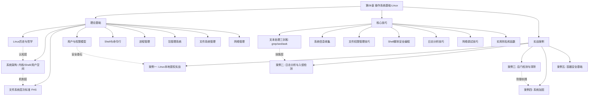
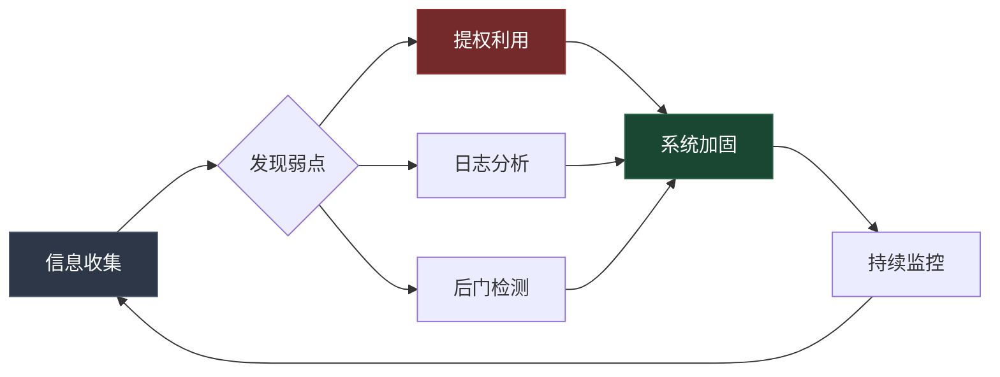

# 第06章 操作系统基础-Linux - 本章小结

本章从理论基础、核心技巧、实战案例三个维度系统性地构建了Linux安全知识体系。作为全书操作系统篇的核心章节，它既是网络基础（第05章）的自然延伸，也是后续Web安全、渗透测试、漏洞分析等章节的基石。本小结将回顾核心知识、串联各节逻辑、提炼安全思维模型，并提供自测与进阶路径。

## 一、本章知识架构全景

本章由三大模块构成，每个模块解决不同层次的问题：



三个模块的递进关系：

| 模块 | 核心问题 | 知识层次 | 安全价值 |
|------|----------|----------|----------|
| 理论基础 | Linux是什么？为什么这样设计？ | 认知层 — 理解机制原理 | 知其所以然，才能发现设计缺陷 |
| 核心技巧 | 如何高效操作Linux？ | 技能层 — 掌握命令与脚本 | 信息收集、日志分析、权限管理的基础能力 |
| 实战案例 | 真实攻击与防御怎么做？ | 应用层 — 解决实际安全问题 | 提权、检测、加固、取证的完整闭环 |

## 二、理论基础核心回顾

### 2.1 Linux系统架构：从硬件到用户空间的分层模型

Linux采用经典的宏内核架构，系统分为四个层次：

```text
┌─────────────────────────────────────────────┐
│              用户空间 (User Space)             │
│  ┌─────────┐ ┌─────────┐ ┌────────────────┐ │
│  │  Shell  │ │ GNU工具  │ │ 应用程序        │ │
│  │ (bash)  │ │(coreutils│ │ (nginx, python)│ │
│  └────┬────┘ └────┬────┘ └───────┬────────┘ │
│       │           │              │           │
│  ═════╪═══════════╪══════════════╪══════════ │
│       │    系统调用接口 (System Call Interface) │
│  ═════╪═══════════╪══════════════╪══════════ │
│       ▼           ▼              ▼           │
│              内核空间 (Kernel Space)           │
│  ┌─────────────────────────────────────────┐ │
│  │         Linux 内核 (Kernel)              │ │
│  │  ┌────────┐ ┌──────┐ ┌───────┐ ┌─────┐ │ │
│  │  │进程调度│ │内存管│ │文件系统│ │网络栈│ │ │
│  │  │  器    │ │理器  │ │ (VFS) │ │     │ │ │
│  │  └────────┘ └──────┘ └───────┘ └─────┘ │ │
│  │  ┌────────────────────────────────────┐ │ │
│  │  │       设备驱动 (Drivers)            │ │ │
│  │  └────────────────────────────────────┘ │ │
│  └─────────────────────────────────────────┘ │
└─────────────────────────────────────────────┘
```

**安全视角的关键认知：**

- **系统调用是攻击面**：用户空间与内核空间的唯一通道是系统调用。所有用户态攻击最终都通过系统调用完成——无论是文件读写（`open`/`read`/`write`）、进程创建（`fork`/`execve`）还是网络通信（`socket`/`connect`）。安全工具如 `strace` 就是通过拦截系统调用来监控进程行为。
- **内核是最高信任域**：一旦攻击者获得内核级代码执行能力（如通过内核漏洞加载恶意模块），所有用户态防御机制（包括 SELinux 在内）都可能被绕过。这就是为什么内核安全是安全研究的圣杯。
- **Shell 是攻击入口**：Bash、Zsh 等 Shell 既是管理员的日常工具，也是攻击者在获得初始访问后的主要操作界面。理解 Shell 的工作机制（环境变量继承、通配符展开、命令替换）是发现命令注入漏洞的基础。

### 2.2 文件系统与权限：Linux安全的第一道防线

**FHS（Filesystem Hierarchy Standard）的安全意义：**

每个标准目录都有明确的安全属性，理解它们是进行安全审计的前提：

| 目录 | 用途 | 安全关注点 |
|------|------|------------|
| `/etc` | 系统配置文件 | 包含密码哈希（`/etc/shadow`）、SSH配置、sudoers规则，是提权和持久化的重点目标 |
| `/var/log` | 日志目录 | 攻击者入侵后首先篡改或清除的目标，日志完整性是取证的关键 |
| `/tmp`, `/var/tmp` | 临时目录 | 默认所有人可写，常被攻击者用于存放恶意文件，应挂载 `noexec` |
| `/proc` | 进程信息虚拟文件系统 | 暴露进程内存映射（`/proc/PID/maps`）、网络连接（`/proc/net/tcp`），是信息收集的宝库 |
| `/dev` | 设备文件 | `/dev/sda` 等块设备可直接读写磁盘，`/dev/mem` 可访问物理内存 |
| `/root`, `/home` | 用户主目录 | SSH私钥、bash_history、配置文件，是横向移动的关键信息源 |
| `/usr/bin`, `/usr/sbin` | 可执行文件 | SUID程序集中于此，是提权的常见目标 |
| `/boot` | 内核和引导文件 | 篡改内核或initramfs可在启动阶段植入后门 |

**权限模型的三层递进：**

1. **基础权限（DAC）**：所有者/组/其他 三组 rwx 权限，存储在 inode 中。理解八进制表示（如 `chmod 755` = `rwxr-xr-x`）是基本功。
2. **特殊权限位**：
   - **SUID（4000）**：以文件所有者身份执行。`find / -perm -4000 -type f` 是每个安全人员必须会的命令——SUID程序是Linux提权最经典的攻击面。
   - **SGID（2000）**：以文件所属组身份执行，或在目录中新文件继承目录的组。
   - **Sticky Bit（1000）**：目录中只有文件所有者才能删除自己的文件（如 `/tmp`）。
3. **ACL（Access Control Lists）**：突破传统三组权限的限制，可以为任意用户/组设置精确权限。使用 `getfacl`/`setfacl` 管理。

### 2.3 用户与权限：最小权限原则的Linux实践

Linux的用户管理遵循"一个用户一个职责"的原则：

- **root（UID=0）**：超级用户，绕过几乎所有权限检查。永远不要用root进行日常操作。
- **系统用户（UID 1-999）**：运行系统服务的专用账户，通常无登录shell。攻击者提权后可能创建系统用户作为后门。
- **普通用户（UID≥1000）**：人类用户账户。

**sudo 机制**：`/etc/sudoers` 文件定义谁能以什么身份执行什么命令。常见的安全问题是过度授权——`ALL=(ALL) ALL` 等同于给用户root权限。安全的sudoers配置应该精确到具体命令。

### 2.4 Shell与命令行：攻击者的主要操作界面

Bash Shell 的安全相关特性：

- **环境变量继承**：子进程继承父进程的环境变量。`LD_PRELOAD` 可以注入共享库，`PATH` 可以劫持命令执行。
- **命令替换**：`$(command)` 和反引号 `` `command` `` 会在子shell中执行命令。在脚本中处理不可信输入时，这是命令注入的根源。
- **通配符展开**：`*`、`?`、`[]` 在Shell层面展开，而非传递给命令。攻击者可以利用这一点构造恶意文件名来注入参数。
- **Bash历史**：`~/.bash_history` 记录用户执行过的命令，可能包含密码、密钥等敏感信息。

### 2.5 进程管理：理解攻击者的活动范围

进程是Linux中资源分配的基本单位，也是安全监控的核心对象：

- **进程状态**：运行（R）、睡眠（S/D）、停止（T）、僵尸（Z）。僵尸进程可能暗示父进程异常。
- **进程间关系**：父子进程关系、进程组、会话。`pstree` 可以可视化进程树。
- **信号机制**：`kill` 命令通过信号与进程交互。`SIGKILL(9)` 无法被捕获，`SIGTERM(15)` 可以被进程捕获并做清理。
- **/proc 文件系统**：每个进程在 `/proc/PID/` 下有丰富的信息——`maps`（内存映射）、`fd`（打开的文件描述符）、`exe`（可执行文件路径）、`environ`（环境变量）。

### 2.6 包管理与网络：系统维护的两大支柱

**包管理**的安全意义在于软件供应链——你安装的每个包都可能引入漏洞或后门。使用 `apt list --upgradable`、`yum check-update` 定期检查更新，验证软件源的GPG签名，避免使用不可信的第三方源。

**网络管理**方面，理解 Linux 网络栈（接口→路由→iptables/nftables→应用）是进行网络层安全评估的基础。`ss -tunlp` 列出所有监听端口，`iptables -L -n -v` 查看防火墙规则，这两个命令是服务器安全检查的起点。

## 三、核心技巧回顾

### 3.1 文本处理三剑客

grep、sed、awk 是Linux安全分析的基石工具，它们解决的核心问题是：从海量文本数据中快速提取、转换、统计信息。

| 工具 | 核心能力 | 典型安全场景 | 效率对比 |
|------|----------|--------------|----------|
| `grep` | 模式匹配与过滤 | 在日志中搜索攻击特征（SQL注入关键字、恶意IP、异常User-Agent） | 最快，适合粗筛 |
| `sed` | 流式文本替换 | 批量修改配置文件、清理日志格式、脱敏处理 | 适合行级变换 |
| `awk` | 字段提取与统计 | 统计攻击频率、提取IP/URL/状态码、生成报表 | 最灵活，适合结构化处理 |

**实战命令模式（必须熟练）：**

```bash
# 统计Top 10攻击IP（access.log）
awk '{print $1}' /var/log/nginx/access.log | sort | uniq -c | sort -rn | head -10

# 搜索SQL注入特征（多种变体）
grep -iE "(union\s+select|or\s+1\s*=\s*1|'\s*or\s*'|drop\s+table|insert\s+into|load_file|into\s+outfile)" /var/log/nginx/access.log

# 提取SSH暴力破解的失败记录并统计
grep "Failed password" /var/log/auth.log | awk '{print $(NF-3)}' | sort | uniq -c | sort -rn

# 批量修改SSH配置（禁止root登录）
sed -i 's/^#*PermitRootLogin.*/PermitRootLogin no/' /etc/ssh/sshd_config

# 分析Nginx错误日志的错误类型分布
awk '{print $NF}' /var/log/nginx/error.log | sort | uniq -c | sort -rn | head -20
```

### 3.2 系统信息收集与安全审计

信息收集是安全评估的第一步。命令行下的系统信息收集可以分为以下几个层次：

```bash
# === 第一层：系统身份 ===
uname -a                           # 内核版本、主机名、架构
cat /etc/os-release                # 发行版信息
hostname -f                        # 完整主机名

# === 第二层：用户与权限 ===
id                                 # 当前用户UID/GID/组
cat /etc/passwd                    # 所有用户列表
cat /etc/shadow 2>/dev/null        # 密码哈希（需root）
sudo -l                            # 当前用户的sudo权限

# === 第三层：进程与服务 ===
ps auxf                            # 完整进程树
ss -tunlp                          # 监听端口和服务
systemctl list-units --type=service --state=running  # 运行中的服务

# === 第四层：文件系统 ===
find / -perm -4000 -type f 2>/dev/null               # SUID文件
find / -perm -2000 -type f 2>/dev/null               # SGID文件
find / -writable -type d 2>/dev/null                 # 可写目录
ls -la /etc/cron*                                    # 定时任务

# === 第五层：网络 ===
ip addr show                       # 网络接口和IP
ip route show                      # 路由表
iptables -L -n -v                  # 防火墙规则
cat /etc/resolv.conf               # DNS配置

# === 第六层：日志与历史 ===
last -20                           # 最近登录记录
lastb -20                          # 最近失败登录
cat ~/.bash_history                # 命令历史
journalctl --since "1 hour ago"    # 最近1小时的systemd日志
```

### 3.3 Shell脚本安全编程

Shell脚本在安全领域有大量应用场景：自动化信息收集、入侵检测、日志分析、系统加固。但Shell脚本也存在固有的安全风险：

**常见安全陷阱：**

```bash
# ❌ 错误：变量未加引号，存在命令注入风险
filename=$1
cat $filename
# 如果 $1 是 "/dev/null; rm -rf /"，后果严重

# ✅ 正确：变量加双引号
filename="$1"
cat "$filename"

# ❌ 错误：使用eval执行用户输入
eval "echo $user_input"

# ✅ 正确：使用数组安全传递参数
cmd=(grep -r "pattern" "$directory")
"${cmd[@]}"
```

**脚本编写规范（安全领域）：**

1. 首行 `#!/bin/bash` 指定解释器
2. `set -euo pipefail` 开启严格模式
3. 所有变量使用双引号包裹
4. 使用 `mktemp` 创建临时文件，退出时用 `trap` 清理
5. 输入验证：检查参数数量、类型、范围
6. 敏感信息不写入脚本，使用环境变量或配置文件

## 四、实战案例核心收获

### 4.1 五个案例的知识地图



**案例一：本地提权** — 掌握了SUID利用、sudo滥用、内核漏洞、定时任务劫持、PATH劫持、Docker组提权等六种提权路径。核心教训：**信息收集决定提权成败**。提权的第一步永远是全面收集系统信息（`uname -a`、`sudo -l`、`find / -perm -4000`、`cat /etc/crontab`、`id`），然后根据收集到的信息匹配已知的提权技术。

**案例二：日志分析与入侵检测** — 日志是安全事件的"黑匣子"。关键日志文件：

| 日志文件 | 内容 | 安全价值 |
|----------|------|----------|
| `/var/log/auth.log` | 认证事件（登录、sudo、SSH） | 检测暴力破解、未授权访问 |
| `/var/log/syslog` | 系统级消息 | 异常服务、硬件故障、内核告警 |
| `/var/log/nginx/access.log` | Web访问记录 | SQL注入、XSS、目录遍历、爬虫 |
| `/var/log/kern.log` | 内核消息 | 内核panic、模块加载、防火墙事件 |
| `/var/log/cron.log` | 定时任务执行 | 检测定时任务后门 |

**案例三：后门检测与清除** — 攻击者维持访问的常见手段及检测方法：

| 后门类型 | 持久化机制 | 检测命令 |
|----------|-----------|----------|
| SSH密钥后门 | 在 `~/.ssh/authorized_keys` 中植入公钥 | `cat ~/.ssh/authorized_keys` |
| 定时任务后门 | 修改 crontab 或 `/etc/cron.d/` | `crontab -l; ls -la /etc/cron.d/` |
| 启动脚本后门 | 修改 `/etc/rc.local`、systemd服务 | `systemctl list-unit-files --state=enabled` |
| Web Shell | 在Web目录放置恶意脚本 | `find /var/www -name "*.php" -mtime -7` |
| 内核Rootkit | 加载恶意内核模块 | `lsmod; cat /proc/modules` |

**案例四：系统加固** — 加固不是一次性操作，而是一个持续的过程。加固优先级：

1. **SSH加固**（暴露面最大）：禁用root登录、禁用密码认证、使用密钥认证、修改默认端口、限制登录IP
2. **防火墙配置**：默认拒绝所有入站，只开放必要端口
3. **最小化安装**：移除不必要的服务和软件包
4. **文件完整性监控**：使用 AIDE 建立基线，定期对比检测篡改
5. **日志集中管理**：将日志发送到独立的日志服务器，防止攻击者删除本地日志

**案例五：容器安全基础** — 容器不是虚拟机，它与宿主机共享内核。核心安全原则：不使用 `--privileged`、不挂载 Docker Socket、使用最小化基础镜像、定期扫描镜像漏洞、使用 seccomp 和 AppArmor 限制容器能力。

### 4.2 贯穿所有案例的安全思维模型

在完成五个实战案例后，可以提炼出一个通用的安全分析框架：

```text
┌──────────────────────────────────────────────┐
│              安全分析四步法                      │
├──────────────────────────────────────────────┤
│                                              │
│  第一步：信息收集                              │
│  ├─ 系统身份（OS版本、内核、架构）              │
│  ├─ 用户与权限（sudo规则、SUID文件、组成员）    │
│  ├─ 运行状态（进程、服务、端口、网络连接）       │
│  ├─ 历史记录（日志、命令历史、登录记录）         │
│  └─ 配置文件（SSH、防火墙、定时任务）           │
│                                              │
│  第二步：分析判断                              │
│  ├─ 对比安全基线，找出偏差                     │
│  ├─ 关联多个信息源，验证假设                   │
│  └─ 评估风险等级，确定优先级                   │
│                                              │
│  第三步：行动                                  │
│  ├─ 攻击视角：利用发现的弱点                   │
│  └─ 防御视角：修复问题、加固系统               │
│                                              │
│  第四步：验证与监控                            │
│  ├─ 确认行动效果                              │
│  ├─ 建立持续监控                              │
│  └─ 记录过程，更新知识库                      │
│                                              │
└──────────────────────────────────────────────┘
```

## 五、核心安全原则提炼

本章内容虽然涵盖面广，但所有知识点都指向以下五条安全原则：

**原则一：最小权限（Principle of Least Privilege）**
每个用户、进程、服务只应拥有完成其功能所需的最小权限。不用root日常操作、不用`chmod 777`、精确配置sudoers——这些实践都源于这条原则。为什么重要？因为权限越大，攻击面越大，误操作的后果越严重。

**原则二：纵深防御（Defense in Depth）**
不依赖单一安全措施。防火墙 + SSH加固 + SELinux + 日志监控 + 文件完整性检查 + 定期更新——每一层都能在其他层被突破时提供保护。容器安全同样如此：镜像扫描 + 运行时限制 + 网络隔离 + 最小权限。

**原则三：默认拒绝（Default Deny）**
防火墙默认拒绝所有入站流量，只开放必要端口。新安装的系统应该禁用所有不必要的服务。SELinux/AppArmor默认限制所有未明确允许的操作。

**原则四：日志不可篡改（Audit Trail Integrity）**
日志是事后分析和取证的基础。集中式日志管理（将日志发送到独立服务器）是确保日志完整性的关键。本地日志一旦被攻击者获取root权限就可以随意修改。

**原则五：持续更新与监控（Continuous Patching & Monitoring）**
安全不是一次性操作。CVE每天都在发布，新的攻击技术不断出现。自动化更新（unattended-upgrades）、定期安全扫描（Lynis、OpenSCAP）、运行时监控（Falco、osquery）是维持安全状态的必要手段。

## 六、关键命令速查表

### 6.1 信息收集

```bash
# 系统身份
uname -a                                    # 内核版本与系统信息
cat /etc/os-release                         # 发行版详细信息
hostnamectl                                 # 主机名与系统信息

# 用户与权限
id                                          # 当前用户信息
who                                         # 当前登录用户
last -20                                    # 最近20条登录记录
lastb -20 2>/dev/null                       # 最近20条失败登录
sudo -l                                     # 当前用户的sudo权限
cat /etc/passwd                             # 用户列表
cat /etc/shadow 2>/dev/null                 # 密码哈希（需root）

# 进程与服务
ps auxf                                     # 完整进程树
ps aux --sort=-%cpu | head -10              # CPU占用Top 10
ss -tunlp                                   # 监听端口
systemctl list-units --type=service --state=running

# 文件系统
find / -perm -4000 -type f 2>/dev/null      # SUID文件
find / -perm -2000 -type f 2>/dev/null      # SGID文件
find / -writable -type d 2>/dev/null        # 可写目录
crontab -l                                  # 当前用户的定时任务
ls -la /etc/cron.d/                         # 系统定时任务
```

### 6.2 文本处理

```bash
# grep — 模式匹配
grep -rn "pattern" /path/                   # 递归搜索并显示行号
grep -iE "union.*select|or\s+1=1" file      # 正则搜索SQL注入
grep -c "Failed password" /var/log/auth.log  # 统计匹配行数
grep -v "^#" file | grep -v "^$"            # 去除注释和空行

# sed — 流编辑
sed 's/old/new/g' file                      # 全局替换
sed -i 's/^#*PermitRootLogin.*/PermitRootLogin no/' /etc/ssh/sshd_config
sed -n '10,20p' file                        # 打印第10-20行
sed '/^#/d; /^$/d' file                     # 删除注释和空行

# awk — 字段处理
awk '{print $1}' file                       # 打印第一列
awk -F: '{print $1, $3}' /etc/passwd        # 自定义分隔符
awk '{sum+=$1} END{print sum}' file         # 求和统计
awk '$4 > 20000 {print $1, $4}' file        # 条件过滤

# 组合技：统计访问日志中每个IP的请求数并排序
awk '{print $1}' access.log | sort | uniq -c | sort -rn | head -20
```

### 6.3 安全检查

```bash
# 登录与认证
last                                        # 登录历史
lastlog                                     # 各用户最后登录时间
grep "Failed password" /var/log/auth.log    # SSH暴力破解记录
grep "Accepted" /var/log/auth.log           # 成功登录记录

# sudo与提权
sudo -l                                     # 当前用户sudo权限
cat /etc/sudoers                            # sudo配置（需root）
find / -perm -4000 -type f 2>/dev/null      # SUID文件

# 定时任务
crontab -l                                  # 用户定时任务
cat /etc/crontab                            # 系统定时任务
ls -la /etc/cron.d/                         # cron.d目录
ls -la /etc/cron.daily/                     # 每日任务

# 网络
ss -tunlp                                   # 监听端口
ss -tnp                                     # 已建立的TCP连接
iptables -L -n -v                           # 防火墙规则
ip route show                               # 路由表
```

### 6.4 日志分析

```bash
# SSH攻击分析
grep "Failed password" /var/log/auth.log | awk '{print $(NF-3)}' | sort | uniq -c | sort -rn

# Web攻击分析
# SQL注入检测
grep -iE "(union.*select|or\s+1\s*=\s*1|'|drop\s+table)" /var/log/nginx/access.log

# 路径遍历检测
grep -E "\.\./" /var/log/nginx/access.log

# 扫描器识别
grep -iE "(sqlmap|nikto|nmap|masscan|burp)" /var/log/nginx/access.log

# 系统异常
journalctl --since "1 hour ago" -p err       # 最近1小时的错误
dmesg | grep -i "error\|fail\|segfault"       # 内核错误
```

### 6.5 网络诊断

```bash
ip addr show                                # 网络接口
ip route show                               # 路由表
ss -tunlp                                   # 监听端口
ping -c 4 host                              # 连通性测试
traceroute host                             # 路由追踪
dig domain                                  # DNS查询
curl -I https://example.com                 # HTTP头信息
```

## 七、学习检验

在进入下一章之前，检验你是否掌握了以下关键知识点。每个问题都附有参考答案要点。

### 基础知识检验

**Q1：Linux的FHS中，`/etc`、`/var`、`/proc`目录分别存储什么？各自的安全意义是什么？**

> 答案要点：`/etc` 存储系统配置文件（密码哈希、SSH配置、sudoers规则），是提权和持久化的重点目标。`/var` 存储可变数据（日志在 `/var/log`、Web数据在 `/var/www`），日志完整性是取证的关键。`/proc` 是虚拟文件系统，提供进程和内核的实时信息（内存映射、网络连接、打开的文件），是信息收集的宝库。

**Q2：解释SUID权限的含义和安全风险。举一个SUID提权的例子。**

> 答案要点：SUID（Set User ID）使程序以文件所有者的身份执行，而不是调用者的身份。当SUID文件的所有者是root时，任何用户执行该文件都拥有root权限。安全风险在于：如果SUID程序存在漏洞（如缓冲区溢出、命令注入），普通用户可以利用这些漏洞获得root权限。经典例子：如果 `find` 被设置了SUID位且所有者是root，可以用 `find . -exec /bin/sh -p \; -quit` 获取root shell。

**Q3：如何查找系统中所有SUID文件？为什么这很重要？**

> 答案要点：`find / -perm -4000 -type f 2>/dev/null`。重要性：SUID文件是以root权限执行的程序，是提权的主要攻击面。安全评估时需要检查每个SUID文件是否必要、是否存在已知漏洞、是否可以被普通用户修改。GTFOBins 网站列出了大量可用于提权的合法SUID程序。

### 技能检验

**Q4：使用grep、sed、awk分别完成什么任务？举例说明在安全分析中的典型用法。**

> 答案要点：grep 用于模式匹配（在日志中搜索攻击特征），sed 用于流式替换（批量修改SSH配置），awk 用于字段提取和统计（统计攻击IP频率）。典型用法见上方命令速查表。

**Q5：描述一个完整的Linux提权思路（信息收集→漏洞识别→利用）。**

> 答案要点：(1) 信息收集：`uname -a`（内核版本）、`sudo -l`（sudo规则）、`find / -perm -4000`（SUID文件）、`cat /etc/crontab`（定时任务）、`id`（组成员）、`ss -tunlp`（监听服务）。(2) 漏洞识别：根据内核版本搜索已知提权漏洞（如DirtyPipe、DirtyCow）；检查sudo配置是否有可利用的命令；查看SUID文件是否在GTFOBins列表中；检查定时任务是否有可写脚本；检查Docker组成员。(3) 利用：选择最可行的路径执行提权，验证是否获得root权限。

### 防御检验

**Q6：如何检测系统是否被植入后门？**

> 答案要点：检查SSH公钥（`cat ~/.ssh/authorized_keys`）、定时任务（`crontab -l`）、启动脚本（`systemctl list-unit-files --state=enabled`）、可疑进程（`ps auxf`）、网络连接（`ss -tnp`）、文件完整性（AIDE对比）、最近修改的文件（`find / -mtime -7 -type f`）、内核模块（`lsmod`）。使用 `rkhunter`、`chkrootkit` 等自动化工具辅助检测。

**Q7：SSH安全加固应该配置哪些选项？**

> 答案要点：修改 `/etc/ssh/sshd_config`：`PermitRootLogin no`（禁止root登录）、`PasswordAuthentication no`（禁用密码认证）、`PubkeyAuthentication yes`（启用密钥认证）、`MaxAuthTries 3`（限制尝试次数）、`AllowUsers user1 user2`（限制登录用户）、`Port 2222`（修改默认端口）、`ClientAliveInterval 300`（设置超时）。配置完成后 `systemctl restart sshd`。

**Q8：Linux容器（Docker）与虚拟机的安全隔离有什么区别？**

> 答案要点：虚拟机通过Hypervisor模拟完整硬件，每个VM有独立的内核，隔离性强但资源开销大。容器共享宿主机内核，通过Linux命名空间（PID/NET/MNT/UTS/IPC/USER）和cgroups实现轻量级隔离，但攻击者可以利用内核漏洞实现容器逃逸。容器的攻击面包括：共享的内核、Docker Socket、特权模式、镜像漏洞。安全实践：不用 `--privileged`、最小化镜像、扫描漏洞、使用seccomp/AppArmor限制。

**Q9：为什么不应该使用root账户进行日常操作？**

> 答案要点：(1) 误操作风险——`rm -rf` 在root下会摧毁系统；(2) 恶意软件风险——以root运行的程序被入侵后攻击者直接获得完全控制；(3) 审计困难——所有操作都是root执行，无法追溯；(4) 违反最小权限原则——安全的基本原则。正确做法：使用普通用户，必要时通过 `sudo` 临时提升权限。

## 八、进阶学习方向

完成本章学习后，可以根据兴趣和职业规划选择以下方向深入：

### 8.1 Linux内核安全（高级）

深入理解Linux内核的安全机制和漏洞利用技术：

- **LSM框架**：SELinux、AppArmor、Smack、TOMOYO 等安全模块的原理与配置
- **Seccomp-BPF**：使用BPF过滤器限制进程的系统调用，Docker和Chrome的核心安全机制
- **命名空间与cgroups**：容器技术的底层基础，理解容器逃逸的根本原因
- **内核漏洞利用**：栈溢出、堆溢出、竞态条件、提权利用；防御机制（KASLR、SMEP、SMAP、KPTI）及其绕过
- **eBPF**：新一代内核可观测性技术，用于安全监控（Falco、Tetragon）和网络过滤（Cilium）

推荐资源：《Linux Kernel Development》（Robert Love）、《Understanding the Linux Kernel》（Bovet & Cesati）、https://www.kernel.org/doc/html/latest/

### 8.2 Linux取证与应急响应

掌握入侵后的调查分析和应急处置能力：

- **内存取证**：使用 Volatility 和 LiME 进行内存分析（进程列表、网络连接、内核模块）
- **磁盘取证**：使用 Autopsy/Sleuth Kit 进行文件系统分析和时间线重建
- **日志关联分析**：将多个日志源（auth.log、syslog、access.log）关联，还原攻击路径
- **应急响应流程**：准备→识别→遏制→根除→恢复→总结的标准化流程
- **IOC（Indicators of Compromise）提取**：从被入侵系统中提取攻击指标用于威胁情报

### 8.3 容器与云原生安全

容器化部署已成为主流，安全从业者必须掌握容器安全：

- **容器运行时安全**：gVisor、Kata Containers 提供比普通容器更强的隔离
- **镜像安全**：Trivy、Clair 扫描镜像漏洞；Distroless、Alpine 等最小化基础镜像
- **编排安全**：Kubernetes的RBAC、NetworkPolicy、PodSecurityPolicy/PSA
- **供应链安全**：SLSA框架、Sigstore签名、SBOM（软件物料清单）
- **服务网格安全**：Istio mTLS、策略控制

### 8.4 自动化安全运维

将安全实践自动化，提升效率和一致性：

- **配置管理**：Ansible/Puppet/Salt 自动化安全加固
- **合规即代码**：OpenSCAP、InSpec 定义和验证安全基线
- **漏洞管理**：自动化的漏洞扫描、评估、修复流程
- **安全监控**：osquery（Facebook开源的系统instrumentation框架）、Falco（CNCF运行时安全工具）
- **日志集中管理**：ELK Stack（Elasticsearch + Logstash + Kibana）、Graylog

### 8.5 Shell编程进阶

从简单的安全脚本发展到完整的安全工具开发：

- **高级Bash特性**：关联数组、进程替换、coprocess、正则表达式
- **Python替代方案**：对于复杂的系统管理和安全工具，Python提供了更好的可读性和更丰富的库
- **安全工具开发**：使用Python编写自定义的安全扫描器、日志分析器、自动化利用脚本
- **配置管理工具**：Ansible Playbook编写安全加固脚本

## 九、推荐学习资源

### 书籍

| 书名 | 作者 | 适用阶段 | 推荐理由 |
|------|------|----------|----------|
| 《鸟哥的Linux私房菜》 | 鸟哥 | 入门 | 中文Linux经典教材，适合零基础 |
| 《The Linux Command Line》 | William Shotts | 入门→进阶 | 免费在线阅读，命令行全面指南 |
| 《How Linux Works》 | Brian Ward | 进阶 | 深入理解Linux工作原理 |
| 《Linux Kernel Development》 | Robert Love | 高级 | Linux内核开发经典教材 |
| 《Hacking: The Art of Exploitation》 | Jon Erickson | 高级 | 漏洞利用技术经典（含Linux环境） |
| 《Linux Malware Incident Response》 | Cameron Malin | 专业 | Linux恶意软件应急响应 |

### 在线平台

- **OverTheWire Bandit** (https://overthewire.org/wargames/bandit/) — Linux命令行闯关游戏，适合初学者
- **TryHackMe** (https://tryhackme.com/) — 引导式学习，有专门的Linux提权房间
- **HackTheBox** (https://www.hackthebox.com/) — 高难度靶机，适合进阶练习
- **GTFOBins** (https://gtfobins.github.io/) — SUID/Sudo提权参考手册，安全人员必备
- **Linux Journey** (https://linuxjourney.com/) — 交互式Linux学习网站

### 工具

| 工具 | 用途 | 获取方式 |
|------|------|----------|
| Lynis | 安全审计 | `apt install lynis` |
| rkhunter | Rootkit检测 | `apt install rkhunter` |
| AIDE | 文件完整性监控 | `apt install aide` |
| auditd | 系统审计框架 | `apt install auditd` |
| osquery | 系统instrumentation | https://osquery.io/ |
| Falco | 运行时安全监控 | https://falco.org/ |
| Trivy | 容器漏洞扫描 | https://trivy.dev/ |

## 十、下一章预告

下一章我们将学习 **Windows和macOS操作系统的基础知识**。虽然Linux是安全领域的主力操作系统，但Windows在企业环境中占据主导地位（超过75%的桌面市场份额、大量企业域控制器），macOS在开发者和创意工作者中越来越流行。

理解不同操作系统的特点和安全机制，才能成为一名全面的安全专家。下一章将涵盖：

- Windows安全架构（SAM数据库、注册表、Active Directory、UAC、Windows Defender）
- macOS安全机制（Gatekeeper、SIP、XProtect、TCC）
- 三个操作系统的安全模型对比
- 跨平台安全评估方法论

通过对比学习，你将建立完整的操作系统安全知识体系，为后续的渗透测试和漏洞分析打下坚实基础。
