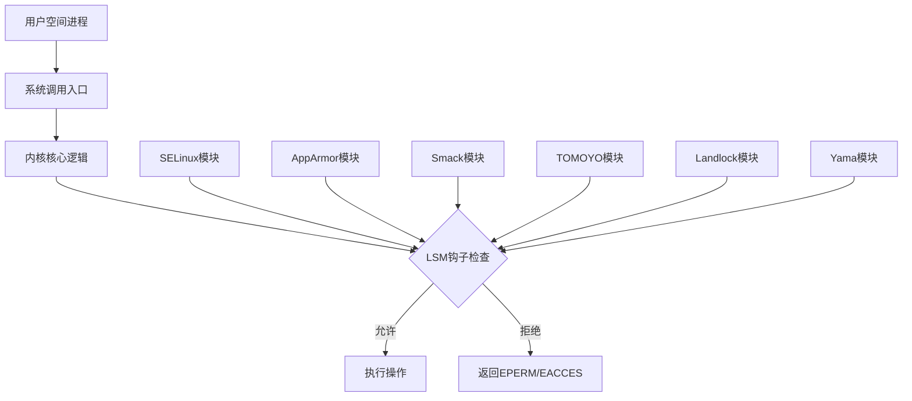
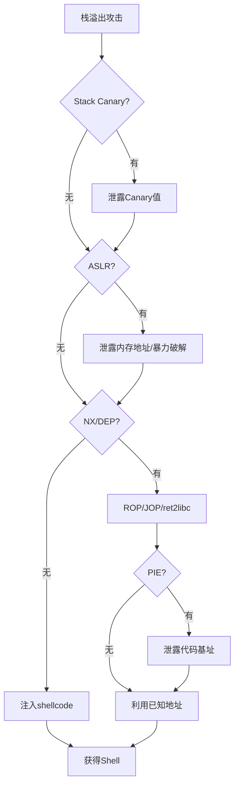
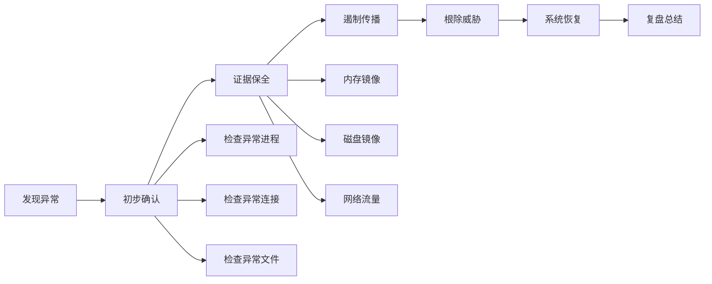
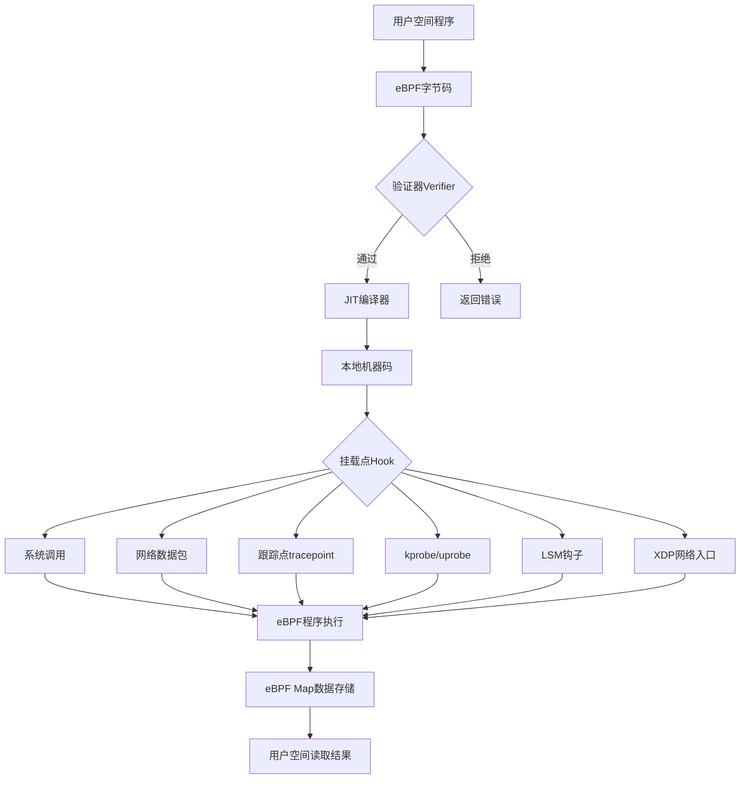
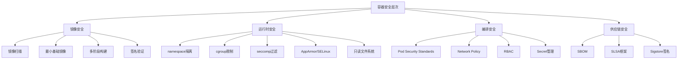

# 第06章 操作系统基础-Linux - 深度拓展

本章是Linux安全知识体系的顶层建筑。前面的章节覆盖了理论基础、核心技巧和实战案例，本章将从**内核安全架构**、**漏洞利用原理**、**系统加固工程**、**应急响应实战**、**前沿技术趋势**五个维度进行深度拓展，目标是让读者建立完整的Linux安全知识图谱，并具备应对真实安全挑战的能力。

## 一、Linux内核安全机制

### 1.1 访问控制模型

Linux内核的安全基石是访问控制模型。理解这些模型的区别，是理解所有安全机制的前提。

#### 1.1.1 自主访问控制（DAC）

DAC是Linux传统的权限模型，核心思想是：**资源的所有者自主决定谁能访问**。

**实现机制：**

每个文件/目录在inode中存储三组权限位：所有者（owner）、所属组（group）、其他人（others），每组包含读（r）、写（w）、执行（x）权限。

```bash
# 查看文件的详细权限信息
ls -la /etc/shadow
# -rw-r----- 1 root shadow 1234 Jun 25 10:00 /etc/shadow
#  所有者:rw  组:r  其他:无

# 查看inode中的权限位（八进制表示）
stat -c '%a %U:%G %n' /etc/shadow
# 640 root:shadow /etc/shadow
```

**特殊权限位：**

| 权限位 | 八进制 | 作用 | 典型用途 |
|--------|--------|------|----------|
| SUID | 4000 | 执行时以文件所有者身份运行 | `/usr/bin/passwd`（以root身份修改shadow） |
| SGID | 2000 | 执行时以文件所属组身份运行；目录下新建文件继承组 | `/usr/bin/wall`，共享目录 |
| Sticky Bit | 1000 | 目录中只有文件所有者能删除文件 | `/tmp` 目录 |

```bash
# 设置SUID
chmod u+s /usr/bin/myprogram    # 符号模式
chmod 4755 /usr/bin/myprogram   # 八进制模式

# 查找系统中所有SUID文件（安全审计必做）
find / -perm -4000 -type f 2>/dev/null
# 查找SGID文件
find / -perm -2000 -type f 2>/dev/null
```

**DAC的根本缺陷：**

1. **root万能**：UID=0的进程绕过几乎所有权限检查（除了一些挂载选项如`nosuid`）
2. **粗粒度**：只有owner/group/others三组，无法表达"允许A用户读但不允许B用户读"这种需求（除非借助ACL）
3. **无进程隔离**：同一用户的进程之间没有隔离，一个进程被攻破可以操作该用户的所有资源
4. **提权路径**：SUID程序、capability、sudo配置都可能成为提权跳板

**ACL扩展（POSIX ACL）：**

当三组权限不够用时，Linux支持POSIX ACL提供更细粒度的控制：

```bash
# 给特定用户设置权限
setfacl -m u:alice:rwx /data/project

# 给特定组设置权限
setfacl -m g:developers:rx /data/project

# 查看ACL
getfacl /data/project
# file: data/project
# owner: root
# group: root
# user::rwx
# user:alice:rwx
# group::r-x
# group:developers:r-x
# mask::rwx
# other::r-x

# 设置默认ACL（新建文件自动继承）
setfacl -d -m g:developers:rwx /data/project
```

#### 1.1.2 强制访问控制（MAC）

MAC的核心思想是：**系统管理员预定义安全策略，用户无法自行修改**。即使root用户也受MAC策略约束（除非显式关闭）。

**SELinux详解：**

SELinux由NSA开发，是Linux上最强大的MAC实现。它基于**类型强制（Type Enforcement）**模型。

**安全上下文格式：** `user:role:type:level`

```bash
# 查看文件的安全上下文
ls -Z /etc/passwd
# system_u:object_r:passwd_file_t:s0 /etc/passwd

# 查看进程的安全上下文
ps auxZ | grep httpd
# system_u:system_r:httpd_t:s0    apache  1234  ...

# 查看当前用户的安全上下文
id -Z
# unconfined_u:unconfined_r:unconfined_t:s0-s0:c0.c1023
```

**SELinux三种运行模式：**

| 模式 | 说明 | 用途 |
|------|------|------|
| Enforcing | 强制执行策略，违规操作被拒绝并记录 | 生产环境 |
| Permissive | 不拒绝违规操作，仅记录日志 | 调试和策略开发 |
| Disabled | 完全禁用 | 不推荐（切换模式需要重启） |

```bash
# 查看当前模式
getenforce
# Enforcing

# 临时切换到Permissive（调试用）
setenforce 0

# 恢复Enforcing
setenforce 1

# 永久配置（需要重启）
# 编辑 /etc/selinux/config
# SELINUX=enforcing
```

**SELinux策略类型：**

| 策略类型 | 说明 | 适用场景 |
|----------|------|----------|
| Targeted | 只对指定的守护进程强制执行，其余进程运行在unconfined域 | 大多数服务器（默认） |
| MLS | 多级安全，所有进程都受控 | 军事/政府高安全环境 |
| Minimum | Targeted的精简版 | 资源受限环境 |

**SELinux实战——自定义策略模块：**

当默认策略无法覆盖自定义应用时，需要编写自定义策略：

```bash
# 1. 在Permissive模式下运行应用，收集AVC拒绝日志
setenforce 0
systemctl start myapp
# 产生一些操作...
ausearch -m avc -ts recent

# 2. 使用audit2allow生成策略模块
ausearch -m avc -ts recent | audit2allow -M myapp_policy

# 3. 审查生成的策略（非常重要！不要盲目安装）
cat myapp_policy.te
# module myapp_policy 1.0;
# require {
#     type httpd_t;
#     type myapp_port_t;
#     class tcp_socket { name_bind };
# }
# allow httpd_t myapp_port_t:tcp_socket name_bind;

# 4. 安装策略模块
semodule -i myapp_policy.pp

# 5. 切回Enforcing模式测试
setenforce 1
systemctl restart myapp
```

**SELinux端口管理：**

```bash
# 查看已定义的端口标签
semanage port -l | grep http

# 为自定义端口添加标签
semanage port -a -t http_port_t -p tcp 8443

# 修改已有端口标签
semanage port -m -t http_port_t -p tcp 8080
```

**AppArmor详解：**

AppArmor是Ubuntu/SUSE默认的MAC实现，比SELinux更简单，基于**路径**进行访问控制（而非安全上下文）。

```bash
# 查看AppArmor状态
aa-status
# apparmor module is loaded.
# 30 profiles are loaded.
# 28 profiles are in enforce mode.

# 两种模式切换
aa-enforce /etc/apparmor.d/usr.sbin.nginx     # 强制模式
aa-complain /etc/apparmor.d/usr.sbin.nginx    # 投诉模式（仅记录）

# 自动生成配置文件
aa-genprof /usr/sbin/myapp
# 交互式工具：运行应用 -> AppArmor记录访问 -> 你决定允许/拒绝
```

**AppArmor Profile示例：**

```bash
# /etc/apparmor.d/usr.sbin.myapp
#include <tunables/global>

/usr/sbin/myapp {
  #include <abstractions/base>
  #include <abstractions/nameservice>

  # 允许读取配置
  /etc/myapp/** r,
  
  # 允许读写数据目录
  /var/lib/myapp/** rw,
  
  # 允许绑定特定端口
  network tcp,
  
  # 禁止访问其他进程的/proc
  deny /proc/*/net/**,
  
  # 允许写日志
  /var/log/myapp/** w,
  
  # 禁止执行其他程序
  deny /** x,
}
```

**SELinux vs AppArmor对比：**

| 维度 | SELinux | AppArmor |
|------|---------|----------|
| 开发者 | NSA | SUSE/Canonical |
| 默认发行版 | RHEL/CentOS/Fedora | Ubuntu/SUSE/OpenSUSE |
| 标识方式 | 安全上下文（user:role:type:level） | 文件路径 |
| 策略粒度 | 极细（类型强制+RBAC+MLS） | 中等（路径+能力） |
| 学习曲线 | 陡峭 | 平缓 |
| 性能影响 | 极小（内核级决策） | 极小 |
| 容器支持 | 优秀（支持MCS标签） | 良好 |
| 适用场景 | 高安全要求、合规环境 | 快速部署、一般安全需求 |

#### 1.1.3 Linux Security Modules (LSM) 框架

LSM是内核提供的安全模块接口框架，它在内核的**关键代码路径**上插入了钩子（hook）函数，安全模块通过实现这些钩子来拦截和控制操作。



**除SELinux和AppArmor外的重要LSM模块：**

| 模块 | 功能 | 内核版本 |
|------|------|----------|
| **Yama** | 限制ptrace（进程调试/注入），防止进程互相读取内存 | 3.4+ |
| **LoadPin** | 确保内核模块/firmware只能从可信来源加载 | 5.4+ |
| **Lockdown** | 限制root对内核的操作（如读写/dev/kmem、加载未签名模块） | 5.4+ |
| **Landlock** | 允许非特权进程自行限制文件系统访问权限 | 5.13+ |
| **BPF LSM** | 允许用eBPF程序实现自定义安全策略 | 5.7+ |

```bash
# 查看当前系统启用的LSM模块
cat /sys/kernel/security/lsm
# lockdown,capability,yama,apparmor

# 配置Yama ptrace限制
# /etc/sysctl.d/10-ptrace.conf
# kernel.yama.ptrace_scope = 1
# 0: 无限制
# 1: 只有父进程可以ptrace子进程（默认）
# 2: 只有CAP_SYS_PTRACE的进程可以ptrace
# 3: 禁止所有ptrace

# Landlock实战——限制进程的文件系统访问
# 需要编写C程序使用landlock系统调用
# 示例：限制myapp只能读取/data/app目录
```

**Landlock沙箱示例代码（C语言）：**

```c
#include <linux/landlock.h>
#include <sys/prctl.h>
#include <sys/syscall.h>

// Landlock是第一个允许非特权进程自行沙箱化的LSM模块
// 它不需要root权限，进程可以主动限制自己的权限

int main() {
    // 1. 获取支持的Landlock ABI版本
    int abi = syscall(SYS_landlock_create_ruleset, NULL, 0,
                      LANDLOCK_ACCESS_FS_READ_FILE |
                      LANDLOCK_ACCESS_FS_READ_DIR);
    
    // 2. 创建规则集
    struct landlock_ruleset_attr attr = {
        .handled_access_fs = LANDLOCK_ACCESS_FS_READ_FILE |
                            LANDLOCK_ACCESS_FS_READ_DIR |
                            LANDLOCK_ACCESS_FS_WRITE_FILE
    };
    int ruleset_fd = syscall(SYS_landlock_create_ruleset,
                             &attr, sizeof(attr), 0);
    
    // 3. 添加规则：只允许读取/data/app
    struct landlock_path_beneath_attr path_attr = {
        .allowed_access = LANDLOCK_ACCESS_FS_READ_FILE |
                          LANDLOCK_ACCESS_FS_READ_DIR,
        .parent_fd = open("/data/app", O_PATH | O_CLOEXEC)
    };
    syscall(SYS_landlock_add_rule, ruleset_fd,
            LANDLOCK_RULE_PATH_BENEATH, &path_attr, 0);
    
    // 4. 激活沙箱
    prctl(PR_SET_NO_NEW_PRIVS, 1, 0, 0, 0);
    syscall(SYS_landlock_restrict_self, ruleset_fd, 0);
    
    // 此后进程无法访问/data/app以外的文件
    return 0;
}
```

### 1.2 进程隔离机制

#### 1.2.1 Linux命名空间（Namespaces）

命名空间是Linux容器技术的基石。每个命名空间为进程提供一个独立的"视图"，让进程以为自己拥有独立的系统资源。

**七大命名空间详解：**

| 命名空间 | 系统调用标志 | 隔离内容 | 内核版本 |
|----------|-------------|----------|----------|
| Mount | CLONE_NEWNS | 挂载点，进程看到的文件系统树 | 2.4.19 |
| UTS | CLONE_NEWUTS | 主机名和域名 | 2.6.19 |
| IPC | CLONE_NEWIPC | System V IPC、POSIX消息队列 | 2.6.19 |
| PID | CLONE_NEWPID | 进程ID | 3.8 |
| Network | CLONE_NEWNET | 网络设备、IP地址、路由表、端口 | 2.6.29 |
| User | CLONE_NEWUSER | 用户和组ID | 3.8 |
| Cgroup | CLONE_NEWCGROUP | cgroup根目录 | 4.6 |

```bash
# 查看进程所属的命名空间
ls -la /proc/$$/ns/
# lrwxrwxrwx 1 root root 0 Jun 25 10:00 cgroup -> 'cgroup:[4026531835]'
# lrwxrwxrwx 1 root root 0 Jun 25 10:00 ipc -> 'ipc:[4026531839]'
# lrwxrwxrwx 1 root root 0 Jun 25 10:00 mnt -> 'mnt:[4026531841]'
# lrwxrwxrwx 1 root root 0 Jun 25 10:00 net -> 'net:[4026531840]'
# lrwxrwxrwx 1 root root 0 Jun 25 10:00 pid -> 'pid:[4026531836]'
# lrwxrwxrwx 1 root root 0 Jun 25 10:00 user -> 'user:[4026531837]'
# lrwxrwxrwx 1 root root 0 Jun 25 10:00 uts -> 'uts:[4026531838]'

# 使用nsenter进入容器的命名空间
nsenter -t <container_pid> -m -u -i -n -p -- /bin/bash
# -m: mount namespace
# -u: UTS namespace
# -i: IPC namespace
# -n: network namespace
# -p: PID namespace

# 使用unshare创建新命名空间运行命令
unshare --mount --uts --ipc --net --pid --fork /bin/bash
# 在新命名空间中，PID=1，主机名可独立修改
```

**网络命名空间实战：**

```bash
# 创建网络命名空间
ip netns add test_ns

# 创建veth pair（虚拟以太网对）
ip link add veth0 type veth peer name veth1

# 将veth1移入命名空间
ip link set veth1 netns test_ns

# 配置主机端
ip addr add 10.0.0.1/24 dev veth0
ip link set veth0 up

# 配置命名空间端
ip netns exec test_ns ip addr add 10.0.0.2/24 dev veth1
ip netns exec test_ns ip link set veth1 up
ip netns exec test_ns ip link set lo up

# 在命名空间中测试连通性
ip netns exec test_ns ping 10.0.0.1

# 查看命名空间中的网络配置（完全隔离）
ip netns exec test_ns ip addr show
```

#### 1.2.2 控制组（cgroups）

cgroups限制进程组可以使用的系统资源，是容器资源限制的核心机制。

**cgroups v2（统一层级）：**

```bash
# cgroups v2挂载点
mount | grep cgroup2
# cgroup2 on /sys/fs/cgroup type cgroup2 (rw,nosuid,nodev,noexec,relatime)

# 创建cgroup
mkdir /sys/fs/cgroup/mygroup

# 限制CPU使用（最多使用1个核心）
echo "100000 100000" > /sys/fs/cgroup/mygroup/cpu.max

# 限制内存（硬限制512MB，软限制256MB）
echo "536870912" > /sys/fs/cgroup/mygroup/memory.max
echo "268435456" > /sys/fs/cgroup/mygroup/memory.high

# 限制I/O（设备主次号:读带宽限制 写带宽限制）
echo "8:0 rbps=10485760 wbps=10485760" > /sys/fs/cgroup/mygroup/io.max

# 将进程加入cgroup
echo $$ > /sys/fs/cgroup/mygroup/cgroup.procs

# 查看cgroup中的进程
cat /sys/fs/cgroup/mygroup/cgroup.procs

# 查看资源使用情况
cat /sys/fs/cgroup/mygroup/memory.current
cat /sys/fs/cgroup/mygroup/cpu.stat
```

**Docker容器的cgroup配置：**

```bash
# Docker通过cgroup实现资源限制
docker run -d \
  --cpus="1.5" \
  --memory="512m" \
  --memory-swap="1g" \
  --blkio-weight=500 \
  --pids-limit=100 \
  nginx

# 查看容器的cgroup配置
cat /sys/fs/cgroup/system.slice/docker-<container_id>.scope/memory.max
```

### 1.3 Linux Capabilities

Linux Capabilities将root的超级权限拆分为独立的能力单元，实现**最小权限原则**。

**重要Capabilities列表：**

| Capability | 权限 | 安全影响 |
|------------|------|----------|
| CAP_SYS_ADMIN | 系统管理操作（挂载、命名空间等） | 极高——几乎等同于root |
| CAP_NET_RAW | 使用原始套接字（ping、抓包） | 中——可网络嗅探和ARP欺骗 |
| CAP_NET_BIND_SERVICE | 绑定1024以下端口 | 低 |
| CAP_SYS_PTRACE | ptrace其他进程 | 高——可读取/修改其他进程内存 |
| CAP_DAC_OVERRIDE | 绕过DAC读写权限检查 | 高 |
| CAP_DAC_READ_SEARCH | 绕过DAC读权限和目录搜索 | 中 |
| CAP_SETUID/CAP_SETGID | 设置进程UID/GID | 高——可提权 |
| CAP_SYS_MODULE | 加载/卸载内核模块 | 极高——可植入内核rootkit |
| CAP_SYS_RAWIO | 直接I/O端口访问 | 极高 |
| CAP_SYS_BOOT | 重启系统 | 中 |

```bash
# 查看文件的capabilities
getcap /usr/bin/ping
# /usr/bin/ping = cap_net_raw+ep

# 查看进程的capabilities
getpcaps $$
# Capabilities for `$$': = cap_chown,cap_dac_override,...+ep

# 设置文件capabilities
setcap cap_net_raw+ep /usr/bin/myapp

# 查看所有capabilities的详细定义
capsh --print
# Current: = cap_chown,cap_dac_override,...+ep
# Bounding set = cap_chown,cap_dac_override,...

# 以受限capabilities运行程序
capsh --drop=cap_sys_admin -- -c "mount /dev/sdb1 /mnt"
# Operation not permitted（cap_sys_admin已被移除）
```

**容器中的Capabilities安全：**

```bash
# Docker默认赋予容器的capabilities
docker run --rm alpine cat /proc/1/status | grep Cap
# CapEff: 00000000a80425fb（包含多个capabilities）

# 安全实践：移除所有capabilities，只添加必要的
docker run --rm \
  --cap-drop=ALL \
  --cap-add=NET_BIND_SERVICE \
  --cap-add=CHOWN \
  nginx

# 使用seccomp进一步限制系统调用
docker run --rm --security-opt seccomp=custom-profile.json nginx
```

### 1.4 Seccomp系统调用过滤

Seccomp（Secure Computing Mode）限制进程可以使用的系统调用，是纵深防御的重要一环。

**seccomp-bpf实战：**

```bash
# 使用strace查看应用使用了哪些系统调用
strace -c -f nginx 2>&1 | tail -20
# % time     seconds  usecs/call     calls    errors syscall
# ------ ----------- ----------- --------- --------- -------
#  45.00    0.123456          12     10234           read
#  30.00    0.082304          15      5487           write
#  10.00    0.027435          20      1372           epoll_wait
#   5.00    0.013717          25       549           accept4
```

**Docker默认seccomp配置：**

Docker默认禁止了约44个危险系统调用，包括：

| 被禁止的系统调用 | 风险 |
|------------------|------|
| `mount`/`umount2` | 挂载文件系统 |
| `reboot` | 重启系统 |
| `swapon`/`swapoff` | 管理交换空间 |
| `ptrace` | 调试其他进程 |
| `kexec_load` | 加载新内核 |
| `bpf` | 加载BPF程序 |
| `userfaultfd` | 用户态缺页处理 |
| `keyctl` | 内核密钥管理 |

```json
// 自定义seccomp配置示例（custom-seccomp.json）
{
  "defaultAction": "SCMP_ACT_ERRNO",
  "defaultErrnoRet": 1,
  "architectures": ["SCMP_ARCH_X86_64"],
  "syscalls": [
    {
      "names": ["read", "write", "open", "close", "stat", "fstat",
                "lstat", "poll", "lseek", "mmap", "mprotect", "munmap",
                "brk", "ioctl", "access", "pipe", "select", "sched_yield",
                "mremap", "msync", "mincore", "madvise", "dup", "dup2",
                "nanosleep", "getpid", "clone", "fork", "vfork",
                "execve", "exit", "wait4", "kill", "uname", "fcntl",
                "flock", "fsync", "fdatasync", "truncate", "ftruncate",
                "getdents", "getcwd", "chdir", "mkdir", "rmdir",
                "link", "unlink", "readlink", "chmod", "chown",
                "getuid", "getgid", "geteuid", "getegid",
                "socket", "connect", "accept", "sendto", "recvfrom",
                "bind", "listen", "epoll_wait", "epoll_ctl",
                "exit_group", "set_robust_list", "clock_gettime"],
      "action": "SCMP_ACT_ALLOW"
    }
  ]
}
```

```bash
# 使用自定义seccomp配置运行容器
docker run --rm --security-opt seccomp=custom-seccomp.json nginx

# 以无seccomp限制运行（调试用，生产环境禁止）
docker run --rm --security-opt seccomp=unconfined nginx
```

## 二、Linux漏洞利用技术

### 2.1 栈缓冲区溢出

栈溢出是最经典的内存安全漏洞。理解它需要先理解函数调用时的栈帧结构。

**x86_64栈帧结构：**

```text
高地址
+------------------+
|   函数参数 2      |  [rbp+16]
+------------------+
|   函数参数 1      |  [rbp+8]
+------------------+
|   返回地址         |  [rbp+8]  ← 攻击目标：覆盖这里
+------------------+
|   旧的rbp         |  [rbp]
+------------------+
|   局部变量         |  [rbp-8]  ← 溢出从这里开始
+------------------+
|   Canary值        |  [rbp-8]（如果启用）
+------------------+
低地址
```

**典型漏洞代码：**

```c
// vulnerable.c - 有栈溢出漏洞的程序
#include <stdio.h>
#include <string.h>

void vulnerable_function(char *input) {
    char buffer[64];
    // 危险！没有检查input长度
    strcpy(buffer, input);
    printf("Input: %s\n", buffer);
}

int main(int argc, char **argv) {
    if (argc > 1) {
        vulnerable_function(argv[1]);
    }
    return 0;
}
```

```bash
# 编译（禁用防御机制，用于学习）
gcc -fno-stack-protector -z execstack -no-pie -o vuln vulnerable.c

# 编译（启用所有防御机制）
gcc -fstack-protector-all -z noexecstack -pie -fPIE -o vuln_protected vulnerable.c

# 检查二进制文件的安全特性
checksec --file=vuln
# RELRO           STACK CANARY      NX            PIE
# No RELRO        No canary found   NX disabled   No PIE

checksec --file=vuln_protected
# RELRO           STACK CANARY      NX            PIE
# Full RELRO      Canary found      NX enabled    PIE enabled
```

### 2.2 现代防御机制与绕过

现代Linux系统部署了多层防御机制，攻击者需要逐层突破。

**防御机制全景图：**



**各防御机制详解：**

| 机制 | 保护对象 | 绕过方法 | 开启方式 |
|------|----------|----------|----------|
| **Stack Canary** | 返回地址 | 格式化字符串泄露、逐字节爆破（fork型进程） | `-fstack-protector-all` |
| **ASLR** | 栈/堆/库地址 | 信息泄露、部分覆盖、暴力破解（32位） | `echo 2 > /proc/sys/kernel/randomize_va_space` |
| **NX/DEP** | 栈/堆可执行性 | ROP、JOP、ret2libc | `-z noexecstack` |
| **PIE** | 可执行文件基址 | 信息泄露 | `-pie -fPIE` |
| **Full RELRO** | GOT表 | GOT覆盖不可用，需其他方式 | `-Wl,-z,relro,-z,now` |
| **CFI** | 控制流完整性 | 绕过难度极高 | `-fsanitize=cfi`（Clang） |

**ROP（Return-Oriented Programming）原理：**

当NX启用时，栈上的shellcode无法执行。ROP利用程序和libc中已有的代码片段（gadgets），通过串联多个gadget的`ret`指令来执行任意操作。

```bash
# 使用ROPgadget查找可用的gadgets
ROPgadget --binary /usr/lib/x86_64-linux-gnu/libc.so.6 --only "pop|ret"
# Gadget found: 0x0000000000029f98 : pop rdi ; ret
# Gadget found: 0x000000000002a008 : pop rsi ; ret
# Gadget found: 0x0000000000114832 : pop rdx ; ret

# 使用one_gadget查找libc中可以直接调用execve("/bin/sh")的地址
one_gadget /usr/lib/x86_64-linux-gnu/libc.so.6
# 0xe6c7e execve("/bin/sh", rsp+0x40, environ)
# constraints: [rsp+0x40] == NULL
```

### 2.3 堆利用技术

堆利用针对glibc的内存分配器（ptmalloc2），比栈溢出更复杂但也更强大。

**glibc malloc核心数据结构：**

```c
// malloc_chunk - 堆块头部
struct malloc_chunk {
    size_t mchunk_prev_size;  // 前一个chunk的大小（如果前一个chunk空闲）
    size_t mchunk_size;       // 当前chunk的大小（低3位有标志位）
    struct malloc_chunk *fd;  // 只在空闲chunk中有效，指向同一bin中的下一个
    struct malloc_chunk *bk;  // 只在空闲chunk中有效，指向同一bin中的上一个
    // ... 后续是用户数据区域
};
```

**常见堆利用技术：**

| 技术 | 原理 | 利用条件 |
|------|------|----------|
| **Use-After-Free (UAF)** | 释放后不置空指针，再次使用指向新分配的chunk | 存在悬空指针 |
| **Double-Free** | 同一chunk被free两次，破坏tcache/fastbin链表 | 无tcache key检查或绕过 |
| **House of Spirit** | 伪造chunk使其被free到fastbin，再malloc获取 | 能控制栈/堆上的数据 |
| **House of Force** | 覆写top chunk的size，通过巨大malloc移动top chunk | 能覆写top chunk size |
| **House of Lore** | 伪造smallbin链表，使malloc返回任意地址 | 能控制smallbin的bk指针 |
| **House of Orange** | 不需要free，通过覆写top chunk触发sysmalloc | 能覆写top chunk |
| **Tcache Poisoning** | 覆写tcache的fd指针，使malloc返回任意地址 | tcache未满，能覆写fd |

### 2.4 内核漏洞利用

内核漏洞利用是最高级别的安全研究领域——成功利用意味着完全控制整个系统。

**内核防御机制：**

| 机制 | 缩写 | 保护内容 | 内核版本 |
|------|------|----------|----------|
| 内核地址空间随机化 | KASLR | 内核代码和数据的加载地址 | 3.14+ |
| 内核页表隔离 | KPTI | 用户态和内核态使用不同页表，防止Meltdown | 4.15+ |
| 监督模式执行保护 | SMEP | 内核态不能执行用户空间代码 | 3.0+ |
| 监督模式访问保护 | SMAP | 内核态不能直接访问用户空间数据 | 3.7+ |
| 内核栈保护 | — | 内核栈上的canary值 | 4.x+ |
| 模块签名验证 | — | 只加载签名的内核模块 | 3.7+ |
| 内核锁定模式 | Lockdown | 限制root对内核的直接操作 | 5.4+ |

```bash
# 检查内核防御机制状态
# KASLR
cat /proc/cmdline | grep -o "nokaslr" || echo "KASLR enabled"

# SMAP/SMEP（通过CPUID检查）
grep -o 'smap\|smep' /proc/cpuinfo

# KPTI
dmesg | grep "page tables isolation"

# 检查内核锁定模式
cat /sys/kernel/security/lockdown
# [none] integrity confidentiality
```

## 三、Seccomp-bpf深度实践

### 3.1 BPF过滤器编程

seccomp-bpf允许使用BPF（Berkeley Packet Filter）字节码定义复杂的系统调用过滤规则。

```c
// seccomp_filter.c - 限制进程只能使用必要的系统调用
#include <seccomp.h>
#include <stdio.h>
#include <unistd.h>

int main() {
    // 初始化seccomp过滤器（默认拒绝）
    scmp_filter_ctx ctx = seccomp_init(SCMP_ACT_ERRNO(EPERM));
    
    // 白名单：允许的系统调用
    seccomp_rule_add(ctx, SCMP_ACT_ALLOW, SCMP_SYS(read), 0);
    seccomp_rule_add(ctx, SCMP_ACT_ALLOW, SCMP_SYS(write), 0);
    seccomp_rule_add(ctx, SCMP_ACT_ALLOW, SCMP_SYS(exit), 0);
    seccomp_rule_add(ctx, SCMP_ACT_ALLOW, SCMP_SYS(exit_group), 0);
    seccomp_rule_add(ctx, SCMP_ACT_ALLOW, SCMP_SYS(brk), 0);
    
    // 条件规则：只允许write到stdout/stderr
    seccomp_rule_add(ctx, SCMP_ACT_ALLOW, SCMP_SYS(write), 1,
        SCMP_A0(SCMP_CMP_EQ, 1));  // fd == 1 (stdout)
    seccomp_rule_add(ctx, SCMP_ACT_ALLOW, SCMP_SYS(write), 1,
        SCMP_A0(SCMP_CMP_EQ, 2));  // fd == 2 (stderr)
    
    // 加载过滤器
    seccomp_load(ctx);
    seccomp_release(ctx);
    
    // 此后进程只能使用上述系统调用
    printf("Seccomp filter loaded!\n");
    
    // 这行会被阻止（open不在白名单中）
    FILE *f = fopen("/etc/passwd", "r");  // 会失败
    if (!f) perror("fopen blocked by seccomp");
    
    return 0;
}
```

```bash
# 编译（需要libseccomp-dev）
gcc -o seccomp_filter seccomp_filter.c -lseccomp

# 运行并观察
./seccomp_filter
# Seccomp filter loaded!
# fopen blocked by seccomp: Operation not permitted
```

## 四、系统加固工程

### 4.1 基于CIS Benchmark的系统加固

CIS（Center for Internet Security）提供了被业界广泛认可的安全基线。以下是关键加固项的实操指南。

**自动化加固工具：**

```bash
# 使用OpenSCAP进行CIS合规性检查和自动修复
# 安装
yum install openscap-scanner scap-security-guide

# 查看可用的安全配置文件
oscap info /usr/share/xml/scap/ssg/content/ssg-rhel8-ds.xml
# Profile: CIS Red Hat Enterprise Linux 8 Benchmark

# 扫描系统合规性
oscap xccdf eval --profile cis --results results.xml \
  /usr/share/xml/scap/ssg/content/ssg-rhel8-ds.xml

# 生成HTML报告
oscap xccdf generate report results.xml > report.html

# 使用Lynis进行安全审计
lynis audit system
# [+] Boot and services
# [+] Kernel
# [+] Memory and processes
# [+] Users, Groups and Authentication
# [+] Shells
# [+] File systems
# [+] Storage
# [+] NFS
# [+] Software: name services
# ...
# Hardening index : 67 [#############       ]
```

**关键加固清单：**

```bash
# ========== 1. 文件系统加固 ==========
# /etc/fstab 安全挂载选项
# /tmp     /dev/sda3  ext4  defaults,noexec,nosuid,nodev  0 2
# /var     /dev/sda4  ext4  defaults,nosuid,nodev          0 2
# /var/tmp /tmp       none  bind                            0 0
# /dev/shm tmpfs      tmpfs defaults,noexec,nosuid,nodev    0 0

# ========== 2. 内核加固 ==========
# /etc/sysctl.d/99-security.conf
cat > /etc/sysctl.d/99-security.conf << 'EOF'
# 禁用IP转发（非路由器）
net.ipv4.ip_forward = 0

# 禁用IP源路由
net.ipv4.conf.all.accept_source_route = 0
net.ipv6.conf.all.accept_source_route = 0

# 启用SYN Cookie防护
net.ipv4.tcp_syncookies = 1

# 禁用ICMP重定向接受
net.ipv4.conf.all.accept_redirects = 0
net.ipv4.conf.all.send_redirects = 0

# 启用反向路径过滤
net.ipv4.conf.all.rp_filter = 1

# 限制core dump
fs.suid_dumpable = 0

# 限制dmesg访问
kernel.dmesg_restrict = 1

# 限制kernel指针泄露
kernel.kptr_restrict = 2

# 限制perf事件
kernel.perf_event_paranoid = 3

# 启用ASLR
kernel.randomize_va_space = 2
EOF

sysctl --system

# ========== 3. SSH加固 ==========
# /etc/ssh/sshd_config
cat > /etc/ssh/sshd_config.d/hardening.conf << 'EOF'
Port 2222                           # 修改默认端口
PermitRootLogin no                  # 禁止root登录
PasswordAuthentication no           # 禁用密码认证
PubkeyAuthentication yes            # 启用公钥认证
MaxAuthTries 3                      # 最大尝试次数
ClientAliveInterval 300             # 空闲超时
ClientAliveCountMax 2               # 超时次数
AllowUsers deploy admin             # 白名单用户
Protocol 2                          # 只使用SSHv2
X11Forwarding no                    # 禁用X11转发
AllowAgentForwarding no             # 禁用Agent转发
PermitTunnel no                     # 禁用隧道
Banner /etc/issue.net               # 登录横幅
EOF

systemctl restart sshd

# ========== 4. 认证加固 ==========
# 密码策略 /etc/security/pwquality.conf
cat > /etc/security/pwquality.conf << 'EOF'
minlen = 14
dcredit = -1    # 至少1个数字
ucredit = -1    # 至少1个大写字母
lcredit = -1    # 至少1个小写字母
ocredit = -1    # 至少1个特殊字符
maxrepeat = 3   # 最多连续重复3次
EOF

# 账户锁定策略 /etc/pam.d/system-auth
# auth required pam_faillock.so preauth silent deny=5 unlock_time=900
# auth required pam_faillock.so authfail deny=5 unlock_time=900
```

### 4.2 防火墙深度配置

```bash
# ========== nftables（现代Linux防火墙） ==========
cat > /etc/nftables.conf << 'EOF'
#!/usr/sbin/nft -f

flush ruleset

table inet filter {
    chain input {
        type filter hook input priority 0; policy drop;
        
        # 允许已建立的连接
        ct state established,related accept
        
        # 允许loopback
        iif "lo" accept
        
        # 允许ICMP（限速）
        ip protocol icmp limit rate 5/second accept
        ip6 nexthdr icmpv6 limit rate 5/second accept
        
        # 允许SSH（限速防暴力破解）
        tcp dport 2222 ct state new limit rate 3/minute accept
        
        # 允许HTTP/HTTPS
        tcp dport { 80, 443 } accept
        
        # 记录并丢弃其他流量
        log prefix "nftables-drop: " counter drop
    }
    
    chain forward {
        type filter hook forward priority 0; policy drop;
    }
    
    chain output {
        type filter hook output priority 0; policy accept;
    }
}
EOF

# 应用规则
nft -f /etc/nftables.conf

# 查看规则
nft list ruleset

# ========== fail2ban（自动封禁） ==========
cat > /etc/fail2ban/jail.local << 'EOF'
[DEFAULT]
bantime = 3600
findtime = 600
maxretry = 5

[sshd]
enabled = true
port = 2222
logpath = /var/log/auth.log
backend = systemd
EOF

systemctl enable --now fail2ban
fail2ban-client status sshd
```

### 4.3 审计系统配置

```bash
# auditd审计规则配置
cat > /etc/audit/rules.d/hardening.rules << 'EOF'
# 监控用户/组信息文件的修改
-w /etc/passwd -p wa -k identity
-w /etc/group -p wa -k identity
-w /etc/shadow -p wa -k identity
-w /etc/gshadow -p wa -k identity

# 监控sudoers文件
-w /etc/sudoers -p wa -k sudoers
-w /etc/sudoers.d/ -p wa -k sudoers

# 监控SSH配置
-w /etc/ssh/sshd_config -p wa -k sshd

# 监控cron配置
-w /etc/crontab -p wa -k cron
-w /etc/cron.d/ -p wa -k cron
-w /var/spool/cron/ -p wa -k cron

# 监控内核模块加载
-w /sbin/insmod -p x -k modules
-w /sbin/rmmod -p x -k modules
-w /sbin/modprobe -p x -k modules

# 监控系统启动脚本
-w /etc/init.d/ -p wa -k init
-w /etc/systemd/ -p wa -k systemd

# 监控网络配置变更
-w /etc/hosts -p wa -k network
-w /etc/sysconfig/network -p wa -k network

# 监控权限提升
-a always,exit -F arch=b64 -S setuid -S setgid -k privilege_escalation

# 监控文件删除操作
-a always,exit -F arch=b64 -S unlink -S unlinkat -S rename -S renameat -k file_deletion
EOF

# 重载审计规则
augenrules --load

# 搜索审计日志
ausearch -k identity -ts today
ausearch -k privilege_escalation -ts recent

# 生成审计报告
aureport --summary
aureport --auth --summary
aureport --file --summary
```

## 五、应急响应与取证分析

### 5.1 应急响应流程



### 5.2 取证实战命令手册

**第一步：信息收集（不改变系统状态）：**

```bash
#!/bin/bash
# incident_collect.sh - 应急响应取证数据收集脚本
# 核心原则：只读操作，使用只读挂载的外部存储保存结果

OUTDIR="/mnt/usb/evidence/$(hostname)_$(date +%Y%m%d_%H%M%S)"
mkdir -p "$OUTDIR"

echo "[*] 收集时间: $(date -u '+%Y-%m-%d %H:%M:%S UTC')" | tee "$OUTDIR/summary.txt"
echo "[*] 主机名: $(hostname)" | tee -a "$OUTDIR/summary.txt"
echo "[*] 内核版本: $(uname -a)" | tee -a "$OUTDIR/summary.txt"

# 1. 系统信息
echo "[+] 收集系统信息..."
uname -a > "$OUTDIR/uname.txt"
cat /etc/os-release > "$OUTDIR/os-release.txt"
uptime > "$OUTDIR/uptime.txt"
date -u > "$OUTDIR/date_utc.txt"

# 2. 登录信息
echo "[+] 收集登录信息..."
w > "$OUTDIR/who.txt"
last -50 > "$OUTDIR/last.txt"
lastlog > "$OUTDIR/lastlog.txt"
lastb -20 > "$OUTDIR/lastb.txt" 2>/dev/null
cat /var/log/auth.log > "$OUTDIR/auth.log" 2>/dev/null
journalctl -u sshd --since "24 hours ago" > "$OUTDIR/sshd_journal.txt" 2>/dev/null

# 3. 进程信息
echo "[+] 收集进程信息..."
ps auxwwf > "$OUTDIR/ps_auxwwf.txt"
ps -eo pid,ppid,user,args,etime > "$OUTDIR/ps_tree.txt"
ls -la /proc/*/exe 2>/dev/null > "$OUTDIR/proc_exe.txt"
ls -la /proc/*/cwd 2>/dev/null > "$OUTDIR/proc_cwd.txt"
cat /proc/*/cmdline 2>/dev/null | tr '\0' ' ' > "$OUTDIR/proc_cmdline.txt"

# 4. 网络信息
echo "[+] 收集网络信息..."
ss -tulnp > "$OUTDIR/ss_listeners.txt"
ss -anp > "$OUTDIR/ss_all.txt"
netstat -tulnp > "$OUTDIR/netstat.txt" 2>/dev/null
ip addr > "$OUTDIR/ip_addr.txt"
ip route > "$OUTDIR/ip_route.txt"
cat /proc/net/tcp > "$OUTDIR/proc_net_tcp.txt"
cat /proc/net/udp > "$OUTDIR/proc_net_udp.txt"
iptables-save > "$OUTDIR/iptables.txt" 2>/dev/null
nft list ruleset > "$OUTDIR/nftables.txt" 2>/dev/null

# 5. 文件系统信息
echo "[+] 收集文件系统信息..."
# 最近24小时内修改的文件
find / -mtime 0 -type f 2>/dev/null | head -500 > "$OUTDIR/recent_files.txt"
# SUID/SGID文件
find / -perm -4000 -type f 2>/dev/null > "$OUTDIR/suid_files.txt"
find / -perm -2000 -type f 2>/dev/null > "$OUTDIR/sgid_files.txt"
# 最近修改的可执行文件
find /usr/bin /usr/sbin /bin /sbin -mtime -7 -type f 2>/dev/null > "$OUTDIR/modified_bins.txt"
# 查找隐藏文件
find / -name ".*" -not -path "/proc/*" -not -path "/sys/*" 2>/dev/null > "$OUTDIR/hidden_files.txt"

# 6. 定时任务
echo "[+] 收集定时任务..."
for user in $(cut -f1 -d: /etc/passwd); do
    crontab -l -u "$user" 2>/dev/null && echo "--- user: $user ---"
done > "$OUTDIR/crontabs.txt"
ls -la /etc/cron.* > "$OUTDIR/cron_dirs.txt" 2>/dev/null
cat /etc/crontab > "$OUTDIR/etc_crontab.txt" 2>/dev/null

# 7. 用户和权限
echo "[+] 收集用户信息..."
cat /etc/passwd > "$OUTDIR/passwd.txt"
cat /etc/shadow > "$OUTDIR/shadow.txt" 2>/dev/null
cat /etc/group > "$OUTDIR/group.txt"
cat /etc/sudoers > "$OUTDIR/sudoers.txt" 2>/dev/null
ls -la /etc/sudoers.d/ > "$OUTDIR/sudoers_d.txt" 2>/dev/null

# 8. 启动项
echo "[+] 收集启动项..."
systemctl list-unit-files --state=enabled > "$OUTDIR/systemd_enabled.txt"
ls -la /etc/init.d/ > "$OUTDIR/initd.txt" 2>/dev/null
cat /etc/rc.local > "$OUTDIR/rc_local.txt" 2>/dev/null

# 9. 内核模块
echo "[+] 收集内核模块..."
lsmod > "$OUTDIR/lsmod.txt"
cat /proc/modules > "$OUTDIR/proc_modules.txt"

# 10. SSH相关
echo "[+] 收集SSH配置..."
find / -name "authorized_keys" 2>/dev/null > "$OUTDIR/authorized_keys_files.txt"
for akfile in $(find / -name "authorized_keys" 2>/dev/null); do
    echo "=== $akfile ===" >> "$OUTDIR/authorized_keys_content.txt"
    cat "$akfile" >> "$OUTDIR/authorized_keys_content.txt"
done

echo "[*] 取证数据收集完成: $OUTDIR"
echo "[*] 请将此目录打包并计算哈希值"
tar czf "${OUTDIR}.tar.gz" -C "$(dirname $OUTDIR)" "$(basename $OUTDIR)"
sha256sum "${OUTDIR}.tar.gz" > "${OUTDIR}.tar.gz.sha256"
echo "[*] SHA256: $(cat ${OUTDIR}.tar.gz.sha256)"
```

### 5.3 内存取证

```bash
# 使用LiME（Linux Memory Extractor）提取内存
# 需要在事发前预编译LiME内核模块

# 编译LiME
git clone https://github.com/504ensicsLabs/LiME.git
cd LiME/src
make  # 需要内核头文件

# 提取内存（输出到外部存储）
insmod lime.ko "path=/mnt/usb/memory.lime format=lime"

# 使用Volatility分析内存
# 安装Volatility3
pip3 install volatility3

# 列出内存中的进程
vol.py -f /mnt/usb/memory.lime linux.pslist
# PID    PPID   COMM        State
# 1      0      systemd     Running
# 234    1      sshd        Running
# 1567   234    bash        Running
# 2891   1567   suspicious  Running    ← 异常进程

# 查看进程的命令行参数
vol.py -f /mnt/usb/memory.lime linux.proc --pid 2891

# 列出网络连接
vol.py -f /mnt/usb/memory.lime linux.netstat

# 列出打开的文件
vol.py -f /mnt/usb/memory.lime linux.lsof --pid 2891

# 检查内核模块（查找rootkit）
vol.py -f /mnt/usb/memory.lime linux.check_modules

# 检查系统调用表是否被篡改
vol.py -f /mnt/usb/memory.lime linux.check_syscall
```

### 5.4 日志关联分析

```bash
# 使用journalctl进行高级日志分析

# 查看特定时间段的认证失败
journalctl -u sshd --since "2026-06-20" --until "2026-06-25" \
  | grep -i "failed\|invalid\|rejected"

# 查看特定IP的所有活动
journalctl _COMM=sshd | grep "192.168.1.100"

# 查看sudo使用记录
journalctl _COMM=sudo --since "7 days ago"

# 查看cron执行记录
journalctl -t CRON --since "24 hours ago"

# 日志时间线重建
# 将多个日志源合并为统一时间线
{
    journalctl -o short-iso --since "2026-06-20" --until "2026-06-25"
    cat /var/log/auth.log
    cat /var/log/syslog
} | sort -t' ' -k1,2 | uniq > /tmp/timeline.txt
```

## 六、eBPF深度解析

### 6.1 eBPF架构

eBPF是Linux内核中的一个虚拟机，允许在内核空间安全地运行用户定义的程序，无需修改内核代码或加载内核模块。



**eBPF安全工具链：**

| 工具 | 用途 | 底层机制 |
|------|------|----------|
| **BCC** | Python/C编写eBPF程序 | BCC编译器+libbpf |
| **bpftrace** | 类awk的eBPF跟踪语言 | LLVM后端+libbpf |
| **libbpf** | C语言eBPF库（CO-RE） | 内核BTF+libbpf |
| **Cilium** | Kubernetes网络和安全 | eBPF+XDP |
| **Falco** | 运行时安全监控 | eBPF+系统调用 |
| **Tetragon** | 安全可观测性 | eBPF+内核策略 |
| **Tracee** | 运行时安全和取证 | eBPF+容器感知 |

### 6.2 eBPF安全实战

```bash
# 使用bpftrace进行安全监控

# 监控所有execve调用（谁在执行什么命令）
bpftrace -e 'tracepoint:syscalls:sys_enter_execve {
    printf("%-6d %-16s %s %s\n", pid, comm, 
           str(args->filename), str(args->argv[0]));
}'

# 监控文件删除操作
bpftrace -e 'tracepoint:syscalls:sys_enter_unlink {
    printf("%-6d %-16s %s\n", pid, comm, str(args->pathname));
}'

# 监控connect系统调用（出站连接）
bpftrace -e 'kprobe:tcp_connect {
    $sk = (struct sock *)arg0;
    printf("%-6d %-16s -> %s:%d\n", pid, comm,
           ntop($sk->__sk_common.skc_daddr),
           $sk->__sk_common.skc_dport);
}'

# 监控ptrace调用（进程注入检测）
bpftrace -e 'tracepoint:syscalls:sys_enter_ptrace {
    printf("ALERT: pid=%d comm=%s ptrace request=%d target=%d\n",
           pid, comm, args->request, args->pid);
}'

# 统计每个用户的系统调用次数（异常行为检测）
bpftrace -e 'tracepoint:raw_syscalls:sys_enter {
    @calls[uid, comm] = count();
} interval:s:60 { print(@calls); clear(@calls); }'
```

### 6.3 eBPF安全风险

eBPF既是安全工具，也可能成为攻击向量：

| 风险 | 说明 | 缓解措施 |
|------|------|----------|
| 内核信息泄露 | eBPF程序可以读取内核内存 | 验证器限制、CAP_BPF能力要求 |
| 权限提升 | 利用eBPF验证器漏洞 | 保持内核更新 |
| 隐蔽监控 | 恶意eBPF程序监控系统活动 | 定期检查已加载的eBPF程序 |
| 拒绝服务 | 恶意eBPF程序消耗CPU | 资源限制、调度器限制 |
| Rootkit | eBPF程序隐藏进程/文件/网络连接 | 内核完整性检查 |

```bash
# 检查系统中已加载的eBPF程序
bpftool prog list
# 123: tracing  name execve_monitor  tag abc123...
# 456: kprobe   name tcp_connect_mon  tag def456...

# 检查eBPF Map
bpftool map list

# 查看eBPF程序的详细信息
bpftool prog show id 123

# 卸载可疑的eBPF程序（需要root）
bpftool prog detach id 123 type tracepoint
```

## 七、容器与云原生安全

### 7.1 容器安全架构



### 7.2 容器安全最佳实践

```bash
# ========== 镜像安全 ==========

# 使用Trivy扫描镜像漏洞
trivy image nginx:latest
trivy image --severity HIGH,CRITICAL myapp:v1.0

# 使用Dockerfile构建安全镜像
cat > Dockerfile.secure << 'EOF'
# 使用最小基础镜像
FROM alpine:3.18 AS builder
RUN apk add --no-cache gcc musl-dev
COPY app.c .
RUN gcc -o app app.c

FROM alpine:3.18
# 不以root运行
RUN adduser -D -s /bin/sh appuser
COPY --from=builder /app /usr/local/bin/
USER appuser
# 只读文件系统
VOLUME ["/tmp"]
# 声明暴露端口
EXPOSE 8080
HEALTHCHECK --interval=30s CMD wget -q -O /dev/null http://localhost:8080/health
ENTRYPOINT ["app"]
EOF

# ========== 运行时安全 ==========

# 以安全模式运行容器
docker run -d \
  --name secure_app \
  --read-only \
  --tmpfs /tmp:rw,noexec,nosuid,size=100m \
  --cap-drop=ALL \
  --cap-add=NET_BIND_SERVICE \
  --security-opt=no-new-privileges:true \
  --security-opt seccomp=default \
  --security-opt apparmor=docker-default \
  --memory=512m \
  --cpus=1.0 \
  --pids-limit=100 \
  --network=custom_net \
  myapp:latest

# ========== Falco运行时监控 ==========

# Falco规则示例（检测容器内异常活动）
cat > custom_rules.yaml << 'EOF'
- rule: Container Shell Spawn
  desc: 检测容器内启动shell
  condition: >
    spawned_process and container and
    proc.name in (bash, sh, zsh, dash) and
    not proc.pname in (entrypoint, supervisord)
  output: >
    Shell在容器中启动
    (user=%user.name container=%container.name shell=%proc.name
     parent=%proc.pname cmdline=%proc.cmdline)
  priority: WARNING

- rule: Sensitive File Access
  desc: 检测容器内访问敏感文件
  condition: >
    open_read and container and
    (fd.name startswith /etc/shadow or
     fd.name startswith /etc/passwd or
     fd.name startswith /proc/self/environ)
  output: >
    容器内访问敏感文件
    (file=%fd.name user=%user.name container=%container.name)
  priority: ERROR
EOF
```

### 7.3 gVisor与Kata Containers

当容器的namespace+cgroup隔离不够时，可以使用更强的隔离方案：

| 方案 | 隔离方式 | 性能 | 安全性 | 适用场景 |
|------|----------|------|--------|----------|
| 标准容器 | namespace+cgroup | 最高 | 中等 | 内部可信环境 |
| gVisor | 用户态内核（Sentry） | 较高 | 高 | 多租户环境 |
| Kata Containers | 轻量级虚拟机 | 中等 | 最高 | 不可信代码执行 |
| Firecracker | 微虚拟机 | 中等 | 最高 | Serverless/FaaS |

```bash
# gVisor (runsc) 使用
# 安装
curl -fsSL https://gvisor.dev/archive.key | gpg --dearmor -o /usr/share/keyrings/gvisor-archive-keyring.gpg
echo "deb [signed-by=/usr/share/keyrings/gvisor-archive-keyring.gpg] https://storage.googleapis.com/gvisor/releases release main" > /etc/apt/sources.list.d/gvisor.list
apt update && apt install runsc

# 配置Docker使用gVisor
cat > /etc/docker/daemon.json << 'EOF'
{
  "runtimes": {
    "runsc": {
      "path": "/usr/bin/runsc"
    }
  }
}
EOF

# 使用gVisor运行容器
docker run --runtime=runsc --rm -it ubuntu bash
```

## 八、常见误区与纠正

### 误区1：Linux不需要杀毒软件
**纠正：** Linux上确实恶意软件较少，但并非不存在。针对Linux的恶意软件（如XorDDoS、Mirai、隐藏矿机）在服务器环境中越来越常见。至少应该部署rootkit检测工具（rkhunter、chkrootkit）和文件完整性监控（AIDE）。

### 误区2：禁用SELinux就能解决问题
**纠正：** 当SELinux阻止了合法操作时，正确的做法是分析AVC日志并编写正确的策略规则，而不是直接禁用SELinux。`audit2why`和`audit2allow`可以自动生成修复建议。

### 误区3：容器就是虚拟机，隔离性足够
**纠正：** 容器共享宿主机内核，隔离性远弱于虚拟机。容器逃逸漏洞（如CVE-2019-5736 runc逃逸）时有发生。对于不信任的工作负载，应使用gVisor或Kata Containers。

### 误区4：只更新系统就安全了
**纠正：** 补丁管理只是安全的一个环节。零日漏洞、配置错误、内部威胁、社会工程学等攻击不需要已知漏洞。需要纵深防御：补丁+防火墙+IDS+审计+最小权限+监控。

### 误区5：内核安全和用户空间安全是独立的
**纠正：** 内核漏洞可以绕过所有用户空间安全机制。同时，用户空间的漏洞（如特权进程的内存破坏）也可以获得内核级权限。安全必须是全栈的。

## 九、学习资源推荐

### 9.1 书籍

| 书名 | 作者 | 侧重 | 适合读者 |
|------|------|------|----------|
| 《Linux Kernel Development》 | Robert Love | 内核开发入门 | 有C语言基础的开发者 |
| 《Understanding the Linux Kernel》 | Bovet, Cesati | 内核内部机制 | 内核/安全研究人员 |
| 《Hacking: The Art of Exploitation》 | Jon Erickson | 漏洞利用基础 | 安全入门到中级 |
| 《The Shellcoder's Handbook》 | Anley等 | 二进制漏洞利用 | 中级安全研究人员 |
| 《Linux Security Cookbook》 | Barrett等 | 安全加固实操 | 系统管理员 |
| 《Practical Malware Analysis》 | Sikorski, Honig | 恶意软件分析 | 安全分析师 |
| 《Linux Malware Incident Response》 | Malin等 | Linux应急响应 | 应急响应人员 |
| 《Container Security》 | Liz Rice | 容器安全 | DevSecOps工程师 |
| 《BPF Performance Tools》 | Gregg | eBPF性能/安全 | 高级系统工程师 |

### 9.2 在线资源

| 资源 | URL | 说明 |
|------|-----|------|
| Linux Kernel Docs | https://www.kernel.org/doc/html/latest/ | 内核官方文档 |
| SELinux Project | https://selinuxproject.org/ | SELinux项目 |
| CIS Benchmarks | https://www.cisecurity.org/cis-benchmarks/ | 安全基线 |
| OverTheWire Bandit | https://overthewire.org/wargames/bandit/ | Linux安全闯关 |
| pwn.college | https://pwn.college/ | 二进制安全课程 |
| Linux Journey | https://linuxjourney.com/ | Linux基础学习 |
| eBPF.io | https://ebpf.io/ | eBPF官方资源 |
| Falco | https://falco.org/ | 运行时安全 |
| Lynis | https://cisofy.com/lynis/ | 安全审计工具 |

### 9.3 实验环境

| 环境 | 用途 | 搭建方式 |
|------|------|----------|
| CTFtime | CTF竞赛 | https://ctftime.org/ |
| HackTheBox | 渗透测试练习 | https://www.hackthebox.com/ |
| VulnHub | 漏洞靶机 | https://www.vulnhub.com/ |
| DVWA | Web漏洞练习 | `docker run -d -p 80:80 vulnerables/web-dvwa` |
| Metasploitable | 综合靶机 | 下载OVA导入VirtualBox |
| Kernel CVE Labs | 内核漏洞复现 | 自建QEMU虚拟机+特定内核版本 |

## 十、思考题

1. **DAC vs MAC**：在什么场景下，仅靠DAC不够，必须引入MAC？请举出3个具体的场景并解释原因。

2. **容器安全边界**：假设你负责一个Kubernetes集群的安全设计，其中运行着不同团队的应用。请设计一个安全架构，说明你会使用哪些隔离机制（namespace、cgroup、seccomp、SELinux/AppArmor、gVisor），以及每层分别防御什么威胁。

3. **eBPF双刃剑**：eBPF既能用于安全监控，也可能被攻击者利用。请设计一个方案，既能利用eBPF进行安全监控，又能防止eBPF被恶意使用。

4. **内核漏洞响应**：假设你发现一个影响所有Linux内核版本的本地提权漏洞（CVSS 9.8），在补丁发布之前，你会采取哪些临时缓解措施？

5. **零信任架构**：如何将零信任原则应用到Linux服务器安全设计中？请从网络、身份、设备、应用四个维度展开。

---

> **本章寄语**：Linux安全是一个持续演进的领域。内核版本在更新，攻击技术在进化，防御机制也在不断完善。保持对新技术（如eBPF、Landlock、Rust for Linux）的关注，在实践中不断打磨技能，是成为Linux安全专家的必经之路。安全不是终点，而是永不停歇的旅程。
