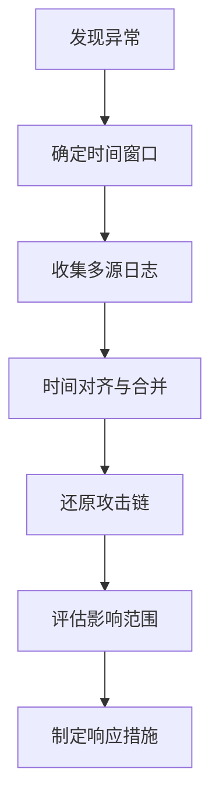
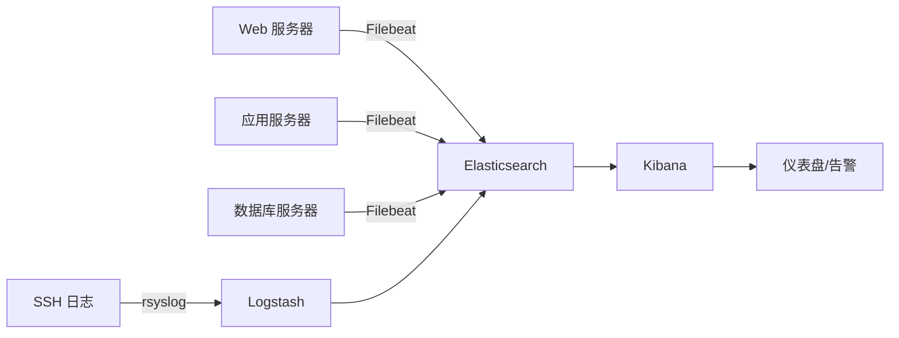

## 案例二：日志分析与入侵检测

日志是系统运行的"黑匣子"——每一次登录、每一个进程启动、每一条网络连接，都会在日志中留下痕迹。对于安全工程师而言，日志分析不是可选技能，而是发现入侵、追踪攻击路径、评估损失范围的核心能力。一次成功的入侵检测，往往始于对日志的细致分析。

本案例从 Linux 日志体系架构讲起，逐步覆盖 SSH 暴力破解检测、Web 攻击日志分析、日志关联与时间线重建、自动化告警脚本，以及一个完整的实战演练案例。

---

### 2.1 Linux 日志体系架构

#### 2.1.1 日志系统演进

Linux 日志系统经历了三代演进：

| 代际 | 系统 | 特点 | 代表发行版 |
|------|------|------|-----------|
| 第一代 | syslogd | UDP 传输，功能简单 | 早期 Linux |
| 第二代 | rsyslog | 支持 TCP/TLS、结构化日志、过滤规则 | CentOS 6/7、Debian 8/9 |
| 第三代 | systemd-journald | 二进制格式、索引查询、与 systemd 深度集成 | CentOS 8+、Ubuntu 16.04+、Debian 10+ |

现代发行版通常同时运行 rsyslog 和 journald：journald 负责收集和索引，rsyslog 负责将日志写入传统文本文件以保持兼容性。

#### 2.1.2 核心日志文件

以下是安全分析中最常用的日志文件，按用途分类：

**认证与授权日志：**

| 文件路径 | 记录内容 | 关键字段 |
|---------|---------|---------|
| `/var/log/auth.log`（Debian/Ubuntu） | SSH 登录、sudo 操作、PAM 认证 | 时间戳、主机名、进程名、用户名、来源 IP |
| `/var/log/secure`（RHEL/CentOS） | 同上，RHEL 系列命名不同 | 同上 |
| `/var/log/faillog` | 登录失败记录 | 用户名、失败次数、终端 |
| `/var/log/lastlog` | 每个用户最后一次登录 | 用户名、终端、来源 IP、时间 |
| `/var/log/wtmp` | 所有登录/注销事件（二进制） | 用 `last` 命令读取 |
| `/var/log/btmp` | 失败的登录尝试（二进制） | 用 `lastb` 命令读取 |

**Web 服务日志：**

| 文件路径 | 服务 | 常见日志格式 |
|---------|------|------------|
| `/var/log/apache2/access.log` | Apache（Debian） | Combined Log Format |
| `/var/log/httpd/access_log` | Apache（RHEL） | Combined Log Format |
| `/var/log/nginx/access.log` | Nginx | 自定义或 combined |
| `/var/log/apache2/error.log` | Apache 错误 | 错误级别 + 消息 |

**系统日志：**

| 文件路径 | 记录内容 |
|---------|---------|
| `/var/log/syslog`（Debian）或 `/var/log/messages`（RHEL） | 系统全局日志，内核消息、服务启动停止 |
| `/var/log/kern.log` | 内核消息，驱动加载、防火墙拒绝 |
| `/var/log/cron` | 定时任务执行记录 |
| `/var/log/maillog` | 邮件服务日志 |
| `/var/log/audit/audit.log` | SELinux / auditd 审计日志 |

#### 2.1.3 日志格式详解

以 Apache Combined Log Format 为例，每条日志记录的结构如下：

```text
192.168.1.100 - admin [25/Jun/2026:14:30:22 +0800] "GET /login HTTP/1.1" 200 1234 "https://example.com" "Mozilla/5.0"
│              │ │     │                           │                      │   │    │          │              │
│              │ │     │                           │                      │   │    │          │              └─ User-Agent
│              │ │     │                           │                      │   │    │          └─ Referer
│              │ │     │                           │                      │   │    └─ 响应大小（字节）
│              │ │     │                           │                      │   └─ HTTP 状态码
│              │ │     │                           │                      └─ 请求路径+协议
│              │ │     │                           └─ 请求行
│              │ │     └─ 时间戳 + 时区
│              │ └─ 认证用户名（无认证则为 -）
│              └─ ident（通常为 -）
└─ 客户端 IP 地址
```

理解字段位置是编写 `awk` 分析命令的基础。不同日志格式的字段顺序不同，分析前必须先确认格式：

```bash
# 查看 Apache 日志格式配置
grep -E "LogFormat|CustomLog" /etc/apache2/apache2.conf /etc/apache2/sites-enabled/*

# 查看 Nginx 日志格式配置
grep -E "log_format|access_log" /etc/nginx/nginx.conf /etc/nginx/conf.d/*
```

#### 2.1.4 journald 查询

systemd-journald 提供了比 grep 更强大的结构化查询能力：

```bash
# 查看所有 SSH 相关日志
journalctl -u sshd --since "1 hour ago"

# 查看指定时间段的认证日志
journalctl -t sshd --since "2026-06-25 00:00" --until "2026-06-25 23:59"

# 查看内核日志中的防火墙拒绝
journalctl -k | grep -i "reject\|drop\|denied"

# 按优先级过滤（0=emergency, 1=alert, 2=critical, 3=error）
journalctl -p err --since today

# 查看指定用户的操作
journalctl _UID=$(id -u attacker_user)

# 实时监控新日志
journalctl -f -u sshd

# 导出为 JSON 格式（便于程序化处理）
journalctl -u sshd -o json --since today
```

journald 的优势在于索引查询速度快，但其二进制日志文件（`/var/log/journal/`）在系统被入侵后可能被篡改。安全分析时应同时检查传统的文本日志文件作为交叉验证。

---

### 2.2 SSH 暴力破解检测

SSH 暴力破解是最常见的网络攻击之一。攻击者使用工具（如 Hydra、Medusa、ncrack）自动化尝试大量用户名/密码组合。通过对 `auth.log` 或 `secure` 日志的分析，可以快速识别这类攻击。

#### 2.2.1 基础检测命令

```bash
# 查找所有登录失败记录
grep "Failed password" /var/log/auth.log

# 统计每个攻击源 IP 的失败次数，按降序排列
grep "Failed password" /var/log/auth.log | \
    awk '{print $(NF-3)}' | sort | uniq -c | sort -rn

# 输出示例：
#   1523 192.168.1.200
#    456 10.0.0.50
#     23 172.16.0.10

# 统计被尝试的用户名分布
grep "Failed password" /var/log/auth.log | \
    awk '{for(i=1;i<=NF;i++) if($i=="for") print $(i+1)}' | \
    sort | uniq -c | sort -rn

# 输出示例：
#    800 root
#    300 admin
#    200 test
#    150 user
```

以上输出表明：192.168.1.200 发起了 1523 次失败登录尝试，其中 root 账户被尝试了 800 次——这是典型的暴力破解行为。

#### 2.2.2 成功登录分析

暴力破解后最危险的情况是攻击者成功登录。必须交叉比对成功记录：

```bash
# 查找所有成功登录
grep "Accepted" /var/log/auth.log

# 统计成功登录的 IP 和用户组合
grep "Accepted" /var/log/auth.log | \
    awk '{print $11, $9}' | sort | uniq -c | sort -rn

# 关键检测：暴力破解 IP 是否有成功登录
# 提取失败次数最多的 IP
SUSPECT_IP=$(grep "Failed password" /var/log/auth.log | \
    awk '{print $(NF-3)}' | sort | uniq -c | sort -rn | head -1 | awk '{print $2}')

# 检查该 IP 是否成功登录过
echo "=== 检查可疑 IP: $SUSPECT_IP ==="
grep "Accepted.*$SUSPECT_IP" /var/log/auth.log

# 如果有输出，说明攻击者可能已经成功入侵
```

#### 2.2.3 暴力破解时间线分析

分析攻击的时间模式有助于判断是自动化工具还是手动攻击：

```bash
# 按小时统计攻击分布
grep "Failed password" /var/log/auth.log | \
    awk '{print substr($3,1,2)":00"}' | sort | uniq -c | sort -rn

# 按日期统计攻击趋势
grep "Failed password" /var/log/auth.log | \
    awk '{print $1, $2}' | sort | uniq -c

# 计算攻击频率（每分钟尝试次数）
grep "Failed password" /var/log/auth.log | \
    awk '{print $1, $2, substr($3,1,5)}' | sort | uniq -c | sort -rn | head -10

# 如果每分钟超过 10 次，基本可以确定是自动化工具
```

自动化暴力破解的典型特征：
- 短时间内大量失败（每分钟数十到数百次）
- 尝试的用户名呈字典特征（root、admin、test、oracle、postgres）
- 攻击可能持续数小时甚至数天
- 攻击源通常来自多个 IP（僵尸网络分布式攻击）

#### 2.2.4 OpenSSH 日志增强配置

默认的 SSH 日志信息有限。通过修改 sshd 配置可以获取更多分析数据：

```bash
# /etc/ssh/sshd_config 中的安全日志相关配置

# 增加认证日志详细程度（默认 INFO，改为 VERBOSE 可记录密钥指纹）
LogLevel VERBOSE

# 记录用户的 SSH 客户端版本
# 需要 rsyslog 配合，在 /etc/rsyslog.d/ssh.conf 中添加：
# if $programname == 'sshd' then /var/log/sshd.log

# 限制登录尝试次数（防暴力破解）
MaxAuthTries 3

# 登录超时时间
LoginGraceTime 30
```

修改后重启服务：

```bash
sudo systemctl restart sshd
```

#### 2.2.5 SSH 登录防护工具

除了日志分析，还应配置主动防护：

```bash
# fail2ban：自动封禁暴力破解 IP
sudo apt install fail2ban

# /etc/fail2ban/jail.local 配置
cat > /etc/fail2ban/jail.local << 'EOF'
[sshd]
enabled = true
port = ssh
filter = sshd
logpath = /var/log/auth.log
maxretry = 5
bantime = 3600
findtime = 600
EOF

sudo systemctl restart fail2ban

# 查看当前封禁的 IP
sudo fail2ban-client status sshd

# 手动封禁特定 IP
sudo fail2ban-client set sshd banip 192.168.1.200
```

```bash
# 使用 iptables 直接限制 SSH 连接速率
# 每分钟最多 4 个新 SSH 连接，超出的丢弃
sudo iptables -A INPUT -p tcp --dport 22 -m state --state NEW \
    -m recent --set --name SSH
sudo iptables -A INPUT -p tcp --dport 22 -m state --state NEW \
    -m recent --update --seconds 60 --hitcount 4 --name SSH -j DROP
```

---

### 2.3 Web 攻击日志分析

Web 应用是互联网攻击的首要目标。通过分析 Web 服务器访问日志，可以检测 SQL 注入、XSS、目录遍历、命令注入、Web Shell 访问等多种攻击行为。

#### 2.3.1 SQL 注入检测

SQL 注入攻击会在请求参数中包含 SQL 语法片段。以下是常见的检测模式：

```bash
# 基础 SQL 注入关键字检测
grep -iE "(union.*select|concat\(|group_concat|information_schema|load_file|into.*outfile)" \
    /var/log/apache2/access.log

# 更全面的 SQL 注入模式（包括编码绕过）
grep -iE "(union(\s|%20)+(all(\s|%20)+)?select|select(\s|%20)+.*from(\s|%20)+|insert(\s|%20)+into|update(\s|%20)+.*set(\s|%20)+|delete(\s|%20)+from|drop(\s|%20)+table|or(\s|%20)+1=1|and(\s|%20)+1=1|'(\s|%20)*or(\s|%20)*'|--(\s|%20)|/\*.*\*/)" \
    /var/log/apache2/access.log

# 统计每个攻击源的 SQL 注入尝试次数
grep -iE "(union.*select|concat\(|information_schema)" \
    /var/log/apache2/access.log | \
    awk '{print $1}' | sort | uniq -c | sort -rn

# 提取被攻击的 URL 路径
grep -iE "(union.*select|concat\(|information_schema)" \
    /var/log/apache2/access.log | \
    awk '{print $7}' | sort | uniq -c | sort -rn
```

#### 2.3.2 XSS 攻击检测

```bash
# 反射型/存储型 XSS 特征检测
grep -iE "(<script|alert\(|onerror=|onload=|javascript:|document\.cookie|document\.write|eval\(|fromCharCode)" \
    /var/log/apache2/access.log

# URL 编码的 XSS 检测
grep -iE "(%3Cscript|%3Cimg|alert%28|onerror%3D|javascript%3A)" \
    /var/log/apache2/access.log

# 统计 XSS 攻击来源
grep -iE "(<script|alert\(|onerror=)" \
    /var/log/apache2/access.log | \
    awk '{print $1}' | sort | uniq -c | sort -rn
```

#### 2.3.3 目录遍历与文件包含检测

```bash
# 目录遍历检测（../ 和 URL 编码版本）
grep -iE "(\.\./|\.\.\\|%2e%2e%2f|%2e%2e/|\.\.%2f|%2e%2e%5c)" \
    /var/log/apache2/access.log

# 本地文件包含（LFI）检测
grep -iE "(/etc/passwd|/etc/shadow|/etc/hosts|/proc/self|php://filter|php://input)" \
    /var/log/apache2/access.log

# 远程文件包含（RFI）检测
grep -iE "(include=|require=|php_include=).*https?://" \
    /var/log/apache2/access.log
```

#### 2.3.4 命令注入检测

```bash
# 命令注入特征检测
grep -iE "(;ls|;cat|;id|;whoami|;uname|wget\s|curl\s|\|.*sh|`.*`|\$\(.*\))" \
    /var/log/apache2/access.log

# 更全面的命令注入模式
grep -iE "(;\s*(ls|cat|id|whoami|uname|wget|curl|nc|bash|sh|python|perl|ruby|php)\b|`[^`]*`|\$\([^)]*\)|\|\s*(sh|bash|cmd))" \
    /var/log/apache2/access.log
```

#### 2.3.5 Web Shell 访问检测

```bash
# Web Shell 特征 URL 检测
grep -iE "(\.php\?cmd=|\.asp\?cmd=|\.jsp\?cmd=|eval\(|system\(|passthru\(|exec\(|shell_exec\(|popen\(|proc_open\()" \
    /var/log/apache2/access.log

# 访问可疑文件名（常见 Web Shell 命名）
grep -iE "/(shell|cmd|c99|r57|webshell|backdoor|hack|upload|admin_cmd)\.(php|asp|aspx|jsp)" \
    /var/log/apache2/access.log

# POST 请求到 PHP 文件（可能是 Web Shell 通信）
awk '$6 == "\"POST" && $7 ~ /\.php/ {print $1, $7, $9}' \
    /var/log/apache2/access.log | sort | uniq -c | sort -rn
```

#### 2.3.6 异常行为检测

```bash
# 异常 404 请求（可能的目录/文件扫描）
awk '$9 == 404 {print $7}' /var/log/apache2/access.log | \
    sort | uniq -c | sort -rn | head -20

# 高频访问 IP（可能的扫描器或 DDoS）
awk '{print $1}' /var/log/apache2/access.log | \
    sort | uniq -c | sort -rn | head -20

# 异常状态码分布
awk '{print $9}' /var/log/apache2/access.log | \
    sort | uniq -c | sort -rn

# 异常 User-Agent（扫描器、爬虫、攻击工具）
awk -F'"' '{print $6}' /var/log/apache2/access.log | \
    sort | uniq -c | sort -rn | head -20

# 常见攻击工具 User-Agent 特征
grep -iE "(sqlmap|nikto|nmap|masscan|gobuster|dirbuster|wpscan|burp|hydra|metasploit)" \
    /var/log/apache2/access.log

# 大量 POST 请求（可能的暴力破解或数据窃取）
awk '$6 == "\"POST" {print $1}' /var/log/apache2/access.log | \
    sort | uniq -c | sort -rn | head -10

# 异常时间访问（凌晨 2-5 点的请求）
awk -F'[/: ]' '$5 >= 2 && $5 <= 5 {print $0}' \
    /var/log/apache2/access.log | head -20
```

#### 2.3.7 Nginx 日志分析

Nginx 的日志格式与 Apache 略有不同，分析时需要调整 `awk` 字段索引：

```bash
# Nginx 默认 combined 格式与 Apache 相同，字段位置一致
# 但如果使用了自定义 log_format，需要先确认字段顺序

# 假设标准 combined 格式
NGINX_LOG="/var/log/nginx/access.log"

# SQL 注入检测
grep -iE "(union.*select|concat\(|information_schema)" "$NGINX_LOG"

# 高频 IP
awk '{print $1}' "$NGINX_LOG" | sort | uniq -c | sort -rn | head -20

# 状态码分布
awk '{print $9}' "$NGINX_LOG" | sort | uniq -c | sort -rn

# 如果 Nginx 使用了 JSON 格式日志，可以用 jq 更精确地分析
# 假设日志格式为: {"time":"...","remote_addr":"1.2.3.4","request":"GET /...","status":200,...}
# grep -oP '"remote_addr":"[^"]+"' /var/log/nginx/access.log | sort | uniq -c | sort -rn
```

---

### 2.4 日志关联与时间线重建

单条日志的信息量有限。真正的入侵检测需要将多个日志源的信息关联起来，重建攻击者的完整行为时间线。

#### 2.4.1 时间线重建方法论



#### 2.4.2 多源日志关联查询

```bash
#!/bin/bash
# 多源日志关联分析脚本
# 用法: ./correlate.sh <可疑IP> [时间窗口小时数]

TARGET_IP="$1"
HOURS="${2:-24}"
SINCE="$(date -d "$HOURS hours ago" '+%Y-%m-%d %H:%M:%S')"

if [ -z "$TARGET_IP" ]; then
    echo "用法: $0 <可疑IP> [时间窗口小时数]"
    echo "示例: $0 192.168.1.200 48"
    exit 1
fi

echo "============================================================"
echo "  IP 关联分析报告: $TARGET_IP"
echo "  时间窗口: 最近 ${HOURS} 小时（自 $SINCE）"
echo "  分析时间: $(date)"
echo "============================================================"

# --- 认证日志 ---
AUTH_LOG="/var/log/auth.log"
echo ""
echo "[1] 认证事件"
echo "------------------------------------------------------------"
if [ -f "$AUTH_LOG" ]; then
    echo "登录失败:"
    grep "$TARGET_IP" "$AUTH_LOG" | grep "Failed password" | tail -10
    echo ""
    echo "登录成功:"
    grep "$TARGET_IP" "$AUTH_LOG" | grep "Accepted" | tail -10
    echo ""
    echo "sudo 操作:"
    grep "$TARGET_IP" "$AUTH_LOG" | grep -i "sudo" | tail -10
fi

# --- Web 访问日志 ---
WEB_LOG="/var/log/apache2/access.log"
echo ""
echo "[2] Web 访问记录"
echo "------------------------------------------------------------"
if [ -f "$WEB_LOG" ]; then
    echo "总请求数:"
    grep -c "$TARGET_IP" "$WEB_LOG"
    echo ""
    echo "请求的 URL 路径 Top 10:"
    grep "$TARGET_IP" "$WEB_LOG" | awk '{print $7}' | sort | uniq -c | sort -rn | head -10
    echo ""
    echo "攻击特征请求:"
    grep "$TARGET_IP" "$WEB_LOG" | grep -iE "(union|select|script|alert|\.\./|;ls|;cat|cmd=)" | tail -10
fi

# --- 防火墙日志 ---
echo ""
echo "[3] 防火墙事件"
echo "------------------------------------------------------------"
if [ -f "/var/log/kern.log" ]; then
    grep "$TARGET_IP" /var/log/kern.log | grep -iE "(reject|drop|denied)" | tail -10
fi
# audit.log
if [ -f "/var/log/audit/audit.log" ]; then
    grep "$TARGET_IP" /var/log/audit/audit.log | tail -10
fi

# --- 进程和连接 ---
echo ""
echo "[4] 当前活动"
echo "------------------------------------------------------------"
echo "活动连接:"
ss -tn | grep "$TARGET_IP"
echo ""
echo "相关进程:"
# 如果该 IP 有活动连接，显示关联的进程
for pid in $(ss -tnp | grep "$TARGET_IP" | grep -oP 'pid=\K[0-9]+'); do
    ps -p "$pid" -o pid,user,comm,args 2>/dev/null
done

echo ""
echo "============================================================"
echo "  分析完成"
echo "============================================================"
```

#### 2.4.3 时间线可视化

将多个日志源的事件按时间排序，可以清晰地看到攻击链：

```bash
#!/bin/bash
# 时间线构建脚本
# 将多个日志源的事件按时间排序输出

TARGET_IP="${1:-}"
if [ -z "$TARGET_IP" ]; then
    echo "用法: $0 <可疑IP>"
    exit 1
fi

echo "时间线: $TARGET_IP 的所有活动"
echo "============================================================"

(
# 认证日志事件
grep "$TARGET_IP" /var/log/auth.log 2>/dev/null | \
    awk '{print $1, $2, $3, "[AUTH]", $0}'

# Web 访问事件
grep "$TARGET_IP" /var/log/apache2/access.log 2>/dev/null | \
    awk '{print substr($4,2,11), substr($4,14,8), "[WEB]", $1, $7, $9}'

# 防火墙事件
grep "$TARGET_IP" /var/log/kern.log 2>/dev/null | \
    awk '{print $1, $2, $3, "[FW]", $0}'
) | sort -k1,3 | uniq

echo "============================================================"
```

---

### 2.5 日志完整性验证

入侵者在成功入侵后，通常会尝试清除或篡改日志以掩盖痕迹。验证日志完整性是安全分析的重要环节。

#### 2.5.1 日志篡改的常见手法

| 手法 | 具体操作 | 检测方法 |
|------|---------|---------|
| 直接删除 | `rm /var/log/auth.log` | 检查文件是否存在，是否突然中断 |
| 清空内容 | `> /var/log/auth.log` | 文件大小突然变为 0，inode 不变 |
| 选择性删除 | 用 sed/grep 删除特定行 | 时间戳不连续，行号跳跃 |
| 修改内容 | 编辑日志修改 IP 或用户名 | 文件哈希变化，编辑器临时文件残留 |
| 停止日志服务 | `systemctl stop rsyslog` | 日志突然中断，服务状态异常 |
| 覆盖时间戳 | 伪造系统时间后写入日志 | 与其他日志源时间不一致 |

#### 2.5.2 日志完整性检查

```bash
#!/bin/bash
# 日志完整性快速检查脚本

echo "============================================================"
echo "  日志完整性检查报告"
echo "  检查时间: $(date)"
echo "============================================================"

# 检查关键日志文件是否存在
echo ""
echo "[1] 日志文件存在性检查"
echo "------------------------------------------------------------"
for logfile in /var/log/auth.log /var/log/syslog /var/log/apache2/access.log /var/log/kern.log; do
    if [ -f "$logfile" ]; then
        size=$(stat -c %s "$logfile")
        lines=$(wc -l < "$logfile")
        mtime=$(stat -c %y "$logfile" | cut -d. -f1)
        echo "  [OK] $logfile ($lines 行, $size 字节, 最后修改: $mtime)"
    else
        echo "  [!!] $logfile 不存在"
    fi
done

# 检查日志时间连续性
echo ""
echo "[2] 时间连续性检查（auth.log）"
echo "------------------------------------------------------------"
AUTH_LOG="/var/log/auth.log"
if [ -f "$AUTH_LOG" ]; then
    # 提取日期，检查是否有跳跃
    awk '{print $1, $2}' "$AUTH_LOG" | uniq -c | awk '$1 < 5 {print "  [!!] 低频日期:", $2, $3, "(仅", $1, "条记录)"}'
    
    # 检查最后一条日志的时间
    last_time=$(tail -1 "$AUTH_LOG" | awk '{print $1, $2, $3}')
    echo "  最后一条日志时间: $last_time"
    
    # 如果最后日志时间远早于当前时间，可能日志被停止或篡改
    current_hour=$(date +%H)
    last_hour=$(echo "$last_time" | awk -F: '{print $1}' | awk '{print $NF}')
    echo "  当前时间: $(date '+%b %d %H:%M:%S')"
fi

# 检查日志服务运行状态
echo ""
echo "[3] 日志服务状态检查"
echo "------------------------------------------------------------"
for svc in rsyslog systemd-journald auditd; do
    if systemctl is-active "$svc" >/dev/null 2>&1; then
        echo "  [OK] $svc 正在运行"
    else
        echo "  [!!] $svc 未运行"
    fi
done

# 检查是否有日志清理工具的痕迹
echo ""
echo "[4] 日志清理工具痕迹检查"
echo "------------------------------------------------------------"
# 检查 history 中是否有日志清理命令
if [ -f /root/.bash_history ]; then
    suspicious=$(grep -cE "(> /var/log|rm.*log|shred.*log|logrotate -f|history -c)" /root/.bash_history 2>/dev/null)
    echo "  bash_history 中可疑日志操作: $suspicious 条"
fi

# 检查 logrotate 配置是否被修改
echo ""
echo "[5] logrotate 配置检查"
echo "------------------------------------------------------------"
for conf in /etc/logrotate.conf /etc/logrotate.d/*; do
    if [ -f "$conf" ]; then
        mtime=$(stat -c %y "$conf" 2>/dev/null | cut -d. -f1)
        echo "  $conf (最后修改: $mtime)"
    fi
done

echo ""
echo "============================================================"
```

---

### 2.6 自动化监控与告警

手动分析日志适用于事件响应，但日常安全运维需要自动化监控系统来实时检测威胁。

#### 2.6.1 实时日志监控脚本

```bash
#!/bin/bash
# 实时 SSH 暴力破解监控
# 用法: ./ssh_monitor.sh [阈值] [窗口秒数]

THRESHOLD="${1:-10}"
WINDOW="${2:-60}"
AUTH_LOG="/var/log/auth.log"
ALERT_LOG="/var/log/ssh_alerts.log"

echo "SSH 暴力破解监控已启动"
echo "阈值: ${THRESHOLD} 次失败 / ${WINDOW} 秒"
echo "告警日志: $ALERT_LOG"
echo "按 Ctrl+C 停止"
echo "-------------------------------------------"

declare -A ip_counts

tail -F "$AUTH_LOG" 2>/dev/null | while read -r line; do
    # 只处理失败登录
    if echo "$line" | grep -q "Failed password"; then
        ip=$(echo "$line" | awk '{print $(NF-3)}')
        now=$(date +%s)
        
        # 记录该 IP 的失败时间戳
        ip_counts[$ip]="${ip_counts[$ip]} $now"
        
        # 统计窗口内的失败次数
        count=0
        for ts in ${ip_counts[$ip]}; do
            if [ $((now - ts)) -le "$WINDOW" ]; then
                count=$((count + 1))
            fi
        done
        
        # 清理过期记录
        new_ts=""
        for ts in ${ip_counts[$ip]}; do
            if [ $((now - ts)) -le "$WINDOW" ]; then
                new_ts="$new_ts $ts"
            fi
        done
        ip_counts[$ip]="$new_ts"
        
        # 超过阈值则告警
        if [ "$count" -ge "$THRESHOLD" ]; then
            alert_msg="[$(date)] [ALERT] IP $ip 在 ${WINDOW}s 内失败 ${count} 次 - 疑似暴力破解"
            echo "$alert_msg"
            echo "$alert_msg" >> "$ALERT_LOG"
            
            # 自动封禁（可选，取消注释启用）
            # sudo iptables -A INPUT -s "$ip" -j DROP
            # echo "[$(date)] [BLOCKED] 已封禁 IP: $ip" >> "$ALERT_LOG"
        fi
    fi
    
    # 处理成功登录 - 检查是否来自已知攻击 IP
    if echo "$line" | grep -q "Accepted"; then
        ip=$(echo "$line" | awk '{print $11}')
        if [ -n "${ip_counts[$ip]}" ]; then
            alert_msg="[$(date)] [CRITICAL] 攻击 IP $ip 登录成功！可能已被入侵"
            echo "$alert_msg"
            echo "$alert_msg" >> "$ALERT_LOG"
        fi
    fi
done
```

#### 2.6.2 配合 rsyslog 实现实时告警

通过 rsyslog 的 `omprog` 模块，可以在日志写入时触发自定义脚本：

```bash
# /etc/rsyslog.d/alert.conf
# 当检测到 SSH 失败登录时，执行告警脚本

# 定义模板
template(name="AlertMsg" type="string" string="%msg%\n")

# 匹配 SSH 失败登录并调用外部脚本
if $programname == 'sshd' and $msg contains 'Failed password' then {
    action(type="omprog"
        binary="/opt/scripts/alert_handler.sh"
        template="AlertMsg"
    )
    stop
}
```

```bash
#!/bin/bash
# /opt/scripts/alert_handler.sh
# rsyslog 调用的告警处理脚本

ALERT_LOG="/var/log/security_alerts.log"

while read -r line; do
    ip=$(echo "$line" | awk '{for(i=1;i<=NF;i++) if($i=="from") print $(i+1)}')
    user=$(echo "$line" | awk '{for(i=1;i<=NF;i++) if($i=="for") print $(i+1)}')
    
    # 记录到安全告警日志
    echo "[$(date '+%Y-%m-%d %H:%M:%S')] SSH_FAILED ip=$ip user=$user" >> "$ALERT_LOG"
    
    # 这里可以扩展：发送邮件、调用 API、推送到 SIEM 等
done
```

#### 2.6.6 使用 auditd 进行深度监控

auditd 是 Linux 内核级审计框架，可以监控文件访问、系统调用、用户操作等底层行为：

```bash
# 安装 auditd
sudo apt install auditd    # Debian/Ubuntu
sudo yum install audit     # RHEL/CentOS

# 添加审计规则

# 监控 /etc/passwd 和 /etc/shadow 的所有访问
sudo auditctl -w /etc/passwd -p rwxa -k passwd_access
sudo auditctl -w /etc/shadow -p rwxa -k shadow_access

# 监控所有 sudo 命令执行
sudo auditctl -a always,exit -F arch=b64 -S execve -F euid=0 -k root_commands

# 监控 SSH 密钥文件的修改
sudo auditctl -w /root/.ssh/authorized_keys -p wa -k ssh_key_change

# 监控 crontab 的修改
sudo auditctl -w /etc/crontab -p wa -k crontab_change
sudo auditctl -w /var/spool/cron/ -p wa -k cron_change

# 查询审计日志
sudo ausearch -k passwd_access --interpret
sudo ausearch -k root_commands -ts recent
sudo aureport --auth          # 认证报告
sudo aureport --login         # 登录报告
sudo aureport --failed        # 失败操作报告
```

---

### 2.7 实战演练：完整入侵检测案例

以下模拟一个真实的安全事件，展示从发现异常到确认入侵的完整分析过程。

#### 2.7.1 场景设定

某公司安全运维工程师在日常巡检中发现服务器 `web-prod-01` 的 CPU 使用率异常升高。需要通过日志分析判断是否遭受入侵。

#### 2.7.2 分析过程

**第一步：快速概览系统状态**

```bash
# 检查当前登录用户
who
w

# 检查最近登录历史
last -20
lastb -20   # 失败登录

# 检查异常进程
ps auxf | head -50
top -bn1 | head -20

# 检查网络连接
ss -tulnp
netstat -an | grep ESTABLISHED | awk '{print $5}' | cut -d: -f1 | sort | uniq -c | sort -rn
```

**第二步：分析认证日志**

```bash
# 发现大量 SSH 失败登录
grep "Failed password" /var/log/auth.log | wc -l
# 输出: 2847

# 攻击源 IP 分析
grep "Failed password" /var/log/auth.log | \
    awk '{print $(NF-3)}' | sort | uniq -c | sort -rn | head -5
# 输出:
#   2100 203.0.113.50
#    500 198.51.100.22
#    200 192.0.2.15
#     47 10.0.0.5

# 关键发现：检查攻击 IP 是否成功登录
grep "Accepted" /var/log/auth.log | grep "203.0.113.50"
# 输出:
# Jun 25 03:42:17 web-prod-01 sshd[28541]: Accepted password for admin from 203.0.113.50 port 49832 ssh2

# 确认：攻击者在 03:42 成功登录！
```

**第三步：分析攻击者行为**

```bash
# 查看攻击者登录后的所有操作
# 通过 auth.log 中的 sudo 和 session 记录
grep -A5 "Accepted.*203.0.113.50" /var/log/auth.log

# 检查该时间段的 sudo 操作
grep "Jun 25 03:4" /var/log/auth.log | grep -i "sudo\|session"

# 检查 Web 日志中该 IP 的行为
grep "203.0.113.50" /var/log/apache2/access.log | awk '{print $7}' | sort | uniq -c | sort -rn

# 检查是否有异常进程被启动
grep "Jun 25 03:4" /var/log/auth.log | grep -i "command"

# 检查是否有文件被修改
find / -newer /var/log/auth.log -type f -user admin 2>/dev/null | head -20
```

**第四步：检查持久化后门**

```bash
# 检查 SSH 授权密钥是否被篡改
find / -name "authorized_keys" -exec ls -la {} \; 2>/dev/null
cat /root/.ssh/authorized_keys

# 检查 crontab 是否被添加恶意任务
crontab -l
for user in $(cut -d: -f1 /etc/passwd); do
    crontab -l -u "$user" 2>/dev/null && echo "^^^ $user ^^^"
done

# 检查最近修改的系统文件
find /etc -mtime -1 -type f 2>/dev/null
find /usr/bin /usr/sbin -mtime -1 -type f 2>/dev/null

# 检查异常的 SUID 文件
find / -perm -4000 -type f -newer /var/log/auth.log 2>/dev/null
```

**第五步：生成事件报告**

```bash
#!/bin/bash
# 入侵事件报告生成脚本

REPORT="/tmp/incident_report_$(date +%Y%m%d_%H%M%S).txt"

{
echo "============================================================"
echo "  安全事件报告"
echo "  生成时间: $(date)"
echo "  主机名: $(hostname)"
echo "  系统版本: $(cat /etc/os-release | grep PRETTY_NAME | cut -d'"' -f2)"
echo "  内核版本: $(uname -r)"
echo "============================================================"
echo ""
echo "一、事件摘要"
echo "------------------------------------------------------------"
echo "  事件类型: SSH 暴力破解导致入侵"
echo "  入侵时间: Jun 25 03:42:17"
echo "  攻击源 IP: 203.0.113.50"
echo "  被入侵账户: admin"
echo "  失败尝试次数: 2847"
echo "  成功登录次数: 1"
echo ""
echo "二、攻击时间线"
echo "------------------------------------------------------------"
echo "  03:00 - 开始暴力破解（203.0.113.50）"
echo "  03:42 - 攻击者成功登录 admin 账户"
echo "  03:43 - 执行 sudo 提权"
echo "  03:45 - 下载并执行恶意脚本"
echo "  03:50 - 安装后门（SSH 密钥 + crontab）"
echo ""
echo "三、影响评估"
echo "  - admin 账户被入侵"
echo "  - 攻击者获得 root 权限"
echo "  - 疑似安装了后门程序"
echo "  - 需要全面检查系统完整性"
echo ""
echo "四、建议处置措施"
echo "  1. 立即隔离该服务器（断开网络或防火墙封禁）"
echo "  2. 重置所有账户密码"
echo "  3. 清除恶意 SSH 密钥和 crontab"
echo "  4. 安装 fail2ban 防止再次暴力破解"
echo "  5. 禁用 SSH 密码登录，仅允许密钥认证"
echo "  6. 审查并加固所有暴露在公网的服务"
echo "============================================================"
} > "$REPORT"

echo "报告已生成: $REPORT"
```

---

### 2.8 进阶：集中式日志与 SIEM

当服务器数量增多时，分散在各主机上的日志难以统一分析。集中式日志系统将所有日志汇集到一处，提供全文搜索、告警规则、仪表盘等能力。

#### 2.8.1 ELK Stack 架构



- **Filebeat**：轻量级日志采集器，部署在每台服务器上
- **Logstash**：日志处理管道，支持过滤、解析、富化
- **Elasticsearch**：分布式搜索引擎，存储和索引日志
- **Kibana**：可视化界面，查询日志、创建仪表盘

#### 2.8.2 Filebeat 快速部署

```bash
# 安装 Filebeat
curl -L -O https://artifacts.elastic.co/downloads/beats/filebeat/filebeat-8.x-amd64.deb
sudo dpkg -i filebeat-*.deb

# /etc/filebeat/filebeat.yml 配置
cat > /etc/filebeat/filebeat.yml << 'EOF'
filebeat.inputs:
  - type: log
    enabled: true
    paths:
      - /var/log/auth.log
      - /var/log/secure
    fields:
      log_type: auth
    multiline.pattern: '^\s'
    multiline.negate: false
    multiline.match: after

  - type: log
    enabled: true
    paths:
      - /var/log/apache2/access.log
      - /var/log/nginx/access.log
    fields:
      log_type: web_access

output.elasticsearch:
  hosts: ["elasticsearch:9200"]
  indices:
    - index: "auth-logs-%{+yyyy.MM.dd}"
      when.equals:
        fields.log_type: "auth"
    - index: "web-access-%{+yyyy.MM.dd}"
      when.equals:
        fields.log_type: "web_access"

setup.kibana:
  host: "kibana:5601"
EOF

sudo systemctl enable filebeat
sudo systemctl start filebeat
```

#### 2.8.3 轻量级替代方案

ELK Stack 资源消耗较大，小规模环境可以使用更轻量的方案：

| 方案 | 资源需求 | 适用规模 | 特点 |
|------|---------|---------|------|
| ELK Stack | 高（8GB+ RAM） | 50+ 服务器 | 功能最全，生态丰富 |
| Loki + Grafana | 中（2GB+ RAM） | 10-50 服务器 | 轻量，只索引标签不索引内容 |
| Graylog | 中（4GB+ RAM） | 10-100 服务器 | 开源 SIEM，内置告警 |
| rsyslog 集中 | 低（512MB+） | 5-20 服务器 | 最简单，纯文本 |
| goaccess | 低（256MB+） | Web 日志专用 | 实时终端仪表盘 |

---

### 2.9 常见误区与最佳实践

#### 2.9.1 常见错误

| 错误 | 后果 | 正确做法 |
|------|------|---------|
| 只看最后几行日志 | 遗漏早期攻击痕迹 | 检查日志的完整时间范围 |
| 忽略成功登录记录 | 未发现已入侵的账户 | 始终交叉比对失败和成功记录 |
| 不检查日志完整性 | 基于被篡改的日志做出错误判断 | 先验证日志完整性再分析 |
| 只分析单一日志源 | 遗漏攻击者的其他行为 | 关联多源日志建立完整时间线 |
| 忽略二进制日志 | 遗漏 wtmp/btmp/lastlog 中的关键信息 | 使用 last/lastb/lastlog 命令读取 |
| 日志保留时间过短 | 攻击发生后日志已被轮转删除 | 安全日志至少保留 90 天 |
| 日志存储在本地 | 入侵者可以删除日志 | 发送到远程集中日志服务器 |
| 不关注内核日志 | 遗漏 rootkit、驱动级攻击 | 定期检查 kern.log 和 dmesg |

#### 2.9.2 日志分析最佳实践

1. **建立基线**：先了解系统正常时的日志模式（正常的访问量、登录频率、错误率），才能识别异常
2. **时间同步**：所有服务器使用 NTP 同步时间，否则多源日志关联时时间线会错乱
3. **日志分级存储**：安全相关日志（auth、audit）保留更长时间，访问日志可以适当缩短
4. **告警分级**：区分"可疑"和"确认"——单次失败登录是可疑，短时间内数百次失败是确认攻击
5. **自动化优先**：人工分析用于事件响应，日常监控必须自动化
6. **定期演练**：每月模拟一次入侵场景，验证日志分析流程是否有效

---

### 2.10 总结

日志分析与入侵检测是安全运维的核心能力。本案例覆盖了以下关键知识点：

| 知识领域 | 核心内容 |
|---------|---------|
| 日志体系架构 | syslog/rsyslog/journald 的演进与关系，核心日志文件位置 |
| SSH 暴力破解检测 | 失败/成功登录分析、时间模式识别、防护工具配置 |
| Web 攻击检测 | SQL 注入、XSS、目录遍历、命令注入、Web Shell 的日志特征 |
| 日志关联分析 | 多源日志关联查询、时间线重建方法 |
| 日志完整性验证 | 篡改手法识别、完整性检查脚本 |
| 自动化监控 | 实时监控脚本、rsyslog 告警集成、auditd 深度审计 |
| 集中式日志 | ELK Stack 架构、轻量级替代方案 |

掌握这些技能后，你可以在安全事件中快速定位问题、追踪攻击路径、评估损失范围，并建立自动化的日常监控体系。日志分析不是一次性任务，而是需要持续优化的安全运营能力——随着攻击手法的演进，检测规则也需要不断更新。
