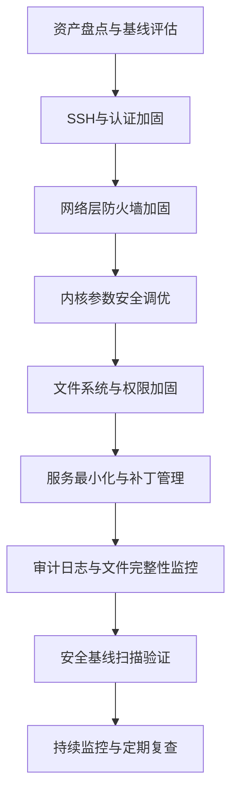

## 案例四：系统加固

### 4.1 背景说明

系统加固（System Hardening）是在系统上线前或运行中，通过关闭不必要的服务、收紧权限、强化认证、配置审计等一系列手段，将攻击面压缩到最小的过程。它的核心思想是**最小权限原则**——只开放系统正常运行所必需的能力，其余一律关闭。

加固不是一次性动作，而是一个持续的过程。以下是一个典型的加固工作流：



> **为什么加固如此重要？** 根据 Verizon DBIR 报告，超过 60% 的入侵事件利用的是已知漏洞或配置错误，而非零日漏洞。一个未经加固的系统暴露在公网上，平均在 2 小时内就会被自动化扫描器探测到。加固是成本最低、收益最高的防御手段。

### 4.2 SSH 加固

SSH 是绝大多数 Linux 服务器的管理入口，也是攻击者首要目标。SSH 加固的目标是：消除暴力破解、防止凭据泄露、限制会话滥用。

#### 4.2.1 SSH 加固配置详解

```bash
# 备份原配置（任何修改前的第一步）
cp /etc/ssh/sshd_config /etc/ssh/sshd_config.bak
cp -r /etc/ssh/sshd_config.d /etc/ssh/sshd_config.d.bak 2>/dev/null

# 使用 drop-in 配置文件，避免直接修改主配置（便于管理和回滚）
cat > /etc/ssh/sshd_config.d/hardening.conf << 'EOF'
# ============================================================
# SSH 加固配置 — 仅通过密钥认证，限制访问范围
# ============================================================

# --- 端口与监听 ---
Port 2222                          # 修改默认端口，避开自动化扫描器
ListenAddress 0.0.0.0              # 如有多网卡，可绑定到管理网卡IP

# --- 认证策略 ---
PermitRootLogin no                 # 禁止 root 直接登录
PasswordAuthentication no          # 禁用密码认证，仅允许密钥
PubkeyAuthentication yes           # 启用公钥认证
PermitEmptyPasswords no            # 禁止空密码
ChallengeResponseAuthentication no # 禁用挑战-响应认证

# --- 会话限制 ---
MaxAuthTries 3                     # 单次连接最多尝试3次认证
LoginGraceTime 60                  # 认证超时60秒，超时断开
MaxSessions 3                      # 单连接最多3个会话
MaxStartups 10:30:60               # 并发未认证连接限制：10开始拒绝，30概率递增，60全拒
ClientAliveInterval 300            # 空闲检测间隔300秒
ClientAliveCountMax 2              # 2次无响应断开连接

# --- 访问控制 ---
AllowUsers deploy admin            # 只允许指定用户登录
# AllowGroups ssh-users            # 或使用组控制
# DenyUsers test temp              # 黑名单方式（与AllowUsers二选一）

# --- 加密算法强化 ---
KexAlgorithms curve25519-sha256@libssh.org,curve25519-sha256,diffie-hellman-group16-sha512,diffie-hellman-group18-sha512
Ciphers chacha20-poly1305@openssh.com,aes256-gcm@openssh.com,aes128-gcm@openssh.com
MACs hmac-sha2-512-etm@openssh.com,hmac-sha2-256-etm@openssh.com
HostKeyAlgorithms ssh-ed25519,rsa-sha2-512,rsa-sha2-256

# --- 功能禁用 ---
X11Forwarding no                   # 禁用 X11 转发（服务器无需图形）
AllowTcpForwarding no              # 禁用 TCP 转发（防止隧道滥用）
PermitTunnel no                    # 禁用 tun/tap 设备转发
GatewayPorts no                    # 禁止远程主机连接本地转发端口
PrintMotd no                       # 禁用登录后 MOTD（由 PAM 处理）

# --- 日志 ---
LogLevel VERBOSE                   # 详细日志，记录密钥指纹等
EOF

# 验证配置语法（关键步骤，避免配置错误导致无法登录）
sudo sshd -t

# 语法无误后重启服务
sudo systemctl restart sshd
```

#### 4.2.2 SSH 密钥管理最佳实践

```bash
# 生成 Ed25519 密钥（当前推荐算法，比 RSA 更安全更高效）
ssh-keygen -t ed25519 -C "admin@server-01" -f ~/.ssh/id_ed25519

# 如果必须使用 RSA，至少 4096 位
ssh-keygen -t rsa -b 4096 -C "admin@server-01" -f ~/.ssh/id_rsa

# 设置正确的目录权限（SSH 对权限极其严格，否则拒绝工作）
chmod 700 ~/.ssh
chmod 600 ~/.ssh/id_ed25519 ~/.ssh/id_ed25519.pub
chmod 600 ~/.ssh/authorized_keys
chmod 644 ~/.ssh/known_hosts

# 使用 ssh-copy-id 部署公钥到远程服务器
ssh-copy-id -i ~/.ssh/id_ed25519.pub user@server

# 禁用旧版 SSH 协议
grep -q "^Protocol" /etc/ssh/sshd_config && \
    sed -i 's/^Protocol.*/Protocol 2/' /etc/ssh/sshd_config || \
    echo "Protocol 2" >> /etc/ssh/sshd_config
```

#### 4.2.3 Fail2Ban 防暴力破解

```bash
# 安装 Fail2Ban
sudo apt install fail2ban -y          # Debian/Ubuntu
sudo yum install fail2ban -y          # CentOS/RHEL

# 创建本地配置（不要直接修改 jail.conf）
cat > /etc/fail2ban/jail.local << 'EOF'
[DEFAULT]
# 封禁时间：1小时
bantime = 3600
# 检测窗口：10分钟内
findtime = 600
# 最大失败次数
maxretry = 3
# 使用 systemd 日志
backend = systemd

# 白名单：本机和内网管理段
ignoreip = 127.0.0.1/8 ::1 10.0.0.0/8

[sshd]
enabled = true
port = 2222
filter = sshd
logpath = %(sshd_log)s
# 永久封禁重复违规者
bantime = -1
# 递进式封禁：第1次1小时，第2次24小时，第3次永久
# 需配合 recidive 规则
maxretry = 3

[recidive]
enabled = true
filter = recidive
logpath = /var/log/fail2ban.log
bantime = 86400
findtime = 86400
maxretry = 3
EOF

# 启动 Fail2Ban
sudo systemctl enable fail2ban
sudo systemctl restart fail2ban

# 查看封禁状态
sudo fail2ban-client status sshd

# 手动封禁/解封 IP
sudo fail2ban-client set sshd banip 192.168.1.100
sudo fail2ban-client set sshd unbanip 192.168.1.100
```

#### 4.2.4 SSH 加固前后对比

| 加固项目 | 加固前（高风险） | 加固后（安全） |
|---------|----------------|---------------|
| 端口 | 22（默认） | 2222（自定义） |
| Root登录 | 允许 | 禁止 |
| 认证方式 | 密码+密钥 | 仅密钥 |
| 暴力破解防护 | 无 | Fail2Ban 自动封禁 |
| 加密算法 | 默认（含弱算法） | 仅强算法 |
| 会话超时 | 无限制 | 300秒无响应断开 |
| 转发功能 | 全部开启 | 全部禁用 |
| 日志级别 | INFO | VERBOSE |

### 4.3 防火墙加固

防火墙是网络层的第一道防线。加固原则是**默认拒绝，按需放行**——先禁止所有入站流量，再逐一开放业务必需的端口。

#### 4.3.1 iptables 规则配置

```bash
#!/bin/bash
# ============================================================
# iptables 防火墙加固脚本
# 适用场景：Web 服务器（HTTP/HTTPS + SSH 管理）
# ============================================================

# --- 清除所有现有规则 ---
sudo iptables -F                    # 清除 filter 表规则
sudo iptables -X                    # 清除自定义链
sudo iptables -Z                    # 清除计数器
sudo iptables -t nat -F             # 清除 NAT 表
sudo iptables -t mangle -F          # 清除 mangle 表

# --- 默认策略：拒绝一切入站，允许一切出站 ---
sudo iptables -P INPUT DROP
sudo iptables -P FORWARD DROP
sudo iptables -P OUTPUT ACCEPT

# --- 回环接口（本地进程间通信必须放行） ---
sudo iptables -A INPUT -i lo -j ACCEPT
sudo iptables -A OUTPUT -o lo -j ACCEPT

# --- 状态跟踪（允许已建立和相关连接的回包） ---
sudo iptables -A INPUT -m conntrack --ctstate ESTABLISHED,RELATED -j ACCEPT

# --- 防 SYN Flood 攻击 ---
sudo iptables -A INPUT -p tcp --syn -m limit --limit 1/s --limit-burst 3 -j ACCEPT
sudo iptables -A INPUT -p tcp --syn -j DROP

# --- 防端口扫描 ---
sudo iptables -A INPUT -p tcp --tcp-flags ALL NONE -j DROP               # NULL 扫描
sudo iptables -A INPUT -p tcp --tcp-flags ALL ALL -j DROP                # XMAS 扫描
sudo iptables -A INPUT -p tcp --tcp-flags SYN,FIN SYN,FIN -j DROP       # SYN+FIN

# --- 放行业务端口 ---
sudo iptables -A INPUT -p tcp --dport 2222 -m conntrack --ctstate NEW -m recent --set --name SSH
sudo iptables -A INPUT -p tcp --dport 2222 -m conntrack --ctstate NEW -m recent --update --seconds 60 --hitcount 4 --name SSH -j DROP
sudo iptables -A INPUT -p tcp --dport 2222 -j ACCEPT                     # SSH（限速后放行）

sudo iptables -A INPUT -p tcp --dport 80 -j ACCEPT                      # HTTP
sudo iptables -A INPUT -p tcp --dport 443 -j ACCEPT                     # HTTPS

# --- 限制 ICMP（允许 ping 但限制速率） ---
sudo iptables -A INPUT -p icmp --icmp-type echo-request -m limit --limit 1/s --limit-burst 4 -j ACCEPT
sudo iptables -A INPUT -p icmp --icmp-type echo-request -j DROP
sudo iptables -A INPUT -p icmp --icmp-type destination-unreachable -j ACCEPT
sudo iptables -A INPUT -p icmp --icmp-type time-exceeded -j ACCEPT

# --- 记录被丢弃的包（便于事后分析） ---
sudo iptables -A INPUT -m limit --limit 5/min --limit-burst 10 -j LOG --log-prefix "IPT-DROP: " --log-level 4
sudo iptables -A INPUT -j DROP

# --- 保存规则（持久化） ---
# Debian/Ubuntu
sudo mkdir -p /etc/iptables
sudo iptables-save > /etc/iptables/rules.v4
sudo ip6tables-save > /etc/iptables/rules.v6

# 安装持久化工具（重启后自动加载规则）
sudo apt install iptables-persistent -y
sudo netfilter-persistent save
```

#### 4.3.2 ufw 简化管理方案

ufw（Uncomplicated Firewall）是 iptables 的前端封装，适合不需要复杂规则的场景：

```bash
# 安装 ufw
sudo apt install ufw -y

# 重置所有规则
sudo ufw reset

# 设置默认策略
sudo ufw default deny incoming
sudo ufw default allow outgoing

# 放行业务端口
sudo ufw allow 2222/tcp comment "SSH"
sudo ufw allow 80/tcp comment "HTTP"
sudo ufw allow 443/tcp comment "HTTPS"

# 限制 SSH 连接频率（等效于 iptables 的 recent 模块）
sudo ufw limit 2222/tcp

# 启用防火墙
sudo ufw enable

# 查看状态和规则
sudo ufw status verbose
sudo ufw status numbered
```

#### 4.3.3 nftables（下一代防火墙）

nftables 是 iptables 的替代品，已在 Linux 3.13+ 内核中引入，语法更清晰，性能更好：

```bash
# 检查是否支持 nftables
nft --version

# 创建基础规则集
cat > /etc/nftables.conf << 'EOF'
#!/usr/sbin/nft -f

# 清除现有规则
flush ruleset

table inet firewall {
    chain input {
        type filter hook input priority 0; policy drop;

        # 允许已建立连接
        ct state established,related accept
        ct state invalid drop

        # 回环接口
        iif lo accept

        # ICMP 限速
        ip protocol icmp icmp type echo-request limit rate 1/second accept
        ip6 nexthdr icmpv6 icmpv6 type echo-request limit rate 1/second accept

        # 放行业务端口
        tcp dport { 80, 443 } accept
        tcp dport 2222 ct state new limit rate 3/minute accept

        # 日志并丢弃其余
        log prefix "NFT-DROP: " flags all counter drop
    }

    chain forward {
        type filter hook forward priority 0; policy drop;
    }

    chain output {
        type filter hook output priority 0; policy accept;
    }
}
EOF

# 加载规则
sudo nft -f /etc/nftables.conf

# 启用开机加载
sudo systemctl enable nftables

# 查看当前规则
sudo nft list ruleset
```

#### 4.3.4 IPv6 防火墙（常被忽略的安全盲点）

很多管理员只配置了 IPv4 防火墙，忽略了 IPv6。如果系统启用了 IPv6，攻击者可以通过 IPv6 绕过 IPv4 规则：

```bash
# 方法一：禁用 IPv6（如果业务不需要）
cat >> /etc/sysctl.d/99-security.conf << 'EOF'
net.ipv6.conf.all.disable_ipv6 = 1
net.ipv6.conf.default.disable_ipv6 = 1
EOF
sudo sysctl --system

# 方法二：配置 IPv6 防火墙
sudo ip6tables -P INPUT DROP
sudo ip6tables -P FORWARD DROP
sudo ip6tables -P OUTPUT ACCEPT
sudo ip6tables -A INPUT -i lo -j ACCEPT
sudo ip6tables -A INPUT -m conntrack --ctstate ESTABLISHED,RELATED -j ACCEPT
sudo ip6tables -A INPUT -p ipv6-icmp -j ACCEPT  # IPv6 的 ICMPv6 是必需的
sudo ip6tables -A INPUT -p tcp --dport 80 -j ACCEPT
sudo ip6tables -A INPUT -p tcp --dport 443 -j ACCEPT
sudo ip6tables-save > /etc/iptables/rules.v6
```

### 4.4 内核参数安全调优

内核参数（sysctl）直接影响系统的网络安全行为。通过调优这些参数，可以抵御常见的网络攻击。

```bash
cat > /etc/sysctl.d/99-hardening.conf << 'EOF'
# ============================================================
# 内核安全参数加固
# ============================================================

# --- 防止 IP 欺骗 ---
net.ipv4.conf.all.rp_filter = 1
net.ipv4.conf.default.rp_filter = 1

# --- 禁止 ICMP 重定向（防止中间人攻击） ---
net.ipv4.conf.all.accept_redirects = 0
net.ipv4.conf.default.accept_redirects = 0
net.ipv4.conf.all.send_redirects = 0
net.ipv4.conf.default.send_redirects = 0
net.ipv6.conf.all.accept_redirects = 0
net.ipv6.conf.default.accept_redirects = 0

# --- 禁止源路由（防止路由欺骗） ---
net.ipv4.conf.all.accept_source_route = 0
net.ipv4.conf.default.accept_source_route = 0
net.ipv6.conf.all.accept_source_route = 0
net.ipv6.conf.default.accept_source_route = 0

# --- SYN Flood 防护 ---
net.ipv4.tcp_syncookies = 1
net.ipv4.tcp_max_syn_backlog = 4096
net.ipv4.tcp_synack_retries = 2
net.ipv4.tcp_syn_retries = 3

# --- 忽略 ICMP 广播请求（防止 Smurf 攻击） ---
net.ipv4.icmp_echo_ignore_broadcasts = 1

# --- 忽略虚假的 ICMP 错误 ---
net.ipv4.icmp_ignore_bogus_error_responses = 1

# --- 记录不可能的数据包（可疑流量） ---
net.ipv4.conf.all.log_martians = 1
net.ipv4.conf.default.log_martians = 1

# --- 随机化内存布局（ASLR） ---
kernel.randomize_va_space = 2

# --- 限制 core dump ---
fs.suid_dumpable = 0

# --- 禁用 SysRq 魔术键（防止物理攻击者利用） ---
kernel.sysrq = 0

# --- 限制内核指针泄露 ---
kernel.kptr_restrict = 2

# --- 限制 dmesg 访问 ---
kernel.dmesg_restrict = 1

# --- 限制 perf_event 访问 ---
kernel.perf_event_paranoid = 3
EOF

# 应用参数
sudo sysctl --system

# 验证某个参数是否生效
sysctl net.ipv4.tcp_syncookies
```

### 4.5 文件系统与权限加固

#### 4.5.1 关键目录权限收紧

```bash
# /etc/shadow 只有 root 可读
sudo chmod 600 /etc/shadow
sudo chown root:root /etc/shadow

# /etc/passwd 只有 root 可写
sudo chmod 644 /etc/passwd
sudo chown root:root /etc/passwd

# /boot 目录保护（防止内核被替换）
sudo chmod 700 /boot

# cron 目录权限
sudo chmod 700 /etc/cron.d
sudo chmod 700 /etc/cron.daily
sudo chmod 700 /etc/cron.hourly
sudo chmod 700 /etc/cron.monthly
sudo chmod 700 /etc/cron.weekly
sudo chmod 600 /etc/crontab

# 确保关键配置文件不可被普通用户修改
sudo chattr +i /etc/passwd        # 设置不可变属性
sudo chattr +i /etc/shadow
sudo chattr +i /etc/group
sudo chattr +i /etc/gshadow
# 注意：修改这些文件前需要先 chattr -i 解锁
```

#### 4.5.2 危险文件权限扫描

```bash
# 查找全局可写的文件（排除 /proc /sys /dev）
find / -xdev -type f -perm -0002 ! -path "/proc/*" ! -path "/sys/*" ! -path "/dev/*" -ls 2>/dev/null

# 查找全局可写的目录
find / -xdev -type d -perm -0002 ! -path "/proc/*" ! -path "/sys/*" ! -path "/dev/*" ! -path "/tmp" ! -path "/var/tmp" -ls 2>/dev/null

# 查找无属主的文件（可能是攻击者留下的）
find / -xdev \( -nouser -o -nogroup \) -ls 2>/dev/null

# 查找 SUID/SGID 文件（提权攻击的常见目标）
find / -xdev \( -perm -4000 -o -perm -2000 \) -type f -ls 2>/dev/null

# 查找隐藏文件（攻击者常用隐藏文件存放后门）
find / -xdev -name ".*" -type f -ls 2>/dev/null | grep -v "\.bash_\|\.profile\|\.ssh/"
```

#### 4.5.3 挂载选项加固

在 `/etc/fstab` 中为关键分区添加安全挂载选项：

```bash
# /tmp 分区：禁止执行、禁止 SUID
# /tmp  defaults,noexec,nosuid,nodev  0  2

# /var/tmp 同理
# /var/tmp  defaults,noexec,nosuid,nodev  0  2

# /home 分区：禁止 SUID
# /home  defaults,nosuid,nodev  0  2

# /dev/shm 共享内存：禁止执行
# /dev/shm  defaults,noexec,nosuid,nodev  0  2
```

### 4.6 系统更新与补丁管理

未修补的已知漏洞是最常见的入侵入口。系统更新不是可选项，而是安全基线的基本要求。

#### 4.6.1 自动安全更新

```bash
# === Debian/Ubuntu ===

# 安装 unattended-upgrades
sudo apt install unattended-upgrades -y

# 自动启用安全更新（交互式配置）
sudo dpkg-reconfigure -plow unattended-upgrades

# 或手动配置
cat > /etc/apt/apt.conf.d/50unattended-upgrades << 'EOF'
Unattended-Upgrade::Allowed-Origins {
    "${distro_id}:${distro_codename}-security";
    "${distro_id}ESMApps:${distro_codename}-apps-security";
};
Unattended-Upgrade::AutoFixInterruptedDpkg "true";
Unattended-Upgrade::MinimalSteps "true";
Unattended-Upgrade::Remove-Unused-Kernel-Packages "true";
Unattended-Upgrade::Remove-Unused-Dependencies "true";
Unattended-Upgrade::Automatic-Reboot "false";
Unattended-Upgrade::Mail "admin@example.com";
EOF

# 启用自动更新
cat > /etc/apt/apt.conf.d/20auto-upgrades << 'EOF'
APT::Periodic::Update-Package-Lists "1";
APT::Periodic::Unattended-Upgrade "1";
APT::Periodic::AutocleanInterval "7";
EOF

# === CentOS/RHEL ===

# 安装 yum-cron
sudo yum install yum-cron -y

# 配置自动安全更新
sudo sed -i 's/apply_updates = no/apply_updates = yes/' /etc/yum/yum-cron.conf
sudo sed -i 's/update_cmd = default/update_cmd = security/' /etc/yum/yum-cron.conf

sudo systemctl enable yum-cron
sudo systemctl start yum-cron
```

#### 4.6.2 手动更新与漏洞检查

```bash
# === Debian/Ubuntu ===
sudo apt update
sudo apt list --upgradable 2>/dev/null | grep -i security   # 仅查看安全更新
sudo apt upgrade -y
sudo apt autoremove -y                                        # 清理不再需要的包

# === CentOS/RHEL ===
sudo yum check-update --security
sudo yum update --security -y

# === 内核更新后必须重启 ===
# 检查是否需要重启
[ -f /var/run/reboot-required ] && cat /var/run/reboot-required

# === 使用 debsecan 检查已知漏洞 ===
sudo apt install debsecan -y
debsecan --suite $(lsb_release -cs) --format detail | head -30
```

### 4.7 服务最小化

每个运行的服务都是潜在的攻击面。原则：不是必需的服务，一律停止并禁用。

#### 4.7.1 审计与清理

```bash
# 列出所有运行中的服务
systemctl list-units --type=service --state=running

# 列出所有开机启动的服务
systemctl list-unit-files --type=service --state=enabled

# 常见需要禁用的服务（根据实际业务判断）
SERVICES_TO_DISABLE=(
    avahi-daemon        # mDNS 服务，服务器不需要
    cups                # 打印服务
    bluetooth           # 蓝牙
    rpcbind             # NFS/RPC
    nfs-server          # NFS 服务
    vsftpd              # FTP（用 SFTP 替代）
    telnet.socket       # Telnet（用 SSH 替代）
    xinetd              # 超级守护进程
    autofs              # 自动挂载
)

for svc in "${SERVICES_TO_DISABLE[@]}"; do
    if systemctl is-enabled "$svc" 2>/dev/null | grep -q enabled; then
        echo "禁用服务: $svc"
        sudo systemctl stop "$svc"
        sudo systemctl disable "$svc"
        sudo systemctl mask "$svc"    # mask 彻底禁止手动启动
    fi
done

# 检查是否有服务监听在不需要的端口
sudo ss -tlnp
# 检查每个监听端口对应的进程
sudo lsof -i -P -n | grep LISTEN
```

### 4.8 用户与权限加固

#### 4.8.1 口令策略

```bash
# 安装密码质量检查模块
sudo apt install libpam-pwquality -y    # Debian/Ubuntu
sudo yum install pam_pwquality -y       # CentOS/RHEL

# 配置密码复杂度
cat > /etc/security/pwquality.conf << 'EOF'
minlen = 12                             # 最小长度12位
dcredit = -1                            # 至少1个数字
ucredit = -1                            # 至少1个大写字母
lcredit = -1                            # 至少1个小写字母
ocredit = -1                            # 至少1个特殊字符
maxrepeat = 3                           # 最多连续重复3次
maxclassrepeat = 4                      # 同一字符类最多连续4次
reject_username                         # 拒绝包含用户名的密码
difok = 5                               # 新旧密码至少5位不同
enforce_for_root                        # 对 root 也强制执行
EOF

# 配置密码过期策略
cat >> /etc/login.defs << 'EOF'
PASS_MAX_DAYS   90      # 密码最长有效期90天
PASS_MIN_DAYS   7       # 密码最短使用期7天（防止频繁改回旧密码）
PASS_WARN_AGE   14      # 到期前14天警告
EOF

# 对现有用户强制更新策略
sudo chage -M 90 -m 7 -W 14 admin
```

#### 4.8.2 sudo 加固

```bash
# 使用 visudo 编辑（带语法检查）
# sudo visudo

# 加固配置示例
cat > /etc/sudoers.d/hardening << 'EOF'
# 日志记录所有 sudo 命令
Defaults    logfile="/var/log/sudo.log"
Defaults    log_input, log_output
Defaults    iolog_dir="/var/log/sudo-io/%{user}"

# 要求密码（不缓存）
Defaults    timestamp_timeout=0

# 环境变量清理
Defaults    env_reset
Defaults    secure_path="/usr/local/sbin:/usr/local/bin:/usr/sbin:/usr/bin:/sbin:/bin"

# 禁止 sudo su - 到 root（应使用 sudo -i 或 sudo -s）
# admin ALL=(ALL) ALL    # 保留但记录
EOF

sudo chmod 440 /etc/sudoers.d/hardening

# 验证语法
sudo visudo -c
```

#### 4.8.3 禁用不需要的系统账户

```bash
# 查看系统中可登录的账户
awk -F: '$7 !~ /(nologin|false|sync|shutdown|halt)/ {print $1":"$7}' /etc/passwd

# 锁定不需要的系统账户
for user in games gnats irc list news uucp; do
    sudo usermod -L -s /usr/sbin/nologin "$user" 2>/dev/null
done

# 确认 root 的 shell 是安全的
sudo grep "^root:" /etc/passwd
```

### 4.9 审计日志配置

审计系统是事后溯源的关键基础设施。没有日志，安全事件就无法分析。

#### 4.9.1 auditd 审计框架

```bash
# 安装 auditd
sudo apt install auditd audispd-plugins -y    # Debian/Ubuntu
sudo yum install audit -y                      # CentOS/RHEL

# 启动并设置开机启动
sudo systemctl enable auditd
sudo systemctl start auditd

# 配置审计规则
cat > /etc/audit/rules.d/hardening.rules << 'EOF'
# 删除所有现有规则
-D

# 设置缓冲区大小（减少事件丢失）
-b 8192

# 监控用户/组变更
-w /etc/passwd -p wa -k identity
-w /etc/shadow -p wa -k identity
-w /etc/group -p wa -k identity
-w /etc/gshadow -p wa -k identity
-w /etc/sudoers -p wa -k sudoers
-w /etc/sudoers.d/ -p wa -k sudoers

# 监控 SSH 配置变更
-w /etc/ssh/sshd_config -p wa -k sshd_config
-w /etc/ssh/sshd_config.d/ -p wa -k sshd_config

# 监控 cron 变更
-w /etc/crontab -p wa -k cron
-w /etc/cron.d/ -p wa -k cron
-w /var/spool/cron/ -p wa -k cron

# 监控内核模块加载
-w /sbin/insmod -p x -k modules
-w /sbin/rmmod -p x -k modules
-w /sbin/modprobe -p x -k modules

# 监控网络配置变更
-w /etc/hosts -p wa -k network
-w /etc/sysconfig/network -p wa -k network
-w /etc/resolv.conf -p wa -k network

# 监控系统启动脚本
-w /etc/init.d/ -p wa -k init
-w /etc/systemd/ -p wa -k systemd

# 监控 login/logout 事件
-w /var/log/lastlog -p wa -k logins
-w /var/log/faillog -p wa -k logins

# 监控文件删除操作
-a always,exit -F arch=b64 -S unlink -S unlinkat -S rename -S renameat -F auid>=1000 -F auid!=4294967295 -k file_deletion

# 监控提权操作
-a always,exit -F arch=b64 -S setuid -S setgid -S setreuid -S setregid -F auid>=1000 -F auid!=4294967295 -k privilege_escalation

# 规则不可变（加载后需要重启才能修改）
-e 2
EOF

# 加载规则
sudo augenrules --load

# 查看当前规则
sudo auditctl -l

# 搜索审计日志
sudo ausearch -k identity --start today
sudo ausearch -k sudoers -i
sudo aureport --summary
sudo aureport --login --summary
```

### 4.10 文件完整性监控（AIDE）

AIDE（Advanced Intrusion Detection Environment）通过建立文件的校验和数据库，检测系统文件是否被篡改。

```bash
# 安装 AIDE
sudo apt install aide -y

# 配置 AIDE（/etc/aide/aide.conf 或 /etc/aide.conf）
# 默认配置通常已覆盖关键目录，可根据需要调整

# 初始化数据库（首次运行，耗时较长）
sudo aideinit
# 数据库生成在 /var/lib/aide/aide.db.new.gz
# 移动到正式位置
sudo cp /var/lib/aide/aide.db.new.gz /var/lib/aide/aide.db.gz

# 执行完整性检查
sudo aide --check

# 如果有合法变更，更新数据库
sudo aide --update
sudo cp /var/lib/aide/aide.db.new.gz /var/lib/aide/aide.db.gz

# 设置定时检查（每天凌晨3点）
cat > /etc/cron.daily/aide-check << 'EOF'
#!/bin/bash
aide --check | mail -s "AIDE Daily Report - $(hostname)" admin@example.com
EOF
sudo chmod +x /etc/cron.daily/aide-check
```

### 4.11 加固效果验证

加固完成后，必须进行验证，确保加固措施生效且未破坏业务功能。

#### 4.11.1 Lynis 安全审计

```bash
# 安装 Lynis（开源安全审计工具）
sudo apt install lynis -y

# 执行全面安全审计
sudo lynis audit system

# 输出评分为 Hardening Index（满分100）
# 一般目标：70分以上为良好，80分以上为优秀

# 仅检查特定类别
sudo lynis audit system --tests-from-group "firewalls"
sudo lynis audit system --tests-from-group "ssh"

# 查看建议
sudo lynis show suggestions
```

#### 4.11.2 端口与服务验证

```bash
# 检查开放端口
sudo ss -tlnp
sudo ss -ulnp

# 从外部扫描（在另一台机器上执行）
nmap -sV -p- target_server_ip

# 验证 SSH 加固
ssh -vv -p 2222 user@target_server_ip 2>&1 | grep -i "auth\|cipher\|kex"

# 验证防火墙规则
sudo iptables -L -n -v --line-numbers
sudo iptables -L INPUT -n -v | grep -c DROP    # 确认有 DROP 规则
```

#### 4.11.3 加固检查清单

| 检查项 | 验证方法 | 通过标准 |
|-------|---------|---------|
| SSH 密钥认证 | `ssh -o PasswordAuthentication=yes` 应被拒绝 | 密码登录失败 |
| Root 远程登录 | `ssh root@server` 应被拒绝 | 连接被拒 |
| SSH 端口 | `ss -tlnp \| grep 2222` | 监听在 2222 |
| 防火墙默认策略 | `iptables -L INPUT \| head -1` | policy DROP |
| Fail2Ban 状态 | `fail2ban-client status sshd` | active |
| 内核参数 | `sysctl net.ipv4.tcp_syncookies` | = 1 |
| 文件权限 | `stat -c %a /etc/shadow` | 600 |
| 自动更新 | `systemctl is-enabled unattended-upgrades` | active |
| 审计服务 | `systemctl is-active auditd` | active |
| AIDE 数据库 | `ls /var/lib/aide/aide.db.gz` | 文件存在 |
| Lynis 评分 | `lynis audit system \| grep "Hardening"` | ≥ 70 |

### 4.12 常见误区与纠正

| 误区 | 真相 | 正确做法 |
|-----|------|---------|
| 改了 SSH 端口就安全了 | 改端口只是增加了一层薄薄的模糊性，真正的安全靠密钥认证和 Fail2Ban | 端口修改是锦上添花，不是替代方案 |
| 防火墙只需要配置 iptables | IPv6 防火墙同样重要，否则攻击者通过 IPv6 绕过规则 | 同时配置 ip6tables 或使用 nftables 统一管理 |
| 安装了 AIDE 就万事大佑 | AIDE 只检测不防御，且需要定期检查和更新数据库 | 将 AIDE 检查加入 cron，配合告警机制 |
| 更新会破坏生产环境 | 不更新的风险远大于更新的风险，关键系统可以先在测试环境验证 | 分级更新策略：测试环境先行，生产环境设置维护窗口 |
| 加固一次就够了 | 配置会漂移，新漏洞持续出现 | 定期复查（至少每季度），使用 Lynis 自动化检查 |
| 只关注外部威胁 | 内部误操作和横向移动同样危险 | 最小权限原则应用于所有用户，包括管理员 |

### 4.13 本节小结

系统加固的核心方法论可以用一句话概括：**减少攻击面，增加检测能力**。

- **SSH 加固**：密钥认证 + Fail2Ban + 端口修改，三重防护
- **防火墙**：默认拒绝，按需放行，注意 IPv6
- **内核调优**：防 SYN Flood、防 IP 欺骗、ASLR
- **文件系统**：收紧关键目录权限，监控 SUID 文件
- **补丁管理**：自动安全更新是底线
- **服务最小化**：不是必需的一律关掉
- **用户权限**：强密码策略 + sudo 日志 + 禁用无用账户
- **审计日志**：auditd 记录关键操作，事后溯源有据可查
- **完整性监控**：AIDE 检测文件篡改，配合告警
- **持续验证**：Lynis 定期扫描，检查清单逐项确认

加固不是一次性工程，而是一个持续的运营过程。将上述措施整合到自动化脚本中，配合 CI/CD 管道或 Ansible 等配置管理工具，才能实现真正可维护的安全基线。
