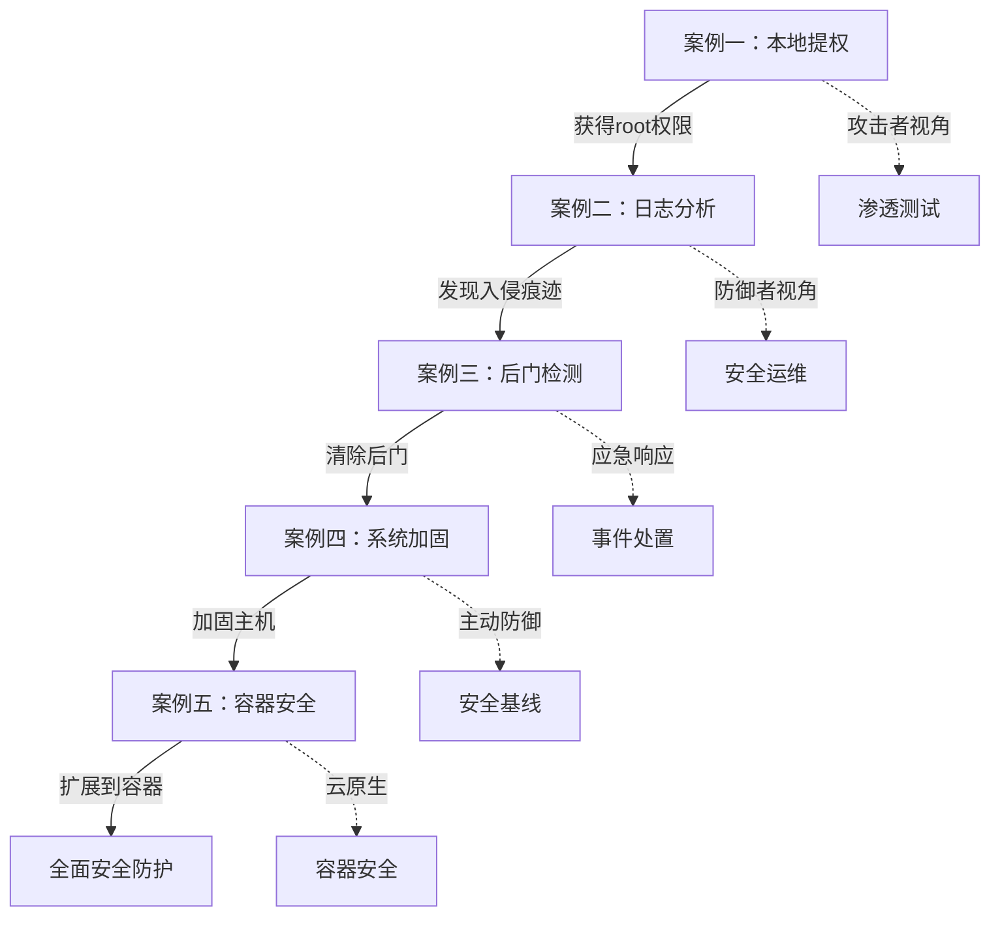
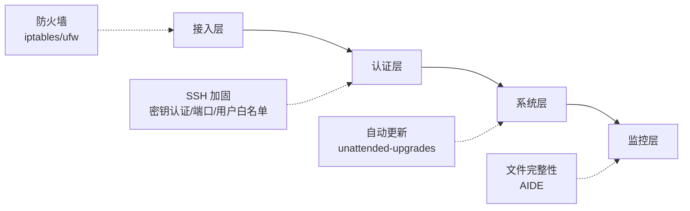
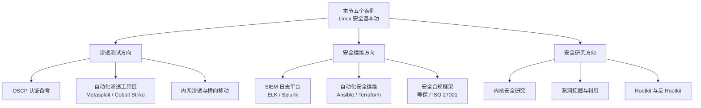

## 本节小结

本节通过五个递进式的实战案例，构建了 Linux 安全运维与渗透测试的完整技能链。从攻击者视角的本地提权，到防御者视角的日志分析、后门清除、系统加固，再到云原生时代的容器安全，五个案例覆盖了 Linux 安全的核心战场。下面从知识框架、技能图谱、关键要点、常见误区和进阶方向五个维度进行总结。

### 6.1 五大案例知识框架

五个案例并非孤立存在，它们构成了一条完整的攻防链路：



从实际安全事件的时间线来看，五个案例对应的正是一个完整事件的各个阶段：

| 阶段 | 对应案例 | 核心动作 | 角色 |
|------|---------|---------|------|
| 突破阶段 | 案例一：本地提权 | 从低权限提升到 root | 攻击者/渗透测试人员 |
| 检测阶段 | 案例二：日志分析 | 从日志中发现异常行为 | 安全运维/蓝队 |
| 处置阶段 | 案例三：后门清除 | 定位并清除所有后门 | 应急响应人员 |
| 加固阶段 | 案例四：系统加固 | 消除弱点，建立防线 | 系统管理员 |
| 扩展阶段 | 案例五：容器安全 | 将安全边界延伸到容器 | 云原生安全工程师 |

### 6.2 核心技能图谱

#### 6.2.1 案例一：本地提权 — 攻击面全景

本地提权的本质是利用系统中的信任边界缺陷，从低权限跨越到高权限。本案例覆盖了六种主流提权路径：

| 提权方法 | 利用的缺陷 | 难度 | 典型场景 |
|---------|-----------|------|---------|
| SUID 程序滥用 | 文件权限配置不当 | ★★☆ | 管理员误设 SUID 位 |
| sudo 配置不当 | 最小权限原则违反 | ★★☆ | 开发环境遗留的宽松 sudo 规则 |
| 内核漏洞利用 | 内核代码缺陷 | ★★★ | 未打补丁的老旧内核 |
| 定时任务劫持 | 可写的 root 脚本 | ★★☆ | 运维脚本权限设置不当 |
| PATH 环境劫持 | 程序未使用绝对路径 | ★☆☆ | 自定义脚本中的路径引用 |
| Docker 组提权 | 容器与宿主机共享内核 | ★★☆ | 开发人员被加入 docker 组 |

**关键工具**：`find / -perm -4000`（SUID 扫描）、`sudo -l`（sudo 枚举）、`searchsploit`（漏洞搜索）、[GTFOBins](https://gtfobins.github.io/)（SUID/sudo 利用速查）。

**关键认知**：提权不是"碰运气"，而是系统化的信息收集→攻击面枚举→逐一验证的过程。`id`、`uname -a`、`sudo -l`、`find / -perm -4000` 是每次提权必做的四步基本功。

#### 6.2.2 案例二：日志分析 — 从噪声中提取信号

日志分析的核心挑战不是"看到日志"，而是"从海量日志中识别出异常"。本案例覆盖了三个层面的日志分析：

**认证层（auth.log）**：
- SSH 暴力破解检测：统计每个 IP 的失败次数，阈值以上的视为攻击源
- 成功登录关联：暴力破解 IP 是否有对应的成功登录（最危险的信号）
- 提权操作追踪：sudo、su、chmod、useradd 等敏感命令的时间线

**应用层（access.log）**：
- SQL 注入特征匹配：`union.*select`、`information_schema`、`load_file`
- XSS 攻击特征：`<script`、`alert(`、`onerror`、`javascript:`
- 目录遍历特征：`../`、`..\` 
- Web Shell 访问：`eval(`、`system(`、`passthru(`

**网络层**：
- 高频访问 IP（扫描或 DDoS）
- 异常 404 请求（目录枚举）

**关键工具**：`grep -iE`（正则匹配）、`awk`（字段提取）、`sort | uniq -c | sort -rn`（频率统计三件套）。

**关键认知**：日志分析的黄金法则是"关联分析"——单独看一条失败登录不构成证据，但"同一 IP 连续失败 1523 次后出现一次成功登录"就是入侵的铁证。

#### 6.2.3 案例三：后门检测 — 攻击者的持久化手段

攻击者获得权限后的第一件事不是"偷数据"，而是"留后门"。本案例系统梳理了五类持久化后门及其检测方法：

| 后门类型 | 隐藏位置 | 检测命令 | 清除方式 |
|---------|---------|---------|---------|
| SSH 密钥后门 | `~/.ssh/authorized_keys` | `find / -name authorized_keys` | 删除未授权的公钥 |
| 定时任务后门 | crontab / cron.d / systemd timer | `crontab -l`、`systemctl list-timers` | 删除恶意定时任务 |
| 启动脚本后门 | rc.local / init.d / systemd service | `systemctl list-unit-files` | 禁用并删除恶意服务 |
| Web Shell | web 目录下的 .php/.asp 文件 | `grep -rn "eval\|system\|exec"` | 删除文件，修复漏洞 |
| Rootkit | 内核模块 / LD_PRELOAD | `rkhunter`、`chkrootkit` | 重装系统（最可靠） |

**关键工具**：`rkhunter`（Rootkit 检测）、`chkrootkit`（Rootkit 检测）、`maldet`（恶意软件检测）、`ClamAV`（病毒扫描）。

**关键认知**：后门检测的核心原则是"对比基线"——如果你不知道系统"正常"是什么样子，就无法判断什么是"异常"。因此，系统上线后第一时间建立基线（文件哈希、进程列表、网络连接、定时任务）至关重要。

#### 6.2.4 案例四：系统加固 — 纵深防御体系

系统加固不是"打补丁"的单一动作，而是一个多层次的防御体系。本案例覆盖了四个加固层面：



**接入层（防火墙）**：默认拒绝一切入站，仅开放必要端口。iptables 规则顺序为：允许回环 → 允许已建立连接 → 允许特定端口 → 记录并丢弃其余。

**认证层（SSH）**：禁用 root 登录、禁用密码认证（仅密钥）、限制认证尝试次数、指定允许登录的用户、使用强加密算法（curve25519 + chacha20-poly1305）。

**系统层（补丁）**：启用自动安全更新（unattended-upgrades），定期检查安全更新。

**监控层（完整性）**：使用 AIDE（Advanced Intrusion Detection Environment）建立文件完整性基线，定期检查文件变化。

**关键认知**：加固的本质是"最小权限 + 纵深防御"。没有单一措施能防住所有攻击，但每一层都能挡住一类攻击，多层叠加后攻击成本呈指数级上升。

#### 6.2.5 案例五：容器安全 — 云原生时代的必修课

容器安全的核心认知是：**容器不是虚拟机**。容器共享宿主机内核，隔离性远弱于虚拟机。本案例覆盖了两个核心主题：

**安全检查**：
- Docker daemon 配置审计
- 容器特权模式检测（`--privileged` 是最大的安全隐患）
- 容器能力（Capabilities）审计
- 容器网络模式检查
- 容器内进程审查

**容器逃逸**：
- Docker Socket 挂载逃逸：容器内挂载了 `/var/run/docker.sock`，等于把宿主机的控制权交给了容器
- 特权容器逃逸：`--privileged` 模式下容器可以直接挂载宿主机磁盘

**关键认知**：Docker Socket 是容器安全的"核按钮"。任何能访问 Docker Socket 的容器都等价于 root 权限访问宿主机。

### 6.3 五个案例的交叉知识点

五个案例之间存在大量交叉引用，理解这些关联能帮助建立更完整的安全认知：

| 交叉点 | 涉及案例 | 关联说明 |
|--------|---------|---------|
| SUID 与提权 | 案例一 + 案例四 | 加固时应审计并移除不必要的 SUID 位 |
| 日志与后门 | 案例二 + 案例三 | 后门植入必然在日志中留下痕迹 |
| 定时任务 | 案例一 + 案例三 | 既是提权手段，也是后门载体 |
| SSH 配置 | 案例一 + 案例四 | 弱 SSH 配置是提权的入口，加固 SSH 是防御的第一步 |
| Docker | 案例一 + 案例五 | docker 组提权与容器逃逸是同一问题的两面 |
| 文件完整性 | 案例三 + 案例四 | AIDE 可以自动检测后门植入导致的文件变化 |
| 自动化脚本 | 案例二 + 案例三 | 日志分析脚本可以自动化后门检测的告警触发 |

### 6.4 常见误区与纠正

在实际应用这些技术时，初学者容易陷入以下误区：

**误区一：提权工具就是安全工具**

很多初学者学会 `find / -perm -4000` 后，认为掌握了"安全工具"。实际上，工具是中性的，关键在于理解背后的权限模型。SUID 的设计初衷是让普通用户临时获得特定程序的权限（如 `passwd` 需要修改 `/etc/shadow`），安全问题出在"不当的 SUID 设置"而非 SUID 机制本身。

**误区二：日志分析就是 grep**

单纯 `grep "Failed password"` 只能告诉你"有失败登录"，但无法回答"这是正常的还是攻击的"。真正的日志分析需要：建立基线（正常时段的失败率）→ 设定阈值 → 关联多源日志 → 构建时间线。阈值判断比关键词匹配重要得多。

**误区三：清除后门 = 删除文件**

删除一个 Web Shell 文件并不能解决问题——攻击者还会通过同一个漏洞再次植入。正确的处置流程是：定位后门 → 分析入侵路径 → 修复根因（漏洞）→ 清除后门 → 验证修复 → 加固防护。跳过"修复根因"这一步，后门会反复出现。

**误区四：加固就是"关掉一切"**

过度加固（如禁用所有 ICMP、关闭所有端口、限制所有用户）会导致系统不可用。安全加固的目标是"在可用性不受明显影响的前提下最大化安全性"。每一条加固措施都应该经过"这条规则保护了什么 → 如果不做会怎样 → 对正常业务的影响"的三步评估。

**误区五：容器天然安全**

"容器比虚拟机轻量"不等于"容器比虚拟机安全"。容器共享宿主机内核，一个内核漏洞就能逃逸所有容器。`--privileged`、Docker Socket 挂载、共享网络命名空间等配置会进一步削弱隔离性。容器安全需要额外的加固措施（seccomp、AppArmor、只读文件系统、非 root 运行等）。

### 6.5 技能自检清单

完成本节学习后，可以通过以下清单检验自己的掌握程度：

**本地提权（案例一）**：
- [ ] 能在 5 分钟内完成基本的信息收集（id、uname、sudo -l、SUID 扫描）
- [ ] 熟悉至少 3 种提权方法的原理和利用步骤
- [ ] 能查阅 GTFOBins 快速判断 SUID/sudo 程序是否可利用
- [ ] 理解内核提权漏洞的基本原理（DirtyCow、DirtyPipe、PwnKit）

**日志分析（案例二）**：
- [ ] 能编写自动化脚本检测 SSH 暴力破解
- [ ] 能从 access.log 中识别 SQL 注入、XSS、目录遍历攻击
- [ ] 理解"关联分析"的含义——暴力破解 + 成功登录 = 入侵铁证
- [ ] 熟练使用 `grep -iE` + `awk` + `sort | uniq -c` 的组合技

**后门检测（案例三）**：
- [ ] 能系统检查 SSH 密钥、定时任务、启动脚本、Web Shell 五类后门
- [ ] 能使用 rkhunter/chkrootkit 进行 Rootkit 扫描
- [ ] 理解 LD_PRELOAD 后门的原理和检测方法
- [ ] 知道"清除后门必须同时修复根因"

**系统加固（案例四）**：
- [ ] 能独立完成 SSH 加固配置（禁 root、仅密钥、强算法）
- [ ] 能编写 iptables/ufw 防火墙规则（默认拒绝 + 白名单）
- [ ] 了解 AIDE 文件完整性监控的初始化和使用流程
- [ ] 理解"纵深防御"的含义——不依赖单一措施

**容器安全（案例五）**：
- [ ] 能检查容器的特权模式、Capabilities、网络模式
- [ ] 理解 Docker Socket 挂载的安全风险
- [ ] 理解特权容器逃逸的原理
- [ ] 知道"容器不是虚拟机"的深层含义

### 6.6 实践环境搭建建议

理论学习必须配合动手实践。以下是安全合规的实践环境搭建建议：

**本地虚拟机环境**（推荐入门）：

```bash
# 使用 Vagrant 快速搭建靶机环境
vagrant init ubuntu/focal64
vagrant up
vagrant ssh

# 推荐靶机镜像
# - Metasploitable2/3：预装大量漏洞的靶机
# - VulnHub：各种难度的渗透测试靶机
# - DVWA：Web 应用漏洞靶机
```

**Docker 靶场**（推荐进阶）：

```bash
# 使用 Vulhub 搭建漏洞靶场
git clone https://github.com/vulhub/vulhub.git
cd vulhub/samba/CVE-2017-7494
docker-compose up -d

# 使用 HackMyVm / TryHackMe 在线靶场
# 提供真实的渗透测试场景，配合 Writeup 学习
```

**安全加固练习**：

```bash
# 在虚拟机中练习加固流程
# 1. 先记录加固前的基线状态
sudo aideinit
sudo iptables -L -n > /tmp/before_firewall.txt

# 2. 执行加固步骤（SSH、防火墙、AIDE等）

# 3. 验证加固效果
sudo aide --check
nmap -sV localhost  # 从外部扫描验证端口收敛
```

### 6.7 从实战到体系：进阶学习路径

完成本节的五个案例后，你已经具备了 Linux 安全的基本功。下一步的学习方向取决于你的职业路径：



**渗透测试方向**：深入学习 Metasploit 框架、内网渗透（Pass-the-Hash、Kerberos 攻击）、Web 应用安全（OWASP Top 10），备考 OSCP 认证。

**安全运维方向**：学习 ELK/Splunk 日志平台实现大规模日志分析，使用 Ansible/Terraform 实现安全加固自动化，了解等保合规框架。

**安全研究方向**：深入内核安全（内核模块、eBPF）、学习漏洞挖掘（模糊测试、符号执行）、研究 Rootkit 技术与检测。

### 6.8 本节核心要点回顾

最后，用五句话概括五个案例的核心教训：

1. **本地提权**：提权的本质是信息收集，`id` + `uname` + `sudo -l` + SUID 扫描是永远的第一步。
2. **日志分析**：单条日志没有意义，关联分析和阈值判断才是发现入侵的关键。
3. **后门检测**：清除后门必须同时修复根因，否则后门会反复出现。
4. **系统加固**：纵深防御优于单一措施，每条加固规则都要评估对业务的影响。
5. **容器安全**：容器不是虚拟机，`--privileged` 和 Docker Socket 挂载是两个最大的安全隐患。

> **法律声明**：本节所有技术内容仅用于授权环境下的安全测试和防御学习。未经授权对他人系统进行渗透测试是违法行为。在实际操作中，请始终遵守当地法律法规和职业道德规范。
