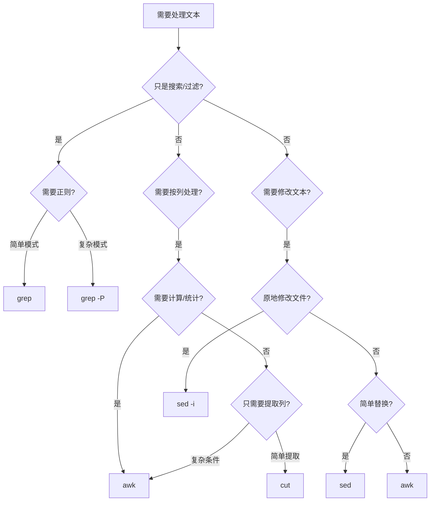

## 一、文本处理三剑客

在Linux安全运维和渗透测试中，**文本处理能力直接决定工作效率**。日志分析、配置审计、漏洞扫描结果解析、流量数据清洗——这些高频操作的核心都是对文本流的模式匹配与结构化提取。grep、sed、awk被称为"文本处理三剑客"，它们各司其职又可以管道组合，构成了Linux文本处理的完整工具链。

### 1.1 为什么安全工程师必须精通文本处理

安全工作的本质是**从海量数据中发现异常**。一次典型的应急响应流程中，工程师需要处理的数据源包括：

| 数据源 | 典型大小 | 需要提取的信息 |
|--------|----------|----------------|
| `/var/log/auth.log` | 数十MB~数GB | 暴力破解IP、异常登录时间、提权行为 |
| `/var/log/apache2/access.log` | 数百MB~数十GB | 扫描器特征、SQL注入payload、异常请求频率 |
| `/var/log/syslog` | 数十MB~数GB | 内核异常、服务崩溃、硬件故障 |
| Nmap扫描结果 | 数MB~数十MB | 开放端口、服务版本、操作系统指纹 |
| Web应用源代码 | 数千~数万文件 | 硬编码密钥、SQL拼接、不安全函数调用 |

如果只会用`cat`配合肉眼逐行查看，一个中等规模的日志分析就需要数小时。而精通三剑客，同样的工作可以在**几秒到几分钟内完成**。

### 1.2 正则表达式：三剑客的共同语言

在深入学习三剑客之前，必须先掌握正则表达式（Regular Expression）。它是grep、sed、awk进行模式匹配的基础语法。正则表达式不是某个工具特有的功能，而是一套独立的模式描述语言。

#### 1.2.1 基础元字符

| 元字符 | 含义 | 示例 | 匹配结果 |
|--------|------|------|----------|
| `.` | 匹配任意单个字符 | `a.c` | "abc"、"a1c"、"a c" |
| `*` | 前一个字符出现0次或多次 | `ab*c` | "ac"、"abc"、"abbc" |
| `+` | 前一个字符出现1次或多次 | `ab+c` | "abc"、"abbc"（不匹配"ac"） |
| `?` | 前一个字符出现0次或1次 | `ab?c` | "ac"、"abc" |
| `^` | 行首锚定 | `^root` | 以"root"开头的行 |
| `$` | 行尾锚定 | `nologin$` | 以"nologin"结尾的行 |
| `[]` | 字符类 | `[0-9]` | 任意数字 |
| `[^]` | 否定字符类 | `[^0-9]` | 任意非数字字符 |
| `\b` | 单词边界 | `\broot\b` | 独立的"root"单词 |

#### 1.2.2 量词与贪婪匹配

正则表达式默认采用**贪婪匹配**（Greedy Matching）——尽可能多地匹配字符。理解这一点对日志解析至关重要：

```bash
# 贪婪匹配：.* 会匹配到行尾最后一个引号
echo 'name="Alice" age="30"' | grep -oP '".*"'
# 输出: "Alice" age="30"   ← 错误！匹配了整个引号区间

# 非贪婪匹配：.*? 只匹配到最近的引号
echo 'name="Alice" age="30"' | grep -oP '".*?"'
# 输出: "Alice"            ← 正确！
```

#### 1.2.3 分组与反向引用

分组用`()`包围，反向引用用`\1`、`\2`等引用捕获的内容。这在sed的替换操作中极为常用：

```bash
# 交换IP地址的前两段
echo "192.168.1.100" | sed -E 's/([0-9]+)\.([0-9]+)\./\2.\1./'
# 输出: 168.192.1.100

# 给日志时间戳加上方括号
echo "2026-06-25 14:30:00 GET /index.html 200" | \
  sed -E 's/^([0-9-]+ [0-9:]+)/[\1]/'
# 输出: [2026-06-25 14:30:00] GET /index.html 200
```

#### 1.2.4 BRE vs ERE vs PCRE：三种正则方言

不同工具支持不同版本的正则表达式，这是初学者最容易踩的坑：

| 特性 | BRE (基础) | ERE (扩展) | PCRE (Perl) |
|------|-----------|-----------|-------------|
| 使用工具 | `grep` (默认) | `grep -E` / `egrep` | `grep -P` |
| `+` `?` `{}` | 需要转义 `\+` `\?` `\{` | 直接使用 | 直接使用 |
| `()` 分组 | 需要转义 `\(` `\)` | 直接使用 | 直接使用 |
| `\d` `\w` `\s` | 不支持 | 不支持 | 支持 |
| 非贪婪 `*?` `+?` | 不支持 | 不支持 | 支持 |
| 前瞻/后顾 | 不支持 | 不支持 | 支持 |

**实战建议**：日常使用`grep -E`（ERE），需要复杂模式匹配时用`grep -P`（PCRE）。BRE模式下忘记转义元字符是最常见的错误来源。

### 1.3 grep — 文本搜索利器

grep（Global Regular Expression Print）是使用频率最高的文本搜索工具。它的核心功能是**从输入中筛选出匹配指定模式的行**。

#### 1.3.1 核心参数速查

| 参数 | 作用 | 使用频率 |
|------|------|----------|
| `-i` | 忽略大小写 | ★★★★★ |
| `-n` | 显示行号 | ★★★★★ |
| `-r` / `-R` | 递归搜索目录 | ★★★★★ |
| `-v` | 反向匹配（排除） | ★★★★★ |
| `-c` | 只输出匹配行数 | ★★★★ |
| `-l` | 只输出匹配文件名 | ★★★★ |
| `-o` | 只输出匹配部分 | ★★★★ |
| `-w` | 全词匹配 | ★★★ |
| `-A N` | 显示匹配行后N行 | ★★★★ |
| `-B N` | 显示匹配行前N行 | ★★★★ |
| `-C N` | 显示匹配行前后各N行 | ★★★★ |
| `-E` | 使用ERE正则 | ★★★★★ |
| `-P` | 使用PCRE正则 | ★★★ |
| `-H` | 显示文件名（多文件时默认开启） | ★★★ |
| `--include` | 只搜索指定类型的文件 | ★★★★ |
| `--exclude` | 排除指定类型的文件 | ★★★★ |
| `--exclude-dir` | 排除指定目录 | ★★★★ |

#### 1.3.2 安全场景实战

**场景一：暴力破解检测**

从认证日志中快速定位暴力破解攻击：

```bash
# 统计失败登录的来源IP（Top 20）
grep "Failed password" /var/log/auth.log | \
  grep -oP 'from \K[0-9.]+' | \
  sort | uniq -c | sort -rn | head -20

# 查找短时间内大量失败的IP（结合时间窗口）
grep "Failed password" /var/log/auth.log | \
  grep "Jun 25 14:" | \
  grep -oP 'from \K[0-9.]+' | \
  sort | uniq -c | sort -rn | head -10

# 检测SSH扫描（尝试不存在的用户名）
grep "Invalid user" /var/log/auth.log | \
  grep -oP 'user \K\S+' | \
  sort | uniq -c | sort -rn | head -20
```

**场景二：Web日志攻击特征提取**

```bash
# 检测SQL注入尝试
grep -iE "union.*select|'|--|;.*drop|or\s+1\s*=\s*1" /var/log/apache2/access.log

# 检测路径遍历
grep -E '\.\./|\.\.\\\\|%2e%2e' /var/log/apache2/access.log

# 提取所有404请求的URL（可能的扫描探测）
grep ' 404 ' /var/log/apache2/access.log | \
  awk '{print $7}' | sort | uniq -c | sort -rn | head -20

# 检测User-Agent异常（扫描器、爬虫）
grep -iE 'sqlmap|nikto|nmap|masscan|dirbuster|gobuster|wfuzz' \
  /var/log/apache2/access.log
```

**场景三：代码审计中的敏感信息搜索**

```bash
# 在项目中搜索硬编码的密钥和密码
grep -rnE '(password|passwd|secret|api_key|token|private_key)\s*=' \
  --include='*.py' --include='*.js' --include='*.java' /var/www/

# 搜索可能的SQL注入点（字符串拼接SQL）
grep -rnE 'execute\s*\(\s*["\x27].*\+|f".*SELECT|f".*INSERT|f".*UPDATE' \
  --include='*.py' /var/www/

# 搜索不安全的函数调用
grep -rnE 'eval\s*\(|exec\s*\(|os\.system\s*\(|subprocess\.call\s*\(.*shell\s*=\s*True' \
  --include='*.py' /var/www/
```

#### 1.3.3 高级技巧

**排除目录和文件类型**：在大型代码库中搜索时，排除无关目录可以大幅提速：

```bash
# 排除 .git 和 node_modules 目录，只搜索 Python 文件
grep -rn --include='*.py' --exclude-dir='.git' --exclude-dir='node_modules' \
  'TODO\|FIXME\|HACK' /opt/project/

# 使用 ripgrep（rg）替代 grep，速度提升10-100倍
rg -n 'password' --type py /opt/project/
```

**多模式匹配**：

```bash
# 方式一：使用 -E（ERE）的 | 运算符
grep -E 'error|warning|critical' /var/log/syslog

# 方式二：使用 -f 从文件读取模式列表
cat > patterns.txt << 'EOF'
error
warning
critical
EOF
grep -f patterns.txt /var/log/syslog

# 方式三：使用 PCRE 的零宽断言
grep -P '(?<=src=)[0-9.]+' /var/log/apache2/access.log
```

**二进制文件处理**：

```bash
# 强制将二进制文件当文本处理
grep -a "password" database.db

# 在内存转储中搜索字符串
strings core_dump | grep -E 'password|secret|key'
```

### 1.4 sed — 流编辑器

sed（Stream Editor）是一个非交互式文本编辑器，它逐行读取输入，对匹配的行执行指定操作，然后输出结果。sed的核心优势在于**原地编辑文件**和**批量文本转换**。

#### 1.4.1 工作原理

sed的工作流程可以概括为：**读取 → 执行命令 → 输出**。


理解sed的关键概念：
- **模式空间（Pattern Space）**：当前正在处理的行的缓冲区
- **保持空间（Hold Space）**：一个额外的缓冲区，用于跨行操作
- **地址（Address）**：决定哪些行会被命令处理的条件

#### 1.4.2 核心命令速查

| 命令 | 作用 | 示例 |
|------|------|------|
| `s/old/new/` | 替换 | `sed 's/error/ERROR/' file` |
| `d` | 删除 | `sed '/^#/d' file` |
| `p` | 打印 | `sed -n '/error/p' file` |
| `i\text` | 行前插入 | `sed '1i\header line' file` |
| `a\text` | 行后追加 | `sed '$a\footer line' file` |
| `c\text` | 替换整行 | `sed '/old_line/c\new_line' file` |
| `y/abc/xyz/` | 逐字符替换 | `sed 'y/ABC/abc/' file` |
| `q` | 退出 | `sed '10q' file`（只处理前10行） |
| `w file` | 写入文件 | `sed -n '/error/w errors.txt' file` |
| `r file` | 读入文件 | `sed '/marker/r insert.txt' file` |

#### 1.4.3 地址与范围

sed的地址决定了命令作用于哪些行：

```bash
# 单行地址
sed '5d' file                    # 删除第5行
sed '$d' file                    # 删除最后一行

# 范围地址
sed '3,7d' file                  # 删除第3-7行
sed '/start/,/end/d' file        # 删除从start匹配到end匹配之间的所有行

# 步进地址
sed '1~2d' file                  # 删除奇数行（从第1行开始，每隔2行）
sed '0~2d' file                  # 删除偶数行

# 取反
sed '/keep/!d' file              # 只保留匹配keep的行（删除不匹配的行）
```

#### 1.4.4 安全场景实战

**场景一：批量修改配置文件**

```bash
# 禁用SSH root登录
sed -i 's/^#\?PermitRootLogin.*/PermitRootLogin no/' /etc/ssh/sshd_config

# 修改SSH端口
sed -i 's/^#\?Port .*/Port 2222/' /etc/ssh/sshd_config

# 禁用密码登录（仅允许密钥）
sed -i 's/^#\?PasswordAuthentication.*/PasswordAuthentication no/' \
  /etc/ssh/sshd_config

# 批量注释配置项
sed -i 's/^enabled\s*=\s*true/# &/' /etc/some_service/config.ini

# 删除配置文件中的空行和注释行（快速查看有效配置）
sed '/^#/d; /^$/d; /^\s*$/d' /etc/nginx/nginx.conf
```

**场景二：日志清洗与格式化**

```bash
# 提取特定时间段的日志
sed -n '/2026-06-25 14:00/,/2026-06-25 15:00/p' /var/log/app.log

# 删除ANSI颜色代码（处理彩色日志输出）
sed 's/\x1b\[[0-9;]*m//g' colored_output.log

# 将多行错误堆栈合并为单行（方便grep处理）
sed ':a; N; $!ba; s/\n\t/ | /g' /var/log/app.log

# 从日志中移除敏感信息（脱敏处理）
sed -E 's/password=[^ &]+/password=***REDACTED***/g' app.log
sed -E 's/[0-9]{4}-[0-9]{4}-[0-9]{4}-[0-9]{4}/XXXX-XXXX-XXXX-XXXX/g' payment.log
```

**场景三：批量文件处理**

```bash
# 查找并替换所有PHP文件中的危险函数
find /var/www -name '*.php' -exec \
  sed -i 's/eval(\$_POST/\/\/ DISABLED: eval(\$_POST/g' {} +

# 批量修改文件权限配置
find /etc -name '*.conf' -exec \
  sed -i 's/0777/0750/g' {} +

# 给所有Python文件添加安全编码声明
find /opt/app -name '*.py' -exec \
  sed -i '1i\# -*- coding: utf-8 -*-' {} +
```

#### 1.4.5 高级技巧：保持空间操作

保持空间（Hold Space）是sed最强大的特性之一，它允许跨行操作：

```bash
# 反转文件行序（类似 tac 命令）
sed -n '1!G; h; $p' file

# 在匹配行的下一行追加内容
sed '/\[section\]/a\new_item = value' config.ini

# 合并相邻的两行
sed 'N; s/\n/ /' file

# 提取两个标记之间的内容（不含标记行本身）
sed -n '/START/,/END/{ /START/!{ /END/!p } }' file
```

### 1.5 awk — 文本处理编程语言

awk不是简单的文本工具，而是一门**完整的文本处理编程语言**。它天然支持字段分割、条件判断、循环、数组、内置函数，非常适合处理结构化数据（如日志、CSV、配置文件）。

#### 1.5.1 程序结构

awk程序由三部分组成，每一部分都是可选的：

```bash
awk 'BEGIN { 初始化 } pattern { 处理逻辑 } END { 收尾输出 }' file
```

- **BEGIN块**：在处理任何输入之前执行一次，通常用于初始化变量、打印表头
- **主处理块**：对每一行输入执行，可以有多个pattern-action对
- **END块**：在所有输入处理完毕后执行一次，通常用于输出汇总统计

#### 1.5.2 内置变量

| 变量 | 含义 | 常见用途 |
|------|------|----------|
| `NR` | 当前行号（全局） | 编号、范围筛选 |
| `NF` | 当前行的字段数 | 提取最后一个字段 `$NF` |
| `$0` | 当前整行内容 | 打印、匹配 |
| `$1`~`$N` | 第1到第N个字段 | 列提取 |
| `FS` | 输入字段分隔符 | 等价于 `-F` |
| `OFS` | 输出字段分隔符 | 格式化输出 |
| `RS` | 输入记录分隔符（默认换行） | 多行记录处理 |
| `ORS` | 输出记录分隔符 | 自定义输出格式 |
| `FILENAME` | 当前处理的文件名 | 多文件处理时标识来源 |
| `FNR` | 当前文件内的行号 | 多文件处理时独立计数 |

#### 1.5.3 模式匹配

awk的模式远不止简单的字符串匹配：

```bash
# 正则匹配
awk '/error/' file                       # 包含error的行
awk '!/^#/' file                         # 不以#开头的行（非注释）

# 关系表达式
awk '$3 > 1000' file                     # 第3字段大于1000
awk '$1 == "root"' file                  # 第1字段等于root
awk 'NF > 10' file                       # 字段数超过10的行

# 范围模式
awk '/start/,/end/' file                 # 从start匹配到end

# 组合条件
awk '/error/ && $3 > 100' file           # AND
awk '/error/ || /warning/' file          # OR
```

#### 1.5.4 数组与关联数组

awk的数组是**关联数组**（类似字典/哈希表），key可以是任意字符串：

```bash
# 统计每个IP的出现次数
awk '{count[$1]++} END {for(ip in count) print count[ip], ip}' access.log | \
  sort -rn | head -20

# 统计HTTP状态码分布
awk '{count[$9]++} END {for(code in count) print count[code], code}' access.log | \
  sort -rn

# 统计每小时的请求量
awk -F'[:/ ]' '{hour=$6; count[hour]++} END {for(h in count) print h, count[h]}' \
  access.log | sort

# 去重（保留首次出现的行）
awk '!seen[$0]++' file
```

#### 1.5.5 内置函数

```bash
# 字符串函数
awk '{print length($0)}' file            # 行长度
awk '{print toupper($1)}' file           # 转大写
awk '{print tolower($1)}' file           # 转小写
awk '{print substr($0, 1, 20)}' file     # 子串（前20字符）
awk '{gsub(/old/, "new"); print}' file   # 全局替换

# 数学函数
awk '{print int($1)}' file               # 取整
awk '{print sqrt($1)}' file              # 平方根

# 时间函数（GNU awk）
awk 'BEGIN {print systime()}'            # 当前Unix时间戳
```

#### 1.5.6 安全场景实战

**场景一：Web访问日志深度分析**

```bash
# 统计每个IP的请求总量、总流量、平均响应大小
awk '{
  count[$1]++
  bytes[$1] += $10
} END {
  for(ip in count)
    printf "%-16s requests: %6d  total_bytes: %10d  avg: %d\n",
      ip, count[ip], bytes[ip], bytes[ip]/count[ip]
}' access.log | sort -t: -k2 -rn | head -20

# 检测慢请求（假设最后一个字段是响应时间）
awk '$NF > 5.0 {print $4, $7, $NF"s"}' access.log

# 按小时统计请求量并生成简易报表
awk '{
  split($4, t, ":")
  hour = t[2]
  count[hour]++
  total++
} END {
  for(h in count)
    printf "%s:00  %6d requests (%5.1f%%)\n", h, count[h], count[h]/total*100
}' access.log | sort
```

**场景二：系统安全审计**

```bash
# 查找所有UID为0的用户（潜在的后门账户）
awk -F: '$3 == 0 {print "UID=0:", $1}' /etc/passwd

# 查找可登录的非系统用户
awk -F: '$3 >= 1000 && $7 !~ /nologin/ {printf "%-20s UID:%-6s Shell:%s\n", $1, $3, $7}' /etc/passwd

# 查找无密码或密码锁定状态的用户
awk -F: '($2 == "" || $2 == "!") {print "WARNING:", $1, "has no password or is locked"}' /etc/shadow 2>/dev/null

# 分析crontab中的可疑任务
awk '!/^#/ && !/^$/ {print FILENAME":", $0}' /etc/cron.d/* /var/spool/cron/* 2>/dev/null

# 查找SUID/SGID文件（结合find）
find / -perm -4000 -type f 2>/dev/null | awk -F/ '{
  print $NF, "->", $0
}'
```

**场景三：网络流量分析**

```bash
# 从netstat/ss输出中统计连接状态
ss -tan | awk 'NR>1 {count[$1]++} END {for(s in count) print s, count[s]}' | sort -k2 -rn

# 统计每个目标端口的连接数（检测端口扫描）
ss -tan | awk 'NR>1 {
  split($5, a, ":")
  port = a[length(a)]
  count[port]++
} END {
  for(p in count) print count[p], p
}' | sort -rn | head -20

# 从tcpdump输出中提取通信对
tcpdump -nn -r capture.pcap 2>/dev/null | awk '{
  if($3 ~ /[0-9]+\.[0-9]+\.[0-9]+\.[0-9]+/) {
    gsub(/\.[0-9]+:/, " ", $3)
    gsub(/\.[0-9]+:/, " ", $5)
    pair = $3 " <-> " $5
    count[pair]++
  }
} END {
  for(p in count) print count[p], p
}' | sort -rn | head -20
```

### 1.6 三剑客协作：管道组合模式

三剑客的真正威力在于**管道组合**。每个工具做自己最擅长的事，通过管道`|`串联起来形成完整的处理流水线。

#### 1.6.1 经典组合模式

```bash
# 模式一：grep粗筛 + awk精处理
# 先用grep快速定位相关行，再用awk提取和格式化
grep "Failed password" /var/log/auth.log | \
  awk '{for(i=1;i<=NF;i++) if($i=="from") print $(i+1)}' | \
  sort | uniq -c | sort -rn | head -10

# 模式二：awk提取 + sort排序 + uniq统计
# 这是最常见的"计数统计"模式
awk '{print $1}' access.log | sort | uniq -c | sort -rn | head -20

# 模式三：find定位 + xargs + sed批量修改
find /var/www -name '*.php' -type f | \
  xargs grep -l 'eval(' | \
  xargs sed -i 's/eval(\$_POST/\/\/ DISABLED: eval(\$_POST/g'

# 模式四：多级过滤
cat /var/log/auth.log | \
  grep "Failed password" | \
  grep -v "192.168.1." | \          # 排除内网IP
  awk '{print $11}' | \
  sort | uniq -c | sort -rn | \
  awk '$1 > 10 {print $2, "尝试了"$1"次"}'
```

#### 1.6.2 实战案例：一次完整的应急响应日志分析

假设你收到了服务器被入侵的警报，需要快速分析日志：

```bash
#!/bin/bash
# incident_analysis.sh - 应急响应日志快速分析脚本

LOG="/var/log/auth.log"
ACCESS="/var/log/apache2/access.log"
REPORT="/tmp/incident_report.txt"

{
echo "=== 应急响应日志分析报告 ==="
echo "生成时间: $(date)"
echo ""

echo "--- 1. 暴力破解检测 ---"
echo "[*] 失败登录Top 10 IP:"
grep "Failed password" "$LOG" | \
  grep -oP 'from \K[0-9.]+' | \
  sort | uniq -c | sort -rn | head -10

echo ""
echo "[*] 尝试的用户名Top 10:"
grep "Failed password" "$LOG" | \
  grep -oP 'for (invalid user )?\K\S+' | \
  sort | uniq -c | sort -rn | head -10

echo ""
echo "--- 2. 成功登录记录 ---"
grep "Accepted" "$LOG" | \
  awk '{printf "%s %s from %s via %s\n", $1, $2, $11, $7}'

echo ""
echo "--- 3. Web攻击特征 ---"
echo "[*] SQL注入尝试:"
grep -ciE "union.*select|'|--|or\s+1\s*=\s*1" "$ACCESS"
echo "[*] 路径遍历尝试:"
grep -ciE "\.\./|%2e%2e" "$ACCESS"
echo "[*] 扫描器User-Agent:"
grep -ciE 'sqlmap|nikto|nmap|masscan' "$ACCESS"

echo ""
echo "--- 4. 异常时间段访问 ---"
echo "[*] 凌晨0-5点的请求:"
awk -F'[:/ ]' '$6 >= 0 && $6 <= 5 {count[$6]++} END {for(h in count) print h":00 - "h":59:", count[h], "requests"}' "$ACCESS" | sort

} > "$REPORT"

echo "报告已保存到: $REPORT"
```

### 1.7 辅助工具：三剑客的左膀右臂

三剑客很少单独使用，以下工具是它们的常见搭档：

#### 1.7.1 sort — 排序

```bash
sort file                    # 字典序排序
sort -n file                 # 数值排序
sort -rn file                # 数值逆序（最常用）
sort -k2,2n file             # 按第2列数值排序
sort -t: -k3,3n /etc/passwd  # 按:分隔的第3列排序（UID）
sort -u file                 # 排序并去重
sort -h file                 # 人类可读大小排序（10K, 1M, 2G）
```

#### 1.7.2 uniq — 去重统计

```bash
# uniq只能去除相邻的重复行，所以通常需要先sort
sort file | uniq             # 去重
sort file | uniq -c          # 去重并计数
sort file | uniq -d          # 只输出重复的行
sort file | uniq -u          # 只输出唯一的行
sort file | uniq -c | sort -rn  # 经典的"频率统计"模式
```

#### 1.7.3 cut — 按列提取

```bash
cut -d: -f1,3 /etc/passwd    # 按:分割，提取第1和第3列
cut -c1-20 file              # 提取每行前20个字符
cut -d' ' -f5- file          # 从第5列到最后
```

#### 1.7.4 tr — 字符转换

```bash
tr 'a-z' 'A-Z' < file       # 小写转大写
tr -d '\r' < file            # 删除回车符（Windows换行转换）
tr -s ' ' < file             # 压缩连续空格为单个
tr ':' '\n' <<< "$PATH"      # 将PATH变量按行显示
echo "password123" | tr -c '\n' '*'  # 将所有字符替换为*
```

#### 1.7.5 xargs — 参数构造

```bash
# 将输入转换为命令参数
find /tmp -name '*.log' | xargs grep "error"

# -I{} 指定占位符
find /tmp -name '*.bak' | xargs -I{} mv {} /backup/

# -P 并行执行（加速批量操作）
find /var/www -name '*.php' | xargs -P4 grep -l 'eval('

# 处理含空格的文件名
find /tmp -name '*.log' -print0 | xargs -0 grep "error"
```

#### 1.7.6 wc — 统计

```bash
wc -l file                   # 行数
wc -w file                   # 单词数
wc -c file                   # 字节数
grep -c "error" file         # 等价于 grep "error" file | wc -l
```

### 1.8 常见误区与避坑指南

#### 误区一：grep默认使用BRE，忘记转义元字符

```bash
# 错误：+ 在BRE中是字面量，不是量词
grep "error+" file           # 匹配 "error+" 字面量

# 正确：使用 -E 启用ERE，或转义 +
grep -E "error+" file        # 匹配 "error"、"errorr"、"errorrr"...
grep "error\+" file          # 同上（BRE模式）
```

#### 误区二：sed -i 在macOS上行为不同

```bash
# Linux GNU sed：直接 -i 即可
sed -i 's/old/new/g' file

# macOS BSD sed：-i 后必须跟备份后缀（可以为空串）
sed -i '' 's/old/new/g' file

# 跨平台兼容写法
sed -i.bak 's/old/new/g' file && rm file.bak
```

#### 误区三：awk中$0被修改后影响输出

```bash
# 注意：gsub修改了$0，输出时$0已经是修改后的版本
awk '{gsub(/old/, "new"); print}' file    # 输出修改后的内容

# 如果要同时输出原始行和修改后的内容
awk '{original=$0; gsub(/old/, "new"); print original " -> " $0}' file
```

#### 误区四：管道中使用变量作用域问题

```bash
# 管道中的每个命令在子shell中运行，变量修改不会传递到父shell
count=0
cat file | grep "error" | while read line; do
  count=$((count + 1))      # 这里的count在子shell中
done
echo $count                  # 输出 0，不是期望的值

# 解决方案一：使用进程替换
while read line; do
  count=$((count + 1))
done < <(grep "error" file)
echo $count

# 解决方案二：使用awk直接完成
awk '/error/ {count++} END {print count}' file
```

#### 误区五：sort默认按字典序而非数值序

```bash
# 字典序：1, 10, 100, 2, 20, 3（错误的数值排序）
echo -e "1\n10\n100\n2\n20\n3" | sort

# 数值序：1, 2, 3, 10, 20, 100（正确的数值排序）
echo -e "1\n10\n100\n2\n20\n3" | sort -n
```

#### 误区六：grep -r 跟符号链接导致无限递归

```bash
# 如果目录中存在指向父目录的符号链接，grep -r 可能陷入无限循环
# 解决方案：使用 -r 时加上 --exclude-dir 或使用 find + xargs
grep -r --exclude-dir='.git' "pattern" /path/

# 或者使用 ripgrep，它默认忽略 .git 和符号链接
rg "pattern" /path/
```

### 1.9 性能优化与工具选择

#### 1.9.1 性能对比

当处理大型日志文件（数GB）时，工具选择和写法会显著影响速度：

| 操作 | 慢写法 | 快写法 | 速度提升 |
|------|--------|--------|----------|
| 搜索 | `grep pattern file` | `rg pattern file` | 5-50x |
| 去重 | `sort file \| uniq` | `awk '!seen[$0]++' file` | 2-10x |
| 列提取 | `awk '{print $1}' file` | `cut -d' ' -f1 file` | 1.5-3x |
| 多模式 | `grep -E 'a\|b\|c' file` | `grep -F -f patterns file` | 2-5x |

#### 1.9.2 何时用哪个工具



**快速决策规则**：
- **只搜索不修改** → grep
- **简单按列提取** → cut（性能更好）
- **替换/删除/插入** → sed
- **按列计算/统计/条件处理** → awk
- **需要编程逻辑（循环、数组、条件）** → awk
- **需要极速搜索大文件** → ripgrep (rg)

### 1.10 练习与进阶

#### 1.10.1 基础练习

1. 从 `/etc/passwd` 中提取所有可登录用户的用户名和shell
2. 统计 `/var/log/auth.log` 中每小时的登录失败次数
3. 从Apache访问日志中找出访问量最大的前10个URL
4. 将一个配置文件中所有被注释的配置项取消注释
5. 从一个CSV文件中提取第2列和第5列，按第2列排序

#### 1.10.2 进阶挑战

1. 编写一个awk脚本，解析Apache Combined Log Format，输出每个IP的请求方法分布（GET/POST/PUT/DELETE各多少次）
2. 用sed实现一个简单的模板引擎：将文件中的`{{变量名}}`替换为对应的环境变量值
3. 编写一个grep+awk+sed组合的脚本，从Nmap的XML输出中提取所有开放端口和服务版本
4. 用awk实现一个简单的Web日志异常检测器：找出响应时间超过平均值3倍的请求
5. 编写一个完整的日志分析管道，自动检测并报告暴力破解、目录扫描、SQL注入三类攻击

#### 1.10.3 推荐学习路径


**替代工具推荐**（当三剑客不够用时）：
- **ripgrep (rg)**：比grep快10-100倍，自动忽略.git，支持PCRE2
- **fd**：比find更友好的文件查找工具
- **miller (mlr)**：专门处理CSV/JSON/TSV的瑞士军刀
- **jq**：JSON数据的专用处理工具
- **datamash**：命令行数据统计工具（分组、透视表、统计量）
