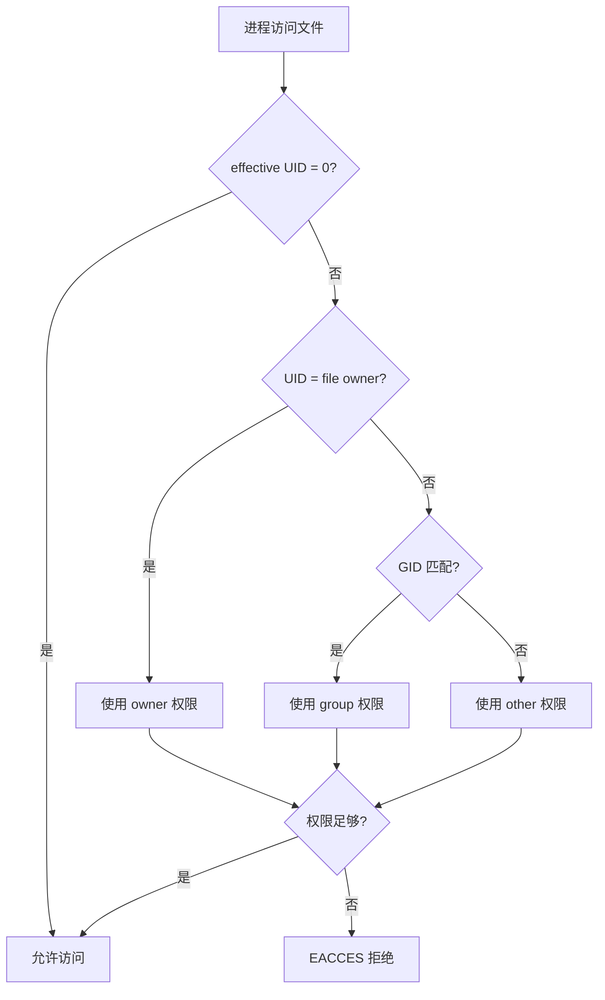

## 三、文件权限管理技巧

文件权限是 Linux 安全模型的基石。理解权限不仅仅是知道 `chmod 755` 的含义——它涉及内核如何在每次 `open()`、`exec()`、`stat()` 系统调用中做访问控制决策，涉及 SUID/SGID 程序如何改变执行身份，涉及 ACL 如何突破传统三组权限的限制。对于安全从业者而言，权限管理有攻防两面：攻击者寻找权限配置缺陷以提权或窃取数据，防御者通过最小权限原则收紧暴露面。本节从实战角度系统讲解权限查看、分析、修改和审计的全套技巧。

### 3.1 权限的内核视角

#### 3.1.1 访问检查的执行顺序

当用户尝试访问一个文件时，内核按以下顺序检查：

1. 进程的 effective UID 为 0（root）→ 直接放行（除非文件在具有 `nosuid` 属性的文件系统上且操作需要能力检查）
2. 进程的 effective UID 与文件的 owner UID 匹配 → 使用 owner 权限位
3. 进程的 effective GID 或 supplementary GIDs 与文件的 group GID 匹配 → 使用 group 权限位
4. 以上都不匹配 → 使用 other 权限位

关键细节：内核只使用**第一个**匹配到的权限组。即使 owner 位是 `rwx`，如果进程的 UID 匹配 owner，内核不会再去检查 group 或 other 位。这意味着如果文件 owner 是 root 且权限为 `rwx------`，普通用户无法通过加入某个组来获得访问权。



#### 3.1.2 目录权限的特殊含义

目录权限的语义与文件不同，这是很多人混淆的地方：

| 权限位 | 对文件的含义 | 对目录的含义 |
|--------|------------|------------|
| r (4)  | 读取文件内容 | 列出目录内容（`ls`） |
| w (2)  | 修改文件内容 | 在目录中创建、删除、重命名文件 |
| x (1)  | 执行文件 | 进入目录（`cd`）或访问目录中的文件/子目录 |

对目录的关键理解：**没有 x 权限，r 和 w 基本无用**。

- 只有 r 没有 x：可以 `ls` 看到文件名列表，但无法查看文件的任何属性（大小、权限、时间戳都显示为 `?`），也无法访问文件内容
- 只有 w 没有 x：写操作无效，无法创建文件
- 只有 x 没有 r：不能列出目录内容，但如果知道文件名，可以直接访问（`/path/known_file` 可以工作，`ls /path/` 会报权限拒绝）

这个特性在安全中非常有用：设置目录权限为 `--x` 可以让知道路径的人访问特定文件，但无法浏览目录内容，实现"隐藏式访问控制"。

```bash
# 示例：只允许知道路径的人访问
chmod 111 /opt/data/secret_dir/
# 不能 ls，但可以直接 cat /opt/data/secret_dir/known_file
```

### 3.2 权限查看与分析

#### 3.2.1 基本查看命令

```bash
# 查看文件权限（详细格式）
ls -la /etc/passwd
# -rw-r--r-- 1 root root 2847 Jun 15 10:30 /etc/passwd

# 查看目录权限（注意加 -d）
ls -ld /etc/
# drwxr-xr-x 13 root root 4096 Jun 15 10:30 /etc/

# 查看文件的数字权限表示
stat -c "%a %U:%G %n" /etc/passwd
# 644 root:root /etc/passwd

# 查看完整 stat 信息（包含 inode、时间戳等）
stat /etc/passwd

# 查看文件系统级别的权限挂载选项
mount | grep -E "(nosuid|noexec|nodev)"
```

#### 3.2.2 权限审计：发现异常文件

权限审计是安全评估的核心环节。以下是按攻击面分类的查找命令：

**查找 SUID/SGID 文件（高优先级）**：

```bash
# 查找所有 SUID 文件（可能被用于提权）
find / -perm -4000 -type f 2>/dev/null

# 查找所有 SGID 文件
find / -perm -2000 -type f 2>/dev/null

# 同时查找 SUID 和 SGID
find / -perm -6000 -type f 2>/dev/null

# 查找 SUID 且属于 root 的文件（最常见的提权目标）
find / -perm -4000 -user root -type f 2>/dev/null

# 输出更详细的信息（权限、大小、修改时间）
find / -perm -4000 -type f -exec ls -la {} \; 2>/dev/null

# 对比基线：将 SUID 文件列表保存为基线
find / -perm -4000 -type f 2>/dev/null | sort > /tmp/suid_baseline.txt
# 之后定期对比
find / -perm -4000 -type f 2>/dev/null | sort | diff /tmp/suid_baseline.txt -
```

标准 Linux 系统上 SUID 文件应该只有少量已知程序（`passwd`、`su`、`sudo`、`mount`、`umount`、`ping`、`newgrp`、`chsh`、`chfn`、`gpasswd` 等）。如果发现不在基线中的 SUID 文件，应立即调查。

**查找可写文件和目录**：

```bash
# 查找所有人可写的文件（最危险）
find / -perm -o+w -type f 2>/dev/null

# 查找所有人可写的目录
find / -perm -o+w -type d 2>/dev/null

# 查找无主文件（所有者或组已不存在）
find / -nouser -o -nogroup 2>/dev/null

# 查找 /etc 下可写的文件（配置文件不应可写）
find /etc -writable -type f 2>/dev/null

# 排除 /proc /sys /dev 等虚拟文件系统
find / -xdev -writable -type f 2>/dev/null

# 查找 world-writable 且具有 sticky bit 的目录（正常）
# vs world-writable 且没有 sticky bit 的目录（危险）
find / -xdev -type d \( -perm -0002 -a ! -perm -1000 \) -ls 2>/dev/null
```

**查找最近修改的文件（入侵检测）**：

```bash
# 最近 24 小时内修改过的配置文件
find /etc -mtime -1 -type f -ls 2>/dev/null

# 最近 30 分钟内修改过的文件
find /tmp -mmin -30 -type f -ls 2>/dev/null

# 最近 7 天内被修改的可执行文件（可能被植入后门）
find /usr/bin /usr/sbin /usr/local/bin -mtime -7 -type f -ls 2>/dev/null

# 查找在过去 1 天内状态（权限、所有者）发生变化的文件
find / -xdev -ctime -1 -type f 2>/dev/null
```

**查找隐藏和异常文件**：

```bash
# 查找以点开头的隐藏可执行文件
find / -name ".*" -type f -executable 2>/dev/null

# 查找文件名包含异常字符的文件
find / -xdev -name "* *" -o -name ".*" -type f 2>/dev/null | head -50

# 查找 /tmp 和 /dev/shm 下的可执行文件（常见的恶意文件藏身处）
find /tmp /dev/shm -type f -executable 2>/dev/null

# 查找大小为 0 的可执行文件（可能是占位符或攻击残留）
find /usr -type f -size 0 -executable 2>/dev/null
```

#### 3.2.3 使用 `namei` 分析路径权限

`namei` 命令可以沿路径逐级检查每个目录的权限，非常适合排查"为什么我没有权限访问这个文件"的问题：

```bash
namei -l /opt/data/project/config.yaml
# f: /opt/data/project/config.yaml
# drwxr-xr-x root  root  /
# drwxr-xr-x root  root  opt
# drwxr-xr-x root  root  data
# drwxr-x--- alice devs  project    ← 如果当前用户不在 devs 组，到这一步就断了
# -rw-r--r-- alice devs  config.yaml
```

在渗透测试中，这个命令比单独 `ls -la` 更高效——它一次展示整条路径上的权限瓶颈。

### 3.3 权限修改操作

#### 3.3.1 chmod：修改权限

chmod 支持两种语法：数字模式和符号模式。

**数字模式（八进制）**：

```bash
chmod 755 file    # rwxr-xr-x（所有者完全权限，组和其他可读可执行）
chmod 644 file    # rw-r--r--（标准文件权限）
chmod 600 file    # rw-------（只有所有者可读写，适合私钥文件）
chmod 700 dir/    # rwx------（只有所有者可访问目录）
chmod 640 file    # rw-r-----（所有者读写，组只读）
```

常见的权限组合与使用场景：

| 数字 | 权限 | 典型用途 |
|------|------|---------|
| 600 | `rw-------` | SSH 私钥、敏感配置文件 |
| 644 | `rw-r--r--` | 普通文本文件、脚本（不需要执行时） |
| 640 | `rw-r-----` | 组内共享的配置文件 |
| 700 | `rwx------` | 私人脚本目录 |
| 755 | `rwxr-xr-x` | 可执行程序、公共脚本 |
| 750 | `rwxr-x---` | 组内共享的可执行文件 |
| 1777 | `rwxrwxrwt` | `/tmp` 类目录（所有人可写，但只能删自己的文件） |
| 4755 | `rwsr-xr-x` | SUID 程序 |

**符号模式**：

```bash
# 给所有者添加执行权限
chmod u+x file

# 移除组的写权限
chmod g-w file

# 移除其他用户的所有权限
chmod o= file

# 给所有人添加读权限
chmod a+r file

# 设置精确权限（组=只读，其他=无）
chmod g=r,o= file

# 递归修改目录
chmod -R 755 /var/www/html/

# 递归修改但区分文件和目录（推荐方式）
find /var/www/html/ -type d -exec chmod 755 {} \;
find /var/www/html/ -type f -exec chmod 644 {} \;
```

**安全相关的 chmod 操作**：

```bash
# 设置 SUID（谨慎使用）
chmod u+s file      # 或 chmod 4755 file

# 设置 SGID
chmod g+s file      # 或 chmod 2755 file
chmod g+s directory/ # 目录下新文件继承目录的组

# 设置 Sticky Bit
chmod +t directory/  # 或 chmod 1777 directory/

# 移除所有特殊权限位
chmod u-s,g-s file
chmod -t directory/

# 移除所有执行权限（对于不需要执行的文件）
chmod -x file
```

#### 3.3.2 chown：修改所有者

```bash
# 修改所有者
chown alice file

# 修改所有者和组
chown alice:devs file

# 只修改组（等同于 chgrp）
chown :devs file

# 递归修改
chown -R alice:devs /project/

# 修改符号链接指向的文件（而非链接本身）
chown -h alice:devs symlink

# 只修改与指定参考文件所有权不同的文件
chown --reference=template.txt /target_dir/*
```

#### 3.3.3 chgrp：修改组

```bash
chgrp devs file
chgrp -R www-data /var/www/
```

#### 3.3.4 umask：默认权限控制

umask 决定新创建文件和目录的默认权限。它是一个**屏蔽码**——umask 中为 1 的位会被从默认权限中去掉。

```bash
# 查看当前 umask
umask
# 0022

# 文件的默认最大权限是 666（没有执行位）
# 目录的默认最大权限是 777
# 实际权限 = 最大权限 - umask

# umask 022 → 文件 644, 目录 755
# umask 027 → 文件 640, 目录 750
# umask 077 → 文件 600, 目录 700（最严格）

# 设置 umask
umask 027

# 在 /etc/profile 或 /etc/login.defs 中设置系统默认 umask
# /etc/login.defs:
UMASK 027
```

安全最佳实践：

- 生产服务器建议 umask 027（文件 640，目录 750）
- 敏感操作环境使用 umask 077
- web 应用目录使用 umask 022 或配合 SGID 位
- SSH 会话中 umask 可能被 `/etc/profile` 或 `~/.bashrc` 覆盖，需验证实际生效值

```bash
# 在脚本中确保严格的 umask
umask 077
# 之后创建的文件自动为 600，目录为 700
touch secret.key
# -rw------- 1 alice alice 0 ...
```

### 3.4 ACL（访问控制列表）深入

传统的 UNIX 权限模型只支持三组权限（owner/group/other），在需要给多个不同用户或组设置不同权限时显得力不从心。ACL 允许为任意用户或组单独设置权限。

#### 3.4.1 ACL 基本操作

```bash
# 查看 ACL
getfacl filename
# file: filename
# owner: alice
# group: devs
# user::rw-
# user:bob:r--
# group::r--
# mask::r--
# other::---

# 设置用户 ACL
setfacl -m u:bob:rw filename      # 给 bob 读写权限
setfacl -m u:charlie:r filename   # 给 charlie 只读权限

# 设置组 ACL
setfacl -m g:devs:rw filename     # 给 devs 组读写权限

# 设置其他用户的 ACL
setfacl -m o::--- filename        # 其他用户无权限

# 删除特定用户的 ACL
setfacl -x u:bob filename         # 只删除 bob 的 ACL

# 删除所有 ACL
setfacl -b filename

# 递归设置目录 ACL
setfacl -R -m g:devs:rw /shared/

# 设置默认 ACL（新创建的文件自动继承）
setfacl -d -m g:devs:rw /shared/
# 之后在 /shared/ 中创建的所有文件都会自动带有 devs:rw ACL
```

#### 3.4.2 ACL 的 mask 机制

ACL 中有一个特殊的 `mask` 条目，它定义了所有 ACL 条目（除了 owner 和 other）的**最大有效权限**。即使某个用户被设置了 `rwx`，如果 mask 是 `r--`，该用户实际只能获得 `r--`。

```bash
# 查看 mask
getfacl file
# mask::rwx

# 设置 mask（会自动计算）
setfacl -m m::r file    # 将 mask 设为只读

# chmod 也会影响 mask
chmod 740 file          # mask 自动变为 r--
```

这个特性意味着在调试 ACL 权限问题时，如果某个用户权限不如预期，首先检查 mask 是否限制了有效权限。

#### 3.4.3 ACL 安全审计

```bash
# 查找所有设置了 ACL 的文件
find / -xdev -type f -acl 2>/dev/null

# 查找 ACL 中包含特殊用户权限的文件
find / -xdev -type f -exec getfacl --skip-base {} + 2>/dev/null | \
  grep -B1 "^user:[^:]*:"

# 导出目录的完整 ACL 配置（用于备份和审计）
getfacl -R /etc/ > /tmp/acl_backup_$(date +%Y%m%d).txt

# 从备份恢复 ACL
setfacl --restore=/tmp/acl_backup_20260625.txt
```

### 3.5 特殊权限位的安全攻防

#### 3.5.1 SUID 攻防

SUID 是 Linux 提权最常见的途径之一。当 SUID 程序存在缓冲区溢出、命令注入、或功能过于强大时，攻击者可以利用它获得文件所有者（通常是 root）的权限。

**防御视角：SUID 程序审计**

```bash
# 列出所有 SUID 文件并查看是否可疑
find / -perm -4000 -type f -exec ls -la {} \; 2>/dev/null

# 检查 SUID 文件的完整性（对比包管理器数据库）
# Debian/Ubuntu
dpkg -S $(find / -perm -4000 -type f 2>/dev/null) 2>/dev/null

# RHEL/CentOS
rpm -qf $(find / -perm -4000 -type f 2>/dev/null) 2>/dev/null

# 查找不在任何软件包中的 SUID 文件（可能是手动安装的或恶意的）
find / -perm -4000 -type f 2>/dev/null | while read f; do
  rpm -qf "$f" &>/dev/null || echo "UNKNOWN: $f"
done
```

**攻击视角：SUID 利用思路**

```bash
# 发现非标准 SUID 文件后，查询 GTFOBins
# https://gtfobins.github.io/

# 常见可利用的 SUID 程序示例：

# find 提权
find . -exec /bin/sh -p \; -quit

# python 提权
python3 -c 'import os; os.execl("/bin/sh", "sh", "-p")'

# bash 提权（SUID bash）
/bin/bash -p

# env 提权
env /bin/sh -p

# vim 提权
vim -c ':!sh'

# awk 提权
awk 'BEGIN {system("/bin/sh")}'

# less/more 提权
less /etc/hosts  # 在 less 中输入 !sh
```

**防御加固**：

```bash
# 移除非必要的 SUID 位
chmod u-s /path/to/unnecessary_suid_binary

# 使用 capabilities 替代 SUID（更细粒度）
# 例如：给 ping 只保留 NET_RAW 能力，而非完全的 root 权限
setcap cap_net_raw+ep /usr/bin/ping

# 查看文件的 capabilities
getcap -r / 2>/dev/null

# 挂载时禁用 SUID（对于数据分区）
mount -o nosuid /dev/sdb1 /mnt/data
```

#### 3.5.2 SGID 目录安全

SGID 设置在目录上时，目录中新创建的文件会继承目录的组，而非创建者的主组。这在团队协作中非常有用，但也可能被滥用：

```bash
# 创建共享目录
mkdir /project/shared
chgrp developers /project/shared
chmod 2775 /project/shared
# 之后所有在 shared/ 中创建的文件自动属于 developers 组

# 安全风险：如果 SGID 目录同时是 world-writable 的
# 任何人都能创建文件，且文件属于敏感组
find / -type d -perm -2002 2>/dev/null  # SGID + world-writable
```

#### 3.5.3 Sticky Bit 安全

```bash
# 设置 Sticky Bit（目录中只有文件所有者和 root 能删除文件）
chmod +t /shared/tmp/
# 等价于
chmod 1777 /shared/tmp/

# 验证
ls -ld /shared/tmp/
# drwxrwxrwt 2 root root 4096 Jun 15 10:30 /shared/tmp/

# 查找没有 Sticky Bit 的 world-writable 目录（高风险）
find / -xdev -type d \( -perm -0002 ! -perm -1000 \) -ls 2>/dev/null
```

### 3.6 高级权限技巧

#### 3.6.1 文件属性（chattr/lsattr）

除了标准的 rwx 权限，ext4 等文件系统还支持不可变属性等扩展属性，即使 root 也需要先移除属性才能操作：

```bash
# 设置不可变属性（文件不能被修改、删除、重命名、链接）
chattr +i /etc/passwd
# 即使 root 也无法修改或删除，除非先 chattr -i

# 设置只追加属性（只能追加内容，不能修改或删除已有内容）
chattr +a /var/log/auth.log

# 设置安全删除（删除时用零覆盖，而非只释放 inode）
chattr +s sensitive_file

# 查看属性
lsattr /etc/passwd
# ----i------------- /etc/passwd

# 移除不可变属性
chattr -i /etc/passwd

# 实战：保护关键文件不被入侵者修改
chattr +i /etc/passwd /etc/shadow /etc/group /etc/gshadow
chattr +i /etc/sudoers
chattr +a /var/log/syslog /var/log/auth.log
```

安全从业者必须知道：攻击者常用 `chattr +i` 锁住后门文件，使得防御者无法删除。遇到这种情况，必须先 `chattr -i` 再删除。如果文件在只读文件系统上，需要重新挂载为读写模式。

#### 3.6.2 POSIX Capabilities

Linux Capabilities 将传统的 root 全能权限拆分为约 40 个独立的能力位，实现更精细的权限控制：

```bash
# 查看进程的 capabilities
getpcaps $$

# 查看文件的 capabilities
getcap /usr/bin/ping
# /usr/bin/ping = cap_net_raw+ep

# 设置文件 capabilities
setcap cap_net_bind_service+ep /usr/local/bin/myserver
# 允许 myserver 绑定 1024 以下端口，无需 root

# 常用 capabilities
# cap_net_bind_service  - 绑定 <1024 端口
# cap_net_raw           - 原始套接字（ping、抓包）
# cap_dac_override      - 绕过文件权限检查
# cap_setuid/cap_setgid - 切换 UID/GID
# cap_sys_admin         - 大量系统管理操作（最接近 root）
# cap_sys_ptrace        - 调试其他进程

# 查找所有设置了 capabilities 的文件（安全审计）
getcap -r / 2>/dev/null

# 移除文件的 capabilities
setcap -r /path/to/file
```

安全意义：`cap_dac_override` 是一个被低估的能力——拥有它的进程可以绕过所有文件读写权限检查，等效于文件系统层面的 root。在审计 capabilities 时应重点关注。

#### 3.6.3 文件系统挂载选项

挂载选项可以从文件系统层面限制权限操作的效果：

```bash
# 查看当前挂载选项
mount | column -t

# 关键安全挂载选项
# nosuid  - 忽略 SUID/SGID 位（防止 SUID 提权）
# noexec  - 禁止执行文件（防止执行恶意程序）
# nodev   - 忽略设备文件（防止创建恶意设备）
# ro      - 只读挂载

# /tmp 的安全挂载（在 /etc/fstab 中）
# tmpfs /tmp tmpfs defaults,nosuid,noexec,nodev 1 1

# /dev/shm 的安全挂载
# tmpfs /dev/shm tmpfs defaults,nosuid,noexec,nodev 0 0
```

渗透测试中需要关注：`/tmp` 和 `/dev/shm` 如果没有设置 `noexec`，是攻击者上传和执行恶意文件的首选位置。

### 3.7 权限管理的安全实践

#### 3.7.1 最小权限原则落地清单

| 配置项 | 推荐权限 | 理由 |
|--------|---------|------|
| SSH 私钥 | 600 | OpenSSH 拒绝使用权限过宽的私钥 |
| SSH 目录 | 700 | 同上 |
| Web 配置文件 | 640 (www-data:www-data) | 防止其他用户读取数据库密码等 |
| 日志文件 | 640 (root:adm) | 敏感日志不应被普通用户读取 |
| cron 脚本 | 700 (root:root) | 防止被篡改后以 root 身份执行 |
| SUID 二进制 | 仅限必要程序 | 减少提权攻击面 |
| /etc/passwd | 644 (root:root) | 所有人可读，只有 root 可写 |
| /etc/shadow | 640 (root:shadow) | 只有 root 和 shadow 组可读 |

#### 3.7.2 权限审计自动化脚本

以下脚本可用于定期权限审计，输出异常报告：

```bash
#!/bin/bash
# permission_audit.sh - Linux 权限审计脚本
# 用法: ./permission_audit.sh > audit_report_$(date +%Y%m%d).txt

echo "========== 权限审计报告 =========="
echo "日期: $(date)"
echo "主机: $(hostname)"
echo ""

echo "--- 1. 非预期的 SUID 文件 ---"
EXPECTED_SUID="/usr/bin/passwd /usr/bin/su /usr/bin/sudo /usr/bin/mount /usr/bin/umount /usr/bin/ping /usr/bin/newgrp /usr/bin/chsh /usr/bin/chfn /usr/bin/gpasswd"
find / -xdev -perm -4000 -type f 2>/dev/null | while read f; do
  if ! echo "$EXPECTED_SUID" | grep -qw "$f"; then
    echo "  [!] 非预期 SUID: $f ($(stat -c '%U:%G %a' "$f"))"
  fi
done

echo ""
echo "--- 2. 非预期的 SGID 文件 ---"
find / -xdev -perm -2000 -type f 2>/dev/null | while read f; do
  echo "  [i] SGID: $f ($(stat -c '%U:%G %a' "$f"))"
done

echo ""
echo "--- 3. World-writable 文件（排除 /tmp /proc /sys）---"
find / -xdev -type f -perm -0002 ! -path "/tmp/*" ! -path "/proc/*" ! -path "/sys/*" 2>/dev/null | head -20

echo ""
echo "--- 4. World-writable 目录（无 Sticky Bit）---"
find / -xdev -type d \( -perm -0002 -a ! -perm -1000 \) 2>/dev/null | head -20

echo ""
echo "--- 5. 无主文件 ---"
find / -xdev \( -nouser -o -nogroup \) -type f 2>/dev/null | head -20

echo ""
echo "--- 6. /etc 下可写的文件 ---"
find /etc -type f -writable 2>/dev/null | head -20

echo ""
echo "--- 7. 具有 Capabilities 的文件 ---"
getcap -r / 2>/dev/null | head -20

echo ""
echo "--- 8. 最近 24h 修改的系统文件 ---"
find /usr/bin /usr/sbin /bin /sbin /etc -mtime -1 -type f -ls 2>/dev/null | head -20

echo ""
echo "========== 审计完成 =========="
```

#### 3.7.3 常见权限配置错误

**错误 1：SSH 目录权限过宽**

OpenSSH 会拒绝使用权限过宽的私钥，错误信息为 `Permissions 0644 for '/home/user/.ssh/id_rsa' are too open`。

```bash
# 修复
chmod 700 ~/.ssh
chmod 600 ~/.ssh/id_rsa
chmod 644 ~/.ssh/id_rsa.pub
chmod 644 ~/.ssh/authorized_keys
chmod 600 ~/.ssh/config
```

**错误 2：Web 目录权限过宽**

将 Web 目录设为 777 是初学者最常见的错误。Web 服务器只需要对上传目录有写权限，其他目录应只读。

```bash
# 正确做法
chown -R www-data:www-data /var/www/html
find /var/www/html -type d -exec chmod 755 {} \;
find /var/www/html -type f -exec chmod 644 {} \;
chmod 755 /var/www/html/uploads    # 上传目录单独设置
```

**错误 3：脚本文件设置不必要的 SUID**

新手有时会给自己的脚本设置 SUID 位以"方便运行"，这创造了严重的提权风险。

```bash
# 错误
chmod +s /home/user/myscript.sh

# 正确替代方案：使用 sudo 配置细粒度权限
# /etc/sudoers.d/myscript
# alice ALL=(root) NOPASSWD: /home/user/myscript.sh
```

**错误 4：忽略 umask 导致敏感文件暴露**

```bash
# 在脚本中创建包含密码的临时文件，没有设置 umask
umask 077  # 必须在创建文件之前设置
cat > /tmp/myconfig <<'EOF'
password=secret123
EOF
# 文件权限为 600，只有创建者可读
```

**错误 5：递归 chmod/chown 误操作**

```bash
# 危险操作：在根目录递归修改权限
# chmod -R 777 /    ← 绝对不要这样做

# 安全操作：指定目录并区分文件和目录
find /var/www -type d -exec chmod 755 {} \;
find /var/www -type f -exec chmod 644 {} \;

# 或使用参考文件
chmod --reference=/var/www/index.html /var/www/*
```

### 3.8 工具推荐

| 工具 | 用途 | 安装方式 |
|------|------|---------|
| `getfacl`/`setfacl` | ACL 管理 | `apt install acl` |
| `namei` | 路径权限分析 | `util-linux` 包自带 |
| `getcap`/`setcap` | Capabilities 管理 | `apt install libcap2-bin` |
| `chkrootkit` | 检查 SUID rootkit | `apt install chkrootkit` |
| `rkhunter` | Rootkit 检测（含权限检查） | `apt install rkhunter` |
| `aide` | 文件完整性监控（含权限变更） | `apt install aide` |
| `lynis` | 系统安全审计（含权限检查） | `apt install lynis` |
| `GTFOBins` | SUID 利用参考 | https://gtfobins.github.io/ |

本节的核心要点：权限管理的本质是"最小权限"——给每个用户和程序刚好够用的权限，不多不少。无论是防御（加固系统）还是攻击（寻找弱点），都需要深入理解内核的权限检查机制。下一步应结合[案例一：Linux本地提权实战](../实战案例/01-案例一Linux本地提权实战.md)将这些知识应用到真实的攻防场景中。
