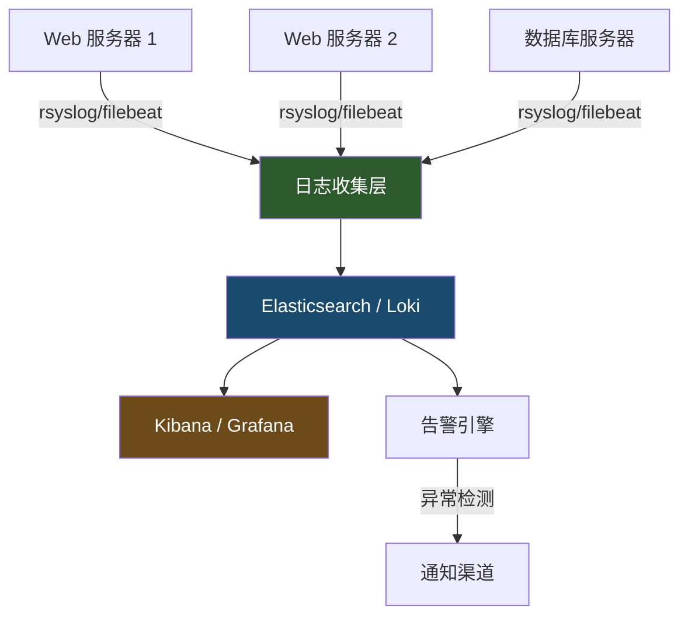

## 五、日志分析技巧

日志是操作系统留下的"黑匣子"——每一次登录、每一条命令、每一个异常都会在日志中留下痕迹。对于安全从业者而言，日志分析是最基础也最重要的技能之一。入侵检测、事件响应、合规审计、性能排障，所有这些工作都离不开对日志的深入理解。

本节从 Linux 日志体系的底层原理讲起，逐步覆盖日志定位、命令工具、安全分析、自动化监控等完整知识链，帮助你建立系统化的日志分析能力。

### 5.1 Linux 日志体系架构

#### 5.1.1 传统 syslog 架构

Linux 的日志系统经历了从 syslog 到 journald 的演进。理解这两种架构是进行日志分析的前提。

传统 syslog 架构基于 RFC 3164（后更新为 RFC 5424）定义的协议标准，采用"设施-严重级别"二维分类模型：

| 设施（Facility） | 编号 | 说明 |
|---|---|---|
| kern | 0 | 内核消息 |
| user | 1 | 用户级消息 |
| mail | 2 | 邮件系统 |
| daemon | 3 | 系统守护进程 |
| auth | 4 | 认证/授权 |
| syslog | 5 | syslogd 内部消息 |
| lpr | 6 | 打印系统 |
| news | 7 | 新闻组 |
| cron | 8 | 定时任务 |
| authpriv | 9 | 私有认证消息 |
| local0-local7 | 16-23 | 本地自定义设施 |

| 严重级别（Severity） | 编号 | 说明 |
|---|---|---|
| emerg | 0 | 系统不可用 |
| alert | 1 | 需要立即处理 |
| crit | 2 | 严重条件 |
| err | 3 | 错误 |
| warning | 4 | 警告 |
| notice | 5 | 正常但重要 |
| info | 6 | 信息性消息 |
| debug | 7 | 调试级消息 |

syslog 架构的数据流如下：

```mermaid
graph LR
    A[应用程序] -->|syslog() API| B[rsyslogd / syslogd]
    C[内核] -->|/dev/kmsg| B
    D[系统服务] -->|stdout/stderr| B
    B -->|facility.level 规则| E[/var/log/ 各日志文件]
    B -->|转发规则| F[远程日志服务器]
    B -->|管道| G[自定义处理程序]
```

`/etc/rsyslog.conf` 是 rsyslog 的主配置文件，核心规则格式为：

```text
facility.level    action
```

例如：

```bash
# 所有 auth 设施的 err 及以上级别写入 auth.log
auth,authpriv.*              /var/log/auth.log

# cron 设施全部写入 cron.log
cron.*                       /var/log/cron.log

# 所有 info 级别以上，除了 mail、auth 和 cron
*.info;mail.none;authpriv.none;cron.none   /var/log/messages

# 紧急消息发送给所有登录用户
*.emerg                       :omusrmsg:*

# 远程转发（TCP）
auth.* @@192.168.1.100:514
```

#### 5.1.2 systemd-journald 架构

systemd 引入了 journald 作为新一代日志系统，与传统 syslog 相比有显著优势：

| 特性 | syslog | journald |
|---|---|---|
| 存储格式 | 纯文本 | 二进制（结构化） |
| 索引能力 | 无 | 全文索引 + 字段索引 |
| 元数据 | 有限 | 丰富的结构化字段 |
| 完整性校验 | 无 | 可选 Forward Secure Sealing |
| 启动阶段日志 | 可能丢失 | 完整捕获 |
| 二进制数据 | 不支持 | 支持（如 coredump） |
| 查询性能 | grep 扫描全文 | 索引查询，速度快 |

journald 的日志存储在 `/var/log/journal/`（持久化模式）或 `/run/log/journal/`（临时模式，重启丢失）。每个 `.journal` 文件是二进制格式，不能直接用 `cat` 或 `grep` 读取。

关键配置文件 `/etc/systemd/journald.conf`：

```ini
[Journal]
Storage=persistent          # 持久化存储（推荐）
Compress=yes                # 压缩存储
SystemMaxUse=2G             # 最大磁盘占用
MaxRetentionSec=3month      # 最长保留时间
ForwardToSyslog=yes         # 同时转发给 rsyslog
RateLimitIntervalSec=30s    # 速率限制时间窗口
RateLimitBurst=10000        # 时间窗口内最大消息数
```

两种架构在现代 Linux 发行版中通常并存：

```mermaid
graph TD
    A[应用程序 / 系统服务] --> B[journald]
    B -->|ForwardToSyslog=yes| C[rsyslog]
    C --> D[/var/log/ 文本日志]
    B --> E[/var/log/journal/ 二进制日志]
    A -->|直接写入| F[应用自定义日志]
    style B fill:#2d5a2d,color:#fff
    style C fill:#4a6741,color:#fff
```

#### 5.1.3 日志轮转机制

日志文件会持续增长，logrotate 负责自动轮转、压缩和清理。配置位于 `/etc/logrotate.conf`（全局）和 `/etc/logrotate.d/`（按服务拆分）。

典型的 logrotate 配置示例：

```bash
/var/log/nginx/*.log {
    daily                   # 每天轮转
    missingok               # 日志不存在时不报错
    rotate 14               # 保留 14 个轮转文件
    compress                # gzip 压缩旧日志
    delaycompress           # 延迟一次再压缩（方便写入完成）
    notifempty              # 空文件不轮转
    create 0640 www-data adm  # 创建新文件的权限
    sharedscripts           # 多个日志文件只执行一次脚本
    postrotate              # 轮转后执行
        [ -s /run/nginx.pid ] && kill -USR1 $(cat /run/nginx.pid)
    endscript
}
```

理解 logrotate 对日志分析至关重要：当你在 `/var/log/` 中看到 `auth.log.1`、`auth.log.2.gz` 这样的文件时，知道它们是轮转产生的历史日志。分析时不要遗漏这些压缩的旧日志：

```bash
# 搜索所有轮转日志中的关键字（含压缩文件）
zgrep "Failed password" /var/log/auth.log*

# 按时间范围搜索（auth.log 是当前，编号越大越旧）
for f in /var/log/auth.log /var/log/auth.log.{1,2,3,4}; do
    echo "=== $f ==="
    grep "Failed password" "$f" 2>/dev/null | wc -l
done

# 用 zgrep 批量搜索所有压缩日志
zgrep -c "Accepted publickey" /var/log/auth.log.*.gz
```

手动触发轮转和测试配置：

```bash
# 强制立即轮转所有日志
logrotate -f /etc/logrotate.conf

# 测试配置（不实际执行）
logrotate -d /etc/logrotate.conf

# 只轮转指定配置
logrotate -f /etc/logrotate.d/nginx
```

### 5.2 核心日志文件全景

Linux 系统的日志分散在多个文件中，每个文件记录不同层面的活动。以下是安全分析中最关键的日志文件及其详细说明：

#### 5.2.1 认证与授权日志

```bash
# Debian/Ubuntu 系统
tail -f /var/log/auth.log

# RHEL/CentOS/Fedora 系统
tail -f /var/log/secure

# journalctl 查看认证日志（所有发行版通用）
journalctl -u sshd -f
journalctl _COMM=sshd --since "1 hour ago"
```

`auth.log` 记录的关键事件类型：

| 事件 | 日志关键字 | 含义 |
|---|---|---|
| 登录成功 | `Accepted password` / `Accepted publickey` | 用户认证通过 |
| 登录失败 | `Failed password` / `Invalid user` | 认证失败（暴力破解信号） |
| sudo 使用 | `sudo: user : TTY=... COMMAND=...` | 提权操作 |
| su 切换 | `su: (to root) pam_unix(su:session)` | 用户切换 |
| PAM 事件 | `pam_unix(sshd:auth)` | 认证模块事件 |
| 会话开关 | `session opened` / `session closed` | 用户会话生命周期 |
| 密钥认证 | `publickey` | SSH 密钥认证 |

#### 5.2.2 系统日志

```bash
# 通用系统日志
tail -f /var/log/syslog            # Debian/Ubuntu
tail -f /var/log/messages          # RHEL/CentOS

# systemd 日志（可按 unit、优先级、时间过滤）
journalctl -p err --since today    # 今天的错误
journalctl -u nginx --since "2024-01-01" --until "2024-01-02"
journalctl -k                     # 内核消息（等价 dmesg）
journalctl --disk-usage           # 查看日志占用空间
journalctl --vacuum-size=1G       # 清理到 1G 以内
```

#### 5.2.3 定时任务日志

```bash
# cron 执行记录
grep CRON /var/log/syslog
journalctl -u cron

# 安全分析：查找非标准 cron 任务
grep "CMD" /var/log/syslog | grep -v -E "(root|www-data|nobody)" | sort -u

# at/batch 任务日志
grep "atd" /var/log/syslog
```

#### 5.2.4 Web 服务器日志

```bash
# Apache
tail -f /var/log/apache2/access.log    # Debian/Ubuntu
tail -f /var/log/httpd/access_log      # RHEL/CentOS
tail -f /var/log/apache2/error.log

# Nginx
tail -f /var/log/nginx/access.log
tail -f /var/log/nginx/error.log

# 自定义日志路径（检查配置确认）
# Apache: grep ErrorLog /etc/apache2/apache2.conf
# Nginx:  grep access_log /etc/nginx/nginx.conf
```

Web 访问日志的常见格式（Combined Log Format）：

```text
192.168.1.100 - - [25/Jun/2024:10:30:45 +0800] "GET /admin/login HTTP/1.1" 200 1234 "http://example.com/" "Mozilla/5.0"
│              │  │        │                 │                     │   │    │         │              │
│              │  │        │                 │                     │   │    │         │              User-Agent
│              │  │        │                 │                     │   │    │         Referer
│              │  │        │                 │                     │   │    响应字节数
│              │  │        │                 │                     │   HTTP 状态码
│              │  │        │                 │                     请求路径
│              │  │        │                 请求方法 + 协议
│              │  │        时间戳
│              │  远程用户（通常为空）
│              认证用户（通常为空）
客户端 IP
```

#### 5.2.5 其他关键日志

```bash
# 内核环形缓冲区（硬件/驱动问题）
dmesg | tail -50
dmesg -T | grep -i error         # -T 显示可读时间戳

# 邮件日志
tail -f /var/log/mail.log        # Debian/Ubuntu
tail -f /var/log/maillog         # RHEL/CentOS

# 包管理器日志
cat /var/log/apt/history.log     # Debian/Ubuntu apt 操作记录
cat /var/log/yum.log             # RHEL/CentOS yum 操作记录

# 自动安全更新日志
cat /var/log/unattended-upgrades/unattended-upgrades.log

# 登录记录（二进制数据库）
last                             # 登录历史
lastb                            # 失败登录历史
who                              # 当前登录用户
w                                # 当前登录用户及其活动
```

### 5.3 日志分析命令工具箱

#### 5.3.1 基础文本处理三剑客

**grep — 模式匹配**

```bash
# 基本搜索
grep "Failed password" /var/log/auth.log

# 递归搜索整个日志目录
grep -r "segfault" /var/log/

# 显示匹配行的前后上下文
grep -B2 -A2 "error" /var/log/syslog    # 前2行 + 后2行

# 反向匹配（排除）
grep -v "session opened" /var/log/auth.log

# 仅统计匹配数量
grep -c "404" /var/log/nginx/access.log

# 使用扩展正则表达式
grep -E "(error|critical|fatal)" /var/log/syslog

# 忽略大小写
grep -i "password" /var/log/auth.log

# 只输出匹配部分
grep -oP '\d+\.\d+\.\d+\.\d+' /var/log/nginx/access.log

# 在压缩文件中搜索
zgrep "error" /var/log/syslog.*.gz
zgrep -l "root" /var/log/auth.log.*.gz   # 只列出包含匹配的文件名
```

**awk — 结构化日志处理**

awk 是日志分析的核心武器，特别适合处理格式化的日志行：

```bash
# 提取 Apache/Nginx 访问日志的 IP 地址
awk '{print $1}' /var/log/nginx/access.log

# 统计各 HTTP 状态码数量
awk '{print $9}' /var/log/apache2/access.log | sort | uniq -c | sort -rn

# 提取状态码为 404 的请求路径
awk '$9 == 404 {print $7}' /var/log/apache2/access.log | sort | uniq -c | sort -rn | head -20

# 提取特定时间范围的日志（假设时间戳在第4-5列）
awk -F'[/ :]' '$5 >= 10 && $5 <= 14' /var/log/nginx/access.log

# 计算每个 IP 的请求总量并排序
awk '{count[$1]++} END {for(ip in count) print count[ip], ip}' /var/log/nginx/access.log | sort -rn | head -20

# 提取响应时间大于 5 秒的请求（自定义日志格式）
awk '$NF > 5.0 {print $0}' /var/log/nginx/access.log

# 提取每个 URL 的平均响应大小
awk '{size[$7]+=$10; count[$7]++} END {for(url in size) printf "%.0f %s\n", size[url]/count[url], url}' /var/log/apache2/access.log | sort -rn | head

# 统计每小时的请求量分布
awk -F'[/: ]' '{print $5":"$6}' /var/log/nginx/access.log | sort | uniq -c
```

**sed — 日志预处理**

```bash
# 去除 ANSI 颜色代码
sed 's/\x1b\[[0-9;]*m//g' /var/log/app/output.log

# 提取时间戳和消息（跳过日志级别前缀）
sed -E 's/^[0-9-]+ [0-9:]+\.[0-9]+ [A-Z]+ //' /var/log/app.log

# 批量替换敏感信息（脱敏）
sed -E 's/password=[^ ]+/password=***REDACTED***/g' /var/log/app.log

# 合并多行日志为单行（Java 堆栈跟踪）
sed ':a; N; $!ba; s/\n\t/at /g' /var/log/app/error.log
```

#### 5.3.2 高级分析命令

```bash
# sort + uniq：统计频率分布（最常用的分析模式）
# 统计 SSH 失败登录的来源 IP（Top 20）
grep "Failed password" /var/log/auth.log | \
  awk '{print $(NF-3)}' | sort | uniq -c | sort -rn | head -20

# 统计被尝试的用户名
grep "Failed password" /var/log/auth.log | \
  awk '{for(i=1;i<=NF;i++) if($i=="for") print $(i+2)}' | \
  sort | uniq -c | sort -rn | head -20

# cut — 快速提取固定格式字段
# 提取 Nginx 访问日志的时间字段
cut -d' ' -f4-5 /var/log/nginx/access.log | tr -d '[]'

# find + xargs：批量处理轮转日志
find /var/log -name "auth.log*" -mtime -30 | xargs zgrep "Failed password"

# diff — 对比两份日志的差异
diff <(sort /var/log/auth.log.1) <(sort /var/log/auth.log)

# comm — 找出两份日志中独有的行
comm -23 <(awk '{print $1}' old_access.log | sort -u) \
         <(awk '{print $1}' new_access.log | sort -u)

# wc — 快速统计
wc -l /var/log/nginx/access.log            # 总行数
grep -c "POST" /var/log/nginx/access.log   # POST 请求数

# tee — 同时输出到屏幕和文件
tail -f /var/log/auth.log | tee /tmp/auth_monitor.log

# head/tail — 查看日志首尾
tail -100 /var/log/auth.log               # 最后 100 行
head -50 /var/log/nginx/access.log         # 前 50 行
tail -f -n 0 /var/log/auth.log            # 只看新增内容（不显示已有行）
```

#### 5.3.3 journalctl 高级用法

journalctl 是 systemd 系统上最强大的日志查询工具：

```bash
# 按服务过滤
journalctl -u sshd
journalctl -u nginx -u php-fpm            # 多个服务

# 按优先级过滤
journalctl -p err                         # error 及以上
journalctl -p warning..crit               # 范围过滤

# 按时间过滤
journalctl --since "2024-06-25 10:00:00" --until "2024-06-25 12:00:00"
journalctl --since "1 hour ago"
journalctl --since today
journalctl --since yesterday --until today

# 按进程/用户过滤
journalctl _PID=1234
journalctl _UID=1000
journalctl _COMM=sshd

# 输出格式
journalctl -o json-pretty                 # JSON 格式（适合程序处理）
journalctl -o verbose                     # 完整字段
journalctl -o cat                         # 只有消息文本

# 按可执行文件过滤
journalctl /usr/sbin/sshd

# 内核消息
journalctl -k                            # 等价 dmesg
journalctl -k -p err                     # 内核错误

# 磁盘空间管理
journalctl --disk-usage
journalctl --vacuum-size=500M            # 清理到 500M
journalctl --vacuum-time=30d             # 只保留 30 天

# 实时跟踪（类似 tail -f）
journalctl -f
journalctl -u sshd -f                    # 只跟踪 sshd

# 引导日志（分析启动问题）
journalctl -b                            # 当前引导
journalctl -b -1                         # 上次引导
journalctl --list-boots                  # 列出所有引导记录

# 输出到文件（导出）
journalctl -u sshd > /tmp/sshd_all.log
journalctl -u sshd --since today -o json > /tmp/sshd_today.json
```

### 5.4 安全分析实战

日志分析在安全领域的核心应用是威胁检测和事件响应。以下按攻击类型分类，提供完整的分析方法和检测规则。

#### 5.4.1 SSH 暴力破解检测

暴力破解是最常见的攻击方式之一。通过分析 auth.log 可以快速识别：

```bash
# 1. 统计每个 IP 的失败登录次数（Top 20 攻击源）
grep "Failed password" /var/log/auth.log | \
  awk '{print $(NF-3)}' | sort | uniq -c | sort -rn | head -20

# 2. 统计被尝试的用户名（识别定向攻击）
grep "Failed password" /var/log/auth.log | \
  awk '{
    for(i=1;i<=NF;i++){
      if($i=="for" && $(i+1)=="invalid") print $(i+2)
      else if($i=="for" && $(i+1)!="invalid") print $(i+1)
    }
  }' | sort | uniq -c | sort -rn | head -20

# 3. 识别"喷洒攻击"（同一 IP 短时间内尝试大量用户名）
grep "Failed password" /var/log/auth.log | \
  awk '{print $1,$2,$3,$(NF-3)}' | \
  awk '{ip[$4]++; users[$4][$8]++} END {for(i in ip) if(ip[i]>10) print ip[i],i}'

# 4. 检测成功登录前有大量失败的 IP（可能是暴力破解成功）
grep "Failed password" /var/log/auth.log | awk '{print $(NF-3)}' | sort | uniq -c | sort -rn | while read count ip; do
  if [ "$count" -gt 10 ] && grep -q "Accepted.*from $ip" /var/log/auth.log; then
    echo "⚠️  ALERT: $ip had $count failures AND a successful login"
  fi
done

# 5. 时间窗口分析：每小时的失败登录趋势
grep "Failed password" /var/log/auth.log | \
  awk '{print $1,$2,$3}' | cut -d: -f1,2 | sort | uniq -c

# 6. 检测非标准端口的 SSH 扫描（通过日志中的端口号）
grep "Failed password" /var/log/auth.log | \
  awk '{print $(NF-1)}' | sort | uniq -c | sort -rn
```

典型的暴力破解日志模式：

```text
# 单 IP 暴力破解特征：
Jun 25 03:14:22 server sshd[12345]: Failed password for root from 192.168.1.100 port 54321 ssh2
Jun 25 03:14:23 server sshd[12346]: Failed password for root from 192.168.1.100 port 54322 ssh2
Jun 25 03:14:24 server sshd[12347]: Failed password for invalid user admin from 192.168.1.100 port 54323 ssh2

# 字典攻击特征（大量不同用户名）：
Jun 25 03:15:01 server sshd[12400]: Failed password for invalid user test from 10.0.0.50 port 40001 ssh2
Jun 25 03:15:02 server sshd[12401]: Failed password for invalid user user from 10.0.0.50 port 40002 ssh2
Jun 25 03:15:03 server sshd[12402]: Failed password for invalid user oracle from 10.0.0.50 port 40003 ssh2
```

#### 5.4.2 Web 攻击日志识别

```bash
# SQL 注入检测
grep -iE "(union\s+(all\s+)?select|select\s+.*\s+from\s|insert\s+into|drop\s+table|update\s+.*\s+set\s|delete\s+from|or\s+1\s*=\s*1|'\s*or\s*'|--\s*$|/\*.*\*/)" \
  /var/log/nginx/access.log

# XSS 攻击检测
grep -iE "(<script|javascript:|on(error|load|click|mouseover)\s*=|alert\s*\(|document\.(cookie|write)|eval\s*\()" \
  /var/log/nginx/access.log

# 路径遍历检测
grep -iE "(\.\./|\.\.\\\\|%2e%2e%2f|%2e%2e/|\.\.%2f|%2e%2e%5c)" \
  /var/log/nginx/access.log

# 命令注入检测
grep -iE "(;\s*(cat|ls|id|whoami|wget|curl|nc|bash|sh|python|perl|ruby)|\|\s*(cat|ls|id)|`.*`|\\$\(.*\))" \
  /var/log/nginx/access.log

# Web Shell 访问检测
grep -iE "(\.php\?cmd=|\.asp\?cmd=|c99|r57|webshell|b374k|WSO)" \
  /var/log/nginx/access.log

# 扫描器/爬虫检测（非常见 User-Agent）
grep -iE "(sqlmap|nikto|nmap|masscan|dirbuster|gobuster|wfuzz|burp|acunetix|nessus)" \
  /var/log/nginx/access.log

# 异常 HTTP 方法检测
grep -E "\"(PUT|DELETE|PATCH|TRACE|OPTIONS|CONNECT) " /var/log/nginx/access.log

# 敏感文件访问检测
grep -iE "(/etc/passwd|/etc/shadow|\.env|\.git|wp-config|\.htaccess|phpinfo|/proc/self)" \
  /var/log/nginx/access.log
```

#### 5.4.3 权限提升与横向移动检测

```bash
# sudo 使用监控
grep "sudo:" /var/log/auth.log | grep "COMMAND="

# 非常规时间的 sudo 使用（凌晨 2-6 点）
grep "sudo:" /var/log/auth.log | awk '{
  split($3,t,":")
  if(t[1]>=2 && t[1]<=6) print $0
}'

# su 切换到 root
grep "su.*session opened.*root" /var/log/auth.log

# 查找可疑的文件权限变更
grep -iE "(chmod|chown|setuid|setgid)" /var/log/auth.log
grep -iE "(chmod|chown|setuid|setgid)" /var/log/syslog

# 用户/组管理操作
grep -iE "(useradd|userdel|usermod|groupadd|groupdel|chpasswd)" /var/log/auth.log

# 可疑的 crontab 修改
grep -iE "(crontab|CRON)" /var/log/syslog | grep -i "replace\|edit\|install"

# SSH 密钥相关操作
grep -iE "(publickey|authorized_keys)" /var/log/auth.log
```

#### 5.4.4 服务异常与入侵痕迹

```bash
# 查找 segfault（可能的漏洞利用尝试）
grep -i "segfault" /var/log/syslog
dmesg | grep -i "segfault"

# 查找 OOM Killer 事件（内存耗尽，可能被攻击者利用）
grep -i "oom-killer\|out of memory" /var/log/syslog
dmesg | grep -i "oom"

# 查找被拒绝的服务连接（防火墙日志）
grep -i "denied\|refused\|reject" /var/log/syslog

# 查找异常的进程启动
grep "COMMAND=" /var/log/auth.log | grep -v -E "(sudo -i|sudo -s|session)" | tail -30

# 查找异常的网络连接日志（如果配置了 iptables 日志）
grep "iptables" /var/log/syslog | grep "DROP\|REJECT"

# Systemd 服务异常（被频繁重启可能是入侵信号）
journalctl -u nginx --since today | grep -i "start\|stop\|restart\|fail" | \
  awk '{print $1,$2,$3}' | sort | uniq -c | sort -rn
```

### 5.5 日志关联分析

单条日志往往无法说明问题，真正的分析能力体现在多源日志的关联上。

#### 5.5.1 时间线分析法

当发生安全事件时，第一步是建立完整的时间线：

```bash
# 收集某时间段内所有来源的日志
TIME_START="Jun 25 03:00:00"
TIME_END="Jun 25 04:00:00"

echo "=== 认证日志 ==="
awk -v start="$TIME_START" -v end="$TIME_END" '
  {ts=$1" "$2" "$3; if(ts>=start && ts<=end) print}
' /var/log/auth.log

echo "=== 系统日志 ==="
awk -v start="$TIME_START" -v end="$TIME_END" '
  {ts=$1" "$2" "$3; if(ts>=start && ts<=end) print}
' /var/log/syslog

echo "=== Web 日志 ==="
# Web 日志时间格式不同，需要调整解析
awk -v start="25/Jun/2024:03:00" -v end="25/Jun/2024:04:00" '
  {split($4,t,"["); if(t[2]>=start && t[2]<=end) print}
' /var/log/nginx/access.log
```

#### 5.5.2 攻击链重建

通过关联多个日志源，可以还原完整的攻击链：

```bash
# 场景：发现某 IP 暴力破解成功后提权

# 第一步：确认攻击 IP
ATTACK_IP="192.168.1.100"

# 第二步：查看该 IP 所有认证活动
grep "$ATTACK_IP" /var/log/auth.log

# 第三步：查看该 IP 的 Web 访问（如果存在）
grep "$ATTACK_IP" /var/log/nginx/access.log

# 第四步：查看登录后的 sudo 活动（关联 session ID）
# 从成功的 SSH 登录中提取 session ID
grep "Accepted.*$ATTACK_IP" /var/log/auth.log
# 假设 session ID 为 12345
grep "session.*12345" /var/log/auth.log

# 第五步：查看该用户的 cron 任务
grep "$(who | grep $ATTACK_IP | awk '{print $1}')" /var/log/syslog | grep CRON

# 第六步：查看文件系统变更（如果有 audit 日志）
grep "$ATTACK_IP" /var/log/audit/audit.log 2>/dev/null
```

#### 5.5.3 统计分析与基线对比

建立正常行为基线是检测异常的关键：

```bash
# 建立 SSH 登录基线（过去 30 天每天的失败次数）
for i in $(seq 0 30); do
  date_str=$(date -d "$i days ago" "+%b %e")
  count=$(grep "$date_str" /var/log/auth.log | grep -c "Failed password" 2>/dev/null)
  echo "$date_str: $count failures"
done

# 建立 Web 访问基线（每小时请求数）
awk '{print $4}' /var/log/nginx/access.log | cut -d: -f1-3 | sort | uniq -c

# 检测异常：当前小时的请求量 vs 历史平均值
current_hour=$(date +%H)
current_count=$(grep "$(date '+%d/%b/%Y'):$current_hour" /var/log/nginx/access.log | wc -l)
avg_count=$(awk '{print $4}' /var/log/nginx/access.log | cut -d: -f1-3 | sort | uniq -c | awk '{sum+=$1; n++} END {print int(sum/n)}')
echo "当前小时: $current_count 请求, 历史平均: $avg_count 请求"
if [ "$current_count" -gt $((avg_count * 3)) ]; then
  echo "⚠️  请求量异常（超过平均值 3 倍）"
fi
```

### 5.6 日志完整性与防篡改

攻击者入侵后通常会尝试清除或篡改日志。保护日志完整性是安全体系的重要环节。

#### 5.6.1 日志篡改的常见手法

攻击者清除日志的典型方式：

```bash
# 方式 1：直接清空日志文件
> /var/log/auth.log
cat /dev/null > /var/log/auth.log

# 方式 2：删除日志文件
rm /var/log/auth.log

# 方式 3：用 sed 删除特定行
sed -i '/192.168.1.100/d' /var/log/auth.log

# 方式 4：停止 rsyslog 服务后操作
systemctl stop rsyslog
# ... 执行攻击操作 ...
systemctl start rsyslog
```

检测日志篡改的迹象：

```bash
# 检查日志文件大小是否异常变小（对比 inode 信息）
stat /var/log/auth.log

# 检查日志文件的修改时间是否异常
ls -la /var/log/auth.log*
# 如果 auth.log 的修改时间早于 auth.log.1，说明可能被清空后重新生成

# 检查日志中是否有时间跳跃
awk '{print $1,$2,$3}' /var/log/auth.log | uniq | awk '
  NR>1 {
    cmd="date -d \""prev"\" +%s"; cmd | getline t1; close(cmd)
    cmd="date -d \""$0"\" +%s"; cmd | getline t2; close(cmd)
    if(t2-t1 > 3600) print "⚠️  时间跳跃: "prev" -> "$0" ("(t2-t1)/3600"小时)"
  }
  {prev=$0}
'

# 检查日志中是否有明显的删除痕迹
grep -i "deleted\|cleared\|rotated" /var/log/syslog | grep -i "auth\|secure"

# 使用 find 检查近期被修改的日志文件
find /var/log -name "*.log" -mtime -1 -ls
```

#### 5.6.2 日志保护措施

```bash
# 1. 设置日志文件的 append-only 属性（需要 root）
chattr +a /var/log/auth.log
chattr +a /var/log/syslog
# append-only 属性：只能追加，不能删除或覆盖
# 即使 root 也需要 chattr -a 才能清空

# 2. 验证 append-only 属性
lsattr /var/log/auth.log
# 输出应包含 'a' 标志

# 3. 使用 auditd 记录日志文件自身的访问
# /etc/audit/rules.d/log-protection.rules
-w /var/log/auth.log -p wa -k log_access
-w /var/log/syslog -p wa -k log_access
-w /var/log/ -p wa -k log_dir_access

# 4. 远程日志转发（最关键！本地日志可被攻击者篡改）
# /etc/rsyslog.d/remote.conf
# *.* @@192.168.1.200:514    # TCP 转发到远程日志服务器

# 5. journald 的 Forward Secure Sealing
# /etc/systemd/journald.conf 中启用：
# Seal=yes
# 这会使用密钥对日志进行签名，任何篡改都会被检测到
journalctl --verify    # 验证日志完整性
```

#### 5.6.3 auditd 审计框架

auditd 是 Linux 内核级的审计系统，提供比 syslog 更细粒度的监控能力：

```bash
# 安装（如果未安装）
apt install auditd audispd-plugins    # Debian/Ubuntu
yum install audit                      # RHEL/CentOS

# 启动并设为开机自启
systemctl enable --now auditd

# 查看审计规则
auditctl -l

# 添加文件监控规则
# 监控 /etc/passwd 的读写
auditctl -w /etc/passwd -p rwxa -k passwd_changes

# 监控 sudoers 文件
auditctl -w /etc/sudoers -p wa -k sudoers_changes

# 监控所有 SSH 密钥文件
auditctl -w /root/.ssh/ -p wa -k root_ssh

# 监控特定系统调用
auditctl -a always,exit -F arch=b64 -S execve -k command_exec

# 搜索审计日志
ausearch -k passwd_changes              # 按 key 搜索
ausearch -ua root                       # 按用户搜索
ausearch -ts recent                     # 最近事件
ausearch -m USER_LOGIN                  # 登录事件
ausearch -sv no                         # 失败事件

# 生成审计报告
aureport                                # 总体报告
aureport --login                        # 登录报告
aureport --file                         # 文件访问报告
aureport --auth                         # 认证报告
aureport -ts today --summary            # 今日摘要

# 持久化规则（重启后生效）
cat > /etc/audit/rules.d/custom.rules << 'EOF'
# 监控认证文件
-w /etc/passwd -p wa -k identity
-w /etc/group -p wa -k identity
-w /etc/shadow -p wa -k identity
-w /etc/sudoers -p wa -k sudoers

# 监控 SSH 配置
-w /etc/ssh/sshd_config -p wa -k sshd_config

# 监控 cron 配置
-w /etc/crontab -p wa -k cron
-w /etc/cron.d/ -p wa -k cron
-w /var/spool/cron/ -p wa -k cron

# 监控日志文件本身
-w /var/log/auth.log -p wa -k log_tamper
-w /var/log/syslog -p wa -k log_tamper

# 监控内核模块加载
-a always,exit -F arch=b64 -S init_module -S finit_module -k module_load
-a always,exit -F arch=b64 -S delete_module -k module_unload

# 规则不可变（加载后无法修改，需重启才能改）
-e 2
EOF

# 重新加载规则
augenrules --load
```

### 5.7 自动化日志监控

手动分析日志适用于事后调查，但实时监控需要自动化工具。

#### 5.7.1 使用 fail2ban 自动封禁

fail2ban 是最流行的日志监控+自动封禁工具：

```bash
# 安装
apt install fail2ban

# 主配置：/etc/fail2ban/jail.local
cat > /etc/fail2ban/jail.local << 'EOF'
[DEFAULT]
bantime = 3600           # 封禁 1 小时
findtime = 600           # 在 10 分钟内
maxretry = 5             # 失败 5 次即封禁
banaction = iptables-multiport
backend = systemd        # 使用 journald 作为日志源

[sshd]
enabled = true
port = ssh
logpath = %(sshd_log)s
maxretry = 3             # SSH 更严格，3 次就封

[nginx-http-auth]
enabled = true
port = http,https
logpath = /var/log/nginx/error.log
maxretry = 3

[nginx-botsearch]
enabled = true
port = http,https
logpath = /var/log/nginx/access.log
maxretry = 2
EOF

# 管理命令
fail2ban-client status                # 查看所有 jail 状态
fail2ban-client status sshd           # 查看 sshd jail 详情
fail2ban-client set sshd banip 1.2.3.4    # 手动封禁 IP
fail2ban-client set sshd unbanip 1.2.3.4  # 手动解封
fail2ban-client reload                # 重载配置
```

#### 5.7.2 自定义日志监控脚本

对于 fail2ban 无法覆盖的场景，编写自定义监控脚本：

```bash
#!/bin/bash
# log-monitor.sh — 自定义日志监控
# 用法: nohup /opt/scripts/log-monitor.sh &

LOGFILE="/var/log/auth.log"
ALERT_THRESHOLD=10        # 10 分钟内失败次数阈值
CHECK_INTERVAL=60         # 每 60 秒检查一次
ALERTED_IPS="/tmp/alerted_ips.tmp"

touch "$ALERTED_IPS"

while true; do
    # 统计过去 10 分钟内每个 IP 的失败登录次数
    TEN_MIN_AGO=$(date -d "10 minutes ago" "+%b %e %H:%M")

    grep "Failed password" "$LOGFILE" | \
    awk -v since="$TEN_MIN_AGO" '$1" "$2" "$3 >= since {print $(NF-3)}' | \
    sort | uniq -c | sort -rn | while read count ip; do
        if [ "$count" -ge "$ALERT_THRESHOLD" ] && ! grep -q "$ip" "$ALERTED_IPS"; then
            echo "[$(date)] ALERT: $ip has $count failed logins in 10 min" >> /var/log/security-alerts.log
            echo "$ip" >> "$ALERTED_IPS"
            # 可选：发送通知
            # curl -s -X POST "https://hooks.slack.com/..." -d "{\"text\":\"SSH brute force from $ip ($count attempts)\"}"
        fi
    done

    # 清理过期的告警记录（每小时清理一次）
    if [ "$(date +%M)" = "00" ]; then
        > "$ALERTED_IPS"
    fi

    sleep "$CHECK_INTERVAL"
done
```

#### 5.7.3 日志告警与通知

```bash
# 使用 logger 命令生成自定义日志
logger -p auth.alert "Custom security alert: suspicious activity detected"
logger -t myapp -p local0.error "Application error: database connection failed"

# 结合 systemd 的看门狗机制
# 在 service 文件中配置：
# [Service]
# WatchdogSec=30s
# 如果服务 30 秒内没有 notify systemd，自动重启

# 简单的邮件告警脚本
#!/bin/bash
# check-auth-log.sh — 检查异常并发送邮件
ALERT_EMAIL="admin@example.com"
FAILED_TODAY=$(grep "$(date '+%b %e')" /var/log/auth.log | grep -c "Failed password")

if [ "$FAILED_TODAY" -gt 100 ]; then
    echo "今日 SSH 失败登录: $FAILED_TODAY 次" | \
    mail -s "[SECURITY] SSH Brute Force Alert" "$ALERT_EMAIL"
fi
```

### 5.8 高级日志分析技巧

#### 5.8.1 正则表达式模式库

日志分析中常用的正则表达式模式：

```bash
# IP 地址（简化版，匹配大多数场景）
[0-9]{1,3}\.[0-9]{1,3}\.[0-9]{1,3}\.[0-9]{1,3}

# 时间戳（syslog 格式）
[A-Z][a-z]{2}\s+\d{1,2}\s+\d{2}:\d{2}:\d{2}

# HTTP 状态码
\"[A-Z]+ /[^\"]+ HTTP/[0-9.]+" [0-9]{3}

# URL 路径（检测可疑字符）
(/[a-zA-Z0-9._-]+)+(\?[^"]*)?

# SQL 关键字组合
(union|select|insert|update|delete|drop|alter|create)\s

# Shell 命令注入
;\s*(cat|ls|id|whoami|uname|wget|curl|nc|bash|sh|python)\b

# Base64 编码的可疑载荷
[A-Za-z0-9+/]{50,}={0,2}

# 可疑的文件路径
\.\./|/etc/passwd|/etc/shadow|/proc/self|\.env|\.git
```

#### 5.8.2 awk 脚本化分析

对于复杂的分析任务，编写 awk 脚本比单行命令更高效：

```bash
#!/usr/bin/awk -f
# analyze-access.awk — Nginx 访问日志综合分析
# 用法: awk -f analyze-access.awk /var/log/nginx/access.log

BEGIN {
    total = 0
    errors = 0
}

{
    total++
    ip[$1]++
    status[$9]++
    url[$7]++
    size_sum += $10

    # 统计错误请求
    if ($9 >= 400) errors++
    if ($9 == 404) notfound[$7]++
    if ($9 >= 500) servererr[$7]++
}

END {
    print "======= 日志分析报告 ======="
    print "总请求数:", total
    print "错误请求数:", errors
    print "总传输字节:", size_sum
    print ""

    print "--- Top 10 访问 IP ---"
    PROCINFO["sorted_in"] = "@val_num_desc"
    count = 0
    for (i in ip) {
        printf "%6d  %s\n", ip[i], i
        if (++count >= 10) break
    }
    print ""

    print "--- 状态码分布 ---"
    for (s in status) printf "%6d  %s\n", status[s], s
    print ""

    print "--- Top 10 请求 URL ---"
    count = 0
    for (u in url) {
        printf "%6d  %s\n", url[u], u
        if (++count >= 10) break
    }
    print ""

    print "--- Top 10 404 页面 ---"
    count = 0
    for (u in notfound) {
        printf "%6d  %s\n", notfound[u], u
        if (++count >= 10) break
    }
}
```

#### 5.8.3 日志格式自定义

根据分析需求自定义日志格式，记录更多信息：

```bash
# Nginx 自定义日志格式（记录请求时间和上游响应时间）
# /etc/nginx/nginx.conf
log_format detailed '$remote_addr - $remote_user [$time_local] '
                    '"$request" $status $body_bytes_sent '
                    '"$http_referer" "$http_user_agent" '
                    '$request_time $upstream_response_time '
                    '$connection $connection_requests';

access_log /var/log/nginx/access.log detailed;

# Apache 自定义日志格式
# /etc/apache2/apache2.conf
LogFormat "%h %l %u %t \"%r\" %>s %b \"%{Referer}i\" \"%{User-Agent}i\" %D %T" detailed
CustomLog /var/log/apache2/access.log detailed
# %D = 请求处理时间（微秒），%T = 请求处理时间（秒）
```

### 5.9 常见误区与纠正

| 误区 | 正确做法 |
|---|---|
| 只看 `/var/log/auth.log` 当前文件 | 同时检查轮转日志 `auth.log.*` 和压缩日志 `auth.log.*.gz` |
| 用 `cat` + `grep` 分析大日志 | 用 `awk` 直接结构化解析，避免管道开销 |
| 只关注"错误"日志 | 正常日志中的异常模式同样重要（如正常用户在异常时间登录） |
| 看到 "Failed password" 就认为被攻击 | 排除自身测试、运维操作、合法误操作 |
| 认为清空日志文件 (`> file.log`) 会丢失数据 | rsyslog 仍持有文件句柄，新日志会继续写入（但已清空的内容确实丢失） |
| 忽略时间戳时区问题 | 统一使用 UTC 或确认所有日志的时区一致性 |
| 认为 `journalctl` 可以替代一切 | 某些应用日志（如 Nginx、MySQL）不经过 journald，需单独查看 |
| 只做实时监控，不做历史分析 | 定期归档并分析历史日志，发现长期潜伏的威胁 |
| 日志越多越好 | 过多的 debug 日志会淹没关键信息，合理设置日志级别 |
| 只在出事后才分析日志 | 建立基线，定期审计，主动发现异常 |

### 5.10 进阶：集中式日志架构

当管理多台服务器时，集中式日志系统是必选项。

#### 5.10.1 架构概览



#### 5.10.2 轻量级方案：rsyslog 集中收集

不依赖 ELK 栈，仅用 rsyslog 实现日志集中：

```bash
# 日志服务器端配置 /etc/rsyslog.conf
# 启用 TCP 接收
module(load="imtcp")
input(type="imtcp" port="514")

# 按主机名分类存储
template(name="RemoteHost" type="string"
    string="/var/log/remote/%HOSTNAME%/%PROGRAMNAME%.log")

if $fromhost-ip != '127.0.0.1' then {
    action(type="omfile" dynaFile="RemoteHost")
    stop
}

# 客户端配置 /etc/rsyslog.d/remote.conf
# 转发所有日志到远程服务器（TCP）
*.* @@192.168.1.200:514

# 只转发 auth 日志
auth,authpriv.* @@192.168.1.200:514

# 使用 RELP 协议（更可靠，支持确认）
module(load="omrelp")
action(type="omrelp" target="192.168.1.200" port="2514" template="RSYSLOG_TraditionalFileFormat")
```

#### 5.10.3 轻量级方案：Loki + Promtail

比 ELK 更轻量的现代日志栈：

```yaml
# promtail-config.yml — Promtail 配置示例
server:
  http_listen_port: 9080

positions:
  filename: /var/lib/promtail/positions.yaml

clients:
  - url: http://loki-server:3100/loki/api/v1/push

scrape_configs:
  - job_name: system
    static_configs:
      - targets: [localhost]
        labels:
          job: syslog
          host: ${HOSTNAME}
          __path__: /var/log/syslog

  - job_name: auth
    static_configs:
      - targets: [localhost]
        labels:
          job: auth
          host: ${HOSTNAME}
          __path__: /var/log/auth.log

  - job_name: nginx
    static_configs:
      - targets: [localhost]
        labels:
          job: nginx
          host: ${HOSTNAME}
          __path__: /var/log/nginx/access.log
    pipeline_stages:
      - regex:
          expression: '^(?P<ip>\S+) .* "(?P<method>\S+) (?P<path>\S+) HTTP/\S+" (?P<status>\d+)'
      - labels:
          method:
          status:
```

### 5.11 实战案例：从日志中发现入侵

以下是一个完整的日志分析案例，展示如何从零开始发现并追踪一起入侵事件。

**场景**：运维人员发现服务器在凌晨 3 点 CPU 使用率飙升，需要通过日志排查原因。

```bash
# 第一步：查看系统日志，了解凌晨 3 点发生了什么
journalctl --since "2024-06-25 02:50:00" --until "2024-06-25 03:30:00" -p err

# 第二步：查看认证日志，是否有异常登录
grep "Jun 25 03" /var/log/auth.log
# 发现：
# 03:02:15 Failed password for root from 203.0.113.50 port 44001
# 03:02:16 Failed password for root from 203.0.113.50 port 44002
# ... (大量失败)
# 03:05:42 Accepted password for root from 203.0.113.50 port 44100
# ⚠️  暴力破解成功！

# 第三步：追踪该 IP 的所有活动
grep "203.0.113.50" /var/log/auth.log

# 第四步：查看登录后执行了什么命令
grep "session.*opened" /var/log/auth.log | grep "Jun 25 03"
# 获取 session ID: 8891
grep "8891" /var/log/auth.log
# 发现 sudo 提权操作

# 第五步：查看 Web 日志（该 IP 是否通过 Web 入侵）
grep "203.0.113.50" /var/log/nginx/access.log | tail -30
# 发现之前的 Web 漏洞探测

# 第六步：查看 cron 任务（检查是否植入定时任务）
grep "Jun 25 03" /var/log/syslog | grep CRON

# 第七步：检查文件系统变更
find / -newer /var/log/auth.log -type f -name "*.sh" 2>/dev/null
find /tmp -type f -mtime -1 2>/dev/null

# 第八步：查看网络连接（通过 ss 或 netstat，非日志但关联分析）
ss -tlnp
netstat -anp | grep ESTABLISHED

# 第九步：检查是否有隐藏的用户
grep "useradd\|usermod" /var/log/auth.log
cat /etc/passwd | awk -F: '$3>=1000{print}'

# 第十步：汇总攻击时间线
echo "=== 攻击时间线 ==="
echo "03:02 - 暴力破解开始"
echo "03:05 - SSH 登录成功"
echo "03:06 - sudo 提权"
echo "03:07 - 下载恶意脚本"
echo "03:08 - 植入 cron 定时任务"
echo "03:10 - 开始挖矿（CPU 飙升）"
```

### 5.12 本节小结

日志分析是一项需要持续练习的技能。核心要点：

1. **理解架构**：知道日志从哪里来、存在哪里、怎么轮转，才能不遗漏关键数据
2. **掌握工具**：grep/awk/sed/journalctl 是四把利器，awk 尤其适合结构化分析
3. **安全视角**：从攻击者的角度思考——他们会留下什么痕迹、会试图删除什么
4. **关联分析**：单条日志价值有限，多源关联才能还原完整事件
5. **主动防御**：远程日志、append-only、auditd，让攻击者无法销毁证据
6. **自动化**：fail2ban + 自定义脚本，从被动分析转向主动监控
7. **建立基线**：知道什么是"正常"，才能识别什么是"异常"

记住一个原则：**日志是事后唯一的证人**。在攻击发生之前就把日志体系搭建好，远比事后亡羊补牢更有价值。
