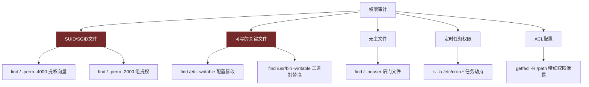

## 本节小结

核心技巧一节从七个维度构建了Linux安全操作的技能栈：文本处理三剑客（grep/sed/awk）、系统信息收集、文件权限管理、Shell脚本安全编程、日志分析、网络调试、以及实用别名与函数。这些技能不是孤立的命令集合——它们共同构成了一条完整的安全分析流水线：**用文本处理从海量数据中提取信号，用信息收集建立目标画像，用权限管理识别攻击面，用日志分析还原事件时间线，用网络调试定位异常连接，用Shell脚本将上述流程自动化，用别名和函数提升日常操作效率。**

本小结将回顾每节核心知识、串联技能之间的逻辑关系、提炼可复用的命令模式，并指出从"会用命令"到"形成安全直觉"的进阶路径。

### 一、各节核心知识回顾

#### 1.1 文本处理三剑客：从数据中提取安全信号

grep、sed、awk 是Linux安全分析的基石工具。它们解决的核心问题是：面对动辄GB级别的日志文件和配置文件，如何在秒级时间内完成模式匹配、格式转换和统计聚合。

**三者的分工与协作：**

| 工具 | 核心能力 | 输入输出模型 | 安全场景定位 | 学习优先级 |
|------|----------|-------------|-------------|-----------|
| `grep` | 模式匹配与行过滤 | 输入流 → 匹配行输出 | 粗筛：从日志中快速定位攻击特征 | ★★★★★ 必须精通 |
| `sed` | 行级文本替换与编辑 | 输入流 → 变换后输出 | 变换：批量修改配置、格式化日志、脱敏 | ★★★★☆ 熟练使用 |
| `awk` | 字段提取、条件过滤、统计聚合 | 输入流 → 结构化输出 | 精处理：提取IP/URL/状态码、生成统计报表 | ★★★★★ 必须精通 |

**实战中最高频的命令模式：**

```bash
# 模式一：grep粗筛 → awk精提取 → sort/uniq统计
# 典型用途：统计攻击IP频率
grep "Failed password" /var/log/auth.log | \
  awk '{print $(NF-3)}' | \
  sort | uniq -c | sort -rn | head -20

# 模式二：grep反向过滤 → 排除噪声，聚焦异常
grep -v "GET /health" access.log | grep -E " [45][0-9]{2} "

# 模式三：sed批量配置修改
sed -i 's/^#*PermitRootLogin.*/PermitRootLogin no/' /etc/ssh/sshd_config
sed -i 's/^#*PasswordAuthentication.*/PasswordAuthentication no/' /etc/ssh/sshd_config

# 模式四：awk条件统计
# 统计每小时的错误请求数
awk '$9 >= 400 {split($4,a,":"); hour=a[2]; count[hour]++} 
     END {for(h in count) print h, count[h]}' access.log | sort
```

**安全分析中必须掌握的grep技巧：**

- `-P`（Perl正则）：匹配IP地址 `\d{1,3}\.\d{1,3}\.\d{1,3}\.\d{1,3}`、匹配邮箱 `\b[\w.-]+@[\w.-]+\.\w+\b`
- `-E`（扩展正则）：多模式匹配 `grep -E "error|warning|critical"`
- `-o`（仅输出匹配部分）：提取特定字段，配合管道做二次处理
- `-c`（计数）：快速判断某类事件的数量级，用于阈值告警
- `-A`/`-B`/`-C`（上下文）：查看攻击请求前后的正常请求，判断攻击模式

#### 1.2 系统信息收集：建立目标画像

信息收集是安全评估的起点，也是提权尝试的第一步。本节将信息收集分为五个层次，每一层回答一个关键问题：

| 层次 | 收集内容 | 核心命令 | 回答的问题 |
|------|---------|---------|-----------|
| 系统身份 | 内核版本、发行版、架构 | `uname -a`, `cat /etc/os-release` | 这台机器跑的什么系统？有哪些已知漏洞？ |
| 用户与权限 | 用户列表、sudo规则、UID为0的账户 | `id`, `cat /etc/passwd`, `sudo -l` | 当前用户能做什么？有哪些提权路径？ |
| 进程与服务 | 运行中的进程、监听端口、systemd服务 | `ps auxf`, `ss -tunlp`, `systemctl` | 系统在运行什么？哪些服务暴露在网络？ |
| 文件系统 | SUID文件、可写目录、定时任务、最近修改 | `find / -perm -4000`, `crontab -l` | 有哪些可利用的文件权限？有哪些持久化入口？ |
| 网络状态 | 接口、路由、防火墙、DNS、ARP | `ip addr`, `iptables -L`, `cat /etc/resolv.conf` | 网络拓扑是什么？有哪些可达的目标？ |

**关键安全发现清单：**

```bash
# 1. 多个UID=0的用户（后门账户）
awk -F: '$3 == 0 {print $1}' /etc/passwd
# 正常情况下应该只有root

# 2. 空密码账户（未授权访问）
sudo awk -F: '($2 == "" || $2 == "!") {print $1}' /etc/shadow

# 3. 可登录的系统用户（异常shell）
awk -F: '$7 !~ /nologin|false|sync|shutdown|halt/ {print $1, $7}' /etc/passwd

# 4. 非标准SUID程序（提权向量）
find / -perm -4000 -type f 2>/dev/null | grep -v -E "/usr/bin/|/usr/sbin/|/usr/lib|/usr/libexec"

# 5. 异常的监听端口（未授权服务）
ss -tunlp | grep -v -E ":22|:80|:443|:53"
```

#### 1.3 文件权限管理技巧：识别和利用权限弱点

Linux权限模型是安全的第一道防线，也是攻击者最常见的突破口。本节覆盖了权限检查和权限修改两大类操作。

**安全审计中的权限检查优先级：**



**权限修改的安全准则：**

| 操作 | 安全做法 | 危险做法 | 风险说明 |
|------|---------|---------|---------|
| 目录权限 | `chmod 750 /path` | `chmod 777 /path` | 777允许任意用户读写执行，是提权和数据泄露的温床 |
| 文件权限 | `chmod 640 sensitive.conf` | `chmod 666 sensitive.conf` | 敏感配置文件不应被其他用户读取 |
| 所有权 | `chown appuser:appgroup /path` | `chown root:root /app/*` | Web应用文件不应由root拥有，否则被利用后直接获得root权限 |
| SUID | 仅对必要程序设置 | `chmod +s /bin/bash` | 给bash设置SUID等于给所有用户root权限 |
| ACL | `setfacl -m u:specific:r file` | `setfacl -m o::rwx file` | ACL的优势在于精确控制，滥用则失去意义 |

**GTFOBins意识：** 许多看似无害的合法程序（`find`、`vim`、`less`、`python`、`nmap`、`awk`）在被设置SUID位后可以用于提权。安全评估时，每个SUID文件都应对照 [GTFOBins](https://gtfobins.github.io/) 检查是否可被利用。

#### 1.4 Shell脚本安全编程：自动化安全操作

Shell脚本在安全领域有双重身份：它是自动化安全检查的利器，同时也是命令注入的温床。

**安全脚本编写六项铁律：**

```bash
#!/bin/bash
# 第1条：严格模式
set -euo pipefail

# 第2条：变量必须加引号
filename="$1"      # 正确
# cat $filename    # 错误：如果$1包含空格或特殊字符会出问题

# 第3条：使用mktemp创建临时文件，trap清理
tmpfile=$(mktemp /tmp/security_check.XXXXXX)
trap 'rm -f "$tmpfile"' EXIT

# 第4条：输入验证
if [[ $# -lt 1 ]]; then
    echo "用法: $0 <目标IP>" >&2
    exit 1
fi

# 第5条：不使用eval，不硬编码密码
# eval "echo $user_input"     # 危险：命令注入
# PASS="admin123"              # 危险：密码泄露

# 第6条：检查命令返回值
command -v nmap >/dev/null 2>&1 || { echo "需要安装nmap"; exit 1; }
```

**本节提供的两个实用脚本模板：**

1. **系统安全检查脚本**：一次性检查SUID文件、可写关键文件、UID=0账户、空密码账户、登录失败记录、开放端口、定时任务、异常进程——这是安全评估的"快速扫描"模板，可以在获得shell后的前30秒内运行
2. **SSH暴力破解检测脚本**：统计每个IP的失败登录次数并标记超过阈值的IP——这是入侵检测的基础模板，可以扩展为自动封禁（配合`iptables`或`fail2ban`）

#### 1.5 日志分析技巧：从日志中还原安全事件

日志是安全事件的"黑匣子"。攻击者入侵后的第一件事往往是清除或篡改日志，这恰恰说明了日志分析的重要性——如果日志不重要，攻击者不会费力去删。

**关键日志文件速查：**

| 日志文件 | 系统 | 内容 | 安全分析价值 |
|----------|------|------|-------------|
| `/var/log/auth.log` | Debian/Ubuntu | SSH登录、sudo执行、PAM认证 | 暴力破解检测、未授权访问、提权行为 |
| `/var/log/secure` | RHEL/CentOS | 同上（RHEL系等效） | 同上 |
| `/var/log/syslog` | Debian/Ubuntu | 系统级消息 | 异常服务、硬件故障、内核告警 |
| `/var/log/messages` | RHEL/CentOS | 同上（RHEL系等效） | 同上 |
| `/var/log/nginx/access.log` | 通用 | Web访问记录 | SQL注入、XSS、路径遍历、扫描器识别 |
| `/var/log/cron.log` | 通用 | 定时任务执行记录 | 定时任务后门检测 |
| `journalctl` | systemd系统 | 统一日志查询 | 跨日志文件关联分析 |

**日志分析的核心命令模式：**

```bash
# 攻击频率统计（通用模式）
grep "ATTACK_PATTERN" logfile | awk '{print FIELD}' | sort | uniq -c | sort -rn

# 时间范围过滤
journalctl --since "2024-01-01" --until "2024-01-02"
awk '/01\/Jan\/2024:10:/ && /01\/Jan\/2024:11:/' access.log

# 关联分析：同一IP的多种攻击行为
grep "SUSPICIOUS_IP" /var/log/nginx/access.log | awk '{print $7}' | sort | uniq -c | sort -rn
```

#### 1.6 网络调试技巧：定位异常连接

网络调试技能帮助安全人员回答三个关键问题：系统与外部的连通性如何？哪些端口在监听？当前有哪些活跃连接？

**网络调试分层方法：**

| 层次 | 工具 | 用途 |
|------|------|------|
| 连通性 | `ping`, `traceroute`, `mtr` | 判断目标是否可达，路由路径是否异常 |
| 端口探测 | `nc -zv`, `nmap` | 发现开放端口，识别运行的服务 |
| DNS解析 | `dig`, `nslookup`, `host` | DNS劫持检测、域名解析异常排查 |
| 流量监控 | `iftop`, `nethogs`, `vnstat` | 实时流量分析，发现异常数据传输 |
| 连接状态 | `ss -tunp` | 查看当前所有TCP/UDP连接，识别可疑外连 |
| HTTP分析 | `curl -I`, `curl -v` | HTTP头信息检查、SSL/TLS配置验证 |

#### 1.7 实用别名和函数：提升日常效率

别名和函数将高频操作压缩为短命令，减少重复输入的同时降低出错概率。本节提供的安全相关别名覆盖了六个高频场景：

| 别名/函数 | 原始命令 | 场景 |
|-----------|---------|------|
| `ports` | `ss -tunlp` | 快速查看监听端口 |
| `failed` | `grep "Failed password" ... \| tail -20` | 快速查看暴力破解记录 |
| `suid` | `find / -perm -4000 ...` | 快速扫描SUID文件 |
| `fstr()` | `grep -rn "$1" ${2:-.}` | 快速递归搜索文件内容 |
| `port()` | `ss -tlnp \| grep ":$1"` | 快速查看特定端口 |
| `genpass()` | `openssl rand -base64 ${1:-16}` | 快速生成随机密码 |

### 二、技能串联：从命令到安全分析流水线

单独掌握每个工具只是第一步。真正的安全分析能力体现在将多个工具串联为流水线，用一条命令完成从数据采集到结论输出的完整过程。

#### 2.1 典型安全分析流水线


**流水线示例一：SSH暴力破解完整分析**

```bash
#!/bin/bash
# 一条脚本完成：攻击IP统计 → 攻击用户名统计 → 时间分布 → 生成报告

LOG="/var/log/auth.log"
echo "=== SSH暴力破解分析报告 ==="
echo "生成时间: $(date)"
echo ""

echo "--- Top 20 攻击IP ---"
grep "Failed password" "$LOG" | awk '{print $(NF-3)}' | sort | uniq -c | sort -rn | head -20

echo ""
echo "--- Top 10 被尝试的用户名 ---"
grep "Failed password" "$LOG" | grep -oP 'for (?:invalid user )?\K\S+' | sort | uniq -c | sort -rn | head -10

echo ""
echo "--- 攻击时间分布（按小时） ---"
grep "Failed password" "$LOG" | awk '{
    split($3,t,":");
    hour=t[1];
    count[hour]++
} END {
    for(h in count) printf "%s:00 - %d次\n", h, count[h]
}' | sort

echo ""
echo "--- 阈值告警（>50次/IP） ---"
grep "Failed password" "$LOG" | awk '{print $(NF-3)}' | sort | uniq -c | sort -rn | \
    awk '$1 > 50 {printf "⚠️  %s: %d次失败登录\n", $2, $1}'
```

**流水线示例二：Web攻击特征扫描**

```bash
#!/bin/bash
# 从Nginx访问日志中提取多种攻击特征

LOG="/var/log/nginx/access.log"
echo "=== Web攻击特征扫描 ==="

echo "--- SQL注入尝试 ---"
grep -iEc "(union\s+select|or\s+1\s*=\s*1|'\s*or\s*'|drop\s+table|insert\s+into|load_file|into\s+outfile)" "$LOG"

echo "--- XSS尝试 ---"
grep -iEc "(<script|alert\(|javascript:|onerror=|onload=)" "$LOG"

echo "--- 路径遍历尝试 ---"
grep -cE "\.\./|\.\.%2[fF]|%2[eE]%2[eE]/" "$LOG"

echo "--- 扫描器识别 ---"
grep -oiE "(sqlmap|nikto|nmap|masscan|burp|dirbuster|gobuster|wpscan)" "$LOG" | sort | uniq -c | sort -rn

echo "--- 可疑User-Agent ---"
awk -F'"' '{print $6}' "$LOG" | sort | uniq -c | sort -rn | head -10
```

#### 2.2 信息收集 → 提权路径映射

系统信息收集的输出直接指向可能的提权路径。以下是信息到行动的映射关系：

| 信息收集发现 | 对应的提权/攻击路径 | 下一步操作 |
|-------------|-------------------|-----------|
| SUID文件列表包含非标准程序 | SUID提权 | 查阅GTFOBins，验证是否可利用 |
| `sudo -l`显示`NOPASSWD`命令 | sudo提权 | 检查命令是否可以逃逸shell |
| UID=0的非root用户 | 后门账户 | 检查创建时间和来源 |
| 可写的cron脚本 | 定时任务劫持 | 在脚本中植入反向shell |
| 可写的/etc/passwd | 直接添加root用户 | `echo "hacker::0:0::/root:/bin/bash" >> /etc/passwd` |
| Docker组成员 | 容器逃逸提权 | `docker run -v /:/mnt --rm -it alpine chroot /mnt sh` |
| 内核版本过旧 | 内核漏洞提权 | 搜索对应版本的exploit（searchsploit） |

#### 2.3 日志分析 → 入侵检测规则

日志分析的模式可以转化为自动化的检测规则：

```bash
#!/bin/bash
# 基于日志分析的安全告警脚本

ALERT_THRESHOLD=100
LOG="/var/log/auth.log"
ALERT_LOG="/var/log/security_alerts.log"

# 检测1：SSH暴力破解（单IP失败超过阈值）
while read count ip; do
    if [ "$count" -ge "$ALERT_THRESHOLD" ]; then
        echo "[$(date)] ALERT: SSH暴力破解 - $ip ($count次失败)" >> "$ALERT_LOG"
    fi
done < <(grep "Failed password" "$LOG" | awk '{print $(NF-3)}' | sort | uniq -c | sort -rn)

# 检测2：非工作时间的sudo使用
grep "sudo:" "$LOG" | awk '{
    split($3,t,":");
    hour=int(t[1])
}' | awk '{
    if (hour < 6 || hour > 22) print
}' >> "$ALERT_LOG"

# 检测3：新用户创建
grep "useradd\|adduser" "$LOG" | while read line; do
    echo "[$(date)] INFO: 新用户创建 - $line" >> "$ALERT_LOG"
done
```

### 三、安全思维提炼

#### 3.1 "信息决定行动"原则

安全工作的核心方法论可以用一句话概括：**先收集信息，再决定行动。** 无论是渗透测试中的提权尝试，还是应急响应中的入侵排查，第一步永远是尽可能多地收集系统信息。本节七个主题的排列顺序也遵循这一逻辑：

```text
信息收集 → 文本处理（从信息中提取信号） → 权限管理（识别弱点）
    ↓
日志分析（还原事件） → 网络调试（定位异常） → Shell脚本（自动化以上流程）
    ↓
别名和函数（提升效率，让上述操作成为肌肉记忆）
```

#### 3.2 命令组合思维

Linux命令行的真正威力不在于单个命令，而在于管道组合。掌握以下三种组合模式，就能应对绝大多数安全分析场景：

| 组合模式 | 通用形式 | 适用场景 |
|----------|---------|---------|
| 筛选-提取-统计 | `grep PATTERN file \| awk '{print $N}' \| sort \| uniq -c \| sort -rn` | 统计某类事件的频率分布 |
| 筛选-条件过滤 | `grep PATTERN file \| awk '$N > THRESHOLD'` | 找出超过阈值的异常项 |
| 多级管道 | `cmd1 \| cmd2 \| cmd3 \| head/tail` | 从海量数据中精确定位目标 |

#### 3.3 从手动到自动的演进路径

安全技能的成熟度可以用"自动化程度"来衡量：

| 阶段 | 特征 | 对应能力 |
|------|------|---------|
| 初级 | 手动逐条执行命令，复制粘贴 | 了解命令用法 |
| 中级 | 能将多条命令组合为一行管道 | 理解数据流向 |
| 高级 | 编写Shell脚本自动化分析流程 | 具备工程能力 |
| 专家 | 建立标准化的安全检查脚本库，支持参数化、日志记录、告警通知 | 具备系统思维 |

### 四、技能自测

在进入实战案例之前，用以下问题检验核心技巧的掌握程度：

**Q1：用一条命令统计`/var/log/auth.log`中失败登录次数最多的前5个IP，并标记超过100次的为高危。**

> 参考答案：
> ```bash
> grep "Failed password" /var/log/auth.log | awk '{print $(NF-3)}' | sort | uniq -c | sort -rn | head -5 | \
>   awk '{if($1>100) printf "[高危] %s: %d次\n",$2,$1; else printf "[注意] %s: %d次\n",$2,$1}'
> ```

**Q2：如何快速找出系统中所有可被普通用户利用来提权的SUID程序？**

> 参考答案：
> ```bash
> # 找出SUID文件，排除标准系统程序，对照GTFOBins检查
> find / -perm -4000 -type f 2>/dev/null | while read f; do
>     owner=$(stat -c '%U' "$f")
>     echo "$owner $f"
> done | grep -v "^root"
> # 所有者非root的SUID文件尤其可疑
> # 所有SUID文件都应对照 https://gtfobins.github.io/ 检查可利用性
> ```

**Q3：写一个Shell脚本，检查系统是否存在以下安全隐患：空密码账户、非标准SUID文件、异常监听端口、可写的/etc/shadow。**

> 参考答案：见第4节"Shell脚本安全编程"中的系统安全检查脚本，可作为基础模板扩展。关键要点：使用`set -euo pipefail`、所有变量加引号、输出重定向到日志文件、敏感检查需要root权限时用`sudo`。

**Q4：如何用sed批量修改SSH配置文件，同时保留原有注释格式？**

> 参考答案：
> ```bash
> # 只修改非注释行中的配置项，不触碰注释
> sed -i 's/^PermitRootLogin yes/PermitRootLogin no/' /etc/ssh/sshd_config
> # 如果需要处理被注释掉的配置行：
> sed -i 's/^#*PermitRootLogin.*/PermitRootLogin no/' /etc/ssh/sshd_config
> # 修改前务必备份：cp /etc/ssh/sshd_config{,.bak.$(date +%s)}
> ```

### 五、进阶方向

核心技巧一节建立了安全操作的基础能力，以下方向可以进一步深化：

| 进阶方向 | 具体内容 | 推荐资源 |
|----------|---------|---------|
| 高级文本处理 | `jq`（JSON日志解析）、`ripgrep`（高速搜索）、`mlr`（CSV/TSV处理） | 各工具官方文档 |
| 自动化框架 | Ansible批量安全检查、OpenSCAP合规扫描 | CIS Benchmark、DISA STIG |
| 运行时监控 | eBPF/bpftrace系统调用追踪、Falco容器运行时检测 | Brendan Gregg的性能分析工具图 |
| 日志集中管理 | ELK Stack（Elasticsearch+Logstash+Kibana）、Graylog、Loki | 各项目官方文档 |
| 入侵检测系统 | OSSEC/Wazuh（HIDS）、Snort/Suricata（NIDS） | 各项目官方文档 |
| 安全编排 | SOAR平台将上述脚本整合为自动化应急响应流程 | Shuffle SOAR、TheHive |

> **核心技巧是"术"的层面——它告诉你"怎么做"。接下来的实战案例将进入"用"的层面——在真实攻击与防御场景中运用这些技能。** 建议在进入实战案例之前，确保本节的每个命令都已在实验环境中实际执行过。纸上得来终觉浅，命令行的熟练度只能通过反复敲击键盘来建立。
