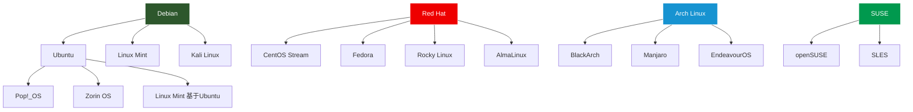

## 一、Linux历史与哲学

要真正理解Linux，不能只学命令和配置。你必须理解它从哪里来、为什么是今天这个样子。Linux的每一个设计决策——从"一切皆文件"到权限模型的哲学——都有历史根源。对于安全研究者而言，这种理解尤其重要：当你知道一个系统为什么这样设计，你才能预测它在哪里会出问题。

### 1.1 前Linux时代：Unix与操作系统战争

#### 1.1.1 Unix的诞生（1969）

Linux不是一个凭空出现的项目，它的血脉可以追溯到1969年贝尔实验室（Bell Labs）的Unix。

1969年，Ken Thompson和Dennis Ritchie在一台被淘汰的PDP-7小型机上，用汇编语言写出了Unix的第一个版本。当时他们正在进行一个名为Multics（多路信息与计算服务）的宏大项目，但该项目因过于复杂而被贝尔实验室放弃。Thompson从Multics的失败中提炼出了一个关键教训：**操作系统应该简单、可组合，而不是追求大而全。**

这个教训直接影响了Unix的设计哲学，也最终传递给了Linux。

Unix的几个革命性设计思想：

- **一切皆文件**（Everything is a file）：硬件设备、进程信息、网络连接都通过文件接口访问，简化了编程模型
- **小工具组合**（Small tools that compose）：每个程序只做一件事，通过管道（pipe）组合完成复杂任务
- **纯文本为通用接口**：程序之间通过文本流通信，而不是私有的二进制格式
- **层次化文件系统**：统一的树形目录结构，所有资源挂载在同一棵树下

#### 1.1.2 Unix的分裂与商业化

1973年，Dennis Ritchie用C语言重写了Unix内核——这是操作系统史上的里程碑事件。C语言的可移植性意味着Unix不再绑定特定硬件，可以移植到不同的计算机架构上。

1975年，AT&T（贝尔实验室的母公司）开始将Unix以"仅提供源码，不提供支持"的方式分发给大学，收取约200美元的象征性费用。这使得Unix在学术界迅速传播，伯克利的BSD（Berkeley Software Distribution）成为最重要的学术分支。

然而到了1980年代，Unix陷入了商业化泥潭：

| 年份 | 事件 | 影响 |
|------|------|------|
| 1982 | AT&T发布System III，开始商业化Unix | 学术界免费使用Unix的时代结束 |
| 1983 | AT&T发布System V Release 1 | 与BSD形成两大阵营 |
| 1984 | AT&T被拆分，Unix版权归属引发争议 | Unix碎片化加剧 |
| 1985 | UNIX商标归X/Open所有 | 标准化之争开始 |
| 1989 | USL（Unix System Laboratories）成立 | AT&T将Unix商业化推向极致 |
| 1992 | USL起诉BSDi（BSD商业版） | BSD开发陷入长达数年的法律纠纷 |

这场Unix战争的后果是灾难性的：厂商各自为战，互不兼容的Unix变体（Solaris、HP-UX、AIX、IRIX……）形成了封闭的商业生态。对于普通用户和开发者而言，一个可以自由使用、修改、分发的操作系统变得遥不可及。

#### 1.1.3 MINIX：学术界的替代品

1987年，荷兰阿姆斯特丹自由大学的Andrew S. Tanenbaum教授编写了MINIX——一个用于教学目的的类Unix操作系统。MINIX运行在当时流行的IBM PC兼容机上，源码公开在Tanenbaum的教科书《操作系统：设计与实现》中。

MINIX的意义在于：

- 它证明了在个人电脑上运行一个类Unix系统是完全可行的
- 它的源码公开，学生可以阅读和学习操作系统内部实现
- 它启发了包括Linus Torvalds在内的整整一代操作系统开发者

但MINIX有一个关键限制：**Tanenbaum坚持MINIX是一个教学工具，不愿意接受大量的外部贡献来将其发展为一个生产级操作系统。**源码虽然公开，但修改和分发受到限制。这个决定成为了后来著名的"Tanenbaum-Torvalds辩论"的伏笔。

### 1.2 GNU项目：自由软件的拼图

#### 1.2.1 Richard Stallman与自由软件运动

1983年，MIT人工智能实验室的Richard Stallman发起了GNU（GNU's Not Unix）项目，目标是创建一个完全自由的类Unix操作系统。

Stallman的动机源于一个具体的事件：他想修改一台打印机的驱动程序以添加卡纸通知功能，但厂商拒绝提供源码。这让他意识到**软件自由不是一个抽象的哲学问题，而是关乎用户能否控制自己计算机的实际问题**。

GNU项目陆续开发出了大量关键组件：

| 组件 | 作用 | 至今的地位 |
|------|------|------------|
| GCC（GNU Compiler Collection） | C/C++编译器 | 仍然是Linux世界最主流的编译器 |
| GNU Bash | Shell命令行解释器 | 几乎所有Linux发行版的默认Shell |
| GNU Coreutils | ls、cp、mv、cat等基础命令 | Linux用户每天使用的命令都来自这里 |
| GNU Emacs | 文本编辑器 | 仍然有庞大的用户群体 |
| GNU Make | 构建工具 | 仍然是C/C++项目的标准构建系统 |
| GDB | 调试器 | 安全研究者进行逆向分析的核心工具 |
| GNU C Library（glibc） | C标准库 | 大多数Linux发行版的底层运行时 |

#### 1.2.2 缺失的拼图：内核

到1990年代初，GNU项目已经拥有了一个完整操作系统所需的几乎所有组件——编译器、Shell、文本工具、库函数、编辑器、调试器。唯独缺少一个关键组件：**内核**。

GNU自己的内核项目Hurd（基于Mach微内核架构）一直在开发中，但进展缓慢。Hurd的设计过于理想化——它采用了多服务器架构，每个系统服务运行在独立的地址空间中，通过消息传递通信。这种设计虽然理论上更安全、更灵活，但工程复杂度远超预期。

讽刺的是，GNU项目花了十几年都没能完成的内核，被一个芬兰大学生在几个月内用另一种方式实现了。

#### 1.2.3 自由软件 vs 开源软件

理解Linux的哲学背景，必须区分两个经常被混淆的概念：

**自由软件**（Free Software）——Richard Stallman/Four Free Software Foundation倡导

核心是**用户的自由**，而非价格。Stallman的"自由"有四层含义：

1. **使用自由**：可以出于任何目的运行软件
2. **研究自由**：可以访问源码，理解软件如何工作
3. **修改自由**：可以修改源码，使软件按自己的意愿运行
4. **分发自由**：可以将原始版本或修改后的版本分享给他人

Stallman坚持用"Free Software"（自由软件）而非"Open Source"（开源软件），因为前者强调的是道德立场和用户权利，后者听起来只是一个开发方法论。

**开源软件**（Open Source）——Eric Raymond/Bruce Perens/OSI倡导

1998年，Netscape宣布开放浏览器源码（后来发展为Firefox），一批开发者（包括Eric Raymond）认为"自由软件"这个名称对企业不友好，创造了"开源"这个术语。开源的侧重点是**工程实践**：公开源码能带来更好的软件质量、更快的Bug修复、更多的创新。

**对于安全研究者而言，两者都有价值**：

- 自由软件哲学确保了你有权审计任何运行在你系统上的代码——这是安全研究的基础
- 开源的工程实践意味着全球数千双眼睛在审查代码，安全漏洞被发现和修复的速度更快

在实践中，大多数人（包括Linus Torvalds本人）对两者不作严格区分。但理解这个区别有助于你理解开源社区中一些看似奇怪的争论（比如为什么有人坚持叫"GNU/Linux"而不只是"Linux"）。

### 1.3 Linux的诞生与崛起

#### 1.3.1 Linus Torvalds与那封改变世界的邮件

1991年，21岁的Linus Torvalds是赫尔辛基大学计算机科学系的学生。他买了一台搭载Intel 386处理器的PC，想在上面运行Unix。但商业Unix太贵（学生买不起），MINIX的功能又不够用。

于是他开始写自己的操作系统内核。

1991年8月25日，Linus在comp.os.minix新闻组发布了那封著名的帖子：

```text
From: torvalds@klaava.Helsinki.FI (Linus Benedict Torvalds)
Newsgroups: comp.os.minix
Subject: What would you like to see most in minix?
Summary: small poll for my new operating system
Date: 25 Aug 91 20:57:08 GMT

Hello everybody out there using minix -

I'm doing a (free) operating system (just a hobby, won't be big and
professional like gnu) for 386(486) AT clones.  This has been brewing
since april, and is starting to get ready.  I'd like any feedback on
things people like/dislike in minix, as my OS resembles it somewhat
(same physical layout of the file-system (due to practical reasons)
among other things).

I've currently ported bash(1.08) and gcc(1.40), and things seem to work.
This implies that I'll get something practical within a few months, and
I'd like to know what features most people would want.  Any suggestions
are welcome, but I won't promise I'll implement them :-)

                Linus (torvalds@kruuna.helsinki.fi)

PS.  Yes - it's free of any minix code, and it has a multi-threaded fs.
It is NOT protable (uses 386 task switching etc), and it probably never
will support anything other than AT-harddisks, as that's all I have :-(.
```

注意最后一句话："just a hobby, won't be big and professional like gnu"——"只是个爱好，不会像GNU那样大而专业"。三十多年后回看，这是计算机史上最谦虚的误判。

#### 1.3.2 从0.01到1.0：快速成熟

Linux内核的发展速度惊人：

| 版本 | 日期 | 里程碑 |
|------|------|--------|
| 0.01 | 1991年9月 | 第一个可运行的版本，约10,000行代码 |
| 0.02 | 1991年10月 | Linus自己开始用Linux开发Linux |
| 0.12 | 1992年1月 | 切换到GPL许可证——这是决定Linux命运的关键决策 |
| 0.95 | 1992年3月 | 首次能运行X Window系统 |
| 0.96 | 1992年5月 | 网络支持加入 |
| 1.0 | 1994年3月 | 第一个正式稳定版，约176,250行代码 |
| 2.0 | 1996年6月 | 支持多处理器（SMP） |
| 2.2 | 1999年1月 | 改进的网络栈和SMP支持 |
| 2.4 | 2001年1月 | USB支持、LVM、ACL |
| 2.6 | 2003年12月 | 可抢占内核、O(1)调度器、64位支持 |

**选择GPL许可证是Linux成功的关键转折点。**在0.12版本之前，Linus的许可证禁止商业分发。切换到GPL意味着任何人都可以自由使用、修改和分发Linux，但修改后的版本也必须以GPL发布（"传染性"）。这创造了一个正反馈循环：开发者贡献代码→更多人使用→更多开发者贡献代码。

#### 1.3.3 Tanenbaum-Torvalds辩论（1992）

1992年初，Andrew Tanenbaum在comp.os.minix上发起了与Linus Torvalds的一场公开辩论，主题是：**Linux的宏内核设计是否是一个根本性的错误？**

Tanenbaum的观点：
- Linux使用了过时的宏内核（monolithic kernel）架构
- 微内核（microkernel）才是未来，它更模块化、更可靠
- Linux绑定x86架构的做法是短视的
- "写一个新的宏内核在1991年就像是把一颗好牙拔掉换回一颗蛀牙"

Linus的回应：
- 微内核的性能开销在实际使用中是不可接受的
- "理论是美丽的，但现实世界不讲道理"
- Linux已经在实际使用中证明了宏内核的可行性
- 代码的实用性比理论的纯洁性更重要

这场辩论至今仍在继续——现代操作系统设计中，宏内核（Linux）、微内核（seL4、QNX）、混合内核（Windows NT、macOS XNU）各有拥趸。对于安全研究者而言，理解这两种架构的差异至关重要：

```text
宏内核（Linux）:
┌─────────────────────────────────────────┐
│            用户空间 (User Space)          │
│  应用程序 ←→ 系统调用接口 (System Call)   │
├─────────────────────────────────────────┤
│            内核空间 (Kernel Space)        │
│  进程管理 │ 内存管理 │ 文件系统 │ 网络栈  │
│  设备驱动 │ 安全模块 │ 调度器   │ IPC     │
│           所有模块共享内核地址空间          │
└─────────────────────────────────────────┘

微内核:
┌─────────────────────────────────────────┐
│            用户空间 (User Space)          │
│  进程管理服务 │ 文件系统服务 │ 驱动服务   │
│  网络服务    │ 安全服务    │ 各自独立进程  │
├─────────────────────────────────────────┤
│       微内核 (极小的核心: 调度+IPC)        │
└─────────────────────────────────────────┘
```

**安全意义**：宏内核中，一个有漏洞的驱动可以破坏整个内核的内存空间。微内核中，驱动崩溃只影响它自己的进程，不会波及内核核心。但宏内核的性能更好，模块间通信更高效——这正是Linux选择宏内核并用LSM（Linux Security Modules）框架弥补安全不足的原因。

#### 1.3.4 大教堂与集市

1997年，Eric S. Raymond发表了论文《大教堂与集市》（The Cathedral and the Bazaar），这是开源运动最重要的理论文献之一。

Raymond用两个隐喻描述了两种软件开发模式：

**大教堂模式**（Cathedral Model）：
- 源码在发布时才公开
- 开发过程由一个小的、封闭的团队控制
- 每个版本都经过精心设计和严格测试
- 代表：GCC、Emacs（早期）、商业软件

**集市模式**（Bazaar Model）：
- 开发过程完全公开，代码频繁提交
- 大量贡献者并行工作，没有中央控制
- "足够多的眼睛，就能让所有Bug浮出水面"（Linus法则）
- 代表：Linux内核、Apache、Mozilla

Raymond的核心论点是：**在集市模式下，软件的质量可以超过大教堂模式**，前提是有一个好的维护者（他称之为"仁慈独裁者"）来整合贡献。

Linus Torvalds就是Linux内核的"仁慈独裁者"（Benevolent Dictator For Life，BDFL）。他不写大部分代码，但他决定哪些代码被接受，哪些被拒绝。这种治理模式一直延续到今天。

### 1.4 Unix哲学：安全研究者的思维方式

Unix哲学不是一套写在官方文档里的标准，而是从几十年实践中自然形成的工程文化。Eric Raymond在《Unix编程艺术》（The Art of Unix Programming）中将其总结为17条原则。对于安全研究者而言，以下几条最为关键：

#### 1.4.1 做一件事，并做好它（Do One Thing and Do It Well）

每个Unix程序应该专注于一个功能，而不是试图包办一切。这条原则的直接产物就是Unix/Linux的命令行工具生态：

```bash
# 每个工具只做一件事，通过管道组合
cat /var/log/auth.log | grep "Failed password" | awk '{print $11}' | sort | uniq -c | sort -rn | head -10
```

这条命令统计SSH暴力破解中最常见的来源IP。它由6个工具组合而成——`cat`（读取文件）、`grep`（过滤行）、`awk`（提取字段）、`sort`（排序）、`uniq`（去重计数）、`head`（取前N行）——每个工具都很简单，但组合起来可以完成复杂的安全分析任务。

**安全研究启示**：在进行渗透测试或应急响应时，不要试图找一个"万能工具"。学会组合简单工具，往往比依赖单一复杂工具更灵活、更可靠。

#### 1.4.2 一切皆文件（Everything is a File）

Linux将几乎所有资源抽象为文件接口：

```bash
# 进程信息是文件
cat /proc/self/status        # 当前进程的状态
cat /proc/1/cmdline           # PID 1的命令行参数
ls -la /proc/self/fd/         # 当前进程打开的所有文件描述符

# 设备是文件
cat /dev/random | xxd | head  # 读取随机数生成器
echo 1 > /sys/class/leds/led0/brightness  # 控制硬件LED

# 网络信息是文件
cat /proc/net/tcp              # 当前的TCP连接
cat /proc/net/arp              # ARP缓存表
```

**安全研究启示**：`/proc`和`/sys`是Linux安全研究的金矿。攻击者可以通过读取`/proc/<pid>/maps`获取进程的内存布局，通过`/proc/<pid>/mem`读写进程内存。防御者同样通过这些接口监控异常行为。在后面的章节中，我们会反复回到这个概念。

#### 1.4.3 避免"捕获式"用户接口

Unix程序倾向于接受命令行参数和管道输入，而非交互式的菜单驱动界面。这使得Unix工具可以被脚本化——而**脚本化能力是自动化安全测试的基础**。

```bash
# 这种管道组合在Windows CMD中几乎不可能实现
# 在Linux中，安全分析的日常就是这种一行命令
ss -tulnp | grep LISTEN | awk '{print $5, $6}' | sort
```

#### 1.4.4 沉默即金（Silence is Golden）

Unix程序在成功时应该什么都不输出——只有在出错时才产生消息。这个原则的实践意义是：**如果一个命令没有输出，说明一切正常。**这在安全监控中尤为重要——你希望只在检测到异常时收到告警，而不是每秒钟都收到一条"一切正常"的消息。

### 1.5 Linux发行版生态

#### 1.5.1 什么是发行版

Linux内核本身不是一个完整的操作系统。一个可使用的Linux系统至少需要：

- **Linux内核**：核心，管理硬件和系统资源
- **GNU工具**：Shell、文件操作命令、编译器等用户空间工具
- **初始化系统**：引导系统启动的服务管理器（现代为systemd）
- **包管理系统**：安装、更新、卸载软件的工具
- **桌面环境**（可选）：图形界面

**发行版**（Distribution）就是将以上组件打包在一起，加上自己的配置、工具和默认设置，形成的可安装操作系统。目前活跃的Linux发行版超过600个，但它们可以归入几个主要的"家族"。

#### 1.5.2 主要发行版家族



**包管理器对比**：

| 家族 | 包格式 | 包管理器 | 典型发行版 |
|------|--------|----------|------------|
| Debian系 | `.deb` | apt、dpkg | Ubuntu、Debian、Kali |
| Red Hat系 | `.rpm` | dnf（旧:yum）、rpm | Fedora、Rocky、AlmaLinux |
| Arch系 | `.pkg.tar.zst` | pacman | Arch、BlackArch、Manjaro |
| SUSE系 | `.rpm` | zypper | openSUSE、SLES |

#### 1.5.3 安全领域专用发行版

以下发行版在安全研究中使用频率最高，建议逐一了解其定位和特点：

**Kali Linux**

Kali是Offensive Security公司维护的渗透测试发行版，基于Debian Testing分支。它预装了600+安全工具，涵盖信息收集、漏洞分析、Web应用测试、密码攻击、逆向工程、无线攻击等类别。Kali是目前渗透测试认证考试（如OSCP）的标准平台。

```bash
# Kali的工具分类（安装后可直接查看）
ls /usr/share/                # 工具安装目录
apt list --installed | wc -l  # 查看已安装的软件包数量
```

**BlackArch Linux**

基于Arch Linux的安全发行版，工具数量超过2800个，比Kali更全面。BlackArch的优势在于滚动更新（永远使用最新版软件）和Arch Linux的极简哲学（没有预装你不需要的东西）。劣势是对Linux新手不够友好。

**Parrot Security OS**

基于Debian的安全发行版，同时提供安全工具和日常使用的软件（办公套件、浏览器等）。它的资源需求比Kali更低，适合在虚拟机或低配硬件上运行。Parrot还提供了Home版（日常使用）和Cloud版（云环境）。

**REMnux**

专注于恶意软件分析和逆向工程的发行版。预装了Volatility（内存取证）、YARA（恶意软件特征匹配）、Flare-VM工具集等。如果你的工作涉及恶意软件分析，REMnux是比Kali更好的选择。

**Tails**

Tails（The Amnesic Incognito Live System）是一个注重隐私和匿名性的Live发行版。所有网络流量强制通过Tor路由，系统关闭后不保留任何数据。它从USB启动，不在硬盘上留下痕迹。Edward Snowden在揭露NSA监控时使用的就是Tails。

**对安全研究者的建议**：不要只用一个发行版。建议在日常工作中使用Ubuntu Server或Debian（熟悉服务器环境），同时保留一个Kali虚拟机（用于安全工具）。随着经验增长，根据具体需求添加其他专用发行版。

#### 1.5.4 如何选择第一个发行版

对于网络安全方向的学习者，推荐的起步路径：

| 你的背景 | 推荐发行版 | 理由 |
|----------|------------|------|
| 完全零基础 | Ubuntu 22.04 LTS | 社区最大、教程最多、遇到问题最容易找到答案 |
| 有一些命令行经验 | Debian 12 | Ubuntu的上游，更贴近真实服务器环境 |
| 想直接学安全 | Kali Linux | 工具开箱即用，但建议同时准备一个普通发行版 |
| 想深入理解Linux | Arch Linux | 手动安装过程会让你学到系统架构的每个组件 |

**不要犯的错误**：
- 不要一开始就用Kali作为日常系统。Kali以root用户运行，不适合日常使用，而且很多安全工具你不认识也没必要认识
- 不要花太多时间纠结"最好的发行版"。发行版之间的差异远小于你以为的那么大——学会一个，切换到另一个只需要适应包管理器和默认配置的差异

### 1.6 Linux的今日版图

#### 1.6.1 内核开发的现状

截至2025年，Linux内核已经成为人类历史上最大的协作软件项目之一：

- **代码规模**：超过3000万行代码（含注释和文档）
- **贡献者**：超过20,000名开发者参与过贡献
- **开发节奏**：每2-3个月发布一个新的内核版本
- **维护者**：超过4,000名活跃维护者负责不同的子系统
- **公司贡献**：Intel、Google、Red Hat、AMD、Linaro、Meta是最大的公司贡献者

内核源码结构：

```text
linux/
├── arch/          # 架构相关代码（x86、ARM、RISC-V等）
├── block/         # 块设备I/O层
├── drivers/       # 设备驱动（最大的子目录）
├── fs/            # 文件系统实现
├── include/       # 头文件
├── init/          # 内核初始化代码
├── kernel/        # 核心子系统（调度、信号、时间等）
├── lib/           # 内核库函数
├── mm/            # 内存管理
├── net/           # 网络协议栈
├── security/      # 安全模块（SELinux、AppArmor等）
├── scripts/       # 构建和配置脚本
├── sound/         # 音频子系统
├── tools/         # 用户空间工具（perf、bpf等）
└── virt/          # 虚拟化支持（KVM）
```

#### 1.6.2 Linux在各领域的统治地位

Linux不是一个"替代品"或"备选项"——在大多数计算领域，它是事实上的标准：

| 领域 | Linux份额 | 代表案例 |
|------|-----------|----------|
| 公有云 | 90%+ | AWS、Azure、GCP的虚拟机几乎都运行Linux |
| 超级计算机 | 100% | TOP500全部运行Linux（自2017年起） |
| Web服务器 | 70%+ | Nginx、Apache在Linux上部署最多 |
| Android | 100% | 30亿+活跃设备的底层是Linux内核 |
| 嵌入式/IoT | 主流 | 路由器、智能电视、车载系统、工业控制器 |
| 容器/云原生 | 99%+ | Docker、Kubernetes、整个CNCF生态 |
| 渗透测试 | 100% | Kali、Parrot、BlackArch |
| 网络安全设备 | 90%+ | 防火墙、IDS/IPS、SIEM几乎都基于Linux |

**这意味着**：你攻击的目标大概率运行Linux，你使用的攻击工具运行Linux，你分析的日志来自Linux，你构建的防御体系也运行在Linux上。不精通Linux的安全研究者，就像不懂英语的国际外交官。

### 1.7 开源对安全研究的深远影响

#### 1.7.1 透明性是安全的基石

闭源操作系统的安全模型建立在"隐匿式安全"（Security through Obscurity）之上——假设攻击者不知道代码细节，因此难以发现漏洞。这个假设在实践中被反复证伪：

- Windows的闭源内核中仍然不断发现严重漏洞（永恒之蓝、PrintNightmare、HiveNightmare）
- 黑客社区通过逆向工程和Fuzzing发现的漏洞数量，并不比开源项目少

开源的安全优势不是"没有人能找到漏洞"，而是"更多人能找到漏洞，并且修复速度更快"。Linux内核的安全漏洞从发现到修复的中位时间通常在几天到几周内，而闭源系统的补丁周期往往以月计算。

#### 1.7.2 开源对安全研究者的具体价值

对于安全研究者，开源带来了以下实际好处：

**学习方面**：你可以直接阅读内核源码来理解安全机制的实现。想了解SELinux是如何做访问控制的？直接看`security/selinux/`目录。想理解系统调用是如何被过滤的？看`kernel/seccomp.c`。这种学习深度在闭源系统中是不可能的。

**工具方面**：安全工具的源码公开意味着你可以审计工具本身的安全性。在渗透测试中，你不能盲目信任一个闭源工具——它可能在悄悄收集你的数据。而开源工具可以被完全审计。

**定制方面**：你可以修改内核来创建定制的安全环境。比如：
- 编译自定义内核，启用或禁用特定的安全模块
- 修改内核参数来增强安全检测能力
- 使用eBPF在内核中动态插入安全监控代码（本书深度拓展章节会详细介绍）

#### 1.7.3 安全研究中的"道德责任"

开源赋予了你深入研究系统的自由，但这不意味着你可以用这些知识做任何事情。在使用Linux进行安全研究时，牢记以下原则：

1. **只在授权范围内测试**：未经授权的渗透测试是犯罪行为，无论你使用的是开源还是闭源工具
2. **负责任地披露漏洞**：发现Linux内核漏洞后，应通过security@kernel.org报告，而不是在社交媒体上公开
3. **尊重GPL许可证**：如果你修改了Linux内核代码并分发，必须遵守GPL条款公开你的修改
4. **不将开源工具武器化**：Metasploit等工具是为合法渗透测试设计的，将其用于攻击未授权系统是违法行为

### 1.8 本节小结

| 知识点 | 核心要点 | 安全研究意义 |
|--------|----------|-------------|
| Unix历史 | 1969年贝尔实验室，一切皆文件，小工具组合 | 理解Linux设计决策的根源 |
| GNU项目 | 1983年Stallman发起，缺少内核，GPL许可证 | 理解开源许可对安全研究的影响 |
| Linux诞生 | 1991年Linus Torvalds，从MINIX到自研内核 | 宏内核设计的安全利弊 |
| 大教堂vs集市 | 开放开发模式，Linus法则 | 开源安全工具的可信度 |
| Unix哲学 | 做一件事做好、一切皆文件、管道组合 | 安全工具链的思维方式 |
| 发行版 | 家族体系，安全专用发行版 | 选择合适的安全研究平台 |

**下一节预览**：理解了Linux的历史和哲学后，下一节我们将深入Linux系统架构——内核空间与用户空间的边界在哪里？系统调用是如何工作的？这个边界的每一个设计决策都直接关系到安全攻防。