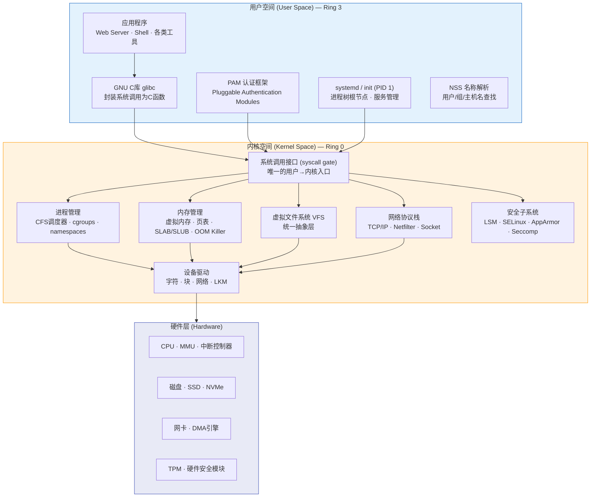
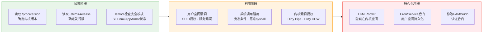

## 二、Linux系统架构

理解Linux系统架构是安全攻防的根基。攻击者需要知道自己的恶意代码在哪里执行、如何与内核交互；防御者需要知道攻击面在哪里、如何在正确的层级施加约束。本节从安全视角完整拆解Linux的三层架构，从硬件到用户空间逐层分析其安全含义。

### 2.1 架构全景图

Linux采用经典的三层架构：硬件层、内核空间、用户空间。这三层之间有严格的边界，内核空间是整个系统的"守门人"——所有对硬件的访问都必须经过内核。



**关键安全边界**：用户空间运行在 Ring 3（低权限），内核空间运行在 Ring 0（最高权限）。从 Ring 3 到 Ring 0 的唯一合法通道是系统调用。任何绕过系统调用直接操作内核内存的行为，都是提权攻击的核心手法。

### 2.2 内核（Kernel）

Linux内核是单体内核（Monolithic Kernel），但通过可加载内核模块（LKM）机制获得了模块化能力。内核代码运行在最高特权级，可以直接操作所有硬件资源——这意味着内核中的任何一个bug都可能是提权漏洞。

#### 2.2.1 进程管理

进程是Linux中资源分配的基本单位。内核负责进程的创建、调度、通信和销毁。

**CFS调度器（Completely Fair Scheduler）**

Linux默认使用CFS调度器。CFS的核心思想是"完全公平"——它使用红黑树维护所有可运行进程的`vruntime`（虚拟运行时间），每次选择`vruntime`最小的进程执行。实际的CPU时间分配基于进程的nice值（-20到19，值越小优先级越高）。

```bash
# 查看进程调度策略
chrt -p $$                  # 查看当前shell的调度策略
# SCHED_OTHER (普通CFS调度), SCHED_FIFO, SCHED_RR (实时调度)

# 修改进程优先级
nice -n 10 ./heavy_task     # 以较低优先级启动
renice -5 -p 1234           # 修改已运行进程的nice值

# 实时调度（需要root权限，对安全有影响）
chrt -f 99 ./critical_task  # SCHED_FIFO, 优先级99
```

**安全含义**：攻击者可以通过设置实时调度策略（`SCHED_FIFO`/`SCHED_RR`）抢占CPU资源，实施拒绝服务攻击。内核参数`/proc/sys/kernel/sched_rt_runtime_us`限制实时进程最多占用95%的CPU时间，防止一个实时进程完全饿死其他进程。

**进程状态与生命周期**

Linux进程有以下几种状态：

| 状态 | 标志 | 含义 | 安全关注点 |
|------|------|------|-----------|
| Running (R) | TASK_RUNNING | 正在运行或在运行队列中 | 高CPU占用可能是挖矿 |
| Sleeping (S) | TASK_INTERRUPTIBLE | 可中断睡眠，等待事件 | 正常等待I/O |
| Disk Sleep (D) | TASK_UNINTERRUPTIBLE | 不可中断睡眠，通常等待I/O | 无法被kill -9杀死 |
| Stopped (T) | TASK_STOPPED | 被信号停止（如Ctrl+Z） | 被调试器暂停的进程 |
| Zombie (Z) | EXIT_ZOMBIE | 已终止但父进程未回收 | 大量僵尸进程可能表示攻击痕迹 |
| Traced (t) | | 被ptrace跟踪 | 可能是调试，也可能是攻击 |

```bash
# 查看各状态进程数量
ps aux | awk '{print $8}' | sort | uniq -c | sort -rn
# D状态进程尤其值得关注——它们无法被终止
ps aux | awk '$8 ~ /D/ {print}'  # 列出所有不可中断睡眠的进程
```

**进程间通信（IPC）**

Linux提供多种IPC机制，每种都有不同的安全风险：

| IPC机制 | 速度 | 安全风险 | 典型攻击场景 |
|---------|------|---------|-------------|
| 管道（pipe） | 中 | 权限继承问题 | 竞争条件（TOCTOU） |
| 命名管道（FIFO） | 中 | 文件系统权限控制 | 未授权读写 |
| 信号（signal） | 快 | 可被劫持 | 恶意信号发送杀死进程 |
| 共享内存 | 最快 | 无内置访问控制 | 跨进程数据窃取 |
| 消息队列 | 中 | POSIX权限 | 信息泄露 |
| Socket | 慢 | 完整的网络风险 | 中间人攻击 |
| D-Bus | 中 | 复杂的策略引擎 | 跨进程提权 |

```bash
# 查看系统中的IPC资源
ipcs                          # 查看所有IPC资源（共享内存/消息队列/信号量）
ipcs -m                       # 只看共享内存
ipcs -q                       # 只看消息队列
ipcs -s                       # 只看信号量

# 查看已删除但仍被占用的文件（可能是恶意进程隐藏）
ls -la /proc/*/fd 2>/dev/null | grep '(deleted)'
```

**PID 1——init/systemd**

PID 1是所有用户空间进程的祖先。在现代发行版中，systemd承担了init的角色。对攻击者而言，控制PID 1等于控制整个用户空间：

```bash
# systemd是用户空间的"上帝进程"
pstree -p 1 | head -20        # 查看进程树

# systemd管理的服务单元
systemctl list-units --type=service --state=running  # 运行中的服务
systemctl cat sshd.service    # 查看服务的完整配置

# 安全：systemd的权限隔离能力
# 以下配置可以大幅限制服务的攻击面
cat <<'EOF'
[Service]
ProtectSystem=strict          # / 只读
ProtectHome=true              # /home 不可见
PrivateTmp=true               # 独立的/tmp
NoNewPrivileges=true          # 禁止提权
CapabilityBoundingSet=CAP_NET_BIND_SERVICE  # 仅保留必要能力
SystemCallFilter=@system-service  # seccomp白名单
EOF
```

#### 2.2.2 内存管理

Linux的内存管理是整个系统中最复杂、也是漏洞最密集的子系统。理解内存管理对漏洞利用和防御都至关重要。

**虚拟内存模型**

每个进程拥有独立的虚拟地址空间（64位系统上通常为256TB）。虚拟地址通过MMU（内存管理单元）和页表映射到物理地址。这个映射过程由内核管理，用户态代码无法直接操作页表。

```bash
# 查看进程内存布局
cat /proc/self/maps           # 当前进程的内存映射
# 典型输出:
# 00400000-0048c000 r-xp  ...  /usr/bin/bash     ← 代码段(只读+执行)
# 0068c000-0068d000 r--p  ...  /usr/bin/bash     ← 只读数据
# 0068d000-00696000 rw-p  ...  /usr/bin/bash     ← 可读写数据
# 7f1234000000-7f12341c0000 r-xp ... /lib/libc.so  ← 共享库代码
# 7fff12340000-7fff12361000 rw-p ... [stack]      ← 栈
# ffffffffff600000-ffffffffff601000 --xp ... [vsyscall] ← 内核映射

# 关键安全概念：
# NX (No-eXecute): 标记数据页不可执行，防御shellcode注入
# ASLR: 随机化内存布局，增加漏洞利用难度
# Stack Canary: 栈保护值，检测栈溢出
```

**页表与内存保护**

页表项中包含权限位：读(R)、写(W)、执行(X)。这些权限位是硬件强制执行的，内核通过控制页表来实现内存保护。常见的攻击手法如ROP（Return-Oriented Programming）就是利用已有代码段中的指令片段来绕过NX保护。

```bash
# 检查ASLR状态
cat /proc/sys/kernel/randomize_va_space
# 0 = 关闭（完全不随机化，调试用）
# 1 = 部分随机化（栈、共享库、vdso随机化）
# 2 = 完全随机化（默认，包含brk分配的堆）

# 安全加固：确保ASLR开启
echo 2 > /proc/sys/kernel/randomize_va_space

# 检查单个进程的内存安全特性
cat /proc/<pid>/status | grep -i seccomp  # seccomp状态
readelf -l /usr/bin/cat | grep GNU_STACK  # 检查NX位
# 如果显示 RWE 表示栈可执行（危险！）
# 如果显示 RW  表示栈不可执行（安全）
```

**OOM Killer（Out of Memory Killer）**

当系统内存耗尽且无法回收时，内核的OOM Killer会选择一个进程杀死。选择依据是`oom_score`——得分越高的进程越可能被杀：

```bash
# 查看进程的OOM分数
cat /proc/1234/oom_score      # 当前分数（越高越可能被杀）
cat /proc/1234/oom_score_adj  # 调整值（-1000到1000）

# 保护关键进程不被OOM杀死
echo -1000 > /proc/$(pidof sshd)/oom_score_adj

# 攻击者可能利用OOM Killer
# 通过大量消耗内存触发OOM，杀死安全监控进程
# 防御：为安全进程设置 oom_score_adj = -1000

# 监控OOM事件
dmesg | grep -i "out of memory\|oom" | tail -5
journalctl -k | grep -i oom | tail -5
```

**内核内存分配器（SLAB/SLUB）**

内核使用SLAB/SLUB分配器管理内核对象的内存。SLUB是当前默认分配器。攻击者通过堆喷射（Heap Spraying）和Use-After-Free等技术利用分配器的特性来实现内核提权：

```bash
# 查看SLAB分配器状态
cat /proc/slabinfo | head -20
slabtop                       # 实时监控SLAB使用情况

# 关注这些高频分配的内核对象（常见攻击目标）
cat /proc/slabinfo | grep -E "task_struct|cred|dentry|inode|kmalloc"
# task_struct: 进程描述符，伪造可实现提权
# cred: 凭证结构体，覆盖uid/gid为0即提权
```

#### 2.2.3 虚拟文件系统（VFS）

VFS是内核中的一层抽象，为所有文件系统提供统一的接口。无论底层是ext4、XFS、procfs还是sysfs，应用程序都通过相同的`open()`/`read()`/`write()`系统调用来操作。

```bash
# 查看当前挂载的文件系统及其类型
df -T                         # 简要信息
mount | column -t             # 完整挂载信息
findmnt                       # 树形展示挂载关系

# 安全相关的特殊文件系统
# /proc — 进程和内核信息的虚拟文件系统
ls /proc/self/                # 当前进程的信息
cat /proc/sys/kernel/randomize_va_space  # 读取内核参数

# /sys — 设备和内核配置的虚拟文件系统
ls /sys/class/net/            # 列出网络接口
cat /sys/module/*/version     # 内核模块版本

# /dev — 设备文件
ls -la /dev/sd*               # 块设备
ls -la /dev/tty*              # 终端设备
```

**procfs和sysfs的安全意义**

`/proc`和`/sys`暴露了大量内核内部信息，对攻击者来说是极佳的信息收集源：

```bash
# /proc 信息收集示例
cat /proc/version             # 内核版本（定位漏洞）
cat /proc/cpuinfo             # CPU信息（判断架构和漏洞适用性）
cat /proc/meminfo             # 内存信息
cat /proc/net/tcp             # TCP连接表（隐藏连接检测）
cat /proc/net/arp             # ARP缓存（网络拓扑发现）
cat /proc/<pid>/cmdline       # 进程命令行参数
cat /proc/<pid>/environ       # 进程环境变量（可能含密码/密钥）
cat /proc/<pid>/maps          # 进程内存映射（绕过ASLR的线索）

# /sys 信息收集
cat /sys/class/dmi/id/product_name  # 机器型号（判断是否虚拟机）
cat /sys/hypervisor/type            # 虚拟化类型
cat /sys/kernel/security/lsm        # 启用的安全模块
```

安全加固应考虑限制对`/proc`和`sysfs`的访问。容器环境中通常通过挂载选项和namespace隔离来限制暴露范围。

#### 2.2.4 设备驱动

设备驱动运行在内核空间，拥有最高权限。一个有漏洞的驱动等于在内核中打开了一个后门。

**设备文件类型**

| 类型 | 标识 | 访问方式 | 示例 | 安全风险 |
|------|------|---------|------|---------|
| 字符设备 | c | 逐字节流式访问 | /dev/tty, /dev/null, /dev/urandom | 未授权终端访问 |
| 块设备 | b | 按块随机访问 | /dev/sda, /dev/nvme0n1 | 直接磁盘读写绕过文件权限 |
| 网络设备 | 无设备文件 | 通过Socket API | eth0, wlan0 | 原始套接字嗅探 |
| 伪设备 | 多种 | 特殊语义 | /dev/zero, /dev/random | 资源耗尽攻击 |

```bash
# 查看设备信息
ls -la /dev/ | head -30       # 设备文件列表
cat /proc/devices             # 已注册的字符和块设备
cat /proc/interrupts          # 中断分配情况
lspci                         # PCI设备列表
lsusb                         # USB设备列表

# 安全：检查异常设备文件
# 攻击者可能创建恶意设备文件来访问原始磁盘
find / -type b -o -type c 2>/dev/null | grep -v "^/dev/" | head -20
# 如果在/dev/之外发现设备文件，高度可疑！

# 内核模块（可加载内核模块, LKM）
lsmod                         # 已加载模块
modinfo <module>              # 模块详情
cat /proc/modules             # 等效于lsmod

# 安全：恶意内核模块是Rootkit的常见载体
# 攻击者加载LKM来隐藏进程、文件、网络连接
# 防御：
# 1. 禁止加载未签名模块
echo 1 > /proc/sys/kernel/modules_disabled  # 加载后锁定模块
# 2. 检查模块签名
cat /sys/module/*/sig_enforce 2>/dev/null
```

#### 2.2.5 网络协议栈

Linux内核包含完整的TCP/IP协议栈实现，以及Netfilter框架（iptables/nftables的底层引擎）。

```bash
# 网络栈关键内核参数
sysctl net.ipv4.ip_forward              # IP转发（路由器模式）
sysctl net.ipv4.conf.all.accept_redirects  # ICMP重定向（应关闭）
sysctl net.ipv4.conf.all.accept_source_route  # 源路由（应关闭）
sysctl net.ipv4.tcp_syncookies           # SYN Cookie防洪水攻击
sysctl net.ipv4.conf.all.rp_filter       # 反向路径过滤

# Netfilter框架（数据包处理的钩子点）
# PRE_ROUTING → FORWARD → POST_ROUTING  （转发路径）
# PRE_ROUTING → INPUT → LOCAL_PROCESS → OUTPUT → POST_ROUTING  （本地路径）
iptables -L -n -v                        # 查看当前防火墙规则
nft list ruleset                         # nftables等效命令

# 安全：Netfilter是网络防御的核心
# 通过钩子函数可以在数据包路径的五个点上实施过滤和修改
# 内核模块可以在这些钩子上注册回调，这也是Rootkit的常见手法
```

#### 2.2.6 安全子系统

Linux安全子系统基于LSM（Linux Security Module）框架构建，为内核提供强制访问控制（MAC）能力。

**SELinux vs AppArmor 对比**

| 特性 | SELinux | AppArmor |
|------|---------|----------|
| 策略模型 | 基于标签（Label-based） | 基于路径（Path-based） |
| 粒度 | 极细，可控制每个对象 | 中等，基于文件路径 |
| 复杂度 | 高，学习曲线陡峭 | 较低，易于上手 |
| 发行版 | RHEL/CentOS/Fedora 默认 | Ubuntu/SUSE 默认 |
| 策略语言 | M4宏 + TE规则 | 简单的profile文件 |
| 绕过难度 | 较难（标签不依赖路径） | 相对容易（重命名可绕过） |

```bash
# SELinux 检查与操作
getenforce                     # 当前模式: Enforcing/Permissive/Disabled
sestatus                       # 详细状态
ps -eZ | grep httpd           # 查看进程的安全上下文
ls -Z /var/www/html/           # 查看文件的安全上下文
# 上下文格式: user:role:type:level
# 例如: system_u:system_r:httpd_t:s0

# AppArmor 检查与操作
aa-status                      # 当前状态
cat /proc/<pid>/attr/current   # 进程的AppArmor profile
aa-enforce /etc/apparmor.d/usr.sbin.apache2  # 设置强制模式
```

**Seccomp（Secure Computing Mode）**

Seccomp限制进程可以使用的系统调用。Docker、Chrome、systemd等都大量使用seccomp来减少攻击面：

```bash
# 查看进程的seccomp状态
grep Seccomp /proc/self/status
# Seccomp: 2  (2=FILTER模式, 1=STRICT模式, 0=关闭)

# 查看容器的seccomp配置
docker inspect <container> | grep -i seccomp

# seccomp的工作原理：
# 1. 定义系统调用白名单或黑名单
# 2. 当进程调用被禁止的syscall时：
#    - SECCOMP_RET_KILL: 杀死进程
#    - SECCOMP_RET_ERRNO: 返回错误码
#    - SECCOMP_RET_TRACE: 通知ptrace跟踪者
#    - SECCOMP_RET_LOG: 记录日志但允许
#    - SECCOMP_RET_ALLOW: 允许
```

**Linux能力（Capabilities）**

传统的root权限模型是"全有或全无"——root拥有一切权限。Linux能力机制将root权限拆分为细粒度的能力位：

```bash
# 查看常用能力
# CAP_NET_RAW     — 原始套接字（ping、抓包）
# CAP_NET_BIND_SERVICE — 绑定1024以下端口
# CAP_SYS_ADMIN    — 大量系统管理操作（最"危险"的能力）
# CAP_SYS_PTRACE   — 跟踪其他进程（调试器需要）
# CAP_DAC_OVERRIDE — 绕过文件权限检查
# CAP_FOWNER       — 绕过文件所有者检查

# 查看进程的能力
getpcaps $$                    # 当前shell的能力
cat /proc/self/status | grep Cap  # 详细的能力位

# 安全：最小权限原则
# 给服务只分配它需要的能力，而不是完整的root
setcap cap_net_bind_service+ep /usr/sbin/nginx  # 允许nginx绑定80端口
# 之后nginx可以以普通用户运行，仅在绑定端口时提权
```

### 2.3 系统调用（System Call）

系统调用是用户空间与内核空间之间的唯一合法通道。每一次系统调用都涉及一次特权级切换（Ring 3 → Ring 0），这是CPU硬件强制执行的边界。

#### 2.3.1 系统调用工作原理

当用户程序调用一个系统调用时，实际发生的过程如下：

1. 用户程序将系统调用号放入寄存器（x86-64为`rax`），参数放入其他寄存器
2. 执行`syscall`指令（x86-64）或`int 0x80`（x86-32）
3. CPU切换到Ring 0，跳转到内核的系统调用入口
4. 内核根据调用号查`sys_call_table`，执行对应的内核函数
5. 执行完毕后，返回用户空间

```bash
# 使用strace追踪系统调用
strace ls /tmp 2>&1 | head -20
# 典型输出:
# openat(AT_FDCWD, "/tmp", O_RDONLY|O_NONBLOCK|O_CLOEXEC|O_DIRECTORY) = 3
# getdents64(3, /* 15 entries */, 32768) = 528
# write(1, "file1.txt\nfile2.txt\n", 20) = 20

# 统计程序的系统调用
strace -c ls /tmp 2>&1
# 输出每个syscall的调用次数、错误数和耗时

# 使用ltrace追踪库函数调用
ltrace ls /tmp 2>&1 | head -20
```

#### 2.3.2 关键系统调用详解（安全视角）

**进程控制类**

```c
// fork() — 创建子进程
// 返回两次：父进程返回子进程PID，子进程返回0
// 安全关注：fork炸弹 (while true; do fork; done)
// 防御：ulimit -u 限制最大进程数
pid_t pid = fork();

// execve() — 替换当前进程映像
// 这是所有exec家族函数的底层实现
// 安全关注：PATH劫持、环境变量注入
int execve(const char *filename, char *const argv[], char *const envp[]);

// ptrace() — 进程跟踪/调试
// 安全关注：可以读写其他进程的内存和寄存器
// 攻击用法：注入代码到其他进程
// 防御：/proc/sys/kernel/yama/ptrace_scope
//   0 = 任何进程都可以ptrace（危险）
//   1 = 只能ptrace子进程（默认）
//   2 = 只有admin可以ptrace
//   3 = 完全禁止ptrace
```

**文件操作类**

```c
// open() — 打开文件
// 安全关注：竞态条件（TOCTOU攻击）
// 攻击场景：在access()检查和open()之间替换文件
int open(const char *pathname, int flags, mode_t mode);

// 关键标志位的安全含义：
// O_NOFOLLOW — 不跟随符号链接（防止符号链接攻击）
// O_CLOEXEC  — exec时自动关闭fd（防止fd泄露给子进程）
// O_NOCTTY   — 不将设备设为控制终端
// O_TMPFILE  — 创建无名临时文件（避免竞态条件）
```

**网络类**

```c
// socket() — 创建网络端点
// 安全关注：AF_PACKET允许原始数据包收发（嗅探/伪造）
int socket(int domain, int type, int protocol);
// domain: AF_INET(IPv4), AF_INET6(IPv6), AF_UNIX(本地), AF_PACKET(原始)
// type: SOCK_STREAM(TCP), SOCK_DGRAM(UDP), SOCK_RAW(原始)

// bind() — 绑定地址
// 安全关注：绑定0.0.0.0监听所有接口（暴露到公网）
int bind(int sockfd, const struct sockaddr *addr, socklen_t addrlen);
```

#### 2.3.3 系统调用安全机制

**Seccomp-BPF 过滤**

```bash
# 使用seccomp-tools分析Docker容器的seccomp配置
# 安装: gem install seccomp-tools
# seccomp-tools dump <container>

# 编写seccomp过滤器的示例（C代码）
cat <<'EOF'
#include <linux/seccomp.h>
#include <linux/filter.h>
#include <linux/audit.h>
#include <sys/prctl.h>

// 只允许 read, write, exit, exit_group
struct sock_filter filter[] = {
    // 加载系统调用号
    BPF_STMT(BPF_LD | BPF_W | BPF_ABS, offsetof(struct seccomp_data, nr)),
    // 允许 read
    BPF_JUMP(BPF_JMP | BPF_JEQ | BPF_K, __NR_read, 0, 1),
    BPF_STMT(BPF_RET | BPF_K, SECCOMP_RET_ALLOW),
    // 允许 write
    BPF_JUMP(BPF_JMP | BPF_JEQ | BPF_K, __NR_write, 0, 1),
    BPF_STMT(BPF_RET | BPF_K, SECCOMP_RET_ALLOW),
    // 允许 exit
    BPF_JUMP(BPF_JMP | BPF_JEQ | BPF_K, __NR_exit, 0, 1),
    BPF_STMT(BPF_RET | BPF_K, SECCOMP_RET_ALLOW),
    // 禁止其他所有系统调用
    BPF_STMT(BPF_RET | BPF_K, SECCOMP_RET_KILL),
};
EOF
```

**系统调用审计（audit）**

```bash
# 使用auditd监控特定系统调用
auditctl -a always,exit -F arch=b64 -S execve -F uid=0
# 监控所有root执行的execve调用

# 查看审计日志
ausearch -m EXECVE -ts recent
ausearch -k suspicious_syscall  # 按关键字搜索
```

### 2.4 用户空间

用户空间是所有普通应用程序运行的层级。理解用户空间的组成有助于掌握系统服务的安全配置。

#### 2.4.1 GNU核心工具链

GNU项目提供了Linux上最基础的用户空间工具：

```bash
# coreutils — 基本文件和文本操作工具
ls, cp, mv, rm, cat, chmod, chown, ln, mkdir, rmdir, touch,
stat, wc, sort, uniq, cut, paste, tr, tee, head, tail, ...

# findutils — 文件查找
find / -name "*.conf" -perm -o+w 2>/dev/null  # 找所有人可写的配置文件
find / -nouser -o -nogroup 2>/dev/null         # 找无主文件（可疑）

# grep — 文本搜索
grep -r "password" /etc/ 2>/dev/null            # 搜索明文密码

# bash — Shell
# 安全关注点：
# - .bash_history 可能泄露敏感命令
# - HISTFILE 和 HISTCONTROL 环境变量
# - set -o noclobber (防止文件覆盖)
# - shopt -s extglob (增强通配符)
```

#### 2.4.2 glibc——C标准库

glibc是Linux上使用最广泛的C标准库。它将系统调用封装为易用的C函数，同时也提供了线程、动态链接、名称解析等功能。

```bash
# glibc安全特性
# 1. FORTIFY_SOURCE — 编译时和运行时缓冲区溢出检查
#    编译时加上 -D_FORTIFY_SOURCE=2
#    会在运行时检查 memcpy/strcpy 等的长度

# 2. Stack Canary — 栈保护值
#    在栈帧中插入随机值，函数返回时检查是否被修改
#    编译时加上 -fstack-protector-strong

# 3. RELRO (RELocation Read-Only)
#    Partial RELRO: .got段可写（可被GOT覆写攻击）
#    Full RELRO: .got段在启动后只读（防御GOT覆写）

# 检查二进制文件的安全特性
checksec --file=/usr/bin/sudo
# RELRO: Full RELRO      ← 安全
# Stack: Canary found     ← 安全
# NX: NX enabled          ← 安全
# PIE: PIE enabled        ← 安全（ASLR）
# RWX: No RWX segments    ← 安全
```

**glibc版本与漏洞**

glibc历史上出现过多个高危漏洞，如GHOST（CVE-2015-0235，`gethostbyname`缓冲区溢出）和CVE-2023-6246（`__vsyslog_internal`堆溢出）。攻击者经常关注目标系统的glibc版本来选择利用策略：

```bash
# 查看glibc版本
ldd --version               # 方法1
/lib/x86_64-linux-gnu/libc.so.6  # 方法2（直接执行库文件）
strings /lib/x86_64-linux-gnu/libc.so.6 | grep "GNU C Library"
```

#### 2.4.3 系统初始化与服务管理

**systemd深度安全配置**

systemd不仅是init系统，还是整个用户空间的服务管理框架。它的安全特性远超大多数管理员的认知：

```bash
# systemd安全隔离选项（在service unit文件中配置）

# 文件系统保护
ProtectSystem=strict         # / 完全只读
ProtectHome=true             # /home, /root, /run/user 不可见
PrivateTmp=true              # 独立的/tmp和/var/tmp
ReadOnlyPaths=/var/lib/data  # 指定路径只读
InaccessiblePaths=/etc/shadow # 指定路径不可访问

# 内核保护
ProtectKernelTunables=true   # /proc, /sys 只读
ProtectKernelModules=true    # 禁止加载内核模块
ProtectKernelLogs=true       # 禁止访问内核日志
ProtectControlGroups=true    # /sys/fs/cgroup 只读

# 网络限制
RestrictAddressFamilies=AF_INET AF_INET6  # 只允许IPv4/IPv6
IPAddressDeny=any            # 禁止所有IP
IPAddressAllow=10.0.0.0/8   # 允许内网
PrivateNetwork=true          # 完全隔离网络

# 能力限制
CapabilityBoundingSet=CAP_NET_BIND_SERVICE  # 只保留绑定端口的能力
AmbientCapabilities=         # 清空环境能力
NoNewPrivileges=true         # 禁止获取新权限

# 系统调用限制
SystemCallFilter=@system-service  # 白名单模式
SystemCallFilter=~@mount          # 黑名单：禁止挂载相关syscall
SystemCallArchitectures=native    # 只允许本机架构（禁止32位兼容）

# 其他
ProtectClock=true            # 禁止修改系统时间
ProtectHostname=true         # 禁止修改主机名
RestrictRealtime=true        # 禁止实时调度
RestrictSUIDSGID=true        # 禁止创建SUID/SGID文件
MemoryDenyWriteExecute=true  # 禁止W+X内存页
LockPersonality=true         # 锁定执行域
```

```bash
# 使用systemd-analyze检查服务的安全加固程度
systemd-analyze security sshd.service
# 输出0.0-10.0的安全评分，越低越安全
# 详细列出每个安全特性的状态
```

#### 2.4.4 PAM认证框架

PAM（Pluggable Authentication Modules）是Linux的统一认证框架。几乎所有需要认证的程序（login、sudo、sshd、su）都通过PAM进行认证：

```bash
# PAM配置文件位置
ls /etc/pam.d/               # 每个程序独立的PAM配置

# PAM配置行格式：
# type  control  module  [arguments]
# type: auth(认证), account(账户), password(密码), session(会话)

# control值含义：
# required — 必须通过，失败继续检查（最终失败）
# requisite — 必须通过，失败立即返回
# sufficient — 通过则立即成功（如果前面没有required失败）
# optional — 可选

# 安全加固示例：限制sudo尝试次数
# /etc/pam.d/sudo 添加:
# auth    required   pam_faillock.so deny=3 unlock_time=600

# 安全：PAM配置是提权的常见目标
# 攻击者可能修改PAM配置来：
# 1. 添加后门认证模块
# 2. 降低密码复杂度要求
# 3. 记录其他用户的密码
# 检查：对比PAM配置文件的hash
find /etc/pam.d/ -type f -exec md5sum {} \; > /tmp/pam_baseline.txt
```

### 2.5 环环相扣——从架构视角看攻击链

理解系统架构后，我们可以将攻击链映射到架构层级：



**经典攻击路径示例——内核漏洞提权**

以Dirty Pipe（CVE-2022-0847）为例，这个漏洞存在于内核的管道（pipe）子系统中：

```bash
# Dirty Pipe 漏洞原理：
# 1. 管道的pipe_buffer结构有一个flags字段
# 2. PIPE_BUF_FLAG_CAN_MERGE标志表示该缓冲区可以合并写入
# 3. 漏洞在于splice()系统调用在某些情况下不清除这个标志
# 4. 攻击者利用这个标志可以覆盖只读文件（包括SUID文件和/etc/passwd）

# 影响范围：Linux 5.8 到 5.16.11, 5.15.25, 5.10.102
uname -r                     # 检查内核版本

# 漏洞利用演示（概念性）：
# 1. 创建管道，写入数据触发PIPE_BUF_FLAG_CAN_MERGE
# 2. 使用splice()将目标文件关联到管道
# 3. 写入管道 → 数据直接覆盖目标文件，绕过只读检查
# 4. 覆盖 /usr/bin/suid_program 或 /etc/passwd

# 防御：
# 升级内核是最根本的解决方案
# 临时措施：限制用户对只读文件的访问
```

### 2.6 动手实验——探索系统架构

```bash
# 实验1：绘制你自己的系统架构图
echo "=== 内核版本 ===" && uname -a
echo "=== 已加载模块数量 ===" && lsmod | wc -l
echo "=== 安全模块 ===" && cat /sys/kernel/security/lsm 2>/dev/null
echo "=== 进程数 ===" && ps aux | wc -l
echo "=== 系统调用数 ===" && ls /usr/include/asm/unistd*.h 2>/dev/null | head -1
echo "=== 文件系统类型 ===" && cat /proc/filesystems
echo "=== 网络接口 ===" && ip link show | grep -c "^[0-9]"
echo "=== SELinux/AppArmor ===" && getenforce 2>/dev/null || aa-status 2>/dev/null

# 实验2：追踪一个简单命令涉及的系统调用
strace -c cat /etc/hostname 2>&1
# 观察open, read, write, close等调用次数

# 实验3：检查你的系统安全加固程度
echo "=== ASLR ===" && cat /proc/sys/kernel/randomize_va_space
echo "=== ptrace限制 ===" && cat /proc/sys/kernel/yama/ptrace_scope
echo "=== 内核模块锁定 ===" && cat /proc/sys/kernel/modules_disabled
echo "=== dmesg限制 ===" && cat /proc/sys/kernel/dmesg_restrict
echo "=== kptr限制 ===" && cat /proc/sys/kernel/kptr_restrict
echo "=== SYN Cookie ===" && cat /proc/sys/net/ipv4/tcp_syncookies
```

### 2.7 常见误区

| 误区 | 真相 |
|------|------|
| "内核是安全的，漏洞都在应用层" | 内核漏洞（Dirty Pipe, Dirty COW）可以直通最高权限 |
| "关闭SELinux可以解决问题" | 应该先排查拒绝日志（`audit2why`），而不是直接关闭 |
| "root账户是绝对安全的" | root进程受到seccomp、capabilities、namespace的限制 |
| "虚拟文件系统（/proc /sys）是无害的" | 它们泄露大量内核信息，是攻击者的信息金矿 |
| "容器和虚拟机一样安全" | 容器共享内核，内核漏洞影响所有容器 |
| "系统调用只在应用编程时才需要关心" | strace是最强大的调试和安全分析工具之一 |
| "加载内核模块是正常操作" | LKM是Rootkit最常见的载体，应严格控制模块加载 |

### 2.8 进阶阅读

- **内核源码**：`https://github.com/torvalds/linux` — 直接阅读内核实现
- **LWN.net**：跟踪Linux内核开发和安全公告
- **Linux Kernel Map**：`https://makelinux.github.io/kernel/map/` — 内核子系统关系图
- **System Call Table**：`https://filippo.io/linux-syscall-table/` — 完整的系统调用表
- **man pages**：`man 2 syscall`、`man 2 capabilities`、`man 5 proc`
