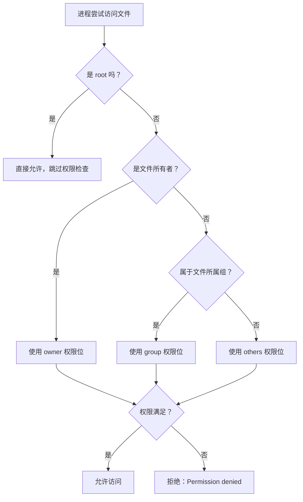
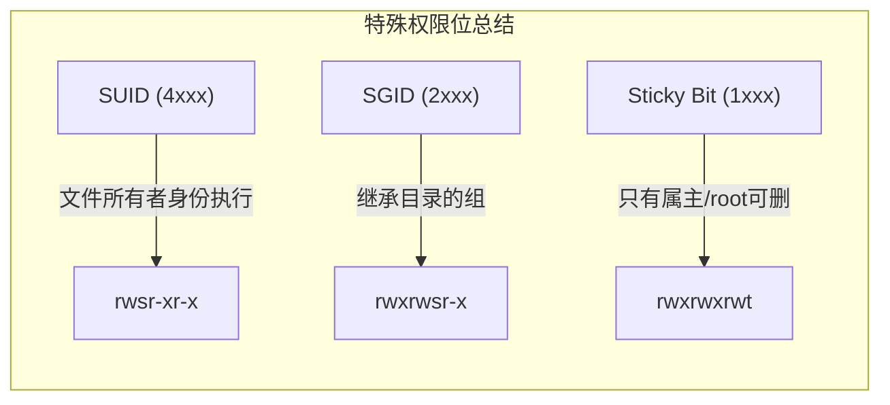
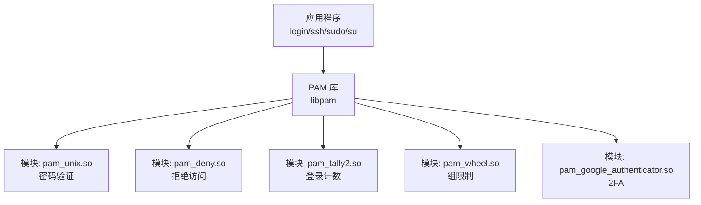

## 四、用户与权限模型

Linux 的安全基石是**一切皆文件**的哲学与**最小权限原则**的结合。每个文件、目录、设备、进程都归属于某个用户，每个用户都从属于某个组，系统通过精确的权限位控制谁可以做什么。理解这套模型，既是系统管理的基本功，也是安全攻防的必修课——绝大多数权限提升攻击的本质，都是对这套模型的利用或绕过。

### 4.1 用户和组

#### 4.1.1 用户身份体系

Linux 是多用户操作系统。每个用户有一个唯一的 **UID**（User Identifier），每个组有一个唯一的 **GID**（Group Identifier）。内核只认 UID/GID 数字，用户名只是给人类看的映射。

三类用户账户：

| 类型 | UID 范围 | 用途 | 能否登录 | 典型 Shell |
|------|----------|------|----------|------------|
| root 超级用户 | 0 | 系统管理，拥有全部权限 | 是 | /bin/bash |
| 系统用户（服务账户） | 1-999（各发行版略有差异） | 运行守护进程和服务 | 通常否 | /usr/sbin/nologin 或 /bin/false |
| 普通用户 | 1000-60000 | 日常操作 | 是 | /bin/bash 或 /bin/sh |

**安全视角**：攻击者获得初始立足点后，通常需要从普通用户（或系统用户）提升到 root。UID 0 是唯一的特权标识——没有"半个 root"的概念（Linux Capabilities 除外，见 4.7 节）。

#### 4.1.2 核心配置文件

**`/etc/passwd`** —— 用户基础信息（全局可读）：

```text
root:x:0:0:root:/root:/bin/bash
alice:x:1001:1001:Alice Chen:/home/alice:/bin/bash
nginx:x:999:999:Nginx web server:/var/lib/nginx:/usr/sbin/nologin
```

字段含义（以冒号分隔，共 7 个字段）：

| 字段 | 含义 | 示例 |
|------|------|------|
| 用户名 | 登录名 | alice |
| 密码占位 | 实际密码在 /etc/shadow 中 | x |
| UID | 用户标识号 | 1001 |
| GID | 主组标识号 | 1001 |
| GECOS | 注释/描述信息 | Alice Chen |
| 主目录 | HOME 路径 | /home/alice |
| 登录 Shell | 登录后执行的程序 | /bin/bash |

> **历史细节**：早期 UNIX 将密码哈希直接存在 passwd 第二字段，这就是为什么 passwd 全局可读（因为 ls 等命令需要查询 UID→用户名映射）。现代系统用 `x` 占位，实际哈希转移到 shadow 文件。

**`/etc/shadow`** —— 密码哈希与策略（仅 root 可读）：

```text
alice:$6$rounds=656000$salt$hashvalue:19876:0:99999:7:::
```

字段含义（共 9 个字段）：

| 字段 | 含义 | 示例 |
|------|------|------|
| 用户名 | 对应 /etc/passwd | alice |
| 密码哈希 | `$算法$salt$hash` | `$6$rounds=656000$...` |
| 最后修改 | 自 1970-01-01 的天数 | 19876 |
| 最小间隔 | 修改密码最短等待天数（0=随时可改） | 0 |
| 最大间隔 | 密码最长有效期（99999=永不过期） | 99999 |
| 警告期 | 过期前提前警告天数 | 7 |
| 不活跃期 | 过期后仍可登录的天数 | 空 |
| 账户失效 | 自 1970-01-01 的天数 | 空 |
| 保留字段 | 未使用 | 空 |

密码哈希格式：`$id$salt$hash`

| 算法 ID | 算法 | 强度 |
|---------|------|------|
| `$1$` | MD5 | 极弱，已被破解 |
| `$5$` | SHA-256 | 可用 |
| `$6$` | SHA-512 | 推荐 |
| `$y$` | yescrypt | 现代默认（新版发行版） |

**`/etc/group`** —— 组信息：

```text
developers:x:1001:alice,bob
docker:x:998:alice
```

字段：组名:密码占位:GID:成员列表（逗号分隔）

**`/etc/gshadow`** —— 组密码（极少使用）：

```text
developers:!::alice,bob
```

组密码允许用户通过 `newgrp` 命令临时切换到非所属组，但实践中几乎不用。

#### 4.1.3 用户管理命令

```bash
# 创建用户
useradd -m -s /bin/bash -G sudo,docker -c "Alice Chen" alice
# -m 创建主目录  -s 指定Shell  -G 附加组  -c 注释

# 更安全的交互式创建
adduser alice          # Debian/Ubuntu 的友好封装

# 修改用户
usermod -aG wheel alice    # 追加附加组（-a 很重要，不加会覆盖）
usermod -s /usr/sbin/nologin alice   # 禁止交互登录
usermod -L alice           # 锁定账户（在密码前加 !）
usermod -U alice           # 解锁账户

# 删除用户
userdel -r alice           # -r 同时删除主目录和邮件池
# 仅删除账户保留文件：
userdel alice

# 修改密码
passwd alice               # 交互设置密码
echo "alice:NewPass123" | chpasswd    # 批量设置（脚本用）
passwd -e alice            # 强制下次登录修改密码
passwd -l alice            # 锁定（等价于 usermod -L）
passwd -u alice            # 解锁
passwd -S alice            # 查看密码状态

# 查看用户信息
id alice                   # uid=1001(alice) gid=1001(alice) groups=...
whoami                     # 当前用户名
w                          # 当前登录用户及其活动
last                       # 登录历史
lastlog                    # 所有用户最后登录时间
```

#### 4.1.4 组管理命令

```bash
# 创建/删除组
groupadd developers
groupadd -g 1500 developers   # 指定 GID
groupdel developers

# 管理组成员
gpasswd -a alice developers   # 添加成员
gpasswd -d alice developers   # 移除成员

# 修改组属性
groupmod -n newname oldname   # 重命名组
groupmod -g 1500 developers   # 修改 GID

# 查看组信息
groups alice                  # alice 的所有组
getent group developers       # 从 NSS 查询组信息
lid developers                # 列出组成员（需安装 libuser）
```

**主组 vs 附加组**：每个用户有且仅有一个主组（创建文件时的默认属组），但可以属于多个附加组。`useradd -G` 设置附加组，`usermod -g` 修改主组。

#### 4.1.5 NSS（名称服务切换）

`/etc/passwd`、`/etc/group` 只是本地文件，但用户信息的实际来源由 **NSS**（Name Service Switch）控制。`/etc/nsswitch.conf` 定义查询顺序：

```yaml
passwd:     files systemd
shadow:     files
group:      files systemd
```

常见数据源：`files`（/etc 下的文件）、`ldap`（LDAP 目录）、`nis`（NIS）、`systemd`（systemd-homed）。安全测试时，如果 LDAP 服务器被入侵，攻击者可以注入恶意用户。

### 4.2 文件权限模型

#### 4.2.1 基础权限位

Linux 使用传统 UNIX 权限模型，每个文件有 **9 个权限位**，分为三组：

```text
-rwxr-xr--  1  alice  developers  4096  Jun 15 10:30  script.sh
│├─┤├─┤├─┤
│ │   │  └── 其他用户（others）：r--（只读）
│ │   └──── 所属组（group）：r-x（读和执行）
│ └──────── 所有者（owner）：rwx（读、写、执行）
└────────── 文件类型：-（普通文件），d（目录），l（符号链接）等
```

每种权限对文件和目录的含义不同：

| 权限 | 对文件 | 对目录 |
|------|--------|--------|
| r（读） | 查看文件内容（cat/less/vim） | 列出目录内容（ls） |
| w（写） | 修改文件内容（编辑/追加/覆盖） | 在目录中创建、删除、重命名文件 |
| x（执行） | 执行文件（./script.sh） | 进入目录（cd）并访问其中文件 |

**关键理解**：目录的 w 权限意味着可以操作目录内的文件名，而不是修改文件内容。目录的 x 权限是访问其下任何文件的前提——即使你知道文件名，没有目录的 x 权限也无法读取它。

#### 4.2.2 数字（八进制）表示法

```bash
r = 4    w = 2    x = 1    无 = 0
```

三组权限各用一个八进制数字表示：

| 权限组合 | 数字 | 含义 |
|----------|------|------|
| `rwxr-xr--` | 754 | 所有者完全控制，组读+执行，其他只读 |
| `rw-r--r--` | 644 | 所有者读写，其他只读（配置文件标准） |
| `rwxr-xr-x` | 755 | 所有者完全控制，其他读+执行（可执行文件标准） |
| `rwx------` | 700 | 仅所有者可访问（私有目录） |
| `rw-------` | 600 | 仅所有者可读写（私钥文件标准） |
| `---------` | 000 | 无任何权限（蜜罐/陷阱文件） |

> **安全实践**：SSH 私钥必须是 600 或更严格，否则 ssh 客户端会拒绝使用。`chmod 600 ~/.ssh/id_rsa`

#### 4.2.3 权限管理命令

```bash
# chmod —— 修改权限
chmod 755 script.sh                    # 数字模式
chmod u+x script.sh                    # 符号模式：给所有者加执行权
chmod go-w config.conf                 # 去掉组和其他的写权限
chmod a+r file.txt                     # 给所有人加读权限
chmod u=rwx,g=rx,o= script.sh         # 精确设置

# 递归修改（慎用！）
chmod -R 644 /var/www/html/            # 递归设置所有文件
chmod -R 755 /var/www/html/            # 递归设置所有目录（文件不应有执行权）
# 更精确的做法：
find /var/www/html -type f -exec chmod 644 {} \;
find /var/www/html -type d -exec chmod 755 {} \;

# chown —— 修改所有者和组
chown alice:developers script.sh       # 同时修改所有者和组
chown alice script.sh                  # 仅修改所有者
chown :developers script.sh            # 仅修改组
chown -R alice:developers /project/    # 递归修改

# chgrp —— 修改组（chown 的子集）
chgrp developers script.sh
```

#### 4.2.4 权限检查算法

当用户尝试访问文件时，内核按以下顺序检查：



**注意**：内核只检查第一个匹配的组（owner → group → others），找到即停止。即使你是文件所有者且 group 权限不包含你，只要 owner 权限允许就能访问。

### 4.3 特殊权限位

#### 4.3.1 SUID（Set User ID）

SUID 设置在**可执行文件**上，效果是：无论谁执行该文件，进程的有效 UID 都是**文件所有者的 UID**。

```bash
# 查看 SUID 文件
ls -l /usr/bin/passwd
# -rwsr-xr-x 1 root root 68208 ... /usr/bin/passwd
#     ^ 注意这里的 s

# 设置 SUID
chmod u+s program
chmod 4755 program          # 4 = SUID 位

# 查找系统中所有 SUID 文件（安全审计必备）
find / -perm -4000 -type f 2>/dev/null
```

**为什么 `/usr/bin/passwd` 需要 SUID**：普通用户需要修改 `/etc/shadow`（仅 root 可读写）来更改自己的密码。passwd 程序设置了 SUID，以 root 身份运行，但内部逻辑确保用户只能修改自己的密码。

**安全风险——SUID 提权**：如果一个 SUID 程序存在漏洞（缓冲区溢出、命令注入、不安全的文件操作），攻击者可以借此以 root 身份执行任意操作。这是 Linux 提权的经典路径之一：

```bash
# GTFOBins 收集了大量可利用 SUID 的程序
# 例如：如果 find 被错误设置了 SUID
find /etc/passwd -exec /bin/sh -p \;
# -p 保持提升后的权限

# Python 同理
python -c 'import os; os.execl("/bin/sh", "sh", "-p")'

# vim/vi
vim -c ':!sh'
```

> **防御要点**：定期审计 SUID/SGID 文件列表，移除不必要的特殊权限位。生产环境中 SUID 文件应该只有系统默认的那几个。

#### 4.3.2 SGID（Set Group ID）

SGID 对文件和目录有不同的效果：

**对可执行文件**：进程的有效 GID 变为文件所属组的 GID（类似 SUID 但针对组）。

**对目录**（更常用的场景）：在该目录下创建的文件**自动继承目录的组**，而不是创建者的主组。

```bash
# 设置目录 SGID
chmod g+s /shared/project/
# 效果：在该目录下创建的文件自动属于 project 组
# 团队协作场景下非常实用

# 数字表示
chmod 2775 /shared/project/   # 2 = SGID 位
```

```bash
# 验证效果
mkdir /tmp/testdir
chgrp developers /tmp/testdir
chmod g+s /tmp testdir

# 以 alice（主组 alice）身份创建文件
touch /tmp/testdir/newfile
ls -l /tmp/testdir/newfile
# -rw-r--r-- 1 alice developers ... newfile
# 注意文件属组是 developers，不是 alice
```

#### 4.3.3 Sticky Bit

Sticky Bit 设置在**目录**上，效果是：目录中的文件**只有文件所有者、目录所有者或 root 才能删除/重命名**。

```bash
# 典型场景：/tmp 目录
ls -ld /tmp
# drwxrwxrwt 15 root root 4096 ... /tmp
#                  ^ 注意这里的 t

# 设置 Sticky Bit
chmod +t /shared/dir
chmod 1777 /shared/dir    # 1 = Sticky Bit
```

**为什么 /tmp 需要 Sticky Bit**：/tmp 对所有人可写（权限 1777），如果去掉 Sticky Bit，任何用户都可以删除 /tmp 中的任何文件，包括其他用户正在使用的临时文件。加上 Sticky Bit 后，用户只能删除自己的文件。



### 4.4 umask：默认权限掩码

#### 4.4.1 umask 的工作原理

创建文件时，系统不会直接使用默认权限，而是从最大权限中**减去 umask 值**：

```bash
# 文件的最大权限：666（不自动加执行权，安全设计）
# 目录的最大权限：777

# 查看当前 umask
umask           # 输出 0022（八进制）
umask -S        # 输出 u=rwx,g=rx,o=rx（符号形式）

# 实际创建的权限：
# 文件：666 - 022 = 644 (rw-r--r--)
# 目录：777 - 022 = 755 (rwxr-xr-x)
```

#### 4.4.2 umask 的安全意义

```bash
# 普通用户的默认 umask：0022
# 创建文件 → 644（组和其他可读）
# 创建目录 → 755（组和其他可进入）

# 更安全的 umask：0027
# 创建文件 → 640（组可读，其他无权限）
# 创建目录 → 750（组可进入，其他无权限）

# 最严格：0077
# 创建文件 → 600（仅所有者）
# 创建目录 → 700（仅所有者）
```

设置 umask：

```bash
# 临时设置（当前会话）
umask 0027

# 持久化设置
# 写入 ~/.bashrc 或 /etc/profile

# 也可以用 umask 命令配合八进制或符号
umask u=rwx,g=rx,o=       # 等价于 0027
```

> **安全建议**：生产服务器上设置 umask 0027，避免新文件默认对"其他用户"可读。处理敏感数据时使用 0077。

### 4.5 sudo 权限委派

#### 4.5.1 为什么需要 sudo

直接使用 root 登录存在多个安全问题：
- 无法审计谁执行了什么操作（所有 root 操作无法区分用户）
- 误操作风险高（一次 `rm -rf /` 就是灾难）
- root 密码共享导致密码泄露面扩大

sudo（Superuser Do）允许**细粒度的权限委派**：

```bash
# 以 root 身份执行命令
sudo systemctl restart nginx

# 以指定用户身份执行
sudo -u postgres psql

# 获取 root shell（交互式，慎用）
sudo -i          # 模拟 root 登录（加载 root 的环境）
sudo -s          # 启动 root shell（保留当前环境）
sudo su -        # 通过 su 切换

# 查看当前用户被授予的 sudo 权限
sudo -l

# 上一次 sudo 认证后，默认 15 分钟内无需再次输入密码
sudo -k          # 立即清除 sudo 缓存
```

#### 4.5.2 sudoers 配置

**永远使用 `visudo` 编辑 `/etc/sudoers`**，它会在保存前检查语法，避免配置错误导致 sudo 不可用：

```bash
visudo             # 编辑 /etc/sudoers
visudo -f /etc/sudoers.d/custom    # 编辑独立配置文件
```

sudoers 文件语法：

```text
# 用户  主机=(目标用户)  命令
# root 用户可以以任何身份在任何主机上执行任何命令
root    ALL=(ALL:ALL) ALL

# wheel 组的成员可以以任何身份执行任何命令
%wheel  ALL=(ALL:ALL) ALL

# alice 可以以 root 身份重启 nginx 和查看日志
alice   ALL=(root) /usr/bin/systemctl restart nginx, /usr/bin/journalctl -u nginx

# bob 可以免密执行 docker 命令
bob     ALL=(root) NOPASSWD: /usr/bin/docker

# 开发组可以重启开发服务器
%developers ALL=(root) NOPASSWD: /usr/bin/systemctl restart dev-*

# 禁止执行危险命令（利用命令别名）
Cmnd_Alias DANGEROUS = /usr/bin/rm -rf /, /bin/rm -rf /, /sbin/shutdown
alice   ALL=(root) ALL, !DANGEROUS
```

#### 4.5.3 sudo 安全配置最佳实践

```bash
# /etc/sudoers.d/hardening —— 推荐的安全加固配置

# 要求 sudo 输入密码（禁用 NOPASSWD 全局）
Defaults    env_reset
Defaults    mail_badpass
Defaults    logfile=/var/log/sudo.log    # 审计日志
Defaults    log_input, log_output        # 记录输入输出
Defaults    timestamp_timeout=5          # 认证缓存 5 分钟（默认 15）
Defaults    passwd_tries=3               # 密码尝试次数

# 限制使用的 Shell
Defaults    secure_path="/usr/local/sbin:/usr/local/bin:/usr/sbin:/usr/bin:/sbin:/bin"

# 禁止 sudo su 或 sudo bash（防止绕过命令限制）
# 在命令别名中排除：
Cmnd_Alias SHELLS = /bin/bash, /bin/sh, /bin/zsh, /usr/bin/python*
alice   ALL=(root) ALL, !SHELLS
```

#### 4.5.4 sudo 日志与审计

```bash
# sudo 日志默认位置
cat /var/log/sudo.log          # 如果配置了 Defaults logfile
journalctl -t sudo             # systemd 日志

# 日志格式示例：
# Jun 15 10:30:15 server alice : TTY=pts/0 ; PWD=/home/alice ;
#   USER=root ; COMMAND=/usr/bin/systemctl restart nginx
```

**安全事件分析**：当发生安全事件时，sudo 日志是追溯操作链的关键证据。确保日志发送到远程 syslog 服务器，防止攻击者本地删除。

### 4.6 ACL（访问控制列表）

#### 4.6.1 为什么需要 ACL

传统权限模型只支持三组权限（owner/group/others），但现实中常有这样的需求：

- 文件属于 alice 的主组，但需要 bob 也能读写，而 charlie 只能读
- bob 不在文件的属组中，也做不到"只给 bob 权限"

ACL 解决了这个问题——可以给**任意用户或组**设置独立的权限。

#### 4.6.2 ACL 操作命令

```bash
# 查看 ACL
getfacl filename

# 输出示例：
# file: filename
# owner: alice
# group: developers
# user::rw-
# user:bob:rw-          ← ACL 条目：bob 有读写权限
# group::r--
# group:testers:r-x     ← ACL 条目：testers 组有读和执行
# mask::rw-             ← ACL 掩码
# other::---

# 设置 ACL
setfacl -m u:bob:rw filename       # 给 bob 用户读写权限
setfacl -m g:testers:rx filename   # 给 testers 组读和执行
setfacl -m o::--- filename         # 其他用户无权限

# 递归设置目录 ACL
setfacl -R -m u:bob:rw /project/

# 设置默认 ACL（新建文件自动继承）
setfacl -d -m u:bob:rw /project/   # /project/ 下新建文件自动给 bob 读写

# 删除 ACL 条目
setfacl -x u:bob filename          # 删除特定用户的 ACL
setfacl -b filename                # 删除所有 ACL

# 备份和恢复 ACL
getfacl -R /project/ > acl_backup.txt
setfacl --restore=acl_backup.txt
```

#### 4.6.3 ACL 掩码（mask）

ACL 掩码是一个上限过滤器，所有 ACL 条目的实际权限 = ACL 条目 & mask。当使用 `chmod` 修改文件的 group 权限时，实际上也会修改 ACL 的 mask：

```bash
setfacl -m u:bob:rwx file.txt
getfacl file.txt
# user:bob:rwx
# mask::rwx

chmod g=rx file.txt                # 这会同时改变 mask
getfacl file.txt
# user:bob:rwx                    # 条目没变
# mask::r-x                       # mask 变了
# effective 权限：bob 的实际权限变成 r-x（rwx & r-x = r-x）
```

> **安全审计要点**：检查 ACL 时注意 `# effective:` 注释——它表示 mask 限制后的实际权限。

#### 4.6.4 查找有 ACL 的文件

```bash
# 查找文件系统中设置了 ACL 的文件
find / -type f -exec getfacl -s {} + 2>/dev/null

# 或者使用 xattr 方法（更快）
find / -type f -xattr acl.* 2>/dev/null

# 检查特定目录
find /etc -type f -exec sh -c 'getfacl -s "$1" 2>/dev/null && echo "$1"' _ {} \;
```

#### 4.6.5 文件系统 ACL 支持

不是所有文件系统都支持 ACL：

| 文件系统 | ACL 支持 | 备注 |
|----------|----------|------|
| ext4 | ✅ 完全支持 | `acl` 挂载选项（通常默认启用） |
| XFS | ✅ 完全支持 | 默认启用 |
| Btrfs | ✅ 完全支持 | 默认启用 |
| tmpfs | ✅ 支持 | 需要内核配置 |
| NFS v3 | ✅ 通过扩展属性 | |
| FAT/exFAT | ❌ 不支持 | 无权限概念 |
| 部分网络挂载 | ⚠️ 可能受限 | 取决于实现 |

```bash
# 检查挂载选项中是否有 acl
mount | grep " / "
# /dev/sda1 on / type ext4 (rw,relatime,errors=remount-ro)

# 确认 ACL 是否可用
touch /tmp/testfile && setfacl -m u:root:r /tmp/testfile && echo "ACL OK"
```

### 4.7 Linux Capabilities（能力机制）

#### 4.7.1 为什么需要 Capabilities

传统的 root 权限是一个"全有或全无"的设计——要么是 UID 0（拥有一切），要么不是。Capabilities 将 root 的超级权限**拆分为独立的能力单元**，允许进程只获得所需的最小权限。

这正是 Android 的安全模型基础——普通应用的 UID 都是普通用户，但可以通过 Capabilities 获得特定的系统能力。

#### 4.7.2 常见 Capabilities

| Capability | 含义 | 典型用途 |
|------------|------|----------|
| `CAP_NET_BIND_SERVICE` | 绑定 1024 以下端口 | Web 服务器监听 80/443 |
| `CAP_NET_RAW` | 使用原始套接字 | ping、抓包工具 |
| `CAP_SYS_PTRACE` | 跟踪其他进程 | strace、调试器 |
| `CAP_DAC_OVERRIDE` | 绕过文件读/写权限检查 | 备份工具 |
| `CAP_DAC_READ_SEARCH` | 绕过文件读和目录搜索权限 | 搜索索引工具 |
| `CAP_CHOWN` | 修改文件所有者 | 文件管理工具 |
| `CAP_SETUID` | 切换进程 UID | su、sudo |
| `CAP_SETGID` | 切换进程 GID | newgrp |
| `CAP_SYS_ADMIN` | 大量管理操作（挂载等） | 容器运行时 |
| `CAP_SYS_MODULE` | 加载/卸载内核模块 | modprobe |
| `CAP_SYS_RAWIO` | 直接 I/O 端口操作 | 硬件驱动 |
| `CAP_KILL` | 发送信号给任意进程 | init 系统 |
| `CAP_SYS_TIME` | 修改系统时钟 | ntpd |

#### 4.7.3 管理 Capabilities

```bash
# 查看文件的 Capabilities
getcap /usr/bin/ping
# /usr/bin/ping = cap_net_raw+ep

# 设置文件 Capabilities
setcap cap_net_bind_service+ep /usr/local/bin/myserver
# +ep = effective + permitted

# 查看进程的 Capabilities
cat /proc/$$/status | grep Cap
# CapInh: 0000000000000000
# CapPrm: 0000000000000000    ← permitted set
# CapEff: 0000000000000000    ← effective set
# CapBnd: 0000003fffffffff    ← bounding set
# CapAmb: 0000000000000000    ← ambient set

# 使用 capsh 解读（更可读）
capsh --print

# 安全审计：查找所有设置了 Capabilities 的文件
find / -type f -exec getcap {} + 2>/dev/null
```

#### 4.7.4 Capability 标志位

每个 capability 有三个标志位：

- **effective (e)**：当前生效的能力。进程执行时，实际检查的是这个集合。
- **permitted (p)**：允许的能力集合。进程可以将 permitted 中的能力提升到 effective。
- **inheritable (i)**：可继承的能力。execve 后子进程可能继承的能力。

```bash
# 给文件设置能力（格式：capability+flags）
setcap cap_net_raw+ep file               # effective + permitted
setcap cap_net_raw+eip file              # 所有三个标志
setcap cap_net_raw=c1 file               # 使用数字表示

# 删除所有能力
setcap -r file
```

**安全意义**：不要给不需要 Capabilities 的二进制文件设置能力。`CAP_SYS_ADMIN` 被称为"新的 root"——它允许的能力太多。容器环境中尤其要严格限制 Capabilities。

### 4.8 文件属性（Extended Attributes）

#### 4.8.1 chattr 和 lsattr

除了标准的 rwx 权限，Linux 还支持**文件属性**（也叫 ext2/3/4 扩展属性），可以锁定文件使其即使 root 也无法轻易修改：

```bash
# 查看文件属性
lsattr filename
# ----i--------e-- filename    （i = immutable）

# 设置属性
chattr +i filename          # 不可变：不能修改、删除、重命名、链接
chattr +a filename          # 只能追加：只能向文件追加内容（适合日志）
chattr +c filename          # 启用压缩
chattr +d filename          # 不被 dump 备份
chattr +s filename          # 安全删除（覆盖内容后再删除）
chattr +u filename          # 删除后保留内容（可恢复）

# 移除属性
chattr -i filename          # 取消不可变
chattr -a filename          # 取消只追加
```

#### 4.8.2 安全应用场景

```bash
# 防止关键配置被篡改（即使 root 密码泄露也能保护）
chattr +i /etc/passwd
chattr +i /etc/shadow
chattr +i /etc/sudoers

# 日志防篡改（只能追加，不能删除或修改历史记录）
chattr +a /var/log/auth.log
chattr +a /var/log/syslog

# 重要：连 root 也无法修改 immutable 文件！
echo "test" >> /etc/passwd          # Operation not permitted
rm /etc/passwd                       # Operation not permitted

# 要修改必须先去掉属性
chattr -i /etc/passwd
echo "test" >> /etc/passwd          # 现在可以了
chattr +i /etc/passwd               # 重新锁定
```

> **攻防视角**：入侵者通常会修改 /etc/passwd 添加后门用户，设置 immutable 属性可以有效防御这一攻击。但入侵者也可能利用 chattr 来锁定恶意文件——安全工具需要能检查和清除属性。

#### 4.8.3 xattr（扩展属性）

文件系统还支持通用的扩展属性（xattr），用于存储安全标签、SELinux 上下文等：

```bash
# 查看扩展属性
getfattr -d filename
# file: filename
# user.comment="Important file"

# 设置扩展属性
setfattr -n user.comment -v "Important file" filename

# 查看 SELinux 上下文（如果启用）
ls -Z /etc/passwd
# system_u:object_r:passwd_file_t:s0 /etc/passwd

# 查看所有扩展属性
getfattr -d -m - filename
```

### 4.9 用户切换与身份管理

#### 4.9.1 su 命令

```bash
# 切换到 root（需要 root 密码）
su -            # 登录式切换（加载 root 的环境，推荐）
su              # 非登录式切换（保留当前环境）

# 切换到指定用户
su - alice      # 切换到 alice（需要 alice 的密码）
su - alice -c "whoami"   # 以 alice 身份执行单条命令

# 从 root 切换到普通用户不需要密码
su - bob        # 如果当前是 root，直接切换
```

#### 4.9.2 su vs sudo 对比

| 特性 | su | sudo |
|------|----|------|
| 需要的密码 | 目标用户的密码 | 当前用户的密码 |
| 权限粒度 | 整个用户切换 | 可精确到单条命令 |
| 审计能力 | 无法区分具体操作 | 记录每条命令 |
| 配置方式 | 需要知道 root 密码 | /etc/sudoers 配置 |
| 推荐场景 | 系统紧急修复 | 日常管理操作 |

> **安全建议**：禁用 root 的 su 切换（`pam_wheel.so` 限制），强制所有管理操作通过 sudo 执行，确保完整的审计轨迹。

#### 4.9.3 禁止 root 直接登录

```bash
# SSH 层面禁止 root 登录
# /etc/ssh/sshd_config
PermitRootLogin no

# 控制台层面（/etc/securetty 为空则禁止所有控制台 root 登录）
> /etc/securetty

# PAM 层面限制 su 到 root
# /etc/pam.d/su
auth required pam_wheel.so use_uid   # 只有 wheel 组成员可以 su 到 root
```

### 4.10 PAM（可插拔认证模块）

#### 4.10.1 PAM 架构

PAM（Pluggable Authentication Modules）是 Linux 的统一认证框架。它将认证逻辑从应用程序中分离出来，通过配置文件控制认证行为。



四种模块类型：

| 类型 | 控制 | 说明 |
|------|------|------|
| auth | 用户身份验证 | 密码、指纹、2FA |
| account | 账户有效性 | 过期、锁定、时间段限制 |
| password | 密码修改 | 密码策略、历史检查 |
| session | 会话管理 | 日志、资源限制、环境变量 |

#### 4.10.2 PAM 配置文件

配置文件位于 `/etc/pam.d/`，每个应用程序一个文件：

```bash
# /etc/pam.d/sshd 示例
# 类型   控制标志   模块路径          [参数]
auth     required   pam_securetty.so
auth     include    common-auth       # 引用公共配置
account  required   pam_nologin.so
account  include    common-account
password include    common-password
session  required   pam_limits.so
session  include    common-session
```

控制标志的含义：

| 标志 | 含义 |
|------|------|
| required | 必须成功，但继续检查后续模块（结果延迟报告） |
| requisite | 必须成功，失败立即终止 |
| sufficient | 成功则立即通过（前提是前面没有 required 失败） |
| optional | 仅在没有其他模块时决定结果 |
| include | 引用其他配置文件 |

#### 4.10.3 PAM 安全加固示例

```bash
# /etc/pam.d/common-password —— 密码策略加固

# 使用 pam_pwquality.so 替代 pam_cracklib.so（现代发行版）
password requisite  pam_pwquality.so retry=3 minlen=12 \
    dcredit=-1 ucredit=-1 ocredit=-1 lcredit=-1 \
    maxrepeat=3 maxclassrepeat=4 \
    reject_username enforce_for_root

# 参数说明：
# minlen=12     最短 12 字符
# dcredit=-1    至少 1 个数字
# ucredit=-1    至少 1 个大写字母
# ocredit=-1    至少 1 个特殊字符
# lcredit=-1    至少 1 个小写字母
# maxrepeat=3   最多连续重复 3 次相同字符
# reject_username  不能包含用户名

# 密码历史（防止重复使用最近的密码）
password required pam_pwhistory.so remember=5 use_authtok

# 加密算法
password required pam_unix.so sha512 shadow nullok rounds=656000
```

```bash
# /etc/pam.d/common-auth —— 认证加固

# 登录失败锁定
auth required pam_faillock.so preauth deny=5 unlock_time=900 fail_interval=900
auth [default=die] pam_faillock.so authfail deny=5 unlock_time=900

# 参数说明：
# deny=5         连续失败 5 次后锁定
# unlock_time=900  锁定 900 秒（15 分钟）
# fail_interval=900  在 900 秒窗口内计算失败次数

# 查看锁定状态
faillock --user alice
# 解除锁定
faillock --user alice --reset
```

### 4.11 SELinux 与 AppArmor 简介

传统的 DAC（自主访问控制）依赖文件权限位，拥有文件所有权的用户可以自由设置权限。强制访问控制（MAC）在此基础上增加了内核级的策略限制。

#### 4.11.1 SELinux（Security-Enhanced Linux）

```bash
# 查看 SELinux 状态
getenforce          # Enforcing / Permissive / Disabled
sestatus            # 详细状态

# 临时切换模式
setenforce 0        # Permissive（只记录不阻止）
setenforce 1        # Enforcing（实际阻止）

# 查看文件的安全上下文
ls -Z /etc/passwd
# system_u:object_r:passwd_file_t:s0

# 查看进程的安全上下文
ps auxZ | grep nginx
# system_u:system_r:httpd_t:s0 nginx ...

# 修改文件上下文
chcon -t httpd_sys_content_t /var/www/html/index.html
# 永久修改（semanage）
semanage fcontext -a -t httpd_sys_content_t "/web(/.*)?"
restorecon -Rv /web/

# SELinux 布尔值（快速开关策略特性）
getsebool -a | grep httpd
setsebool -P httpd_can_network_connect on

# 查看 SELinux 拒绝日志
ausearch -m AVC -ts recent
audit2allow -a          # 自动生成允许规则
```

#### 4.11.2 AppArmor

```bash
# 查看 AppArmor 状态
aa-status

# 配置文件位置
ls /etc/apparmor.d/

# 模式切换
aa-enforce /etc/apparmor.d/usr.sbin.nginx     # 强制模式
aa-complain /etc/apparmor.d/usr.sbin.nginx    # 抱怨模式（仅记录）

# 自动生成配置
aa-genprof /usr/local/bin/myapp
```

| 特性 | SELinux | AppArmor |
|------|---------|----------|
| 默认发行版 | RHEL/CentOS/Fedora | Ubuntu/SUSE/openSUSE |
| 标识方式 | 安全上下文（标签） | 文件路径 |
| 粒度 | 非常细粒度 | 相对简单 |
| 学习曲线 | 陡峭 | 平缓 |
| 开发者 | NSA + Red Hat | Canonical |

### 4.12 安全审计与加固

#### 4.12.1 权限审计检查清单

```bash
# 1. 查找 SUID/SGID 文件
find / -type f \( -perm -4000 -o -perm -2000 \) -exec ls -la {} \; 2>/dev/null

# 2. 查找全局可写的文件（排除 /tmp 等）
find / -xdev -type f -perm -0002 ! -path "/proc/*" ! -path "/sys/*" 2>/dev/null

# 3. 查找无主文件（文件的所有者/组不存在于系统中）
find / -xdev \( -nouser -o -nogroup \) -ls 2>/dev/null

# 4. 查找设置了 Capabilities 的文件
getcap -r / 2>/dev/null

# 5. 查找有 ACL 的文件
find / -type f -exec getfacl -s {} + 2>/dev/null | head -20

# 6. 检查 /etc/passwd 和 /etc/shadow 的权限
ls -la /etc/passwd /etc/shadow /etc/group /etc/gshadow
# 正确权限：
# /etc/passwd: 644 root:root
# /etc/shadow: 640 root:shadow（或 root:root）
# /etc/group:  644 root:root
# /etc/gshadow: 640 root:shadow（或 root:root）

# 7. 检查关键目录的权限
ls -ld /tmp /var/tmp /var/log /etc
# /tmp: 1777 root:root
# /var/tmp: 1777 root:root

# 8. 查找空密码账户
awk -F: '($2 == "" || $2 == "!" || $2 == "*") {print $1, $2}' /etc/shadow

# 9. 查找 UID 0 的非 root 用户
awk -F: '$3 == 0 && $1 != "root" {print $1}' /etc/passwd
```

#### 4.12.2 自动化加固脚本模板

```bash
#!/bin/bash
# linux_permission_hardening.sh —— Linux 权限基线加固脚本

set -euo pipefail

echo "=== Linux 权限加固脚本 ==="
echo "运行时间: $(date)"
echo "运行用户: $(whoami)"
echo ""

# 必须以 root 运行
if [[ $EUID -ne 0 ]]; then
    echo "错误：必须以 root 身份运行"
    exit 1
fi

# 1. 设置关键文件权限
echo "[1/6] 修复关键文件权限..."
chmod 644 /etc/passwd
chmod 640 /etc/shadow
chmod 644 /etc/group
chmod 640 /etc/gshadow
chmod 600 /etc/ssh/sshd_config
echo "  完成"

# 2. 设置关键目录权限
echo "[2/6] 修复关键目录权限..."
chmod 1777 /tmp
chmod 1777 /var/tmp
chmod 750 /root
chmod 755 /home
echo "  完成"

# 3. 设置 umask
echo "[3/6] 设置 umask 0027..."
if ! grep -q "umask 0027" /etc/profile; then
    echo "umask 0027" >> /etc/profile
fi
echo "  完成"

# 4. 移除不必要的 SUID/SGID
echo "[4/6] 审计 SUID/SGID 文件..."
SUID_COUNT=$(find / -type f -perm -4000 2>/dev/null | wc -l)
echo "  发现 $SUID_COUNT 个 SUID 文件"
SGID_COUNT=$(find / -type f -perm -2000 2>/dev/null | wc -l)
echo "  发现 $SGID_COUNT 个 SGID 文件"
echo "  建议手动审查并移除不必要的特殊权限"

# 5. 设置关键文件 immutable
echo "[5/6] 设置关键文件 immutable..."
chattr +i /etc/passwd
chattr +i /etc/shadow
chattr +i /etc/group
chattr +i /etc/gshadow
echo "  完成（修改这些文件前需先 chattr -i）"

# 6. 设置日志追加模式
echo "[6/6] 设置关键日志文件为追加模式..."
for logfile in /var/log/auth.log /var/log/syslog /var/log/kern.log; do
    if [[ -f "$logfile" ]]; then
        chattr +a "$logfile"
        echo "  $logfile -> append-only"
    fi
done

echo ""
echo "=== 加固完成 ==="
echo "注意：immutable 文件需要修改时，先运行 chattr -i <文件>"
```

#### 4.12.3 常见权限配置错误

| 错误 | 风险 | 正确做法 |
|------|------|----------|
| `/etc/shadow` 权限 644 | 任何用户可读密码哈希 | chmod 640 |
| SSH 私钥权限 644 | SSH 拒绝使用（OpenSSH 5.1+） | chmod 600 |
| `/tmp` 权限 777（无 Sticky） | 任何用户可删除其他人的文件 | chmod 1777 |
| Web 目录权限 777 | 任何用户可修改网站文件 | 文件 644，目录 755 |
| 可执行文件权限 777 | 任何用户可替换程序 | chmod 755 |
| SUID 设置在解释型脚本 | 极大提权风险 | 绝不在脚本上设置 SUID |
| sudo NOPASSWD 全开 | 所有用户可免密提权 | 限制具体命令 |
| umask 000 | 新文件对所有人可写 | umask 027 |

### 4.13 进阶：进程的用户上下文

#### 4.13.1 进程的多个 UID

每个进程有三个 UID（实际上是四个）：

| UID | 含义 | 用途 |
|-----|------|------|
| RUID (Real UID) | 启动进程的用户 | 审计：谁启动的？ |
| EUID (Effective UID) | 进程运行时的权限 | 文件访问检查用的是这个 |
| SUID (Saved UID) | 保存的 UID | 用于在 EUID 和原始身份之间切换 |
| FSUID (Filesystem UID) | 文件系统操作的 UID | Linux 特有，通常等于 EUID |

```bash
# 查看进程的 UID
cat /proc/$$/status | grep Uid
# Uid:    1001    1001    1001    1001
#         RUID    EUID    SUID    FSUID

# SUID 程序的工作流程：
# 1. 用户运行 SUID root 程序
# 2. EUID 变为 0（root），RUID 保持为原用户
# 3. 程序可以 seteuid(RUID) 放弃 root 权限
# 4. 需要时 seteuid(0) 重新获得 root 权限
# 这就是为什么 SUID 程序可以"按需提权"
```

#### 4.13.2 setuid()/setgid() 系统调用

```c
#include <unistd.h>

// 设置有效 UID（需要 CAP_SETUID 或当前 EUID 为 0）
int setuid(uid_t uid);
int seteuid(uid_t euid);        // 只设置 EUID
int setreuid(uid_t ruid, uid_t euid);  // 同时设置 RUID 和 EUID
int setresuid(uid_t ruid, uid_t euid, uid_t suid);  // 设置所有三个
```

**安全审计要点**：审查使用 setuid 的程序是否正确地限制了权限范围。很多 SUID 程序的漏洞在于没有及时放弃特权。

#### 4.13.3 名称空间与用户映射

在容器和虚拟化场景中，用户名称空间（User Namespace）允许容器内的 root（UID 0）映射到宿主机的普通用户：

```bash
# 查看当前用户名称空间映射
cat /proc/self/uid_map
#          0       1000          1    （容器内 UID 0 = 宿主 UID 1000）

# unshare 创建用户名称空间
unshare -U bash
# 新 shell 中是 root（UID 0），但在宿主机上是普通用户

# 安全意义：
# - 容器逃逸后，攻击者在宿主机上是普通用户而非 root
# - 但如果容器有 CAP_SYS_ADMIN，仍可能利用内核漏洞提权
```

### 4.14 常见场景与解决方案

#### 4.14.1 场景一：团队共享目录

```bash
# 需求：/project 目录下，developers 组的所有成员都可以读写
# 新建文件自动继承 developers 组

# 创建共享组
groupadd developers

# 创建目录并设置
mkdir -p /project
chown root:developers /project
chmod 2775 /project          # SGID 确保新文件继承组

# umask 设置（在 /etc/profile.d/ 中添加）
echo 'umask 002' > /etc/profile.d/team-umask.sh
```

#### 4.14.2 场景二：Web 服务器权限

```bash
# Web 文件权限最佳实践
chown -R deploy:www-data /var/www/html/
find /var/www/html -type f -exec chmod 640 {} \;    # 文件：owner读写，组读
find /var/www/html -type d -exec chmod 750 {} \;    # 目录：owner完全，组读+执行

# 需要上传目录可写
chown www-data:www-data /var/www/html/uploads/
chmod 750 /var/www/html/uploads/

# PHP/应用日志目录
chown www-data:www-data /var/log/myapp/
chmod 750 /var/log/myapp/
```

#### 4.14.3 场景三：Docker 权限管理

```bash
# 将用户加入 docker 组（获得 Docker root 等价权限）
usermod -aG docker alice

# 安全警告：docker 组等价于 root！
# 更安全的做法：使用 sudo
echo 'alice ALL=(root) NOPASSWD: /usr/bin/docker' > /etc/sudoers.d/docker-alice

# 容器内限制 Capabilities
docker run --cap-drop=ALL --cap-add=NET_BIND_SERVICE myapp

# 使用非 root 用户运行容器
docker run --user 1000:1000 myapp
```

#### 4.14.4 场景四：限制用户在 chroot 环境

```bash
# 创建受限的 chroot 环境
CHROOT=/srv/chroot/user1
mkdir -p $CHROOT/{bin,lib,lib64,etc,home/user1}

# 复制必要的二进制和库
cp /bin/bash $CHROOT/bin/
# 使用 ldd 找到依赖库并复制...

# SSH chroot 配置
# /etc/ssh/sshd_config
Match User user1
    ChrootDirectory /srv/chroot/user1
    ForceCommand /bin/bash
    AllowTcpForwarding no

# 确保 chroot 目录权限正确
chown root:root $CHROOT
chmod 755 $CHROOT
# chroot 根目录必须是 root 所有（OpenSSH 要求）
```

### 4.15 本节小结

用户与权限模型是 Linux 安全的第一道防线，也是安全测试的核心知识领域。关键要点：

**基础层**：理解 UID/GID 机制、三组权限位、数字/符号表示法，能熟练使用 chmod/chown/useradd/usermod 等命令。

**进阶层**：掌握特殊权限位（SUID/SGID/Sticky）的机制和安全影响，理解 ACL 提供的细粒度控制，熟悉 sudo 的精确委派和审计能力。

**高级层**：了解 Linux Capabilities 对 root 权限的拆分，PAM 认证框架的配置，SELinux/AppArmor 的强制访问控制，以及进程 UID 上下文的工作原理。

**攻防视角**：SUID 提权、sudo 配置不当、空密码账户、可写的全局目录、SUID 程序漏洞利用是常见的攻击路径。定期审计权限、最小权限原则、immutable 文件保护是防御的基石。

掌握这套模型，你才能在后续章节中理解为什么某个目录的权限必须是特定值，为什么某个服务以特定用户运行，以及当系统告诉你"Permission denied"时，如何快速定位和解决问题。
