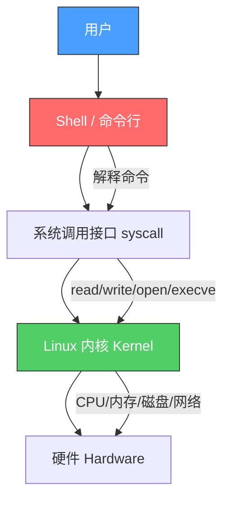
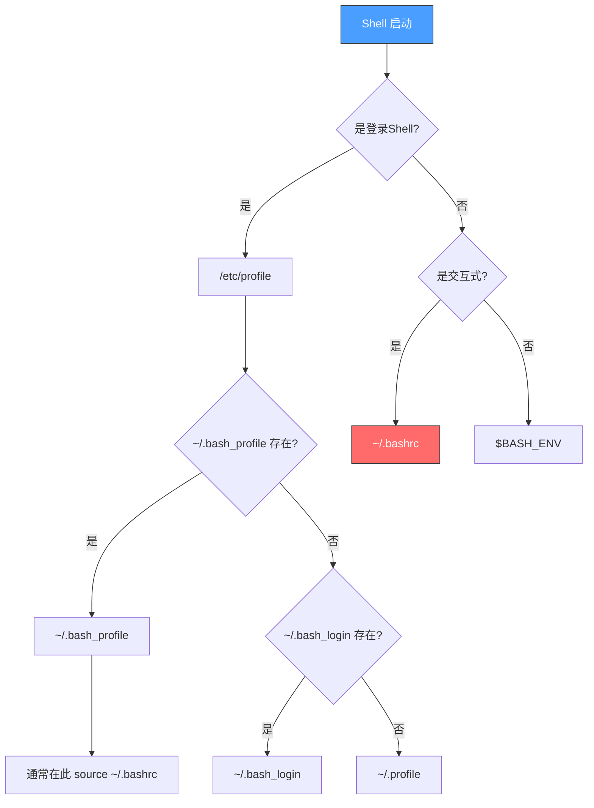
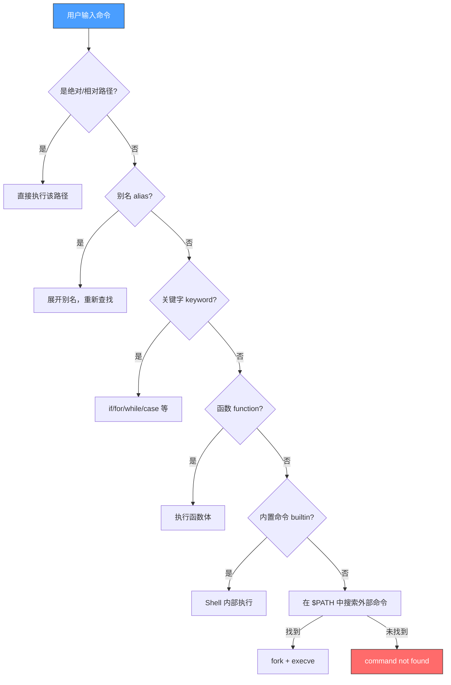

## 五、Shell与命令行

Shell 是用户与操作系统内核之间的桥梁——它接收用户输入的命令，解释并传递给内核执行，再将结果返回给用户。理解 Shell 不仅是使用 Linux 的基础，更是掌握自动化运维、渗透测试脚本编写、系统管理的核心能力。本章从 Shell 的架构原理出发，覆盖主流 Shell 的对比与选型、Bash 的完整语法体系、文本处理工具链、进程管理机制，并提供大量真实场景的脚本示例。

### 5.1 Shell 的本质与架构

#### 5.1.1 Shell 在操作系统中的位置

在 Linux 的分层架构中，Shell 处于用户空间，充当用户与内核之间的翻译层：



用户在终端输入 `ls -la /home` 时，完整执行链路如下：

1. 终端模拟器（如 GNOME Terminal、iTerm2）捕获键盘输入
2. Shell（如 Bash）读取输入行，进行词法分析和展开（expansion）
3. Shell 调用 `fork()` 创建子进程
4. 子进程调用 `execve("/bin/ls", ["ls", "-la", "/home"], env)` 加载程序
5. `ls` 程序通过 `syscall` 读取目录内容
6. 内核返回目录数据，`ls` 格式化后写入标准输出
7. 终端模拟器将输出渲染到屏幕

#### 5.1.2 Shell 的分类

Shell 按功能和设计理念可分为三代：

| 代际 | Shell | 核心特点 | 典型用途 |
|------|-------|---------|---------|
| 第一代 | sh (Bourne Shell) | 语法简洁，POSIX 兼容 | 系统启动脚本、最大可移植性 |
| 第一代 | ash / dash | 极轻量，启动快 | Debian/Ubuntu 的 /bin/sh |
| 第二代 | bash (Bourne Again Shell) | 功能丰富，数组/关联数组/正则 | 交互式使用和脚本编写 |
| 第二代 | ksh (Korn Shell) | 合并 sh 和 csh 优点 | 商业 Unix（AIX/Solaris） |
| 第三代 | zsh (Z Shell) | 强大补全、主题、插件生态 | macOS 默认，开发者首选 |
| 第三代 | fish (Friendly Interactive Shell) | 开箱即用，无需配置 | 新手友好，交互式使用 |

**POSIX 兼容性对比**：

```text
完全兼容 POSIX：sh, dash, bash, ksh, zsh（兼容模式）
部分兼容：fish（刻意不兼容 POSIX，追求更好的交互体验）
```

这意味着：用 POSIX 语法写的脚本可以在 bash/dash/ksh/zsh 上运行，但 fish 脚本无法在其他 Shell 上执行。

#### 5.1.3 登录 Shell 与非登录 Shell

理解两种 Shell 类型对排查环境变量问题至关重要：

| 类型 | 触发方式 | 读取的配置文件（Bash） | 典型场景 |
|------|---------|---------------------|---------|
| 登录 Shell | ssh 登录、`su -`、tty1-6 | /etc/profile → ~/.bash_profile → ~/.bash_login → ~/.profile（按序找到第一个就停） | SSH 远程连接 |
| 非登录 Shell | 图形终端、`su`、脚本执行 | ~/.bashrc | 日常终端操作 |
| 交互式 Shell | 用户手动输入命令 | 读取上述配置文件 + ~/.inputrc | 日常使用 |
| 非交互式 Shell | 脚本执行 (`bash script.sh`) | $BASH_ENV 指定的文件 | 定时任务、脚本 |

**排查技巧**：如果 `ssh user@host` 后某个命令找不到，但手动 `source ~/.bashrc` 后正常，说明该命令的 PATH 设置在 `~/.bashrc` 中，但登录 Shell 只读了 `~/.bash_profile`。解决方法是在 `~/.bash_profile` 末尾加一行：

```bash
[[ -f ~/.bashrc ]] && source ~/.bashrc
```

#### 5.1.4 Shell 的启动配置文件执行顺序（完整图）



### 5.2 主流 Shell 深度对比与选型

#### 5.2.1 Bash —— 事实标准

Bash 是 Linux 生态的"通用语"，几乎每个发行版都预装。它的核心优势在于：

- **POSIX 兼容**：遵循标准，脚本可移植
- **功能丰富**：支持数组、关联数组、正则匹配、进程替换等
- **文档完善**：man bash 超过 5000 行，社区资源极其丰富
- **内置命令多**：`cd`、`echo`、`read`、`declare`、`printf` 等 50+ 内置命令

查看当前 Shell 版本：

```bash
bash --version
# GNU bash, version 5.2.21(1)-release (x86_64-pc-linux-gnu)

echo $BASH_VERSION
# 5.2.21(1)-release
echo $BASH_VERSINFO
# 5 2 21 release x86_64-pc-linux-gnu
```

#### 5.2.2 Zsh —— 开发者利器

Zsh 在 Bash 基础上增加了大量交互增强：

```bash
# 安装 zsh + Oh My Zsh
sudo apt install zsh -y
sh -c "$(curl -fsSL https://raw.githubusercontent.com/ohmyzsh/ohmyzsh/master/tools/install.sh)"
```

Zsh 相比 Bash 的关键差异：

| 特性 | Bash | Zsh |
|------|------|-----|
| 通配符增强 | 基础 glob | `**/*.py` 递归匹配、`*(.)` 仅文件 |
| 补全系统 | 基础 tab 补全 | 菜单式补全、参数提示、路径缩写 |
| 拼写纠正 | 无 | `command not found` 后自动建议正确命令 |
| 主题系统 | 无原生支持 | Oh My Zsh 提供 150+ 主题 |
| 插件生态 | 无原生支持 | 300+ 官方插件 + 社区插件 |
| 数组索引 | 从 0 开始 | 从 1 开始（重要差异！） |
| 关联数组 | bash 4+ 支持 | 原生支持 |

#### 5.2.3 Fish —— 极致用户体验

Fish 开箱即用，无需任何配置即可获得出色的交互体验：

```bash
sudo apt install fish -y
fish  # 进入 fish shell
```

Fish 的设计哲学是"智能默认"：

```fish
# 语法高亮——命令正确显示绿色，错误显示红色（实时）
# 自动补全——基于 man 页面和历史命令
# Web 配置界面
fish_config

# 语法差异示例：Fish 不使用 POSIX 语法
# 变量赋值没有 =
set name "World"
echo "Hello, $name"

# 条件判断语法不同
if test -f /etc/passwd
    echo "文件存在"
end

# 管道依然通用
cat /var/log/syslog | grep error | tail -5
```

**选型建议**：

- **写脚本**：用 Bash（POSIX 兼容，可移植性最好）
- **日常交互**：Zsh + Oh My Zsh（功能丰富，插件生态成熟）
- **新手入门**：Fish（零配置即好用，但语法不兼容 POSIX）
- **系统脚本**：dash（Debian 系的 /bin/sh，启动速度最快）

### 5.3 命令结构与执行机制

#### 5.3.1 命令的完整语法

```bash
命令 [选项...] [参数...]
```

Shell 在执行前会对命令行做多层展开处理，展开顺序至关重要：


这个顺序可以用实际命令验证：

```bash
# 花括号展开（最先执行，不受引号保护）
echo {a,b,c}.txt
# 输出：a.txt b.txt c.txt

# 波浪号展开
echo ~/Documents
# 输出：/home/user/Documents

# 变量展开
name="world"
echo "Hello $name"
# 输出：Hello world

# 命令替换（$() 或反引号）
echo "今天是 $(date +%Y-%m-%d)"
echo "今天是 `date +%Y-%m-%d`"  # 旧语法，不推荐（不支持嵌套）

# 路径名展开（glob，最后执行）
echo *.txt
# 输出：所有 .txt 文件

# 通配符的完整能力
ls *.txt          # 匹配 .txt 结尾的文件
ls file?.log      # 匹配 file1.log, fileA.log 等（单个字符）
ls [abc]*.py      # 匹配 a/b/c 开头的 .py 文件
ls {*.py,*.sh}    # 花括号 + glob 组合
ls *[[:digit:]]*  # POSIX 字符类：包含数字的文件
```

#### 5.3.2 引用与转义

引号是 Shell 中最容易出错的地方。三种引用机制的行为截然不同：

| 引用方式 | 展开行为 | 典型用途 |
|---------|---------|---------|
| 双引号 `""` | 允许 `$var`、`$(cmd)`、`` `cmd` `` 展开，禁止 glob 和词拆分 | 包含变量的字符串 |
| 单引号 `''` | 禁止一切展开，所见即所得 | 原始字符串、正则表达式 |
| 反斜杠 `\` | 转义下一个字符 | 特殊字符转义 |

```bash
name="World"

# 双引号：变量展开
echo "Hello $name"    # Hello World

# 单引号：原样输出
echo 'Hello $name'    # Hello $name

# 反斜杠
echo "Price is \$5"   # Price is $5
echo "Line1\nLine2"   # 不会换行，echo 按字面输出
echo -e "Line1\nLine2" # -e 启用转义解释

# 常见陷阱：路径中有空格
file="my document.txt"
cat $file             # 错误！Shell 将其拆分为 cat my 和 document.txt
cat "$file"           # 正确！双引号防止词拆分

# 常见陷阱：通配符在变量中
pattern="*.txt"
echo $pattern         # 输出 *.txt（不展开，变量赋值时不展开）
ls $pattern           # 列出所有 .txt 文件（在命令上下文中展开）

# 需要逐字保留时用单引号
grep 'error.*[0-9]' logfile.txt
# vs 不安全的写法：
grep error.*[0-9] logfile.txt   # glob 可能先展开
```

#### 5.3.3 内置命令 vs 外部命令

Shell 区分内置命令（由 Shell 自身实现）和外部命令（独立的可执行文件）：

```bash
# 判断命令类型
type cd        # cd is a shell builtin
type ls        # ls is aliased to 'ls --color=auto'
type -a ls     # 显示所有匹配：alias、/bin/ls
type -t ls     # alias（只输出类型）

which ls       # /bin/ls（只找外部命令，不识别内置和 alias）
command -v ls  # 推荐用法，能识别 alias 和外部命令

# 常见内置命令
# cd, echo, read, declare, local, export, unset
# source(.), eval, exec, set, shopt, trap
# test([), printf, type, hash, enable, builtin

# 绕过 alias 使用原始命令
\ls            # 反斜杠前缀
command ls     # command 内置
/bin/ls        # 完整路径

# 绕过函数使用外部命令
enable -n myfunc  # 临时禁用同名函数
```

#### 5.3.4 命令查找顺序

当用户输入一个命令时，Bash 按以下顺序查找：



```bash
# 验证查找顺序
type -a echo
# echo is a shell builtin      ← 内置
# echo is /usr/bin/echo         ← 外部

# 禁用/启用内置命令
enable -n echo   # 禁用 echo 内置，使用外部 /usr/bin/echo
enable echo      # 重新启用内置
```

### 5.4 变量与数据类型

#### 5.4.1 变量基础

Bash 变量是无类型的字符串容器，但通过 `declare` 可以施加类型约束：

```bash
# 赋值（等号两边不能有空格！）
name="Linux"          # 正确
name = "Linux"        # 错误！Shell 会尝试执行 name 命令

# 读取变量
echo $name
echo ${name}          # 推荐写法，边界清晰
echo "${name}_server" # Linux_server

# 只读变量
readonly PI=3.14159
PI=3.14               # bash: PI: readonly variable

# 删除变量（readonly 变量不能删除）
unset name

# 默认值
echo ${undefined_var:-"默认值"}   # 变量未定义或为空时使用默认值
echo ${undefined_var:="默认值"}   # 同上，并将变量赋值为默认值
echo ${undefined_var:?"错误信息"} # 变量未定义或为空时报错退出
echo ${undefined_var:+"替代值"}   # 变量已定义且非空时使用替代值
```

#### 5.4.2 变量类型（declare/typeset）

```bash
declare -i num=10     # 整数类型
num=num+5             # 自动进行算术运算
echo $num             # 15
num="hello"
echo $num             # 0（非数字字符串转换为 0）

declare -r CONST=100  # 只读

declare -a arr        # 索引数组
arr=(apple banana cherry)
echo ${arr[0]}        # apple
echo ${arr[@]}        # 所有元素
echo ${#arr[@]}       # 数组长度：3

declare -A map        # 关联数组（bash 4+）
map[name]="Linux"
map[version]="6.1"
echo ${map[name]}     # Linux
echo ${!map[@]}       # 所有 key：name version

declare -l lower="HELLO"  # 转小写
echo $lower               # hello

declare -u upper="hello"  # 转大写
echo $upper               # HELLO

declare -x exported=1     # 等价于 export

declare -p arr            # 打印变量声明信息
# declare -a arr=([0]="apple" [1]="banana" [2]="cherry")
```

#### 5.4.3 字符串操作

Bash 内置了丰富的字符串操作能力，无需调用外部命令：

```bash
str="Hello World Linux"

# 长度
echo ${#str}                  # 17

# 截取
echo ${str:0:5}               # Hello（从位置0取5个字符）
echo ${str:6}                 # World Linux（从位置6到末尾）
echo ${str: -5}               # Linux（倒数5个字符，冒号后必须有空格）

# 替换
echo ${str/World/Bash}        # Hello Bash Linux（替换第一个）
echo ${str//l/L}              # HeLLo WorLd Linux（替换所有）

# 删除匹配（前缀）
echo ${str#Hello }            # World Linux（最短匹配）
echo ${str#*o}                # World Linux
echo ${str##*o}               # Linux（最长匹配）

# 删除匹配（后缀）
echo ${str% Linux}            # Hello World（最短匹配）
echo ${str% *}                # Hello World
echo ${str%% *}               # Hello（最长匹配）

# 大小写转换（bash 4+）
echo ${str^^}                 # HELLO WORLD LINUX（全部大写）
echo ${str,,}                 # hello world linux（全部小写）
echo ${str^}                  # Hello World Linux（首字母大写）
```

**实战场景：批量重命名文件**

```bash
# 将目录下所有 .jpeg 文件改为 .jpg
for f in *.jpeg; do
    mv "$f" "${f%.jpeg}.jpg"
done

# 将文件名中的空格替换为下划线
for f in *\ *; do
    mv "$f" "${f// /_}"
done

# 提取文件扩展名和文件名
filepath="/home/user/document.tar.gz"
echo "${filepath##*.}"       # gz（最长前缀删除，得到扩展名）
echo "${filepath%.*}"        # /home/user/document.tar（最短后缀删除）
echo "${filepath%%.*}"       # /home/user/document（最长后缀删除）
echo "${filepath##*/}"       # document.tar.gz（basename）
echo "${filepath%/*}"        # /home/user（dirname）
```

### 5.5 I/O 重定向与管道

#### 5.5.1 文件描述符

Linux 中每个进程有三个标准文件描述符：

| 文件描述符 | 名称 | 说明 | 默认目标 |
|-----------|------|------|---------|
| 0 | stdin | 标准输入 | 键盘 |
| 1 | stdout | 标准输出 | 终端 |
| 2 | stderr | 标准错误 | 终端 |

```bash
# 基本重定向
echo "hello" > file.txt        # stdout → file.txt（覆盖）
echo "world" >> file.txt       # stdout → file.txt（追加）
cat < file.txt                 # file.txt → stdin
ls /nonexist 2> error.log      # stderr → error.log
ls /nonexist 2>> error.log     # stderr → error.log（追加）

# 合并 stdout 和 stderr
command > all.log 2>&1         # 经典写法
command &> all.log             # Bash 简写（推荐）
command >& all.log             # 等价写法

# 丢弃输出
command > /dev/null            # 丢弃 stdout
command 2> /dev/null           # 丢弃 stderr
command &> /dev/null           # 丢弃所有输出

# 分别重定向 stdout 和 stderr
command 1> output.log 2> error.log

# 交换 stdout 和 stderr
command 3>&1 1>&2 2>&3

# 自定义文件描述符
exec 3> custom.log             # 打开 fd 3 写入
echo "写入 fd 3" >&3
exec 3>&-                      # 关闭 fd 3

exec 4< input.txt              # 打开 fd 4 读取
read line <&4
exec 4<&-                      # 关闭 fd 4
```

#### 5.5.2 管道与管道链

管道是 Unix 哲学的核心——每个程序做好一件事，通过管道组合：

```bash
# 基本管道：前一个命令的 stdout → 后一个命令的 stdin
cat /var/log/syslog | grep "error" | wc -l

# 多级管道链
ps aux | grep nginx | grep -v grep | awk '{print $2}' | xargs kill

# 管道与重定向的区别
# 管道连接的是进程之间的 stdout→stdin
# 重定向连接的是进程与文件

# 管道中的错误处理
# 默认情况下，管道的返回值是最后一个命令的退出码
false | true; echo $?   # 0（true 的退出码）

# pipefail 选项：任一命令失败则管道失败
set -o pipefail
false | true; echo $?   # 1（false 的退出码）

# tee：同时输出到屏幕和文件
dmesg | tee kernel.log | grep error
# 内容既写入 kernel.log，又传给 grep

# 处理管道中的错误
command 2>&1 | grep error    # 合并 stderr 到 stdout 再管道
```

#### 5.5.3 Here Document 与 Here String

```bash
# Here Document：多行输入
cat <<EOF
第一行
第二行
变量展开：$HOME
命令替换：$(hostname)
EOF

# 不展开变量和命令
cat <<'EOF'
$HOME 不会被展开
$(hostname) 也不会
EOF

# 去除前导制表符（用于脚本中的缩进）
if true; then
    cat <<-EOF
	这一行有制表符前缀，输出时会被去除
	EOF
fi

# Here String：单行输入
grep "error" <<< "this is an error message"
read -r first rest <<< "hello world foo"
echo $first   # hello
echo $rest    # world foo
```

### 5.6 条件判断与流程控制

#### 5.6.1 test 命令与条件表达式

```bash
# test 命令有两种写法
test -f /etc/passwd && echo "存在"
[ -f /etc/passwd ] && echo "存在"     # 等价，注意 [] 内侧必须有空格

# [[ ]] 是 Bash 扩展，比 [ ] 更强大
[[ -f /etc/passwd ]] && echo "存在"
# [[ ]] 支持正则、不需要引号保护变量、支持 && ||

# 文件测试
[ -f file ]     # 普通文件存在
[ -d dir ]      # 目录存在
[ -e path ]     # 路径存在（文件或目录）
[ -r file ]     # 可读
[ -w file ]     # 可写
[ -x file ]     # 可执行
[ -s file ]     # 文件非空（大小 > 0）
[ -L file ]     # 是符号链接
[ -b file ]     # 是块设备
[ -c file ]     # 是字符设备
[ -p file ]     # 是命名管道
[ -S file ]     # 是套接字
[ file1 -nt file2 ]  # file1 比 file2 新
[ file1 -ot file2 ]  # file1 比 file2 旧

# 字符串测试
[ -z "$str" ]        # 字符串为空
[ -n "$str" ]        # 字符串非空
[ "$a" = "$b" ]      # 相等
[ "$a" != "$b" ]     # 不等
[ "$a" \< "$b" ]     # 字典序小于（需要转义 <）

# [[ ]] 特有的模式匹配
[[ "$file" == *.txt ]]       # glob 模式匹配
[[ "$str" =~ ^[0-9]+$ ]]    # 正则匹配
[[ "$str" =~ ^[0-9]+$ ]] && echo "是纯数字"

# 整数比较
[ "$a" -eq "$b" ]    # 等于
[ "$a" -ne "$b" ]    # 不等于
[ "$a" -gt "$b" ]    # 大于
[ "$a" -ge "$b" ]    # 大于等于
[ "$a" -lt "$b" ]    # 小于
[ "$a" -le "$b" ]    # 小于等于

# 逻辑组合
[ cond1 ] && [ cond2 ]        # 与
[ cond1 ] || [ cond2 ]        # 或
[ ! cond ]                    # 非
[[ cond1 && cond2 ]]          # [[ ]] 内可直接用
[[ cond1 || cond2 ]]
```

#### 5.6.2 if/elif/else

```bash
# 基本结构
if [ "$1" = "" ]; then
    echo "用法: $0 <参数>"
    exit 1
elif [ "$1" = "start" ]; then
    echo "启动服务..."
elif [ "$1" = "stop" ]; then
    echo "停止服务..."
else
    echo "未知命令: $1"
    exit 1
fi

# 实战：判断操作系统类型
if [[ -f /etc/debian_version ]]; then
    PKG_MANAGER="apt"
elif [[ -f /etc/redhat-release ]]; then
    PKG_MANAGER="yum"
elif [[ -f /etc/arch-release ]]; then
    PKG_MANAGER="pacman"
else
    echo "不支持的发行版"
    exit 1
fi
echo "包管理器: $PKG_MANAGER"
```

#### 5.6.3 case 语句

```bash
case "$1" in
    start)
        echo "启动..."
        ;;
    stop)
        echo "停止..."
        ;;
    restart)
        echo "重启..."
        ;;
    status)
        echo "状态..."
        ;;
    *)   # 默认分支
        echo "用法: $0 {start|stop|restart|status}"
        exit 1
        ;;
esac

# case 支持 glob 模式
case "$filename" in
    *.tar.gz)  echo "gzip 压缩包" ;;
    *.tar.bz2) echo "bzip2 压缩包" ;;
    *.tar.xz)  echo "xz 压缩包" ;;
    *.zip)     echo "zip 压缩包" ;;
    *.jpg|*.png|*.gif)  echo "图片文件" ;;
    *)         echo "未知类型" ;;
esac
```

#### 5.6.4 循环结构

```bash
# for 循环——列表形式
for user in alice bob charlie; do
    echo "用户: $user"
done

# for 循环——C 风格
for ((i=0; i<10; i++)); do
    echo "计数: $i"
done

# for 循环——序列
for i in {1..100}; do echo $i; done
for i in {0..10..2}; do echo $i; done     # 步长为 2
for i in $(seq 1 2 10); do echo $i; done  # seq 起始 步长 终止

# for 循环——遍历文件
for file in /var/log/*.log; do
    [ -f "$file" ] || continue  # 防止 glob 不匹配时字面展开
    echo "处理: $file ($(du -sh "$file" | cut -f1))"
done

# for 循环——遍历命令输出
for line in $(cat /etc/hosts); do
    echo "字段: $line"
done
# 注意：以上会按空格/换行拆分，更好的做法是用 while read

# while 循环
count=0
while [ $count -lt 5 ]; do
    echo "count: $count"
    ((count++))
done

# while read——逐行读取（推荐方式）
while IFS= read -r line; do
    echo "行: $line"
done < /etc/hosts

# 管道 + while read
ps aux | while IFS= read -r line; do
    echo "$line"
done

# until 循环（条件为假时继续）
until ping -c1 google.com &>/dev/null; do
    echo "等待网络..."
    sleep 1
done
echo "网络已连通"

# select 菜单
echo "选择编辑器:"
select editor in vim nano emacs quit; do
    case $editor in
        quit) break ;;
        *)    echo "你选择了 $editor"; break ;;
    esac
done

# 循环控制
break      # 跳出当前循环
break 2    # 跳出 2 层循环
continue   # 跳过本次迭代
continue 2 # 跳过外层循环的本次迭代
```

### 5.7 函数

#### 5.7.1 函数定义与调用

```bash
# 两种定义方式（推荐第一种）
greet() {
    local name="$1"     # local 限定作用域
    echo "Hello, $name"
}

function greet_v2 {     # 也可以用 function 关键字
    echo "Hello, $1"
}

# 调用
greet "World"

# 参数传递（与脚本参数相同）
demo() {
    echo "函数名: $FUNCNAME"
    echo "参数个数: $#"
    echo "所有参数: $@"
    echo "第一个: $1"
    echo "第二个: $2"
}
demo arg1 arg2 arg3

# 返回值
# 方式 1：return（只能返回 0-255 的整数，通常表示成功/失败）
is_root() {
    [ "$(id -u)" -eq 0 ]
    return $?    # 或直接 return $(id -u)
}

# 方式 2：echo 输出，调用者用命令替换捕获
get_ip() {
    hostname -I | awk '{print $1}'
}
my_ip=$(get_ip)

# 方式 3：通过全局变量（不推荐，但有时不可避免）
declare -g RESULT=""
calculate() {
    RESULT=$(( $1 + $2 ))
}
calculate 3 4
echo $RESULT   # 7

# 实战：带错误处理的函数
safe_download() {
    local url="$1"
    local output="$2"
    local retries="${3:-3}"
    
    for ((i=1; i<=retries; i++)); do
        if curl -fsSL -o "$output" "$url"; then
            echo "下载成功: $output"
            return 0
        fi
        echo "第 $i 次下载失败，等待重试..."
        sleep $((i * 2))
    done
    
    echo "下载失败: $url（已重试 $retries 次）"
    return 1
}
```

#### 5.7.2 递归函数

```bash
# 阶乘
factorial() {
    local n=$1
    if [ "$n" -le 1 ]; then
        echo 1
    else
        local prev=$(factorial $((n - 1)))
        echo $((n * prev))
    fi
}
echo "5! = $(factorial 5)"    # 120

# 递归遍历目录
walk_dir() {
    local dir="$1"
    local indent="${2:-0}"
    
    for entry in "$dir"/*; do
        [ -e "$entry" ] || continue
        printf "%*s%s\n" $indent "" "$(basename "$entry")"
        if [ -d "$entry" ]; then
            walk_dir "$entry" $((indent + 2))
        fi
    done
}
walk_dir /etc 0
```

### 5.8 Shell 脚本工程实践

#### 5.8.1 脚本模板

一个生产级脚本应包含以下结构：

```bash
#!/bin/bash
# =============================================================================
# 脚本名称: deploy.sh
# 描述:     自动化部署脚本
# 用法:     ./deploy.sh [选项] <环境>
# 作者:     Author <author@example.com>
# 版本:     1.0.0
# 创建日期: 2026-06-25
# =============================================================================

set -euo pipefail    # 严格模式
IFS=$'\n\t'          # 安全的内部字段分隔符

# --- 颜色定义 ---
readonly RED='\033[0;31m'
readonly GREEN='\033[0;32m'
readonly YELLOW='\033[1;33m'
readonly NC='\033[0m'  # 无颜色

# --- 日志函数 ---
log_info()  { echo -e "${GREEN}[INFO]${NC}  $(date '+%Y-%m-%d %H:%M:%S') $*"; }
log_warn()  { echo -e "${YELLOW}[WARN]${NC}  $(date '+%Y-%m-%d %H:%M:%S') $*" >&2; }
log_error() { echo -e "${RED}[ERROR]${NC} $(date '+%Y-%m-%d %H:%M:%S') $*" >&2; }

# --- 清理函数 ---
cleanup() {
    local exit_code=$?
    # 清理临时文件等
    [ -d "${TMP_DIR:-}" ] && rm -rf "$TMP_DIR"
    exit $exit_code
}
trap cleanup EXIT INT TERM

# --- 前置检查 ---
check_deps() {
    local missing=()
    for cmd in curl jq git; do
        command -v "$cmd" &>/dev/null || missing+=("$cmd")
    done
    if [ ${#missing[@]} -gt 0 ]; then
        log_error "缺少依赖: ${missing[*]}"
        exit 1
    fi
}

# --- 使用说明 ---
usage() {
    cat <<EOF
用法: $(basename "$0") [选项] <环境>

选项:
    -h, --help      显示帮助
    -v, --verbose   详细输出
    -n, --dry-run   模拟运行

环境:
    dev             开发环境
    staging         预发布环境
    prod            生产环境

示例:
    $(basename "$0") dev
    $(basename "$0") --dry-run prod
EOF
    exit 0
}

# --- 主函数 ---
main() {
    check_deps
    TMP_DIR=$(mktemp -d)
    log_info "临时目录: $TMP_DIR"
    # 主逻辑...
}

# --- 参数解析 ---
while [ $# -gt 0 ]; do
    case "$1" in
        -h|--help)    usage ;;
        -v|--verbose) set -x ;;
        -n|--dry-run) DRY_RUN=1 ;;
        *)            ENV="$1" ;;
    esac
    shift
done

main "$@"
```

#### 5.8.2 set 选项与严格模式

```bash
set -e    # 任何命令失败立即退出（等价于 set -o errexit）
set -u    # 引用未定义变量时报错（等价于 set -o nounset）
set -o pipefail  # 管道中任一命令失败则管道失败
set -x    # 打印每条命令及其展开结果（调试用）

# 推荐的严格模式组合
set -euo pipefail

# 局部临时放松
set +e    # 关闭 errexit，允许命令失败
some_risky_command
result=$?
set -e    # 恢复

# 如果不想整个脚本 set -e，可以用 || 处理特定命令
command_that_may_fail || {
    echo "命令失败，处理错误..."
    exit 1
}

# 安全模式下处理可能为空的变量
# 方式 1：默认值
echo ${undefined:-default}

# 方式 2：将 set -u 局部关闭
set +u
echo $maybe_undefined
set -u
```

#### 5.8.3 信号处理与陷阱

```bash
# trap 捕获信号执行清理
TMPFILE=$(mktemp)
trap "rm -f $TMPFILE" EXIT          # 脚本退出时清理
trap "echo '收到 SIGINT'; exit 1" INT   # Ctrl+C
trap "echo '收到 SIGTERM'; exit 1" TERM  # kill 默认信号

# 实战：优雅关闭后台进程
cleanup() {
    echo "正在停止后台进程..."
    kill $BG_PID 2>/dev/null
    wait $BG_PID 2>/dev/null
    echo "已停止"
}
trap cleanup EXIT INT TERM

some_server &
BG_PID=$!
echo "服务器 PID: $BG_PID"
wait $BG_PID    # 等待后台进程
```

### 5.9 文本处理三剑客

#### 5.9.1 grep —— 模式搜索

```bash
# 基本用法
grep "pattern" file              # 搜索模式
grep -i "pattern" file           # 忽略大小写
grep -r "pattern" /path/         # 递归搜索目录
grep -n "pattern" file           # 显示行号
grep -c "pattern" file           # 统计匹配行数
grep -l "pattern" *.txt          # 只显示包含匹配的文件名
grep -v "pattern" file           # 反选（不匹配的行）
grep -w "word" file              # 全词匹配
grep -A 3 "error" file           # 匹配行及其后 3 行
grep -B 3 "error" file           # 匹配行及其前 3 行
grep -C 3 "error" file           # 匹配行及其前后各 3 行

# 正则表达式
grep -E "pattern" file           # 扩展正则（ERE）
grep -P "pattern" file           # Perl 正则（PCRE，需编译支持）
grep -E "^start|end$" file       # 以 start 开头或 end 结尾
grep -E "[0-9]{1,3}\.[0-9]{1,3}\.[0-9]{1,3}\.[0-9]{1,3}" file  # IP 地址

# 实战场景
grep -rn "TODO\|FIXME\|HACK" src/        # 搜索代码中的标记
grep -r "password" /etc/ --include="*.conf"  # 搜索配置文件中的密码
dmesg | grep -i "error\|fail\|warn"       # 内核日志过滤
journalctl -u nginx | grep "5[0-9][0-9]"  # Nginx 5xx 错误
```

#### 5.9.2 sed —— 流编辑器

```bash
# 基本替换
sed 's/old/new/' file             # 替换每行第一个匹配
sed 's/old/new/g' file            # 替换所有匹配
sed 's/old/new/gi' file           # 忽略大小写
sed -i 's/old/new/g' file         # 原地修改（危险！先备份）
sed -i.bak 's/old/new/g' file    # 原地修改并备份为 file.bak

# 地址限定
sed '3s/old/new/g' file           # 只处理第 3 行
sed '3,5s/old/new/g' file         # 处理第 3-5 行
sed '/pattern/s/old/new/g' file   # 只处理匹配 pattern 的行
sed '/^#/d' file                  # 删除注释行
sed '/^$/d' file                  # 删除空行

# 常用操作
sed '2d' file                     # 删除第 2 行
sed '2,5d' file                   # 删除第 2-5 行
sed '2a\新增行' file               # 在第 2 行后追加
sed '2i\新增行' file               # 在第 2 行前插入
sed -n '5,10p' file               # 打印第 5-10 行

# 分组捕获
sed -E 's/([0-9]+)\.([0-9]+)\.([0-9]+)/v\1.\2.\3/' file
# 1.2.3 → v1.2.3

# 多命令
sed -e 's/foo/bar/g' -e 's/baz/qux/g' file
sed 's/foo/bar/g; s/baz/qux/g' file

# 实战：修改配置文件
sed -i 's/^#\(Port 22\)/\1/' /etc/ssh/sshd_config     # 取消注释
sed -i 's/^PermitRootLogin.*/PermitRootLogin no/' /etc/ssh/sshd_config  # 修改值
sed -i '/^server {/,/^}/s/listen 80/listen 443/' nginx.conf  # 范围替换
```

#### 5.9.3 awk —— 文本处理语言

```bash
# 基本结构：awk 'pattern {action}' file
awk '{print $1}' file             # 打印第一列
awk '{print $1, $3}' file         # 打印第一和第三列
awk -F: '{print $1}' /etc/passwd  # 指定分隔符

# 内置变量
awk '{print NR, NF, $0}' file     # NR=行号, NF=字段数, $0=整行
awk 'BEGIN{FS=":"} {print $1}' /etc/passwd  # BEGIN 在处理前执行
awk '{print $1} END{print "总计:", NR}' file  # END 在处理后执行

# 条件过滤
awk '$3 > 100 {print $1, $3}' data.txt   # 第三列大于 100
awk '/error/ {print}' logfile.txt         # 匹配行
awk '!/comment/ {print}' config.txt       # 不匹配行

# 计算
awk '{sum += $3} END {print "总和:", sum}' data.txt
awk '{sum += $3; count++} END {print "平均:", sum/count}' data.txt

# 格式化输出
awk '{printf "%-20s %10s %8.2f\n", $1, $2, $3}' data.txt

# 实战：统计日志
# 统计 Nginx 访问日志中每个 IP 的请求次数
awk '{print $1}' access.log | sort | uniq -c | sort -rn | head -20

# 统计 HTTP 状态码分布
awk '{print $9}' access.log | sort | uniq -c | sort -rn

# 计算平均响应时间
awk '{sum += $NF; count++} END {printf "平均响应时间: %.3fms\n", sum/count}' access.log

# 条件统计
awk '$9 >= 500 {errors++} {total++} END {printf "错误率: %.2f%%\n", errors/total*100}' access.log
```

#### 5.9.4 文本处理工具箱

除了三剑客，Linux 还有大量专用文本工具：

```bash
# sort——排序
sort file                    # 字典序排序
sort -n file                 # 数值排序
sort -r file                 # 逆序
sort -k2 -t: file            # 按第 2 列排序，分隔符 :
sort -u file                 # 排序并去重

# uniq——去重（输入必须已排序）
sort file | uniq             # 去重
sort file | uniq -c          # 去重并计数
sort file | uniq -d          # 只显示重复行
sort file | uniq -u          # 只显示唯一行

# cut——按列提取
cut -d: -f1,3 /etc/passwd    # 以 : 分隔，取第 1 和 3 列
cut -c1-10 file              # 取每行的第 1-10 个字符

# tr——字符转换
tr 'a-z' 'A-Z' < file        # 小写转大写
tr -d '\r' < file             # 删除回车符（Windows→Linux）
tr -s ' ' < file              # 压缩连续空格为单个
echo "hello" | tr 'el' '12'  # h1llo（逐字符替换）

# column——对齐表格
mount | column -t             # 自动对齐
cat /etc/passwd | column -t -s:

# paste——按列合并
paste file1 file2             # 并排合并两个文件
paste -d, file1 file2         # 用逗号分隔

# tee——分流输出
command | tee file1 file2     # 同时写入多个文件和屏幕

# xargs——构造命令参数
find . -name "*.tmp" | xargs rm           # 删除找到的文件
find . -name "*.tmp" | xargs -I{} mv {} /tmp/  # 占位符
find . -name "*.txt" | xargs -P4 -n1 gzip     # 4 并行压缩

# diff / diff3——比较文件
diff file1 file2              # 逐行比较
diff -u file1 file2           # unified 格式（最常用）
diff -r dir1 dir2             # 递归比较目录

# jq——JSON 处理
curl -s https://api.github.com/users/torvalds | jq '.name, .bio'
echo '{"a":1,"b":2}' | jq '.a + .b'
cat data.json | jq '.items[] | select(.status == "active") | .name'
```

### 5.10 进程管理与作业控制

#### 5.10.1 前台与后台进程

```bash
# 将命令放到后台执行
long_command &

# 将正在运行的前台命令放到后台
# 按 Ctrl+Z 暂停，然后：
bg           # 在后台继续运行
fg           # 调回前台

# 查看后台作业
jobs
# [1]+  Running    long_command &

# 调回特定作业
fg %1        # 调回作业 1
fg %         # 调回最近的作业（等价于 fg %+）

# 不受终端关闭影响的后台运行
nohup long_command &         # 输出写入 nohup.out
nohup long_command > output.log 2>&1 &

# 更现代的方式
setsid long_command &        # 新的会话组
disown %1                    # 将作业从 Shell 的作业表中移除
```

#### 5.10.2 信号机制

```bash
# 查看所有信号
kill -l

# 常用信号
# SIGHUP  (1)  — 终端挂起/重新加载配置
# SIGINT  (2)  — Ctrl+C
# SIGQUIT (3)  — Ctrl+\（产生 core dump）
# SIGKILL (9)  — 强制杀死（不可捕获）
# SIGTERM (15) — 优雅终止（默认信号）
# SIGSTOP (19) — 暂停（不可捕获）
# SIGCONT (18) — 继续
# SIGUSR1 (10) — 用户自定义 1
# SIGUSR2 (12) — 用户自定义 2

# 发送信号
kill PID              # 发送 SIGTERM（默认）
kill -9 PID           # 强制杀死
kill -HUP PID         # 重新加载配置
kill -USR1 $(pidof dd) # 发送 USR1（dd 会打印进度）

# 按名称杀进程
killall nginx          # 杀死所有 nginx 进程
pkill -f "python app"  # 按命令行模式匹配

# trap 在脚本中处理信号
trap 'echo "收到 SIGHUP，重新加载配置..."; reload_config' HUP
trap 'echo "正在退出..."; cleanup; exit 0' INT TERM
trap '' INT             # 忽略 SIGINT（Ctrl+C 无效）
trap - INT              # 恢复默认行为
```

### 5.11 高级特性

#### 5.11.1 子 Shell 与命令替换

```bash
# 圆括号创建子 Shell——环境变量不影响父 Shell
(cd /tmp && ls)    # cd 不影响当前 Shell 的工作目录
echo $PWD          # 仍在原目录

# 命令替换
files=$(ls /tmp)
count=$(wc -l < file.txt)
date_str=$(date +%Y%m%d)

# 进程替换——将命令输出当作文件
diff <(sort file1) <(sort file2)   # 比较两个排序后的文件
while read line; do
    echo "$line"
done < <(some_command)             # 避免子 Shell 中变量丢失问题

# 管道 vs 进程替换——变量作用域
count=0
cat file.txt | while read line; do
    ((count++))
done
echo $count    # 0！（管道创建子 Shell，count 修改不影响父进程）

count=0
while read line; do
    ((count++))
done < file.txt
echo $count    # 正确（重定向不创建子 Shell）
```

#### 5.11.2 算术运算

```bash
# $(( )) 算术展开
echo $((2 + 3))           # 5
echo $((10 / 3))          # 3（整数除法）
echo $((10 % 3))          # 1（取模）
echo $((2 ** 10))         # 1024（幂运算）

# 变量不需要 $
a=10; b=3
echo $((a + b))           # 13
echo $((a++))             # 10（后置自增，返回旧值）
echo $a                   # 11

# let 命令
let "c = a + b"
let "a += 5"

# expr 命令（外部命令，较少使用）
result=$(expr 3 + 4)

# 浮点运算——需要借助外部工具
echo "scale=4; 10/3" | bc          # 3.3333
echo "sqrt(2)" | bc -l             # 1.41421356237309504880
awk 'BEGIN {printf "%.4f\n", 10/3}'  # 3.3333
python3 -c "print(10/3)"            # 3.3333333333333335
```

#### 5.11.3 数组高级操作

```bash
# 索引数组
arr=(apple banana cherry date elderberry)

# 切片
echo ${arr[@]:1:3}        # banana cherry date（从索引1取3个）

# 追加
arr+=(fig grape)

# 删除元素
unset arr[2]               # 删除索引2（cherry）

# 遍历
for item in "${arr[@]}"; do  # 注意：加双引号，保留含空格的元素
    echo "$item"
done

# 关联数组
declare -A config
config[host]="localhost"
config[port]="8080"
config[debug]="true"

# 遍历关联数组
for key in "${!config[@]}"; do
    echo "$key = ${config[$key]}"
done

# 数组转字符串和反过来
str="${arr[*]}"              # 数组→字符串（第一个字符为分隔符）
IFS=',' read -ra new_arr <<< "$str"  # 字符串→数组

# 数组复制
arr2=("${arr[@]}")

# 数组长度
echo ${#arr[@]}              # 元素个数
echo ${#arr[0]}              # 第一个元素的字符长度
```

#### 5.11.4 调试技巧

```bash
# 脚本级调试
bash -x script.sh            # 打印每行命令及展开结果
bash -n script.sh            # 只做语法检查，不执行
bash -v script.sh            # 打印读入的每一行（展开前）

# 块级调试
set -x                       # 开启调试打印
# ... 需要调试的代码 ...
set +x                       # 关闭调试打印

# 函数级调试
trap 'echo "DEBUG: $BASH_COMMAND"' DEBUG  # 每条命令执行前打印

# 使用 shellcheck 静态分析
# 安装：sudo apt install shellcheck
shellcheck script.sh         # 检查常见错误和反模式

# 常见 shellcheck 警告：
# SC2086: 双引号变量防止词拆分
# SC2046: 命令替换加引号
# SC2034: 未使用的变量
# SC2155: declare 和赋值分开写

# 使用 bashdb 调试器（类似 gdb）
bashdb script.sh
# (bashdb) step           # 单步执行
# (bashdb) next           # 下一行
# (bashdb) print $var     # 打印变量
# (bashdb) break 20       # 在第20行设断点
# (bashdb) continue       # 继续执行
```

### 5.12 Shell 安全实践

#### 5.12.1 脚本编写安全规范

```bash
# 1. 始终加引号——防止路径注入和词拆分
rm "$file"                   # 正确
rm $file                     # 危险！文件名含空格时行为异常

# 2. 使用 -- 终止选项解析
rm -- "$file"                # 防止文件名以 - 开头被误解析为选项

# 3. 设置 IFS 防止字段注入
IFS=$' \t\n'                 # 默认值，明确设置

# 4. 临时文件安全
TMPFILE=$(mktemp /tmp/myapp.XXXXXX)  # 随机后缀防竞态
trap "rm -f $TMPFILE" EXIT

# 5. 避免 eval
eval "$user_input"           # 极度危险！可以执行任意命令
# 替代方案：使用 declare 或 printf -v
declare "$var_name=$value"   # 安全赋值
printf -v "$var_name" '%s' "$value"

# 6. 输入验证
validate_port() {
    local port="$1"
    if [[ ! "$port" =~ ^[0-9]+$ ]] || [ "$port" -lt 1 ] || [ "$port" -gt 65535 ]; then
        echo "无效端口: $port"
        return 1
    fi
}

# 7. 检查命令的退出码
if ! command; then
    echo "命令失败"
    exit 1
fi

# 8. 使用绝对路径（在 cron 等非交互环境中）
/usr/bin/find /tmp -name "*.log"
```

#### 5.12.2 Shell 注入防护

```bash
# 危险示例：直接拼接用户输入到命令
user_input="; rm -rf /"
eval "echo $user_input"      # 执行了 rm -rf /！

# 安全方式 1：使用数组
args=("$user_input")
command "${args[@]}"

# 安全方式 2：使用 printf %q 转义
safe_input=$(printf '%q' "$user_input")
eval "echo $safe_input"      # 会被正确转义

# 安全方式 3：使用 -- 并引用
command -- "$user_input"
```

### 5.13 常见误区与最佳实践

#### 5.13.1 高频错误清单

| 错误写法 | 问题 | 正确写法 |
|---------|------|---------|
| `if [ $a = $b ]` | 变量为空时报错 | `if [ "$a" = "$b" ]` 或用 `[[ ]]` |
| `for f in $(ls)` | 文件名含空格时拆分 | `for f in *` |
| `cat file \| grep` | 无用的 cat（UUOC） | `grep pattern file` |
| `echo $var` | 选项解析/转义问题 | `printf '%s\n' "$var"` |
| `rm -rf $dir/` | 变量为空时变成 `rm -rf /` | `rm -rf "$dir/"` 或先检查 |
| `cd $dir; cmd` | cd 失败后仍执行 cmd | `cd "$dir" && cmd` |
| `a = 1` | 等号两边有空格是条件测试 | `a=1` |
| `grep $pattern` | pattern 中的特殊字符被展开 | `grep -F "$pattern"`（固定字符串） |
| `[ $a -eq 1 -a $b -eq 2 ]` | `-a` 在某些 Shell 中不可靠 | `[ $a -eq 1 ] && [ $b -eq 2 ]` |

#### 5.13.2 性能优化

```bash
# 避免在循环中调用外部命令
# 差：每次循环都 fork 一个子进程
for i in $(seq 1 10000); do
    result=$(expr $i \* 2)
done

# 好：使用 Bash 内置算术
for ((i=1; i<=10000; i++)); do
    result=$((i * 2))
done

# 避免不必要的子 Shell
# 差：
cat file | grep pattern

# 好：
grep pattern file

# 减少外部命令调用
# 差：
for file in $(find . -name "*.txt"); do
    wc -l "$file"
done

# 好：
find . -name "*.txt" -exec wc -l {} +

# 或使用 xargs
find . -name "*.txt" -print0 | xargs -0 wc -l

# 使用 builtin 命令避免 alias 干扰
builtin echo "不经过 alias"
```

### 5.14 实战脚本库

#### 5.14.1 系统信息采集脚本

```bash
#!/bin/bash
# 系统信息概览

echo "========== 系统信息 =========="
echo "主机名:     $(hostname)"
echo "内核版本:   $(uname -r)"
echo "发行版:     $(cat /etc/os-release | grep PRETTY_NAME | cut -d'"' -f2)"
echo "运行时间:   $(uptime -p)"
echo "当前用户:   $(whoami) (UID: $(id -u))"

echo ""
echo "========== CPU =========="
echo "型号:       $(lscpu | grep 'Model name' | sed 's/.*:\s*//')"
echo "核心数:     $(nproc)"
echo "负载:       $(cat /proc/loadavg)"

echo ""
echo "========== 内存 =========="
free -h | awk '/Mem/{printf "总计: %s  已用: %s  可用: %s  使用率: %.1f%%\n", $2, $3, $7, $3/$2*100}'

echo ""
echo "========== 磁盘 =========="
df -h / /home /var 2>/dev/null | awk 'NR==1 || /^[^Filesystem]/'

echo ""
echo "========== 网络 =========="
ip -4 addr show | grep inet | grep -v 127.0.0.1 | awk '{print $NF, $2}'

echo ""
echo "========== 进程 Top 5 (CPU) =========="
ps aux --sort=-%cpu | head -6

echo ""
echo "========== 进程 Top 5 (内存) =========="
ps aux --sort=-%mem | head -6
```

#### 5.14.2 批量操作脚本

```bash
#!/bin/bash
# 批量压缩日志文件

LOG_DIR="/var/log/app"
DAYS_KEEP=30
ARCHIVE_DIR="/var/log/archive"

mkdir -p "$ARCHIVE_DIR"

# 查找并压缩超过 N 天的日志
find "$LOG_DIR" -name "*.log" -mtime +$DAYS_KEEP -print0 |
while IFS= read -r -d '' file; do
    archive="$ARCHIVE_DIR/$(basename "$file").$(date +%Y%m%d).gz"
    if gzip -c "$file" > "$archive"; then
        rm -f "$file"
        echo "已归档: $file → $archive"
    else
        echo "归档失败: $file" >&2
    fi
done

# 清理超过 90 天的归档
find "$ARCHIVE_DIR" -name "*.gz" -mtime +90 -delete
echo "清理完成"
```

#### 5.14.3 安全扫描脚本

```bash
#!/bin/bash
# 快速安全检查

echo "===== 安全概览 ====="

echo ""
echo "[1] SUID 文件（可提权风险）:"
find / -perm -4000 -type f 2>/dev/null | head -20

echo ""
echo "[2] 可写的关键目录:"
for dir in /etc /usr/bin /usr/sbin; do
    if [ -w "$dir" ]; then
        echo "  [!] $dir 当前用户可写！"
    fi
done

echo ""
echo "[3] 空密码用户:"
awk -F: '($2 == "" || $2 == "!") {print "  [!] " $1}' /etc/shadow 2>/dev/null

echo ""
echo "[4] 监听端口:"
ss -tlnp 2>/dev/null | awk 'NR>1 {print "  " $4 " (" $6 ")"}'

echo ""
echo "[5] 最近登录失败:"
lastb 2>/dev/null | head -10

echo ""
echo "[6] 可疑 cron 任务:"
for crontab in /var/spool/cron/crontabs/* /etc/crontab /etc/cron.d/*; do
    [ -f "$crontab" ] && echo "  $crontab:" && grep -v '^#' "$crontab" | grep -v '^$' 2>/dev/null
done
```

### 5.15 Shell 环境调优

#### 5.15.1 Bash 配置优化

```bash
# ~/.bashrc 推荐配置

# 历史记录优化
HISTSIZE=10000              # 内存中保留的命令数
HISTFILESIZE=20000           # 历史文件最大行数
HISTCONTROL=ignoreboth      # 忽略重复和以空格开头的命令
HISTTIMEFORMAT="%F %T "     # 带时间戳
HISTIGNORE="ls:cd:pwd:exit" # 忽略特定命令
shopt -s histappend          # 追加而非覆盖历史文件

# Shell 选项
shopt -s cdspell             # 自动纠正 cd 拼写错误
shopt -s checkwinsize        # 窗口大小改变时更新行列数
shopt -s globstar            # 启用 ** 递归通配符
shopt -s nocaseglob          # 文件名匹配忽略大小写

# 有用的 alias
alias ll='ls -alF'
alias la='ls -A'
alias l='ls -CF'
alias grep='grep --color=auto'
alias ..='cd ..'
alias ...='cd ../..'
alias df='df -h'
alias du='du -h'
alias free='free -m'

# 安全 alias
alias rm='rm -i'
alias cp='cp -i'
alias mv='mv -i'

# 自定义提示符（PS1）
# \u=用户 \h=主机 \w=工作目录 \t=时间 \n=换行
PS1='\[\033[01;32m\]\u@\h\[\033[00m\]:\[\033[01;34m\]\w\[\033[00m\]\$ '

# bash-completion（Tab 补全增强）
if [ -f /usr/share/bash-completion/bash_completion ]; then
    . /usr/share/bash-completion/bash_completion
fi
```

#### 5.15.2 inputrc 快捷键配置

```bash
# ~/.inputrc

# 不区分大小写补全
set completion-ignore-case on

# 显示所有匹配（单次 Tab）
set show-all-if-ambiguous on

# 使用颜色显示匹配类型
set colored-stats on

# 自定义快捷键
"\C-p": history-search-backward      # Ctrl+P 搜索历史
"\C-n": history-search-forward       # Ctrl+N 搜索历史
"\C-f": menu-complete                # Ctrl+F 循环补全

# 常用默认快捷键
# Ctrl+A  行首          Ctrl+E  行尾
# Ctrl+U  删除到行首     Ctrl+K  删除到行尾
# Ctrl+W  删除前一个单词  Ctrl+Y  粘贴（yank）
# Ctrl+R  反向搜索历史   Ctrl+G  取消搜索
# Ctrl+L  清屏           Ctrl+C  中断
# Ctrl+D  EOF/退出       Ctrl+Z  暂停
# Alt+B   后退一个单词   Alt+F   前进一个单词
# Alt+D   删除后一个单词  Ctrl+X Ctrl+E  用编辑器编辑当前命令
```

### 5.16 本章小结

Shell 与命令行是 Linux 系统的基石。本章从架构原理出发，覆盖了以下核心知识：

- **Shell 架构**：Shell 在操作系统中的位置、执行链路、配置文件加载顺序
- **Shell 选型**：Bash/Zsh/Fish 的特点与适用场景
- **命令机制**：展开顺序、引用系统、查找优先级
- **变量系统**：类型、作用域、字符串操作、数组操作
- **I/O 模型**：重定向、管道、Here Document
- **流程控制**：条件判断、循环、函数
- **文本处理**：grep/sed/awk 三剑客及工具箱
- **进程管理**：作业控制、信号机制
- **高级特性**：子 Shell、进程替换、算术运算、调试
- **安全实践**：注入防护、输入验证、安全编码规范

掌握 Shell 不仅是"会敲命令"，而是理解操作系统如何解释和执行用户的每一个意图。在后续的渗透测试和安全攻防章节中，Shell 脚本将是自动化工具开发的核心语言。
